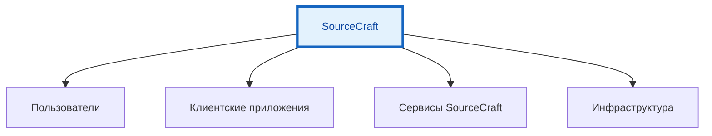

---
title: SourceCraft - отечественная альтернатива Git
tags: [advanced, notrequired, engineer, developer, architector]
---

# SourceCraft - отечественная альтернатива Git

<div class="article-tags">
  <span class="tag tag-inprogress">В РАЗРАБОТКЕ</span>
  <span class="tag tag-advanced">НЕ ДЛЯ НОВИЧКОВ</span>
  <span class="tag tag-notrequired">НЕ ОБЯЗАТЕЛЬНО</span>
</div>
<span class="complexity-badge">Разработчику</span>
<span class="complexity-badge">Архитектору</span>
<span class="complexity-badge">Инженеру</span>

## SourceCraft - отечественная альтернатива Git

## Описание платформы

**SourceCraft** — это облачная платформа для полного цикла разработки, тестирования, сборки и сопровождения программного обеспечения от компании Яндекс B2B Tech. 

Запуск сервиса состоялся в феврале 2025 года как ответ на ограничения использования зарубежных аналогов в условиях меняющегося рынка.

Платформа ориентирована на DevOps-процессы и предоставляет инструментарий для организации эффективного жизненного цикла разработки (SDLC). Работает в виде веб-приложения с поддержкой интеграции в популярные среды разработки.

Основные компоненты архитектуры SourceCraft включают инструменты управления кодом, системы непрерывной интеграции и доставки, встроенные средства искусственного интеллекта для помощи в программировании. Позиционирование сервиса включает создание пространства для безопасной работы с открытым и закрытым исходным кодом российского производителя.

Платформа поддерживает работу репозиториев Git с полным набором операций версионирования. Размещение инфраструктуры внутри страны исключает риски блокировок и обеспечивает стабильную работу для команд из России.

| Характеристика | Значение |
|----------------|----------|
| Дата запуска | Февраль 2025 |
| Производитель | Яндекс B2B Tech |
| Тип платформы | Облачный сервис SaaS |
| Интеграция | VSCode, JetBrains IDE |
| AI-ассистент | Code Assistant |
| Поддержка языков | Более 30 |
| CI/CD | Встроенный пайплайн |
| Хостинг сайтов | SourceCraft Sites |

---

## Архитектура взаимодействия



Компоненты системы взаимодействуют по принципу распределённой архитектуры. Пользователи получают доступ к функционалу через веб-браузер или подключаются к платформе с использованием внешних IDE.

Веб-интерфейс предоставляет полный набор инструментов без необходимости установки дополнительного ПО. Подключение к внешним средам разработки происходит через плагины и расширения.

Интеграция с Yandex Cloud позволяет выполнять деплой приложений автоматически после прохождения всех этапов проверки кода. Это уменьшает количество ручных операций и сокращает время между коммитом и развёртыванием в продакшн.

---

## SourceCraft Code Assistant

**SourceCraft Code Assistant** — это нейросетевой помощник разработчика, встроенный непосредственно в платформу. Ассистент использует модели машинного обучения для анализа контекста кода и генерации рекомендаций.

Функционал инструмента охватывает автоматическое дополнение кода в реальном времени при вводе символов. Система анализирует структуру проекта, определяет шаблоны использования функций и предлагает соответствующие варианты завершения.

### Языки поддержки

Ассистент работает с более чем тридцатью языками программирования. Поддерживаются основные технологии разработки корпоративного уровня.

| Язык | Поддержка | Фичи |
|------|-----------|------|
| Python | Полная | Автодополнение, анализ, документация |
| Go | Полная | Рекомендации по синтаксису |
| Java | Полная | Обработка исключений, коллекций |
| C++ | Полная | Управление памятью, оптимизация |
| Kotlin | Полная | Мультиплатформенная разработка |
| JavaScript | Полная | Frontend и backend контексты |
| TypeScript | Полная | Статическая типизация |
| CSharp | Полная | .NET экосистема |

Пример работы ассистента в файле кода:

```python
def calculate_average(numbers):
    total = 0
    for num in numbers:
        total += num
    average = total / len(numbers) if numbers else 0
    return round(average, 2)

print(calculate_average([10, 20, 30, 40]))
```

Ассистент может предложить альтернативные реализации функции `calculate_average` с использованием встроенных методов языка Python. Система выявляет потенциальные проблемы с делением на ноль при пустой коллекции и предлагает обработку этого случая.

### Режимы работы ассистента

Агентный режим рассматривает задачу как комплексное выполнение цепочки действий для достижения цели пользователя.

| Режим | Описание | Возможности |
|-------|----------|-------------|
| Автодополнение | Подсказки при вводе кода | Быстрая вставка фрагментов |
| Анализ | Проверка качества кода | Выявление проблем стиля |
| Рефакторинг | Улучшение структуры | Оптимизация методов |
| Документация | Генерация описаний | Создание комментариев |

Настройки конфигурации позволяют включать или отключать отдельные функции ассистента в зависимости от потребностей команды.

```yaml
code_assistant:
  enabled: true
  languages:
    - python
    - java
    - go
  auto_complete: true
  security_scan: true
  documentation: true
  refactoring: true
```

---

## Управление кодом и репозитории

**Репозиторий** — это централизованное хранилище для файлов проекта с полной историей изменений. Создание нового репозитория в SourceCraft происходит через веб-интерфейс.

Основные операции с репозиториями включают клонирование, пушинг, паддинг и управление ветками. Поддерживаются все стандартные команды Git для согласования работы в команде.

```bash
# Клонирование репозитория
git clone https://sourcecraft.dev/project/repo.git

# Добавление удалённого источника
git remote add origin https://sourcecraft.dev/user/project.git

# Создание новой ветки
git checkout -b feature/new-feature

# Коммит изменений
git add src/file.py
git commit -m "Добавление новой функциональности обработки данных"

# Пушинг в удалённый репозиторий
git push origin feature/new-feature
```

### Pull Request workflow

Процесс создания запроса на слияние начинается с формирования ветки из основной кодовой базы.

1. Создание новой ветки для функционала;
2. Внесение изменений и создание коммитов;
3. Отправка изменений в удалённый репозиторий;
4. Открытие Pull Request через веб-интерфейс;
5. Назначение ревьюеров и обсуждение изменений;
6. Прохождение проверок CI/CD;
7. Слияние в основную ветку после одобрения.

Каждое изменение требует прохождения процедуры код-ревью. Участники могут оставлять комментарии к конкретным строкам кода. Система отслеживает статус каждого запроса и уведомляет участников о необходимых действиях.

### Правила ревью

| Правило | Описание | Требование |
|---------|----------|------------|
| Размер PR | Максимальное количество строк | ≤ 400 строк |
| Тесты | Наличие покрытия | ≥ 80% покрытие |
| Комментарий | Описание изменений | Обязательно |
| Линты | Прохождение проверок | Без ошибок |
| Кодстайл | Следование стандартам | Единый стиль |

### Импортирование репозиториев

Платформа поддерживает импорт проектов из сторонних систем управления версиями.

```bash
# Инициализация импорта
sc import --from github --url https://github.com/user/repo.git

# Настройка прав доступа
sc permissions set --repo project --access private

# Синхронизация истории
sc sync --history
```

Этот процесс включает миграцию всей истории коммитов, тикетов и pull request'ов из внешнего репозитория.

---

## CI/CD пайплайны

**Непрерывная интеграция и доставка** — это практика автоматизации процессов разработки программного обеспечения. Платформа SourceCraft CI/CD обеспечивает построение конвейеров сборки через YAML конфиги.

Конфигурационные файлы пишутся в формате `.sourcecraft/ci.yml` внутри репозитория. Каждый файл определяет этапы сборки, тестирования и развёртывания приложения.

```yaml
stages:
  - lint
  - build
  - test
  - deploy

lint:
  stage: lint
  script:
    - npm run lint
    - python -m flake8 .
  artifacts:
    reports:
      coverage_report: coverage.xml
  only:
    - main
    - develop

build:
  stage: build
  image: node:18-alpine
  script:
    - npm install
    - npm run build
  artifacts:
    paths:
      - dist/
    expire_in: 7 days

test:
  stage: test
  image: node:18-alpine
  script:
    - npm test
  coverage: '/Test Result.*([0-9]{1,3})%/'
  rules:
    - if: $CI_COMMIT_BRANCH == "main"
    - if: $CI_COMMIT_BRANCH =~ /^release\/.*/

deploy:
  stage: deploy
  image: alpine:latest
  script:
    - cp dist/* /var/www/html/
  environment:
    name: production
    url: https://example.com
  only:
    - main
    - tags
```

### Runners и агенты исполнения

Runners представляют собой исполняющие агенты, которые обрабатывают задачи пайплайнов. SourceCraft поддерживает организацию собственных runners для повышения производительности.

Команда регистрации runner выглядит следующим образом:

```bash
# Получение токена для регистрации
curl -X POST https://sourcecraft.dev/api/v1/runners/token \
  -H "Authorization: Bearer YOUR_TOKEN" \
  -o runner-token.txt

# Регистрация runner
./run.sh register --url https://sourcecraft.dev \
  --token $(cat runner-token-token.txt) \
  --name my-runner-01 \
  --executor docker \
  --environment "docker:v20"
```

Конфигурация runner может включать ограничения по CPU, памяти, дисковому пространству и количеству одновременных задач.

---

## Безопасность SecOps

**SecOps** — набор инструментов для обеспечения безопасности кода и инфраструктуры. Платформа включает встроенные сканеры уязвимостей и средств защиты данных.

Основные механизмы безопасности включают шифрование данных при передаче по протоколам HTTPS/TLS и защиту от несанкционированного доступа к репозиториям.

### Методы проверки

| Тип проверки | Описание | Результат |
|--------------|----------|-----------|
| Секреты в коде | Обнаружение паролей и ключей | Предупреждение |
| Уязвимости зависимостей | Поиск известных багов | Блокировка слияния |
| SQL инъекции | Анализ запросов к БД | Автоматический фидбек |
| XSS атаки | Проверка вывода данных | Рекомендации по исправлению |

### Aутентификация и авторизация

Поддержка SSO обеспечивает единый вход для всех членов команды через корпоративные провайдеры идентификации.

```yaml
security:
  sso:
    enabled: true
    provider: azure_ad
    domains:
      - company.ru
  mfa:
    required: true
    methods:
      - token
      - sms
  api_keys:
    rotation_days: 90
```

Логирование всех действий пользователей позволяет отслеживать изменения и идентифицировать подозрительную активность. Регулярное обновление компонентов безопасности защищает от новых угроз.

### Резервное копирование

Платформа предоставляет возможность экспорта данных и создания резервных копий проектов. Администраторы могут выгрузить информацию в форматах JSON, CSV, XML или создать бэкапы в архивах.

```bash
# Создание резервной копии
sc backup create --project project --output backup.tar.gz

# Восстановление из бэкапа
sc backup restore --file backup.tar.gz --project project
```

---

## Интеграция с IDE

**Интеграция со средой разработки** — функция для подключения популярных IDE к платформе SourceCraft. Поддерживаются VSCode и продукты семейства JetBrains.

Расширения устанавливаются через магазины соответствующих платформ. После активации пользователь получает доступ ко всем функциям SourceCraft прямо внутри редактора кода.

### Расширение для VSCode

```json
// package.json
{
  "name": "sourcecraft-vscode",
  "version": "1.0.0",
  "engines": {
    "vscode": "^1.75.0"
  },
  "activationEvents": [
    "onLanguage:python",
    "onLanguage:javascript"
  ],
  "contributes": {
    "commands": [
      {
        "command": "sourcecraft.sync",
        "title": "Sync to SourceCraft"
      }
    ]
  }
}
```

### Расширение для JetBrains

Интеграция через плагин marketplace. Позволяет создавать проекты, добавлять переменные окружения и управлять ветками.

### Настройка соединения

```yaml
ide_config:
  platform_url: https://sourcecraft.dev
  authentication: oauth2
  auto_push: true
  notify_changes: true
```

Пользователь получает уведомления о событиях в проекте прямо в интерфейсе IDE. Возможность работы offline с последующей синхронизацией повышает мобильность команды.

---

## SourceCraft Sites

**SourceCraft Sites** — инструмент для публикации статических сайтов из репозиториев. Это позволяет командам быстро создавать документацию, лендинги и другие ресурсы для своих проектов.

Процесс публикации включает размещение файлов сайта в специальной директории и деплой по команде git push в основную ветку.

Пример структуры проекта для SourceCraft Sites:

```markdown
website/
├── _site/          # Готовый сайт после сборки
├── docs/           # Документы проекта
├── assets/         # Изображения, стили, скрипты
├── index.html      # Главная страница
├── config.md       # Конфигурация страницы
└── .gitignore      # Игнорируемые файлы
```

Параметры конфигурации включают настройку домена, темы оформления, метаданные и другие опции публикации.

---

## Сравнение с конкурентами

| Характеристика | SourceCraft | GitLab | GitHub | Bitbucket |
|-----------------|-------------|--------|--------|-----------|
| Локализация | Российская | Международная | Международная | Австралийская |
| AI-ассистент | Code Assistant | Mergify | Copilot | Smart Compose |
| IDE поддержка | VSCode, JetBrains | Все | Основные | Стандартные |
| CI/CD | Нативный | Native | Actions | Pipelines |
| Стоимость | Freemium | Open Core | Freemium | Free/Paid |
| Размещение | Россия | Мир/Европа | Мир | Мир |

Платформа отличается полной русскоязычной поддержкой и отсутствием рисков блокировок для отечественных разработчиков. Весь интерфейс выполнен на русском языке.

---