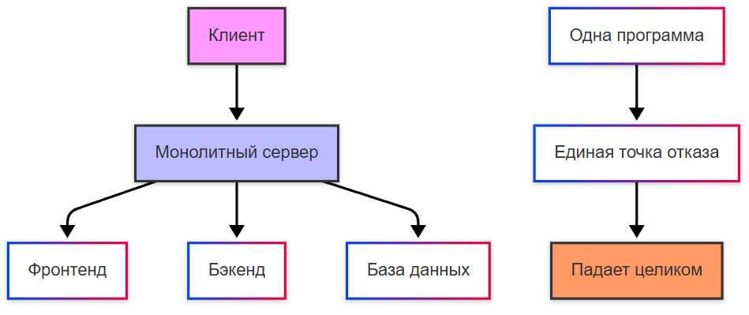

---
title: Архитектура микросервисов (MSA) и распределённые системы
---

# Архитектура микросервисов (MSA) и распределённые системы

  В РАЗРАБОТКЕ
  НЕ ДЛЯ НОВИЧКОВ
  НЕ ОБЯЗАТЕЛЬНО

Разработчику
Архитектору
Инженеру

## Распределение и MSA

### Распределённая система

**Распределённая система** — это совокупность независимых компонентов (серверов, узлов, микросервисов), которые взаимодействуют друг с другом через сеть для выполнения общей задачи. 

Эти компоненты могут находиться в разных физических местах, но для конечного пользователя система выглядит как единое целое. Распределёнными могут быть микросервисы, базы данных NoSQL и CDN (Content Delivery Networks).

Зачастую приложение поначалу бывает монолитным. Пример - работа новичка, который только изучил язык программирования и написал простенькое приложение, оформив его в едином проекте. У приложения куча функций, но если одна из функций сбоит - падает всё приложение. И только после этого возникает идея распределения этой системы по компонентам, развернув их как два независимых приложения, которые друг с другом взаимодействуют, что представляет собой более продвинутую технологию.

---

### Монолитное приложение

**Монолитное приложение (Monolith)** — это традиционная архитектура программного обеспечения, в которой все компоненты системы (бизнес-логика, пользовательский интерфейс, база данных и т.д.) объединены в единый исполняемый модуль или кодовую базу. Кодовая база, как правило, единая, все функциональные модули находятся в одном проекте и разворачиваются как единое целое. Обычно используется одна база данных для всех компонентов системы, а для обновления любой части системы требуется пересобрать и перезапустить всё приложение.

---

## Масштабирование систем

### Подходы к масштабирование

Какие бывают подходы к масштабированию?

1. **Микросервисная архитектура** подразумевает, что каждый микросервис масштабируется независимо от других. Например, если сервис авторизации испытывает большую нагрузку, вы можете добавить больше экземпляров именно этого сервиса, не затрагивая другие части системы. Такой подход позволяет эффективно использовать ресурсы и оптимизировать производительность.
2. **Шардирование (Sharding)** включает в себя распределение данных на независимые части (шарды), которые хранятся на разных серверах. Например, пользователи могут быть разделены по регионам или ID. Это помогает уменьшить нагрузку на одну базу данных и ускорить доступ к данным.
3. **Кэширование** заключается в использовании кэша (например, Redis, Memcached) для хранения часто запрашиваемых данных. Это снижает нагрузку на базу данных и ускоряет обработку запросов.
4. **Асинхронная обработка** позволяет распределить нагрузку во времени и предотвратить перегрузку системы. Задачи, которые не требуют немедленного выполнения, передаются в очередь (например, RabbitMQ, Kafka).
5. **Облачные решения** - более простой и подход, подразумевающий использование облачных платформ (AWS, Google Cloud, Azure) для автоматического масштабирования. Облачные провайдеры предлагают инструменты для динамического добавления или удаления ресурсов в зависимости от текущей нагрузки.
6. **Гибридное масштабирование** является комбинацией горизонтального и вертикального подходов. Например, вы можете увеличить мощность одного сервера, а затем добавить дополнительные серверы для распределения нагрузки.

На практике, грамотное масштабирование — это труд администраторов, архитекторов и DevOps-инженеров, которые «потом и кровью» выбивают у начальства ресурсы, а потом настраивают всю систему надлежащим образом. И это является ключевым фактором успеха любой IT-системы, особенно в условиях роста числа пользователей и данных.

---

## Микросервисная архитектура

### Что такое MSA и что такое микросервис?

Поскольку микросервисная архитектура является наиболее востребованной и эффективной, мы поговорим именно о ней.

**Микросервисная архитектура (Microservice Architecture, MSA)** — это подход к проектированию программного обеспечения, при котором система разбивается на множество небольших, слабо связанных сервисов. Каждый сервис отвечает за свою функциональность и взаимодействует с другими через API или сообщения.

**Микросервис** — это небольшой, автономный компонент программного обеспечения, который выполняет одну конкретную бизнес-функцию и работает в собственном процессе. Микросервисы взаимодействуют друг с другом через четко определенные API (например, REST, gRPC, Kafka) или асинхронные сообщения.

Каждый микросервис разрабатывается, развёртывается и масштабируется независимо от других, и решает только одну задачу или группу тесно связанных задач. Например, сервис авторизации, сервис обработки платежей, сервис каталога товаров. У микросервиса может быть своя база данных или хранилище данных, что изолирует его от других сервисов. 

Разные микросервисы могут быть написаны на разных языках программирования и использовать разные технологии (например, один сервис на Java, другой на Python), их можно обновить или заменить, не затрагивая остальную часть системы. Микросервисы часто общаются через асинхронные очереди сообщений (например, Kafka, RabbitMQ), что снижает зависимость между компонентами.

Пример микросервисной архитектуры:

Здесь каждый сервис полностью независим, имеет свою базу данных, язык программирования и API. Сервисы общаются через API Gateway.

**Декомпозиция** — это процесс разделения монолитного приложения на набор микросервисов. Этот процесс требует тщательного анализа бизнес-логики и её структурирования, а также корректного подхода - допустим, декомпозировать по бизнес-функциям или по данным и технологическим требованиям.

---