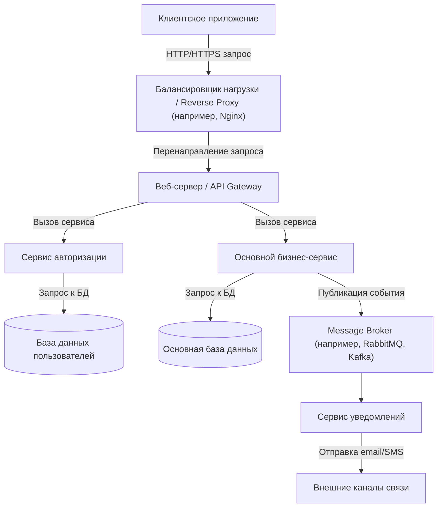
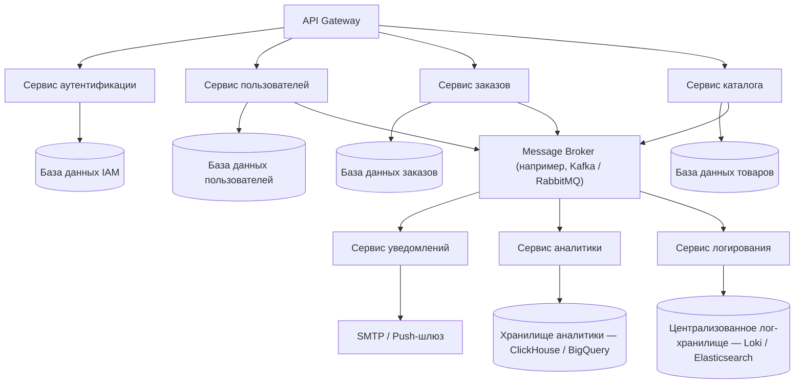
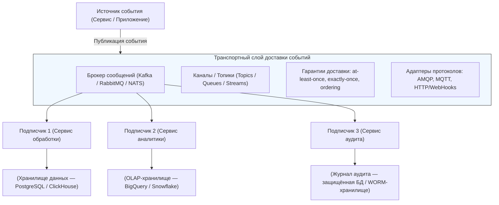
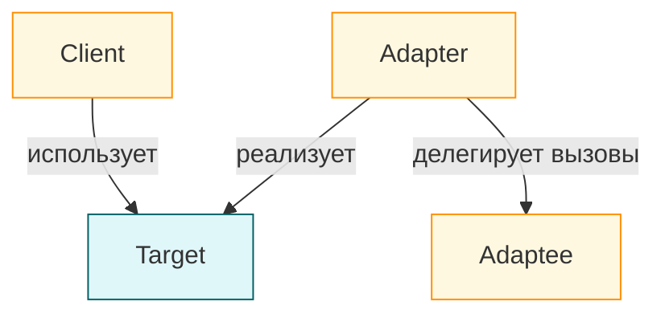
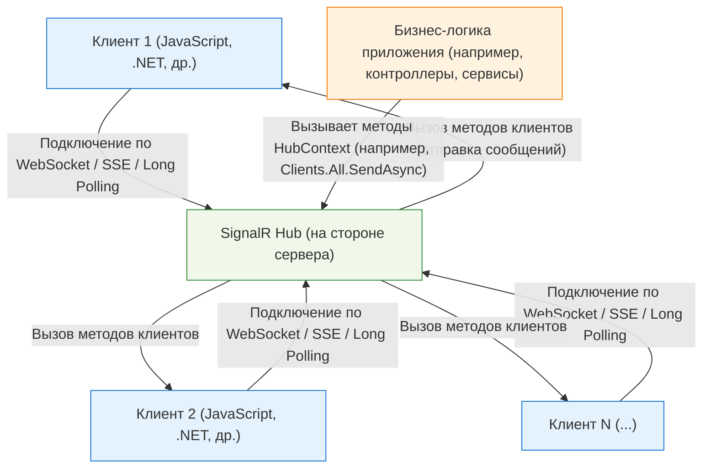

---
title: Транспортные механизмы
---

# Транспортные механизмы

  В РАЗРАБОТКЕ
  НЕ ДЛЯ НОВИЧКОВ
  НЕ ОБЯЗАТЕЛЬНО

Разработчику
Архитектору
Инженеру

## Транспортные механизмы

В современных информационных системах обмен данными между компонентами — это фундаментальная задача. Транспортные механизмы обеспечивают доставку сообщений, событий, команд и состояний между различными частями программного обеспечения: от пользовательского интерфейса до внутренних сервисов, от одного микросервиса к другому, от сервера к клиенту и обратно. Эти механизмы определяют, как данные перемещаются по системе, с какой скоростью, в каком формате, с какими гарантиями и при каких условиях. От правильного выбора транспортного механизма зависит отзывчивость приложения, его масштабируемость, надежность и удобство сопровождения.

---

### Клиентское соединение

**Клиентское соединение** — это канал связи, устанавливаемый между клиентским устройством (браузером, мобильным приложением, настольной программой) и серверной частью системы. Этот канал служит основой для двустороннего или одностороннего обмена данными. Соединение может быть кратковременным, как в случае HTTP-запроса, или долгоживущим, как при использовании WebSocket. Основная цель клиентского соединения — обеспечить своевременную и корректную передачу информации, необходимой для функционирования пользовательского интерфейса и взаимодействия с системой.

- **Клиентское приложение** инициирует соединение.
- Запрос проходит через **обратный прокси или балансировщик**, обеспечивающий маршрутизацию и отказоустойчивость.
- Далее запрос обрабатывается **API-шлюзом или веб-сервером**, который координирует вызовы внутренних сервисов.
- Выделяются **автономные микросервисы**: авторизация и основной бизнес-логики.
- Каждый сервис взаимодействует со своей **базой данных**.
- Асинхронные операции (например, отправка уведомлений) реализуются через **message broker**.

Современные клиентские приложения стремятся к минимальной задержке и максимальной актуальности данных. Это требует не только эффективных протоколов, но и грамотной организации жизненного цикла соединения: от установки и поддержания до восстановления после разрыва и корректного завершения.

---

### Внутренние сервисы систем

Внутри распределённых систем компоненты редко работают изолированно. Микросервисы, фоновые процессы, очереди задач, базы данных и кэши постоянно обмениваются информацией. 

Для этих целей используются **внутренние транспортные механизмы**, часто невидимые конечному пользователю, но критически важные для стабильности всей архитектуры.

- **API Gateway** — единая точка входа для внешних клиентов; маршрутизирует запросы к соответствующим внутренним сервисам.
- **Сервисы домена** (пользователи, заказы, каталог и др.) — реализуют бизнес-логику и работают с собственными изолированными базами данных (принцип *database per service*).
- **Сервис аутентификации** — отвечает за управление сессиями, токенами и проверку прав доступа.
- **Message Broker** — обеспечивает асинхронную коммуникацию между сервисами через события (event-driven architecture).
- Подписчики на события:
  - **Сервис уведомлений** — отправляет email, push-уведомления и т.п.
  - **Сервис аналитики** — агрегирует данные для BI и отчётов.
  - **Сервис логирования** — централизованно собирает и хранит журналы.

Такие механизмы могут включать в себя брокеры сообщений (например, RabbitMQ, Apache Kafka), RPC-фреймворки (gRPC, Thrift), RESTful API между сервисами или даже прямые вызовы через общую память в монолитных приложениях. Выбор конкретного подхода зависит от требований к производительности, согласованности, отказоустойчивости и сложности системы. Внутренняя коммуникация строится на принципах чёткого контракта: каждый сервис знает, какие данные он может отправить, какие ожидать и как реагировать на ошибки.

---

### Транспортный слой для доставки событий

**Событийно-ориентированная архитектура (Event-Driven Architecture)** всё чаще становится основой современных систем. В такой модели компоненты реагируют на события — сигналы о том, что что-то произошло: пользователь зарегистрировлся, заказ оформлен, платеж обработан. 

Транспортный слой для доставки событий отвечает за маршрутизацию этих сигналов от источника к получателям.

- **Источник события** — любой внутренний сервис или внешняя система, генерирующая событие (например, «Заказ создан»).
- **Транспортный слой** включает:
  - **Брокер сообщений** — центральный компонент маршрутизации и буферизации.
  - **Каналы (топики/очереди)** — логические разделители потоков событий.
  - **Гарантии доставки** — свойства, определяющие надёжность и семантику обработки.
  - **Адаптеры протоколов** — обеспечивают совместимость с различными клиентами (IoT-устройства, веб-приложения и др.).
- **Подписчики** — независимые потребители событий, каждый из которых может сохранять данные в соответствующее хранилище.

Этот слой реализуется с помощью шин событий, потоковых платформ или специализированных библиотек. Он обеспечивает асинхронную, декуплированную передачу данных, позволяя системе масштабироваться горизонтально и адаптироваться к изменяющимся нагрузкам. Гарантии доставки («хотя бы один раз», «не более одного раза», «ровно один раз») и порядок событий — ключевые параметры, которые определяют поведение транспортного слоя в событийных системах.

---

### Разделение ответственности

**Разделение ответственности** — это архитектурный принцип, согласно которому каждый компонент системы отвечает за одну конкретную задачу. В контексте транспортных механизмов это означает, что логика передачи данных отделена от бизнес-логики. 

Например, модуль, отвечающий за отправку уведомлений, не должен знать, как именно эти уведомления доставляются — через WebSocket, email или push-сервис. Он просто публикует событие, а транспортный адаптер выбирает подходящий способ доставки.

Такой подход повышает гибкость системы: можно заменить один транспортный механизм на другой без изменения основной логики. Он также упрощает тестирование, так как каждый уровень можно проверять независимо.

---

### Коммуникация и логика

**Коммуникация** в программных системах — это осмысленный обмен информацией, организованный в соответствии с заранее определёнными правилами. 

Логика определяет, *что* должно быть отправлено, *когда* и *кому*. Транспорт определяет, *как* это будет доставлено.

Например, логика может предписывать: «После успешной оплаты отправить событие “платёж_завершён” всем подписанным сервисам». Транспортный механизм решает, использовать ли для этого очередь сообщений с подтверждением получения или широковещательный канал с возможностью повторной отправки. Чёткое разделение этих двух аспектов позволяет системе развиваться без постоянного переписывания ядра при изменении внешних условий.

Современные системы часто работают в изменяющейся среде: новые клиенты подключаются и отключаются, сервисы масштабируются вверх и вниз, сетевые условия колеблются. Транспортные механизмы должны поддерживать динамическую организацию соединений — автоматически обнаруживать доступные узлы, перераспределять нагрузку, восстанавливать разорванные каналы.

Такая динамика особенно важна в облачных и контейнеризованных средах, где инстансы сервисов могут появляться и исчезать в течение секунд. Транспортный уровень здесь выступает как «нервная система», поддерживающая целостность и связность всего организма при постоянных изменениях его состава.

Многоуровневый подход к проектированию транспорта предполагает наличие нескольких абстракций: от физического уровня (TCP/UDP) до прикладного (HTTP, WebSocket, gRPC). 

Каждый уровень решает свою задачу: надёжность, маршрутизация, сериализация, аутентификация, сжатие.

Иерархия позволяет комбинировать технологии в зависимости от потребностей. Например, поверх TCP можно построить собственный протокол для игры с минимальной задержкой, а поверх HTTP — использовать стандартные механизмы кэширования и проксирования для веб-API. Многоуровневость даёт гибкость, стандартизацию и возможность повторного использования компонентов.

---

### Адаптер

**Адаптер** — это программный компонент, который преобразует один интерфейс взаимодействия в другой. В контексте транспорта адаптер позволяет системе использовать разные протоколы и форматы без изменения основной логики. 

Например, один и тот же сервис может предоставлять данные через REST API для внешних клиентов, через gRPC для внутренних микросервисов и через WebSocket для веб-интерфейса. Каждый из этих каналов обслуживается своим адаптером.

Адаптеры также упрощают миграцию: если старый протокол устаревает, достаточно заменить или дополнить адаптер, не затрагивая ядро приложения. Это делает систему устойчивой к технологическим изменениям и совместимой с разнородными окружениями.

---

### Таймаут

**Таймаут** — это временной лимит, в течение которого система ожидает завершения операции. В транспортных механизмах таймауты применяются на всех уровнях: при установке соединения, при ожидании ответа, при чтении данных из потока. Они защищают систему от зависаний, бесконечных ожиданий и накопления необработанных запросов.

Правильно настроенные таймауты повышают устойчивость: если удалённый сервис не отвечает, система может переключиться на резервный, вернуть ошибку пользователю или повторить запрос позже. Таймауты также помогают выявлять проблемы в сети или в работе сервисов, служа индикатором нестабильности.

---

### Активное подключение

**Активное подключение** — это инициатива клиента по установлению канала связи с сервером. Большинство веб-приложений начинают взаимодействие именно так: браузер отправляет HTTP-запрос, мобильное приложение вызывает API. 

Активное подключение даёт клиенту контроль над началом сессии и позволяет серверу аутентифицировать пользователя, проверить права и подготовить ответ.

В некоторых сценариях активное подключение сочетается с последующим переходом на пассивное ожидание (например, при обновлении до WebSocket). Это позволяет объединить безопасность инициализации с эффективностью долгоживущего соединения.

---

### Реактивные паттерны

**Реактивные паттерны** — это набор принципов проектирования систем, ориентированных на асинхронность, потоковую обработку данных и устойчивость к нагрузкам. 

В реактивных системах компоненты не блокируют выполнение, ожидая ответа, а подписываются на потоки событий и реагируют на них по мере поступления.

Транспортные механизмы в таких системах должны поддерживать потоковую передачу, управление обратным давлением (backpressure) и гибкую маршрутизацию. Библиотеки вроде Reactive Streams, RxJS или Project Reactor предоставляют инструменты для реализации этих паттернов. Реактивный подход особенно эффективен в системах с высокой частотой событий: торговых платформах, играх в реальном времени, IoT-сетях.

---

### WebSocket

**WebSocket** — это протокол, обеспечивающий двустороннюю связь поверх TCP через одно持久ное соединение. После начального handshake по HTTP соединение переходит в режим полнодуплексного обмена, где клиент и сервер могут отправлять данные в любое время без необходимости повторной инициализации запроса.

WebSocket идеально подходит для приложений, требующих мгновенной реакции: чатов, онлайн-игр, торговых терминалов, совместных редакторов. Он снижает накладные расходы по сравнению с повторяющимися HTTP-запросами и позволяет серверу инициировать отправку данных без ожидания запроса от клиента.

---

### SignalR

**SignalR** — это библиотека от Microsoft, упрощающая реализацию реального времени в веб-приложениях. Она автоматически выбирает наиболее подходящий транспортный механизм в зависимости от возможностей клиента и сервера: WebSocket, Server-Sent Events, Long Polling. SignalR абстрагирует разработчика от деталей реализации, предоставляя единый API для отправки сообщений между клиентами и сервером.

SignalR особенно популярен в экосистеме .NET, где он глубоко интегрирован с ASP.NET Core. Он поддерживает групповую рассылку, авторизацию, автоматическое восстановление соединений и масштабирование через брокеры сообщений.

---

### Односторонний поток данных от сервера к клиенту

В некоторых сценариях клиенту не нужно отправлять данные на сервер — достаточно получать обновления. Примеры: новостные ленты, биржевые котировки, уведомления о статусе задачи. Для таких случаев подходит односторонний поток данных от сервера к клиенту.

Этот подход снижает сложность и нагрузку: сервер управляет потоком, клиент лишь слушает. Такие механизмы экономичны по ресурсам и легко масштабируются, особенно при использовании кэширования и широковещательной рассылки.

---

### Server-Sent Events (SSE)

**Server-Sent Events** — это стандартный механизм, позволяющий серверу отправлять события клиенту через обычное HTTP-соединение. 

Соединение остаётся открытым, и сервер может передавать текстовые сообщения в формате `data: ...` по мере их появления. SSE работает поверх HTTP, поддерживается большинством браузеров и не требует специальных библиотек на стороне клиента.

SSE прост в реализации и хорошо интегрируется с существующей веб-инфраструктурой. Однако он поддерживает только одностороннюю связь (сервер → клиент) и ограничен текстовыми данными. Для бинарных данных или двустороннего обмена требуется другой подход.

---

### Long Polling

**Long Polling** — это техника эмуляции реального времени поверх HTTP. Клиент отправляет запрос и сервер удерживает его, пока не появятся новые данные. Как только данные готовы, сервер отвечает, и клиент немедленно отправляет новый запрос. Таким образом создаётся иллюзия постоянного соединения.

Long Polling совместим со всеми браузерами и не требует специальной поддержки на уровне сервера. Однако он менее эффективен, чем WebSocket или SSE: каждый запрос создаёт накладные расходы, а задержки между опросами могут снижать отзывчивость. Тем не менее, Long Polling остаётся важным fallback-механизмом в условиях ограничений сети или устаревших клиентов.

---