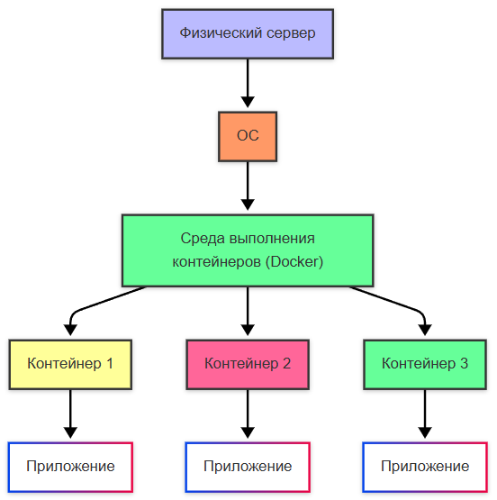

---
title: Контейнеризация
---

# Контейнеризация

  В РАЗРАБОТКЕ
  НЕ ДЛЯ НОВИЧКОВ
  НЕ ОБЯЗАТЕЛЬНО

Разработчику
Архитектору
Инженеру

## Контейнеризация

### Что такое контейнер?

Контейнеризация, процесс развертывания с использованием контейнеров сейчас – важная часть разработки ПО.

★ **Контейнер** – «коробка», в которую упаковали приложение, со всеми нужными компонентами, чтобы просто можно было перенести эту «коробку» и запустить в другой среде. Только представьте, как это упрощает процесс доставки технологий между разными серверами.

Виртуальная машина:
 

Контейнер:

Это продвинутая часть разработки, но и технологии не стоят на месте. Изначально, приложения развёртывались на физических серверах (это традиционный подход, сейчас его тоже можно встретить), когда выделяется один сервер, на нем есть операционная система, набор ресурсов и среда для выполнения со всеми необходимыми компонентами. Но с ресурсами всегда беда – зависимость и дороговизна устройств, необходимость поддержки серверных. Тогда появился подход виртуальных машин, когда более крупные центры обработки данных закупались крупными мощностями и выделяли эти мощности в виде виртуальных машин (ВМ), когда на одном сервере можно было создать эти ВМ, распределять ресурсы между ними. Это подарило гибкость и устойчивость – ВМ проще восстановить, и ей легко добавить ресурсов, да и приложения становятся изолированными. И фактически, сервера стали кластерами ВМ.

Позднее, появились контейнеры – более лёгкие решения, которые тоже обладают своей файловой системой, процессором, памятью и компонентами, используя ресурсы ОС, но дают больше преимуществ:
	- можно легко создать контейнер из образа;
	- простой и быстрый откат образа контейнера;
	- распределение задач во время сборки (то есть ДО развертывания на целевой инфраструктуре);
	- наблюдаемость с информацией и метриками;
	- независимость от платформ, переносимость, и идентичная окружающая среда, независимо – на ПК или в облаке;
	- возможность разбивать микросервисы по приложениям, а не ВМ;
	- большая компактность.

Контейнеры не требуют отдельной операционной системы для каждого экземпляра, в отличие от виртуальных машин, что снижает потребление ресурсов. Запуск и остановка контейнеров происходит быстро - на сервере установлена одна операционная система, которая используется всеми контейнерами.

Сравнение подходов развертывания:

| Критерий | Физические серверы | Виртуальные машины | Контейнеры |
|----------|-------------------|-------------------|------------|
| Изоляция | Физическая | Гипервизор | Операционная |
| Время запуска | Минуты-часы | Минуты | Секунды |
| Использование ресурсов | Высокое | Среднее | Низкое |
| Портативность | Низкая | Средняя | Высокая |
| Масштабируемость | Ограниченная | Хорошая | Отличная |
| Безопасность | Высокая | Высокая | Средняя |

---

## Архитектура и принципы контейнеризации

### Ядро контейнеризации

Контейнеризация основана на использовании возможностей ядра операционной системы, в частности:
- **Пространства имен (namespaces)** - обеспечивают изоляцию процессов, сетевых интерфейсов, точек монтирования и других ресурсов
- **Cgroups (control groups)** - управляют распределением ресурсов между контейнерами
- **Union file systems** - позволяют эффективно создавать слои файловых систем

Каждый контейнер работает в изолированной среде, имея доступ только к своим ресурсам, при этом используя ядро хостовой операционной системы.

Контейнеры позволяют реализовать принцип "сборка один раз, запускай везде", что критически важно для современных методологий разработки и эксплуатации программного обеспечения.

---

### Структура контейнера

Контейнер состоит из нескольких ключевых компонентов:

**Образ контейнера** - неизменяемый шаблон, содержащий:
- Базовую операционную систему
- Необходимые библиотеки и зависимости
- Исходный код приложения
- Конфигурационные файлы

**Слои образа** - образ строится из последовательных слоев:
- Базовый слой ОС
- Слой зависимостей
- Слой приложения
- Конфигурационные слои

**Контейнер** - запущенный экземпляр образа с:
- Изолированным процессом
- Выделенными ресурсами
- Собственной файловой системой
- Сетевым стеком

---

### Жизненный цикл контейнера

1. **Сборка** - создание образа из исходного кода и зависимостей
2. **Регистрация** - сохранение образа в репозитории
3. **Развертывание** - запуск контейнера из образа
4. **Эксплуатация** - работа контейнера в производственной среде
5. **Масштабирование** - создание дополнительных экземпляров
6. **Обновление** - замена старых контейнеров новыми версиями
7. **Очистка** - удаление неиспользуемых контейнеров и образов

---

---