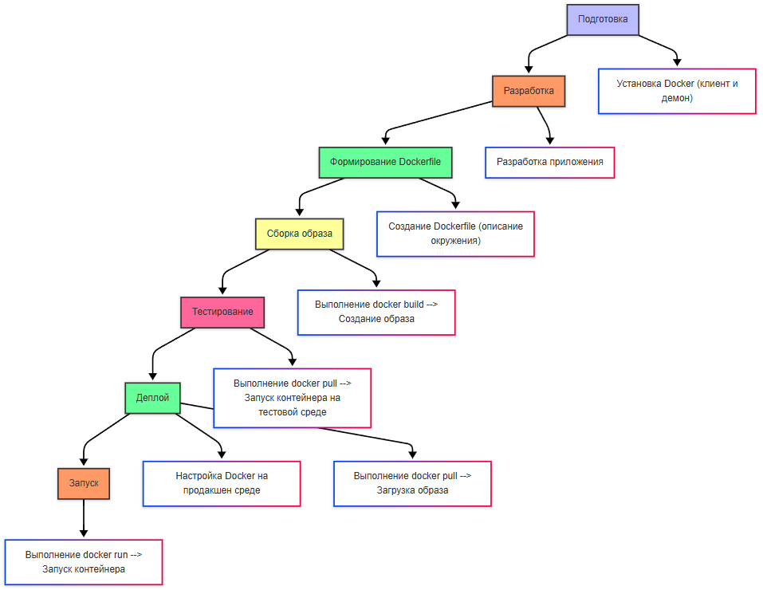
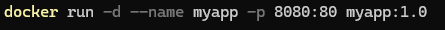

---
title: Docker
---

import DockerEmulator from '@site/src/components/DockerEmulator.jsx';

# Docker

<div class="article-tags">
  <span class="tag tag-inprogress">В РАЗРАБОТКЕ</span>
  <span class="tag tag-advanced">НЕ ДЛЯ НОВИЧКОВ</span>
  <span class="tag tag-notrequired">НЕ ОБЯЗАТЕЛЬНО</span>
</div>
<span class="complexity-badge">Разработчику</span>
<span class="complexity-badge">Архитектору</span>
<span class="complexity-badge">Инженеру</span>

## Docker

### Что такое Docker?

★ **Docker** – платформа для «упаковки» контейнеров, их доставки и запуска. Это фабрика для производства этих «коробок».

Docker имеет модульную архитектуру, состоящую из следующих частей:
	- клиент (Client);
	- хост (Host);
	- оркестратор;
	- реестр (Registry).


---

### Как работать с Docker?

<DockerEmulator />

---

### Компоненты Docker

**Клиент** (Client) - интерфейс для взаимодействия с Docker, выполняющий команды (например, docker build, docker run). Эти команды отправляются в Docker Daemon через REST API;

**Хост** (Host) содержит в себе:
	- Docker Daemon, управляющий образами, контейнерами, сетями и томами;
	- Образы (Images) - шаблоны для создания контейнеров;
	- Контейнеры (Containers) - запущенные экземпляры образом.

**Демон Docker**, или dockerd, это инструмент, который функционирует на системе хоста, и управляет объектами Docker. Он позволяет создавать образы, загружать их или загружать из удалённых репозиториев. Демон используется для создания контейнеров из образов и контролирует их жизненный цикл.

Демон настраивает и управляет сетевым взаимодействием между контейнерами и между контейнерами и хостом, управляет постоянным хранением данных, позволяя удерживать данные контейнеров отдельно от их собственного цикла.

**Образ** — это некий шаблон, который содержит в себе готовый «чертёж» для запуска экземпляров контейнеров.

А контейнер — это уже готовый экземпляр образа.

Да, аналогия с классами и объектами из ООП подходит как раз отлично - образ это как класс, а объект — это контейнер.

**Оркестратор** — это инструмент для управления кластерами контейнеров. О них мы поговорим отдельно.

**Реестр** (Registry) - хранилище для образов. О них мы тоже поговорим.

Host - операционная система, на которой установлен Docker. Это может быть Linux, Windows, macOS, виртуальная машина или физическое устройство. Роль хоста - предоставление ресурсов для работы контейнеров и хранение образов, контейнеров и томов. Если мы запускаем контейнеры на виртуальной машине, она является хостом.

Важно: Docker сам по себе Linux-проект, поэтому в нём нет прямой поддержки Windows и macOS – используются средства виртуализации.

Можете ознакомиться с Docker на официальном сайте - там много документации и подробностей, а также возможность скачать Docker Desktop: 

https://www.docker.com/ 

---

### Порядок работы с Docker

Принцип работы:
- **подготовка* - на машине разработчика устанавливается и настраивается Docker (понадобится клиент и демон);
- **разработка** - приложение разрабатывается как обычно;
- **формирование Dockerfile** (IDE сейчас автоматически генерируют его, если включена поддержка Docker);
- **сборка образа** - в клиенте выполняется команда docker build, отправляется команда в daemon и создается образ в реестре;
- **тестирование** - на тестовой среде запускается контейнер из образа через docker pull;
- **деплой** - на продакшен среде выполняется настройка Docker, затем в клиенте – команда docker pull и загружается образ;
- **запуск** - на целевой среде выполняется docker run и контейнер создается из нужного образа.



Для обновления цикл повторяется, ибо будет новый образ.




Пример выше – демон Docker создает контейнер из образа myapp:1.0, называет его myapp и пробрасывает порт 8080 хоста на порт 80 контейнера.

При деплое важно учесть, что на среде тестирования или развертывания Docker важно убедиться в обеспечении зависимостей – поэтому всё необходимое нужно установить и сконфигурировать, допустим базу данных.

Чит-лист - https://cheatsheets.zip/docker

---

### Загрузка образа

**docker pull** загружает образ из реестра, по принципу:
```bash
docker pull [OPTIONS] IMAGE[:TAG|@DIGEST]
```

Пример:
```bash
docker pull nginx:latest
```

	- IMAGE : Имя образа (например, nginx).
	- TAG : Версия образа (например, latest).

Клиент при этом отправляет запрос в реестр (по умолчанию Docker Hub), и если образ найден, он скачивается и сохраняется локально.

---

### Создание образа

**docker build** создаёт новый образ на основе Dockerfile:
```bash
docker build [OPTIONS] PATH | URL | -
```
 
Основные опции:
	- `-t`: Задает имя и тег образа.
	- `-f`: Указывает путь к Dockerfile (если он не находится в текущей директории).
Пример:
```bash
docker build -t my-app:1.0 -f /path/to/Dockerfile .
```

	- PATH : Контекст сборки (текущая директория или путь к файлам).
	- IMAGE : Имя образа (my-app).
	- IMAGE_TAG : Тег образа (1.0).

Docker читает Dockerfile, выполняет инструкции по порядку, создавая слои, и сохраняет финальный образ в локальном хранилище.

---

### Запуск контейнера из образа

**docker run** запускает контейнер из образа:
 
```bash
docker run [OPTIONS] IMAGE [COMMAND] [ARG...]
```
 
Основные опции:
	- `-p` HOST_PORT:CONTAINER_PORT: Проброс портов.
	- `-d`: Запуск в фоновом режиме (detached mode).
	- `-it`: Интерактивный режим (для терминала).
	- `--name`: Задает имя контейнера.
Пример:
```bash
docker run -d -p 8080:80 --name my-nginx nginx
```

	- HOST_PORT : Порт на хостовой системе (8080).
	- CONTAINER_PORT : Порт внутри контейнера (80).

Docker проверяет, есть ли образ локально. Если образа нет, он скачивается из реестра, а затем создаётся и запускается контейнер.

---

### Отправка образа в реестр

**docker push** загружает образ в реестр:
```bash
docker push NAME[:TAG]
```

 
Пример:
```bash
docker push my-dockerhub-username/my-app:1.0
```
 
Docker отправляет образ в указанный реестр, и если реестр требует авторизации используется команда docker login.

---

### Развёртывание контейнера

Таким образом, суть Docker в том, чтобы упростить развёртывание на любых системах. Нужно просто установить сам движок Docker, выполнить сборку образа, и развернуть экземпляр образа на целевой машине в виде контейнера. Допустим, можно просто поставить Docker на сервер, скачать готовый образ из реестра и буквально одной командой запустить программу. Это очень удобно для развёртывания фоновых служб и сервисов.

```yml
# Сначала установка зависимостей
COPY requirements.txt .
RUN pip install -r requirements.txt

# Потом копирование кода
COPY . .
```

Так и выполнить многоступенчатую сборку, создавая лёгкие образы, исключая ненужные зависимости:

```yml
# Стадия 1: Сборка приложения
FROM golang:1.20 AS builder
WORKDIR /app
COPY . .
RUN go build -o myapp .

# Стадия 2: Финальный образ
FROM alpine:latest
WORKDIR /app
COPY --from=builder /app/myapp .
CMD ["./myapp"]

```

Тут в стадии №1 собирается приложение с использованием Go, а на стадии №2 создаётся минимальный образ на основе Alpine, копируя только исполняемый файл.

Но о Dockerfile и его особенностях мы поговорим позже.

---

### Docker Compose

Docker Compose - инструмент для управления многоконтейнерными приложениями. Он позволяет описать все сервисы, тома и сети в одном файле - docker-compose.yml.

От Docker CLI он отличается тем, что работает с несколькими контейнерами одновременно. Подробнее можно узнать в официальной документации:

https://docs.docker.com/compose/

Пример файла docker-compose.yml:
```yml
version: '3.8'
services:
  web:
    image: nginx:latest
    ports:
      - "8080:80"
  app:
    build: .
    ports:
      - "5000:5000"
  db:
    image: postgres:13
    environment:
      POSTGRES_PASSWORD: example

```

Основные разделы docker-compose.yml:
	- version : Версия формата файла.
	- services : Описание сервисов (контейнеров).
	- networks : Настройка сетей.
	- volumes : Настройка томов.

Запуск:
```bash
docker-compose up
```
Так запускаются все сервисы, описанные в docker-compose.yml.

Запуск в фоновом режиме:
```bash
docker-compose up -d
```
Остановка и удаление контейнеров:
```bash
docker-compose down
```
Просмотр логов:
```bash
docker-compose logs
``` 

**Масштабирование** – способность системы увеличивать или уменьшать количество экземпляров приложения в зависимости от нагрузки. Допустим, если пиковая нагрузка, для отказоустойчивости создаются экземпляры, если один упадёт, другие продолжат работу.

В Docker масштабирование ручное и требует дополнительных инструментов (docker-compose), когда создается файл yaml, выполняется команда scale и запускаются контейнеры. При этом балансировки нагрузки нет, автоматики нет, если контейнер упадёт, его не перезапустят, и именно поэтому требуется оркестрация – чтобы масштабировать приложения автоматически и интеллектуально.
Но давайте изучим всё поэтапно.

---

## Работа с Docker

### Список команд и шаблон построения команд для Docker

Команды Docker делятся на несколько категорий в зависимости от управляемой сущности:

- **Управление образами**:  
  `docker build`, `docker pull`, `docker push`, `docker images`, `docker rmi`, `docker tag`, `docker save`, `docker load`.

- **Управление контейнерами**:  
  `docker run`, `docker start`, `docker stop`, `docker restart`, `docker kill`, `docker ps`, `docker logs`, `docker exec`, `docker rm`.

- **Управление сетями**:  
  `docker network create`, `docker network connect`, `docker network ls`, `docker network inspect`.

- **Управление томами**:  
  `docker volume create`, `docker volume ls`, `docker volume inspect`, `docker volume rm`.

- **Системные команды**:  
  `docker info`, `docker version`, `docker system df`, `docker system prune`.

**Шаблон построения команд**:  
Большинство команд Docker подчиняются паттерну:  
`docker <объект> <подкоманда> [опции] [аргументы]`,  
где `<объект>` — это сущность (например, `container`, `image`, `network`), а `<подкоманда>` — действие (`ls`, `rm`, `inspect` и т. д.). В большинстве случаев допустимо сокращённое написание без указания объекта (например, `docker ps` вместо `docker container ps`).

---

### Список команд для Kubernetes

Kubernetes (kubectl) предоставляет декларативный и императивный интерфейсы управления кластером:

- **Основные операции**:  
  `kubectl get`, `kubectl describe`, `kubectl apply`, `kubectl delete`, `kubectl create`, `kubectl edit`.

- **Работа с подами и развертываниями**:  
  `kubectl logs`, `kubectl exec`, `kubectl port-forward`, `kubectl rollout status`, `kubectl scale`.

- **Конфигурация и контексты**:  
  `kubectl config view`, `kubectl config use-context`, `kubectl config set-context`.

- **Отладка и мониторинг**:  
  `kubectl top pod`, `kubectl top node`, `kubectl explain`.

- **Управление манифестами**:  
  `kubectl apply -f <file>`, `kubectl delete -f <file>`, `kubectl diff -f <file>`.

Команды обычно следуют паттерну:  
`kubectl <ресурс> <действие> [имя] [флаги]`,  
где ресурс — `pod`, `deployment`, `service` и т. д.

---

### Синтаксис Dockerfile

Dockerfile — текстовый файл, описывающий пошаговое построение образа. Каждая инструкция создаёт слой в образе. Основные директивы:

- `FROM <image> [AS <name>]` — базовый образ.
- `RUN <command>` — выполнение команды в слое.
- `COPY [--chown=<user>:<group>] <src>... <dest>` — копирование файлов из контекста сборки.
- `ADD` — расширенная версия COPY (поддерживает URL и авто распаковку архивов).
- `WORKDIR <path>` — установка рабочей директории.
- `ENV <key>=<value>` — установка переменных окружения.
- `EXPOSE <port>` — документирование портов (не открывает их).
- `CMD ["executable", "param1", "param2"]` — команда по умолчанию при запуске контейнера.
- `ENTRYPOINT ["executable", "param1", "param2"]` — точка входа, которую `CMD` дополняет аргументами.
- `USER`, `VOLUME`, `ARG`, `LABEL`, `HEALTHCHECK` — дополнительные возможности.

Рекомендуется соблюдать best practices: минимизация слоёв, кэширование зависимостей, отказ от `latest` тегов.

---

### Применимость Docker

Docker изначально ориентирован на **серверные (headless)** приложения: веб-сервисы, микросервисы, фоновые обработчики, CLI-утилиты, батч-процессы. Причины:

- Контейнеры не имеют собственного графического стека.
- Отсутствие прямого доступа к аппаратным ресурсам (GPU, звук, дисплей) без дополнительной настройки.

Тем не менее, **графические приложения можно запускать в контейнерах**, если:
- Хост предоставляет X11/Wayland сокет или используется VNC/RDP.
- Для Windows — через RDP или GPU-ускорение через WSL2.
- Примеры: запуск браузера внутри контейнера для тестирования, графические редакторы в облаке.

Однако такие сценарии не соответствуют основной парадигме контейнеризации — изоляции, масштабируемости, statelessness. Для десктопных приложений (особенно интерактивных) обычно предпочтительнее традиционная установка или пакетные форматы (AppImage, Flatpak, MSI).

---

### containerd, runC, InfraKit

Эти компоненты образуют низкоуровневый стек контейнеризации:

- **runC** — эталонная реализация спецификации OCI (Open Container Initiative). Отвечает за создание и запуск контейнера на основе `config.json` и корневой файловой системы. Это низкоуровневый инструмент, обычно не используется напрямую.

- **containerd** — демон уровня хоста, управляющий жизненным циклом контейнеров, образами, сетями и томами. Использует runC для запуска контейнеров. Docker и Kubernetes (через CRI) могут взаимодействовать с containerd.

- **InfraKit** — устаревший проект от Docker (архивирован в 2019 г.), предназначенный для декларативного управления инфраструктурой (например, группами виртуальных машин). Не имеет отношения к runtime контейнеров и сегодня не используется в основных сценариях.

Современный стек: **Kubernetes → CRI → containerd → runC → ядро Linux**.

---

### Контейнер как файл, tar-файл

Контейнер сам по себе **не является файлом**. Это изолированный процесс с монтированной файловой системой (образ + слой изменений). Однако связанная с ним информация может быть представлена в виде архивов:

- **Образ** можно сохранить в tar-архив:  
  `docker save -o image.tar <image>` — сохраняет образ со всеми слоями и метаданными в формате, совместимом с Docker.

- **Файловая система работающего контейнера** может быть экспортирована:  
  `docker export <container> > fs.tar` — создаёт tar-архив корневой файловой системы контейнера (без истории слоёв и метаданных).

- На уровне OCI, образ представляет собой набор JSON-манифестов и слоёв (обычно в формате `.tar.gz`), хранящихся в registry.

Таким образом, **контейнер — это runtime-состояние**, а **образ — сериализуемый артефакт**, который может быть представлен как tar-файл или набор слоёв в registry.

---
