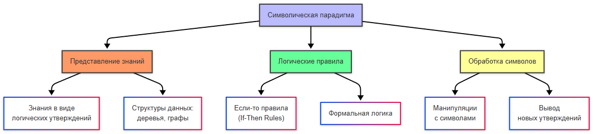
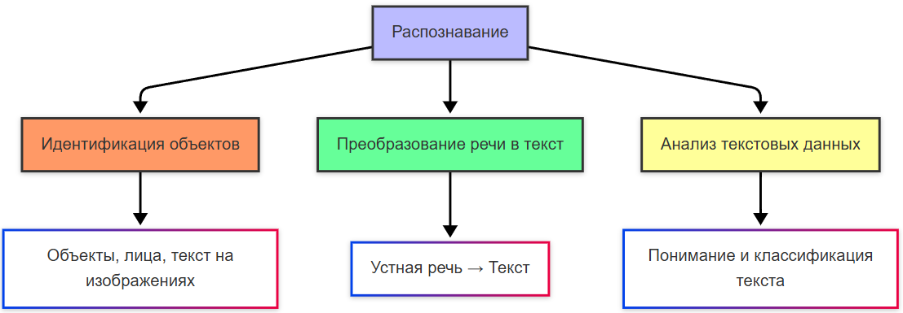
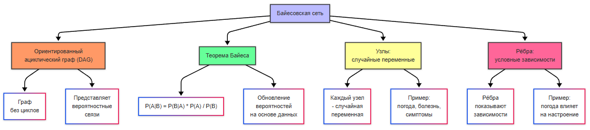
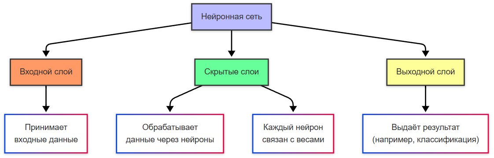
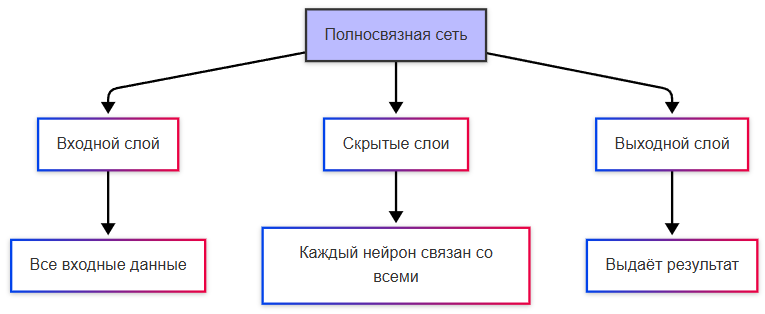
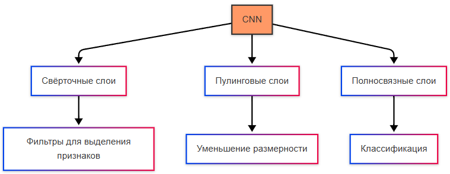
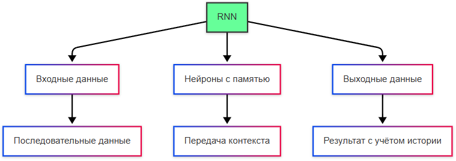
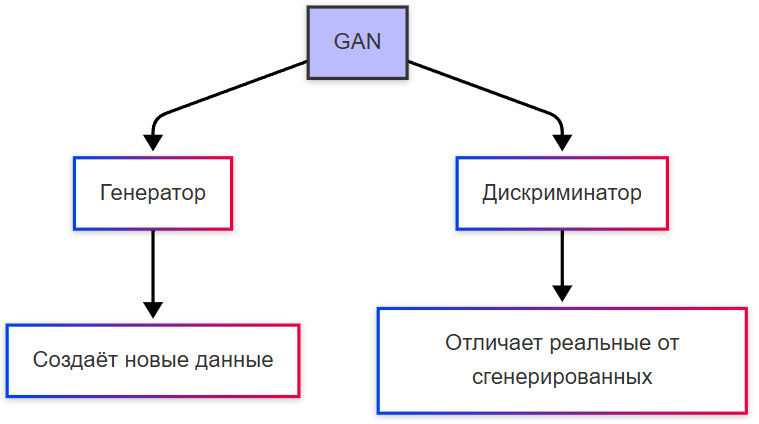
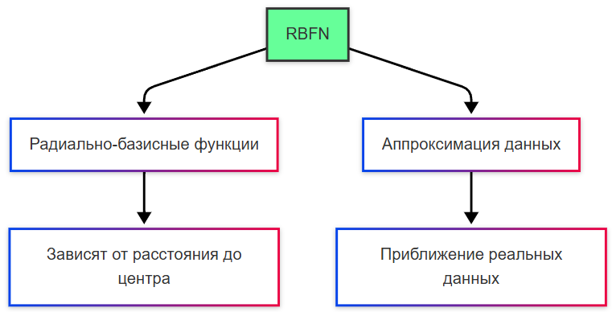

---
title: 8.06. Нейросети и ИИ
---

# 8.06. Нейросети и ИИ

<div class="article-tags">
  <span class="tag tag-beginner">ДЛЯ НОВИЧКОВ</span>
  <span class="tag tag-advanced">НЕ ДЛЯ НОВИЧКОВ</span>
  <span class="tag tag-notrequired">НЕ ОБЯЗАТЕЛЬНО</span>
  <span class="tag tag-inprogress">В РАЗРАБОТКЕ</span>
</div>
<span class="complexity-badge">Всем</span>

## История ИИ

Искусственный интеллект - понятие, которое пришло в индустрию намного раньше реального своего воплощения, ещё из области философии, а затем и массовой культуры. Человек всегда старался понять природу разума и создать его искусственный аналог.

Ещё в древности люди задумывались о том, что такое разум, и можно ли его воссоздавать — этому способствовал сам процесс оживления неодушевлённых предметов, вроде скульптур, гомункулов, и наделение мышлением. И вопрос привёл к итогу - а реально ли создать механизм, аналогичный, или хотя бы приближённо напоминающий человеческий разум?

Прообразом ИИ является «Турок», автоматический шахматный игрок, созданный венгерским изобретателем Вольфгангом фон Кемпеленом в 1769 году. Это не ИИ - внутри находился человек, но у общества сильно разогрелся интерес. Потом, после изобретения механических калькуляторов и аналитических машин, появилась концепция программирования, и разумеется она предполагала, что в будущем прогресс технологий приведёт к обработке символов, музыки и текста.


В Дартмутском колледже в 1956 году был проведён семинар, который считается официальным рождением термина «искусственный интеллект» - участники семинара определили цель ИИ как создание машин, способных решать задачи, требующие человеческого интеллекта. И одним из первых таких успешных проектов стала программа Logic Theorist, которая могла доказывать математические теоремы, используя методы логического вывода. От простых вычислений это отличается логикой — это и есть мышление и рассуждение, что характерно интеллекту.

Учёные заметили, что мозг состоит из миллиардов нейронов, которые взаимодействуют через электрические сигналы. Каждый нейрон получает входные сигналы, обрабатывает их и передаёт выходной сигнал другим нейронам - такой процесс стал основой для создания искусственных моделей. Первая математическая модель нейрона была опубликована Уорреном Маккалоком и Уолтером Питтсом в 1943 году, описав, как нейрон может принимать входные данные, комбинировать их и выдавать результат. Хотя работа была чисто теоретической, она заложила основу. В 1958 году Фрэнк Розенблатт создал перцептрон - первую практическую модель искусственной нейронной сети. Он мог обучаться, распозначая простые образы - буквы и геометрические фигуры.


Но история распорядилась так, что энтузиазм погас - наступила «зима ИИ» - период снижения финансирования и интереса к исследованиям в области ИИ. В 1969 году Марвин Мински и Сеймур Пейперт опубликовали книгу «Perceptrons», в которой показали ограниченность однослойных перцептронов. Позднее, в 1980-х годах появились новые разработки - многослойные архитектуры и алгоритм распространения ошибки, которые позволили повысить уровень сложности решаемых задач.

Многослойные нейронные сети (MLP - Multilayer Perceptron) ввели скрытые слои между входными и выходными данными, что позволило обучаться распознавать не только линейно разделимые данные, но и более сложные паттерны. Алгоритм обратного распространения ошибки (backpropagation) позволял эффективно обучать многослойные нейронные сети, корректируя веса на основе ошибок, допущенных выходе.


В 1980-х годах распространение получили экспертные системы - программы, которые имитировали знания экспертов в определённой области, используя правила и базы данных для решения задач - медицинская диагностика, инженерное проектирование. Это ещё были не нейросети, но это был важный шаг для развития прикладного ИИ.


Механизм вывода в экспертной системе осуществляет логический вывод на основе базы знаний. Прямой вывод - от фактов к выводам. Обратный вывод - от гипотезы к фактам. Пользователи же просто задавали вопросы и получали ответ от системы.

Символическая парадигма — это подход к созданию искусственного интеллекта, основанный на использовании формальных правил и символов. В этом подходе знания представляются в виде логических утверждений, правил и структур данных. Именно так работали экспертные системы и логические программы.



В 1990-х произошла смена парадигмы. Если раньше доминировала символическая, то теперь на первый план вышли статистические методы — это подходы к анализу данных, основанные на вероятностях и математической статистике. В отличие от символической парадигмы, статистические методы позволяют ИИ обучаться на данных, а не полагаться на заранее заданные правила. А это привело к какому выводу?
Не нужно пытаться научить машину думать, нужно собрать статистику и выполнять анализ больших объёмов данных. Тогда не придётся писать сложные правила.

После этого ключевой областью исследования стало машинное обучение - вместо явного программирования систем, учёные начали разработку алгоритмов обучения на основе данных. Тогда появились такие инструменты, как деревья решений, метод опорных векторов и баесовские сети. Одним из первых практических применений стало распознавание образов - анализ изображений и видео, классификация рукописных символов и распознавания лиц (свёрточные нейронные сети).

Распознавание — это процесс идентификации объектов, паттернов или информации в данных. Оно включает определение объектов, лиц или текста на фотографиях, преобразование устной речи в текст, анализ и понимание содержания текстовых данных.



Метод опорных векторов (SVM) — это алгоритм машинного обучения, используемый для задач классификации и регрессии. Он особенно эффективен для работы с высокоразмерными данными и малыми наборами данных. SVM строит гиперплоскость (в многомерном пространстве), которая разделяет данные на классы, и цель - найти такую гиперплоскость, которая максимизирует расстояние (зазор) между ближайшими точками разных классов (опорные векторы). Если данные не могут быть разделены линейно, SVM может использовать ядерные функции (например, полиномиальные или радиально-базисные), чтобы преобразовать данные в более высокое измерение, где они становятся линейно разделимыми.


Байесовская сеть — это графическая модель, представляющая вероятностные зависимости между переменными. Она основана на теореме Байеса и используется для моделирования неопределённости и принятия решений. Байесовская сеть представляет собой ориентированный ациклический граф (DAG), где узлы — это случайные переменные, а рёбра — это условные зависимости между переменными. Теорема Байеса — это математическая формула, которая позволяет обновлять вероятности событий на основе новых данных. Она используется для работы с условными вероятностями.




Классификация — это задача машинного обучения, в которой модель предсказывает метку класса для входных данных.

Линейная регрессия — это один из самых простых и фундаментальных методов машинного обучения, используемый для решения задач регрессии (предсказания числовых значений). Она моделирует зависимость между входными переменными (признаками) и выходной переменной (целевой переменной) с помощью линейной функции.

Деревья решений — это метод машинного обучения, который строит модель в виде дерева, где каждый узел представляет собой правило принятия решения, основанное на значениях входных признаков.

В 2000-х годах произошло сильное изменение мира - данные стали более доступными. Интернет сильно развивался, появились социальные сети, множество устройств и конечно - Интернет вещей (IoT), который позволял использовать датчики и собирать информацию. Так появились большие данные - именно то, что требовалось для обучения. Развивались облачные технологии, увеличивалась вычислительная мощность, а ресурсы стали доступны более широкому кругу лиц. В 2010-х появились важные достижения, такие как Word2Vec (алгоритм, который позволяет представлять слова в виде векторов в многомерном пространстве) и AlexNet (архитектура свёрточной нейронной сети).

Вектор — это упорядоченный набор чисел, который можно представить как точку в многомерном пространстве. Слова, изображения, пользовательские предпочтения могут быть преобразованы в векторы. Многомерное пространство позволяет сравнивать объекты, вычислять расстояния между ними и находить схожие элементы.

Затем произошел скачок в обработке естественного языка (NLP). Появилась генерация текста, перевод языков и даже осмысленные диалоги, благодаря проектам GPT и BERT.

Естественный язык — это язык, используемый людьми для общения (например, русский, английский). В отличие от формальных языков (например, программирование), естественные языки характеризуются неоднозначностью, контекстной зависимостью и богатством выражений. 

Обработка естественного языка (NLP) — это область ИИ, которая занимается анализом, пониманием и генерацией текста.

GPT (Generative Pre-trained Transformer) — это серия моделей, разработанных компанией OpenAI.

BERT (Bidirectional Encoder Representations from Transformers) — это модель, разработанная Google, которая значительно улучшила качество понимания контекста в тексте.

Дальше - веселее. В 2016 году программа AlphaGo, созданная компанией DeepMind, победила чемпиона мира по игре в го Ли Седоля. ИИ показал себя в стратегических задачах. Появились автономные системы - самоуправляемые автомобили, дроны и роботы, благодаря Tesla, Waymo и Boston Dynamics. 

И сейчас, в 2020-х, уже появился тренд на развитие и использование ИИ. Появились кучи аналогов GPT, и мы пришли к тому, что имеем.


## Как работает ИИ?

Важно отметить, что роль и способности ИИ сильно переоценены. Они всё такие же программы и инструменты, которые применимы разве что в автоматизации. Но, как мы помним — это не логика и мышление, а именно статистический анализ данных.

Получается, нужно иметь готовый набор данных, некую программу для их обработки и провести процесс обучения модели, после чего она будет принимать решения на основе статистики.

Теперь разберёмся подробно. Как это работает?

### Что такое ИИ?

**Искусственный интеллект** – область науки и техники, направленная на создание систем, способных выполнять задачи, которые обычно требуют человеческого интеллекта: распознавать образы, понимать речь, принимать решения и учиться.

**ИИ-модель** — это математическая или алгоритмическая структура, созданная для выполнения задач, требующих человеческого интеллекта. Модель обучается на данных и затем используется для предсказания, классификации или генерации новых данных. Фактически, модель - это просто код, который прогнозирует или преобразовывает данные (от простого среднего до дерева решений).

Деревья решений, линейная регрессия, нейронные сети, генеративные модели — это всё примеры ИИ-моделей.

Основные направления ИИ:
	- машинное обучение;
	- глубокое обучение;
	- обработка естественного языка (NLP);
	- компьютерное зрение;
	- робототехника;
	- экспертные системы.

ИИ в основном работает благодаря машинному обучению по определённому порядку, который можно назвать ML-пайплайном:
```
Данные -> EDA -> Моделирование -> Валидация -> Настройка
```

# Алгоритмы, используемые в ИИ


```
Алгоритмы, используемые в ИИ (Дерево решений, Логистическая регрессия, Случайный лес, SVM, kNN и т.д.).
зачем нужны train (обучение), test (тестирование) и validation (валидация) выборки.
```

### Типы ИИ-моделей

1. LLM (Large Language Models) - большие языковые модели, обученные на огромных объёмах текстовых данных. Генерируют текст, отвечают на вопросы, пишут статьи, резюмируют информацию. Примеры - GPT-4, Claude, Gemini, LLaMA.
2. LCM (Latent Concept Models) - модели, которые находят скрытые зависимости и смыслы в данных. Интерпретируют сложные данные, выявляют паттерны и причины.
3. LAM (Language Action Models) - модели, которые понимают естественный язык и выполняют действия. Автоматизируют процессы, бронируют, пересылают, настраивают интерфейсы.
4. MoE (Mixture of Experts) - архитектура, где модель состоит из множества «экспертов». Активируют только нужную часть модели для конкретной задачи.
5. VLM (Vision-Language Models) - мультимодальные модели, работающие с текстом и изображениями. Анализируют визуальную информацию, создают подписи к изображениям, выполняют визуальный поиск.
6. SLM (Small Language Models) - компактные языковые модели, оптимизированные для скорости и автономности. Работают быстрее и легче, чем большие модели, но с меньшей мощностью.
7. MLM (Masked Language Models) - модели, обученные предсказывать скрытые слова в тексте. Улучшают понимание контекста, исправляют ошибки, классифицируют текст.
8. SAM (Segment Anything Model) - модель для сегментации объектов на изображениях. Выделяют объекты по клику или указанию.
9. Diffusion Models - одели, генерирующие изображения через процесс «размывания» и «восстановления». Создают реалистичные изображения, редактируют существующие. Примеры - Stable Diffusion, DALL·E, MidJourney.
10. Reinforcement Learning Models - модели, обученные на принципах подкрепления (rewards/punishments). Принимают решения в динамических средах, учатся на ошибках.
11. Generative Adversarial Networks (GANs) - состоят из двух нейросетей: генератора и дискриминатора. Генерируют новые данные (например, изображения), которые сложно отличить от реальных.
12. Transformer Models - архитектура, лежащая в основе большинства современных языковых моделей. Обрабатывают последовательности данных (текст, звук, видео) с учётом контекста.
13. Time-Series Models - модели для анализа временных рядов. Предсказывают будущие значения на основе прошлых данных.
14. Graph Neural Networks (GNNs) - модели для работы с графовыми структурами данных. Анализируют связи между объектами, рекомендуют товары, предсказывают взаимодействия.
15. Multimodal Models - модели, работающие с несколькими типами данных одновременно (текст, изображения, звук). Интегрируют разные типы данных для более глубокого понимания.


### Что такое нейрон?

**Нейрон** — это основная функциональная единица биологической нервной системы, включая человеческий мозг. Нейроны обрабатывают и передают информацию через электрические сигналы. Каждый нейрон состоит из трёх основных частей - дендриты (получают входные сигналы), тело клетки (сома, обрабатывает входные сигналы), аксон (передаёт выходные сигналы). Здесь мы сразу видим принцип - входные данные, обработка и выходные данные.


Вес нейрона — это параметр, который определяет силу влияния входного сигнала на выходной сигнал нейрона. Весовые коэффициенты — это числовые значения, которые умножаются на входные данные перед их обработкой в нейроне.

Искусственный интеллект позаимствовал понятие, и в контексте ИИ нейрон — это математическая модель, имитирующая работу биологического нейрона. Он принимает входные данные, применяет к ним весовые коэффициенты, выполняет преобразования (например, с помощью функции активации) и выдаёт выходное значение.

Нейронная сеть — это система, состоящая из множества взаимосвязанных искусственных нейронов, организованных в слои. Эти сети способны обучаться на данных и выполнять задачи, такие как распознавание образов, классификация, прогнозирование и генерация данных. Они являются частью машинного обучения и глубокого обучения.

Приравнивать ИИ и нейросети не нужно. Нейронные сети — это конкретный метод внутри ИИ, который имитирует работу биологических нейронов для обработки данных.

Компоненты нейронной сети:
	- Входной слой принимает исходные данные.
	- Скрытые слои выполняют вычисления и преобразования данных.
	- Выходной слой выдаёт результат.




### Типы нейросетей

Нейронные сети бывают разных типов.

1. Полносвязные нейронные сети (Fully Connected Neural Networks) - базовая архитектура, где каждый нейрон одного слоя связан со всеми нейронами следующего слоя. Это применимо для классификации и регрессии, вроде прогнозирования цен. Но неэффективно для больших объёмов данных из-за сложности вычисления.




2. Свёрточные нейронные сети (Convolutional Neural Networks, CNN) специально разработаны для работы с изображениями и видео. Включают свёрточные слои, которые применяют фильтры для выделения признаков (например, края, текстуры). Это применимо для распознавания объектов на изображениях, автономном вождении автомобилей, медицинской диагностике по снимкам.




3. Рекуррентные нейронные сети (Recurrent Neural Networks, RNN) нужны для работы с последовательными данными, такими как текст, временные ряды или аудио. Нейроны в RNN имеют память: они передают информацию о предыдущих шагах в текущий момент. Это учитывает контекст и порядок элементов в последовательности, благодаря чему можно реализовать генерацию текста, перевод языка, и анализировать временные ряды (например, прогнозирование курсов). Однако стандартные RNN могут страдать от проблемы затухающих градиентов (vanishing gradients).




Рекуррентность — это свойство моделей сохранять информацию о предыдущих шагах обработки данных.

Градиент — это вектор, указывающий направление наибольшего роста функции. В машинном обучении градиент используется для оптимизации весов модели.

4. Долговременная краткосрочная память (Long Short-Term Memory, LSTM) это подтип RNN, который решает проблему затухающих градиентов. Здесь добавляются специальные механизмы, такие как «забывающий» и «входной» вентили, чтобы контролировать поток информации. Это позволяет работать с длинным контекстом.


5. Трансформеры (Transformers, и нет, это не автоботы или десептиконы) это архитектура, которая заменила RNN и LSTM в большинстве задач обработки естественного языка. Она использует механизм внимания (attention), позволяющий модели сосредотачиваться на наиболее важных частях входных данных. Если в RNN есть последовательная обработка данных, здесь есть параллельная обработка. Это очень эффективно для больших объёмов данных. Примеры - языковые модели, те же GPT и BERT.


6. Генеративно-состязательные сети (Generative Adversarial Networks, GAN) - генератор создаёт новые данные (например, изображения), а дискриминатор пытается отличить реальные данные от сгенерированных. Это две составляющие сети. Такой тип используется для создания искусственных лиц, генерации музыки, улучшения качества изображений.




7. Самоорганизующиеся карты Кохонена (Self-Organizing Maps, SOM) используются для кластеризации и визуализации данных. Нейроны организованы в двумерную сетку, где каждый нейрон представляет собой кластер. Используется для анализа рынка, карт предпочтений пользователей.


8. Радиально-базисные функциональные сети (Radial Basis Function Networks, RBFN) используют радиально-базисные функции для аппроксимации данных. Радиально-базисные функции — это математические функции, которые зависят от расстояния между точкой данных и центром. Аппроксимация данных — это процесс построения математической модели, которая приближает (аппроксимирует) реальные данные. Цель аппроксимации — найти функцию, которая наилучшим образом описывает зависимость между входными и выходными данными.




### Что такое машинное обучение?

**Машинное обучение** (Machine Learning, ML) — это раздел искусственного интеллекта, который фокусируется на разработке алгоритмов, способных обучаться на данных. Вместо явного программирования поведения системы, она сама находит закономерности в данных и строит модели для прогнозирования или классификации. 

Три основных типа машинного обучения:
	- Обучение с учителем (supervised learning) - модель обучается на парах входных данных и целевых значений.
	- Обучение без учителя (unsupervised learning) - модель ищет скрытые паттерны в данных без целевых меток.
	- Обучение с подкреплением (reinforcement learning) - модель учится на основе взаимодействия с окружающей средой и получения наград.


**Алгоритмы обучения на основе данных** — это методы, которые позволяют системам ИИ строить модели, основываясь на анализе большого количества информации. Эти алгоритмы автоматически находят зависимости, закономерности и корреляции в данных.
	- Свёрточные слои применяют фильтры для выделения признаков.
	- Пулинговые слои уменьшают размерность данных.
	- Полносвязные слои выполняют классификацию.

**Глубокое обучение** (Deep Learning) — это подраздел машинного обучения, основанный на использовании глубоких нейронных сетей (сетей с большим количеством слоёв). Эти сети способны автоматически извлекать сложные паттерны из данных, что делает их особенно эффективными для работы с большими объёмами неструктурированной информации. Сети состоят из множества скрытых слоёв, каждый из которых извлекает всё более абстрактные признаки. В отличие от традиционного машинного обучения, где признаки нужно вручную задавать, глубокое обучение самостоятельно находит важные признаки. Требует мощных вычислительных ресурсов (например, GPU или TPU).

Глубокое обучение используется в CNN, RNN, LSTM и трансформерах.

**Датасет** (dataset) — это набор данных, который используется для обучения, тестирования и оценки моделей машинного обучения или искусственного интеллекта. Датасеты содержат информацию, необходимую для решения конкретной задачи: изображения, тексты, числовые данные, аудио и т.д.

Датасеты могут быть обучающими, валидационными, тестовыми, могут быть структурированными или неструктурированными - всё зависит от самих данных.

Есть готовые датасеты, которые предоставляются для обучения моделей - MNIST (набор рукописных цифр) для классификации цифр, CIFAR-10 (набор цветных изображений), IMDb (для анализа тональности текста из отзывов по фильмам), Wikipedia Text Corpus (большая коллекция текстов), ImageNet (коллекция миллионов изображений), COCO (изображения с разметкой объектов), и многие другие.

Собственный датасет — это просто набор данных, который собирают буквально - ручками. Нужно понять задачу и собрать данные - из открытых источников, API, по сайтам.

Данные важно разделять по типам - сложно организовать обучение с разными типами, беспорядочно перемешанными. При обучении, главное - понять, какие бывают типы (табличные, текст, изображения, временные ряды) и откуда их брать (встроенные датасеты, Kaggle, ETL-процессы).

Обучение нейросетей — это процесс настройки весов и параметров сети для выполнения конкретной задачи.

Это автоматическое извлечение знаний из данных без явного программирования правил.

```
Computer Vision
Распознавание лиц, объектов, OCR, медицинская диагностика.
NLP (обработка текста)
Чат-боты, переводчики, суммаризация, анализ тональности
Рекомендательные системы
Netflix, Spotify, Amazon, TikTok — подбор контента.
Аналитика и прогнозы
Прогноз спроса, отказов оборудования, цен, нагрузки на серверы.
Кибербезопасность
Обнаружение аномалий, фишинга, вредоносного ПО.
Генерация контента
GPT, Stable Diffusion, музыка, код, видео.
Робототехника и автопилоты
Восприятие среды, принятие решений, управление.
DevOps / SRE
Аномалии в логах, прогнозирование инцидентов, оптимизация ресурсов.

Как происходит обучение? Градиентный спуск и обратное распространение
1. Функция потерь (Loss Function)
Измеряет, насколько сеть ошиблась.
MSE — для регрессии.
Cross-Entropy — для классификации.
Custom loss — для специфичных задач.

2. Обратное распространение ошибки (Backpropagation)
Алгоритм вычисления градиента функции потерь по каждому весу.
Использует цепное правило дифференцирования.
Реализован автоматически в PyTorch / TensorFlow (autograd).

3. Градиентный спуск (Gradient Descent)
Обновление весов в направлении, противоположном градиенту

4. Оптимизаторы
SGD — стохастический градиентный спуск.
Adam — адаптивный, с моментами (самый популярный).
RMSprop, Adagrad, AdamW — для разных случаев.

```

1. Подготовка данных. Данные делятся на три набора:
	- Обучающий набор используется для обучения модели.
	- Валидационный набор проверяет качество модели во время обучения.
	- Тестовый набор оценивает модель после завершения обучения.

Здесь происходит сбор, нормализация, очистка от шума. Для некоторых задач (например, компьютерного зрения) требуется дополнительная обработка: изменение размера изображений, аугментация данных.

2. Инициализация весов. Веса нейронов инициализируются случайными значениями, что необходимо для того, чтобы модель могла начать обучение.
3. Прямое распространение (Forward Propagation). Входные данные проходят через все слои сети, пока не достигнут выходного слоя. На каждом шаге применяются функции активации (например, ReLU, Sigmoid). Результат сравнивается с целевыми значениями для вычисления ошибки.
4. Вычисление ошибки. Ошибка измеряется с помощью функции потерь (loss function):
	- MSE (Mean Squared Error) для задач регрессии.
	- Cross-Entropy Loss для задач классификации.

Чем меньше ошибка, тем лучше модель соответствует данным.

5. Обратное распространение ошибки (Backpropagation). Ошибка распространяется обратно через сеть, корректируя веса. Для этого используется градиентный спуск (gradient descent). Градиентный спуск минимизирует функцию потерь, изменяя веса в направлении, противоположном градиенту.
6. Оптимизация. Для улучшения сходимости используются различные алгоритмы оптимизации:
	- SGD (Stochastic Gradient Descent) базовый метод.
	- Adam более современный и эффективный метод.
7. Оценка модели. После завершения обучения модель тестируется на тестовом наборе данных. Оцениваются метрики, такие как точность (accuracy), F1-score, ROC-AUC. Если модель показывает плохие результаты, её можно дообучить или перестроить.

```
Метрики качества: Accuracy, Precision, Recall, F1-score — что они означают и когда какую использовать.
ROC-кривая и AUC: Визуальный и численный способ оценить качество классификатора.
Матрица ошибок (Confusion Matrix): Наглядный способ увидеть, где модель ошибается (False Positive, False Negative).
Кросс-валидация (k-fold): Метод для более надежной оценки модели, особенно на небольших датасетах.

Разведочный анализ данных (EDA — Exploratory Data Analysis)
Удаление дубликатов.
Обработка пропусков (NaN)
Когда удалять признак, когда заполнять средним/медианой/модой.
Обнаружение аномалий (выбросов)
Визуальные методы (boxplot) и статистические (квантили).
Описательная статистика: Среднее, минимум, максимум, распределение.
Важность признаков: Как понять, какие факторы влияют на результат (например, с помощью Chi-squared test).
Многомерный анализ: Визуализация взаимосвязей между признаками (pairplot в Seaborn).
Понижение размерности (PCA): Зачем и как сокращать количество признаков.
Преобразование данных: Стандартизация и нормализация — зачем приводить данные к одному масштабу.
Пересэмплирование (SMOTE): Как бороться с дисбалансом классов в задачах классификации.
Глубокое обучение (DL) как подмножество ML: Объяснить разницу между ML и DL, ввести понятие нейронных сетей.
Многослойный перцептрон (MLP): Как простейший пример нейронной сети, его структура (входной, скрытые, выходной слои) и применение.
Инструменты и экосистема: Упомянуть ключевые библиотеки Python (Pandas, Scikit-learn, Seaborn, Matplotlib, Plotly) и платформы (Google Colab для DL).

PyTorch
Гибкий, популярен в исследованиях, отличная отладка.
TensorFlow
Мощный для продакшена, Keras — удобный высокоуровневый API.
Keras
Упрощённый API поверх TF (или standalone).
JAX
Для исследований, автоматическое дифференцирование + XLA.
Hugging Face
Библиотека трансформеров и предобученных моделей (NLP, CV).
ONNX
Универсальный формат для обмена моделями между фреймворками.
Weights & Biases / MLflow
Трекинг экспериментов, логирование, визуализация.

```


## ChatGPT

```
Как работает ChatGPT? Он просто добавляет по одному слову за раз. Это фундаментальный принцип. ChatGPT не «думает» над эссе целиком. Он последовательно предсказывает наиболее вероятный следующий токен (слово или его часть) на основе всего предыдущего текста.
Основной механизм работы (добавление токенов + температура).
выбор самого вероятного слова каждый раз приводит к скучному, шаблонному тексту. Введение "температуры" (случайности) позволяет модели генерировать более креативный и человеческий текст. Это ключевой параметр, который пользователи часто настраивают.
модели работают с токенами, что позволяет им эффективно обрабатывать редкие слова, сложные морфологии и даже "изобретать" новые слова.
Концепция Эмбеддингов (Embeddings)
Эмбеддинг — это способ превратить слово (или изображение) в массив чисел (вектор) так, чтобы семантически близкие сущности имели близкие векторы в многомерном пространстве.
эмбеддинги создаются не вручную, а "учатся" нейросетью в процессе решения какой-то задачи (например, предсказания следующего слова или распознавания изображений). Сеть "понимает", что "король" и "королева" похожи, потому что они часто встречаются в похожих контекстах.
слова группируются по смыслу (животные, растения, эмоции). Это делает абстрактную концепцию осязаемой.

ChatGPT основан на архитектуре "Трансформер", которая заменила старые RNN/LSTM. Ее ключевая особенность — механизм "внимания" (attention).
Механизм внимания позволяет модели "оглядываться назад" по тексту и находить релевантные части, даже если они находятся далеко. Например, понять, к какому существительному относится глагол в длинном предложении.
Блоки и головы внимания. современные модели (GPT-3) состоят из десятков слоев, каждый из которых содержит множество "голов внимания", анализирующих текст с разных "точек зрения".
трансформеры позволили эффективно обучать модели на огромных объемах данных, что и привело к прорыву в качестве генерации текста.
Обучение ChatGPT — это колоссальный процесс, требующий триллионов слов текста и недель работы на тысячах GPU.
Self-Supervised Learning - для обучения не нужны размеченные данные. Модель учится, маскируя часть текста и пытаясь его предсказать. Это делает сбор данных относительно простым (все книги, все сайты).
Fine-tuning (Дообучение) - модель дообучают на примерах "хороших" диалогов с участием людей, чтобы она стала более полезным и безопасным чат-ботом.

Почему ChatGPT, несмотря на всю свою сложность, может генерировать связный текст? Почему ChatGPT, несмотря на всю свою сложность, может генерировать связный текст? Вольфрам предполагает, что человеческий язык и мышление на фундаментальном уровне проще, чем мы думаем, и подчиняются определенным "законам".
Вычислительная несводимость - ключевое ограничение. ChatGPT не может выполнять сложные многошаговые вычисления или логические рассуждения "в уме", потому что его архитектура (feed-forward) не предполагает циклов. Он может только "угадывать" ответ, основываясь на статистике.
ChatGPT гениален в языке, но плох в расчетах. требует точного запроса. Их объединение создает супер-инструмент: ChatGPT формулирует запрос на естественном языке,
Но! ChatGPT можно использовать в связке с базами знаний или вычислительными системами API к базам данных, калькуляторы) для получения точных ответов. Это критически важный паттерн для реальных IT-проектов.

```

## Как создать свою нейросеть?

Свою нейросеть можно создать. Можно использовать подключение уже существующих моделей или разрабатывать свою с нуля. Создание нейронной сети — это определенный процесс, который вполне достижим.

### Как создать свою модель?

1. Определение задачи. Первый и самый важный шаг — четко определить, какую задачу вы хотите решить с помощью нейросети:
	- Классификация - определить, к какому классу относится объект (например, распознавание рукописных цифр).
	- Регрессия - предсказать числовое значение (например, прогнозирование цен на недвижимость).
	- Генерация данных - создание новых изображений, текста или музыки.
	- Обработка естественного языка (NLP) - перевод текста, генерация текста, анализ тональности.

Нужно также понять, какие данные имеются, какая метрика будет использоваться для оценки качества модели и какую архитектуру нейросети выбрать.

2. Сбор и подготовка данных. Нейронные сети требуют качественных данных для обучения. Этот этап часто занимает большую часть времени.
2.1. Сбор данных - собирается датасет (набор данных).
2.2. Проверка достаточности данных для обучения модели.
2.3. Очистка данных - удаление шумов, выбросов, некорректных записей.
2.4. Преобразование данных - нормализация или стандартизация данных.
2.5. Разделение данных на три набора:
	- Обучающий набор (70–80%) для обучения модели.
	- Валидационный набор (10–15%) для настройки гиперпараметров.
	- Тестовый набор (10–15%) для финальной оценки модели.
3. Выбор архитектуры нейросети.
	- Полносвязная подходит для табличных данных, подойдёт новичку.
	- Свёрточная подойдёт для работы с изображениями.
	- Рекуррентная и трансформеры - более сложные.
4. Настройка гиперпараметров. Основные гиперпараметры:
	- Количество слоёв - чем больше слоёв, тем сложнее модель.
	- Количество нейронов в слоях - определяет ёмкость модели.
	- Функция активации - ReLU, Sigmoid, Tanh и другие.
	- Скорость обучения (learning rate) - влияет на скорость сходимости.
	- Оптимизатор - Adam, SGD, RMSprop и другие.

В языках программирования есть готовые библиотеки для экспериментов с гиперпараметрами.

5. Обучение модели - как мы и описывали, проходится в виде цикла - инициализация весов, распространение, вычисление ошибки, обратное распространение и повторение. Цикл обучения повторяется снова и снова.

Важно: избегайте переобучения (overfitting) с помощью методов регуляризации (например, Dropout, L2-регуляризация)

6. Оценка модели - оценивается качество на тестовом наборе данных по метрикам.
Метрики:
	- Для классификации: Точность (accuracy), F1-score, ROC-AUC.
	- Для регрессии: MSE, MAE (Mean Absolute Error), R².
7. Развёртывание модели. Когда модель готова, её можно использовать в реальных приложениях. Модель экспортируется, интегрируется и мониторится.

### Как подключают существующую модель?

Существует множество готовых моделей, которые можно использовать для различных задач - обработка изображений, обработка естественного языка, генерации данных. Эти модели уже предобучены, и их можно получить из репозиториев вроде GitHub, из готовых библиотек, или облачных сервисов.
1. Определить задачу и выбрать модель. 
	- Обработка изображений - ResNet, VGG, Inception, EfficientNet;
	- Обработка естественного языка - BERT, GPT, T5, RoBERTa;
	- Генерация данных - GAN, WaveNet или Tacotron.

Их множество - здесь приведены лишь несколько.

2. Подготовка проекта. Создайте новый проект в вашей среде разработки. Говоря о языке - обычно такие программы пишут на Python. Поэтому использоваться будет, к примеру, PyCharm, Jupiter Notebook или VS Code).
3. Установите библиотеки, к примеру, TensorFlow, PyTorch, Hugging Face Model.
4. Загрузите модель через инструменты - у каждой модели свои инструменты, поэтому здесь важно следовать руководству выбранной модели.
5. Настройка модели. Если модель уже обучена - можно использовать. Но если задача немного отличается - может потребоваться дообучение, на ваших данных. Это называется fine-tuning (тренировка). 
6. Развёртывание. После загрузки модели и настройки, она интегрируется в соответствующее приложение или сервис. Всё зависит от цели, но основные этапы следующие:
	- создаётся API - веб-сервис, который будет принимать входные данные, обрабатывать их и возвращать результаты. К примеру, FastAPI;
	- сервис развёртывается на сервере или в облаке (можно также использовать Docker);
	- сервис запускается и выполняется мониторинг.
7. Тестирование. Здесь всё просто - убедиться. что приложение работает корректно.


## Проблемы ИИ

Конечно же существуют и проблемы, связанные с распространением искусственного интеллекта.

Не так давно Microsoft проводила большое исследование для того, чтобы определить список профессий, которые в ближайшее время могут исчезнуть из-за нейросетей. Среди них переводчики, историки, писатели, телефонные операторы, радиоведущие, политологи, журналисты, математики, технические писатели, преподаватели, веб-разработчики, агенты по рекламе, специалисты по анализу данных, географы, модели, консультанты разных видов, специалисты по связям с общественностью. А останутся (те, кого ИИ не заменит) медики, подсобники, ремонтники, бетонщики, посудомойщики, уборщики, санитары, массажисты, и практически все операторы и рабочие в промышленности, особенно тяжелой.

Странно звучит, но такая тема часто поднимается в науке и научной фантастике, к примеру, в «Интерстеллар» персонажи фильма не раз упоминают важность фермеров и низкую актуальность инженеров, а в «Cyberpunk 2077» и вовсе часть сюжета построена на кибернетизации людей с отдалением от естественной части. Однако хотелось бы развеять некоторые предубеждения. Классическая модель развития - сначала появляется инновация, она показывают свою небольшую эффективность, бизнес превращает эту небольшую эффективность в якобы «огромный плюс», что в итоге превращается в слоган «без этого нам не выжить».

Те же специалисты по связям с общественностью - в первой половине XX века их ещё именовали «пропагандистами», пока не заменили термин на модную «связь с общественностью». А политики, что, будут полагаться на ИИ настолько плотно, что откажутся от личных переводчиков и пропагандистов? Аналогично можно пройтись по любым другим профессиям, и можно точно сказать следующее - если вы профессионал в своём деле, никакой ИИ вас не заменит. Всегда вспоминайте диалог робота с главным героем фильма «Я - робот».

Во-первых, ага, больше слушайте крупные корпорации. Microsoft великолепная корпорация, и именно их силами мы получили очень много невероятных технологий, исследований и инноваций, но при этом, это один из ведущих инвесторов в ИИ - разумеется, они гиперболизируют (преувеличивают) значение ИИ. Это бизнес, «прогрев» общества на готовность к новой модели потребления - та самая формула создания искусственного спроса. Корпорации сами внушают нам трагическую «повестку». Вспомните - так же было и с экологической повесткой, глобальным потеплением, скорым наступлением ядерной войны, это всё типичная модель управления паникой - «быстрее, быстрее, сейчас уже вот-вот!».

Во-вторых, нейросеть, как мы выявили, мыслить не способна, а лишь статистически работает. Когда появилось цифровое рисование и симуляция музыки в цифровом виде, маркетинг всё так же утверждал, что художники теперь не нужны, как и музыканты - написать может любой. Да, допустим. Но попробуйте сейчас создать хорошую видеоигру, к примеру - но без художника и музыканта. Сложно? Но ведь вы можете сами это сделать, сгенерировать при помощи ИИ, разве нет?

В этом и тонкость - искусство ценится не за то, что это возможно сделать, а за то, как этот результат был сделан. Да, когда речь идет о мышлении через призму бизнеса корпораций - «мне срочно через три дня нужен рисунок», «мне срочно через месяц нужен миллион долларов». Два разных требования, а модель одинаковая - и как раз для целей «быстро», «здесь и сейчас» - нейросети и автоматизация отлично подойдут.
Но многое в бизнесе корпораций строится на зависимости от того самого искусственного спроса. Не судите о популярности сгенерированных нейросетями видеозаписей по количеству просмотров в социальных сетях - ведь это цифры, которые легко накручиваются, а как мы выявили - больше половина пользователей интернета - не настоящие люди, а боты.

Поэтому сейчас будет какой-то период тренда на ИИ, который в будущем можно ожидать лишь как стандартизацию использования ИИ-агентов в культуре.

Представим, что вам нужно срочно перевести текст. Вы обратитесь к ИИ, или Google/Яндекс переводчику. А раньше что, вы прям нанимали переводчиков? Нет, вы открывали словари и искали. В этом и есть суть, пропаганда технологий слишком агрессивная, на практике же не всё так значительно - это просто небольшие и очень удобные инструменты, которые упростят нам жизнь - раньше не было языков программирования, IDE, Microsoft Word, браузеров и много других вещей. Воспринимайте ИИ лишь как обновления для наших имеющихся инструментов, чтобы сделать жизнь проще.

Но! Если же вы находитесь с другой стороны - к примеру, занимаетесь продажей услуг, связанных с ИИ, ведёте разработку или консультации в области нейросетей, машинного обучения и прочих инноваций, ни в коем случае, не осуждайте себя, ведь это очень важная часть общества. Да, корпорации малость преукрашивают картину. Но это не значит, что без ваших инноваций или разработок, работа бизнеса не упростится, нет - действительно, к примеру, распознавания и автоматические анализы данных, работа с рутинными задачами, это все колоссальная прибыль для бизнеса.

Другое дело, как с этим поступают бизнесмены. Природа экономики такова, что предприниматель всегда снижает расходы, повышая доходы, и он будет готов на всё, чтобы достигать успехов в этих направлениях. Именно благодаря этому область IT и живет, процветает, и будет развиваться многие годы. Сегодня мы продаём ИИ-агенты. Завтра мы придумаем что-то ещё. Обычный потребитель будет недоволен всегда, и если он перестаёт платить - значит, пропаганда доигралась, или потерпела неудачу - это естественно.

Наблюдаемая в мире ситуация как раз отражает внедрение ИИ как цели самой по себе, без привязки к конкретным бизнес-задачам или потребностям конечного пользователя. Это характерно для всех этапов технологического ажиотажа, когда ИИ позиционируется «универсальным инструментом», способным автоматически повысить ценность продукта. Практика же показывает, что подобные инициативы могут столкнуться с критической ошибкой, в виде отсутствия обоснованного use case. Айтишники уже знают о чём речь, к примеру, когда руководство просит поставить Kafka, но не знает зачем - просто потому что, и так же может быть с любым инструментом - а ИИ - инструмент.

Словом, тренд разгоняется, а бизнес внедряет без чёткого определения метрики эффективности, привязки к проблемам пользователей. По итогу частенько ИИ становится навесным функционалом, который не влияет на ключевые показатели продукта (не влияет, не верьте отчётам и новостям). Сейчас чуть ли не у каждой компании есть свой чат-бот с LLM на борту в CRM-системе. Довольны ли пользователи? Ничуть. Это всё избыточная сложность и отсутствие реального решения проблем.

К тому же, такие тренды идут от инвесторов, и мы видим проблему разрыва между уровнями управления. Цепочка «инвестор - CEO - продакт - разработка - маркетинг - пользователь» породила проблему передачи требований без обратной связи. Инвесторы фокусируются на трендах (например, был рост инвестиций в ИИ-стартапы), но игнорируют валидацию гипотез на уровне пользователя. Продакт-менеджеры же транслируют требования как технические задачи, не уточняя KPI успеха, либо игнорируя негативные прогнозы и риски. По итогу решения не соответствуют рынку, пользователь просто отворачивается от всех этих «ИИ-наворочек». Юзеры платят за решение своих задач, а не технологические компоненты. Если ИИ не влияет на воспринимаемую ценность продукта, не упрощает поток или не снижает цену, то внедрение не окупается, поэтому многие проекты с ИИ проваливаются на этапе коммерциализации, так как не справляются с рынком. Это говорит об экономической несостоятельности «ИИ-надстроек» над продуктом.

Если проще, БИЗНЕС - НЕ НУЖНО ПИХАТЬ ИИ В КАЖДЫЙ ПРОДУКТ!

Старт должен быть с проблемы, а не технологии, ИИ будет оправдан допустим для автоматизации классификации задач на основе исторических данных, если реально помогает снижать ручную работу. Гипотезы надо валидировать, проводя пилоты на ограниченной аудитории, измеряя влияние ИИ-компонентов на ключевые метрики, например, время выполнения процесса. И конечно, всё это хозяйство требует поддержки данных (чистота, объём), инфраструктуры и экспертизы. Если эти компоненты не готовы, то «быстрое внедрение» приведёт к росту операционных издержек. Поэтому надо быть внимательнее - не бежать вслепую за трендами.

Тренды - плохая штука. В октябре 2025 года, после очередного падения криптовалюты и акций, в интернете начали рассуждать о том, что на текущий момент самое выгодное вложение - покупать «скины» в Counter-Strike. Но по щелчку, через недельку выходит обновление видеоигры, в котором внесли изменения, повлекшие к падению цен на некоторые товары (ножи). Итог - потеря денег. Такова природа инвестиций, ничего не бывает без риска.

Сейчас же, зная, как мы пришли к «нейросетевому буму», вам будет проще разобраться в этой сфере.
