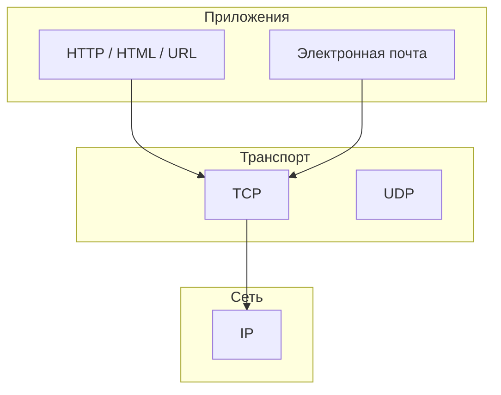

import TechHistoryPlay from '@site/src/components/TechHistoryPlay.jsx';

# Великие люди

<div class="article-tags">

  <span class="tag tag-required">ОБЯЗАТЕЛЬНО</span>
  <span class="tag tag-beginner">ДЛЯ НОВИЧКОВ</span>
</div>

<span class="complexity-badge">Всем</span>

В любой отрасли есть люди, чьи идеи пережили их самих: мы до сих пор пользуемся их моделями, протоколами и языками — часто, не зная имён. Эта статья **не рейтинг "самых крутых"** и не энциклопедия биографий. Это **карта опорных фигур** в IT: кто что придумал, какой термин за этим стоит и куда копать дальше в [энциклопедии](/encyclopedia/1-basics/1-02-vvedenie/1).

:::tip Как читать материал
- Имена сгруппированы по **типу вклада** (теория, сеть, язык, продукт), а не по "звёздности".
- Строки с **★** — краткие определения; их удобно выписать в конспект.
- Даты и роли **упрощены**; спорные оценки личности мы не даём — только инженерный или научный след.
- После интерактива ниже — [итоги](./2.md) и [чек-лист](./3.md).
:::

<TechHistoryPlay topic="computing-pioneers" />

Пройдите интерактив выше — он связывает имена с эпохами. В тексте дальше — разборы с определениями и короткими фрагментами кода: абстрактные идеи должны стать **осязаемыми**, а не остаться списком фамилий.

:::info Три слоя истории IT
**Теория** — что вообще можно вычислить и как измерить информацию. **Инженерия** — ОС, сеть, языки, открытый код. **Продукт** — то, что видит пользователь (браузер, мессенджер, облако). Путаница чаще всего из смешения слоёв: интернет ≠ паутина, Linux ≠ GNU, нейросеть 2020-х ≠ "ИИ" 1960-х.
:::

---

## Теория вычислений и "что вообще значит вычислить"

Здесь люди, которые ответили на вопрос: **какие задачи машина может решить в принципе** и как устроена "обычная" современная машина. Если вы только начинаете в программировании, этот блок объясняет, *почему* существуют границы алгоритмов и почему процессор читает команды из той же памяти, что и данные.

---

### Алан Тьюринг (1912–1954)

Британский математик. Его **машина Тьюринга** — мысленная модель: бесконечная лента, "голова", таблица правил "если видишь символ — запиши другой и сдвинься". Такую машину не собирают в железе, но на ней доказывают теоремы о **вычислимости** и о том, что некоторые задачи принципиально не решаются алгоритмом (классический пример — **проблема остановки**).

★ **Машина Тьюринга** — абстрактная модель вычисления; любой алгоритм, реализуемый на обычном компьютере, можно описать на машине Тьюринга (в рамках **тезиса Чёрча–Тьюринга**). Подробный разбор: [Машина Тьюринга](/encyclopedia/3-data-markup/3-03-myslitelnaya-baza/42), обзор курса [ТАФЯ](/encyclopedia/3-data-markup/3-03-myslitelnaya-baza/38).

Во время Второй мировой войны Тьюринг участвовал в расшифровке **Enigma** — важный вклад в прикладную математику и криптографию, но это не "изобретение ПК" в бытовом смысле.

```text
# Упрощённая идея "ленты" (псевдокод)
пока состояние != HALT:
    правило = δ[состояние][символ_под_головкой]
    записать(правило.символ)
    сдвинуть_головку(правило.направление)
    состояние = правило.новое_состояние
```

---

### Алонзо Чёрч (1903–1995)

Создатель **лямбда-исчисления** — формальной системы, где всё выражается через функции и их применение. Отсюда выросло [функциональное программирование](/encyclopedia/5-languages/5-17-haskell/intro) (Haskell, Lisp, идеи в JavaScript и Python).

★ **Тезис Чёрча–Тьюринга** — всё, что интуитивно "можно вычислить алгоритмом", совпадает с тем, что вычислимо на машине Тьюринга или в лямбда-исчислении.

```haskell
-- Идентичная функция: (λx.x) применённая к y даёт y
id y = (\x -> x) y
```

Тьюринг был студентом Чёрча; их работы вместе задали язык, на котором до сих пор говорят о программах в теории.

---

### Джон фон Нейман (1903–1957)

Математик, чьё имя носит **архитектура фон Неймана**: программа и данные лежат в **одной памяти**, процессор циклически **загружает команду → декодирует → выполняет**. Так устроены почти все привычные ПК и серверы.

★ **Архитектура фон Неймана** — единое адресное пространство для кода и данных; противоположность — **гарвардская** архитектура (код и данные разведены физически, часто во встраиваемых системах).

```text
цикл:
    команда = память[PC]
    PC += длина(команды)
    выполнить(команда)   # может читать/писать данные в той же памяти
```

---

### Чарльз Бэббидж (1791–1871) и Ада Лавлейс (1815–1852)

Бэббидж проектировал **Аналитическую машину** — механический прототип программируемого компьютера (XIX век). Машина не была достроена при жизни автора, но идея перфокарт и циклов опередила эпоху.

Ада Лавлейс описала **алгоритм вычисления чисел Бернулли** для этой машины — по сути, первую опубликованную **программу**. Она писала, что машина может работать не только с числами, но и с **символами** — задолго до текстовых редакторов и современного ИИ.

---

### Клод Шеннон (1916–2001)

★ **Теория информации** (1948): информацию можно измерять в **битах**, оценивать ёмкость канала, сжимать данные и исправлять ошибки передачи. Без этого не было бы Wi‑Fi, дисков, JPEG и потокового видео в привычном виде.

Энтропия в простейшем виде: чем непредсказуемее символ, тем больше "новизны" в сообщении. Для равновероятных исходов: `H = −Σ p·log₂(p)` (в битах).

---

### Норберт Винер (1894–1964)

Основатель **кибернетики** — науки об обратной связи, управлении и связи между живыми системами и машинами. Идеи "сенсор → решение → действие" позже встретятся в робототехнике и автоматизации.

---

### Марвин Минский (1927–2016)

Один из основателей ИИ-направления в MIT; символьный ИИ, представление знаний. Современное **глубокое обучение** — другой виток, но вопрос "что значит, что система *понимает*?" он формулировал рано.

---

### Артур Сэмюэл (1901–1990)

Раннее **машинное обучение**: программа для шашек, которая играла лучше по мере партий. Это не нейросеть 2020-х, но принцип "система улучшается от опыта" был показан наглядно задолго до Kaggle.

---

## Данные, алгоритмы и дисциплина кода

Этот блок — про то, **как писать и хранить** программы так, чтобы ими жили команды и десятилетия. Здесь встречаются SQL, графы, распределённые системы и правила проектирования, которые вы уже могли слышать на собеседованиях.

---

### Эдгар Кодд (1923–2003)

Предложил **реляционную модель** данных: **отношения** (таблицы), строки как кортежи, операции как алгебра над множествами — без привязки к физическому хранению на диске.

★ **Реляционная модель** — данные как таблицы и связи; запросы описывают *что* нужно, а не *как* обойти файлы (это уже задача СУБД).

```sql
-- Идея Кодда: выборка из отношения Users
SELECT name, email
FROM users
WHERE active = true;
```

Подробнее — [раздел SQL](/encyclopedia/3-data-markup/3-07-sql/intro).

---

### Эдсгер Дейкстра (1930–2002)

Голландский учёный, голос **структурного программирования**: код читается сверху вниз, ветвления предсказуемы. Известен **алгоритмом кратчайшего пути** (1959) и критикой бездумного `goto` — не потому что `goto` "зло", а потому что хаотичные прыжки ломают рассуждение о программе.

```python
# Идея Дейкстры — очередь с приоритетом по текущему расстоянию
# Упрощённо — без восстановления пути и без всех вершин графа
import heapq

def dijkstra(graph, start):
    dist = {start: 0}
    heap = [(0, start)]
    while heap:
        d, u = heapq.heappop(heap)
        if d > dist.get(u, float("inf")):
            continue
        for v, w in graph.get(u, []):
            nd = d + w
            if nd < dist.get(v, float("inf")):
                dist[v] = nd
                heapq.heappush(heap, (nd, v))
    return dist

# graph = {"A" — [("B", 1), ("C", 4)], "B": [("C", 2)], "C": []}
```

Подробнее про графы — в [алгоритмах в коде](/encyclopedia/4-code-dev/4-02-chto-takoe-kod-i-kak-on-rabotaet/2.md).

---

### Дональд Кнут (род. 1938)

Автор многотомного **"Искусства программирования"** и системы вёрстки **TeX**. Для него программа — и наука, и ремесло: точность, анализ сложности, эстетика кода. Если слышите "литературное программирование" — это тоже его культурный след.

---

### Фредерик Брукс (1931–2022)

Руководил разработкой **IBM System/360**; написал **"Мифический человеко-месяц"**. Главная мысль: **добавление людей в опаздывающий проект часто замедляет его** — число связей в команде растёт быстрее, чем число рук.

---

### Лесли Лампорт (род. 1941)

Лауреат премии Тьюринга. В распределённых системах без общих часов порядок событий задают **логические часы Лампорта**; для согласования значений при сбоях сети — алгоритмы вроде **Paxos**.

★ **Консенсус (Paxos и родственники)** — несколько узлов договариваются об одном значении, даже если часть узлов или сообщений "молчит" или врёт.

Отдельно Лампорт создал **LaTeX** — наследие для научных текстов и документации.

---

### Грейс Хоппер (1906–1992)

Участвовала в ранних **компиляторах** (идея: писать на языке ближе к человеку, компилятор переводит в машинный код). Термин **debugging** она популяризировала; история с мотыльком в реле Mark II в прессе часто преувеличена — важнее культура **системного поиска дефектов**, а не один случай.

---

### Фрэнсис Аллен (1932–2020)

Первая женщина — лауреат премии Тьюринга; в IBM занималась **оптимизацией компиляторов** и параллельными вычислениями. Её работы ускоряют ваш код на этапе компиляции, не меняя исходник.

---

### Барбара Лисков (род. 1939)

★ **Принцип подстановки Лисков (LSP)**: если код ожидает тип `T`, подтип должен выполнять контракт `T` без сюрпризов (не сужать гарантии, не ломать ожидания вызывающего).

Язык **CLU** заложил итераторы и абстрактные типы; идеи живут в Java, C#, Dart — см. [SOLID](/encyclopedia/7-project/7-06-proektirovanie-i-arhitektura/design/1112.md).

```typescript
// Плохой пример нарушения LSP: "квадрат" с отдельными width/height
class Rectangle {
  constructor(public width: number, public height: number) {}
  setWidth(w: number) { this.width = w; }
  setHeight(h: number) { this.height = h; }
  area() { return this.width * this.height; }
}

// Подтип не должен ломать код, который ждёт произвольный прямоугольник
function doubleWidth(r: Rectangle) {
  const before = r.area();
  r.setWidth(r.width * 2);
  // Для настоящего Rectangle площадь выросла в 2 раза — для "квадрата-наследника" может нет
}
```

---

### Дэвид Паттерсон (род. 1947)

Соавтор **RISC** (Reduced Instruction Set Computer): упростить набор команд процессора, чтобы конвейер и кэш работали эффективнее. Линия Berkeley RISC → SPARC → современные ARM и RISC-V. Паттерсон также известен работами по **RAID** и учебникам по архитектуре с Джоном Хеннесси.

| | **RISC** | **CISC** (классика x86) |
|---|----------|-------------------------|
| Идея | много простых инструкций | меньше, но "мощнее" |
| Плюс | проще конвейер, энергоэффективность | плотный код в эпоху дорогой памяти |
| Сегодня | ARM, RISC-V, ядра Apple | x86-64 с RISC-подобным ядром внутри |

---

### Грейди Буч, Джеймс Рамбо, Ивар Якобсон

"Три амиго" — авторы **UML** (Unified Modeling Language): диаграммы классов, последовательностей, use case для согласования архитектуры между аналитиками и разработчиками. Это **нотация**, не язык программирования — см. [проектирование](/encyclopedia/7-project/7-06-proektirovanie-i-arhitektura/intro).

---

### Жан Саммет (1928–2017)

Пионер языков (**FORMAC**), участие в стандарте **COBOL** — эпоха, когда программирование стало отраслью, а не только академическим экспериментом.

---

### Анита Борг (1949–2003) и Рэймонд Кроуфорд

**Анита Борг** основала **Systers** — закрытую рассылку для женщин в computing; **Рэймонд Кроуфорд** развивала сообщество и адвокацию доступа к техническим профессиям. Социальный слой истории IT не менее важен, чем протоколы: без него картина отрасли неполна.

---

## Сеть, интернет и Всемирная паутина

Прежде чем перечислять имена, зафиксируем **уровни** — так проще не путать "интернет" и "сайт в браузере".



★ **Интернет** — сеть сетей на IP. **Всемирная паутина (WWW)** — гипертекст и приложения поверх интернета (HTTP, HTML, URL). **Сокет** в разработке — пара `IP + порт` на транспортном уровне (часто TCP).

---

### Винт Серф (род. 1943) и Роберт Кан (род. 1938)

Разработали **TCP/IP** — стек, на котором держится современная сеть. Идея **открытой архитектуры**: независимые сети соединяются без единого "хозяина". Серф часто называют "отцом интернета" — он сам подчёркивает, что это командная история.

```text
# Упрощённо — TCP "надёжный канал" поверх IP-пакетов
Клиент                         Сервер
  |---- SYN -------------------->|
  |<--- SYN-ACK -----------------|
  |---- ACK -------------------->|
  |==== данные (HTTP, SMTP…) ===>|
```

---

### Лоуренс Робертс (1937–2018)

Руководил развитием **ARPANET** — предшественника интернета; ключевая идея — **коммутация пакетов** (данные режутся на пакеты и маршрутизируются независимо). См. [сеть и интернет](/encyclopedia/2-system-network/2-03-set-i-internet/intro).

---

### Тим Бернерс-Ли (род. 1955)

Изобретатель **WWW**: HTTP, HTML, URL. Сделал гипертекст массовым; сегодня продвигает **открытые данные** и обсуждение децентрализации веба.

```html
<!-- Минимальная идея гипертекста: ссылка как адрес ресурса -->
<!DOCTYPE html>
<html lang="ru">
  <head><title>Пример</title></head>
  <body>
    <p>Документация: <a href="/docs">перейти</a></p>
  </body>
</html>
```

---

### Рэй Томлинсон (1941–2016)

Первые **email**-сообщения в ARPANET и формат `user@host` с символом **@**.

---

### Дуглас Энгельбарт (1925–2013)

**Мышь**, гипертекст, оконный интерфейс — на "материнской всех демо" (1968) показал будущее GUI и совместной работы за экраном.

---

### Марк Андреessen (род. 1971)

Соавтор **Mosaic**, затем **Netscape** — первая массовая "война браузеров" и ускорение коммерческого веба.

---

### Брайан Бехендорф (род. 1963) и Роберт МакКул

**Apache HTTP Server** долгое время был самым распространённым веб-сервером. Исходный **NCSA httpd** написал **Роберт МакКул**; Бехендорф и команда Apache довели проект до промышленного **open source**.

---

### Roger Dingledine, Nick Mathewson, Paul Syverson

Авторы и развитие **Tor** (The Onion Router) — многослойное шифрование и маршруты через узлы для анонимности в сети. Это **коллективный инженерный проект**, а не "один изобретатель".

---

### Павел Дуров (род. 1984)

Основатель **ВКонтакте** и **Telegram** — пример платформы-мессенджера (боты, каналы, API). Здесь пересечение инженерии, продукта и регулирования; мы фиксируем **масштаб влияния на коммуникации**, не моральный вердикт.

:::note JavaScript — в разделе языков
**Брендан Эйх** создал прототип JavaScript в 1995 для Netscape; подробнее — в таблице и примерах в разделе ["Создатели языков"](#создатели-языков-программирования) ниже.
:::

---

## Создатели языков программирования
Язык — это не только синтаксис, а **способ думать о задаче**: память, типы, параллелизм, безопасность. Ниже — якорные фигуры; углубиться можно в [раздел языков](/encyclopedia/1-basics/1-24-osnovnye-yazyki/intro).

| Имя | Язык / идея | Куда в энциклопедии |
|-----|-------------|---------------------|
| Брендан Эйх | JavaScript | [5-01-javascript](/encyclopedia/5-languages/5-01-javascript/intro) |
| Гвидо ван Россум | Python | [5-02-python](/encyclopedia/5-languages/5-02-python/intro) |
| Джеймс Гослинг | Java | [5-03-java](/encyclopedia/5-languages/5-03-java/intro) |
| Андерс Хейлсберг | C#, TypeScript | [5-05-csharp](/encyclopedia/5-languages/5-05-csharp/intro), [5-01-javascript](/encyclopedia/5-languages/5-01-javascript/intro) |
| Юкихиро Мацумото | Ruby | [5-11-ruby](/encyclopedia/5-languages/5-11-ruby/intro) |
| Никлаус Вирт | Pascal, Modula, Oberon | [Pascal](/encyclopedia/5-languages/5-16-starye-yazyki/Pascal/intro) |
| Мартин Одерски | Scala | [5-18-scala](/encyclopedia/5-languages/5-18-scala/intro) |
| Симон Пейтон Джонс | Haskell | [5-17-haskell](/encyclopedia/5-languages/5-17-haskell/intro) |
| Роб Пайк, Кен Томпсон | Go, UTF-8, Unix, C | [5-10-go](/encyclopedia/5-languages/5-10-go/intro), [5-06-cpp](/encyclopedia/5-languages/5-06-cpp/intro) |
| Ларри Уолл | Perl | автоматизация и текст в эпоху раннего веба |
| **Ларс Бак**, **Каспер Лунд** | Dart | [5-22-dart](/encyclopedia/5-languages/5-22-dart/intro) |

---

### Брендан Эйх (род. 1961)

В **1995** за короткий срок сделал прототип **JavaScript** (тогда Mocha/LiveScript) для браузера Netscape — не "готовый ES2024 за десять дней", а рабочую **динамику на странице**. Позже — сооснователь **Mozilla** (Firefox).

```javascript
// Суть вклада: события в браузере без перезагрузки страницы
document.querySelector('#btn')?.addEventListener('click', () => {
  alert('Обработчик сработал');
});
```

---

### Джеймс Гослинг и идея "написал один раз — запустил везде"

```java
// Java: исходник → байткод JVM, а не машинный код одной ОС
public class Hello {
    public static void main(String[] args) {
        System.out.println("Hello, JVM");
    }
}
```

---

### Гвидо ван Россум и читаемость Python

```python
# "Явное лучше неявного" — читаемый цикл без лишней магии
names = ["ada", "linus", "guido"]
for name in sorted(names):
    print(name.title())
```

Позже ван Россум руководил **Python Software Foundation** — инфраструктура сообщества, не синтаксис языка.

---

### Оле-Йохан Даль (1931–2002) и Кристен Нюгорд (1927–2002)

Создали **Simula** — первый язык с **классами и объектами** в привычном смысле; отсюда выросло [ООП](/encyclopedia/4-code-dev/4-08-oop/intro).

---

## UNIX, Linux и открытый исходный код

Здесь — культура, из которой выросли серверы, Android, macOS и большинство облаков. Три опоры Unix, которые стоит запомнить: **всё есть файл**, **маленькие утилиты + пайпы**, **текстовые протоколы**.

---

### Кен Томпсон (род. 1943) и Деннис Ритчи (1941–2011)

Создали **UNIX** и язык **C** в Bell Labs. Linux и macOS несут это наследие.

```bash
# Композиция утилит — вывод одной программы — ввод другой
ls -la | wc -l
```

---

### Линус Торвальдс (род. 1969)

В **1991** выпустил ядро **Linux** — открытая разработка тысячами контрибьюторов. Сегодня Linux — серверы, Android, облака, суперкомпьютеры. Важно: **Linux** — ядро; полная ОС — ядро + GNU-утилиты + графика и т.д.

---

### Ричард Столлман (род. 1953)

Основатель **GNU** и **Free Software Foundation**. Четыре свободы: использовать, изучать, распространять, улучшать. **Emacs** и **GCC** — его инженерный след.

---

### Эрик Реймонд (род. 1957)

Популяризатор термина **open source** и эссе **"Собор и базар"** — метафора: закрытая "катhedral"-разработка vs открытый "базар" с множеством ревьюеров.

:::tip Свободное ПО и Open Source
**Free Software** (Столлман) — этика и права пользователя. **Open Source** (Реймонд и OSI) — бизнес-совместимая формулировка открытых лицензий. Спор жив; разработчику важно читать **лицензию** конкретного репозитория (MIT, GPL, Apache…).
:::

---

### Энди Таненбаум (род. 1944)

Автор учебника по ОС и создатель **MINIX** — минимальная система для обучения; Торвальдс изучал её перед Linux.

---

### Robert Scheifler, Jim Gettys и X Window System

**X11** (X Window System) — сетевой графический слой для Unix-подобных систем (MIT, 1980-е). **Robert Scheifler** — ключевой автор протокола; **Jim Gettys** — среди главных разработчиков. Без X11 не было бы привычных оконных менеджеров в Linux/BSD (сегодня часто рядом с Wayland).

---

### Александр Жюльяр (род. 1972)

Долгие годы ведущий разработчик **Wine** — слой совместимости с Windows API на Linux. Проект начинался с **Bob Amstadt**; это кроссплатформенная инженерия без полной эмуляции "железа ПК".

---

### Брюс Перенс (род. 1961)

Соавтор **Open Source Definition**, участник **Debian** и OSI — формализация того, что считается "открытым кодом".

---

### Avie Tevanian и линия NeXT → macOS

Команда **NeXTSTEP** (включая **Avie Tevanian**) заложила объектную модель и GUI, которые Apple перенесла в **macOS** и **iOS** — мост между Unix-мирами и массовым десктопом.

---

## Искусственный интеллект и машинное обучение

Современный бум — **нейросети и большие данные**; до них были символьный ИИ, экспертные системы и статистика. Ниже — шкала, чтобы не смешивать эпохи.

| Эпоха | Пример | Идея |
|-------|--------|------|
| 1950–е | шашки Сэмюэла | обучение на опыте |
| 1960–80-е | Минский, экспертные системы | правила и знания |
| 2010-е | ImageNet, CNN | данные + глубокие сети |
| 2020-е | трансформеры, GPT | масштаб модели и текста |

См. [введение в ИИ](/encyclopedia/6-ai/6-01-vvedenie-v-ii/intro).

---

### "Три основателя глубокого обучения"

| Имя | Вклад в двух словах |
|-----|---------------------|
| **Джеффри Хинтон** | обучение многослойных сетей, backpropagation в практике |
| **Ян ЛеКун** | свёрточные сети (**CNN**) для зрения |
| **Йошуа Бенжио** | представления данных, генеративные модели |

```python
# Упрощённый перцептрон (1950–60-е), не современная нейросеть
def step(z):
    return 1 if z > 0 else 0

out = step(w1 * x1 + w2 * x2 + bias)  # порог после взвешенной суммы
```

★ **Backpropagation** — обратное распространение ошибки по слоям для подстройки весов; основа обучения глубоких сетей вместе с большими данными и GPU.

---

### Феи-Фей Ли (род. 1976)

**ImageNet** — большой набор размеченных изображений; соревнования на нём ускорили прорыв **компьютерного зрения** в 2010-х.

---

### Демис Хассабис (род. 1976) и Дэвид Сильвер

**DeepMind**, **AlphaGo** — обучение с подкреплением в игре Go; показали масштабирование RL за пределы "игрушечных" задач.

---

### Питер Норвиг и Стюарт Рассел

Учебник **"Искусственный интеллект: современный подход"** — стандарт для университетов; Норвиг — практика в индустрии.

---

### Сэм Альтман, Грег Брокман и команда OpenAI

**OpenAI** выпустила линейку **GPT** и **ChatGPT**, сделав генеративный ИИ массовым продуктом. **Илон Маск** был среди ранних учредителей, но не "создатель GPT" — важны исследователи, инженеры данных, инфраструктура и политика безопасности.

---

### Этика и справедливость алгоритмов

**Синтия Дворк** — теория справедливости и приватности; **Джой Буоламвини** — исследования bias в распознавании лиц. Напоминание: модель наследует данные и ошибки общества.

---

## Игры, графика и интерактив

Игровая индустрия часто **первой** упирается в железо: 3D, сеть, GPU. Ниже — фигуры с ясным инженерным следом; остальные — в раскрывающемся блоке, если интересна культура жанров.

---

### Джон Кармак (род. 1970) и Джон Ромеро (род. 1967)

**id Software**, **Doom**, **Quake** — реалтайм 3D и оптимизация под слабое железо. Кармак позже ушёл в **VR** (Oculus): снова упор на латентность и рендер.

---

### Гейб Ньюэлл (род. 1962)

**Valve**, **Steam** — цифровая дистрибуция изменила экономику игр и патчи "как сервис".

---

### Дженсен Хуанг (род. 1963), Крис Малачовски, Кёртис Прием

Сооснователи **NVIDIA**; GPU из "игровых чипов" стали платформой **машинного обучения** и HPC — без этого виток deep learning был бы другим.

---

### Эд Катмулл (род. 1945)

**Pixar**, **Toy Story** — коммерческая 3D-анимация в кино; отдельная линия от игр, но общая графика.

---

### Тим Суини (род. 1970)

**Unreal Engine** — движок как **инфраструктура** всей индустрии (не только Fortnite).

---

### Гунпей Ёкой (1941–1997) и Сатору Окада (род. 1947)

**Game Boy**: Ёкой — философия "созревших" технологий (простой экран, долгая батарея); **Окада** — картриджи и **Game Link Cable**. Портативный гейминг для масс.

---

### Шиндзи Миками (род. 1964) и Хидэки Камия (род. 1970)

Миками — **Resident Evil**, жанр survival horror. Камия — режиссёр **RE1**, позже **Viewtiful Joe**, **Okami**, **Bayonetta**.

<details>
<summary>Ещё имена из игровой культуры (по желанию)</summary>

- **Уилл Райт** — *SimCity*, *The Sims*: симуляции и sandbox.
- **Хидетака Миядзаки** — *Dark Souls*, *Elden Ring*: сложность и рассказ через уровень.
- **Сид Мейер** — *Civilization*: пошаговая система правил.
- **Маркус Перссон (Notch)** — *Minecraft*: простая графика, бесконечное творчество.
- **Ричард Гарриотт** — *Ultima*: моральные выборы в RPG.

</details>

---

## Предприниматели, железо и массовый рынок

Здесь люди, которые **доставили технологии миллионам** — через продукт, дистрибуцию и экосистему. Раздел про **масштаб и последствия**, не про "любимых миллиардеров": у многих решений есть и тёмные стороны (монополия, приватность, условия труда в цепочках поставок).

---

### Стив Возняк (род. 1950) и Стив Джобс (1955–2011)

**Apple I/II** — Возняк: схемы и железо; Джобс: продукт, дизайн, маркетинг. Позже — Macintosh, iPod, iPhone.

---

### Билл Гейтс (род. 1955) и Пол Аллен (1953–2018)

**Microsoft**, **MS-DOS**, **Windows** — доминирование на десктопе в 1990–2000-х. Аллен убедил Гейтса заняться **BASIC для Altair** — первый продукт компании.

---

### Ларри Пейдж (род. 1973) и Сергей Брин (род. 1973)

**Google**, алгоритм **PageRank**: вес страницы растёт от ссылок с "авторитетных" сайтов — основа ранжирования поиска.

---

### Джефф Безос (род. 1964)

**Amazon** и **AWS** — от книжного магазина к облаку, на котором держится огромная доля стартапов.

---

### Марк Цукерберг (род. 1984)

**Facebook / Meta** — социальный граф и рекламная модель; отдельная глава — приватность и регулирование.

---

### Гордон Мур (1929–2023) и Энди Гроув (1936–2016)

★ **Закон Мура** — эмпирическое наблюдение: число транзисторов на чипе растёт примерно вдвое каждые ~2 года. Сегодня физические пределы и архитектура (многоядерность, ускорители) **корректируют** простую формулу. Гроув — культура исполнения в **Intel**.

---

### Ларри Эллисон (род. 1944)

**Oracle** — корпоративные базы данных и ERP-экосистема.

---

### Сатья Наделла (род. 1967) и Сундар Пичай (род. 1972)

**Microsoft** под Наделлой — Azure, open source, GitHub. **Google/Alphabet** под Пичаем — Chrome, Android, ИИ-продукты.

---

### Эрик Шмидт (род. 1955)

Инженерный путь в **Sun** (Java, сеть); позже CEO **Google** в эпоху масштабирования поиска и Android.

---

## Что вынести из этой главы

1. **Теория** (Тьюринг, Чёрч, Шеннон) объясняет границы; **инженерия** (Unix, TCP/IP, C) — инструменты; **продукт** (браузеры, мессенджеры, GPT) — то, что видит пользователь.
2. Один человек редко "сделал всё сам" — почти всегда команда, предшественники и момент времени.
3. Узнав имя, прочитайте **один связанный раздел** энциклопедии и напишите **10–15 строк кода**, повторяющих идею (SQL, hello world, граф, HTML-ссылка, пайп).

Дальше: [итоги раздела](./2.md) и [чек-лист самопроверки](./3.md).

{/* sidebar-collections */}

---

## В подборках

Статья входит в тематические маршруты из меню **Подборки** и блока "С чего начать?" на главной. Соседние шаги того же маршрута:

**История** — [История развития аналитики в IT](/encyclopedia/7-project/7-04-analitika/1), [История развития искусственного интеллекта](/encyclopedia/6-ai/6-01-vvedenie-v-ii/11), [Развитие методологий разработки ПО](/encyclopedia/1-basics/1-07-nemnogo-o-proshlom/6), [История развития интеграционных технологий](/encyclopedia/2-system-network/2-09-osnovy-integratsionnogo-vzaimodeystviya/114), [История языка С](/encyclopedia/5-languages/5-16-starye-yazyki/c-language/1), [История ассемблерных языков](/encyclopedia/5-languages/5-16-starye-yazyki/assembler/1).

{/* /sidebar-collections */}

---