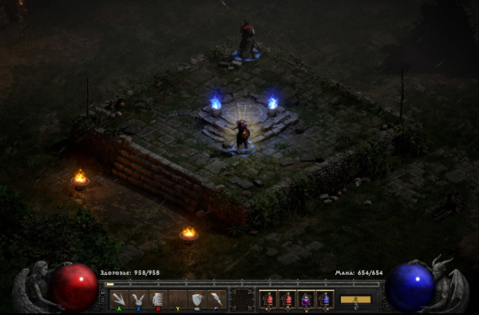
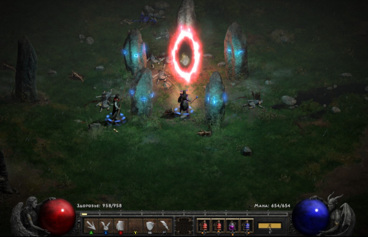
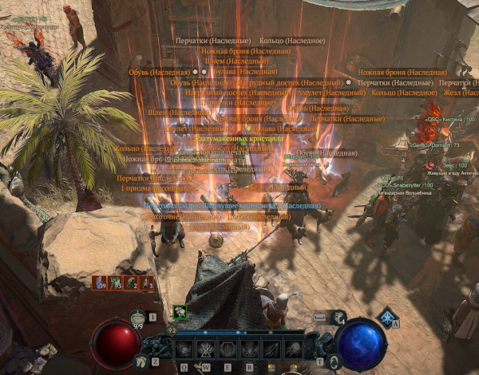
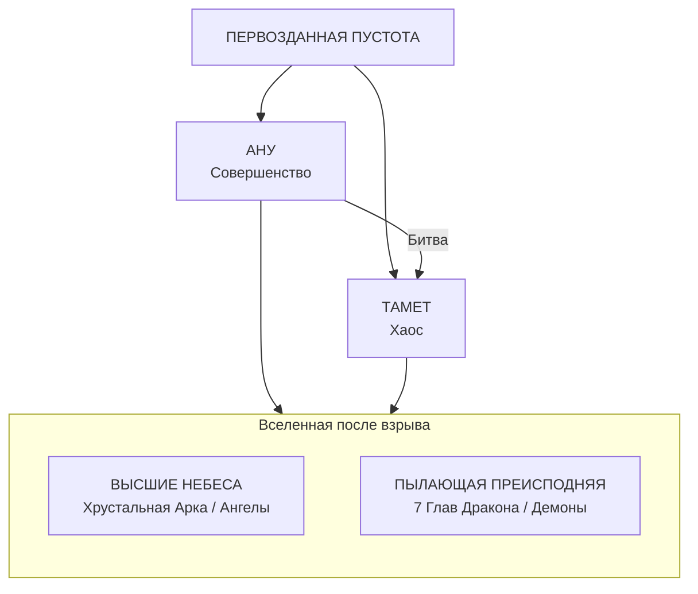
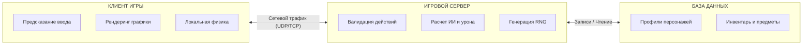

import GameFranchisePlay from '@site/src/components/GameFranchisePlay.jsx';

# Diablo

<GameFranchisePlay franchise="diablo" />

  ОБЯЗАТЕЛЬНО
  ДЛЯ НОВИЧКОВ

Всем

---

## Diablo

## Введение в серию

**Diablo** — это серия компьютерных игр в жанре Action/RPG, разрабатываемая компанией Blizzard Развлечения. Серия стала эталоном для поджанра "Hack and Slash" и оказала колоссальное влияние на развитие индустрии видеоигр, сформировав стандарты геймплея, экономики и сетевого взаимодействия.

Игры серии сосредоточены на исследовании мрачного фэнтезийного мира Санктуарий, где игрок управляет персонажем-героем, сражающимся с ордами демонов Пылающего Ада и силами Небес. Основной цикл игры строится вокруг поиска врагов, получения опыта, улучшения характеристик персонажа и добычи экипировки с уникальными свойствами.

Сюжетные линии игр тесно переплетены и раскрывают историю вечной борьбы между Порядком и Хаосом. Каждая часть серии углубляет лор вселенной, добавляя новые локации, классы персонажей и механики.

---

## История серий и дополнений

Серия **Diablo** представляет собой хронологически упорядоченный набор игр, расширяющих мифологию мира Санктуарий. Каждая часть серии вносит уникальные механики в геймплей, углубляет сюжетную линию и меняет подход к взаимодействию игрока с виртуальным миром. Разработка проектов велась студиями Blizzard North и Blizzard Развлечения, что обеспечило преемственность стиля и качества.

---

## Diablo (1996)

Оригинальная игра серии стала эталоном жанра Action/RPG. Действие разворачивается в городе Тристрам и его подземельях, ведущих в Ад. Игрок управляет одним из трех классов: Воином, Разбойницей или Волшебником.

---

### Особенности игрового процесса

Игра использует процедурную генерацию уровней, что обеспечивает высокую реиграбельность. Каждый проход по подземельям создает новую конфигурацию коридоров, расположения монстров и предметов. Впервые в серии была внедрена система автоматической карты, позволяющая игроку отслеживать пройденные участки.

---

### Классы персонажей
*   **Воин**: Обладает высоким запасом здоровья и эффективен в ближнем бою. Уникальная способность — починка поврежденного оружия и брони.
*   **Разбойница**: Высокая скорость и ловкость. Специализация на стрельбе из лука и обнаружении ловушек.
*   **Волшебник**: Мощные заклинания стихийной магии. Низкий запас здоровья компенсируется способностью наносить урон на расстоянии.

---

### Diablo — Hellfire (1997)

Дополнение, разработанное сторонней студией Sierra Развлечения. Оно добавило новый класс Монаха, новые уровни подземелий и предметы. Контент не считается каноничным для основной вселенной Diablo, но внес вклад в развитие механик серии.

---

## Diablo II (2000)

Вторая часть серии значительно расширила возможности персонажа и глубину игрового мира. Сюжет начинается спустя несколько лет после событий первой игры, когда герой, победивший Диабло, сам становится носителем зла.

---

### Основные нововведения
*   **Система навыков**: Вместо одного навыка каждый класс получил три ветки развития умений, которые можно распределять по своему усмотрению.
*   **Хорадрический Куб**: Инструмент для трансформации предметов, создания новых вещей и улучшения характеристик экипировки.
*   **Рунные слова**: Система комбинирования рун в определенных предметах для получения мощных бонусов.
*   **Талисманы и драгоценные камни**: Новые типы предметов, дающие дополнительные характеристики и свойства.
*   **Сложности**: Введение уровней сложности "Кошмар" и "Ад", повышающих живучесть врагов и улучшающих выпадающие предметы.

---

### Классы персонажей

В базовой версии доступны пять классов: Амазонка, Некромант, Варвар, Колдунья и Паладин.

---

### Diablo II — Lord of Destruction (2001)

Официальное расширение, добавившее два новых класса и завершающее сюжетную арку о Баале.

---

#### Нововведения расширения
*   **Новые классы**: Друид, способный превращаться в волка или медведя, и Ассасин, специализирующийся на ловушках и теневых техниках.
*   **Новый акт**: События переносятся в горы Варваров, где находится гробница Тал Раши.
*   **Руны**: Добавлена возможность создавать предметы с уникальными свойствами через комбинацию рун.
*   **Жестокость**: Увеличены штрафы к сопротивлению стихиям на высоких уровнях сложности.

---

## Diablo III (2012)

Третья часть серии перешла от пошагового режима к динамичному экшену с мгновенным управлением. Игра получила значительные изменения в визуальном стиле и интерфейсе.

---

### Особенности геймплея
*   **Полоса действий**: Замена инвентаря зелий на панель горячих клавиш для быстрого использования умений.
*   **Аукционный дом**: Система торговли предметами между игроками за золотую валюту и реальные деньги. Функция была удалена в 2014 году из-за нарушения баланса экономики игры.
*   **Режим приключений**: Позволял игрокам бесконечно проходить подземелья ради добычи и опыта без привязки к сюжету.
*   **Уровни совершенствования (Paragon)**: Система бесконечного прогресса после достижения максимального уровня персонажа.

---

### Классы персонажей

В игре представлено семь классов: Варвар, Колдун, Чародей, Монах, Охотник на демонов, Крестоносец и Некромант.

---

### Diablo III — Reaper of Souls (2014)

Основное дополнение, изменившее баланс игры и добавившее новый сюжетный акт.

---

#### Нововведения дополнения
*   **Новый класс**: Крестоносец, использующий силу небес и щит для защиты и атаки.
*   **Малтаэль**: Новый антагонист, архангел смерти, стремящийся уничтожить человечество.
*   **Режим приключений**: Полная переработка эндгейм-контента с новыми целями и наградами.
*   **Лут 2.0**: Изменена система выпадения предметов, сделавшая добычу более релевантной для конкретного класса персонажа.
*   **Боевые спутники**: Возможность нанимать NPC для помощи в бою.

---

### Diablo III — Rise of the Necromancer (2017)

Небольшое дополнение, вернувшее класс Некроманта в игру с обновленными способностями.

---

#### Нововведения
*   **Некромант**: Полный пересмотр механики призвания скелетов и управления нежитью.
*   **Новое снаряжение**: Специфические предметы и оружие для некроманта.
*   **Портал дерзаний**: Режим для испытания навыков игрока с высокими наградами.

---

## Diablo II — Resurrected (2021)

Ремастер второй части серии, сохранивший оригинальный игровой движок, но заменивший графику на современную 3D-модель.

---

### Технические особенности
*   **Графика**: Полная перерисовка всех спрайтов, моделей и окружения в высоком разрешении до 4K.
*   **Переключение режимов**: Возможность мгновенно переключаться между классической 2D-графикой и новой 3D-версией.
*   **Мультиплеер**: Поддержка кроссплатформенной игры между различными устройствами.
*   **Общий сундук**: Интеграция системы хранения предметов между всеми персонажами аккаунта.

---

## Diablo IV (2023)

Четвертая часть серии вернулась к мрачной атмосфере и открытому миру, отказавшись от линейной структуры предыдущих игр.

---

### Особенности мира
*   **Открытый мир**: Игровое пространство разделено на пять крупных регионов без загрузки экранов между локациями.
*   **Процедурные подземелья**: Генерация подземелий происходит случайным образом, обеспечивая разнообразие прохождения.
*   **Динамическое событие**: События в мире происходят в реальном времени и влияют на поведение монстров и доступные ресурсы.
*   **Классы персонажей**: Доступны Варвар, Чародей, Друид, Разбойник и Некромант.

---

### Diablo IV — Vessel of Hatred (2024)

Первое крупное дополнение к четвертой части, продолжающее сюжетную линию.

---

#### Нововведения
*   **Новый регион**: Наханту, джунгли, полные древних тайн и опасностей.
*   **Новый класс**: Наследник духов, использующий силы четырех духов-хранителей.
*   **Захват Мефисто**: Сюжетная линия, связанная с попыткой заточить Владыку Ненависти в камень души.
*   **Новые механики**: Внедрение системы путешествий между регионами и новых типов заданий.

---

### Diablo IV — Lord of Hatred (2026)

Второе крупное дополнение к игре, выпущенное 28 апреля 2026 года, которое завершает противостояние с воплощением зла.

---

#### Нововведения

Два новых класса:
- Паладин — классический защитник, использующий силу Священного Света для истребления демонов и способный принимать облик ангела.
- Чернокнижник — мастер запретных обрядов, подчиняющий своей воле демонов Преисподней и способный превращаться в исполинское чудовище.

Новый регион: Острова Сковоса (Skovos). Родина амазонок, чьи земли и жители оказались осквернены ментальным влиянием Мефисто.

Финал истории Мефисто: Сюжетная кампания, в которой Владыка Ненависти восстает в теле пророка Акарата. Игроку предстоит совершить экспедицию к Купелям Творения и изгнать демона в Бездну.

Хорадримский куб: Возвращение легендарной механики крафта, позволяющей полноценно трансформировать, улучшать и настраивать свойства снаряжения.

Талисманы и наборы: Добавление мощных сетовых бонусов, которые открываются с помощью специального предмета — Талисмана.

Обновление эндгейма:Военные планы (War Plans) — система создания собственных цепочек высокоуровневых активностей с настраиваемыми модификаторами и ценными наградами.

Отголоски Ненависти (Echoing Hatred) — режим испытания билдов на прочность против бесконечных волн демонических орд.

Мирные механики: Внедрение полноценной системы рыбалки, позволяющей отдохнуть от уничтожения монстров.

Глобальные изменения для всех: Полная переработка древ умений для всех классов, повышение максимального уровня персонажей и долгожданный встроенный фильтр добычи (Loot Filter)

---

## Diablo Immortal (2022)

Мобильная версия серии, ориентированная на быструю игру и микроплатежи.

---

### Особенности платформы
*   **Управление**: Адаптировано под сенсорные экраны с использованием виртуальных стиков и кнопок.
*   **Онлайн-режим**: Игра требует постоянного подключения к интернету и поддерживает кооперативный мультиплеер.
*   **Классы**: Восемь классов персонажей, включая Бурю и Рыцаря крови.
*   **Экономика**: Акцент на внутриигровую экономику и покупку предметов за реальные деньги.

---

## Сравнительная таблица частей серии

| Название | Год выхода | Основной движок | Ключевая особенность | Количество классов |
| :--- | :--- | :--- | :--- | :--- |
| **Diablo** | 1996 | Proprietary | Процедурная генерация, 3 класса | 3 |
| **Diablo II** | 2000 | Proprietary | Ветки навыков, куб, руны | 5 (+2 в LoD) |
| **Diablo III** | 2012 | Proprietary | Полоса действий, аукцион, парогон | 7 |
| **Diablo IV** | 2023 | Proprietary | Открытый мир, динамические события | 5 (+1 в дополнении) |
| **Immortal** | 2022 | Mobile | Сенсорное управление, онлайн-экономика | 8 |

Каждая часть серии Diablo развивает идеи предшественников, сохраняя ядро жанра — убийство монстров, получение опыта и поиск легендарной экипировки. Развитие технологий позволяет студиям предлагать всё более глубокие миры и сложные механики, оставаясь верными духу тёмного фэнтези.

---

## Лор и Мифология

Мир Diablo представляет собой сложную космогоническую систему, основанную на дуализме абсолютного добра и абсолютного зла. Эта структура определяет все события во вселенной и мотивацию всех существующих рас.

---

### Космогония — Рождение Вселенной

В начале существовала лишь Пустота. Из неё возникло первое совершенное существо, известное как **Ану**, или Идеальный Алмаз. Ану содержал в себе всё сущее: и добро, и зло, и свет, и тьму.

Познание себя привело к тому, что Ану изверг из себя всё негативное и дисгармоничное. Это действие породило его противника — семиглавого дракона **Татамета**, Первородное Зло. Дракон состоял исключительно из хаоса и разрушения.

Между Ану и Татаметом произошла космическая битва, которая закончилась взаимным уничтожением обоих божеств. Взрыв их энергий создал саму вселенную. Останки Ану образовали Высшие Небеса и Хрустальную Арку, на которой покоятся ангелы. Тело Татамета превратилось в Пылающую Преисподнюю, ставшую обителью демонов.

---

### Слы Вселенной

#### Ангелы

Ангелы — это сущности, рожденные из остатков Ану. Они олицетворяют Порядок, гармонию и структуру. Ангелы живут в Небесах и управляются **Ангельским Советом** (Ангирис). Их цель — поддерживать баланс и защищать порядок от вторжения хаоса.

---

#### Демоны

Демоны произошли из голов дракона Татамета. Они являются воплощением Хаоса, страсти и разрушения. Демоны правят Пылающим Адом и постоянно стремятся захватить контроль над миром смертных, чтобы распространить свой хаос на всё сущее.

---

### Воплощения Зла

Ад разделен на иерархию повелителей демонов, известных как Великие Воплощения Зла. Эти сущности обладают огромной властью и представляют различные аспекты зла.

| Имя | Статус | Описание |
| :--- | :--- | :--- |
| **Диабло** | Владыка Ужаса | Олицетворяет страх и ужас. Главный антагонист первой части серии. |
| **Баал** | Владыка Разрушения | Олицетворяет разрушение и безумие. Стремится уничтожить Камень Мироздания. |
| **Мефисто** | Владыка Ненависти | Олицетворяет ненависть и корысть. Мастер манипуляций и интриг. |
| **Андариэль** | Дева Мучений | Младшее Воплощение, олицетворяющее боль и страдание. |
| **Дюриэль** | Владыка Боли | Младшее Воплощение, отвечающее за физическую боль и пытки. |
| **Белиал** | Владыка Лжи | Младшее Воплощение, использующее обман и иллюзии. |
| **Азмодан** | Владыка Греха | Младшее Воплощение, поощряющее пороки и грехи смертных. |

---

### Санктуарий — Тайный Мир

Санктуарий — это скрытый мир, созданный втайне от Небес и Ада. Его основателями стали мятежный ангел **Инарий** и демонисса **Лилит**, дочь Мефисто.

Инарий и Лилит объединились, чтобы создать убежище для своих детей — **нефалемов**. Нефалемы были потомками ангелов и демонов, обладающими невероятной силой, превосходящей силу их родителей. Именно нефалемы стали предками человечества.

Для сокрытия Санктуария от наблюдения высших сил был создан **Камень Мироздания**. Этот артефакт скрывал мир в небытии, делая его невидимым для ангелов и демонов.

---

#### Война Греха

В истории Санктуария происходила тайная война между двумя фракциями:
*   **Триединство**: Культ, поклоняющийся трем Великим Воплощениям Зла (Диабло, Баал, Мефисто).
*   **Собор Света**: Организация, созданная Инарием для защиты людей и противодействия Триединству.

Эта война привела к гибели многих магов-хорадримов, которые пытались заключать демонов в камни душ, чтобы предотвратить их возвращение в мир смертных.

---

## Геймплей и Механики

Геймплей серии Diablo сформировал уникальный паттерн взаимодействия, который часто называют формулой "убей, собери, повтори". Этот цикл обеспечивает постоянный приток дофамина и удерживает игрока в процессе игры.

---

### Классы Героев

Каждый класс в Diablo представляет собой специфический подход к решению задач боя и управления ресурсами. Выбор класса определяет стиль прохождения и тактику.

| Класс | Игры серии | Тип урона / Роль | Ключевые особенности |
|---|---|---|---|
| Воин (Warrior) | Diablo I | Ближний бой (Melee) | Мастер холодного оружия и щитов. Имеет самый высокий показатель защиты и здоровья в первой части. |
| Разбойница (Rogue) | Diablo I | Дальний бой (Ranged) | Эксперт в стрельбе из лука. Быстро обнаруживает и обезвреживает ловушки на уровнях подземелья. |
| Маг (Sorcerer) | Diablo I | Магический (Caster) | Обладает наибольшим запасом маны. Эффективно изучает и применяет заклинания из найденных книг. |
| Монах (Monk) | D1: Hellfire | Ближний бой (Melee) | Сражается посохами или голыми руками. Способен атаковать сразу нескольких врагов по дуге. |
| Бард (Bard) | D1: Hellfire | Гибридный (Melee/Ranged) | Скрытый класс. Может эффективно использовать два оружия одновременно (по одному в каждой руке). |
| Варвар (Barbarian) | D1: Hellfire, DII, DIII, DIV | Ближний бой (Melee) | Использует ресурс "Ярость". Наносит огромный физический урон вблизи и выдерживает сильные удары. |
| Амазонка (Amazon) | Diablo II | Дальний / Средний бой | Специализируется на луках, арбалетах, дротиках и копьях. Призывает валькирию себе на помощь. |
| Некромант (Necromancer) | DII, DIII, DIV | Призыв / Магия | Поднимает армии скелетов и големов из трупов врагов. Использует проклятия, костяную магию и яд. |
| Паладин (Paladin) | Diablo II | Ближний бой / Защита | Использует священные ауры для усиления себя и союзников. Эффективно блокирует удары щитом. |
| Волшебница (Sorceress) | Diablo II, DIV | Магический (Caster) | Повелительница стихий огня, льда и молнии. Зависима от маны, обладает высокой мобильностью за счет телепортации. |
| Ассасин (Assassin) | DII: LoD | Ближний бой / Ловушки | Использует боевые искусства с механиков заряжающих ударов. Устанавливает автономные смертоносные турели-ловушки. |
| Друид (Druid) | DII: LoD, DIV | Гибридный / Призыв | Принимает облик волка или медведя. Призывает питомцев и повелевает силами природы (земля, буря). |
| Колдун (Witch Doctor) | Diablo III | Призыв / Магия вуду | Использует ресурс "Мана". Призывает зомби и собак, насылает чуму, проклятия и ментальный контроль. |
| Охотник на демонов (Demon Hunter) | Diablo III | Дальний бой (Ranged) | Тратит "Ненависть" на атаку и "Концентрацию" на акробатические трюки, скрытность и расстановку ловушек. |
| Монах (Monk) | Diablo III | Ближний бой (Melee) | Тратит "Дух" на стремительные серии ударов, мантры поддержки и мгновенные перемещения к цели. |
| Чародей (Wizard) | Diablo III | Магический (Caster) | Использует "Магическую энергию". Управляет временем, чистой тайной магией, расщепляющими лучами и метеоритами. |
| Крестоносец (Crusader) | DIII: RoS | Ближний / Средний бой | Тяжелобронированный воин. Накапливает "Гнев", использует огромные ростовые щиты и светлую магию. |
| Разбойник (Rogue) | Diablo IV | Гибридный (Melee/Ranged) | Комбинирует кинжалы и луки. Наносит быстрые серии ударов, использует скрытность, ловушки и ядовитые насыщения. |
| Наследник духов (Spiritborn) | DIV: VoH | Ближний бой (Melee) | Призывает силу четырех латиноамериканских духов-хранителей (Ягуар, Горилла, Орёл, Сороконожка) для быстрых комбо. |

---

### Система Прогрессии

Прогрессия персонажа в Diablo строится на двух основных уровнях:

1.  **Вертикальная прогрессия (Уровни)**:
    *   Игрок получает опыт за убийство монстров и выполнение заданий.
    *   Накопление опыта ведет к повышению уровня персонажа.
    *   Каждый новый уровень открывает доступ к новым навыкам или позволяет улучшить существующие.
    *   Характеристики (сила, ловкость, выносливость, энергия) распределяются вручную или автоматически.

2.  **Горизонтальная прогрессия (Paragon)**:
    *   После достижения максимального уровня персонажа открывается система Парегон.
    *   Опыт continues накапливаться, но теперь он идет в общий пул учетной записи.
    *   Игрок получает очки навыков для распределения по категориям: основные характеристики, атакующие, защитные и вспомогательные параметры.
    *   Эта система создает долгосрочную цель для игроков, позволяя бесконечно улучшать своего героя даже после завершения сюжетной кампании.

---

### Система Лута (Loot System)

Генерация предметов в Diablo является одним из самых сложных алгоритмических процессов в игровой индустрии. Она сочетает в себе детерминированные правила и элементы случайности.

| Качество (Редкость) | Diablo I | Diablo II | Diablo III | Diablo IV |
|---|---|---|---|---|
| Обычное (Normal) | Белый | Белый | Белый | Белый |
| Низкое (Low Quality) | — | Серый | — | — |
| Гнездовое (Socketed) | — | Серый | — | — |
| Магическое (Magic) | Сний | Сний | Сний | Сний |
| Редкое (Rare) | — | Желтый | Желтый | Желтый |
| Сет заготовки (Crafted) | — | Оранжевый | — | — |
| Легендарное (Legendary) | — | — | Оранжевый | Оранжевый |
| Комплектное (Set) | — | Зеленый | Зеленый | — |
| Уникальное (Unique) | Золотой | Золотой | — | Уникальный (Светло-золотой) |
| Священное (Sacred) | — | — | — | Редкое / Легендарное / Уникальное |
| Предковое (Ancestral) | — | — | — | Редкое / Легендарное / Уникальное |
| Эфирное (Ethereal) | — | Прозрачное | Прозрачное (Сезонное) | — |
| Древнее (Ancient) | — | — | Оранжевое / Зеленое | — |
| Первозданное (Primal) | — | — | Красная рамка | — |
| Эпохальное (Mythic) | — | — | — | Фиолетовый (Ранее Uber Unique) |

* Diablo I: Простая система. Всего три типа: обычные, синие магические и золотые уникальные предметы.
* Diablo II: Введены серые предметы (с гнездами или сломанные), желтые редкие и зеленые комплекты.
* Diablo III: Уникальные предметы заменены легендарными. Позже добавлены Древние и Первозданные версии для эндгейма.
* Diablo IV: Введены градации мощи мира (Священные и Предковые). Сет-предметы полностью убраны. Самые редкие предметы переименованы из Uber Unique в Мифические.

---

#### Таблицы добычи (Drop Tables)

Каждый монстр в игре привязан к определенному уровню локации (Area Level). Этот уровень определяет максимально возможный уровень выпадающих предметов. Чем выше уровень сложности и локация, тем мощнее может быть найденная экипировка.

---

#### Генератор случайных чисел (RNG)

При убийстве монстра система генерирует предмет на основе следующих параметров:
*   **Тип предмета**: Оружие, броня, украшения или расходные материалы.
*   **Качество**: Обычный, Магический, Редкий, Легендарный или Сетовый.
*   **Уровень**: Определяется уровнем монстра и сложности игры.

---

#### Пул аффиксов

Каждый тип предмета имеет строго определенный набор возможных свойств (аффиксов). Например, меч может иметь свойства, увеличивающие урон, скорость атаки или шанс критического удара. Система выбирает случайное количество свойств из этого пула, создавая уникальный предмет.

---

## Архитектура Выполнения

Серия Diablo, особенно начиная со второй части, представляет собой сложную клиент-серверную архитектуру. Игра не является полностью автономной на стороне клиента; она требует постоянного взаимодействия с центральными серверами для обеспечения целостности данных и безопасности.

---

### Клиент-Серверное Взаимодействие

Основной принцип архитектуры Diablo — авторитаризм сервера. Клиент играет роль терминала, отправляющего команды ввода, в то время как все критически важные расчеты происходят на сервере.

---

#### Серверная логика
*   **Валидация действий**: Сервер проверяет каждое действие игрока на соответствие правилам игры. Если игрок пытается совершить невозможное действие (например, пройти сквозь стену), сервер блокирует его.
*   **Расчет урона**: Все расчеты урона, попаданий и эффектов заклинаний выполняются на сервере. Это предотвращает использование читов, модифицирующих память клиента.
*   **Генерация случайных чисел (RNG)**: Определение выпадения предметов происходит на сервере. Клиент не знает заранее, какой предмет упадет, что исключает возможность подделки лута.

---

#### Клиентская логика
*   **Предсказание ввода (Client-side Prediction)**: Чтобы минимизировать задержку (пинг), клиент мгновенно отображает движение персонажа при получении команды от клавиатуры или мыши. Если сервер возвращает другие координаты, клиент корректирует позицию ("резиновый банджи-эффект").
*   **Рендеринг**: Отрисовка сотен объектов, эффектов заклинаний и динамического освещения выполняется на стороне клиента с использованием графических API (DirectX, Vulkan).
*   **Локальная физика**: Физика смерти монстров и разрушения окружения часто обрабатывается на клиенте для экономии ресурсов сервера, так как эти процессы не влияют на игровой баланс.

---

### Хранение данных

Прогресс персонажа и его инвентарь хранятся в транзакционных базах данных. Каждый предмет в игре имеет уникальный глобальный идентификатор (GUID), что позволяет системе отслеживать каждую вещь и предотвращать дублирование (дюп) предметов.

Система синхронизирует данные между разными платформами, позволяя игрокам продолжать игру на разных устройствах. Инвентарь персонажа обновляется в реальном времени при взаимодействии с сервером.

---

## Культурное Влияние и Наследие

Diablo изменила ландшафт индустрии видеоигр, внедрив концепции, которые стали стандартом для современных проектов.

---

### Развитие Жанров

Механика Loot-Shooter, основанная на постоянном поиске и улучшении экипировки, была напрямую вдохновлена Diablo. Без этой системы не существовало бы таких успешных серий, как Borderlands, Destiny или The Division.

---

### Геймерский Сленг

Терминология, введенная серией Diablo, прочно закрепилась в языке игроков по всему миру:
*   **Фарм (Farm)**: Процесс многократного повторения одного и того же действия для получения ресурсов или предметов.
*   **Билд (Build)**: Конкретная комбинация навыков, характеристик и экипировки, оптимизированная для определенного стиля игры.
*   **Ран (Run)**: Повторное прохождение подземелья или локации с целью получения конкретных предметов.

---

### Эстетика Grimdark

Музыкальное сопровождение, созданное Мэттом Ульменом, стало культовым. Использование 12-струнной гитары в теме города Тристрам создало эталон мрачной атмосферы, определившей визуальный и звуковой стиль целого поколения игр в жанре темного фэнтези.

---

### Влияние на Экономику Игр

Диалоги вокруг аукциона в Diablo III вызвали широкие дискуссии о роли реальных денег в виртуальной экономике. Закрытие аукциона показало важность баланса между коммерческими интересами разработчиков и сохранением игрового процесса, основанного на усилиях самого игрока.

---
