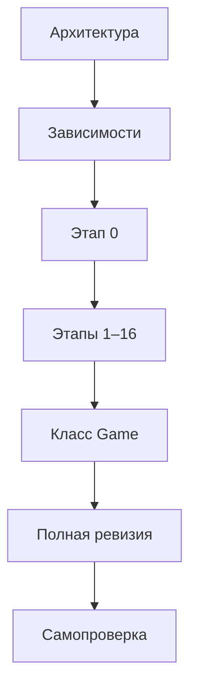
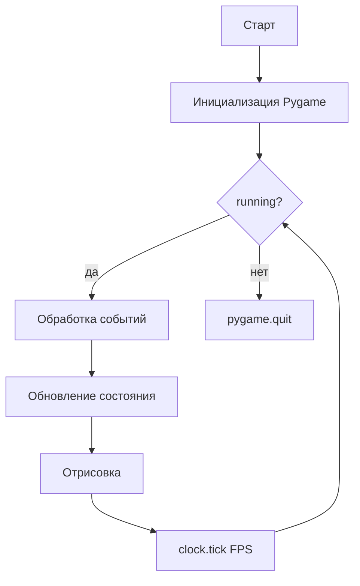
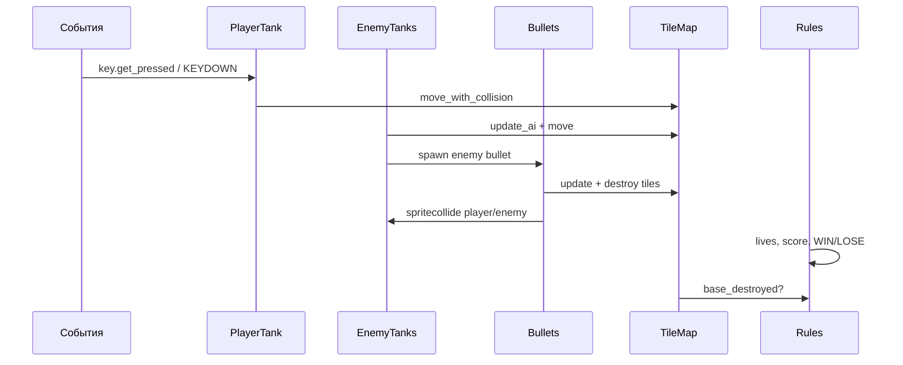
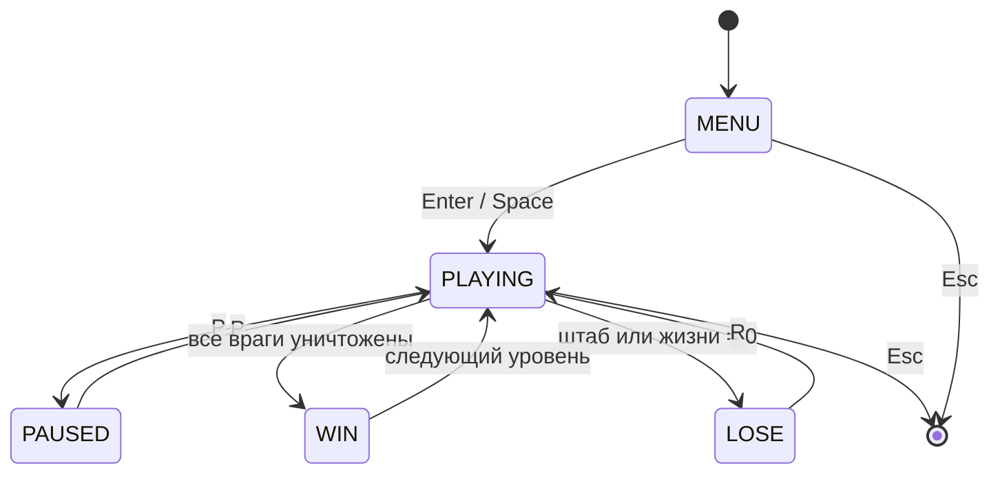
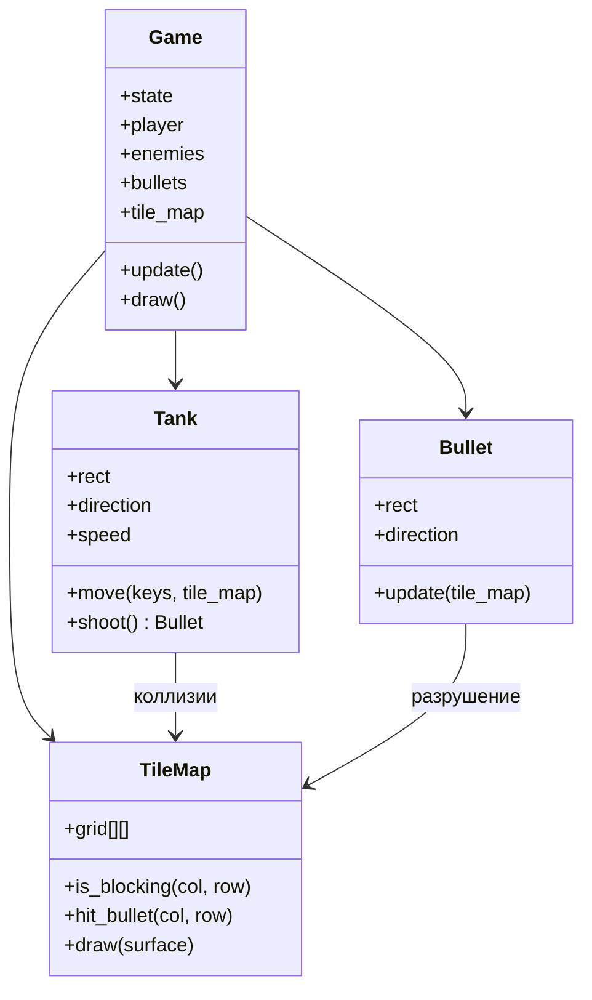

# Python — Battle City

<div class="article-tags">
  <span class="tag tag-beginner">НАЧАЛЬНЫЙ</span>
</div>

<span class="complexity-badge">Разработчику</span>
<span class="complexity-badge">Начальный уровень</span>

---

## О практикуме

**Battle City** (Танчики, Tank 1990) — аркада на сетке: игрок на танке защищает штаб, разрушает кирпичи, уничтожает вражеские танки. В этом практикуме соберём **узнаваемый прототип** на **Python 3** и **Pygame** — без спрайтов из оригинала, на цветных прямоугольниках, зато с полным разбором архитектуры и логики.

### Откуда взялась игра

| Год | Событие |
|-----|---------|
| 1985 | **Battle City** на Famicom/NES (Namco) — кооператив на одном экране, редактор карт, 35 уровней |
| 1990-е | Клоны «Танчики 1990» в DOS и на телевизионных приставках |
| Сейчас | Жанр **top-down tank shooter** жив в веб- и mobile-клонах; логика сетки и волн врагов — учебный эталон |

Механики, которые мы воспроизводим:

- карта из **тайлов** фиксированного размера;
- танк движется по **четырём направлениям**, стреляет **одной активной пулей** (у игрока);
- **кирпич** разрушается, **бетон** — нет;
- **штаб** (орёл) внизу карты — главная цель защиты;
- враги **спавнятся волнами** с верхней кромки.

<div class="callout callout--info">
  <div class="callout-title">Для кого материал</div>
  Нужны базовые Python (классы, списки, циклы) и знакомство с Pygame из статьи <a href="/encyclopedia/5-languages/5-02-python/312">Разработка игр на Python</a>. Каждый этап — <strong>запускаемый код</strong>: после шага проект можно запустить и увидеть новую механику.
</div>

### Наш прототип и NES-оригинал

| Аспект | NES Battle City | Этот практикум |
|--------|-----------------|----------------|
| Размер карты | 26×26 тайлов (13×13 «мета-клеток» по 2×2) | 13×13 тайлов (этап 16 — масштабирование) |
| Графика | Спрайты 16×16 | Цветные `Rect`, позже — PNG |
| Игроки | 2 на одном экране | 1 (кооп — упражнение) |
| Бонусы | Звезда, лопата, танк, граната… | Этап 15 — звезда и лопата |
| Пули | До 1 у игрока; у врагов — свои правила | 1 пуля игрока; список пуль врагов |
| Кирпич | Половина блока за выстрел | Этап 6 — четверть тайла (2×2 sub-grid) |

<div class="callout callout--tip">
  <div class="callout-title">Как читать длинную статью</div>
  Идите этапы по порядку. Пропускать можно только блок «Архитектура», если уже делали игры на Pygame. Если на каком-то этапе код перестал запускаться — откройте <a href="#full-revision">полную ревизию файлов</a> в конце статьи и сверьте проект с проверенным эталоном.
</div>

## Как проходить практикум

- Копируйте **целиком** файлы из блоков кода этапа, а не отдельные фрагменты — иначе легко потерять импорты и функции отрисовки.
- После **каждого** этапа запускайте `python main.py` и пройдите чек-лист самопроверки, прежде чем переходить дальше.
- Читайте подразделы **«Разбор»** — там объясняется, зачем нужен каждый файл и как он связан с предыдущими этапами.
- Используйте **итоговую самопроверку** в конце статьи как финальный чек-лист готового прототипа.
- Если сборка «рассыпается» на середине пути — скопируйте все файлы из раздела [Полная ревизия файлов](#full-revision) и продолжайте с нужного этапа.

**Управление в финальной версии**

| Клавиша | Действие |
|---------|----------|
| `W` `A` `S` `D` или стрелки | Движение танка |
| `Пробел` | Выстрел |
| `P` | Пауза |
| `R` | Перезапуск уровня (после поражения) |
| `Esc` | Выход |

**Маршрут чтения**

1. [Архитектура](#architecture) — как устроен проект до первой строки кода.
2. [Зависимости и структура папок](#dependencies) — окружение и файлы.
3. [Этап 0 — минимальный запуск](#stage-0) — чёрное окно и игровой цикл.
4. [Этапы 1–16](#stages-overview) — по одной механике за шаг.
5. [Полный листинг `Game`](#full-game-class) — финальная архитектура.
6. [Полная ревизия файлов](#full-revision) — проверенный эталон для копирования целиком.
7. [Итоговая самопроверка](#final-checklist).



### Сводная таблица этапов

<span id="stages-overview"></span>

| Этап | Тема | Новая механика | Ключевые файлы |
|------|------|----------------|----------------|
| [0](#stage-0) | Запуск | Окно, цикл, `Esc` | `main.py` |
| [1](#stage-1) | Поле | Сетка, HUD-заглушка | `settings.py` |
| [2](#stage-2) | Карта | `TileMap`, `.txt` уровень | `game/map.py`, `levels/` |
| [3](#stage-3) | Игрок | `Tank`, WASD | `game/tank.py` |
| [4](#stage-4) | Стены | Коллизии, откат по оси | `game/collision.py` |
| [5](#stage-5) | Выстрел | `Bullet`, разрушение `#` | `game/bullet.py` |
| [6](#stage-6) | Кирпич | Четверть-блока, вспышка | `map.py` sub-grid |
| [7](#stage-7) | Враги | Спавн, простой ИИ | `EnemyTank` |
| [8](#stage-8) | Урон | Жизни, респawn, неуязвимость | `main.py` |
| [9](#stage-9) | Правила | WIN / LOSE, штаб | состояния |
| [10](#stage-10) | HUD | Очки, иконки жизней | `game/hud.py` |
| [11](#stage-11) | UI | Меню, пауза | `game/states.py` |
| [12](#stage-12) | Уровни | `level_02.txt`, цепочка | `settings.LEVELS` |
| [13](#stage-13) | Полировка | Лес поверх танка, вода | двойной draw |
| [14](#stage-14) | Рефакторинг | Класс `Game` | `game/game.py` |
| [15](#stage-15) | Бонусы | Звезда, лопата | `game/powerup.py` |
| [16](#stage-16) | Масштаб | Карта 26×26 | `settings.py` |

---

<span id="architecture"></span>
## Архитектура

Прежде чем писать код, зафиксируем **что из чего состоит** и **как данные текут по кадру**.

### Игровой цикл

Любая игра на Pygame крутит один и тот же цикл. В Battle City порядок шагов важен — сначала ввод и логика, потом отрисовка.



На каждом кадре внутри **обновления** выполняется цепочка:

1. Прочитать нажатые клавиши.
2. Обновить игрока (направление, позиция).
3. Обновить врагов (ИИ, движение).
4. Обновить пули (полёт, столкновения).
5. Применить разрушение тайлов и проверить победу/поражение.

### Слои приложения

| Слой | Ответственность | Примеры сущностей |
|------|-----------------|-------------------|
| **Ввод** | События клавиатуры, пауза, выход | `KEYDOWN`, `KEYUP`, `QUIT` |
| **Мир** | Сетка тайлов, коллизии со стенами | `TileMap`, типы блоков |
| **Акторы** | Танки и пули | `PlayerTank`, `EnemyTank`, `Bullet` |
| **Правила** | Жизни, очки, спавн врагов, победа | `GameState`, счётчики |
| **Представление** | Рисование поля, HUD, экраны | `draw_map`, `draw_hud` |

Слой **правил** не рисует напрямую — он меняет состояние; слой **представления** только читает состояние и выводит кадр. Так проще тестировать логику и менять графику.

### Поток данных одного кадра

Когда игра в состоянии `PLAYING`, порядок вызовов фиксирован — нарушение порядка даёт типичные баги (пуля проходит сквозь стену, враг «телепортируется»).



| Если обновить … до … | Типичный баг |
|---------------------|--------------|
| Пули до движения танка | Пуля «отстаёт» от ствола на 1 кадр |
| Отрисовку до `update` | Кадр показывает прошлое состояние (ghosting) |
| Спавн врага без проверки клетки | Танк застревает внутри стены |
| WIN до удаления последнего врага | Экран победы на кадр раньше взрыва |

### Координатная система

Классическая карта Battle City — **прямоугольная сетка**. Удобно хранить мир в **тайлах**, а танки — в **пикселях** с привязкой к сетке.

```
Экран (пиксели)
┌──────────────────────────────────┬─────────┐
│                                  │  HUD    │
│   Игровое поле                   │  жизни  │
│   MAP_COLS × TILE_SIZE           │  враги  │
│   MAP_ROWS × TILE_SIZE           │  уровень│
│                                  │         │
└──────────────────────────────────┴─────────┘
```

Рекомендуемые константы (можно менять, но **все модули должны брать размеры из одного места**):

| Константа | Значение | Смысл |
|-----------|----------|-------|
| `TILE_SIZE` | `32` | Размер клетки в пикселях |
| `MAP_COLS`, `MAP_ROWS` | `13` | Поле 13×13 (компактно для учебника; в оригинале 26×26) |
| `HUD_WIDTH` | `160` | Полоса статуса справа |
| `FPS` | `60` | Кадров в секунду |

Перевод **пиксели ↔ тайл**:

```python
def tile_at_px(x, y):
    return x // TILE_SIZE, y // TILE_SIZE

def rect_tiles(rect):
    """Какие тайлы пересекает прямоугольник танка."""
    left = rect.left // TILE_SIZE
    right = (rect.right - 1) // TILE_SIZE
    top = rect.top // TILE_SIZE
    bottom = (rect.bottom - 1) // TILE_SIZE
    return left, top, right, bottom
```

### Типы тайлов

| Код | Имя | Танк | Пуля | Поведение |
|-----|-----|------|------|-----------|
| `.` | пусто | проезд | летит | — |
| `#` | кирпич | блок | разрушает | исчезает |
| `@` | бетон | блок | блок (обычная пуля) | неразрушим |
| `~` | вода | блок | летит | декоративное препятствие |
| `%` | лес | проезд | летит | танк рисуется «под» травой (этап 13) |
| `*` | штаб | блок | поражение | уничтожение = game over |

Уровень храним как **многострочный текст** — удобно править в редакторе без JSON.

### Конечный автомат состояний

Игра переключается между экранами через явное поле `state`:



Состояния `MENU`, `PLAYING`, `PAUSED`, `WIN`, `LOSE` — отдельные ветки в `update()` и `draw()`.

### Структура файлов (целевая)

К **этапу 6** достаточно одного `main.py`. Дальше проект **раскладываем по модулям** — так же строят небольшие indie-проекты.

```
battle_city/
├── main.py              # точка входа, цикл while
├── settings.py          # константы, цвета, FPS
├── assets/              # позже — звуки и картинки
├── levels/
│   ├── level_01.txt
│   └── level_02.txt
├── game/
│   ├── __init__.py
│   ├── constants.py     # DIR_UP … DIR_LEFT — без циклических импортов
│   ├── map.py           # TileMap — загрузка и коллизии
│   ├── tank.py          # Tank, PlayerTank, EnemyTank
│   ├── bullet.py        # Bullet, пул пуль
│   ├── collision.py     # rect vs tiles
│   ├── hud.py           # панель справа
│   └── states.py        # MENU / PLAYING / …
└── requirements.txt
```

<div class="callout callout--tip">
  <div class="callout-title">Почему сетка, а не «свободная» физика</div>
  Battle City задуман как **дискретная аркада**: стены ровно по клеткам, танк выравнивается по направлению. Коллизии через пересечение <code>Rect</code> с тайлами проще, чем полноценный physics engine, и дают тот же геймплей.
</div>

### Диаграмма объектов на кадре



---

<span id="dependencies"></span>
## Зависимости и подготовка окружения

### Требования

- **Python 3.10+** (удобны `match`/`case`; на 3.9 код тоже работает, если заменить `match` на `if/elif`).
- **Pygame 2.5+** — единственная внешняя библиотека.

### Установка

```bash
mkdir battle_city && cd battle_city
python -m venv .venv
```

Активация виртуального окружения:

- **Windows (PowerShell):** `.venv\Scripts\Activate.ps1`
- **Linux / macOS:** `source .venv/bin/activate`

```bash
pip install pygame
python -c "import pygame; print('Pygame', pygame.ver)"
```

Файл `requirements.txt`:

```
pygame>=2.5.0
```

### Первичная структура

На **этапе 0** создайте только `main.py`. Папки `levels/` и `game/` добавим по ходу.

### Запуск из IDE и рабочая директория

Pygame ищет `levels/level_01.txt` **относительно текущей папки процесса**, а не файла `main.py`. Если запускаете из Cursor/VS Code кнопкой Run, задайте `cwd` проекта:

```json
{
  "version": "0.2.0",
  "configurations": [
    {
      "name": "Battle City",
      "type": "debugpy",
      "request": "launch",
      "program": "${workspaceFolder}/battle_city/main.py",
      "cwd": "${workspaceFolder}/battle_city",
      "console": "integratedTerminal"
    }
  ]
}
```

Универсальный путь к ресурсам (в `settings.py` с этапа 1):

```python
from pathlib import Path

ROOT = Path(__file__).resolve().parent
LEVELS_DIR = ROOT / "levels"
```

Загрузка: `TileMap.load_file(S.LEVELS_DIR / "level_01.txt")`.

### README проекта

Минимальный `README.md` в корне `battle_city/`:

```markdown
# Battle City (Pygame)

## Запуск
python -m venv .venv
.venv\Scripts\activate      # Windows
pip install -r requirements.txt
python main.py

## Управление
WASD / стрелки — движение, Space — выстрел, P — пауза, R — рестарт уровня.
```

<div class="callout callout--warning">
  <div class="callout-title">Кодировка уровней</div>
  Файлы уровней сохраняйте в <strong>UTF-8</strong>. Откройте их в VS Code / Cursor и проверьте кодировку в статус-баре. На Windows блокнот иногда сохраняет CP1251 — тогда символы карты «ломаются».
</div>

---

<span id="stage-0"></span>
## Этап 0 — минимальный запускаемый код

**Цель** — окно, цикл событий, выход по крестику и `Esc`, стабильные 60 FPS.

Создайте `main.py`:

```python
import sys
import pygame

pygame.init()

SCREEN_W, SCREEN_H = 800, 600
FPS = 60

screen = pygame.display.set_mode((SCREEN_W, SCREEN_H))
pygame.display.set_caption("Battle City — этап 0")
clock = pygame.time.Clock()

running = True
while running:
    for event in pygame.event.get():
        if event.type == pygame.QUIT:
            running = False
        elif event.type == pygame.KEYDOWN and event.key == pygame.K_ESCAPE:
            running = False

    screen.fill((20, 20, 30))
    pygame.display.flip()
    clock.tick(FPS)

pygame.quit()
sys.exit()
```

### Разбор

`pygame.init()` подготавливает подсистемы Pygame (дисплей, ввод, таймер). Цикл `while running` — каркас любой игры: сначала обрабатываем события (`QUIT`, `Esc`), затем рисуем кадр (`fill` + `display.flip`), и `clock.tick(FPS)` ограничивает скорость до 60 кадров в секунду. На следующих этапах тело цикла расширяется, но эта структура остаётся неизменной.

Запуск:

```bash
python main.py
```

**Самопроверка этапа 0**

- [ ] Окно открывается без traceback.
- [ ] Фон тёмно-синий, без мерцания.
- [ ] `Esc` и крестик закрывают программу.

На следующих этапах **не удаляем** цикл — только расширяем тело `while`.

---

<span id="stage-1"></span>
## Этап 1 — константы и игровое поле

**Цель** — вынести настройки в `settings.py`, нарисовать сетку и зону HUD.

`settings.py`:

```python
from pathlib import Path

ROOT = Path(__file__).resolve().parent
LEVELS_DIR = ROOT / "levels"

TILE_SIZE = 32
MAP_COLS = 13
MAP_ROWS = 13
HUD_WIDTH = 160

FIELD_W = MAP_COLS * TILE_SIZE
FIELD_H = MAP_ROWS * TILE_SIZE
SCREEN_W = FIELD_W + HUD_WIDTH
SCREEN_H = FIELD_H

FPS = 60

# Цвета (R, G, B)
COLOR_BG = (24, 24, 32)
COLOR_GRID = (40, 40, 55)
COLOR_HUD = (16, 16, 24)
COLOR_HUD_TEXT = (220, 220, 230)
```

Обновите `main.py`:

```python
import sys
import pygame
import settings as S

pygame.init()
screen = pygame.display.set_mode((S.SCREEN_W, S.SCREEN_H))
pygame.display.set_caption("Battle City — этап 1")
clock = pygame.time.Clock()
font = pygame.font.SysFont("consolas", 18)


def draw_field(surface):
    surface.fill(S.COLOR_BG, (0, 0, S.FIELD_W, S.FIELD_H))
    for c in range(S.MAP_COLS + 1):
        x = c * S.TILE_SIZE
        pygame.draw.line(surface, S.COLOR_GRID, (x, 0), (x, S.FIELD_H))
    for r in range(S.MAP_ROWS + 1):
        y = r * S.TILE_SIZE
        pygame.draw.line(surface, S.COLOR_GRID, (0, y), (S.FIELD_W, y))


def draw_hud_placeholder(surface):
    hud_rect = pygame.Rect(S.FIELD_W, 0, S.HUD_WIDTH, S.SCREEN_H)
    pygame.draw.rect(surface, S.COLOR_HUD, hud_rect)
    label = font.render("HUD", True, S.COLOR_HUD_TEXT)
    surface.blit(label, (S.FIELD_W + 12, 12))


running = True
while running:
    for event in pygame.event.get():
        if event.type == pygame.QUIT:
            running = False
        elif event.type == pygame.KEYDOWN and event.key == pygame.K_ESCAPE:
            running = False

    draw_field(screen)
    draw_hud_placeholder(screen)
    pygame.display.flip()
    clock.tick(S.FPS)

pygame.quit()
sys.exit()
```

**Самопроверка**

- [ ] Справа серая полоса HUD.
- [ ] Сетка 13×13 клеток по 32 px.
- [ ] Размер окна ровно `576 + 160` по ширине.

---

<span id="stage-2"></span>
## Этап 2 — карта уровня из текста

**Цель** — класс `TileMap`, загрузка из строки/файла, отрисовка кирпича, бетона, воды и штаба.

Создайте `levels/level_01.txt`:

```
..........#..
..........#..
..##..##..#..
..##..##..#..
..##..##.....
..##..##..@..
..........@..
....##....@..
....##....*..
....##.......
....##.......
............. 
............. 
```

Создайте `game/map.py`:

```python
import pygame
import settings as S

TILE_EMPTY = "."
TILE_BRICK = "#"
TILE_STEEL = "@"
TILE_WATER = "~"
TILE_FOREST = "%"
TILE_BASE = "*"

TILE_COLORS = {
    TILE_BRICK: (180, 90, 50),
    TILE_STEEL: (140, 140, 150),
    TILE_WATER: (40, 80, 200),
    TILE_FOREST: (30, 120, 40),
    TILE_BASE: (220, 200, 60),
}


class TileMap:
    def __init__(self, rows):
        self.rows = [list(row.ljust(S.MAP_COLS)[: S.MAP_COLS]) for row in rows]
        if len(self.rows) < S.MAP_ROWS:
            self.rows += [list(TILE_EMPTY * S.MAP_COLS)] * (S.MAP_ROWS - len(self.rows))
        self.rows = self.rows[: S.MAP_ROWS]

    @classmethod
    def load_file(cls, path):
        with open(path, encoding="utf-8") as f:
            lines = [line.rstrip("\n") for line in f if line.strip()]
        return cls(lines)

    def get(self, col, row):
        if 0 <= col < S.MAP_COLS and 0 <= row < S.MAP_ROWS:
            return self.rows[row][col]
        return TILE_STEEL  # за пределами карты — «стена»

    def is_blocking_tank(self, col, row):
        t = self.get(col, row)
        return t in (TILE_BRICK, TILE_STEEL, TILE_WATER, TILE_BASE)

    def is_blocking_bullet(self, col, row):
        t = self.get(col, row)
        return t in (TILE_BRICK, TILE_STEEL)

    def destroy_at(self, col, row):
        if self.get(col, row) == TILE_BRICK:
            self.rows[row][col] = TILE_EMPTY
            return True
        return False

    def base_destroyed(self):
        for row in self.rows:
            if TILE_BASE in row:
                return False
        return True

    def draw(self, surface):
        for r in range(S.MAP_ROWS):
            for c in range(S.MAP_COLS):
                tile = self.get(c, r)
                if tile == TILE_EMPTY:
                    continue
                color = TILE_COLORS.get(tile, (255, 0, 255))
                rect = pygame.Rect(c * S.TILE_SIZE, r * S.TILE_SIZE, S.TILE_SIZE, S.TILE_SIZE)
                pygame.draw.rect(surface, color, rect)
                if tile == TILE_BRICK:
                    # простая «кладка» — линии
                    x, y = rect.topleft
                    pygame.draw.line(surface, (120, 60, 30), (x, y + 10), (x + S.TILE_SIZE, y + 10))
                    pygame.draw.line(surface, (120, 60, 30), (x + 16, y), (x + 16, y + S.TILE_SIZE))
```

Пустой `game/__init__.py` и обновление `main.py`:

```python
import sys
import pygame
import settings as S
from game.map import TileMap

pygame.init()
screen = pygame.display.set_mode((S.SCREEN_W, S.SCREEN_H))
pygame.display.set_caption("Battle City — этап 2")
clock = pygame.time.Clock()
font = pygame.font.SysFont("consolas", 18)

tile_map = TileMap.load_file(S.LEVELS_DIR / "level_01.txt")


def draw_field(surface):
    surface.fill(S.COLOR_BG, (0, 0, S.FIELD_W, S.FIELD_H))
    for c in range(S.MAP_COLS + 1):
        x = c * S.TILE_SIZE
        pygame.draw.line(surface, S.COLOR_GRID, (x, 0), (x, S.FIELD_H))
    for r in range(S.MAP_ROWS + 1):
        y = r * S.TILE_SIZE
        pygame.draw.line(surface, S.COLOR_GRID, (0, y), (S.FIELD_W, y))


def draw_hud_placeholder(surface):
    hud_rect = pygame.Rect(S.FIELD_W, 0, S.HUD_WIDTH, S.SCREEN_H)
    pygame.draw.rect(surface, S.COLOR_HUD, hud_rect)
    label = font.render("HUD", True, S.COLOR_HUD_TEXT)
    surface.blit(label, (S.FIELD_W + 12, 12))


running = True
while running:
    for event in pygame.event.get():
        if event.type == pygame.QUIT:
            running = False
        elif event.type == pygame.KEYDOWN and event.key == pygame.K_ESCAPE:
            running = False

    draw_field(screen)
    tile_map.draw(screen)
    draw_hud_placeholder(screen)
    pygame.display.flip()
    clock.tick(S.FPS)

pygame.quit()
sys.exit()
```

**Самопроверка**

- [ ] Кирпич коричневый, бетон серый, штаб (`*`) жёлтый внизу карты.
- [ ] Карта ровно 13 строк; лишние символы обрезаются.

---

<span id="stage-3"></span>
## Этап 3 — танк игрока без коллизий

**Цель** — класс танка, четыре направления, плавное движение по WASD / стрелкам.

**Файлы этапа:** `game/tank.py`, правки `main.py`.

`game/tank.py` (начало файла):

```python
import pygame
import settings as S

DIR_UP, DIR_RIGHT, DIR_DOWN, DIR_LEFT = 0, 1, 2, 3
TANK_SIZE = S.TILE_SIZE - 4
PLAYER_SPEED = 2


def _draw_tank_surface(color, direction):
    """Отдельная поверхность под каждое направление — «ствол» смотрит в сторону хода."""
    surf = pygame.Surface((TANK_SIZE, TANK_SIZE), pygame.SRCALPHA)
    surf.fill(color)
    barrel = (30, 30, 30)
    w = TANK_SIZE
    if direction == DIR_UP:
        pygame.draw.rect(surf, barrel, (w // 2 - 2, 0, 4, w // 2))
    elif direction == DIR_DOWN:
        pygame.draw.rect(surf, barrel, (w // 2 - 2, w // 2, 4, w // 2))
    elif direction == DIR_LEFT:
        pygame.draw.rect(surf, barrel, (0, w // 2 - 2, w // 2, 4))
    else:
        pygame.draw.rect(surf, barrel, (w // 2, w // 2 - 2, w // 2, 4))
    return surf


class Tank(pygame.sprite.Sprite):
    def __init__(self, x, y, color):
        super().__init__()
        self.color = color
        self.direction = DIR_UP
        self._surfaces = {d: _draw_tank_surface(color, d) for d in range(4)}
        self.image = self._surfaces[self.direction]
        self.rect = self.image.get_rect(topleft=(x, y))
        self.speed = PLAYER_SPEED
        self.alive = True

    def handle_input(self, keys, tile_map=None):
        dx = dy = 0
        if keys[pygame.K_w] or keys[pygame.K_UP]:
            dy, self.direction = -self.speed, DIR_UP
        if keys[pygame.K_s] or keys[pygame.K_DOWN]:
            dy, self.direction = self.speed, DIR_DOWN
        if keys[pygame.K_a] or keys[pygame.K_LEFT]:
            dx, self.direction = -self.speed, DIR_LEFT
        if keys[pygame.K_d] or keys[pygame.K_RIGHT]:
            dx, self.direction = self.speed, DIR_RIGHT
        self.image = self._surfaces[self.direction]
        if tile_map is None:
            self.rect.x += dx
            self.rect.y += dy
        else:
            self.move_with_collision(dx, dy, tile_map)
        self._clamp_to_field()

    def _clamp_to_field(self):
        self.rect.left = max(0, self.rect.left)
        self.rect.top = max(0, self.rect.top)
        self.rect.right = min(S.FIELD_W, self.rect.right)
        self.rect.bottom = min(S.FIELD_H, self.rect.bottom)

    def draw(self, surface):
        surface.blit(self.image, self.rect)
```

В `main.py` после загрузки карты:

```python
from game.tank import Tank

player = Tank(S.TILE_SIZE * 4, S.TILE_SIZE * 12, (80, 200, 80))

# в цикле, после событий:
keys = pygame.key.get_pressed()
player.handle_input(keys)  # tile_map подключим на этапе 4

# отрисовка:
draw_field(screen)
tile_map.draw(screen)
player.draw(screen)
```

<div class="callout callout--info">
  <div class="callout-title">Этап 3 — без коллизий</div>
  На этом этапе вызывайте <code>player.handle_input(keys)</code> <strong>без</strong> второго аргумента <code>tile_map</code>. Метод сам сдвигает танк напрямую, пока <code>move_with_collision</code> не подключён на этапе 4.
</div>

**Самопроверка**

- [ ] Зелёный квадрат двигается по полю.
- [ ] При смене направления «ствол» поворачивается (видно даже на прямоугольниках).
- [ ] Танк не выходит за границы серого поля (но **пока проезжает сквозь стены** — это этап 4).

<div class="callout callout--note">
  <div class="callout-title">Оригинал и «прилипание» к сетке</div>
  В NES-версии танк визуально выравнивается по клетке при повороте. Для аркадного ощущения можно после каждого поворота подтягивать координату к ближайшему кратному 2 px — упражнение на этапе 13. Базовый прототип этого не требует.
</div>

---

<span id="stage-4"></span>
## Этап 4 — коллизии танка со стенами

**Цель** — после движения откатывать позицию, если `Rect` танка пересекает блокирующий тайл.

`game/collision.py`:

```python
import settings as S
from game.map import TileMap


def rect_tile_range(rect):
    left = rect.left // S.TILE_SIZE
    right = (rect.right - 1) // S.TILE_SIZE
    top = rect.top // S.TILE_SIZE
    bottom = (rect.bottom - 1) // S.TILE_SIZE
    return left, top, right, bottom


def tank_hits_wall(rect, tile_map: TileMap):
    left, top, right, bottom = rect_tile_range(rect)
    for row in range(top, bottom + 1):
        for col in range(left, right + 1):
            if tile_map.is_blocking_tank(col, row):
                return True
    return False
```

Добавьте в `Tank` метод:

```python
from game.collision import tank_hits_wall

def move_with_collision(self, dx, dy, tile_map):
    if dx:
        self.rect.x += dx
        if tank_hits_wall(self.rect, tile_map):
            self.rect.x -= dx
    if dy:
        self.rect.y += dy
        if tank_hits_wall(self.rect, tile_map):
            self.rect.y -= dy
```

И перепишите `handle_input` — на этапе 4 передавайте `tile_map`:

```python
player.handle_input(keys, tile_map)
```

На этапе 3 `move_with_collision` ещё не вызывался — метод добавляется здесь же в класс `Tank`.

**Самопроверка**

- [ ] Танк останавливается у кирпича и бетона.
- [ ] Вода (`~`) тоже непроходима (как в оригинале).
- [ ] Движение по диагонали не «проскальзывает» сквозь угол — откат по оси X и Y раздельно.

<div class="callout callout--tip">
  <div class="callout-title">Техника «пробное смещение»</div>
  Сначала двигаем по одной оси, проверяем стену, при столкновении откатываем. Так реализовано большинство top-down танковых аркад без физического движка.
</div>

---

<span id="stage-5"></span>
## Этап 5 — пули и выстрел

**Цель** — одна пуля игрока на экране (как в классике), полёт, исчезновение у стены.

### Матрица взаимодействий пули

| Объект | Пуля игрока | Пуля врага |
|--------|-------------|------------|
| Кирпич `#` | Разрушает, пуля гаснет | То же |
| Бетон `@` | Пуля гаснет | Пуля гаснет |
| Вода `~` | Пролетает | Пролетает |
| Штаб `*` | Поражение | Поражение |
| Танк игрока | — | Урон + респawn |
| Танк врага | Уничтожение | — |
| Другая пуля | Этап 8 — обе гаснут | Этап 8 |

Создайте `game/constants.py` — общие константы направлений (нужны и танку, и пуле, без циклического импорта):

```python
DIR_UP, DIR_RIGHT, DIR_DOWN, DIR_LEFT = 0, 1, 2, 3
```

`game/bullet.py`:

```python
import pygame
import settings as S
from game.collision import rect_tile_range
from game.map import TileMap, TILE_BASE
from game.constants import DIR_UP, DIR_RIGHT, DIR_DOWN, DIR_LEFT

BULLET_SIZE = 6
BULLET_SPEED = 6


class Bullet(pygame.sprite.Sprite):
    def __init__(self, x, y, direction, owner):
        super().__init__()
        self.image = pygame.Surface((BULLET_SIZE, BULLET_SIZE))
        self.image.fill((250, 250, 100))
        self.rect = self.image.get_rect(center=(x, y))
        self.direction = direction
        self.owner = owner  # "player" | "enemy"
        self.active = True

    def update(self, tile_map: TileMap):
        if not self.active:
            return
        if self.direction == DIR_UP:
            self.rect.y -= BULLET_SPEED
        elif self.direction == DIR_DOWN:
            self.rect.y += BULLET_SPEED
        elif self.direction == DIR_LEFT:
            self.rect.x -= BULLET_SPEED
        else:
            self.rect.x += BULLET_SPEED

        if not (0 < self.rect.centerx < S.FIELD_W and 0 < self.rect.centery < S.FIELD_H):
            self.active = False
            return

        left, top, right, bottom = rect_tile_range(self.rect)
        for row in range(top, bottom + 1):
            for col in range(left, right + 1):
                if tile_map.is_blocking_bullet(col, row):
                    tile_map.destroy_at(col, row)
                    self.active = False
                    return
                if tile_map.get(col, row) == TILE_BASE:
                    tile_map.destroy_base_at(col, row)
                    self.active = False
                    return

    def draw(self, surface):
        if self.active:
            surface.blit(self.image, self.rect)
```

В `Tank` добавьте:

```python
def muzzle_pos(self):
    cx, cy = self.rect.center
    if self.direction == DIR_UP:
        return cx, self.rect.top
    if self.direction == DIR_DOWN:
        return cx, self.rect.bottom
    if self.direction == DIR_LEFT:
        return self.rect.left, cy
    return self.rect.right, cy
```

В `main.py`:

```python
from game.bullet import Bullet

player_bullet = None
fire_cooldown = 0

# KEYDOWN:
elif event.type == pygame.KEYDOWN and event.key == pygame.K_SPACE:
    if player_bullet is None or not player_bullet.active:
        mx, my = player.muzzle_pos()
        player_bullet = Bullet(mx, my, player.direction, "player")

# update:
if player_bullet and player_bullet.active:
    player_bullet.update(tile_map)
elif player_bullet and not player_bullet.active:
    player_bullet = None

# draw после танка:
if player_bullet:
    player_bullet.draw(screen)
```

**Самопроверка**

- [ ] Пробел выпускает жёлтую пулю в сторону «ствола».
- [ ] Пуля исчезает у бетона и **пробивает** кирпич (клетка очищается).
- [ ] Попадание в штаб уничтожает жёлтую клетку `*`.

---

<span id="stage-6"></span>
## Этап 6 — разрушение кирпича по четвертям

**Цель** — как в оригинале: один выстрел сносит **четверть** кирпичного тайла; визуальная обратная связь (вспышка).

В NES один тайл 16×16 — это 4 «кирпичика» 8×8. Реализуем **sub-grid 2×2** внутри клетки.

Добавьте в `TileMap.__init__`:

```python
# self.brick_mask[row][col] — 4 бита, какие четверти кирпича стоят
self.brick_mask = [[0 for _ in range(S.MAP_COLS)] for _ in range(S.MAP_ROWS)]
for r, row in enumerate(self.rows):
    for c, ch in enumerate(row):
        if ch == TILE_BRICK:
            self.brick_mask[r][c] = 0b1111
```

Метод попадания пули:

```python
def hit_brick_by_bullet(self, bullet_rect):
    col = bullet_rect.centerx // S.TILE_SIZE
    row = bullet_rect.centery // S.TILE_SIZE
    if self.get(col, row) != TILE_BRICK:
        return False
    local_x = bullet_rect.centerx % S.TILE_SIZE
    local_y = bullet_rect.centery % S.TILE_SIZE
    quarter = (1 if local_x >= S.TILE_SIZE // 2 else 0) + (2 if local_y >= S.TILE_SIZE // 2 else 0)
    mask = self.brick_mask[row][col]
    bit = 1 << quarter
    if mask & bit:
        self.brick_mask[row][col] = mask & ~bit
        if self.brick_mask[row][col] == 0:
            self.rows[row][col] = TILE_EMPTY
        return True
    return False

def destroy_base_at(self, col, row):
    if self.get(col, row) == TILE_BASE:
        self.rows[row][col] = TILE_EMPTY
        return True
    return False
```

Отрисовка кирпича с учётом маски:

```python
def _draw_brick_quarters(self, surface, rect, mask):
    half = S.TILE_SIZE // 2
    color = TILE_COLORS[TILE_BRICK]
    for q, (dx, dy) in enumerate(((0, 0), (half, 0), (0, half), (half, half))):
        if mask & (1 << q):
            pygame.draw.rect(surface, color, (rect.x + dx, rect.y + dy, half, half))
```

В `Bullet.update` вместо `destroy_at` для кирпича вызывайте `hit_brick_by_bullet(self.rect)`.

**Вспышка** при разрушении:

```python
# в main.py после update пули:
flash_timer = 0
# если пуля только что уничтожила кирпич — flash_timer = 6
# в draw:
if flash_timer > 0:
    overlay = pygame.Surface((S.FIELD_W, S.FIELD_H), pygame.SRCALPHA)
    overlay.fill((255, 255, 255, 40))
    screen.blit(overlay, (0, 0))
    flash_timer -= 1
```

**Самопроверка**

- [ ] Один выстрел в угол кирпича сносит четверть, а не весь тайл.
- [ ] Четыре точных попадания полностью очищают клетку.
- [ ] Бетон `@` остаётся нетронутым.
- [ ] Белая вспышка на 6 кадров при попадании.

---

<span id="stage-7"></span>
## Этап 7 — вражеские танки и спавн

**Цель** — 3–4 врага, точки появления вверху карты, простой цвет.

Расширьте `game/tank.py`:

```python
import random
from game.collision import tank_hits_wall
from game.constants import DIR_UP, DIR_RIGHT, DIR_DOWN, DIR_LEFT

ENEMY_SPEED = 1
```

```python
class EnemyTank(Tank):
    def __init__(self, x, y):
        super().__init__(x, y, (200, 80, 80))
        self.speed = ENEMY_SPEED
        self.change_dir_timer = 0
        self.shoot_timer = random.randint(60, 120)

    def update_ai(self, tile_map):
        self.change_dir_timer -= 1
        if self.change_dir_timer <= 0:
            self.direction = random.randint(0, 3)
            self.image = self._surfaces[self.direction]
            self.change_dir_timer = random.randint(30, 90)

        dx = dy = 0
        if self.direction == DIR_UP:
            dy = -self.speed
        elif self.direction == DIR_DOWN:
            dy = self.speed
        elif self.direction == DIR_LEFT:
            dx = -self.speed
        else:
            dx = self.speed

        self.move_with_collision(dx, dy, tile_map)

        self.shoot_timer -= 1
        if self.shoot_timer <= 0:
            from game.bullet import Bullet

            self.shoot_timer = random.randint(90, 180)
            mx, my = self.muzzle_pos()
            return Bullet(mx, my, self.direction, "enemy")
        return None
```

В `settings.py`:

```python
ENEMY_SPAWN_POINTS = [(0, 0), (6 * TILE_SIZE, 0), (12 * TILE_SIZE, 0)]
MAX_ENEMIES_ON_FIELD = 3
TOTAL_ENEMIES_LEVEL = 10
SPAWN_SAFE_SIZE = TILE_SIZE  # клетка спавна должна быть пустой
```

Проверка безопасного спавна (добавьте в `collision.py`):

```python
import pygame
import settings as S
from game.map import TileMap


def spawn_is_clear(tile_map: TileMap, x, y):
    test = pygame.Rect(x, y, S.TILE_SIZE, S.TILE_SIZE)
    left, top, right, bottom = rect_tile_range(test)
    for row in range(top, bottom + 1):
        for col in range(left, right + 1):
            if tile_map.is_blocking_tank(col, row):
                return False
    return True
```

В цикле спавна:

```python
from game.collision import spawn_is_clear

# ...
x, y = slot[0] + 2, slot[1] + 2
if spawn_is_clear(tile_map, x, y):
    enemies.add(EnemyTank(x, y))
    enemies_spawned += 1
    spawn_cooldown = 90
else:
    spawn_cooldown = 30  # повторить попытку скоро
```

В `main.py` заведите списки:

```python
enemies = pygame.sprite.Group()
enemy_bullets = []
enemies_spawned = 0
spawn_cooldown = 120

# каждый кадр:
spawn_cooldown -= 1
if (
    spawn_cooldown <= 0
    and enemies_spawned < S.TOTAL_ENEMIES_LEVEL
    and len(enemies) < S.MAX_ENEMIES_ON_FIELD
):
    slot = S.ENEMY_SPAWN_POINTS[len(enemies) % len(S.ENEMY_SPAWN_POINTS)]
    enemies.add(EnemyTank(slot[0] + 2, slot[1] + 2))
    enemies_spawned += 1
    spawn_cooldown = 90

for enemy in list(enemies):
    bullet = enemy.update_ai(tile_map)
    if bullet:
        enemy_bullets.append(bullet)
```

**Самопроверка**

- [ ] Красные танки появляются сверху по очереди.
- [ ] На поле не больше 3 врагов одновременно.
- [ ] Враги ездят и периодически стреляют.

---

<span id="stage-8"></span>
## Этап 8 — столкновения пуль с танками

**Цель** — пуля игрока уничтожает врага; пуля врага отнимает жизнь; взаимное гашение пуль; краткая неуязвимость после респawna.

В `settings.py`:

```python
PLAYER_LIVES = 3
INVULN_FRAMES = 120  # ~2 сек при 60 FPS
BULLET_COOLDOWN = 20
```

В `Tank` / игроке:

```python
self.invuln_timer = 0

def tick_invuln(self):
    if self.invuln_timer > 0:
        self.invuln_timer -= 1

def draw(self, surface):
    if self.invuln_timer > 0 and (self.invuln_timer // 4) % 2:
        return  # мигание
    surface.blit(self.image, self.rect)
```

В `main.py` после `bullet.update`:

```python
# пуля игрока vs враги
if player_bullet and player_bullet.active:
    hit = pygame.sprite.spritecollideany(player_bullet, enemies)
    if hit:
        hit.kill()
        player_bullet.active = False
        score += 100

# пули врагов vs игрок
if player.invuln_timer == 0:
    for b in enemy_bullets:
        if b.active and b.rect.colliderect(player.rect):
            b.active = False
            respawn_player()

# пуля игрока vs пули врагов
if player_bullet and player_bullet.active:
    for b in enemy_bullets:
        if b.active and player_bullet.rect.colliderect(b.rect):
            player_bullet.active = False
            b.active = False

player.tick_invuln()
```

Функция респawna:

```python
lives = S.PLAYER_LIVES
score = 0

def respawn_player():
    global lives, player
    lives -= 1
    if lives > 0:
        player = Tank(S.TILE_SIZE * 4, S.TILE_SIZE * 12, (80, 200, 80))
        player.invuln_timer = S.INVULN_FRAMES
    else:
        game_state = "LOSE"
```

<div class="callout callout--caution">
  <div class="callout-title">Кулдаун выстрела</div>
  Без <code>BULLET_COOLDOWN</code> зажатый Space создаёт «пулемёт». Храните <code>fire_cooldown</code> и уменьшайте каждый кадр; выстрел только при <code>fire_cooldown == 0</code>.
</div>

**Самопроверка**

- [ ] Враг исчезает от одного попадания.
- [ ] При попадании по игроку он появляется на старте (пока есть жизни).
- [ ] Счётчик жизней уменьшается.
- [ ] После респawna танк мигает ~2 секунды.
- [ ] Две пули на линии огня исчезают обе.

---

<span id="milestone-8"></span>
## Промежуточная сборка — цельный `main.py` (после этапа 8)

<div class="callout callout--info">
  <div class="callout-title">Промежуточный монолит убран</div>
  Промежуточный монолит убран — используйте поэтапную сборку или сразу <a href="#full-revision">Полную ревизию файлов</a> в конце статьи.
</div>

---

<span id="stage-9"></span>
## Этап 9 — штаб, победа и поражение

**Цель** — явные состояния `WIN` / `LOSE`, перезапуск уровня.

```python
game_state = "PLAYING"  # MENU | PLAYING | PAUSED | WIN | LOSE

def check_win():
    return enemies_spawned >= S.TOTAL_ENEMIES_LEVEL and len(enemies) == 0

# после обновления:
if tile_map.base_destroyed():
    game_state = "LOSE"
elif check_win():
    game_state = "WIN"

# KEYDOWN R при LOSE — перезагрузка level_01 и сброс счётчиков
```

Отрисовка оверлея:

```python
def draw_center_text(surface, text, color=(255, 255, 255)):
    f = pygame.font.SysFont("consolas", 36)
    img = f.render(text, True, color)
    r = img.get_rect(center=(S.FIELD_W // 2, S.FIELD_H // 2))
    surface.blit(img, r)

# в draw при LOSE:
draw_center_text(screen, "ПОРАЖЕНИЕ — R")
# при WIN:
draw_center_text(screen, "УРОВЕНЬ ПРОЙДЕН")
```

**Самопроверка**

- [ ] Уничтожение штаба — экран поражения.
- [ ] Уничтожение всех 10 врагов — победа.
- [ ] `R` перезапускает уровень после поражения.

---

<span id="stage-10"></span>
## Этап 10 — HUD (жизни, оставшиеся танки, уровень)

**Цель** — панель справа как в аркаде.

`game/hud.py`:

```python
import pygame
import settings as S


def draw_hud(surface, *, lives, enemies_left, level, score):
    hud_rect = pygame.Rect(S.FIELD_W, 0, S.HUD_WIDTH, S.SCREEN_H)
    pygame.draw.rect(surface, S.COLOR_HUD, hud_rect)
    font = pygame.font.SysFont("consolas", 16)
    lines = [
        f"УР. {level}",
        f"ОЧК {score}",
        f"ЖИЗН {lives}",
        f"ВРАГ {enemies_left}",
    ]
    y = 16
    for line in lines:
        img = font.render(line, True, S.COLOR_HUD_TEXT)
        surface.blit(img, (S.FIELD_W + 10, y))
        y += 28
    # иконки жизней — маленькие зелёные квадраты
    for i in range(lives):
        pygame.draw.rect(
            surface,
            (80, 200, 80),
            (S.FIELD_W + 10 + i * 22, y, 18, 18),
        )
```

В игровом цикле:

```python
from game.hud import draw_hud

enemies_left = S.TOTAL_ENEMIES_LEVEL - (enemies_spawned - len(enemies))
draw_hud(screen, lives=lives, enemies_left=enemies_left, level=1, score=score)
```

Очки начисляйте при `hit.kill()` — например `score += 100`.

**Самопроверка**

- [ ] HUD показывает актуальные жизни и счёт.
- [ ] Счётчик «врагов» уменьшается по мере уничтожения.

---

<span id="stage-11"></span>
## Этап 11 — пауза и экран меню

**Цель** — состояния `MENU` и `PAUSED`, отдельные функции отрисовки.

`game/states.py`:

```python
import pygame
import settings as S


def draw_menu(surface, title="BATTLE CITY"):
    surface.fill(S.COLOR_BG)
    f_title = pygame.font.SysFont("consolas", 40)
    f_hint = pygame.font.SysFont("consolas", 20)
    t = f_title.render(title, True, (255, 255, 255))
    h = f_hint.render("Enter — начать    Esc — выход", True, (180, 180, 180))
    surface.blit(t, t.get_rect(center=(S.SCREEN_W // 2, S.SCREEN_H // 2 - 30)))
    surface.blit(h, h.get_rect(center=(S.SCREEN_W // 2, S.SCREEN_H // 2 + 20)))


def draw_paused_overlay(surface):
    overlay = pygame.Surface((S.FIELD_W, S.FIELD_H), pygame.SRCALPHA)
    overlay.fill((0, 0, 0, 120))
    surface.blit(overlay, (0, 0))
    font = pygame.font.SysFont("consolas", 32)
    img = font.render("ПАУЗА", True, (255, 255, 255))
    surface.blit(img, img.get_rect(center=(S.FIELD_W // 2, S.FIELD_H // 2)))
```

В `main.py` вместо глубокой вложенности:

```python
if game_state == "MENU":
    draw_menu(screen)
elif game_state == "PLAYING":
    update_game(...)
    draw_game(...)
elif game_state == "PAUSED":
    draw_game(...)
    draw_paused_overlay(screen)
```

**Самопроверка**

- [ ] `P` замирает танки и пули.
- [ ] Повторное `P` продолжает игру.
- [ ] Стартовый экран с подсказкой «Enter — играть».

---

<span id="stage-12"></span>
## Этап 12 — второй уровень и загрузчик

**Цель** — цепочка файлов уровней, переход после `WIN`.

`levels/level_02.txt` — больше воды и бетона, узкий коридор к штабу:

```
............. 
..@...@..... 
..@..%@..... 
..~~~~~..... 
....#.#..... 
..##*##..... 
..#...#..... 
..#.#.#..... 
....#....... 
....#....... 
............. 
............. 
............. 
```

В `settings.py`:

```python
from pathlib import Path
ROOT = Path(__file__).resolve().parent
LEVELS_DIR = ROOT / "levels"
LEVELS = [LEVELS_DIR / "level_01.txt", LEVELS_DIR / "level_02.txt"]
```

```python
current_level_index = 0

def load_level(index):
    global tile_map, enemies, player, enemies_spawned, enemy_bullets, player_bullet, game_state
    tile_map = TileMap.load_file(S.LEVELS[index])
    player = Tank(S.TILE_SIZE * 4, S.TILE_SIZE * 12, (80, 200, 80))
    enemies.empty()
    enemy_bullets.clear()
    player_bullet = None
    enemies_spawned = 0
    spawn_cooldown = 60
    game_state = "PLAYING"
```

При `game_state == "WIN"` и нажатии Enter — `current_level_index += 1` или цикл по модулю.

**Самопроверка**

- [ ] После победы открывается следующая карта.
- [ ] Жизни и очки можно сохранять между уровнями (или сбрасывать — на ваш выбор, зафиксируйте в `README`).

---

<span id="stage-13"></span>
## Этап 13 — лес, вода, полировка

**Цель** — танк под `%` рисуется «под» травой; вода анимирована; опционально звук.

Доработайте `TileMap.draw`:

```python
def draw(self, surface, skip_forest=False):
    water_frame = (pygame.time.get_ticks() // 500) % 2
    for r in range(S.MAP_ROWS):
        for c in range(S.MAP_COLS):
            tile = self.get(c, r)
            if tile == TILE_EMPTY or (skip_forest and tile == TILE_FOREST):
                continue
            rect = pygame.Rect(c * S.TILE_SIZE, r * S.TILE_SIZE, S.TILE_SIZE, S.TILE_SIZE)
            if tile == TILE_WATER:
                color = (40, 80, 200) if water_frame == 0 else (35, 70, 180)
                pygame.draw.rect(surface, color, rect)
            elif tile == TILE_BRICK:
                self._draw_brick_quarters(surface, rect, self.brick_mask[r][c])
            else:
                pygame.draw.rect(surface, TILE_COLORS.get(tile, (255, 0, 255)), rect)

def draw_forest_only(self, surface):
    for r in range(S.MAP_ROWS):
        for c in range(S.MAP_COLS):
            if self.get(c, r) == TILE_FOREST:
                rect = pygame.Rect(c * S.TILE_SIZE, r * S.TILE_SIZE, S.TILE_SIZE, S.TILE_SIZE)
                pygame.draw.rect(surface, TILE_COLORS[TILE_FOREST], rect)
                pygame.draw.line(surface, (20, 90, 30), rect.topleft, rect.bottomright, 1)
```

**Лес** — двухпроходная отрисовка:

```python
def draw_world(surface, tile_map, actors):
    tile_map.draw(surface, skip_forest=True)
    for sprite in actors:
        sprite.draw(surface)
    tile_map.draw_forest_only(surface)
```

**Звук** (опционально):

```python
pygame.mixer.init()
fire_sound = pygame.mixer.Sound("assets/fire.wav")  # короткий щелчок
```

<div class="callout callout--note">
  <div class="callout-title">Ассеты</div>
  Для учебного проекта достаточно примитивов Pygame. Если добавляете спрайты — положите их в <code>assets/</code> и загружайте через <code>pygame.image.load</code>; логика коллизий остаётся на <code>Rect</code>.
</div>

---

<span id="stage-14"></span>
## Этап 14 — класс `Game` и чистый `main.py`

**Цель** — собрать разрозненные функции в один класс, оставить в `main.py` только запуск.

Полная реализация — в разделе [Полный листинг `Game`](#full-game-class). Здесь — контракт класса и финальный `main.py`.

| Метод | Назначение |
|-------|------------|
| `__init__` | Начальное состояние `MENU`, счётчики |
| `reset_level()` | Загрузка карты, сброс врагов и пуль |
| `handle_event(event)` | Клавиши; `False` = выход |
| `update()` | Логика кадра при `PLAYING` |
| `draw(surface)` | Поле, HUD, оверлеи |
| `_update_spawns()` | Очередь врагов |
| `_update_bullets()` | Движение и коллизии пуль |
| `_check_end_conditions()` | WIN / LOSE |

Финальный `main.py`:

```python
import sys
import pygame
import settings as S
from game.game import Game


def main():
    pygame.init()
    screen = pygame.display.set_mode((S.SCREEN_W, S.SCREEN_H))
    pygame.display.set_caption("Battle City")
    clock = pygame.time.Clock()
    game = Game()

    running = True
    while running:
        for event in pygame.event.get():
            if event.type == pygame.QUIT:
                running = False
            else:
                if not game.handle_event(event):
                    running = False

        game.update()
        screen.fill(S.COLOR_BG)
        game.draw(screen)
        pygame.display.flip()
        clock.tick(S.FPS)

    pygame.quit()
    sys.exit()


if __name__ == "__main__":
    main()
```

**Самопроверка**

- [ ] `main.py` короче 40 строк.
- [ ] Перезапуск уровня и смена состояния не дублируют код.

---

<span id="full-game-class"></span>
## Полный листинг — `settings.py` и `game/game.py`

<div class="callout callout--info">
  <div class="callout-title">Модуль constants.py обязателен</div>
  Финальная сборка требует <code>game/constants.py</code> с константами направлений <code>DIR_UP … DIR_LEFT</code>. И <code>game/tank.py</code>, и <code>game/bullet.py</code> импортируют их оттуда — так избегается циклический импорт между танком и пулей.
</div>

### `settings.py` (финальный)

```python
from pathlib import Path

TILE_SIZE = 32
MAP_COLS = 13
MAP_ROWS = 13
HUD_WIDTH = 160

FIELD_W = MAP_COLS * TILE_SIZE
FIELD_H = MAP_ROWS * TILE_SIZE
SCREEN_W = FIELD_W + HUD_WIDTH
SCREEN_H = FIELD_H

FPS = 60
PLAYER_LIVES = 3
INVULN_FRAMES = 120
BULLET_COOLDOWN = 20
MAX_ENEMIES_ON_FIELD = 3
TOTAL_ENEMIES_LEVEL = 10

ROOT = Path(__file__).resolve().parent
LEVELS_DIR = ROOT / "levels"
LEVELS = [LEVELS_DIR / "level_01.txt", LEVELS_DIR / "level_02.txt"]

ENEMY_SPAWN_POINTS = [(0, 0), (6 * TILE_SIZE, 0), (12 * TILE_SIZE, 0)]

COLOR_BG = (24, 24, 32)
COLOR_GRID = (40, 40, 55)
COLOR_HUD = (16, 16, 24)
COLOR_HUD_TEXT = (220, 220, 230)
```

### `game/game.py`

```python
import pygame
import settings as S
from game.map import TileMap
from game.tank import Tank, EnemyTank
from game.bullet import Bullet
from game.hud import draw_hud
from game.collision import spawn_is_clear


class Game:
    def __init__(self):
        self.state = "MENU"
        self.level_index = 0
        self.score = 0
        self.lives = S.PLAYER_LIVES
        self.fire_cooldown = 0
        self.flash_timer = 0
        self.reset_level()

    def reset_level(self):
        self.tile_map = TileMap.load_file(S.LEVELS[self.level_index])
        self.player = Tank(S.TILE_SIZE * 4, S.TILE_SIZE * 12, (80, 200, 80))
        self.enemies = pygame.sprite.Group()
        self.enemy_bullets = []
        self.player_bullet = None
        self.enemies_spawned = 0
        self.spawn_cooldown = 60

    def handle_event(self, event):
        if event.type == pygame.KEYDOWN:
            if event.key == pygame.K_ESCAPE:
                return False
            if self.state == "MENU" and event.key in (pygame.K_RETURN, pygame.K_SPACE):
                self.state = "PLAYING"
            elif self.state == "PLAYING" and event.key == pygame.K_p:
                self.state = "PAUSED"
            elif self.state == "PAUSED" and event.key == pygame.K_p:
                self.state = "PLAYING"
            elif self.state == "LOSE" and event.key == pygame.K_r:
                self.lives = S.PLAYER_LIVES
                self.score = 0
                self.reset_level()
            elif self.state == "WIN" and event.key == pygame.K_RETURN:
                self.level_index = (self.level_index + 1) % len(S.LEVELS)
                self.reset_level()
            elif self.state == "PLAYING" and event.key == pygame.K_SPACE:
                self._try_fire()
        return True

    def _try_fire(self):
        if self.fire_cooldown > 0:
            return
        if self.player_bullet and self.player_bullet.active:
            return
        mx, my = self.player.muzzle_pos()
        self.player_bullet = Bullet(mx, my, self.player.direction, "player")
        self.fire_cooldown = S.BULLET_COOLDOWN

    def update(self):
        if self.fire_cooldown > 0:
            self.fire_cooldown -= 1
        if self.flash_timer > 0:
            self.flash_timer -= 1
        if self.state != "PLAYING":
            return

        keys = pygame.key.get_pressed()
        self.player.handle_input(keys, self.tile_map)
        self.player.tick_invuln()
        self._update_spawns()
        self._update_bullets()
        self._check_end_conditions()

    def _update_spawns(self):
        self.spawn_cooldown -= 1
        if self.spawn_cooldown > 0:
            return
        if self.enemies_spawned >= S.TOTAL_ENEMIES_LEVEL:
            return
        if len(self.enemies) >= S.MAX_ENEMIES_ON_FIELD:
            return
        slot = S.ENEMY_SPAWN_POINTS[self.enemies_spawned % len(S.ENEMY_SPAWN_POINTS)]
        x, y = slot[0] + 2, slot[1] + 2
        if spawn_is_clear(self.tile_map, x, y):
            self.enemies.add(EnemyTank(x, y))
            self.enemies_spawned += 1
            self.spawn_cooldown = 90
        else:
            self.spawn_cooldown = 30

        for enemy in list(self.enemies):
            bullet = enemy.update_ai(self.tile_map)
            if bullet:
                self.enemy_bullets.append(bullet)

    def _update_bullets(self):
        if self.player_bullet and self.player_bullet.active:
            self.player_bullet.update(self.tile_map)
        elif self.player_bullet and not self.player_bullet.active:
            self.player_bullet = None

        for b in self.enemy_bullets:
            if b.active:
                b.update(self.tile_map)
        self.enemy_bullets = [b for b in self.enemy_bullets if b.active]

        if self.player_bullet and self.player_bullet.active:
            hit = pygame.sprite.spritecollideany(self.player_bullet, self.enemies)
            if hit:
                hit.kill()
                self.player_bullet.active = False
                self.score += 100
                self.flash_timer = 6

        if self.player.invuln_timer == 0:
            for b in self.enemy_bullets:
                if b.active and b.rect.colliderect(self.player.rect):
                    b.active = False
                    self._hurt_player()

        if self.player_bullet and self.player_bullet.active:
            for b in self.enemy_bullets:
                if b.active and self.player_bullet.rect.colliderect(b.rect):
                    self.player_bullet.active = False
                    b.active = False

    def _hurt_player(self):
        self.lives -= 1
        if self.lives <= 0:
            self.state = "LOSE"
            return
        self.player = Tank(S.TILE_SIZE * 4, S.TILE_SIZE * 12, (80, 200, 80))
        self.player.invuln_timer = S.INVULN_FRAMES

    def _check_end_conditions(self):
        if self.tile_map.base_destroyed():
            self.state = "LOSE"
        elif self.enemies_spawned >= S.TOTAL_ENEMIES_LEVEL and len(self.enemies) == 0:
            self.state = "WIN"

    def draw(self, surface):
        surface.fill(S.COLOR_BG, (0, 0, S.FIELD_W, S.FIELD_H))
        self.tile_map.draw(surface, skip_forest=True)
        for e in self.enemies:
            e.draw(surface)
        self.player.draw(surface)
        if self.player_bullet and self.player_bullet.active:
            self.player_bullet.draw(surface)
        for b in self.enemy_bullets:
            b.draw(surface)
        self.tile_map.draw_forest_only(surface)

        enemies_left = S.TOTAL_ENEMIES_LEVEL - (self.enemies_spawned - len(self.enemies))
        draw_hud(surface, lives=self.lives, enemies_left=enemies_left,
                 level=self.level_index + 1, score=self.score)

        if self.flash_timer > 0:
            overlay = pygame.Surface((S.FIELD_W, S.FIELD_H), pygame.SRCALPHA)
            overlay.fill((255, 255, 255, 40))
            surface.blit(overlay, (0, 0))

        if self.state == "MENU":
            self._center_text(surface, "BATTLE CITY", "Enter — играть")
        elif self.state == "PAUSED":
            self._center_text(surface, "ПАУЗА", "P — продолжить")
        elif self.state == "WIN":
            self._center_text(surface, "УРОВЕНЬ ПРОЙДЕН", "Enter — дальше")
        elif self.state == "LOSE":
            self._center_text(surface, "ПОРАЖЕНИЕ", "R — заново")

    def _center_text(self, surface, title, subtitle=""):
        f1 = pygame.font.SysFont("consolas", 32)
        f2 = pygame.font.SysFont("consolas", 18)
        t = f1.render(title, True, (255, 255, 255))
        surface.blit(t, t.get_rect(center=(S.FIELD_W // 2, S.FIELD_H // 2 - 20)))
        if subtitle:
            s = f2.render(subtitle, True, (200, 200, 200))
            surface.blit(s, s.get_rect(center=(S.FIELD_W // 2, S.FIELD_H // 2 + 20)))
```

Для `draw(..., skip_forest=True)` и `draw_forest_only` добавьте в `TileMap` параметры из этапа 13.

---

<span id="stage-15"></span>
## Этап 15 — бонусы (звезда и лопата)

**Цель** — после уничтожения врага с шансом 20% появляется бонус; подбор меняет параметры игрока.

| Символ | Эффект | Длительность |
|--------|--------|--------------|
| Звезда | Скорость пули ×2, пробивает бетон | До конца уровня |
| Лопата | Укрепляет штаб бетоном | 20 секунд |
| Танк | +1 жизнь | мгновенно |

`game/powerup.py`:

```python
import random
import pygame
import settings as S

KIND_STAR, KIND_SHOVEL, KIND_TANK = 0, 1, 2
COLORS = {KIND_STAR: (255, 220, 50), KIND_SHOVEL: (160, 120, 60), KIND_TANK: (80, 200, 80)}


class PowerUp(pygame.sprite.Sprite):
    def __init__(self, x, y, kind):
        super().__init__()
        self.kind = kind
        self.image = pygame.Surface((20, 20))
        self.image.fill(COLORS[kind])
        self.rect = self.image.get_rect(center=(x, y))
        self.timer = 600  # исчезает через ~10 сек

    def update(self):
        self.timer -= 1
        return self.timer > 0


def maybe_drop(enemies_group, powerups_group):
    if not enemies_group:
        return
    if random.random() > 0.2:
        return
    enemy = enemies_group.sprites()[-1]
    kind = random.choice([KIND_STAR, KIND_SHOVEL, KIND_TANK])
    powerups_group.add(PowerUp(enemy.rect.centerx, enemy.rect.centery, kind))
```

При подборе (`player.rect.colliderect(pu.rect)`):

```python
if pu.kind == KIND_STAR:
    player.bullet_power = 2
elif pu.kind == KIND_SHOVEL:
    tile_map.reinforce_base(duration_frames=1200)
elif pu.kind == KIND_TANK:
    lives += 1
pu.kill()
```

В `Bullet.update` при `owner == "player"` и `power >= 2` добавьте бетон в список разрушаемых или пролетаемых тайлов.

---

<span id="stage-16"></span>
## Этап 16 — масштаб карты 26×26

**Цель** — приблизить размер к NES-оригиналу.

В `settings.py`:

```python
MAP_COLS = 26
MAP_ROWS = 26
TILE_SIZE = 16  # окно остаётся ~416 + HUD
FIELD_W = MAP_COLS * TILE_SIZE
FIELD_H = MAP_ROWS * TILE_SIZE
SCREEN_W = FIELD_W + HUD_WIDTH
```

Перерисуйте уровни — 26 строк по 26 символов. Танк и пули масштабируются через `TILE_SIZE`:

```python
TANK_SIZE = S.TILE_SIZE - 2
BULLET_SIZE = max(4, S.TILE_SIZE // 4)
```

<div class="callout callout--tip">
  <div class="callout-title">Производительность</div>
  Сетка 26×26 при примитивах Pygame на современном ПК держит 60 FPS без оптимизаций. Узкое место — количество врагов и пуль, а не размер карты.
</div>

---

<span id="debug"></span>
## Отладка и диагностика

### Режим отладки (F1)

```python
DEBUG = False

# KEYDOWN F1:
DEBUG = not DEBUG

# в draw после HUD:
if DEBUG:
    mx, my = pygame.mouse.get_pos()
    col, row = mx // S.TILE_SIZE, my // S.TILE_SIZE
    if col < S.MAP_COLS and row < S.MAP_ROWS:
        info = font.render(f"tile {col},{row} = {tile_map.get(col, row)}", True, (255, 255, 0))
        surface.blit(info, (8, 8))
    pygame.draw.rect(surface, (255, 0, 0), player.rect, 1)
```

### Логирование в консоль

```python
import logging
logging.basicConfig(level=logging.DEBUG)
log = logging.getLogger("battle_city")
# log.debug("spawn enemy %s", enemies_spawned)
```

### Частые симптомы при интеграции модулей

| Симптом | Где искать |
|---------|------------|
| Игра «замирает» на меню | `state` не переключается в `PLAYING` |
| Пуля летит не туда | `direction` меняется после выстрела — сохраняйте направление в момент `Bullet(...)` |
| Враг стреляет из стены | `muzzle_pos` вне `Rect` танка — проверьте offset |
| HUD не обновляется | `enemies_left` считается до `kill()` |
| Уровень не грузится | `Path` vs строка; проверьте `LEVELS_DIR.exists()` |

---

<span id="final-checklist"></span>
## Итоговая самопроверка проекта

Пройдите чек-лист **готового прототипа**:

| # | Критерий | Да / нет |
|---|----------|----------|
| 1 | Окно фиксированного размера, стабильный FPS | |
| 2 | Карта грузится из `.txt` | |
| 3 | Игрок двигается и не проходит сквозь стены | |
| 4 | Кирпич разрушается, бетон держит удар | |
| 5 | Враги спавнятся волнами, стреляют | |
| 6 | Есть жизни, очки, HUD | |
| 7 | Победа и поражение с перезапуском | |
| 8 | Минимум два уровня | |
| 9 | Код разбит на модули `game/*` | |
| 10 | Четверти кирпича, вспышка при попадании | |
| 11 | Неуязвимость после урона, гашение пуль | |
| 12 | Отладка F1 показывает тайл под курсором | |

### Упражнения по нарастающей сложности

1. **Лёгкое** — добавьте счётчик времени уровня в HUD (`pygame.time.get_ticks()`).
2. **Среднее** — второй игрок на `IJKL` с отдельной пулей и жизнью.
3. **Среднее** — враг «следует» по оси X к игроку, если видит прямую линию без стен (raycast по тайлам).
4. **Сложное** — процедурная генерация уровня: случайные блоки `#` с проверкой связности пути от спавна до штаба (BFS).
5. **Сложное** — replays: запись списка `(frame, keys, events)` и воспроизведение.

### Идеи для расширения

- **Бонусы** после уничтожения врага (звезда — быстрый выстрел, лопата — пройти по воде).
- **Разные типы врагов** — быстрый, «бронированный» (2 попадания).
- **Редактор уровней** на Pygame — клик мышью ставит тайл.
- **Сохранение рекорда** в `highscore.txt`.
- Увеличение карты до **26×26** как в NES — потребует только новых `MAP_COLS`/`MAP_ROWS` и файлов уровней.

### Типичные ошибки

| Симптом | Вероятная причина | Что сделать |
|---------|------------------|-------------|
| Чёрный экран, нет ошибок | Забыли `pygame.display.flip()` | Вызовите `flip` в конце цикла |
| Танк застревает в стене | Смещение по двум осям сразу | Откат по одной оси в `move_with_collision` |
| Пуля не уничтожает кирпич | Неверный тип тайла или маска не инициализирована | Символ `#`; проверьте `brick_mask` в `__init__` |
| `FileNotFoundError` для уровня | Запуск не из корня проекта | `cwd` в launch.json или `Path(__file__)` |
| Враги не появляются | Спавн-клетка занята или `spawn_cooldown` | `spawn_is_clear`; уменьшите задержку |
| `NameError: TILE_BASE` | Константа в `map.py`, не импортирована в `bullet.py` | `from game.map import TILE_BASE` |
| Мигание не работает | `tick_invuln` не вызывается | Вызов каждый кадр в `update` |
| Двойной урон за кадр | Нет неуязвимости | `invuln_timer` после респawna |
| Окно слишком большое после этапа 16 | Забыли уменьшить `TILE_SIZE` | 26×16 = 416 px по ширине поля |

---

<span id="full-revision"></span>
## Полная ревизия файлов

Код ниже проверен запуском. Скопируйте **все** файлы в папку `battle_city/` — так вы получите рабочий прототип с меню, двумя уровнями, врагами, HUD и классом `Game`.

```
battle_city/
├── main.py
├── settings.py
├── requirements.txt
├── levels/
│   ├── level_01.txt
│   └── level_02.txt
└── game/
    ├── __init__.py
    ├── constants.py
    ├── map.py
    ├── collision.py
    ├── tank.py
    ├── bullet.py
    ├── hud.py
    └── game.py
```

### requirements.txt

**Разбор.** Единственная внешняя зависимость — Pygame 2.5 и новее. Файл нужен для воспроизводимой установки через `pip install -r requirements.txt`.

```
pygame>=2.5.0
```

### settings.py

**Разбор.** Здесь собраны размеры поля, FPS, игровые лимиты (жизни, враги) и пути к уровням через `Path`. Все модули импортируют константы из одного места, чтобы не расходились размеры окна и сетки.

```python
from pathlib import Path

TILE_SIZE = 32
MAP_COLS = 13
MAP_ROWS = 13
HUD_WIDTH = 160

FIELD_W = MAP_COLS * TILE_SIZE
FIELD_H = MAP_ROWS * TILE_SIZE
SCREEN_W = FIELD_W + HUD_WIDTH
SCREEN_H = FIELD_H

FPS = 60
PLAYER_LIVES = 3
INVULN_FRAMES = 120
BULLET_COOLDOWN = 20
MAX_ENEMIES_ON_FIELD = 3
TOTAL_ENEMIES_LEVEL = 10

ROOT = Path(__file__).resolve().parent
LEVELS_DIR = ROOT / "levels"
LEVELS = [LEVELS_DIR / "level_01.txt", LEVELS_DIR / "level_02.txt"]

ENEMY_SPAWN_POINTS = [(0, 0), (6 * TILE_SIZE, 0), (12 * TILE_SIZE, 0)]

COLOR_BG = (24, 24, 32)
COLOR_GRID = (40, 40, 55)
COLOR_HUD = (16, 16, 24)
COLOR_HUD_TEXT = (220, 220, 230)
```

### main.py

**Разбор.** Точка входа: инициализация Pygame, создание `Game`, цикл событий и отрисовки. Вся логика уровня инкапсулирована в классе `Game` — `main.py` остаётся коротким и читаемым.

```python
import sys
import pygame
import settings as S
from game.game import Game


def main():
    pygame.init()
    screen = pygame.display.set_mode((S.SCREEN_W, S.SCREEN_H))
    pygame.display.set_caption("Battle City")
    clock = pygame.time.Clock()
    game = Game()

    running = True
    while running:
        for event in pygame.event.get():
            if event.type == pygame.QUIT:
                running = False
            else:
                if not game.handle_event(event):
                    running = False

        game.update()
        screen.fill(S.COLOR_BG)
        game.draw(screen)
        pygame.display.flip()
        clock.tick(S.FPS)

    pygame.quit()
    sys.exit()


if __name__ == "__main__":
    main()
```

### levels/level_01.txt

**Разбор.** Текстовая карта 13×13: кирпич, бетон, штаб (`*`) внизу. Точки — пустые клетки, символы совпадают с константами в `map.py`.

```
..........#..
..........#..
..##..##..#..
..##..##..#..
..##..##.....
..##..##..@..
..........@..
....##....@..
....##....*..
....##.......
....##.......
............. 
............. 
```

### levels/level_02.txt

**Разбор.** Второй уровень — больше воды, леса и узкий коридор к штабу. После победы на первом уровне `Game` загружает этот файл по цепочке `LEVELS`.

```
............. 
..@...@..... 
..@..%@..... 
..~~~~~..... 
....#.#..... 
..##*##..... 
..#...#..... 
..#.#.#..... 
....#....... 
....#....... 
............. 
............. 
............. 
```

### game/__init__.py

**Разбор.** Пустой файл — помечает `game/` как Python-пакет, чтобы работали импорты вида `from game.map import TileMap`. Содержимое не требуется.

### game/constants.py

**Разбор.** Четыре направления танка и пули вынесены в отдельный модуль. Так `tank.py` и `bullet.py` не импортируют друг друга на уровне модуля и не попадают в циклический импорт.

```python
DIR_UP, DIR_RIGHT, DIR_DOWN, DIR_LEFT = 0, 1, 2, 3
```

### game/map.py

**Разбор.** `TileMap` загружает уровень из текста, хранит сетку и маску кирпича (четверти блока), проверяет блокировки для танка и пули, рисует тайлы с анимацией воды и отдельным слоем леса.

```python
import pygame
import settings as S

TILE_EMPTY = "."
TILE_BRICK = "#"
TILE_STEEL = "@"
TILE_WATER = "~"
TILE_FOREST = "%"
TILE_BASE = "*"

TILE_COLORS = {
    TILE_BRICK: (180, 90, 50),
    TILE_STEEL: (140, 140, 150),
    TILE_WATER: (40, 80, 200),
    TILE_FOREST: (30, 120, 40),
    TILE_BASE: (220, 200, 60),
}


class TileMap:
    def __init__(self, rows):
        self.rows = [list(row.ljust(S.MAP_COLS)[: S.MAP_COLS]) for row in rows]
        if len(self.rows) < S.MAP_ROWS:
            self.rows += [list(TILE_EMPTY * S.MAP_COLS)] * (S.MAP_ROWS - len(self.rows))
        self.rows = self.rows[: S.MAP_ROWS]
        self.brick_mask = [[0 for _ in range(S.MAP_COLS)] for _ in range(S.MAP_ROWS)]
        for r, row in enumerate(self.rows):
            for c, ch in enumerate(row):
                if ch == TILE_BRICK:
                    self.brick_mask[r][c] = 0b1111

    @classmethod
    def load_file(cls, path):
        with open(path, encoding="utf-8") as f:
            lines = [line.rstrip("\n") for line in f if line.strip()]
        return cls(lines)

    def get(self, col, row):
        if 0 <= col < S.MAP_COLS and 0 <= row < S.MAP_ROWS:
            return self.rows[row][col]
        return TILE_STEEL

    def is_blocking_tank(self, col, row):
        t = self.get(col, row)
        return t in (TILE_BRICK, TILE_STEEL, TILE_WATER, TILE_BASE)

    def is_blocking_bullet(self, col, row):
        t = self.get(col, row)
        return t in (TILE_BRICK, TILE_STEEL)

    def hit_brick_by_bullet(self, bullet_rect):
        col = bullet_rect.centerx // S.TILE_SIZE
        row = bullet_rect.centery // S.TILE_SIZE
        if self.get(col, row) != TILE_BRICK:
            return False
        local_x = bullet_rect.centerx % S.TILE_SIZE
        local_y = bullet_rect.centery % S.TILE_SIZE
        quarter = (1 if local_x >= S.TILE_SIZE // 2 else 0) + (
            2 if local_y >= S.TILE_SIZE // 2 else 0
        )
        mask = self.brick_mask[row][col]
        bit = 1 << quarter
        if mask & bit:
            self.brick_mask[row][col] = mask & ~bit
            if self.brick_mask[row][col] == 0:
                self.rows[row][col] = TILE_EMPTY
            return True
        return False

    def destroy_base_at(self, col, row):
        if self.get(col, row) == TILE_BASE:
            self.rows[row][col] = TILE_EMPTY
            return True
        return False

    def base_destroyed(self):
        for row in self.rows:
            if TILE_BASE in row:
                return False
        return True

    def _draw_brick_quarters(self, surface, rect, mask):
        half = S.TILE_SIZE // 2
        color = TILE_COLORS[TILE_BRICK]
        quarters = ((0, 0), (half, 0), (0, half), (half, half))
        for q, (dx, dy) in enumerate(quarters):
            if mask & (1 << q):
                pygame.draw.rect(surface, color, (rect.x + dx, rect.y + dy, half, half))

    def draw(self, surface, skip_forest=False):
        water_frame = (pygame.time.get_ticks() // 500) % 2
        for r in range(S.MAP_ROWS):
            for c in range(S.MAP_COLS):
                tile = self.get(c, r)
                if tile == TILE_EMPTY or (skip_forest and tile == TILE_FOREST):
                    continue
                rect = pygame.Rect(c * S.TILE_SIZE, r * S.TILE_SIZE, S.TILE_SIZE, S.TILE_SIZE)
                if tile == TILE_WATER:
                    color = (40, 80, 200) if water_frame == 0 else (35, 70, 180)
                    pygame.draw.rect(surface, color, rect)
                elif tile == TILE_BRICK:
                    self._draw_brick_quarters(surface, rect, self.brick_mask[r][c])
                else:
                    pygame.draw.rect(surface, TILE_COLORS.get(tile, (255, 0, 255)), rect)

    def draw_forest_only(self, surface):
        for r in range(S.MAP_ROWS):
            for c in range(S.MAP_COLS):
                if self.get(c, r) == TILE_FOREST:
                    rect = pygame.Rect(c * S.TILE_SIZE, r * S.TILE_SIZE, S.TILE_SIZE, S.TILE_SIZE)
                    pygame.draw.rect(surface, TILE_COLORS[TILE_FOREST], rect)
```

### game/collision.py

**Разбор.** Вспомогательные функции переводят `Rect` в диапазон тайлов и проверяют столкновение танка со стенами и безопасность точки спавна врага.

```python
import settings as S
from game.map import TileMap


def rect_tile_range(rect):
    left = rect.left // S.TILE_SIZE
    right = (rect.right - 1) // S.TILE_SIZE
    top = rect.top // S.TILE_SIZE
    bottom = (rect.bottom - 1) // S.TILE_SIZE
    return left, top, right, bottom


def tank_hits_wall(rect, tile_map: TileMap):
    left, top, right, bottom = rect_tile_range(rect)
    for row in range(top, bottom + 1):
        for col in range(left, right + 1):
            if tile_map.is_blocking_tank(col, row):
                return True
    return False


def spawn_is_clear(tile_map: TileMap, x, y):
    import pygame

    test = pygame.Rect(x, y, S.TILE_SIZE, S.TILE_SIZE)
    left, top, right, bottom = rect_tile_range(test)
    for row in range(top, bottom + 1):
        for col in range(left, right + 1):
            if tile_map.is_blocking_tank(col, row):
                return False
    return True
```

### game/tank.py

**Разбор.** Базовый `Tank` обрабатывает ввод, коллизии по осям и отрисовку с неуязвимостью. `EnemyTank` добавляет простой ИИ и стрельбу; импорт `Bullet` отложен внутрь `update_ai`, чтобы не замкнуть импорт с `bullet.py`.

```python
import random

import pygame
import settings as S
from game.collision import tank_hits_wall
from game.constants import DIR_UP, DIR_RIGHT, DIR_DOWN, DIR_LEFT
TANK_SIZE = S.TILE_SIZE - 4
PLAYER_SPEED = 2
ENEMY_SPEED = 1


def _draw_tank_surface(color, direction):
    surf = pygame.Surface((TANK_SIZE, TANK_SIZE), pygame.SRCALPHA)
    surf.fill(color)
    barrel = (30, 30, 30)
    w = TANK_SIZE
    if direction == DIR_UP:
        pygame.draw.rect(surf, barrel, (w // 2 - 2, 0, 4, w // 2))
    elif direction == DIR_DOWN:
        pygame.draw.rect(surf, barrel, (w // 2 - 2, w // 2, 4, w // 2))
    elif direction == DIR_LEFT:
        pygame.draw.rect(surf, barrel, (0, w // 2 - 2, w // 2, 4))
    else:
        pygame.draw.rect(surf, barrel, (w // 2, w // 2 - 2, w // 2, 4))
    return surf


class Tank(pygame.sprite.Sprite):
    def __init__(self, x, y, color):
        super().__init__()
        self.color = color
        self.direction = DIR_UP
        self._surfaces = {d: _draw_tank_surface(color, d) for d in range(4)}
        self.image = self._surfaces[self.direction]
        self.rect = self.image.get_rect(topleft=(x, y))
        self.speed = PLAYER_SPEED
        self.alive = True
        self.invuln_timer = 0

    def move_with_collision(self, dx, dy, tile_map):
        if dx:
            self.rect.x += dx
            if tank_hits_wall(self.rect, tile_map):
                self.rect.x -= dx
        if dy:
            self.rect.y += dy
            if tank_hits_wall(self.rect, tile_map):
                self.rect.y -= dy

    def handle_input(self, keys, tile_map=None):
        dx = dy = 0
        if keys[pygame.K_w] or keys[pygame.K_UP]:
            dy, self.direction = -self.speed, DIR_UP
        if keys[pygame.K_s] or keys[pygame.K_DOWN]:
            dy, self.direction = self.speed, DIR_DOWN
        if keys[pygame.K_a] or keys[pygame.K_LEFT]:
            dx, self.direction = -self.speed, DIR_LEFT
        if keys[pygame.K_d] or keys[pygame.K_RIGHT]:
            dx, self.direction = self.speed, DIR_RIGHT
        self.image = self._surfaces[self.direction]
        if tile_map is None:
            self.rect.x += dx
            self.rect.y += dy
        else:
            self.move_with_collision(dx, dy, tile_map)
        self._clamp_to_field()

    def _clamp_to_field(self):
        self.rect.left = max(0, self.rect.left)
        self.rect.top = max(0, self.rect.top)
        self.rect.right = min(S.FIELD_W, self.rect.right)
        self.rect.bottom = min(S.FIELD_H, self.rect.bottom)

    def muzzle_pos(self):
        cx, cy = self.rect.center
        if self.direction == DIR_UP:
            return cx, self.rect.top
        if self.direction == DIR_DOWN:
            return cx, self.rect.bottom
        if self.direction == DIR_LEFT:
            return self.rect.left, cy
        return self.rect.right, cy

    def tick_invuln(self):
        if self.invuln_timer > 0:
            self.invuln_timer -= 1

    def draw(self, surface):
        if self.invuln_timer > 0 and (self.invuln_timer // 4) % 2:
            return
        surface.blit(self.image, self.rect)


class EnemyTank(Tank):
    def __init__(self, x, y):
        super().__init__(x, y, (200, 80, 80))
        self.speed = ENEMY_SPEED
        self.change_dir_timer = 0
        self.shoot_timer = random.randint(60, 120)

    def update_ai(self, tile_map):
        self.change_dir_timer -= 1
        if self.change_dir_timer <= 0:
            self.direction = random.randint(0, 3)
            self.image = self._surfaces[self.direction]
            self.change_dir_timer = random.randint(30, 90)

        dx = dy = 0
        if self.direction == DIR_UP:
            dy = -self.speed
        elif self.direction == DIR_DOWN:
            dy = self.speed
        elif self.direction == DIR_LEFT:
            dx = -self.speed
        else:
            dx = self.speed

        self.move_with_collision(dx, dy, tile_map)

        self.shoot_timer -= 1
        if self.shoot_timer <= 0:
            from game.bullet import Bullet

            self.shoot_timer = random.randint(90, 180)
            mx, my = self.muzzle_pos()
            return Bullet(mx, my, self.direction, "enemy")
        return None
```

### game/bullet.py

**Разбор.** Пуля летит по направлению, проверяет тайлы под собой и гаснет при попадании в кирпич (четверть), бетон или штаб. Направления берутся из `constants.py`, а не из `tank.py`.

```python
import pygame
import settings as S
from game.collision import rect_tile_range
from game.map import TileMap, TILE_BASE, TILE_BRICK
from game.constants import DIR_UP, DIR_RIGHT, DIR_DOWN, DIR_LEFT

BULLET_SIZE = 6
BULLET_SPEED = 6


class Bullet(pygame.sprite.Sprite):
    def __init__(self, x, y, direction, owner):
        super().__init__()
        self.image = pygame.Surface((BULLET_SIZE, BULLET_SIZE))
        self.image.fill((250, 250, 100))
        self.rect = self.image.get_rect(center=(x, y))
        self.direction = direction
        self.owner = owner
        self.active = True

    def update(self, tile_map: TileMap):
        if not self.active:
            return
        if self.direction == DIR_UP:
            self.rect.y -= BULLET_SPEED
        elif self.direction == DIR_DOWN:
            self.rect.y += BULLET_SPEED
        elif self.direction == DIR_LEFT:
            self.rect.x -= BULLET_SPEED
        else:
            self.rect.x += BULLET_SPEED

        if not (0 < self.rect.centerx < S.FIELD_W and 0 < self.rect.centery < S.FIELD_H):
            self.active = False
            return

        left, top, right, bottom = rect_tile_range(self.rect)
        for row in range(top, bottom + 1):
            for col in range(left, right + 1):
                tile = tile_map.get(col, row)
                if tile == TILE_BASE:
                    tile_map.destroy_base_at(col, row)
                    self.active = False
                    return
                if tile == TILE_BRICK:
                    tile_map.hit_brick_by_bullet(self.rect)
                    self.active = False
                    return
                if tile_map.is_blocking_bullet(col, row):
                    self.active = False
                    return

    def draw(self, surface):
        if self.active:
            surface.blit(self.image, self.rect)
```

### game/hud.py

**Разбор.** Рисует правую панель — уровень, очки, жизни, оставшихся врагов и иконки жизней зелёными квадратами.

```python
import pygame
import settings as S


def draw_hud(surface, *, lives, enemies_left, level, score):
    hud_rect = pygame.Rect(S.FIELD_W, 0, S.HUD_WIDTH, S.SCREEN_H)
    pygame.draw.rect(surface, S.COLOR_HUD, hud_rect)
    font = pygame.font.SysFont("consolas", 16)
    lines = [
        f"УР. {level}",
        f"ОЧК {score}",
        f"ЖИЗН {lives}",
        f"ВРАГ {enemies_left}",
    ]
    y = 16
    for line in lines:
        img = font.render(line, True, S.COLOR_HUD_TEXT)
        surface.blit(img, (S.FIELD_W + 10, y))
        y += 28
    for i in range(lives):
        pygame.draw.rect(
            surface,
            (80, 200, 80),
            (S.FIELD_W + 10 + i * 22, y, 18, 18),
        )
```

### game/game.py

**Разбор.** Класс `Game` объединяет состояния (меню, игра, пауза, победа, поражение), спавн врагов, пули, коллизии и отрисовку. `main.py` только крутит цикл и делегирует работу сюда.

```python
import pygame
import settings as S
from game.map import TileMap
from game.tank import Tank, EnemyTank
from game.bullet import Bullet
from game.hud import draw_hud
from game.collision import spawn_is_clear


class Game:
    def __init__(self):
        self.state = "MENU"
        self.level_index = 0
        self.score = 0
        self.lives = S.PLAYER_LIVES
        self.fire_cooldown = 0
        self.flash_timer = 0
        self.reset_level()

    def reset_level(self):
        self.tile_map = TileMap.load_file(S.LEVELS[self.level_index])
        self.player = Tank(S.TILE_SIZE * 4, S.TILE_SIZE * 12, (80, 200, 80))
        self.enemies = pygame.sprite.Group()
        self.enemy_bullets = []
        self.player_bullet = None
        self.enemies_spawned = 0
        self.spawn_cooldown = 60

    def handle_event(self, event):
        if event.type == pygame.KEYDOWN:
            if event.key == pygame.K_ESCAPE:
                return False
            if self.state == "MENU" and event.key in (pygame.K_RETURN, pygame.K_SPACE):
                self.state = "PLAYING"
            elif self.state == "PLAYING" and event.key == pygame.K_p:
                self.state = "PAUSED"
            elif self.state == "PAUSED" and event.key == pygame.K_p:
                self.state = "PLAYING"
            elif self.state == "LOSE" and event.key == pygame.K_r:
                self.lives = S.PLAYER_LIVES
                self.score = 0
                self.level_index = 0
                self.reset_level()
                self.state = "PLAYING"
            elif self.state == "WIN" and event.key == pygame.K_RETURN:
                self.level_index = (self.level_index + 1) % len(S.LEVELS)
                self.reset_level()
                self.state = "PLAYING"
            elif self.state == "PLAYING" and event.key == pygame.K_SPACE:
                self._try_fire()
        return True

    def _try_fire(self):
        if self.fire_cooldown > 0:
            return
        if self.player_bullet and self.player_bullet.active:
            return
        mx, my = self.player.muzzle_pos()
        self.player_bullet = Bullet(mx, my, self.player.direction, "player")
        self.fire_cooldown = S.BULLET_COOLDOWN

    def update(self):
        if self.fire_cooldown > 0:
            self.fire_cooldown -= 1
        if self.flash_timer > 0:
            self.flash_timer -= 1
        if self.state != "PLAYING":
            return

        keys = pygame.key.get_pressed()
        self.player.handle_input(keys, self.tile_map)
        self.player.tick_invuln()
        self._update_spawns()
        self._update_bullets()
        self._check_end_conditions()

    def _update_spawns(self):
        self.spawn_cooldown -= 1
        if self.spawn_cooldown > 0:
            return
        if self.enemies_spawned >= S.TOTAL_ENEMIES_LEVEL:
            return
        if len(self.enemies) >= S.MAX_ENEMIES_ON_FIELD:
            return
        slot = S.ENEMY_SPAWN_POINTS[self.enemies_spawned % len(S.ENEMY_SPAWN_POINTS)]
        x, y = slot[0] + 2, slot[1] + 2
        if spawn_is_clear(self.tile_map, x, y):
            self.enemies.add(EnemyTank(x, y))
            self.enemies_spawned += 1
            self.spawn_cooldown = 90
        else:
            self.spawn_cooldown = 30

        for enemy in list(self.enemies):
            bullet = enemy.update_ai(self.tile_map)
            if bullet:
                self.enemy_bullets.append(bullet)

    def _update_bullets(self):
        if self.player_bullet and self.player_bullet.active:
            self.player_bullet.update(self.tile_map)
        elif self.player_bullet and not self.player_bullet.active:
            self.player_bullet = None

        for b in self.enemy_bullets:
            if b.active:
                b.update(self.tile_map)
        self.enemy_bullets = [b for b in self.enemy_bullets if b.active]

        if self.player_bullet and self.player_bullet.active:
            hit = pygame.sprite.spritecollideany(self.player_bullet, self.enemies)
            if hit:
                hit.kill()
                self.player_bullet.active = False
                self.score += 100
                self.flash_timer = 6

        if self.player.invuln_timer == 0:
            for b in self.enemy_bullets:
                if b.active and b.rect.colliderect(self.player.rect):
                    b.active = False
                    self._hurt_player()

        if self.player_bullet and self.player_bullet.active:
            for b in self.enemy_bullets:
                if b.active and self.player_bullet.rect.colliderect(b.rect):
                    self.player_bullet.active = False
                    b.active = False

    def _hurt_player(self):
        self.lives -= 1
        if self.lives <= 0:
            self.state = "LOSE"
            return
        self.player = Tank(S.TILE_SIZE * 4, S.TILE_SIZE * 12, (80, 200, 80))
        self.player.invuln_timer = S.INVULN_FRAMES

    def _check_end_conditions(self):
        if self.tile_map.base_destroyed():
            self.state = "LOSE"
        elif self.enemies_spawned >= S.TOTAL_ENEMIES_LEVEL and len(self.enemies) == 0:
            self.state = "WIN"

    def draw(self, surface):
        surface.fill(S.COLOR_BG, (0, 0, S.FIELD_W, S.FIELD_H))
        self.tile_map.draw(surface, skip_forest=True)
        for e in self.enemies:
            e.draw(surface)
        self.player.draw(surface)
        if self.player_bullet and self.player_bullet.active:
            self.player_bullet.draw(surface)
        for b in self.enemy_bullets:
            b.draw(surface)
        self.tile_map.draw_forest_only(surface)

        enemies_left = S.TOTAL_ENEMIES_LEVEL - (self.enemies_spawned - len(self.enemies))
        draw_hud(
            surface,
            lives=self.lives,
            enemies_left=enemies_left,
            level=self.level_index + 1,
            score=self.score,
        )

        if self.flash_timer > 0:
            overlay = pygame.Surface((S.FIELD_W, S.FIELD_H), pygame.SRCALPHA)
            overlay.fill((255, 255, 255, 40))
            surface.blit(overlay, (0, 0))

        if self.state == "MENU":
            self._center_text(surface, "BATTLE CITY", "Enter — играть")
        elif self.state == "PAUSED":
            self._center_text(surface, "ПАУЗА", "P — продолжить")
        elif self.state == "WIN":
            self._center_text(surface, "УРОВЕНЬ ПРОЙДЕН", "Enter — дальше")
        elif self.state == "LOSE":
            self._center_text(surface, "ПОРАЖЕНИЕ", "R — заново")

    def _center_text(self, surface, title, subtitle=""):
        f1 = pygame.font.SysFont("consolas", 32)
        f2 = pygame.font.SysFont("consolas", 18)
        t = f1.render(title, True, (255, 255, 255))
        surface.blit(t, t.get_rect(center=(S.FIELD_W // 2, S.FIELD_H // 2 - 20)))
        if subtitle:
            s = f2.render(subtitle, True, (200, 200, 200))
            surface.blit(s, s.get_rect(center=(S.FIELD_W // 2, S.FIELD_H // 2 + 20)))
```

---

## Связанные материалы

- [Практикум разработки игр — о разделе](/encyclopedia/9-spinoff/9-04-razrabotka-igr/praktikum-razrabotki-igr/intro) — другие учебные треки (Tetris, Match3, diabloид).
- [Разработка игр на Python](/encyclopedia/5-languages/5-02-python/312) — Pygame, спрайты, звук, игровой цикл
- [Pygame — мини-игры](/lab/Примеры/1132) — короткие аркады с разбором перед длинным треком
- [Компьютерные игры — о разделе](/encyclopedia/1-basics/1-18-kompyuternye-igry/intro) — жанры и история аркад.

---
