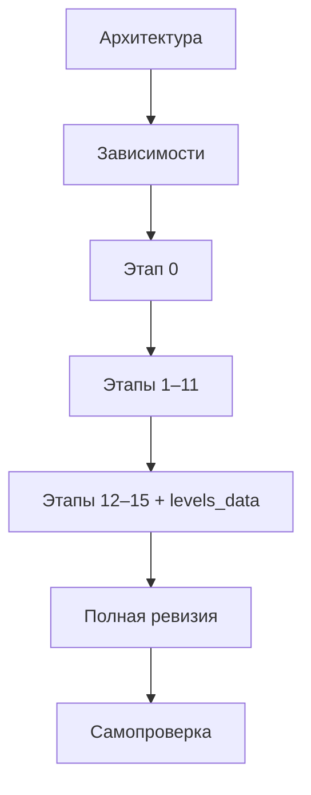
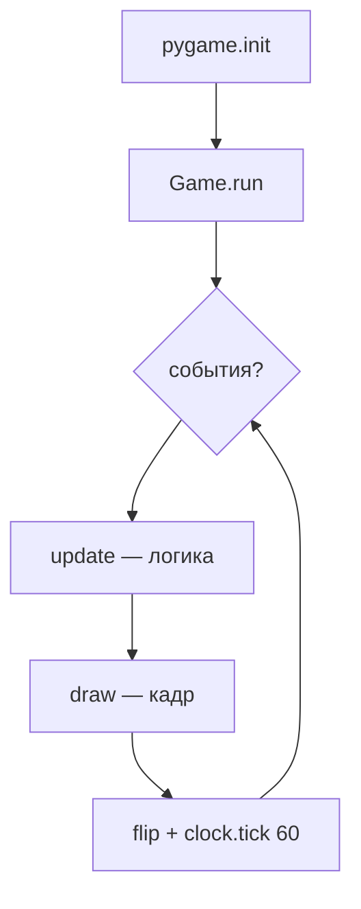
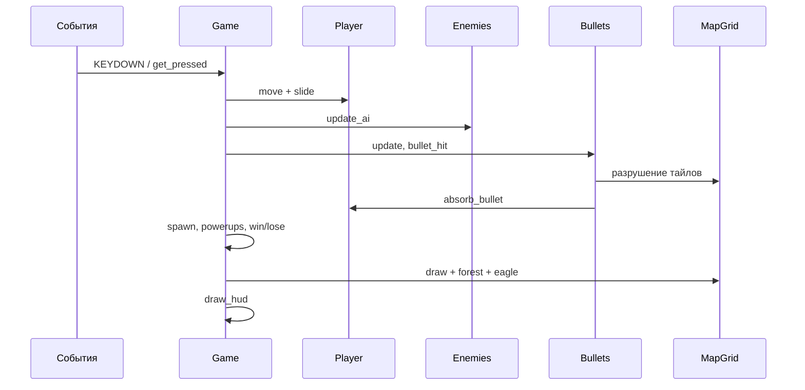
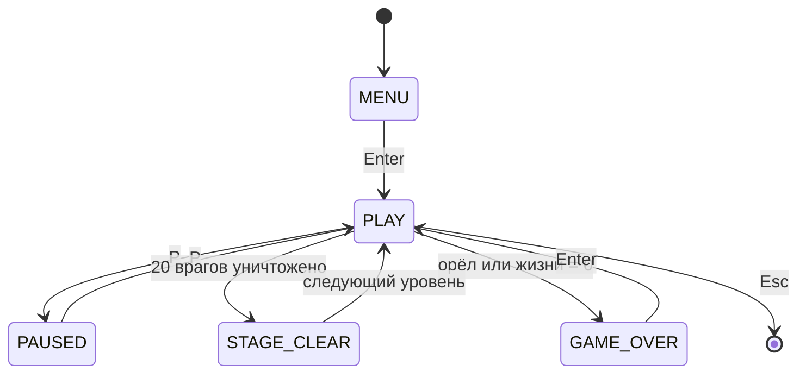

# Python — Battle City

<div class="article-tags">
  <span class="tag tag-beginner">НАЧАЛЬНЫЙ</span>
</div>

<span class="complexity-badge">Разработчику</span>
<span class="complexity-badge">Начальный уровень</span>

---

## О практикуме

**Battle City** (Танчики, Namco, 1985) — классическая аркада на квадратной сетке. Игрок на танке защищает штаб с орлом, разрушает кирпичные стены и отбивает волны вражеских танков. В этом практикуме соберём узнаваемый клон на **Python 3** и **Pygame** — с кодами тайлов из ROM оригинала, **35 уровнями** и полным набором механик NES-версии. Графика — цветные прямоугольники вместо спрайтов, зато архитектура и логика разобраны по шагам.

Жанр называют **top-down tank shooter** (танковый шутер сверху). Battle City стал учебным эталоном для сеточного движения, волнового спавна врагов и разрушаемого окружения — те же приёмы встречаются в современных мобильных и веб-клонах.

### История и контекст

| Год | Событие |
|-----|---------|
| 1985 | Battle City на Famicom/NES — кооператив, редактор карт, 35 этапов |
| 1990-е | "Танчики 1990" на DOS и телевизионных приставках |
| Сейчас | Эталон grid-движения, sub-tile коллизий и волнового спавна |

### Что воспроизводим

- карту **13×13** тайлов с удвоенным NES-масштабом (`TS = 32` px);
- движение танка по **четырём направлениям** с выравниванием на подсетку;
- **кирпич** (разрушается по четвертям) и **сталь** (держит обычную пулю);
- **крепость с орлом** внизу — главная цель защиты;
- **20 врагов** за этап, не более **4** одновременно на экране;
- **7 бонусов**, **4 типа** вражеских танков, лёд, лес и воду.

<div class="callout callout--info">
  <div class="callout-title">Для кого материал</div>
  <div class="callout-body">
  Нужны базовый Python (классы, списки, <code>Enum</code>) и знакомство с Pygame из статьи <a href="/encyclopedia/5-languages/5-02-python/312">Разработка игр на Python</a>. Если Pygame ещё не трогали — сначала прогоните <a href="/lab/Примеры/1132">мини-игры с разбором</a> (змейка, Pong). Соседний трек <a href="./2.md">Match3</a> учит тому же циклу "события → update → draw", но на головоломке без стрельбы.
  </div>
</div>

### Наш прототип и NES-оригинал

| Аспект | NES Battle City | Этот практикум |
|--------|-----------------|----------------|
| Сетка | 13×13 мета-клеток | 13×13, `TS=32` (2× NES) |
| Графика | Спрайты 16×16 | Цветные <code>pygame.Rect</code> |
| HUD | Под полем боя | `HUD_H = 64` px снизу |
| Уровни | 35 в ROM | 35 в <code>levels_data.py</code> |
| Игроки | 2 на экране | 1 (кооп — в заданиях) |
| Бонусы | 7 типов | Все 7 с [этапа 11](#stage-11) |

<div class="callout callout--tip">
  <div class="callout-title">Как читать длинную статью</div>
  <div class="callout-body">
  Идите <strong>этапы 0–15 по порядку</strong>. На каждом шаге — готовый запускаемый файл. Если код перестал собираться — откройте <a href="https://github.com/Spirzen/BattleCity" target="_blank" rel="noopener noreferrer">полную ревизию на GitHub</a> и сверьте проект с эталоном. Теория и разборы кода — <strong>перед и после</strong> листинга этапа.
  </div>
</div>

## Как проходить практикум

1. Создайте папку `battlecity/`, venv и установите Pygame — см. [зависимости](#dependencies).
2. Копируйте **целиком** файлы из блока кода этапа — не фрагменты с пропусками.
3. После **каждого** шага запускайте `python battlecity.py` и пройдите чек-лист.
4. Читайте блоки **Теория**, **Определения** и **Разбор** — там объясняется, зачем нужна каждая конструкция.
5. Финал — [полная ревизия на GitHub](https://github.com/Spirzen/BattleCity) и [итоговая самопроверка](#final-checklist).

**Управление в финальной версии**

| Клавиша | Действие |
|---------|----------|
| `W` `A` `S` `D` или стрелки | Движение танка |
| `Space` / `Z` | Выстрел |
| `P` | Пауза |
| `Enter` | Старт / рестарт после поражения |
| `Esc` | Выход |

**Маршрут чтения**

1. [Архитектура](#architecture) — сетка, тайлы, цикл кадра.
2. [Зависимости](#dependencies) — окружение и структура папки.
3. [Этапы 0–15](#stage-0) — по одной подсистеме за шаг.
4. [Полная ревизия на GitHub](https://github.com/Spirzen/BattleCity) — эталон для сверки.
5. [Отладка и задания](#debugging) — типичные баги и идеи расширения.



### Карта этапов

| Этап | Фокус | Новое поведение |
|------|--------|-----------------|
| [0](#stage-0) | Цикл Pygame | Окно 416×480, HUD-заглушка |
| [1](#stage-1) | Карта ROM | `TileCell`, `MapGrid`, орёл |
| [2](#stage-2) | Игрок | `Tank`, WASD, коллизии |
| [3](#stage-3) | Выстрел | `Bullet`, разрушение кирпича |
| [4](#stage-4) | FX | `Explosion` при попадании |
| [5](#stage-5) | Враги | Спавн, ИИ, очки |
| [6](#stage-6) | HUD | Жизни, счёт, иконки врагов |
| [7](#stage-7) | Респawn | 3 жизни, щит 2 с |
| [8](#stage-8) | Правила | Победа / поражение, орёл |
| [9](#stage-9) | UI | Меню, пауза, оверлеи |
| [10](#stage-10) | Тайлы | Лёд, лес, вода |
| [11](#stage-11) | Бонусы | 7 power-up |
| [12](#stage-12) | Данные | `levels_data.py`, 5 карт |
| [13](#stage-13) | Контент | Все 35 уровней NES |
| [14](#stage-14) | Враги+ | 4 типа, броня, пуля vs пуля |
| [15](#stage-15) | Финал | Полный эталон |

---

<span id="architecture"></span>

## Архитектура

Прежде чем писать код, зафиксируем **из чего состоит игра** и **как данные текут по кадру**. Battle City — не "физический симулятор", а **дискретная аркада**: танк выравнивается по подсетке, стены ровно по клеткам, коллизии через `pygame.Rect` проще, чем полноценный движок, и дают тот же геймплей, что на NES.

### Слои приложения

| Слой | Ответственность | Ключевые сущности |
|------|-----------------|-------------------|
| **Ввод** | Клавиатура, пауза, выход | `pygame.event`, `key.get_pressed()` |
| **Мир** | Сетка тайлов, коллизии | `TileCell`, `MapGrid` |
| **Акторы** | Танки, пули, бонусы | `Tank`, `Bullet`, `PowerUp` |
| **Правила** | Жизни, очки, win/lose | `GameState`, счётчики в `Game` |
| **Представление** | Поле, HUD, оверлеи | `draw`, `draw_hud`, `_overlay` |

Слой **правил** не рисует напрямую — он меняет состояние. Слой **представления** только читает состояние и выводит кадр. Так проще менять графику и отлаживать логику по отдельности — тот же принцип, что в [Ping Pong](./3.md) и [Match3](./2.md).

### Масштаб и HUD

В оригинале NES тайл — **16×16** пикселей. Мы удваиваем (`SCALE = 2`), чтобы на современном мониторе клетки были читаемы без растягивания окна.

```text
Экран 416×480 px
┌─ FIELD: 13×13 × TS=32 = 416×416 ─────┐
│  (0,0)                         (12,12)│
├─ HUD: TS×2 = 64 px ──────────────────┤  жизни · счёт · враги · STAGE
└───────────────────────────────────────┘
```

| Константа | Значение | Смысл |
|-----------|----------|-------|
| `TILE` | 16 | Базовый NES-тайл в "логических" пикселях |
| `SCALE` | 2 | Множитель для PC-окна |
| `TS` | 32 | Пикселей на клетку на экране (`TILE * SCALE`) |
| `GRID` | 13 | Клеток по горизонтали и вертикали |
| `FIELD_W`, `FIELD_H` | 416 | Игровая область без HUD |
| `HUD_H` | 64 | Панель статуса **под** полем, как на приставке |

**Определение.** **HUD** (heads-up display) — панель с жизнями, счётом и оставшимися врагами. У нас она **не накладывается** на карту: сначала рисуем поле с `set_clip`, потом HUD отдельно.

### Коды тайлов ROM (0–13)

Уровни в `levels_data.py` — не картинки, а **числовая матрица 13×13**. Каждое число — тип клетки из дампа ROM (репозиторий vgrichina/battlecity). Один тайл 32×32 на экране может содержать до **четырёх четвертей** кирпича или стали — поэтому коллизии проверяются по подпрямоугольникам `TS//2`.

| Код | Тип | Танк | Пуля |
|-----|-----|------|------|
| 0–3 | Четверть кирпича | блок | ломает одну четверть |
| 4 | Полный кирпич | блок | ломает попавшую четверть |
| 5–8 | Четверть стали | блок | блок; при `power ≥ 3` ломает |
| 9 | Полная сталь | блок | блок |
| 10 | Вода | блок | пролетает |
| 11 | Лес | проезд | пролетает; танк маскируется |
| 12 | Лёд | проезд | пролетает; танк скользит |
| 13+ | Пусто | проезд | пролетает |

**Четверти тайла** (функция `quad_for_type`):

- `0` / `5` — верхний левый (TL)
- `1` / `6` — верхний правый (TR)
- `2` / `7` — нижний левый (BL)
- `3` / `8` — нижний правый (BR)

### Игровой цикл

Любая игра на Pygame крутит один цикл. Порядок важен — сначала логика, потом отрисовка, в конце `display.flip()`.



Внутри `Game.update()` на каждом кадре (состояние `PLAY`):

1. Прочитать клавиши (`get_pressed` + `KEYDOWN` для выстрела).
2. Двинуть игрока (вертикаль и горизонталь **отдельно** — можно "вскользь" вбок, упёршись вниз).
3. Обновить врагов (`update_ai`), заспавнить новых.
4. Обновить пули, проверить `bullet_hit`, столкновения танк–пуля.
5. Применить бонусы, взрывы, win/lose.



| Если обновить … раньше … | Типичный баг |
|--------------------------|--------------|
| Пули до движения танка | Пуля "отстаёт" от ствола на 1 кадр |
| Отрисовку до `update` | Ghosting — кадр показывает прошлое состояние |
| Спавн без проверки клетки | Враг застревает внутри стены |
| WIN до уничтожения последнего врага | Экран победы на кадр раньше взрыва |

### Крепость и орёл

Независимо от карты уровня внизу всегда строится **одинаковая база** — метод `_place_eagle()` в `MapGrid`:

```text
ряд 10: ####     кирпичная стенка
ряд 11: #EE#     E = орёл 2×2 тайла
ряд 12: #EE#
```

- Орёл — непроходимая зона для танка (`eagle_rect`).
- Пуля врага в орла → `GAME_OVER`.
- Бонус **лопата** (`SHOVEL`) временно заменяет кирпич базы на сталь.

### Конечный автомат состояний



<div class="callout callout--tip">
  <div class="callout-title">Два файла, не пакет game/</div>
  <div class="callout-body">
  Вся логика — в <code>battlecity.py</code>; массивы 35 карт — в <code>levels_data.py</code> (с <a href="#stage-12">этапа 12</a>). До этого карта задаётся inline-константой <code>TEST_LEVEL</code>. Так проще копировать этапы и сверять с <a href="https://github.com/Spirzen/BattleCity" target="_blank" rel="noopener noreferrer">репозиторием на GitHub</a>.
  </div>
</div>

---

<span id="dependencies"></span>

## Зависимости

### Требования

- Python **3.10+** (нужны `Enum`, `auto`, современный синтаксис типов в примерах);
- pip;
- Pygame **2.x**.

### Окружение

```bash
mkdir battlecity && cd battlecity
python -m venv .venv
```

Windows (PowerShell):

```powershell
.\.venv\Scripts\Activate.ps1
pip install pygame
```

Linux / macOS:

```bash
source .venv/bin/activate
pip install pygame
```

Проверка:

```bash
python -c "import pygame; print(pygame.version.ver)"
```

### Структура проекта

```text
battlecity/
  battlecity.py      # весь код игры
  levels_data.py     # с этапа 12 — 35 карт LEVEL_MAPS
  requirements.txt   # опционально: pygame>=2.5.0
```

<div class="callout callout--info">
  <div class="callout-title">Запуск из корня папки</div>
  <div class="callout-body">
  <code>python battlecity.py</code> выполняйте из каталога <code>battlecity/</code>, чтобы <code>from levels_data import LEVEL_MAPS</code> и <code>sys.path.insert</code> находили соседний файл. Подробнее про импорты — в <a href="/encyclopedia/5-languages/5-02-python/312">Разработка игр на Python</a>.
  </div>
</div>

---
<span id="stage-0"></span>

## Этап 0 — минимальный запуск

**Цель.** Окно **416×480** px (поле 13×13×32 + HUD 64), цикл 60 FPS, `Esc` — выход.

### Теория

На нулевом этапе нет танков и карты — только **каркас окна** и **игровой цикл**. Это тот же скелет, что в [Match3](./2.md#stage-0) и [Ping Pong](./3.md#stage-0): `pygame.init()` → цикл `while` → `event.get()` → отрисовка → `display.flip()` → `clock.tick(FPS)`.

Размер окна сразу задаём **финальный** (416×480), чтобы на следующих этапах не пересчитывать координаты. Верхняя часть — чёрное поле боя, нижняя серая полоска — задел под HUD.

### Определения

- **Игровой цикл** — бесконечный цикл, в котором игра обрабатывает ввод, обновляет состояние и рисует кадр ~60 раз в секунду.
- **`clock.tick(FPS)`** — ограничивает скорость цикла; без него игра крутится на максимальной частоте CPU.
- **`pygame.Rect(x, y, w, h)`** — прямоугольник для отрисовки и коллизий; здесь зонируем поле и HUD.

### Разбор фрагмента кода

```python
FIELD_W = GRID * TS        # 13 * 32 = 416
SCREEN_H = FIELD_H + HUD_H   # 416 + 64 = 480

screen.fill(C_BLACK, pygame.Rect(0, 0, FIELD_W, FIELD_H))
screen.fill(C_BG, pygame.Rect(0, FIELD_H, SCREEN_W, HUD_H))
```

- `FIELD_*` — только карта; HUD рисуем **ниже** `y = FIELD_H`, не поверх тайлов.
- `K_ESCAPE` в `KEYDOWN` — стандартный выход из учебных прототипов Pygame.

### Файлы этапа

Скопируйте в `battlecity.py`:

```python
"""Battle City — этап 0: окно и игровой цикл."""
import sys
import pygame

TILE = 16
SCALE = 2
TS = TILE * SCALE
GRID = 13
FIELD_W = GRID * TS
FIELD_H = GRID * TS
HUD_H = TS * 2
SCREEN_W = FIELD_W
SCREEN_H = FIELD_H + HUD_H
FPS = 60

C_BG = (80, 80, 80)
C_BLACK = (0, 0, 0)

pygame.init()
screen = pygame.display.set_mode((SCREEN_W, SCREEN_H))
pygame.display.set_caption("Battle City — этап 0")
clock = pygame.time.Clock()

running = True
while running:
    for ev in pygame.event.get():
        if ev.type == pygame.QUIT:
            running = False
        if ev.type == pygame.KEYDOWN and ev.key == pygame.K_ESCAPE:
            running = False

    screen.fill(C_BLACK, pygame.Rect(0, 0, FIELD_W, FIELD_H))
    screen.fill(C_BG, pygame.Rect(0, FIELD_H, SCREEN_W, HUD_H))
    pygame.display.flip()
    clock.tick(FPS)

pygame.quit()
sys.exit()
```

### Самопроверка

- [ ] Окно 416×480: верх чёрный, низ серая полоска HUD.
- [ ] Закрывается крестиком и Esc.

### Разбор этапа

Константы `TILE=16`, `SCALE=2`, `TS=32` повторяют масштаб NES с удвоением для PC. Формула `SCREEN_H = FIELD_H + HUD_H` закладывает раскладку "поле сверху, статус снизу" — как на оригинальной приставке, в отличие от старого варианта практикума с HUD справа.

Цикл без класса `Game` — намеренно простой: на [этапе 2](#stage-2) обернём логику в класс, на [этапе 15](#stage-15) получим финальную архитектуру эталона.

**См. также**

- [Разработка игр на Python](/encyclopedia/5-languages/5-02-python/312) — цикл Pygame
- [Match3 — этап 0](./2.md#stage-0) — тот же приём с финальным размером окна

---

<span id="stage-1"></span>

## Этап 1 — сетка и тайлы ROM

**Цель.** Палитра NES, коды 0–13, `TileCell`/`MapGrid`, inline `TEST_LEVEL`, крепость с орлом.

### Теория

Карта Battle City — **не PNG**, а **сетка чисел**. Каждая клетка — `TileCell` с флагами четырёх четвертей кирпича/стали плюс вода, лес, лёд. Класс `MapGrid` загружает матрицу (пока `TEST_LEVEL`) и рисует тайлы цветными прямоугольниками.

Поверх любой карты метод `_place_eagle()` **принудительно** строит крепость с орлом — как в ROM, где база не зависит от пользовательского редактора уровня.

### Определения

- **`TileCell`** — одна клетка сетки; хранит `brick[4]`, `steel[4]` и флаги воды/леса/льда.
- **`quad_for_type(t)`** — по коду ROM 0–8 возвращает индекс четверти TL/TR/BL/BR.
- **`TEST_LEVEL`** — временная 13×13 матрица в файле; с [этапа 12](#stage-12) заменяется на `LEVEL_MAPS`.

### Разбор фрагмента кода

```python
def set_type(self, t):
    q = quad_for_type(t)
    if t in BRICK_PART:
        self.brick[q] = True
    elif t == 4:
        self.brick = [True] * 4
```

- Код `4` заполняет **все четверти** — полный кирпичный блок.
- Коды `0–3` — только одна четверть; так в ROM экономят память и получают "половинки" стен.

### Файлы этапа

Скопируйте в `battlecity.py`:

```python
"""Battle City — этап 1: карта и тайлы ROM."""
import pygame
import sys

TILE = 16
SCALE = 2
TS = TILE * SCALE
GRID = 13
FIELD_W = GRID * TS
FIELD_H = GRID * TS
HUD_H = TS * 2
SCREEN_W = FIELD_W
SCREEN_H = FIELD_H + HUD_H
FPS = 60

C_BLACK = (0, 0, 0)
C_WHITE = (252, 252, 252)
C_GRAY = (124, 124, 124)
C_BRICK1 = (180, 80, 0)
C_BRICK2 = (140, 60, 0)
C_STEEL1 = (188, 188, 188)
C_STEEL2 = (100, 100, 100)
C_WATER1 = (0, 60, 220)
C_WATER2 = (0, 120, 255)
C_FOREST = (0, 140, 0)
C_ICE = (200, 220, 255)
C_YELLOW = (252, 216, 0)
C_ORANGE = (252, 140, 0)
C_BG = (80, 80, 80)

BRICK_PART = {0, 1, 2, 3}
STEEL_PART = {5, 6, 7, 8}

TEST_LEVEL = [
    [13,13,13,13,13,13,13,13,13,13,13,13,13],
    [13,4,13,4,13,4,13,4,13,4,13,4,13],
    [13,4,13,4,13,4,9,4,13,4,13,4,13],
    [13,4,13,4,13,3,13,3,13,4,13,4,13],
    [13,3,13,3,13,1,13,1,13,3,13,3,13],
    [13,10,13,11,13,12,13,13,13,11,10,13,13],
    [13,13,13,13,13,13,13,13,13,13,13,13,13],
    [13,13,13,13,13,13,13,13,13,13,13,13,13],
    [13,13,13,13,13,13,13,13,13,13,13,13,13],
    [13,4,13,4,13,4,13,4,13,4,13,4,13],
    [13,4,13,4,13,3,13,3,13,4,13,4,13],
    [13,4,13,4,13,13,13,13,13,4,13,4,13],
    [13,13,13,13,13,13,13,13,13,13,13,13,13],
]

BASE_ROW_TOP = 10
BASE_ROWS = (10, 11, 12)
BASE_COLS = (4, 5, 6, 7)
EAGLE_COL = 5
EAGLE_ROW = 11


def quad_for_type(t):
    if t in (0, 5): return 0
    if t in (1, 6): return 1
    if t in (2, 7): return 2
    if t in (3, 8): return 3
    return None


class TileCell:
    __slots__ = ('brick', 'steel', 'water', 'forest', 'ice')

    def __init__(self):
        self.brick = [False] * 4
        self.steel = [False] * 4
        self.water = False
        self.forest = False
        self.ice = False

    def set_type(self, t):
        q = quad_for_type(t)
        if t in BRICK_PART:
            self.brick[q] = True
        elif t == 4:
            self.brick = [True] * 4
        elif t in STEEL_PART:
            self.steel[q] = True
        elif t == 9:
            self.steel = [True] * 4
        elif t == 10:
            self.water = True
        elif t == 11:
            self.forest = True
        elif t == 12:
            self.ice = True


class MapGrid:
    def __init__(self):
        self.cells = [[TileCell() for _ in range(GRID)] for _ in range(GRID)]
        for r in range(GRID):
            for c in range(GRID):
                self.cells[r][c].set_type(TEST_LEVEL[r][c])
        self.eagle_cells = set()
        self._place_eagle()

    def _clear_cell(self, r, c):
        cell = self.cells[r][c]
        cell.brick = [False] * 4
        cell.steel = [False] * 4
        cell.water = cell.forest = cell.ice = False

    def _set_brick(self, r, c):
        self._clear_cell(r, c)
        self.cells[r][c].brick = [True] * 4

    def _place_eagle(self):
        for r in BASE_ROWS:
            for c in BASE_COLS:
                self._clear_cell(r, c)
        for c in BASE_COLS:
            self._set_brick(BASE_ROW_TOP, c)
        for r in (11, 12):
            self._set_brick(r, 4)
            self._set_brick(r, 7)
        self.eagle_cells = {(5, 11), (6, 11), (5, 12), (6, 12)}
        for r, c in self.eagle_cells:
            self._clear_cell(r, c)
        self.eagle_rect = pygame.Rect(EAGLE_COL * TS, EAGLE_ROW * TS, TS * 2, TS * 2)
        self.eagle_alive = True

    def draw(self, surf):
        for r in range(GRID):
            for c in range(GRID):
                if (c, r) in self.eagle_cells:
                    continue
                cell = self.cells[r][c]
                x, y = c * TS, r * TS
                if cell.water:
                    for i in range(4):
                        col = C_WATER1 if i % 2 == 0 else C_WATER2
                        pygame.draw.rect(surf, col, (x + (i % 2) * TS // 2, y + (i // 2) * TS // 2, TS // 2, TS // 2))
                if cell.ice:
                    pygame.draw.rect(surf, C_ICE, (x, y, TS, TS))
                for qi in range(4):
                    qx = x + (qi % 2) * TS // 2
                    qy = y + (qi // 2) * TS // 2
                    if cell.brick[qi]:
                        pygame.draw.rect(surf, C_BRICK1, (qx, qy, TS // 2, TS // 2))
                        pygame.draw.rect(surf, C_BRICK2, (qx + 2, qy + 2, TS // 2 - 4, TS // 2 - 4))
                    if cell.steel[qi]:
                        pygame.draw.rect(surf, C_STEEL1, (qx, qy, TS // 2, TS // 2))
                        pygame.draw.rect(surf, C_STEEL2, (qx + 4, qy + 4, TS // 2 - 8, TS // 2 - 8))
                if cell.forest:
                    pygame.draw.rect(surf, C_FOREST, (x, y, TS, TS))

    def draw_eagle(self, surf):
        er = self.eagle_rect
        pygame.draw.rect(surf, C_BLACK, er)
        cx = er.centerx
        pygame.draw.rect(surf, C_ORANGE, (er.x + 4, er.y + 20, er.width - 8, er.height - 24))
        pygame.draw.polygon(surf, C_YELLOW, [(cx, er.y + 6), (cx - 14, er.y + 22), (cx + 14, er.y + 22)])


def main():
    pygame.init()
    screen = pygame.display.set_mode((SCREEN_W, SCREEN_H))
    pygame.display.set_caption("Battle City — этап 1")
    clock = pygame.time.Clock()
    grid = MapGrid()
    while True:
        for ev in pygame.event.get():
            if ev.type == pygame.QUIT:
                pygame.quit(); sys.exit()
            if ev.type == pygame.KEYDOWN and ev.key == pygame.K_ESCAPE:
                pygame.quit(); sys.exit()
        screen.fill(C_BLACK, pygame.Rect(0, 0, FIELD_W, FIELD_H))
        grid.draw(screen)
        grid.draw_eagle(screen)
        screen.fill(C_BG, pygame.Rect(0, FIELD_H, SCREEN_W, HUD_H))
        pygame.display.flip()
        clock.tick(FPS)


if __name__ == "__main__":
    main()
```

### Самопроверка

- [ ] Видны кирпич, сталь, вода, лес, лёд.
- [ ] Орёл в крепости внизу.
- [ ] Четверти кирпича (0–3) видны отдельно.

### Разбор этапа

Отрисовка идёт слоями: вода (шахматка двух синих), лёд, четверти кирпича/стали, лес. Ячейки орла (`eagle_cells`) пропускаются в `draw` — орёл рисуется отдельным `draw_eagle()` поверх крепости.

Палитра `C_BRICK1` / `C_BRICK2` имитирует двухцветный NES-кирпич без текстур. Сравните с тайловым подходом в [Tetris](./5.md) — там фигуры тоже кодом, не спрайтами.

**См. также**

- [Архитектура — коды тайлов](#architecture)
- [этап 3](#stage-3) — разрушение тех же четвертей пулей

---

<span id="stage-2"></span>

## Этап 2 — танк игрока

**Цель.** Класс `Tank`, WASD/стрелки, коллизии, выравнивание `aligned()` для поворота.

### Теория

Танк живёт в **пикселях** (`pygame.Rect`), но поворачивает только на **подсетке 8 px** (`HALF = 8`). Метод `aligned()` проверяет, стоит ли танк на "узле" сетки — иначе поворот запрещён, как в оригинале.

Коллизии — **по осям**: сдвинули по X → проверили → откатили; затем Y. Так танк может скользить вдоль стены, а не застревать в углу.

### Определения

- **`Tank.MARGIN = 2`** — отступ хитбокса 28×28 внутри тайла 32×32; танк визуально центрирован.
- **`Dir` (Enum)** — четыре направления; `DIR_VEC` даёт смещение (-1/0/+1) по осям.
- **`blocks_tank()`** — кирпич, сталь и вода непроходимы; лес и лёд — проходимы.

### Разбор фрагмента кода

```python
self.rect.x += dx * spd
if self._collide(grid, tanks):
    self.rect.x = ox
self.rect.y += dy * spd
if self._collide(grid, tanks):
    self.rect.y = oy
```

- `ox`, `oy` — позиция до шага; откат возвращает танк, если новая позиция в стене.
- `tank_collision()` в `MapGrid` проверяет **каждую четверть** тайла отдельным `Rect` размером `TS//2`.

### Файлы этапа

Скопируйте в `battlecity.py`:

```python
"""Battle City — remake faithful to the NES original (Namco, 1985)."""
import pygame
import random
import sys
TEST_LEVEL = [
    [13,13,13,13,13,13,13,13,13,13,13,13,13],
    [13,4,13,4,13,4,13,4,13,4,13,4,13],
    [13,4,13,4,13,4,9,4,13,4,13,4,13],
    [13,4,13,4,13,3,13,3,13,4,13,4,13],
    [13,3,13,3,13,1,13,1,13,3,13,3,13],
    [13,13,13,13,13,13,13,13,13,13,13,13,13],
    [13,13,13,13,13,13,13,13,13,13,13,13,13],
    [13,13,13,13,13,13,13,13,13,13,13,13,13],
    [13,13,13,13,13,13,13,13,13,13,13,13,13],
    [13,4,13,4,13,4,13,4,13,4,13,4,13],
    [13,4,13,4,13,3,13,3,13,4,13,4,13],
    [13,4,13,4,13,13,13,13,13,4,13,4,13],
    [13,13,13,13,13,13,13,13,13,13,13,13,13],
]

from enum import Enum, auto

# --- Display (2× NES resolution) ---
TILE = 16
SCALE = 2
TS = TILE * SCALE          # 32 px per tile
GRID = 13
FIELD_W = GRID * TS        # 416
FIELD_H = GRID * TS
HUD_H = TS * 2
SCREEN_W = FIELD_W
SCREEN_H = FIELD_H + HUD_H
FPS = 60

# --- Colours (NES palette) ---
C_BLACK = (0, 0, 0)
C_WHITE = (252, 252, 252)
C_GRAY = (124, 124, 124)
C_DGRAY = (60, 60, 60)
C_BRICK1 = (180, 80, 0)
C_BRICK2 = (140, 60, 0)
C_STEEL1 = (188, 188, 188)
C_STEEL2 = (100, 100, 100)
C_WATER1 = (0, 60, 220)
C_WATER2 = (0, 120, 255)
C_FOREST = (0, 140, 0)
C_ICE = (200, 220, 255)
C_YELLOW = (252, 216, 0)
C_ORANGE = (252, 140, 0)
C_RED = (216, 0, 0)
C_GREEN = (0, 180, 0)
C_BG = (80, 80, 80)

# --- Tile type codes (from ROM) ---
# 0-3 partial brick, 4 full brick, 5-8 partial steel, 9 steel
# 10 water, 11 forest, 12 ice, 13+ empty
BRICK_PART = {0, 1, 2, 3}
STEEL_PART = {5, 6, 7, 8}

ENEMIES_PER_STAGE = 20
MAX_ON_SCREEN = 4
PLAYER_LIVES = 3
SPAWN_FLASH_MS = 2000
SHIELD_MS = 5000
FREEZE_MS = 5000
SHOVEL_MS = 15000
POWERUP_MS = 10000

SCORE = {0: 100, 1: 200, 2: 300, 3: 400}

class Dir(Enum):
    UP = 0; RIGHT = 1; DOWN = 2; LEFT = 3

class GameState(Enum):
    MENU = auto(); PLAY = auto(); PAUSE = auto()
    STAGE_CLEAR = auto(); GAME_OVER = auto()

class EnemyType(Enum):
    BASIC = 0; FAST = 1; POWER = 2; ARMOR = 3

class PowerType(Enum):
    GRENADE = 0; HELMET = 1; TIMER = 2; SHOVEL = 3
    STAR = 4; GUN = 5; TANK = 6

DIR_VEC = {Dir.UP:(0,-1), Dir.RIGHT:(1,0), Dir.DOWN:(0,1), Dir.LEFT:(-1,0)}

def quad_for_type(t):
    """Which quadrant (0=TL,1=TR,2=BL,3=BR) a partial tile occupies."""
    if t in (0, 5): return 0
    if t in (1, 6): return 1
    if t in (2, 7): return 2
    if t in (3, 8): return 3
    return None

def is_brick(t): return t in BRICK_PART or t == 4
def is_steel(t): return t in STEEL_PART or t == 9
def is_water(t): return t == 10
def is_forest(t): return t == 11
def is_ice(t): return t == 12
def is_empty(t): return t >= 13

class TileCell:
    """One map cell with up to 4 quadrants."""
    __slots__ = ('brick', 'steel', 'water', 'forest', 'ice')

    def __init__(self):
        self.brick = [False]*4
        self.steel = [False]*4
        self.water = False
        self.forest = False
        self.ice = False

    def set_type(self, t):
        q = quad_for_type(t)
        if t in BRICK_PART:
            self.brick[q] = True
        elif t == 4:
            self.brick = [True]*4
        elif t in STEEL_PART:
            self.steel[q] = True
        elif t == 9:
            self.steel = [True]*4
        elif t == 10:
            self.water = True
        elif t == 11:
            self.forest = True
        elif t == 12:
            self.ice = True

    def any_brick(self): return any(self.brick)
    def any_steel(self): return any(self.steel)
    def blocks_tank(self): return self.any_brick() or self.any_steel() or self.water
    def blocks_bullet(self): return self.any_brick() or self.any_steel()

# База (орёл) — как на NES: крепость 4×3 + орёл 2×2
BASE_ROW_TOP = 10
BASE_ROWS = (10, 11, 12)
BASE_COLS = (4, 5, 6, 7)
EAGLE_COL = 5
EAGLE_ROW = 11
PLAYER_SPAWN = (8, 12)
# Предпочитаем центр нижнего ряда; углы — только запасные
PLAYER_SPAWN_FALLBACKS = [(8, 12), (10, 12), (2, 12), (6, 12), (12, 12), (0, 12)]

class MapGrid:
    def __init__(self, stage_idx=0):
        self.cells = [[TileCell() for _ in range(GRID)] for _ in range(GRID)]
        data = TEST_LEVEL
        for r in range(GRID):
            for c in range(GRID):
                self.cells[r][c].set_type(data[r][c])
        self.eagle_cells = set()
        self.base_brick_backup = None
        self._place_eagle()

    def _clear_cell(self, r, c):
        cell = self.cells[r][c]
        cell.brick = [False] * 4
        cell.steel = [False] * 4
        cell.water = cell.forest = cell.ice = False

    def _set_brick(self, r, c):
        self._clear_cell(r, c)
        self.cells[r][c].brick = [True] * 4

    def _place_eagle(self):
        """Классическая крепость: ### / #EE# / #EE#"""
        for r in BASE_ROWS:
            for c in BASE_COLS:
                self._clear_cell(r, c)

        # верхняя стенка
        for c in BASE_COLS:
            self._set_brick(BASE_ROW_TOP, c)

        # боковины + орёл 2×2
        for r in (11, 12):
            self._set_brick(r, 4)
            self._set_brick(r, 7)

        self.eagle_cells = {(5, 11), (6, 11), (5, 12), (6, 12)}
        for r, c in self.eagle_cells:
            self._clear_cell(r, c)

        self.eagle_rect = pygame.Rect(EAGLE_COL * TS, EAGLE_ROW * TS, TS * 2, TS * 2)
        self.eagle_alive = True

    def _base_wall_cells(self):
        for r in BASE_ROWS:
            for c in BASE_COLS:
                if (r, c) not in self.eagle_cells:
                    yield r, c

    def backup_base_walls(self):
        self.base_brick_backup = []
        for r, c in self._base_wall_cells():
            cell = self.cells[r][c]
            self.base_brick_backup.append(
                ((r, c), cell.brick[:], cell.steel[:])
            )

    def restore_base_walls(self):
        if not self.base_brick_backup:
            return
        for (r, c), b, s in self.base_brick_backup:
            cell = self.cells[r][c]
            cell.brick = b[:]
            cell.steel = s[:]

    def steel_base_walls(self):
        for r, c in self._base_wall_cells():
            cell = self.cells[r][c]
            cell.brick = [False] * 4
            cell.steel = [True] * 4

    def tank_collision(self, rect):
        # орёл — непроходимая зона
        if self.eagle_alive and rect.colliderect(self.eagle_rect):
            return True
        for r in range(GRID):
            for c in range(GRID):
                cell = self.cells[r][c]
                if not cell.blocks_tank(): continue
                tr = pygame.Rect(c*TS, r*TS, TS, TS)
                if not rect.colliderect(tr): continue
                if cell.water: return True
                for qi in range(4):
                    if cell.brick[qi] or cell.steel[qi]:
                        qr = pygame.Rect(c*TS+(qi%2)*TS//2, r*TS+(qi//2)*TS//2, TS//2, TS//2)
                        if rect.colliderect(qr): return True
        return False

    def bullet_hit(self, rect, power_level):
        """Returns True if bullet consumed."""
        for r in range(GRID):
            for c in range(GRID):
                cell = self.cells[r][c]
                tr = pygame.Rect(c*TS, r*TS, TS, TS)
                if not rect.colliderect(tr): continue
                for qi in range(4):
                    qr = pygame.Rect(c*TS+(qi%2)*TS//2, r*TS+(qi//2)*TS//2, TS//2, TS//2)
                    if not rect.colliderect(qr): continue
                    if cell.brick[qi]:
                        cell.brick[qi] = False
                        return True
                    if cell.steel[qi]:
                        if power_level >= 3:
                            cell.steel[qi] = False
                            return True
                        return True
        return False

    def draw(self, surf, hide_forest_tanks):
        for r in range(GRID):
            for c in range(GRID):
                if (c, r) in self.eagle_cells:
                    continue
                cell = self.cells[r][c]
                x, y = c * TS, r * TS
                if cell.water:
                    for i in range(4):
                        col = C_WATER1 if i % 2 == 0 else C_WATER2
                        pygame.draw.rect(surf, col, (x + (i % 2) * TS // 2, y + (i // 2) * TS // 2, TS // 2, TS // 2))
                if cell.ice:
                    pygame.draw.rect(surf, C_ICE, (x, y, TS, TS))
                    pygame.draw.line(surf, C_WHITE, (x, y + TS // 2), (x + TS, y + TS // 2), 1)
                for qi in range(4):
                    qx = x + (qi % 2) * TS // 2
                    qy = y + (qi // 2) * TS // 2
                    if cell.brick[qi]:
                        pygame.draw.rect(surf, C_BRICK1, (qx, qy, TS // 2, TS // 2))
                        pygame.draw.rect(surf, C_BRICK2, (qx + 2, qy + 2, TS // 2 - 4, TS // 2 - 4))
                    if cell.steel[qi]:
                        pygame.draw.rect(surf, C_STEEL1, (qx, qy, TS // 2, TS // 2))
                        pygame.draw.rect(surf, C_STEEL2, (qx + 4, qy + 4, TS // 2 - 8, TS // 2 - 8))
                if cell.forest and not hide_forest_tanks:
                    pass  # лес рисуется поверх в overlay

    def draw_forest_overlay(self, surf):
        for r in range(GRID):
            for c in range(GRID):
                if self.cells[r][c].forest:
                    x,y = c*TS, r*TS
                    pygame.draw.rect(surf, C_FOREST, (x,y,TS,TS))
                    for dx,dy in ((4,4),(20,4),(4,20),(20,20)):
                        pygame.draw.rect(surf, (0,100,0), (x+dx,y+dy,8,8))

    def in_forest(self, rect):
        cx = rect.centerx // TS; cy = rect.centery // TS
        if 0 <= cx < GRID and 0 <= cy < GRID:
            return self.cells[cy][cx].forest
        return False

    def on_ice(self, rect):
        cx = rect.centerx // TS; cy = rect.centery // TS
        if 0 <= cx < GRID and 0 <= cy < GRID:
            return self.cells[cy][cx].ice
        return False

    def draw_eagle(self, surf):
        er = self.eagle_rect
        if self.eagle_alive:
            pygame.draw.rect(surf, C_BLACK, er)
            cx = er.centerx
            pygame.draw.rect(surf, C_ORANGE, (er.x + 4, er.y + 20, er.width - 8, er.height - 24))
            pygame.draw.polygon(surf, C_YELLOW, [
                (cx, er.y + 6),
                (cx - 14, er.y + 22),
                (cx + 14, er.y + 22),
            ])
            pygame.draw.rect(surf, C_WHITE, (cx - 8, er.y + 22, 16, 8))
            pygame.draw.circle(surf, C_BLACK, (cx - 4, er.y + 14), 2)
            pygame.draw.circle(surf, C_BLACK, (cx + 4, er.y + 14), 2)
        else:
            pygame.draw.rect(surf, C_DGRAY, er)
            pygame.draw.line(surf, C_RED, er.topleft, er.bottomright, 3)
            pygame.draw.line(surf, C_RED, er.topright, er.bottomleft, 3)

class Bullet:
    SPEED = 8
    SIZE = 6
    def __init__(self, x, y, direction, owner, power=0):
        s = Bullet.SIZE
        self.rect = pygame.Rect(x - s // 2, y - s // 2, s, s)
        self.dir = direction
        self.owner = owner
        self.power = power
        self.alive = True

    def update(self):
        if not self.alive:
            return
        dx, dy = DIR_VEC[self.dir]
        for _ in range(self.SPEED):
            self.rect.x += dx
            self.rect.y += dy
            if (self.rect.right < 0 or self.rect.left > FIELD_W or
                self.rect.bottom < 0 or self.rect.top > FIELD_H):
                self.alive = False
                return

    def draw(self, surf):
        if not self.alive:
            return
        pygame.draw.rect(surf, C_YELLOW if self.owner == 'player' else C_WHITE, self.rect)

class Tank:
    W = H = TS - 4
    HALF = 8
    MARGIN = (TS - (TS - 4)) // 2  # 2 px — центр танка в клетке

    @staticmethod
    def spawn_rect(gx, gy):
        m = Tank.MARGIN
        return pygame.Rect(gx * TS + m, gy * TS + m, Tank.W, Tank.H)

    def hitbox(self):
        return self.rect

    def __init__(self, gx, gy, is_player=False, etype=EnemyType.BASIC):
        self.grid_x, self.grid_y = gx, gy
        self.rect = Tank.spawn_rect(gx, gy)
        self.dir = Dir.UP
        self.is_player = is_player
        self.etype = etype
        self.alive = True
        self.power = 0
        self.hp = 4 if not is_player and etype == EnemyType.ARMOR else 1
        self.speed = self._speed()
        self.last_shot = 0
        self.shot_cd = 300 if is_player else 600
        self.spawn_time = pygame.time.get_ticks()
        self.shield_until = self.spawn_time + SPAWN_FLASH_MS
        self.sliding = False
        self.slide_dir = None
        self.carries_powerup = (not is_player and random.random() < 0.3)
        self.frozen = False

    def _speed(self):
        if self.is_player:
            return 2 * SCALE
        return {EnemyType.BASIC: 2, EnemyType.FAST: 4, EnemyType.POWER: 2,
                EnemyType.ARMOR: 2}[self.etype] * SCALE

    def refresh_stats(self):
        """Пересчёт параметров после смены is_player / etype."""
        self.speed = self._speed()
        self.shot_cd = 300 if self.is_player else 600

    def bullet_hit_rect(self):
        return self.rect.inflate(4, 4)

    @property
    def shielded(self):
        return pygame.time.get_ticks() < self.shield_until

    @property
    def max_bullets(self):
        if self.is_player:
            return 1 if self.power < 2 else 2
        return 1

    def aligned(self):
        m = self.MARGIN
        return (self.rect.x - m) % self.HALF == 0 and (self.rect.y - m) % self.HALF == 0

    def try_turn(self, new_dir):
        if new_dir == self.dir:
            return
        if self.aligned():
            self.dir = new_dir

    def move(self, direction, grid, tanks, on_ice=False):
        if not self.alive or self.frozen:
            return False
        self.try_turn(direction)
        dx, dy = DIR_VEC[self.dir]
        spd = self.speed
        ox, oy = self.rect.x, self.rect.y
        self.rect.x += dx * spd
        if self._collide(grid, tanks):
            self.rect.x = ox
        self.rect.y += dy * spd
        if self._collide(grid, tanks):
            self.rect.y = oy
        moved = self.rect.topleft != (ox, oy)
        if on_ice and self.aligned():
            self.sliding = True
            self.slide_dir = self.dir
        return moved

    def slide(self, grid, tanks):
        if not self.sliding or not self.alive: return
        dx, dy = DIR_VEC[self.slide_dir]
        ox, oy = self.rect.x, self.rect.y
        self.rect.x += dx * self.speed
        if self._collide(grid, tanks):
            self.rect.x = ox; self.sliding = False
        self.rect.y += dy * self.speed
        if self._collide(grid, tanks):
            self.rect.y = oy; self.sliding = False
        if not grid.on_ice(self.rect):
            self.sliding = False

    def _collide_tiles(self, grid):
        hb = self.hitbox()
        if grid.tank_collision(hb):
            return True
        return False

    def _collide(self, grid, tanks):
        if (self.rect.left < 0 or self.rect.right > FIELD_W or
            self.rect.top < 0 or self.rect.bottom > FIELD_H):
            return True
        if self._collide_tiles(grid):
            return True
        for t in tanks:
            if t.alive and t is not self and self.rect.colliderect(t.rect):
                return True
        return False

    def clamp_field(self):
        self.rect.x = max(0, min(self.rect.x, FIELD_W - self.rect.width))
        self.rect.y = max(0, min(self.rect.y, FIELD_H - self.rect.height))

    def nudge_out_of_wall(self, grid, tanks):
        """Лёгкий откат на 1–2 px, только если танк внутри стены."""
        if not self._collide_tiles(grid):
            return
        ox, oy = self.rect.x, self.rect.y
        for step in (1, 2, 3, 4):
            for dx, dy in ((step, 0), (-step, 0), (0, step), (0, -step)):
                self.rect.x = ox + dx
                self.rect.y = oy + dy
                self.clamp_field()
                if not self._collide_tiles(grid):
                    return
        self.rect.x, self.rect.y = ox, oy

    def body_color(self, now):
        if self.is_player:
            return C_YELLOW
        color = [C_RED, (255, 100, 100), (200, 0, 200), (180, 180, 0)][self.etype.value]
        if self.carries_powerup and (now // 150) % 2:
            return C_WHITE
        return color

    @staticmethod
    def resolve_overlaps(tanks, grid):
        """Раздвигает танки, если они наложились друг на друга."""
        alive = [t for t in tanks if t.alive]
        for i, a in enumerate(alive):
            for b in alive[i + 1:]:
                for _ in range(8):
                    if not a.rect.colliderect(b.rect):
                        break
                    overlap_x = min(a.rect.right, b.rect.right) - max(a.rect.left, b.rect.left)
                    overlap_y = min(a.rect.bottom, b.rect.bottom) - max(a.rect.top, b.rect.top)
                    if overlap_x <= 0 and overlap_y <= 0:
                        a.rect.x -= 4
                        b.rect.x += 4
                        continue
                    if overlap_x > 0 and (overlap_y <= 0 or overlap_x <= overlap_y):
                        half = max(1, (overlap_x + 1) // 2)
                        if a.rect.centerx <= b.rect.centerx:
                            a.rect.x -= half
                            b.rect.x += half
                        else:
                            a.rect.x += half
                            b.rect.x -= half
                    elif overlap_y > 0:
                        half = max(1, (overlap_y + 1) // 2)
                        if a.rect.centery <= b.rect.centery:
                            a.rect.y -= half
                            b.rect.y += half
                        else:
                            a.rect.y += half
                            b.rect.y -= half
                    for t in (a, b):
                        t.clamp_field()
                        if t._collide_tiles(grid):
                            t.nudge_out_of_wall(grid, [x for x in alive if x is not t])

    @staticmethod
    def _valid_spawn(grid, tank, others):
        if grid.eagle_alive and tank.rect.colliderect(grid.eagle_rect):
            return False
        return not tank._collide(grid, others)

    @staticmethod
    def find_spawn(grid, candidates, others, is_player=False):
        for gx, gy in candidates:
            t = Tank(gx, gy, is_player=is_player)
            if Tank._valid_spawn(grid, t, others):
                t.refresh_stats()
                return t
        # Любая свободная клетка в нижней половине карты
        for gy in range(GRID - 1, GRID // 2, -1):
            for gx in range(1, GRID - 1):
                t = Tank(gx, gy, is_player=is_player)
                if Tank._valid_spawn(grid, t, others):
                    t.refresh_stats()
                    return t
        t = Tank(*PLAYER_SPAWN, is_player=is_player)
        t.refresh_stats()
        t.nudge_out_of_wall(grid, others)
        return t

    def shoot(self, now, bullets):
        if not self.alive or now - self.last_shot < self.shot_cd: return None
        count = sum(1 for b in bullets if b.alive and b.owner == ('player' if self.is_player else 'enemy'))
        if count >= self.max_bullets: return None
        self.last_shot = now
        cx,cy = self.rect.center
        off = self.W//2 + 2
        pos = {Dir.UP:(cx,cy-off), Dir.DOWN:(cx,cy+off),
               Dir.LEFT:(cx-off,cy), Dir.RIGHT:(cx+off,cy)}
        x,y = pos[self.dir]
        owner = 'player' if self.is_player else 'enemy'
        return Bullet(x, y, self.dir, owner, self.power)

    def hit(self):
        if self.shielded:
            return False
        self.hp -= 1
        if self.hp <= 0:
            self.alive = False
            return True
        return False

    def absorb_bullet(self):
        """Пуля попала в танк. True — танк уничтожен."""
        if self.shielded:
            return False
        return self.hit()

    def draw(self, surf, now, hidden=False):
        if not self.alive or hidden:
            return
        if self.shielded and (now // 100) % 2:
            return
        color = self.body_color(now)
        pygame.draw.rect(surf, color, self.rect)
        pygame.draw.rect(surf, C_BLACK, self.rect, 1)
        cx, cy = self.rect.center
        d = self.W // 2
        ends = {Dir.UP: (cx, cy - d - 10), Dir.DOWN: (cx, cy + d + 10),
                Dir.LEFT: (cx - d - 10, cy), Dir.RIGHT: (cx + d + 10, cy)}
        pygame.draw.line(surf, color, (cx, cy), ends[self.dir], 3)
        if not self.is_player and self.etype == EnemyType.ARMOR and self.hp > 1:
            font = pygame.font.SysFont('Arial', 14, bold=True)
            t = font.render(str(self.hp), True, C_WHITE)
            surf.blit(t, (self.rect.x+2, self.rect.y+2))

    def update_ai(self, now, grid, player, tanks, bullets):
        if not self.alive or self.frozen: return
        if now - self.spawn_time < SPAWN_FLASH_MS: return
        if random.random() < 0.02:
            self.dir = random.choice(list(Dir))
        # aim at player or eagle occasionally
        if random.random() < 0.03:
            targets = [player.rect.center, grid.eagle_rect.center]
            tx, ty = random.choice(targets)
            cx, cy = self.rect.center
            if abs(tx-cx) > abs(ty-cy):
                self.dir = Dir.RIGHT if tx > cx else Dir.LEFT
            else:
                self.dir = Dir.DOWN if ty > cy else Dir.UP
        on_ice = grid.on_ice(self.rect)
        self.move(self.dir, grid, tanks, on_ice)
        if on_ice: self.slide(grid, tanks)
        rate = 0.015 if self.etype == EnemyType.POWER else 0.008
        if random.random() < rate:
            b = self.shoot(now, bullets)
            if b: bullets.append(b)

class Game:
    SPAWN_COLS = [0, 6, 12]

    def __init__(self):
        self.screen = pygame.display.set_mode((SCREEN_W, SCREEN_H))
        pygame.display.set_caption('Battle City — этап 2')
        self.clock = pygame.time.Clock()
        self.state = GameState.PLAY
        self.stage = 0
        self.score = 0
        self.lives = PLAYER_LIVES
        self.reset_stage()

    def reset_stage(self):
        self.grid = MapGrid(self.stage)
        self.grid.backup_base_walls()
        self.player = Tank.find_spawn(self.grid, PLAYER_SPAWN_FALLBACKS, [], is_player=True)
        self.player.dir = Dir.UP
        self.enemies = []  # stage 2: no enemies
        self.bullets = []
        self.explosions = []
        self.powerups = []
        self.enemies_total = ENEMIES_PER_STAGE
        self.enemies_spawned = 0
        self.enemies_killed = 0
        self.last_spawn = 0
        self.spawn_cd = 3000
        self.freeze_until = 0
        self.shovel_until = 0
        self.stage_clear_time = 0
        self.last_spawn = pygame.time.get_ticks()

    def _apply_powerup(self, pt):
        if pt == PowerType.GRENADE:
            for e in self.enemies:
                if e.alive:
                    self.explosions.append(Explosion(*e.rect.center, big=True))
                    e.alive = False
                    self.enemies_killed += 1
                    self.score += 100
        elif pt == PowerType.HELMET:
            self.player.shield_until = pygame.time.get_ticks() + SHIELD_MS
        elif pt == PowerType.TIMER:
            self.freeze_until = pygame.time.get_ticks() + FREEZE_MS
        elif pt == PowerType.SHOVEL:
            self.grid.steel_base_walls()
            self.shovel_until = pygame.time.get_ticks() + SHOVEL_MS
        elif pt == PowerType.STAR:
            self.player.power = min(3, self.player.power + 1)
        elif pt == PowerType.GUN:
            self.player.power = 3
        elif pt == PowerType.TANK:
            self.lives += 1

    def update(self, now):
        if self.state == GameState.MENU:
            return
        if self.state == GameState.STAGE_CLEAR:
            if now - self.stage_clear_time > 3000:
                self.stage += 1
                if self.stage >= 35:
                    self.stage = 0
                self.reset_stage()
                self.state = GameState.PLAY
            return
        if self.state == GameState.GAME_OVER:
            return
        if self.state == GameState.PAUSE:
            return

        frozen = now < self.freeze_until
        if now >= self.shovel_until and self.shovel_until:
            self.grid.restore_base_walls()
            self.shovel_until = 0

        keys = pygame.key.get_pressed()
        if self.player.alive:
            tanks = [e for e in self.enemies if e.alive]
            on_ice = self.grid.on_ice(self.player.rect)

            # Вертикаль и горизонталь отдельно: если вниз упёрся — всё равно можно вбок
            vertical = None
            if keys[pygame.K_UP] or keys[pygame.K_w]:
                vertical = Dir.UP
            elif keys[pygame.K_DOWN] or keys[pygame.K_s]:
                vertical = Dir.DOWN

            horizontal = None
            if keys[pygame.K_LEFT] or keys[pygame.K_a]:
                horizontal = Dir.LEFT
            elif keys[pygame.K_RIGHT] or keys[pygame.K_d]:
                horizontal = Dir.RIGHT

            pos0 = self.player.rect.topleft
            if vertical:
                self.player.move(vertical, self.grid, tanks, on_ice)
                if on_ice:
                    self.player.slide(self.grid, tanks)
            if horizontal and (not vertical or self.player.rect.topleft == pos0):
                self.player.move(horizontal, self.grid, tanks, on_ice)
                if on_ice:
                    self.player.slide(self.grid, tanks)

        for e in self.enemies:
            e.frozen = frozen
            if e.alive and not frozen:
                          [self.player]+[x for x in self.enemies if x.alive and x!=e],
                          self.bullets)

        if now - self.last_spawn > self.spawn_cd:
            self.last_spawn = now

            b.update()
            if not b.alive:
                continue
            # bullet vs bullet
            for b2 in self.bullets:
                if b2 is not b and b2.alive and b.owner != b2.owner and b.rect.colliderect(b2.rect):
                    b.alive = b2.alive = False
                    break
            if not b.alive:
                continue
            if self.grid.bullet_hit(b.rect, b.power if b.owner == 'player' else 0):
                b.alive = False
                self.explosions.append(Explosion(*b.rect.center))
                continue
            if b.owner == 'enemy' and self.grid.eagle_alive and b.rect.colliderect(self.grid.eagle_rect):
                self.grid.eagle_alive = False
                b.alive = False
                self.explosions.append(Explosion(*self.grid.eagle_rect.center, big=True))
                self.state = GameState.GAME_OVER
                continue
            targets = []
            if b.owner == 'player':
                targets = [e for e in self.enemies if e.alive]
            else:
                if self.player.alive:
                    targets = [self.player]
            for t in targets:
                hit_rect = t.bullet_hit_rect()
                if b.alive and t.alive and b.rect.colliderect(hit_rect):
                    killed = t.absorb_bullet()
                    if killed:
                        self.explosions.append(Explosion(*t.rect.center, big=True))
                        if not t.is_player:
                            pts = SCORE[t.etype.value]
                            self.score += pts
                            self.enemies_killed += 1
                            if t.carries_powerup:
                                pt = random.choice(list(PowerType))
                                self.powerups.append(PowerUp(t.rect.x, t.rect.y, pt))
                    b.alive = False
                    break


        all_tanks = ([self.player] if self.player.alive else []) + [e for e in self.enemies if e.alive]
        Tank.resolve_overlaps(all_tanks, self.grid)

        for p in self.powerups[:]:
            p.update(now)
            if not p.alive:
                self.powerups.remove(p); continue
            if self.player.alive and self.player.rect.colliderect(p.rect):
                self._apply_powerup(p.ptype)
                p.alive = False
                self.powerups.remove(p)

        for ex in self.explosions[:]:
            ex.update()
            if not ex.alive: self.explosions.remove(ex)

        if not self.player.alive:
            self.lives -= 1
            if self.lives > 0:
                others = [e for e in self.enemies if e.alive]
                self.player = Tank.find_spawn(
                    self.grid, PLAYER_SPAWN_FALLBACKS, others, is_player=True)
                self.player.dir = Dir.UP
            else:
                self.state = GameState.GAME_OVER

        if not self.grid.eagle_alive:
            self.state = GameState.GAME_OVER

        if (self.enemies_killed >= self.enemies_total and
            all(not e.alive for e in self.enemies)):
            self.state = GameState.STAGE_CLEAR
            self.stage_clear_time = now

    def draw_hud(self):
        """Панель статуса под полем — как на NES, без наложений."""
        y0 = FIELD_H
        hud = pygame.Rect(0, y0, SCREEN_W, HUD_H)
        pygame.draw.rect(self.screen, C_BLACK, hud)
        pygame.draw.line(self.screen, C_GRAY, (0, y0), (SCREEN_W, y0), 2)

        font = pygame.font.SysFont('Arial', 18, bold=True)

        # P1: иконка танка + жизни
        ix, iy = 12, y0 + 8
        pygame.draw.rect(self.screen, C_YELLOW, (ix, iy, 20, 20))
        pygame.draw.rect(self.screen, C_BLACK, (ix + 8, iy - 4, 4, 8))
        self.screen.blit(font.render(str(self.lives), True, C_WHITE), (ix + 28, y0 + 10))

        # Счёт (слева, вторая строка)
        self.screen.blit(
            font.render(f'{self.score:06d}', True, C_WHITE),
            (12, y0 + 36),
        )

        # Враги: 2 ряда по 10 иконок
        rem = self.enemies_total - self.enemies_killed
        ex0 = 100
        for i in range(min(rem, 20)):
            row, col = divmod(i, 10)
            px = ex0 + col * 15
            py = y0 + 8 + row * 16
            pygame.draw.rect(self.screen, C_GRAY, (px, py, 12, 12))
            pygame.draw.rect(self.screen, C_DGRAY, (px + 4, py - 2, 4, 6))

        # Флаг + номер этапа
        fx = SCREEN_W - 56
        pygame.draw.rect(self.screen, C_RED, (fx, y0 + 8, 20, 14))
        pygame.draw.rect(self.screen, C_WHITE, (fx + 4, y0 + 10, 12, 10))
        self.screen.blit(font.render(str(self.stage + 1), True, C_WHITE), (fx + 26, y0 + 10))
        self.screen.blit(font.render('STAGE', True, C_GRAY), (fx - 4, y0 + 36))

    def draw(self, now):
        # Поле боя — только верхняя часть экрана
        field = pygame.Rect(0, 0, FIELD_W, FIELD_H)
        self.screen.fill(C_BLACK, field)
        self.screen.set_clip(field)

        hide = []
        all_tanks = ([self.player] if self.player.alive else []) + [e for e in self.enemies if e.alive]
        for t in all_tanks:
            if self.grid.in_forest(t.rect):
                hide.append(t)
        self.grid.draw(self.screen, bool(hide))
        for t in all_tanks:
            t.draw(self.screen, now, hidden=(t in hide))
        for p in self.powerups:
            p.draw(self.screen)
            b.draw(self.screen)
        for ex in self.explosions:
            ex.draw(self.screen)
        self.grid.draw_forest_overlay(self.screen)
        self.grid.draw_eagle(self.screen)

        self.screen.set_clip(None)

        # HUD — отдельно, ниже поля
        self.draw_hud()

        if self.state == GameState.MENU:
            self._overlay('BATTLE CITY', 'ENTER — start  |  ESC — quit', C_YELLOW)
        elif self.state == GameState.PAUSE:
            self._overlay('PAUSE', 'P — continue', C_WHITE)
        elif self.state == GameState.STAGE_CLEAR:
            self._overlay(f'STAGE {self.stage+1} CLEAR!', f'SCORE: {self.score}', C_GREEN)
        elif self.state == GameState.GAME_OVER:
            self._overlay('GAME OVER', f'SCORE: {self.score}  |  ENTER — retry', C_RED)

    def _overlay(self, title, sub, color):
        ov = pygame.Surface((SCREEN_W, SCREEN_H), pygame.SRCALPHA)
        ov.fill((0,0,0,180))
        self.screen.blit(ov, (0,0))
        f1 = pygame.font.SysFont('Arial', 48, bold=True)
        f2 = pygame.font.SysFont('Arial', 22)
        t1 = f1.render(title, True, color)
        t2 = f2.render(sub, True, C_WHITE)
        self.screen.blit(t1, t1.get_rect(center=(SCREEN_W//2, SCREEN_H//2-30)))
        self.screen.blit(t2, t2.get_rect(center=(SCREEN_W//2, SCREEN_H//2+30)))

    def run(self):
        shoot_pressed = False
        while True:
            now = pygame.time.get_ticks()
            shoot_pressed = False
            for ev in pygame.event.get():
                if ev.type == pygame.QUIT:
                    pygame.quit(); sys.exit()
                if ev.type == pygame.KEYDOWN:
                    if ev.key == pygame.K_ESCAPE:
                        pygame.quit(); sys.exit()
                    if ev.key in (pygame.K_RETURN, pygame.K_KP_ENTER):
                        if self.state in (GameState.MENU, GameState.GAME_OVER):
                            self.stage = 0; self.score = 0; self.lives = PLAYER_LIVES
                            self.reset_stage(); self.state = GameState.PLAY
                    if ev.key == pygame.K_p:
                        if self.state == GameState.PLAY:
                            self.state = GameState.PAUSE
                        elif self.state == GameState.PAUSE:
                            self.state = GameState.PLAY
                    if ev.key in (pygame.K_SPACE, pygame.K_z):
                        shoot_pressed = True
                    if self.state == GameState.MENU and ev.key not in (pygame.K_ESCAPE,):
                        self.state = GameState.PLAY
            if shoot_pressed and self.state == GameState.PLAY and self.player.alive:
                b = self.player.shoot(now, self.bullets)
                if b:
                    self.bullets.append(b)
            self.update(now)
            self.draw(now)
            pygame.display.flip()
            self.clock.tick(FPS)

if __name__ == '__main__':
    pygame.init()
    Game().run()
```

### Самопроверка

- [ ] Жёлтый танк двигается.
- [ ] Не проходит сквозь стены и орла.
- [ ] Поворот только на сетке.

### Разбор этапа

Ввод игрока разделён на вертикаль и горизонталь (в финале — в `Game.update`). Если вниз упёрлись в стену, горизонталь всё равно обрабатывается — это убирает "залипание" в углах.

`find_spawn` и `resolve_overlaps` появятся позже; на этом этапе игрок спавнится в `(8, 12)` — классическая нижняя точка NES.

**См. также**

- [Ping Pong — коллизии](./3.md) — отскок по осям
- [этап 10](#stage-10) — лёд и скольжение

---

<span id="stage-3"></span>

## Этап 3 — выстрел

**Цель.** `Bullet`, Space/Z, разрушение четвертей кирпича, сталь блокирует.

### Теория

Пуля — маленький `Rect` 6×6, летит до **8 пикселей за подшаг** в цикле `Bullet.update`. Так пуля не "перепрыгивает" тонкие стены между кадрами (типичный баг без sub-stepping).

Игрок стреляет по `KEYDOWN` (`Space`/`Z`), не по удержанию — и с **кулдауном** `shot_cd = 300` мс.

### Определения

- **`Bullet.power`** — уровень пробития стали (растёт от звезды/пушки у игрока).
- **`bullet_hit(rect, power_level)`** — возвращает `True`, если пуля поглощена стеной.
- **`max_bullets`** — у игрока 1 пуля, с `power ≥ 2` — две одновременно.

### Разбор фрагмента кода

```python
for _ in range(self.SPEED):
    self.rect.x += dx
    self.rect.y += dy
    if self.rect.right < 0 or self.rect.left > FIELD_W:
        self.alive = False
```

- Внутренний цикл `SPEED` разбивает полёт на шаги по 1 px.
- Позиция выстрела смещена от центра танка на `W//2 + 2` по направлению ствола.

### Файлы этапа

Скопируйте в `battlecity.py`:

```python
"""Battle City — remake faithful to the NES original (Namco, 1985)."""
import pygame
import random
import sys
TEST_LEVEL = [
    [13,13,13,13,13,13,13,13,13,13,13,13,13],
    [13,4,13,4,13,4,13,4,13,4,13,4,13],
    [13,4,13,4,13,4,9,4,13,4,13,4,13],
    [13,4,13,4,13,3,13,3,13,4,13,4,13],
    [13,3,13,3,13,1,13,1,13,3,13,3,13],
    [13,13,13,13,13,13,13,13,13,13,13,13,13],
    [13,13,13,13,13,13,13,13,13,13,13,13,13],
    [13,13,13,13,13,13,13,13,13,13,13,13,13],
    [13,13,13,13,13,13,13,13,13,13,13,13,13],
    [13,4,13,4,13,4,13,4,13,4,13,4,13],
    [13,4,13,4,13,3,13,3,13,4,13,4,13],
    [13,4,13,4,13,13,13,13,13,4,13,4,13],
    [13,13,13,13,13,13,13,13,13,13,13,13,13],
]

from enum import Enum, auto

# --- Display (2× NES resolution) ---
TILE = 16
SCALE = 2
TS = TILE * SCALE          # 32 px per tile
GRID = 13
FIELD_W = GRID * TS        # 416
FIELD_H = GRID * TS
HUD_H = TS * 2
SCREEN_W = FIELD_W
SCREEN_H = FIELD_H + HUD_H
FPS = 60

# --- Colours (NES palette) ---
C_BLACK = (0, 0, 0)
C_WHITE = (252, 252, 252)
C_GRAY = (124, 124, 124)
C_DGRAY = (60, 60, 60)
C_BRICK1 = (180, 80, 0)
C_BRICK2 = (140, 60, 0)
C_STEEL1 = (188, 188, 188)
C_STEEL2 = (100, 100, 100)
C_WATER1 = (0, 60, 220)
C_WATER2 = (0, 120, 255)
C_FOREST = (0, 140, 0)
C_ICE = (200, 220, 255)
C_YELLOW = (252, 216, 0)
C_ORANGE = (252, 140, 0)
C_RED = (216, 0, 0)
C_GREEN = (0, 180, 0)
C_BG = (80, 80, 80)

# --- Tile type codes (from ROM) ---
# 0-3 partial brick, 4 full brick, 5-8 partial steel, 9 steel
# 10 water, 11 forest, 12 ice, 13+ empty
BRICK_PART = {0, 1, 2, 3}
STEEL_PART = {5, 6, 7, 8}

ENEMIES_PER_STAGE = 20
MAX_ON_SCREEN = 4
PLAYER_LIVES = 3
SPAWN_FLASH_MS = 2000
SHIELD_MS = 5000
FREEZE_MS = 5000
SHOVEL_MS = 15000
POWERUP_MS = 10000

SCORE = {0: 100, 1: 200, 2: 300, 3: 400}

class Dir(Enum):
    UP = 0; RIGHT = 1; DOWN = 2; LEFT = 3

class GameState(Enum):
    MENU = auto(); PLAY = auto(); PAUSE = auto()
    STAGE_CLEAR = auto(); GAME_OVER = auto()

class EnemyType(Enum):
    BASIC = 0; FAST = 1; POWER = 2; ARMOR = 3

class PowerType(Enum):
    GRENADE = 0; HELMET = 1; TIMER = 2; SHOVEL = 3
    STAR = 4; GUN = 5; TANK = 6

DIR_VEC = {Dir.UP:(0,-1), Dir.RIGHT:(1,0), Dir.DOWN:(0,1), Dir.LEFT:(-1,0)}

def quad_for_type(t):
    """Which quadrant (0=TL,1=TR,2=BL,3=BR) a partial tile occupies."""
    if t in (0, 5): return 0
    if t in (1, 6): return 1
    if t in (2, 7): return 2
    if t in (3, 8): return 3
    return None

def is_brick(t): return t in BRICK_PART or t == 4
def is_steel(t): return t in STEEL_PART or t == 9
def is_water(t): return t == 10
def is_forest(t): return t == 11
def is_ice(t): return t == 12
def is_empty(t): return t >= 13

class TileCell:
    """One map cell with up to 4 quadrants."""
    __slots__ = ('brick', 'steel', 'water', 'forest', 'ice')

    def __init__(self):
        self.brick = [False]*4
        self.steel = [False]*4
        self.water = False
        self.forest = False
        self.ice = False

    def set_type(self, t):
        q = quad_for_type(t)
        if t in BRICK_PART:
            self.brick[q] = True
        elif t == 4:
            self.brick = [True]*4
        elif t in STEEL_PART:
            self.steel[q] = True
        elif t == 9:
            self.steel = [True]*4
        elif t == 10:
            self.water = True
        elif t == 11:
            self.forest = True
        elif t == 12:
            self.ice = True

    def any_brick(self): return any(self.brick)
    def any_steel(self): return any(self.steel)
    def blocks_tank(self): return self.any_brick() or self.any_steel() or self.water
    def blocks_bullet(self): return self.any_brick() or self.any_steel()

# База (орёл) — как на NES: крепость 4×3 + орёл 2×2
BASE_ROW_TOP = 10
BASE_ROWS = (10, 11, 12)
BASE_COLS = (4, 5, 6, 7)
EAGLE_COL = 5
EAGLE_ROW = 11
PLAYER_SPAWN = (8, 12)
# Предпочитаем центр нижнего ряда; углы — только запасные
PLAYER_SPAWN_FALLBACKS = [(8, 12), (10, 12), (2, 12), (6, 12), (12, 12), (0, 12)]

class MapGrid:
    def __init__(self, stage_idx=0):
        self.cells = [[TileCell() for _ in range(GRID)] for _ in range(GRID)]
        data = TEST_LEVEL
        for r in range(GRID):
            for c in range(GRID):
                self.cells[r][c].set_type(data[r][c])
        self.eagle_cells = set()
        self.base_brick_backup = None
        self._place_eagle()

    def _clear_cell(self, r, c):
        cell = self.cells[r][c]
        cell.brick = [False] * 4
        cell.steel = [False] * 4
        cell.water = cell.forest = cell.ice = False

    def _set_brick(self, r, c):
        self._clear_cell(r, c)
        self.cells[r][c].brick = [True] * 4

    def _place_eagle(self):
        """Классическая крепость: ### / #EE# / #EE#"""
        for r in BASE_ROWS:
            for c in BASE_COLS:
                self._clear_cell(r, c)

        # верхняя стенка
        for c in BASE_COLS:
            self._set_brick(BASE_ROW_TOP, c)

        # боковины + орёл 2×2
        for r in (11, 12):
            self._set_brick(r, 4)
            self._set_brick(r, 7)

        self.eagle_cells = {(5, 11), (6, 11), (5, 12), (6, 12)}
        for r, c in self.eagle_cells:
            self._clear_cell(r, c)

        self.eagle_rect = pygame.Rect(EAGLE_COL * TS, EAGLE_ROW * TS, TS * 2, TS * 2)
        self.eagle_alive = True

    def _base_wall_cells(self):
        for r in BASE_ROWS:
            for c in BASE_COLS:
                if (r, c) not in self.eagle_cells:
                    yield r, c

    def backup_base_walls(self):
        self.base_brick_backup = []
        for r, c in self._base_wall_cells():
            cell = self.cells[r][c]
            self.base_brick_backup.append(
                ((r, c), cell.brick[:], cell.steel[:])
            )

    def restore_base_walls(self):
        if not self.base_brick_backup:
            return
        for (r, c), b, s in self.base_brick_backup:
            cell = self.cells[r][c]
            cell.brick = b[:]
            cell.steel = s[:]

    def steel_base_walls(self):
        for r, c in self._base_wall_cells():
            cell = self.cells[r][c]
            cell.brick = [False] * 4
            cell.steel = [True] * 4

    def tank_collision(self, rect):
        # орёл — непроходимая зона
        if self.eagle_alive and rect.colliderect(self.eagle_rect):
            return True
        for r in range(GRID):
            for c in range(GRID):
                cell = self.cells[r][c]
                if not cell.blocks_tank(): continue
                tr = pygame.Rect(c*TS, r*TS, TS, TS)
                if not rect.colliderect(tr): continue
                if cell.water: return True
                for qi in range(4):
                    if cell.brick[qi] or cell.steel[qi]:
                        qr = pygame.Rect(c*TS+(qi%2)*TS//2, r*TS+(qi//2)*TS//2, TS//2, TS//2)
                        if rect.colliderect(qr): return True
        return False

    def bullet_hit(self, rect, power_level):
        """Returns True if bullet consumed."""
        for r in range(GRID):
            for c in range(GRID):
                cell = self.cells[r][c]
                tr = pygame.Rect(c*TS, r*TS, TS, TS)
                if not rect.colliderect(tr): continue
                for qi in range(4):
                    qr = pygame.Rect(c*TS+(qi%2)*TS//2, r*TS+(qi//2)*TS//2, TS//2, TS//2)
                    if not rect.colliderect(qr): continue
                    if cell.brick[qi]:
                        cell.brick[qi] = False
                        return True
                    if cell.steel[qi]:
                        if power_level >= 3:
                            cell.steel[qi] = False
                            return True
                        return True
        return False

    def draw(self, surf, hide_forest_tanks):
        for r in range(GRID):
            for c in range(GRID):
                if (c, r) in self.eagle_cells:
                    continue
                cell = self.cells[r][c]
                x, y = c * TS, r * TS
                if cell.water:
                    for i in range(4):
                        col = C_WATER1 if i % 2 == 0 else C_WATER2
                        pygame.draw.rect(surf, col, (x + (i % 2) * TS // 2, y + (i // 2) * TS // 2, TS // 2, TS // 2))
                if cell.ice:
                    pygame.draw.rect(surf, C_ICE, (x, y, TS, TS))
                    pygame.draw.line(surf, C_WHITE, (x, y + TS // 2), (x + TS, y + TS // 2), 1)
                for qi in range(4):
                    qx = x + (qi % 2) * TS // 2
                    qy = y + (qi // 2) * TS // 2
                    if cell.brick[qi]:
                        pygame.draw.rect(surf, C_BRICK1, (qx, qy, TS // 2, TS // 2))
                        pygame.draw.rect(surf, C_BRICK2, (qx + 2, qy + 2, TS // 2 - 4, TS // 2 - 4))
                    if cell.steel[qi]:
                        pygame.draw.rect(surf, C_STEEL1, (qx, qy, TS // 2, TS // 2))
                        pygame.draw.rect(surf, C_STEEL2, (qx + 4, qy + 4, TS // 2 - 8, TS // 2 - 8))
                if cell.forest and not hide_forest_tanks:
                    pass  # лес рисуется поверх в overlay

    def draw_forest_overlay(self, surf):
        for r in range(GRID):
            for c in range(GRID):
                if self.cells[r][c].forest:
                    x,y = c*TS, r*TS
                    pygame.draw.rect(surf, C_FOREST, (x,y,TS,TS))
                    for dx,dy in ((4,4),(20,4),(4,20),(20,20)):
                        pygame.draw.rect(surf, (0,100,0), (x+dx,y+dy,8,8))

    def in_forest(self, rect):
        cx = rect.centerx // TS; cy = rect.centery // TS
        if 0 <= cx < GRID and 0 <= cy < GRID:
            return self.cells[cy][cx].forest
        return False

    def on_ice(self, rect):
        cx = rect.centerx // TS; cy = rect.centery // TS
        if 0 <= cx < GRID and 0 <= cy < GRID:
            return self.cells[cy][cx].ice
        return False

    def draw_eagle(self, surf):
        er = self.eagle_rect
        if self.eagle_alive:
            pygame.draw.rect(surf, C_BLACK, er)
            cx = er.centerx
            pygame.draw.rect(surf, C_ORANGE, (er.x + 4, er.y + 20, er.width - 8, er.height - 24))
            pygame.draw.polygon(surf, C_YELLOW, [
                (cx, er.y + 6),
                (cx - 14, er.y + 22),
                (cx + 14, er.y + 22),
            ])
            pygame.draw.rect(surf, C_WHITE, (cx - 8, er.y + 22, 16, 8))
            pygame.draw.circle(surf, C_BLACK, (cx - 4, er.y + 14), 2)
            pygame.draw.circle(surf, C_BLACK, (cx + 4, er.y + 14), 2)
        else:
            pygame.draw.rect(surf, C_DGRAY, er)
            pygame.draw.line(surf, C_RED, er.topleft, er.bottomright, 3)
            pygame.draw.line(surf, C_RED, er.topright, er.bottomleft, 3)

class Bullet:
    SPEED = 8
    SIZE = 6
    def __init__(self, x, y, direction, owner, power=0):
        s = Bullet.SIZE
        self.rect = pygame.Rect(x - s // 2, y - s // 2, s, s)
        self.dir = direction
        self.owner = owner
        self.power = power
        self.alive = True

    def update(self):
        if not self.alive:
            return
        dx, dy = DIR_VEC[self.dir]
        for _ in range(self.SPEED):
            self.rect.x += dx
            self.rect.y += dy
            if (self.rect.right < 0 or self.rect.left > FIELD_W or
                self.rect.bottom < 0 or self.rect.top > FIELD_H):
                self.alive = False
                return

    def draw(self, surf):
        if not self.alive:
            return
        pygame.draw.rect(surf, C_YELLOW if self.owner == 'player' else C_WHITE, self.rect)

class Tank:
    W = H = TS - 4
    HALF = 8
    MARGIN = (TS - (TS - 4)) // 2  # 2 px — центр танка в клетке

    @staticmethod
    def spawn_rect(gx, gy):
        m = Tank.MARGIN
        return pygame.Rect(gx * TS + m, gy * TS + m, Tank.W, Tank.H)

    def hitbox(self):
        return self.rect

    def __init__(self, gx, gy, is_player=False, etype=EnemyType.BASIC):
        self.grid_x, self.grid_y = gx, gy
        self.rect = Tank.spawn_rect(gx, gy)
        self.dir = Dir.UP
        self.is_player = is_player
        self.etype = etype
        self.alive = True
        self.power = 0
        self.hp = 4 if not is_player and etype == EnemyType.ARMOR else 1
        self.speed = self._speed()
        self.last_shot = 0
        self.shot_cd = 300 if is_player else 600
        self.spawn_time = pygame.time.get_ticks()
        self.shield_until = self.spawn_time + SPAWN_FLASH_MS
        self.sliding = False
        self.slide_dir = None
        self.carries_powerup = (not is_player and random.random() < 0.3)
        self.frozen = False

    def _speed(self):
        if self.is_player:
            return 2 * SCALE
        return {EnemyType.BASIC: 2, EnemyType.FAST: 4, EnemyType.POWER: 2,
                EnemyType.ARMOR: 2}[self.etype] * SCALE

    def refresh_stats(self):
        """Пересчёт параметров после смены is_player / etype."""
        self.speed = self._speed()
        self.shot_cd = 300 if self.is_player else 600

    def bullet_hit_rect(self):
        return self.rect.inflate(4, 4)

    @property
    def shielded(self):
        return pygame.time.get_ticks() < self.shield_until

    @property
    def max_bullets(self):
        if self.is_player:
            return 1 if self.power < 2 else 2
        return 1

    def aligned(self):
        m = self.MARGIN
        return (self.rect.x - m) % self.HALF == 0 and (self.rect.y - m) % self.HALF == 0

    def try_turn(self, new_dir):
        if new_dir == self.dir:
            return
        if self.aligned():
            self.dir = new_dir

    def move(self, direction, grid, tanks, on_ice=False):
        if not self.alive or self.frozen:
            return False
        self.try_turn(direction)
        dx, dy = DIR_VEC[self.dir]
        spd = self.speed
        ox, oy = self.rect.x, self.rect.y
        self.rect.x += dx * spd
        if self._collide(grid, tanks):
            self.rect.x = ox
        self.rect.y += dy * spd
        if self._collide(grid, tanks):
            self.rect.y = oy
        moved = self.rect.topleft != (ox, oy)
        if on_ice and self.aligned():
            self.sliding = True
            self.slide_dir = self.dir
        return moved

    def slide(self, grid, tanks):
        if not self.sliding or not self.alive: return
        dx, dy = DIR_VEC[self.slide_dir]
        ox, oy = self.rect.x, self.rect.y
        self.rect.x += dx * self.speed
        if self._collide(grid, tanks):
            self.rect.x = ox; self.sliding = False
        self.rect.y += dy * self.speed
        if self._collide(grid, tanks):
            self.rect.y = oy; self.sliding = False
        if not grid.on_ice(self.rect):
            self.sliding = False

    def _collide_tiles(self, grid):
        hb = self.hitbox()
        if grid.tank_collision(hb):
            return True
        return False

    def _collide(self, grid, tanks):
        if (self.rect.left < 0 or self.rect.right > FIELD_W or
            self.rect.top < 0 or self.rect.bottom > FIELD_H):
            return True
        if self._collide_tiles(grid):
            return True
        for t in tanks:
            if t.alive and t is not self and self.rect.colliderect(t.rect):
                return True
        return False

    def clamp_field(self):
        self.rect.x = max(0, min(self.rect.x, FIELD_W - self.rect.width))
        self.rect.y = max(0, min(self.rect.y, FIELD_H - self.rect.height))

    def nudge_out_of_wall(self, grid, tanks):
        """Лёгкий откат на 1–2 px, только если танк внутри стены."""
        if not self._collide_tiles(grid):
            return
        ox, oy = self.rect.x, self.rect.y
        for step in (1, 2, 3, 4):
            for dx, dy in ((step, 0), (-step, 0), (0, step), (0, -step)):
                self.rect.x = ox + dx
                self.rect.y = oy + dy
                self.clamp_field()
                if not self._collide_tiles(grid):
                    return
        self.rect.x, self.rect.y = ox, oy

    def body_color(self, now):
        if self.is_player:
            return C_YELLOW
        color = [C_RED, (255, 100, 100), (200, 0, 200), (180, 180, 0)][self.etype.value]
        if self.carries_powerup and (now // 150) % 2:
            return C_WHITE
        return color

    @staticmethod
    def resolve_overlaps(tanks, grid):
        """Раздвигает танки, если они наложились друг на друга."""
        alive = [t for t in tanks if t.alive]
        for i, a in enumerate(alive):
            for b in alive[i + 1:]:
                for _ in range(8):
                    if not a.rect.colliderect(b.rect):
                        break
                    overlap_x = min(a.rect.right, b.rect.right) - max(a.rect.left, b.rect.left)
                    overlap_y = min(a.rect.bottom, b.rect.bottom) - max(a.rect.top, b.rect.top)
                    if overlap_x <= 0 and overlap_y <= 0:
                        a.rect.x -= 4
                        b.rect.x += 4
                        continue
                    if overlap_x > 0 and (overlap_y <= 0 or overlap_x <= overlap_y):
                        half = max(1, (overlap_x + 1) // 2)
                        if a.rect.centerx <= b.rect.centerx:
                            a.rect.x -= half
                            b.rect.x += half
                        else:
                            a.rect.x += half
                            b.rect.x -= half
                    elif overlap_y > 0:
                        half = max(1, (overlap_y + 1) // 2)
                        if a.rect.centery <= b.rect.centery:
                            a.rect.y -= half
                            b.rect.y += half
                        else:
                            a.rect.y += half
                            b.rect.y -= half
                    for t in (a, b):
                        t.clamp_field()
                        if t._collide_tiles(grid):
                            t.nudge_out_of_wall(grid, [x for x in alive if x is not t])

    @staticmethod
    def _valid_spawn(grid, tank, others):
        if grid.eagle_alive and tank.rect.colliderect(grid.eagle_rect):
            return False
        return not tank._collide(grid, others)

    @staticmethod
    def find_spawn(grid, candidates, others, is_player=False):
        for gx, gy in candidates:
            t = Tank(gx, gy, is_player=is_player)
            if Tank._valid_spawn(grid, t, others):
                t.refresh_stats()
                return t
        # Любая свободная клетка в нижней половине карты
        for gy in range(GRID - 1, GRID // 2, -1):
            for gx in range(1, GRID - 1):
                t = Tank(gx, gy, is_player=is_player)
                if Tank._valid_spawn(grid, t, others):
                    t.refresh_stats()
                    return t
        t = Tank(*PLAYER_SPAWN, is_player=is_player)
        t.refresh_stats()
        t.nudge_out_of_wall(grid, others)
        return t

    def shoot(self, now, bullets):
        if not self.alive or now - self.last_shot < self.shot_cd: return None
        count = sum(1 for b in bullets if b.alive and b.owner == ('player' if self.is_player else 'enemy'))
        if count >= self.max_bullets: return None
        self.last_shot = now
        cx,cy = self.rect.center
        off = self.W//2 + 2
        pos = {Dir.UP:(cx,cy-off), Dir.DOWN:(cx,cy+off),
               Dir.LEFT:(cx-off,cy), Dir.RIGHT:(cx+off,cy)}
        x,y = pos[self.dir]
        owner = 'player' if self.is_player else 'enemy'
        return Bullet(x, y, self.dir, owner, self.power)

    def hit(self):
        if self.shielded:
            return False
        self.hp -= 1
        if self.hp <= 0:
            self.alive = False
            return True
        return False

    def absorb_bullet(self):
        """Пуля попала в танк. True — танк уничтожен."""
        if self.shielded:
            return False
        return self.hit()

    def draw(self, surf, now, hidden=False):
        if not self.alive or hidden:
            return
        if self.shielded and (now // 100) % 2:
            return
        color = self.body_color(now)
        pygame.draw.rect(surf, color, self.rect)
        pygame.draw.rect(surf, C_BLACK, self.rect, 1)
        cx, cy = self.rect.center
        d = self.W // 2
        ends = {Dir.UP: (cx, cy - d - 10), Dir.DOWN: (cx, cy + d + 10),
                Dir.LEFT: (cx - d - 10, cy), Dir.RIGHT: (cx + d + 10, cy)}
        pygame.draw.line(surf, color, (cx, cy), ends[self.dir], 3)
        if not self.is_player and self.etype == EnemyType.ARMOR and self.hp > 1:
            font = pygame.font.SysFont('Arial', 14, bold=True)
            t = font.render(str(self.hp), True, C_WHITE)
            surf.blit(t, (self.rect.x+2, self.rect.y+2))

    def update_ai(self, now, grid, player, tanks, bullets):
        if not self.alive or self.frozen: return
        if now - self.spawn_time < SPAWN_FLASH_MS: return
        if random.random() < 0.02:
            self.dir = random.choice(list(Dir))
        # aim at player or eagle occasionally
        if random.random() < 0.03:
            targets = [player.rect.center, grid.eagle_rect.center]
            tx, ty = random.choice(targets)
            cx, cy = self.rect.center
            if abs(tx-cx) > abs(ty-cy):
                self.dir = Dir.RIGHT if tx > cx else Dir.LEFT
            else:
                self.dir = Dir.DOWN if ty > cy else Dir.UP
        on_ice = grid.on_ice(self.rect)
        self.move(self.dir, grid, tanks, on_ice)
        if on_ice: self.slide(grid, tanks)
        rate = 0.015 if self.etype == EnemyType.POWER else 0.008
        if random.random() < rate:
            b = self.shoot(now, bullets)
            if b: bullets.append(b)

class Game:
    SPAWN_COLS = [0, 6, 12]

    def __init__(self):
        self.screen = pygame.display.set_mode((SCREEN_W, SCREEN_H))
        pygame.display.set_caption('Battle City — этап 3')
        self.clock = pygame.time.Clock()
        self.state = GameState.PLAY
        self.stage = 0
        self.score = 0
        self.lives = PLAYER_LIVES
        self.reset_stage()

    def reset_stage(self):
        self.grid = MapGrid(self.stage)
        self.grid.backup_base_walls()
        self.player = Tank.find_spawn(self.grid, PLAYER_SPAWN_FALLBACKS, [], is_player=True)
        self.player.dir = Dir.UP
        self.enemies = []
        self.bullets = []
        self.explosions = []
        self.powerups = []
        self.enemies_total = ENEMIES_PER_STAGE
        self.enemies_spawned = 0
        self.enemies_killed = 0
        self.last_spawn = 0
        self.spawn_cd = 3000
        self.freeze_until = 0
        self.shovel_until = 0
        self.stage_clear_time = 0
        self.last_spawn = pygame.time.get_ticks()

    def _apply_powerup(self, pt):
        if pt == PowerType.GRENADE:
            for e in self.enemies:
                if e.alive:
                    self.explosions.append(Explosion(*e.rect.center, big=True))
                    e.alive = False
                    self.enemies_killed += 1
                    self.score += 100
        elif pt == PowerType.HELMET:
            self.player.shield_until = pygame.time.get_ticks() + SHIELD_MS
        elif pt == PowerType.TIMER:
            self.freeze_until = pygame.time.get_ticks() + FREEZE_MS
        elif pt == PowerType.SHOVEL:
            self.grid.steel_base_walls()
            self.shovel_until = pygame.time.get_ticks() + SHOVEL_MS
        elif pt == PowerType.STAR:
            self.player.power = min(3, self.player.power + 1)
        elif pt == PowerType.GUN:
            self.player.power = 3
        elif pt == PowerType.TANK:
            self.lives += 1

    def update(self, now):
        if self.state == GameState.MENU:
            return
        if self.state == GameState.STAGE_CLEAR:
            if now - self.stage_clear_time > 3000:
                self.stage += 1
                if self.stage >= 35:
                    self.stage = 0
                self.reset_stage()
                self.state = GameState.PLAY
            return
        if self.state == GameState.GAME_OVER:
            return
        if self.state == GameState.PAUSE:
            return

        frozen = now < self.freeze_until
        if now >= self.shovel_until and self.shovel_until:
            self.grid.restore_base_walls()
            self.shovel_until = 0

        keys = pygame.key.get_pressed()
        if self.player.alive:
            tanks = [e for e in self.enemies if e.alive]
            on_ice = self.grid.on_ice(self.player.rect)

            # Вертикаль и горизонталь отдельно: если вниз упёрся — всё равно можно вбок
            vertical = None
            if keys[pygame.K_UP] or keys[pygame.K_w]:
                vertical = Dir.UP
            elif keys[pygame.K_DOWN] or keys[pygame.K_s]:
                vertical = Dir.DOWN

            horizontal = None
            if keys[pygame.K_LEFT] or keys[pygame.K_a]:
                horizontal = Dir.LEFT
            elif keys[pygame.K_RIGHT] or keys[pygame.K_d]:
                horizontal = Dir.RIGHT

            pos0 = self.player.rect.topleft
            if vertical:
                self.player.move(vertical, self.grid, tanks, on_ice)
                if on_ice:
                    self.player.slide(self.grid, tanks)
            if horizontal and (not vertical or self.player.rect.topleft == pos0):
                self.player.move(horizontal, self.grid, tanks, on_ice)
                if on_ice:
                    self.player.slide(self.grid, tanks)

        for e in self.enemies:
            e.frozen = frozen
            if e.alive and not frozen:
                          [self.player]+[x for x in self.enemies if x.alive and x!=e],
                          self.bullets)

        if now - self.last_spawn > self.spawn_cd:
            self.last_spawn = now

        for b in self.bullets[:]:
            b.update()
            if not b.alive:
                continue
            # bullet vs bullet
            for b2 in self.bullets:
                if b2 is not b and b2.alive and b.owner != b2.owner and b.rect.colliderect(b2.rect):
                    b.alive = b2.alive = False
                    break
            if not b.alive:
                continue
            if self.grid.bullet_hit(b.rect, b.power if b.owner == 'player' else 0):
                b.alive = False
                self.explosions.append(Explosion(*b.rect.center))
                continue
            if b.owner == 'enemy' and self.grid.eagle_alive and b.rect.colliderect(self.grid.eagle_rect):
                self.grid.eagle_alive = False
                b.alive = False
                self.explosions.append(Explosion(*self.grid.eagle_rect.center, big=True))
                self.state = GameState.GAME_OVER
                continue
            targets = []
            if b.owner == 'player':
            else:
                if self.player.alive:
                    targets = [self.player]
            for t in targets:
                hit_rect = t.bullet_hit_rect()
                if b.alive and t.alive and b.rect.colliderect(hit_rect):
                    killed = t.absorb_bullet()
                    if killed:
                        self.explosions.append(Explosion(*t.rect.center, big=True))
                        if not t.is_player:
                            pts = SCORE[t.etype.value]
                            self.score += pts
                            self.enemies_killed += 1
                            if t.carries_powerup:
                                pt = random.choice(list(PowerType))
                                self.powerups.append(PowerUp(t.rect.x, t.rect.y, pt))
                    b.alive = False
                    break

        self.bullets = [b for b in self.bullets if b.alive]

        all_tanks = ([self.player] if self.player.alive else []) + [e for e in self.enemies if e.alive]
        Tank.resolve_overlaps(all_tanks, self.grid)

        for p in self.powerups[:]:
            p.update(now)
            if not p.alive:
                self.powerups.remove(p); continue
            if self.player.alive and self.player.rect.colliderect(p.rect):
                self._apply_powerup(p.ptype)
                p.alive = False
                self.powerups.remove(p)

        for ex in self.explosions[:]:
            ex.update()
            if not ex.alive: self.explosions.remove(ex)

        if not self.player.alive:
            self.lives -= 1
            if self.lives > 0:
                others = [e for e in self.enemies if e.alive]
                self.player = Tank.find_spawn(
                    self.grid, PLAYER_SPAWN_FALLBACKS, others, is_player=True)
                self.player.dir = Dir.UP
            else:
                self.state = GameState.GAME_OVER

        if not self.grid.eagle_alive:
            self.state = GameState.GAME_OVER

        if (self.enemies_killed >= self.enemies_total and
            all(not e.alive for e in self.enemies)):
            self.state = GameState.STAGE_CLEAR
            self.stage_clear_time = now

    def draw_hud(self):
        """Панель статуса под полем — как на NES, без наложений."""
        y0 = FIELD_H
        hud = pygame.Rect(0, y0, SCREEN_W, HUD_H)
        pygame.draw.rect(self.screen, C_BLACK, hud)
        pygame.draw.line(self.screen, C_GRAY, (0, y0), (SCREEN_W, y0), 2)

        font = pygame.font.SysFont('Arial', 18, bold=True)

        # P1: иконка танка + жизни
        ix, iy = 12, y0 + 8
        pygame.draw.rect(self.screen, C_YELLOW, (ix, iy, 20, 20))
        pygame.draw.rect(self.screen, C_BLACK, (ix + 8, iy - 4, 4, 8))
        self.screen.blit(font.render(str(self.lives), True, C_WHITE), (ix + 28, y0 + 10))

        # Счёт (слева, вторая строка)
        self.screen.blit(
            font.render(f'{self.score:06d}', True, C_WHITE),
            (12, y0 + 36),
        )

        # Враги: 2 ряда по 10 иконок
        rem = self.enemies_total - self.enemies_killed
        ex0 = 100
        for i in range(min(rem, 20)):
            row, col = divmod(i, 10)
            px = ex0 + col * 15
            py = y0 + 8 + row * 16
            pygame.draw.rect(self.screen, C_GRAY, (px, py, 12, 12))
            pygame.draw.rect(self.screen, C_DGRAY, (px + 4, py - 2, 4, 6))

        # Флаг + номер этапа
        fx = SCREEN_W - 56
        pygame.draw.rect(self.screen, C_RED, (fx, y0 + 8, 20, 14))
        pygame.draw.rect(self.screen, C_WHITE, (fx + 4, y0 + 10, 12, 10))
        self.screen.blit(font.render(str(self.stage + 1), True, C_WHITE), (fx + 26, y0 + 10))
        self.screen.blit(font.render('STAGE', True, C_GRAY), (fx - 4, y0 + 36))

    def draw(self, now):
        # Поле боя — только верхняя часть экрана
        field = pygame.Rect(0, 0, FIELD_W, FIELD_H)
        self.screen.fill(C_BLACK, field)
        self.screen.set_clip(field)

        hide = []
        all_tanks = ([self.player] if self.player.alive else []) + [e for e in self.enemies if e.alive]
        for t in all_tanks:
            if self.grid.in_forest(t.rect):
                hide.append(t)
        self.grid.draw(self.screen, bool(hide))
        for t in all_tanks:
            t.draw(self.screen, now, hidden=(t in hide))
        for p in self.powerups:
            p.draw(self.screen)
        for b in self.bullets:
            b.draw(self.screen)
        for ex in self.explosions:
            ex.draw(self.screen)
        self.grid.draw_forest_overlay(self.screen)
        self.grid.draw_eagle(self.screen)

        self.screen.set_clip(None)

        # HUD — отдельно, ниже поля
        self.draw_hud()

        if self.state == GameState.MENU:
            self._overlay('BATTLE CITY', 'ENTER — start  |  ESC — quit', C_YELLOW)
        elif self.state == GameState.PAUSE:
            self._overlay('PAUSE', 'P — continue', C_WHITE)
        elif self.state == GameState.STAGE_CLEAR:
            self._overlay(f'STAGE {self.stage+1} CLEAR!', f'SCORE: {self.score}', C_GREEN)
        elif self.state == GameState.GAME_OVER:
            self._overlay('GAME OVER', f'SCORE: {self.score}  |  ENTER — retry', C_RED)

    def _overlay(self, title, sub, color):
        ov = pygame.Surface((SCREEN_W, SCREEN_H), pygame.SRCALPHA)
        ov.fill((0,0,0,180))
        self.screen.blit(ov, (0,0))
        f1 = pygame.font.SysFont('Arial', 48, bold=True)
        f2 = pygame.font.SysFont('Arial', 22)
        t1 = f1.render(title, True, color)
        t2 = f2.render(sub, True, C_WHITE)
        self.screen.blit(t1, t1.get_rect(center=(SCREEN_W//2, SCREEN_H//2-30)))
        self.screen.blit(t2, t2.get_rect(center=(SCREEN_W//2, SCREEN_H//2+30)))

    def run(self):
        shoot_pressed = False
        while True:
            now = pygame.time.get_ticks()
            shoot_pressed = False
            for ev in pygame.event.get():
                if ev.type == pygame.QUIT:
                    pygame.quit(); sys.exit()
                if ev.type == pygame.KEYDOWN:
                    if ev.key == pygame.K_ESCAPE:
                        pygame.quit(); sys.exit()
                    if ev.key in (pygame.K_RETURN, pygame.K_KP_ENTER):
                        if self.state in (GameState.MENU, GameState.GAME_OVER):
                            self.stage = 0; self.score = 0; self.lives = PLAYER_LIVES
                            self.reset_stage(); self.state = GameState.PLAY
                    if ev.key == pygame.K_p:
                        if self.state == GameState.PLAY:
                            self.state = GameState.PAUSE
                        elif self.state == GameState.PAUSE:
                            self.state = GameState.PLAY
                    if ev.key in (pygame.K_SPACE, pygame.K_z):
                        shoot_pressed = True
                    if self.state == GameState.MENU and ev.key not in (pygame.K_ESCAPE,):
                        self.state = GameState.PLAY
            if shoot_pressed and self.state == GameState.PLAY and self.player.alive:
                b = self.player.shoot(now, self.bullets)
                if b:
                    self.bullets.append(b)
            self.update(now)
            self.draw(now)
            pygame.display.flip()
            self.clock.tick(FPS)

if __name__ == '__main__':
    pygame.init()
    Game().run()
```

### Самопроверка

- [ ] Жёлтая пуля по направлению ствола.
- [ ] Кирпич ломается по четвертям.
- [ ] Сталь не ломается без power.

### Разбор этапа

Кирпич при попадании обнуляет одну четверть `cell.brick[qi] = False` — стена может быть пробита "наполовину". Сталь при `power_level < 3` останавливает пулю, но не разрушается.

Цвет пули: жёлтая у игрока, белая у врага — быстрая визуальная дифференциация без спрайтов.

**См. также**

- [этап 4](#stage-4) — взрыв при попадании
- [этап 14](#stage-14) — пуля vs пуля

---

<span id="stage-4"></span>

## Этап 4 — взрывы

**Цель.** `Explosion` — 5 кадров при попадании в стену.

### Теория

`Explosion` — короткая анимация на **5 кадров**: растущий круг от оранжевого к жёлтому. Не влияет на геймплей, только на **обратную связь** (game feel). Без взрывов игроку сложнее понять, куда попала пуля.

### Определения

- **`Explosion.FRAMES = 5`** — длительность эффекта; потом `alive = False`.
- **`big=True`** — крупный взрыв при уничтожении танка или орла.
- **Список `explosions`** — отдельный от пуль; обновляется и рисуется каждый кадр.

### Разбор фрагмента кода

```python
t = self.frame / self.FRAMES
size = int((14 if self.big else 10) * (1 + t))
col = C_ORANGE if t < 0.5 else C_YELLOW
pygame.draw.circle(surf, col, (int(self.x), int(self.y)), size)
```

- Размер и цвет интерполируются по `frame` — дешёвая анимация без спрайт-листа.
- Центр взрыва — `b.rect.center` в момент уничтожения пули.

### Файлы этапа

Скопируйте в `battlecity.py`:

```python
"""Battle City — remake faithful to the NES original (Namco, 1985)."""
import pygame
import random
import sys
TEST_LEVEL = [
    [13,13,13,13,13,13,13,13,13,13,13,13,13],
    [13,4,13,4,13,4,13,4,13,4,13,4,13],
    [13,4,13,4,13,4,9,4,13,4,13,4,13],
    [13,4,13,4,13,3,13,3,13,4,13,4,13],
    [13,3,13,3,13,1,13,1,13,3,13,3,13],
    [13,13,13,13,13,13,13,13,13,13,13,13,13],
    [13,13,13,13,13,13,13,13,13,13,13,13,13],
    [13,13,13,13,13,13,13,13,13,13,13,13,13],
    [13,13,13,13,13,13,13,13,13,13,13,13,13],
    [13,4,13,4,13,4,13,4,13,4,13,4,13],
    [13,4,13,4,13,3,13,3,13,4,13,4,13],
    [13,4,13,4,13,13,13,13,13,4,13,4,13],
    [13,13,13,13,13,13,13,13,13,13,13,13,13],
]

from enum import Enum, auto

# --- Display (2× NES resolution) ---
TILE = 16
SCALE = 2
TS = TILE * SCALE          # 32 px per tile
GRID = 13
FIELD_W = GRID * TS        # 416
FIELD_H = GRID * TS
HUD_H = TS * 2
SCREEN_W = FIELD_W
SCREEN_H = FIELD_H + HUD_H
FPS = 60

# --- Colours (NES palette) ---
C_BLACK = (0, 0, 0)
C_WHITE = (252, 252, 252)
C_GRAY = (124, 124, 124)
C_DGRAY = (60, 60, 60)
C_BRICK1 = (180, 80, 0)
C_BRICK2 = (140, 60, 0)
C_STEEL1 = (188, 188, 188)
C_STEEL2 = (100, 100, 100)
C_WATER1 = (0, 60, 220)
C_WATER2 = (0, 120, 255)
C_FOREST = (0, 140, 0)
C_ICE = (200, 220, 255)
C_YELLOW = (252, 216, 0)
C_ORANGE = (252, 140, 0)
C_RED = (216, 0, 0)
C_GREEN = (0, 180, 0)
C_BG = (80, 80, 80)

# --- Tile type codes (from ROM) ---
# 0-3 partial brick, 4 full brick, 5-8 partial steel, 9 steel
# 10 water, 11 forest, 12 ice, 13+ empty
BRICK_PART = {0, 1, 2, 3}
STEEL_PART = {5, 6, 7, 8}

ENEMIES_PER_STAGE = 20
MAX_ON_SCREEN = 4
PLAYER_LIVES = 3
SPAWN_FLASH_MS = 2000
SHIELD_MS = 5000
FREEZE_MS = 5000
SHOVEL_MS = 15000
POWERUP_MS = 10000

SCORE = {0: 100, 1: 200, 2: 300, 3: 400}

class Dir(Enum):
    UP = 0; RIGHT = 1; DOWN = 2; LEFT = 3

class GameState(Enum):
    MENU = auto(); PLAY = auto(); PAUSE = auto()
    STAGE_CLEAR = auto(); GAME_OVER = auto()

class EnemyType(Enum):
    BASIC = 0; FAST = 1; POWER = 2; ARMOR = 3

    GRENADE = 0; HELMET = 1; TIMER = 2; SHOVEL = 3
    STAR = 4; GUN = 5; TANK = 6

DIR_VEC = {Dir.UP:(0,-1), Dir.RIGHT:(1,0), Dir.DOWN:(0,1), Dir.LEFT:(-1,0)}

def quad_for_type(t):
    """Which quadrant (0=TL,1=TR,2=BL,3=BR) a partial tile occupies."""
    if t in (0, 5): return 0
    if t in (1, 6): return 1
    if t in (2, 7): return 2
    if t in (3, 8): return 3
    return None

def is_brick(t): return t in BRICK_PART or t == 4
def is_steel(t): return t in STEEL_PART or t == 9
def is_water(t): return t == 10
def is_forest(t): return t == 11
def is_ice(t): return t == 12
def is_empty(t): return t >= 13

class TileCell:
    """One map cell with up to 4 quadrants."""
    __slots__ = ('brick', 'steel', 'water', 'forest', 'ice')

    def __init__(self):
        self.brick = [False]*4
        self.steel = [False]*4
        self.water = False
        self.forest = False
        self.ice = False

    def set_type(self, t):
        q = quad_for_type(t)
        if t in BRICK_PART:
            self.brick[q] = True
        elif t == 4:
            self.brick = [True]*4
        elif t in STEEL_PART:
            self.steel[q] = True
        elif t == 9:
            self.steel = [True]*4
        elif t == 10:
            self.water = True
        elif t == 11:
            self.forest = True
        elif t == 12:
            self.ice = True

    def any_brick(self): return any(self.brick)
    def any_steel(self): return any(self.steel)
    def blocks_tank(self): return self.any_brick() or self.any_steel() or self.water
    def blocks_bullet(self): return self.any_brick() or self.any_steel()

# База (орёл) — как на NES: крепость 4×3 + орёл 2×2
BASE_ROW_TOP = 10
BASE_ROWS = (10, 11, 12)
BASE_COLS = (4, 5, 6, 7)
EAGLE_COL = 5
EAGLE_ROW = 11
PLAYER_SPAWN = (8, 12)
# Предпочитаем центр нижнего ряда; углы — только запасные
PLAYER_SPAWN_FALLBACKS = [(8, 12), (10, 12), (2, 12), (6, 12), (12, 12), (0, 12)]

class MapGrid:
    def __init__(self, stage_idx=0):
        self.cells = [[TileCell() for _ in range(GRID)] for _ in range(GRID)]
        data = TEST_LEVEL
        for r in range(GRID):
            for c in range(GRID):
                self.cells[r][c].set_type(data[r][c])
        self.eagle_cells = set()
        self.base_brick_backup = None
        self._place_eagle()

    def _clear_cell(self, r, c):
        cell = self.cells[r][c]
        cell.brick = [False] * 4
        cell.steel = [False] * 4
        cell.water = cell.forest = cell.ice = False

    def _set_brick(self, r, c):
        self._clear_cell(r, c)
        self.cells[r][c].brick = [True] * 4

    def _place_eagle(self):
        """Классическая крепость: ### / #EE# / #EE#"""
        for r in BASE_ROWS:
            for c in BASE_COLS:
                self._clear_cell(r, c)

        # верхняя стенка
        for c in BASE_COLS:
            self._set_brick(BASE_ROW_TOP, c)

        # боковины + орёл 2×2
        for r in (11, 12):
            self._set_brick(r, 4)
            self._set_brick(r, 7)

        self.eagle_cells = {(5, 11), (6, 11), (5, 12), (6, 12)}
        for r, c in self.eagle_cells:
            self._clear_cell(r, c)

        self.eagle_rect = pygame.Rect(EAGLE_COL * TS, EAGLE_ROW * TS, TS * 2, TS * 2)
        self.eagle_alive = True

    def _base_wall_cells(self):
        for r in BASE_ROWS:
            for c in BASE_COLS:
                if (r, c) not in self.eagle_cells:
                    yield r, c

    def backup_base_walls(self):
        self.base_brick_backup = []
        for r, c in self._base_wall_cells():
            cell = self.cells[r][c]
            self.base_brick_backup.append(
                ((r, c), cell.brick[:], cell.steel[:])
            )

    def restore_base_walls(self):
        if not self.base_brick_backup:
            return
        for (r, c), b, s in self.base_brick_backup:
            cell = self.cells[r][c]
            cell.brick = b[:]
            cell.steel = s[:]

    def steel_base_walls(self):
        for r, c in self._base_wall_cells():
            cell = self.cells[r][c]
            cell.brick = [False] * 4
            cell.steel = [True] * 4

    def tank_collision(self, rect):
        # орёл — непроходимая зона
        if self.eagle_alive and rect.colliderect(self.eagle_rect):
            return True
        for r in range(GRID):
            for c in range(GRID):
                cell = self.cells[r][c]
                if not cell.blocks_tank(): continue
                tr = pygame.Rect(c*TS, r*TS, TS, TS)
                if not rect.colliderect(tr): continue
                if cell.water: return True
                for qi in range(4):
                    if cell.brick[qi] or cell.steel[qi]:
                        qr = pygame.Rect(c*TS+(qi%2)*TS//2, r*TS+(qi//2)*TS//2, TS//2, TS//2)
                        if rect.colliderect(qr): return True
        return False

    def bullet_hit(self, rect, power_level):
        """Returns True if bullet consumed."""
        for r in range(GRID):
            for c in range(GRID):
                cell = self.cells[r][c]
                tr = pygame.Rect(c*TS, r*TS, TS, TS)
                if not rect.colliderect(tr): continue
                for qi in range(4):
                    qr = pygame.Rect(c*TS+(qi%2)*TS//2, r*TS+(qi//2)*TS//2, TS//2, TS//2)
                    if not rect.colliderect(qr): continue
                    if cell.brick[qi]:
                        cell.brick[qi] = False
                        return True
                    if cell.steel[qi]:
                        if power_level >= 3:
                            cell.steel[qi] = False
                            return True
                        return True
        return False

    def draw(self, surf, hide_forest_tanks):
        for r in range(GRID):
            for c in range(GRID):
                if (c, r) in self.eagle_cells:
                    continue
                cell = self.cells[r][c]
                x, y = c * TS, r * TS
                if cell.water:
                    for i in range(4):
                        col = C_WATER1 if i % 2 == 0 else C_WATER2
                        pygame.draw.rect(surf, col, (x + (i % 2) * TS // 2, y + (i // 2) * TS // 2, TS // 2, TS // 2))
                if cell.ice:
                    pygame.draw.rect(surf, C_ICE, (x, y, TS, TS))
                    pygame.draw.line(surf, C_WHITE, (x, y + TS // 2), (x + TS, y + TS // 2), 1)
                for qi in range(4):
                    qx = x + (qi % 2) * TS // 2
                    qy = y + (qi // 2) * TS // 2
                    if cell.brick[qi]:
                        pygame.draw.rect(surf, C_BRICK1, (qx, qy, TS // 2, TS // 2))
                        pygame.draw.rect(surf, C_BRICK2, (qx + 2, qy + 2, TS // 2 - 4, TS // 2 - 4))
                    if cell.steel[qi]:
                        pygame.draw.rect(surf, C_STEEL1, (qx, qy, TS // 2, TS // 2))
                        pygame.draw.rect(surf, C_STEEL2, (qx + 4, qy + 4, TS // 2 - 8, TS // 2 - 8))
                if cell.forest and not hide_forest_tanks:
                    pass  # лес рисуется поверх в overlay

    def draw_forest_overlay(self, surf):
        for r in range(GRID):
            for c in range(GRID):
                if self.cells[r][c].forest:
                    x,y = c*TS, r*TS
                    pygame.draw.rect(surf, C_FOREST, (x,y,TS,TS))
                    for dx,dy in ((4,4),(20,4),(4,20),(20,20)):
                        pygame.draw.rect(surf, (0,100,0), (x+dx,y+dy,8,8))

    def in_forest(self, rect):
        cx = rect.centerx // TS; cy = rect.centery // TS
        if 0 <= cx < GRID and 0 <= cy < GRID:
            return self.cells[cy][cx].forest
        return False

    def on_ice(self, rect):
        cx = rect.centerx // TS; cy = rect.centery // TS
        if 0 <= cx < GRID and 0 <= cy < GRID:
            return self.cells[cy][cx].ice
        return False

    def draw_eagle(self, surf):
        er = self.eagle_rect
        if self.eagle_alive:
            pygame.draw.rect(surf, C_BLACK, er)
            cx = er.centerx
            pygame.draw.rect(surf, C_ORANGE, (er.x + 4, er.y + 20, er.width - 8, er.height - 24))
            pygame.draw.polygon(surf, C_YELLOW, [
                (cx, er.y + 6),
                (cx - 14, er.y + 22),
                (cx + 14, er.y + 22),
            ])
            pygame.draw.rect(surf, C_WHITE, (cx - 8, er.y + 22, 16, 8))
            pygame.draw.circle(surf, C_BLACK, (cx - 4, er.y + 14), 2)
            pygame.draw.circle(surf, C_BLACK, (cx + 4, er.y + 14), 2)
        else:
            pygame.draw.rect(surf, C_DGRAY, er)
            pygame.draw.line(surf, C_RED, er.topleft, er.bottomright, 3)
            pygame.draw.line(surf, C_RED, er.topright, er.bottomleft, 3)

class Explosion:
    FRAMES = 5
    def __init__(self, x, y, big=False):
        self.x, self.y = x, y
        self.big = big
        self.frame = 0
        self.alive = True

    def update(self):
        self.frame += 1
        if self.frame >= self.FRAMES:
            self.alive = False

    def draw(self, surf):
        if not self.alive: return
        t = self.frame / self.FRAMES
        size = int((14 if self.big else 10) * (1 + t))
        col = C_ORANGE if t < 0.5 else C_YELLOW
        pygame.draw.circle(surf, col, (int(self.x), int(self.y)), size)
        pygame.draw.circle(surf, C_WHITE, (int(self.x), int(self.y)), max(1, size//3))

class Bullet:
    SPEED = 8
    SIZE = 6
    def __init__(self, x, y, direction, owner, power=0):
        s = Bullet.SIZE
        self.rect = pygame.Rect(x - s // 2, y - s // 2, s, s)
        self.dir = direction
        self.owner = owner
        self.power = power
        self.alive = True

    def update(self):
        if not self.alive:
            return
        dx, dy = DIR_VEC[self.dir]
        for _ in range(self.SPEED):
            self.rect.x += dx
            self.rect.y += dy
            if (self.rect.right < 0 or self.rect.left > FIELD_W or
                self.rect.bottom < 0 or self.rect.top > FIELD_H):
                self.alive = False
                return

    def draw(self, surf):
        if not self.alive:
            return
        pygame.draw.rect(surf, C_YELLOW if self.owner == 'player' else C_WHITE, self.rect)

class Tank:
    W = H = TS - 4
    HALF = 8
    MARGIN = (TS - (TS - 4)) // 2  # 2 px — центр танка в клетке

    @staticmethod
    def spawn_rect(gx, gy):
        m = Tank.MARGIN
        return pygame.Rect(gx * TS + m, gy * TS + m, Tank.W, Tank.H)

    def hitbox(self):
        return self.rect

    def __init__(self, gx, gy, is_player=False, etype=EnemyType.BASIC):
        self.grid_x, self.grid_y = gx, gy
        self.rect = Tank.spawn_rect(gx, gy)
        self.dir = Dir.UP
        self.is_player = is_player
        self.etype = etype
        self.alive = True
        self.power = 0
        self.hp = 4 if not is_player and etype == EnemyType.ARMOR else 1
        self.speed = self._speed()
        self.last_shot = 0
        self.shot_cd = 300 if is_player else 600
        self.spawn_time = pygame.time.get_ticks()
        self.shield_until = self.spawn_time + SPAWN_FLASH_MS
        self.sliding = False
        self.slide_dir = None
        self.carries_powerup = (not is_player and random.random() < 0.3)
        self.frozen = False

    def _speed(self):
        if self.is_player:
            return 2 * SCALE
        return {EnemyType.BASIC: 2, EnemyType.FAST: 4, EnemyType.POWER: 2,
                EnemyType.ARMOR: 2}[self.etype] * SCALE

    def refresh_stats(self):
        """Пересчёт параметров после смены is_player / etype."""
        self.speed = self._speed()
        self.shot_cd = 300 if self.is_player else 600

    def bullet_hit_rect(self):
        return self.rect.inflate(4, 4)

    @property
    def shielded(self):
        return pygame.time.get_ticks() < self.shield_until

    @property
    def max_bullets(self):
        if self.is_player:
            return 1 if self.power < 2 else 2
        return 1

    def aligned(self):
        m = self.MARGIN
        return (self.rect.x - m) % self.HALF == 0 and (self.rect.y - m) % self.HALF == 0

    def try_turn(self, new_dir):
        if new_dir == self.dir:
            return
        if self.aligned():
            self.dir = new_dir

    def move(self, direction, grid, tanks, on_ice=False):
        if not self.alive or self.frozen:
            return False
        self.try_turn(direction)
        dx, dy = DIR_VEC[self.dir]
        spd = self.speed
        ox, oy = self.rect.x, self.rect.y
        self.rect.x += dx * spd
        if self._collide(grid, tanks):
            self.rect.x = ox
        self.rect.y += dy * spd
        if self._collide(grid, tanks):
            self.rect.y = oy
        moved = self.rect.topleft != (ox, oy)
        if on_ice and self.aligned():
            self.sliding = True
            self.slide_dir = self.dir
        return moved

    def slide(self, grid, tanks):
        if not self.sliding or not self.alive: return
        dx, dy = DIR_VEC[self.slide_dir]
        ox, oy = self.rect.x, self.rect.y
        self.rect.x += dx * self.speed
        if self._collide(grid, tanks):
            self.rect.x = ox; self.sliding = False
        self.rect.y += dy * self.speed
        if self._collide(grid, tanks):
            self.rect.y = oy; self.sliding = False
        if not grid.on_ice(self.rect):
            self.sliding = False

    def _collide_tiles(self, grid):
        hb = self.hitbox()
        if grid.tank_collision(hb):
            return True
        return False

    def _collide(self, grid, tanks):
        if (self.rect.left < 0 or self.rect.right > FIELD_W or
            self.rect.top < 0 or self.rect.bottom > FIELD_H):
            return True
        if self._collide_tiles(grid):
            return True
        for t in tanks:
            if t.alive and t is not self and self.rect.colliderect(t.rect):
                return True
        return False

    def clamp_field(self):
        self.rect.x = max(0, min(self.rect.x, FIELD_W - self.rect.width))
        self.rect.y = max(0, min(self.rect.y, FIELD_H - self.rect.height))

    def nudge_out_of_wall(self, grid, tanks):
        """Лёгкий откат на 1–2 px, только если танк внутри стены."""
        if not self._collide_tiles(grid):
            return
        ox, oy = self.rect.x, self.rect.y
        for step in (1, 2, 3, 4):
            for dx, dy in ((step, 0), (-step, 0), (0, step), (0, -step)):
                self.rect.x = ox + dx
                self.rect.y = oy + dy
                self.clamp_field()
                if not self._collide_tiles(grid):
                    return
        self.rect.x, self.rect.y = ox, oy

    def body_color(self, now):
        if self.is_player:
            return C_YELLOW
        color = [C_RED, (255, 100, 100), (200, 0, 200), (180, 180, 0)][self.etype.value]
        if self.carries_powerup and (now // 150) % 2:
            return C_WHITE
        return color

    @staticmethod
    def resolve_overlaps(tanks, grid):
        """Раздвигает танки, если они наложились друг на друга."""
        alive = [t for t in tanks if t.alive]
        for i, a in enumerate(alive):
            for b in alive[i + 1:]:
                for _ in range(8):
                    if not a.rect.colliderect(b.rect):
                        break
                    overlap_x = min(a.rect.right, b.rect.right) - max(a.rect.left, b.rect.left)
                    overlap_y = min(a.rect.bottom, b.rect.bottom) - max(a.rect.top, b.rect.top)
                    if overlap_x <= 0 and overlap_y <= 0:
                        a.rect.x -= 4
                        b.rect.x += 4
                        continue
                    if overlap_x > 0 and (overlap_y <= 0 or overlap_x <= overlap_y):
                        half = max(1, (overlap_x + 1) // 2)
                        if a.rect.centerx <= b.rect.centerx:
                            a.rect.x -= half
                            b.rect.x += half
                        else:
                            a.rect.x += half
                            b.rect.x -= half
                    elif overlap_y > 0:
                        half = max(1, (overlap_y + 1) // 2)
                        if a.rect.centery <= b.rect.centery:
                            a.rect.y -= half
                            b.rect.y += half
                        else:
                            a.rect.y += half
                            b.rect.y -= half
                    for t in (a, b):
                        t.clamp_field()
                        if t._collide_tiles(grid):
                            t.nudge_out_of_wall(grid, [x for x in alive if x is not t])

    @staticmethod
    def _valid_spawn(grid, tank, others):
        if grid.eagle_alive and tank.rect.colliderect(grid.eagle_rect):
            return False
        return not tank._collide(grid, others)

    @staticmethod
    def find_spawn(grid, candidates, others, is_player=False):
        for gx, gy in candidates:
            t = Tank(gx, gy, is_player=is_player)
            if Tank._valid_spawn(grid, t, others):
                t.refresh_stats()
                return t
        # Любая свободная клетка в нижней половине карты
        for gy in range(GRID - 1, GRID // 2, -1):
            for gx in range(1, GRID - 1):
                t = Tank(gx, gy, is_player=is_player)
                if Tank._valid_spawn(grid, t, others):
                    t.refresh_stats()
                    return t
        t = Tank(*PLAYER_SPAWN, is_player=is_player)
        t.refresh_stats()
        t.nudge_out_of_wall(grid, others)
        return t

    def shoot(self, now, bullets):
        if not self.alive or now - self.last_shot < self.shot_cd: return None
        count = sum(1 for b in bullets if b.alive and b.owner == ('player' if self.is_player else 'enemy'))
        if count >= self.max_bullets: return None
        self.last_shot = now
        cx,cy = self.rect.center
        off = self.W//2 + 2
        pos = {Dir.UP:(cx,cy-off), Dir.DOWN:(cx,cy+off),
               Dir.LEFT:(cx-off,cy), Dir.RIGHT:(cx+off,cy)}
        x,y = pos[self.dir]
        owner = 'player' if self.is_player else 'enemy'
        return Bullet(x, y, self.dir, owner, self.power)

    def hit(self):
        if self.shielded:
            return False
        self.hp -= 1
        if self.hp <= 0:
            self.alive = False
            return True
        return False

    def absorb_bullet(self):
        """Пуля попала в танк. True — танк уничтожен."""
        if self.shielded:
            return False
        return self.hit()

    def draw(self, surf, now, hidden=False):
        if not self.alive or hidden:
            return
        if self.shielded and (now // 100) % 2:
            return
        color = self.body_color(now)
        pygame.draw.rect(surf, color, self.rect)
        pygame.draw.rect(surf, C_BLACK, self.rect, 1)
        cx, cy = self.rect.center
        d = self.W // 2
        ends = {Dir.UP: (cx, cy - d - 10), Dir.DOWN: (cx, cy + d + 10),
                Dir.LEFT: (cx - d - 10, cy), Dir.RIGHT: (cx + d + 10, cy)}
        pygame.draw.line(surf, color, (cx, cy), ends[self.dir], 3)
        if not self.is_player and self.etype == EnemyType.ARMOR and self.hp > 1:
            font = pygame.font.SysFont('Arial', 14, bold=True)
            t = font.render(str(self.hp), True, C_WHITE)
            surf.blit(t, (self.rect.x+2, self.rect.y+2))

    def update_ai(self, now, grid, player, tanks, bullets):
        if not self.alive or self.frozen: return
        if now - self.spawn_time < SPAWN_FLASH_MS: return
        if random.random() < 0.02:
            self.dir = random.choice(list(Dir))
        # aim at player or eagle occasionally
        if random.random() < 0.03:
            targets = [player.rect.center, grid.eagle_rect.center]
            tx, ty = random.choice(targets)
            cx, cy = self.rect.center
            if abs(tx-cx) > abs(ty-cy):
                self.dir = Dir.RIGHT if tx > cx else Dir.LEFT
            else:
                self.dir = Dir.DOWN if ty > cy else Dir.UP
        on_ice = grid.on_ice(self.rect)
        self.move(self.dir, grid, tanks, on_ice)
        if on_ice: self.slide(grid, tanks)
        rate = 0.015 if self.etype == EnemyType.POWER else 0.008
        if random.random() < rate:
            b = self.shoot(now, bullets)
            if b: bullets.append(b)

class Game:
    SPAWN_COLS = [0, 6, 12]

    def __init__(self):
        self.screen = pygame.display.set_mode((SCREEN_W, SCREEN_H))
        pygame.display.set_caption('Battle City — этап 4')
        self.clock = pygame.time.Clock()
        self.state = GameState.PLAY
        self.stage = 0
        self.score = 0
        self.lives = PLAYER_LIVES
        self.reset_stage()

    def reset_stage(self):
        self.grid = MapGrid(self.stage)
        self.grid.backup_base_walls()
        self.player = Tank.find_spawn(self.grid, PLAYER_SPAWN_FALLBACKS, [], is_player=True)
        self.player.dir = Dir.UP
        self.enemies = []
        self.bullets = []
        self.explosions = []
        self.powerups = []  # disabled this stage
        self.enemies_total = ENEMIES_PER_STAGE
        self.enemies_spawned = 0
        self.enemies_killed = 0
        self.last_spawn = 0
        self.spawn_cd = 3000
        self.freeze_until = 0
        self.shovel_until = 0
        self.stage_clear_time = 0
        self.last_spawn = pygame.time.get_ticks()

    def _spawn_enemy(self, force=False):
        if self.enemies_spawned >= self.enemies_total: return
        alive = sum(1 for e in self.enemies if e.alive)
        if alive >= MAX_ON_SCREEN and not force: return
        col = random.choice(self.SPAWN_COLS)
        etype = EnemyType.BASIC
        t = Tank(col, 0, etype=etype)
        others = [self.player] + [e for e in self.enemies if e.alive]
        if t._collide(self.grid, others):
            return
        self.enemies.append(t)
        self.enemies_spawned += 1

    def update(self, now):
        if self.state == GameState.MENU:
            return
        if self.state == GameState.STAGE_CLEAR:
            if now - self.stage_clear_time > 3000:
                self.stage += 1
                if self.stage >= 35:
                    self.stage = 0
                self.reset_stage()
                self.state = GameState.PLAY
            return
        if self.state == GameState.GAME_OVER:
            return
        if self.state == GameState.PAUSE:
            return

        frozen = now < self.freeze_until
        if now >= self.shovel_until and self.shovel_until:
            self.grid.restore_base_walls()
            self.shovel_until = 0

        keys = pygame.key.get_pressed()
        if self.player.alive:
            tanks = [e for e in self.enemies if e.alive]
            on_ice = self.grid.on_ice(self.player.rect)

            # Вертикаль и горизонталь отдельно: если вниз упёрся — всё равно можно вбок
            vertical = None
            if keys[pygame.K_UP] or keys[pygame.K_w]:
                vertical = Dir.UP
            elif keys[pygame.K_DOWN] or keys[pygame.K_s]:
                vertical = Dir.DOWN

            horizontal = None
            if keys[pygame.K_LEFT] or keys[pygame.K_a]:
                horizontal = Dir.LEFT
            elif keys[pygame.K_RIGHT] or keys[pygame.K_d]:
                horizontal = Dir.RIGHT

            pos0 = self.player.rect.topleft
            if vertical:
                self.player.move(vertical, self.grid, tanks, on_ice)
                if on_ice:
                    self.player.slide(self.grid, tanks)
            if horizontal and (not vertical or self.player.rect.topleft == pos0):
                self.player.move(horizontal, self.grid, tanks, on_ice)
                if on_ice:
                    self.player.slide(self.grid, tanks)

        for e in self.enemies:
            e.frozen = frozen
            if e.alive and not frozen:
                e.update_ai(now, self.grid, self.player,
                          [self.player]+[x for x in self.enemies if x.alive and x!=e],
                          self.bullets)

        if now - self.last_spawn > self.spawn_cd:
            self._spawn_enemy()
            self.last_spawn = now

        for b in self.bullets[:]:
            b.update()
            if not b.alive:
                continue
            # bullet vs bullet
            for b2 in self.bullets:
                if b2 is not b and b2.alive and b.owner != b2.owner and b.rect.colliderect(b2.rect):
                    b.alive = b2.alive = False
                    break
            if not b.alive:
                continue
            if self.grid.bullet_hit(b.rect, b.power if b.owner == 'player' else 0):
                b.alive = False
                self.explosions.append(Explosion(*b.rect.center))
                continue
            if b.owner == 'enemy' and self.grid.eagle_alive and b.rect.colliderect(self.grid.eagle_rect):
                self.grid.eagle_alive = False
                b.alive = False
                self.explosions.append(Explosion(*self.grid.eagle_rect.center, big=True))
                self.state = GameState.GAME_OVER
                continue
            targets = []
            if b.owner == 'player':
                targets = [e for e in self.enemies if e.alive]
            else:
                if self.player.alive:
                    targets = [self.player]
            for t in targets:
                hit_rect = t.bullet_hit_rect()
                if b.alive and t.alive and b.rect.colliderect(hit_rect):
                    killed = t.absorb_bullet()
                    if killed:
                        self.explosions.append(Explosion(*t.rect.center, big=True))
                        if not t.is_player:
                            pts = SCORE[t.etype.value]
                            self.score += pts
                            self.enemies_killed += 1
                            if t.carries_powerup:
                                pt = random.choice(list(PowerType))
                                self.powerups.append(PowerUp(t.rect.x, t.rect.y, pt))
                    b.alive = False
                    break

        self.bullets = [b for b in self.bullets if b.alive]

        all_tanks = ([self.player] if self.player.alive else []) + [e for e in self.enemies if e.alive]
        Tank.resolve_overlaps(all_tanks, self.grid)

        for ex in self.explosions[:]:
            ex.update()
            if not ex.alive: self.explosions.remove(ex)

        if not self.player.alive:
            self.lives -= 1
            if self.lives > 0:
                others = [e for e in self.enemies if e.alive]
                self.player = Tank.find_spawn(
                    self.grid, PLAYER_SPAWN_FALLBACKS, others, is_player=True)
                self.player.dir = Dir.UP
            else:
                self.state = GameState.GAME_OVER

        if not self.grid.eagle_alive:
            self.state = GameState.GAME_OVER

        if (self.enemies_killed >= self.enemies_total and
            all(not e.alive for e in self.enemies)):
            self.state = GameState.STAGE_CLEAR
            self.stage_clear_time = now

    def draw_hud(self):
        """Панель статуса под полем — как на NES, без наложений."""
        y0 = FIELD_H
        hud = pygame.Rect(0, y0, SCREEN_W, HUD_H)
        pygame.draw.rect(self.screen, C_BLACK, hud)
        pygame.draw.line(self.screen, C_GRAY, (0, y0), (SCREEN_W, y0), 2)

        font = pygame.font.SysFont('Arial', 18, bold=True)

        # P1: иконка танка + жизни
        ix, iy = 12, y0 + 8
        pygame.draw.rect(self.screen, C_YELLOW, (ix, iy, 20, 20))
        pygame.draw.rect(self.screen, C_BLACK, (ix + 8, iy - 4, 4, 8))
        self.screen.blit(font.render(str(self.lives), True, C_WHITE), (ix + 28, y0 + 10))

        # Счёт (слева, вторая строка)
        self.screen.blit(
            font.render(f'{self.score:06d}', True, C_WHITE),
            (12, y0 + 36),
        )

        # Враги: 2 ряда по 10 иконок
        rem = self.enemies_total - self.enemies_killed
        ex0 = 100
        for i in range(min(rem, 20)):
            row, col = divmod(i, 10)
            px = ex0 + col * 15
            py = y0 + 8 + row * 16
            pygame.draw.rect(self.screen, C_GRAY, (px, py, 12, 12))
            pygame.draw.rect(self.screen, C_DGRAY, (px + 4, py - 2, 4, 6))

        # Флаг + номер этапа
        fx = SCREEN_W - 56
        pygame.draw.rect(self.screen, C_RED, (fx, y0 + 8, 20, 14))
        pygame.draw.rect(self.screen, C_WHITE, (fx + 4, y0 + 10, 12, 10))
        self.screen.blit(font.render(str(self.stage + 1), True, C_WHITE), (fx + 26, y0 + 10))
        self.screen.blit(font.render('STAGE', True, C_GRAY), (fx - 4, y0 + 36))

    def draw(self, now):
        # Поле боя — только верхняя часть экрана
        field = pygame.Rect(0, 0, FIELD_W, FIELD_H)
        self.screen.fill(C_BLACK, field)
        self.screen.set_clip(field)

        hide = []
        all_tanks = ([self.player] if self.player.alive else []) + [e for e in self.enemies if e.alive]
        for t in all_tanks:
            if self.grid.in_forest(t.rect):
                hide.append(t)
        self.grid.draw(self.screen, bool(hide))
        for t in all_tanks:
            t.draw(self.screen, now, hidden=(t in hide))
        for ex in self.explosions:
            ex.draw(self.screen)
        self.grid.draw_forest_overlay(self.screen)
        self.grid.draw_eagle(self.screen)

        self.screen.set_clip(None)

        # HUD — отдельно, ниже поля
        self.draw_hud()

        if self.state == GameState.MENU:
            self._overlay('BATTLE CITY', 'ENTER — start  |  ESC — quit', C_YELLOW)
        elif self.state == GameState.PAUSE:
            self._overlay('PAUSE', 'P — continue', C_WHITE)
        elif self.state == GameState.STAGE_CLEAR:
            self._overlay(f'STAGE {self.stage+1} CLEAR!', f'SCORE: {self.score}', C_GREEN)
        elif self.state == GameState.GAME_OVER:
            self._overlay('GAME OVER', f'SCORE: {self.score}  |  ENTER — retry', C_RED)

    def _overlay(self, title, sub, color):
        ov = pygame.Surface((SCREEN_W, SCREEN_H), pygame.SRCALPHA)
        ov.fill((0,0,0,180))
        self.screen.blit(ov, (0,0))
        f1 = pygame.font.SysFont('Arial', 48, bold=True)
        f2 = pygame.font.SysFont('Arial', 22)
        t1 = f1.render(title, True, color)
        t2 = f2.render(sub, True, C_WHITE)
        self.screen.blit(t1, t1.get_rect(center=(SCREEN_W//2, SCREEN_H//2-30)))
        self.screen.blit(t2, t2.get_rect(center=(SCREEN_W//2, SCREEN_H//2+30)))

    def run(self):
        shoot_pressed = False
        while True:
            now = pygame.time.get_ticks()
            shoot_pressed = False
            for ev in pygame.event.get():
                if ev.type == pygame.QUIT:
                    pygame.quit(); sys.exit()
                if ev.type == pygame.KEYDOWN:
                    if ev.key == pygame.K_ESCAPE:
                        pygame.quit(); sys.exit()
                    if ev.key in (pygame.K_RETURN, pygame.K_KP_ENTER):
                        if self.state in (GameState.MENU, GameState.GAME_OVER):
                            self.stage = 0; self.score = 0; self.lives = PLAYER_LIVES
                            self.reset_stage(); self.state = GameState.PLAY
                    if ev.key == pygame.K_p:
                        if self.state == GameState.PLAY:
                            self.state = GameState.PAUSE
                        elif self.state == GameState.PAUSE:
                            self.state = GameState.PLAY
                    if ev.key in (pygame.K_SPACE, pygame.K_z):
                        shoot_pressed = True
                    if self.state == GameState.MENU and ev.key not in (pygame.K_ESCAPE,):
                        self.state = GameState.PLAY
            if shoot_pressed and self.state == GameState.PLAY and self.player.alive:
                b = self.player.shoot(now, self.bullets)
                if b:
                    self.bullets.append(b)
            self.update(now)
            self.draw(now)
            pygame.display.flip()
            self.clock.tick(FPS)

if __name__ == '__main__':
    pygame.init()
    Game().run()
```

### Самопроверка

- [ ] Оранжево-жёлтый всплеск при ударе о кирпич.

### Разбор этапа

Взрывы добавляются при `bullet_hit` по стене и при `absorb_bullet` у танка. Список чистится в конце `update`: мёртвые эффекты удаляются, чтобы не копить объекты.

Тот же приём частиц и вспышек разобран в [Match3 — этап 10](./2.md#stage-10).

**См. также**

- [Match3 — частицы](./2.md#stage-10)

---

<span id="stage-5"></span>

## Этап 5 — враги

**Цель.** Спавн сверху (0,6,12), ИИ, стрельба, очки за kill.

### Теория

Враги появляются в колонках **0, 6, 12** верхнего ряда — три точки как на NES. Одновременно на поле не больше **4** танков (`MAX_ON_SCREEN`), всего за этап **20** (`ENEMIES_PER_STAGE`).

ИИ простой: случайные повороты, иногда прицел на игрока или орла, случайные выстрелы. Тип `POWER` стреляет чаще — появится явно на [этапе 14](#stage-14).

### Определения

- **`SPAWN_COLS = [0, 6, 12]`** — фиксированные точки спавна.
- **`spawn_cd = 3000`** — пауза между попытками спавна (мс).
- **`SCORE`** — очки за тип врага: 100/200/300/400.

### Разбор фрагмента кода

```python
if t._collide(self.grid, others):
    return  # не спавним в занятую клетку
self.enemies.append(t)
self.enemies_spawned += 1
```

- Перед добавлением проверяем коллизию с игроком и живыми врагами.
- `update_ai` не работает первые `SPAWN_FLASH_MS` — мигание неуязвимости при появлении.

### Файлы этапа

Скопируйте в `battlecity.py`:

```python
"""Battle City — remake faithful to the NES original (Namco, 1985)."""
import pygame
import random
import sys
TEST_LEVEL = [
    [13,13,13,13,13,13,13,13,13,13,13,13,13],
    [13,4,13,4,13,4,13,4,13,4,13,4,13],
    [13,4,13,4,13,4,9,4,13,4,13,4,13],
    [13,4,13,4,13,3,13,3,13,4,13,4,13],
    [13,3,13,3,13,1,13,1,13,3,13,3,13],
    [13,13,13,13,13,13,13,13,13,13,13,13,13],
    [13,13,13,13,13,13,13,13,13,13,13,13,13],
    [13,13,13,13,13,13,13,13,13,13,13,13,13],
    [13,13,13,13,13,13,13,13,13,13,13,13,13],
    [13,4,13,4,13,4,13,4,13,4,13,4,13],
    [13,4,13,4,13,3,13,3,13,4,13,4,13],
    [13,4,13,4,13,13,13,13,13,4,13,4,13],
    [13,13,13,13,13,13,13,13,13,13,13,13,13],
]

from enum import Enum, auto

# --- Display (2× NES resolution) ---
TILE = 16
SCALE = 2
TS = TILE * SCALE          # 32 px per tile
GRID = 13
FIELD_W = GRID * TS        # 416
FIELD_H = GRID * TS
HUD_H = TS * 2
SCREEN_W = FIELD_W
SCREEN_H = FIELD_H + HUD_H
FPS = 60

# --- Colours (NES palette) ---
C_BLACK = (0, 0, 0)
C_WHITE = (252, 252, 252)
C_GRAY = (124, 124, 124)
C_DGRAY = (60, 60, 60)
C_BRICK1 = (180, 80, 0)
C_BRICK2 = (140, 60, 0)
C_STEEL1 = (188, 188, 188)
C_STEEL2 = (100, 100, 100)
C_WATER1 = (0, 60, 220)
C_WATER2 = (0, 120, 255)
C_FOREST = (0, 140, 0)
C_ICE = (200, 220, 255)
C_YELLOW = (252, 216, 0)
C_ORANGE = (252, 140, 0)
C_RED = (216, 0, 0)
C_GREEN = (0, 180, 0)
C_BG = (80, 80, 80)

# --- Tile type codes (from ROM) ---
# 0-3 partial brick, 4 full brick, 5-8 partial steel, 9 steel
# 10 water, 11 forest, 12 ice, 13+ empty
BRICK_PART = {0, 1, 2, 3}
STEEL_PART = {5, 6, 7, 8}

ENEMIES_PER_STAGE = 20
MAX_ON_SCREEN = 4
PLAYER_LIVES = 3
SPAWN_FLASH_MS = 2000
SHIELD_MS = 5000
FREEZE_MS = 5000
SHOVEL_MS = 15000
POWERUP_MS = 10000

SCORE = {0: 100, 1: 200, 2: 300, 3: 400}

class Dir(Enum):
    UP = 0; RIGHT = 1; DOWN = 2; LEFT = 3

class GameState(Enum):
    MENU = auto(); PLAY = auto(); PAUSE = auto()
    STAGE_CLEAR = auto(); GAME_OVER = auto()

class EnemyType(Enum):
    BASIC = 0; FAST = 1; POWER = 2; ARMOR = 3

    GRENADE = 0; HELMET = 1; TIMER = 2; SHOVEL = 3
    STAR = 4; GUN = 5; TANK = 6

DIR_VEC = {Dir.UP:(0,-1), Dir.RIGHT:(1,0), Dir.DOWN:(0,1), Dir.LEFT:(-1,0)}

def quad_for_type(t):
    """Which quadrant (0=TL,1=TR,2=BL,3=BR) a partial tile occupies."""
    if t in (0, 5): return 0
    if t in (1, 6): return 1
    if t in (2, 7): return 2
    if t in (3, 8): return 3
    return None

def is_brick(t): return t in BRICK_PART or t == 4
def is_steel(t): return t in STEEL_PART or t == 9
def is_water(t): return t == 10
def is_forest(t): return t == 11
def is_ice(t): return t == 12
def is_empty(t): return t >= 13

class TileCell:
    """One map cell with up to 4 quadrants."""
    __slots__ = ('brick', 'steel', 'water', 'forest', 'ice')

    def __init__(self):
        self.brick = [False]*4
        self.steel = [False]*4
        self.water = False
        self.forest = False
        self.ice = False

    def set_type(self, t):
        q = quad_for_type(t)
        if t in BRICK_PART:
            self.brick[q] = True
        elif t == 4:
            self.brick = [True]*4
        elif t in STEEL_PART:
            self.steel[q] = True
        elif t == 9:
            self.steel = [True]*4
        elif t == 10:
            self.water = True
        elif t == 11:
            self.forest = True
        elif t == 12:
            self.ice = True

    def any_brick(self): return any(self.brick)
    def any_steel(self): return any(self.steel)
    def blocks_tank(self): return self.any_brick() or self.any_steel() or self.water
    def blocks_bullet(self): return self.any_brick() or self.any_steel()

# База (орёл) — как на NES: крепость 4×3 + орёл 2×2
BASE_ROW_TOP = 10
BASE_ROWS = (10, 11, 12)
BASE_COLS = (4, 5, 6, 7)
EAGLE_COL = 5
EAGLE_ROW = 11
PLAYER_SPAWN = (8, 12)
# Предпочитаем центр нижнего ряда; углы — только запасные
PLAYER_SPAWN_FALLBACKS = [(8, 12), (10, 12), (2, 12), (6, 12), (12, 12), (0, 12)]

class MapGrid:
    def __init__(self, stage_idx=0):
        self.cells = [[TileCell() for _ in range(GRID)] for _ in range(GRID)]
        data = TEST_LEVEL
        for r in range(GRID):
            for c in range(GRID):
                self.cells[r][c].set_type(data[r][c])
        self.eagle_cells = set()
        self.base_brick_backup = None
        self._place_eagle()

    def _clear_cell(self, r, c):
        cell = self.cells[r][c]
        cell.brick = [False] * 4
        cell.steel = [False] * 4
        cell.water = cell.forest = cell.ice = False

    def _set_brick(self, r, c):
        self._clear_cell(r, c)
        self.cells[r][c].brick = [True] * 4

    def _place_eagle(self):
        """Классическая крепость: ### / #EE# / #EE#"""
        for r in BASE_ROWS:
            for c in BASE_COLS:
                self._clear_cell(r, c)

        # верхняя стенка
        for c in BASE_COLS:
            self._set_brick(BASE_ROW_TOP, c)

        # боковины + орёл 2×2
        for r in (11, 12):
            self._set_brick(r, 4)
            self._set_brick(r, 7)

        self.eagle_cells = {(5, 11), (6, 11), (5, 12), (6, 12)}
        for r, c in self.eagle_cells:
            self._clear_cell(r, c)

        self.eagle_rect = pygame.Rect(EAGLE_COL * TS, EAGLE_ROW * TS, TS * 2, TS * 2)
        self.eagle_alive = True

    def _base_wall_cells(self):
        for r in BASE_ROWS:
            for c in BASE_COLS:
                if (r, c) not in self.eagle_cells:
                    yield r, c

    def backup_base_walls(self):
        self.base_brick_backup = []
        for r, c in self._base_wall_cells():
            cell = self.cells[r][c]
            self.base_brick_backup.append(
                ((r, c), cell.brick[:], cell.steel[:])
            )

    def restore_base_walls(self):
        if not self.base_brick_backup:
            return
        for (r, c), b, s in self.base_brick_backup:
            cell = self.cells[r][c]
            cell.brick = b[:]
            cell.steel = s[:]

    def steel_base_walls(self):
        for r, c in self._base_wall_cells():
            cell = self.cells[r][c]
            cell.brick = [False] * 4
            cell.steel = [True] * 4

    def tank_collision(self, rect):
        # орёл — непроходимая зона
        if self.eagle_alive and rect.colliderect(self.eagle_rect):
            return True
        for r in range(GRID):
            for c in range(GRID):
                cell = self.cells[r][c]
                if not cell.blocks_tank(): continue
                tr = pygame.Rect(c*TS, r*TS, TS, TS)
                if not rect.colliderect(tr): continue
                if cell.water: return True
                for qi in range(4):
                    if cell.brick[qi] or cell.steel[qi]:
                        qr = pygame.Rect(c*TS+(qi%2)*TS//2, r*TS+(qi//2)*TS//2, TS//2, TS//2)
                        if rect.colliderect(qr): return True
        return False

    def bullet_hit(self, rect, power_level):
        """Returns True if bullet consumed."""
        for r in range(GRID):
            for c in range(GRID):
                cell = self.cells[r][c]
                tr = pygame.Rect(c*TS, r*TS, TS, TS)
                if not rect.colliderect(tr): continue
                for qi in range(4):
                    qr = pygame.Rect(c*TS+(qi%2)*TS//2, r*TS+(qi//2)*TS//2, TS//2, TS//2)
                    if not rect.colliderect(qr): continue
                    if cell.brick[qi]:
                        cell.brick[qi] = False
                        return True
                    if cell.steel[qi]:
                        if power_level >= 3:
                            cell.steel[qi] = False
                            return True
                        return True
        return False

    def draw(self, surf, hide_forest_tanks):
        for r in range(GRID):
            for c in range(GRID):
                if (c, r) in self.eagle_cells:
                    continue
                cell = self.cells[r][c]
                x, y = c * TS, r * TS
                if cell.water:
                    for i in range(4):
                        col = C_WATER1 if i % 2 == 0 else C_WATER2
                        pygame.draw.rect(surf, col, (x + (i % 2) * TS // 2, y + (i // 2) * TS // 2, TS // 2, TS // 2))
                if cell.ice:
                    pygame.draw.rect(surf, C_ICE, (x, y, TS, TS))
                    pygame.draw.line(surf, C_WHITE, (x, y + TS // 2), (x + TS, y + TS // 2), 1)
                for qi in range(4):
                    qx = x + (qi % 2) * TS // 2
                    qy = y + (qi // 2) * TS // 2
                    if cell.brick[qi]:
                        pygame.draw.rect(surf, C_BRICK1, (qx, qy, TS // 2, TS // 2))
                        pygame.draw.rect(surf, C_BRICK2, (qx + 2, qy + 2, TS // 2 - 4, TS // 2 - 4))
                    if cell.steel[qi]:
                        pygame.draw.rect(surf, C_STEEL1, (qx, qy, TS // 2, TS // 2))
                        pygame.draw.rect(surf, C_STEEL2, (qx + 4, qy + 4, TS // 2 - 8, TS // 2 - 8))
                if cell.forest and not hide_forest_tanks:
                    pass  # лес рисуется поверх в overlay

    def draw_forest_overlay(self, surf):
        for r in range(GRID):
            for c in range(GRID):
                if self.cells[r][c].forest:
                    x,y = c*TS, r*TS
                    pygame.draw.rect(surf, C_FOREST, (x,y,TS,TS))
                    for dx,dy in ((4,4),(20,4),(4,20),(20,20)):
                        pygame.draw.rect(surf, (0,100,0), (x+dx,y+dy,8,8))

    def in_forest(self, rect):
        cx = rect.centerx // TS; cy = rect.centery // TS
        if 0 <= cx < GRID and 0 <= cy < GRID:
            return self.cells[cy][cx].forest
        return False

    def on_ice(self, rect):
        cx = rect.centerx // TS; cy = rect.centery // TS
        if 0 <= cx < GRID and 0 <= cy < GRID:
            return self.cells[cy][cx].ice
        return False

    def draw_eagle(self, surf):
        er = self.eagle_rect
        if self.eagle_alive:
            pygame.draw.rect(surf, C_BLACK, er)
            cx = er.centerx
            pygame.draw.rect(surf, C_ORANGE, (er.x + 4, er.y + 20, er.width - 8, er.height - 24))
            pygame.draw.polygon(surf, C_YELLOW, [
                (cx, er.y + 6),
                (cx - 14, er.y + 22),
                (cx + 14, er.y + 22),
            ])
            pygame.draw.rect(surf, C_WHITE, (cx - 8, er.y + 22, 16, 8))
            pygame.draw.circle(surf, C_BLACK, (cx - 4, er.y + 14), 2)
            pygame.draw.circle(surf, C_BLACK, (cx + 4, er.y + 14), 2)
        else:
            pygame.draw.rect(surf, C_DGRAY, er)
            pygame.draw.line(surf, C_RED, er.topleft, er.bottomright, 3)
            pygame.draw.line(surf, C_RED, er.topright, er.bottomleft, 3)

class Explosion:
    FRAMES = 5
    def __init__(self, x, y, big=False):
        self.x, self.y = x, y
        self.big = big
        self.frame = 0
        self.alive = True

    def update(self):
        self.frame += 1
        if self.frame >= self.FRAMES:
            self.alive = False

    def draw(self, surf):
        if not self.alive: return
        t = self.frame / self.FRAMES
        size = int((14 if self.big else 10) * (1 + t))
        col = C_ORANGE if t < 0.5 else C_YELLOW
        pygame.draw.circle(surf, col, (int(self.x), int(self.y)), size)
        pygame.draw.circle(surf, C_WHITE, (int(self.x), int(self.y)), max(1, size//3))

class Bullet:
    SPEED = 8
    SIZE = 6
    def __init__(self, x, y, direction, owner, power=0):
        s = Bullet.SIZE
        self.rect = pygame.Rect(x - s // 2, y - s // 2, s, s)
        self.dir = direction
        self.owner = owner
        self.power = power
        self.alive = True

    def update(self):
        if not self.alive:
            return
        dx, dy = DIR_VEC[self.dir]
        for _ in range(self.SPEED):
            self.rect.x += dx
            self.rect.y += dy
            if (self.rect.right < 0 or self.rect.left > FIELD_W or
                self.rect.bottom < 0 or self.rect.top > FIELD_H):
                self.alive = False
                return

    def draw(self, surf):
        if not self.alive:
            return
        pygame.draw.rect(surf, C_YELLOW if self.owner == 'player' else C_WHITE, self.rect)

class Tank:
    W = H = TS - 4
    HALF = 8
    MARGIN = (TS - (TS - 4)) // 2  # 2 px — центр танка в клетке

    @staticmethod
    def spawn_rect(gx, gy):
        m = Tank.MARGIN
        return pygame.Rect(gx * TS + m, gy * TS + m, Tank.W, Tank.H)

    def hitbox(self):
        return self.rect

    def __init__(self, gx, gy, is_player=False, etype=EnemyType.BASIC):
        self.grid_x, self.grid_y = gx, gy
        self.rect = Tank.spawn_rect(gx, gy)
        self.dir = Dir.UP
        self.is_player = is_player
        self.etype = etype
        self.alive = True
        self.power = 0
        self.hp = 4 if not is_player and etype == EnemyType.ARMOR else 1
        self.speed = self._speed()
        self.last_shot = 0
        self.shot_cd = 300 if is_player else 600
        self.spawn_time = pygame.time.get_ticks()
        self.shield_until = self.spawn_time + SPAWN_FLASH_MS
        self.sliding = False
        self.slide_dir = None
        self.carries_powerup = (not is_player and random.random() < 0.3)
        self.frozen = False

    def _speed(self):
        if self.is_player:
            return 2 * SCALE
        return {EnemyType.BASIC: 2, EnemyType.FAST: 4, EnemyType.POWER: 2,
                EnemyType.ARMOR: 2}[self.etype] * SCALE

    def refresh_stats(self):
        """Пересчёт параметров после смены is_player / etype."""
        self.speed = self._speed()
        self.shot_cd = 300 if self.is_player else 600

    def bullet_hit_rect(self):
        return self.rect.inflate(4, 4)

    @property
    def shielded(self):
        return pygame.time.get_ticks() < self.shield_until

    @property
    def max_bullets(self):
        if self.is_player:
            return 1 if self.power < 2 else 2
        return 1

    def aligned(self):
        m = self.MARGIN
        return (self.rect.x - m) % self.HALF == 0 and (self.rect.y - m) % self.HALF == 0

    def try_turn(self, new_dir):
        if new_dir == self.dir:
            return
        if self.aligned():
            self.dir = new_dir

    def move(self, direction, grid, tanks, on_ice=False):
        if not self.alive or self.frozen:
            return False
        self.try_turn(direction)
        dx, dy = DIR_VEC[self.dir]
        spd = self.speed
        ox, oy = self.rect.x, self.rect.y
        self.rect.x += dx * spd
        if self._collide(grid, tanks):
            self.rect.x = ox
        self.rect.y += dy * spd
        if self._collide(grid, tanks):
            self.rect.y = oy
        moved = self.rect.topleft != (ox, oy)
        if on_ice and self.aligned():
            self.sliding = True
            self.slide_dir = self.dir
        return moved

    def slide(self, grid, tanks):
        if not self.sliding or not self.alive: return
        dx, dy = DIR_VEC[self.slide_dir]
        ox, oy = self.rect.x, self.rect.y
        self.rect.x += dx * self.speed
        if self._collide(grid, tanks):
            self.rect.x = ox; self.sliding = False
        self.rect.y += dy * self.speed
        if self._collide(grid, tanks):
            self.rect.y = oy; self.sliding = False
        if not grid.on_ice(self.rect):
            self.sliding = False

    def _collide_tiles(self, grid):
        hb = self.hitbox()
        if grid.tank_collision(hb):
            return True
        return False

    def _collide(self, grid, tanks):
        if (self.rect.left < 0 or self.rect.right > FIELD_W or
            self.rect.top < 0 or self.rect.bottom > FIELD_H):
            return True
        if self._collide_tiles(grid):
            return True
        for t in tanks:
            if t.alive and t is not self and self.rect.colliderect(t.rect):
                return True
        return False

    def clamp_field(self):
        self.rect.x = max(0, min(self.rect.x, FIELD_W - self.rect.width))
        self.rect.y = max(0, min(self.rect.y, FIELD_H - self.rect.height))

    def nudge_out_of_wall(self, grid, tanks):
        """Лёгкий откат на 1–2 px, только если танк внутри стены."""
        if not self._collide_tiles(grid):
            return
        ox, oy = self.rect.x, self.rect.y
        for step in (1, 2, 3, 4):
            for dx, dy in ((step, 0), (-step, 0), (0, step), (0, -step)):
                self.rect.x = ox + dx
                self.rect.y = oy + dy
                self.clamp_field()
                if not self._collide_tiles(grid):
                    return
        self.rect.x, self.rect.y = ox, oy

    def body_color(self, now):
        if self.is_player:
            return C_YELLOW
        color = [C_RED, (255, 100, 100), (200, 0, 200), (180, 180, 0)][self.etype.value]
        if self.carries_powerup and (now // 150) % 2:
            return C_WHITE
        return color

    @staticmethod
    def resolve_overlaps(tanks, grid):
        """Раздвигает танки, если они наложились друг на друга."""
        alive = [t for t in tanks if t.alive]
        for i, a in enumerate(alive):
            for b in alive[i + 1:]:
                for _ in range(8):
                    if not a.rect.colliderect(b.rect):
                        break
                    overlap_x = min(a.rect.right, b.rect.right) - max(a.rect.left, b.rect.left)
                    overlap_y = min(a.rect.bottom, b.rect.bottom) - max(a.rect.top, b.rect.top)
                    if overlap_x <= 0 and overlap_y <= 0:
                        a.rect.x -= 4
                        b.rect.x += 4
                        continue
                    if overlap_x > 0 and (overlap_y <= 0 or overlap_x <= overlap_y):
                        half = max(1, (overlap_x + 1) // 2)
                        if a.rect.centerx <= b.rect.centerx:
                            a.rect.x -= half
                            b.rect.x += half
                        else:
                            a.rect.x += half
                            b.rect.x -= half
                    elif overlap_y > 0:
                        half = max(1, (overlap_y + 1) // 2)
                        if a.rect.centery <= b.rect.centery:
                            a.rect.y -= half
                            b.rect.y += half
                        else:
                            a.rect.y += half
                            b.rect.y -= half
                    for t in (a, b):
                        t.clamp_field()
                        if t._collide_tiles(grid):
                            t.nudge_out_of_wall(grid, [x for x in alive if x is not t])

    @staticmethod
    def _valid_spawn(grid, tank, others):
        if grid.eagle_alive and tank.rect.colliderect(grid.eagle_rect):
            return False
        return not tank._collide(grid, others)

    @staticmethod
    def find_spawn(grid, candidates, others, is_player=False):
        for gx, gy in candidates:
            t = Tank(gx, gy, is_player=is_player)
            if Tank._valid_spawn(grid, t, others):
                t.refresh_stats()
                return t
        # Любая свободная клетка в нижней половине карты
        for gy in range(GRID - 1, GRID // 2, -1):
            for gx in range(1, GRID - 1):
                t = Tank(gx, gy, is_player=is_player)
                if Tank._valid_spawn(grid, t, others):
                    t.refresh_stats()
                    return t
        t = Tank(*PLAYER_SPAWN, is_player=is_player)
        t.refresh_stats()
        t.nudge_out_of_wall(grid, others)
        return t

    def shoot(self, now, bullets):
        if not self.alive or now - self.last_shot < self.shot_cd: return None
        count = sum(1 for b in bullets if b.alive and b.owner == ('player' if self.is_player else 'enemy'))
        if count >= self.max_bullets: return None
        self.last_shot = now
        cx,cy = self.rect.center
        off = self.W//2 + 2
        pos = {Dir.UP:(cx,cy-off), Dir.DOWN:(cx,cy+off),
               Dir.LEFT:(cx-off,cy), Dir.RIGHT:(cx+off,cy)}
        x,y = pos[self.dir]
        owner = 'player' if self.is_player else 'enemy'
        return Bullet(x, y, self.dir, owner, self.power)

    def hit(self):
        if self.shielded:
            return False
        self.hp -= 1
        if self.hp <= 0:
            self.alive = False
            return True
        return False

    def absorb_bullet(self):
        """Пуля попала в танк. True — танк уничтожен."""
        if self.shielded:
            return False
        return self.hit()

    def draw(self, surf, now, hidden=False):
        if not self.alive or hidden:
            return
        if self.shielded and (now // 100) % 2:
            return
        color = self.body_color(now)
        pygame.draw.rect(surf, color, self.rect)
        pygame.draw.rect(surf, C_BLACK, self.rect, 1)
        cx, cy = self.rect.center
        d = self.W // 2
        ends = {Dir.UP: (cx, cy - d - 10), Dir.DOWN: (cx, cy + d + 10),
                Dir.LEFT: (cx - d - 10, cy), Dir.RIGHT: (cx + d + 10, cy)}
        pygame.draw.line(surf, color, (cx, cy), ends[self.dir], 3)
        if not self.is_player and self.etype == EnemyType.ARMOR and self.hp > 1:
            font = pygame.font.SysFont('Arial', 14, bold=True)
            t = font.render(str(self.hp), True, C_WHITE)
            surf.blit(t, (self.rect.x+2, self.rect.y+2))

    def update_ai(self, now, grid, player, tanks, bullets):
        if not self.alive or self.frozen: return
        if now - self.spawn_time < SPAWN_FLASH_MS: return
        if random.random() < 0.02:
            self.dir = random.choice(list(Dir))
        # aim at player or eagle occasionally
        if random.random() < 0.03:
            targets = [player.rect.center, grid.eagle_rect.center]
            tx, ty = random.choice(targets)
            cx, cy = self.rect.center
            if abs(tx-cx) > abs(ty-cy):
                self.dir = Dir.RIGHT if tx > cx else Dir.LEFT
            else:
                self.dir = Dir.DOWN if ty > cy else Dir.UP
        on_ice = grid.on_ice(self.rect)
        self.move(self.dir, grid, tanks, on_ice)
        if on_ice: self.slide(grid, tanks)
        rate = 0.015 if self.etype == EnemyType.POWER else 0.008
        if random.random() < rate:
            b = self.shoot(now, bullets)
            if b: bullets.append(b)

class Game:
    SPAWN_COLS = [0, 6, 12]

    def __init__(self):
        self.screen = pygame.display.set_mode((SCREEN_W, SCREEN_H))
        pygame.display.set_caption('Battle City — этап 5')
        self.clock = pygame.time.Clock()
        self.state = GameState.PLAY
        self.stage = 0
        self.score = 0
        self.lives = PLAYER_LIVES
        self.reset_stage()

    def reset_stage(self):
        self.grid = MapGrid(self.stage)
        self.grid.backup_base_walls()
        self.player = Tank.find_spawn(self.grid, PLAYER_SPAWN_FALLBACKS, [], is_player=True)
        self.player.dir = Dir.UP
        self.enemies = []
        self.bullets = []
        self.explosions = []
        self.powerups = []  # disabled this stage
        self.enemies_total = ENEMIES_PER_STAGE
        self.enemies_spawned = 0
        self.enemies_killed = 0
        self.last_spawn = 0
        self.spawn_cd = 3000
        self.freeze_until = 0
        self.shovel_until = 0
        self.stage_clear_time = 0
        self.last_spawn = pygame.time.get_ticks()

    def _spawn_enemy(self, force=False):
        if self.enemies_spawned >= self.enemies_total: return
        alive = sum(1 for e in self.enemies if e.alive)
        if alive >= MAX_ON_SCREEN and not force: return
        col = random.choice(self.SPAWN_COLS)
        etype = EnemyType.BASIC
        t = Tank(col, 0, etype=etype)
        others = [self.player] + [e for e in self.enemies if e.alive]
        if t._collide(self.grid, others):
            return
        self.enemies.append(t)
        self.enemies_spawned += 1

    def update(self, now):
        if self.state == GameState.MENU:
            return
        if self.state == GameState.STAGE_CLEAR:
            if now - self.stage_clear_time > 3000:
                self.stage += 1
                if self.stage >= 35:
                    self.stage = 0
                self.reset_stage()
                self.state = GameState.PLAY
            return
        if self.state == GameState.GAME_OVER:
            return
        if self.state == GameState.PAUSE:
            return

        frozen = now < self.freeze_until
        if now >= self.shovel_until and self.shovel_until:
            self.grid.restore_base_walls()
            self.shovel_until = 0

        keys = pygame.key.get_pressed()
        if self.player.alive:
            tanks = [e for e in self.enemies if e.alive]
            on_ice = self.grid.on_ice(self.player.rect)

            # Вертикаль и горизонталь отдельно: если вниз упёрся — всё равно можно вбок
            vertical = None
            if keys[pygame.K_UP] or keys[pygame.K_w]:
                vertical = Dir.UP
            elif keys[pygame.K_DOWN] or keys[pygame.K_s]:
                vertical = Dir.DOWN

            horizontal = None
            if keys[pygame.K_LEFT] or keys[pygame.K_a]:
                horizontal = Dir.LEFT
            elif keys[pygame.K_RIGHT] or keys[pygame.K_d]:
                horizontal = Dir.RIGHT

            pos0 = self.player.rect.topleft
            if vertical:
                self.player.move(vertical, self.grid, tanks, on_ice)
                if on_ice:
                    self.player.slide(self.grid, tanks)
            if horizontal and (not vertical or self.player.rect.topleft == pos0):
                self.player.move(horizontal, self.grid, tanks, on_ice)
                if on_ice:
                    self.player.slide(self.grid, tanks)

        for e in self.enemies:
            e.frozen = frozen
            if e.alive and not frozen:
                e.update_ai(now, self.grid, self.player,
                          [self.player]+[x for x in self.enemies if x.alive and x!=e],
                          self.bullets)

        if now - self.last_spawn > self.spawn_cd:
            self._spawn_enemy()
            self.last_spawn = now

        for b in self.bullets[:]:
            b.update()
            if not b.alive:
                continue
            # bullet vs bullet
            for b2 in self.bullets:
                if b2 is not b and b2.alive and b.owner != b2.owner and b.rect.colliderect(b2.rect):
                    b.alive = b2.alive = False
                    break
            if not b.alive:
                continue
            if self.grid.bullet_hit(b.rect, b.power if b.owner == 'player' else 0):
                b.alive = False
                self.explosions.append(Explosion(*b.rect.center))
                continue
            if b.owner == 'enemy' and self.grid.eagle_alive and b.rect.colliderect(self.grid.eagle_rect):
                self.grid.eagle_alive = False
                b.alive = False
                self.explosions.append(Explosion(*self.grid.eagle_rect.center, big=True))
                self.state = GameState.GAME_OVER
                continue
            targets = []
            if b.owner == 'player':
                targets = [e for e in self.enemies if e.alive]
            else:
                if self.player.alive:
                    targets = [self.player]
            for t in targets:
                hit_rect = t.bullet_hit_rect()
                if b.alive and t.alive and b.rect.colliderect(hit_rect):
                    killed = t.absorb_bullet()
                    if killed:
                        self.explosions.append(Explosion(*t.rect.center, big=True))
                        if not t.is_player:
                            pts = SCORE[t.etype.value]
                            self.score += pts
                            self.enemies_killed += 1
                            if t.carries_powerup:
                                pt = random.choice(list(PowerType))
                                self.powerups.append(PowerUp(t.rect.x, t.rect.y, pt))
                    b.alive = False
                    break

        self.bullets = [b for b in self.bullets if b.alive]

        all_tanks = ([self.player] if self.player.alive else []) + [e for e in self.enemies if e.alive]
        Tank.resolve_overlaps(all_tanks, self.grid)

        for ex in self.explosions[:]:
            ex.update()
            if not ex.alive: self.explosions.remove(ex)

        if not self.player.alive:
            self.lives -= 1
            if self.lives > 0:
                others = [e for e in self.enemies if e.alive]
                self.player = Tank.find_spawn(
                    self.grid, PLAYER_SPAWN_FALLBACKS, others, is_player=True)
                self.player.dir = Dir.UP
            else:
                self.state = GameState.GAME_OVER

        if not self.grid.eagle_alive:
            self.state = GameState.GAME_OVER

        if (self.enemies_killed >= self.enemies_total and
            all(not e.alive for e in self.enemies)):
            self.state = GameState.STAGE_CLEAR
            self.stage_clear_time = now

    def draw_hud(self):
        """Панель статуса под полем — как на NES, без наложений."""
        y0 = FIELD_H
        hud = pygame.Rect(0, y0, SCREEN_W, HUD_H)
        pygame.draw.rect(self.screen, C_BLACK, hud)
        pygame.draw.line(self.screen, C_GRAY, (0, y0), (SCREEN_W, y0), 2)

        font = pygame.font.SysFont('Arial', 18, bold=True)

        # P1: иконка танка + жизни
        ix, iy = 12, y0 + 8
        pygame.draw.rect(self.screen, C_YELLOW, (ix, iy, 20, 20))
        pygame.draw.rect(self.screen, C_BLACK, (ix + 8, iy - 4, 4, 8))
        self.screen.blit(font.render(str(self.lives), True, C_WHITE), (ix + 28, y0 + 10))

        # Счёт (слева, вторая строка)
        self.screen.blit(
            font.render(f'{self.score:06d}', True, C_WHITE),
            (12, y0 + 36),
        )

        # Враги: 2 ряда по 10 иконок
        rem = self.enemies_total - self.enemies_killed
        ex0 = 100
        for i in range(min(rem, 20)):
            row, col = divmod(i, 10)
            px = ex0 + col * 15
            py = y0 + 8 + row * 16
            pygame.draw.rect(self.screen, C_GRAY, (px, py, 12, 12))
            pygame.draw.rect(self.screen, C_DGRAY, (px + 4, py - 2, 4, 6))

        # Флаг + номер этапа
        fx = SCREEN_W - 56
        pygame.draw.rect(self.screen, C_RED, (fx, y0 + 8, 20, 14))
        pygame.draw.rect(self.screen, C_WHITE, (fx + 4, y0 + 10, 12, 10))
        self.screen.blit(font.render(str(self.stage + 1), True, C_WHITE), (fx + 26, y0 + 10))
        self.screen.blit(font.render('STAGE', True, C_GRAY), (fx - 4, y0 + 36))

    def draw(self, now):
        # Поле боя — только верхняя часть экрана
        field = pygame.Rect(0, 0, FIELD_W, FIELD_H)
        self.screen.fill(C_BLACK, field)
        self.screen.set_clip(field)

        hide = []
        all_tanks = ([self.player] if self.player.alive else []) + [e for e in self.enemies if e.alive]
        for t in all_tanks:
            if self.grid.in_forest(t.rect):
                hide.append(t)
        self.grid.draw(self.screen, bool(hide))
        for t in all_tanks:
            t.draw(self.screen, now, hidden=(t in hide))
        for ex in self.explosions:
            ex.draw(self.screen)
        self.grid.draw_forest_overlay(self.screen)
        self.grid.draw_eagle(self.screen)

        self.screen.set_clip(None)

        # HUD — отдельно, ниже поля
        self.draw_hud()

        if self.state == GameState.MENU:
            self._overlay('BATTLE CITY', 'ENTER — start  |  ESC — quit', C_YELLOW)
        elif self.state == GameState.PAUSE:
            self._overlay('PAUSE', 'P — continue', C_WHITE)
        elif self.state == GameState.STAGE_CLEAR:
            self._overlay(f'STAGE {self.stage+1} CLEAR!', f'SCORE: {self.score}', C_GREEN)
        elif self.state == GameState.GAME_OVER:
            self._overlay('GAME OVER', f'SCORE: {self.score}  |  ENTER — retry', C_RED)

    def _overlay(self, title, sub, color):
        ov = pygame.Surface((SCREEN_W, SCREEN_H), pygame.SRCALPHA)
        ov.fill((0,0,0,180))
        self.screen.blit(ov, (0,0))
        f1 = pygame.font.SysFont('Arial', 48, bold=True)
        f2 = pygame.font.SysFont('Arial', 22)
        t1 = f1.render(title, True, color)
        t2 = f2.render(sub, True, C_WHITE)
        self.screen.blit(t1, t1.get_rect(center=(SCREEN_W//2, SCREEN_H//2-30)))
        self.screen.blit(t2, t2.get_rect(center=(SCREEN_W//2, SCREEN_H//2+30)))

    def run(self):
        shoot_pressed = False
        while True:
            now = pygame.time.get_ticks()
            shoot_pressed = False
            for ev in pygame.event.get():
                if ev.type == pygame.QUIT:
                    pygame.quit(); sys.exit()
                if ev.type == pygame.KEYDOWN:
                    if ev.key == pygame.K_ESCAPE:
                        pygame.quit(); sys.exit()
                    if ev.key in (pygame.K_RETURN, pygame.K_KP_ENTER):
                        if self.state in (GameState.MENU, GameState.GAME_OVER):
                            self.stage = 0; self.score = 0; self.lives = PLAYER_LIVES
                            self.reset_stage(); self.state = GameState.PLAY
                    if ev.key == pygame.K_p:
                        if self.state == GameState.PLAY:
                            self.state = GameState.PAUSE
                        elif self.state == GameState.PAUSE:
                            self.state = GameState.PLAY
                    if ev.key in (pygame.K_SPACE, pygame.K_z):
                        shoot_pressed = True
                    if self.state == GameState.MENU and ev.key not in (pygame.K_ESCAPE,):
                        self.state = GameState.PLAY
            if shoot_pressed and self.state == GameState.PLAY and self.player.alive:
                b = self.player.shoot(now, self.bullets)
                if b:
                    self.bullets.append(b)
            self.update(now)
            self.draw(now)
            pygame.display.flip()
            self.clock.tick(FPS)

if __name__ == '__main__':
    pygame.init()
    Game().run()
```

### Самопроверка

- [ ] Враги появляются сверху.
- [ ] Белые пули.
- [ ] Счёт растёт.

### Разбор этапа

`carries_powerup` с вероятностью 30% — убитый враг может выбросить бонус ([этап 11](#stage-11)). Пока бонусы отключены или упрощены, враги всё равно копят поле для финала.

Счётчик `enemies_killed` понадобится для победы на [этапе 8](#stage-8).

**См. также**

- [этап 8](#stage-8) — условие STAGE CLEAR
- [этап 14](#stage-14) — четыре типа врагов

---

<span id="stage-6"></span>

## Этап 6 — HUD

**Цель.** Панель: жизни, счёт `%06d`, иконки врагов, флаг этапа.

### Теория

HUD рисуется **после** `set_clip(None)` — иначе панель обрежется границами поля. В оригинале под картой — жизни, счёт, оставшиеся враги (две строки иконок по 10), номер этапа с флажком.

### Определения

- **`draw_hud()`** — отдельный метод; не смешиваем с `draw` поля.
- **`rem = enemies_total - enemies_killed`** — сколько врагов ещё выйдет (включая не на экране).
- **Счёт `%06d`** — шесть цифр с ведущими нулями, стиль аркады 80-х.

### Разбор фрагмента кода

```python
self.screen.set_clip(field)
# ... рисуем поле ...
self.screen.set_clip(None)
self.draw_hud()
```

- `set_clip` ограничивает отрисовку прямоугольником поля — танк не "залезает" на HUD визуально при багах координат.
- Иконка жизни — мини-танк 20×20 + число справа.

### Файлы этапа

Скопируйте в `battlecity.py`:

```python
"""Battle City — remake faithful to the NES original (Namco, 1985)."""
import pygame
import random
import sys
TEST_LEVEL = [
    [13,13,13,13,13,13,13,13,13,13,13,13,13],
    [13,4,13,4,13,4,13,4,13,4,13,4,13],
    [13,4,13,4,13,4,9,4,13,4,13,4,13],
    [13,4,13,4,13,3,13,3,13,4,13,4,13],
    [13,3,13,3,13,1,13,1,13,3,13,3,13],
    [13,13,13,13,13,13,13,13,13,13,13,13,13],
    [13,13,13,13,13,13,13,13,13,13,13,13,13],
    [13,13,13,13,13,13,13,13,13,13,13,13,13],
    [13,13,13,13,13,13,13,13,13,13,13,13,13],
    [13,4,13,4,13,4,13,4,13,4,13,4,13],
    [13,4,13,4,13,3,13,3,13,4,13,4,13],
    [13,4,13,4,13,13,13,13,13,4,13,4,13],
    [13,13,13,13,13,13,13,13,13,13,13,13,13],
]

from enum import Enum, auto

# --- Display (2× NES resolution) ---
TILE = 16
SCALE = 2
TS = TILE * SCALE          # 32 px per tile
GRID = 13
FIELD_W = GRID * TS        # 416
FIELD_H = GRID * TS
HUD_H = TS * 2
SCREEN_W = FIELD_W
SCREEN_H = FIELD_H + HUD_H
FPS = 60

# --- Colours (NES palette) ---
C_BLACK = (0, 0, 0)
C_WHITE = (252, 252, 252)
C_GRAY = (124, 124, 124)
C_DGRAY = (60, 60, 60)
C_BRICK1 = (180, 80, 0)
C_BRICK2 = (140, 60, 0)
C_STEEL1 = (188, 188, 188)
C_STEEL2 = (100, 100, 100)
C_WATER1 = (0, 60, 220)
C_WATER2 = (0, 120, 255)
C_FOREST = (0, 140, 0)
C_ICE = (200, 220, 255)
C_YELLOW = (252, 216, 0)
C_ORANGE = (252, 140, 0)
C_RED = (216, 0, 0)
C_GREEN = (0, 180, 0)
C_BG = (80, 80, 80)

# --- Tile type codes (from ROM) ---
# 0-3 partial brick, 4 full brick, 5-8 partial steel, 9 steel
# 10 water, 11 forest, 12 ice, 13+ empty
BRICK_PART = {0, 1, 2, 3}
STEEL_PART = {5, 6, 7, 8}

ENEMIES_PER_STAGE = 20
MAX_ON_SCREEN = 4
PLAYER_LIVES = 3
SPAWN_FLASH_MS = 2000
SHIELD_MS = 5000
FREEZE_MS = 5000
SHOVEL_MS = 15000
POWERUP_MS = 10000

SCORE = {0: 100, 1: 200, 2: 300, 3: 400}

class Dir(Enum):
    UP = 0; RIGHT = 1; DOWN = 2; LEFT = 3

class GameState(Enum):
    MENU = auto(); PLAY = auto(); PAUSE = auto()
    STAGE_CLEAR = auto(); GAME_OVER = auto()

class EnemyType(Enum):
    BASIC = 0; FAST = 1; POWER = 2; ARMOR = 3

    GRENADE = 0; HELMET = 1; TIMER = 2; SHOVEL = 3
    STAR = 4; GUN = 5; TANK = 6

DIR_VEC = {Dir.UP:(0,-1), Dir.RIGHT:(1,0), Dir.DOWN:(0,1), Dir.LEFT:(-1,0)}

def quad_for_type(t):
    """Which quadrant (0=TL,1=TR,2=BL,3=BR) a partial tile occupies."""
    if t in (0, 5): return 0
    if t in (1, 6): return 1
    if t in (2, 7): return 2
    if t in (3, 8): return 3
    return None

def is_brick(t): return t in BRICK_PART or t == 4
def is_steel(t): return t in STEEL_PART or t == 9
def is_water(t): return t == 10
def is_forest(t): return t == 11
def is_ice(t): return t == 12
def is_empty(t): return t >= 13

class TileCell:
    """One map cell with up to 4 quadrants."""
    __slots__ = ('brick', 'steel', 'water', 'forest', 'ice')

    def __init__(self):
        self.brick = [False]*4
        self.steel = [False]*4
        self.water = False
        self.forest = False
        self.ice = False

    def set_type(self, t):
        q = quad_for_type(t)
        if t in BRICK_PART:
            self.brick[q] = True
        elif t == 4:
            self.brick = [True]*4
        elif t in STEEL_PART:
            self.steel[q] = True
        elif t == 9:
            self.steel = [True]*4
        elif t == 10:
            self.water = True
        elif t == 11:
            self.forest = True
        elif t == 12:
            self.ice = True

    def any_brick(self): return any(self.brick)
    def any_steel(self): return any(self.steel)
    def blocks_tank(self): return self.any_brick() or self.any_steel() or self.water
    def blocks_bullet(self): return self.any_brick() or self.any_steel()

# База (орёл) — как на NES: крепость 4×3 + орёл 2×2
BASE_ROW_TOP = 10
BASE_ROWS = (10, 11, 12)
BASE_COLS = (4, 5, 6, 7)
EAGLE_COL = 5
EAGLE_ROW = 11
PLAYER_SPAWN = (8, 12)
# Предпочитаем центр нижнего ряда; углы — только запасные
PLAYER_SPAWN_FALLBACKS = [(8, 12), (10, 12), (2, 12), (6, 12), (12, 12), (0, 12)]

class MapGrid:
    def __init__(self, stage_idx=0):
        self.cells = [[TileCell() for _ in range(GRID)] for _ in range(GRID)]
        data = TEST_LEVEL
        for r in range(GRID):
            for c in range(GRID):
                self.cells[r][c].set_type(data[r][c])
        self.eagle_cells = set()
        self.base_brick_backup = None
        self._place_eagle()

    def _clear_cell(self, r, c):
        cell = self.cells[r][c]
        cell.brick = [False] * 4
        cell.steel = [False] * 4
        cell.water = cell.forest = cell.ice = False

    def _set_brick(self, r, c):
        self._clear_cell(r, c)
        self.cells[r][c].brick = [True] * 4

    def _place_eagle(self):
        """Классическая крепость: ### / #EE# / #EE#"""
        for r in BASE_ROWS:
            for c in BASE_COLS:
                self._clear_cell(r, c)

        # верхняя стенка
        for c in BASE_COLS:
            self._set_brick(BASE_ROW_TOP, c)

        # боковины + орёл 2×2
        for r in (11, 12):
            self._set_brick(r, 4)
            self._set_brick(r, 7)

        self.eagle_cells = {(5, 11), (6, 11), (5, 12), (6, 12)}
        for r, c in self.eagle_cells:
            self._clear_cell(r, c)

        self.eagle_rect = pygame.Rect(EAGLE_COL * TS, EAGLE_ROW * TS, TS * 2, TS * 2)
        self.eagle_alive = True

    def _base_wall_cells(self):
        for r in BASE_ROWS:
            for c in BASE_COLS:
                if (r, c) not in self.eagle_cells:
                    yield r, c

    def backup_base_walls(self):
        self.base_brick_backup = []
        for r, c in self._base_wall_cells():
            cell = self.cells[r][c]
            self.base_brick_backup.append(
                ((r, c), cell.brick[:], cell.steel[:])
            )

    def restore_base_walls(self):
        if not self.base_brick_backup:
            return
        for (r, c), b, s in self.base_brick_backup:
            cell = self.cells[r][c]
            cell.brick = b[:]
            cell.steel = s[:]

    def steel_base_walls(self):
        for r, c in self._base_wall_cells():
            cell = self.cells[r][c]
            cell.brick = [False] * 4
            cell.steel = [True] * 4

    def tank_collision(self, rect):
        # орёл — непроходимая зона
        if self.eagle_alive and rect.colliderect(self.eagle_rect):
            return True
        for r in range(GRID):
            for c in range(GRID):
                cell = self.cells[r][c]
                if not cell.blocks_tank(): continue
                tr = pygame.Rect(c*TS, r*TS, TS, TS)
                if not rect.colliderect(tr): continue
                if cell.water: return True
                for qi in range(4):
                    if cell.brick[qi] or cell.steel[qi]:
                        qr = pygame.Rect(c*TS+(qi%2)*TS//2, r*TS+(qi//2)*TS//2, TS//2, TS//2)
                        if rect.colliderect(qr): return True
        return False

    def bullet_hit(self, rect, power_level):
        """Returns True if bullet consumed."""
        for r in range(GRID):
            for c in range(GRID):
                cell = self.cells[r][c]
                tr = pygame.Rect(c*TS, r*TS, TS, TS)
                if not rect.colliderect(tr): continue
                for qi in range(4):
                    qr = pygame.Rect(c*TS+(qi%2)*TS//2, r*TS+(qi//2)*TS//2, TS//2, TS//2)
                    if not rect.colliderect(qr): continue
                    if cell.brick[qi]:
                        cell.brick[qi] = False
                        return True
                    if cell.steel[qi]:
                        if power_level >= 3:
                            cell.steel[qi] = False
                            return True
                        return True
        return False

    def draw(self, surf, hide_forest_tanks):
        for r in range(GRID):
            for c in range(GRID):
                if (c, r) in self.eagle_cells:
                    continue
                cell = self.cells[r][c]
                x, y = c * TS, r * TS
                if cell.water:
                    for i in range(4):
                        col = C_WATER1 if i % 2 == 0 else C_WATER2
                        pygame.draw.rect(surf, col, (x + (i % 2) * TS // 2, y + (i // 2) * TS // 2, TS // 2, TS // 2))
                if cell.ice:
                    pygame.draw.rect(surf, C_ICE, (x, y, TS, TS))
                    pygame.draw.line(surf, C_WHITE, (x, y + TS // 2), (x + TS, y + TS // 2), 1)
                for qi in range(4):
                    qx = x + (qi % 2) * TS // 2
                    qy = y + (qi // 2) * TS // 2
                    if cell.brick[qi]:
                        pygame.draw.rect(surf, C_BRICK1, (qx, qy, TS // 2, TS // 2))
                        pygame.draw.rect(surf, C_BRICK2, (qx + 2, qy + 2, TS // 2 - 4, TS // 2 - 4))
                    if cell.steel[qi]:
                        pygame.draw.rect(surf, C_STEEL1, (qx, qy, TS // 2, TS // 2))
                        pygame.draw.rect(surf, C_STEEL2, (qx + 4, qy + 4, TS // 2 - 8, TS // 2 - 8))
                if cell.forest and not hide_forest_tanks:
                    pass  # лес рисуется поверх в overlay

    def draw_forest_overlay(self, surf):
        for r in range(GRID):
            for c in range(GRID):
                if self.cells[r][c].forest:
                    x,y = c*TS, r*TS
                    pygame.draw.rect(surf, C_FOREST, (x,y,TS,TS))
                    for dx,dy in ((4,4),(20,4),(4,20),(20,20)):
                        pygame.draw.rect(surf, (0,100,0), (x+dx,y+dy,8,8))

    def in_forest(self, rect):
        cx = rect.centerx // TS; cy = rect.centery // TS
        if 0 <= cx < GRID and 0 <= cy < GRID:
            return self.cells[cy][cx].forest
        return False

    def on_ice(self, rect):
        cx = rect.centerx // TS; cy = rect.centery // TS
        if 0 <= cx < GRID and 0 <= cy < GRID:
            return self.cells[cy][cx].ice
        return False

    def draw_eagle(self, surf):
        er = self.eagle_rect
        if self.eagle_alive:
            pygame.draw.rect(surf, C_BLACK, er)
            cx = er.centerx
            pygame.draw.rect(surf, C_ORANGE, (er.x + 4, er.y + 20, er.width - 8, er.height - 24))
            pygame.draw.polygon(surf, C_YELLOW, [
                (cx, er.y + 6),
                (cx - 14, er.y + 22),
                (cx + 14, er.y + 22),
            ])
            pygame.draw.rect(surf, C_WHITE, (cx - 8, er.y + 22, 16, 8))
            pygame.draw.circle(surf, C_BLACK, (cx - 4, er.y + 14), 2)
            pygame.draw.circle(surf, C_BLACK, (cx + 4, er.y + 14), 2)
        else:
            pygame.draw.rect(surf, C_DGRAY, er)
            pygame.draw.line(surf, C_RED, er.topleft, er.bottomright, 3)
            pygame.draw.line(surf, C_RED, er.topright, er.bottomleft, 3)

class Explosion:
    FRAMES = 5
    def __init__(self, x, y, big=False):
        self.x, self.y = x, y
        self.big = big
        self.frame = 0
        self.alive = True

    def update(self):
        self.frame += 1
        if self.frame >= self.FRAMES:
            self.alive = False

    def draw(self, surf):
        if not self.alive: return
        t = self.frame / self.FRAMES
        size = int((14 if self.big else 10) * (1 + t))
        col = C_ORANGE if t < 0.5 else C_YELLOW
        pygame.draw.circle(surf, col, (int(self.x), int(self.y)), size)
        pygame.draw.circle(surf, C_WHITE, (int(self.x), int(self.y)), max(1, size//3))

class Bullet:
    SPEED = 8
    SIZE = 6
    def __init__(self, x, y, direction, owner, power=0):
        s = Bullet.SIZE
        self.rect = pygame.Rect(x - s // 2, y - s // 2, s, s)
        self.dir = direction
        self.owner = owner
        self.power = power
        self.alive = True

    def update(self):
        if not self.alive:
            return
        dx, dy = DIR_VEC[self.dir]
        for _ in range(self.SPEED):
            self.rect.x += dx
            self.rect.y += dy
            if (self.rect.right < 0 or self.rect.left > FIELD_W or
                self.rect.bottom < 0 or self.rect.top > FIELD_H):
                self.alive = False
                return

    def draw(self, surf):
        if not self.alive:
            return
        pygame.draw.rect(surf, C_YELLOW if self.owner == 'player' else C_WHITE, self.rect)

class Tank:
    W = H = TS - 4
    HALF = 8
    MARGIN = (TS - (TS - 4)) // 2  # 2 px — центр танка в клетке

    @staticmethod
    def spawn_rect(gx, gy):
        m = Tank.MARGIN
        return pygame.Rect(gx * TS + m, gy * TS + m, Tank.W, Tank.H)

    def hitbox(self):
        return self.rect

    def __init__(self, gx, gy, is_player=False, etype=EnemyType.BASIC):
        self.grid_x, self.grid_y = gx, gy
        self.rect = Tank.spawn_rect(gx, gy)
        self.dir = Dir.UP
        self.is_player = is_player
        self.etype = etype
        self.alive = True
        self.power = 0
        self.hp = 4 if not is_player and etype == EnemyType.ARMOR else 1
        self.speed = self._speed()
        self.last_shot = 0
        self.shot_cd = 300 if is_player else 600
        self.spawn_time = pygame.time.get_ticks()
        self.shield_until = self.spawn_time + SPAWN_FLASH_MS
        self.sliding = False
        self.slide_dir = None
        self.carries_powerup = (not is_player and random.random() < 0.3)
        self.frozen = False

    def _speed(self):
        if self.is_player:
            return 2 * SCALE
        return {EnemyType.BASIC: 2, EnemyType.FAST: 4, EnemyType.POWER: 2,
                EnemyType.ARMOR: 2}[self.etype] * SCALE

    def refresh_stats(self):
        """Пересчёт параметров после смены is_player / etype."""
        self.speed = self._speed()
        self.shot_cd = 300 if self.is_player else 600

    def bullet_hit_rect(self):
        return self.rect.inflate(4, 4)

    @property
    def shielded(self):
        return pygame.time.get_ticks() < self.shield_until

    @property
    def max_bullets(self):
        if self.is_player:
            return 1 if self.power < 2 else 2
        return 1

    def aligned(self):
        m = self.MARGIN
        return (self.rect.x - m) % self.HALF == 0 and (self.rect.y - m) % self.HALF == 0

    def try_turn(self, new_dir):
        if new_dir == self.dir:
            return
        if self.aligned():
            self.dir = new_dir

    def move(self, direction, grid, tanks, on_ice=False):
        if not self.alive or self.frozen:
            return False
        self.try_turn(direction)
        dx, dy = DIR_VEC[self.dir]
        spd = self.speed
        ox, oy = self.rect.x, self.rect.y
        self.rect.x += dx * spd
        if self._collide(grid, tanks):
            self.rect.x = ox
        self.rect.y += dy * spd
        if self._collide(grid, tanks):
            self.rect.y = oy
        moved = self.rect.topleft != (ox, oy)
        if on_ice and self.aligned():
            self.sliding = True
            self.slide_dir = self.dir
        return moved

    def slide(self, grid, tanks):
        if not self.sliding or not self.alive: return
        dx, dy = DIR_VEC[self.slide_dir]
        ox, oy = self.rect.x, self.rect.y
        self.rect.x += dx * self.speed
        if self._collide(grid, tanks):
            self.rect.x = ox; self.sliding = False
        self.rect.y += dy * self.speed
        if self._collide(grid, tanks):
            self.rect.y = oy; self.sliding = False
        if not grid.on_ice(self.rect):
            self.sliding = False

    def _collide_tiles(self, grid):
        hb = self.hitbox()
        if grid.tank_collision(hb):
            return True
        return False

    def _collide(self, grid, tanks):
        if (self.rect.left < 0 or self.rect.right > FIELD_W or
            self.rect.top < 0 or self.rect.bottom > FIELD_H):
            return True
        if self._collide_tiles(grid):
            return True
        for t in tanks:
            if t.alive and t is not self and self.rect.colliderect(t.rect):
                return True
        return False

    def clamp_field(self):
        self.rect.x = max(0, min(self.rect.x, FIELD_W - self.rect.width))
        self.rect.y = max(0, min(self.rect.y, FIELD_H - self.rect.height))

    def nudge_out_of_wall(self, grid, tanks):
        """Лёгкий откат на 1–2 px, только если танк внутри стены."""
        if not self._collide_tiles(grid):
            return
        ox, oy = self.rect.x, self.rect.y
        for step in (1, 2, 3, 4):
            for dx, dy in ((step, 0), (-step, 0), (0, step), (0, -step)):
                self.rect.x = ox + dx
                self.rect.y = oy + dy
                self.clamp_field()
                if not self._collide_tiles(grid):
                    return
        self.rect.x, self.rect.y = ox, oy

    def body_color(self, now):
        if self.is_player:
            return C_YELLOW
        color = [C_RED, (255, 100, 100), (200, 0, 200), (180, 180, 0)][self.etype.value]
        if self.carries_powerup and (now // 150) % 2:
            return C_WHITE
        return color

    @staticmethod
    def resolve_overlaps(tanks, grid):
        """Раздвигает танки, если они наложились друг на друга."""
        alive = [t for t in tanks if t.alive]
        for i, a in enumerate(alive):
            for b in alive[i + 1:]:
                for _ in range(8):
                    if not a.rect.colliderect(b.rect):
                        break
                    overlap_x = min(a.rect.right, b.rect.right) - max(a.rect.left, b.rect.left)
                    overlap_y = min(a.rect.bottom, b.rect.bottom) - max(a.rect.top, b.rect.top)
                    if overlap_x <= 0 and overlap_y <= 0:
                        a.rect.x -= 4
                        b.rect.x += 4
                        continue
                    if overlap_x > 0 and (overlap_y <= 0 or overlap_x <= overlap_y):
                        half = max(1, (overlap_x + 1) // 2)
                        if a.rect.centerx <= b.rect.centerx:
                            a.rect.x -= half
                            b.rect.x += half
                        else:
                            a.rect.x += half
                            b.rect.x -= half
                    elif overlap_y > 0:
                        half = max(1, (overlap_y + 1) // 2)
                        if a.rect.centery <= b.rect.centery:
                            a.rect.y -= half
                            b.rect.y += half
                        else:
                            a.rect.y += half
                            b.rect.y -= half
                    for t in (a, b):
                        t.clamp_field()
                        if t._collide_tiles(grid):
                            t.nudge_out_of_wall(grid, [x for x in alive if x is not t])

    @staticmethod
    def _valid_spawn(grid, tank, others):
        if grid.eagle_alive and tank.rect.colliderect(grid.eagle_rect):
            return False
        return not tank._collide(grid, others)

    @staticmethod
    def find_spawn(grid, candidates, others, is_player=False):
        for gx, gy in candidates:
            t = Tank(gx, gy, is_player=is_player)
            if Tank._valid_spawn(grid, t, others):
                t.refresh_stats()
                return t
        # Любая свободная клетка в нижней половине карты
        for gy in range(GRID - 1, GRID // 2, -1):
            for gx in range(1, GRID - 1):
                t = Tank(gx, gy, is_player=is_player)
                if Tank._valid_spawn(grid, t, others):
                    t.refresh_stats()
                    return t
        t = Tank(*PLAYER_SPAWN, is_player=is_player)
        t.refresh_stats()
        t.nudge_out_of_wall(grid, others)
        return t

    def shoot(self, now, bullets):
        if not self.alive or now - self.last_shot < self.shot_cd: return None
        count = sum(1 for b in bullets if b.alive and b.owner == ('player' if self.is_player else 'enemy'))
        if count >= self.max_bullets: return None
        self.last_shot = now
        cx,cy = self.rect.center
        off = self.W//2 + 2
        pos = {Dir.UP:(cx,cy-off), Dir.DOWN:(cx,cy+off),
               Dir.LEFT:(cx-off,cy), Dir.RIGHT:(cx+off,cy)}
        x,y = pos[self.dir]
        owner = 'player' if self.is_player else 'enemy'
        return Bullet(x, y, self.dir, owner, self.power)

    def hit(self):
        if self.shielded:
            return False
        self.hp -= 1
        if self.hp <= 0:
            self.alive = False
            return True
        return False

    def absorb_bullet(self):
        """Пуля попала в танк. True — танк уничтожен."""
        if self.shielded:
            return False
        return self.hit()

    def draw(self, surf, now, hidden=False):
        if not self.alive or hidden:
            return
        if self.shielded and (now // 100) % 2:
            return
        color = self.body_color(now)
        pygame.draw.rect(surf, color, self.rect)
        pygame.draw.rect(surf, C_BLACK, self.rect, 1)
        cx, cy = self.rect.center
        d = self.W // 2
        ends = {Dir.UP: (cx, cy - d - 10), Dir.DOWN: (cx, cy + d + 10),
                Dir.LEFT: (cx - d - 10, cy), Dir.RIGHT: (cx + d + 10, cy)}
        pygame.draw.line(surf, color, (cx, cy), ends[self.dir], 3)
        if not self.is_player and self.etype == EnemyType.ARMOR and self.hp > 1:
            font = pygame.font.SysFont('Arial', 14, bold=True)
            t = font.render(str(self.hp), True, C_WHITE)
            surf.blit(t, (self.rect.x+2, self.rect.y+2))

    def update_ai(self, now, grid, player, tanks, bullets):
        if not self.alive or self.frozen: return
        if now - self.spawn_time < SPAWN_FLASH_MS: return
        if random.random() < 0.02:
            self.dir = random.choice(list(Dir))
        # aim at player or eagle occasionally
        if random.random() < 0.03:
            targets = [player.rect.center, grid.eagle_rect.center]
            tx, ty = random.choice(targets)
            cx, cy = self.rect.center
            if abs(tx-cx) > abs(ty-cy):
                self.dir = Dir.RIGHT if tx > cx else Dir.LEFT
            else:
                self.dir = Dir.DOWN if ty > cy else Dir.UP
        on_ice = grid.on_ice(self.rect)
        self.move(self.dir, grid, tanks, on_ice)
        if on_ice: self.slide(grid, tanks)
        rate = 0.015 if self.etype == EnemyType.POWER else 0.008
        if random.random() < rate:
            b = self.shoot(now, bullets)
            if b: bullets.append(b)

class Game:
    SPAWN_COLS = [0, 6, 12]

    def __init__(self):
        self.screen = pygame.display.set_mode((SCREEN_W, SCREEN_H))
        pygame.display.set_caption('Battle City — этап 6')
        self.clock = pygame.time.Clock()
        self.state = GameState.PLAY
        self.stage = 0
        self.score = 0
        self.lives = PLAYER_LIVES
        self.reset_stage()

    def reset_stage(self):
        self.grid = MapGrid(self.stage)
        self.grid.backup_base_walls()
        self.player = Tank.find_spawn(self.grid, PLAYER_SPAWN_FALLBACKS, [], is_player=True)
        self.player.dir = Dir.UP
        self.enemies = []
        self.bullets = []
        self.explosions = []
        self.powerups = []  # disabled this stage
        self.enemies_total = ENEMIES_PER_STAGE
        self.enemies_spawned = 0
        self.enemies_killed = 0
        self.last_spawn = 0
        self.spawn_cd = 3000
        self.freeze_until = 0
        self.shovel_until = 0
        self.stage_clear_time = 0
        self.last_spawn = pygame.time.get_ticks()

    def _spawn_enemy(self, force=False):
        if self.enemies_spawned >= self.enemies_total: return
        alive = sum(1 for e in self.enemies if e.alive)
        if alive >= MAX_ON_SCREEN and not force: return
        col = random.choice(self.SPAWN_COLS)
        etype = EnemyType.BASIC
        t = Tank(col, 0, etype=etype)
        others = [self.player] + [e for e in self.enemies if e.alive]
        if t._collide(self.grid, others):
            return
        self.enemies.append(t)
        self.enemies_spawned += 1

    def update(self, now):
        if self.state == GameState.MENU:
            return
        if self.state == GameState.STAGE_CLEAR:
            if now - self.stage_clear_time > 3000:
                self.stage += 1
                if self.stage >= 35:
                    self.stage = 0
                self.reset_stage()
                self.state = GameState.PLAY
            return
        if self.state == GameState.GAME_OVER:
            return
        if self.state == GameState.PAUSE:
            return

        frozen = now < self.freeze_until
        if now >= self.shovel_until and self.shovel_until:
            self.grid.restore_base_walls()
            self.shovel_until = 0

        keys = pygame.key.get_pressed()
        if self.player.alive:
            tanks = [e for e in self.enemies if e.alive]
            on_ice = self.grid.on_ice(self.player.rect)

            # Вертикаль и горизонталь отдельно: если вниз упёрся — всё равно можно вбок
            vertical = None
            if keys[pygame.K_UP] or keys[pygame.K_w]:
                vertical = Dir.UP
            elif keys[pygame.K_DOWN] or keys[pygame.K_s]:
                vertical = Dir.DOWN

            horizontal = None
            if keys[pygame.K_LEFT] or keys[pygame.K_a]:
                horizontal = Dir.LEFT
            elif keys[pygame.K_RIGHT] or keys[pygame.K_d]:
                horizontal = Dir.RIGHT

            pos0 = self.player.rect.topleft
            if vertical:
                self.player.move(vertical, self.grid, tanks, on_ice)
                if on_ice:
                    self.player.slide(self.grid, tanks)
            if horizontal and (not vertical or self.player.rect.topleft == pos0):
                self.player.move(horizontal, self.grid, tanks, on_ice)
                if on_ice:
                    self.player.slide(self.grid, tanks)

        for e in self.enemies:
            e.frozen = frozen
            if e.alive and not frozen:
                e.update_ai(now, self.grid, self.player,
                          [self.player]+[x for x in self.enemies if x.alive and x!=e],
                          self.bullets)

        if now - self.last_spawn > self.spawn_cd:
            self._spawn_enemy()
            self.last_spawn = now

        for b in self.bullets[:]:
            b.update()
            if not b.alive:
                continue
            # bullet vs bullet
            for b2 in self.bullets:
                if b2 is not b and b2.alive and b.owner != b2.owner and b.rect.colliderect(b2.rect):
                    b.alive = b2.alive = False
                    break
            if not b.alive:
                continue
            if self.grid.bullet_hit(b.rect, b.power if b.owner == 'player' else 0):
                b.alive = False
                self.explosions.append(Explosion(*b.rect.center))
                continue
            if b.owner == 'enemy' and self.grid.eagle_alive and b.rect.colliderect(self.grid.eagle_rect):
                self.grid.eagle_alive = False
                b.alive = False
                self.explosions.append(Explosion(*self.grid.eagle_rect.center, big=True))
                self.state = GameState.GAME_OVER
                continue
            targets = []
            if b.owner == 'player':
                targets = [e for e in self.enemies if e.alive]
            else:
                if self.player.alive:
                    targets = [self.player]
            for t in targets:
                hit_rect = t.bullet_hit_rect()
                if b.alive and t.alive and b.rect.colliderect(hit_rect):
                    killed = t.absorb_bullet()
                    if killed:
                        self.explosions.append(Explosion(*t.rect.center, big=True))
                        if not t.is_player:
                            pts = SCORE[t.etype.value]
                            self.score += pts
                            self.enemies_killed += 1
                            if t.carries_powerup:
                                pt = random.choice(list(PowerType))
                                self.powerups.append(PowerUp(t.rect.x, t.rect.y, pt))
                    b.alive = False
                    break

        self.bullets = [b for b in self.bullets if b.alive]

        all_tanks = ([self.player] if self.player.alive else []) + [e for e in self.enemies if e.alive]
        Tank.resolve_overlaps(all_tanks, self.grid)

        for ex in self.explosions[:]:
            ex.update()
            if not ex.alive: self.explosions.remove(ex)

        if not self.player.alive:
            self.lives -= 1
            if self.lives > 0:
                others = [e for e in self.enemies if e.alive]
                self.player = Tank.find_spawn(
                    self.grid, PLAYER_SPAWN_FALLBACKS, others, is_player=True)
                self.player.dir = Dir.UP
            else:
                self.state = GameState.GAME_OVER

        if not self.grid.eagle_alive:
            self.state = GameState.GAME_OVER

        if (self.enemies_killed >= self.enemies_total and
            all(not e.alive for e in self.enemies)):
            self.state = GameState.STAGE_CLEAR
            self.stage_clear_time = now

    def draw_hud(self):
        """Панель статуса под полем — как на NES, без наложений."""
        y0 = FIELD_H
        hud = pygame.Rect(0, y0, SCREEN_W, HUD_H)
        pygame.draw.rect(self.screen, C_BLACK, hud)
        pygame.draw.line(self.screen, C_GRAY, (0, y0), (SCREEN_W, y0), 2)

        font = pygame.font.SysFont('Arial', 18, bold=True)

        # P1: иконка танка + жизни
        ix, iy = 12, y0 + 8
        pygame.draw.rect(self.screen, C_YELLOW, (ix, iy, 20, 20))
        pygame.draw.rect(self.screen, C_BLACK, (ix + 8, iy - 4, 4, 8))
        self.screen.blit(font.render(str(self.lives), True, C_WHITE), (ix + 28, y0 + 10))

        # Счёт (слева, вторая строка)
        self.screen.blit(
            font.render(f'{self.score:06d}', True, C_WHITE),
            (12, y0 + 36),
        )

        # Враги: 2 ряда по 10 иконок
        rem = self.enemies_total - self.enemies_killed
        ex0 = 100
        for i in range(min(rem, 20)):
            row, col = divmod(i, 10)
            px = ex0 + col * 15
            py = y0 + 8 + row * 16
            pygame.draw.rect(self.screen, C_GRAY, (px, py, 12, 12))
            pygame.draw.rect(self.screen, C_DGRAY, (px + 4, py - 2, 4, 6))

        # Флаг + номер этапа
        fx = SCREEN_W - 56
        pygame.draw.rect(self.screen, C_RED, (fx, y0 + 8, 20, 14))
        pygame.draw.rect(self.screen, C_WHITE, (fx + 4, y0 + 10, 12, 10))
        self.screen.blit(font.render(str(self.stage + 1), True, C_WHITE), (fx + 26, y0 + 10))
        self.screen.blit(font.render('STAGE', True, C_GRAY), (fx - 4, y0 + 36))

    def draw(self, now):
        # Поле боя — только верхняя часть экрана
        field = pygame.Rect(0, 0, FIELD_W, FIELD_H)
        self.screen.fill(C_BLACK, field)
        self.screen.set_clip(field)

        hide = []
        all_tanks = ([self.player] if self.player.alive else []) + [e for e in self.enemies if e.alive]
        for t in all_tanks:
            if self.grid.in_forest(t.rect):
                hide.append(t)
        self.grid.draw(self.screen, bool(hide))
        for t in all_tanks:
            t.draw(self.screen, now, hidden=(t in hide))
        for ex in self.explosions:
            ex.draw(self.screen)
        self.grid.draw_forest_overlay(self.screen)
        self.grid.draw_eagle(self.screen)

        self.screen.set_clip(None)

        # HUD — отдельно, ниже поля
        self.draw_hud()

        if self.state == GameState.MENU:
            self._overlay('BATTLE CITY', 'ENTER — start  |  ESC — quit', C_YELLOW)
        elif self.state == GameState.PAUSE:
            self._overlay('PAUSE', 'P — continue', C_WHITE)
        elif self.state == GameState.STAGE_CLEAR:
            self._overlay(f'STAGE {self.stage+1} CLEAR!', f'SCORE: {self.score}', C_GREEN)
        elif self.state == GameState.GAME_OVER:
            self._overlay('GAME OVER', f'SCORE: {self.score}  |  ENTER — retry', C_RED)

    def _overlay(self, title, sub, color):
        ov = pygame.Surface((SCREEN_W, SCREEN_H), pygame.SRCALPHA)
        ov.fill((0,0,0,180))
        self.screen.blit(ov, (0,0))
        f1 = pygame.font.SysFont('Arial', 48, bold=True)
        f2 = pygame.font.SysFont('Arial', 22)
        t1 = f1.render(title, True, color)
        t2 = f2.render(sub, True, C_WHITE)
        self.screen.blit(t1, t1.get_rect(center=(SCREEN_W//2, SCREEN_H//2-30)))
        self.screen.blit(t2, t2.get_rect(center=(SCREEN_W//2, SCREEN_H//2+30)))

    def run(self):
        shoot_pressed = False
        while True:
            now = pygame.time.get_ticks()
            shoot_pressed = False
            for ev in pygame.event.get():
                if ev.type == pygame.QUIT:
                    pygame.quit(); sys.exit()
                if ev.type == pygame.KEYDOWN:
                    if ev.key == pygame.K_ESCAPE:
                        pygame.quit(); sys.exit()
                    if ev.key in (pygame.K_RETURN, pygame.K_KP_ENTER):
                        if self.state in (GameState.MENU, GameState.GAME_OVER):
                            self.stage = 0; self.score = 0; self.lives = PLAYER_LIVES
                            self.reset_stage(); self.state = GameState.PLAY
                    if ev.key == pygame.K_p:
                        if self.state == GameState.PLAY:
                            self.state = GameState.PAUSE
                        elif self.state == GameState.PAUSE:
                            self.state = GameState.PLAY
                    if ev.key in (pygame.K_SPACE, pygame.K_z):
                        shoot_pressed = True
                    if self.state == GameState.MENU and ev.key not in (pygame.K_ESCAPE,):
                        self.state = GameState.PLAY
            if shoot_pressed and self.state == GameState.PLAY and self.player.alive:
                b = self.player.shoot(now, self.bullets)
                if b:
                    self.bullets.append(b)
            self.update(now)
            self.draw(now)
            pygame.display.flip()
            self.clock.tick(FPS)

if __name__ == '__main__':
    pygame.init()
    Game().run()
```

### Самопроверка

- [ ] HUD под полем.
- [ ] Иконки врагов уменьшаются.

### Разбор этапа

Две строки серых танков (до 20 иконок) показывают **резерв волны**, а не только живых на экране — как в NES. Флаг и подпись STAGE привязаны к `self.stage + 1` (этапы с нуля в коде, с единицы для игрока).

**См. также**

- [Архитектура — HUD](#architecture)

---

<span id="stage-7"></span>

## Этап 7 — жизни и щит

**Цель.** 3 жизни, респawn, `SPAWN_FLASH_MS` неуязвимость с миганием.

### Теория

У игрока **3 жизни** (`PLAYER_LIVES`). Смерть → `lives -= 1` → респawn через `Tank.find_spawn()` с перебором `PLAYER_SPAWN_FALLBACKS`. После появления **2 секунды** неуязвимости (`SPAWN_FLASH_MS`) с миганием отрисовки.

### Определения

- **`shielded`** — свойство: `ticks < shield_until`.
- **`shield_until`** — продлевается шлемом (бонус) и каждым респавном.
- **`find_spawn`** — ищет свободную клетку в нижней половине карты.

### Разбор фрагмента кода

```python
if self.shielded and (now // 100) % 2:
    return  # не рисуем — эффект мигания
```

- `(now // 100) % 2` — переключение каждые 100 мс.
- `absorb_bullet` при щите возвращает `False` — пуля исчезает, танк цел.

### Файлы этапа

Скопируйте в `battlecity.py`:

```python
"""Battle City — remake faithful to the NES original (Namco, 1985)."""
import pygame
import random
import sys
TEST_LEVEL = [
    [13,13,13,13,13,13,13,13,13,13,13,13,13],
    [13,4,13,4,13,4,13,4,13,4,13,4,13],
    [13,4,13,4,13,4,9,4,13,4,13,4,13],
    [13,4,13,4,13,3,13,3,13,4,13,4,13],
    [13,3,13,3,13,1,13,1,13,3,13,3,13],
    [13,13,13,13,13,13,13,13,13,13,13,13,13],
    [13,13,13,13,13,13,13,13,13,13,13,13,13],
    [13,13,13,13,13,13,13,13,13,13,13,13,13],
    [13,13,13,13,13,13,13,13,13,13,13,13,13],
    [13,4,13,4,13,4,13,4,13,4,13,4,13],
    [13,4,13,4,13,3,13,3,13,4,13,4,13],
    [13,4,13,4,13,13,13,13,13,4,13,4,13],
    [13,13,13,13,13,13,13,13,13,13,13,13,13],
]

from enum import Enum, auto

# --- Display (2× NES resolution) ---
TILE = 16
SCALE = 2
TS = TILE * SCALE          # 32 px per tile
GRID = 13
FIELD_W = GRID * TS        # 416
FIELD_H = GRID * TS
HUD_H = TS * 2
SCREEN_W = FIELD_W
SCREEN_H = FIELD_H + HUD_H
FPS = 60

# --- Colours (NES palette) ---
C_BLACK = (0, 0, 0)
C_WHITE = (252, 252, 252)
C_GRAY = (124, 124, 124)
C_DGRAY = (60, 60, 60)
C_BRICK1 = (180, 80, 0)
C_BRICK2 = (140, 60, 0)
C_STEEL1 = (188, 188, 188)
C_STEEL2 = (100, 100, 100)
C_WATER1 = (0, 60, 220)
C_WATER2 = (0, 120, 255)
C_FOREST = (0, 140, 0)
C_ICE = (200, 220, 255)
C_YELLOW = (252, 216, 0)
C_ORANGE = (252, 140, 0)
C_RED = (216, 0, 0)
C_GREEN = (0, 180, 0)
C_BG = (80, 80, 80)

# --- Tile type codes (from ROM) ---
# 0-3 partial brick, 4 full brick, 5-8 partial steel, 9 steel
# 10 water, 11 forest, 12 ice, 13+ empty
BRICK_PART = {0, 1, 2, 3}
STEEL_PART = {5, 6, 7, 8}

ENEMIES_PER_STAGE = 20
MAX_ON_SCREEN = 4
PLAYER_LIVES = 3
SPAWN_FLASH_MS = 2000
SHIELD_MS = 5000
FREEZE_MS = 5000
SHOVEL_MS = 15000
POWERUP_MS = 10000

SCORE = {0: 100, 1: 200, 2: 300, 3: 400}

class Dir(Enum):
    UP = 0; RIGHT = 1; DOWN = 2; LEFT = 3

class GameState(Enum):
    MENU = auto(); PLAY = auto(); PAUSE = auto()
    STAGE_CLEAR = auto(); GAME_OVER = auto()

class EnemyType(Enum):
    BASIC = 0; FAST = 1; POWER = 2; ARMOR = 3

    GRENADE = 0; HELMET = 1; TIMER = 2; SHOVEL = 3
    STAR = 4; GUN = 5; TANK = 6

DIR_VEC = {Dir.UP:(0,-1), Dir.RIGHT:(1,0), Dir.DOWN:(0,1), Dir.LEFT:(-1,0)}

def quad_for_type(t):
    """Which quadrant (0=TL,1=TR,2=BL,3=BR) a partial tile occupies."""
    if t in (0, 5): return 0
    if t in (1, 6): return 1
    if t in (2, 7): return 2
    if t in (3, 8): return 3
    return None

def is_brick(t): return t in BRICK_PART or t == 4
def is_steel(t): return t in STEEL_PART or t == 9
def is_water(t): return t == 10
def is_forest(t): return t == 11
def is_ice(t): return t == 12
def is_empty(t): return t >= 13

class TileCell:
    """One map cell with up to 4 quadrants."""
    __slots__ = ('brick', 'steel', 'water', 'forest', 'ice')

    def __init__(self):
        self.brick = [False]*4
        self.steel = [False]*4
        self.water = False
        self.forest = False
        self.ice = False

    def set_type(self, t):
        q = quad_for_type(t)
        if t in BRICK_PART:
            self.brick[q] = True
        elif t == 4:
            self.brick = [True]*4
        elif t in STEEL_PART:
            self.steel[q] = True
        elif t == 9:
            self.steel = [True]*4
        elif t == 10:
            self.water = True
        elif t == 11:
            self.forest = True
        elif t == 12:
            self.ice = True

    def any_brick(self): return any(self.brick)
    def any_steel(self): return any(self.steel)
    def blocks_tank(self): return self.any_brick() or self.any_steel() or self.water
    def blocks_bullet(self): return self.any_brick() or self.any_steel()

# База (орёл) — как на NES: крепость 4×3 + орёл 2×2
BASE_ROW_TOP = 10
BASE_ROWS = (10, 11, 12)
BASE_COLS = (4, 5, 6, 7)
EAGLE_COL = 5
EAGLE_ROW = 11
PLAYER_SPAWN = (8, 12)
# Предпочитаем центр нижнего ряда; углы — только запасные
PLAYER_SPAWN_FALLBACKS = [(8, 12), (10, 12), (2, 12), (6, 12), (12, 12), (0, 12)]

class MapGrid:
    def __init__(self, stage_idx=0):
        self.cells = [[TileCell() for _ in range(GRID)] for _ in range(GRID)]
        data = TEST_LEVEL
        for r in range(GRID):
            for c in range(GRID):
                self.cells[r][c].set_type(data[r][c])
        self.eagle_cells = set()
        self.base_brick_backup = None
        self._place_eagle()

    def _clear_cell(self, r, c):
        cell = self.cells[r][c]
        cell.brick = [False] * 4
        cell.steel = [False] * 4
        cell.water = cell.forest = cell.ice = False

    def _set_brick(self, r, c):
        self._clear_cell(r, c)
        self.cells[r][c].brick = [True] * 4

    def _place_eagle(self):
        """Классическая крепость: ### / #EE# / #EE#"""
        for r in BASE_ROWS:
            for c in BASE_COLS:
                self._clear_cell(r, c)

        # верхняя стенка
        for c in BASE_COLS:
            self._set_brick(BASE_ROW_TOP, c)

        # боковины + орёл 2×2
        for r in (11, 12):
            self._set_brick(r, 4)
            self._set_brick(r, 7)

        self.eagle_cells = {(5, 11), (6, 11), (5, 12), (6, 12)}
        for r, c in self.eagle_cells:
            self._clear_cell(r, c)

        self.eagle_rect = pygame.Rect(EAGLE_COL * TS, EAGLE_ROW * TS, TS * 2, TS * 2)
        self.eagle_alive = True

    def _base_wall_cells(self):
        for r in BASE_ROWS:
            for c in BASE_COLS:
                if (r, c) not in self.eagle_cells:
                    yield r, c

    def backup_base_walls(self):
        self.base_brick_backup = []
        for r, c in self._base_wall_cells():
            cell = self.cells[r][c]
            self.base_brick_backup.append(
                ((r, c), cell.brick[:], cell.steel[:])
            )

    def restore_base_walls(self):
        if not self.base_brick_backup:
            return
        for (r, c), b, s in self.base_brick_backup:
            cell = self.cells[r][c]
            cell.brick = b[:]
            cell.steel = s[:]

    def steel_base_walls(self):
        for r, c in self._base_wall_cells():
            cell = self.cells[r][c]
            cell.brick = [False] * 4
            cell.steel = [True] * 4

    def tank_collision(self, rect):
        # орёл — непроходимая зона
        if self.eagle_alive and rect.colliderect(self.eagle_rect):
            return True
        for r in range(GRID):
            for c in range(GRID):
                cell = self.cells[r][c]
                if not cell.blocks_tank(): continue
                tr = pygame.Rect(c*TS, r*TS, TS, TS)
                if not rect.colliderect(tr): continue
                if cell.water: return True
                for qi in range(4):
                    if cell.brick[qi] or cell.steel[qi]:
                        qr = pygame.Rect(c*TS+(qi%2)*TS//2, r*TS+(qi//2)*TS//2, TS//2, TS//2)
                        if rect.colliderect(qr): return True
        return False

    def bullet_hit(self, rect, power_level):
        """Returns True if bullet consumed."""
        for r in range(GRID):
            for c in range(GRID):
                cell = self.cells[r][c]
                tr = pygame.Rect(c*TS, r*TS, TS, TS)
                if not rect.colliderect(tr): continue
                for qi in range(4):
                    qr = pygame.Rect(c*TS+(qi%2)*TS//2, r*TS+(qi//2)*TS//2, TS//2, TS//2)
                    if not rect.colliderect(qr): continue
                    if cell.brick[qi]:
                        cell.brick[qi] = False
                        return True
                    if cell.steel[qi]:
                        if power_level >= 3:
                            cell.steel[qi] = False
                            return True
                        return True
        return False

    def draw(self, surf, hide_forest_tanks):
        for r in range(GRID):
            for c in range(GRID):
                if (c, r) in self.eagle_cells:
                    continue
                cell = self.cells[r][c]
                x, y = c * TS, r * TS
                if cell.water:
                    for i in range(4):
                        col = C_WATER1 if i % 2 == 0 else C_WATER2
                        pygame.draw.rect(surf, col, (x + (i % 2) * TS // 2, y + (i // 2) * TS // 2, TS // 2, TS // 2))
                if cell.ice:
                    pygame.draw.rect(surf, C_ICE, (x, y, TS, TS))
                    pygame.draw.line(surf, C_WHITE, (x, y + TS // 2), (x + TS, y + TS // 2), 1)
                for qi in range(4):
                    qx = x + (qi % 2) * TS // 2
                    qy = y + (qi // 2) * TS // 2
                    if cell.brick[qi]:
                        pygame.draw.rect(surf, C_BRICK1, (qx, qy, TS // 2, TS // 2))
                        pygame.draw.rect(surf, C_BRICK2, (qx + 2, qy + 2, TS // 2 - 4, TS // 2 - 4))
                    if cell.steel[qi]:
                        pygame.draw.rect(surf, C_STEEL1, (qx, qy, TS // 2, TS // 2))
                        pygame.draw.rect(surf, C_STEEL2, (qx + 4, qy + 4, TS // 2 - 8, TS // 2 - 8))
                if cell.forest and not hide_forest_tanks:
                    pass  # лес рисуется поверх в overlay

    def draw_forest_overlay(self, surf):
        for r in range(GRID):
            for c in range(GRID):
                if self.cells[r][c].forest:
                    x,y = c*TS, r*TS
                    pygame.draw.rect(surf, C_FOREST, (x,y,TS,TS))
                    for dx,dy in ((4,4),(20,4),(4,20),(20,20)):
                        pygame.draw.rect(surf, (0,100,0), (x+dx,y+dy,8,8))

    def in_forest(self, rect):
        cx = rect.centerx // TS; cy = rect.centery // TS
        if 0 <= cx < GRID and 0 <= cy < GRID:
            return self.cells[cy][cx].forest
        return False

    def on_ice(self, rect):
        cx = rect.centerx // TS; cy = rect.centery // TS
        if 0 <= cx < GRID and 0 <= cy < GRID:
            return self.cells[cy][cx].ice
        return False

    def draw_eagle(self, surf):
        er = self.eagle_rect
        if self.eagle_alive:
            pygame.draw.rect(surf, C_BLACK, er)
            cx = er.centerx
            pygame.draw.rect(surf, C_ORANGE, (er.x + 4, er.y + 20, er.width - 8, er.height - 24))
            pygame.draw.polygon(surf, C_YELLOW, [
                (cx, er.y + 6),
                (cx - 14, er.y + 22),
                (cx + 14, er.y + 22),
            ])
            pygame.draw.rect(surf, C_WHITE, (cx - 8, er.y + 22, 16, 8))
            pygame.draw.circle(surf, C_BLACK, (cx - 4, er.y + 14), 2)
            pygame.draw.circle(surf, C_BLACK, (cx + 4, er.y + 14), 2)
        else:
            pygame.draw.rect(surf, C_DGRAY, er)
            pygame.draw.line(surf, C_RED, er.topleft, er.bottomright, 3)
            pygame.draw.line(surf, C_RED, er.topright, er.bottomleft, 3)

class Explosion:
    FRAMES = 5
    def __init__(self, x, y, big=False):
        self.x, self.y = x, y
        self.big = big
        self.frame = 0
        self.alive = True

    def update(self):
        self.frame += 1
        if self.frame >= self.FRAMES:
            self.alive = False

    def draw(self, surf):
        if not self.alive: return
        t = self.frame / self.FRAMES
        size = int((14 if self.big else 10) * (1 + t))
        col = C_ORANGE if t < 0.5 else C_YELLOW
        pygame.draw.circle(surf, col, (int(self.x), int(self.y)), size)
        pygame.draw.circle(surf, C_WHITE, (int(self.x), int(self.y)), max(1, size//3))

class Bullet:
    SPEED = 8
    SIZE = 6
    def __init__(self, x, y, direction, owner, power=0):
        s = Bullet.SIZE
        self.rect = pygame.Rect(x - s // 2, y - s // 2, s, s)
        self.dir = direction
        self.owner = owner
        self.power = power
        self.alive = True

    def update(self):
        if not self.alive:
            return
        dx, dy = DIR_VEC[self.dir]
        for _ in range(self.SPEED):
            self.rect.x += dx
            self.rect.y += dy
            if (self.rect.right < 0 or self.rect.left > FIELD_W or
                self.rect.bottom < 0 or self.rect.top > FIELD_H):
                self.alive = False
                return

    def draw(self, surf):
        if not self.alive:
            return
        pygame.draw.rect(surf, C_YELLOW if self.owner == 'player' else C_WHITE, self.rect)

class Tank:
    W = H = TS - 4
    HALF = 8
    MARGIN = (TS - (TS - 4)) // 2  # 2 px — центр танка в клетке

    @staticmethod
    def spawn_rect(gx, gy):
        m = Tank.MARGIN
        return pygame.Rect(gx * TS + m, gy * TS + m, Tank.W, Tank.H)

    def hitbox(self):
        return self.rect

    def __init__(self, gx, gy, is_player=False, etype=EnemyType.BASIC):
        self.grid_x, self.grid_y = gx, gy
        self.rect = Tank.spawn_rect(gx, gy)
        self.dir = Dir.UP
        self.is_player = is_player
        self.etype = etype
        self.alive = True
        self.power = 0
        self.hp = 4 if not is_player and etype == EnemyType.ARMOR else 1
        self.speed = self._speed()
        self.last_shot = 0
        self.shot_cd = 300 if is_player else 600
        self.spawn_time = pygame.time.get_ticks()
        self.shield_until = self.spawn_time + SPAWN_FLASH_MS
        self.sliding = False
        self.slide_dir = None
        self.carries_powerup = (not is_player and random.random() < 0.3)
        self.frozen = False

    def _speed(self):
        if self.is_player:
            return 2 * SCALE
        return {EnemyType.BASIC: 2, EnemyType.FAST: 4, EnemyType.POWER: 2,
                EnemyType.ARMOR: 2}[self.etype] * SCALE

    def refresh_stats(self):
        """Пересчёт параметров после смены is_player / etype."""
        self.speed = self._speed()
        self.shot_cd = 300 if self.is_player else 600

    def bullet_hit_rect(self):
        return self.rect.inflate(4, 4)

    @property
    def shielded(self):
        return pygame.time.get_ticks() < self.shield_until

    @property
    def max_bullets(self):
        if self.is_player:
            return 1 if self.power < 2 else 2
        return 1

    def aligned(self):
        m = self.MARGIN
        return (self.rect.x - m) % self.HALF == 0 and (self.rect.y - m) % self.HALF == 0

    def try_turn(self, new_dir):
        if new_dir == self.dir:
            return
        if self.aligned():
            self.dir = new_dir

    def move(self, direction, grid, tanks, on_ice=False):
        if not self.alive or self.frozen:
            return False
        self.try_turn(direction)
        dx, dy = DIR_VEC[self.dir]
        spd = self.speed
        ox, oy = self.rect.x, self.rect.y
        self.rect.x += dx * spd
        if self._collide(grid, tanks):
            self.rect.x = ox
        self.rect.y += dy * spd
        if self._collide(grid, tanks):
            self.rect.y = oy
        moved = self.rect.topleft != (ox, oy)
        if on_ice and self.aligned():
            self.sliding = True
            self.slide_dir = self.dir
        return moved

    def slide(self, grid, tanks):
        if not self.sliding or not self.alive: return
        dx, dy = DIR_VEC[self.slide_dir]
        ox, oy = self.rect.x, self.rect.y
        self.rect.x += dx * self.speed
        if self._collide(grid, tanks):
            self.rect.x = ox; self.sliding = False
        self.rect.y += dy * self.speed
        if self._collide(grid, tanks):
            self.rect.y = oy; self.sliding = False
        if not grid.on_ice(self.rect):
            self.sliding = False

    def _collide_tiles(self, grid):
        hb = self.hitbox()
        if grid.tank_collision(hb):
            return True
        return False

    def _collide(self, grid, tanks):
        if (self.rect.left < 0 or self.rect.right > FIELD_W or
            self.rect.top < 0 or self.rect.bottom > FIELD_H):
            return True
        if self._collide_tiles(grid):
            return True
        for t in tanks:
            if t.alive and t is not self and self.rect.colliderect(t.rect):
                return True
        return False

    def clamp_field(self):
        self.rect.x = max(0, min(self.rect.x, FIELD_W - self.rect.width))
        self.rect.y = max(0, min(self.rect.y, FIELD_H - self.rect.height))

    def nudge_out_of_wall(self, grid, tanks):
        """Лёгкий откат на 1–2 px, только если танк внутри стены."""
        if not self._collide_tiles(grid):
            return
        ox, oy = self.rect.x, self.rect.y
        for step in (1, 2, 3, 4):
            for dx, dy in ((step, 0), (-step, 0), (0, step), (0, -step)):
                self.rect.x = ox + dx
                self.rect.y = oy + dy
                self.clamp_field()
                if not self._collide_tiles(grid):
                    return
        self.rect.x, self.rect.y = ox, oy

    def body_color(self, now):
        if self.is_player:
            return C_YELLOW
        color = [C_RED, (255, 100, 100), (200, 0, 200), (180, 180, 0)][self.etype.value]
        if self.carries_powerup and (now // 150) % 2:
            return C_WHITE
        return color

    @staticmethod
    def resolve_overlaps(tanks, grid):
        """Раздвигает танки, если они наложились друг на друга."""
        alive = [t for t in tanks if t.alive]
        for i, a in enumerate(alive):
            for b in alive[i + 1:]:
                for _ in range(8):
                    if not a.rect.colliderect(b.rect):
                        break
                    overlap_x = min(a.rect.right, b.rect.right) - max(a.rect.left, b.rect.left)
                    overlap_y = min(a.rect.bottom, b.rect.bottom) - max(a.rect.top, b.rect.top)
                    if overlap_x <= 0 and overlap_y <= 0:
                        a.rect.x -= 4
                        b.rect.x += 4
                        continue
                    if overlap_x > 0 and (overlap_y <= 0 or overlap_x <= overlap_y):
                        half = max(1, (overlap_x + 1) // 2)
                        if a.rect.centerx <= b.rect.centerx:
                            a.rect.x -= half
                            b.rect.x += half
                        else:
                            a.rect.x += half
                            b.rect.x -= half
                    elif overlap_y > 0:
                        half = max(1, (overlap_y + 1) // 2)
                        if a.rect.centery <= b.rect.centery:
                            a.rect.y -= half
                            b.rect.y += half
                        else:
                            a.rect.y += half
                            b.rect.y -= half
                    for t in (a, b):
                        t.clamp_field()
                        if t._collide_tiles(grid):
                            t.nudge_out_of_wall(grid, [x for x in alive if x is not t])

    @staticmethod
    def _valid_spawn(grid, tank, others):
        if grid.eagle_alive and tank.rect.colliderect(grid.eagle_rect):
            return False
        return not tank._collide(grid, others)

    @staticmethod
    def find_spawn(grid, candidates, others, is_player=False):
        for gx, gy in candidates:
            t = Tank(gx, gy, is_player=is_player)
            if Tank._valid_spawn(grid, t, others):
                t.refresh_stats()
                return t
        # Любая свободная клетка в нижней половине карты
        for gy in range(GRID - 1, GRID // 2, -1):
            for gx in range(1, GRID - 1):
                t = Tank(gx, gy, is_player=is_player)
                if Tank._valid_spawn(grid, t, others):
                    t.refresh_stats()
                    return t
        t = Tank(*PLAYER_SPAWN, is_player=is_player)
        t.refresh_stats()
        t.nudge_out_of_wall(grid, others)
        return t

    def shoot(self, now, bullets):
        if not self.alive or now - self.last_shot < self.shot_cd: return None
        count = sum(1 for b in bullets if b.alive and b.owner == ('player' if self.is_player else 'enemy'))
        if count >= self.max_bullets: return None
        self.last_shot = now
        cx,cy = self.rect.center
        off = self.W//2 + 2
        pos = {Dir.UP:(cx,cy-off), Dir.DOWN:(cx,cy+off),
               Dir.LEFT:(cx-off,cy), Dir.RIGHT:(cx+off,cy)}
        x,y = pos[self.dir]
        owner = 'player' if self.is_player else 'enemy'
        return Bullet(x, y, self.dir, owner, self.power)

    def hit(self):
        if self.shielded:
            return False
        self.hp -= 1
        if self.hp <= 0:
            self.alive = False
            return True
        return False

    def absorb_bullet(self):
        """Пуля попала в танк. True — танк уничтожен."""
        if self.shielded:
            return False
        return self.hit()

    def draw(self, surf, now, hidden=False):
        if not self.alive or hidden:
            return
        if self.shielded and (now // 100) % 2:
            return
        color = self.body_color(now)
        pygame.draw.rect(surf, color, self.rect)
        pygame.draw.rect(surf, C_BLACK, self.rect, 1)
        cx, cy = self.rect.center
        d = self.W // 2
        ends = {Dir.UP: (cx, cy - d - 10), Dir.DOWN: (cx, cy + d + 10),
                Dir.LEFT: (cx - d - 10, cy), Dir.RIGHT: (cx + d + 10, cy)}
        pygame.draw.line(surf, color, (cx, cy), ends[self.dir], 3)
        if not self.is_player and self.etype == EnemyType.ARMOR and self.hp > 1:
            font = pygame.font.SysFont('Arial', 14, bold=True)
            t = font.render(str(self.hp), True, C_WHITE)
            surf.blit(t, (self.rect.x+2, self.rect.y+2))

    def update_ai(self, now, grid, player, tanks, bullets):
        if not self.alive or self.frozen: return
        if now - self.spawn_time < SPAWN_FLASH_MS: return
        if random.random() < 0.02:
            self.dir = random.choice(list(Dir))
        # aim at player or eagle occasionally
        if random.random() < 0.03:
            targets = [player.rect.center, grid.eagle_rect.center]
            tx, ty = random.choice(targets)
            cx, cy = self.rect.center
            if abs(tx-cx) > abs(ty-cy):
                self.dir = Dir.RIGHT if tx > cx else Dir.LEFT
            else:
                self.dir = Dir.DOWN if ty > cy else Dir.UP
        on_ice = grid.on_ice(self.rect)
        self.move(self.dir, grid, tanks, on_ice)
        if on_ice: self.slide(grid, tanks)
        rate = 0.015 if self.etype == EnemyType.POWER else 0.008
        if random.random() < rate:
            b = self.shoot(now, bullets)
            if b: bullets.append(b)

class Game:
    SPAWN_COLS = [0, 6, 12]

    def __init__(self):
        self.screen = pygame.display.set_mode((SCREEN_W, SCREEN_H))
        pygame.display.set_caption('Battle City — этап 7')
        self.clock = pygame.time.Clock()
        self.state = GameState.PLAY
        self.stage = 0
        self.score = 0
        self.lives = PLAYER_LIVES
        self.reset_stage()

    def reset_stage(self):
        self.grid = MapGrid(self.stage)
        self.grid.backup_base_walls()
        self.player = Tank.find_spawn(self.grid, PLAYER_SPAWN_FALLBACKS, [], is_player=True)
        self.player.dir = Dir.UP
        self.enemies = []
        self.bullets = []
        self.explosions = []
        self.powerups = []  # disabled this stage
        self.enemies_total = ENEMIES_PER_STAGE
        self.enemies_spawned = 0
        self.enemies_killed = 0
        self.last_spawn = 0
        self.spawn_cd = 3000
        self.freeze_until = 0
        self.shovel_until = 0
        self.stage_clear_time = 0
        self.last_spawn = pygame.time.get_ticks()

    def _spawn_enemy(self, force=False):
        if self.enemies_spawned >= self.enemies_total: return
        alive = sum(1 for e in self.enemies if e.alive)
        if alive >= MAX_ON_SCREEN and not force: return
        col = random.choice(self.SPAWN_COLS)
        etype = EnemyType.BASIC
        t = Tank(col, 0, etype=etype)
        others = [self.player] + [e for e in self.enemies if e.alive]
        if t._collide(self.grid, others):
            return
        self.enemies.append(t)
        self.enemies_spawned += 1

    def update(self, now):
        if self.state == GameState.MENU:
            return
        if self.state == GameState.STAGE_CLEAR:
            if now - self.stage_clear_time > 3000:
                self.stage += 1
                if self.stage >= 35:
                    self.stage = 0
                self.reset_stage()
                self.state = GameState.PLAY
            return
        if self.state == GameState.GAME_OVER:
            return
        if self.state == GameState.PAUSE:
            return

        frozen = now < self.freeze_until
        if now >= self.shovel_until and self.shovel_until:
            self.grid.restore_base_walls()
            self.shovel_until = 0

        keys = pygame.key.get_pressed()
        if self.player.alive:
            tanks = [e for e in self.enemies if e.alive]
            on_ice = self.grid.on_ice(self.player.rect)

            # Вертикаль и горизонталь отдельно: если вниз упёрся — всё равно можно вбок
            vertical = None
            if keys[pygame.K_UP] or keys[pygame.K_w]:
                vertical = Dir.UP
            elif keys[pygame.K_DOWN] or keys[pygame.K_s]:
                vertical = Dir.DOWN

            horizontal = None
            if keys[pygame.K_LEFT] or keys[pygame.K_a]:
                horizontal = Dir.LEFT
            elif keys[pygame.K_RIGHT] or keys[pygame.K_d]:
                horizontal = Dir.RIGHT

            pos0 = self.player.rect.topleft
            if vertical:
                self.player.move(vertical, self.grid, tanks, on_ice)
                if on_ice:
                    self.player.slide(self.grid, tanks)
            if horizontal and (not vertical or self.player.rect.topleft == pos0):
                self.player.move(horizontal, self.grid, tanks, on_ice)
                if on_ice:
                    self.player.slide(self.grid, tanks)

        for e in self.enemies:
            e.frozen = frozen
            if e.alive and not frozen:
                e.update_ai(now, self.grid, self.player,
                          [self.player]+[x for x in self.enemies if x.alive and x!=e],
                          self.bullets)

        if now - self.last_spawn > self.spawn_cd:
            self._spawn_enemy()
            self.last_spawn = now

        for b in self.bullets[:]:
            b.update()
            if not b.alive:
                continue
            # bullet vs bullet
            for b2 in self.bullets:
                if b2 is not b and b2.alive and b.owner != b2.owner and b.rect.colliderect(b2.rect):
                    b.alive = b2.alive = False
                    break
            if not b.alive:
                continue
            if self.grid.bullet_hit(b.rect, b.power if b.owner == 'player' else 0):
                b.alive = False
                self.explosions.append(Explosion(*b.rect.center))
                continue
            if b.owner == 'enemy' and self.grid.eagle_alive and b.rect.colliderect(self.grid.eagle_rect):
                self.grid.eagle_alive = False
                b.alive = False
                self.explosions.append(Explosion(*self.grid.eagle_rect.center, big=True))
                self.state = GameState.GAME_OVER
                continue
            targets = []
            if b.owner == 'player':
                targets = [e for e in self.enemies if e.alive]
            else:
                if self.player.alive:
                    targets = [self.player]
            for t in targets:
                hit_rect = t.bullet_hit_rect()
                if b.alive and t.alive and b.rect.colliderect(hit_rect):
                    killed = t.absorb_bullet()
                    if killed:
                        self.explosions.append(Explosion(*t.rect.center, big=True))
                        if not t.is_player:
                            pts = SCORE[t.etype.value]
                            self.score += pts
                            self.enemies_killed += 1
                            if t.carries_powerup:
                                pt = random.choice(list(PowerType))
                                self.powerups.append(PowerUp(t.rect.x, t.rect.y, pt))
                    b.alive = False
                    break

        self.bullets = [b for b in self.bullets if b.alive]

        all_tanks = ([self.player] if self.player.alive else []) + [e for e in self.enemies if e.alive]
        Tank.resolve_overlaps(all_tanks, self.grid)

        for ex in self.explosions[:]:
            ex.update()
            if not ex.alive: self.explosions.remove(ex)

        if not self.player.alive:
            self.lives -= 1
            if self.lives > 0:
                others = [e for e in self.enemies if e.alive]
                self.player = Tank.find_spawn(
                    self.grid, PLAYER_SPAWN_FALLBACKS, others, is_player=True)
                self.player.dir = Dir.UP
            else:
                self.state = GameState.GAME_OVER

        if not self.grid.eagle_alive:
            self.state = GameState.GAME_OVER

        if (self.enemies_killed >= self.enemies_total and
            all(not e.alive for e in self.enemies)):
            self.state = GameState.STAGE_CLEAR
            self.stage_clear_time = now

    def draw_hud(self):
        """Панель статуса под полем — как на NES, без наложений."""
        y0 = FIELD_H
        hud = pygame.Rect(0, y0, SCREEN_W, HUD_H)
        pygame.draw.rect(self.screen, C_BLACK, hud)
        pygame.draw.line(self.screen, C_GRAY, (0, y0), (SCREEN_W, y0), 2)

        font = pygame.font.SysFont('Arial', 18, bold=True)

        # P1: иконка танка + жизни
        ix, iy = 12, y0 + 8
        pygame.draw.rect(self.screen, C_YELLOW, (ix, iy, 20, 20))
        pygame.draw.rect(self.screen, C_BLACK, (ix + 8, iy - 4, 4, 8))
        self.screen.blit(font.render(str(self.lives), True, C_WHITE), (ix + 28, y0 + 10))

        # Счёт (слева, вторая строка)
        self.screen.blit(
            font.render(f'{self.score:06d}', True, C_WHITE),
            (12, y0 + 36),
        )

        # Враги: 2 ряда по 10 иконок
        rem = self.enemies_total - self.enemies_killed
        ex0 = 100
        for i in range(min(rem, 20)):
            row, col = divmod(i, 10)
            px = ex0 + col * 15
            py = y0 + 8 + row * 16
            pygame.draw.rect(self.screen, C_GRAY, (px, py, 12, 12))
            pygame.draw.rect(self.screen, C_DGRAY, (px + 4, py - 2, 4, 6))

        # Флаг + номер этапа
        fx = SCREEN_W - 56
        pygame.draw.rect(self.screen, C_RED, (fx, y0 + 8, 20, 14))
        pygame.draw.rect(self.screen, C_WHITE, (fx + 4, y0 + 10, 12, 10))
        self.screen.blit(font.render(str(self.stage + 1), True, C_WHITE), (fx + 26, y0 + 10))
        self.screen.blit(font.render('STAGE', True, C_GRAY), (fx - 4, y0 + 36))

    def draw(self, now):
        # Поле боя — только верхняя часть экрана
        field = pygame.Rect(0, 0, FIELD_W, FIELD_H)
        self.screen.fill(C_BLACK, field)
        self.screen.set_clip(field)

        hide = []
        all_tanks = ([self.player] if self.player.alive else []) + [e for e in self.enemies if e.alive]
        for t in all_tanks:
            if self.grid.in_forest(t.rect):
                hide.append(t)
        self.grid.draw(self.screen, bool(hide))
        for t in all_tanks:
            t.draw(self.screen, now, hidden=(t in hide))
        for ex in self.explosions:
            ex.draw(self.screen)
        self.grid.draw_forest_overlay(self.screen)
        self.grid.draw_eagle(self.screen)

        self.screen.set_clip(None)

        # HUD — отдельно, ниже поля
        self.draw_hud()

        if self.state == GameState.MENU:
            self._overlay('BATTLE CITY', 'ENTER — start  |  ESC — quit', C_YELLOW)
        elif self.state == GameState.PAUSE:
            self._overlay('PAUSE', 'P — continue', C_WHITE)
        elif self.state == GameState.STAGE_CLEAR:
            self._overlay(f'STAGE {self.stage+1} CLEAR!', f'SCORE: {self.score}', C_GREEN)
        elif self.state == GameState.GAME_OVER:
            self._overlay('GAME OVER', f'SCORE: {self.score}  |  ENTER — retry', C_RED)

    def _overlay(self, title, sub, color):
        ov = pygame.Surface((SCREEN_W, SCREEN_H), pygame.SRCALPHA)
        ov.fill((0,0,0,180))
        self.screen.blit(ov, (0,0))
        f1 = pygame.font.SysFont('Arial', 48, bold=True)
        f2 = pygame.font.SysFont('Arial', 22)
        t1 = f1.render(title, True, color)
        t2 = f2.render(sub, True, C_WHITE)
        self.screen.blit(t1, t1.get_rect(center=(SCREEN_W//2, SCREEN_H//2-30)))
        self.screen.blit(t2, t2.get_rect(center=(SCREEN_W//2, SCREEN_H//2+30)))

    def run(self):
        shoot_pressed = False
        while True:
            now = pygame.time.get_ticks()
            shoot_pressed = False
            for ev in pygame.event.get():
                if ev.type == pygame.QUIT:
                    pygame.quit(); sys.exit()
                if ev.type == pygame.KEYDOWN:
                    if ev.key == pygame.K_ESCAPE:
                        pygame.quit(); sys.exit()
                    if ev.key in (pygame.K_RETURN, pygame.K_KP_ENTER):
                        if self.state in (GameState.MENU, GameState.GAME_OVER):
                            self.stage = 0; self.score = 0; self.lives = PLAYER_LIVES
                            self.reset_stage(); self.state = GameState.PLAY
                    if ev.key == pygame.K_p:
                        if self.state == GameState.PLAY:
                            self.state = GameState.PAUSE
                        elif self.state == GameState.PAUSE:
                            self.state = GameState.PLAY
                    if ev.key in (pygame.K_SPACE, pygame.K_z):
                        shoot_pressed = True
                    if self.state == GameState.MENU and ev.key not in (pygame.K_ESCAPE,):
                        self.state = GameState.PLAY
            if shoot_pressed and self.state == GameState.PLAY and self.player.alive:
                b = self.player.shoot(now, self.bullets)
                if b:
                    self.bullets.append(b)
            self.update(now)
            self.draw(now)
            pygame.display.flip()
            self.clock.tick(FPS)

if __name__ == '__main__':
    pygame.init()
    Game().run()
```

### Самопроверка

- [ ] Респawn внизу.
- [ ] 2 с мигания после spawn.

### Разбор этапа

`nudge_out_of_wall` и `resolve_overlaps` в финале страхуют респawn в тесных уровнях. Если жизни кончились — переход в `GAME_OVER` ([этап 8](#stage-8)).

Щит при спавне — обязательная механика NES: без него игрок умирает дважды подряд от одной пули.

**См. также**

- [этап 11](#stage-11) — бонус шлем (HELMET)

---

<span id="stage-8"></span>

## Этап 8 — победа и поражение

**Цель.** `STAGE_CLEAR` / `GAME_OVER`, орёл, 20 kills.

### Теория

Два условия поражения: **орёл уничтожен** или **жизни = 0**. Победа этапа: **все 20 врагов убиты** и на экране никого не осталось → `STAGE_CLEAR` на 3 секунды → следующий `stage` → `reset_stage()`.

### Определения

- **`STAGE_CLEAR`** — пауза с оверлеем перед загрузкой следующей карты.
- **`eagle_alive`** — флаг; пуля врага в `eagle_rect` сбрасывает его.
- **`reset_stage()`** — пересоздаёт карту, игрока, волну врагов.

### Разбор фрагмента кода

```python
if (self.enemies_killed >= self.enemies_total and
    all(not e.alive for e in self.enemies)):
    self.state = GameState.STAGE_CLEAR
```

- Важно дождаться смерти **последнего** врага на экране, не только счётчика kill.
- После 35-го этапа цикл `stage = 0` — бесконечная игра.

### Файлы этапа

Скопируйте в `battlecity.py`:

```python
"""Battle City — remake faithful to the NES original (Namco, 1985)."""
import pygame
import random
import sys
TEST_LEVEL = [
    [13,13,13,13,13,13,13,13,13,13,13,13,13],
    [13,4,13,4,13,4,13,4,13,4,13,4,13],
    [13,4,13,4,13,4,9,4,13,4,13,4,13],
    [13,4,13,4,13,3,13,3,13,4,13,4,13],
    [13,3,13,3,13,1,13,1,13,3,13,3,13],
    [13,13,13,13,13,13,13,13,13,13,13,13,13],
    [13,13,13,13,13,13,13,13,13,13,13,13,13],
    [13,13,13,13,13,13,13,13,13,13,13,13,13],
    [13,13,13,13,13,13,13,13,13,13,13,13,13],
    [13,4,13,4,13,4,13,4,13,4,13,4,13],
    [13,4,13,4,13,3,13,3,13,4,13,4,13],
    [13,4,13,4,13,13,13,13,13,4,13,4,13],
    [13,13,13,13,13,13,13,13,13,13,13,13,13],
]

from enum import Enum, auto

# --- Display (2× NES resolution) ---
TILE = 16
SCALE = 2
TS = TILE * SCALE          # 32 px per tile
GRID = 13
FIELD_W = GRID * TS        # 416
FIELD_H = GRID * TS
HUD_H = TS * 2
SCREEN_W = FIELD_W
SCREEN_H = FIELD_H + HUD_H
FPS = 60

# --- Colours (NES palette) ---
C_BLACK = (0, 0, 0)
C_WHITE = (252, 252, 252)
C_GRAY = (124, 124, 124)
C_DGRAY = (60, 60, 60)
C_BRICK1 = (180, 80, 0)
C_BRICK2 = (140, 60, 0)
C_STEEL1 = (188, 188, 188)
C_STEEL2 = (100, 100, 100)
C_WATER1 = (0, 60, 220)
C_WATER2 = (0, 120, 255)
C_FOREST = (0, 140, 0)
C_ICE = (200, 220, 255)
C_YELLOW = (252, 216, 0)
C_ORANGE = (252, 140, 0)
C_RED = (216, 0, 0)
C_GREEN = (0, 180, 0)
C_BG = (80, 80, 80)

# --- Tile type codes (from ROM) ---
# 0-3 partial brick, 4 full brick, 5-8 partial steel, 9 steel
# 10 water, 11 forest, 12 ice, 13+ empty
BRICK_PART = {0, 1, 2, 3}
STEEL_PART = {5, 6, 7, 8}

ENEMIES_PER_STAGE = 20
MAX_ON_SCREEN = 4
PLAYER_LIVES = 3
SPAWN_FLASH_MS = 2000
SHIELD_MS = 5000
FREEZE_MS = 5000
SHOVEL_MS = 15000
POWERUP_MS = 10000

SCORE = {0: 100, 1: 200, 2: 300, 3: 400}

class Dir(Enum):
    UP = 0; RIGHT = 1; DOWN = 2; LEFT = 3

class GameState(Enum):
    MENU = auto(); PLAY = auto(); PAUSE = auto()
    STAGE_CLEAR = auto(); GAME_OVER = auto()

class EnemyType(Enum):
    BASIC = 0; FAST = 1; POWER = 2; ARMOR = 3

    GRENADE = 0; HELMET = 1; TIMER = 2; SHOVEL = 3
    STAR = 4; GUN = 5; TANK = 6

DIR_VEC = {Dir.UP:(0,-1), Dir.RIGHT:(1,0), Dir.DOWN:(0,1), Dir.LEFT:(-1,0)}

def quad_for_type(t):
    """Which quadrant (0=TL,1=TR,2=BL,3=BR) a partial tile occupies."""
    if t in (0, 5): return 0
    if t in (1, 6): return 1
    if t in (2, 7): return 2
    if t in (3, 8): return 3
    return None

def is_brick(t): return t in BRICK_PART or t == 4
def is_steel(t): return t in STEEL_PART or t == 9
def is_water(t): return t == 10
def is_forest(t): return t == 11
def is_ice(t): return t == 12
def is_empty(t): return t >= 13

class TileCell:
    """One map cell with up to 4 quadrants."""
    __slots__ = ('brick', 'steel', 'water', 'forest', 'ice')

    def __init__(self):
        self.brick = [False]*4
        self.steel = [False]*4
        self.water = False
        self.forest = False
        self.ice = False

    def set_type(self, t):
        q = quad_for_type(t)
        if t in BRICK_PART:
            self.brick[q] = True
        elif t == 4:
            self.brick = [True]*4
        elif t in STEEL_PART:
            self.steel[q] = True
        elif t == 9:
            self.steel = [True]*4
        elif t == 10:
            self.water = True
        elif t == 11:
            self.forest = True
        elif t == 12:
            self.ice = True

    def any_brick(self): return any(self.brick)
    def any_steel(self): return any(self.steel)
    def blocks_tank(self): return self.any_brick() or self.any_steel() or self.water
    def blocks_bullet(self): return self.any_brick() or self.any_steel()

# База (орёл) — как на NES: крепость 4×3 + орёл 2×2
BASE_ROW_TOP = 10
BASE_ROWS = (10, 11, 12)
BASE_COLS = (4, 5, 6, 7)
EAGLE_COL = 5
EAGLE_ROW = 11
PLAYER_SPAWN = (8, 12)
# Предпочитаем центр нижнего ряда; углы — только запасные
PLAYER_SPAWN_FALLBACKS = [(8, 12), (10, 12), (2, 12), (6, 12), (12, 12), (0, 12)]

class MapGrid:
    def __init__(self, stage_idx=0):
        self.cells = [[TileCell() for _ in range(GRID)] for _ in range(GRID)]
        data = TEST_LEVEL
        for r in range(GRID):
            for c in range(GRID):
                self.cells[r][c].set_type(data[r][c])
        self.eagle_cells = set()
        self.base_brick_backup = None
        self._place_eagle()

    def _clear_cell(self, r, c):
        cell = self.cells[r][c]
        cell.brick = [False] * 4
        cell.steel = [False] * 4
        cell.water = cell.forest = cell.ice = False

    def _set_brick(self, r, c):
        self._clear_cell(r, c)
        self.cells[r][c].brick = [True] * 4

    def _place_eagle(self):
        """Классическая крепость: ### / #EE# / #EE#"""
        for r in BASE_ROWS:
            for c in BASE_COLS:
                self._clear_cell(r, c)

        # верхняя стенка
        for c in BASE_COLS:
            self._set_brick(BASE_ROW_TOP, c)

        # боковины + орёл 2×2
        for r in (11, 12):
            self._set_brick(r, 4)
            self._set_brick(r, 7)

        self.eagle_cells = {(5, 11), (6, 11), (5, 12), (6, 12)}
        for r, c in self.eagle_cells:
            self._clear_cell(r, c)

        self.eagle_rect = pygame.Rect(EAGLE_COL * TS, EAGLE_ROW * TS, TS * 2, TS * 2)
        self.eagle_alive = True

    def _base_wall_cells(self):
        for r in BASE_ROWS:
            for c in BASE_COLS:
                if (r, c) not in self.eagle_cells:
                    yield r, c

    def backup_base_walls(self):
        self.base_brick_backup = []
        for r, c in self._base_wall_cells():
            cell = self.cells[r][c]
            self.base_brick_backup.append(
                ((r, c), cell.brick[:], cell.steel[:])
            )

    def restore_base_walls(self):
        if not self.base_brick_backup:
            return
        for (r, c), b, s in self.base_brick_backup:
            cell = self.cells[r][c]
            cell.brick = b[:]
            cell.steel = s[:]

    def steel_base_walls(self):
        for r, c in self._base_wall_cells():
            cell = self.cells[r][c]
            cell.brick = [False] * 4
            cell.steel = [True] * 4

    def tank_collision(self, rect):
        # орёл — непроходимая зона
        if self.eagle_alive and rect.colliderect(self.eagle_rect):
            return True
        for r in range(GRID):
            for c in range(GRID):
                cell = self.cells[r][c]
                if not cell.blocks_tank(): continue
                tr = pygame.Rect(c*TS, r*TS, TS, TS)
                if not rect.colliderect(tr): continue
                if cell.water: return True
                for qi in range(4):
                    if cell.brick[qi] or cell.steel[qi]:
                        qr = pygame.Rect(c*TS+(qi%2)*TS//2, r*TS+(qi//2)*TS//2, TS//2, TS//2)
                        if rect.colliderect(qr): return True
        return False

    def bullet_hit(self, rect, power_level):
        """Returns True if bullet consumed."""
        for r in range(GRID):
            for c in range(GRID):
                cell = self.cells[r][c]
                tr = pygame.Rect(c*TS, r*TS, TS, TS)
                if not rect.colliderect(tr): continue
                for qi in range(4):
                    qr = pygame.Rect(c*TS+(qi%2)*TS//2, r*TS+(qi//2)*TS//2, TS//2, TS//2)
                    if not rect.colliderect(qr): continue
                    if cell.brick[qi]:
                        cell.brick[qi] = False
                        return True
                    if cell.steel[qi]:
                        if power_level >= 3:
                            cell.steel[qi] = False
                            return True
                        return True
        return False

    def draw(self, surf, hide_forest_tanks):
        for r in range(GRID):
            for c in range(GRID):
                if (c, r) in self.eagle_cells:
                    continue
                cell = self.cells[r][c]
                x, y = c * TS, r * TS
                if cell.water:
                    for i in range(4):
                        col = C_WATER1 if i % 2 == 0 else C_WATER2
                        pygame.draw.rect(surf, col, (x + (i % 2) * TS // 2, y + (i // 2) * TS // 2, TS // 2, TS // 2))
                if cell.ice:
                    pygame.draw.rect(surf, C_ICE, (x, y, TS, TS))
                    pygame.draw.line(surf, C_WHITE, (x, y + TS // 2), (x + TS, y + TS // 2), 1)
                for qi in range(4):
                    qx = x + (qi % 2) * TS // 2
                    qy = y + (qi // 2) * TS // 2
                    if cell.brick[qi]:
                        pygame.draw.rect(surf, C_BRICK1, (qx, qy, TS // 2, TS // 2))
                        pygame.draw.rect(surf, C_BRICK2, (qx + 2, qy + 2, TS // 2 - 4, TS // 2 - 4))
                    if cell.steel[qi]:
                        pygame.draw.rect(surf, C_STEEL1, (qx, qy, TS // 2, TS // 2))
                        pygame.draw.rect(surf, C_STEEL2, (qx + 4, qy + 4, TS // 2 - 8, TS // 2 - 8))
                if cell.forest and not hide_forest_tanks:
                    pass  # лес рисуется поверх в overlay

    def draw_forest_overlay(self, surf):
        for r in range(GRID):
            for c in range(GRID):
                if self.cells[r][c].forest:
                    x,y = c*TS, r*TS
                    pygame.draw.rect(surf, C_FOREST, (x,y,TS,TS))
                    for dx,dy in ((4,4),(20,4),(4,20),(20,20)):
                        pygame.draw.rect(surf, (0,100,0), (x+dx,y+dy,8,8))

    def in_forest(self, rect):
        cx = rect.centerx // TS; cy = rect.centery // TS
        if 0 <= cx < GRID and 0 <= cy < GRID:
            return self.cells[cy][cx].forest
        return False

    def on_ice(self, rect):
        cx = rect.centerx // TS; cy = rect.centery // TS
        if 0 <= cx < GRID and 0 <= cy < GRID:
            return self.cells[cy][cx].ice
        return False

    def draw_eagle(self, surf):
        er = self.eagle_rect
        if self.eagle_alive:
            pygame.draw.rect(surf, C_BLACK, er)
            cx = er.centerx
            pygame.draw.rect(surf, C_ORANGE, (er.x + 4, er.y + 20, er.width - 8, er.height - 24))
            pygame.draw.polygon(surf, C_YELLOW, [
                (cx, er.y + 6),
                (cx - 14, er.y + 22),
                (cx + 14, er.y + 22),
            ])
            pygame.draw.rect(surf, C_WHITE, (cx - 8, er.y + 22, 16, 8))
            pygame.draw.circle(surf, C_BLACK, (cx - 4, er.y + 14), 2)
            pygame.draw.circle(surf, C_BLACK, (cx + 4, er.y + 14), 2)
        else:
            pygame.draw.rect(surf, C_DGRAY, er)
            pygame.draw.line(surf, C_RED, er.topleft, er.bottomright, 3)
            pygame.draw.line(surf, C_RED, er.topright, er.bottomleft, 3)

class Explosion:
    FRAMES = 5
    def __init__(self, x, y, big=False):
        self.x, self.y = x, y
        self.big = big
        self.frame = 0
        self.alive = True

    def update(self):
        self.frame += 1
        if self.frame >= self.FRAMES:
            self.alive = False

    def draw(self, surf):
        if not self.alive: return
        t = self.frame / self.FRAMES
        size = int((14 if self.big else 10) * (1 + t))
        col = C_ORANGE if t < 0.5 else C_YELLOW
        pygame.draw.circle(surf, col, (int(self.x), int(self.y)), size)
        pygame.draw.circle(surf, C_WHITE, (int(self.x), int(self.y)), max(1, size//3))

class Bullet:
    SPEED = 8
    SIZE = 6
    def __init__(self, x, y, direction, owner, power=0):
        s = Bullet.SIZE
        self.rect = pygame.Rect(x - s // 2, y - s // 2, s, s)
        self.dir = direction
        self.owner = owner
        self.power = power
        self.alive = True

    def update(self):
        if not self.alive:
            return
        dx, dy = DIR_VEC[self.dir]
        for _ in range(self.SPEED):
            self.rect.x += dx
            self.rect.y += dy
            if (self.rect.right < 0 or self.rect.left > FIELD_W or
                self.rect.bottom < 0 or self.rect.top > FIELD_H):
                self.alive = False
                return

    def draw(self, surf):
        if not self.alive:
            return
        pygame.draw.rect(surf, C_YELLOW if self.owner == 'player' else C_WHITE, self.rect)

class Tank:
    W = H = TS - 4
    HALF = 8
    MARGIN = (TS - (TS - 4)) // 2  # 2 px — центр танка в клетке

    @staticmethod
    def spawn_rect(gx, gy):
        m = Tank.MARGIN
        return pygame.Rect(gx * TS + m, gy * TS + m, Tank.W, Tank.H)

    def hitbox(self):
        return self.rect

    def __init__(self, gx, gy, is_player=False, etype=EnemyType.BASIC):
        self.grid_x, self.grid_y = gx, gy
        self.rect = Tank.spawn_rect(gx, gy)
        self.dir = Dir.UP
        self.is_player = is_player
        self.etype = etype
        self.alive = True
        self.power = 0
        self.hp = 4 if not is_player and etype == EnemyType.ARMOR else 1
        self.speed = self._speed()
        self.last_shot = 0
        self.shot_cd = 300 if is_player else 600
        self.spawn_time = pygame.time.get_ticks()
        self.shield_until = self.spawn_time + SPAWN_FLASH_MS
        self.sliding = False
        self.slide_dir = None
        self.carries_powerup = (not is_player and random.random() < 0.3)
        self.frozen = False

    def _speed(self):
        if self.is_player:
            return 2 * SCALE
        return {EnemyType.BASIC: 2, EnemyType.FAST: 4, EnemyType.POWER: 2,
                EnemyType.ARMOR: 2}[self.etype] * SCALE

    def refresh_stats(self):
        """Пересчёт параметров после смены is_player / etype."""
        self.speed = self._speed()
        self.shot_cd = 300 if self.is_player else 600

    def bullet_hit_rect(self):
        return self.rect.inflate(4, 4)

    @property
    def shielded(self):
        return pygame.time.get_ticks() < self.shield_until

    @property
    def max_bullets(self):
        if self.is_player:
            return 1 if self.power < 2 else 2
        return 1

    def aligned(self):
        m = self.MARGIN
        return (self.rect.x - m) % self.HALF == 0 and (self.rect.y - m) % self.HALF == 0

    def try_turn(self, new_dir):
        if new_dir == self.dir:
            return
        if self.aligned():
            self.dir = new_dir

    def move(self, direction, grid, tanks, on_ice=False):
        if not self.alive or self.frozen:
            return False
        self.try_turn(direction)
        dx, dy = DIR_VEC[self.dir]
        spd = self.speed
        ox, oy = self.rect.x, self.rect.y
        self.rect.x += dx * spd
        if self._collide(grid, tanks):
            self.rect.x = ox
        self.rect.y += dy * spd
        if self._collide(grid, tanks):
            self.rect.y = oy
        moved = self.rect.topleft != (ox, oy)
        if on_ice and self.aligned():
            self.sliding = True
            self.slide_dir = self.dir
        return moved

    def slide(self, grid, tanks):
        if not self.sliding or not self.alive: return
        dx, dy = DIR_VEC[self.slide_dir]
        ox, oy = self.rect.x, self.rect.y
        self.rect.x += dx * self.speed
        if self._collide(grid, tanks):
            self.rect.x = ox; self.sliding = False
        self.rect.y += dy * self.speed
        if self._collide(grid, tanks):
            self.rect.y = oy; self.sliding = False
        if not grid.on_ice(self.rect):
            self.sliding = False

    def _collide_tiles(self, grid):
        hb = self.hitbox()
        if grid.tank_collision(hb):
            return True
        return False

    def _collide(self, grid, tanks):
        if (self.rect.left < 0 or self.rect.right > FIELD_W or
            self.rect.top < 0 or self.rect.bottom > FIELD_H):
            return True
        if self._collide_tiles(grid):
            return True
        for t in tanks:
            if t.alive and t is not self and self.rect.colliderect(t.rect):
                return True
        return False

    def clamp_field(self):
        self.rect.x = max(0, min(self.rect.x, FIELD_W - self.rect.width))
        self.rect.y = max(0, min(self.rect.y, FIELD_H - self.rect.height))

    def nudge_out_of_wall(self, grid, tanks):
        """Лёгкий откат на 1–2 px, только если танк внутри стены."""
        if not self._collide_tiles(grid):
            return
        ox, oy = self.rect.x, self.rect.y
        for step in (1, 2, 3, 4):
            for dx, dy in ((step, 0), (-step, 0), (0, step), (0, -step)):
                self.rect.x = ox + dx
                self.rect.y = oy + dy
                self.clamp_field()
                if not self._collide_tiles(grid):
                    return
        self.rect.x, self.rect.y = ox, oy

    def body_color(self, now):
        if self.is_player:
            return C_YELLOW
        color = [C_RED, (255, 100, 100), (200, 0, 200), (180, 180, 0)][self.etype.value]
        if self.carries_powerup and (now // 150) % 2:
            return C_WHITE
        return color

    @staticmethod
    def resolve_overlaps(tanks, grid):
        """Раздвигает танки, если они наложились друг на друга."""
        alive = [t for t in tanks if t.alive]
        for i, a in enumerate(alive):
            for b in alive[i + 1:]:
                for _ in range(8):
                    if not a.rect.colliderect(b.rect):
                        break
                    overlap_x = min(a.rect.right, b.rect.right) - max(a.rect.left, b.rect.left)
                    overlap_y = min(a.rect.bottom, b.rect.bottom) - max(a.rect.top, b.rect.top)
                    if overlap_x <= 0 and overlap_y <= 0:
                        a.rect.x -= 4
                        b.rect.x += 4
                        continue
                    if overlap_x > 0 and (overlap_y <= 0 or overlap_x <= overlap_y):
                        half = max(1, (overlap_x + 1) // 2)
                        if a.rect.centerx <= b.rect.centerx:
                            a.rect.x -= half
                            b.rect.x += half
                        else:
                            a.rect.x += half
                            b.rect.x -= half
                    elif overlap_y > 0:
                        half = max(1, (overlap_y + 1) // 2)
                        if a.rect.centery <= b.rect.centery:
                            a.rect.y -= half
                            b.rect.y += half
                        else:
                            a.rect.y += half
                            b.rect.y -= half
                    for t in (a, b):
                        t.clamp_field()
                        if t._collide_tiles(grid):
                            t.nudge_out_of_wall(grid, [x for x in alive if x is not t])

    @staticmethod
    def _valid_spawn(grid, tank, others):
        if grid.eagle_alive and tank.rect.colliderect(grid.eagle_rect):
            return False
        return not tank._collide(grid, others)

    @staticmethod
    def find_spawn(grid, candidates, others, is_player=False):
        for gx, gy in candidates:
            t = Tank(gx, gy, is_player=is_player)
            if Tank._valid_spawn(grid, t, others):
                t.refresh_stats()
                return t
        # Любая свободная клетка в нижней половине карты
        for gy in range(GRID - 1, GRID // 2, -1):
            for gx in range(1, GRID - 1):
                t = Tank(gx, gy, is_player=is_player)
                if Tank._valid_spawn(grid, t, others):
                    t.refresh_stats()
                    return t
        t = Tank(*PLAYER_SPAWN, is_player=is_player)
        t.refresh_stats()
        t.nudge_out_of_wall(grid, others)
        return t

    def shoot(self, now, bullets):
        if not self.alive or now - self.last_shot < self.shot_cd: return None
        count = sum(1 for b in bullets if b.alive and b.owner == ('player' if self.is_player else 'enemy'))
        if count >= self.max_bullets: return None
        self.last_shot = now
        cx,cy = self.rect.center
        off = self.W//2 + 2
        pos = {Dir.UP:(cx,cy-off), Dir.DOWN:(cx,cy+off),
               Dir.LEFT:(cx-off,cy), Dir.RIGHT:(cx+off,cy)}
        x,y = pos[self.dir]
        owner = 'player' if self.is_player else 'enemy'
        return Bullet(x, y, self.dir, owner, self.power)

    def hit(self):
        if self.shielded:
            return False
        self.hp -= 1
        if self.hp <= 0:
            self.alive = False
            return True
        return False

    def absorb_bullet(self):
        """Пуля попала в танк. True — танк уничтожен."""
        if self.shielded:
            return False
        return self.hit()

    def draw(self, surf, now, hidden=False):
        if not self.alive or hidden:
            return
        if self.shielded and (now // 100) % 2:
            return
        color = self.body_color(now)
        pygame.draw.rect(surf, color, self.rect)
        pygame.draw.rect(surf, C_BLACK, self.rect, 1)
        cx, cy = self.rect.center
        d = self.W // 2
        ends = {Dir.UP: (cx, cy - d - 10), Dir.DOWN: (cx, cy + d + 10),
                Dir.LEFT: (cx - d - 10, cy), Dir.RIGHT: (cx + d + 10, cy)}
        pygame.draw.line(surf, color, (cx, cy), ends[self.dir], 3)
        if not self.is_player and self.etype == EnemyType.ARMOR and self.hp > 1:
            font = pygame.font.SysFont('Arial', 14, bold=True)
            t = font.render(str(self.hp), True, C_WHITE)
            surf.blit(t, (self.rect.x+2, self.rect.y+2))

    def update_ai(self, now, grid, player, tanks, bullets):
        if not self.alive or self.frozen: return
        if now - self.spawn_time < SPAWN_FLASH_MS: return
        if random.random() < 0.02:
            self.dir = random.choice(list(Dir))
        # aim at player or eagle occasionally
        if random.random() < 0.03:
            targets = [player.rect.center, grid.eagle_rect.center]
            tx, ty = random.choice(targets)
            cx, cy = self.rect.center
            if abs(tx-cx) > abs(ty-cy):
                self.dir = Dir.RIGHT if tx > cx else Dir.LEFT
            else:
                self.dir = Dir.DOWN if ty > cy else Dir.UP
        on_ice = grid.on_ice(self.rect)
        self.move(self.dir, grid, tanks, on_ice)
        if on_ice: self.slide(grid, tanks)
        rate = 0.015 if self.etype == EnemyType.POWER else 0.008
        if random.random() < rate:
            b = self.shoot(now, bullets)
            if b: bullets.append(b)

class Game:
    SPAWN_COLS = [0, 6, 12]

    def __init__(self):
        self.screen = pygame.display.set_mode((SCREEN_W, SCREEN_H))
        pygame.display.set_caption('Battle City — этап 8')
        self.clock = pygame.time.Clock()
        self.state = GameState.PLAY
        self.stage = 0
        self.score = 0
        self.lives = PLAYER_LIVES
        self.reset_stage()

    def reset_stage(self):
        self.grid = MapGrid(self.stage)
        self.grid.backup_base_walls()
        self.player = Tank.find_spawn(self.grid, PLAYER_SPAWN_FALLBACKS, [], is_player=True)
        self.player.dir = Dir.UP
        self.enemies = []
        self.bullets = []
        self.explosions = []
        self.powerups = []  # disabled this stage
        self.enemies_total = ENEMIES_PER_STAGE
        self.enemies_spawned = 0
        self.enemies_killed = 0
        self.last_spawn = 0
        self.spawn_cd = 3000
        self.freeze_until = 0
        self.shovel_until = 0
        self.stage_clear_time = 0
        self.last_spawn = pygame.time.get_ticks()

    def _spawn_enemy(self, force=False):
        if self.enemies_spawned >= self.enemies_total: return
        alive = sum(1 for e in self.enemies if e.alive)
        if alive >= MAX_ON_SCREEN and not force: return
        col = random.choice(self.SPAWN_COLS)
        etype = EnemyType.BASIC
        t = Tank(col, 0, etype=etype)
        others = [self.player] + [e for e in self.enemies if e.alive]
        if t._collide(self.grid, others):
            return
        self.enemies.append(t)
        self.enemies_spawned += 1

    def update(self, now):
        if self.state == GameState.MENU:
            return
        if self.state == GameState.STAGE_CLEAR:
            if now - self.stage_clear_time > 3000:
                self.stage += 1
                if self.stage >= 35:
                    self.stage = 0
                self.reset_stage()
                self.state = GameState.PLAY
            return
        if self.state == GameState.GAME_OVER:
            return
        if self.state == GameState.PAUSE:
            return

        frozen = now < self.freeze_until
        if now >= self.shovel_until and self.shovel_until:
            self.grid.restore_base_walls()
            self.shovel_until = 0

        keys = pygame.key.get_pressed()
        if self.player.alive:
            tanks = [e for e in self.enemies if e.alive]
            on_ice = self.grid.on_ice(self.player.rect)

            # Вертикаль и горизонталь отдельно: если вниз упёрся — всё равно можно вбок
            vertical = None
            if keys[pygame.K_UP] or keys[pygame.K_w]:
                vertical = Dir.UP
            elif keys[pygame.K_DOWN] or keys[pygame.K_s]:
                vertical = Dir.DOWN

            horizontal = None
            if keys[pygame.K_LEFT] or keys[pygame.K_a]:
                horizontal = Dir.LEFT
            elif keys[pygame.K_RIGHT] or keys[pygame.K_d]:
                horizontal = Dir.RIGHT

            pos0 = self.player.rect.topleft
            if vertical:
                self.player.move(vertical, self.grid, tanks, on_ice)
                if on_ice:
                    self.player.slide(self.grid, tanks)
            if horizontal and (not vertical or self.player.rect.topleft == pos0):
                self.player.move(horizontal, self.grid, tanks, on_ice)
                if on_ice:
                    self.player.slide(self.grid, tanks)

        for e in self.enemies:
            e.frozen = frozen
            if e.alive and not frozen:
                e.update_ai(now, self.grid, self.player,
                          [self.player]+[x for x in self.enemies if x.alive and x!=e],
                          self.bullets)

        if now - self.last_spawn > self.spawn_cd:
            self._spawn_enemy()
            self.last_spawn = now

        for b in self.bullets[:]:
            b.update()
            if not b.alive:
                continue
            # bullet vs bullet
            for b2 in self.bullets:
                if b2 is not b and b2.alive and b.owner != b2.owner and b.rect.colliderect(b2.rect):
                    b.alive = b2.alive = False
                    break
            if not b.alive:
                continue
            if self.grid.bullet_hit(b.rect, b.power if b.owner == 'player' else 0):
                b.alive = False
                self.explosions.append(Explosion(*b.rect.center))
                continue
            if b.owner == 'enemy' and self.grid.eagle_alive and b.rect.colliderect(self.grid.eagle_rect):
                self.grid.eagle_alive = False
                b.alive = False
                self.explosions.append(Explosion(*self.grid.eagle_rect.center, big=True))
                self.state = GameState.GAME_OVER
                continue
            targets = []
            if b.owner == 'player':
                targets = [e for e in self.enemies if e.alive]
            else:
                if self.player.alive:
                    targets = [self.player]
            for t in targets:
                hit_rect = t.bullet_hit_rect()
                if b.alive and t.alive and b.rect.colliderect(hit_rect):
                    killed = t.absorb_bullet()
                    if killed:
                        self.explosions.append(Explosion(*t.rect.center, big=True))
                        if not t.is_player:
                            pts = SCORE[t.etype.value]
                            self.score += pts
                            self.enemies_killed += 1
                            if t.carries_powerup:
                                pt = random.choice(list(PowerType))
                                self.powerups.append(PowerUp(t.rect.x, t.rect.y, pt))
                    b.alive = False
                    break

        self.bullets = [b for b in self.bullets if b.alive]

        all_tanks = ([self.player] if self.player.alive else []) + [e for e in self.enemies if e.alive]
        Tank.resolve_overlaps(all_tanks, self.grid)

        for ex in self.explosions[:]:
            ex.update()
            if not ex.alive: self.explosions.remove(ex)

        if not self.player.alive:
            self.lives -= 1
            if self.lives > 0:
                others = [e for e in self.enemies if e.alive]
                self.player = Tank.find_spawn(
                    self.grid, PLAYER_SPAWN_FALLBACKS, others, is_player=True)
                self.player.dir = Dir.UP
            else:
                self.state = GameState.GAME_OVER

        if not self.grid.eagle_alive:
            self.state = GameState.GAME_OVER

        if (self.enemies_killed >= self.enemies_total and
            all(not e.alive for e in self.enemies)):
            self.state = GameState.STAGE_CLEAR
            self.stage_clear_time = now

    def draw_hud(self):
        """Панель статуса под полем — как на NES, без наложений."""
        y0 = FIELD_H
        hud = pygame.Rect(0, y0, SCREEN_W, HUD_H)
        pygame.draw.rect(self.screen, C_BLACK, hud)
        pygame.draw.line(self.screen, C_GRAY, (0, y0), (SCREEN_W, y0), 2)

        font = pygame.font.SysFont('Arial', 18, bold=True)

        # P1: иконка танка + жизни
        ix, iy = 12, y0 + 8
        pygame.draw.rect(self.screen, C_YELLOW, (ix, iy, 20, 20))
        pygame.draw.rect(self.screen, C_BLACK, (ix + 8, iy - 4, 4, 8))
        self.screen.blit(font.render(str(self.lives), True, C_WHITE), (ix + 28, y0 + 10))

        # Счёт (слева, вторая строка)
        self.screen.blit(
            font.render(f'{self.score:06d}', True, C_WHITE),
            (12, y0 + 36),
        )

        # Враги: 2 ряда по 10 иконок
        rem = self.enemies_total - self.enemies_killed
        ex0 = 100
        for i in range(min(rem, 20)):
            row, col = divmod(i, 10)
            px = ex0 + col * 15
            py = y0 + 8 + row * 16
            pygame.draw.rect(self.screen, C_GRAY, (px, py, 12, 12))
            pygame.draw.rect(self.screen, C_DGRAY, (px + 4, py - 2, 4, 6))

        # Флаг + номер этапа
        fx = SCREEN_W - 56
        pygame.draw.rect(self.screen, C_RED, (fx, y0 + 8, 20, 14))
        pygame.draw.rect(self.screen, C_WHITE, (fx + 4, y0 + 10, 12, 10))
        self.screen.blit(font.render(str(self.stage + 1), True, C_WHITE), (fx + 26, y0 + 10))
        self.screen.blit(font.render('STAGE', True, C_GRAY), (fx - 4, y0 + 36))

    def draw(self, now):
        # Поле боя — только верхняя часть экрана
        field = pygame.Rect(0, 0, FIELD_W, FIELD_H)
        self.screen.fill(C_BLACK, field)
        self.screen.set_clip(field)

        hide = []
        all_tanks = ([self.player] if self.player.alive else []) + [e for e in self.enemies if e.alive]
        for t in all_tanks:
            if self.grid.in_forest(t.rect):
                hide.append(t)
        self.grid.draw(self.screen, bool(hide))
        for t in all_tanks:
            t.draw(self.screen, now, hidden=(t in hide))
        for ex in self.explosions:
            ex.draw(self.screen)
        self.grid.draw_forest_overlay(self.screen)
        self.grid.draw_eagle(self.screen)

        self.screen.set_clip(None)

        # HUD — отдельно, ниже поля
        self.draw_hud()

        if self.state == GameState.MENU:
            self._overlay('BATTLE CITY', 'ENTER — start  |  ESC — quit', C_YELLOW)
        elif self.state == GameState.PAUSE:
            self._overlay('PAUSE', 'P — continue', C_WHITE)
        elif self.state == GameState.STAGE_CLEAR:
            self._overlay(f'STAGE {self.stage+1} CLEAR!', f'SCORE: {self.score}', C_GREEN)
        elif self.state == GameState.GAME_OVER:
            self._overlay('GAME OVER', f'SCORE: {self.score}  |  ENTER — retry', C_RED)

    def _overlay(self, title, sub, color):
        ov = pygame.Surface((SCREEN_W, SCREEN_H), pygame.SRCALPHA)
        ov.fill((0,0,0,180))
        self.screen.blit(ov, (0,0))
        f1 = pygame.font.SysFont('Arial', 48, bold=True)
        f2 = pygame.font.SysFont('Arial', 22)
        t1 = f1.render(title, True, color)
        t2 = f2.render(sub, True, C_WHITE)
        self.screen.blit(t1, t1.get_rect(center=(SCREEN_W//2, SCREEN_H//2-30)))
        self.screen.blit(t2, t2.get_rect(center=(SCREEN_W//2, SCREEN_H//2+30)))

    def run(self):
        shoot_pressed = False
        while True:
            now = pygame.time.get_ticks()
            shoot_pressed = False
            for ev in pygame.event.get():
                if ev.type == pygame.QUIT:
                    pygame.quit(); sys.exit()
                if ev.type == pygame.KEYDOWN:
                    if ev.key == pygame.K_ESCAPE:
                        pygame.quit(); sys.exit()
                    if ev.key in (pygame.K_RETURN, pygame.K_KP_ENTER):
                        if self.state in (GameState.MENU, GameState.GAME_OVER):
                            self.stage = 0; self.score = 0; self.lives = PLAYER_LIVES
                            self.reset_stage(); self.state = GameState.PLAY
                    if ev.key == pygame.K_p:
                        if self.state == GameState.PLAY:
                            self.state = GameState.PAUSE
                        elif self.state == GameState.PAUSE:
                            self.state = GameState.PLAY
                    if ev.key in (pygame.K_SPACE, pygame.K_z):
                        shoot_pressed = True
                    if self.state == GameState.MENU and ev.key not in (pygame.K_ESCAPE,):
                        self.state = GameState.PLAY
            if shoot_pressed and self.state == GameState.PLAY and self.player.alive:
                b = self.player.shoot(now, self.bullets)
                if b:
                    self.bullets.append(b)
            self.update(now)
            self.draw(now)
            pygame.display.flip()
            self.clock.tick(FPS)

if __name__ == '__main__':
    pygame.init()
    Game().run()
```

### Самопроверка

- [ ] 20 врагов — STAGE CLEAR.
- [ ] Орёл уничтожен — GAME OVER.

### Разбор этапа

Проверка орла идёт в цикле пуль до проверки победы — GAME OVER имеет приоритет. `stage_clear_time` фиксирует момент для таймера 3000 мс в `update`.

Состояния переключаются явным `GameState` — см. диаграмму в [архитектуре](#architecture).

**См. также**

- [этап 9](#stage-9) — оверлеи STAGE CLEAR / GAME OVER

---

<span id="stage-9"></span>

## Этап 9 — меню и пауза

**Цель.** `GameState`, P — пауза, Enter — рестарт, overlay.

### Теория

`GameState` разделяет меню, игру, паузу и финальные экраны. В `PAUSE` метод `update()` сразу выходит — мир замирает, но HUD и поле перерисовываются с полупрозрачным оверлеем.

### Определения

- **`_overlay(title, sub, color)`** — полупрозрачная плашка `SRCALPHA` поверх всего экрана.
- **`Enter`** — старт из MENU / рестарт после GAME OVER.
- **Любая клавиша в MENU** — переход в PLAY (как кнопка "нажмите старт").

### Разбор фрагмента кода

```python
if self.state == GameState.PAUSE:
    return
```

- Ранний выход — ни враги, ни пули не тикают.
- `shoot_pressed` обрабатывается только в `PLAY`.

### Файлы этапа

Скопируйте в `battlecity.py`:

```python
"""Battle City — remake faithful to the NES original (Namco, 1985)."""
import pygame
import random
import sys
TEST_LEVEL = [
    [13,13,13,13,13,13,13,13,13,13,13,13,13],
    [13,4,13,4,13,4,13,4,13,4,13,4,13],
    [13,4,13,4,13,4,9,4,13,4,13,4,13],
    [13,4,13,4,13,3,13,3,13,4,13,4,13],
    [13,3,13,3,13,1,13,1,13,3,13,3,13],
    [13,13,13,13,13,13,13,13,13,13,13,13,13],
    [13,13,13,13,13,13,13,13,13,13,13,13,13],
    [13,13,13,13,13,13,13,13,13,13,13,13,13],
    [13,13,13,13,13,13,13,13,13,13,13,13,13],
    [13,4,13,4,13,4,13,4,13,4,13,4,13],
    [13,4,13,4,13,3,13,3,13,4,13,4,13],
    [13,4,13,4,13,13,13,13,13,4,13,4,13],
    [13,13,13,13,13,13,13,13,13,13,13,13,13],
]

from enum import Enum, auto

# --- Display (2× NES resolution) ---
TILE = 16
SCALE = 2
TS = TILE * SCALE          # 32 px per tile
GRID = 13
FIELD_W = GRID * TS        # 416
FIELD_H = GRID * TS
HUD_H = TS * 2
SCREEN_W = FIELD_W
SCREEN_H = FIELD_H + HUD_H
FPS = 60

# --- Colours (NES palette) ---
C_BLACK = (0, 0, 0)
C_WHITE = (252, 252, 252)
C_GRAY = (124, 124, 124)
C_DGRAY = (60, 60, 60)
C_BRICK1 = (180, 80, 0)
C_BRICK2 = (140, 60, 0)
C_STEEL1 = (188, 188, 188)
C_STEEL2 = (100, 100, 100)
C_WATER1 = (0, 60, 220)
C_WATER2 = (0, 120, 255)
C_FOREST = (0, 140, 0)
C_ICE = (200, 220, 255)
C_YELLOW = (252, 216, 0)
C_ORANGE = (252, 140, 0)
C_RED = (216, 0, 0)
C_GREEN = (0, 180, 0)
C_BG = (80, 80, 80)

# --- Tile type codes (from ROM) ---
# 0-3 partial brick, 4 full brick, 5-8 partial steel, 9 steel
# 10 water, 11 forest, 12 ice, 13+ empty
BRICK_PART = {0, 1, 2, 3}
STEEL_PART = {5, 6, 7, 8}

ENEMIES_PER_STAGE = 20
MAX_ON_SCREEN = 4
PLAYER_LIVES = 3
SPAWN_FLASH_MS = 2000
SHIELD_MS = 5000
FREEZE_MS = 5000
SHOVEL_MS = 15000
POWERUP_MS = 10000

SCORE = {0: 100, 1: 200, 2: 300, 3: 400}

class Dir(Enum):
    UP = 0; RIGHT = 1; DOWN = 2; LEFT = 3

class GameState(Enum):
    MENU = auto(); PLAY = auto(); PAUSE = auto()
    STAGE_CLEAR = auto(); GAME_OVER = auto()

class EnemyType(Enum):
    BASIC = 0; FAST = 1; POWER = 2; ARMOR = 3

    GRENADE = 0; HELMET = 1; TIMER = 2; SHOVEL = 3
    STAR = 4; GUN = 5; TANK = 6

DIR_VEC = {Dir.UP:(0,-1), Dir.RIGHT:(1,0), Dir.DOWN:(0,1), Dir.LEFT:(-1,0)}

def quad_for_type(t):
    """Which quadrant (0=TL,1=TR,2=BL,3=BR) a partial tile occupies."""
    if t in (0, 5): return 0
    if t in (1, 6): return 1
    if t in (2, 7): return 2
    if t in (3, 8): return 3
    return None

def is_brick(t): return t in BRICK_PART or t == 4
def is_steel(t): return t in STEEL_PART or t == 9
def is_water(t): return t == 10
def is_forest(t): return t == 11
def is_ice(t): return t == 12
def is_empty(t): return t >= 13

class TileCell:
    """One map cell with up to 4 quadrants."""
    __slots__ = ('brick', 'steel', 'water', 'forest', 'ice')

    def __init__(self):
        self.brick = [False]*4
        self.steel = [False]*4
        self.water = False
        self.forest = False
        self.ice = False

    def set_type(self, t):
        q = quad_for_type(t)
        if t in BRICK_PART:
            self.brick[q] = True
        elif t == 4:
            self.brick = [True]*4
        elif t in STEEL_PART:
            self.steel[q] = True
        elif t == 9:
            self.steel = [True]*4
        elif t == 10:
            self.water = True
        elif t == 11:
            self.forest = True
        elif t == 12:
            self.ice = True

    def any_brick(self): return any(self.brick)
    def any_steel(self): return any(self.steel)
    def blocks_tank(self): return self.any_brick() or self.any_steel() or self.water
    def blocks_bullet(self): return self.any_brick() or self.any_steel()

# База (орёл) — как на NES: крепость 4×3 + орёл 2×2
BASE_ROW_TOP = 10
BASE_ROWS = (10, 11, 12)
BASE_COLS = (4, 5, 6, 7)
EAGLE_COL = 5
EAGLE_ROW = 11
PLAYER_SPAWN = (8, 12)
# Предпочитаем центр нижнего ряда; углы — только запасные
PLAYER_SPAWN_FALLBACKS = [(8, 12), (10, 12), (2, 12), (6, 12), (12, 12), (0, 12)]

class MapGrid:
    def __init__(self, stage_idx=0):
        self.cells = [[TileCell() for _ in range(GRID)] for _ in range(GRID)]
        data = TEST_LEVEL
        for r in range(GRID):
            for c in range(GRID):
                self.cells[r][c].set_type(data[r][c])
        self.eagle_cells = set()
        self.base_brick_backup = None
        self._place_eagle()

    def _clear_cell(self, r, c):
        cell = self.cells[r][c]
        cell.brick = [False] * 4
        cell.steel = [False] * 4
        cell.water = cell.forest = cell.ice = False

    def _set_brick(self, r, c):
        self._clear_cell(r, c)
        self.cells[r][c].brick = [True] * 4

    def _place_eagle(self):
        """Классическая крепость: ### / #EE# / #EE#"""
        for r in BASE_ROWS:
            for c in BASE_COLS:
                self._clear_cell(r, c)

        # верхняя стенка
        for c in BASE_COLS:
            self._set_brick(BASE_ROW_TOP, c)

        # боковины + орёл 2×2
        for r in (11, 12):
            self._set_brick(r, 4)
            self._set_brick(r, 7)

        self.eagle_cells = {(5, 11), (6, 11), (5, 12), (6, 12)}
        for r, c in self.eagle_cells:
            self._clear_cell(r, c)

        self.eagle_rect = pygame.Rect(EAGLE_COL * TS, EAGLE_ROW * TS, TS * 2, TS * 2)
        self.eagle_alive = True

    def _base_wall_cells(self):
        for r in BASE_ROWS:
            for c in BASE_COLS:
                if (r, c) not in self.eagle_cells:
                    yield r, c

    def backup_base_walls(self):
        self.base_brick_backup = []
        for r, c in self._base_wall_cells():
            cell = self.cells[r][c]
            self.base_brick_backup.append(
                ((r, c), cell.brick[:], cell.steel[:])
            )

    def restore_base_walls(self):
        if not self.base_brick_backup:
            return
        for (r, c), b, s in self.base_brick_backup:
            cell = self.cells[r][c]
            cell.brick = b[:]
            cell.steel = s[:]

    def steel_base_walls(self):
        for r, c in self._base_wall_cells():
            cell = self.cells[r][c]
            cell.brick = [False] * 4
            cell.steel = [True] * 4

    def tank_collision(self, rect):
        # орёл — непроходимая зона
        if self.eagle_alive and rect.colliderect(self.eagle_rect):
            return True
        for r in range(GRID):
            for c in range(GRID):
                cell = self.cells[r][c]
                if not cell.blocks_tank(): continue
                tr = pygame.Rect(c*TS, r*TS, TS, TS)
                if not rect.colliderect(tr): continue
                if cell.water: return True
                for qi in range(4):
                    if cell.brick[qi] or cell.steel[qi]:
                        qr = pygame.Rect(c*TS+(qi%2)*TS//2, r*TS+(qi//2)*TS//2, TS//2, TS//2)
                        if rect.colliderect(qr): return True
        return False

    def bullet_hit(self, rect, power_level):
        """Returns True if bullet consumed."""
        for r in range(GRID):
            for c in range(GRID):
                cell = self.cells[r][c]
                tr = pygame.Rect(c*TS, r*TS, TS, TS)
                if not rect.colliderect(tr): continue
                for qi in range(4):
                    qr = pygame.Rect(c*TS+(qi%2)*TS//2, r*TS+(qi//2)*TS//2, TS//2, TS//2)
                    if not rect.colliderect(qr): continue
                    if cell.brick[qi]:
                        cell.brick[qi] = False
                        return True
                    if cell.steel[qi]:
                        if power_level >= 3:
                            cell.steel[qi] = False
                            return True
                        return True
        return False

    def draw(self, surf, hide_forest_tanks):
        for r in range(GRID):
            for c in range(GRID):
                if (c, r) in self.eagle_cells:
                    continue
                cell = self.cells[r][c]
                x, y = c * TS, r * TS
                if cell.water:
                    for i in range(4):
                        col = C_WATER1 if i % 2 == 0 else C_WATER2
                        pygame.draw.rect(surf, col, (x + (i % 2) * TS // 2, y + (i // 2) * TS // 2, TS // 2, TS // 2))
                if cell.ice:
                    pygame.draw.rect(surf, C_ICE, (x, y, TS, TS))
                    pygame.draw.line(surf, C_WHITE, (x, y + TS // 2), (x + TS, y + TS // 2), 1)
                for qi in range(4):
                    qx = x + (qi % 2) * TS // 2
                    qy = y + (qi // 2) * TS // 2
                    if cell.brick[qi]:
                        pygame.draw.rect(surf, C_BRICK1, (qx, qy, TS // 2, TS // 2))
                        pygame.draw.rect(surf, C_BRICK2, (qx + 2, qy + 2, TS // 2 - 4, TS // 2 - 4))
                    if cell.steel[qi]:
                        pygame.draw.rect(surf, C_STEEL1, (qx, qy, TS // 2, TS // 2))
                        pygame.draw.rect(surf, C_STEEL2, (qx + 4, qy + 4, TS // 2 - 8, TS // 2 - 8))
                if cell.forest and not hide_forest_tanks:
                    pass  # лес рисуется поверх в overlay

    def draw_forest_overlay(self, surf):
        for r in range(GRID):
            for c in range(GRID):
                if self.cells[r][c].forest:
                    x,y = c*TS, r*TS
                    pygame.draw.rect(surf, C_FOREST, (x,y,TS,TS))
                    for dx,dy in ((4,4),(20,4),(4,20),(20,20)):
                        pygame.draw.rect(surf, (0,100,0), (x+dx,y+dy,8,8))

    def in_forest(self, rect):
        cx = rect.centerx // TS; cy = rect.centery // TS
        if 0 <= cx < GRID and 0 <= cy < GRID:
            return self.cells[cy][cx].forest
        return False

    def on_ice(self, rect):
        cx = rect.centerx // TS; cy = rect.centery // TS
        if 0 <= cx < GRID and 0 <= cy < GRID:
            return self.cells[cy][cx].ice
        return False

    def draw_eagle(self, surf):
        er = self.eagle_rect
        if self.eagle_alive:
            pygame.draw.rect(surf, C_BLACK, er)
            cx = er.centerx
            pygame.draw.rect(surf, C_ORANGE, (er.x + 4, er.y + 20, er.width - 8, er.height - 24))
            pygame.draw.polygon(surf, C_YELLOW, [
                (cx, er.y + 6),
                (cx - 14, er.y + 22),
                (cx + 14, er.y + 22),
            ])
            pygame.draw.rect(surf, C_WHITE, (cx - 8, er.y + 22, 16, 8))
            pygame.draw.circle(surf, C_BLACK, (cx - 4, er.y + 14), 2)
            pygame.draw.circle(surf, C_BLACK, (cx + 4, er.y + 14), 2)
        else:
            pygame.draw.rect(surf, C_DGRAY, er)
            pygame.draw.line(surf, C_RED, er.topleft, er.bottomright, 3)
            pygame.draw.line(surf, C_RED, er.topright, er.bottomleft, 3)

class Explosion:
    FRAMES = 5
    def __init__(self, x, y, big=False):
        self.x, self.y = x, y
        self.big = big
        self.frame = 0
        self.alive = True

    def update(self):
        self.frame += 1
        if self.frame >= self.FRAMES:
            self.alive = False

    def draw(self, surf):
        if not self.alive: return
        t = self.frame / self.FRAMES
        size = int((14 if self.big else 10) * (1 + t))
        col = C_ORANGE if t < 0.5 else C_YELLOW
        pygame.draw.circle(surf, col, (int(self.x), int(self.y)), size)
        pygame.draw.circle(surf, C_WHITE, (int(self.x), int(self.y)), max(1, size//3))

class Bullet:
    SPEED = 8
    SIZE = 6
    def __init__(self, x, y, direction, owner, power=0):
        s = Bullet.SIZE
        self.rect = pygame.Rect(x - s // 2, y - s // 2, s, s)
        self.dir = direction
        self.owner = owner
        self.power = power
        self.alive = True

    def update(self):
        if not self.alive:
            return
        dx, dy = DIR_VEC[self.dir]
        for _ in range(self.SPEED):
            self.rect.x += dx
            self.rect.y += dy
            if (self.rect.right < 0 or self.rect.left > FIELD_W or
                self.rect.bottom < 0 or self.rect.top > FIELD_H):
                self.alive = False
                return

    def draw(self, surf):
        if not self.alive:
            return
        pygame.draw.rect(surf, C_YELLOW if self.owner == 'player' else C_WHITE, self.rect)

class Tank:
    W = H = TS - 4
    HALF = 8
    MARGIN = (TS - (TS - 4)) // 2  # 2 px — центр танка в клетке

    @staticmethod
    def spawn_rect(gx, gy):
        m = Tank.MARGIN
        return pygame.Rect(gx * TS + m, gy * TS + m, Tank.W, Tank.H)

    def hitbox(self):
        return self.rect

    def __init__(self, gx, gy, is_player=False, etype=EnemyType.BASIC):
        self.grid_x, self.grid_y = gx, gy
        self.rect = Tank.spawn_rect(gx, gy)
        self.dir = Dir.UP
        self.is_player = is_player
        self.etype = etype
        self.alive = True
        self.power = 0
        self.hp = 4 if not is_player and etype == EnemyType.ARMOR else 1
        self.speed = self._speed()
        self.last_shot = 0
        self.shot_cd = 300 if is_player else 600
        self.spawn_time = pygame.time.get_ticks()
        self.shield_until = self.spawn_time + SPAWN_FLASH_MS
        self.sliding = False
        self.slide_dir = None
        self.carries_powerup = (not is_player and random.random() < 0.3)
        self.frozen = False

    def _speed(self):
        if self.is_player:
            return 2 * SCALE
        return {EnemyType.BASIC: 2, EnemyType.FAST: 4, EnemyType.POWER: 2,
                EnemyType.ARMOR: 2}[self.etype] * SCALE

    def refresh_stats(self):
        """Пересчёт параметров после смены is_player / etype."""
        self.speed = self._speed()
        self.shot_cd = 300 if self.is_player else 600

    def bullet_hit_rect(self):
        return self.rect.inflate(4, 4)

    @property
    def shielded(self):
        return pygame.time.get_ticks() < self.shield_until

    @property
    def max_bullets(self):
        if self.is_player:
            return 1 if self.power < 2 else 2
        return 1

    def aligned(self):
        m = self.MARGIN
        return (self.rect.x - m) % self.HALF == 0 and (self.rect.y - m) % self.HALF == 0

    def try_turn(self, new_dir):
        if new_dir == self.dir:
            return
        if self.aligned():
            self.dir = new_dir

    def move(self, direction, grid, tanks, on_ice=False):
        if not self.alive or self.frozen:
            return False
        self.try_turn(direction)
        dx, dy = DIR_VEC[self.dir]
        spd = self.speed
        ox, oy = self.rect.x, self.rect.y
        self.rect.x += dx * spd
        if self._collide(grid, tanks):
            self.rect.x = ox
        self.rect.y += dy * spd
        if self._collide(grid, tanks):
            self.rect.y = oy
        moved = self.rect.topleft != (ox, oy)
        if on_ice and self.aligned():
            self.sliding = True
            self.slide_dir = self.dir
        return moved

    def slide(self, grid, tanks):
        if not self.sliding or not self.alive: return
        dx, dy = DIR_VEC[self.slide_dir]
        ox, oy = self.rect.x, self.rect.y
        self.rect.x += dx * self.speed
        if self._collide(grid, tanks):
            self.rect.x = ox; self.sliding = False
        self.rect.y += dy * self.speed
        if self._collide(grid, tanks):
            self.rect.y = oy; self.sliding = False
        if not grid.on_ice(self.rect):
            self.sliding = False

    def _collide_tiles(self, grid):
        hb = self.hitbox()
        if grid.tank_collision(hb):
            return True
        return False

    def _collide(self, grid, tanks):
        if (self.rect.left < 0 or self.rect.right > FIELD_W or
            self.rect.top < 0 or self.rect.bottom > FIELD_H):
            return True
        if self._collide_tiles(grid):
            return True
        for t in tanks:
            if t.alive and t is not self and self.rect.colliderect(t.rect):
                return True
        return False

    def clamp_field(self):
        self.rect.x = max(0, min(self.rect.x, FIELD_W - self.rect.width))
        self.rect.y = max(0, min(self.rect.y, FIELD_H - self.rect.height))

    def nudge_out_of_wall(self, grid, tanks):
        """Лёгкий откат на 1–2 px, только если танк внутри стены."""
        if not self._collide_tiles(grid):
            return
        ox, oy = self.rect.x, self.rect.y
        for step in (1, 2, 3, 4):
            for dx, dy in ((step, 0), (-step, 0), (0, step), (0, -step)):
                self.rect.x = ox + dx
                self.rect.y = oy + dy
                self.clamp_field()
                if not self._collide_tiles(grid):
                    return
        self.rect.x, self.rect.y = ox, oy

    def body_color(self, now):
        if self.is_player:
            return C_YELLOW
        color = [C_RED, (255, 100, 100), (200, 0, 200), (180, 180, 0)][self.etype.value]
        if self.carries_powerup and (now // 150) % 2:
            return C_WHITE
        return color

    @staticmethod
    def resolve_overlaps(tanks, grid):
        """Раздвигает танки, если они наложились друг на друга."""
        alive = [t for t in tanks if t.alive]
        for i, a in enumerate(alive):
            for b in alive[i + 1:]:
                for _ in range(8):
                    if not a.rect.colliderect(b.rect):
                        break
                    overlap_x = min(a.rect.right, b.rect.right) - max(a.rect.left, b.rect.left)
                    overlap_y = min(a.rect.bottom, b.rect.bottom) - max(a.rect.top, b.rect.top)
                    if overlap_x <= 0 and overlap_y <= 0:
                        a.rect.x -= 4
                        b.rect.x += 4
                        continue
                    if overlap_x > 0 and (overlap_y <= 0 or overlap_x <= overlap_y):
                        half = max(1, (overlap_x + 1) // 2)
                        if a.rect.centerx <= b.rect.centerx:
                            a.rect.x -= half
                            b.rect.x += half
                        else:
                            a.rect.x += half
                            b.rect.x -= half
                    elif overlap_y > 0:
                        half = max(1, (overlap_y + 1) // 2)
                        if a.rect.centery <= b.rect.centery:
                            a.rect.y -= half
                            b.rect.y += half
                        else:
                            a.rect.y += half
                            b.rect.y -= half
                    for t in (a, b):
                        t.clamp_field()
                        if t._collide_tiles(grid):
                            t.nudge_out_of_wall(grid, [x for x in alive if x is not t])

    @staticmethod
    def _valid_spawn(grid, tank, others):
        if grid.eagle_alive and tank.rect.colliderect(grid.eagle_rect):
            return False
        return not tank._collide(grid, others)

    @staticmethod
    def find_spawn(grid, candidates, others, is_player=False):
        for gx, gy in candidates:
            t = Tank(gx, gy, is_player=is_player)
            if Tank._valid_spawn(grid, t, others):
                t.refresh_stats()
                return t
        # Любая свободная клетка в нижней половине карты
        for gy in range(GRID - 1, GRID // 2, -1):
            for gx in range(1, GRID - 1):
                t = Tank(gx, gy, is_player=is_player)
                if Tank._valid_spawn(grid, t, others):
                    t.refresh_stats()
                    return t
        t = Tank(*PLAYER_SPAWN, is_player=is_player)
        t.refresh_stats()
        t.nudge_out_of_wall(grid, others)
        return t

    def shoot(self, now, bullets):
        if not self.alive or now - self.last_shot < self.shot_cd: return None
        count = sum(1 for b in bullets if b.alive and b.owner == ('player' if self.is_player else 'enemy'))
        if count >= self.max_bullets: return None
        self.last_shot = now
        cx,cy = self.rect.center
        off = self.W//2 + 2
        pos = {Dir.UP:(cx,cy-off), Dir.DOWN:(cx,cy+off),
               Dir.LEFT:(cx-off,cy), Dir.RIGHT:(cx+off,cy)}
        x,y = pos[self.dir]
        owner = 'player' if self.is_player else 'enemy'
        return Bullet(x, y, self.dir, owner, self.power)

    def hit(self):
        if self.shielded:
            return False
        self.hp -= 1
        if self.hp <= 0:
            self.alive = False
            return True
        return False

    def absorb_bullet(self):
        """Пуля попала в танк. True — танк уничтожен."""
        if self.shielded:
            return False
        return self.hit()

    def draw(self, surf, now, hidden=False):
        if not self.alive or hidden:
            return
        if self.shielded and (now // 100) % 2:
            return
        color = self.body_color(now)
        pygame.draw.rect(surf, color, self.rect)
        pygame.draw.rect(surf, C_BLACK, self.rect, 1)
        cx, cy = self.rect.center
        d = self.W // 2
        ends = {Dir.UP: (cx, cy - d - 10), Dir.DOWN: (cx, cy + d + 10),
                Dir.LEFT: (cx - d - 10, cy), Dir.RIGHT: (cx + d + 10, cy)}
        pygame.draw.line(surf, color, (cx, cy), ends[self.dir], 3)
        if not self.is_player and self.etype == EnemyType.ARMOR and self.hp > 1:
            font = pygame.font.SysFont('Arial', 14, bold=True)
            t = font.render(str(self.hp), True, C_WHITE)
            surf.blit(t, (self.rect.x+2, self.rect.y+2))

    def update_ai(self, now, grid, player, tanks, bullets):
        if not self.alive or self.frozen: return
        if now - self.spawn_time < SPAWN_FLASH_MS: return
        if random.random() < 0.02:
            self.dir = random.choice(list(Dir))
        # aim at player or eagle occasionally
        if random.random() < 0.03:
            targets = [player.rect.center, grid.eagle_rect.center]
            tx, ty = random.choice(targets)
            cx, cy = self.rect.center
            if abs(tx-cx) > abs(ty-cy):
                self.dir = Dir.RIGHT if tx > cx else Dir.LEFT
            else:
                self.dir = Dir.DOWN if ty > cy else Dir.UP
        on_ice = grid.on_ice(self.rect)
        self.move(self.dir, grid, tanks, on_ice)
        if on_ice: self.slide(grid, tanks)
        rate = 0.015 if self.etype == EnemyType.POWER else 0.008
        if random.random() < rate:
            b = self.shoot(now, bullets)
            if b: bullets.append(b)

class Game:
    SPAWN_COLS = [0, 6, 12]

    def __init__(self):
        self.screen = pygame.display.set_mode((SCREEN_W, SCREEN_H))
        pygame.display.set_caption('Battle City — этап 9')
        self.clock = pygame.time.Clock()
        self.state = GameState.PLAY
        self.stage = 0
        self.score = 0
        self.lives = PLAYER_LIVES
        self.reset_stage()

    def reset_stage(self):
        self.grid = MapGrid(self.stage)
        self.grid.backup_base_walls()
        self.player = Tank.find_spawn(self.grid, PLAYER_SPAWN_FALLBACKS, [], is_player=True)
        self.player.dir = Dir.UP
        self.enemies = []
        self.bullets = []
        self.explosions = []
        self.powerups = []  # disabled this stage
        self.enemies_total = ENEMIES_PER_STAGE
        self.enemies_spawned = 0
        self.enemies_killed = 0
        self.last_spawn = 0
        self.spawn_cd = 3000
        self.freeze_until = 0
        self.shovel_until = 0
        self.stage_clear_time = 0
        self.last_spawn = pygame.time.get_ticks()

    def _spawn_enemy(self, force=False):
        if self.enemies_spawned >= self.enemies_total: return
        alive = sum(1 for e in self.enemies if e.alive)
        if alive >= MAX_ON_SCREEN and not force: return
        col = random.choice(self.SPAWN_COLS)
        etype = EnemyType.BASIC
        t = Tank(col, 0, etype=etype)
        others = [self.player] + [e for e in self.enemies if e.alive]
        if t._collide(self.grid, others):
            return
        self.enemies.append(t)
        self.enemies_spawned += 1

    def update(self, now):
        if self.state == GameState.MENU:
            return
        if self.state == GameState.STAGE_CLEAR:
            if now - self.stage_clear_time > 3000:
                self.stage += 1
                if self.stage >= 35:
                    self.stage = 0
                self.reset_stage()
                self.state = GameState.PLAY
            return
        if self.state == GameState.GAME_OVER:
            return
        if self.state == GameState.PAUSE:
            return

        frozen = now < self.freeze_until
        if now >= self.shovel_until and self.shovel_until:
            self.grid.restore_base_walls()
            self.shovel_until = 0

        keys = pygame.key.get_pressed()
        if self.player.alive:
            tanks = [e for e in self.enemies if e.alive]
            on_ice = self.grid.on_ice(self.player.rect)

            # Вертикаль и горизонталь отдельно: если вниз упёрся — всё равно можно вбок
            vertical = None
            if keys[pygame.K_UP] or keys[pygame.K_w]:
                vertical = Dir.UP
            elif keys[pygame.K_DOWN] or keys[pygame.K_s]:
                vertical = Dir.DOWN

            horizontal = None
            if keys[pygame.K_LEFT] or keys[pygame.K_a]:
                horizontal = Dir.LEFT
            elif keys[pygame.K_RIGHT] or keys[pygame.K_d]:
                horizontal = Dir.RIGHT

            pos0 = self.player.rect.topleft
            if vertical:
                self.player.move(vertical, self.grid, tanks, on_ice)
                if on_ice:
                    self.player.slide(self.grid, tanks)
            if horizontal and (not vertical or self.player.rect.topleft == pos0):
                self.player.move(horizontal, self.grid, tanks, on_ice)
                if on_ice:
                    self.player.slide(self.grid, tanks)

        for e in self.enemies:
            e.frozen = frozen
            if e.alive and not frozen:
                e.update_ai(now, self.grid, self.player,
                          [self.player]+[x for x in self.enemies if x.alive and x!=e],
                          self.bullets)

        if now - self.last_spawn > self.spawn_cd:
            self._spawn_enemy()
            self.last_spawn = now

        for b in self.bullets[:]:
            b.update()
            if not b.alive:
                continue
            # bullet vs bullet
            for b2 in self.bullets:
                if b2 is not b and b2.alive and b.owner != b2.owner and b.rect.colliderect(b2.rect):
                    b.alive = b2.alive = False
                    break
            if not b.alive:
                continue
            if self.grid.bullet_hit(b.rect, b.power if b.owner == 'player' else 0):
                b.alive = False
                self.explosions.append(Explosion(*b.rect.center))
                continue
            if b.owner == 'enemy' and self.grid.eagle_alive and b.rect.colliderect(self.grid.eagle_rect):
                self.grid.eagle_alive = False
                b.alive = False
                self.explosions.append(Explosion(*self.grid.eagle_rect.center, big=True))
                self.state = GameState.GAME_OVER
                continue
            targets = []
            if b.owner == 'player':
                targets = [e for e in self.enemies if e.alive]
            else:
                if self.player.alive:
                    targets = [self.player]
            for t in targets:
                hit_rect = t.bullet_hit_rect()
                if b.alive and t.alive and b.rect.colliderect(hit_rect):
                    killed = t.absorb_bullet()
                    if killed:
                        self.explosions.append(Explosion(*t.rect.center, big=True))
                        if not t.is_player:
                            pts = SCORE[t.etype.value]
                            self.score += pts
                            self.enemies_killed += 1
                            if t.carries_powerup:
                                pt = random.choice(list(PowerType))
                                self.powerups.append(PowerUp(t.rect.x, t.rect.y, pt))
                    b.alive = False
                    break

        self.bullets = [b for b in self.bullets if b.alive]

        all_tanks = ([self.player] if self.player.alive else []) + [e for e in self.enemies if e.alive]
        Tank.resolve_overlaps(all_tanks, self.grid)

        for ex in self.explosions[:]:
            ex.update()
            if not ex.alive: self.explosions.remove(ex)

        if not self.player.alive:
            self.lives -= 1
            if self.lives > 0:
                others = [e for e in self.enemies if e.alive]
                self.player = Tank.find_spawn(
                    self.grid, PLAYER_SPAWN_FALLBACKS, others, is_player=True)
                self.player.dir = Dir.UP
            else:
                self.state = GameState.GAME_OVER

        if not self.grid.eagle_alive:
            self.state = GameState.GAME_OVER

        if (self.enemies_killed >= self.enemies_total and
            all(not e.alive for e in self.enemies)):
            self.state = GameState.STAGE_CLEAR
            self.stage_clear_time = now

    def draw_hud(self):
        """Панель статуса под полем — как на NES, без наложений."""
        y0 = FIELD_H
        hud = pygame.Rect(0, y0, SCREEN_W, HUD_H)
        pygame.draw.rect(self.screen, C_BLACK, hud)
        pygame.draw.line(self.screen, C_GRAY, (0, y0), (SCREEN_W, y0), 2)

        font = pygame.font.SysFont('Arial', 18, bold=True)

        # P1: иконка танка + жизни
        ix, iy = 12, y0 + 8
        pygame.draw.rect(self.screen, C_YELLOW, (ix, iy, 20, 20))
        pygame.draw.rect(self.screen, C_BLACK, (ix + 8, iy - 4, 4, 8))
        self.screen.blit(font.render(str(self.lives), True, C_WHITE), (ix + 28, y0 + 10))

        # Счёт (слева, вторая строка)
        self.screen.blit(
            font.render(f'{self.score:06d}', True, C_WHITE),
            (12, y0 + 36),
        )

        # Враги: 2 ряда по 10 иконок
        rem = self.enemies_total - self.enemies_killed
        ex0 = 100
        for i in range(min(rem, 20)):
            row, col = divmod(i, 10)
            px = ex0 + col * 15
            py = y0 + 8 + row * 16
            pygame.draw.rect(self.screen, C_GRAY, (px, py, 12, 12))
            pygame.draw.rect(self.screen, C_DGRAY, (px + 4, py - 2, 4, 6))

        # Флаг + номер этапа
        fx = SCREEN_W - 56
        pygame.draw.rect(self.screen, C_RED, (fx, y0 + 8, 20, 14))
        pygame.draw.rect(self.screen, C_WHITE, (fx + 4, y0 + 10, 12, 10))
        self.screen.blit(font.render(str(self.stage + 1), True, C_WHITE), (fx + 26, y0 + 10))
        self.screen.blit(font.render('STAGE', True, C_GRAY), (fx - 4, y0 + 36))

    def draw(self, now):
        # Поле боя — только верхняя часть экрана
        field = pygame.Rect(0, 0, FIELD_W, FIELD_H)
        self.screen.fill(C_BLACK, field)
        self.screen.set_clip(field)

        hide = []
        all_tanks = ([self.player] if self.player.alive else []) + [e for e in self.enemies if e.alive]
        for t in all_tanks:
            if self.grid.in_forest(t.rect):
                hide.append(t)
        self.grid.draw(self.screen, bool(hide))
        for t in all_tanks:
            t.draw(self.screen, now, hidden=(t in hide))
        for ex in self.explosions:
            ex.draw(self.screen)
        self.grid.draw_forest_overlay(self.screen)
        self.grid.draw_eagle(self.screen)

        self.screen.set_clip(None)

        # HUD — отдельно, ниже поля
        self.draw_hud()

        if self.state == GameState.MENU:
            self._overlay('BATTLE CITY', 'ENTER — start  |  ESC — quit', C_YELLOW)
        elif self.state == GameState.PAUSE:
            self._overlay('PAUSE', 'P — continue', C_WHITE)
        elif self.state == GameState.STAGE_CLEAR:
            self._overlay(f'STAGE {self.stage+1} CLEAR!', f'SCORE: {self.score}', C_GREEN)
        elif self.state == GameState.GAME_OVER:
            self._overlay('GAME OVER', f'SCORE: {self.score}  |  ENTER — retry', C_RED)

    def _overlay(self, title, sub, color):
        ov = pygame.Surface((SCREEN_W, SCREEN_H), pygame.SRCALPHA)
        ov.fill((0,0,0,180))
        self.screen.blit(ov, (0,0))
        f1 = pygame.font.SysFont('Arial', 48, bold=True)
        f2 = pygame.font.SysFont('Arial', 22)
        t1 = f1.render(title, True, color)
        t2 = f2.render(sub, True, C_WHITE)
        self.screen.blit(t1, t1.get_rect(center=(SCREEN_W//2, SCREEN_H//2-30)))
        self.screen.blit(t2, t2.get_rect(center=(SCREEN_W//2, SCREEN_H//2+30)))

    def run(self):
        shoot_pressed = False
        while True:
            now = pygame.time.get_ticks()
            shoot_pressed = False
            for ev in pygame.event.get():
                if ev.type == pygame.QUIT:
                    pygame.quit(); sys.exit()
                if ev.type == pygame.KEYDOWN:
                    if ev.key == pygame.K_ESCAPE:
                        pygame.quit(); sys.exit()
                    if ev.key in (pygame.K_RETURN, pygame.K_KP_ENTER):
                        if self.state in (GameState.MENU, GameState.GAME_OVER):
                            self.stage = 0; self.score = 0; self.lives = PLAYER_LIVES
                            self.reset_stage(); self.state = GameState.PLAY
                    if ev.key == pygame.K_p:
                        if self.state == GameState.PLAY:
                            self.state = GameState.PAUSE
                        elif self.state == GameState.PAUSE:
                            self.state = GameState.PLAY
                    if ev.key in (pygame.K_SPACE, pygame.K_z):
                        shoot_pressed = True
                    if self.state == GameState.MENU and ev.key not in (pygame.K_ESCAPE,):
                        self.state = GameState.PLAY
            if shoot_pressed and self.state == GameState.PLAY and self.player.alive:
                b = self.player.shoot(now, self.bullets)
                if b:
                    self.bullets.append(b)
            self.update(now)
            self.draw(now)
            pygame.display.flip()
            self.clock.tick(FPS)

if __name__ == '__main__':
    pygame.init()
    Game().run()
```

### Самопроверка

- [ ] P ставит паузу.
- [ ] Enter после GAME OVER сбрасывает игру.

### Разбор этапа

Оверлей рисуется поверх `draw` в конце — игрок видит замороженный кадр под текстом PAUSE. Цвет заголовка: зелёный STAGE CLEAR, красный GAME OVER — быстрая эмоциональная маркировка.

Паттерн state machine общий для [Tetris](./5.md) и аркад в [практикуме](./intro.md).

**См. также**

- [Tetris — состояния](./5.md)
- [Практикум — о разделе](./intro.md)

---

<span id="stage-10"></span>

## Этап 10 — лёд, лес, вода

**Цель.** Скольжение, маскировка в лесу, вода блокирует.

### Теория

Три особых тайла: **вода** (непроходима), **лес** (маскирует танк), **лёд** (скольжение после отпускания клавиши). Лес рисуется **дважды** — под танком карта без леса, сверху `draw_forest_overlay`.

### Определения

- **`in_forest(rect)`** — по центру хитбокса определяет клетку леса.
- **`on_ice(rect)`** — танк на льду включает `sliding` после движения.
- **`slide()`** — продолжает движение в `slide_dir` без нажатых клавиш.

### Разбор фрагмента кода

```python
hide = [t for t in all_tanks if self.grid.in_forest(t.rect)]
self.grid.draw(self.screen, bool(hide))
for t in all_tanks:
    t.draw(self.screen, now, hidden=(t in hide))
# ...
self.grid.draw_forest_overlay(self.screen)
```

- Танк в лесу рисуется, но попадает в `hide` — под оверлеем травы.
- Скольжение прекращается, когда центр танка покидает лёд.

### Файлы этапа

Скопируйте в `battlecity.py`:

```python
"""Battle City — remake faithful to the NES original (Namco, 1985)."""
import pygame
import random
import sys
TEST_LEVEL = [
    [13,13,13,13,13,13,13,13,13,13,13,13,13],
    [13,4,13,4,13,4,13,4,13,4,13,4,13],
    [13,4,13,4,13,4,9,4,13,4,13,4,13],
    [13,4,13,4,13,3,13,3,13,4,13,4,13],
    [13,3,13,3,13,1,13,1,13,3,13,3,13],
    [13,13,13,13,13,13,13,13,13,13,13,13,13],
    [13,13,13,13,13,13,13,13,13,13,13,13,13],
    [13,13,13,13,13,13,13,13,13,13,13,13,13],
    [13,13,13,13,13,13,13,13,13,13,13,13,13],
    [13,4,13,4,13,4,13,4,13,4,13,4,13],
    [13,4,13,4,13,3,13,3,13,4,13,4,13],
    [13,4,13,4,13,13,13,13,13,4,13,4,13],
    [13,13,13,13,13,13,13,13,13,13,13,13,13],
]

from enum import Enum, auto

# --- Display (2× NES resolution) ---
TILE = 16
SCALE = 2
TS = TILE * SCALE          # 32 px per tile
GRID = 13
FIELD_W = GRID * TS        # 416
FIELD_H = GRID * TS
HUD_H = TS * 2
SCREEN_W = FIELD_W
SCREEN_H = FIELD_H + HUD_H
FPS = 60

# --- Colours (NES palette) ---
C_BLACK = (0, 0, 0)
C_WHITE = (252, 252, 252)
C_GRAY = (124, 124, 124)
C_DGRAY = (60, 60, 60)
C_BRICK1 = (180, 80, 0)
C_BRICK2 = (140, 60, 0)
C_STEEL1 = (188, 188, 188)
C_STEEL2 = (100, 100, 100)
C_WATER1 = (0, 60, 220)
C_WATER2 = (0, 120, 255)
C_FOREST = (0, 140, 0)
C_ICE = (200, 220, 255)
C_YELLOW = (252, 216, 0)
C_ORANGE = (252, 140, 0)
C_RED = (216, 0, 0)
C_GREEN = (0, 180, 0)
C_BG = (80, 80, 80)

# --- Tile type codes (from ROM) ---
# 0-3 partial brick, 4 full brick, 5-8 partial steel, 9 steel
# 10 water, 11 forest, 12 ice, 13+ empty
BRICK_PART = {0, 1, 2, 3}
STEEL_PART = {5, 6, 7, 8}

ENEMIES_PER_STAGE = 20
MAX_ON_SCREEN = 4
PLAYER_LIVES = 3
SPAWN_FLASH_MS = 2000
SHIELD_MS = 5000
FREEZE_MS = 5000
SHOVEL_MS = 15000
POWERUP_MS = 10000

SCORE = {0: 100, 1: 200, 2: 300, 3: 400}

class Dir(Enum):
    UP = 0; RIGHT = 1; DOWN = 2; LEFT = 3

class GameState(Enum):
    MENU = auto(); PLAY = auto(); PAUSE = auto()
    STAGE_CLEAR = auto(); GAME_OVER = auto()

class EnemyType(Enum):
    BASIC = 0; FAST = 1; POWER = 2; ARMOR = 3

    GRENADE = 0; HELMET = 1; TIMER = 2; SHOVEL = 3
    STAR = 4; GUN = 5; TANK = 6

DIR_VEC = {Dir.UP:(0,-1), Dir.RIGHT:(1,0), Dir.DOWN:(0,1), Dir.LEFT:(-1,0)}

def quad_for_type(t):
    """Which quadrant (0=TL,1=TR,2=BL,3=BR) a partial tile occupies."""
    if t in (0, 5): return 0
    if t in (1, 6): return 1
    if t in (2, 7): return 2
    if t in (3, 8): return 3
    return None

def is_brick(t): return t in BRICK_PART or t == 4
def is_steel(t): return t in STEEL_PART or t == 9
def is_water(t): return t == 10
def is_forest(t): return t == 11
def is_ice(t): return t == 12
def is_empty(t): return t >= 13

class TileCell:
    """One map cell with up to 4 quadrants."""
    __slots__ = ('brick', 'steel', 'water', 'forest', 'ice')

    def __init__(self):
        self.brick = [False]*4
        self.steel = [False]*4
        self.water = False
        self.forest = False
        self.ice = False

    def set_type(self, t):
        q = quad_for_type(t)
        if t in BRICK_PART:
            self.brick[q] = True
        elif t == 4:
            self.brick = [True]*4
        elif t in STEEL_PART:
            self.steel[q] = True
        elif t == 9:
            self.steel = [True]*4
        elif t == 10:
            self.water = True
        elif t == 11:
            self.forest = True
        elif t == 12:
            self.ice = True

    def any_brick(self): return any(self.brick)
    def any_steel(self): return any(self.steel)
    def blocks_tank(self): return self.any_brick() or self.any_steel() or self.water
    def blocks_bullet(self): return self.any_brick() or self.any_steel()

# База (орёл) — как на NES: крепость 4×3 + орёл 2×2
BASE_ROW_TOP = 10
BASE_ROWS = (10, 11, 12)
BASE_COLS = (4, 5, 6, 7)
EAGLE_COL = 5
EAGLE_ROW = 11
PLAYER_SPAWN = (8, 12)
# Предпочитаем центр нижнего ряда; углы — только запасные
PLAYER_SPAWN_FALLBACKS = [(8, 12), (10, 12), (2, 12), (6, 12), (12, 12), (0, 12)]

class MapGrid:
    def __init__(self, stage_idx=0):
        self.cells = [[TileCell() for _ in range(GRID)] for _ in range(GRID)]
        data = TEST_LEVEL
        for r in range(GRID):
            for c in range(GRID):
                self.cells[r][c].set_type(data[r][c])
        self.eagle_cells = set()
        self.base_brick_backup = None
        self._place_eagle()

    def _clear_cell(self, r, c):
        cell = self.cells[r][c]
        cell.brick = [False] * 4
        cell.steel = [False] * 4
        cell.water = cell.forest = cell.ice = False

    def _set_brick(self, r, c):
        self._clear_cell(r, c)
        self.cells[r][c].brick = [True] * 4

    def _place_eagle(self):
        """Классическая крепость: ### / #EE# / #EE#"""
        for r in BASE_ROWS:
            for c in BASE_COLS:
                self._clear_cell(r, c)

        # верхняя стенка
        for c in BASE_COLS:
            self._set_brick(BASE_ROW_TOP, c)

        # боковины + орёл 2×2
        for r in (11, 12):
            self._set_brick(r, 4)
            self._set_brick(r, 7)

        self.eagle_cells = {(5, 11), (6, 11), (5, 12), (6, 12)}
        for r, c in self.eagle_cells:
            self._clear_cell(r, c)

        self.eagle_rect = pygame.Rect(EAGLE_COL * TS, EAGLE_ROW * TS, TS * 2, TS * 2)
        self.eagle_alive = True

    def _base_wall_cells(self):
        for r in BASE_ROWS:
            for c in BASE_COLS:
                if (r, c) not in self.eagle_cells:
                    yield r, c

    def backup_base_walls(self):
        self.base_brick_backup = []
        for r, c in self._base_wall_cells():
            cell = self.cells[r][c]
            self.base_brick_backup.append(
                ((r, c), cell.brick[:], cell.steel[:])
            )

    def restore_base_walls(self):
        if not self.base_brick_backup:
            return
        for (r, c), b, s in self.base_brick_backup:
            cell = self.cells[r][c]
            cell.brick = b[:]
            cell.steel = s[:]

    def steel_base_walls(self):
        for r, c in self._base_wall_cells():
            cell = self.cells[r][c]
            cell.brick = [False] * 4
            cell.steel = [True] * 4

    def tank_collision(self, rect):
        # орёл — непроходимая зона
        if self.eagle_alive and rect.colliderect(self.eagle_rect):
            return True
        for r in range(GRID):
            for c in range(GRID):
                cell = self.cells[r][c]
                if not cell.blocks_tank(): continue
                tr = pygame.Rect(c*TS, r*TS, TS, TS)
                if not rect.colliderect(tr): continue
                if cell.water: return True
                for qi in range(4):
                    if cell.brick[qi] or cell.steel[qi]:
                        qr = pygame.Rect(c*TS+(qi%2)*TS//2, r*TS+(qi//2)*TS//2, TS//2, TS//2)
                        if rect.colliderect(qr): return True
        return False

    def bullet_hit(self, rect, power_level):
        """Returns True if bullet consumed."""
        for r in range(GRID):
            for c in range(GRID):
                cell = self.cells[r][c]
                tr = pygame.Rect(c*TS, r*TS, TS, TS)
                if not rect.colliderect(tr): continue
                for qi in range(4):
                    qr = pygame.Rect(c*TS+(qi%2)*TS//2, r*TS+(qi//2)*TS//2, TS//2, TS//2)
                    if not rect.colliderect(qr): continue
                    if cell.brick[qi]:
                        cell.brick[qi] = False
                        return True
                    if cell.steel[qi]:
                        if power_level >= 3:
                            cell.steel[qi] = False
                            return True
                        return True
        return False

    def draw(self, surf, hide_forest_tanks):
        for r in range(GRID):
            for c in range(GRID):
                if (c, r) in self.eagle_cells:
                    continue
                cell = self.cells[r][c]
                x, y = c * TS, r * TS
                if cell.water:
                    for i in range(4):
                        col = C_WATER1 if i % 2 == 0 else C_WATER2
                        pygame.draw.rect(surf, col, (x + (i % 2) * TS // 2, y + (i // 2) * TS // 2, TS // 2, TS // 2))
                if cell.ice:
                    pygame.draw.rect(surf, C_ICE, (x, y, TS, TS))
                    pygame.draw.line(surf, C_WHITE, (x, y + TS // 2), (x + TS, y + TS // 2), 1)
                for qi in range(4):
                    qx = x + (qi % 2) * TS // 2
                    qy = y + (qi // 2) * TS // 2
                    if cell.brick[qi]:
                        pygame.draw.rect(surf, C_BRICK1, (qx, qy, TS // 2, TS // 2))
                        pygame.draw.rect(surf, C_BRICK2, (qx + 2, qy + 2, TS // 2 - 4, TS // 2 - 4))
                    if cell.steel[qi]:
                        pygame.draw.rect(surf, C_STEEL1, (qx, qy, TS // 2, TS // 2))
                        pygame.draw.rect(surf, C_STEEL2, (qx + 4, qy + 4, TS // 2 - 8, TS // 2 - 8))
                if cell.forest and not hide_forest_tanks:
                    pass  # лес рисуется поверх в overlay

    def draw_forest_overlay(self, surf):
        for r in range(GRID):
            for c in range(GRID):
                if self.cells[r][c].forest:
                    x,y = c*TS, r*TS
                    pygame.draw.rect(surf, C_FOREST, (x,y,TS,TS))
                    for dx,dy in ((4,4),(20,4),(4,20),(20,20)):
                        pygame.draw.rect(surf, (0,100,0), (x+dx,y+dy,8,8))

    def in_forest(self, rect):
        cx = rect.centerx // TS; cy = rect.centery // TS
        if 0 <= cx < GRID and 0 <= cy < GRID:
            return self.cells[cy][cx].forest
        return False

    def on_ice(self, rect):
        cx = rect.centerx // TS; cy = rect.centery // TS
        if 0 <= cx < GRID and 0 <= cy < GRID:
            return self.cells[cy][cx].ice
        return False

    def draw_eagle(self, surf):
        er = self.eagle_rect
        if self.eagle_alive:
            pygame.draw.rect(surf, C_BLACK, er)
            cx = er.centerx
            pygame.draw.rect(surf, C_ORANGE, (er.x + 4, er.y + 20, er.width - 8, er.height - 24))
            pygame.draw.polygon(surf, C_YELLOW, [
                (cx, er.y + 6),
                (cx - 14, er.y + 22),
                (cx + 14, er.y + 22),
            ])
            pygame.draw.rect(surf, C_WHITE, (cx - 8, er.y + 22, 16, 8))
            pygame.draw.circle(surf, C_BLACK, (cx - 4, er.y + 14), 2)
            pygame.draw.circle(surf, C_BLACK, (cx + 4, er.y + 14), 2)
        else:
            pygame.draw.rect(surf, C_DGRAY, er)
            pygame.draw.line(surf, C_RED, er.topleft, er.bottomright, 3)
            pygame.draw.line(surf, C_RED, er.topright, er.bottomleft, 3)

class Explosion:
    FRAMES = 5
    def __init__(self, x, y, big=False):
        self.x, self.y = x, y
        self.big = big
        self.frame = 0
        self.alive = True

    def update(self):
        self.frame += 1
        if self.frame >= self.FRAMES:
            self.alive = False

    def draw(self, surf):
        if not self.alive: return
        t = self.frame / self.FRAMES
        size = int((14 if self.big else 10) * (1 + t))
        col = C_ORANGE if t < 0.5 else C_YELLOW
        pygame.draw.circle(surf, col, (int(self.x), int(self.y)), size)
        pygame.draw.circle(surf, C_WHITE, (int(self.x), int(self.y)), max(1, size//3))

class Bullet:
    SPEED = 8
    SIZE = 6
    def __init__(self, x, y, direction, owner, power=0):
        s = Bullet.SIZE
        self.rect = pygame.Rect(x - s // 2, y - s // 2, s, s)
        self.dir = direction
        self.owner = owner
        self.power = power
        self.alive = True

    def update(self):
        if not self.alive:
            return
        dx, dy = DIR_VEC[self.dir]
        for _ in range(self.SPEED):
            self.rect.x += dx
            self.rect.y += dy
            if (self.rect.right < 0 or self.rect.left > FIELD_W or
                self.rect.bottom < 0 or self.rect.top > FIELD_H):
                self.alive = False
                return

    def draw(self, surf):
        if not self.alive:
            return
        pygame.draw.rect(surf, C_YELLOW if self.owner == 'player' else C_WHITE, self.rect)

class Tank:
    W = H = TS - 4
    HALF = 8
    MARGIN = (TS - (TS - 4)) // 2  # 2 px — центр танка в клетке

    @staticmethod
    def spawn_rect(gx, gy):
        m = Tank.MARGIN
        return pygame.Rect(gx * TS + m, gy * TS + m, Tank.W, Tank.H)

    def hitbox(self):
        return self.rect

    def __init__(self, gx, gy, is_player=False, etype=EnemyType.BASIC):
        self.grid_x, self.grid_y = gx, gy
        self.rect = Tank.spawn_rect(gx, gy)
        self.dir = Dir.UP
        self.is_player = is_player
        self.etype = etype
        self.alive = True
        self.power = 0
        self.hp = 4 if not is_player and etype == EnemyType.ARMOR else 1
        self.speed = self._speed()
        self.last_shot = 0
        self.shot_cd = 300 if is_player else 600
        self.spawn_time = pygame.time.get_ticks()
        self.shield_until = self.spawn_time + SPAWN_FLASH_MS
        self.sliding = False
        self.slide_dir = None
        self.carries_powerup = (not is_player and random.random() < 0.3)
        self.frozen = False

    def _speed(self):
        if self.is_player:
            return 2 * SCALE
        return {EnemyType.BASIC: 2, EnemyType.FAST: 4, EnemyType.POWER: 2,
                EnemyType.ARMOR: 2}[self.etype] * SCALE

    def refresh_stats(self):
        """Пересчёт параметров после смены is_player / etype."""
        self.speed = self._speed()
        self.shot_cd = 300 if self.is_player else 600

    def bullet_hit_rect(self):
        return self.rect.inflate(4, 4)

    @property
    def shielded(self):
        return pygame.time.get_ticks() < self.shield_until

    @property
    def max_bullets(self):
        if self.is_player:
            return 1 if self.power < 2 else 2
        return 1

    def aligned(self):
        m = self.MARGIN
        return (self.rect.x - m) % self.HALF == 0 and (self.rect.y - m) % self.HALF == 0

    def try_turn(self, new_dir):
        if new_dir == self.dir:
            return
        if self.aligned():
            self.dir = new_dir

    def move(self, direction, grid, tanks, on_ice=False):
        if not self.alive or self.frozen:
            return False
        self.try_turn(direction)
        dx, dy = DIR_VEC[self.dir]
        spd = self.speed
        ox, oy = self.rect.x, self.rect.y
        self.rect.x += dx * spd
        if self._collide(grid, tanks):
            self.rect.x = ox
        self.rect.y += dy * spd
        if self._collide(grid, tanks):
            self.rect.y = oy
        moved = self.rect.topleft != (ox, oy)
        if on_ice and self.aligned():
            self.sliding = True
            self.slide_dir = self.dir
        return moved

    def slide(self, grid, tanks):
        if not self.sliding or not self.alive: return
        dx, dy = DIR_VEC[self.slide_dir]
        ox, oy = self.rect.x, self.rect.y
        self.rect.x += dx * self.speed
        if self._collide(grid, tanks):
            self.rect.x = ox; self.sliding = False
        self.rect.y += dy * self.speed
        if self._collide(grid, tanks):
            self.rect.y = oy; self.sliding = False
        if not grid.on_ice(self.rect):
            self.sliding = False

    def _collide_tiles(self, grid):
        hb = self.hitbox()
        if grid.tank_collision(hb):
            return True
        return False

    def _collide(self, grid, tanks):
        if (self.rect.left < 0 or self.rect.right > FIELD_W or
            self.rect.top < 0 or self.rect.bottom > FIELD_H):
            return True
        if self._collide_tiles(grid):
            return True
        for t in tanks:
            if t.alive and t is not self and self.rect.colliderect(t.rect):
                return True
        return False

    def clamp_field(self):
        self.rect.x = max(0, min(self.rect.x, FIELD_W - self.rect.width))
        self.rect.y = max(0, min(self.rect.y, FIELD_H - self.rect.height))

    def nudge_out_of_wall(self, grid, tanks):
        """Лёгкий откат на 1–2 px, только если танк внутри стены."""
        if not self._collide_tiles(grid):
            return
        ox, oy = self.rect.x, self.rect.y
        for step in (1, 2, 3, 4):
            for dx, dy in ((step, 0), (-step, 0), (0, step), (0, -step)):
                self.rect.x = ox + dx
                self.rect.y = oy + dy
                self.clamp_field()
                if not self._collide_tiles(grid):
                    return
        self.rect.x, self.rect.y = ox, oy

    def body_color(self, now):
        if self.is_player:
            return C_YELLOW
        color = [C_RED, (255, 100, 100), (200, 0, 200), (180, 180, 0)][self.etype.value]
        if self.carries_powerup and (now // 150) % 2:
            return C_WHITE
        return color

    @staticmethod
    def resolve_overlaps(tanks, grid):
        """Раздвигает танки, если они наложились друг на друга."""
        alive = [t for t in tanks if t.alive]
        for i, a in enumerate(alive):
            for b in alive[i + 1:]:
                for _ in range(8):
                    if not a.rect.colliderect(b.rect):
                        break
                    overlap_x = min(a.rect.right, b.rect.right) - max(a.rect.left, b.rect.left)
                    overlap_y = min(a.rect.bottom, b.rect.bottom) - max(a.rect.top, b.rect.top)
                    if overlap_x <= 0 and overlap_y <= 0:
                        a.rect.x -= 4
                        b.rect.x += 4
                        continue
                    if overlap_x > 0 and (overlap_y <= 0 or overlap_x <= overlap_y):
                        half = max(1, (overlap_x + 1) // 2)
                        if a.rect.centerx <= b.rect.centerx:
                            a.rect.x -= half
                            b.rect.x += half
                        else:
                            a.rect.x += half
                            b.rect.x -= half
                    elif overlap_y > 0:
                        half = max(1, (overlap_y + 1) // 2)
                        if a.rect.centery <= b.rect.centery:
                            a.rect.y -= half
                            b.rect.y += half
                        else:
                            a.rect.y += half
                            b.rect.y -= half
                    for t in (a, b):
                        t.clamp_field()
                        if t._collide_tiles(grid):
                            t.nudge_out_of_wall(grid, [x for x in alive if x is not t])

    @staticmethod
    def _valid_spawn(grid, tank, others):
        if grid.eagle_alive and tank.rect.colliderect(grid.eagle_rect):
            return False
        return not tank._collide(grid, others)

    @staticmethod
    def find_spawn(grid, candidates, others, is_player=False):
        for gx, gy in candidates:
            t = Tank(gx, gy, is_player=is_player)
            if Tank._valid_spawn(grid, t, others):
                t.refresh_stats()
                return t
        # Любая свободная клетка в нижней половине карты
        for gy in range(GRID - 1, GRID // 2, -1):
            for gx in range(1, GRID - 1):
                t = Tank(gx, gy, is_player=is_player)
                if Tank._valid_spawn(grid, t, others):
                    t.refresh_stats()
                    return t
        t = Tank(*PLAYER_SPAWN, is_player=is_player)
        t.refresh_stats()
        t.nudge_out_of_wall(grid, others)
        return t

    def shoot(self, now, bullets):
        if not self.alive or now - self.last_shot < self.shot_cd: return None
        count = sum(1 for b in bullets if b.alive and b.owner == ('player' if self.is_player else 'enemy'))
        if count >= self.max_bullets: return None
        self.last_shot = now
        cx,cy = self.rect.center
        off = self.W//2 + 2
        pos = {Dir.UP:(cx,cy-off), Dir.DOWN:(cx,cy+off),
               Dir.LEFT:(cx-off,cy), Dir.RIGHT:(cx+off,cy)}
        x,y = pos[self.dir]
        owner = 'player' if self.is_player else 'enemy'
        return Bullet(x, y, self.dir, owner, self.power)

    def hit(self):
        if self.shielded:
            return False
        self.hp -= 1
        if self.hp <= 0:
            self.alive = False
            return True
        return False

    def absorb_bullet(self):
        """Пуля попала в танк. True — танк уничтожен."""
        if self.shielded:
            return False
        return self.hit()

    def draw(self, surf, now, hidden=False):
        if not self.alive or hidden:
            return
        if self.shielded and (now // 100) % 2:
            return
        color = self.body_color(now)
        pygame.draw.rect(surf, color, self.rect)
        pygame.draw.rect(surf, C_BLACK, self.rect, 1)
        cx, cy = self.rect.center
        d = self.W // 2
        ends = {Dir.UP: (cx, cy - d - 10), Dir.DOWN: (cx, cy + d + 10),
                Dir.LEFT: (cx - d - 10, cy), Dir.RIGHT: (cx + d + 10, cy)}
        pygame.draw.line(surf, color, (cx, cy), ends[self.dir], 3)
        if not self.is_player and self.etype == EnemyType.ARMOR and self.hp > 1:
            font = pygame.font.SysFont('Arial', 14, bold=True)
            t = font.render(str(self.hp), True, C_WHITE)
            surf.blit(t, (self.rect.x+2, self.rect.y+2))

    def update_ai(self, now, grid, player, tanks, bullets):
        if not self.alive or self.frozen: return
        if now - self.spawn_time < SPAWN_FLASH_MS: return
        if random.random() < 0.02:
            self.dir = random.choice(list(Dir))
        # aim at player or eagle occasionally
        if random.random() < 0.03:
            targets = [player.rect.center, grid.eagle_rect.center]
            tx, ty = random.choice(targets)
            cx, cy = self.rect.center
            if abs(tx-cx) > abs(ty-cy):
                self.dir = Dir.RIGHT if tx > cx else Dir.LEFT
            else:
                self.dir = Dir.DOWN if ty > cy else Dir.UP
        on_ice = grid.on_ice(self.rect)
        self.move(self.dir, grid, tanks, on_ice)
        if on_ice: self.slide(grid, tanks)
        rate = 0.015 if self.etype == EnemyType.POWER else 0.008
        if random.random() < rate:
            b = self.shoot(now, bullets)
            if b: bullets.append(b)

class Game:
    SPAWN_COLS = [0, 6, 12]

    def __init__(self):
        self.screen = pygame.display.set_mode((SCREEN_W, SCREEN_H))
        pygame.display.set_caption('Battle City — этап 10')
        self.clock = pygame.time.Clock()
        self.state = GameState.PLAY
        self.stage = 0
        self.score = 0
        self.lives = PLAYER_LIVES
        self.reset_stage()

    def reset_stage(self):
        self.grid = MapGrid(self.stage)
        self.grid.backup_base_walls()
        self.player = Tank.find_spawn(self.grid, PLAYER_SPAWN_FALLBACKS, [], is_player=True)
        self.player.dir = Dir.UP
        self.enemies = []
        self.bullets = []
        self.explosions = []
        self.powerups = []  # disabled this stage
        self.enemies_total = ENEMIES_PER_STAGE
        self.enemies_spawned = 0
        self.enemies_killed = 0
        self.last_spawn = 0
        self.spawn_cd = 3000
        self.freeze_until = 0
        self.shovel_until = 0
        self.stage_clear_time = 0
        self.last_spawn = pygame.time.get_ticks()

    def _spawn_enemy(self, force=False):
        if self.enemies_spawned >= self.enemies_total: return
        alive = sum(1 for e in self.enemies if e.alive)
        if alive >= MAX_ON_SCREEN and not force: return
        col = random.choice(self.SPAWN_COLS)
        etype = EnemyType.BASIC
        t = Tank(col, 0, etype=etype)
        others = [self.player] + [e for e in self.enemies if e.alive]
        if t._collide(self.grid, others):
            return
        self.enemies.append(t)
        self.enemies_spawned += 1

    def update(self, now):
        if self.state == GameState.MENU:
            return
        if self.state == GameState.STAGE_CLEAR:
            if now - self.stage_clear_time > 3000:
                self.stage += 1
                if self.stage >= 35:
                    self.stage = 0
                self.reset_stage()
                self.state = GameState.PLAY
            return
        if self.state == GameState.GAME_OVER:
            return
        if self.state == GameState.PAUSE:
            return

        frozen = now < self.freeze_until
        if now >= self.shovel_until and self.shovel_until:
            self.grid.restore_base_walls()
            self.shovel_until = 0

        keys = pygame.key.get_pressed()
        if self.player.alive:
            tanks = [e for e in self.enemies if e.alive]
            on_ice = self.grid.on_ice(self.player.rect)

            # Вертикаль и горизонталь отдельно: если вниз упёрся — всё равно можно вбок
            vertical = None
            if keys[pygame.K_UP] or keys[pygame.K_w]:
                vertical = Dir.UP
            elif keys[pygame.K_DOWN] or keys[pygame.K_s]:
                vertical = Dir.DOWN

            horizontal = None
            if keys[pygame.K_LEFT] or keys[pygame.K_a]:
                horizontal = Dir.LEFT
            elif keys[pygame.K_RIGHT] or keys[pygame.K_d]:
                horizontal = Dir.RIGHT

            pos0 = self.player.rect.topleft
            if vertical:
                self.player.move(vertical, self.grid, tanks, on_ice)
                if on_ice:
                    self.player.slide(self.grid, tanks)
            if horizontal and (not vertical or self.player.rect.topleft == pos0):
                self.player.move(horizontal, self.grid, tanks, on_ice)
                if on_ice:
                    self.player.slide(self.grid, tanks)

        for e in self.enemies:
            e.frozen = frozen
            if e.alive and not frozen:
                e.update_ai(now, self.grid, self.player,
                          [self.player]+[x for x in self.enemies if x.alive and x!=e],
                          self.bullets)

        if now - self.last_spawn > self.spawn_cd:
            self._spawn_enemy()
            self.last_spawn = now

        for b in self.bullets[:]:
            b.update()
            if not b.alive:
                continue
            # bullet vs bullet
            for b2 in self.bullets:
                if b2 is not b and b2.alive and b.owner != b2.owner and b.rect.colliderect(b2.rect):
                    b.alive = b2.alive = False
                    break
            if not b.alive:
                continue
            if self.grid.bullet_hit(b.rect, b.power if b.owner == 'player' else 0):
                b.alive = False
                self.explosions.append(Explosion(*b.rect.center))
                continue
            if b.owner == 'enemy' and self.grid.eagle_alive and b.rect.colliderect(self.grid.eagle_rect):
                self.grid.eagle_alive = False
                b.alive = False
                self.explosions.append(Explosion(*self.grid.eagle_rect.center, big=True))
                self.state = GameState.GAME_OVER
                continue
            targets = []
            if b.owner == 'player':
                targets = [e for e in self.enemies if e.alive]
            else:
                if self.player.alive:
                    targets = [self.player]
            for t in targets:
                hit_rect = t.bullet_hit_rect()
                if b.alive and t.alive and b.rect.colliderect(hit_rect):
                    killed = t.absorb_bullet()
                    if killed:
                        self.explosions.append(Explosion(*t.rect.center, big=True))
                        if not t.is_player:
                            pts = SCORE[t.etype.value]
                            self.score += pts
                            self.enemies_killed += 1
                            if t.carries_powerup:
                                pt = random.choice(list(PowerType))
                                self.powerups.append(PowerUp(t.rect.x, t.rect.y, pt))
                    b.alive = False
                    break

        self.bullets = [b for b in self.bullets if b.alive]

        all_tanks = ([self.player] if self.player.alive else []) + [e for e in self.enemies if e.alive]
        Tank.resolve_overlaps(all_tanks, self.grid)

        for ex in self.explosions[:]:
            ex.update()
            if not ex.alive: self.explosions.remove(ex)

        if not self.player.alive:
            self.lives -= 1
            if self.lives > 0:
                others = [e for e in self.enemies if e.alive]
                self.player = Tank.find_spawn(
                    self.grid, PLAYER_SPAWN_FALLBACKS, others, is_player=True)
                self.player.dir = Dir.UP
            else:
                self.state = GameState.GAME_OVER

        if not self.grid.eagle_alive:
            self.state = GameState.GAME_OVER

        if (self.enemies_killed >= self.enemies_total and
            all(not e.alive for e in self.enemies)):
            self.state = GameState.STAGE_CLEAR
            self.stage_clear_time = now

    def draw_hud(self):
        """Панель статуса под полем — как на NES, без наложений."""
        y0 = FIELD_H
        hud = pygame.Rect(0, y0, SCREEN_W, HUD_H)
        pygame.draw.rect(self.screen, C_BLACK, hud)
        pygame.draw.line(self.screen, C_GRAY, (0, y0), (SCREEN_W, y0), 2)

        font = pygame.font.SysFont('Arial', 18, bold=True)

        # P1: иконка танка + жизни
        ix, iy = 12, y0 + 8
        pygame.draw.rect(self.screen, C_YELLOW, (ix, iy, 20, 20))
        pygame.draw.rect(self.screen, C_BLACK, (ix + 8, iy - 4, 4, 8))
        self.screen.blit(font.render(str(self.lives), True, C_WHITE), (ix + 28, y0 + 10))

        # Счёт (слева, вторая строка)
        self.screen.blit(
            font.render(f'{self.score:06d}', True, C_WHITE),
            (12, y0 + 36),
        )

        # Враги: 2 ряда по 10 иконок
        rem = self.enemies_total - self.enemies_killed
        ex0 = 100
        for i in range(min(rem, 20)):
            row, col = divmod(i, 10)
            px = ex0 + col * 15
            py = y0 + 8 + row * 16
            pygame.draw.rect(self.screen, C_GRAY, (px, py, 12, 12))
            pygame.draw.rect(self.screen, C_DGRAY, (px + 4, py - 2, 4, 6))

        # Флаг + номер этапа
        fx = SCREEN_W - 56
        pygame.draw.rect(self.screen, C_RED, (fx, y0 + 8, 20, 14))
        pygame.draw.rect(self.screen, C_WHITE, (fx + 4, y0 + 10, 12, 10))
        self.screen.blit(font.render(str(self.stage + 1), True, C_WHITE), (fx + 26, y0 + 10))
        self.screen.blit(font.render('STAGE', True, C_GRAY), (fx - 4, y0 + 36))

    def draw(self, now):
        # Поле боя — только верхняя часть экрана
        field = pygame.Rect(0, 0, FIELD_W, FIELD_H)
        self.screen.fill(C_BLACK, field)
        self.screen.set_clip(field)

        hide = []
        all_tanks = ([self.player] if self.player.alive else []) + [e for e in self.enemies if e.alive]
        for t in all_tanks:
            if self.grid.in_forest(t.rect):
                hide.append(t)
        self.grid.draw(self.screen, bool(hide))
        for t in all_tanks:
            t.draw(self.screen, now, hidden=(t in hide))
        for ex in self.explosions:
            ex.draw(self.screen)
        self.grid.draw_forest_overlay(self.screen)
        self.grid.draw_eagle(self.screen)

        self.screen.set_clip(None)

        # HUD — отдельно, ниже поля
        self.draw_hud()

        if self.state == GameState.MENU:
            self._overlay('BATTLE CITY', 'ENTER — start  |  ESC — quit', C_YELLOW)
        elif self.state == GameState.PAUSE:
            self._overlay('PAUSE', 'P — continue', C_WHITE)
        elif self.state == GameState.STAGE_CLEAR:
            self._overlay(f'STAGE {self.stage+1} CLEAR!', f'SCORE: {self.score}', C_GREEN)
        elif self.state == GameState.GAME_OVER:
            self._overlay('GAME OVER', f'SCORE: {self.score}  |  ENTER — retry', C_RED)

    def _overlay(self, title, sub, color):
        ov = pygame.Surface((SCREEN_W, SCREEN_H), pygame.SRCALPHA)
        ov.fill((0,0,0,180))
        self.screen.blit(ov, (0,0))
        f1 = pygame.font.SysFont('Arial', 48, bold=True)
        f2 = pygame.font.SysFont('Arial', 22)
        t1 = f1.render(title, True, color)
        t2 = f2.render(sub, True, C_WHITE)
        self.screen.blit(t1, t1.get_rect(center=(SCREEN_W//2, SCREEN_H//2-30)))
        self.screen.blit(t2, t2.get_rect(center=(SCREEN_W//2, SCREEN_H//2+30)))

    def run(self):
        shoot_pressed = False
        while True:
            now = pygame.time.get_ticks()
            shoot_pressed = False
            for ev in pygame.event.get():
                if ev.type == pygame.QUIT:
                    pygame.quit(); sys.exit()
                if ev.type == pygame.KEYDOWN:
                    if ev.key == pygame.K_ESCAPE:
                        pygame.quit(); sys.exit()
                    if ev.key in (pygame.K_RETURN, pygame.K_KP_ENTER):
                        if self.state in (GameState.MENU, GameState.GAME_OVER):
                            self.stage = 0; self.score = 0; self.lives = PLAYER_LIVES
                            self.reset_stage(); self.state = GameState.PLAY
                    if ev.key == pygame.K_p:
                        if self.state == GameState.PLAY:
                            self.state = GameState.PAUSE
                        elif self.state == GameState.PAUSE:
                            self.state = GameState.PLAY
                    if ev.key in (pygame.K_SPACE, pygame.K_z):
                        shoot_pressed = True
                    if self.state == GameState.MENU and ev.key not in (pygame.K_ESCAPE,):
                        self.state = GameState.PLAY
            if shoot_pressed and self.state == GameState.PLAY and self.player.alive:
                b = self.player.shoot(now, self.bullets)
                if b:
                    self.bullets.append(b)
            self.update(now)
            self.draw(now)
            pygame.display.flip()
            self.clock.tick(FPS)

if __name__ == '__main__':
    pygame.init()
    Game().run()
```

### Самопроверка

- [ ] Скольжение на льду.
- [ ] Танк скрыт в лесу.
- [ ] Вода непроходима.

### Разбор этапа

Вода блокирует и танк, и (визуально) создаёт лабиринт — пули над водой летят. Лёд меняет **инерцию**, не скорость: после одного шага танк движется сам, пока не упрётся.

`TEST_LEVEL` на этапах 1–11 содержит 10/11/12 для проверки этих тайлов.

**См. также**

- [этап 1](#stage-1) — отрисовка воды и леса в MapGrid

---

<span id="stage-11"></span>

## Этап 11 — бонусы

**Цель.** 7 power-up, 30% врагов несут бонус.

### Теория

Семь бонусов NES — от гранаты (убивает всех врагов) до дополнительной жизни. Выпадают из врагов с `carries_powerup`; исчезают через `POWERUP_MS` (10 с) с миганием.

### Определения

- **`PowerType`** — GRENADE, HELMET, TIMER, SHOVEL, STAR, GUN, TANK.
- **`STAR`** — `power + 1` (макс. 3); **GUN** — сразу `power = 3`.
- **`SHOVEL`** — `steel_base_walls()` на 15 с, потом `restore_base_walls()`.

### Разбор фрагмента кода

```python
elif pt == PowerType.SHOVEL:
    self.grid.steel_base_walls()
    self.shovel_until = pygame.time.get_ticks() + SHOVEL_MS
elif pt == PowerType.TIMER:
    self.freeze_until = pygame.time.get_ticks() + FREEZE_MS
```

- TIMER замораживает врагов (`e.frozen = True`).
- TIMER не останавливает игрока — только ИИ врагов.

### Файлы этапа

Скопируйте в `battlecity.py`:

```python
"""Battle City — remake faithful to the NES original (Namco, 1985)."""
import pygame
import random
import sys
TEST_LEVEL = [
    [13,13,13,13,13,13,13,13,13,13,13,13,13],
    [13,4,13,4,13,4,13,4,13,4,13,4,13],
    [13,4,13,4,13,4,9,4,13,4,13,4,13],
    [13,4,13,4,13,3,13,3,13,4,13,4,13],
    [13,3,13,3,13,1,13,1,13,3,13,3,13],
    [13,13,13,13,13,13,13,13,13,13,13,13,13],
    [13,13,13,13,13,13,13,13,13,13,13,13,13],
    [13,13,13,13,13,13,13,13,13,13,13,13,13],
    [13,13,13,13,13,13,13,13,13,13,13,13,13],
    [13,4,13,4,13,4,13,4,13,4,13,4,13],
    [13,4,13,4,13,3,13,3,13,4,13,4,13],
    [13,4,13,4,13,13,13,13,13,4,13,4,13],
    [13,13,13,13,13,13,13,13,13,13,13,13,13],
]

from enum import Enum, auto

# --- Display (2× NES resolution) ---
TILE = 16
SCALE = 2
TS = TILE * SCALE          # 32 px per tile
GRID = 13
FIELD_W = GRID * TS        # 416
FIELD_H = GRID * TS
HUD_H = TS * 2
SCREEN_W = FIELD_W
SCREEN_H = FIELD_H + HUD_H
FPS = 60

# --- Colours (NES palette) ---
C_BLACK = (0, 0, 0)
C_WHITE = (252, 252, 252)
C_GRAY = (124, 124, 124)
C_DGRAY = (60, 60, 60)
C_BRICK1 = (180, 80, 0)
C_BRICK2 = (140, 60, 0)
C_STEEL1 = (188, 188, 188)
C_STEEL2 = (100, 100, 100)
C_WATER1 = (0, 60, 220)
C_WATER2 = (0, 120, 255)
C_FOREST = (0, 140, 0)
C_ICE = (200, 220, 255)
C_YELLOW = (252, 216, 0)
C_ORANGE = (252, 140, 0)
C_RED = (216, 0, 0)
C_GREEN = (0, 180, 0)
C_BG = (80, 80, 80)

# --- Tile type codes (from ROM) ---
# 0-3 partial brick, 4 full brick, 5-8 partial steel, 9 steel
# 10 water, 11 forest, 12 ice, 13+ empty
BRICK_PART = {0, 1, 2, 3}
STEEL_PART = {5, 6, 7, 8}

ENEMIES_PER_STAGE = 20
MAX_ON_SCREEN = 4
PLAYER_LIVES = 3
SPAWN_FLASH_MS = 2000
SHIELD_MS = 5000
FREEZE_MS = 5000
SHOVEL_MS = 15000
POWERUP_MS = 10000

SCORE = {0: 100, 1: 200, 2: 300, 3: 400}

class Dir(Enum):
    UP = 0; RIGHT = 1; DOWN = 2; LEFT = 3

class GameState(Enum):
    MENU = auto(); PLAY = auto(); PAUSE = auto()
    STAGE_CLEAR = auto(); GAME_OVER = auto()

class EnemyType(Enum):
    BASIC = 0; FAST = 1; POWER = 2; ARMOR = 3

class PowerType(Enum):
    GRENADE = 0; HELMET = 1; TIMER = 2; SHOVEL = 3
    STAR = 4; GUN = 5; TANK = 6

DIR_VEC = {Dir.UP:(0,-1), Dir.RIGHT:(1,0), Dir.DOWN:(0,1), Dir.LEFT:(-1,0)}

def quad_for_type(t):
    """Which quadrant (0=TL,1=TR,2=BL,3=BR) a partial tile occupies."""
    if t in (0, 5): return 0
    if t in (1, 6): return 1
    if t in (2, 7): return 2
    if t in (3, 8): return 3
    return None

def is_brick(t): return t in BRICK_PART or t == 4
def is_steel(t): return t in STEEL_PART or t == 9
def is_water(t): return t == 10
def is_forest(t): return t == 11
def is_ice(t): return t == 12
def is_empty(t): return t >= 13

class TileCell:
    """One map cell with up to 4 quadrants."""
    __slots__ = ('brick', 'steel', 'water', 'forest', 'ice')

    def __init__(self):
        self.brick = [False]*4
        self.steel = [False]*4
        self.water = False
        self.forest = False
        self.ice = False

    def set_type(self, t):
        q = quad_for_type(t)
        if t in BRICK_PART:
            self.brick[q] = True
        elif t == 4:
            self.brick = [True]*4
        elif t in STEEL_PART:
            self.steel[q] = True
        elif t == 9:
            self.steel = [True]*4
        elif t == 10:
            self.water = True
        elif t == 11:
            self.forest = True
        elif t == 12:
            self.ice = True

    def any_brick(self): return any(self.brick)
    def any_steel(self): return any(self.steel)
    def blocks_tank(self): return self.any_brick() or self.any_steel() or self.water
    def blocks_bullet(self): return self.any_brick() or self.any_steel()

# База (орёл) — как на NES: крепость 4×3 + орёл 2×2
BASE_ROW_TOP = 10
BASE_ROWS = (10, 11, 12)
BASE_COLS = (4, 5, 6, 7)
EAGLE_COL = 5
EAGLE_ROW = 11
PLAYER_SPAWN = (8, 12)
# Предпочитаем центр нижнего ряда; углы — только запасные
PLAYER_SPAWN_FALLBACKS = [(8, 12), (10, 12), (2, 12), (6, 12), (12, 12), (0, 12)]

class MapGrid:
    def __init__(self, stage_idx=0):
        self.cells = [[TileCell() for _ in range(GRID)] for _ in range(GRID)]
        data = TEST_LEVEL
        for r in range(GRID):
            for c in range(GRID):
                self.cells[r][c].set_type(data[r][c])
        self.eagle_cells = set()
        self.base_brick_backup = None
        self._place_eagle()

    def _clear_cell(self, r, c):
        cell = self.cells[r][c]
        cell.brick = [False] * 4
        cell.steel = [False] * 4
        cell.water = cell.forest = cell.ice = False

    def _set_brick(self, r, c):
        self._clear_cell(r, c)
        self.cells[r][c].brick = [True] * 4

    def _place_eagle(self):
        """Классическая крепость: ### / #EE# / #EE#"""
        for r in BASE_ROWS:
            for c in BASE_COLS:
                self._clear_cell(r, c)

        # верхняя стенка
        for c in BASE_COLS:
            self._set_brick(BASE_ROW_TOP, c)

        # боковины + орёл 2×2
        for r in (11, 12):
            self._set_brick(r, 4)
            self._set_brick(r, 7)

        self.eagle_cells = {(5, 11), (6, 11), (5, 12), (6, 12)}
        for r, c in self.eagle_cells:
            self._clear_cell(r, c)

        self.eagle_rect = pygame.Rect(EAGLE_COL * TS, EAGLE_ROW * TS, TS * 2, TS * 2)
        self.eagle_alive = True

    def _base_wall_cells(self):
        for r in BASE_ROWS:
            for c in BASE_COLS:
                if (r, c) not in self.eagle_cells:
                    yield r, c

    def backup_base_walls(self):
        self.base_brick_backup = []
        for r, c in self._base_wall_cells():
            cell = self.cells[r][c]
            self.base_brick_backup.append(
                ((r, c), cell.brick[:], cell.steel[:])
            )

    def restore_base_walls(self):
        if not self.base_brick_backup:
            return
        for (r, c), b, s in self.base_brick_backup:
            cell = self.cells[r][c]
            cell.brick = b[:]
            cell.steel = s[:]

    def steel_base_walls(self):
        for r, c in self._base_wall_cells():
            cell = self.cells[r][c]
            cell.brick = [False] * 4
            cell.steel = [True] * 4

    def tank_collision(self, rect):
        # орёл — непроходимая зона
        if self.eagle_alive and rect.colliderect(self.eagle_rect):
            return True
        for r in range(GRID):
            for c in range(GRID):
                cell = self.cells[r][c]
                if not cell.blocks_tank(): continue
                tr = pygame.Rect(c*TS, r*TS, TS, TS)
                if not rect.colliderect(tr): continue
                if cell.water: return True
                for qi in range(4):
                    if cell.brick[qi] or cell.steel[qi]:
                        qr = pygame.Rect(c*TS+(qi%2)*TS//2, r*TS+(qi//2)*TS//2, TS//2, TS//2)
                        if rect.colliderect(qr): return True
        return False

    def bullet_hit(self, rect, power_level):
        """Returns True if bullet consumed."""
        for r in range(GRID):
            for c in range(GRID):
                cell = self.cells[r][c]
                tr = pygame.Rect(c*TS, r*TS, TS, TS)
                if not rect.colliderect(tr): continue
                for qi in range(4):
                    qr = pygame.Rect(c*TS+(qi%2)*TS//2, r*TS+(qi//2)*TS//2, TS//2, TS//2)
                    if not rect.colliderect(qr): continue
                    if cell.brick[qi]:
                        cell.brick[qi] = False
                        return True
                    if cell.steel[qi]:
                        if power_level >= 3:
                            cell.steel[qi] = False
                            return True
                        return True
        return False

    def draw(self, surf, hide_forest_tanks):
        for r in range(GRID):
            for c in range(GRID):
                if (c, r) in self.eagle_cells:
                    continue
                cell = self.cells[r][c]
                x, y = c * TS, r * TS
                if cell.water:
                    for i in range(4):
                        col = C_WATER1 if i % 2 == 0 else C_WATER2
                        pygame.draw.rect(surf, col, (x + (i % 2) * TS // 2, y + (i // 2) * TS // 2, TS // 2, TS // 2))
                if cell.ice:
                    pygame.draw.rect(surf, C_ICE, (x, y, TS, TS))
                    pygame.draw.line(surf, C_WHITE, (x, y + TS // 2), (x + TS, y + TS // 2), 1)
                for qi in range(4):
                    qx = x + (qi % 2) * TS // 2
                    qy = y + (qi // 2) * TS // 2
                    if cell.brick[qi]:
                        pygame.draw.rect(surf, C_BRICK1, (qx, qy, TS // 2, TS // 2))
                        pygame.draw.rect(surf, C_BRICK2, (qx + 2, qy + 2, TS // 2 - 4, TS // 2 - 4))
                    if cell.steel[qi]:
                        pygame.draw.rect(surf, C_STEEL1, (qx, qy, TS // 2, TS // 2))
                        pygame.draw.rect(surf, C_STEEL2, (qx + 4, qy + 4, TS // 2 - 8, TS // 2 - 8))
                if cell.forest and not hide_forest_tanks:
                    pass  # лес рисуется поверх в overlay

    def draw_forest_overlay(self, surf):
        for r in range(GRID):
            for c in range(GRID):
                if self.cells[r][c].forest:
                    x,y = c*TS, r*TS
                    pygame.draw.rect(surf, C_FOREST, (x,y,TS,TS))
                    for dx,dy in ((4,4),(20,4),(4,20),(20,20)):
                        pygame.draw.rect(surf, (0,100,0), (x+dx,y+dy,8,8))

    def in_forest(self, rect):
        cx = rect.centerx // TS; cy = rect.centery // TS
        if 0 <= cx < GRID and 0 <= cy < GRID:
            return self.cells[cy][cx].forest
        return False

    def on_ice(self, rect):
        cx = rect.centerx // TS; cy = rect.centery // TS
        if 0 <= cx < GRID and 0 <= cy < GRID:
            return self.cells[cy][cx].ice
        return False

    def draw_eagle(self, surf):
        er = self.eagle_rect
        if self.eagle_alive:
            pygame.draw.rect(surf, C_BLACK, er)
            cx = er.centerx
            pygame.draw.rect(surf, C_ORANGE, (er.x + 4, er.y + 20, er.width - 8, er.height - 24))
            pygame.draw.polygon(surf, C_YELLOW, [
                (cx, er.y + 6),
                (cx - 14, er.y + 22),
                (cx + 14, er.y + 22),
            ])
            pygame.draw.rect(surf, C_WHITE, (cx - 8, er.y + 22, 16, 8))
            pygame.draw.circle(surf, C_BLACK, (cx - 4, er.y + 14), 2)
            pygame.draw.circle(surf, C_BLACK, (cx + 4, er.y + 14), 2)
        else:
            pygame.draw.rect(surf, C_DGRAY, er)
            pygame.draw.line(surf, C_RED, er.topleft, er.bottomright, 3)
            pygame.draw.line(surf, C_RED, er.topright, er.bottomleft, 3)

class Explosion:
    FRAMES = 5
    def __init__(self, x, y, big=False):
        self.x, self.y = x, y
        self.big = big
        self.frame = 0
        self.alive = True

    def update(self):
        self.frame += 1
        if self.frame >= self.FRAMES:
            self.alive = False

    def draw(self, surf):
        if not self.alive: return
        t = self.frame / self.FRAMES
        size = int((14 if self.big else 10) * (1 + t))
        col = C_ORANGE if t < 0.5 else C_YELLOW
        pygame.draw.circle(surf, col, (int(self.x), int(self.y)), size)
        pygame.draw.circle(surf, C_WHITE, (int(self.x), int(self.y)), max(1, size//3))

class Bullet:
    SPEED = 8
    SIZE = 6
    def __init__(self, x, y, direction, owner, power=0):
        s = Bullet.SIZE
        self.rect = pygame.Rect(x - s // 2, y - s // 2, s, s)
        self.dir = direction
        self.owner = owner
        self.power = power
        self.alive = True

    def update(self):
        if not self.alive:
            return
        dx, dy = DIR_VEC[self.dir]
        for _ in range(self.SPEED):
            self.rect.x += dx
            self.rect.y += dy
            if (self.rect.right < 0 or self.rect.left > FIELD_W or
                self.rect.bottom < 0 or self.rect.top > FIELD_H):
                self.alive = False
                return

    def draw(self, surf):
        if not self.alive:
            return
        pygame.draw.rect(surf, C_YELLOW if self.owner == 'player' else C_WHITE, self.rect)

class PowerUp:
    def __init__(self, x, y, ptype):
        self.rect = pygame.Rect(x, y, TS, TS)
        self.ptype = ptype
        self.alive = True
        self.born = pygame.time.get_ticks()
        self.blink = True

    def update(self, now):
        if now - self.born > POWERUP_MS:
            self.alive = False
        self.blink = (now // 200) % 2 == 0

    def draw(self, surf):
        if not self.blink: return
        colors = [C_RED, C_GREEN, C_YELLOW, C_GRAY, C_ORANGE, C_WHITE, C_GREEN]
        c = colors[self.ptype.value]
        cx,cy = self.rect.center
        pygame.draw.rect(surf, c, self.rect.inflate(-8,-8))
        labels = ['G','H','T','S','★','P','1']
        font = pygame.font.SysFont('Arial', 18, bold=True)
        t = font.render(labels[self.ptype.value], True, C_BLACK)
        surf.blit(t, t.get_rect(center=(cx,cy)))

class Tank:
    W = H = TS - 4
    HALF = 8
    MARGIN = (TS - (TS - 4)) // 2  # 2 px — центр танка в клетке

    @staticmethod
    def spawn_rect(gx, gy):
        m = Tank.MARGIN
        return pygame.Rect(gx * TS + m, gy * TS + m, Tank.W, Tank.H)

    def hitbox(self):
        return self.rect

    def __init__(self, gx, gy, is_player=False, etype=EnemyType.BASIC):
        self.grid_x, self.grid_y = gx, gy
        self.rect = Tank.spawn_rect(gx, gy)
        self.dir = Dir.UP
        self.is_player = is_player
        self.etype = etype
        self.alive = True
        self.power = 0
        self.hp = 4 if not is_player and etype == EnemyType.ARMOR else 1
        self.speed = self._speed()
        self.last_shot = 0
        self.shot_cd = 300 if is_player else 600
        self.spawn_time = pygame.time.get_ticks()
        self.shield_until = self.spawn_time + SPAWN_FLASH_MS
        self.sliding = False
        self.slide_dir = None
        self.carries_powerup = (not is_player and random.random() < 0.3)
        self.frozen = False

    def _speed(self):
        if self.is_player:
            return 2 * SCALE
        return {EnemyType.BASIC: 2, EnemyType.FAST: 4, EnemyType.POWER: 2,
                EnemyType.ARMOR: 2}[self.etype] * SCALE

    def refresh_stats(self):
        """Пересчёт параметров после смены is_player / etype."""
        self.speed = self._speed()
        self.shot_cd = 300 if self.is_player else 600

    def bullet_hit_rect(self):
        return self.rect.inflate(4, 4)

    @property
    def shielded(self):
        return pygame.time.get_ticks() < self.shield_until

    @property
    def max_bullets(self):
        if self.is_player:
            return 1 if self.power < 2 else 2
        return 1

    def aligned(self):
        m = self.MARGIN
        return (self.rect.x - m) % self.HALF == 0 and (self.rect.y - m) % self.HALF == 0

    def try_turn(self, new_dir):
        if new_dir == self.dir:
            return
        if self.aligned():
            self.dir = new_dir

    def move(self, direction, grid, tanks, on_ice=False):
        if not self.alive or self.frozen:
            return False
        self.try_turn(direction)
        dx, dy = DIR_VEC[self.dir]
        spd = self.speed
        ox, oy = self.rect.x, self.rect.y
        self.rect.x += dx * spd
        if self._collide(grid, tanks):
            self.rect.x = ox
        self.rect.y += dy * spd
        if self._collide(grid, tanks):
            self.rect.y = oy
        moved = self.rect.topleft != (ox, oy)
        if on_ice and self.aligned():
            self.sliding = True
            self.slide_dir = self.dir
        return moved

    def slide(self, grid, tanks):
        if not self.sliding or not self.alive: return
        dx, dy = DIR_VEC[self.slide_dir]
        ox, oy = self.rect.x, self.rect.y
        self.rect.x += dx * self.speed
        if self._collide(grid, tanks):
            self.rect.x = ox; self.sliding = False
        self.rect.y += dy * self.speed
        if self._collide(grid, tanks):
            self.rect.y = oy; self.sliding = False
        if not grid.on_ice(self.rect):
            self.sliding = False

    def _collide_tiles(self, grid):
        hb = self.hitbox()
        if grid.tank_collision(hb):
            return True
        return False

    def _collide(self, grid, tanks):
        if (self.rect.left < 0 or self.rect.right > FIELD_W or
            self.rect.top < 0 or self.rect.bottom > FIELD_H):
            return True
        if self._collide_tiles(grid):
            return True
        for t in tanks:
            if t.alive and t is not self and self.rect.colliderect(t.rect):
                return True
        return False

    def clamp_field(self):
        self.rect.x = max(0, min(self.rect.x, FIELD_W - self.rect.width))
        self.rect.y = max(0, min(self.rect.y, FIELD_H - self.rect.height))

    def nudge_out_of_wall(self, grid, tanks):
        """Лёгкий откат на 1–2 px, только если танк внутри стены."""
        if not self._collide_tiles(grid):
            return
        ox, oy = self.rect.x, self.rect.y
        for step in (1, 2, 3, 4):
            for dx, dy in ((step, 0), (-step, 0), (0, step), (0, -step)):
                self.rect.x = ox + dx
                self.rect.y = oy + dy
                self.clamp_field()
                if not self._collide_tiles(grid):
                    return
        self.rect.x, self.rect.y = ox, oy

    def body_color(self, now):
        if self.is_player:
            return C_YELLOW
        color = [C_RED, (255, 100, 100), (200, 0, 200), (180, 180, 0)][self.etype.value]
        if self.carries_powerup and (now // 150) % 2:
            return C_WHITE
        return color

    @staticmethod
    def resolve_overlaps(tanks, grid):
        """Раздвигает танки, если они наложились друг на друга."""
        alive = [t for t in tanks if t.alive]
        for i, a in enumerate(alive):
            for b in alive[i + 1:]:
                for _ in range(8):
                    if not a.rect.colliderect(b.rect):
                        break
                    overlap_x = min(a.rect.right, b.rect.right) - max(a.rect.left, b.rect.left)
                    overlap_y = min(a.rect.bottom, b.rect.bottom) - max(a.rect.top, b.rect.top)
                    if overlap_x <= 0 and overlap_y <= 0:
                        a.rect.x -= 4
                        b.rect.x += 4
                        continue
                    if overlap_x > 0 and (overlap_y <= 0 or overlap_x <= overlap_y):
                        half = max(1, (overlap_x + 1) // 2)
                        if a.rect.centerx <= b.rect.centerx:
                            a.rect.x -= half
                            b.rect.x += half
                        else:
                            a.rect.x += half
                            b.rect.x -= half
                    elif overlap_y > 0:
                        half = max(1, (overlap_y + 1) // 2)
                        if a.rect.centery <= b.rect.centery:
                            a.rect.y -= half
                            b.rect.y += half
                        else:
                            a.rect.y += half
                            b.rect.y -= half
                    for t in (a, b):
                        t.clamp_field()
                        if t._collide_tiles(grid):
                            t.nudge_out_of_wall(grid, [x for x in alive if x is not t])

    @staticmethod
    def _valid_spawn(grid, tank, others):
        if grid.eagle_alive and tank.rect.colliderect(grid.eagle_rect):
            return False
        return not tank._collide(grid, others)

    @staticmethod
    def find_spawn(grid, candidates, others, is_player=False):
        for gx, gy in candidates:
            t = Tank(gx, gy, is_player=is_player)
            if Tank._valid_spawn(grid, t, others):
                t.refresh_stats()
                return t
        # Любая свободная клетка в нижней половине карты
        for gy in range(GRID - 1, GRID // 2, -1):
            for gx in range(1, GRID - 1):
                t = Tank(gx, gy, is_player=is_player)
                if Tank._valid_spawn(grid, t, others):
                    t.refresh_stats()
                    return t
        t = Tank(*PLAYER_SPAWN, is_player=is_player)
        t.refresh_stats()
        t.nudge_out_of_wall(grid, others)
        return t

    def shoot(self, now, bullets):
        if not self.alive or now - self.last_shot < self.shot_cd: return None
        count = sum(1 for b in bullets if b.alive and b.owner == ('player' if self.is_player else 'enemy'))
        if count >= self.max_bullets: return None
        self.last_shot = now
        cx,cy = self.rect.center
        off = self.W//2 + 2
        pos = {Dir.UP:(cx,cy-off), Dir.DOWN:(cx,cy+off),
               Dir.LEFT:(cx-off,cy), Dir.RIGHT:(cx+off,cy)}
        x,y = pos[self.dir]
        owner = 'player' if self.is_player else 'enemy'
        return Bullet(x, y, self.dir, owner, self.power)

    def hit(self):
        if self.shielded:
            return False
        self.hp -= 1
        if self.hp <= 0:
            self.alive = False
            return True
        return False

    def absorb_bullet(self):
        """Пуля попала в танк. True — танк уничтожен."""
        if self.shielded:
            return False
        return self.hit()

    def draw(self, surf, now, hidden=False):
        if not self.alive or hidden:
            return
        if self.shielded and (now // 100) % 2:
            return
        color = self.body_color(now)
        pygame.draw.rect(surf, color, self.rect)
        pygame.draw.rect(surf, C_BLACK, self.rect, 1)
        cx, cy = self.rect.center
        d = self.W // 2
        ends = {Dir.UP: (cx, cy - d - 10), Dir.DOWN: (cx, cy + d + 10),
                Dir.LEFT: (cx - d - 10, cy), Dir.RIGHT: (cx + d + 10, cy)}
        pygame.draw.line(surf, color, (cx, cy), ends[self.dir], 3)
        if not self.is_player and self.etype == EnemyType.ARMOR and self.hp > 1:
            font = pygame.font.SysFont('Arial', 14, bold=True)
            t = font.render(str(self.hp), True, C_WHITE)
            surf.blit(t, (self.rect.x+2, self.rect.y+2))

    def update_ai(self, now, grid, player, tanks, bullets):
        if not self.alive or self.frozen: return
        if now - self.spawn_time < SPAWN_FLASH_MS: return
        if random.random() < 0.02:
            self.dir = random.choice(list(Dir))
        # aim at player or eagle occasionally
        if random.random() < 0.03:
            targets = [player.rect.center, grid.eagle_rect.center]
            tx, ty = random.choice(targets)
            cx, cy = self.rect.center
            if abs(tx-cx) > abs(ty-cy):
                self.dir = Dir.RIGHT if tx > cx else Dir.LEFT
            else:
                self.dir = Dir.DOWN if ty > cy else Dir.UP
        on_ice = grid.on_ice(self.rect)
        self.move(self.dir, grid, tanks, on_ice)
        if on_ice: self.slide(grid, tanks)
        rate = 0.015 if self.etype == EnemyType.POWER else 0.008
        if random.random() < rate:
            b = self.shoot(now, bullets)
            if b: bullets.append(b)

class Game:
    SPAWN_COLS = [0, 6, 12]

    def __init__(self):
        self.screen = pygame.display.set_mode((SCREEN_W, SCREEN_H))
        pygame.display.set_caption('Battle City — этап 11')
        self.clock = pygame.time.Clock()
        self.state = GameState.PLAY
        self.stage = 0
        self.score = 0
        self.lives = PLAYER_LIVES
        self.reset_stage()

    def reset_stage(self):
        self.grid = MapGrid(self.stage)
        self.grid.backup_base_walls()
        self.player = Tank.find_spawn(self.grid, PLAYER_SPAWN_FALLBACKS, [], is_player=True)
        self.player.dir = Dir.UP
        self.enemies = []
        self.bullets = []
        self.explosions = []
        self.powerups = []
        self.enemies_total = ENEMIES_PER_STAGE
        self.enemies_spawned = 0
        self.enemies_killed = 0
        self.last_spawn = 0
        self.spawn_cd = 3000
        self.freeze_until = 0
        self.shovel_until = 0
        self.stage_clear_time = 0
        self.last_spawn = pygame.time.get_ticks()

    def _spawn_enemy(self, force=False):
        if self.enemies_spawned >= self.enemies_total: return
        alive = sum(1 for e in self.enemies if e.alive)
        if alive >= MAX_ON_SCREEN and not force: return
        col = random.choice(self.SPAWN_COLS)
        etype = EnemyType.BASIC
        t = Tank(col, 0, etype=etype)
        others = [self.player] + [e for e in self.enemies if e.alive]
        if t._collide(self.grid, others):
            return
        self.enemies.append(t)
        self.enemies_spawned += 1

    def _apply_powerup(self, pt):
        if pt == PowerType.GRENADE:
            for e in self.enemies:
                if e.alive:
                    self.explosions.append(Explosion(*e.rect.center, big=True))
                    e.alive = False
                    self.enemies_killed += 1
                    self.score += 100
        elif pt == PowerType.HELMET:
            self.player.shield_until = pygame.time.get_ticks() + SHIELD_MS
        elif pt == PowerType.TIMER:
            self.freeze_until = pygame.time.get_ticks() + FREEZE_MS
        elif pt == PowerType.SHOVEL:
            self.grid.steel_base_walls()
            self.shovel_until = pygame.time.get_ticks() + SHOVEL_MS
        elif pt == PowerType.STAR:
            self.player.power = min(3, self.player.power + 1)
        elif pt == PowerType.GUN:
            self.player.power = 3
        elif pt == PowerType.TANK:
            self.lives += 1

    def update(self, now):
        if self.state == GameState.MENU:
            return
        if self.state == GameState.STAGE_CLEAR:
            if now - self.stage_clear_time > 3000:
                self.stage += 1
                if self.stage >= 35:
                    self.stage = 0
                self.reset_stage()
                self.state = GameState.PLAY
            return
        if self.state == GameState.GAME_OVER:
            return
        if self.state == GameState.PAUSE:
            return

        frozen = now < self.freeze_until
        if now >= self.shovel_until and self.shovel_until:
            self.grid.restore_base_walls()
            self.shovel_until = 0

        keys = pygame.key.get_pressed()
        if self.player.alive:
            tanks = [e for e in self.enemies if e.alive]
            on_ice = self.grid.on_ice(self.player.rect)

            # Вертикаль и горизонталь отдельно: если вниз упёрся — всё равно можно вбок
            vertical = None
            if keys[pygame.K_UP] or keys[pygame.K_w]:
                vertical = Dir.UP
            elif keys[pygame.K_DOWN] or keys[pygame.K_s]:
                vertical = Dir.DOWN

            horizontal = None
            if keys[pygame.K_LEFT] or keys[pygame.K_a]:
                horizontal = Dir.LEFT
            elif keys[pygame.K_RIGHT] or keys[pygame.K_d]:
                horizontal = Dir.RIGHT

            pos0 = self.player.rect.topleft
            if vertical:
                self.player.move(vertical, self.grid, tanks, on_ice)
                if on_ice:
                    self.player.slide(self.grid, tanks)
            if horizontal and (not vertical or self.player.rect.topleft == pos0):
                self.player.move(horizontal, self.grid, tanks, on_ice)
                if on_ice:
                    self.player.slide(self.grid, tanks)

        for e in self.enemies:
            e.frozen = frozen
            if e.alive and not frozen:
                e.update_ai(now, self.grid, self.player,
                          [self.player]+[x for x in self.enemies if x.alive and x!=e],
                          self.bullets)

        if now - self.last_spawn > self.spawn_cd:
            self._spawn_enemy()
            self.last_spawn = now

        for b in self.bullets[:]:
            b.update()
            if not b.alive:
                continue
            # bullet vs bullet
            for b2 in self.bullets:
                if b2 is not b and b2.alive and b.owner != b2.owner and b.rect.colliderect(b2.rect):
                    b.alive = b2.alive = False
                    break
            if not b.alive:
                continue
            if self.grid.bullet_hit(b.rect, b.power if b.owner == 'player' else 0):
                b.alive = False
                self.explosions.append(Explosion(*b.rect.center))
                continue
            if b.owner == 'enemy' and self.grid.eagle_alive and b.rect.colliderect(self.grid.eagle_rect):
                self.grid.eagle_alive = False
                b.alive = False
                self.explosions.append(Explosion(*self.grid.eagle_rect.center, big=True))
                self.state = GameState.GAME_OVER
                continue
            targets = []
            if b.owner == 'player':
                targets = [e for e in self.enemies if e.alive]
            else:
                if self.player.alive:
                    targets = [self.player]
            for t in targets:
                hit_rect = t.bullet_hit_rect()
                if b.alive and t.alive and b.rect.colliderect(hit_rect):
                    killed = t.absorb_bullet()
                    if killed:
                        self.explosions.append(Explosion(*t.rect.center, big=True))
                        if not t.is_player:
                            pts = SCORE[t.etype.value]
                            self.score += pts
                            self.enemies_killed += 1
                            if t.carries_powerup:
                                pt = random.choice(list(PowerType))
                                self.powerups.append(PowerUp(t.rect.x, t.rect.y, pt))
                    b.alive = False
                    break

        self.bullets = [b for b in self.bullets if b.alive]

        all_tanks = ([self.player] if self.player.alive else []) + [e for e in self.enemies if e.alive]
        Tank.resolve_overlaps(all_tanks, self.grid)

        for p in self.powerups[:]:
            p.update(now)
            if not p.alive:
                self.powerups.remove(p); continue
            if self.player.alive and self.player.rect.colliderect(p.rect):
                self._apply_powerup(p.ptype)
                p.alive = False
                self.powerups.remove(p)

        for ex in self.explosions[:]:
            ex.update()
            if not ex.alive: self.explosions.remove(ex)

        if not self.player.alive:
            self.lives -= 1
            if self.lives > 0:
                others = [e for e in self.enemies if e.alive]
                self.player = Tank.find_spawn(
                    self.grid, PLAYER_SPAWN_FALLBACKS, others, is_player=True)
                self.player.dir = Dir.UP
            else:
                self.state = GameState.GAME_OVER

        if not self.grid.eagle_alive:
            self.state = GameState.GAME_OVER

        if (self.enemies_killed >= self.enemies_total and
            all(not e.alive for e in self.enemies)):
            self.state = GameState.STAGE_CLEAR
            self.stage_clear_time = now

    def draw_hud(self):
        """Панель статуса под полем — как на NES, без наложений."""
        y0 = FIELD_H
        hud = pygame.Rect(0, y0, SCREEN_W, HUD_H)
        pygame.draw.rect(self.screen, C_BLACK, hud)
        pygame.draw.line(self.screen, C_GRAY, (0, y0), (SCREEN_W, y0), 2)

        font = pygame.font.SysFont('Arial', 18, bold=True)

        # P1: иконка танка + жизни
        ix, iy = 12, y0 + 8
        pygame.draw.rect(self.screen, C_YELLOW, (ix, iy, 20, 20))
        pygame.draw.rect(self.screen, C_BLACK, (ix + 8, iy - 4, 4, 8))
        self.screen.blit(font.render(str(self.lives), True, C_WHITE), (ix + 28, y0 + 10))

        # Счёт (слева, вторая строка)
        self.screen.blit(
            font.render(f'{self.score:06d}', True, C_WHITE),
            (12, y0 + 36),
        )

        # Враги: 2 ряда по 10 иконок
        rem = self.enemies_total - self.enemies_killed
        ex0 = 100
        for i in range(min(rem, 20)):
            row, col = divmod(i, 10)
            px = ex0 + col * 15
            py = y0 + 8 + row * 16
            pygame.draw.rect(self.screen, C_GRAY, (px, py, 12, 12))
            pygame.draw.rect(self.screen, C_DGRAY, (px + 4, py - 2, 4, 6))

        # Флаг + номер этапа
        fx = SCREEN_W - 56
        pygame.draw.rect(self.screen, C_RED, (fx, y0 + 8, 20, 14))
        pygame.draw.rect(self.screen, C_WHITE, (fx + 4, y0 + 10, 12, 10))
        self.screen.blit(font.render(str(self.stage + 1), True, C_WHITE), (fx + 26, y0 + 10))
        self.screen.blit(font.render('STAGE', True, C_GRAY), (fx - 4, y0 + 36))

    def draw(self, now):
        # Поле боя — только верхняя часть экрана
        field = pygame.Rect(0, 0, FIELD_W, FIELD_H)
        self.screen.fill(C_BLACK, field)
        self.screen.set_clip(field)

        hide = []
        all_tanks = ([self.player] if self.player.alive else []) + [e for e in self.enemies if e.alive]
        for t in all_tanks:
            if self.grid.in_forest(t.rect):
                hide.append(t)
        self.grid.draw(self.screen, bool(hide))
        for t in all_tanks:
            t.draw(self.screen, now, hidden=(t in hide))
        for p in self.powerups:
            p.draw(self.screen)
        for b in self.bullets:
            b.draw(self.screen)
        for ex in self.explosions:
            ex.draw(self.screen)
        self.grid.draw_forest_overlay(self.screen)
        self.grid.draw_eagle(self.screen)

        self.screen.set_clip(None)

        # HUD — отдельно, ниже поля
        self.draw_hud()

        if self.state == GameState.MENU:
            self._overlay('BATTLE CITY', 'ENTER — start  |  ESC — quit', C_YELLOW)
        elif self.state == GameState.PAUSE:
            self._overlay('PAUSE', 'P — continue', C_WHITE)
        elif self.state == GameState.STAGE_CLEAR:
            self._overlay(f'STAGE {self.stage+1} CLEAR!', f'SCORE: {self.score}', C_GREEN)
        elif self.state == GameState.GAME_OVER:
            self._overlay('GAME OVER', f'SCORE: {self.score}  |  ENTER — retry', C_RED)

    def _overlay(self, title, sub, color):
        ov = pygame.Surface((SCREEN_W, SCREEN_H), pygame.SRCALPHA)
        ov.fill((0,0,0,180))
        self.screen.blit(ov, (0,0))
        f1 = pygame.font.SysFont('Arial', 48, bold=True)
        f2 = pygame.font.SysFont('Arial', 22)
        t1 = f1.render(title, True, color)
        t2 = f2.render(sub, True, C_WHITE)
        self.screen.blit(t1, t1.get_rect(center=(SCREEN_W//2, SCREEN_H//2-30)))
        self.screen.blit(t2, t2.get_rect(center=(SCREEN_W//2, SCREEN_H//2+30)))

    def run(self):
        shoot_pressed = False
        while True:
            now = pygame.time.get_ticks()
            shoot_pressed = False
            for ev in pygame.event.get():
                if ev.type == pygame.QUIT:
                    pygame.quit(); sys.exit()
                if ev.type == pygame.KEYDOWN:
                    if ev.key == pygame.K_ESCAPE:
                        pygame.quit(); sys.exit()
                    if ev.key in (pygame.K_RETURN, pygame.K_KP_ENTER):
                        if self.state in (GameState.MENU, GameState.GAME_OVER):
                            self.stage = 0; self.score = 0; self.lives = PLAYER_LIVES
                            self.reset_stage(); self.state = GameState.PLAY
                    if ev.key == pygame.K_p:
                        if self.state == GameState.PLAY:
                            self.state = GameState.PAUSE
                        elif self.state == GameState.PAUSE:
                            self.state = GameState.PLAY
                    if ev.key in (pygame.K_SPACE, pygame.K_z):
                        shoot_pressed = True
                    if self.state == GameState.MENU and ev.key not in (pygame.K_ESCAPE,):
                        self.state = GameState.PLAY
            if shoot_pressed and self.state == GameState.PLAY and self.player.alive:
                b = self.player.shoot(now, self.bullets)
                if b:
                    self.bullets.append(b)
            self.update(now)
            self.draw(now)
            pygame.display.flip()
            self.clock.tick(FPS)

if __name__ == '__main__':
    pygame.init()
    Game().run()
```

### Самопроверка

- [ ] G/H/T/S/★/P/1 бонусы работают.
- [ ] Граната убивает всех.
- [ ] Лопата — сталь у базы.

### Разбор этапа

`backup_base_walls` при старте этапа сохраняет кирпичи базы для восстановления после лопаты. Бонус TANK (`1`) увеличивает `lives` — редкий "continue" внутри уровня.

Мигание power-up: `(now // 200) % 2` — классический аркадный blink.

**См. также**

- [этап 7](#stage-7) — жизни и щит
- [Архитектура — крепость](#architecture)

---

<span id="stage-12"></span>

## Этап 12 — вынос уровней

**Цель.** `levels_data.py` — первые 5 карт, import `LEVEL_MAPS`.

### Теория

Карты выносятся в **`levels_data.py`** — чистое разделение **данных** и **логики**. `sys.path.insert` гарантирует импорт соседнего файла при запуске `python battlecity.py` из папки проекта.

На этом этапе — **5 первых** уровней; `stage_idx % 5` циклически их повторяет.

### Определения

- **`LEVEL_MAPS`** — список из 35 матриц 13×13 (в финале).
- **`MapGrid(stage_idx)`** — `data = LEVEL_MAPS[stage_idx % len(LEVEL_MAPS)]`.
- **Дамп ROM** — числа 0–13, не символы `#@~` как в текстовых редакторах.

### Разбор фрагмента кода

```python
sys.path.insert(0, os.path.dirname(os.path.abspath(__file__)))
from levels_data import LEVEL_MAPS
```

- `abspath(__file__)` — путь к `battlecity.py`, не к текущей рабочей директории shell.
- Inline `TEST_LEVEL` удаляется — одна точка правды для карт.

### Файлы этапа

Скопируйте в `battlecity.py`:

```python
"""Battle City — remake faithful to the NES original (Namco, 1985)."""
import os
import pygame
import random
import sys
from enum import Enum, auto

sys.path.insert(0, os.path.dirname(os.path.abspath(__file__)))
from levels_data import LEVEL_MAPS

# --- Display (2× NES resolution) ---
TILE = 16
SCALE = 2
TS = TILE * SCALE          # 32 px per tile
GRID = 13
FIELD_W = GRID * TS        # 416
FIELD_H = GRID * TS
HUD_H = TS * 2
SCREEN_W = FIELD_W
SCREEN_H = FIELD_H + HUD_H
FPS = 60

# --- Colours (NES palette) ---
C_BLACK = (0, 0, 0)
C_WHITE = (252, 252, 252)
C_GRAY = (124, 124, 124)
C_DGRAY = (60, 60, 60)
C_BRICK1 = (180, 80, 0)
C_BRICK2 = (140, 60, 0)
C_STEEL1 = (188, 188, 188)
C_STEEL2 = (100, 100, 100)
C_WATER1 = (0, 60, 220)
C_WATER2 = (0, 120, 255)
C_FOREST = (0, 140, 0)
C_ICE = (200, 220, 255)
C_YELLOW = (252, 216, 0)
C_ORANGE = (252, 140, 0)
C_RED = (216, 0, 0)
C_GREEN = (0, 180, 0)
C_BG = (80, 80, 80)

# --- Tile type codes (from ROM) ---
# 0-3 partial brick, 4 full brick, 5-8 partial steel, 9 steel
# 10 water, 11 forest, 12 ice, 13+ empty
BRICK_PART = {0, 1, 2, 3}
STEEL_PART = {5, 6, 7, 8}

ENEMIES_PER_STAGE = 20
MAX_ON_SCREEN = 4
PLAYER_LIVES = 3
SPAWN_FLASH_MS = 2000
SHIELD_MS = 5000
FREEZE_MS = 5000
SHOVEL_MS = 15000
POWERUP_MS = 10000

SCORE = {0: 100, 1: 200, 2: 300, 3: 400}

class Dir(Enum):
    UP = 0; RIGHT = 1; DOWN = 2; LEFT = 3

class GameState(Enum):
    MENU = auto(); PLAY = auto(); PAUSE = auto()
    STAGE_CLEAR = auto(); GAME_OVER = auto()

class EnemyType(Enum):
    BASIC = 0; FAST = 1; POWER = 2; ARMOR = 3

class PowerType(Enum):
    GRENADE = 0; HELMET = 1; TIMER = 2; SHOVEL = 3
    STAR = 4; GUN = 5; TANK = 6

DIR_VEC = {Dir.UP:(0,-1), Dir.RIGHT:(1,0), Dir.DOWN:(0,1), Dir.LEFT:(-1,0)}

def quad_for_type(t):
    """Which quadrant (0=TL,1=TR,2=BL,3=BR) a partial tile occupies."""
    if t in (0, 5): return 0
    if t in (1, 6): return 1
    if t in (2, 7): return 2
    if t in (3, 8): return 3
    return None

def is_brick(t): return t in BRICK_PART or t == 4
def is_steel(t): return t in STEEL_PART or t == 9
def is_water(t): return t == 10
def is_forest(t): return t == 11
def is_ice(t): return t == 12
def is_empty(t): return t >= 13

class TileCell:
    """One map cell with up to 4 quadrants."""
    __slots__ = ('brick', 'steel', 'water', 'forest', 'ice')

    def __init__(self):
        self.brick = [False]*4
        self.steel = [False]*4
        self.water = False
        self.forest = False
        self.ice = False

    def set_type(self, t):
        q = quad_for_type(t)
        if t in BRICK_PART:
            self.brick[q] = True
        elif t == 4:
            self.brick = [True]*4
        elif t in STEEL_PART:
            self.steel[q] = True
        elif t == 9:
            self.steel = [True]*4
        elif t == 10:
            self.water = True
        elif t == 11:
            self.forest = True
        elif t == 12:
            self.ice = True

    def any_brick(self): return any(self.brick)
    def any_steel(self): return any(self.steel)
    def blocks_tank(self): return self.any_brick() or self.any_steel() or self.water
    def blocks_bullet(self): return self.any_brick() or self.any_steel()

# База (орёл) — как на NES: крепость 4×3 + орёл 2×2
BASE_ROW_TOP = 10
BASE_ROWS = (10, 11, 12)
BASE_COLS = (4, 5, 6, 7)
EAGLE_COL = 5
EAGLE_ROW = 11
PLAYER_SPAWN = (8, 12)
# Предпочитаем центр нижнего ряда; углы — только запасные
PLAYER_SPAWN_FALLBACKS = [(8, 12), (10, 12), (2, 12), (6, 12), (12, 12), (0, 12)]

class MapGrid:
    def __init__(self, stage_idx):
        self.cells = [[TileCell() for _ in range(GRID)] for _ in range(GRID)]
        data = LEVEL_MAPS[stage_idx % len(LEVEL_MAPS)]
        for r in range(GRID):
            for c in range(GRID):
                self.cells[r][c].set_type(data[r][c])
        self.eagle_cells = set()
        self.base_brick_backup = None
        self._place_eagle()

    def _clear_cell(self, r, c):
        cell = self.cells[r][c]
        cell.brick = [False] * 4
        cell.steel = [False] * 4
        cell.water = cell.forest = cell.ice = False

    def _set_brick(self, r, c):
        self._clear_cell(r, c)
        self.cells[r][c].brick = [True] * 4

    def _place_eagle(self):
        """Классическая крепость: ### / #EE# / #EE#"""
        for r in BASE_ROWS:
            for c in BASE_COLS:
                self._clear_cell(r, c)

        # верхняя стенка
        for c in BASE_COLS:
            self._set_brick(BASE_ROW_TOP, c)

        # боковины + орёл 2×2
        for r in (11, 12):
            self._set_brick(r, 4)
            self._set_brick(r, 7)

        self.eagle_cells = {(5, 11), (6, 11), (5, 12), (6, 12)}
        for r, c in self.eagle_cells:
            self._clear_cell(r, c)

        self.eagle_rect = pygame.Rect(EAGLE_COL * TS, EAGLE_ROW * TS, TS * 2, TS * 2)
        self.eagle_alive = True

    def _base_wall_cells(self):
        for r in BASE_ROWS:
            for c in BASE_COLS:
                if (r, c) not in self.eagle_cells:
                    yield r, c

    def backup_base_walls(self):
        self.base_brick_backup = []
        for r, c in self._base_wall_cells():
            cell = self.cells[r][c]
            self.base_brick_backup.append(
                ((r, c), cell.brick[:], cell.steel[:])
            )

    def restore_base_walls(self):
        if not self.base_brick_backup:
            return
        for (r, c), b, s in self.base_brick_backup:
            cell = self.cells[r][c]
            cell.brick = b[:]
            cell.steel = s[:]

    def steel_base_walls(self):
        for r, c in self._base_wall_cells():
            cell = self.cells[r][c]
            cell.brick = [False] * 4
            cell.steel = [True] * 4

    def tank_collision(self, rect):
        # орёл — непроходимая зона
        if self.eagle_alive and rect.colliderect(self.eagle_rect):
            return True
        for r in range(GRID):
            for c in range(GRID):
                cell = self.cells[r][c]
                if not cell.blocks_tank(): continue
                tr = pygame.Rect(c*TS, r*TS, TS, TS)
                if not rect.colliderect(tr): continue
                if cell.water: return True
                for qi in range(4):
                    if cell.brick[qi] or cell.steel[qi]:
                        qr = pygame.Rect(c*TS+(qi%2)*TS//2, r*TS+(qi//2)*TS//2, TS//2, TS//2)
                        if rect.colliderect(qr): return True
        return False

    def bullet_hit(self, rect, power_level):
        """Returns True if bullet consumed."""
        for r in range(GRID):
            for c in range(GRID):
                cell = self.cells[r][c]
                tr = pygame.Rect(c*TS, r*TS, TS, TS)
                if not rect.colliderect(tr): continue
                for qi in range(4):
                    qr = pygame.Rect(c*TS+(qi%2)*TS//2, r*TS+(qi//2)*TS//2, TS//2, TS//2)
                    if not rect.colliderect(qr): continue
                    if cell.brick[qi]:
                        cell.brick[qi] = False
                        return True
                    if cell.steel[qi]:
                        if power_level >= 3:
                            cell.steel[qi] = False
                            return True
                        return True
        return False

    def draw(self, surf, hide_forest_tanks):
        for r in range(GRID):
            for c in range(GRID):
                if (c, r) in self.eagle_cells:
                    continue
                cell = self.cells[r][c]
                x, y = c * TS, r * TS
                if cell.water:
                    for i in range(4):
                        col = C_WATER1 if i % 2 == 0 else C_WATER2
                        pygame.draw.rect(surf, col, (x + (i % 2) * TS // 2, y + (i // 2) * TS // 2, TS // 2, TS // 2))
                if cell.ice:
                    pygame.draw.rect(surf, C_ICE, (x, y, TS, TS))
                    pygame.draw.line(surf, C_WHITE, (x, y + TS // 2), (x + TS, y + TS // 2), 1)
                for qi in range(4):
                    qx = x + (qi % 2) * TS // 2
                    qy = y + (qi // 2) * TS // 2
                    if cell.brick[qi]:
                        pygame.draw.rect(surf, C_BRICK1, (qx, qy, TS // 2, TS // 2))
                        pygame.draw.rect(surf, C_BRICK2, (qx + 2, qy + 2, TS // 2 - 4, TS // 2 - 4))
                    if cell.steel[qi]:
                        pygame.draw.rect(surf, C_STEEL1, (qx, qy, TS // 2, TS // 2))
                        pygame.draw.rect(surf, C_STEEL2, (qx + 4, qy + 4, TS // 2 - 8, TS // 2 - 8))
                if cell.forest and not hide_forest_tanks:
                    pass  # лес рисуется поверх в overlay

    def draw_forest_overlay(self, surf):
        for r in range(GRID):
            for c in range(GRID):
                if self.cells[r][c].forest:
                    x,y = c*TS, r*TS
                    pygame.draw.rect(surf, C_FOREST, (x,y,TS,TS))
                    for dx,dy in ((4,4),(20,4),(4,20),(20,20)):
                        pygame.draw.rect(surf, (0,100,0), (x+dx,y+dy,8,8))

    def in_forest(self, rect):
        cx = rect.centerx // TS; cy = rect.centery // TS
        if 0 <= cx < GRID and 0 <= cy < GRID:
            return self.cells[cy][cx].forest
        return False

    def on_ice(self, rect):
        cx = rect.centerx // TS; cy = rect.centery // TS
        if 0 <= cx < GRID and 0 <= cy < GRID:
            return self.cells[cy][cx].ice
        return False

    def draw_eagle(self, surf):
        er = self.eagle_rect
        if self.eagle_alive:
            pygame.draw.rect(surf, C_BLACK, er)
            cx = er.centerx
            pygame.draw.rect(surf, C_ORANGE, (er.x + 4, er.y + 20, er.width - 8, er.height - 24))
            pygame.draw.polygon(surf, C_YELLOW, [
                (cx, er.y + 6),
                (cx - 14, er.y + 22),
                (cx + 14, er.y + 22),
            ])
            pygame.draw.rect(surf, C_WHITE, (cx - 8, er.y + 22, 16, 8))
            pygame.draw.circle(surf, C_BLACK, (cx - 4, er.y + 14), 2)
            pygame.draw.circle(surf, C_BLACK, (cx + 4, er.y + 14), 2)
        else:
            pygame.draw.rect(surf, C_DGRAY, er)
            pygame.draw.line(surf, C_RED, er.topleft, er.bottomright, 3)
            pygame.draw.line(surf, C_RED, er.topright, er.bottomleft, 3)

class Explosion:
    FRAMES = 5
    def __init__(self, x, y, big=False):
        self.x, self.y = x, y
        self.big = big
        self.frame = 0
        self.alive = True

    def update(self):
        self.frame += 1
        if self.frame >= self.FRAMES:
            self.alive = False

    def draw(self, surf):
        if not self.alive: return
        t = self.frame / self.FRAMES
        size = int((14 if self.big else 10) * (1 + t))
        col = C_ORANGE if t < 0.5 else C_YELLOW
        pygame.draw.circle(surf, col, (int(self.x), int(self.y)), size)
        pygame.draw.circle(surf, C_WHITE, (int(self.x), int(self.y)), max(1, size//3))

class Bullet:
    SPEED = 8
    SIZE = 6
    def __init__(self, x, y, direction, owner, power=0):
        s = Bullet.SIZE
        self.rect = pygame.Rect(x - s // 2, y - s // 2, s, s)
        self.dir = direction
        self.owner = owner
        self.power = power
        self.alive = True

    def update(self):
        if not self.alive:
            return
        dx, dy = DIR_VEC[self.dir]
        for _ in range(self.SPEED):
            self.rect.x += dx
            self.rect.y += dy
            if (self.rect.right < 0 or self.rect.left > FIELD_W or
                self.rect.bottom < 0 or self.rect.top > FIELD_H):
                self.alive = False
                return

    def draw(self, surf):
        if not self.alive:
            return
        pygame.draw.rect(surf, C_YELLOW if self.owner == 'player' else C_WHITE, self.rect)

class PowerUp:
    def __init__(self, x, y, ptype):
        self.rect = pygame.Rect(x, y, TS, TS)
        self.ptype = ptype
        self.alive = True
        self.born = pygame.time.get_ticks()
        self.blink = True

    def update(self, now):
        if now - self.born > POWERUP_MS:
            self.alive = False
        self.blink = (now // 200) % 2 == 0

    def draw(self, surf):
        if not self.blink: return
        colors = [C_RED, C_GREEN, C_YELLOW, C_GRAY, C_ORANGE, C_WHITE, C_GREEN]
        c = colors[self.ptype.value]
        cx,cy = self.rect.center
        pygame.draw.rect(surf, c, self.rect.inflate(-8,-8))
        labels = ['G','H','T','S','★','P','1']
        font = pygame.font.SysFont('Arial', 18, bold=True)
        t = font.render(labels[self.ptype.value], True, C_BLACK)
        surf.blit(t, t.get_rect(center=(cx,cy)))

class Tank:
    W = H = TS - 4
    HALF = 8
    MARGIN = (TS - (TS - 4)) // 2  # 2 px — центр танка в клетке

    @staticmethod
    def spawn_rect(gx, gy):
        m = Tank.MARGIN
        return pygame.Rect(gx * TS + m, gy * TS + m, Tank.W, Tank.H)

    def hitbox(self):
        return self.rect

    def __init__(self, gx, gy, is_player=False, etype=EnemyType.BASIC):
        self.grid_x, self.grid_y = gx, gy
        self.rect = Tank.spawn_rect(gx, gy)
        self.dir = Dir.UP
        self.is_player = is_player
        self.etype = etype
        self.alive = True
        self.power = 0
        self.hp = 4 if not is_player and etype == EnemyType.ARMOR else 1
        self.speed = self._speed()
        self.last_shot = 0
        self.shot_cd = 300 if is_player else 600
        self.spawn_time = pygame.time.get_ticks()
        self.shield_until = self.spawn_time + SPAWN_FLASH_MS
        self.sliding = False
        self.slide_dir = None
        self.carries_powerup = (not is_player and random.random() < 0.3)
        self.frozen = False

    def _speed(self):
        if self.is_player:
            return 2 * SCALE
        return {EnemyType.BASIC: 2, EnemyType.FAST: 4, EnemyType.POWER: 2,
                EnemyType.ARMOR: 2}[self.etype] * SCALE

    def refresh_stats(self):
        """Пересчёт параметров после смены is_player / etype."""
        self.speed = self._speed()
        self.shot_cd = 300 if self.is_player else 600

    def bullet_hit_rect(self):
        return self.rect.inflate(4, 4)

    @property
    def shielded(self):
        return pygame.time.get_ticks() < self.shield_until

    @property
    def max_bullets(self):
        if self.is_player:
            return 1 if self.power < 2 else 2
        return 1

    def aligned(self):
        m = self.MARGIN
        return (self.rect.x - m) % self.HALF == 0 and (self.rect.y - m) % self.HALF == 0

    def try_turn(self, new_dir):
        if new_dir == self.dir:
            return
        if self.aligned():
            self.dir = new_dir

    def move(self, direction, grid, tanks, on_ice=False):
        if not self.alive or self.frozen:
            return False
        self.try_turn(direction)
        dx, dy = DIR_VEC[self.dir]
        spd = self.speed
        ox, oy = self.rect.x, self.rect.y
        self.rect.x += dx * spd
        if self._collide(grid, tanks):
            self.rect.x = ox
        self.rect.y += dy * spd
        if self._collide(grid, tanks):
            self.rect.y = oy
        moved = self.rect.topleft != (ox, oy)
        if on_ice and self.aligned():
            self.sliding = True
            self.slide_dir = self.dir
        return moved

    def slide(self, grid, tanks):
        if not self.sliding or not self.alive: return
        dx, dy = DIR_VEC[self.slide_dir]
        ox, oy = self.rect.x, self.rect.y
        self.rect.x += dx * self.speed
        if self._collide(grid, tanks):
            self.rect.x = ox; self.sliding = False
        self.rect.y += dy * self.speed
        if self._collide(grid, tanks):
            self.rect.y = oy; self.sliding = False
        if not grid.on_ice(self.rect):
            self.sliding = False

    def _collide_tiles(self, grid):
        hb = self.hitbox()
        if grid.tank_collision(hb):
            return True
        return False

    def _collide(self, grid, tanks):
        if (self.rect.left < 0 or self.rect.right > FIELD_W or
            self.rect.top < 0 or self.rect.bottom > FIELD_H):
            return True
        if self._collide_tiles(grid):
            return True
        for t in tanks:
            if t.alive and t is not self and self.rect.colliderect(t.rect):
                return True
        return False

    def clamp_field(self):
        self.rect.x = max(0, min(self.rect.x, FIELD_W - self.rect.width))
        self.rect.y = max(0, min(self.rect.y, FIELD_H - self.rect.height))

    def nudge_out_of_wall(self, grid, tanks):
        """Лёгкий откат на 1–2 px, только если танк внутри стены."""
        if not self._collide_tiles(grid):
            return
        ox, oy = self.rect.x, self.rect.y
        for step in (1, 2, 3, 4):
            for dx, dy in ((step, 0), (-step, 0), (0, step), (0, -step)):
                self.rect.x = ox + dx
                self.rect.y = oy + dy
                self.clamp_field()
                if not self._collide_tiles(grid):
                    return
        self.rect.x, self.rect.y = ox, oy

    def body_color(self, now):
        if self.is_player:
            return C_YELLOW
        color = [C_RED, (255, 100, 100), (200, 0, 200), (180, 180, 0)][self.etype.value]
        if self.carries_powerup and (now // 150) % 2:
            return C_WHITE
        return color

    @staticmethod
    def resolve_overlaps(tanks, grid):
        """Раздвигает танки, если они наложились друг на друга."""
        alive = [t for t in tanks if t.alive]
        for i, a in enumerate(alive):
            for b in alive[i + 1:]:
                for _ in range(8):
                    if not a.rect.colliderect(b.rect):
                        break
                    overlap_x = min(a.rect.right, b.rect.right) - max(a.rect.left, b.rect.left)
                    overlap_y = min(a.rect.bottom, b.rect.bottom) - max(a.rect.top, b.rect.top)
                    if overlap_x <= 0 and overlap_y <= 0:
                        a.rect.x -= 4
                        b.rect.x += 4
                        continue
                    if overlap_x > 0 and (overlap_y <= 0 or overlap_x <= overlap_y):
                        half = max(1, (overlap_x + 1) // 2)
                        if a.rect.centerx <= b.rect.centerx:
                            a.rect.x -= half
                            b.rect.x += half
                        else:
                            a.rect.x += half
                            b.rect.x -= half
                    elif overlap_y > 0:
                        half = max(1, (overlap_y + 1) // 2)
                        if a.rect.centery <= b.rect.centery:
                            a.rect.y -= half
                            b.rect.y += half
                        else:
                            a.rect.y += half
                            b.rect.y -= half
                    for t in (a, b):
                        t.clamp_field()
                        if t._collide_tiles(grid):
                            t.nudge_out_of_wall(grid, [x for x in alive if x is not t])

    @staticmethod
    def _valid_spawn(grid, tank, others):
        if grid.eagle_alive and tank.rect.colliderect(grid.eagle_rect):
            return False
        return not tank._collide(grid, others)

    @staticmethod
    def find_spawn(grid, candidates, others, is_player=False):
        for gx, gy in candidates:
            t = Tank(gx, gy, is_player=is_player)
            if Tank._valid_spawn(grid, t, others):
                t.refresh_stats()
                return t
        # Любая свободная клетка в нижней половине карты
        for gy in range(GRID - 1, GRID // 2, -1):
            for gx in range(1, GRID - 1):
                t = Tank(gx, gy, is_player=is_player)
                if Tank._valid_spawn(grid, t, others):
                    t.refresh_stats()
                    return t
        t = Tank(*PLAYER_SPAWN, is_player=is_player)
        t.refresh_stats()
        t.nudge_out_of_wall(grid, others)
        return t

    def shoot(self, now, bullets):
        if not self.alive or now - self.last_shot < self.shot_cd: return None
        count = sum(1 for b in bullets if b.alive and b.owner == ('player' if self.is_player else 'enemy'))
        if count >= self.max_bullets: return None
        self.last_shot = now
        cx,cy = self.rect.center
        off = self.W//2 + 2
        pos = {Dir.UP:(cx,cy-off), Dir.DOWN:(cx,cy+off),
               Dir.LEFT:(cx-off,cy), Dir.RIGHT:(cx+off,cy)}
        x,y = pos[self.dir]
        owner = 'player' if self.is_player else 'enemy'
        return Bullet(x, y, self.dir, owner, self.power)

    def hit(self):
        if self.shielded:
            return False
        self.hp -= 1
        if self.hp <= 0:
            self.alive = False
            return True
        return False

    def absorb_bullet(self):
        """Пуля попала в танк. True — танк уничтожен."""
        if self.shielded:
            return False
        return self.hit()

    def draw(self, surf, now, hidden=False):
        if not self.alive or hidden:
            return
        if self.shielded and (now // 100) % 2:
            return
        color = self.body_color(now)
        pygame.draw.rect(surf, color, self.rect)
        pygame.draw.rect(surf, C_BLACK, self.rect, 1)
        cx, cy = self.rect.center
        d = self.W // 2
        ends = {Dir.UP: (cx, cy - d - 10), Dir.DOWN: (cx, cy + d + 10),
                Dir.LEFT: (cx - d - 10, cy), Dir.RIGHT: (cx + d + 10, cy)}
        pygame.draw.line(surf, color, (cx, cy), ends[self.dir], 3)
        if not self.is_player and self.etype == EnemyType.ARMOR and self.hp > 1:
            font = pygame.font.SysFont('Arial', 14, bold=True)
            t = font.render(str(self.hp), True, C_WHITE)
            surf.blit(t, (self.rect.x+2, self.rect.y+2))

    def update_ai(self, now, grid, player, tanks, bullets):
        if not self.alive or self.frozen: return
        if now - self.spawn_time < SPAWN_FLASH_MS: return
        if random.random() < 0.02:
            self.dir = random.choice(list(Dir))
        # aim at player or eagle occasionally
        if random.random() < 0.03:
            targets = [player.rect.center, grid.eagle_rect.center]
            tx, ty = random.choice(targets)
            cx, cy = self.rect.center
            if abs(tx-cx) > abs(ty-cy):
                self.dir = Dir.RIGHT if tx > cx else Dir.LEFT
            else:
                self.dir = Dir.DOWN if ty > cy else Dir.UP
        on_ice = grid.on_ice(self.rect)
        self.move(self.dir, grid, tanks, on_ice)
        if on_ice: self.slide(grid, tanks)
        rate = 0.015 if self.etype == EnemyType.POWER else 0.008
        if random.random() < rate:
            b = self.shoot(now, bullets)
            if b: bullets.append(b)

class Game:
    SPAWN_COLS = [0, 6, 12]

    def __init__(self):
        self.screen = pygame.display.set_mode((SCREEN_W, SCREEN_H))
        pygame.display.set_caption('Battle City')
        self.clock = pygame.time.Clock()
        self.state = GameState.PLAY
        self.stage = 0
        self.score = 0
        self.lives = PLAYER_LIVES
        self.reset_stage()

    def reset_stage(self):
        self.grid = MapGrid(self.stage)
        self.grid.backup_base_walls()
        self.player = Tank.find_spawn(self.grid, PLAYER_SPAWN_FALLBACKS, [], is_player=True)
        self.player.dir = Dir.UP
        self.enemies = []
        self.bullets = []
        self.explosions = []
        self.powerups = []
        self.enemies_total = ENEMIES_PER_STAGE
        self.enemies_spawned = 0
        self.enemies_killed = 0
        self.last_spawn = 0
        self.spawn_cd = 3000
        self.freeze_until = 0
        self.shovel_until = 0
        self.stage_clear_time = 0
        self.last_spawn = pygame.time.get_ticks()

    def _spawn_enemy(self, force=False):
        if self.enemies_spawned >= self.enemies_total: return
        alive = sum(1 for e in self.enemies if e.alive)
        if alive >= MAX_ON_SCREEN and not force: return
        col = random.choice(self.SPAWN_COLS)
        etype = random.choice(list(EnemyType))
        t = Tank(col, 0, etype=etype)
        others = [self.player] + [e for e in self.enemies if e.alive]
        if t._collide(self.grid, others):
            return
        self.enemies.append(t)
        self.enemies_spawned += 1

    def _apply_powerup(self, pt):
        if pt == PowerType.GRENADE:
            for e in self.enemies:
                if e.alive:
                    self.explosions.append(Explosion(*e.rect.center, big=True))
                    e.alive = False
                    self.enemies_killed += 1
                    self.score += 100
        elif pt == PowerType.HELMET:
            self.player.shield_until = pygame.time.get_ticks() + SHIELD_MS
        elif pt == PowerType.TIMER:
            self.freeze_until = pygame.time.get_ticks() + FREEZE_MS
        elif pt == PowerType.SHOVEL:
            self.grid.steel_base_walls()
            self.shovel_until = pygame.time.get_ticks() + SHOVEL_MS
        elif pt == PowerType.STAR:
            self.player.power = min(3, self.player.power + 1)
        elif pt == PowerType.GUN:
            self.player.power = 3
        elif pt == PowerType.TANK:
            self.lives += 1

    def update(self, now):
        if self.state == GameState.MENU:
            return
        if self.state == GameState.STAGE_CLEAR:
            if now - self.stage_clear_time > 3000:
                self.stage += 1
                if self.stage >= 35:
                    self.stage = 0
                self.reset_stage()
                self.state = GameState.PLAY
            return
        if self.state == GameState.GAME_OVER:
            return
        if self.state == GameState.PAUSE:
            return

        frozen = now < self.freeze_until
        if now >= self.shovel_until and self.shovel_until:
            self.grid.restore_base_walls()
            self.shovel_until = 0

        keys = pygame.key.get_pressed()
        if self.player.alive:
            tanks = [e for e in self.enemies if e.alive]
            on_ice = self.grid.on_ice(self.player.rect)

            # Вертикаль и горизонталь отдельно: если вниз упёрся — всё равно можно вбок
            vertical = None
            if keys[pygame.K_UP] or keys[pygame.K_w]:
                vertical = Dir.UP
            elif keys[pygame.K_DOWN] or keys[pygame.K_s]:
                vertical = Dir.DOWN

            horizontal = None
            if keys[pygame.K_LEFT] or keys[pygame.K_a]:
                horizontal = Dir.LEFT
            elif keys[pygame.K_RIGHT] or keys[pygame.K_d]:
                horizontal = Dir.RIGHT

            pos0 = self.player.rect.topleft
            if vertical:
                self.player.move(vertical, self.grid, tanks, on_ice)
                if on_ice:
                    self.player.slide(self.grid, tanks)
            if horizontal and (not vertical or self.player.rect.topleft == pos0):
                self.player.move(horizontal, self.grid, tanks, on_ice)
                if on_ice:
                    self.player.slide(self.grid, tanks)

        for e in self.enemies:
            e.frozen = frozen
            if e.alive and not frozen:
                e.update_ai(now, self.grid, self.player,
                          [self.player]+[x for x in self.enemies if x.alive and x!=e],
                          self.bullets)

        if now - self.last_spawn > self.spawn_cd:
            self._spawn_enemy()
            self.last_spawn = now

        for b in self.bullets[:]:
            b.update()
            if not b.alive:
                continue
            # bullet vs bullet
            for b2 in self.bullets:
                if b2 is not b and b2.alive and b.owner != b2.owner and b.rect.colliderect(b2.rect):
                    b.alive = b2.alive = False
                    break
            if not b.alive:
                continue
            if self.grid.bullet_hit(b.rect, b.power if b.owner == 'player' else 0):
                b.alive = False
                self.explosions.append(Explosion(*b.rect.center))
                continue
            if b.owner == 'enemy' and self.grid.eagle_alive and b.rect.colliderect(self.grid.eagle_rect):
                self.grid.eagle_alive = False
                b.alive = False
                self.explosions.append(Explosion(*self.grid.eagle_rect.center, big=True))
                self.state = GameState.GAME_OVER
                continue
            targets = []
            if b.owner == 'player':
                targets = [e for e in self.enemies if e.alive]
            else:
                if self.player.alive:
                    targets = [self.player]
            for t in targets:
                hit_rect = t.bullet_hit_rect()
                if b.alive and t.alive and b.rect.colliderect(hit_rect):
                    killed = t.absorb_bullet()
                    if killed:
                        self.explosions.append(Explosion(*t.rect.center, big=True))
                        if not t.is_player:
                            pts = SCORE[t.etype.value]
                            self.score += pts
                            self.enemies_killed += 1
                            if t.carries_powerup:
                                pt = random.choice(list(PowerType))
                                self.powerups.append(PowerUp(t.rect.x, t.rect.y, pt))
                    b.alive = False
                    break

        self.bullets = [b for b in self.bullets if b.alive]

        all_tanks = ([self.player] if self.player.alive else []) + [e for e in self.enemies if e.alive]
        Tank.resolve_overlaps(all_tanks, self.grid)

        for p in self.powerups[:]:
            p.update(now)
            if not p.alive:
                self.powerups.remove(p); continue
            if self.player.alive and self.player.rect.colliderect(p.rect):
                self._apply_powerup(p.ptype)
                p.alive = False
                self.powerups.remove(p)

        for ex in self.explosions[:]:
            ex.update()
            if not ex.alive: self.explosions.remove(ex)

        if not self.player.alive:
            self.lives -= 1
            if self.lives > 0:
                others = [e for e in self.enemies if e.alive]
                self.player = Tank.find_spawn(
                    self.grid, PLAYER_SPAWN_FALLBACKS, others, is_player=True)
                self.player.dir = Dir.UP
            else:
                self.state = GameState.GAME_OVER

        if not self.grid.eagle_alive:
            self.state = GameState.GAME_OVER

        if (self.enemies_killed >= self.enemies_total and
            all(not e.alive for e in self.enemies)):
            self.state = GameState.STAGE_CLEAR
            self.stage_clear_time = now

    def draw_hud(self):
        """Панель статуса под полем — как на NES, без наложений."""
        y0 = FIELD_H
        hud = pygame.Rect(0, y0, SCREEN_W, HUD_H)
        pygame.draw.rect(self.screen, C_BLACK, hud)
        pygame.draw.line(self.screen, C_GRAY, (0, y0), (SCREEN_W, y0), 2)

        font = pygame.font.SysFont('Arial', 18, bold=True)

        # P1: иконка танка + жизни
        ix, iy = 12, y0 + 8
        pygame.draw.rect(self.screen, C_YELLOW, (ix, iy, 20, 20))
        pygame.draw.rect(self.screen, C_BLACK, (ix + 8, iy - 4, 4, 8))
        self.screen.blit(font.render(str(self.lives), True, C_WHITE), (ix + 28, y0 + 10))

        # Счёт (слева, вторая строка)
        self.screen.blit(
            font.render(f'{self.score:06d}', True, C_WHITE),
            (12, y0 + 36),
        )

        # Враги: 2 ряда по 10 иконок
        rem = self.enemies_total - self.enemies_killed
        ex0 = 100
        for i in range(min(rem, 20)):
            row, col = divmod(i, 10)
            px = ex0 + col * 15
            py = y0 + 8 + row * 16
            pygame.draw.rect(self.screen, C_GRAY, (px, py, 12, 12))
            pygame.draw.rect(self.screen, C_DGRAY, (px + 4, py - 2, 4, 6))

        # Флаг + номер этапа
        fx = SCREEN_W - 56
        pygame.draw.rect(self.screen, C_RED, (fx, y0 + 8, 20, 14))
        pygame.draw.rect(self.screen, C_WHITE, (fx + 4, y0 + 10, 12, 10))
        self.screen.blit(font.render(str(self.stage + 1), True, C_WHITE), (fx + 26, y0 + 10))
        self.screen.blit(font.render('STAGE', True, C_GRAY), (fx - 4, y0 + 36))

    def draw(self, now):
        # Поле боя — только верхняя часть экрана
        field = pygame.Rect(0, 0, FIELD_W, FIELD_H)
        self.screen.fill(C_BLACK, field)
        self.screen.set_clip(field)

        hide = []
        all_tanks = ([self.player] if self.player.alive else []) + [e for e in self.enemies if e.alive]
        for t in all_tanks:
            if self.grid.in_forest(t.rect):
                hide.append(t)
        self.grid.draw(self.screen, bool(hide))
        for t in all_tanks:
            t.draw(self.screen, now, hidden=(t in hide))
        for p in self.powerups:
            p.draw(self.screen)
        for b in self.bullets:
            b.draw(self.screen)
        for ex in self.explosions:
            ex.draw(self.screen)
        self.grid.draw_forest_overlay(self.screen)
        self.grid.draw_eagle(self.screen)

        self.screen.set_clip(None)

        # HUD — отдельно, ниже поля
        self.draw_hud()

        if self.state == GameState.MENU:
            self._overlay('BATTLE CITY', 'ENTER — start  |  ESC — quit', C_YELLOW)
        elif self.state == GameState.PAUSE:
            self._overlay('PAUSE', 'P — continue', C_WHITE)
        elif self.state == GameState.STAGE_CLEAR:
            self._overlay(f'STAGE {self.stage+1} CLEAR!', f'SCORE: {self.score}', C_GREEN)
        elif self.state == GameState.GAME_OVER:
            self._overlay('GAME OVER', f'SCORE: {self.score}  |  ENTER — retry', C_RED)

    def _overlay(self, title, sub, color):
        ov = pygame.Surface((SCREEN_W, SCREEN_H), pygame.SRCALPHA)
        ov.fill((0,0,0,180))
        self.screen.blit(ov, (0,0))
        f1 = pygame.font.SysFont('Arial', 48, bold=True)
        f2 = pygame.font.SysFont('Arial', 22)
        t1 = f1.render(title, True, color)
        t2 = f2.render(sub, True, C_WHITE)
        self.screen.blit(t1, t1.get_rect(center=(SCREEN_W//2, SCREEN_H//2-30)))
        self.screen.blit(t2, t2.get_rect(center=(SCREEN_W//2, SCREEN_H//2+30)))

    def run(self):
        shoot_pressed = False
        while True:
            now = pygame.time.get_ticks()
            shoot_pressed = False
            for ev in pygame.event.get():
                if ev.type == pygame.QUIT:
                    pygame.quit(); sys.exit()
                if ev.type == pygame.KEYDOWN:
                    if ev.key == pygame.K_ESCAPE:
                        pygame.quit(); sys.exit()
                    if ev.key in (pygame.K_RETURN, pygame.K_KP_ENTER):
                        if self.state in (GameState.MENU, GameState.GAME_OVER):
                            self.stage = 0; self.score = 0; self.lives = PLAYER_LIVES
                            self.reset_stage(); self.state = GameState.PLAY
                    if ev.key == pygame.K_p:
                        if self.state == GameState.PLAY:
                            self.state = GameState.PAUSE
                        elif self.state == GameState.PAUSE:
                            self.state = GameState.PLAY
                    if ev.key in (pygame.K_SPACE, pygame.K_z):
                        shoot_pressed = True
                    if self.state == GameState.MENU and ev.key not in (pygame.K_ESCAPE,):
                        self.state = GameState.PLAY
            if shoot_pressed and self.state == GameState.PLAY and self.player.alive:
                b = self.player.shoot(now, self.bullets)
                if b:
                    self.bullets.append(b)
            self.update(now)
            self.draw(now)
            pygame.display.flip()
            self.clock.tick(FPS)

if __name__ == '__main__':
    pygame.init()
    Game().run()
```

Скопируйте в `levels_data.py`:

```python
# Auto-generated from vgrichina/battlecity
LEVEL_MAPS = [

  [
    [13, 13, 13, 13, 13, 13, 13, 13, 13, 13, 13, 13, 13],
    [13, 4, 13, 4, 13, 4, 13, 4, 13, 4, 13, 4, 13],
    [13, 4, 13, 4, 13, 4, 13, 4, 13, 4, 13, 4, 13],
    [13, 4, 13, 4, 13, 4, 9, 4, 13, 4, 13, 4, 13],
    [13, 4, 13, 4, 13, 3, 13, 3, 13, 4, 13, 4, 13],
    [13, 3, 13, 3, 13, 1, 13, 1, 13, 3, 13, 3, 13],
    [1, 13, 1, 1, 13, 3, 13, 3, 13, 1, 1, 13, 1],
    [8, 13, 3, 3, 13, 1, 13, 1, 13, 3, 3, 13, 8],
    [13, 1, 13, 1, 13, 4, 4, 4, 13, 1, 13, 1, 13],
    [13, 4, 13, 4, 13, 4, 13, 4, 13, 4, 13, 4, 13],
    [13, 4, 13, 4, 13, 3, 13, 3, 13, 4, 13, 4, 13],
    [13, 4, 13, 4, 13, 13, 13, 13, 13, 4, 13, 4, 13],
    [13, 13, 13, 13, 13, 13, 13, 13, 13, 13, 13, 13, 13],
  ],

  [
    [13, 13, 13, 13, 4, 13, 13, 13, 4, 13, 13, 13, 13],
    [13, 11, 11, 11, 4, 13, 13, 13, 13, 13, 6, 6, 6],
    [4, 11, 11, 11, 13, 13, 13, 13, 13, 13, 13, 13, 13],
    [11, 11, 11, 11, 13, 13, 13, 4, 13, 4, 4, 4, 2],
    [11, 11, 11, 11, 4, 4, 4, 3, 13, 4, 13, 0, 13],
    [11, 11, 11, 11, 13, 13, 4, 13, 13, 13, 13, 0, 13],
    [13, 11, 13, 13, 13, 13, 9, 9, 9, 13, 13, 11, 13],
    [13, 1, 13, 1, 13, 13, 13, 13, 13, 11, 11, 11, 11],
    [4, 2, 0, 4, 2, 0, 3, 3, 3, 11, 11, 11, 11],
    [13, 13, 13, 13, 13, 4, 13, 1, 1, 11, 11, 11, 11],
    [4, 13, 13, 7, 13, 13, 13, 3, 3, 11, 11, 11, 13],
    [4, 4, 13, 7, 13, 13, 13, 13, 13, 11, 11, 11, 13],
    [9, 4, 4, 13, 13, 13, 13, 13, 13, 4, 13, 13, 13],
  ],

  [
    [13, 13, 13, 9, 13, 13, 13, 9, 13, 13, 13, 13, 13],
    [13, 4, 13, 9, 13, 13, 13, 4, 13, 4, 13, 4, 13],
    [13, 4, 13, 13, 13, 13, 4, 4, 13, 4, 9, 4, 13],
    [13, 13, 13, 4, 13, 13, 13, 13, 13, 9, 13, 13, 13],
    [11, 13, 13, 4, 13, 13, 9, 13, 13, 4, 11, 4, 9],
    [11, 11, 13, 13, 13, 4, 13, 13, 9, 13, 11, 13, 13],
    [13, 4, 4, 4, 11, 11, 11, 9, 13, 13, 11, 4, 13],
    [13, 13, 13, 9, 11, 4, 13, 4, 13, 4, 13, 4, 13],
    [9, 4, 13, 9, 13, 4, 13, 4, 13, 13, 13, 4, 13],
    [13, 4, 13, 4, 13, 4, 4, 4, 13, 4, 9, 4, 13],
    [13, 4, 13, 4, 13, 4, 4, 4, 13, 13, 13, 13, 13],
    [13, 4, 13, 13, 13, 13, 13, 13, 13, 4, 13, 4, 13],
    [13, 4, 13, 4, 13, 13, 13, 13, 13, 4, 4, 4, 13],
  ],

  [
    [13, 11, 11, 13, 13, 13, 13, 13, 13, 13, 13, 11, 13],
    [11, 11, 13, 13, 1, 4, 4, 1, 1, 13, 13, 13, 11],
    [11, 13, 13, 0, 4, 4, 4, 4, 4, 4, 1, 13, 8],
    [8, 13, 13, 4, 4, 4, 4, 4, 4, 4, 4, 2, 13],
    [13, 13, 0, 3, 13, 13, 13, 3, 4, 4, 13, 2, 13],
    [10, 13, 0, 13, 7, 13, 7, 13, 4, 2, 13, 13, 13],
    [13, 13, 4, 13, 1, 1, 13, 13, 4, 2, 13, 10, 10],
    [13, 13, 4, 4, 4, 4, 4, 4, 4, 4, 13, 13, 13],
    [13, 0, 4, 4, 4, 4, 4, 4, 4, 4, 2, 13, 13],
    [13, 3, 3, 4, 4, 4, 4, 4, 4, 3, 3, 13, 13],
    [13, 4, 4, 1, 3, 4, 4, 3, 1, 4, 4, 13, 11],
    [11, 13, 3, 3, 13, 13, 13, 13, 3, 3, 13, 11, 11],
    [9, 11, 13, 13, 13, 13, 13, 13, 13, 13, 11, 11, 9],
  ],

  [
    [13, 13, 13, 13, 4, 4, 4, 13, 13, 13, 13, 13, 13],
    [6, 13, 1, 13, 4, 13, 13, 13, 8, 8, 9, 13, 13],
    [9, 13, 4, 13, 13, 13, 4, 13, 13, 13, 13, 13, 13],
    [4, 13, 4, 4, 4, 13, 4, 4, 13, 10, 10, 10, 13],
    [3, 13, 13, 13, 3, 13, 13, 13, 13, 10, 13, 13, 13],
    [13, 13, 1, 13, 10, 10, 13, 10, 10, 10, 13, 4, 4],
    [4, 4, 13, 13, 10, 4, 13, 4, 2, 13, 13, 13, 13],
    [13, 13, 13, 13, 10, 13, 13, 13, 13, 13, 5, 7, 13],
    [10, 10, 10, 13, 10, 13, 9, 13, 4, 13, 5, 13, 13],
    [13, 13, 13, 1, 1, 13, 13, 13, 13, 13, 5, 4, 4],
    [13, 13, 13, 13, 4, 3, 3, 3, 4, 1, 13, 13, 13],
    [4, 4, 3, 13, 13, 13, 13, 13, 13, 3, 4, 13, 13],
    [3, 13, 13, 13, 13, 13, 13, 13, 13, 13, 13, 13, 13],
  ]
];
```

### Самопроверка

- [ ] Два файла в папке.
- [ ] Этапы 1–5 по кругу.
- [ ] TEST_LEVEL удалён.

### Разбор этапа

Пять уровней достаточно проверить загрузчик и переход STAGE CLEAR → `stage += 1`. Формат списка списков читается человеком и совпадает с Python-литералом без парсера.

Добавить свой уровень — скопировать блок 13 строк в `LEVEL_MAPS` (см. [задания](#debugging)).

**См. также**

- [этап 13](#stage-13) — полные 35 карт
- [levels_data.py на GitHub](https://github.com/Spirzen/BattleCity)

---

<span id="stage-13"></span>

## Этап 13 — 35 уровней

**Цель.** Полный `levels_data.py` — 35 карт NES.

### Теория

Полный набор **35 уровней** из NES — тот же порядок, что в прошивке. После 35-го этапа счётчик сбрасывается на 0 — классический бесконечный цикл аркады.

### Определения

- **`len(LEVEL_MAPS) == 35`** — соответствие оригиналу Namco.
- **Уровень 31** — знаменитая "арена льда" (коды 12).
- **Уровень с водой и лесом** — комбинации 10 и 11 в одной матрице.

### Разбор фрагмента кода

```python
if self.stage >= 35:
    self.stage = 0
self.reset_stage()
```

- Сброс после прохождения 35-го — не off-by-one: этапы 0..34 в коде = STAGE 1..35 на HUD.
- `_place_eagle()` одинаков для всех карт.

### Файлы этапа

Скопируйте в `battlecity.py`:

```python
"""Battle City — remake faithful to the NES original (Namco, 1985)."""
import os
import pygame
import random
import sys
from enum import Enum, auto

sys.path.insert(0, os.path.dirname(os.path.abspath(__file__)))
from levels_data import LEVEL_MAPS

# --- Display (2× NES resolution) ---
TILE = 16
SCALE = 2
TS = TILE * SCALE          # 32 px per tile
GRID = 13
FIELD_W = GRID * TS        # 416
FIELD_H = GRID * TS
HUD_H = TS * 2
SCREEN_W = FIELD_W
SCREEN_H = FIELD_H + HUD_H
FPS = 60

# --- Colours (NES palette) ---
C_BLACK = (0, 0, 0)
C_WHITE = (252, 252, 252)
C_GRAY = (124, 124, 124)
C_DGRAY = (60, 60, 60)
C_BRICK1 = (180, 80, 0)
C_BRICK2 = (140, 60, 0)
C_STEEL1 = (188, 188, 188)
C_STEEL2 = (100, 100, 100)
C_WATER1 = (0, 60, 220)
C_WATER2 = (0, 120, 255)
C_FOREST = (0, 140, 0)
C_ICE = (200, 220, 255)
C_YELLOW = (252, 216, 0)
C_ORANGE = (252, 140, 0)
C_RED = (216, 0, 0)
C_GREEN = (0, 180, 0)
C_BG = (80, 80, 80)

# --- Tile type codes (from ROM) ---
# 0-3 partial brick, 4 full brick, 5-8 partial steel, 9 steel
# 10 water, 11 forest, 12 ice, 13+ empty
BRICK_PART = {0, 1, 2, 3}
STEEL_PART = {5, 6, 7, 8}

ENEMIES_PER_STAGE = 20
MAX_ON_SCREEN = 4
PLAYER_LIVES = 3
SPAWN_FLASH_MS = 2000
SHIELD_MS = 5000
FREEZE_MS = 5000
SHOVEL_MS = 15000
POWERUP_MS = 10000

SCORE = {0: 100, 1: 200, 2: 300, 3: 400}

class Dir(Enum):
    UP = 0; RIGHT = 1; DOWN = 2; LEFT = 3

class GameState(Enum):
    MENU = auto(); PLAY = auto(); PAUSE = auto()
    STAGE_CLEAR = auto(); GAME_OVER = auto()

class EnemyType(Enum):
    BASIC = 0; FAST = 1; POWER = 2; ARMOR = 3

class PowerType(Enum):
    GRENADE = 0; HELMET = 1; TIMER = 2; SHOVEL = 3
    STAR = 4; GUN = 5; TANK = 6

DIR_VEC = {Dir.UP:(0,-1), Dir.RIGHT:(1,0), Dir.DOWN:(0,1), Dir.LEFT:(-1,0)}

def quad_for_type(t):
    """Which quadrant (0=TL,1=TR,2=BL,3=BR) a partial tile occupies."""
    if t in (0, 5): return 0
    if t in (1, 6): return 1
    if t in (2, 7): return 2
    if t in (3, 8): return 3
    return None

def is_brick(t): return t in BRICK_PART or t == 4
def is_steel(t): return t in STEEL_PART or t == 9
def is_water(t): return t == 10
def is_forest(t): return t == 11
def is_ice(t): return t == 12
def is_empty(t): return t >= 13

class TileCell:
    """One map cell with up to 4 quadrants."""
    __slots__ = ('brick', 'steel', 'water', 'forest', 'ice')

    def __init__(self):
        self.brick = [False]*4
        self.steel = [False]*4
        self.water = False
        self.forest = False
        self.ice = False

    def set_type(self, t):
        q = quad_for_type(t)
        if t in BRICK_PART:
            self.brick[q] = True
        elif t == 4:
            self.brick = [True]*4
        elif t in STEEL_PART:
            self.steel[q] = True
        elif t == 9:
            self.steel = [True]*4
        elif t == 10:
            self.water = True
        elif t == 11:
            self.forest = True
        elif t == 12:
            self.ice = True

    def any_brick(self): return any(self.brick)
    def any_steel(self): return any(self.steel)
    def blocks_tank(self): return self.any_brick() or self.any_steel() or self.water
    def blocks_bullet(self): return self.any_brick() or self.any_steel()

# База (орёл) — как на NES: крепость 4×3 + орёл 2×2
BASE_ROW_TOP = 10
BASE_ROWS = (10, 11, 12)
BASE_COLS = (4, 5, 6, 7)
EAGLE_COL = 5
EAGLE_ROW = 11
PLAYER_SPAWN = (8, 12)
# Предпочитаем центр нижнего ряда; углы — только запасные
PLAYER_SPAWN_FALLBACKS = [(8, 12), (10, 12), (2, 12), (6, 12), (12, 12), (0, 12)]

class MapGrid:
    def __init__(self, stage_idx):
        self.cells = [[TileCell() for _ in range(GRID)] for _ in range(GRID)]
        data = LEVEL_MAPS[stage_idx % len(LEVEL_MAPS)]
        for r in range(GRID):
            for c in range(GRID):
                self.cells[r][c].set_type(data[r][c])
        self.eagle_cells = set()
        self.base_brick_backup = None
        self._place_eagle()

    def _clear_cell(self, r, c):
        cell = self.cells[r][c]
        cell.brick = [False] * 4
        cell.steel = [False] * 4
        cell.water = cell.forest = cell.ice = False

    def _set_brick(self, r, c):
        self._clear_cell(r, c)
        self.cells[r][c].brick = [True] * 4

    def _place_eagle(self):
        """Классическая крепость: ### / #EE# / #EE#"""
        for r in BASE_ROWS:
            for c in BASE_COLS:
                self._clear_cell(r, c)

        # верхняя стенка
        for c in BASE_COLS:
            self._set_brick(BASE_ROW_TOP, c)

        # боковины + орёл 2×2
        for r in (11, 12):
            self._set_brick(r, 4)
            self._set_brick(r, 7)

        self.eagle_cells = {(5, 11), (6, 11), (5, 12), (6, 12)}
        for r, c in self.eagle_cells:
            self._clear_cell(r, c)

        self.eagle_rect = pygame.Rect(EAGLE_COL * TS, EAGLE_ROW * TS, TS * 2, TS * 2)
        self.eagle_alive = True

    def _base_wall_cells(self):
        for r in BASE_ROWS:
            for c in BASE_COLS:
                if (r, c) not in self.eagle_cells:
                    yield r, c

    def backup_base_walls(self):
        self.base_brick_backup = []
        for r, c in self._base_wall_cells():
            cell = self.cells[r][c]
            self.base_brick_backup.append(
                ((r, c), cell.brick[:], cell.steel[:])
            )

    def restore_base_walls(self):
        if not self.base_brick_backup:
            return
        for (r, c), b, s in self.base_brick_backup:
            cell = self.cells[r][c]
            cell.brick = b[:]
            cell.steel = s[:]

    def steel_base_walls(self):
        for r, c in self._base_wall_cells():
            cell = self.cells[r][c]
            cell.brick = [False] * 4
            cell.steel = [True] * 4

    def tank_collision(self, rect):
        # орёл — непроходимая зона
        if self.eagle_alive and rect.colliderect(self.eagle_rect):
            return True
        for r in range(GRID):
            for c in range(GRID):
                cell = self.cells[r][c]
                if not cell.blocks_tank(): continue
                tr = pygame.Rect(c*TS, r*TS, TS, TS)
                if not rect.colliderect(tr): continue
                if cell.water: return True
                for qi in range(4):
                    if cell.brick[qi] or cell.steel[qi]:
                        qr = pygame.Rect(c*TS+(qi%2)*TS//2, r*TS+(qi//2)*TS//2, TS//2, TS//2)
                        if rect.colliderect(qr): return True
        return False

    def bullet_hit(self, rect, power_level):
        """Returns True if bullet consumed."""
        for r in range(GRID):
            for c in range(GRID):
                cell = self.cells[r][c]
                tr = pygame.Rect(c*TS, r*TS, TS, TS)
                if not rect.colliderect(tr): continue
                for qi in range(4):
                    qr = pygame.Rect(c*TS+(qi%2)*TS//2, r*TS+(qi//2)*TS//2, TS//2, TS//2)
                    if not rect.colliderect(qr): continue
                    if cell.brick[qi]:
                        cell.brick[qi] = False
                        return True
                    if cell.steel[qi]:
                        if power_level >= 3:
                            cell.steel[qi] = False
                            return True
                        return True
        return False

    def draw(self, surf, hide_forest_tanks):
        for r in range(GRID):
            for c in range(GRID):
                if (c, r) in self.eagle_cells:
                    continue
                cell = self.cells[r][c]
                x, y = c * TS, r * TS
                if cell.water:
                    for i in range(4):
                        col = C_WATER1 if i % 2 == 0 else C_WATER2
                        pygame.draw.rect(surf, col, (x + (i % 2) * TS // 2, y + (i // 2) * TS // 2, TS // 2, TS // 2))
                if cell.ice:
                    pygame.draw.rect(surf, C_ICE, (x, y, TS, TS))
                    pygame.draw.line(surf, C_WHITE, (x, y + TS // 2), (x + TS, y + TS // 2), 1)
                for qi in range(4):
                    qx = x + (qi % 2) * TS // 2
                    qy = y + (qi // 2) * TS // 2
                    if cell.brick[qi]:
                        pygame.draw.rect(surf, C_BRICK1, (qx, qy, TS // 2, TS // 2))
                        pygame.draw.rect(surf, C_BRICK2, (qx + 2, qy + 2, TS // 2 - 4, TS // 2 - 4))
                    if cell.steel[qi]:
                        pygame.draw.rect(surf, C_STEEL1, (qx, qy, TS // 2, TS // 2))
                        pygame.draw.rect(surf, C_STEEL2, (qx + 4, qy + 4, TS // 2 - 8, TS // 2 - 8))
                if cell.forest and not hide_forest_tanks:
                    pass  # лес рисуется поверх в overlay

    def draw_forest_overlay(self, surf):
        for r in range(GRID):
            for c in range(GRID):
                if self.cells[r][c].forest:
                    x,y = c*TS, r*TS
                    pygame.draw.rect(surf, C_FOREST, (x,y,TS,TS))
                    for dx,dy in ((4,4),(20,4),(4,20),(20,20)):
                        pygame.draw.rect(surf, (0,100,0), (x+dx,y+dy,8,8))

    def in_forest(self, rect):
        cx = rect.centerx // TS; cy = rect.centery // TS
        if 0 <= cx < GRID and 0 <= cy < GRID:
            return self.cells[cy][cx].forest
        return False

    def on_ice(self, rect):
        cx = rect.centerx // TS; cy = rect.centery // TS
        if 0 <= cx < GRID and 0 <= cy < GRID:
            return self.cells[cy][cx].ice
        return False

    def draw_eagle(self, surf):
        er = self.eagle_rect
        if self.eagle_alive:
            pygame.draw.rect(surf, C_BLACK, er)
            cx = er.centerx
            pygame.draw.rect(surf, C_ORANGE, (er.x + 4, er.y + 20, er.width - 8, er.height - 24))
            pygame.draw.polygon(surf, C_YELLOW, [
                (cx, er.y + 6),
                (cx - 14, er.y + 22),
                (cx + 14, er.y + 22),
            ])
            pygame.draw.rect(surf, C_WHITE, (cx - 8, er.y + 22, 16, 8))
            pygame.draw.circle(surf, C_BLACK, (cx - 4, er.y + 14), 2)
            pygame.draw.circle(surf, C_BLACK, (cx + 4, er.y + 14), 2)
        else:
            pygame.draw.rect(surf, C_DGRAY, er)
            pygame.draw.line(surf, C_RED, er.topleft, er.bottomright, 3)
            pygame.draw.line(surf, C_RED, er.topright, er.bottomleft, 3)

class Explosion:
    FRAMES = 5
    def __init__(self, x, y, big=False):
        self.x, self.y = x, y
        self.big = big
        self.frame = 0
        self.alive = True

    def update(self):
        self.frame += 1
        if self.frame >= self.FRAMES:
            self.alive = False

    def draw(self, surf):
        if not self.alive: return
        t = self.frame / self.FRAMES
        size = int((14 if self.big else 10) * (1 + t))
        col = C_ORANGE if t < 0.5 else C_YELLOW
        pygame.draw.circle(surf, col, (int(self.x), int(self.y)), size)
        pygame.draw.circle(surf, C_WHITE, (int(self.x), int(self.y)), max(1, size//3))

class Bullet:
    SPEED = 8
    SIZE = 6
    def __init__(self, x, y, direction, owner, power=0):
        s = Bullet.SIZE
        self.rect = pygame.Rect(x - s // 2, y - s // 2, s, s)
        self.dir = direction
        self.owner = owner
        self.power = power
        self.alive = True

    def update(self):
        if not self.alive:
            return
        dx, dy = DIR_VEC[self.dir]
        for _ in range(self.SPEED):
            self.rect.x += dx
            self.rect.y += dy
            if (self.rect.right < 0 or self.rect.left > FIELD_W or
                self.rect.bottom < 0 or self.rect.top > FIELD_H):
                self.alive = False
                return

    def draw(self, surf):
        if not self.alive:
            return
        pygame.draw.rect(surf, C_YELLOW if self.owner == 'player' else C_WHITE, self.rect)

class PowerUp:
    def __init__(self, x, y, ptype):
        self.rect = pygame.Rect(x, y, TS, TS)
        self.ptype = ptype
        self.alive = True
        self.born = pygame.time.get_ticks()
        self.blink = True

    def update(self, now):
        if now - self.born > POWERUP_MS:
            self.alive = False
        self.blink = (now // 200) % 2 == 0

    def draw(self, surf):
        if not self.blink: return
        colors = [C_RED, C_GREEN, C_YELLOW, C_GRAY, C_ORANGE, C_WHITE, C_GREEN]
        c = colors[self.ptype.value]
        cx,cy = self.rect.center
        pygame.draw.rect(surf, c, self.rect.inflate(-8,-8))
        labels = ['G','H','T','S','★','P','1']
        font = pygame.font.SysFont('Arial', 18, bold=True)
        t = font.render(labels[self.ptype.value], True, C_BLACK)
        surf.blit(t, t.get_rect(center=(cx,cy)))

class Tank:
    W = H = TS - 4
    HALF = 8
    MARGIN = (TS - (TS - 4)) // 2  # 2 px — центр танка в клетке

    @staticmethod
    def spawn_rect(gx, gy):
        m = Tank.MARGIN
        return pygame.Rect(gx * TS + m, gy * TS + m, Tank.W, Tank.H)

    def hitbox(self):
        return self.rect

    def __init__(self, gx, gy, is_player=False, etype=EnemyType.BASIC):
        self.grid_x, self.grid_y = gx, gy
        self.rect = Tank.spawn_rect(gx, gy)
        self.dir = Dir.UP
        self.is_player = is_player
        self.etype = etype
        self.alive = True
        self.power = 0
        self.hp = 4 if not is_player and etype == EnemyType.ARMOR else 1
        self.speed = self._speed()
        self.last_shot = 0
        self.shot_cd = 300 if is_player else 600
        self.spawn_time = pygame.time.get_ticks()
        self.shield_until = self.spawn_time + SPAWN_FLASH_MS
        self.sliding = False
        self.slide_dir = None
        self.carries_powerup = (not is_player and random.random() < 0.3)
        self.frozen = False

    def _speed(self):
        if self.is_player:
            return 2 * SCALE
        return {EnemyType.BASIC: 2, EnemyType.FAST: 4, EnemyType.POWER: 2,
                EnemyType.ARMOR: 2}[self.etype] * SCALE

    def refresh_stats(self):
        """Пересчёт параметров после смены is_player / etype."""
        self.speed = self._speed()
        self.shot_cd = 300 if self.is_player else 600

    def bullet_hit_rect(self):
        return self.rect.inflate(4, 4)

    @property
    def shielded(self):
        return pygame.time.get_ticks() < self.shield_until

    @property
    def max_bullets(self):
        if self.is_player:
            return 1 if self.power < 2 else 2
        return 1

    def aligned(self):
        m = self.MARGIN
        return (self.rect.x - m) % self.HALF == 0 and (self.rect.y - m) % self.HALF == 0

    def try_turn(self, new_dir):
        if new_dir == self.dir:
            return
        if self.aligned():
            self.dir = new_dir

    def move(self, direction, grid, tanks, on_ice=False):
        if not self.alive or self.frozen:
            return False
        self.try_turn(direction)
        dx, dy = DIR_VEC[self.dir]
        spd = self.speed
        ox, oy = self.rect.x, self.rect.y
        self.rect.x += dx * spd
        if self._collide(grid, tanks):
            self.rect.x = ox
        self.rect.y += dy * spd
        if self._collide(grid, tanks):
            self.rect.y = oy
        moved = self.rect.topleft != (ox, oy)
        if on_ice and self.aligned():
            self.sliding = True
            self.slide_dir = self.dir
        return moved

    def slide(self, grid, tanks):
        if not self.sliding or not self.alive: return
        dx, dy = DIR_VEC[self.slide_dir]
        ox, oy = self.rect.x, self.rect.y
        self.rect.x += dx * self.speed
        if self._collide(grid, tanks):
            self.rect.x = ox; self.sliding = False
        self.rect.y += dy * self.speed
        if self._collide(grid, tanks):
            self.rect.y = oy; self.sliding = False
        if not grid.on_ice(self.rect):
            self.sliding = False

    def _collide_tiles(self, grid):
        hb = self.hitbox()
        if grid.tank_collision(hb):
            return True
        return False

    def _collide(self, grid, tanks):
        if (self.rect.left < 0 or self.rect.right > FIELD_W or
            self.rect.top < 0 or self.rect.bottom > FIELD_H):
            return True
        if self._collide_tiles(grid):
            return True
        for t in tanks:
            if t.alive and t is not self and self.rect.colliderect(t.rect):
                return True
        return False

    def clamp_field(self):
        self.rect.x = max(0, min(self.rect.x, FIELD_W - self.rect.width))
        self.rect.y = max(0, min(self.rect.y, FIELD_H - self.rect.height))

    def nudge_out_of_wall(self, grid, tanks):
        """Лёгкий откат на 1–2 px, только если танк внутри стены."""
        if not self._collide_tiles(grid):
            return
        ox, oy = self.rect.x, self.rect.y
        for step in (1, 2, 3, 4):
            for dx, dy in ((step, 0), (-step, 0), (0, step), (0, -step)):
                self.rect.x = ox + dx
                self.rect.y = oy + dy
                self.clamp_field()
                if not self._collide_tiles(grid):
                    return
        self.rect.x, self.rect.y = ox, oy

    def body_color(self, now):
        if self.is_player:
            return C_YELLOW
        color = [C_RED, (255, 100, 100), (200, 0, 200), (180, 180, 0)][self.etype.value]
        if self.carries_powerup and (now // 150) % 2:
            return C_WHITE
        return color

    @staticmethod
    def resolve_overlaps(tanks, grid):
        """Раздвигает танки, если они наложились друг на друга."""
        alive = [t for t in tanks if t.alive]
        for i, a in enumerate(alive):
            for b in alive[i + 1:]:
                for _ in range(8):
                    if not a.rect.colliderect(b.rect):
                        break
                    overlap_x = min(a.rect.right, b.rect.right) - max(a.rect.left, b.rect.left)
                    overlap_y = min(a.rect.bottom, b.rect.bottom) - max(a.rect.top, b.rect.top)
                    if overlap_x <= 0 and overlap_y <= 0:
                        a.rect.x -= 4
                        b.rect.x += 4
                        continue
                    if overlap_x > 0 and (overlap_y <= 0 or overlap_x <= overlap_y):
                        half = max(1, (overlap_x + 1) // 2)
                        if a.rect.centerx <= b.rect.centerx:
                            a.rect.x -= half
                            b.rect.x += half
                        else:
                            a.rect.x += half
                            b.rect.x -= half
                    elif overlap_y > 0:
                        half = max(1, (overlap_y + 1) // 2)
                        if a.rect.centery <= b.rect.centery:
                            a.rect.y -= half
                            b.rect.y += half
                        else:
                            a.rect.y += half
                            b.rect.y -= half
                    for t in (a, b):
                        t.clamp_field()
                        if t._collide_tiles(grid):
                            t.nudge_out_of_wall(grid, [x for x in alive if x is not t])

    @staticmethod
    def _valid_spawn(grid, tank, others):
        if grid.eagle_alive and tank.rect.colliderect(grid.eagle_rect):
            return False
        return not tank._collide(grid, others)

    @staticmethod
    def find_spawn(grid, candidates, others, is_player=False):
        for gx, gy in candidates:
            t = Tank(gx, gy, is_player=is_player)
            if Tank._valid_spawn(grid, t, others):
                t.refresh_stats()
                return t
        # Любая свободная клетка в нижней половине карты
        for gy in range(GRID - 1, GRID // 2, -1):
            for gx in range(1, GRID - 1):
                t = Tank(gx, gy, is_player=is_player)
                if Tank._valid_spawn(grid, t, others):
                    t.refresh_stats()
                    return t
        t = Tank(*PLAYER_SPAWN, is_player=is_player)
        t.refresh_stats()
        t.nudge_out_of_wall(grid, others)
        return t

    def shoot(self, now, bullets):
        if not self.alive or now - self.last_shot < self.shot_cd: return None
        count = sum(1 for b in bullets if b.alive and b.owner == ('player' if self.is_player else 'enemy'))
        if count >= self.max_bullets: return None
        self.last_shot = now
        cx,cy = self.rect.center
        off = self.W//2 + 2
        pos = {Dir.UP:(cx,cy-off), Dir.DOWN:(cx,cy+off),
               Dir.LEFT:(cx-off,cy), Dir.RIGHT:(cx+off,cy)}
        x,y = pos[self.dir]
        owner = 'player' if self.is_player else 'enemy'
        return Bullet(x, y, self.dir, owner, self.power)

    def hit(self):
        if self.shielded:
            return False
        self.hp -= 1
        if self.hp <= 0:
            self.alive = False
            return True
        return False

    def absorb_bullet(self):
        """Пуля попала в танк. True — танк уничтожен."""
        if self.shielded:
            return False
        return self.hit()

    def draw(self, surf, now, hidden=False):
        if not self.alive or hidden:
            return
        if self.shielded and (now // 100) % 2:
            return
        color = self.body_color(now)
        pygame.draw.rect(surf, color, self.rect)
        pygame.draw.rect(surf, C_BLACK, self.rect, 1)
        cx, cy = self.rect.center
        d = self.W // 2
        ends = {Dir.UP: (cx, cy - d - 10), Dir.DOWN: (cx, cy + d + 10),
                Dir.LEFT: (cx - d - 10, cy), Dir.RIGHT: (cx + d + 10, cy)}
        pygame.draw.line(surf, color, (cx, cy), ends[self.dir], 3)
        if not self.is_player and self.etype == EnemyType.ARMOR and self.hp > 1:
            font = pygame.font.SysFont('Arial', 14, bold=True)
            t = font.render(str(self.hp), True, C_WHITE)
            surf.blit(t, (self.rect.x+2, self.rect.y+2))

    def update_ai(self, now, grid, player, tanks, bullets):
        if not self.alive or self.frozen: return
        if now - self.spawn_time < SPAWN_FLASH_MS: return
        if random.random() < 0.02:
            self.dir = random.choice(list(Dir))
        # aim at player or eagle occasionally
        if random.random() < 0.03:
            targets = [player.rect.center, grid.eagle_rect.center]
            tx, ty = random.choice(targets)
            cx, cy = self.rect.center
            if abs(tx-cx) > abs(ty-cy):
                self.dir = Dir.RIGHT if tx > cx else Dir.LEFT
            else:
                self.dir = Dir.DOWN if ty > cy else Dir.UP
        on_ice = grid.on_ice(self.rect)
        self.move(self.dir, grid, tanks, on_ice)
        if on_ice: self.slide(grid, tanks)
        rate = 0.015 if self.etype == EnemyType.POWER else 0.008
        if random.random() < rate:
            b = self.shoot(now, bullets)
            if b: bullets.append(b)

class Game:
    SPAWN_COLS = [0, 6, 12]

    def __init__(self):
        self.screen = pygame.display.set_mode((SCREEN_W, SCREEN_H))
        pygame.display.set_caption('Battle City')
        self.clock = pygame.time.Clock()
        self.state = GameState.PLAY
        self.stage = 0
        self.score = 0
        self.lives = PLAYER_LIVES
        self.reset_stage()

    def reset_stage(self):
        self.grid = MapGrid(self.stage)
        self.grid.backup_base_walls()
        self.player = Tank.find_spawn(self.grid, PLAYER_SPAWN_FALLBACKS, [], is_player=True)
        self.player.dir = Dir.UP
        self.enemies = []
        self.bullets = []
        self.explosions = []
        self.powerups = []
        self.enemies_total = ENEMIES_PER_STAGE
        self.enemies_spawned = 0
        self.enemies_killed = 0
        self.last_spawn = 0
        self.spawn_cd = 3000
        self.freeze_until = 0
        self.shovel_until = 0
        self.stage_clear_time = 0
        self.last_spawn = pygame.time.get_ticks()

    def _spawn_enemy(self, force=False):
        if self.enemies_spawned >= self.enemies_total: return
        alive = sum(1 for e in self.enemies if e.alive)
        if alive >= MAX_ON_SCREEN and not force: return
        col = random.choice(self.SPAWN_COLS)
        etype = random.choice(list(EnemyType))
        t = Tank(col, 0, etype=etype)
        others = [self.player] + [e for e in self.enemies if e.alive]
        if t._collide(self.grid, others):
            return
        self.enemies.append(t)
        self.enemies_spawned += 1

    def _apply_powerup(self, pt):
        if pt == PowerType.GRENADE:
            for e in self.enemies:
                if e.alive:
                    self.explosions.append(Explosion(*e.rect.center, big=True))
                    e.alive = False
                    self.enemies_killed += 1
                    self.score += 100
        elif pt == PowerType.HELMET:
            self.player.shield_until = pygame.time.get_ticks() + SHIELD_MS
        elif pt == PowerType.TIMER:
            self.freeze_until = pygame.time.get_ticks() + FREEZE_MS
        elif pt == PowerType.SHOVEL:
            self.grid.steel_base_walls()
            self.shovel_until = pygame.time.get_ticks() + SHOVEL_MS
        elif pt == PowerType.STAR:
            self.player.power = min(3, self.player.power + 1)
        elif pt == PowerType.GUN:
            self.player.power = 3
        elif pt == PowerType.TANK:
            self.lives += 1

    def update(self, now):
        if self.state == GameState.MENU:
            return
        if self.state == GameState.STAGE_CLEAR:
            if now - self.stage_clear_time > 3000:
                self.stage += 1
                if self.stage >= 35:
                    self.stage = 0
                self.reset_stage()
                self.state = GameState.PLAY
            return
        if self.state == GameState.GAME_OVER:
            return
        if self.state == GameState.PAUSE:
            return

        frozen = now < self.freeze_until
        if now >= self.shovel_until and self.shovel_until:
            self.grid.restore_base_walls()
            self.shovel_until = 0

        keys = pygame.key.get_pressed()
        if self.player.alive:
            tanks = [e for e in self.enemies if e.alive]
            on_ice = self.grid.on_ice(self.player.rect)

            # Вертикаль и горизонталь отдельно: если вниз упёрся — всё равно можно вбок
            vertical = None
            if keys[pygame.K_UP] or keys[pygame.K_w]:
                vertical = Dir.UP
            elif keys[pygame.K_DOWN] or keys[pygame.K_s]:
                vertical = Dir.DOWN

            horizontal = None
            if keys[pygame.K_LEFT] or keys[pygame.K_a]:
                horizontal = Dir.LEFT
            elif keys[pygame.K_RIGHT] or keys[pygame.K_d]:
                horizontal = Dir.RIGHT

            pos0 = self.player.rect.topleft
            if vertical:
                self.player.move(vertical, self.grid, tanks, on_ice)
                if on_ice:
                    self.player.slide(self.grid, tanks)
            if horizontal and (not vertical or self.player.rect.topleft == pos0):
                self.player.move(horizontal, self.grid, tanks, on_ice)
                if on_ice:
                    self.player.slide(self.grid, tanks)

        for e in self.enemies:
            e.frozen = frozen
            if e.alive and not frozen:
                e.update_ai(now, self.grid, self.player,
                          [self.player]+[x for x in self.enemies if x.alive and x!=e],
                          self.bullets)

        if now - self.last_spawn > self.spawn_cd:
            self._spawn_enemy()
            self.last_spawn = now

        for b in self.bullets[:]:
            b.update()
            if not b.alive:
                continue
            # bullet vs bullet
            for b2 in self.bullets:
                if b2 is not b and b2.alive and b.owner != b2.owner and b.rect.colliderect(b2.rect):
                    b.alive = b2.alive = False
                    break
            if not b.alive:
                continue
            if self.grid.bullet_hit(b.rect, b.power if b.owner == 'player' else 0):
                b.alive = False
                self.explosions.append(Explosion(*b.rect.center))
                continue
            if b.owner == 'enemy' and self.grid.eagle_alive and b.rect.colliderect(self.grid.eagle_rect):
                self.grid.eagle_alive = False
                b.alive = False
                self.explosions.append(Explosion(*self.grid.eagle_rect.center, big=True))
                self.state = GameState.GAME_OVER
                continue
            targets = []
            if b.owner == 'player':
                targets = [e for e in self.enemies if e.alive]
            else:
                if self.player.alive:
                    targets = [self.player]
            for t in targets:
                hit_rect = t.bullet_hit_rect()
                if b.alive and t.alive and b.rect.colliderect(hit_rect):
                    killed = t.absorb_bullet()
                    if killed:
                        self.explosions.append(Explosion(*t.rect.center, big=True))
                        if not t.is_player:
                            pts = SCORE[t.etype.value]
                            self.score += pts
                            self.enemies_killed += 1
                            if t.carries_powerup:
                                pt = random.choice(list(PowerType))
                                self.powerups.append(PowerUp(t.rect.x, t.rect.y, pt))
                    b.alive = False
                    break

        self.bullets = [b for b in self.bullets if b.alive]

        all_tanks = ([self.player] if self.player.alive else []) + [e for e in self.enemies if e.alive]
        Tank.resolve_overlaps(all_tanks, self.grid)

        for p in self.powerups[:]:
            p.update(now)
            if not p.alive:
                self.powerups.remove(p); continue
            if self.player.alive and self.player.rect.colliderect(p.rect):
                self._apply_powerup(p.ptype)
                p.alive = False
                self.powerups.remove(p)

        for ex in self.explosions[:]:
            ex.update()
            if not ex.alive: self.explosions.remove(ex)

        if not self.player.alive:
            self.lives -= 1
            if self.lives > 0:
                others = [e for e in self.enemies if e.alive]
                self.player = Tank.find_spawn(
                    self.grid, PLAYER_SPAWN_FALLBACKS, others, is_player=True)
                self.player.dir = Dir.UP
            else:
                self.state = GameState.GAME_OVER

        if not self.grid.eagle_alive:
            self.state = GameState.GAME_OVER

        if (self.enemies_killed >= self.enemies_total and
            all(not e.alive for e in self.enemies)):
            self.state = GameState.STAGE_CLEAR
            self.stage_clear_time = now

    def draw_hud(self):
        """Панель статуса под полем — как на NES, без наложений."""
        y0 = FIELD_H
        hud = pygame.Rect(0, y0, SCREEN_W, HUD_H)
        pygame.draw.rect(self.screen, C_BLACK, hud)
        pygame.draw.line(self.screen, C_GRAY, (0, y0), (SCREEN_W, y0), 2)

        font = pygame.font.SysFont('Arial', 18, bold=True)

        # P1: иконка танка + жизни
        ix, iy = 12, y0 + 8
        pygame.draw.rect(self.screen, C_YELLOW, (ix, iy, 20, 20))
        pygame.draw.rect(self.screen, C_BLACK, (ix + 8, iy - 4, 4, 8))
        self.screen.blit(font.render(str(self.lives), True, C_WHITE), (ix + 28, y0 + 10))

        # Счёт (слева, вторая строка)
        self.screen.blit(
            font.render(f'{self.score:06d}', True, C_WHITE),
            (12, y0 + 36),
        )

        # Враги: 2 ряда по 10 иконок
        rem = self.enemies_total - self.enemies_killed
        ex0 = 100
        for i in range(min(rem, 20)):
            row, col = divmod(i, 10)
            px = ex0 + col * 15
            py = y0 + 8 + row * 16
            pygame.draw.rect(self.screen, C_GRAY, (px, py, 12, 12))
            pygame.draw.rect(self.screen, C_DGRAY, (px + 4, py - 2, 4, 6))

        # Флаг + номер этапа
        fx = SCREEN_W - 56
        pygame.draw.rect(self.screen, C_RED, (fx, y0 + 8, 20, 14))
        pygame.draw.rect(self.screen, C_WHITE, (fx + 4, y0 + 10, 12, 10))
        self.screen.blit(font.render(str(self.stage + 1), True, C_WHITE), (fx + 26, y0 + 10))
        self.screen.blit(font.render('STAGE', True, C_GRAY), (fx - 4, y0 + 36))

    def draw(self, now):
        # Поле боя — только верхняя часть экрана
        field = pygame.Rect(0, 0, FIELD_W, FIELD_H)
        self.screen.fill(C_BLACK, field)
        self.screen.set_clip(field)

        hide = []
        all_tanks = ([self.player] if self.player.alive else []) + [e for e in self.enemies if e.alive]
        for t in all_tanks:
            if self.grid.in_forest(t.rect):
                hide.append(t)
        self.grid.draw(self.screen, bool(hide))
        for t in all_tanks:
            t.draw(self.screen, now, hidden=(t in hide))
        for p in self.powerups:
            p.draw(self.screen)
        for b in self.bullets:
            b.draw(self.screen)
        for ex in self.explosions:
            ex.draw(self.screen)
        self.grid.draw_forest_overlay(self.screen)
        self.grid.draw_eagle(self.screen)

        self.screen.set_clip(None)

        # HUD — отдельно, ниже поля
        self.draw_hud()

        if self.state == GameState.MENU:
            self._overlay('BATTLE CITY', 'ENTER — start  |  ESC — quit', C_YELLOW)
        elif self.state == GameState.PAUSE:
            self._overlay('PAUSE', 'P — continue', C_WHITE)
        elif self.state == GameState.STAGE_CLEAR:
            self._overlay(f'STAGE {self.stage+1} CLEAR!', f'SCORE: {self.score}', C_GREEN)
        elif self.state == GameState.GAME_OVER:
            self._overlay('GAME OVER', f'SCORE: {self.score}  |  ENTER — retry', C_RED)

    def _overlay(self, title, sub, color):
        ov = pygame.Surface((SCREEN_W, SCREEN_H), pygame.SRCALPHA)
        ov.fill((0,0,0,180))
        self.screen.blit(ov, (0,0))
        f1 = pygame.font.SysFont('Arial', 48, bold=True)
        f2 = pygame.font.SysFont('Arial', 22)
        t1 = f1.render(title, True, color)
        t2 = f2.render(sub, True, C_WHITE)
        self.screen.blit(t1, t1.get_rect(center=(SCREEN_W//2, SCREEN_H//2-30)))
        self.screen.blit(t2, t2.get_rect(center=(SCREEN_W//2, SCREEN_H//2+30)))

    def run(self):
        shoot_pressed = False
        while True:
            now = pygame.time.get_ticks()
            shoot_pressed = False
            for ev in pygame.event.get():
                if ev.type == pygame.QUIT:
                    pygame.quit(); sys.exit()
                if ev.type == pygame.KEYDOWN:
                    if ev.key == pygame.K_ESCAPE:
                        pygame.quit(); sys.exit()
                    if ev.key in (pygame.K_RETURN, pygame.K_KP_ENTER):
                        if self.state in (GameState.MENU, GameState.GAME_OVER):
                            self.stage = 0; self.score = 0; self.lives = PLAYER_LIVES
                            self.reset_stage(); self.state = GameState.PLAY
                    if ev.key == pygame.K_p:
                        if self.state == GameState.PLAY:
                            self.state = GameState.PAUSE
                        elif self.state == GameState.PAUSE:
                            self.state = GameState.PLAY
                    if ev.key in (pygame.K_SPACE, pygame.K_z):
                        shoot_pressed = True
                    if self.state == GameState.MENU and ev.key not in (pygame.K_ESCAPE,):
                        self.state = GameState.PLAY
            if shoot_pressed and self.state == GameState.PLAY and self.player.alive:
                b = self.player.shoot(now, self.bullets)
                if b:
                    self.bullets.append(b)
            self.update(now)
            self.draw(now)
            pygame.display.flip()
            self.clock.tick(FPS)

if __name__ == '__main__':
    pygame.init()
    Game().run()
```

Скопируйте в `levels_data.py`:

```python
# Auto-generated from vgrichina/battlecity
LEVEL_MAPS = [
  
  [
    [13,13,13,13,13,13,13,13,13,13,13,13,13],
    [13,4,13,4,13,4,13,4,13,4,13,4,13],
    [13,4,13,4,13,4,13,4,13,4,13,4,13],
    [13,4,13,4,13,4,9,4,13,4,13,4,13],
    [13,4,13,4,13,3,13,3,13,4,13,4,13],
    [13,3,13,3,13,1,13,1,13,3,13,3,13],
    [1,13,1,1,13,3,13,3,13,1,1,13,1],
    [8,13,3,3,13,1,13,1,13,3,3,13,8],
    [13,1,13,1,13,4,4,4,13,1,13,1,13],
    [13,4,13,4,13,4,13,4,13,4,13,4,13],
    [13,4,13,4,13,3,13,3,13,4,13,4,13],
    [13,4,13,4,13,13,13,13,13,4,13,4,13],
    [13,13,13,13,13,13,13,13,13,13,13,13,13]
  ],
  
  [
    [13,13,13,13,4,13,13,13,4,13,13,13,13],
    [13,11,11,11,4,13,13,13,13,13,6,6,6],
    [4,11,11,11,13,13,13,13,13,13,13,13,13],
    [11,11,11,11,13,13,13,4,13,4,4,4,2],
    [11,11,11,11,4,4,4,3,13,4,13,0,13],
    [11,11,11,11,13,13,4,13,13,13,13,0,13],
    [13,11,13,13,13,13,9,9,9,13,13,11,13],
    [13,1,13,1,13,13,13,13,13,11,11,11,11],
    [4,2,0,4,2,0,3,3,3,11,11,11,11],
    [13,13,13,13,13,4,13,1,1,11,11,11,11],
    [4,13,13,7,13,13,13,3,3,11,11,11,13],
    [4,4,13,7,13,13,13,13,13,11,11,11,13],
    [9,4,4,13,13,13,13,13,13,4,13,13,13]
  ],
  
  [
    [13,13,13,9,13,13,13,9,13,13,13,13,13],
    [13,4,13,9,13,13,13,4,13,4,13,4,13],
    [13,4,13,13,13,13,4,4,13,4,9,4,13],
    [13,13,13,4,13,13,13,13,13,9,13,13,13],
    [11,13,13,4,13,13,9,13,13,4,11,4,9],
    [11,11,13,13,13,4,13,13,9,13,11,13,13],
    [13,4,4,4,11,11,11,9,13,13,11,4,13],
    [13,13,13,9,11,4,13,4,13,4,13,4,13],
    [9,4,13,9,13,4,13,4,13,13,13,4,13],
    [13,4,13,4,13,4,4,4,13,4,9,4,13],
    [13,4,13,4,13,4,4,4,13,13,13,13,13],
    [13,4,13,13,13,13,13,13,13,4,13,4,13],
    [13,4,13,4,13,13,13,13,13,4,4,4,13]
  ],
  
  [
    [13,11,11,13,13,13,13,13,13,13,13,11,13],
    [11,11,13,13,1,4,4,1,1,13,13,13,11],
    [11,13,13,0,4,4,4,4,4,4,1,13,8],
    [8,13,13,4,4,4,4,4,4,4,4,2,13],
    [13,13,0,3,13,13,13,3,4,4,13,2,13],
    [10,13,0,13,7,13,7,13,4,2,13,13,13],
    [13,13,4,13,1,1,13,13,4,2,13,10,10],
    [13,13,4,4,4,4,4,4,4,4,13,13,13],
    [13,0,4,4,4,4,4,4,4,4,2,13,13],
    [13,3,3,4,4,4,4,4,4,3,3,13,13],
    [13,4,4,1,3,4,4,3,1,4,4,13,11],
    [11,13,3,3,13,13,13,13,3,3,13,11,11],
    [9,11,13,13,13,13,13,13,13,13,11,11,9]
  ],
  
  [
    [13,13,13,13,4,4,4,13,13,13,13,13,13],
    [6,13,1,13,4,13,13,13,8,8,9,13,13],
    [9,13,4,13,13,13,4,13,13,13,13,13,13],
    [4,13,4,4,4,13,4,4,13,10,10,10,13],
    [3,13,13,13,3,13,13,13,13,10,13,13,13],
    [13,13,1,13,10,10,13,10,10,10,13,4,4],
    [4,4,13,13,10,4,13,4,2,13,13,13,13],
    [13,13,13,13,10,13,13,13,13,13,5,7,13],
    [10,10,10,13,10,13,9,13,4,13,5,13,13],
    [13,13,13,1,1,13,13,13,13,13,5,4,4],
    [13,13,13,13,4,3,3,3,4,1,13,13,13],
    [4,4,3,13,13,13,13,13,13,3,4,13,13],
    [3,13,13,13,13,13,13,13,13,13,13,13,13]
  ],
  
  [
    [13,13,13,13,13,13,13,8,8,13,13,13,13],
    [13,13,9,8,8,8,13,13,13,13,9,13,13],
    [13,13,9,13,13,13,11,13,8,9,9,13,13],
    [13,9,13,13,13,11,9,13,13,13,9,13,13],
    [13,13,13,13,11,9,9,13,13,13,8,9,13],
    [13,9,13,11,9,9,9,13,9,13,13,13,13],
    [13,5,13,9,9,13,13,13,9,9,13,13,13],
    [7,13,13,13,9,13,9,9,9,13,13,5,13],
    [13,5,9,13,13,13,9,9,11,13,13,9,13],
    [13,9,13,13,13,13,9,11,13,13,9,9,13],
    [13,8,8,9,13,13,11,13,13,9,13,13,13],
    [13,13,13,13,13,13,13,13,13,8,13,6,9],
    [6,6,13,13,13,13,13,13,13,13,13,13,13]
  ],
  
  [
    [13,13,13,13,13,13,13,13,13,13,13,13,13],
    [13,0,3,4,13,13,13,13,13,13,4,3,2],
    [0,3,13,13,4,13,11,11,13,4,13,13,0],
    [4,13,13,13,4,11,11,11,11,4,13,13,0],
    [4,13,13,0,4,11,9,9,11,4,2,13,4],
    [0,1,1,4,10,10,10,10,10,10,4,4,4],
    [13,4,4,4,9,9,4,9,9,4,4,4,2],
    [13,13,4,4,9,13,4,13,9,4,4,2,13],
    [13,13,4,4,4,4,4,4,4,4,4,2,13],
    [4,11,3,3,3,9,9,3,3,3,3,11,4],
    [4,11,11,11,11,11,11,11,11,11,11,11,4],
    [13,13,11,11,11,1,1,1,11,11,11,11,13],
    [13,13,13,2,13,4,13,4,13,13,2,13,13]
  ],
  
  [
    [13,13,13,13,13,0,13,2,11,11,13,13,13],
    [13,2,5,13,2,13,13,13,0,11,2,0,11],
    [13,2,5,13,2,13,4,13,0,11,2,0,11],
    [13,4,13,13,4,13,9,13,4,11,13,4,11],
    [13,13,13,0,8,13,4,13,3,7,13,11,11],
    [4,4,2,13,13,11,4,11,13,13,0,4,4],
    [13,13,13,13,0,11,11,11,2,13,13,13,13],
    [9,4,4,13,3,11,11,11,3,0,4,4,9],
    [8,8,8,13,1,13,11,13,1,13,8,8,8],
    [13,4,13,13,4,13,13,13,4,13,13,13,13],
    [13,4,2,13,13,3,13,3,13,13,0,4,11],
    [13,13,3,13,13,13,13,13,13,13,11,11,11],
    [13,13,1,13,13,13,13,13,13,13,1,11,11]
  ],
  
  [
    [13,13,13,13,13,13,4,4,4,4,13,13,13],
    [13,4,4,4,1,13,1,13,13,4,13,13,13],
    [13,13,13,13,4,13,3,13,13,13,13,4,4],
    [13,10,10,10,10,10,13,4,2,13,13,4,8],
    [13,13,6,6,6,10,13,4,13,9,7,4,13],
    [4,13,4,4,4,10,10,10,13,10,4,4,13],
    [13,13,13,13,9,10,13,13,13,10,8,13,13],
    [10,10,10,13,10,10,4,4,13,10,13,13,13],
    [13,13,13,13,13,4,8,8,13,10,10,10,13],
    [4,4,4,13,13,13,13,13,13,13,13,13,13],
    [13,13,4,13,8,8,13,13,13,4,4,13,0],
    [4,13,13,13,13,13,13,13,13,4,13,13,4],
    [13,13,13,13,13,13,13,13,13,13,13,13,13]
  ],
  
  [
    [13,13,13,13,13,9,13,4,13,4,4,13,13],
    [13,0,4,4,4,4,13,4,13,13,13,13,13],
    [13,13,13,2,13,4,13,4,4,13,11,11,11],
    [13,0,13,13,13,13,13,9,13,11,11,11,11],
    [13,0,13,4,4,4,9,4,4,11,11,3,9],
    [13,3,3,3,9,13,13,4,13,11,11,13,0],
    [0,4,4,4,13,9,11,11,11,11,11,13,13],
    [13,13,13,9,13,13,11,11,11,11,11,4,13],
    [9,4,13,11,11,11,11,9,11,11,11,4,13],
    [0,4,11,11,11,11,11,13,13,13,13,4,2],
    [13,4,11,11,13,13,13,13,8,4,4,4,13],
    [13,13,11,11,13,13,13,13,13,4,13,0,13],
    [13,1,11,11,13,13,13,13,13,13,13,13,13]
  ],
  
  [
    [13,13,13,13,13,13,13,13,13,13,13,13,13],
    [11,11,13,13,1,4,4,4,1,13,13,11,11],
    [11,13,13,0,4,4,4,4,4,2,13,13,11],
    [13,13,13,4,4,11,4,11,4,4,13,13,13],
    [13,13,13,4,11,11,4,11,11,4,13,13,13],
    [11,13,13,4,4,4,4,4,4,4,13,13,11],
    [11,11,13,13,4,11,4,11,4,13,13,11,11],
    [10,10,10,13,4,4,4,4,4,13,10,10,10],
    [13,13,13,13,0,0,0,0,0,13,13,13,13],
    [13,13,13,13,2,2,2,2,2,13,13,13,13],
    [5,5,5,13,13,13,13,13,13,13,7,7,7],
    [2,2,2,13,13,13,13,13,13,13,0,0,0],
    [7,7,7,5,13,13,13,13,13,7,5,5,5]
  ],
  
  [
    [13,13,13,13,1,13,13,13,1,13,13,13,13],
    [13,4,4,4,4,13,13,13,4,4,4,4,13],
    [13,4,13,13,13,13,4,13,13,13,13,9,13],
    [13,9,13,4,3,13,13,13,3,4,13,4,4],
    [13,4,13,2,11,6,9,6,11,0,13,9,4],
    [13,3,13,13,11,11,11,11,11,13,13,8,4],
    [4,6,13,13,11,11,11,11,11,13,13,1,4],
    [4,9,13,2,11,8,9,8,11,0,13,4,13],
    [4,4,13,4,1,13,13,13,1,4,13,9,13],
    [4,9,13,13,13,13,4,13,13,13,13,4,13],
    [4,4,4,4,4,13,13,13,4,4,4,9,9],
    [4,4,13,13,3,13,13,13,3,13,13,4,13],
    [4,4,13,13,13,13,13,13,13,13,13,13,13]
  ],
  
  [
    [13,13,4,13,13,4,13,1,13,4,13,13,13],
    [11,4,4,4,13,4,13,6,13,4,2,13,13],
    [11,11,11,13,13,3,13,4,13,3,13,0,2],
    [11,10,10,10,10,10,10,10,10,10,10,13,10],
    [13,4,13,13,13,13,1,1,13,13,13,13,13],
    [13,13,4,13,13,0,4,4,3,4,3,8,8],
    [4,4,13,4,13,0,4,4,11,4,6,6,4],
    [13,13,13,9,13,6,13,11,11,11,11,13,13],
    [10,10,13,10,10,10,10,10,13,10,10,10,10],
    [11,11,13,0,13,13,1,1,13,13,13,13,13],
    [11,11,4,13,2,13,13,0,13,6,1,4,13],
    [11,6,4,13,2,13,13,13,13,3,13,4,13],
    [13,13,13,13,13,13,13,13,13,1,13,3,13]
  ],
  
  [
    [13,13,13,4,13,13,13,13,13,6,11,13,13],
    [4,13,13,13,13,13,6,11,5,9,7,13,4],
    [13,13,13,6,11,5,9,7,13,8,11,13,13],
    [13,13,5,9,7,13,8,11,13,13,13,13,13],
    [13,13,13,8,11,13,13,13,13,13,13,13,13],
    [13,13,13,11,6,11,13,11,6,11,13,13,13],
    [9,4,13,5,9,7,13,5,9,7,13,4,9],
    [13,13,13,11,8,11,13,11,8,11,13,13,13],
    [13,13,13,13,6,13,13,13,6,13,13,13,13],
    [4,13,13,5,9,7,13,5,9,7,13,13,4],
    [4,13,13,11,8,11,13,11,8,11,13,13,4],
    [13,13,1,13,13,13,13,13,13,13,1,13,13],
    [13,13,4,4,13,13,13,13,13,4,4,13,13]
  ],
  
  [
    [13,13,13,13,4,4,13,13,4,13,13,13,13],
    [13,11,11,4,4,13,13,13,4,13,13,13,13],
    [11,11,11,11,11,11,11,11,4,4,13,13,13],
    [11,8,4,11,4,4,4,11,11,11,11,4,9],
    [11,11,4,11,11,11,8,11,11,4,7,4,13],
    [13,11,11,4,6,11,11,11,11,4,13,4,13],
    [13,4,4,4,4,4,11,11,4,4,2,11,11],
    [5,8,4,4,13,13,13,4,3,13,13,13,11],
    [13,4,13,4,13,6,1,3,11,11,4,2,11],
    [13,4,13,13,0,4,3,11,11,4,13,13,11],
    [13,4,4,2,0,3,11,11,1,11,4,11,11],
    [13,13,4,13,11,13,13,13,4,11,3,11,13],
    [13,13,3,13,11,13,13,13,13,11,11,11,13]
  ],
  
  [
    [13,13,13,13,13,13,13,13,13,13,13,13,13],
    [13,13,9,11,9,13,13,13,13,13,13,13,13],
    [13,13,13,11,13,11,6,13,13,13,13,13,13],
    [13,11,13,13,13,13,11,1,13,13,13,13,13],
    [13,11,11,13,13,11,13,11,6,13,13,13,13],
    [13,11,13,11,13,11,13,13,11,1,13,13,13],
    [13,11,13,13,11,13,13,13,11,11,6,13,13],
    [13,13,11,13,13,13,13,11,11,11,11,1,13],
    [13,13,13,11,13,13,11,13,11,11,11,11,13],
    [4,13,13,13,13,13,11,13,13,11,11,11,9],
    [4,4,13,13,13,13,13,11,13,11,11,11,11],
    [9,4,4,13,13,13,13,13,11,13,11,11,11],
    [9,9,4,4,13,13,13,13,11,13,13,11,11]
  ],
  
  [
    [13,13,13,13,1,13,13,13,13,13,1,13,13],
    [13,4,13,4,4,13,13,12,12,12,4,4,13],
    [13,4,13,13,4,13,9,12,12,12,12,12,13],
    [12,12,12,7,4,13,13,4,12,12,12,12,13],
    [12,12,12,12,12,12,4,4,0,2,13,13,13],
    [13,13,5,12,12,12,12,4,0,2,13,8,8],
    [4,4,4,4,12,12,12,12,12,12,12,4,4],
    [13,13,13,4,4,12,12,12,12,7,13,13,13],
    [13,4,4,4,13,12,12,12,4,4,13,4,13],
    [12,12,12,4,12,13,13,13,13,4,13,4,13],
    [12,12,12,12,12,8,13,8,13,13,1,4,13],
    [4,12,12,12,12,13,13,13,13,4,13,13,13],
    [4,4,7,13,13,13,13,13,13,4,13,4,13]
  ],
  
  [
    [13,13,13,13,13,13,13,13,9,9,9,11,13],
    [13,4,13,13,13,13,13,13,9,13,13,9,13],
    [4,11,4,13,13,13,4,4,4,4,13,9,13],
    [13,4,11,4,13,13,4,13,11,4,9,9,13],
    [13,13,4,13,11,9,4,11,13,4,13,13,13],
    [13,13,13,13,9,13,4,9,4,4,13,13,13],
    [13,13,4,4,9,4,13,9,13,13,13,13,13],
    [13,13,4,13,11,4,9,11,13,13,13,13,13],
    [9,9,9,11,13,4,13,13,4,4,13,13,13],
    [9,13,4,4,4,4,13,13,4,9,9,13,13],
    [9,13,13,9,13,13,13,13,13,9,4,4,13],
    [11,9,9,9,13,13,13,13,13,13,4,9,9],
    [13,13,13,13,13,13,13,13,13,13,13,9,9]
  ],
  
  [
    [13,4,13,4,13,4,13,4,13,4,13,4,13],
    [13,4,13,4,13,4,13,4,13,4,13,4,13],
    [13,8,13,8,13,8,13,8,13,8,13,8,13],
    [1,13,1,13,4,13,13,13,4,13,1,13,1],
    [4,13,4,3,4,13,4,13,4,3,4,13,4],
    [8,13,8,13,9,13,8,13,9,13,8,13,8],
    [11,11,13,13,4,13,11,13,4,13,13,11,11],
    [11,11,11,11,4,3,11,3,4,11,11,11,11],
    [11,11,11,11,11,11,11,11,11,11,11,11,11],
    [1,13,1,13,4,11,11,11,4,13,1,13,1],
    [13,4,13,4,13,13,11,13,13,4,13,4,13],
    [13,4,13,4,13,13,13,13,13,4,13,4,13],
    [13,3,13,3,13,13,13,13,13,3,13,3,13]
  ],
  
  [
    [13,13,13,10,13,4,13,13,4,13,4,13,13],
    [13,13,13,13,13,13,13,13,4,13,9,13,13],
    [13,13,13,10,13,1,9,13,4,13,4,13,13],
    [8,13,4,10,13,9,13,1,3,13,4,13,13],
    [13,13,4,10,13,13,13,4,13,13,13,13,13],
    [4,13,4,10,10,13,10,10,10,10,13,13,4],
    [13,13,13,1,13,13,13,11,13,10,13,8,8],
    [4,4,0,4,13,9,11,11,11,10,13,1,1],
    [3,13,0,13,13,4,11,11,11,10,13,4,13],
    [13,6,13,13,13,4,13,11,13,10,13,11,13],
    [13,4,13,6,13,3,3,3,13,13,11,11,11],
    [13,4,13,4,13,13,13,13,13,10,11,11,11],
    [13,13,13,13,13,13,13,13,13,10,13,11,13]
  ],
  
  [
    [13,13,13,1,1,1,13,13,1,13,13,13,13],
    [13,1,4,4,4,4,4,4,4,4,13,13,13],
    [13,11,11,11,11,11,11,11,11,4,4,13,13],
    [11,11,13,13,13,13,13,13,11,11,4,4,13],
    [11,13,9,13,13,9,13,13,13,11,11,11,13],
    [11,13,9,13,13,9,13,13,13,11,11,11,13],
    [11,13,13,11,13,13,13,13,11,11,4,4,2],
    [11,11,11,11,11,11,11,11,11,4,4,4,2],
    [4,11,11,4,4,11,11,11,4,4,4,4,13],
    [13,4,4,4,4,4,4,4,4,4,4,13,9],
    [9,13,4,9,4,4,4,4,4,4,2,13,9],
    [13,9,4,3,9,4,4,4,4,4,9,9,9],
    [13,13,13,13,13,13,13,13,13,13,13,13,13]
  ],
  
  [
    [13,13,13,13,13,11,13,13,13,13,13,13,13],
    [13,13,13,13,11,9,11,13,13,13,13,13,13],
    [13,13,11,13,13,11,13,13,11,11,13,13,13],
    [13,11,4,11,13,13,13,11,4,4,11,13,13],
    [13,13,11,4,11,13,13,13,11,11,13,13,11],
    [11,13,13,11,13,13,11,13,13,13,13,11,9],
    [4,11,13,13,13,11,9,11,13,13,11,13,11],
    [9,4,11,13,13,13,11,13,13,11,9,11,13],
    [4,11,13,13,11,13,13,13,11,13,11,13,13],
    [11,13,13,11,4,11,13,11,4,11,13,13,13],
    [13,13,13,11,4,11,13,13,11,13,13,11,13],
    [13,11,13,13,11,13,13,13,13,13,11,9,11],
    [11,9,11,13,13,13,13,13,13,11,4,11,13]
  ],
  
  [
    [13,13,13,13,13,13,13,13,13,13,13,13,13],
    [13,13,13,13,13,9,9,13,13,13,13,13,13],
    [13,13,13,13,13,13,9,13,13,13,13,13,13],
    [13,9,9,11,11,4,9,4,11,11,9,9,13],
    [13,13,13,9,11,11,9,11,11,9,13,13,13],
    [11,13,13,13,9,11,11,11,9,13,13,13,11],
    [9,11,13,13,13,11,11,11,13,13,13,11,9],
    [11,13,13,13,6,8,11,8,6,13,13,13,11],
    [13,13,13,13,9,13,6,13,9,13,13,13,13],
    [13,13,13,9,13,13,9,13,13,9,13,13,13],
    [13,13,13,13,13,13,13,13,13,13,13,13,13],
    [13,13,13,13,13,13,13,13,13,13,13,13,13],
    [13,13,9,13,13,13,13,13,13,13,9,13,13]
  ],
  
  [
    [13,13,9,13,4,8,13,13,13,13,0,13,13],
    [13,13,4,13,4,11,13,3,4,4,4,13,13],
    [13,11,11,13,4,11,0,2,13,13,13,9,9],
    [11,11,11,11,11,11,4,4,4,13,0,4,13],
    [13,13,11,11,1,1,8,4,13,0,4,3,0],
    [4,8,13,1,3,3,13,13,13,4,3,13,0],
    [0,13,1,4,12,12,12,12,12,12,12,12,12],
    [0,13,3,13,12,12,12,12,12,12,12,12,12],
    [13,13,9,13,12,12,12,12,12,12,12,12,12],
    [4,13,4,13,12,12,12,12,12,12,12,12,12],
    [0,13,4,13,12,12,12,12,12,12,12,12,12],
    [0,13,4,13,13,13,13,13,12,12,12,12,12],
    [13,13,3,13,13,13,13,13,13,12,12,12,12]
  ],
  
  [
    [13,13,13,9,13,4,13,4,13,4,13,9,13],
    [13,4,13,4,13,13,13,13,13,9,13,13,13],
    [13,4,13,4,13,13,9,13,13,9,13,9,9],
    [13,4,13,13,13,4,13,9,4,13,13,13,9],
    [13,13,13,13,4,4,13,4,4,13,9,13,13],
    [13,13,9,13,4,13,13,4,4,13,4,4,13],
    [9,13,9,13,13,4,13,9,13,13,9,4,13],
    [13,13,4,4,13,4,13,13,13,4,9,13,13],
    [13,9,4,4,13,4,4,13,4,4,13,13,4],
    [13,4,13,13,13,4,9,13,13,13,13,4,4],
    [13,13,13,4,13,4,4,9,13,9,13,13,4],
    [4,13,4,4,13,13,13,13,13,4,9,13,13],
    [4,13,4,13,13,13,13,13,13,4,4,4,13]
  ],
  
  [
    [13,13,10,10,13,13,13,13,13,13,13,13,13],
    [6,13,13,10,11,13,2,13,13,13,13,13,13],
    [11,6,13,13,13,13,7,13,2,13,10,10,13],
    [11,11,13,8,1,0,13,13,7,11,10,13,13],
    [11,11,11,13,13,9,1,0,13,13,13,13,6],
    [11,11,8,6,13,0,13,9,1,13,13,6,11],
    [11,8,13,13,3,9,13,0,13,8,13,11,11],
    [13,13,13,13,13,2,3,9,13,13,11,11,11],
    [13,13,10,11,5,13,13,2,3,6,8,11,11],
    [13,10,10,13,0,13,5,13,13,13,13,13,11],
    [13,13,13,13,13,13,0,13,11,10,13,13,8],
    [9,13,13,13,13,13,13,13,13,10,10,13,13],
    [9,9,13,13,13,13,13,13,13,13,13,13,9]
  ],
  
  [
    [13,13,13,13,9,13,13,13,13,13,13,13,13],
    [9,9,13,13,9,13,13,9,9,13,13,13,13],
    [13,9,13,13,9,13,13,13,9,13,9,9,11],
    [13,9,13,13,9,9,9,13,11,13,9,13,13],
    [13,4,13,13,13,13,9,13,9,9,9,13,13],
    [11,9,9,13,9,4,9,4,4,13,13,13,13],
    [13,13,9,11,9,11,13,13,4,13,13,9,9],
    [13,13,9,13,13,11,13,13,9,13,13,9,13],
    [13,13,4,13,13,9,13,13,9,9,4,9,13],
    [11,9,9,9,11,11,4,9,9,13,4,9,13],
    [13,13,13,4,13,13,13,13,11,11,13,4,13],
    [13,13,13,9,13,13,13,13,13,11,13,4,13],
    [13,13,13,9,13,13,13,13,13,9,13,4,13]
  ],
  
  [
    [13,13,13,13,13,13,13,13,13,13,5,7,13],
    [13,13,13,13,13,13,6,13,13,13,9,13,13],
    [13,13,13,13,13,1,11,1,13,4,2,13,13],
    [13,13,13,13,6,11,11,11,6,4,2,13,13],
    [13,13,13,1,11,11,12,11,11,4,2,13,13],
    [13,13,6,11,11,12,12,12,11,11,2,13,13],
    [13,1,11,11,12,12,12,12,12,11,11,1,13],
    [6,11,11,12,12,12,12,12,12,12,11,11,6],
    [11,11,12,12,12,12,12,12,12,12,12,11,11],
    [13,11,12,12,12,12,12,12,12,12,12,11,13],
    [13,11,12,12,12,12,12,12,12,12,12,11,13],
    [13,11,12,12,12,13,13,13,12,12,12,11,13],
    [13,11,12,12,13,13,13,13,13,12,12,11,13]
  ],
  
  [
    [13,13,13,13,13,13,13,13,13,13,4,13,13],
    [13,4,10,10,13,9,13,4,13,13,13,13,13],
    [13,13,10,10,4,11,11,11,10,10,13,9,13],
    [13,13,13,13,13,11,11,11,10,10,4,13,13],
    [13,9,13,13,10,10,13,11,13,13,13,13,13],
    [11,11,4,13,10,10,9,13,13,13,13,4,13],
    [11,11,11,13,13,13,13,13,13,9,13,13,9],
    [13,4,10,10,13,4,13,13,13,13,13,13,13],
    [9,13,10,10,11,11,10,10,11,11,13,4,13],
    [13,13,13,13,11,13,10,10,11,11,10,10,13],
    [13,13,13,9,11,13,13,13,11,11,10,10,13],
    [13,13,4,13,4,13,13,13,13,13,13,13,13],
    [4,13,13,13,13,13,13,13,13,4,9,13,13]
  ],
  
  [
    [13,13,13,13,13,13,13,13,13,13,13,13,13],
    [13,13,13,13,13,1,1,13,13,13,6,13,13],
    [13,6,6,13,1,11,11,6,13,1,11,1,13],
    [1,11,11,1,11,11,11,11,1,11,11,11,1],
    [11,11,11,11,11,11,11,11,11,11,11,11,11],
    [9,11,10,11,11,11,11,11,10,11,11,11,11],
    [11,11,10,10,10,11,11,11,10,10,10,11,9],
    [11,11,11,11,10,11,9,11,11,11,10,11,11],
    [11,11,11,11,11,11,11,11,11,11,11,11,11],
    [11,11,11,11,11,3,3,11,11,11,11,11,8],
    [8,11,11,11,3,13,13,3,11,11,11,8,13],
    [13,8,3,3,13,13,13,13,3,3,3,13,13],
    [13,13,13,13,13,13,13,13,13,13,13,13,13]
  ],
  
  [
    [13,13,13,10,13,13,13,13,10,13,13,13,13],
    [10,10,13,10,13,10,10,10,10,13,10,10,10],
    [11,11,4,13,13,4,13,13,10,13,10,11,10],
    [11,10,10,10,10,13,9,13,13,4,11,11,11],
    [11,11,13,10,13,13,10,13,10,10,10,10,11],
    [10,10,13,10,13,10,10,13,13,10,13,13,13],
    [13,13,4,11,4,13,4,11,13,10,13,13,10],
    [13,10,10,11,10,10,10,10,13,11,4,13,10],
    [4,13,13,4,13,13,10,13,11,11,10,13,10],
    [10,10,13,10,10,13,10,4,10,10,10,13,13],
    [13,13,4,13,11,11,13,13,11,10,13,13,10],
    [13,10,10,10,11,13,13,13,13,10,13,10,10],
    [13,10,13,13,13,13,13,13,13,13,13,13,13]
  ],
  
  [
    [12,12,12,12,12,12,12,12,12,12,12,12,12],
    [12,12,12,12,12,12,12,12,12,12,12,12,12],
    [12,12,12,4,12,12,12,12,12,4,12,12,12],
    [12,4,13,4,13,4,12,4,13,4,13,4,12],
    [12,3,3,4,13,13,13,13,13,4,3,3,12],
    [12,12,12,4,1,4,9,4,1,4,12,12,12],
    [9,12,12,12,13,8,13,8,13,12,12,12,9],
    [12,12,12,12,13,1,13,1,13,12,12,12,12],
    [12,12,12,12,13,4,13,4,13,12,12,12,12],
    [12,12,12,4,13,13,1,13,13,4,12,12,12],
    [12,4,12,4,13,8,8,8,13,4,12,4,12],
    [13,4,1,4,13,13,13,13,13,4,1,4,13],
    [13,3,13,13,13,13,13,13,13,13,13,3,13]
  ],
  
  [
    [13,13,13,13,9,13,13,13,13,9,13,13,13],
    [13,9,13,13,13,9,13,13,9,11,11,13,13],
    [13,13,9,13,13,13,13,9,11,6,7,13,13],
    [13,13,13,9,13,11,11,11,11,11,13,5,13],
    [13,7,13,13,9,11,11,9,11,13,13,9,13],
    [13,8,7,11,13,9,11,11,9,13,13,5,13],
    [13,13,11,11,11,11,11,13,13,9,13,13,13],
    [13,6,7,11,13,9,11,13,13,13,9,13,13],
    [13,11,11,11,9,13,9,13,6,13,13,9,13],
    [11,11,11,9,13,13,13,13,5,13,13,13,13],
    [13,13,9,13,13,13,13,13,13,13,13,5,9],
    [13,13,13,13,13,13,13,13,13,6,7,13,13],
    [7,13,6,13,13,13,13,13,13,13,13,13,13]
  ],
  
  [
    [13,13,13,13,2,0,13,13,13,13,13,13,13],
    [2,2,2,0,13,2,13,13,2,2,13,13,13],
    [2,2,2,4,4,13,13,13,2,4,2,13,13],
    [0,0,13,4,2,13,13,0,2,4,4,13,13],
    [13,2,13,4,0,2,13,2,4,4,4,13,13],
    [13,2,0,13,13,4,2,4,0,0,4,13,13],
    [13,2,13,13,0,4,4,2,13,2,4,13,13],
    [13,0,13,13,2,4,4,2,13,2,4,13,13],
    [13,0,3,3,13,4,4,4,13,2,2,3,4],
    [13,0,13,13,0,2,4,0,2,2,2,0,0],
    [13,13,2,13,4,0,2,4,4,13,13,0,13],
    [13,13,2,0,2,13,13,13,4,2,13,2,13],
    [13,13,2,0,13,13,13,13,13,4,4,13,13]
  ],
  
  [
    [13,13,13,13,13,13,13,13,13,13,13,13,13],
    [13,13,13,13,4,13,4,13,13,13,13,13,13],
    [11,13,13,11,4,11,4,11,13,13,11,13,13],
    [4,11,11,4,4,4,4,4,11,11,4,11,13],
    [4,4,4,4,9,4,9,4,4,4,4,11,13],
    [10,10,10,4,4,4,4,4,10,10,10,11,13],
    [10,4,4,4,4,4,4,4,4,4,10,10,11],
    [4,4,4,10,4,4,4,10,4,4,4,11,11],
    [4,4,10,10,10,4,10,10,10,4,4,10,10],
    [11,10,10,11,11,11,11,11,10,10,11,10,11],
    [13,11,11,13,13,13,13,13,11,11,13,11,13],
    [13,13,13,13,13,13,13,13,13,13,13,13,13],
    [13,13,13,13,13,13,13,13,13,13,13,13,13]
  ]
];
```

### Самопроверка

- [ ] 35 уровней.
- [ ] После 35 — снова 1.
- [ ] Разные карты.

### Разбор этапа

Файл `levels_data.py` большой (~560 строк) — это нормально для data-driven уровня. Генератор практикума подставляет эталон побайтово в [репозиторий на GitHub](https://github.com/Spirzen/BattleCity).

Сравните с текстовыми `.txt` уровнями в старых клонах — ROM-коды точнее передают четвертные кирпичи.

**См. также**

- [Игровая индустрия — Battle City](/encyclopedia/9-spinoff/9-03-igrovaya-industriya/120)

---

<span id="stage-14"></span>

## Этап 14 — типы врагов

**Цель.** Basic/Fast/Power/Armor, HP брони, пуля vs пуля, `resolve_overlaps`.

### Теория

Четыре типа врагов: **Basic**, **Fast**, **Power**, **Armor**. Броня (**Armor**) имеет **4 HP** — цифра на корпусе. **Fast** движется вдвое быстрее. Пули разных владельцев **уничтожают друг друга** при пересечении.

### Определения

- **`EnemyType.ARMOR`** — `hp = 4`, остальные — 1.
- **`resolve_overlaps`** — раздвигает танки при наложении хитбоксов.
- **Раздельный ввод** — вертикаль и горизонталь в одном кадре для движения "вскользь".

### Разбор фрагмента кода

```python
for b2 in self.bullets:
    if b2 is not b and b2.alive and b.owner != b2.owner:
        if b.rect.colliderect(b2.rect):
            b.alive = b2.alive = False
```

- `owner` — строка `'player'` / `'enemy'`.
- Armor показывает `hp` шрифтом на танке в `draw`.

### Файлы этапа

Скопируйте в `battlecity.py`:

```python
"""Battle City — remake faithful to the NES original (Namco, 1985)."""
import os
import pygame
import random
import sys
from enum import Enum, auto

sys.path.insert(0, os.path.dirname(os.path.abspath(__file__)))
from levels_data import LEVEL_MAPS

# --- Display (2× NES resolution) ---
TILE = 16
SCALE = 2
TS = TILE * SCALE          # 32 px per tile
GRID = 13
FIELD_W = GRID * TS        # 416
FIELD_H = GRID * TS
HUD_H = TS * 2
SCREEN_W = FIELD_W
SCREEN_H = FIELD_H + HUD_H
FPS = 60

# --- Colours (NES palette) ---
C_BLACK = (0, 0, 0)
C_WHITE = (252, 252, 252)
C_GRAY = (124, 124, 124)
C_DGRAY = (60, 60, 60)
C_BRICK1 = (180, 80, 0)
C_BRICK2 = (140, 60, 0)
C_STEEL1 = (188, 188, 188)
C_STEEL2 = (100, 100, 100)
C_WATER1 = (0, 60, 220)
C_WATER2 = (0, 120, 255)
C_FOREST = (0, 140, 0)
C_ICE = (200, 220, 255)
C_YELLOW = (252, 216, 0)
C_ORANGE = (252, 140, 0)
C_RED = (216, 0, 0)
C_GREEN = (0, 180, 0)
C_BG = (80, 80, 80)

# --- Tile type codes (from ROM) ---
# 0-3 partial brick, 4 full brick, 5-8 partial steel, 9 steel
# 10 water, 11 forest, 12 ice, 13+ empty
BRICK_PART = {0, 1, 2, 3}
STEEL_PART = {5, 6, 7, 8}

ENEMIES_PER_STAGE = 20
MAX_ON_SCREEN = 4
PLAYER_LIVES = 3
SPAWN_FLASH_MS = 2000
SHIELD_MS = 5000
FREEZE_MS = 5000
SHOVEL_MS = 15000
POWERUP_MS = 10000

SCORE = {0: 100, 1: 200, 2: 300, 3: 400}

class Dir(Enum):
    UP = 0; RIGHT = 1; DOWN = 2; LEFT = 3

class GameState(Enum):
    MENU = auto(); PLAY = auto(); PAUSE = auto()
    STAGE_CLEAR = auto(); GAME_OVER = auto()

class EnemyType(Enum):
    BASIC = 0; FAST = 1; POWER = 2; ARMOR = 3

class PowerType(Enum):
    GRENADE = 0; HELMET = 1; TIMER = 2; SHOVEL = 3
    STAR = 4; GUN = 5; TANK = 6

DIR_VEC = {Dir.UP:(0,-1), Dir.RIGHT:(1,0), Dir.DOWN:(0,1), Dir.LEFT:(-1,0)}

def quad_for_type(t):
    """Which quadrant (0=TL,1=TR,2=BL,3=BR) a partial tile occupies."""
    if t in (0, 5): return 0
    if t in (1, 6): return 1
    if t in (2, 7): return 2
    if t in (3, 8): return 3
    return None

def is_brick(t): return t in BRICK_PART or t == 4
def is_steel(t): return t in STEEL_PART or t == 9
def is_water(t): return t == 10
def is_forest(t): return t == 11
def is_ice(t): return t == 12
def is_empty(t): return t >= 13

class TileCell:
    """One map cell with up to 4 quadrants."""
    __slots__ = ('brick', 'steel', 'water', 'forest', 'ice')

    def __init__(self):
        self.brick = [False]*4
        self.steel = [False]*4
        self.water = False
        self.forest = False
        self.ice = False

    def set_type(self, t):
        q = quad_for_type(t)
        if t in BRICK_PART:
            self.brick[q] = True
        elif t == 4:
            self.brick = [True]*4
        elif t in STEEL_PART:
            self.steel[q] = True
        elif t == 9:
            self.steel = [True]*4
        elif t == 10:
            self.water = True
        elif t == 11:
            self.forest = True
        elif t == 12:
            self.ice = True

    def any_brick(self): return any(self.brick)
    def any_steel(self): return any(self.steel)
    def blocks_tank(self): return self.any_brick() or self.any_steel() or self.water
    def blocks_bullet(self): return self.any_brick() or self.any_steel()

# База (орёл) — как на NES: крепость 4×3 + орёл 2×2
BASE_ROW_TOP = 10
BASE_ROWS = (10, 11, 12)
BASE_COLS = (4, 5, 6, 7)
EAGLE_COL = 5
EAGLE_ROW = 11
PLAYER_SPAWN = (8, 12)
# Предпочитаем центр нижнего ряда; углы — только запасные
PLAYER_SPAWN_FALLBACKS = [(8, 12), (10, 12), (2, 12), (6, 12), (12, 12), (0, 12)]

class MapGrid:
    def __init__(self, stage_idx):
        self.cells = [[TileCell() for _ in range(GRID)] for _ in range(GRID)]
        data = LEVEL_MAPS[stage_idx % len(LEVEL_MAPS)]
        for r in range(GRID):
            for c in range(GRID):
                self.cells[r][c].set_type(data[r][c])
        self.eagle_cells = set()
        self.base_brick_backup = None
        self._place_eagle()

    def _clear_cell(self, r, c):
        cell = self.cells[r][c]
        cell.brick = [False] * 4
        cell.steel = [False] * 4
        cell.water = cell.forest = cell.ice = False

    def _set_brick(self, r, c):
        self._clear_cell(r, c)
        self.cells[r][c].brick = [True] * 4

    def _place_eagle(self):
        """Классическая крепость: ### / #EE# / #EE#"""
        for r in BASE_ROWS:
            for c in BASE_COLS:
                self._clear_cell(r, c)

        # верхняя стенка
        for c in BASE_COLS:
            self._set_brick(BASE_ROW_TOP, c)

        # боковины + орёл 2×2
        for r in (11, 12):
            self._set_brick(r, 4)
            self._set_brick(r, 7)

        self.eagle_cells = {(5, 11), (6, 11), (5, 12), (6, 12)}
        for r, c in self.eagle_cells:
            self._clear_cell(r, c)

        self.eagle_rect = pygame.Rect(EAGLE_COL * TS, EAGLE_ROW * TS, TS * 2, TS * 2)
        self.eagle_alive = True

    def _base_wall_cells(self):
        for r in BASE_ROWS:
            for c in BASE_COLS:
                if (r, c) not in self.eagle_cells:
                    yield r, c

    def backup_base_walls(self):
        self.base_brick_backup = []
        for r, c in self._base_wall_cells():
            cell = self.cells[r][c]
            self.base_brick_backup.append(
                ((r, c), cell.brick[:], cell.steel[:])
            )

    def restore_base_walls(self):
        if not self.base_brick_backup:
            return
        for (r, c), b, s in self.base_brick_backup:
            cell = self.cells[r][c]
            cell.brick = b[:]
            cell.steel = s[:]

    def steel_base_walls(self):
        for r, c in self._base_wall_cells():
            cell = self.cells[r][c]
            cell.brick = [False] * 4
            cell.steel = [True] * 4

    def tank_collision(self, rect):
        # орёл — непроходимая зона
        if self.eagle_alive and rect.colliderect(self.eagle_rect):
            return True
        for r in range(GRID):
            for c in range(GRID):
                cell = self.cells[r][c]
                if not cell.blocks_tank(): continue
                tr = pygame.Rect(c*TS, r*TS, TS, TS)
                if not rect.colliderect(tr): continue
                if cell.water: return True
                for qi in range(4):
                    if cell.brick[qi] or cell.steel[qi]:
                        qr = pygame.Rect(c*TS+(qi%2)*TS//2, r*TS+(qi//2)*TS//2, TS//2, TS//2)
                        if rect.colliderect(qr): return True
        return False

    def bullet_hit(self, rect, power_level):
        """Returns True if bullet consumed."""
        for r in range(GRID):
            for c in range(GRID):
                cell = self.cells[r][c]
                tr = pygame.Rect(c*TS, r*TS, TS, TS)
                if not rect.colliderect(tr): continue
                for qi in range(4):
                    qr = pygame.Rect(c*TS+(qi%2)*TS//2, r*TS+(qi//2)*TS//2, TS//2, TS//2)
                    if not rect.colliderect(qr): continue
                    if cell.brick[qi]:
                        cell.brick[qi] = False
                        return True
                    if cell.steel[qi]:
                        if power_level >= 3:
                            cell.steel[qi] = False
                            return True
                        return True
        return False

    def draw(self, surf, hide_forest_tanks):
        for r in range(GRID):
            for c in range(GRID):
                if (c, r) in self.eagle_cells:
                    continue
                cell = self.cells[r][c]
                x, y = c * TS, r * TS
                if cell.water:
                    for i in range(4):
                        col = C_WATER1 if i % 2 == 0 else C_WATER2
                        pygame.draw.rect(surf, col, (x + (i % 2) * TS // 2, y + (i // 2) * TS // 2, TS // 2, TS // 2))
                if cell.ice:
                    pygame.draw.rect(surf, C_ICE, (x, y, TS, TS))
                    pygame.draw.line(surf, C_WHITE, (x, y + TS // 2), (x + TS, y + TS // 2), 1)
                for qi in range(4):
                    qx = x + (qi % 2) * TS // 2
                    qy = y + (qi // 2) * TS // 2
                    if cell.brick[qi]:
                        pygame.draw.rect(surf, C_BRICK1, (qx, qy, TS // 2, TS // 2))
                        pygame.draw.rect(surf, C_BRICK2, (qx + 2, qy + 2, TS // 2 - 4, TS // 2 - 4))
                    if cell.steel[qi]:
                        pygame.draw.rect(surf, C_STEEL1, (qx, qy, TS // 2, TS // 2))
                        pygame.draw.rect(surf, C_STEEL2, (qx + 4, qy + 4, TS // 2 - 8, TS // 2 - 8))
                if cell.forest and not hide_forest_tanks:
                    pass  # лес рисуется поверх в overlay

    def draw_forest_overlay(self, surf):
        for r in range(GRID):
            for c in range(GRID):
                if self.cells[r][c].forest:
                    x,y = c*TS, r*TS
                    pygame.draw.rect(surf, C_FOREST, (x,y,TS,TS))
                    for dx,dy in ((4,4),(20,4),(4,20),(20,20)):
                        pygame.draw.rect(surf, (0,100,0), (x+dx,y+dy,8,8))

    def in_forest(self, rect):
        cx = rect.centerx // TS; cy = rect.centery // TS
        if 0 <= cx < GRID and 0 <= cy < GRID:
            return self.cells[cy][cx].forest
        return False

    def on_ice(self, rect):
        cx = rect.centerx // TS; cy = rect.centery // TS
        if 0 <= cx < GRID and 0 <= cy < GRID:
            return self.cells[cy][cx].ice
        return False

    def draw_eagle(self, surf):
        er = self.eagle_rect
        if self.eagle_alive:
            pygame.draw.rect(surf, C_BLACK, er)
            cx = er.centerx
            pygame.draw.rect(surf, C_ORANGE, (er.x + 4, er.y + 20, er.width - 8, er.height - 24))
            pygame.draw.polygon(surf, C_YELLOW, [
                (cx, er.y + 6),
                (cx - 14, er.y + 22),
                (cx + 14, er.y + 22),
            ])
            pygame.draw.rect(surf, C_WHITE, (cx - 8, er.y + 22, 16, 8))
            pygame.draw.circle(surf, C_BLACK, (cx - 4, er.y + 14), 2)
            pygame.draw.circle(surf, C_BLACK, (cx + 4, er.y + 14), 2)
        else:
            pygame.draw.rect(surf, C_DGRAY, er)
            pygame.draw.line(surf, C_RED, er.topleft, er.bottomright, 3)
            pygame.draw.line(surf, C_RED, er.topright, er.bottomleft, 3)

class Explosion:
    FRAMES = 5
    def __init__(self, x, y, big=False):
        self.x, self.y = x, y
        self.big = big
        self.frame = 0
        self.alive = True

    def update(self):
        self.frame += 1
        if self.frame >= self.FRAMES:
            self.alive = False

    def draw(self, surf):
        if not self.alive: return
        t = self.frame / self.FRAMES
        size = int((14 if self.big else 10) * (1 + t))
        col = C_ORANGE if t < 0.5 else C_YELLOW
        pygame.draw.circle(surf, col, (int(self.x), int(self.y)), size)
        pygame.draw.circle(surf, C_WHITE, (int(self.x), int(self.y)), max(1, size//3))

class Bullet:
    SPEED = 8
    SIZE = 6
    def __init__(self, x, y, direction, owner, power=0):
        s = Bullet.SIZE
        self.rect = pygame.Rect(x - s // 2, y - s // 2, s, s)
        self.dir = direction
        self.owner = owner
        self.power = power
        self.alive = True

    def update(self):
        if not self.alive:
            return
        dx, dy = DIR_VEC[self.dir]
        for _ in range(self.SPEED):
            self.rect.x += dx
            self.rect.y += dy
            if (self.rect.right < 0 or self.rect.left > FIELD_W or
                self.rect.bottom < 0 or self.rect.top > FIELD_H):
                self.alive = False
                return

    def draw(self, surf):
        if not self.alive:
            return
        pygame.draw.rect(surf, C_YELLOW if self.owner == 'player' else C_WHITE, self.rect)

class PowerUp:
    def __init__(self, x, y, ptype):
        self.rect = pygame.Rect(x, y, TS, TS)
        self.ptype = ptype
        self.alive = True
        self.born = pygame.time.get_ticks()
        self.blink = True

    def update(self, now):
        if now - self.born > POWERUP_MS:
            self.alive = False
        self.blink = (now // 200) % 2 == 0

    def draw(self, surf):
        if not self.blink: return
        colors = [C_RED, C_GREEN, C_YELLOW, C_GRAY, C_ORANGE, C_WHITE, C_GREEN]
        c = colors[self.ptype.value]
        cx,cy = self.rect.center
        pygame.draw.rect(surf, c, self.rect.inflate(-8,-8))
        labels = ['G','H','T','S','★','P','1']
        font = pygame.font.SysFont('Arial', 18, bold=True)
        t = font.render(labels[self.ptype.value], True, C_BLACK)
        surf.blit(t, t.get_rect(center=(cx,cy)))

class Tank:
    W = H = TS - 4
    HALF = 8
    MARGIN = (TS - (TS - 4)) // 2  # 2 px — центр танка в клетке

    @staticmethod
    def spawn_rect(gx, gy):
        m = Tank.MARGIN
        return pygame.Rect(gx * TS + m, gy * TS + m, Tank.W, Tank.H)

    def hitbox(self):
        return self.rect

    def __init__(self, gx, gy, is_player=False, etype=EnemyType.BASIC):
        self.grid_x, self.grid_y = gx, gy
        self.rect = Tank.spawn_rect(gx, gy)
        self.dir = Dir.UP
        self.is_player = is_player
        self.etype = etype
        self.alive = True
        self.power = 0
        self.hp = 4 if not is_player and etype == EnemyType.ARMOR else 1
        self.speed = self._speed()
        self.last_shot = 0
        self.shot_cd = 300 if is_player else 600
        self.spawn_time = pygame.time.get_ticks()
        self.shield_until = self.spawn_time + SPAWN_FLASH_MS
        self.sliding = False
        self.slide_dir = None
        self.carries_powerup = (not is_player and random.random() < 0.3)
        self.frozen = False

    def _speed(self):
        if self.is_player:
            return 2 * SCALE
        return {EnemyType.BASIC: 2, EnemyType.FAST: 4, EnemyType.POWER: 2,
                EnemyType.ARMOR: 2}[self.etype] * SCALE

    def refresh_stats(self):
        """Пересчёт параметров после смены is_player / etype."""
        self.speed = self._speed()
        self.shot_cd = 300 if self.is_player else 600

    def bullet_hit_rect(self):
        return self.rect.inflate(4, 4)

    @property
    def shielded(self):
        return pygame.time.get_ticks() < self.shield_until

    @property
    def max_bullets(self):
        if self.is_player:
            return 1 if self.power < 2 else 2
        return 1

    def aligned(self):
        m = self.MARGIN
        return (self.rect.x - m) % self.HALF == 0 and (self.rect.y - m) % self.HALF == 0

    def try_turn(self, new_dir):
        if new_dir == self.dir:
            return
        if self.aligned():
            self.dir = new_dir

    def move(self, direction, grid, tanks, on_ice=False):
        if not self.alive or self.frozen:
            return False
        self.try_turn(direction)
        dx, dy = DIR_VEC[self.dir]
        spd = self.speed
        ox, oy = self.rect.x, self.rect.y
        self.rect.x += dx * spd
        if self._collide(grid, tanks):
            self.rect.x = ox
        self.rect.y += dy * spd
        if self._collide(grid, tanks):
            self.rect.y = oy
        moved = self.rect.topleft != (ox, oy)
        if on_ice and self.aligned():
            self.sliding = True
            self.slide_dir = self.dir
        return moved

    def slide(self, grid, tanks):
        if not self.sliding or not self.alive: return
        dx, dy = DIR_VEC[self.slide_dir]
        ox, oy = self.rect.x, self.rect.y
        self.rect.x += dx * self.speed
        if self._collide(grid, tanks):
            self.rect.x = ox; self.sliding = False
        self.rect.y += dy * self.speed
        if self._collide(grid, tanks):
            self.rect.y = oy; self.sliding = False
        if not grid.on_ice(self.rect):
            self.sliding = False

    def _collide_tiles(self, grid):
        hb = self.hitbox()
        if grid.tank_collision(hb):
            return True
        return False

    def _collide(self, grid, tanks):
        if (self.rect.left < 0 or self.rect.right > FIELD_W or
            self.rect.top < 0 or self.rect.bottom > FIELD_H):
            return True
        if self._collide_tiles(grid):
            return True
        for t in tanks:
            if t.alive and t is not self and self.rect.colliderect(t.rect):
                return True
        return False

    def clamp_field(self):
        self.rect.x = max(0, min(self.rect.x, FIELD_W - self.rect.width))
        self.rect.y = max(0, min(self.rect.y, FIELD_H - self.rect.height))

    def nudge_out_of_wall(self, grid, tanks):
        """Лёгкий откат на 1–2 px, только если танк внутри стены."""
        if not self._collide_tiles(grid):
            return
        ox, oy = self.rect.x, self.rect.y
        for step in (1, 2, 3, 4):
            for dx, dy in ((step, 0), (-step, 0), (0, step), (0, -step)):
                self.rect.x = ox + dx
                self.rect.y = oy + dy
                self.clamp_field()
                if not self._collide_tiles(grid):
                    return
        self.rect.x, self.rect.y = ox, oy

    def body_color(self, now):
        if self.is_player:
            return C_YELLOW
        color = [C_RED, (255, 100, 100), (200, 0, 200), (180, 180, 0)][self.etype.value]
        if self.carries_powerup and (now // 150) % 2:
            return C_WHITE
        return color

    @staticmethod
    def resolve_overlaps(tanks, grid):
        """Раздвигает танки, если они наложились друг на друга."""
        alive = [t for t in tanks if t.alive]
        for i, a in enumerate(alive):
            for b in alive[i + 1:]:
                for _ in range(8):
                    if not a.rect.colliderect(b.rect):
                        break
                    overlap_x = min(a.rect.right, b.rect.right) - max(a.rect.left, b.rect.left)
                    overlap_y = min(a.rect.bottom, b.rect.bottom) - max(a.rect.top, b.rect.top)
                    if overlap_x <= 0 and overlap_y <= 0:
                        a.rect.x -= 4
                        b.rect.x += 4
                        continue
                    if overlap_x > 0 and (overlap_y <= 0 or overlap_x <= overlap_y):
                        half = max(1, (overlap_x + 1) // 2)
                        if a.rect.centerx <= b.rect.centerx:
                            a.rect.x -= half
                            b.rect.x += half
                        else:
                            a.rect.x += half
                            b.rect.x -= half
                    elif overlap_y > 0:
                        half = max(1, (overlap_y + 1) // 2)
                        if a.rect.centery <= b.rect.centery:
                            a.rect.y -= half
                            b.rect.y += half
                        else:
                            a.rect.y += half
                            b.rect.y -= half
                    for t in (a, b):
                        t.clamp_field()
                        if t._collide_tiles(grid):
                            t.nudge_out_of_wall(grid, [x for x in alive if x is not t])

    @staticmethod
    def _valid_spawn(grid, tank, others):
        if grid.eagle_alive and tank.rect.colliderect(grid.eagle_rect):
            return False
        return not tank._collide(grid, others)

    @staticmethod
    def find_spawn(grid, candidates, others, is_player=False):
        for gx, gy in candidates:
            t = Tank(gx, gy, is_player=is_player)
            if Tank._valid_spawn(grid, t, others):
                t.refresh_stats()
                return t
        # Любая свободная клетка в нижней половине карты
        for gy in range(GRID - 1, GRID // 2, -1):
            for gx in range(1, GRID - 1):
                t = Tank(gx, gy, is_player=is_player)
                if Tank._valid_spawn(grid, t, others):
                    t.refresh_stats()
                    return t
        t = Tank(*PLAYER_SPAWN, is_player=is_player)
        t.refresh_stats()
        t.nudge_out_of_wall(grid, others)
        return t

    def shoot(self, now, bullets):
        if not self.alive or now - self.last_shot < self.shot_cd: return None
        count = sum(1 for b in bullets if b.alive and b.owner == ('player' if self.is_player else 'enemy'))
        if count >= self.max_bullets: return None
        self.last_shot = now
        cx,cy = self.rect.center
        off = self.W//2 + 2
        pos = {Dir.UP:(cx,cy-off), Dir.DOWN:(cx,cy+off),
               Dir.LEFT:(cx-off,cy), Dir.RIGHT:(cx+off,cy)}
        x,y = pos[self.dir]
        owner = 'player' if self.is_player else 'enemy'
        return Bullet(x, y, self.dir, owner, self.power)

    def hit(self):
        if self.shielded:
            return False
        self.hp -= 1
        if self.hp <= 0:
            self.alive = False
            return True
        return False

    def absorb_bullet(self):
        """Пуля попала в танк. True — танк уничтожен."""
        if self.shielded:
            return False
        return self.hit()

    def draw(self, surf, now, hidden=False):
        if not self.alive or hidden:
            return
        if self.shielded and (now // 100) % 2:
            return
        color = self.body_color(now)
        pygame.draw.rect(surf, color, self.rect)
        pygame.draw.rect(surf, C_BLACK, self.rect, 1)
        cx, cy = self.rect.center
        d = self.W // 2
        ends = {Dir.UP: (cx, cy - d - 10), Dir.DOWN: (cx, cy + d + 10),
                Dir.LEFT: (cx - d - 10, cy), Dir.RIGHT: (cx + d + 10, cy)}
        pygame.draw.line(surf, color, (cx, cy), ends[self.dir], 3)
        if not self.is_player and self.etype == EnemyType.ARMOR and self.hp > 1:
            font = pygame.font.SysFont('Arial', 14, bold=True)
            t = font.render(str(self.hp), True, C_WHITE)
            surf.blit(t, (self.rect.x+2, self.rect.y+2))

    def update_ai(self, now, grid, player, tanks, bullets):
        if not self.alive or self.frozen: return
        if now - self.spawn_time < SPAWN_FLASH_MS: return
        if random.random() < 0.02:
            self.dir = random.choice(list(Dir))
        # aim at player or eagle occasionally
        if random.random() < 0.03:
            targets = [player.rect.center, grid.eagle_rect.center]
            tx, ty = random.choice(targets)
            cx, cy = self.rect.center
            if abs(tx-cx) > abs(ty-cy):
                self.dir = Dir.RIGHT if tx > cx else Dir.LEFT
            else:
                self.dir = Dir.DOWN if ty > cy else Dir.UP
        on_ice = grid.on_ice(self.rect)
        self.move(self.dir, grid, tanks, on_ice)
        if on_ice: self.slide(grid, tanks)
        rate = 0.015 if self.etype == EnemyType.POWER else 0.008
        if random.random() < rate:
            b = self.shoot(now, bullets)
            if b: bullets.append(b)

class Game:
    SPAWN_COLS = [0, 6, 12]

    def __init__(self):
        self.screen = pygame.display.set_mode((SCREEN_W, SCREEN_H))
        pygame.display.set_caption('Battle City')
        self.clock = pygame.time.Clock()
        self.state = GameState.PLAY
        self.stage = 0
        self.score = 0
        self.lives = PLAYER_LIVES
        self.reset_stage()

    def reset_stage(self):
        self.grid = MapGrid(self.stage)
        self.grid.backup_base_walls()
        self.player = Tank.find_spawn(self.grid, PLAYER_SPAWN_FALLBACKS, [], is_player=True)
        self.player.dir = Dir.UP
        self.enemies = []
        self.bullets = []
        self.explosions = []
        self.powerups = []
        self.enemies_total = ENEMIES_PER_STAGE
        self.enemies_spawned = 0
        self.enemies_killed = 0
        self.last_spawn = 0
        self.spawn_cd = 3000
        self.freeze_until = 0
        self.shovel_until = 0
        self.stage_clear_time = 0
        self.last_spawn = pygame.time.get_ticks()

    def _spawn_enemy(self, force=False):
        if self.enemies_spawned >= self.enemies_total: return
        alive = sum(1 for e in self.enemies if e.alive)
        if alive >= MAX_ON_SCREEN and not force: return
        col = random.choice(self.SPAWN_COLS)
        etype = random.choice(list(EnemyType))
        t = Tank(col, 0, etype=etype)
        others = [self.player] + [e for e in self.enemies if e.alive]
        if t._collide(self.grid, others):
            return
        self.enemies.append(t)
        self.enemies_spawned += 1

    def _apply_powerup(self, pt):
        if pt == PowerType.GRENADE:
            for e in self.enemies:
                if e.alive:
                    self.explosions.append(Explosion(*e.rect.center, big=True))
                    e.alive = False
                    self.enemies_killed += 1
                    self.score += 100
        elif pt == PowerType.HELMET:
            self.player.shield_until = pygame.time.get_ticks() + SHIELD_MS
        elif pt == PowerType.TIMER:
            self.freeze_until = pygame.time.get_ticks() + FREEZE_MS
        elif pt == PowerType.SHOVEL:
            self.grid.steel_base_walls()
            self.shovel_until = pygame.time.get_ticks() + SHOVEL_MS
        elif pt == PowerType.STAR:
            self.player.power = min(3, self.player.power + 1)
        elif pt == PowerType.GUN:
            self.player.power = 3
        elif pt == PowerType.TANK:
            self.lives += 1

    def update(self, now):
        if self.state == GameState.MENU:
            return
        if self.state == GameState.STAGE_CLEAR:
            if now - self.stage_clear_time > 3000:
                self.stage += 1
                if self.stage >= 35:
                    self.stage = 0
                self.reset_stage()
                self.state = GameState.PLAY
            return
        if self.state == GameState.GAME_OVER:
            return
        if self.state == GameState.PAUSE:
            return

        frozen = now < self.freeze_until
        if now >= self.shovel_until and self.shovel_until:
            self.grid.restore_base_walls()
            self.shovel_until = 0

        keys = pygame.key.get_pressed()
        if self.player.alive:
            tanks = [e for e in self.enemies if e.alive]
            on_ice = self.grid.on_ice(self.player.rect)

            # Вертикаль и горизонталь отдельно: если вниз упёрся — всё равно можно вбок
            vertical = None
            if keys[pygame.K_UP] or keys[pygame.K_w]:
                vertical = Dir.UP
            elif keys[pygame.K_DOWN] or keys[pygame.K_s]:
                vertical = Dir.DOWN

            horizontal = None
            if keys[pygame.K_LEFT] or keys[pygame.K_a]:
                horizontal = Dir.LEFT
            elif keys[pygame.K_RIGHT] or keys[pygame.K_d]:
                horizontal = Dir.RIGHT

            pos0 = self.player.rect.topleft
            if vertical:
                self.player.move(vertical, self.grid, tanks, on_ice)
                if on_ice:
                    self.player.slide(self.grid, tanks)
            if horizontal and (not vertical or self.player.rect.topleft == pos0):
                self.player.move(horizontal, self.grid, tanks, on_ice)
                if on_ice:
                    self.player.slide(self.grid, tanks)

        for e in self.enemies:
            e.frozen = frozen
            if e.alive and not frozen:
                e.update_ai(now, self.grid, self.player,
                          [self.player]+[x for x in self.enemies if x.alive and x!=e],
                          self.bullets)

        if now - self.last_spawn > self.spawn_cd:
            self._spawn_enemy()
            self.last_spawn = now

        for b in self.bullets[:]:
            b.update()
            if not b.alive:
                continue
            # bullet vs bullet
            for b2 in self.bullets:
                if b2 is not b and b2.alive and b.owner != b2.owner and b.rect.colliderect(b2.rect):
                    b.alive = b2.alive = False
                    break
            if not b.alive:
                continue
            if self.grid.bullet_hit(b.rect, b.power if b.owner == 'player' else 0):
                b.alive = False
                self.explosions.append(Explosion(*b.rect.center))
                continue
            if b.owner == 'enemy' and self.grid.eagle_alive and b.rect.colliderect(self.grid.eagle_rect):
                self.grid.eagle_alive = False
                b.alive = False
                self.explosions.append(Explosion(*self.grid.eagle_rect.center, big=True))
                self.state = GameState.GAME_OVER
                continue
            targets = []
            if b.owner == 'player':
                targets = [e for e in self.enemies if e.alive]
            else:
                if self.player.alive:
                    targets = [self.player]
            for t in targets:
                hit_rect = t.bullet_hit_rect()
                if b.alive and t.alive and b.rect.colliderect(hit_rect):
                    killed = t.absorb_bullet()
                    if killed:
                        self.explosions.append(Explosion(*t.rect.center, big=True))
                        if not t.is_player:
                            pts = SCORE[t.etype.value]
                            self.score += pts
                            self.enemies_killed += 1
                            if t.carries_powerup:
                                pt = random.choice(list(PowerType))
                                self.powerups.append(PowerUp(t.rect.x, t.rect.y, pt))
                    b.alive = False
                    break

        self.bullets = [b for b in self.bullets if b.alive]

        all_tanks = ([self.player] if self.player.alive else []) + [e for e in self.enemies if e.alive]
        Tank.resolve_overlaps(all_tanks, self.grid)

        for p in self.powerups[:]:
            p.update(now)
            if not p.alive:
                self.powerups.remove(p); continue
            if self.player.alive and self.player.rect.colliderect(p.rect):
                self._apply_powerup(p.ptype)
                p.alive = False
                self.powerups.remove(p)

        for ex in self.explosions[:]:
            ex.update()
            if not ex.alive: self.explosions.remove(ex)

        if not self.player.alive:
            self.lives -= 1
            if self.lives > 0:
                others = [e for e in self.enemies if e.alive]
                self.player = Tank.find_spawn(
                    self.grid, PLAYER_SPAWN_FALLBACKS, others, is_player=True)
                self.player.dir = Dir.UP
            else:
                self.state = GameState.GAME_OVER

        if not self.grid.eagle_alive:
            self.state = GameState.GAME_OVER

        if (self.enemies_killed >= self.enemies_total and
            all(not e.alive for e in self.enemies)):
            self.state = GameState.STAGE_CLEAR
            self.stage_clear_time = now

    def draw_hud(self):
        """Панель статуса под полем — как на NES, без наложений."""
        y0 = FIELD_H
        hud = pygame.Rect(0, y0, SCREEN_W, HUD_H)
        pygame.draw.rect(self.screen, C_BLACK, hud)
        pygame.draw.line(self.screen, C_GRAY, (0, y0), (SCREEN_W, y0), 2)

        font = pygame.font.SysFont('Arial', 18, bold=True)

        # P1: иконка танка + жизни
        ix, iy = 12, y0 + 8
        pygame.draw.rect(self.screen, C_YELLOW, (ix, iy, 20, 20))
        pygame.draw.rect(self.screen, C_BLACK, (ix + 8, iy - 4, 4, 8))
        self.screen.blit(font.render(str(self.lives), True, C_WHITE), (ix + 28, y0 + 10))

        # Счёт (слева, вторая строка)
        self.screen.blit(
            font.render(f'{self.score:06d}', True, C_WHITE),
            (12, y0 + 36),
        )

        # Враги: 2 ряда по 10 иконок
        rem = self.enemies_total - self.enemies_killed
        ex0 = 100
        for i in range(min(rem, 20)):
            row, col = divmod(i, 10)
            px = ex0 + col * 15
            py = y0 + 8 + row * 16
            pygame.draw.rect(self.screen, C_GRAY, (px, py, 12, 12))
            pygame.draw.rect(self.screen, C_DGRAY, (px + 4, py - 2, 4, 6))

        # Флаг + номер этапа
        fx = SCREEN_W - 56
        pygame.draw.rect(self.screen, C_RED, (fx, y0 + 8, 20, 14))
        pygame.draw.rect(self.screen, C_WHITE, (fx + 4, y0 + 10, 12, 10))
        self.screen.blit(font.render(str(self.stage + 1), True, C_WHITE), (fx + 26, y0 + 10))
        self.screen.blit(font.render('STAGE', True, C_GRAY), (fx - 4, y0 + 36))

    def draw(self, now):
        # Поле боя — только верхняя часть экрана
        field = pygame.Rect(0, 0, FIELD_W, FIELD_H)
        self.screen.fill(C_BLACK, field)
        self.screen.set_clip(field)

        hide = []
        all_tanks = ([self.player] if self.player.alive else []) + [e for e in self.enemies if e.alive]
        for t in all_tanks:
            if self.grid.in_forest(t.rect):
                hide.append(t)
        self.grid.draw(self.screen, bool(hide))
        for t in all_tanks:
            t.draw(self.screen, now, hidden=(t in hide))
        for p in self.powerups:
            p.draw(self.screen)
        for b in self.bullets:
            b.draw(self.screen)
        for ex in self.explosions:
            ex.draw(self.screen)
        self.grid.draw_forest_overlay(self.screen)
        self.grid.draw_eagle(self.screen)

        self.screen.set_clip(None)

        # HUD — отдельно, ниже поля
        self.draw_hud()

        if self.state == GameState.MENU:
            self._overlay('BATTLE CITY', 'ENTER — start  |  ESC — quit', C_YELLOW)
        elif self.state == GameState.PAUSE:
            self._overlay('PAUSE', 'P — continue', C_WHITE)
        elif self.state == GameState.STAGE_CLEAR:
            self._overlay(f'STAGE {self.stage+1} CLEAR!', f'SCORE: {self.score}', C_GREEN)
        elif self.state == GameState.GAME_OVER:
            self._overlay('GAME OVER', f'SCORE: {self.score}  |  ENTER — retry', C_RED)

    def _overlay(self, title, sub, color):
        ov = pygame.Surface((SCREEN_W, SCREEN_H), pygame.SRCALPHA)
        ov.fill((0,0,0,180))
        self.screen.blit(ov, (0,0))
        f1 = pygame.font.SysFont('Arial', 48, bold=True)
        f2 = pygame.font.SysFont('Arial', 22)
        t1 = f1.render(title, True, color)
        t2 = f2.render(sub, True, C_WHITE)
        self.screen.blit(t1, t1.get_rect(center=(SCREEN_W//2, SCREEN_H//2-30)))
        self.screen.blit(t2, t2.get_rect(center=(SCREEN_W//2, SCREEN_H//2+30)))

    def run(self):
        shoot_pressed = False
        while True:
            now = pygame.time.get_ticks()
            shoot_pressed = False
            for ev in pygame.event.get():
                if ev.type == pygame.QUIT:
                    pygame.quit(); sys.exit()
                if ev.type == pygame.KEYDOWN:
                    if ev.key == pygame.K_ESCAPE:
                        pygame.quit(); sys.exit()
                    if ev.key in (pygame.K_RETURN, pygame.K_KP_ENTER):
                        if self.state in (GameState.MENU, GameState.GAME_OVER):
                            self.stage = 0; self.score = 0; self.lives = PLAYER_LIVES
                            self.reset_stage(); self.state = GameState.PLAY
                    if ev.key == pygame.K_p:
                        if self.state == GameState.PLAY:
                            self.state = GameState.PAUSE
                        elif self.state == GameState.PAUSE:
                            self.state = GameState.PLAY
                    if ev.key in (pygame.K_SPACE, pygame.K_z):
                        shoot_pressed = True
                    if self.state == GameState.MENU and ev.key not in (pygame.K_ESCAPE,):
                        self.state = GameState.PLAY
            if shoot_pressed and self.state == GameState.PLAY and self.player.alive:
                b = self.player.shoot(now, self.bullets)
                if b:
                    self.bullets.append(b)
            self.update(now)
            self.draw(now)
            pygame.display.flip()
            self.clock.tick(FPS)

if __name__ == '__main__':
    pygame.init()
    Game().run()
```

Скопируйте в `levels_data.py`:

```python
# Auto-generated from vgrichina/battlecity
LEVEL_MAPS = [
  
  [
    [13,13,13,13,13,13,13,13,13,13,13,13,13],
    [13,4,13,4,13,4,13,4,13,4,13,4,13],
    [13,4,13,4,13,4,13,4,13,4,13,4,13],
    [13,4,13,4,13,4,9,4,13,4,13,4,13],
    [13,4,13,4,13,3,13,3,13,4,13,4,13],
    [13,3,13,3,13,1,13,1,13,3,13,3,13],
    [1,13,1,1,13,3,13,3,13,1,1,13,1],
    [8,13,3,3,13,1,13,1,13,3,3,13,8],
    [13,1,13,1,13,4,4,4,13,1,13,1,13],
    [13,4,13,4,13,4,13,4,13,4,13,4,13],
    [13,4,13,4,13,3,13,3,13,4,13,4,13],
    [13,4,13,4,13,13,13,13,13,4,13,4,13],
    [13,13,13,13,13,13,13,13,13,13,13,13,13]
  ],
  
  [
    [13,13,13,13,4,13,13,13,4,13,13,13,13],
    [13,11,11,11,4,13,13,13,13,13,6,6,6],
    [4,11,11,11,13,13,13,13,13,13,13,13,13],
    [11,11,11,11,13,13,13,4,13,4,4,4,2],
    [11,11,11,11,4,4,4,3,13,4,13,0,13],
    [11,11,11,11,13,13,4,13,13,13,13,0,13],
    [13,11,13,13,13,13,9,9,9,13,13,11,13],
    [13,1,13,1,13,13,13,13,13,11,11,11,11],
    [4,2,0,4,2,0,3,3,3,11,11,11,11],
    [13,13,13,13,13,4,13,1,1,11,11,11,11],
    [4,13,13,7,13,13,13,3,3,11,11,11,13],
    [4,4,13,7,13,13,13,13,13,11,11,11,13],
    [9,4,4,13,13,13,13,13,13,4,13,13,13]
  ],
  
  [
    [13,13,13,9,13,13,13,9,13,13,13,13,13],
    [13,4,13,9,13,13,13,4,13,4,13,4,13],
    [13,4,13,13,13,13,4,4,13,4,9,4,13],
    [13,13,13,4,13,13,13,13,13,9,13,13,13],
    [11,13,13,4,13,13,9,13,13,4,11,4,9],
    [11,11,13,13,13,4,13,13,9,13,11,13,13],
    [13,4,4,4,11,11,11,9,13,13,11,4,13],
    [13,13,13,9,11,4,13,4,13,4,13,4,13],
    [9,4,13,9,13,4,13,4,13,13,13,4,13],
    [13,4,13,4,13,4,4,4,13,4,9,4,13],
    [13,4,13,4,13,4,4,4,13,13,13,13,13],
    [13,4,13,13,13,13,13,13,13,4,13,4,13],
    [13,4,13,4,13,13,13,13,13,4,4,4,13]
  ],
  
  [
    [13,11,11,13,13,13,13,13,13,13,13,11,13],
    [11,11,13,13,1,4,4,1,1,13,13,13,11],
    [11,13,13,0,4,4,4,4,4,4,1,13,8],
    [8,13,13,4,4,4,4,4,4,4,4,2,13],
    [13,13,0,3,13,13,13,3,4,4,13,2,13],
    [10,13,0,13,7,13,7,13,4,2,13,13,13],
    [13,13,4,13,1,1,13,13,4,2,13,10,10],
    [13,13,4,4,4,4,4,4,4,4,13,13,13],
    [13,0,4,4,4,4,4,4,4,4,2,13,13],
    [13,3,3,4,4,4,4,4,4,3,3,13,13],
    [13,4,4,1,3,4,4,3,1,4,4,13,11],
    [11,13,3,3,13,13,13,13,3,3,13,11,11],
    [9,11,13,13,13,13,13,13,13,13,11,11,9]
  ],
  
  [
    [13,13,13,13,4,4,4,13,13,13,13,13,13],
    [6,13,1,13,4,13,13,13,8,8,9,13,13],
    [9,13,4,13,13,13,4,13,13,13,13,13,13],
    [4,13,4,4,4,13,4,4,13,10,10,10,13],
    [3,13,13,13,3,13,13,13,13,10,13,13,13],
    [13,13,1,13,10,10,13,10,10,10,13,4,4],
    [4,4,13,13,10,4,13,4,2,13,13,13,13],
    [13,13,13,13,10,13,13,13,13,13,5,7,13],
    [10,10,10,13,10,13,9,13,4,13,5,13,13],
    [13,13,13,1,1,13,13,13,13,13,5,4,4],
    [13,13,13,13,4,3,3,3,4,1,13,13,13],
    [4,4,3,13,13,13,13,13,13,3,4,13,13],
    [3,13,13,13,13,13,13,13,13,13,13,13,13]
  ],
  
  [
    [13,13,13,13,13,13,13,8,8,13,13,13,13],
    [13,13,9,8,8,8,13,13,13,13,9,13,13],
    [13,13,9,13,13,13,11,13,8,9,9,13,13],
    [13,9,13,13,13,11,9,13,13,13,9,13,13],
    [13,13,13,13,11,9,9,13,13,13,8,9,13],
    [13,9,13,11,9,9,9,13,9,13,13,13,13],
    [13,5,13,9,9,13,13,13,9,9,13,13,13],
    [7,13,13,13,9,13,9,9,9,13,13,5,13],
    [13,5,9,13,13,13,9,9,11,13,13,9,13],
    [13,9,13,13,13,13,9,11,13,13,9,9,13],
    [13,8,8,9,13,13,11,13,13,9,13,13,13],
    [13,13,13,13,13,13,13,13,13,8,13,6,9],
    [6,6,13,13,13,13,13,13,13,13,13,13,13]
  ],
  
  [
    [13,13,13,13,13,13,13,13,13,13,13,13,13],
    [13,0,3,4,13,13,13,13,13,13,4,3,2],
    [0,3,13,13,4,13,11,11,13,4,13,13,0],
    [4,13,13,13,4,11,11,11,11,4,13,13,0],
    [4,13,13,0,4,11,9,9,11,4,2,13,4],
    [0,1,1,4,10,10,10,10,10,10,4,4,4],
    [13,4,4,4,9,9,4,9,9,4,4,4,2],
    [13,13,4,4,9,13,4,13,9,4,4,2,13],
    [13,13,4,4,4,4,4,4,4,4,4,2,13],
    [4,11,3,3,3,9,9,3,3,3,3,11,4],
    [4,11,11,11,11,11,11,11,11,11,11,11,4],
    [13,13,11,11,11,1,1,1,11,11,11,11,13],
    [13,13,13,2,13,4,13,4,13,13,2,13,13]
  ],
  
  [
    [13,13,13,13,13,0,13,2,11,11,13,13,13],
    [13,2,5,13,2,13,13,13,0,11,2,0,11],
    [13,2,5,13,2,13,4,13,0,11,2,0,11],
    [13,4,13,13,4,13,9,13,4,11,13,4,11],
    [13,13,13,0,8,13,4,13,3,7,13,11,11],
    [4,4,2,13,13,11,4,11,13,13,0,4,4],
    [13,13,13,13,0,11,11,11,2,13,13,13,13],
    [9,4,4,13,3,11,11,11,3,0,4,4,9],
    [8,8,8,13,1,13,11,13,1,13,8,8,8],
    [13,4,13,13,4,13,13,13,4,13,13,13,13],
    [13,4,2,13,13,3,13,3,13,13,0,4,11],
    [13,13,3,13,13,13,13,13,13,13,11,11,11],
    [13,13,1,13,13,13,13,13,13,13,1,11,11]
  ],
  
  [
    [13,13,13,13,13,13,4,4,4,4,13,13,13],
    [13,4,4,4,1,13,1,13,13,4,13,13,13],
    [13,13,13,13,4,13,3,13,13,13,13,4,4],
    [13,10,10,10,10,10,13,4,2,13,13,4,8],
    [13,13,6,6,6,10,13,4,13,9,7,4,13],
    [4,13,4,4,4,10,10,10,13,10,4,4,13],
    [13,13,13,13,9,10,13,13,13,10,8,13,13],
    [10,10,10,13,10,10,4,4,13,10,13,13,13],
    [13,13,13,13,13,4,8,8,13,10,10,10,13],
    [4,4,4,13,13,13,13,13,13,13,13,13,13],
    [13,13,4,13,8,8,13,13,13,4,4,13,0],
    [4,13,13,13,13,13,13,13,13,4,13,13,4],
    [13,13,13,13,13,13,13,13,13,13,13,13,13]
  ],
  
  [
    [13,13,13,13,13,9,13,4,13,4,4,13,13],
    [13,0,4,4,4,4,13,4,13,13,13,13,13],
    [13,13,13,2,13,4,13,4,4,13,11,11,11],
    [13,0,13,13,13,13,13,9,13,11,11,11,11],
    [13,0,13,4,4,4,9,4,4,11,11,3,9],
    [13,3,3,3,9,13,13,4,13,11,11,13,0],
    [0,4,4,4,13,9,11,11,11,11,11,13,13],
    [13,13,13,9,13,13,11,11,11,11,11,4,13],
    [9,4,13,11,11,11,11,9,11,11,11,4,13],
    [0,4,11,11,11,11,11,13,13,13,13,4,2],
    [13,4,11,11,13,13,13,13,8,4,4,4,13],
    [13,13,11,11,13,13,13,13,13,4,13,0,13],
    [13,1,11,11,13,13,13,13,13,13,13,13,13]
  ],
  
  [
    [13,13,13,13,13,13,13,13,13,13,13,13,13],
    [11,11,13,13,1,4,4,4,1,13,13,11,11],
    [11,13,13,0,4,4,4,4,4,2,13,13,11],
    [13,13,13,4,4,11,4,11,4,4,13,13,13],
    [13,13,13,4,11,11,4,11,11,4,13,13,13],
    [11,13,13,4,4,4,4,4,4,4,13,13,11],
    [11,11,13,13,4,11,4,11,4,13,13,11,11],
    [10,10,10,13,4,4,4,4,4,13,10,10,10],
    [13,13,13,13,0,0,0,0,0,13,13,13,13],
    [13,13,13,13,2,2,2,2,2,13,13,13,13],
    [5,5,5,13,13,13,13,13,13,13,7,7,7],
    [2,2,2,13,13,13,13,13,13,13,0,0,0],
    [7,7,7,5,13,13,13,13,13,7,5,5,5]
  ],
  
  [
    [13,13,13,13,1,13,13,13,1,13,13,13,13],
    [13,4,4,4,4,13,13,13,4,4,4,4,13],
    [13,4,13,13,13,13,4,13,13,13,13,9,13],
    [13,9,13,4,3,13,13,13,3,4,13,4,4],
    [13,4,13,2,11,6,9,6,11,0,13,9,4],
    [13,3,13,13,11,11,11,11,11,13,13,8,4],
    [4,6,13,13,11,11,11,11,11,13,13,1,4],
    [4,9,13,2,11,8,9,8,11,0,13,4,13],
    [4,4,13,4,1,13,13,13,1,4,13,9,13],
    [4,9,13,13,13,13,4,13,13,13,13,4,13],
    [4,4,4,4,4,13,13,13,4,4,4,9,9],
    [4,4,13,13,3,13,13,13,3,13,13,4,13],
    [4,4,13,13,13,13,13,13,13,13,13,13,13]
  ],
  
  [
    [13,13,4,13,13,4,13,1,13,4,13,13,13],
    [11,4,4,4,13,4,13,6,13,4,2,13,13],
    [11,11,11,13,13,3,13,4,13,3,13,0,2],
    [11,10,10,10,10,10,10,10,10,10,10,13,10],
    [13,4,13,13,13,13,1,1,13,13,13,13,13],
    [13,13,4,13,13,0,4,4,3,4,3,8,8],
    [4,4,13,4,13,0,4,4,11,4,6,6,4],
    [13,13,13,9,13,6,13,11,11,11,11,13,13],
    [10,10,13,10,10,10,10,10,13,10,10,10,10],
    [11,11,13,0,13,13,1,1,13,13,13,13,13],
    [11,11,4,13,2,13,13,0,13,6,1,4,13],
    [11,6,4,13,2,13,13,13,13,3,13,4,13],
    [13,13,13,13,13,13,13,13,13,1,13,3,13]
  ],
  
  [
    [13,13,13,4,13,13,13,13,13,6,11,13,13],
    [4,13,13,13,13,13,6,11,5,9,7,13,4],
    [13,13,13,6,11,5,9,7,13,8,11,13,13],
    [13,13,5,9,7,13,8,11,13,13,13,13,13],
    [13,13,13,8,11,13,13,13,13,13,13,13,13],
    [13,13,13,11,6,11,13,11,6,11,13,13,13],
    [9,4,13,5,9,7,13,5,9,7,13,4,9],
    [13,13,13,11,8,11,13,11,8,11,13,13,13],
    [13,13,13,13,6,13,13,13,6,13,13,13,13],
    [4,13,13,5,9,7,13,5,9,7,13,13,4],
    [4,13,13,11,8,11,13,11,8,11,13,13,4],
    [13,13,1,13,13,13,13,13,13,13,1,13,13],
    [13,13,4,4,13,13,13,13,13,4,4,13,13]
  ],
  
  [
    [13,13,13,13,4,4,13,13,4,13,13,13,13],
    [13,11,11,4,4,13,13,13,4,13,13,13,13],
    [11,11,11,11,11,11,11,11,4,4,13,13,13],
    [11,8,4,11,4,4,4,11,11,11,11,4,9],
    [11,11,4,11,11,11,8,11,11,4,7,4,13],
    [13,11,11,4,6,11,11,11,11,4,13,4,13],
    [13,4,4,4,4,4,11,11,4,4,2,11,11],
    [5,8,4,4,13,13,13,4,3,13,13,13,11],
    [13,4,13,4,13,6,1,3,11,11,4,2,11],
    [13,4,13,13,0,4,3,11,11,4,13,13,11],
    [13,4,4,2,0,3,11,11,1,11,4,11,11],
    [13,13,4,13,11,13,13,13,4,11,3,11,13],
    [13,13,3,13,11,13,13,13,13,11,11,11,13]
  ],
  
  [
    [13,13,13,13,13,13,13,13,13,13,13,13,13],
    [13,13,9,11,9,13,13,13,13,13,13,13,13],
    [13,13,13,11,13,11,6,13,13,13,13,13,13],
    [13,11,13,13,13,13,11,1,13,13,13,13,13],
    [13,11,11,13,13,11,13,11,6,13,13,13,13],
    [13,11,13,11,13,11,13,13,11,1,13,13,13],
    [13,11,13,13,11,13,13,13,11,11,6,13,13],
    [13,13,11,13,13,13,13,11,11,11,11,1,13],
    [13,13,13,11,13,13,11,13,11,11,11,11,13],
    [4,13,13,13,13,13,11,13,13,11,11,11,9],
    [4,4,13,13,13,13,13,11,13,11,11,11,11],
    [9,4,4,13,13,13,13,13,11,13,11,11,11],
    [9,9,4,4,13,13,13,13,11,13,13,11,11]
  ],
  
  [
    [13,13,13,13,1,13,13,13,13,13,1,13,13],
    [13,4,13,4,4,13,13,12,12,12,4,4,13],
    [13,4,13,13,4,13,9,12,12,12,12,12,13],
    [12,12,12,7,4,13,13,4,12,12,12,12,13],
    [12,12,12,12,12,12,4,4,0,2,13,13,13],
    [13,13,5,12,12,12,12,4,0,2,13,8,8],
    [4,4,4,4,12,12,12,12,12,12,12,4,4],
    [13,13,13,4,4,12,12,12,12,7,13,13,13],
    [13,4,4,4,13,12,12,12,4,4,13,4,13],
    [12,12,12,4,12,13,13,13,13,4,13,4,13],
    [12,12,12,12,12,8,13,8,13,13,1,4,13],
    [4,12,12,12,12,13,13,13,13,4,13,13,13],
    [4,4,7,13,13,13,13,13,13,4,13,4,13]
  ],
  
  [
    [13,13,13,13,13,13,13,13,9,9,9,11,13],
    [13,4,13,13,13,13,13,13,9,13,13,9,13],
    [4,11,4,13,13,13,4,4,4,4,13,9,13],
    [13,4,11,4,13,13,4,13,11,4,9,9,13],
    [13,13,4,13,11,9,4,11,13,4,13,13,13],
    [13,13,13,13,9,13,4,9,4,4,13,13,13],
    [13,13,4,4,9,4,13,9,13,13,13,13,13],
    [13,13,4,13,11,4,9,11,13,13,13,13,13],
    [9,9,9,11,13,4,13,13,4,4,13,13,13],
    [9,13,4,4,4,4,13,13,4,9,9,13,13],
    [9,13,13,9,13,13,13,13,13,9,4,4,13],
    [11,9,9,9,13,13,13,13,13,13,4,9,9],
    [13,13,13,13,13,13,13,13,13,13,13,9,9]
  ],
  
  [
    [13,4,13,4,13,4,13,4,13,4,13,4,13],
    [13,4,13,4,13,4,13,4,13,4,13,4,13],
    [13,8,13,8,13,8,13,8,13,8,13,8,13],
    [1,13,1,13,4,13,13,13,4,13,1,13,1],
    [4,13,4,3,4,13,4,13,4,3,4,13,4],
    [8,13,8,13,9,13,8,13,9,13,8,13,8],
    [11,11,13,13,4,13,11,13,4,13,13,11,11],
    [11,11,11,11,4,3,11,3,4,11,11,11,11],
    [11,11,11,11,11,11,11,11,11,11,11,11,11],
    [1,13,1,13,4,11,11,11,4,13,1,13,1],
    [13,4,13,4,13,13,11,13,13,4,13,4,13],
    [13,4,13,4,13,13,13,13,13,4,13,4,13],
    [13,3,13,3,13,13,13,13,13,3,13,3,13]
  ],
  
  [
    [13,13,13,10,13,4,13,13,4,13,4,13,13],
    [13,13,13,13,13,13,13,13,4,13,9,13,13],
    [13,13,13,10,13,1,9,13,4,13,4,13,13],
    [8,13,4,10,13,9,13,1,3,13,4,13,13],
    [13,13,4,10,13,13,13,4,13,13,13,13,13],
    [4,13,4,10,10,13,10,10,10,10,13,13,4],
    [13,13,13,1,13,13,13,11,13,10,13,8,8],
    [4,4,0,4,13,9,11,11,11,10,13,1,1],
    [3,13,0,13,13,4,11,11,11,10,13,4,13],
    [13,6,13,13,13,4,13,11,13,10,13,11,13],
    [13,4,13,6,13,3,3,3,13,13,11,11,11],
    [13,4,13,4,13,13,13,13,13,10,11,11,11],
    [13,13,13,13,13,13,13,13,13,10,13,11,13]
  ],
  
  [
    [13,13,13,1,1,1,13,13,1,13,13,13,13],
    [13,1,4,4,4,4,4,4,4,4,13,13,13],
    [13,11,11,11,11,11,11,11,11,4,4,13,13],
    [11,11,13,13,13,13,13,13,11,11,4,4,13],
    [11,13,9,13,13,9,13,13,13,11,11,11,13],
    [11,13,9,13,13,9,13,13,13,11,11,11,13],
    [11,13,13,11,13,13,13,13,11,11,4,4,2],
    [11,11,11,11,11,11,11,11,11,4,4,4,2],
    [4,11,11,4,4,11,11,11,4,4,4,4,13],
    [13,4,4,4,4,4,4,4,4,4,4,13,9],
    [9,13,4,9,4,4,4,4,4,4,2,13,9],
    [13,9,4,3,9,4,4,4,4,4,9,9,9],
    [13,13,13,13,13,13,13,13,13,13,13,13,13]
  ],
  
  [
    [13,13,13,13,13,11,13,13,13,13,13,13,13],
    [13,13,13,13,11,9,11,13,13,13,13,13,13],
    [13,13,11,13,13,11,13,13,11,11,13,13,13],
    [13,11,4,11,13,13,13,11,4,4,11,13,13],
    [13,13,11,4,11,13,13,13,11,11,13,13,11],
    [11,13,13,11,13,13,11,13,13,13,13,11,9],
    [4,11,13,13,13,11,9,11,13,13,11,13,11],
    [9,4,11,13,13,13,11,13,13,11,9,11,13],
    [4,11,13,13,11,13,13,13,11,13,11,13,13],
    [11,13,13,11,4,11,13,11,4,11,13,13,13],
    [13,13,13,11,4,11,13,13,11,13,13,11,13],
    [13,11,13,13,11,13,13,13,13,13,11,9,11],
    [11,9,11,13,13,13,13,13,13,11,4,11,13]
  ],
  
  [
    [13,13,13,13,13,13,13,13,13,13,13,13,13],
    [13,13,13,13,13,9,9,13,13,13,13,13,13],
    [13,13,13,13,13,13,9,13,13,13,13,13,13],
    [13,9,9,11,11,4,9,4,11,11,9,9,13],
    [13,13,13,9,11,11,9,11,11,9,13,13,13],
    [11,13,13,13,9,11,11,11,9,13,13,13,11],
    [9,11,13,13,13,11,11,11,13,13,13,11,9],
    [11,13,13,13,6,8,11,8,6,13,13,13,11],
    [13,13,13,13,9,13,6,13,9,13,13,13,13],
    [13,13,13,9,13,13,9,13,13,9,13,13,13],
    [13,13,13,13,13,13,13,13,13,13,13,13,13],
    [13,13,13,13,13,13,13,13,13,13,13,13,13],
    [13,13,9,13,13,13,13,13,13,13,9,13,13]
  ],
  
  [
    [13,13,9,13,4,8,13,13,13,13,0,13,13],
    [13,13,4,13,4,11,13,3,4,4,4,13,13],
    [13,11,11,13,4,11,0,2,13,13,13,9,9],
    [11,11,11,11,11,11,4,4,4,13,0,4,13],
    [13,13,11,11,1,1,8,4,13,0,4,3,0],
    [4,8,13,1,3,3,13,13,13,4,3,13,0],
    [0,13,1,4,12,12,12,12,12,12,12,12,12],
    [0,13,3,13,12,12,12,12,12,12,12,12,12],
    [13,13,9,13,12,12,12,12,12,12,12,12,12],
    [4,13,4,13,12,12,12,12,12,12,12,12,12],
    [0,13,4,13,12,12,12,12,12,12,12,12,12],
    [0,13,4,13,13,13,13,13,12,12,12,12,12],
    [13,13,3,13,13,13,13,13,13,12,12,12,12]
  ],
  
  [
    [13,13,13,9,13,4,13,4,13,4,13,9,13],
    [13,4,13,4,13,13,13,13,13,9,13,13,13],
    [13,4,13,4,13,13,9,13,13,9,13,9,9],
    [13,4,13,13,13,4,13,9,4,13,13,13,9],
    [13,13,13,13,4,4,13,4,4,13,9,13,13],
    [13,13,9,13,4,13,13,4,4,13,4,4,13],
    [9,13,9,13,13,4,13,9,13,13,9,4,13],
    [13,13,4,4,13,4,13,13,13,4,9,13,13],
    [13,9,4,4,13,4,4,13,4,4,13,13,4],
    [13,4,13,13,13,4,9,13,13,13,13,4,4],
    [13,13,13,4,13,4,4,9,13,9,13,13,4],
    [4,13,4,4,13,13,13,13,13,4,9,13,13],
    [4,13,4,13,13,13,13,13,13,4,4,4,13]
  ],
  
  [
    [13,13,10,10,13,13,13,13,13,13,13,13,13],
    [6,13,13,10,11,13,2,13,13,13,13,13,13],
    [11,6,13,13,13,13,7,13,2,13,10,10,13],
    [11,11,13,8,1,0,13,13,7,11,10,13,13],
    [11,11,11,13,13,9,1,0,13,13,13,13,6],
    [11,11,8,6,13,0,13,9,1,13,13,6,11],
    [11,8,13,13,3,9,13,0,13,8,13,11,11],
    [13,13,13,13,13,2,3,9,13,13,11,11,11],
    [13,13,10,11,5,13,13,2,3,6,8,11,11],
    [13,10,10,13,0,13,5,13,13,13,13,13,11],
    [13,13,13,13,13,13,0,13,11,10,13,13,8],
    [9,13,13,13,13,13,13,13,13,10,10,13,13],
    [9,9,13,13,13,13,13,13,13,13,13,13,9]
  ],
  
  [
    [13,13,13,13,9,13,13,13,13,13,13,13,13],
    [9,9,13,13,9,13,13,9,9,13,13,13,13],
    [13,9,13,13,9,13,13,13,9,13,9,9,11],
    [13,9,13,13,9,9,9,13,11,13,9,13,13],
    [13,4,13,13,13,13,9,13,9,9,9,13,13],
    [11,9,9,13,9,4,9,4,4,13,13,13,13],
    [13,13,9,11,9,11,13,13,4,13,13,9,9],
    [13,13,9,13,13,11,13,13,9,13,13,9,13],
    [13,13,4,13,13,9,13,13,9,9,4,9,13],
    [11,9,9,9,11,11,4,9,9,13,4,9,13],
    [13,13,13,4,13,13,13,13,11,11,13,4,13],
    [13,13,13,9,13,13,13,13,13,11,13,4,13],
    [13,13,13,9,13,13,13,13,13,9,13,4,13]
  ],
  
  [
    [13,13,13,13,13,13,13,13,13,13,5,7,13],
    [13,13,13,13,13,13,6,13,13,13,9,13,13],
    [13,13,13,13,13,1,11,1,13,4,2,13,13],
    [13,13,13,13,6,11,11,11,6,4,2,13,13],
    [13,13,13,1,11,11,12,11,11,4,2,13,13],
    [13,13,6,11,11,12,12,12,11,11,2,13,13],
    [13,1,11,11,12,12,12,12,12,11,11,1,13],
    [6,11,11,12,12,12,12,12,12,12,11,11,6],
    [11,11,12,12,12,12,12,12,12,12,12,11,11],
    [13,11,12,12,12,12,12,12,12,12,12,11,13],
    [13,11,12,12,12,12,12,12,12,12,12,11,13],
    [13,11,12,12,12,13,13,13,12,12,12,11,13],
    [13,11,12,12,13,13,13,13,13,12,12,11,13]
  ],
  
  [
    [13,13,13,13,13,13,13,13,13,13,4,13,13],
    [13,4,10,10,13,9,13,4,13,13,13,13,13],
    [13,13,10,10,4,11,11,11,10,10,13,9,13],
    [13,13,13,13,13,11,11,11,10,10,4,13,13],
    [13,9,13,13,10,10,13,11,13,13,13,13,13],
    [11,11,4,13,10,10,9,13,13,13,13,4,13],
    [11,11,11,13,13,13,13,13,13,9,13,13,9],
    [13,4,10,10,13,4,13,13,13,13,13,13,13],
    [9,13,10,10,11,11,10,10,11,11,13,4,13],
    [13,13,13,13,11,13,10,10,11,11,10,10,13],
    [13,13,13,9,11,13,13,13,11,11,10,10,13],
    [13,13,4,13,4,13,13,13,13,13,13,13,13],
    [4,13,13,13,13,13,13,13,13,4,9,13,13]
  ],
  
  [
    [13,13,13,13,13,13,13,13,13,13,13,13,13],
    [13,13,13,13,13,1,1,13,13,13,6,13,13],
    [13,6,6,13,1,11,11,6,13,1,11,1,13],
    [1,11,11,1,11,11,11,11,1,11,11,11,1],
    [11,11,11,11,11,11,11,11,11,11,11,11,11],
    [9,11,10,11,11,11,11,11,10,11,11,11,11],
    [11,11,10,10,10,11,11,11,10,10,10,11,9],
    [11,11,11,11,10,11,9,11,11,11,10,11,11],
    [11,11,11,11,11,11,11,11,11,11,11,11,11],
    [11,11,11,11,11,3,3,11,11,11,11,11,8],
    [8,11,11,11,3,13,13,3,11,11,11,8,13],
    [13,8,3,3,13,13,13,13,3,3,3,13,13],
    [13,13,13,13,13,13,13,13,13,13,13,13,13]
  ],
  
  [
    [13,13,13,10,13,13,13,13,10,13,13,13,13],
    [10,10,13,10,13,10,10,10,10,13,10,10,10],
    [11,11,4,13,13,4,13,13,10,13,10,11,10],
    [11,10,10,10,10,13,9,13,13,4,11,11,11],
    [11,11,13,10,13,13,10,13,10,10,10,10,11],
    [10,10,13,10,13,10,10,13,13,10,13,13,13],
    [13,13,4,11,4,13,4,11,13,10,13,13,10],
    [13,10,10,11,10,10,10,10,13,11,4,13,10],
    [4,13,13,4,13,13,10,13,11,11,10,13,10],
    [10,10,13,10,10,13,10,4,10,10,10,13,13],
    [13,13,4,13,11,11,13,13,11,10,13,13,10],
    [13,10,10,10,11,13,13,13,13,10,13,10,10],
    [13,10,13,13,13,13,13,13,13,13,13,13,13]
  ],
  
  [
    [12,12,12,12,12,12,12,12,12,12,12,12,12],
    [12,12,12,12,12,12,12,12,12,12,12,12,12],
    [12,12,12,4,12,12,12,12,12,4,12,12,12],
    [12,4,13,4,13,4,12,4,13,4,13,4,12],
    [12,3,3,4,13,13,13,13,13,4,3,3,12],
    [12,12,12,4,1,4,9,4,1,4,12,12,12],
    [9,12,12,12,13,8,13,8,13,12,12,12,9],
    [12,12,12,12,13,1,13,1,13,12,12,12,12],
    [12,12,12,12,13,4,13,4,13,12,12,12,12],
    [12,12,12,4,13,13,1,13,13,4,12,12,12],
    [12,4,12,4,13,8,8,8,13,4,12,4,12],
    [13,4,1,4,13,13,13,13,13,4,1,4,13],
    [13,3,13,13,13,13,13,13,13,13,13,3,13]
  ],
  
  [
    [13,13,13,13,9,13,13,13,13,9,13,13,13],
    [13,9,13,13,13,9,13,13,9,11,11,13,13],
    [13,13,9,13,13,13,13,9,11,6,7,13,13],
    [13,13,13,9,13,11,11,11,11,11,13,5,13],
    [13,7,13,13,9,11,11,9,11,13,13,9,13],
    [13,8,7,11,13,9,11,11,9,13,13,5,13],
    [13,13,11,11,11,11,11,13,13,9,13,13,13],
    [13,6,7,11,13,9,11,13,13,13,9,13,13],
    [13,11,11,11,9,13,9,13,6,13,13,9,13],
    [11,11,11,9,13,13,13,13,5,13,13,13,13],
    [13,13,9,13,13,13,13,13,13,13,13,5,9],
    [13,13,13,13,13,13,13,13,13,6,7,13,13],
    [7,13,6,13,13,13,13,13,13,13,13,13,13]
  ],
  
  [
    [13,13,13,13,2,0,13,13,13,13,13,13,13],
    [2,2,2,0,13,2,13,13,2,2,13,13,13],
    [2,2,2,4,4,13,13,13,2,4,2,13,13],
    [0,0,13,4,2,13,13,0,2,4,4,13,13],
    [13,2,13,4,0,2,13,2,4,4,4,13,13],
    [13,2,0,13,13,4,2,4,0,0,4,13,13],
    [13,2,13,13,0,4,4,2,13,2,4,13,13],
    [13,0,13,13,2,4,4,2,13,2,4,13,13],
    [13,0,3,3,13,4,4,4,13,2,2,3,4],
    [13,0,13,13,0,2,4,0,2,2,2,0,0],
    [13,13,2,13,4,0,2,4,4,13,13,0,13],
    [13,13,2,0,2,13,13,13,4,2,13,2,13],
    [13,13,2,0,13,13,13,13,13,4,4,13,13]
  ],
  
  [
    [13,13,13,13,13,13,13,13,13,13,13,13,13],
    [13,13,13,13,4,13,4,13,13,13,13,13,13],
    [11,13,13,11,4,11,4,11,13,13,11,13,13],
    [4,11,11,4,4,4,4,4,11,11,4,11,13],
    [4,4,4,4,9,4,9,4,4,4,4,11,13],
    [10,10,10,4,4,4,4,4,10,10,10,11,13],
    [10,4,4,4,4,4,4,4,4,4,10,10,11],
    [4,4,4,10,4,4,4,10,4,4,4,11,11],
    [4,4,10,10,10,4,10,10,10,4,4,10,10],
    [11,10,10,11,11,11,11,11,10,10,11,10,11],
    [13,11,11,13,13,13,13,13,11,11,13,11,13],
    [13,13,13,13,13,13,13,13,13,13,13,13,13],
    [13,13,13,13,13,13,13,13,13,13,13,13,13]
  ]
];
```

### Самопроверка

- [ ] 4 типа врагов.
- [ ] Armor — 4 HP.
- [ ] Пули уничтожают друг друга.

### Разбор этапа

`random.choice(list(EnemyType))` при спавне — равновероятный микс, как в поздних волнах NES. `nudge_out_of_wall` выталкивает танк на 1–4 px, если застрял в стене после overlap fix.

Это последний функциональный слой перед [этапом 15](#stage-15) — сверка с эталоном.

**См. также**

- [этап 5](#stage-5) — базовый спавн врагов
- [полная ревизия на GitHub](https://github.com/Spirzen/BattleCity)

---

<span id="stage-15"></span>

## Этап 15 — финальная сборка

**Цель.** Полная игра — эталон. Сверка с [репозиторием на GitHub](https://github.com/Spirzen/BattleCity).

### Теория

Финальный файл **побайтово совпадает** с проверенным эталоном. Класс `Game` инкапсулирует всё: от `reset_stage` до `run()`. Точка входа — `pygame.init(); Game().run()`.

### Определения

- **Эталон** — `battlecity.py` + `levels_data.py` из [репозитория на GitHub](https://github.com/Spirzen/BattleCity) или вашей папки проекта.
- **`if __name__ == '__main__'`** — запуск только при прямом вызове файла.
- **Полная ревизия** — готовые файлы в репозитории; копируйте при любой поломке сборки.

### Разбор фрагмента кода

```python
if __name__ == '__main__':
    pygame.init()
    Game().run()
```

- Весь цикл событий внутри `Game.run` — удобно оборачивать в тесты или менять FPS в одном месте.
- Заголовок окна: `Battle City` без номера этапа.

### Файлы этапа

Скопируйте в `battlecity.py`:

```python
"""Battle City — remake faithful to the NES original (Namco, 1985)."""
import os
import pygame
import random
import sys
from enum import Enum, auto

sys.path.insert(0, os.path.dirname(os.path.abspath(__file__)))
from levels_data import LEVEL_MAPS

# --- Display (2× NES resolution) ---
TILE = 16
SCALE = 2
TS = TILE * SCALE          # 32 px per tile
GRID = 13
FIELD_W = GRID * TS        # 416
FIELD_H = GRID * TS
HUD_H = TS * 2
SCREEN_W = FIELD_W
SCREEN_H = FIELD_H + HUD_H
FPS = 60

# --- Colours (NES palette) ---
C_BLACK = (0, 0, 0)
C_WHITE = (252, 252, 252)
C_GRAY = (124, 124, 124)
C_DGRAY = (60, 60, 60)
C_BRICK1 = (180, 80, 0)
C_BRICK2 = (140, 60, 0)
C_STEEL1 = (188, 188, 188)
C_STEEL2 = (100, 100, 100)
C_WATER1 = (0, 60, 220)
C_WATER2 = (0, 120, 255)
C_FOREST = (0, 140, 0)
C_ICE = (200, 220, 255)
C_YELLOW = (252, 216, 0)
C_ORANGE = (252, 140, 0)
C_RED = (216, 0, 0)
C_GREEN = (0, 180, 0)
C_BG = (80, 80, 80)

# --- Tile type codes (from ROM) ---
# 0-3 partial brick, 4 full brick, 5-8 partial steel, 9 steel
# 10 water, 11 forest, 12 ice, 13+ empty
BRICK_PART = {0, 1, 2, 3}
STEEL_PART = {5, 6, 7, 8}

ENEMIES_PER_STAGE = 20
MAX_ON_SCREEN = 4
PLAYER_LIVES = 3
SPAWN_FLASH_MS = 2000
SHIELD_MS = 5000
FREEZE_MS = 5000
SHOVEL_MS = 15000
POWERUP_MS = 10000

SCORE = {0: 100, 1: 200, 2: 300, 3: 400}

class Dir(Enum):
    UP = 0; RIGHT = 1; DOWN = 2; LEFT = 3

class GameState(Enum):
    MENU = auto(); PLAY = auto(); PAUSE = auto()
    STAGE_CLEAR = auto(); GAME_OVER = auto()

class EnemyType(Enum):
    BASIC = 0; FAST = 1; POWER = 2; ARMOR = 3

class PowerType(Enum):
    GRENADE = 0; HELMET = 1; TIMER = 2; SHOVEL = 3
    STAR = 4; GUN = 5; TANK = 6

DIR_VEC = {Dir.UP:(0,-1), Dir.RIGHT:(1,0), Dir.DOWN:(0,1), Dir.LEFT:(-1,0)}

def quad_for_type(t):
    """Which quadrant (0=TL,1=TR,2=BL,3=BR) a partial tile occupies."""
    if t in (0, 5): return 0
    if t in (1, 6): return 1
    if t in (2, 7): return 2
    if t in (3, 8): return 3
    return None

def is_brick(t): return t in BRICK_PART or t == 4
def is_steel(t): return t in STEEL_PART or t == 9
def is_water(t): return t == 10
def is_forest(t): return t == 11
def is_ice(t): return t == 12
def is_empty(t): return t >= 13

class TileCell:
    """One map cell with up to 4 quadrants."""
    __slots__ = ('brick', 'steel', 'water', 'forest', 'ice')

    def __init__(self):
        self.brick = [False]*4
        self.steel = [False]*4
        self.water = False
        self.forest = False
        self.ice = False

    def set_type(self, t):
        q = quad_for_type(t)
        if t in BRICK_PART:
            self.brick[q] = True
        elif t == 4:
            self.brick = [True]*4
        elif t in STEEL_PART:
            self.steel[q] = True
        elif t == 9:
            self.steel = [True]*4
        elif t == 10:
            self.water = True
        elif t == 11:
            self.forest = True
        elif t == 12:
            self.ice = True

    def any_brick(self): return any(self.brick)
    def any_steel(self): return any(self.steel)
    def blocks_tank(self): return self.any_brick() or self.any_steel() or self.water
    def blocks_bullet(self): return self.any_brick() or self.any_steel()

# База (орёл) — как на NES: крепость 4×3 + орёл 2×2
BASE_ROW_TOP = 10
BASE_ROWS = (10, 11, 12)
BASE_COLS = (4, 5, 6, 7)
EAGLE_COL = 5
EAGLE_ROW = 11
PLAYER_SPAWN = (8, 12)
# Предпочитаем центр нижнего ряда; углы — только запасные
PLAYER_SPAWN_FALLBACKS = [(8, 12), (10, 12), (2, 12), (6, 12), (12, 12), (0, 12)]

class MapGrid:
    def __init__(self, stage_idx):
        self.cells = [[TileCell() for _ in range(GRID)] for _ in range(GRID)]
        data = LEVEL_MAPS[stage_idx % len(LEVEL_MAPS)]
        for r in range(GRID):
            for c in range(GRID):
                self.cells[r][c].set_type(data[r][c])
        self.eagle_cells = set()
        self.base_brick_backup = None
        self._place_eagle()

    def _clear_cell(self, r, c):
        cell = self.cells[r][c]
        cell.brick = [False] * 4
        cell.steel = [False] * 4
        cell.water = cell.forest = cell.ice = False

    def _set_brick(self, r, c):
        self._clear_cell(r, c)
        self.cells[r][c].brick = [True] * 4

    def _place_eagle(self):
        """Классическая крепость: ### / #EE# / #EE#"""
        for r in BASE_ROWS:
            for c in BASE_COLS:
                self._clear_cell(r, c)

        # верхняя стенка
        for c in BASE_COLS:
            self._set_brick(BASE_ROW_TOP, c)

        # боковины + орёл 2×2
        for r in (11, 12):
            self._set_brick(r, 4)
            self._set_brick(r, 7)

        self.eagle_cells = {(5, 11), (6, 11), (5, 12), (6, 12)}
        for r, c in self.eagle_cells:
            self._clear_cell(r, c)

        self.eagle_rect = pygame.Rect(EAGLE_COL * TS, EAGLE_ROW * TS, TS * 2, TS * 2)
        self.eagle_alive = True

    def _base_wall_cells(self):
        for r in BASE_ROWS:
            for c in BASE_COLS:
                if (r, c) not in self.eagle_cells:
                    yield r, c

    def backup_base_walls(self):
        self.base_brick_backup = []
        for r, c in self._base_wall_cells():
            cell = self.cells[r][c]
            self.base_brick_backup.append(
                ((r, c), cell.brick[:], cell.steel[:])
            )

    def restore_base_walls(self):
        if not self.base_brick_backup:
            return
        for (r, c), b, s in self.base_brick_backup:
            cell = self.cells[r][c]
            cell.brick = b[:]
            cell.steel = s[:]

    def steel_base_walls(self):
        for r, c in self._base_wall_cells():
            cell = self.cells[r][c]
            cell.brick = [False] * 4
            cell.steel = [True] * 4

    def tank_collision(self, rect):
        # орёл — непроходимая зона
        if self.eagle_alive and rect.colliderect(self.eagle_rect):
            return True
        for r in range(GRID):
            for c in range(GRID):
                cell = self.cells[r][c]
                if not cell.blocks_tank(): continue
                tr = pygame.Rect(c*TS, r*TS, TS, TS)
                if not rect.colliderect(tr): continue
                if cell.water: return True
                for qi in range(4):
                    if cell.brick[qi] or cell.steel[qi]:
                        qr = pygame.Rect(c*TS+(qi%2)*TS//2, r*TS+(qi//2)*TS//2, TS//2, TS//2)
                        if rect.colliderect(qr): return True
        return False

    def bullet_hit(self, rect, power_level):
        """Returns True if bullet consumed."""
        for r in range(GRID):
            for c in range(GRID):
                cell = self.cells[r][c]
                tr = pygame.Rect(c*TS, r*TS, TS, TS)
                if not rect.colliderect(tr): continue
                for qi in range(4):
                    qr = pygame.Rect(c*TS+(qi%2)*TS//2, r*TS+(qi//2)*TS//2, TS//2, TS//2)
                    if not rect.colliderect(qr): continue
                    if cell.brick[qi]:
                        cell.brick[qi] = False
                        return True
                    if cell.steel[qi]:
                        if power_level >= 3:
                            cell.steel[qi] = False
                            return True
                        return True
        return False

    def draw(self, surf, hide_forest_tanks):
        for r in range(GRID):
            for c in range(GRID):
                if (c, r) in self.eagle_cells:
                    continue
                cell = self.cells[r][c]
                x, y = c * TS, r * TS
                if cell.water:
                    for i in range(4):
                        col = C_WATER1 if i % 2 == 0 else C_WATER2
                        pygame.draw.rect(surf, col, (x + (i % 2) * TS // 2, y + (i // 2) * TS // 2, TS // 2, TS // 2))
                if cell.ice:
                    pygame.draw.rect(surf, C_ICE, (x, y, TS, TS))
                    pygame.draw.line(surf, C_WHITE, (x, y + TS // 2), (x + TS, y + TS // 2), 1)
                for qi in range(4):
                    qx = x + (qi % 2) * TS // 2
                    qy = y + (qi // 2) * TS // 2
                    if cell.brick[qi]:
                        pygame.draw.rect(surf, C_BRICK1, (qx, qy, TS // 2, TS // 2))
                        pygame.draw.rect(surf, C_BRICK2, (qx + 2, qy + 2, TS // 2 - 4, TS // 2 - 4))
                    if cell.steel[qi]:
                        pygame.draw.rect(surf, C_STEEL1, (qx, qy, TS // 2, TS // 2))
                        pygame.draw.rect(surf, C_STEEL2, (qx + 4, qy + 4, TS // 2 - 8, TS // 2 - 8))
                if cell.forest and not hide_forest_tanks:
                    pass  # лес рисуется поверх в overlay

    def draw_forest_overlay(self, surf):
        for r in range(GRID):
            for c in range(GRID):
                if self.cells[r][c].forest:
                    x,y = c*TS, r*TS
                    pygame.draw.rect(surf, C_FOREST, (x,y,TS,TS))
                    for dx,dy in ((4,4),(20,4),(4,20),(20,20)):
                        pygame.draw.rect(surf, (0,100,0), (x+dx,y+dy,8,8))

    def in_forest(self, rect):
        cx = rect.centerx // TS; cy = rect.centery // TS
        if 0 <= cx < GRID and 0 <= cy < GRID:
            return self.cells[cy][cx].forest
        return False

    def on_ice(self, rect):
        cx = rect.centerx // TS; cy = rect.centery // TS
        if 0 <= cx < GRID and 0 <= cy < GRID:
            return self.cells[cy][cx].ice
        return False

    def draw_eagle(self, surf):
        er = self.eagle_rect
        if self.eagle_alive:
            pygame.draw.rect(surf, C_BLACK, er)
            cx = er.centerx
            pygame.draw.rect(surf, C_ORANGE, (er.x + 4, er.y + 20, er.width - 8, er.height - 24))
            pygame.draw.polygon(surf, C_YELLOW, [
                (cx, er.y + 6),
                (cx - 14, er.y + 22),
                (cx + 14, er.y + 22),
            ])
            pygame.draw.rect(surf, C_WHITE, (cx - 8, er.y + 22, 16, 8))
            pygame.draw.circle(surf, C_BLACK, (cx - 4, er.y + 14), 2)
            pygame.draw.circle(surf, C_BLACK, (cx + 4, er.y + 14), 2)
        else:
            pygame.draw.rect(surf, C_DGRAY, er)
            pygame.draw.line(surf, C_RED, er.topleft, er.bottomright, 3)
            pygame.draw.line(surf, C_RED, er.topright, er.bottomleft, 3)

class Explosion:
    FRAMES = 5
    def __init__(self, x, y, big=False):
        self.x, self.y = x, y
        self.big = big
        self.frame = 0
        self.alive = True

    def update(self):
        self.frame += 1
        if self.frame >= self.FRAMES:
            self.alive = False

    def draw(self, surf):
        if not self.alive: return
        t = self.frame / self.FRAMES
        size = int((14 if self.big else 10) * (1 + t))
        col = C_ORANGE if t < 0.5 else C_YELLOW
        pygame.draw.circle(surf, col, (int(self.x), int(self.y)), size)
        pygame.draw.circle(surf, C_WHITE, (int(self.x), int(self.y)), max(1, size//3))

class Bullet:
    SPEED = 8
    SIZE = 6
    def __init__(self, x, y, direction, owner, power=0):
        s = Bullet.SIZE
        self.rect = pygame.Rect(x - s // 2, y - s // 2, s, s)
        self.dir = direction
        self.owner = owner
        self.power = power
        self.alive = True

    def update(self):
        if not self.alive:
            return
        dx, dy = DIR_VEC[self.dir]
        for _ in range(self.SPEED):
            self.rect.x += dx
            self.rect.y += dy
            if (self.rect.right < 0 or self.rect.left > FIELD_W or
                self.rect.bottom < 0 or self.rect.top > FIELD_H):
                self.alive = False
                return

    def draw(self, surf):
        if not self.alive:
            return
        pygame.draw.rect(surf, C_YELLOW if self.owner == 'player' else C_WHITE, self.rect)

class PowerUp:
    def __init__(self, x, y, ptype):
        self.rect = pygame.Rect(x, y, TS, TS)
        self.ptype = ptype
        self.alive = True
        self.born = pygame.time.get_ticks()
        self.blink = True

    def update(self, now):
        if now - self.born > POWERUP_MS:
            self.alive = False
        self.blink = (now // 200) % 2 == 0

    def draw(self, surf):
        if not self.blink: return
        colors = [C_RED, C_GREEN, C_YELLOW, C_GRAY, C_ORANGE, C_WHITE, C_GREEN]
        c = colors[self.ptype.value]
        cx,cy = self.rect.center
        pygame.draw.rect(surf, c, self.rect.inflate(-8,-8))
        labels = ['G','H','T','S','★','P','1']
        font = pygame.font.SysFont('Arial', 18, bold=True)
        t = font.render(labels[self.ptype.value], True, C_BLACK)
        surf.blit(t, t.get_rect(center=(cx,cy)))

class Tank:
    W = H = TS - 4
    HALF = 8
    MARGIN = (TS - (TS - 4)) // 2  # 2 px — центр танка в клетке

    @staticmethod
    def spawn_rect(gx, gy):
        m = Tank.MARGIN
        return pygame.Rect(gx * TS + m, gy * TS + m, Tank.W, Tank.H)

    def hitbox(self):
        return self.rect

    def __init__(self, gx, gy, is_player=False, etype=EnemyType.BASIC):
        self.grid_x, self.grid_y = gx, gy
        self.rect = Tank.spawn_rect(gx, gy)
        self.dir = Dir.UP
        self.is_player = is_player
        self.etype = etype
        self.alive = True
        self.power = 0
        self.hp = 4 if not is_player and etype == EnemyType.ARMOR else 1
        self.speed = self._speed()
        self.last_shot = 0
        self.shot_cd = 300 if is_player else 600
        self.spawn_time = pygame.time.get_ticks()
        self.shield_until = self.spawn_time + SPAWN_FLASH_MS
        self.sliding = False
        self.slide_dir = None
        self.carries_powerup = (not is_player and random.random() < 0.3)
        self.frozen = False

    def _speed(self):
        if self.is_player:
            return 2 * SCALE
        return {EnemyType.BASIC: 2, EnemyType.FAST: 4, EnemyType.POWER: 2,
                EnemyType.ARMOR: 2}[self.etype] * SCALE

    def refresh_stats(self):
        """Пересчёт параметров после смены is_player / etype."""
        self.speed = self._speed()
        self.shot_cd = 300 if self.is_player else 600

    def bullet_hit_rect(self):
        return self.rect.inflate(4, 4)

    @property
    def shielded(self):
        return pygame.time.get_ticks() < self.shield_until

    @property
    def max_bullets(self):
        if self.is_player:
            return 1 if self.power < 2 else 2
        return 1

    def aligned(self):
        m = self.MARGIN
        return (self.rect.x - m) % self.HALF == 0 and (self.rect.y - m) % self.HALF == 0

    def try_turn(self, new_dir):
        if new_dir == self.dir:
            return
        if self.aligned():
            self.dir = new_dir

    def move(self, direction, grid, tanks, on_ice=False):
        if not self.alive or self.frozen:
            return False
        self.try_turn(direction)
        dx, dy = DIR_VEC[self.dir]
        spd = self.speed
        ox, oy = self.rect.x, self.rect.y
        self.rect.x += dx * spd
        if self._collide(grid, tanks):
            self.rect.x = ox
        self.rect.y += dy * spd
        if self._collide(grid, tanks):
            self.rect.y = oy
        moved = self.rect.topleft != (ox, oy)
        if on_ice and self.aligned():
            self.sliding = True
            self.slide_dir = self.dir
        return moved

    def slide(self, grid, tanks):
        if not self.sliding or not self.alive: return
        dx, dy = DIR_VEC[self.slide_dir]
        ox, oy = self.rect.x, self.rect.y
        self.rect.x += dx * self.speed
        if self._collide(grid, tanks):
            self.rect.x = ox; self.sliding = False
        self.rect.y += dy * self.speed
        if self._collide(grid, tanks):
            self.rect.y = oy; self.sliding = False
        if not grid.on_ice(self.rect):
            self.sliding = False

    def _collide_tiles(self, grid):
        hb = self.hitbox()
        if grid.tank_collision(hb):
            return True
        return False

    def _collide(self, grid, tanks):
        if (self.rect.left < 0 or self.rect.right > FIELD_W or
            self.rect.top < 0 or self.rect.bottom > FIELD_H):
            return True
        if self._collide_tiles(grid):
            return True
        for t in tanks:
            if t.alive and t is not self and self.rect.colliderect(t.rect):
                return True
        return False

    def clamp_field(self):
        self.rect.x = max(0, min(self.rect.x, FIELD_W - self.rect.width))
        self.rect.y = max(0, min(self.rect.y, FIELD_H - self.rect.height))

    def nudge_out_of_wall(self, grid, tanks):
        """Лёгкий откат на 1–2 px, только если танк внутри стены."""
        if not self._collide_tiles(grid):
            return
        ox, oy = self.rect.x, self.rect.y
        for step in (1, 2, 3, 4):
            for dx, dy in ((step, 0), (-step, 0), (0, step), (0, -step)):
                self.rect.x = ox + dx
                self.rect.y = oy + dy
                self.clamp_field()
                if not self._collide_tiles(grid):
                    return
        self.rect.x, self.rect.y = ox, oy

    def body_color(self, now):
        if self.is_player:
            return C_YELLOW
        color = [C_RED, (255, 100, 100), (200, 0, 200), (180, 180, 0)][self.etype.value]
        if self.carries_powerup and (now // 150) % 2:
            return C_WHITE
        return color

    @staticmethod
    def resolve_overlaps(tanks, grid):
        """Раздвигает танки, если они наложились друг на друга."""
        alive = [t for t in tanks if t.alive]
        for i, a in enumerate(alive):
            for b in alive[i + 1:]:
                for _ in range(8):
                    if not a.rect.colliderect(b.rect):
                        break
                    overlap_x = min(a.rect.right, b.rect.right) - max(a.rect.left, b.rect.left)
                    overlap_y = min(a.rect.bottom, b.rect.bottom) - max(a.rect.top, b.rect.top)
                    if overlap_x <= 0 and overlap_y <= 0:
                        a.rect.x -= 4
                        b.rect.x += 4
                        continue
                    if overlap_x > 0 and (overlap_y <= 0 or overlap_x <= overlap_y):
                        half = max(1, (overlap_x + 1) // 2)
                        if a.rect.centerx <= b.rect.centerx:
                            a.rect.x -= half
                            b.rect.x += half
                        else:
                            a.rect.x += half
                            b.rect.x -= half
                    elif overlap_y > 0:
                        half = max(1, (overlap_y + 1) // 2)
                        if a.rect.centery <= b.rect.centery:
                            a.rect.y -= half
                            b.rect.y += half
                        else:
                            a.rect.y += half
                            b.rect.y -= half
                    for t in (a, b):
                        t.clamp_field()
                        if t._collide_tiles(grid):
                            t.nudge_out_of_wall(grid, [x for x in alive if x is not t])

    @staticmethod
    def _valid_spawn(grid, tank, others):
        if grid.eagle_alive and tank.rect.colliderect(grid.eagle_rect):
            return False
        return not tank._collide(grid, others)

    @staticmethod
    def find_spawn(grid, candidates, others, is_player=False):
        for gx, gy in candidates:
            t = Tank(gx, gy, is_player=is_player)
            if Tank._valid_spawn(grid, t, others):
                t.refresh_stats()
                return t
        # Любая свободная клетка в нижней половине карты
        for gy in range(GRID - 1, GRID // 2, -1):
            for gx in range(1, GRID - 1):
                t = Tank(gx, gy, is_player=is_player)
                if Tank._valid_spawn(grid, t, others):
                    t.refresh_stats()
                    return t
        t = Tank(*PLAYER_SPAWN, is_player=is_player)
        t.refresh_stats()
        t.nudge_out_of_wall(grid, others)
        return t

    def shoot(self, now, bullets):
        if not self.alive or now - self.last_shot < self.shot_cd: return None
        count = sum(1 for b in bullets if b.alive and b.owner == ('player' if self.is_player else 'enemy'))
        if count >= self.max_bullets: return None
        self.last_shot = now
        cx,cy = self.rect.center
        off = self.W//2 + 2
        pos = {Dir.UP:(cx,cy-off), Dir.DOWN:(cx,cy+off),
               Dir.LEFT:(cx-off,cy), Dir.RIGHT:(cx+off,cy)}
        x,y = pos[self.dir]
        owner = 'player' if self.is_player else 'enemy'
        return Bullet(x, y, self.dir, owner, self.power)

    def hit(self):
        if self.shielded:
            return False
        self.hp -= 1
        if self.hp <= 0:
            self.alive = False
            return True
        return False

    def absorb_bullet(self):
        """Пуля попала в танк. True — танк уничтожен."""
        if self.shielded:
            return False
        return self.hit()

    def draw(self, surf, now, hidden=False):
        if not self.alive or hidden:
            return
        if self.shielded and (now // 100) % 2:
            return
        color = self.body_color(now)
        pygame.draw.rect(surf, color, self.rect)
        pygame.draw.rect(surf, C_BLACK, self.rect, 1)
        cx, cy = self.rect.center
        d = self.W // 2
        ends = {Dir.UP: (cx, cy - d - 10), Dir.DOWN: (cx, cy + d + 10),
                Dir.LEFT: (cx - d - 10, cy), Dir.RIGHT: (cx + d + 10, cy)}
        pygame.draw.line(surf, color, (cx, cy), ends[self.dir], 3)
        if not self.is_player and self.etype == EnemyType.ARMOR and self.hp > 1:
            font = pygame.font.SysFont('Arial', 14, bold=True)
            t = font.render(str(self.hp), True, C_WHITE)
            surf.blit(t, (self.rect.x+2, self.rect.y+2))

    def update_ai(self, now, grid, player, tanks, bullets):
        if not self.alive or self.frozen: return
        if now - self.spawn_time < SPAWN_FLASH_MS: return
        if random.random() < 0.02:
            self.dir = random.choice(list(Dir))
        # aim at player or eagle occasionally
        if random.random() < 0.03:
            targets = [player.rect.center, grid.eagle_rect.center]
            tx, ty = random.choice(targets)
            cx, cy = self.rect.center
            if abs(tx-cx) > abs(ty-cy):
                self.dir = Dir.RIGHT if tx > cx else Dir.LEFT
            else:
                self.dir = Dir.DOWN if ty > cy else Dir.UP
        on_ice = grid.on_ice(self.rect)
        self.move(self.dir, grid, tanks, on_ice)
        if on_ice: self.slide(grid, tanks)
        rate = 0.015 if self.etype == EnemyType.POWER else 0.008
        if random.random() < rate:
            b = self.shoot(now, bullets)
            if b: bullets.append(b)

class Game:
    SPAWN_COLS = [0, 6, 12]

    def __init__(self):
        self.screen = pygame.display.set_mode((SCREEN_W, SCREEN_H))
        pygame.display.set_caption('Battle City')
        self.clock = pygame.time.Clock()
        self.state = GameState.PLAY
        self.stage = 0
        self.score = 0
        self.lives = PLAYER_LIVES
        self.reset_stage()

    def reset_stage(self):
        self.grid = MapGrid(self.stage)
        self.grid.backup_base_walls()
        self.player = Tank.find_spawn(self.grid, PLAYER_SPAWN_FALLBACKS, [], is_player=True)
        self.player.dir = Dir.UP
        self.enemies = []
        self.bullets = []
        self.explosions = []
        self.powerups = []
        self.enemies_total = ENEMIES_PER_STAGE
        self.enemies_spawned = 0
        self.enemies_killed = 0
        self.last_spawn = 0
        self.spawn_cd = 3000
        self.freeze_until = 0
        self.shovel_until = 0
        self.stage_clear_time = 0
        self.last_spawn = pygame.time.get_ticks()

    def _spawn_enemy(self, force=False):
        if self.enemies_spawned >= self.enemies_total: return
        alive = sum(1 for e in self.enemies if e.alive)
        if alive >= MAX_ON_SCREEN and not force: return
        col = random.choice(self.SPAWN_COLS)
        etype = random.choice(list(EnemyType))
        t = Tank(col, 0, etype=etype)
        others = [self.player] + [e for e in self.enemies if e.alive]
        if t._collide(self.grid, others):
            return
        self.enemies.append(t)
        self.enemies_spawned += 1

    def _apply_powerup(self, pt):
        if pt == PowerType.GRENADE:
            for e in self.enemies:
                if e.alive:
                    self.explosions.append(Explosion(*e.rect.center, big=True))
                    e.alive = False
                    self.enemies_killed += 1
                    self.score += 100
        elif pt == PowerType.HELMET:
            self.player.shield_until = pygame.time.get_ticks() + SHIELD_MS
        elif pt == PowerType.TIMER:
            self.freeze_until = pygame.time.get_ticks() + FREEZE_MS
        elif pt == PowerType.SHOVEL:
            self.grid.steel_base_walls()
            self.shovel_until = pygame.time.get_ticks() + SHOVEL_MS
        elif pt == PowerType.STAR:
            self.player.power = min(3, self.player.power + 1)
        elif pt == PowerType.GUN:
            self.player.power = 3
        elif pt == PowerType.TANK:
            self.lives += 1

    def update(self, now):
        if self.state == GameState.MENU:
            return
        if self.state == GameState.STAGE_CLEAR:
            if now - self.stage_clear_time > 3000:
                self.stage += 1
                if self.stage >= 35:
                    self.stage = 0
                self.reset_stage()
                self.state = GameState.PLAY
            return
        if self.state == GameState.GAME_OVER:
            return
        if self.state == GameState.PAUSE:
            return

        frozen = now < self.freeze_until
        if now >= self.shovel_until and self.shovel_until:
            self.grid.restore_base_walls()
            self.shovel_until = 0

        keys = pygame.key.get_pressed()
        if self.player.alive:
            tanks = [e for e in self.enemies if e.alive]
            on_ice = self.grid.on_ice(self.player.rect)

            # Вертикаль и горизонталь отдельно: если вниз упёрся — всё равно можно вбок
            vertical = None
            if keys[pygame.K_UP] or keys[pygame.K_w]:
                vertical = Dir.UP
            elif keys[pygame.K_DOWN] or keys[pygame.K_s]:
                vertical = Dir.DOWN

            horizontal = None
            if keys[pygame.K_LEFT] or keys[pygame.K_a]:
                horizontal = Dir.LEFT
            elif keys[pygame.K_RIGHT] or keys[pygame.K_d]:
                horizontal = Dir.RIGHT

            pos0 = self.player.rect.topleft
            if vertical:
                self.player.move(vertical, self.grid, tanks, on_ice)
                if on_ice:
                    self.player.slide(self.grid, tanks)
            if horizontal and (not vertical or self.player.rect.topleft == pos0):
                self.player.move(horizontal, self.grid, tanks, on_ice)
                if on_ice:
                    self.player.slide(self.grid, tanks)

        for e in self.enemies:
            e.frozen = frozen
            if e.alive and not frozen:
                e.update_ai(now, self.grid, self.player,
                          [self.player]+[x for x in self.enemies if x.alive and x!=e],
                          self.bullets)

        if now - self.last_spawn > self.spawn_cd:
            self._spawn_enemy()
            self.last_spawn = now

        for b in self.bullets[:]:
            b.update()
            if not b.alive:
                continue
            # bullet vs bullet
            for b2 in self.bullets:
                if b2 is not b and b2.alive and b.owner != b2.owner and b.rect.colliderect(b2.rect):
                    b.alive = b2.alive = False
                    break
            if not b.alive:
                continue
            if self.grid.bullet_hit(b.rect, b.power if b.owner == 'player' else 0):
                b.alive = False
                self.explosions.append(Explosion(*b.rect.center))
                continue
            if b.owner == 'enemy' and self.grid.eagle_alive and b.rect.colliderect(self.grid.eagle_rect):
                self.grid.eagle_alive = False
                b.alive = False
                self.explosions.append(Explosion(*self.grid.eagle_rect.center, big=True))
                self.state = GameState.GAME_OVER
                continue
            targets = []
            if b.owner == 'player':
                targets = [e for e in self.enemies if e.alive]
            else:
                if self.player.alive:
                    targets = [self.player]
            for t in targets:
                hit_rect = t.bullet_hit_rect()
                if b.alive and t.alive and b.rect.colliderect(hit_rect):
                    killed = t.absorb_bullet()
                    if killed:
                        self.explosions.append(Explosion(*t.rect.center, big=True))
                        if not t.is_player:
                            pts = SCORE[t.etype.value]
                            self.score += pts
                            self.enemies_killed += 1
                            if t.carries_powerup:
                                pt = random.choice(list(PowerType))
                                self.powerups.append(PowerUp(t.rect.x, t.rect.y, pt))
                    b.alive = False
                    break

        self.bullets = [b for b in self.bullets if b.alive]

        all_tanks = ([self.player] if self.player.alive else []) + [e for e in self.enemies if e.alive]
        Tank.resolve_overlaps(all_tanks, self.grid)

        for p in self.powerups[:]:
            p.update(now)
            if not p.alive:
                self.powerups.remove(p); continue
            if self.player.alive and self.player.rect.colliderect(p.rect):
                self._apply_powerup(p.ptype)
                p.alive = False
                self.powerups.remove(p)

        for ex in self.explosions[:]:
            ex.update()
            if not ex.alive: self.explosions.remove(ex)

        if not self.player.alive:
            self.lives -= 1
            if self.lives > 0:
                others = [e for e in self.enemies if e.alive]
                self.player = Tank.find_spawn(
                    self.grid, PLAYER_SPAWN_FALLBACKS, others, is_player=True)
                self.player.dir = Dir.UP
            else:
                self.state = GameState.GAME_OVER

        if not self.grid.eagle_alive:
            self.state = GameState.GAME_OVER

        if (self.enemies_killed >= self.enemies_total and
            all(not e.alive for e in self.enemies)):
            self.state = GameState.STAGE_CLEAR
            self.stage_clear_time = now

    def draw_hud(self):
        """Панель статуса под полем — как на NES, без наложений."""
        y0 = FIELD_H
        hud = pygame.Rect(0, y0, SCREEN_W, HUD_H)
        pygame.draw.rect(self.screen, C_BLACK, hud)
        pygame.draw.line(self.screen, C_GRAY, (0, y0), (SCREEN_W, y0), 2)

        font = pygame.font.SysFont('Arial', 18, bold=True)

        # P1: иконка танка + жизни
        ix, iy = 12, y0 + 8
        pygame.draw.rect(self.screen, C_YELLOW, (ix, iy, 20, 20))
        pygame.draw.rect(self.screen, C_BLACK, (ix + 8, iy - 4, 4, 8))
        self.screen.blit(font.render(str(self.lives), True, C_WHITE), (ix + 28, y0 + 10))

        # Счёт (слева, вторая строка)
        self.screen.blit(
            font.render(f'{self.score:06d}', True, C_WHITE),
            (12, y0 + 36),
        )

        # Враги: 2 ряда по 10 иконок
        rem = self.enemies_total - self.enemies_killed
        ex0 = 100
        for i in range(min(rem, 20)):
            row, col = divmod(i, 10)
            px = ex0 + col * 15
            py = y0 + 8 + row * 16
            pygame.draw.rect(self.screen, C_GRAY, (px, py, 12, 12))
            pygame.draw.rect(self.screen, C_DGRAY, (px + 4, py - 2, 4, 6))

        # Флаг + номер этапа
        fx = SCREEN_W - 56
        pygame.draw.rect(self.screen, C_RED, (fx, y0 + 8, 20, 14))
        pygame.draw.rect(self.screen, C_WHITE, (fx + 4, y0 + 10, 12, 10))
        self.screen.blit(font.render(str(self.stage + 1), True, C_WHITE), (fx + 26, y0 + 10))
        self.screen.blit(font.render('STAGE', True, C_GRAY), (fx - 4, y0 + 36))

    def draw(self, now):
        # Поле боя — только верхняя часть экрана
        field = pygame.Rect(0, 0, FIELD_W, FIELD_H)
        self.screen.fill(C_BLACK, field)
        self.screen.set_clip(field)

        hide = []
        all_tanks = ([self.player] if self.player.alive else []) + [e for e in self.enemies if e.alive]
        for t in all_tanks:
            if self.grid.in_forest(t.rect):
                hide.append(t)
        self.grid.draw(self.screen, bool(hide))
        for t in all_tanks:
            t.draw(self.screen, now, hidden=(t in hide))
        for p in self.powerups:
            p.draw(self.screen)
        for b in self.bullets:
            b.draw(self.screen)
        for ex in self.explosions:
            ex.draw(self.screen)
        self.grid.draw_forest_overlay(self.screen)
        self.grid.draw_eagle(self.screen)

        self.screen.set_clip(None)

        # HUD — отдельно, ниже поля
        self.draw_hud()

        if self.state == GameState.MENU:
            self._overlay('BATTLE CITY', 'ENTER — start  |  ESC — quit', C_YELLOW)
        elif self.state == GameState.PAUSE:
            self._overlay('PAUSE', 'P — continue', C_WHITE)
        elif self.state == GameState.STAGE_CLEAR:
            self._overlay(f'STAGE {self.stage+1} CLEAR!', f'SCORE: {self.score}', C_GREEN)
        elif self.state == GameState.GAME_OVER:
            self._overlay('GAME OVER', f'SCORE: {self.score}  |  ENTER — retry', C_RED)

    def _overlay(self, title, sub, color):
        ov = pygame.Surface((SCREEN_W, SCREEN_H), pygame.SRCALPHA)
        ov.fill((0,0,0,180))
        self.screen.blit(ov, (0,0))
        f1 = pygame.font.SysFont('Arial', 48, bold=True)
        f2 = pygame.font.SysFont('Arial', 22)
        t1 = f1.render(title, True, color)
        t2 = f2.render(sub, True, C_WHITE)
        self.screen.blit(t1, t1.get_rect(center=(SCREEN_W//2, SCREEN_H//2-30)))
        self.screen.blit(t2, t2.get_rect(center=(SCREEN_W//2, SCREEN_H//2+30)))

    def run(self):
        shoot_pressed = False
        while True:
            now = pygame.time.get_ticks()
            shoot_pressed = False
            for ev in pygame.event.get():
                if ev.type == pygame.QUIT:
                    pygame.quit(); sys.exit()
                if ev.type == pygame.KEYDOWN:
                    if ev.key == pygame.K_ESCAPE:
                        pygame.quit(); sys.exit()
                    if ev.key in (pygame.K_RETURN, pygame.K_KP_ENTER):
                        if self.state in (GameState.MENU, GameState.GAME_OVER):
                            self.stage = 0; self.score = 0; self.lives = PLAYER_LIVES
                            self.reset_stage(); self.state = GameState.PLAY
                    if ev.key == pygame.K_p:
                        if self.state == GameState.PLAY:
                            self.state = GameState.PAUSE
                        elif self.state == GameState.PAUSE:
                            self.state = GameState.PLAY
                    if ev.key in (pygame.K_SPACE, pygame.K_z):
                        shoot_pressed = True
                    if self.state == GameState.MENU and ev.key not in (pygame.K_ESCAPE,):
                        self.state = GameState.PLAY
            if shoot_pressed and self.state == GameState.PLAY and self.player.alive:
                b = self.player.shoot(now, self.bullets)
                if b:
                    self.bullets.append(b)
            self.update(now)
            self.draw(now)
            pygame.display.flip()
            self.clock.tick(FPS)

if __name__ == '__main__':
    pygame.init()
    Game().run()
```

Скопируйте в `levels_data.py`:

```python
# Auto-generated from vgrichina/battlecity
LEVEL_MAPS = [
  
  [
    [13,13,13,13,13,13,13,13,13,13,13,13,13],
    [13,4,13,4,13,4,13,4,13,4,13,4,13],
    [13,4,13,4,13,4,13,4,13,4,13,4,13],
    [13,4,13,4,13,4,9,4,13,4,13,4,13],
    [13,4,13,4,13,3,13,3,13,4,13,4,13],
    [13,3,13,3,13,1,13,1,13,3,13,3,13],
    [1,13,1,1,13,3,13,3,13,1,1,13,1],
    [8,13,3,3,13,1,13,1,13,3,3,13,8],
    [13,1,13,1,13,4,4,4,13,1,13,1,13],
    [13,4,13,4,13,4,13,4,13,4,13,4,13],
    [13,4,13,4,13,3,13,3,13,4,13,4,13],
    [13,4,13,4,13,13,13,13,13,4,13,4,13],
    [13,13,13,13,13,13,13,13,13,13,13,13,13]
  ],
  
  [
    [13,13,13,13,4,13,13,13,4,13,13,13,13],
    [13,11,11,11,4,13,13,13,13,13,6,6,6],
    [4,11,11,11,13,13,13,13,13,13,13,13,13],
    [11,11,11,11,13,13,13,4,13,4,4,4,2],
    [11,11,11,11,4,4,4,3,13,4,13,0,13],
    [11,11,11,11,13,13,4,13,13,13,13,0,13],
    [13,11,13,13,13,13,9,9,9,13,13,11,13],
    [13,1,13,1,13,13,13,13,13,11,11,11,11],
    [4,2,0,4,2,0,3,3,3,11,11,11,11],
    [13,13,13,13,13,4,13,1,1,11,11,11,11],
    [4,13,13,7,13,13,13,3,3,11,11,11,13],
    [4,4,13,7,13,13,13,13,13,11,11,11,13],
    [9,4,4,13,13,13,13,13,13,4,13,13,13]
  ],
  
  [
    [13,13,13,9,13,13,13,9,13,13,13,13,13],
    [13,4,13,9,13,13,13,4,13,4,13,4,13],
    [13,4,13,13,13,13,4,4,13,4,9,4,13],
    [13,13,13,4,13,13,13,13,13,9,13,13,13],
    [11,13,13,4,13,13,9,13,13,4,11,4,9],
    [11,11,13,13,13,4,13,13,9,13,11,13,13],
    [13,4,4,4,11,11,11,9,13,13,11,4,13],
    [13,13,13,9,11,4,13,4,13,4,13,4,13],
    [9,4,13,9,13,4,13,4,13,13,13,4,13],
    [13,4,13,4,13,4,4,4,13,4,9,4,13],
    [13,4,13,4,13,4,4,4,13,13,13,13,13],
    [13,4,13,13,13,13,13,13,13,4,13,4,13],
    [13,4,13,4,13,13,13,13,13,4,4,4,13]
  ],
  
  [
    [13,11,11,13,13,13,13,13,13,13,13,11,13],
    [11,11,13,13,1,4,4,1,1,13,13,13,11],
    [11,13,13,0,4,4,4,4,4,4,1,13,8],
    [8,13,13,4,4,4,4,4,4,4,4,2,13],
    [13,13,0,3,13,13,13,3,4,4,13,2,13],
    [10,13,0,13,7,13,7,13,4,2,13,13,13],
    [13,13,4,13,1,1,13,13,4,2,13,10,10],
    [13,13,4,4,4,4,4,4,4,4,13,13,13],
    [13,0,4,4,4,4,4,4,4,4,2,13,13],
    [13,3,3,4,4,4,4,4,4,3,3,13,13],
    [13,4,4,1,3,4,4,3,1,4,4,13,11],
    [11,13,3,3,13,13,13,13,3,3,13,11,11],
    [9,11,13,13,13,13,13,13,13,13,11,11,9]
  ],
  
  [
    [13,13,13,13,4,4,4,13,13,13,13,13,13],
    [6,13,1,13,4,13,13,13,8,8,9,13,13],
    [9,13,4,13,13,13,4,13,13,13,13,13,13],
    [4,13,4,4,4,13,4,4,13,10,10,10,13],
    [3,13,13,13,3,13,13,13,13,10,13,13,13],
    [13,13,1,13,10,10,13,10,10,10,13,4,4],
    [4,4,13,13,10,4,13,4,2,13,13,13,13],
    [13,13,13,13,10,13,13,13,13,13,5,7,13],
    [10,10,10,13,10,13,9,13,4,13,5,13,13],
    [13,13,13,1,1,13,13,13,13,13,5,4,4],
    [13,13,13,13,4,3,3,3,4,1,13,13,13],
    [4,4,3,13,13,13,13,13,13,3,4,13,13],
    [3,13,13,13,13,13,13,13,13,13,13,13,13]
  ],
  
  [
    [13,13,13,13,13,13,13,8,8,13,13,13,13],
    [13,13,9,8,8,8,13,13,13,13,9,13,13],
    [13,13,9,13,13,13,11,13,8,9,9,13,13],
    [13,9,13,13,13,11,9,13,13,13,9,13,13],
    [13,13,13,13,11,9,9,13,13,13,8,9,13],
    [13,9,13,11,9,9,9,13,9,13,13,13,13],
    [13,5,13,9,9,13,13,13,9,9,13,13,13],
    [7,13,13,13,9,13,9,9,9,13,13,5,13],
    [13,5,9,13,13,13,9,9,11,13,13,9,13],
    [13,9,13,13,13,13,9,11,13,13,9,9,13],
    [13,8,8,9,13,13,11,13,13,9,13,13,13],
    [13,13,13,13,13,13,13,13,13,8,13,6,9],
    [6,6,13,13,13,13,13,13,13,13,13,13,13]
  ],
  
  [
    [13,13,13,13,13,13,13,13,13,13,13,13,13],
    [13,0,3,4,13,13,13,13,13,13,4,3,2],
    [0,3,13,13,4,13,11,11,13,4,13,13,0],
    [4,13,13,13,4,11,11,11,11,4,13,13,0],
    [4,13,13,0,4,11,9,9,11,4,2,13,4],
    [0,1,1,4,10,10,10,10,10,10,4,4,4],
    [13,4,4,4,9,9,4,9,9,4,4,4,2],
    [13,13,4,4,9,13,4,13,9,4,4,2,13],
    [13,13,4,4,4,4,4,4,4,4,4,2,13],
    [4,11,3,3,3,9,9,3,3,3,3,11,4],
    [4,11,11,11,11,11,11,11,11,11,11,11,4],
    [13,13,11,11,11,1,1,1,11,11,11,11,13],
    [13,13,13,2,13,4,13,4,13,13,2,13,13]
  ],
  
  [
    [13,13,13,13,13,0,13,2,11,11,13,13,13],
    [13,2,5,13,2,13,13,13,0,11,2,0,11],
    [13,2,5,13,2,13,4,13,0,11,2,0,11],
    [13,4,13,13,4,13,9,13,4,11,13,4,11],
    [13,13,13,0,8,13,4,13,3,7,13,11,11],
    [4,4,2,13,13,11,4,11,13,13,0,4,4],
    [13,13,13,13,0,11,11,11,2,13,13,13,13],
    [9,4,4,13,3,11,11,11,3,0,4,4,9],
    [8,8,8,13,1,13,11,13,1,13,8,8,8],
    [13,4,13,13,4,13,13,13,4,13,13,13,13],
    [13,4,2,13,13,3,13,3,13,13,0,4,11],
    [13,13,3,13,13,13,13,13,13,13,11,11,11],
    [13,13,1,13,13,13,13,13,13,13,1,11,11]
  ],
  
  [
    [13,13,13,13,13,13,4,4,4,4,13,13,13],
    [13,4,4,4,1,13,1,13,13,4,13,13,13],
    [13,13,13,13,4,13,3,13,13,13,13,4,4],
    [13,10,10,10,10,10,13,4,2,13,13,4,8],
    [13,13,6,6,6,10,13,4,13,9,7,4,13],
    [4,13,4,4,4,10,10,10,13,10,4,4,13],
    [13,13,13,13,9,10,13,13,13,10,8,13,13],
    [10,10,10,13,10,10,4,4,13,10,13,13,13],
    [13,13,13,13,13,4,8,8,13,10,10,10,13],
    [4,4,4,13,13,13,13,13,13,13,13,13,13],
    [13,13,4,13,8,8,13,13,13,4,4,13,0],
    [4,13,13,13,13,13,13,13,13,4,13,13,4],
    [13,13,13,13,13,13,13,13,13,13,13,13,13]
  ],
  
  [
    [13,13,13,13,13,9,13,4,13,4,4,13,13],
    [13,0,4,4,4,4,13,4,13,13,13,13,13],
    [13,13,13,2,13,4,13,4,4,13,11,11,11],
    [13,0,13,13,13,13,13,9,13,11,11,11,11],
    [13,0,13,4,4,4,9,4,4,11,11,3,9],
    [13,3,3,3,9,13,13,4,13,11,11,13,0],
    [0,4,4,4,13,9,11,11,11,11,11,13,13],
    [13,13,13,9,13,13,11,11,11,11,11,4,13],
    [9,4,13,11,11,11,11,9,11,11,11,4,13],
    [0,4,11,11,11,11,11,13,13,13,13,4,2],
    [13,4,11,11,13,13,13,13,8,4,4,4,13],
    [13,13,11,11,13,13,13,13,13,4,13,0,13],
    [13,1,11,11,13,13,13,13,13,13,13,13,13]
  ],
  
  [
    [13,13,13,13,13,13,13,13,13,13,13,13,13],
    [11,11,13,13,1,4,4,4,1,13,13,11,11],
    [11,13,13,0,4,4,4,4,4,2,13,13,11],
    [13,13,13,4,4,11,4,11,4,4,13,13,13],
    [13,13,13,4,11,11,4,11,11,4,13,13,13],
    [11,13,13,4,4,4,4,4,4,4,13,13,11],
    [11,11,13,13,4,11,4,11,4,13,13,11,11],
    [10,10,10,13,4,4,4,4,4,13,10,10,10],
    [13,13,13,13,0,0,0,0,0,13,13,13,13],
    [13,13,13,13,2,2,2,2,2,13,13,13,13],
    [5,5,5,13,13,13,13,13,13,13,7,7,7],
    [2,2,2,13,13,13,13,13,13,13,0,0,0],
    [7,7,7,5,13,13,13,13,13,7,5,5,5]
  ],
  
  [
    [13,13,13,13,1,13,13,13,1,13,13,13,13],
    [13,4,4,4,4,13,13,13,4,4,4,4,13],
    [13,4,13,13,13,13,4,13,13,13,13,9,13],
    [13,9,13,4,3,13,13,13,3,4,13,4,4],
    [13,4,13,2,11,6,9,6,11,0,13,9,4],
    [13,3,13,13,11,11,11,11,11,13,13,8,4],
    [4,6,13,13,11,11,11,11,11,13,13,1,4],
    [4,9,13,2,11,8,9,8,11,0,13,4,13],
    [4,4,13,4,1,13,13,13,1,4,13,9,13],
    [4,9,13,13,13,13,4,13,13,13,13,4,13],
    [4,4,4,4,4,13,13,13,4,4,4,9,9],
    [4,4,13,13,3,13,13,13,3,13,13,4,13],
    [4,4,13,13,13,13,13,13,13,13,13,13,13]
  ],
  
  [
    [13,13,4,13,13,4,13,1,13,4,13,13,13],
    [11,4,4,4,13,4,13,6,13,4,2,13,13],
    [11,11,11,13,13,3,13,4,13,3,13,0,2],
    [11,10,10,10,10,10,10,10,10,10,10,13,10],
    [13,4,13,13,13,13,1,1,13,13,13,13,13],
    [13,13,4,13,13,0,4,4,3,4,3,8,8],
    [4,4,13,4,13,0,4,4,11,4,6,6,4],
    [13,13,13,9,13,6,13,11,11,11,11,13,13],
    [10,10,13,10,10,10,10,10,13,10,10,10,10],
    [11,11,13,0,13,13,1,1,13,13,13,13,13],
    [11,11,4,13,2,13,13,0,13,6,1,4,13],
    [11,6,4,13,2,13,13,13,13,3,13,4,13],
    [13,13,13,13,13,13,13,13,13,1,13,3,13]
  ],
  
  [
    [13,13,13,4,13,13,13,13,13,6,11,13,13],
    [4,13,13,13,13,13,6,11,5,9,7,13,4],
    [13,13,13,6,11,5,9,7,13,8,11,13,13],
    [13,13,5,9,7,13,8,11,13,13,13,13,13],
    [13,13,13,8,11,13,13,13,13,13,13,13,13],
    [13,13,13,11,6,11,13,11,6,11,13,13,13],
    [9,4,13,5,9,7,13,5,9,7,13,4,9],
    [13,13,13,11,8,11,13,11,8,11,13,13,13],
    [13,13,13,13,6,13,13,13,6,13,13,13,13],
    [4,13,13,5,9,7,13,5,9,7,13,13,4],
    [4,13,13,11,8,11,13,11,8,11,13,13,4],
    [13,13,1,13,13,13,13,13,13,13,1,13,13],
    [13,13,4,4,13,13,13,13,13,4,4,13,13]
  ],
  
  [
    [13,13,13,13,4,4,13,13,4,13,13,13,13],
    [13,11,11,4,4,13,13,13,4,13,13,13,13],
    [11,11,11,11,11,11,11,11,4,4,13,13,13],
    [11,8,4,11,4,4,4,11,11,11,11,4,9],
    [11,11,4,11,11,11,8,11,11,4,7,4,13],
    [13,11,11,4,6,11,11,11,11,4,13,4,13],
    [13,4,4,4,4,4,11,11,4,4,2,11,11],
    [5,8,4,4,13,13,13,4,3,13,13,13,11],
    [13,4,13,4,13,6,1,3,11,11,4,2,11],
    [13,4,13,13,0,4,3,11,11,4,13,13,11],
    [13,4,4,2,0,3,11,11,1,11,4,11,11],
    [13,13,4,13,11,13,13,13,4,11,3,11,13],
    [13,13,3,13,11,13,13,13,13,11,11,11,13]
  ],
  
  [
    [13,13,13,13,13,13,13,13,13,13,13,13,13],
    [13,13,9,11,9,13,13,13,13,13,13,13,13],
    [13,13,13,11,13,11,6,13,13,13,13,13,13],
    [13,11,13,13,13,13,11,1,13,13,13,13,13],
    [13,11,11,13,13,11,13,11,6,13,13,13,13],
    [13,11,13,11,13,11,13,13,11,1,13,13,13],
    [13,11,13,13,11,13,13,13,11,11,6,13,13],
    [13,13,11,13,13,13,13,11,11,11,11,1,13],
    [13,13,13,11,13,13,11,13,11,11,11,11,13],
    [4,13,13,13,13,13,11,13,13,11,11,11,9],
    [4,4,13,13,13,13,13,11,13,11,11,11,11],
    [9,4,4,13,13,13,13,13,11,13,11,11,11],
    [9,9,4,4,13,13,13,13,11,13,13,11,11]
  ],
  
  [
    [13,13,13,13,1,13,13,13,13,13,1,13,13],
    [13,4,13,4,4,13,13,12,12,12,4,4,13],
    [13,4,13,13,4,13,9,12,12,12,12,12,13],
    [12,12,12,7,4,13,13,4,12,12,12,12,13],
    [12,12,12,12,12,12,4,4,0,2,13,13,13],
    [13,13,5,12,12,12,12,4,0,2,13,8,8],
    [4,4,4,4,12,12,12,12,12,12,12,4,4],
    [13,13,13,4,4,12,12,12,12,7,13,13,13],
    [13,4,4,4,13,12,12,12,4,4,13,4,13],
    [12,12,12,4,12,13,13,13,13,4,13,4,13],
    [12,12,12,12,12,8,13,8,13,13,1,4,13],
    [4,12,12,12,12,13,13,13,13,4,13,13,13],
    [4,4,7,13,13,13,13,13,13,4,13,4,13]
  ],
  
  [
    [13,13,13,13,13,13,13,13,9,9,9,11,13],
    [13,4,13,13,13,13,13,13,9,13,13,9,13],
    [4,11,4,13,13,13,4,4,4,4,13,9,13],
    [13,4,11,4,13,13,4,13,11,4,9,9,13],
    [13,13,4,13,11,9,4,11,13,4,13,13,13],
    [13,13,13,13,9,13,4,9,4,4,13,13,13],
    [13,13,4,4,9,4,13,9,13,13,13,13,13],
    [13,13,4,13,11,4,9,11,13,13,13,13,13],
    [9,9,9,11,13,4,13,13,4,4,13,13,13],
    [9,13,4,4,4,4,13,13,4,9,9,13,13],
    [9,13,13,9,13,13,13,13,13,9,4,4,13],
    [11,9,9,9,13,13,13,13,13,13,4,9,9],
    [13,13,13,13,13,13,13,13,13,13,13,9,9]
  ],
  
  [
    [13,4,13,4,13,4,13,4,13,4,13,4,13],
    [13,4,13,4,13,4,13,4,13,4,13,4,13],
    [13,8,13,8,13,8,13,8,13,8,13,8,13],
    [1,13,1,13,4,13,13,13,4,13,1,13,1],
    [4,13,4,3,4,13,4,13,4,3,4,13,4],
    [8,13,8,13,9,13,8,13,9,13,8,13,8],
    [11,11,13,13,4,13,11,13,4,13,13,11,11],
    [11,11,11,11,4,3,11,3,4,11,11,11,11],
    [11,11,11,11,11,11,11,11,11,11,11,11,11],
    [1,13,1,13,4,11,11,11,4,13,1,13,1],
    [13,4,13,4,13,13,11,13,13,4,13,4,13],
    [13,4,13,4,13,13,13,13,13,4,13,4,13],
    [13,3,13,3,13,13,13,13,13,3,13,3,13]
  ],
  
  [
    [13,13,13,10,13,4,13,13,4,13,4,13,13],
    [13,13,13,13,13,13,13,13,4,13,9,13,13],
    [13,13,13,10,13,1,9,13,4,13,4,13,13],
    [8,13,4,10,13,9,13,1,3,13,4,13,13],
    [13,13,4,10,13,13,13,4,13,13,13,13,13],
    [4,13,4,10,10,13,10,10,10,10,13,13,4],
    [13,13,13,1,13,13,13,11,13,10,13,8,8],
    [4,4,0,4,13,9,11,11,11,10,13,1,1],
    [3,13,0,13,13,4,11,11,11,10,13,4,13],
    [13,6,13,13,13,4,13,11,13,10,13,11,13],
    [13,4,13,6,13,3,3,3,13,13,11,11,11],
    [13,4,13,4,13,13,13,13,13,10,11,11,11],
    [13,13,13,13,13,13,13,13,13,10,13,11,13]
  ],
  
  [
    [13,13,13,1,1,1,13,13,1,13,13,13,13],
    [13,1,4,4,4,4,4,4,4,4,13,13,13],
    [13,11,11,11,11,11,11,11,11,4,4,13,13],
    [11,11,13,13,13,13,13,13,11,11,4,4,13],
    [11,13,9,13,13,9,13,13,13,11,11,11,13],
    [11,13,9,13,13,9,13,13,13,11,11,11,13],
    [11,13,13,11,13,13,13,13,11,11,4,4,2],
    [11,11,11,11,11,11,11,11,11,4,4,4,2],
    [4,11,11,4,4,11,11,11,4,4,4,4,13],
    [13,4,4,4,4,4,4,4,4,4,4,13,9],
    [9,13,4,9,4,4,4,4,4,4,2,13,9],
    [13,9,4,3,9,4,4,4,4,4,9,9,9],
    [13,13,13,13,13,13,13,13,13,13,13,13,13]
  ],
  
  [
    [13,13,13,13,13,11,13,13,13,13,13,13,13],
    [13,13,13,13,11,9,11,13,13,13,13,13,13],
    [13,13,11,13,13,11,13,13,11,11,13,13,13],
    [13,11,4,11,13,13,13,11,4,4,11,13,13],
    [13,13,11,4,11,13,13,13,11,11,13,13,11],
    [11,13,13,11,13,13,11,13,13,13,13,11,9],
    [4,11,13,13,13,11,9,11,13,13,11,13,11],
    [9,4,11,13,13,13,11,13,13,11,9,11,13],
    [4,11,13,13,11,13,13,13,11,13,11,13,13],
    [11,13,13,11,4,11,13,11,4,11,13,13,13],
    [13,13,13,11,4,11,13,13,11,13,13,11,13],
    [13,11,13,13,11,13,13,13,13,13,11,9,11],
    [11,9,11,13,13,13,13,13,13,11,4,11,13]
  ],
  
  [
    [13,13,13,13,13,13,13,13,13,13,13,13,13],
    [13,13,13,13,13,9,9,13,13,13,13,13,13],
    [13,13,13,13,13,13,9,13,13,13,13,13,13],
    [13,9,9,11,11,4,9,4,11,11,9,9,13],
    [13,13,13,9,11,11,9,11,11,9,13,13,13],
    [11,13,13,13,9,11,11,11,9,13,13,13,11],
    [9,11,13,13,13,11,11,11,13,13,13,11,9],
    [11,13,13,13,6,8,11,8,6,13,13,13,11],
    [13,13,13,13,9,13,6,13,9,13,13,13,13],
    [13,13,13,9,13,13,9,13,13,9,13,13,13],
    [13,13,13,13,13,13,13,13,13,13,13,13,13],
    [13,13,13,13,13,13,13,13,13,13,13,13,13],
    [13,13,9,13,13,13,13,13,13,13,9,13,13]
  ],
  
  [
    [13,13,9,13,4,8,13,13,13,13,0,13,13],
    [13,13,4,13,4,11,13,3,4,4,4,13,13],
    [13,11,11,13,4,11,0,2,13,13,13,9,9],
    [11,11,11,11,11,11,4,4,4,13,0,4,13],
    [13,13,11,11,1,1,8,4,13,0,4,3,0],
    [4,8,13,1,3,3,13,13,13,4,3,13,0],
    [0,13,1,4,12,12,12,12,12,12,12,12,12],
    [0,13,3,13,12,12,12,12,12,12,12,12,12],
    [13,13,9,13,12,12,12,12,12,12,12,12,12],
    [4,13,4,13,12,12,12,12,12,12,12,12,12],
    [0,13,4,13,12,12,12,12,12,12,12,12,12],
    [0,13,4,13,13,13,13,13,12,12,12,12,12],
    [13,13,3,13,13,13,13,13,13,12,12,12,12]
  ],
  
  [
    [13,13,13,9,13,4,13,4,13,4,13,9,13],
    [13,4,13,4,13,13,13,13,13,9,13,13,13],
    [13,4,13,4,13,13,9,13,13,9,13,9,9],
    [13,4,13,13,13,4,13,9,4,13,13,13,9],
    [13,13,13,13,4,4,13,4,4,13,9,13,13],
    [13,13,9,13,4,13,13,4,4,13,4,4,13],
    [9,13,9,13,13,4,13,9,13,13,9,4,13],
    [13,13,4,4,13,4,13,13,13,4,9,13,13],
    [13,9,4,4,13,4,4,13,4,4,13,13,4],
    [13,4,13,13,13,4,9,13,13,13,13,4,4],
    [13,13,13,4,13,4,4,9,13,9,13,13,4],
    [4,13,4,4,13,13,13,13,13,4,9,13,13],
    [4,13,4,13,13,13,13,13,13,4,4,4,13]
  ],
  
  [
    [13,13,10,10,13,13,13,13,13,13,13,13,13],
    [6,13,13,10,11,13,2,13,13,13,13,13,13],
    [11,6,13,13,13,13,7,13,2,13,10,10,13],
    [11,11,13,8,1,0,13,13,7,11,10,13,13],
    [11,11,11,13,13,9,1,0,13,13,13,13,6],
    [11,11,8,6,13,0,13,9,1,13,13,6,11],
    [11,8,13,13,3,9,13,0,13,8,13,11,11],
    [13,13,13,13,13,2,3,9,13,13,11,11,11],
    [13,13,10,11,5,13,13,2,3,6,8,11,11],
    [13,10,10,13,0,13,5,13,13,13,13,13,11],
    [13,13,13,13,13,13,0,13,11,10,13,13,8],
    [9,13,13,13,13,13,13,13,13,10,10,13,13],
    [9,9,13,13,13,13,13,13,13,13,13,13,9]
  ],
  
  [
    [13,13,13,13,9,13,13,13,13,13,13,13,13],
    [9,9,13,13,9,13,13,9,9,13,13,13,13],
    [13,9,13,13,9,13,13,13,9,13,9,9,11],
    [13,9,13,13,9,9,9,13,11,13,9,13,13],
    [13,4,13,13,13,13,9,13,9,9,9,13,13],
    [11,9,9,13,9,4,9,4,4,13,13,13,13],
    [13,13,9,11,9,11,13,13,4,13,13,9,9],
    [13,13,9,13,13,11,13,13,9,13,13,9,13],
    [13,13,4,13,13,9,13,13,9,9,4,9,13],
    [11,9,9,9,11,11,4,9,9,13,4,9,13],
    [13,13,13,4,13,13,13,13,11,11,13,4,13],
    [13,13,13,9,13,13,13,13,13,11,13,4,13],
    [13,13,13,9,13,13,13,13,13,9,13,4,13]
  ],
  
  [
    [13,13,13,13,13,13,13,13,13,13,5,7,13],
    [13,13,13,13,13,13,6,13,13,13,9,13,13],
    [13,13,13,13,13,1,11,1,13,4,2,13,13],
    [13,13,13,13,6,11,11,11,6,4,2,13,13],
    [13,13,13,1,11,11,12,11,11,4,2,13,13],
    [13,13,6,11,11,12,12,12,11,11,2,13,13],
    [13,1,11,11,12,12,12,12,12,11,11,1,13],
    [6,11,11,12,12,12,12,12,12,12,11,11,6],
    [11,11,12,12,12,12,12,12,12,12,12,11,11],
    [13,11,12,12,12,12,12,12,12,12,12,11,13],
    [13,11,12,12,12,12,12,12,12,12,12,11,13],
    [13,11,12,12,12,13,13,13,12,12,12,11,13],
    [13,11,12,12,13,13,13,13,13,12,12,11,13]
  ],
  
  [
    [13,13,13,13,13,13,13,13,13,13,4,13,13],
    [13,4,10,10,13,9,13,4,13,13,13,13,13],
    [13,13,10,10,4,11,11,11,10,10,13,9,13],
    [13,13,13,13,13,11,11,11,10,10,4,13,13],
    [13,9,13,13,10,10,13,11,13,13,13,13,13],
    [11,11,4,13,10,10,9,13,13,13,13,4,13],
    [11,11,11,13,13,13,13,13,13,9,13,13,9],
    [13,4,10,10,13,4,13,13,13,13,13,13,13],
    [9,13,10,10,11,11,10,10,11,11,13,4,13],
    [13,13,13,13,11,13,10,10,11,11,10,10,13],
    [13,13,13,9,11,13,13,13,11,11,10,10,13],
    [13,13,4,13,4,13,13,13,13,13,13,13,13],
    [4,13,13,13,13,13,13,13,13,4,9,13,13]
  ],
  
  [
    [13,13,13,13,13,13,13,13,13,13,13,13,13],
    [13,13,13,13,13,1,1,13,13,13,6,13,13],
    [13,6,6,13,1,11,11,6,13,1,11,1,13],
    [1,11,11,1,11,11,11,11,1,11,11,11,1],
    [11,11,11,11,11,11,11,11,11,11,11,11,11],
    [9,11,10,11,11,11,11,11,10,11,11,11,11],
    [11,11,10,10,10,11,11,11,10,10,10,11,9],
    [11,11,11,11,10,11,9,11,11,11,10,11,11],
    [11,11,11,11,11,11,11,11,11,11,11,11,11],
    [11,11,11,11,11,3,3,11,11,11,11,11,8],
    [8,11,11,11,3,13,13,3,11,11,11,8,13],
    [13,8,3,3,13,13,13,13,3,3,3,13,13],
    [13,13,13,13,13,13,13,13,13,13,13,13,13]
  ],
  
  [
    [13,13,13,10,13,13,13,13,10,13,13,13,13],
    [10,10,13,10,13,10,10,10,10,13,10,10,10],
    [11,11,4,13,13,4,13,13,10,13,10,11,10],
    [11,10,10,10,10,13,9,13,13,4,11,11,11],
    [11,11,13,10,13,13,10,13,10,10,10,10,11],
    [10,10,13,10,13,10,10,13,13,10,13,13,13],
    [13,13,4,11,4,13,4,11,13,10,13,13,10],
    [13,10,10,11,10,10,10,10,13,11,4,13,10],
    [4,13,13,4,13,13,10,13,11,11,10,13,10],
    [10,10,13,10,10,13,10,4,10,10,10,13,13],
    [13,13,4,13,11,11,13,13,11,10,13,13,10],
    [13,10,10,10,11,13,13,13,13,10,13,10,10],
    [13,10,13,13,13,13,13,13,13,13,13,13,13]
  ],
  
  [
    [12,12,12,12,12,12,12,12,12,12,12,12,12],
    [12,12,12,12,12,12,12,12,12,12,12,12,12],
    [12,12,12,4,12,12,12,12,12,4,12,12,12],
    [12,4,13,4,13,4,12,4,13,4,13,4,12],
    [12,3,3,4,13,13,13,13,13,4,3,3,12],
    [12,12,12,4,1,4,9,4,1,4,12,12,12],
    [9,12,12,12,13,8,13,8,13,12,12,12,9],
    [12,12,12,12,13,1,13,1,13,12,12,12,12],
    [12,12,12,12,13,4,13,4,13,12,12,12,12],
    [12,12,12,4,13,13,1,13,13,4,12,12,12],
    [12,4,12,4,13,8,8,8,13,4,12,4,12],
    [13,4,1,4,13,13,13,13,13,4,1,4,13],
    [13,3,13,13,13,13,13,13,13,13,13,3,13]
  ],
  
  [
    [13,13,13,13,9,13,13,13,13,9,13,13,13],
    [13,9,13,13,13,9,13,13,9,11,11,13,13],
    [13,13,9,13,13,13,13,9,11,6,7,13,13],
    [13,13,13,9,13,11,11,11,11,11,13,5,13],
    [13,7,13,13,9,11,11,9,11,13,13,9,13],
    [13,8,7,11,13,9,11,11,9,13,13,5,13],
    [13,13,11,11,11,11,11,13,13,9,13,13,13],
    [13,6,7,11,13,9,11,13,13,13,9,13,13],
    [13,11,11,11,9,13,9,13,6,13,13,9,13],
    [11,11,11,9,13,13,13,13,5,13,13,13,13],
    [13,13,9,13,13,13,13,13,13,13,13,5,9],
    [13,13,13,13,13,13,13,13,13,6,7,13,13],
    [7,13,6,13,13,13,13,13,13,13,13,13,13]
  ],
  
  [
    [13,13,13,13,2,0,13,13,13,13,13,13,13],
    [2,2,2,0,13,2,13,13,2,2,13,13,13],
    [2,2,2,4,4,13,13,13,2,4,2,13,13],
    [0,0,13,4,2,13,13,0,2,4,4,13,13],
    [13,2,13,4,0,2,13,2,4,4,4,13,13],
    [13,2,0,13,13,4,2,4,0,0,4,13,13],
    [13,2,13,13,0,4,4,2,13,2,4,13,13],
    [13,0,13,13,2,4,4,2,13,2,4,13,13],
    [13,0,3,3,13,4,4,4,13,2,2,3,4],
    [13,0,13,13,0,2,4,0,2,2,2,0,0],
    [13,13,2,13,4,0,2,4,4,13,13,0,13],
    [13,13,2,0,2,13,13,13,4,2,13,2,13],
    [13,13,2,0,13,13,13,13,13,4,4,13,13]
  ],
  
  [
    [13,13,13,13,13,13,13,13,13,13,13,13,13],
    [13,13,13,13,4,13,4,13,13,13,13,13,13],
    [11,13,13,11,4,11,4,11,13,13,11,13,13],
    [4,11,11,4,4,4,4,4,11,11,4,11,13],
    [4,4,4,4,9,4,9,4,4,4,4,11,13],
    [10,10,10,4,4,4,4,4,10,10,10,11,13],
    [10,4,4,4,4,4,4,4,4,4,10,10,11],
    [4,4,4,10,4,4,4,10,4,4,4,11,11],
    [4,4,10,10,10,4,10,10,10,4,4,10,10],
    [11,10,10,11,11,11,11,11,10,10,11,10,11],
    [13,11,11,13,13,13,13,13,11,11,13,11,13],
    [13,13,13,13,13,13,13,13,13,13,13,13,13],
    [13,13,13,13,13,13,13,13,13,13,13,13,13]
  ]
];
```

### Самопроверка

- [ ] Все пункты итогового чек-листа.
- [ ] Побайтово = ревизия.

### Разбор этапа

Пройдите [итоговый чек-лист](#final-checklist) пункт за пунктом. Если что-то не сходится — замените оба файла из [полной ревизии на GitHub](https://github.com/Spirzen/BattleCity) и повторите проверку.

Дальше — [отладка](#debugging), [задания](#debugging) и соседние треки [Racing](./4.md), [диаблоид](./6.md) для другого жанра.

**См. также**

- [итоговая самопроверка](#final-checklist)
- [отладка и расширения](#debugging)
- [Match3](./2.md) — следующий Python-трек

---

<span id="full-revision"></span>

## Полная ревизия файлов

Эталонный проект (`battlecity.py` + `levels_data.py`) — в публичном репозитории на GitHub: **[Spirzen/BattleCity](https://github.com/Spirzen/BattleCity)**

Склонируйте репозиторий или скачайте ZIP (**Code → Download ZIP**), скопируйте файлы в папку `battlecity/`. Если сборка на любом этапе расходится — замените оба файла из репозитория и продолжайте с нужного шага.

### Разбор эталона

Эталон — два файла, проверенных запуском. Краткая карта модулей внутри `battlecity.py`:

| Блок | Строки (порядок) | Назначение |
|------|------------------|------------|
| Константы и палитра | верх файла | `TS`, `GRID`, цвета NES |
| `Dir`, `GameState`, `EnemyType`, `PowerType` | Enum | Направления, экраны, типы |
| `TileCell`, `MapGrid` | мир | Сетка, коллизии, орёл |
| `Explosion`, `Bullet`, `PowerUp` | снаряды и FX | Полёт, урон, бонусы |
| `Tank` | актор | Игрок, враги, ИИ, отрисовка |
| `Game` | правила | Спавн, update, draw, HUD |
| `main` | вход | `Game().run()` |

**Ключевые решения эталона**

- Коллизии **по четвертям** `TS//2` — кирпич ломается частями, танк цепляется за выступы.
- HUD **не в clip** поля — статус всегда читаем.
- Враги **резервом** 20 штук, на экране max 4 — напряжение без хаоса.
- `levels_data.py` только данные — можно менять карты без правки логики.

---

<span id="final-checklist"></span>

## Итоговая самопроверка

Пройдите список на собранном [этапе 15](#stage-15) или после копирования [репозитория на GitHub](https://github.com/Spirzen/BattleCity).

| # | Проверка | Ожидание |
|---|----------|----------|
| 1 | Окно | 416×480 px |
| 2 | HUD | Под полем, не на карте |
| 3 | Движение | WASD, поворот только на сетке 8 px |
| 4 | Пули | Space/Z, 1–2 активных у игрока |
| 5 | Кирпич | Ломается по четвертям |
| 6 | Сталь | Держит обычную пулю; ломается при power ≥ 3 |
| 7 | Враги | 20 за этап, не более 4 на экране |
| 8 | Типы | Basic / Fast / Power / Armor |
| 9 | Орёл | Пуля врага → GAME OVER |
| 10 | Жизни | 3, респawn, щит ~2 с |
| 11 | Бонусы | Все 7 типов выпадают и работают |
| 12 | Лёд/лес | Скольжение, маскировка в лесу |
| 13 | Пауза | P замирает логику |
| 14 | Уровни | 35 карт, цикл после 35-го |
| 15 | Клавиши | Enter — старт/рестарт, Esc — выход |

### Типичные ошибки

| Симптом | Вероятная причина | Что сделать |
|---------|-------------------|-------------|
| HUD на карте | Рисуете HUD до `set_clip(None)` | Сначала поле с clip, потом `draw_hud()` |
| Пуля сквозь стену | Нет sub-stepping в `Bullet.update` | Цикл `SPEED` шагов по 1 px |
| `ImportError: levels_data` | Запуск не из папки проекта | `cd battlecity` или проверьте `sys.path.insert` |
| Танк в углу застрял | Сдвиг по X и Y одновременно | Откат по одной оси в `move()` |
| Враги не спавнятся | Клетка занята | Нормально — повтор через `spawn_cd` |
| Двойная смерть | Нет щита после респавна | `shield_until = spawn + SPAWN_FLASH_MS` |

---

<span id="debugging"></span>

## Отладка и расширения

### Отладка

- Временно рисуйте **хитбоксы** танков и четвертей (`pygame.draw.rect` с тонкой обводкой) — так видно, почему коллизия сработала.
- Печатайте `self.state` и `enemies_killed` в консоль раз в секунду — проще ловить ранний STAGE CLEAR.
- Уменьшите `ENEMIES_PER_STAGE` до 3 на время разработки ИИ.

### Идеи расширения

| Идея | Сложность | Подсказка |
|------|-----------|-----------|
| Второй игрок | средняя | Второй `Tank`, клавиши numpad / IJKL |
| Звук | низкая | `pygame.mixer.Sound` на выстрел и взрыв |
| Спрайты 16×16 | средняя | `pygame.image.load` + `blit` вместо `draw.rect` |
| Редактор уровней | высокая | Клик по сетке меняет код в матрице, сохранение в JSON |
| Таблица рекордов | низкая | `json.dump` счёта в `highscore.json` |

Соседние треки с другим геймплеем: [Match3](./2.md) (головоломка), [Tetris](./5.md) (падающие фигуры), [Racing](./4.md) (скорость и трек).

---

## Задания

| # | Задание | Критерий готовности |
|---|---------|---------------------|
| 1 | Экран выбора уровня 1–35 | Enter загружает выбранный `stage_idx` |
| 2 | Рекорды в JSON | Счёт сохраняется между запусками |
| 3 | Кооп на одном ПК | Два танка, разделённые жизни или общие |
| 4 | Свой 36-й уровень | Новая 13×13 матрица в `LEVEL_MAPS` |
| 5 | Звуковые FX | Выстрел, взрыв, подбор бонуса, GAME OVER |

---

## См. также

- [Практикум разработки игр — о разделе](/encyclopedia/9-spinoff/9-04-razrabotka-igr/praktikum-razrabotki-igr/intro) — все учебные треки
- [Разработка игр на Python](/encyclopedia/5-languages/5-02-python/312) — основы Pygame
- [Pygame — мини-игры](/lab/Примеры/1132) — короткие примеры до длинного практикума
- [Компьютерные игры — о разделе](/encyclopedia/1-basics/1-18-kompyuternye-igry/intro) — жанры и история
- [Battle City в индустрии](/encyclopedia/9-spinoff/9-03-igrovaya-industriya/120) — NES, клоны, "Танчики 1990"

---

