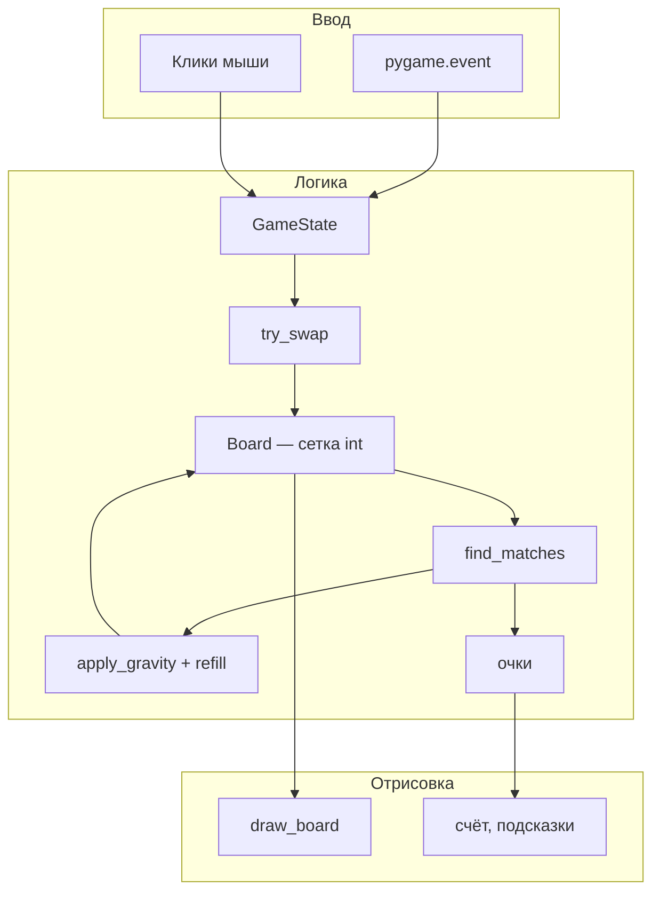
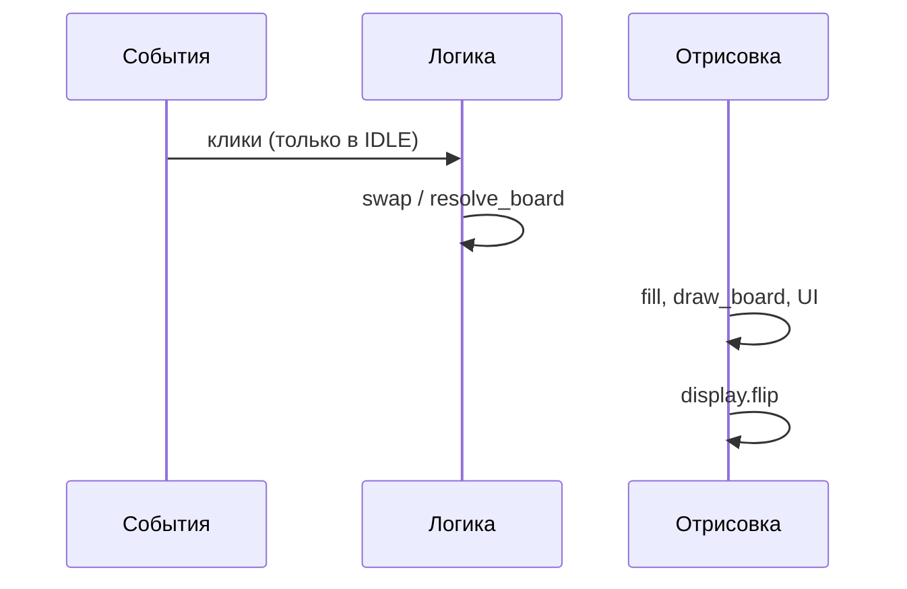
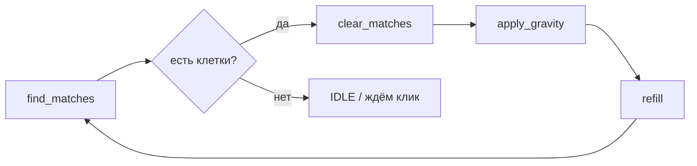

# Python — Match3

<div class="article-tags">
  <span class="tag tag-beginner">ДЛЯ НОВИЧКОВ</span>
</div>

<span class="complexity-badge">Разработчику</span>

---

## О практикуме

Вы соберёте классическую головоломку **«три в ряд»** (Match-3) на **Python 3** и **Pygame**: сетка цветных фишек, выбор и обмен соседних клеток, поиск линий из трёх и более одинаковых, удаление, падение, дозаполнение сверху, **каскады** и счёт очков.

## Как проходить практикум

1. Прочитайте [Практикум разработки игр — о разделе](/encyclopedia/9-spinoff/9-04-razrabotka-igr/praktikum-razrabotki-igr/intro) и создайте папку `match3/` с venv и Pygame ([зависимости](#зависимости-и-каркас-проекта)).
2. Идите по [этапам 1–12](#этап-1-сетка-и-отрисовка-фишек) по порядку: после каждого шага копируйте код в `main.py` и запускайте `python main.py`.
3. На [этапе 13](#этап-13-разбиение-по-модулям) разнесите логику по файлам `config.py`, `match_finder.py`, `board.py`, `game.py` — поведение то же, структура чище.
4. На [этапе 14](#full-revision) — **полная однофайловая ревизия**: готовый `main.py` целиком для копирования; если модули уже сделали, сверяйтесь с ним или оставьте разбиение из этапа 13.

Материал устроен **от общего к частному**:

1. [Архитектура](#архитектура) — модули, данные, состояния игры.
2. [Зависимости и каркас проекта](#зависимости-и-каркас-проекта).
3. [Минимальный запускаемый код](#минимальный-запускаемый-код) — пустое окно.
4. [Этап 0 — логика в консоли](#этап-0-логика-в-консоли) — опционально, без Pygame.
5. [Этапы 1–14](#этап-1-сетка-и-отрисовка-фишек) — каждый этап добавляет одну механику; после каждого шага проект **запускается**.
6. [Отладка и горячие клавиши](#отладка-и-горячие-клавиши).
7. [Тесты логики поля](#тесты-логики-поля).
8. [Дальнейшее развитие](#дальнейшее-развитие) — подсказки, тупиковое поле, анимация, спец-фишки.
9. [Задания для самостоятельной работы](#задания-для-самостоятельной-работы).

База по Pygame и игровому циклу — в [Разработка игр на Python](/encyclopedia/5-languages/5-02-python/312). Короткие примеры с разбором (кликер, состояния игры) — [мини-игры в Lab](/lab/Примеры/1132). Оглавление практикумов — [Практикум разработки игр — о разделе](/encyclopedia/9-spinoff/9-04-razrabotka-igr/praktikum-razrabotki-igr/intro).

### Содержание по разделам

| Раздел | О чём |
|--------|--------|
| [Термины](#термины-match-3) | Swap, каскад, валидный ход |
| [Входные навыки](#входные-навыки) | Python, списки, циклы |
| [Архитектура](#архитектура) | Модули, FSM, сложность алгоритмов |
| [Зависимости](#зависимости-и-каркас-проекта) | venv, pygame, типичные сбои |
| [Этапы 1–14](#этап-1-сетка-и-отрисовка-фишек) | Пошаговый код |
| [Отладка](#отладка-и-горячие-клавиши) | `print_grid`, сброс поля |
| [Тесты](#тесты-логики-поля) | pytest для `find_matches` |
| [Расширения](#дальнейшее-развитие) | Продакшен-фичи |

<div class="callout callout--tip">
  <div class="callout-title">Как проходить</div>
  Создайте папку `match3/`, копируйте код **после каждого этапа**, запускайте `python main.py`. Если что-то сломалось — сравните с блоком «Проверка» в конце этапа. Полный финальный код — в [этапе 14](#full-revision).
</div>

---

## Что должно получиться

| Механика | Описание |
|----------|----------|
| Поле | Сетка 8×8 (настраивается) |
| Фишки | 5–6 типов (цвета) |
| Ход | Клик по фишке → клик по соседу → обмен |
| Правило | Обмен **разрешён**, только если после него есть совпадение |
| Совпадение | 3+ подряд по горизонтали или вертикали |
| Каскад | После удаления — падение, дозаполнение, повторный поиск совпадений |
| Очки | За каждую убранную фишку; бонус за длинные линии |
| Старт | Поле без готовых линий из трёх |

Ориентир по времени: базовый прототип (этапы 1–12) — **3–6 часов** с перерывами; модули, тесты и polish — ещё **2–4 часа**.

---

<span id="термины-match-3"></span>

## Термины Match-3

| Термин | Значение в этом практикуме |
|--------|----------------------------|
| **Фишка (gem)** | Одна клетка сетки с типом `0 … GEM_TYPES-1` |
| **Swap (обмен)** | Перестановка двух **соседних** фишек |
| **Валидный ход** | Обмен, после которого есть хотя бы одно совпадение |
| **Match / совпадение** | Линия из **3 и более** одинаковых по строке или столбцу |
| **Clear** | Замена совпавших клеток на `EMPTY` (`-1`) |
| **Гравитация** | Сдвиг фишек вниз в каждом столбце |
| **Refill** | Заполнение пустых клеток сверху новыми типами |
| **Каскад (combo)** | Цепочка волн: совпадение → падение → refill → снова совпадение **без** нового клика |
| **Resolve** | Один проход «очистить → упасть → дозаполнить» или весь цикл каскада |
| **Стабильное поле** | `find_matches` возвращает пустое множество |

В коммерческих головоломках (Candy Crush, Bejeweled, Homescapes) те же примитивы дополняют **целями уровня** (собрать N синих), **препятствиями** (лёд, цепи) и **спец-фишками** (ракета, бомба). Наш прототип закрывает **ядро** жанра; расширения — в конце статьи.

---

## Входные навыки

Достаточно основ Python:

- списки и вложенные списки (`grid[row][col]`);
- `for`, `while`, `if`;
- функции и `return`;
- `random.randrange`;
- кортежи `(row, col)` и множества `set` для координат совпадений.

Pygame можно не знать заранее — минимальный цикл разобран в [312](/encyclopedia/5-languages/5-02-python/312) и повторён в [минимальном запуске](#минимальный-запускаемый-код).

<div class="callout callout--info">
  <div class="callout-title">Сначала консоль — по желанию</div>
  Если хотите отладить <code>find_matches</code> и каскад без окна — пройдите <a href="#этап-0-логика-в-консоли">этап 0</a>, затем переходите к Pygame.
</div>

---

<span id="архитектура"></span>

## Архитектура

Match-3 удобно делить на **модель** (что на поле) и **представление** (как рисуем в Pygame). Ввод и анимации связываются через **машину состояний**.

### Слои



### Файлы проекта (целевая структура)

К концу практикума в папке `match3/` будут такие файлы:

| Файл | Ответственность |
|------|-----------------|
| `config.py` | Размер поля, число типов фишек, цвета, FPS, размер клетки |
| `board.py` | Сетка, генерация без стартовых матчей, обмен, гравитация, дозаполнение |
| `match_finder.py` | Поиск всех клеток, входящих в линии ≥ 3 |
| `game.py` | Состояния игры, очки, цикл «удалить → упасть → проверить снова» |
| `main.py` | `pygame.init`, цикл кадров, события, вызов отрисовки |

На первых этапах всё лежит в **`main.py`**; на [этапе 13](#этап-13-разбиение-по-модулям) код переносится в модули без изменения поведения.

### Модель поля

Поле — двумерный список целых чисел `grid[row][col]`:

- `0 … GEM_TYPES-1` — тип фишки (цвет);
- `-1` — пустая клетка (после удаления, до дозаполнения).

Индексация: `row = 0` — **верх** экрана, `col = 0` — **лево**. Это совпадает с тем, как мы рисуем прямоугольники в Pygame.

```text
        col=0   col=1   col=2
row=0   [0]     [1]     [2]     ← верх экрана (y маленький в Pygame)
row=1   [3]     [4]     [5]
row=2   [6]     [7]     [8]     ← низ (гравитация тянет сюда)
```

Клик мыши: `col = (mx - PAD) // CELL`, `row = (my - PAD) // CELL`. Сначала **столбец**, потом **строка** — как в матрице `grid[row][col]`.

### Игровой цикл кадра

В Match-3 на каждом кадре (60 FPS) порядок такой:



| Фаза | Когда | Что делаем |
|------|--------|------------|
| События | Всегда | `pygame.event.get()`, выход, мышь |
| Логика | По клику или в RESOLVING | Обмен, каскад, очки |
| Отрисовка | Каждый кадр | `fill` → фишки → счёт → `flip` |
| Время | Конец кадра | `clock.tick(FPS)` |

Логику каскада держите **одной** функцией `resolve_board` — так проще тестировать и позже вставить анимацию между шагами resolve.

### Сложность алгоритмов

На поле `ROWS × COLS` (у нас 8×8 = 64 клетки):

| Операция | Оценка | Комментарий |
|----------|--------|-------------|
| `find_matches` | O(ROWS × COLS) | Два линейных прохода |
| `swap_produces_match` | O(ROWS × COLS) | Два swap + два поиска |
| `apply_gravity` | O(ROWS × COLS) | По столбцам |
| `refill` | O(ROWS × COLS) | В худшем случае несколько попыток типа на клетку |
| `resolve_board` | O(волны × ROWS × COLS) | Волн обычно 1–5 за ход |

Для 8×8 перебор всех соседних пар для подсказки (64×4 соседа) тоже мгновенный — оптимизация не нужна, пока поле не станет 20×20.

### Машина состояний

| Состояние | Игрок может | Логика |
|-----------|-------------|--------|
| `IDLE` | Выбирать фишки, менять пару | Ждём ввод |
| `RESOLVING` | Ничего (или только смотреть) | Удаление, гравитация, каскады |
| `GAME_OVER` | Закрыть окно | Опционально — нет ходов |

Переходы:

```text
IDLE --(валидный swap)--> RESOLVING
RESOLVING --(нет совпадений, поле стабильно)--> IDLE
RESOLVING --(каскад, есть новые матчи)--> RESOLVING
```

Анимацию сдвига фишек можно добавить позже; в этом практикуме каскад **мгновенный** — проще отладить логику.

### Алгоритмы

**Поиск совпадений** — два прохода по строкам и столбцам: для каждой линии считаем длину серии одинаковых значений; если длина ≥ 3, все клетки серии попадают в множество `matched`.

**Валидный обмен** — поменять две соседние клетки местами, вызвать `find_matches`; если множество пустое — вернуть клетки обратно.

**Гравитация** — для каждого столбца снизу вверх собираем непустые фишки, записываем вниз столбца, сверху остаются `-1`.

**Дозаполнение** — для каждой `-1` сверху вниз ставим случайный тип (на старте поля — с проверкой, что не создаём линию из трёх сразу).

**Каскад** — цикл: `matches = find_matches()` → если не пусто → очистить → гравитация → refill → снова, пока `matches` пусто.



### Формула очков (этап 12+)

| Компонент | Формула в прототипе |
|-----------|---------------------|
| За фишку | 10 очков за клетку в `matched` |
| Длинная линия | `+5` за каждую клетку сверх 3 в сумме `len(matched)` (упрощённо) |
| Каскад | Множитель `1.0 + 0.5 × (номер_волны - 1)` |

Пример: первая волна убрала 3 фишки → `3×10 = 30`. Вторая волна убрала 4 → `(40 + 5) × 1.5 = 67` (округление через `int`).

---

<span id="зависимости-и-каркас-проекта"></span>

## Зависимости и каркас проекта

### Требования

- Python **3.10+** (подойдёт 3.11, 3.12);
- pip;
- терминал в папке проекта.

### Виртуальное окружение

```bash
mkdir match3
cd match3
python -m venv .venv
```

Windows (PowerShell):

```powershell
.\.venv\Scripts\Activate.ps1
```

Linux / macOS:

```bash
source .venv/bin/activate
```

### Установка Pygame

```bash
pip install pygame
```

Проверка:

```bash
python -c "import pygame; print(pygame.version.ver)"
```

Опционально зафиксируйте версию:

```bash
pip freeze > requirements.txt
```

В `requirements.txt` обычно одна строка, например `pygame==2.6.1`.

### Каркас каталога (пока один файл)

```text
match3/
  main.py          # пока весь код здесь
  requirements.txt # по желанию
  test_board.py    # после раздела «Тесты»
```

### Если Pygame не ставится или окно не открывается

| Симптом | Что попробовать |
|---------|-----------------|
| `No module named 'pygame'` | Активировано ли venv; `pip install pygame` в том же Python, что запускает `python main.py` |
| Чёрное окно и сразу закрытие | Запуск из терминала — увидите traceback |
| Windows: ошибка SDL / DLL | Обновите Python с [python.org](https://www.python.org/); установите [Visual C++ Redistributable](https://learn.microsoft.com/en-us/cpp/windows/latest-supported-vc-redist) |
| macOS: окно не в фокусе | Разрешите доступ к вводу для Terminal / IDE |
| Linux headless (SSH без дисплея) | Нужен X11/Wayland или пройдите [этап 0](#этап-0-логика-в-консоли) |

<div class="callout callout--warning">
  <div class="callout-title">Один интерпретатор</div>
  В VS Code / Cursor выберите интерпретатор из <code>match3/.venv</code>, иначе расширение и терминал могут ставить пакеты в разные окружения.
</div>

---

<span id="этап-0-логика-в-консоли"></span>

## Этап 0 — логика в консоли

**Цель** — проверить `find_matches`, обмен и каскад в терминале. Файл `board_cli.py` в `match3/`:

```python
import random

ROWS, COLS, GEM_TYPES = 5, 5, 4
EMPTY = -1
CHARS = "RGBY"  # символ на экране для типов 0..3


def print_grid(g):
    for row in g:
        line = ""
        for cell in row:
            line += "." if cell == EMPTY else CHARS[cell]
        print(line)
    print()


def find_matches(g):
    matched = set()
    for row in range(ROWS):
        run_type, run_start, run_len = None, 0, 0
        for col in range(COLS + 1):
            t = g[row][col] if col < COLS else None
            if t == run_type and t is not None and t >= 0:
                run_len += 1
            else:
                if run_len >= 3 and run_type is not None:
                    for c in range(run_start, run_start + run_len):
                        matched.add((row, c))
                run_type, run_start = t, col
                run_len = 1 if t is not None and t >= 0 else 0
    for col in range(COLS):
        run_type, run_start, run_len = None, 0, 0
        for row in range(ROWS + 1):
            t = g[row][col] if row < ROWS else None
            if t == run_type and t is not None and t >= 0:
                run_len += 1
            else:
                if run_len >= 3 and run_type is not None:
                    for r in range(run_start, run_start + run_len):
                        matched.add((r, col))
                run_type, run_start = t, row
                run_len = 1 if t is not None and t >= 0 else 0
    return matched


def resolve_once(g):
    matched = find_matches(g)
    if not matched:
        return 0
    for r, c in matched:
        g[r][c] = EMPTY
    # гравитация + refill — скопируйте из этапов 8–9 или упростите:
    for col in range(COLS):
        col_vals = [g[r][col] for r in range(ROWS) if g[r][col] != EMPTY]
        for r in range(ROWS):
            g[r][col] = EMPTY
        for i, v in enumerate(col_vals):
            g[ROWS - len(col_vals) + i][col] = v
        for r in range(ROWS):
            if g[r][col] == EMPTY:
                g[r][col] = random.randrange(GEM_TYPES)
    return len(matched)


if __name__ == "__main__":
    # тестовое поле: тройка красных в верхней строке
    grid = [
        [0, 0, 0, 1, 2],
        [1, 2, 3, 0, 1],
        [2, 3, 0, 1, 2],
        [3, 0, 1, 2, 3],
        [0, 1, 2, 3, 0],
    ]
    print("До:")
    print_grid(grid)
    print("Совпадения:", find_matches(grid))
    waves = 0
    while find_matches(grid):
        cleared = resolve_once(grid)
        waves += 1
        print(f"Волна {waves}, убрано {cleared}")
        print_grid(grid)
```

Запуск: `python board_cli.py`. Вы должны увидеть исчезновение `RRR` и падение символов. Тот же `find_matches` переносится в Pygame на [этапе 5](#этап-5-поиск-совпадений).

---

<span id="минимальный-запускаемый-код"></span>

## Минимальный запускаемый код

Перед сеткой убедитесь, что **окно открывается и закрывается**. Создайте `main.py`:

```python
import pygame
import sys

pygame.init()

WINDOW_W, WINDOW_H = 640, 720
screen = pygame.display.set_mode((WINDOW_W, WINDOW_H))
pygame.display.set_caption("Match-3 — практикум")

clock = pygame.time.Clock()
FPS = 60

BG = (28, 32, 48)

running = True
while running:
    for event in pygame.event.get():
        if event.type == pygame.QUIT:
            running = False

    screen.fill(BG)
    pygame.display.flip()
    clock.tick(FPS)

pygame.quit()
sys.exit()
```

Запуск:

```bash
python main.py
```

Ожидаемое поведение: тёмно-синее окно, закрытие крестиком. Это тот же каркас, что в [Разработка игр на Python](/encyclopedia/5-languages/5-02-python/312), с фиксированным FPS через `clock.tick`.

`clock.tick(60)` ограничивает **частоту кадров**, а не скорость игры: вся логика Match-3 у нас **пошаговая по клику**, поэтому отвязка от `dt` (дельта-времени) на старте не обязательна. Анимации позже понадобят `dt = clock.tick(FPS) / 1000.0`.

---

<span id="этап-1-сетка-и-отрисовка-фишек"></span>

## Этап 1 — сетка и отрисовка фишек

**Цель** — нарисовать поле 8×8 и случайные фишки без логики совпадений.

Замените `main.py` на:

```python
import pygame
import random
import sys

# --- конфигурация (позже переедет в config.py) ---
COLS, ROWS = 8, 8
GEM_TYPES = 6
CELL = 64
PAD = 40
BOARD_W = COLS * CELL
BOARD_H = ROWS * CELL
WINDOW_W = BOARD_W + PAD * 2
WINDOW_H = BOARD_H + PAD * 2 + 60
FPS = 60

GEM_COLORS = [
    (231, 76, 60),
    (46, 204, 113),
    (52, 152, 219),
    (241, 196, 15),
    (155, 89, 182),
    (230, 126, 34),
]
BG = (28, 32, 48)
GRID_LINE = (45, 52, 72)
SELECT = (255, 255, 255)

pygame.init()
screen = pygame.display.set_mode((WINDOW_W, WINDOW_H))
pygame.display.set_caption("Match-3")
clock = pygame.time.Clock()
font = pygame.font.SysFont("consolas", 22)


def new_grid():
    return [[random.randrange(GEM_TYPES) for _ in range(COLS)] for _ in range(ROWS)]


grid = new_grid()
selected = None  # (row, col) или None


def cell_rect(row, col):
    x = PAD + col * CELL
    y = PAD + row * CELL
    return pygame.Rect(x, y, CELL, CELL)


def draw_board():
    for row in range(ROWS):
        for col in range(COLS):
            rect = cell_rect(row, col)
            pygame.draw.rect(screen, GRID_LINE, rect, 1)
            inner = rect.inflate(-8, -8)
            color = GEM_COLORS[grid[row][col]]
            pygame.draw.rect(screen, color, inner, border_radius=10)
    if selected is not None:
        r, c = selected
        pygame.draw.rect(screen, SELECT, cell_rect(r, c), 3)


running = True
while running:
    for event in pygame.event.get():
        if event.type == pygame.QUIT:
            running = False

    screen.fill(BG)
    draw_board()
    pygame.display.flip()
    clock.tick(FPS)

pygame.quit()
sys.exit()
```

**Проверка:** восемь рядов разноцветных «конфет», без ошибок в консоли.

Константы `CELL` и `PAD` задают геометрию: при смене `CELL` на `48` пересчитываются `WINDOW_W` / `WINDOW_H`. Для слабых машин можно снизить `FPS` до 30 — логика от этого не меняется.

Вынесите перевод пикселей в клетку в одну функцию — она понадобится и для клика, и для drag:

```python
def pos_to_cell(mx, my):
    col = (mx - PAD) // CELL
    row = (my - PAD) // CELL
    if 0 <= row < ROWS and 0 <= col < COLS:
        return row, col
    return None
```

---

## Этап 2 — поле без стартовых троек

**Цель** — при генерации **ни одной** готовой линии из трёх.

Добавьте функции **перед** `grid = new_grid()`:

```python
def creates_match(grid, row, col, gem_type):
    """Создаст ли gem_type в (row,col) горизонтальную или вертикальную тройку."""
    if col >= 2 and grid[row][col - 1] == gem_type and grid[row][col - 2] == gem_type:
        return True
    if row >= 2 and grid[row - 1][col] == gem_type and grid[row - 2][col] == gem_type:
        return True
    return False


def new_grid():
    g = [[0] * COLS for _ in range(ROWS)]
    for row in range(ROWS):
        for col in range(COLS):
            while True:
                t = random.randrange(GEM_TYPES)
                if not creates_match(g, row, col, t):
                    g[row][col] = t
                    break
    return g
```

Удалите старую однострочную версию `new_grid` с двойным `randrange`.

**Проверка:** визуально нет трёх одинаковых подряд ни по строке, ни по столбцу. Перезапустите несколько раз — условие должно сохраняться.

---

## Этап 3 — выбор фишки мышью

**Цель** — первый клик выделяет клетку, повторный клик по той же снимает выделение.

В цикл событий добавьте:

```python
        elif event.type == pygame.MOUSEBUTTONDOWN and event.button == 1:
            mx, my = event.pos
            col = (mx - PAD) // CELL
            row = (my - PAD) // CELL
            if 0 <= row < ROWS and 0 <= col < COLS:
                if selected == (row, col):
                    selected = None
                else:
                    selected = (row, col)
```

**Проверка:** белая рамка перескакивает по клеткам; повторный клик снимает рамку.

---

## Этап 4 — обмен соседних фишек

**Цель** — второй клик по **соседу** (вверх/вниз/влево/вправо) меняет две клетки местами; клик по несоседу — новый выбор.

Добавьте:

```python
def are_adjacent(a, b):
    (r1, c1), (r2, c2) = a, b
    return abs(r1 - r2) + abs(c1 - c2) == 1


def swap_cells(g, a, b):
    (r1, c1), (r2, c2) = a, b
    g[r1][c1], g[r2][c2] = g[r2][c2], g[r1][c1]
```

Обработчик мыши замените на:

```python
        elif event.type == pygame.MOUSEBUTTONDOWN and event.button == 1:
            mx, my = event.pos
            col = (mx - PAD) // CELL
            row = (my - PAD) // CELL
            if 0 <= row < ROWS and 0 <= col < COLS:
                cell = (row, col)
                if selected is None:
                    selected = cell
                elif selected == cell:
                    selected = None
                elif are_adjacent(selected, cell):
                    swap_cells(grid, selected, cell)
                    selected = None
                else:
                    selected = cell
```

**Проверка:** соседние фишки меняются местами; несоседний клик переносит выделение.

<div class="callout callout--info">
  <div class="callout-title">Пока любой обмен</div>
  На следующем этапе «плохие» ходы будут откатываться. Сейчас полезно убедиться, что координаты клика и `swap_cells` работают верно.
</div>

---

## Этап 5 — поиск совпадений

**Цель** — функция возвращает множество координат `(row, col)`, входящих в линии длины ≥ 3.

Добавьте в `main.py` (или отдельный файл позже):

```python
def find_matches(g):
    matched = set()

    # горизонтали
    for row in range(ROWS):
        run_type = None
        run_start = 0
        run_len = 0
        for col in range(COLS + 1):
            t = g[row][col] if col < COLS else None
            if t == run_type and t is not None and t >= 0:
                run_len += 1
            else:
                if run_len >= 3 and run_type is not None and run_type >= 0:
                    for c in range(run_start, run_start + run_len):
                        matched.add((row, c))
                run_type = t
                run_start = col
                run_len = 1 if t is not None and t >= 0 else 0

    # вертикали
    for col in range(COLS):
        run_type = None
        run_start = 0
        run_len = 0
        for row in range(ROWS + 1):
            t = g[row][col] if row < ROWS else None
            if t == run_type and t is not None and t >= 0:
                run_len += 1
            else:
                if run_len >= 3 and run_type is not None and run_type >= 0:
                    for r in range(run_start, run_start + run_len):
                        matched.add((r, col))
                run_type = t
                run_start = row
                run_len = 1 if t is not None and t >= 0 else 0

    return matched
```

Временно подсветите совпадения после каждого кадра (для отладки) — в `draw_board` после рисования фишки:

```python
            if (row, col) in find_matches(grid):
                pygame.draw.rect(screen, (255, 255, 255), inner, 2)
```

Сделайте обмен, который собирает тройку — клетки получат белую обводку.

**Проверка:** тройка и четвёрка в ряд подсвечиваются; угол «Г» из двух троек подсвечивает все шесть клеток.

### Разбор примера на бумаге

Поле 4×4 (цифры — типы фишек):

```text
1 2 1 3
2 1 1 1   ← здесь четыре «1» подряд
3 2 1 2
1 3 2 3
```

`find_matches` вернёт все четыре клетки `(1,1)…(1,4)` по строке 1. Если та же «1» стоит в `(0,2)` и `(2,2)`, вертикаль **не** добавится автоматически, пока там нет **трёх подряд по столбцу** — алгоритм ищет серии отдельно по горизонтали и вертикали, затем объединяет в `set`.

Пересечение двух троек (форма «Г»):

```text
0 0 0 1
1 0 2 1
1 0 2 1
1 1 1 1
```

В `matched` попадут **5** клеток с «0» (горизонталь) и **3** с «1» внизу слева (вертикаль) — всего до 6 уникальных координат в `set`.

---

## Этап 6 — только валидные ходы

**Цель** — если после обмена совпадений нет, вернуть фишки назад.

```python
def swap_produces_match(g, a, b):
    swap_cells(g, a, b)
    ok = len(find_matches(g)) > 0
    swap_cells(g, a, b)
    return ok
```

В обработчике вместо прямого `swap_cells`:

```python
                elif are_adjacent(selected, cell):
                    if swap_produces_match(grid, selected, cell):
                        swap_cells(grid, selected, cell)
                    selected = None
```

Уберите отладочную подсветку из `draw_board`, если мешает.

**Проверка:** «бессмысленный» обмен визуально не меняет поле; обмен, собирающий линию, срабатывает.

---

## Этап 7 — удаление совпадений

**Цель** — matched-клетки становятся пустыми (`-1`).

```python
EMPTY = -1


def clear_matches(g, matched):
    for row, col in matched:
        g[row][col] = EMPTY
```

После успешного обмена вызовите (пока без каскада):

```python
                    if swap_produces_match(grid, selected, cell):
                        swap_cells(grid, selected, cell)
                        matched = find_matches(grid)
                        clear_matches(grid, matched)
```

В `draw_board` для `EMPTY` не рисуйте цветную фишку (останется только сетка).

**Проверка:** после хода тройка исчезает (пустые клетки).

---

## Этап 8 — гравитация

**Цель** — фишки в столбце падают вниз, заполняя пустоты.

```python
def apply_gravity(g):
    for col in range(COLS):
        stack = []
        for row in range(ROWS):
            if g[row][col] != EMPTY:
                stack.append(g[row][col])
        for row in range(ROWS - len(stack)):
            g[row][col] = EMPTY
        offset = ROWS - len(stack)
        for i, gem in enumerate(stack):
            g[offset + i][col] = gem
```

После `clear_matches` добавьте `apply_gravity(grid)`.

**Проверка:** пустоты снизу, цветные блоки «осели» вниз столбца.

---

## Этап 9 — дозаполнение сверху

**Цель** — пустые клетки сверху заполняются новыми фишками без мгновенной тройки в этом столбце.

```python
def refill_column(g, col):
    for row in range(ROWS):
        if g[row][col] == EMPTY:
            while True:
                t = random.randrange(GEM_TYPES)
                if not creates_match(g, row, col, t):
                    g[row][col] = t
                    break


def refill(g):
    for col in range(COLS):
        refill_column(g, col)
```

После гравитации: `refill(grid)`.

**Проверка:** пустое поле после хода снова полностью цветное; сверху появились новые фишки.

---

## Этап 10 — каскады

**Цель** — пока есть совпадения, повторять удаление → гравитация → дозаполнение; начислять очки за все волны.

```python
score = 0


def resolve_board(g):
    global score
    total_cleared = 0
    cascade = 0
    while True:
        matched = find_matches(g)
        if not matched:
            break
        cascade += 1
        mult = 1 + (cascade - 1) * 0.5  # бонус каскада
        total_cleared += len(matched)
        score += int(len(matched) * 10 * mult)
        clear_matches(g, matched)
        apply_gravity(g)
        refill(g)
    return total_cleared
```

После валидного обмена **вместо** ручного clear/gravity/refill:

```python
                        swap_cells(grid, selected, cell)
                        resolve_board(grid)
```

На экране выводите счёт (в основном цикле после `draw_board`):

```python
    label = font.render(f"Очки: {score}", True, (220, 220, 230))
    screen.blit(label, (PAD, WINDOW_H - 50))
```

**Проверка:** один ход может дать несколько волн исчезновений; счёт растёт быстрее при каскадах.

---

## Этап 11 — машина состояний

**Цель** — во время `RESOLVING` игрок не меняет поле; исключаются гонки кликов и каскада.

```python
IDLE = "idle"
RESOLVING = "resolving"
game_state = IDLE
```

Обработчик мыши оберните:

```python
        elif event.type == pygame.MOUSEBUTTONDOWN and event.button == 1:
            if game_state != IDLE:
                continue
            # Оставьте обработчик мыши из этапа 4 без изменений; оберните только в `if game_state != IDLE: continue` (блок выше).
```

После успешного обмена:

```python
                        game_state = RESOLVING
                        swap_cells(grid, selected, cell)
                        resolve_board(grid)
                        game_state = IDLE
                        selected = None
```

Если позже добавите анимацию, `RESOLVING` будет длиться несколько кадров, а `resolve_board` вызовете один раз в конце анимации.

**Проверка:** быстрые клики во время каскада не ломают сетку.

---

## Этап 12 — длинные линии и комбо

**Цель** — больше очков за 4+ в ряд и за каскад.

В `resolve_board` замените начисление на:

```python
        base = 0
        for row, col in matched:
            base += 10
        # удлинённые серии: грубая оценка через размер matched на линии
        bonus = max(0, len(matched) - 3) * 5
        mult = 1.0 + (cascade - 1) * 0.5
        score += int((base + bonus) * mult)
```

**Проверка:** четвёрка в ряд даёт заметно больше очков, чем одна тройка.

---

<span id="отладка-и-горячие-клавиши"></span>

## Отладка и горячие клавиши

Добавьте в проект после [этапа 10](#этап-10-каскады) — ускоряет поиск багов.

### Печать поля в консоль

```python
def debug_print_grid(g):
    for row in g:
        print(" ".join("." if c == EMPTY else str(c) for c in row))
    print()
```

Вызовите `debug_print_grid(grid)` сразу после `resolve_board` — увидите, остались ли `-1` или «висящие» типы.

### Сброс поля и принудительный каскад

В цикл событий:

```python
        elif event.type == pygame.KEYDOWN:
            if event.key == pygame.K_r:
                grid[:] = new_grid()
                score = 0  # или score[0] = 0
                selected = None
            elif event.key == pygame.K_d:
                debug_print_grid(grid)
                print("matches:", find_matches(grid))
```

| Клавиша | Действие |
|---------|----------|
| `R` | Новое случайное поле без стартовых троек |
| `D` | Dump сетки и список совпадений в терминал |

### Подсветка «есть ли ход»

После `resolve_board`, если долго нет валидных пар, вызовите `has_any_move(grid)` из [раздела расширений](#проверка-есть-ли-ходы) и выведите текст «Нет ходов» на экран.

---

<span id="тесты-логики-поля"></span>

## Тесты логики поля

Вынесите `find_matches` в `match_finder.py`, установите pytest: `pip install pytest`.

Файл `test_match_finder.py`:

```python
import pytest
from match_finder import find_matches

ROWS, COLS = 8, 8
EMPTY = -1


def empty_grid():
    return [[EMPTY] * COLS for _ in range(ROWS)]


def test_horizontal_three():
    g = empty_grid()
    for c in range(3):
        g[0][c] = 2
    assert find_matches(g) == {(0, 0), (0, 1), (0, 2)}


def test_vertical_four():
    g = empty_grid()
    for r in range(4):
        g[r][3] = 1
    assert len(find_matches(g)) == 4


def test_L_shape_union():
    g = empty_grid()
    for c in range(3):
        g[2][c] = 0
    for r in range(3):
        g[r][0] = 0
    m = find_matches(g)
    assert (2, 0) in m
    assert len(m) >= 5


def test_empty_ignored():
    g = empty_grid()
    g[0][0] = g[0][1] = g[0][2] = EMPTY
    assert len(find_matches(g)) == 0
```

Запуск из папки `match3/`: `pytest -q`.

<div class="callout callout--tip">
  <div class="callout-title">Тесты до Pygame</div>
  Сначала зелёные тесты на <code>find_matches</code>, потом графика — так вы отделяете баг логики от бага координат клика.
</div>

---

<span id="этап-13-разбиение-по-модулям"></span>

## Этап 13 — разбиение по модулям

**Цель** — тот же код, но читаемая структура из [архитектуры](#архитектура).

### `config.py`

```python
COLS, ROWS = 8, 8
GEM_TYPES = 6
CELL = 64
PAD = 40
BOARD_W = COLS * CELL
BOARD_H = ROWS * CELL
WINDOW_W = BOARD_W + PAD * 2
WINDOW_H = BOARD_H + PAD * 2 + 60
FPS = 60
EMPTY = -1

GEM_COLORS = [
    (231, 76, 60),
    (46, 204, 113),
    (52, 152, 219),
    (241, 196, 15),
    (155, 89, 182),
    (230, 126, 34),
]
BG = (28, 32, 48)
GRID_LINE = (45, 52, 72)
SELECT = (255, 255, 255)
```

### `match_finder.py`

Перенесите `find_matches`, импортируйте `ROWS`, `COLS`, `EMPTY` из `config`.

### `board.py`

Перенесите `creates_match`, `new_grid`, `swap_cells`, `are_adjacent`, `swap_produces_match`, `clear_matches`, `apply_gravity`, `refill`, `refill_column`. Импорты: `config`, `find_matches` из `match_finder`.

### `game.py`

```python
from board import (
    new_grid,
    swap_cells,
    swap_produces_match,
    resolve_board,
    are_adjacent,
)

IDLE = "idle"
RESOLVING = "resolving"


class Game:
    def __init__(self):
        self.grid = new_grid()
        self.score = 0
        self.state = IDLE
        self.selected = None

    def handle_click(self, cell):
        if self.state != IDLE:
            return
        if self.selected is None:
            self.selected = cell
            return
        if self.selected == cell:
            self.selected = None
            return
        if not are_adjacent(self.selected, cell):
            self.selected = cell
            return
        if swap_produces_match(self.grid, self.selected, cell):
            self.state = RESOLVING
            swap_cells(self.grid, self.selected, cell)
            resolve_board(self.grid, self)
            self.selected = None
            self.state = IDLE
        else:
            self.selected = None
```

В `board.py` сделайте `resolve_board(g, game)` так, чтобы он увеличивал `game.score` (или передавайте список `[0]` как в финальном `main.py`).

### `main.py` (тонкий)

```python
import pygame
import sys
from config import WINDOW_W, WINDOW_H, FPS, BG, PAD, CELL, ROWS, COLS, GEM_COLORS, GRID_LINE, SELECT
from game import Game

# draw_board принимает game.grid, game.selected
# цикл: events -> game.try_select_or_swap -> draw -> flip
```

<div class="callout callout--tip">
  <div class="callout-title">Рефакторинг без поломок</div>
  Переносите по одному файлу и запускайте игру после каждого. Сначала `config`, затем `match_finder`, затем `board`, в конце `game` и упростите `main`.
</div>

---

<span id="этап-14-финальная-сборка-и-чек-лист"></span>
<span id="full-revision"></span>

## Этап 14 — финальная сборка и чек-лист

Ниже — **единственный файл** `main.py` (~200 строк). Скопируйте целиком в `match3/main.py`, установите pygame, запустите.

```python
import pygame
import random
import sys

COLS, ROWS = 8, 8
GEM_TYPES = 6
CELL = 64
PAD = 40
WINDOW_W = COLS * CELL + PAD * 2
WINDOW_H = ROWS * CELL + PAD * 2 + 60
FPS = 60
EMPTY = -1

GEM_COLORS = [
    (231, 76, 60), (46, 204, 113), (52, 152, 219),
    (241, 196, 15), (155, 89, 182), (230, 126, 34),
]
BG = (28, 32, 48)
GRID_LINE = (45, 52, 72)
SELECT = (255, 255, 255)

IDLE, RESOLVING = "idle", "resolving"


def creates_match(g, row, col, gem_type):
    if col >= 2 and g[row][col - 1] == gem_type and g[row][col - 2] == gem_type:
        return True
    if row >= 2 and g[row - 1][col] == gem_type and g[row - 2][col] == gem_type:
        return True
    return False


def new_grid():
    g = [[0] * COLS for _ in range(ROWS)]
    for row in range(ROWS):
        for col in range(COLS):
            while True:
                t = random.randrange(GEM_TYPES)
                if not creates_match(g, row, col, t):
                    g[row][col] = t
                    break
    return g


def find_matches(g):
    matched = set()
    for row in range(ROWS):
        run_type, run_start, run_len = None, 0, 0
        for col in range(COLS + 1):
            t = g[row][col] if col < COLS else None
            if t == run_type and t is not None and t >= 0:
                run_len += 1
            else:
                if run_len >= 3 and run_type is not None and run_type >= 0:
                    for c in range(run_start, run_start + run_len):
                        matched.add((row, c))
                run_type, run_start = t, col
                run_len = 1 if t is not None and t >= 0 else 0
    for col in range(COLS):
        run_type, run_start, run_len = None, 0, 0
        for row in range(ROWS + 1):
            t = g[row][col] if row < ROWS else None
            if t == run_type and t is not None and t >= 0:
                run_len += 1
            else:
                if run_len >= 3 and run_type is not None and run_type >= 0:
                    for r in range(run_start, run_start + run_len):
                        matched.add((r, col))
                run_type, run_start = t, row
                run_len = 1 if t is not None and t >= 0 else 0
    return matched


def are_adjacent(a, b):
    (r1, c1), (r2, c2) = a, b
    return abs(r1 - r2) + abs(c1 - c2) == 1


def swap_cells(g, a, b):
    (r1, c1), (r2, c2) = a, b
    g[r1][c1], g[r2][c2] = g[r2][c2], g[r1][c1]


def swap_produces_match(g, a, b):
    swap_cells(g, a, b)
    ok = len(find_matches(g)) > 0
    swap_cells(g, a, b)
    return ok


def clear_matches(g, matched):
    for row, col in matched:
        g[row][col] = EMPTY


def apply_gravity(g):
    for col in range(COLS):
        stack = [g[row][col] for row in range(ROWS) if g[row][col] != EMPTY]
        for row in range(ROWS - len(stack)):
            g[row][col] = EMPTY
        for i, gem in enumerate(stack):
            g[ROWS - len(stack) + i][col] = gem


def refill(g):
    for col in range(COLS):
        for row in range(ROWS):
            if g[row][col] == EMPTY:
                while True:
                    t = random.randrange(GEM_TYPES)
                    if not creates_match(g, row, col, t):
                        g[row][col] = t
                        break


def resolve_board(g, score_holder):
    cascade = 0
    while True:
        matched = find_matches(g)
        if not matched:
            break
        cascade += 1
        mult = 1.0 + (cascade - 1) * 0.5
        base = len(matched) * 10 + max(0, len(matched) - 3) * 5
        score_holder[0] += int(base * mult)
        clear_matches(g, matched)
        apply_gravity(g)
        refill(g)


pygame.init()
screen = pygame.display.set_mode((WINDOW_W, WINDOW_H))
pygame.display.set_caption("Match-3")
clock = pygame.time.Clock()
font = pygame.font.SysFont("consolas", 22)

grid = new_grid()
selected = None
game_state = IDLE
score = [0]


def cell_rect(row, col):
    return pygame.Rect(PAD + col * CELL, PAD + row * CELL, CELL, CELL)


def draw_board():
    for row in range(ROWS):
        for col in range(COLS):
            rect = cell_rect(row, col)
            pygame.draw.rect(screen, GRID_LINE, rect, 1)
            if grid[row][col] == EMPTY:
                continue
            inner = rect.inflate(-8, -8)
            pygame.draw.rect(screen, GEM_COLORS[grid[row][col]], inner, border_radius=10)
    if selected:
        pygame.draw.rect(screen, SELECT, cell_rect(*selected), 3)


running = True
while running:
    for event in pygame.event.get():
        if event.type == pygame.QUIT:
            running = False
        elif event.type == pygame.MOUSEBUTTONDOWN and event.button == 1 and game_state == IDLE:
            mx, my = event.pos
            col = (mx - PAD) // CELL
            row = (my - PAD) // CELL
            if 0 <= row < ROWS and 0 <= col < COLS:
                cell = (row, col)
                if selected is None:
                    selected = cell
                elif selected == cell:
                    selected = None
                elif are_adjacent(selected, cell):
                    if swap_produces_match(grid, selected, cell):
                        game_state = RESOLVING
                        swap_cells(grid, selected, cell)
                        resolve_board(grid, score)
                        selected = None
                        game_state = IDLE
                    else:
                        selected = None
                else:
                    selected = cell

    screen.fill(BG)
    draw_board()
    screen.blit(font.render(f"Очки: {score[0]}", True, (220, 220, 230)), (PAD, WINDOW_H - 50))
    pygame.display.flip()
    clock.tick(FPS)

pygame.quit()
sys.exit()
```

### Разбор финальной сборки

- **Модель сетки** — `grid[row][col]` с типами `0 … GEM_TYPES-1` и `EMPTY = -1`; `new_grid()` заполняет поле без стартовых троек через `creates_match`.
- **`find_matches` в два прохода** — отдельно горизонтали и вертикали: счётчик серии одинаковых значений, при длине ≥ 3 все клетки серии попадают в `set` координат (пересечения «Г» объединяются автоматически).
- **`resolve_board` и каскад** — цикл `while`: найти совпадения → начислить очки с множителем волны → `clear_matches` → `apply_gravity` → `refill`, пока `find_matches` не вернёт пустое множество.
- **FSM `IDLE` / `RESOLVING`** — клики обрабатываются только в `IDLE`; на время `resolve_board` состояние `RESOLVING`, чтобы быстрые клики не ломали сетку (в финале каскад мгновенный, FSM готов к анимации позже).
- **`score_holder` как список** — `score = [0]` и `resolve_board(g, score_holder)` меняют `score_holder[0]` без `global score`: удобно передать тот же приём в `game.py` на этапе 13.

### Чек-лист самопроверки

| # | Проверка | Ожидание |
|---|----------|----------|
| 1 | Стартовое поле | Нет готовых троек |
| 2 | Обмен не соседей | Только смена выделения |
| 3 | Обмен без матча | Поле не меняется |
| 4 | Обмен с матчем | Тройка+ исчезает |
| 5 | Каскад | Новые тройки после падения дают вторую волну |
| 6 | Счёт | Растёт при каждой волне |
| 7 | Быстрые клики | Сетка остаётся согласованной |
| 8 | `R` / `D` | Новое поле и dump в консоль ([отладка](#отладка-и-горячие-клавиши)) |
| 9 | `pytest` | Тесты из [раздела тестов](#тесты-логики-поля) проходят |

### Типичные ошибки

| Симптом | Причина | Что сделать |
|---------|---------|-------------|
| Клик «мимо» клеток | Неверные `PAD` / `CELL` | Пересчитайте `(mx - PAD) // CELL` |
| Все обмены запрещены | `find_matches` до обмена видит старые линии | Проверьте откат в `swap_produces_match` |
| Дыры не падают | Гравитация сверху вниз | Пустые должны оказаться **вверху** столбца |
| Бесконечный каскад | `refill` создаёт только тройки | Используйте `creates_match` при дозаполнении |
| Счёт скачет | `resolve` вызывается дважды за клик | Один вызов после валидного swap |
| Подсветка не там | `row`/`col` перепутаны с `x`/`y` | Используйте `pos_to_cell`; `grid[row][col]` |
| `creates_match` в refill | Проверяются только 2 соседа слева/сверху | Достаточно для дозаполнения сверху вниз по столбцу |

### Карта этапов

```text
 1 сетка → 2 без троек → 3 выбор → 4 swap → 5 find_matches
 → 6 валидный ход → 7 clear → 8 gravity → 9 refill
 → 10 каскад+очки → 11 FSM → 12 бонусы → 13 модули → 14 финал
```

---

<span id="дальнейшее-развитие"></span>

## Дальнейшее развитие

После [этапа 14](#этап-14-финальная-сборка-и-чек-лист) прототип играбелен. Ниже — готовые куски кода для типичных улучшений; внедряйте **по одному**, после каждого запускайте игру и прогоняйте `pytest`.

| Направление | Сложность | Раздел |
|-------------|-----------|--------|
| Подсказка | ★☆☆ | [Подсказка хода](#подсказка-хода) |
| Нет ходов | ★★☆ | [Проверка ходов](#проверка-есть-ли-ходы) |
| Счётчик ходов / цель | ★★☆ | [Уровень по очкам](#уровень-по-очкам) |
| Анимация swap | ★★★ | [Анимация](#анимация-обмена-и-падения) |
| Спец-фишки | ★★★ | [Спец-фишки](#спец-фишки-4-и-5-в-ряд) |
| Звук и сохранение | ★★☆ | [Звук и save](#звук-и-сохранение) |

Соседние практикумы на Pygame — [Ping Pong](./3.md), [Tetris](./5.md); там те же приёмы цикла и состояния, другая игровая логика.

### Подсказка хода

Перебор всех соседних пар на поле:

```python
def find_hint(g):
    for row in range(ROWS):
        for col in range(COLS):
            a = (row, col)
            for dr, dc in ((0, 1), (1, 0)):
                r2, c2 = row + dr, col + dc
                if r2 < ROWS and c2 < COLS:
                    b = (r2, c2)
                    if swap_produces_match(g, a, b):
                        return a, b
    return None
```

По клавише `H` подсветите обе клетки из `find_hint(grid)` жёлтым контуром. В коммерческих играх таймер бездействия запускает подсказку автоматически.

### Проверка есть ли ходы

<span id="проверка-есть-ли-ходы"></span>

```python
def has_any_move(g):
    return find_hint(g) is not None
```

При старте уровня и после каждого `resolve_board`, если `not has_any_move(grid)` — перемешайте поле (`grid[:] = new_grid()`) или покажите экран «Нет ходов». Иначе игрок застрянет на случайной раскладке.

Гарантия «всегда есть ход» на больших полях достигается генераторами уровней; для учебного 8×8 достаточно перегенерации.

### Уровень по очкам

```python
TARGET_SCORE = 500
moves_left = 25

# после resolve_board:
moves_left -= 1
if score[0] >= TARGET_SCORE:
    show_win = True
elif moves_left <= 0:
    show_lose = True
```

Отрисуйте `Цель: 500` и `Ходы: &#123;moves_left&#125;` под полем. Так появляется **пазл с ограничением**, как в мобильных Match-3.

### Анимация обмена и падения

Идея: во время `RESOLVING` **не** вызывать полный `resolve_board` сразу, а разбить на шаги:

1. **Swap** — 8–12 кадров: интерполяция позиции двух фишек (`t` от 0 до 1, `pos = start + t * (end - start)`).
2. **Clear** — уменьшение `alpha` или scale matched-клеток 6 кадров, затем `clear_matches`.
3. **Fall** — для каждой фишки, сменившей `row`, анимировать `offset_y` от старой строки к новой.
4. **Refill** — новые фишки появляются сверху с `offset_y < 0`, опускаются на место.

Псевдокод lerp для обмена:

```python
def lerp(a, b, t):
    return a + (b - a) * t

# в update анимации:
t = min(1.0, elapsed_ms / 150.0)
draw_gem_at_pixel(lerp(x1, x2, t), lerp(y1, y2, t), gem_type)
```

Когда `t >= 1`, зафиксируйте swap в `grid` и переходите к следующей фазе. Полный `resolve_board` остаётся «математикой»; анимация только визуализирует те же шаги.

### Спец-фишки 4 и 5 в ряд

Расширьте `find_matches`, чтобы возвращать не только `set` координат, но и **тип бонуса** для длинных серий:

| Длина серии | Бонус (пример) |
|-------------|----------------|
| 4 | `ROCKET` — очистить всю строку или столбец |
| 5 | `BOMB` — очистить крест 3×3 |
| 6+ | `RAINBOW` — убрать все фишки одного типа с поля |

В `grid` храните отрицательные коды или отдельную матрицу `special[row][col]`. При `clear_matches` если клетка — ракета, добавьте в `matched` все клетки строки.

Минимальный шаг: при `len(horizontal_run) == 4` пометьте центральную клетку типом `SPECIAL_ROCKET = 100` и при следующем включении в match очистите весь `row`.

### Звук и сохранение

```python
# после pygame.init()
pygame.mixer.init()
snd_match = pygame.mixer.Sound("match.wav")  # короткий wav в папке проекта

# в resolve_board при len(matched) > 0:
snd_match.play()
```

Сохранение в `save.json`:

```python
import json

def save_game(grid, score):
    with open("save.json", "w", encoding="utf-8") as f:
        json.dump({"grid": grid, "score": score}, f)

def load_game():
    with open("save.json", encoding="utf-8") as f:
        data = json.load(f)
    return data["grid"], data["score"]
```

По `S` / `L` — save / load в обработчике `KEYDOWN`.

### Свайп мышью (drag)

Вместо двух кликов: на `MOUSEBUTTONDOWN` запомнить клетку, на `MOUSEBUTTONUP` вычислить смещение; если `|dx|+|dy| == CELL`, сосед определён по знаку смещения. Так ближе к мобильному UX.

### Сравнение с «большими» Match-3

| Фича | Наш прототип | Candy Crush / аналоги |
|------|----------------|------------------------|
| Валидный swap | Да | Да |
| Каскад | Да | Да + FX |
| Цели уровня | Опционально | Сбор цветов, очистка плитки |
| Препятствия | Нет | Желе, блокеры |
| Монетизация | Нет | Жизни, бустеры |
| Уровень-дизайн | Случайная сетка | Ручные / процедурные карты |

Ядро совпадает; отличия — контент и мета-игра.

---

<span id="задания-для-самостоятельной-работы"></span>

## Задания для самостоятельной работы

| # | Задание | Критерий готовности |
|---|---------|---------------------|
| 1 | Поле 6×6 и 5 цветов | Играбельно, тесты зелёные |
| 2 | Клавиша `H` — подсказка | Подсвечивается валидная пара |
| 3 | Счётчик каскада на экране | «Комбо x3» при третьей волне |
| 4 | Запрет обмена во время анимации | FSM + таймер 150 ms |
| 5 | Спец-фишка за 4 в ряд | Очищает строку |
| 6 | `has_any_move` + перетасовка | Нет «мёртвых» полей |
| 7 | Уровень «500 очков за 20 ходов» | Экран победы / поражения |
| 8 | Спрайты PNG вместо прямоугольников | `pygame.image.load` + `blit` |

<div class="callout callout--note">
  <div class="callout-title">Портфолио</div>
  Выложите <code>match3/</code> на GitHub с README (скриншот, <code>pip install -r requirements.txt</code>, <code>python main.py</code>) — готовый пункт в портфолио junior game dev.
</div>

---

## См. также

- [Практикум разработки игр — о разделе](/encyclopedia/9-spinoff/9-04-razrabotka-igr/praktikum-razrabotki-igr/intro)
- [Разработка игр на Python](/encyclopedia/5-languages/5-02-python/312)
- [Компьютерные игры — о разделе](/encyclopedia/1-basics/1-18-kompyuternye-igry/intro)

---
