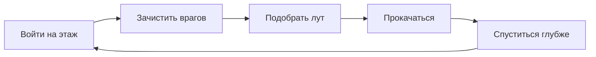
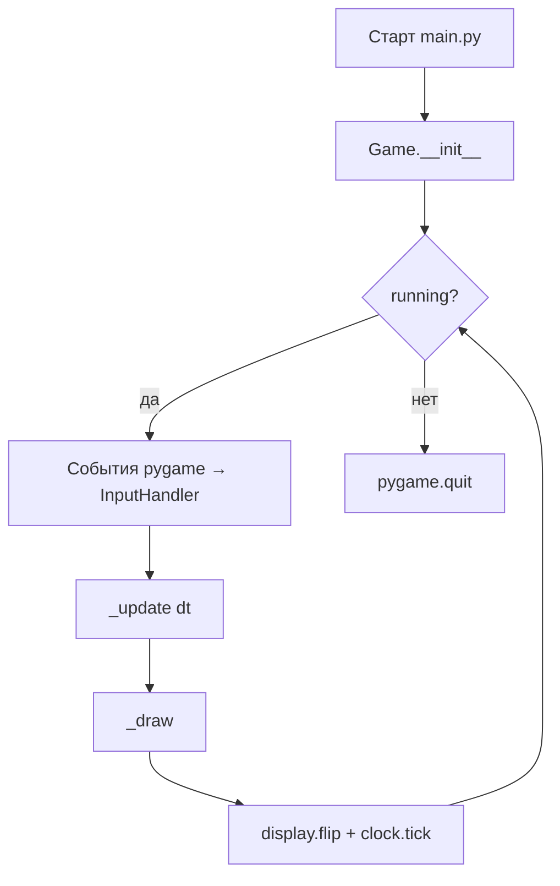
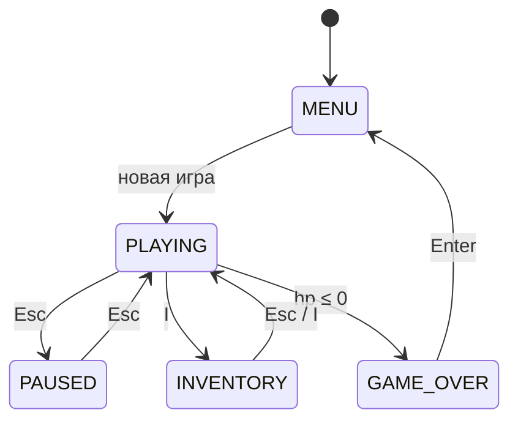
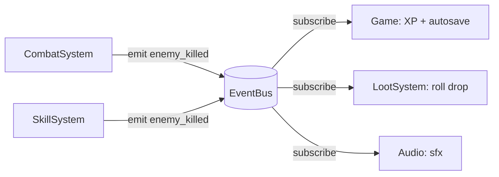
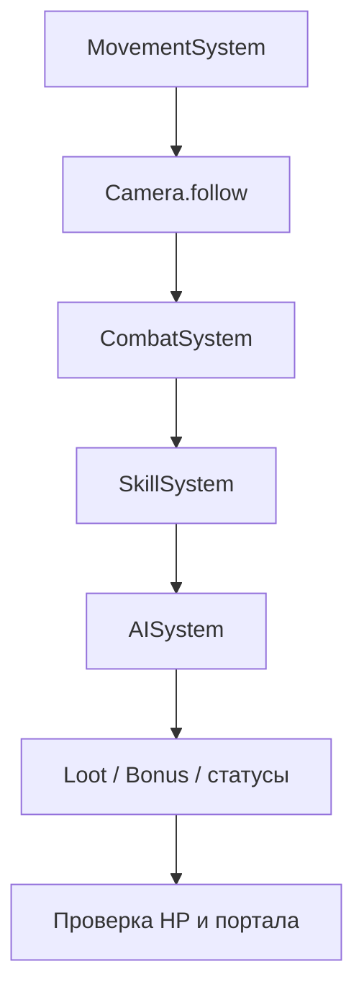
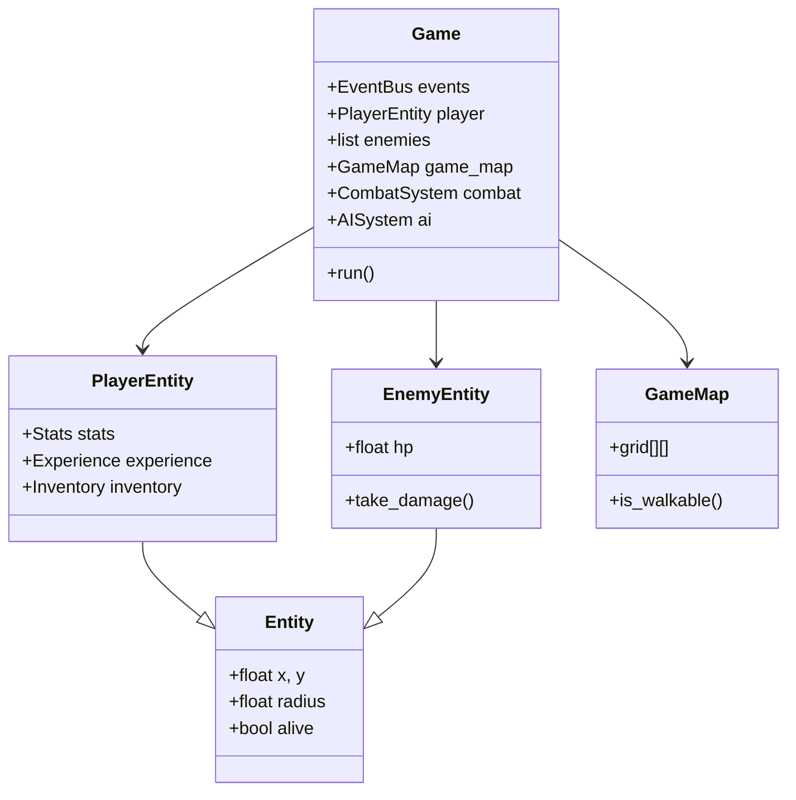
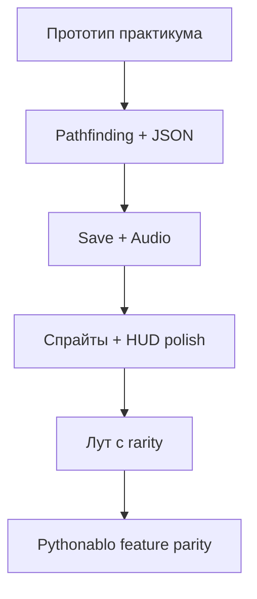

# Python — диаблоид

<div class="article-tags">
  <span class="tag tag-inprogress">В РАЗРАБОТКЕ</span>
</div>

<span class="complexity-badge">Разработчику</span>
<span class="complexity-badge">Средний уровень</span>

---

## О практикуме

**Диаблоид** (hack and slash, action-RPG) — вид сверху или изометрия, клик по врагам, лут, прокачка, процедурные подземелья. В этом практикуме соберём **узнаваемый прототип** на **Python 3** и **Pygame** — от чёрного окна до боя, лута, уровней и простого меню. Полная версия с NPC, легендарками и ареной — в репозитории [Pythonablo](https://github.com/Spirzen/Pythonablo).

### Четыре столпа жанра

| Столп | Что даёт игроку | Что реализуем в практикуме |
|-------|-----------------|----------------------------|
| **Бой** | постоянное давление, тактика дистанции | удар по курсору, рывок, огненный шар |
| **Лут** | «ещё один забег ради шмотки» | дроп с врагов, зелья, экипировка |
| **Прокачка** | рост силы персонажа | XP, level-up, бонусы от предметов |
| **Исследование** | новые этажи и карта | процедурные комнаты, портал вниз |

Узнаваемый **core loop** diabloида выглядит так:



Каждый этап практикума добавляет один элемент этого цикла или инфраструктуру под него (рендер, ввод, сохранение состояния).

<div class="callout callout--info">
  <div class="callout-title">Для кого материал</div>
  Нужны базовые Python (классы, dataclass, списки) и Pygame из статьи <a href="/encyclopedia/5-languages/5-02-python/312">Разработка игр на Python</a>. Каждый этап — <strong>запускаемый код</strong>: после шага проект можно запустить и увидеть новую механику. Графика на первых этапах — примитивы Pygame; спрайты подключим позже.
</div>

**Управление в финальной версии практикума**

| Клавиша / мышь | Действие |
|----------------|----------|
| `W` `A` `S` `D` или стрелки | Движение |
| ЛКМ (удержание) | Атака в сторону курсора |
| `Пробел` | Рывок |
| `1` или `F` | Огненный шар |
| `I` | Инвентарь |
| `E` | Портал / подбор предмета |
| `Esc` | Пауза / меню |

**Маршрут чтения**

1. [Архитектура](#architecture) — слои, изометрия, машина состояний, шина событий.
2. [Зависимости и структура папок](#dependencies) — окружение и целевая раскладка файлов.
3. [Этап 0 — минимальный запуск](#stage-0) — окно и игровой цикл.
4. Этапы 1–18 — по одной подсистеме за шаг.
5. [Бонусные этапы 19–22](#stage-19) — pathfinding, data-driven враги, сохранения, звук.
6. [Типичные ошибки и отладка](#debugging).
7. [Итоговая самопроверка и расширения](#final-checklist).

### Карта этапов

| Этап | Тема | Новая механика | Зависит от |
|------|------|----------------|------------|
| 0 | Цикл Pygame | окно, выход | — |
| 1 | `config.py` | константы, enum | 0 |
| 2 | Entity | игрок в данных | 1 |
| 3 | Renderer + Camera | изометрия, камера | 1–2 |
| 4 | InputHandler | WASD, мышь | 0 |
| 5 | LevelGenerator | процедурная карта | 1 |
| 6 | Collision + Movement | ходьба без прохода сквозь стены | 3–5 |
| 7 | MapRenderer | рисование подземелья | 3, 5 |
| 8 | CombatSystem | удар по дуге | 4, 6 |
| 9 | AISystem | враги, chase | 5–8 |
| 10 | EventBus + XP | level-up | 8–9 |
| 11 | LootSystem | дроп на землю | 10 |
| 12 | Inventory | экипировка | 11 |
| 13 | SkillSystem | огненный шар | 8, 10 |
| 14 | HUD | полоски HP/MP | 2, 10 |
| 15 | Menu + GameState | меню, пауза | 4 |
| 16 | Порталы | смена этажа | 5, 9 |
| 17 | Dash | рывок, серия ударов | 6, 8 |
| 18 | `Game` class | сборка проекта | все |
| 19* | Pathfinding | A* вместо прямого chase | 9 |
| 20* | `enemies.json` | враги из данных | 9 |
| 21* | SaveManager | сохранение прогресса | 10–16 |
| 22* | AudioSystem | процедурный SFX | 10 |

\* — бонусные этапы после базового прототипа.

<div class="callout callout--tip">
  <div class="callout-title">Готовый проект</div>
  Если хотите сразу поиграть в полную версию — клонируйте <a href="https://github.com/Spirzen/Pythonablo">Pythonablo</a>, установите зависимости и запустите <code>python main.py</code>. Практикум ниже объясняет, <strong>как такой проект собирается с нуля</strong>, шаг за шагом.
</div>

---

<span id="architecture"></span>
## Архитектура

Прежде чем писать код, зафиксируем **что из чего состоит** и **как данные текут по кадру**. Целевая архитектура совпадает с [Pythonablo](https://github.com/Spirzen/Pythonablo) — один процесс, Pygame, без сети.

### Игровой цикл

Любая игра на Pygame крутит один и тот же цикл. В диаблоиде порядок шагов важен — сначала ввод и логика, потом отрисовка.



На каждом кадре внутри **обновления** (состояние `PLAYING`) выполняется цепочка:

1. `MovementSystem` — движение игрока и рывок.
2. `Camera.follow` — камера за игроком.
3. `CombatSystem` — атака по ЛКМ, таймеры ударов.
4. `SkillSystem` — снаряды и AoE.
5. `AISystem` — преследование и атака врагов.
6. `LootSystem` / `BonusSystem` — дроп и подбор (через `EventBus`).
7. Проверка HP, порталов, смены этажа.

### Слои приложения

| Слой | Пакет | Ответственность |
|------|-------|-----------------|
| **Точка входа** | `main.py` | `Game().run()` |
| **Оркестрация** | `core/` | Цикл, `GameState`, `config`, `EventBus` |
| **Движок** | `engine/` | Рендер, камера, ввод, звук, спрайты |
| **Мир** | `world/` | Карта, генерация, коллизии, pathfinding |
| **Сущности** | `entities/` | Игрок, враги, предметы на земле, NPC |
| **Данные игрока** | `player/` | Статы, инвентарь, экипировка, опыт, навыки |
| **Системы** | `systems/` | Бой, AI, лут, умения, эффекты |
| **Интерфейс** | `ui/` | Меню, HUD, инвентарь, пауза |
| **Сохранения** | `save/` + `data/` | JSON-сохранение, шаблоны врагов и предметов |

Слой **систем** меняет состояние сущностей; слой **engine** только рисует и читает ввод. Так проще добавлять новых врагов и предметы без правок рендера.

### Изометрические координаты

Мир храним в **тайловых координатах** `(wx, wy)` — float, центр клетки `(tx + 0.5, ty + 0.5)`. Экран — изометрия через линейное преобразование:

```
Экран (sx, sy) = f(wx, wy, cam_x, cam_y)

  sx = (wx - wy) * (ISO_TILE_W / 2) - cam_x + SCREEN_W / 2
  sy = (wx + wy) * (ISO_TILE_H / 2) - cam_y + SCREEN_H / 2 - offset
```

Обратное преобразование (`screen_to_world`) нужно для **прицеливания атаки по курсору**.

```
Мир (тайлы)                    Экран (изометрия)
┌───┬───┬───┐                       ╱╲
│   │   │   │                      ╱  ╲
├───┼───┼───┤        →            ╱    ╲
│   │ @ │   │                    ╱  @   ╲
├───┼───┼───┤                   ╱________╲
│   │   │   │
└───┴───┴───┘
```

Рекомендуемые константы (все модули берут их из `core/config.py`):

| Константа | Значение | Смысл |
|-----------|----------|-------|
| `SCREEN_WIDTH` × `SCREEN_HEIGHT` | 1280×720 | Окно |
| `FPS` | 120 | Целевой FPS (можно 60 на слабом ПК) |
| `ISO_TILE_W` × `ISO_TILE_H` | 64×32 | Ромб тайла на экране |
| `MAP_WIDTH` × `MAP_HEIGHT` | 61×46 | Размер карты в тайлах |
| `PLAYER_SPEED` | 310 | Скорость бега |
| `ATTACK_ARC` | π (180°) | Полукруг удара |

### Машина состояний

Игра переключает экраны через `GameState`:



На этапах 0–12 работаем только в `PLAYING`. Меню и инвентарь добавим на этапах 15–16.

### EventBus — связь систем без спагетти

Когда враг умирает, нужно начислить опыт, бросить лут, проиграть звук, обновить счётчик убийств. Вместо прямых вызовов десятка функций из `CombatSystem` используем **pub/sub**:



| Событие | Кто эмитит | Кто слушает |
|---------|------------|-------------|
| `enemy_killed` | combat, skills | Game, loot, audio |
| `enemy_hit` | combat | effects, streak |
| `attack_swung` | combat | audio |
| `item_dropped` | loot | Game (список на земле) |
| `player_died` | combat, Game | переход в GAME_OVER |

### Время кадра `dt` и фиксированный шаг

Вся логика движения, кулдаунов и регенерации завязана на **`dt`** — секунды с прошлого кадра:

```python
dt = min(clock.tick(FPS) / 1000.0, 0.05)
```

Ограничение `0.05` (50 ms) защищает от «скачка» физики после паузы отладчика или лагов ОС. Скорость в `MovementSystem` умножается на `dt`, поэтому при 30 FPS и 120 FPS игрок проходит **одинаковое расстояние в секунду**.

| Величина | Формула в коде | Смысл |
|----------|----------------|-------|
| Смещение за кадр | `speed * dt * 0.012` | коэффициент 0.012 подгоняет тайловые единицы |
| Кулдаун атаки | `attack_timer -= dt` | секунды до следующего удара |
| Реген HP | `hp += regen * dt` | восстановление в секунду |

### Порядок update и draw в `PLAYING`

В полном [Pythonablo](https://github.com/Spirzen/Pythonablo) порядок `_update_playing` строго зафиксирован — нарушение ломает геймплей (например, враг бьёт до того, как игрок успел отойти):



**Отрисовка** — снизу вверх (дальний план → игрок → HUD):

1. фон и тайлы карты;
2. предметы на земле;
3. враги;
4. снаряды и эффекты;
5. игрок;
6. дуги ударов;
7. HUD и оверлеи меню.

В изометрии сущности на **большем** `wx + wy` рисуются **позже** (ближе к камере). На этапе 7 достаточно фиксированного порядка «карта → враги → игрок»; для сложных сцен добавьте сортировку:

```python
drawables = [(e.x + e.y, e) for e in enemies if e.alive]
drawables.append((player.x + player.y, player))
drawables.sort(key=lambda t: t[0])
for _, ent in drawables:
    draw_entity(ent)
```

### Целевая структура файлов

К **этапу 6** достаточно нескольких модулей. К **этапу 18** проект выглядит так:

```
pythonablo/
├── main.py
├── requirements.txt
├── core/
│   ├── config.py
│   ├── event_bus.py
│   └── game.py              # главный цикл (этап 18)
├── engine/
│   ├── renderer.py
│   ├── camera.py
│   ├── input_handler.py
│   └── map_renderer.py
├── world/
│   ├── tile.py
│   ├── map.py
│   ├── level_generator.py
│   └── collision.py
├── entities/
│   ├── entity.py
│   ├── player.py
│   └── enemy.py
├── player/
│   ├── stats.py
│   ├── experience.py
│   ├── inventory.py
│   └── equipment.py
├── systems/
│   ├── movement_system.py
│   ├── combat_system.py
│   ├── ai_system.py
│   ├── loot_system.py
│   └── skill_system.py
├── ui/
│   ├── hud.py
│   └── menu.py
├── data/
│   ├── enemies.json
│   └── items.json
└── assets/                  # спрайты (опционально)
```

<div class="callout callout--tip">
  <div class="callout-title">Почему «системы», а не один god-class</div>
  <code>CombatSystem</code> знает про дугу удара и урон; <code>AISystem</code> — про pathfinding. <code>Game</code> только вызывает их по порядку и хранит списки <code>enemies</code>, <code>ground_items</code>. Новый тип врага — правка <code>data/enemies.json</code> и шаблон в AI, без переписывания HUD.
</div>

### Диаграмма объектов



---

<span id="dependencies"></span>
## Зависимости и подготовка окружения

### Требования

- **Python 3.10+** (аннотации `str | None`, `match` по желанию).
- **Pygame ≥ 2.5.0** — единственная внешняя зависимость.

### Установка

```bash
mkdir pythonablo && cd pythonablo
python -m venv .venv
```

Активация виртуального окружения:

- **Windows (PowerShell):** `.venv\Scripts\Activate.ps1`
- **Linux / macOS:** `source .venv/bin/activate`

```bash
pip install pygame
python -c "import pygame; print('Pygame', pygame.ver)"
```

Файл `requirements.txt`:

```
pygame>=2.5.0
```

### Клонирование эталона

Если хотите сверять свой код с готовым проектом:

```bash
git clone https://github.com/Spirzen/Pythonablo.git
cd Pythonablo
python -m venv .venv
.venv\Scripts\Activate.ps1    # Windows
# source .venv/bin/activate   # Linux / macOS
pip install -r requirements.txt
python main.py
```

Учебный прототип из практикума **не обязан** совпадать с репозиторием построчно — мы сознательно упрощаем генерацию, AI и лут. Репозиторий — **ориентир архитектуры** и источник идей для бонусных этапов.

### Первичная структура

На **этапе 0** создайте только `main.py`. Пакеты `core/`, `engine/`, `world/` и остальные добавляем по ходу — в каждом пакете нужен пустой `__init__.py` (можно оставить файл пустым).

<div class="callout callout--warning">
  <div class="callout-title">Импорты между пакетами</div>
  Запускайте игру из корня проекта: <code>python main.py</code>. Тогда <code>from core.config import FPS</code> работает без установки пакета в site-packages.
</div>

---

<span id="stage-0"></span>
## Этап 0 — минимальный запускаемый код

**Цель** — окно, цикл событий, выход по крестику и `Esc`, стабильные 60 FPS.

Создайте `main.py`:

```python
import sys
import pygame

pygame.init()

SCREEN_W, SCREEN_H = 1280, 720
FPS = 60

screen = pygame.display.set_mode((SCREEN_W, SCREEN_H))
pygame.display.set_caption("Pythonablo — этап 0")
clock = pygame.time.Clock()

running = True
while running:
    for event in pygame.event.get():
        if event.type == pygame.QUIT:
            running = False
        elif event.type == pygame.KEYDOWN and event.key == pygame.K_ESCAPE:
            running = False

    screen.fill((12, 14, 26))
    pygame.display.flip()
    clock.tick(FPS)

pygame.quit()
sys.exit()
```

Запуск:

```bash
python main.py
```

**Самопроверка этапа 0**

- [ ] Окно 1280×720 открывается без traceback.
- [ ] Фон тёмно-синий, без мерцания.
- [ ] `Esc` и крестик закрывают программу.

На следующих этапах **не удаляем** цикл — постепенно переносим логику в класс `Game`.

<div class="callout callout--note">
  <div class="callout-title">Почему 60 FPS на старте, 120 в финале</div>
  На этапе 0 достаточно 60 — проще отладка. В <code>config.py</code> полного проекта стоит <code>FPS = 120</code> для плавности dash и серии ударов. Можно оставить 60 на всём прототипе, если железо слабое.
</div>

---

<span id="stage-1"></span>
## Этап 1 — константы и конфигурация

**Цель** — один источник правды для размеров, скоростей и enum-состояний.

Создайте `core/__init__.py` (пустой) и `core/config.py`:

```python
"""Game constants."""

from enum import Enum, auto
from pathlib import Path

BASE_DIR = Path(__file__).resolve().parent.parent
ASSETS_DIR = BASE_DIR / "assets"
DATA_DIR = BASE_DIR / "data"

SCREEN_WIDTH = 1280
SCREEN_HEIGHT = 720
FPS = 60
TITLE = "Pythonablo — этап 1"

ISO_TILE_W = 64
ISO_TILE_H = 32
MAP_WIDTH = 61
MAP_HEIGHT = 46

PLAYER_SPEED = 310.0
ATTACK_COOLDOWN = 0.42
ATTACK_RANGE = 72.0
ATTACK_ARC = 3.14159
ATTACK_DAMAGE_BASE = 18.0

ENEMY_BASE_HP = 40.0
ENEMY_BASE_DAMAGE = 8.0
ENEMIES_PER_FLOOR = 12  # меньше для учебного этапа

XP_BASE = 18
XP_LEVEL_MULT = 1.19
XP_LEVEL_ADD = 5

DASH_DURATION = 0.15
DASH_COOLDOWN = 1.5
DASH_SPEED_MULTIPLIER = 4.5

UI_TEXT = (245, 247, 252)
UI_HP_FILL = (88, 228, 112)
UI_HP_BG = (48, 22, 28)


class GameState(Enum):
    MENU = auto()
    PLAYING = auto()
    PAUSED = auto()
    GAME_OVER = auto()


class TileType(Enum):
    VOID = auto()
    FLOOR = auto()
    WALL = auto()
    START = auto()
    EXIT = auto()
```

Обновите `main.py` — заголовок окна из конфига:

```python
from core.config import SCREEN_HEIGHT, SCREEN_WIDTH, FPS, TITLE, UI_TEXT
# ... в set_caption(TITLE), размер (SCREEN_WIDTH, SCREEN_HEIGHT)
# нарисуйте текст по центру:
font = pygame.font.SysFont("Segoe UI", 28)
label = font.render("Этап 1 — config.py подключён", True, UI_TEXT)
screen.blit(label, label.get_rect(center=(SCREEN_WIDTH // 2, SCREEN_HEIGHT // 2)))
```

**Самопроверка**

- [ ] Заголовок окна «Pythonablo — этап 1».
- [ ] Изменение `FPS` в `config.py` меняет плавность анимации (если добавите движущийся объект позже).

---

<span id="stage-2"></span>
## Этап 2 — базовая сущность и игрок

**Цель** — dataclass `Entity`, `PlayerEntity` со статами, позиция в мире.

`entities/__init__.py`, `entities/entity.py`:

```python
from dataclasses import dataclass, field
from typing import Any
import uuid


@dataclass
class Entity:
    x: float
    y: float
    radius: float = 0.4
    alive: bool = True
    uid: str = field(default_factory=lambda: str(uuid.uuid4())[:8])
    components: dict[str, Any] = field(default_factory=dict)

    def distance_to(self, other: "Entity") -> float:
        import math
        return math.hypot(self.x - other.x, self.y - other.y)

    def distance_sq_to(self, ox: float, oy: float) -> float:
        dx, dy = self.x - ox, self.y - oy
        return dx * dx + dy * dy
```

`player/__init__.py`, `player/stats.py`:

```python
from dataclasses import dataclass


@dataclass
class Stats:
    max_hp: float = 150.0
    hp: float = 150.0
    max_mana: float = 80.0
    mana: float = 80.0
    damage: float = 18.0
```

`entities/player.py`:

```python
from dataclasses import dataclass, field
from core.config import ATTACK_COOLDOWN, PLAYER_SPEED
from entities.entity import Entity
from player.stats import Stats


@dataclass
class PlayerEntity(Entity):
    stats: Stats = field(default_factory=Stats)
    move_speed: float = PLAYER_SPEED
    attack_cooldown: float = ATTACK_COOLDOWN
    attack_timer: float = 0.0
    facing_angle: float = 0.0

    @property
    def hp(self) -> float:
        return self.stats.hp

    @property
    def damage(self) -> float:
        return self.stats.damage
```

В `main.py` создайте игрока в центре карты (пока без карты — координаты `(30.5, 23.5)`):

```python
from entities.player import PlayerEntity
player = PlayerEntity(30.5, 23.5)
```

**Самопроверка**

- [ ] `PlayerEntity` создаётся, `player.hp == 150`.
- [ ] `player.distance_to(other)` возвращает корректное расстояние.

---

<span id="stage-3"></span>
## Этап 3 — изометрический рендер и камера

**Цель** — преобразование world ↔ screen, отрисовка игрока кругом, камера следует за целью.

`engine/__init__.py`, `engine/renderer.py` (минимум):

```python
import pygame
from core.config import ISO_TILE_H, ISO_TILE_W, SCREEN_HEIGHT, SCREEN_WIDTH


def world_to_screen(wx: float, wy: float, cam_x: float, cam_y: float) -> tuple[float, float]:
    sx = (wx - wy) * (ISO_TILE_W / 2) - cam_x + SCREEN_WIDTH / 2
    sy = (wx + wy) * (ISO_TILE_H / 2) - cam_y + SCREEN_HEIGHT / 2 - 80
    return sx, sy


def screen_to_world(sx: float, sy: float, cam_x: float, cam_y: float) -> tuple[float, float]:
    x = sx - SCREEN_WIDTH / 2 + cam_x
    y = sy - SCREEN_HEIGHT / 2 + 80 + cam_y
    wx = (x / (ISO_TILE_W / 2) + y / (ISO_TILE_H / 2)) / 2
    wy = (y / (ISO_TILE_H / 2) - x / (ISO_TILE_W / 2)) / 2
    return wx, wy


class Renderer:
    def __init__(self, screen: pygame.Surface) -> None:
        self.screen = screen

    def draw_entity_circle(self, wx: float, wy: float, cam_x: float, cam_y: float,
                           radius_px: int, color: tuple[int, int, int]) -> None:
        sx, sy = world_to_screen(wx, wy, cam_x, cam_y)
        pygame.draw.circle(self.screen, color, (int(sx), int(sy)), radius_px)
```

`engine/camera.py`:

```python
from core.config import ISO_TILE_H, ISO_TILE_W
from engine.renderer import world_to_screen


class Camera:
    def __init__(self) -> None:
        self.x = 0.0
        self.y = 0.0
        self.smooth = 8.0

    def follow(self, target_x: float, target_y: float, dt: float) -> None:
        tx = (target_x - target_y) * (ISO_TILE_W / 2)
        ty = (target_x + target_y) * (ISO_TILE_H / 2)
        t = min(1.0, self.smooth * dt)
        self.x += (tx - self.x) * t
        self.y += (ty - self.y) * t
```

В цикле `main.py`:

```python
from engine.camera import Camera
from engine.renderer import Renderer

renderer = Renderer(screen)
camera = Camera()

# в update:
camera.follow(player.x, player.y, dt)
# в draw:
screen.fill((12, 14, 26))
renderer.draw_entity_circle(player.x, player.y, camera.x, camera.y, 14, (80, 200, 120))
```

Добавьте расчёт `dt`:

```python
dt = min(clock.tick(FPS) / 1000.0, 0.05)
```

**Самопроверка**

- [ ] Зелёный круг виден по центру экрана при старте.
- [ ] При ручном изменении `player.x += 0.1` каждый кадр камера плавно следует (движение добавим на этапе 6).

### Проверка изометрии в REPL

Убедитесь, что `screen_to_world` — обратная функция к `world_to_screen`:

```python
from engine.renderer import world_to_screen, screen_to_world
cam_x, cam_y = 100.0, 200.0
wx, wy = 30.5, 22.0
sx, sy = world_to_screen(wx, wy, cam_x, cam_y)
back = screen_to_world(sx, sy, cam_x, cam_y)
assert abs(back[0] - wx) < 0.01 and abs(back[1] - wy) < 0.01
```

Если assert падает — перепроверьте знаки в формулах и offset `- 80` по Y (сдвиг игрового поля под HUD).

---

<span id="stage-4"></span>
## Этап 4 — ввод и InputHandler

**Цель** — централизованная обработка клавиш и мыши; состояние `InputState` на кадр.

`engine/input_handler.py`:

```python
from dataclasses import dataclass


@dataclass
class InputState:
    up: bool = False
    down: bool = False
    left: bool = False
    right: bool = False
    attack: bool = False
    attack_pressed: bool = False
    interact_pressed: bool = False
    inventory_pressed: bool = False
    skill_pressed: str | None = None
    menu_up: bool = False
    menu_down: bool = False
    menu_confirm: bool = False
    menu_back: bool = False
    mouse_pos: tuple[int, int] = (0, 0)

    def clear_frame(self) -> None:
        self.attack_pressed = False
        self.dash_pressed = False
        self.interact_pressed = False
        self.inventory_pressed = False
        self.skill_pressed = None
        self.menu_confirm = False
        self.menu_back = False


class InputHandler:
    def __init__(self) -> None:
        self.state = InputState()

    def on_key_down(self, key: int) -> None:
        import pygame
        if key in (pygame.K_w, pygame.K_UP):
            self.state.up = True
        if key in (pygame.K_s, pygame.K_DOWN):
            self.state.down = True
        if key in (pygame.K_a, pygame.K_LEFT):
            self.state.left = True
        if key in (pygame.K_d, pygame.K_RIGHT):
            self.state.right = True
        if key == pygame.K_SPACE:
            self.state.dash_pressed = True
        if key == pygame.K_e:
            self.state.interact_pressed = True
        if key == pygame.K_i:
            self.state.inventory_pressed = True
        if key == pygame.K_RETURN:
            self.state.menu_confirm = True
        if key == pygame.K_ESCAPE:
            self.state.menu_back = True
        if key in (pygame.K_UP, pygame.K_w):
            self.state.menu_up = True
        if key in (pygame.K_DOWN, pygame.K_s):
            self.state.menu_down = True
        if key == pygame.K_1 or key == pygame.K_f:
            self.state.skill_pressed = "fireball"

    def on_key_up(self, key: int) -> None:
        import pygame
        if key in (pygame.K_w, pygame.K_UP):
            self.state.up = False
        if key in (pygame.K_s, pygame.K_DOWN):
            self.state.down = False
        if key in (pygame.K_a, pygame.K_LEFT):
            self.state.left = False
        if key in (pygame.K_d, pygame.K_RIGHT):
            self.state.right = False

    def on_mouse_down(self, button: int) -> None:
        import pygame
        if button == 1:
            self.state.attack = True
            self.state.attack_pressed = True

    def on_mouse_up(self, button: int) -> None:
        import pygame
        if button == 1:
            self.state.attack = False

    def on_mouse_motion(self, pos: tuple[int, int]) -> None:
        self.state.mouse_pos = pos

    def end_frame(self) -> None:
        self.state.clear_frame()
```

В цикле событий:

```python
inp = InputHandler()
# KEYDOWN → inp.on_key_down(event.key)
# KEYUP → inp.on_key_up(event.key)
# MOUSEBUTTONDOWN/UP/MOTION → соответствующие методы
# в конце кадра: inp.end_frame()
```

**Самопроверка**

- [ ] Удержание `W` выставляет `inp.state.up is True`.
- [ ] ЛКМ выставляет `attack` и однокадровый `attack_pressed`.

<div class="callout callout--tip">
  <div class="callout-title">Held vs pressed</div>
  <code>attack</code> — пока ЛКМ зажата (серия ударов на этапе 17). <code>attack_pressed</code> — один кадр после нажатия (удобно для UI-кликов). Сбрасывайте <code>*_pressed</code> в <code>end_frame()</code>, иначе событие «залипнет» на несколько кадров.
</div>

---

<span id="stage-5"></span>
## Этап 5 — тайлы и процедурная карта

**Цель** — сетка тайлов, генератор комнат и коридоров, старт и выход.

`world/tile.py`:

```python
from dataclasses import dataclass
from core.config import TileType


@dataclass
class Tile:
    type: TileType = TileType.VOID
    walkable: bool = False

    @classmethod
    def floor(cls) -> "Tile":
        return cls(TileType.FLOOR, True)

    @classmethod
    def wall(cls) -> "Tile":
        return cls(TileType.WALL, False)

    @classmethod
    def start(cls) -> "Tile":
        t = cls(TileType.START, True)
        return t

    @classmethod
    def exit(cls) -> "Tile":
        t = cls(TileType.EXIT, True)
        return t
```

`world/level_generator.py` (упрощённая версия — 4–6 комнат, L-коридоры):

```python
import random
from dataclasses import dataclass
from core.config import MAP_HEIGHT, MAP_WIDTH, TileType
from world.tile import Tile


@dataclass
class Room:
    x: int
    y: int
    w: int
    h: int

    @property
    def center(self) -> tuple[int, int]:
        return self.x + self.w // 2, self.y + self.h // 2


class LevelGenerator:
    def __init__(self, seed: int | None = None) -> None:
        self.rng = random.Random(seed)

    def generate(self) -> tuple[list[list[Tile]], tuple[int, int], tuple[int, int]]:
        grid = [[Tile() for _ in range(MAP_WIDTH)] for _ in range(MAP_HEIGHT)]
        rooms: list[Room] = []
        for _ in range(80):
            if len(rooms) >= 6:
                break
            w, h = self.rng.randint(7, 11), self.rng.randint(6, 9)
            x = self.rng.randint(1, MAP_WIDTH - w - 2)
            y = self.rng.randint(1, MAP_HEIGHT - h - 2)
            room = Room(x, y, w, h)
            if any(not (room.x + room.w + 2 < r.x or r.x + r.w + 2 < room.x or
                        room.y + room.h + 2 < r.y or r.y + r.h + 2 < room.y) for r in rooms):
                continue
            rooms.append(room)
            for yy in range(room.y, room.y + room.h):
                for xx in range(room.x, room.x + room.w):
                    grid[yy][xx] = Tile.floor()

        for i in range(1, len(rooms)):
            self._connect(grid, rooms[i - 1].center, rooms[i].center)

        start = rooms[0].center
        exit_ = max(rooms, key=lambda r: abs(r.center[0] - start[0]) + abs(r.center[1] - start[1])).center
        grid[start[1]][start[0]] = Tile.start()
        grid[exit_[1]][exit_[0]] = Tile.exit()
        return grid, start, exit_

    def _connect(self, grid, a, b) -> None:
        x, y = a
        bx, by = b
        while x != bx:
            x += 1 if bx > x else -1
            if grid[y][x].type == TileType.VOID:
                grid[y][x] = Tile.floor()
        while y != by:
            y += 1 if by > y else -1
            if grid[y][x].type == TileType.VOID:
                grid[y][x] = Tile.floor()
```

`world/map.py`:

```python
from world.level_generator import LevelGenerator


class GameMap:
    def __init__(self, floor: int = 1, seed: int | None = None) -> None:
        gen = LevelGenerator(seed)
        self.grid, self.start_tile, self.exit_tile = gen.generate()
        self.floor = floor

    def is_walkable(self, x: int, y: int) -> bool:
        from core.config import MAP_HEIGHT, MAP_WIDTH
        if not (0 <= x < MAP_WIDTH and 0 <= y < MAP_HEIGHT):
            return False
        return self.grid[y][x].walkable
```

При старте игры:

```python
game_map = GameMap(floor=1, seed=42)
player.x, player.y = game_map.start_tile[0] + 0.5, game_map.start_tile[1] + 0.5
```

**Самопроверка**

- [ ] `GameMap(1, 42)` дважды подряд даёт одинаковую карту (фиксированный seed).
- [ ] `start_tile` и `exit_tile` — walkable.

### Как работает генератор

Алгоритм **rooms + corridors** — классика roguelike:

1. Случайные прямоугольные комнаты без пересечения (padding 2 тайла).
2. Центры комнат соединяются L-образными коридорами.
3. Старт — центр первой комнаты; выход — центр самой удалённой комнаты (манhattan distance).

В [Pythonablo](https://github.com/Spirzen/Pythonablo) добавлены расширение chokepoints (`_widen_chokepoints`), лестница вверх на этажах > 1 и шанс арены — см. `world/level_generator.py`.

```
Комнаты (пример)          После коридоров
┌────┐     ┌───┐          ┌────┐     ┌───┐
│ S  │     │   │          │ S──┼─────┤   │
└────┘     │   │    →     └────┘     │ E │
           └───┘                     └───┘
```

---

<span id="stage-6"></span>
## Этап 6 — коллизии и движение

**Цель** — скольжение вдоль стен, игрок не проходит сквозь `WALL`.

`world/collision.py`:

```python
import math
from world.map import GameMap

ENTITY_RADIUS = 0.34


def can_occupy(game_map: GameMap, x: float, y: float, radius: float = ENTITY_RADIUS) -> bool:
    for dx, dy in ((0, 0), (-radius, 0), (radius, 0), (0, -radius), (0, radius)):
        if not game_map.is_walkable(int(x + dx), int(y + dy)):
            return False
    return True


def move_slide(game_map: GameMap, x: float, y: float, dx: float, dy: float,
               radius: float = ENTITY_RADIUS) -> tuple[float, float]:
    dist = math.hypot(dx, dy)
    if dist < 1e-6:
        return x, y
    steps = max(4, int(dist * 28))
    sx, sy = dx / steps, dy / steps
    for _ in range(steps):
        nx, ny = x + sx, y + sy
        if can_occupy(game_map, nx, ny, radius):
            x, y = nx, ny
        else:
            if can_occupy(game_map, x + sx, y, radius):
                x += sx
            if can_occupy(game_map, x, y + sy, radius):
                y += sy
    return x, y
```

`systems/movement_system.py`:

```python
import math
from entities.player import PlayerEntity
from engine.input_handler import InputState
from world.collision import move_slide
from world.map import GameMap


class MovementSystem:
    def update(self, player: PlayerEntity, game_map: GameMap, inp: InputState, dt: float) -> None:
        dx = dy = 0.0
        if inp.up:
            dy -= 1
        if inp.down:
            dy += 1
        if inp.left:
            dx -= 1
        if inp.right:
            dx += 1
        if dx or dy:
            length = math.hypot(dx, dy)
            speed = player.move_speed * dt * 0.012
            mx = (dx / length) * speed
            my = (dy / length) * speed
            player.x, player.y = move_slide(game_map, player.x, player.y, mx, my)
            player.facing_angle = math.atan2(dy, dx)
```

Подключите в цикле: `movement.update(player, game_map, inp.state, dt)`.

**Самопроверка**

- [ ] `WASD` двигает круг по полу.
- [ ] Игрок останавливается у стены, не проваливается в void.

`move_slide` делит перемещение на **субшаги** и пробует скольжение по осям X и Y отдельно — игрок «едет» вдоль стены, а не застревает в углу. Радиус `ENTITY_RADIUS = 0.34` — компромисс между узкими коридорами и ощущением «толстого» героя.

---

<span id="stage-7"></span>
## Этап 7 — отрисовка карты в изометрии

**Цель** — ромбы тайлов, стены темнее пола, маркер портала.

`engine/map_renderer.py`:

```python
import pygame
from core.config import ISO_TILE_H, ISO_TILE_W, TileType
from engine.renderer import world_to_screen
from world.map import GameMap


class MapRenderer:
    FLOOR_COLOR = (42, 48, 72)
    WALL_COLOR = (22, 26, 42)
    EXIT_COLOR = (255, 180, 60)

    def __init__(self, renderer) -> None:
        self.r = renderer

    def draw(self, game_map: GameMap, cam_x: float, cam_y: float) -> None:
        from core.config import MAP_HEIGHT, MAP_WIDTH
        for ty in range(MAP_HEIGHT):
            for tx in range(MAP_WIDTH):
                tile = game_map.grid[ty][tx]
                if tile.type == TileType.VOID:
                    continue
                color = self.FLOOR_COLOR
                if tile.type == TileType.WALL:
                    color = self.WALL_COLOR
                if tile.type == TileType.EXIT:
                    color = self.EXIT_COLOR
                self._draw_diamond(tx + 0.5, ty + 0.5, cam_x, cam_y, color)

    def _draw_diamond(self, wx, wy, cam_x, cam_y, color) -> None:
        cx, cy = world_to_screen(wx, wy, cam_x, cam_y)
        hw, hh = ISO_TILE_W // 2, ISO_TILE_H // 2
        points = [(cx, cy - hh), (cx + hw, cy), (cx, cy + hh), (cx - hw, cy)]
        pygame.draw.polygon(self.r.screen, color, points)
```

Порядок отрисовки в `_draw`:

1. `map_renderer.draw(game_map, camera.x, camera.y)`
2. `renderer.draw_entity_circle(player, ...)`

**Самопроверка**

- [ ] Видны комнаты и коридоры «ромбами».
- [ ] Портал выхода оранжевый, игрок поверх пола.

---

<span id="stage-8"></span>
## Этап 8 — ближний бой (полукруглый удар)

**Цель** — ЛКМ бьёт по направлению курсора; урон врагам в дуге 180°.

`entities/enemy.py`:

```python
from dataclasses import dataclass
from entities.entity import Entity


@dataclass
class EnemyEntity(Entity):
    hp: float = 40.0
    max_hp: float = 40.0
    damage: float = 8.0

    def take_damage(self, amount: float) -> None:
        self.hp -= amount
        if self.hp <= 0:
            self.alive = False
```

`systems/combat_system.py`:

```python
import math
from dataclasses import dataclass
from core.config import ATTACK_ARC, ATTACK_DAMAGE_BASE
from entities.enemy import EnemyEntity
from entities.player import PlayerEntity


@dataclass
class SlashEffect:
    x: float
    y: float
    angle: float
    progress: float = 0.0
    duration: float = 0.16


class CombatSystem:
    SLASH_RANGE = 1.95

    def __init__(self) -> None:
        self.slashes: list[SlashEffect] = []

    def try_attack(self, player: PlayerEntity, enemies: list[EnemyEntity],
                   mouse_world: tuple[float, float]) -> bool:
        if player.attack_timer > 0:
            return False
        dx = mouse_world[0] - player.x
        dy = mouse_world[1] - player.y
        angle = player.facing_angle if abs(dx) < 0.01 and abs(dy) < 0.01 else math.atan2(dy, dx)
        player.facing_angle = angle
        player.attack_timer = player.attack_cooldown
        self.slashes.append(SlashEffect(player.x, player.y, angle))
        self._apply_slash_damage(player, enemies, angle)
        return True

    def _apply_slash_damage(self, player, enemies, angle) -> None:
        damage = player.damage + ATTACK_DAMAGE_BASE * 0.5
        half = ATTACK_ARC / 2
        for enemy in enemies:
            if not enemy.alive:
                continue
            dx, dy = enemy.x - player.x, enemy.y - player.y
            dist = math.hypot(dx, dy)
            if dist > self.SLASH_RANGE + enemy.radius:
                continue
            ea = math.atan2(dy, dx)
            diff = (ea - angle + math.pi) % (2 * math.pi) - math.pi
            if abs(diff) <= half:
                enemy.take_damage(damage)

    def update(self, dt: float) -> None:
        for s in self.slashes:
            s.progress += dt / s.duration
        self.slashes = [s for s in self.slashes if s.progress < 1.0]
```

В игровом цикле:

```python
from engine.renderer import screen_to_world
mouse_world = screen_to_world(*inp.state.mouse_pos, camera.x, camera.y)
if inp.state.attack:
    combat.try_attack(player, enemies, mouse_world)
player.attack_timer = max(0, player.attack_timer - dt)
combat.update(dt)
```

Отрисовка дуги (в `Renderer`):

```python
def draw_slash(self, slash, cam_x, cam_y) -> None:
    import pygame, math
    sx, sy = world_to_screen(slash.x, slash.y, cam_x, cam_y)
    r = 48
    start = -slash.angle + math.pi / 2
    end = start + math.pi
    rect = pygame.Rect(sx - r, sy - r, r * 2, r * 2)
    pygame.draw.arc(self.screen, (255, 220, 120), rect, start, end, 3)
```

**Самопроверка**

- [ ] При клике по врагу появляется жёлтая дуга.
- [ ] Враг теряет HP только если стоит перед игроком в секторе удара.

### Математика сектора удара

Удар — **сектор круга**, а не круг целиком (как в Diablo — удар «перед» героем):

1. **Дистанция** — `dist <= SLASH_RANGE + enemy.radius`.
2. **Угол** от игрока к врагу: `ea = atan2(dy, dx)`.
3. **Разница** с направлением удара: `diff = normalize(ea - angle)` в диапазоне `[-π, π]`.
4. Попадание, если `abs(diff) <= ATTACK_ARC / 2` (полукруг 180°).

```
        враг B (мимо)
              ×
             /
    игрок ● ------> angle
             \
              × враг A (попал)
```

Добавьте **floating damage** — список `(x, y, текст, timer)` в `CombatSystem`, рисуйте числа над врагом с затуханием `timer -= dt`. В Pythonablo это `damage_numbers` в `systems/combat_system.py`.

На этапе 10 подключите `EventBus` к `CombatSystem`:

```python
class CombatSystem:
    def __init__(self, events: EventBus) -> None:
        self.events = events
        ...
```

---

<span id="stage-9"></span>
## Этап 9 — враги и простой AI

**Цель** — спавн на walkable-тайлах, преследование игрока, контактный урон.

`systems/ai_system.py` (упрощённо — без pathfinding, прямой chase):

```python
import math
import random
from core.config import ENEMIES_PER_FLOOR, ENEMY_BASE_HP
from entities.enemy import EnemyEntity
from entities.player import PlayerEntity
from world.collision import can_occupy, move_slide
from world.map import GameMap


class AISystem:
    def spawn_enemies(self, game_map: GameMap, floor: int) -> list[EnemyEntity]:
        enemies: list[EnemyEntity] = []
        rng = random.Random(floor * 999)
        attempts = 0
        while len(enemies) < ENEMIES_PER_FLOOR and attempts < 400:
            attempts += 1
            tx = rng.randint(2, len(game_map.grid[0]) - 3)
            ty = rng.randint(2, len(game_map.grid) - 3)
            wx, wy = tx + 0.5, ty + 0.5
            if not can_occupy(game_map, wx, wy):
                continue
            if (tx, ty) in (game_map.start_tile, game_map.exit_tile):
                continue
            enemies.append(EnemyEntity(wx, wy, hp=ENEMY_BASE_HP, max_hp=ENEMY_BASE_HP))
        return enemies

    def update(self, enemies: list[EnemyEntity], player: PlayerEntity, game_map: GameMap, dt: float) -> None:
        for enemy in enemies:
            if not enemy.alive:
                continue
            dx, dy = player.x - enemy.x, player.y - enemy.y
            dist = math.hypot(dx, dy)
            if dist < 0.15:
                player.stats.hp -= enemy.damage * dt * 2.5
                continue
            if dist > 0.01:
                speed = 85.0 * dt * 0.012
                mx = (dx / dist) * speed
                my = (dy / dist) * speed
                enemy.x, enemy.y = move_slide(game_map, enemy.x, enemy.y, mx, my)
```

После создания `GameMap`:

```python
enemies = ai.spawn_enemies(game_map, floor=1)
```

Рисуйте врагов красным кругом; мёртвых пропускайте.

**Самопроверка**

- [ ] На карте ~12 врагов.
- [ ] Враги идут к игроку и наносят урон при соприкосновении.
- [ ] Убитый враг (`alive=False`) исчезает с экрана.

### Полоска HP над врагом

Мини-HUD над каждым живым врагом сильно улучшает читаемость боя:

```python
def draw_enemy_hp(renderer, enemy, cam_x, cam_y) -> None:
    import pygame
    from engine.renderer import world_to_screen
    sx, sy = world_to_screen(enemy.x, enemy.y, cam_x, cam_y)
    w, h = 36, 5
    x = int(sx - w // 2)
    y = int(sy - 28)
    pygame.draw.rect(renderer.screen, (40, 20, 24), (x, y, w, h))
    if enemy.max_hp > 0:
        fill = int(w * max(0, enemy.hp) / enemy.max_hp)
        pygame.draw.rect(renderer.screen, (220, 60, 60), (x, y, fill, h))
```

Прямой chase ломается за стенами — враг упирается в угол. **Этап 19** добавляет A* pathfinding.

---

<span id="stage-10"></span>
## Этап 10 — EventBus и опыт

**Цель** — отделить «враг умер» от последствий; уровни и полоска XP.

`core/event_bus.py`:

```python
from collections import defaultdict
from typing import Any, Callable


class EventBus:
    def __init__(self) -> None:
        self._subs: dict[str, list[Callable[..., None]]] = defaultdict(list)

    def subscribe(self, event: str, callback: Callable[..., None]) -> None:
        if callback not in self._subs[event]:
            self._subs[event].append(callback)

    def emit(self, event: str, **payload: Any) -> None:
        for cb in list(self._subs[event]):
            cb(**payload)
```

`player/experience.py`:

```python
from dataclasses import dataclass

XP_BASE = 18
XP_LEVEL_MULT = 1.19
XP_LEVEL_ADD = 5


@dataclass
class Experience:
    level: int = 1
    xp: int = 0
    xp_to_next: int = XP_BASE

    def add_xp(self, amount: int) -> int:
        self.xp += amount
        ups = 0
        while self.xp >= self.xp_to_next:
            self.xp -= self.xp_to_next
            self.level += 1
            self.xp_to_next = int(self.xp_to_next * XP_LEVEL_MULT + XP_LEVEL_ADD)
            ups += 1
        return ups
```

Добавьте в `player/stats.py` рост при level-up:

```python
def on_level_up(self) -> None:
    self.vitality = getattr(self, "vitality", 10) + 2
    self.max_hp += 12
    self.hp = self.max_hp
    self.max_mana += 6
    self.mana = self.max_mana
    self.damage += 2
```

В `CombatSystem._apply_slash_damage` после `enemy.take_damage`:

```python
if enemy.hp <= 0:
    enemy.alive = False
    self.events.emit("enemy_killed", enemy=enemy, killer=player)
```

Подписка в `Game` или временно в `main.py`:

```python
def on_enemy_killed(enemy, killer, **kw):
    if killer is None:
        return
    xp = 12 + game_map.floor * 2
    ups = killer.experience.add_xp(xp)
    for _ in range(ups):
        killer.stats.on_level_up()
    events.emit("level_up", player=killer, levels=ups)  # для звука на этапе 22
```

Добавьте `experience: Experience = field(default_factory=Experience)` в `PlayerEntity`.

**Самопроверка**

- [ ] После нескольких убийств растёт `player.experience.xp`.
- [ ] При level-up HP и урон увеличиваются.

<div class="callout callout--info">
  <div class="callout-title">Один emit — много подписчиков</div>
  Событие <code>enemy_killed</code> слушают XP, лут, счётчик убийств и аудио. Новый слушатель (например, квест «убей 10») добавляется одной строкой <code>events.subscribe(...)</code> без правки <code>CombatSystem</code>.
</div>

---

<span id="stage-11"></span>
## Этап 11 — лут на земле

**Цель** — дроп с шансом, предметы лежат на полу, подбор по `E`.

`entities/item.py`:

```python
from dataclasses import dataclass
from entities.entity import Entity


@dataclass
class GroundItem(Entity):
    item_id: str = "gold"
    label: str = "Золото"
    color: tuple[int, int, int] = (255, 215, 60)
```

`systems/loot_system.py`:

```python
import random
from core.event_bus import EventBus
from entities.item import GroundItem


class LootSystem:
    DROP_CHANCE = 0.35

    def __init__(self, events: EventBus) -> None:
        self.events = events
        events.subscribe("enemy_killed", self._on_enemy_killed)

    def _on_enemy_killed(self, enemy, killer, **kw) -> None:
        if random.random() > self.DROP_CHANCE:
            return
        item = GroundItem(enemy.x, enemy.y, item_id="potion", label="Зелье HP")
        self.events.emit("item_dropped", item=item)
```

В `Game` / `main`:

```python
ground_items: list[GroundItem] = []

def on_item_dropped(item, **kw):
    ground_items.append(item)

events.subscribe("item_dropped", on_item_dropped)
```

Подбор:

```python
if inp.state.interact_pressed:  # клавиша E в InputHandler
    for gi in ground_items:
        if player.distance_to(gi) < 1.2:
            player.stats.hp = min(player.stats.max_hp, player.stats.hp + 40)
            ground_items.remove(gi)
            break
```

Рисуйте лут маленьким ромбом или кругом `item.color`.

**Самопроверка**

- [ ] С убитых врагов иногда падает зелье.
- [ ] `E` рядом восстанавливает HP.

---

<span id="stage-12"></span>
## Этап 12 — инвентарь и экипировка (основа)

**Цель** — рюкзак, слоты оружия/брони, бонус к урону от предмета.

`player/inventory.py`:

```python
from dataclasses import dataclass, field


@dataclass
class Inventory:
    slots: list[str | None] = field(default_factory=lambda: [None] * 20)

    def add(self, item_id: str) -> bool:
        for i, s in enumerate(self.slots):
            if s is None:
                self.slots[i] = item_id
                return True
        return False
```

`player/equipment.py`:

```python
from dataclasses import dataclass, field


@dataclass
class Equipment:
    weapon: str | None = None
    chest: str | None = None
    _bonuses: dict[str, float] = field(default_factory=dict)

    def equip(self, item_id: str, slot: str, bonuses: dict[str, float]) -> None:
        setattr(self, slot, item_id)
        for k, v in bonuses.items():
            self._bonuses[k] = self._bonuses.get(k, 0) + v

    def bonus(self, name: str) -> float:
        return self._bonuses.get(name, 0.0)
```

Расширьте `PlayerEntity.damage`:

```python
@property
def damage(self) -> float:
    return self.stats.damage + self.equipment.bonus("damage")
```

При подборе меча с земли — `inventory.add("sword_1")`; в UI (этап 15) — экипировка в слот `weapon` с `{"damage": 8}`.

**Самопроверка**

- [ ] Экипированный меч увеличивает урон по врагам.
- [ ] Рюкзак не принимает 21-й предмет.

### Панель инвентаря (overlay)

При `GameState.INVENTORY` мир продолжает рисоваться под полупрозрачной панелью:

```python
def draw_inventory_overlay(screen, player) -> None:
    import pygame
    overlay = pygame.Surface((520, 420), pygame.SRCALPHA)
    overlay.fill((12, 14, 26, 220))
    ox = (SCREEN_WIDTH - 520) // 2
    oy = (SCREEN_HEIGHT - 420) // 2
    screen.blit(overlay, (ox, oy))
    font = pygame.font.SysFont("Segoe UI", 16)
    for i, slot in enumerate(player.inventory.slots[:12]):
        col, row = i % 4, i // 4
        x, y = ox + 24 + col * 118, oy + 48 + row * 72
        pygame.draw.rect(screen, (40, 48, 72), (x, y, 100, 60), border_radius=6)
        if slot:
            label = font.render(slot, True, UI_TEXT)
            screen.blit(label, (x + 8, y + 20))
```

ЛКМ по слоту — экипировать в `weapon` / `chest`; повторное `I` или `Esc` — закрыть. В Pythonablo полноценный UI — `ui/inventory_ui.py` с tooltip и rarity-цветами.

---

<span id="stage-13"></span>
## Этап 13 — активное умение (огненный шар)

**Цель** — трата маны, снаряд летит к курсору, урон при попадании.

`systems/skill_system.py`:

```python
import math
from dataclasses import dataclass
from core.event_bus import EventBus
from entities.enemy import EnemyEntity
from entities.player import PlayerEntity


@dataclass
class Projectile:
    x: float
    y: float
    vx: float
    vy: float
    damage: float
    life: float = 2.0
    radius: float = 0.25


class SkillSystem:
    MANA_COST = 15.0

    def __init__(self, events: EventBus) -> None:
        self.events = events
        self.projectiles: list[Projectile] = []

    def cast_fireball(self, player: PlayerEntity, enemies: list[EnemyEntity],
                      target: tuple[float, float]) -> bool:
        if player.stats.mana < self.MANA_COST:
            return False
        player.stats.mana -= self.MANA_COST
        dx, dy = target[0] - player.x, target[1] - player.y
        dist = math.hypot(dx, dy) or 1.0
        speed = 14.0
        self.projectiles.append(Projectile(
            player.x, player.y, dx / dist * speed, dy / dist * speed,
            damage=player.damage * 1.4,
        ))
        self.events.emit("skill_cast", skill="fireball")
        return True

    def update(self, dt: float, enemies: list[EnemyEntity]) -> None:
        for p in self.projectiles:
            p.x += p.vx * dt
            p.y += p.vy * dt
            p.life -= dt
            for enemy in enemies:
                if not enemy.alive:
                    continue
                dist = math.hypot(enemy.x - p.x, enemy.y - p.y)
                if dist < p.radius + enemy.radius:
                    enemy.take_damage(p.damage)
                    p.life = 0
                    if enemy.hp <= 0:
                        enemy.alive = False
                        self.events.emit("enemy_killed", enemy=enemy, killer=None)
        self.projectiles = [p for p in self.projectiles if p.life > 0]
```

В цикле при `inp.state.skill_pressed == "fireball"`:

```python
skills.cast_fireball(player, enemies, mouse_world)
```

Реген маны: `player.stats.mana = min(max_mana, mana + 8 * dt)`.

Следующий шаг после огненного шара — **ударная волна (AoE)** вокруг игрока без прицеливания и **вихрь на ПКМ** (удержание, периодический урон). Обе механики уже реализованы в `SkillSystem` [Pythonablo](https://github.com/Spirzen/Pythonablo/blob/main/systems/skill_system.py) — можно перенести как этап 23.

**Самопроверка**

- [ ] `F` запускает оранжевый снаряд (круг).
- [ ] Без маны умение не срабатывает.

---

<span id="stage-14"></span>
## Этап 14 — HUD

**Цель** — полоски HP/MP, уровень, номер этажа, иконки умений.

`ui/hud.py`:

```python
import pygame
from core.config import SCREEN_WIDTH, UI_HP_BG, UI_HP_FILL, UI_MP_FILL, UI_TEXT


class HUD:
    def __init__(self, renderer) -> None:
        self.r = renderer

    def draw(self, player, floor: int) -> None:
        bar_w = 280
        x, y = 24, 24
        self._bar(x, y, bar_w, 18, player.stats.hp, player.stats.max_hp, UI_HP_FILL, UI_HP_BG)
        self._bar(x, y + 26, bar_w, 14, player.stats.mana, player.stats.max_mana, UI_MP_FILL, (22, 28, 52))
        font = pygame.font.SysFont("Segoe UI", 17, bold=True)
        txt = font.render(f"Ур. {player.experience.level}  ·  Этаж {floor}", True, UI_TEXT)
        self.r.screen.blit(txt, (x, y + 48))

    def _bar(self, x, y, w, h, cur, mx, fill, bg) -> None:
        import pygame
        pygame.draw.rect(self.r.screen, bg, (x, y, w, h), border_radius=4)
        if mx > 0:
            pygame.draw.rect(self.r.screen, fill, (x, y, int(w * cur / mx), h), border_radius=4)
```

Вызывайте `hud.draw(player, floor)` **после** отрисовки мира — HUD всегда поверх.

**Самопроверка**

- [ ] HP уменьшается при уроне от врагов.
- [ ] MP уменьшается после огненного шара.

Расширьте HUD **иконками умений** и подсказкой портала:

```python
def draw_skill_bar(self, player, portal_hint: str | None) -> None:
    import pygame
    font = pygame.font.SysFont("Segoe UI", 14)
    pygame.draw.circle(self.r.screen, (255, 120, 40), (SCREEN_WIDTH - 80, SCREEN_HEIGHT - 40), 18)
    label = font.render("F", True, UI_TEXT)
    self.r.screen.blit(label, (SCREEN_WIDTH - 86, SCREEN_HEIGHT - 48))
    if portal_hint:
        hint = font.render(portal_hint, True, (255, 204, 96))
        self.r.screen.blit(hint, (24, SCREEN_HEIGHT - 32))
```

---

<span id="stage-15"></span>
## Этап 15 — меню и машина состояний

**Цель** — экран «Новая игра», пауза по `Esc`, game over.

`ui/menu.py` (фрагмент):

```python
import pygame
from core.config import GameState, SCREEN_HEIGHT, SCREEN_WIDTH, UI_TEXT


class MenuUI:
    def draw(self, screen, selected: int = 0) -> None:
        font = pygame.font.SysFont("Segoe UI", 48, bold=True)
        title = font.render("Pythonablo", True, (255, 204, 96))
        screen.blit(title, title.get_rect(center=(SCREEN_WIDTH // 2, 160)))
        options = ["Новая игра", "Выход"]
        for i, label in enumerate(options):
            f = pygame.font.SysFont("Segoe UI", 28)
            color = (255, 220, 120) if i == selected else UI_TEXT
            t = f.render(label, True, color)
            screen.blit(t, t.get_rect(center=(SCREEN_WIDTH // 2, 320 + i * 48)))
```

В классе `Game`:

```python
self.state = GameState.MENU
self.menu_selected = 0

def _handle_events(self):
    if self.state == GameState.MENU and inp.state.menu_confirm:
        self._start_new_game()
        self.state = GameState.PLAYING
    if self.state == GameState.PLAYING and inp.state.menu_back:
        self.state = GameState.PAUSED
    if player.stats.hp <= 0:
        self.state = GameState.GAME_OVER
```

`_start_new_game()` создаёт `GameMap`, `PlayerEntity`, спавнит врагов.

Навигация меню стрелками и Enter:

```python
if self.state == GameState.MENU:
    if inp.menu_up:
        self.menu_selected = (self.menu_selected - 1) % 2
    if inp.menu_down:
        self.menu_selected = (self.menu_selected + 1) % 2
    if inp.menu_confirm:
        if self.menu_selected == 0:
            self._start_new_game()
            self.state = GameState.PLAYING
        else:
            self.running = False
```

**Самопроверка**

- [ ] Старт в меню; Enter начинает игру.
- [ ] Esc открывает паузу (можно нарисовать полупрозрачную плашку).

---

<span id="stage-16"></span>
## Этап 16 — этажи и портал

**Цель** — выход с этажа, переход `floor += 1`, новая генерация карты.

В `Game`:

```python
def _try_use_portal(self) -> None:
    if not self.game_map:
        return
    ex, ey = self.game_map.exit_tile
    if self.player.distance_sq_to(ex + 0.5, ey + 0.5) > 1.85 ** 2:
        return
    self.floor += 1
    self.game_map = GameMap(floor=self.floor, seed=1000 + self.floor)
    self.player.x = self.game_map.start_tile[0] + 0.5
    self.player.y = self.game_map.start_tile[1] + 0.5
    self.enemies = self.ai.spawn_enemies(self.game_map, self.floor)
    self.ground_items.clear()
```

Подсказка на HUD: «E — портал», когда игрок рядом.

Расширьте `InputHandler` — `interact_pressed` на `E`.

**Самопроверка**

- [ ] У оранжевого тайла выхода при `E` загружается этаж 2.
- [ ] Враги на этаже 2 чуть больнее.

Масштаб сложности по этажу (рекомендуемая формула):

```python
def floor_mult(floor: int) -> float:
    return 1.0 + (floor - 1) * 0.12

# в spawn:
hp = ENEMY_BASE_HP * floor_mult(floor)
count = int(ENEMIES_PER_FLOOR * (1 + floor * 0.05))
```

В Pythonablo каждый 3-й этаж — **босс-этаж** с усиленными врагами и отдельной музыкой; на этаже `(floor % 3) == 2` появляется **Кузнец**.

---

<span id="stage-17"></span>
## Этап 17 — рывок и удерживаемая атака

**Цель** — `Space` — dash с кулдауном; удержание ЛКМ — серия ударов.

В `MovementSystem.try_dash` (см. полный код в [Pythonablo](https://github.com/Spirzen/Pythonablo/blob/main/systems/movement_system.py)):

```python
from core.config import DASH_COOLDOWN, DASH_DURATION, DASH_SPEED_MULTIPLIER

def try_dash(self, player, game_map, inp) -> bool:
    if player.is_dashing or player.dash_cooldown_timer > 0:
        return False
    # направление из WASD или вверх по умолчанию
    dash_dist = player.move_speed * DASH_SPEED_MULTIPLIER * DASH_DURATION * 0.012
    # move_slide на dash_dist
    player.is_dashing = True
    player.dash_timer = DASH_DURATION
    player.dash_cooldown_timer = DASH_COOLDOWN
    return True
```

В `_update_playing`:

```python
if inp.state.dash_pressed:
    movement.try_dash(player, game_map, inp)
if inp.state.attack:
    combat.try_attack(player, enemies, mouse_world)
```

Добавьте в `PlayerEntity` поля `is_dashing`, `dash_timer`, `dash_cooldown_timer`.

**Самопроверка**

- [ ] Рывок проскальзывает сквозь толпу, но не сквозь стены.
- [ ] Удержание ЛКМ наносит серию ударов с интервалом `attack_cooldown`.

---

<span id="stage-18"></span>
## Этап 18 — сборка класса `Game` и чистый `main.py`

**Цель** — вся логика в `core/game.py`; `main.py` — три строки.

`core/game.py` (скелет):

```python
import pygame
from core.config import FPS, SCREEN_HEIGHT, SCREEN_WIDTH, TITLE, GameState
from core.event_bus import EventBus
from engine.camera import Camera
from engine.input_handler import InputHandler
from engine.map_renderer import MapRenderer
from engine.renderer import Renderer, screen_to_world
from entities.player import PlayerEntity
from systems.ai_system import AISystem
from systems.combat_system import CombatSystem
from systems.loot_system import LootSystem
from systems.movement_system import MovementSystem
from systems.skill_system import SkillSystem
from ui.hud import HUD
from ui.menu import MenuUI
from world.map import GameMap


class Game:
    def __init__(self) -> None:
        pygame.init()
        self.screen = pygame.display.set_mode((SCREEN_WIDTH, SCREEN_HEIGHT))
        pygame.display.set_caption(TITLE)
        self.clock = pygame.time.Clock()
        self.running = True
        self.events = EventBus()
        self.renderer = Renderer(self.screen)
        self.map_renderer = MapRenderer(self.renderer)
        self.camera = Camera()
        self.input = InputHandler()
        self.movement = MovementSystem()
        self.combat = CombatSystem(self.events)
        self.skills = SkillSystem(self.events)
        self.ai = AISystem()
        self.loot = LootSystem(self.events)
        self.hud = HUD(self.renderer)
        self.menu_ui = MenuUI()
        self.state = GameState.MENU
        self.floor = 1
        self.player: PlayerEntity | None = None
        self.game_map: GameMap | None = None
        self.enemies = []
        self.ground_items = []
        self._wire_events()

    def _wire_events(self) -> None:
        self.events.subscribe("item_dropped", lambda item, **_: self.ground_items.append(item))

    def _start_new_game(self) -> None:
        self.floor = 1
        self.game_map = GameMap(floor=self.floor, seed=42)
        self.player = PlayerEntity(
            self.game_map.start_tile[0] + 0.5,
            self.game_map.start_tile[1] + 0.5,
        )
        self.enemies = self.ai.spawn_enemies(self.game_map, self.floor)
        self.ground_items.clear()

    def run(self) -> None:
        while self.running:
            dt = min(self.clock.tick(FPS) / 1000.0, 0.05)
            self._handle_events()
            self._update(dt)
            self._draw()
            pygame.display.flip()
        pygame.quit()

    def _handle_events(self) -> None:
        import pygame
        for event in pygame.event.get():
            if event.type == pygame.QUIT:
                self.running = False
            elif event.type == pygame.KEYDOWN:
                self.input.on_key_down(event.key)
            elif event.type == pygame.KEYUP:
                self.input.on_key_up(event.key)
            elif event.type == pygame.MOUSEBUTTONDOWN:
                self.input.on_mouse_down(event.button)
            elif event.type == pygame.MOUSEBUTTONUP:
                self.input.on_mouse_up(event.button)
            elif event.type == pygame.MOTION:
                self.input.on_mouse_motion(event.pos)
        self.input.end_frame()

    def _update(self, dt: float) -> None:
        if self.state == GameState.PLAYING and self.player and self.game_map:
            self._update_playing(dt)

    def _update_playing(self, dt: float) -> None:
        inp = self.input.state
        self.movement.update(self.player, self.game_map, inp, dt)
        self.camera.follow(self.player.x, self.player.y, dt)
        mouse_world = screen_to_world(*inp.mouse_pos, self.camera.x, self.camera.y)
        if inp.attack:
            self.combat.try_attack(self.player, self.enemies, mouse_world)
        if inp.skill_pressed == "fireball":
            self.skills.cast_fireball(self.player, self.enemies, mouse_world)
        self.player.attack_timer = max(0, self.player.attack_timer - dt)
        self.combat.update(dt)
        self.skills.update(dt, self.enemies)
        self.ai.update(self.enemies, self.player, self.game_map, dt)
        if self.player.stats.hp <= 0:
            self.state = GameState.GAME_OVER

    def _draw(self) -> None:
        self.screen.fill((12, 14, 26))
        if self.state == GameState.MENU:
            self.menu_ui.draw(self.screen)
            return
        if self.game_map and self.player:
            self.map_renderer.draw(self.game_map, self.camera.x, self.camera.y)
            for e in self.enemies:
                if e.alive:
                    self.renderer.draw_entity_circle(e.x, e.y, self.camera.x, self.camera.y, 12, (220, 70, 70))
            self.renderer.draw_entity_circle(
                self.player.x, self.player.y, self.camera.x, self.camera.y, 14, (80, 200, 120))
            self.hud.draw(self.player, self.floor)
```

Финальный `main.py`:

```python
from core.game import Game

if __name__ == "__main__":
    Game().run()
```

**Самопроверка**

- [ ] `main.py` — не больше 5 строк.
- [ ] Все этапы 1–17 работают внутри одного класса.

---

<span id="stage-19"></span>
## Этап 19 (бонус) — pathfinding A*

**Цель** — враги обходят стены по сетке walkable-тайлов.

`world/pathfinding.py` (упрощённый A*):

```python
import heapq
from world.map import GameMap


def heuristic(a: tuple[int, int], b: tuple[int, int]) -> int:
    return abs(a[0] - b[0]) + abs(a[1] - b[1])


def find_path(game_map: GameMap, start: tuple[int, int], goal: tuple[int, int]) -> list[tuple[int, int]]:
    if not game_map.is_walkable(*goal):
        return []
    open_set: list[tuple[int, tuple[int, int]]] = [(0, start)]
    came_from: dict[tuple[int, int], tuple[int, int]] = {}
    g_score: dict[tuple[int, int], int] = {start: 0}

    while open_set:
        _, current = heapq.heappop(open_set)
        if current == goal:
            path = [current]
            while current in came_from:
                current = came_from[current]
                path.append(current)
            path.reverse()
            return path

        cx, cy = current
        for nx, ny in game_map.neighbors(cx, cy):
            tentative = g_score[current] + 1
            if tentative < g_score.get((nx, ny), 10**9):
                came_from[(nx, ny)] = current
                g_score[(nx, ny)] = tentative
                f = tentative + heuristic((nx, ny), goal)
                heapq.heappush(open_set, (f, (nx, ny)))
    return []
```

В `AISystem.update` вместо прямого chase:

```python
from world.pathfinding import find_path

ex, ey = int(player.x), int(player.y)
sx, sy = int(enemy.x), int(enemy.y)
path = find_path(game_map, (sx, sy), (ex, ey))
if len(path) >= 2:
    nx, ny = path[1]
    tx, ty = nx + 0.5, ny + 0.5
    dx, dy = tx - enemy.x, ty - enemy.y
    dist = math.hypot(dx, dy) or 1.0
    mx = (dx / dist) * speed
    my = (dy / dist) * speed
    enemy.x, enemy.y = move_slide(game_map, enemy.x, enemy.y, mx, my)
```

<div class="callout callout--caution">
  <div class="callout-title">Производительность</div>
  A* на 38 врагах каждый кадр дорог. Пересчитывайте путь раз в 0.3–0.5 с или только когда цель сменила тайл. В Pythonablo pathfinding вызывается с throttling внутри <code>AISystem</code>.
</div>

**Самопроверка**

- [ ] Враг за стеной идёт в обход, а не упирается в угол.
- [ ] FPS не падает ниже 30 на карте 61×46.

---

<span id="stage-20"></span>
## Этап 20 (бонус) — враги из JSON

**Цель** — data-driven баланс без правки Python-кода.

Создайте `data/enemies.json`:

```json
{
  "enemies": [
    {"id": "fallen", "name": "Падший", "kind": "grunt", "base_hp": 38, "base_damage": 7, "base_speed": 90, "xp": 10, "weight": 3},
    {"id": "ghost", "name": "Призрак", "kind": "runner", "base_hp": 26, "base_damage": 9, "base_speed": 135, "xp": 14, "weight": 3},
    {"id": "brute", "name": "Зверь", "kind": "brute", "base_hp": 85, "base_damage": 14, "base_speed": 65, "xp": 22, "weight": 2}
  ]
}
```

В `AISystem`:

```python
import json
from core.config import DATA_DIR

def _load_templates(self) -> list[dict]:
    path = DATA_DIR / "enemies.json"
    if not path.exists():
        return []
    with open(path, encoding="utf-8") as f:
        return json.load(f).get("enemies", [])

def _pick_template(self, templates: list[dict]) -> dict | None:
    if not templates:
        return None
    weights = [t.get("weight", 1) for t in templates]
    return self.rng.choices(templates, weights=weights, k=1)[0]

def _make_enemy(self, wx, wy, floor, tmpl) -> EnemyEntity:
    scale = 1.0 + floor * 0.08
    hp = (tmpl["base_hp"] if tmpl else ENEMY_BASE_HP) * scale
    return EnemyEntity(wx, wy, hp=hp, max_hp=hp,
                       damage=tmpl["base_damage"] if tmpl else 8.0)
```

Полный список из 22 шаблонов — в [репозитории](https://github.com/Spirzen/Pythonablo/blob/main/data/enemies.json).

**Самопроверка**

- [ ] Изменение `base_hp` в JSON меняет живучесть без перекомпиляции.
- [ ] `weight` влияет на частоту появления типа.

---

<span id="stage-21"></span>
## Этап 21 (бонус) — сохранение игры

**Цель** — продолжить забег после перезапуска.

`save/save_manager.py`:

```python
import json
from dataclasses import dataclass, field
from pathlib import Path
from core.config import BASE_DIR

SAVE_DIR = BASE_DIR / "save_data"


@dataclass
class SaveData:
    floor: int = 1
    kills: int = 0
    player_data: dict = field(default_factory=dict)


class SaveManager:
    def __init__(self) -> None:
        SAVE_DIR.mkdir(parents=True, exist_ok=True)
        self.path = SAVE_DIR / "save.json"

    def exists(self) -> bool:
        return self.path.exists()

    def save(self, data: SaveData) -> None:
        with open(self.path, "w", encoding="utf-8") as f:
            json.dump({"floor": data.floor, "kills": data.kills, "player": data.player_data},
                      f, ensure_ascii=False, indent=2)

    def load(self) -> SaveData | None:
        if not self.path.exists():
            return None
        with open(self.path, encoding="utf-8") as f:
            raw = json.load(f)
        return SaveData(floor=raw.get("floor", 1), kills=raw.get("kills", 0),
                        player_data=raw.get("player", {}))
```

Сериализация игрока (минимум):

```python
def player_to_dict(player: PlayerEntity) -> dict:
    return {
        "x": player.x, "y": player.y,
        "hp": player.stats.hp, "max_hp": player.stats.max_hp,
        "level": player.experience.level,
        "xp": player.experience.xp,
    }
```

Автосейв в `Game` — каждые 5 убийств (как в Pythonablo):

```python
def _on_enemy_killed(self, enemy, killer, **kw):
    self.kills += 1
    if self.kills - self._last_autosave_kills >= 5:
        self._autosave()
        self._last_autosave_kills = self.kills
```

**Самопроверка**

- [ ] После сохранения в меню появляется «Продолжить».
- [ ] Этаж и HP восстанавливаются после `load`.

---

<span id="stage-22"></span>
## Этап 22 (бонус) — процедурный звук

**Цель** — SFX без внешних `.wav` файлов.

`engine/audio.py` (фрагмент):

```python
import array
import math
import pygame


def _sine_wave(freq: float, duration: float, volume: float = 0.25) -> pygame.mixer.Sound:
    rate = 22050
    n = int(rate * duration)
    buf = array.array("h")
    for i in range(n):
        t = i / rate
        fade = min(1.0, i / (rate * 0.01), (n - i) / (rate * 0.04))
        val = int(32767 * volume * fade * math.sin(2 * math.pi * freq * t))
        buf.append(val)
    return pygame.mixer.Sound(buffer=buf)


class AudioSystem:
    def __init__(self) -> None:
        self.enabled = False
        try:
            if not pygame.mixer.get_init():
                pygame.mixer.init(frequency=22050, size=-16, channels=2, buffer=512)
            self._sfx = {
                "swing": _sine_wave(180, 0.07, 0.12),
                "kill": _sine_wave(90, 0.15, 0.2),
                "level_up": _sine_wave(440, 0.25, 0.25),
            }
            self.enabled = True
        except Exception:
            pass

    def play(self, name: str) -> None:
        if self.enabled and name in self._sfx:
            self._sfx[name].play()
```

Подписки в `Game._wire_events`:

```python
self.events.subscribe("attack_swung", lambda **_: self.audio.play("swing"))
self.events.subscribe("enemy_killed", lambda **_: self.audio.play("kill"))
self.events.subscribe("level_up", lambda **_: self.audio.play("level_up"))
```

**Самопроверка**

- [ ] Слышен короткий звук при ударе и level-up.
- [ ] Игра запускается без звука, если `mixer.init` недоступен.

---

<span id="debugging"></span>
## Типичные ошибки и отладка

| Симптом | Вероятная причина | Решение |
|---------|-------------------|---------|
| `ModuleNotFoundError: core` | запуск не из корня проекта | `cd pythonablo` → `python main.py` |
| Игрок «телепортируется» сквозь стены | нет субшагов в `move_slide` | проверьте цикл `steps = max(4, int(dist * 28))` |
| Удар бьёт в спину | неверный `normalize` угла | формула `(ea - angle + π) % 2π - π` |
| Курсор мимо цели | забыли `screen_to_world` | передавайте `camera.x/y` в преобразование |
| Враги не спавнятся | мало попыток / маленькая карта | увеличьте `max_attempts`, проверьте `can_occupy` |
| «Залипает» dash | `dash_pressed` не сбрасывается | вызывайте `input.end_frame()` каждый кадр |
| FPS просел после A* | path каждый кадр на всех врагах | throttle 0.4 с, кэш пути |
| Чёрный экран в MENU | `_draw` выходит до отрисовки мира | проверьте `GameState` в `_update` / `_draw` |

### Debug overlay

На время разработки рисуйте координаты и FPS:

```python
def draw_debug(screen, player, fps, state) -> None:
    import pygame
    font = pygame.font.SysFont("consolas", 14)
    lines = [
        f"fps={fps:.0f}  state={state.name}",
        f"player=({player.x:.2f}, {player.y:.2f})",
        f"hp={player.stats.hp:.0f}/{player.stats.max_hp:.0f}",
    ]
    for i, line in enumerate(lines):
        screen.blit(font.render(line, True, (180, 255, 180)), (8, 8 + i * 18))
```

Переключатель — `F3` или константа `DEBUG = True` в `config.py`.

### Баланс — с чего начать

| Параметр | Старт практикума | Pythonablo (ориентир) |
|----------|------------------|------------------------|
| `ENEMIES_PER_FLOOR` | 12 | 38 |
| `PLAYER_SPEED` | 310 | 310 |
| `ATTACK_COOLDOWN` | 0.42 с | 0.42 с |
| XP за убийство | 12 + floor×2 | из шаблона врага |
| `DROP_CHANCE` | 0.35 | ~0.35 + magic find |

Если игрок умирает слишком быстро — снизьте `ENEMY_BASE_DAMAGE` или поднимите `regen`. Если скучно — больше врагов или меньше `attack_cooldown`.

---

<span id="final-checklist"></span>
## Итоговая самопроверка проекта

| # | Критерий | Да / нет |
|---|----------|----------|
| 1 | Окно 1280×720, стабильный FPS | |
| 2 | Процедурная карта — комнаты и коридоры | |
| 3 | Игрок ходит по WASD, не проходит сквозь стены | |
| 4 | ЛКМ — удар по направлению курсора | |
| 5 | Враги спавнятся и преследуют | |
| 6 | EventBus, XP и level-up | |
| 7 | Лут на земле и подбор | |
| 8 | Огненный шар тратит ману | |
| 9 | HUD с HP/MP и этажом | |
| 10 | Меню, пауза, game over | |
| 11 | Портал на следующий этаж | |
| 12 | Код разбит по пакетам `core/`, `engine/`, `world/`, … | |
| 13 | Рывок и серия ударов работают | |
| 14 | `main.py` ≤ 5 строк, логика в `Game` | |
| 15 | (бонус) A* обходит стены | |
| 16 | (бонус) Враги из `data/enemies.json` | |
| 17 | (бонус) Сохранение / загрузка | |
| 18 | (бонус) Звук на событиях EventBus | |

### Сравнение с полным Pythonablo

После прохождения практикума у вас — **учебный прототип**. Репозиторий [Pythonablo](https://github.com/Spirzen/Pythonablo) добавляет поверх этой базы:

| Подсистема | В практикуме | В Pythonablo |
|------------|--------------|--------------|
| Генерация | Простые комнаты | Арена, босс-этажи, cache этажей |
| AI | Прямой chase | Pathfinding, способности врагов |
| Лут | Зелья | Rarity, аффиксы, легендарки, сеты |
| Навыки | Огненный шар | 4 умения + улучшения + вихрь ПКМ |
| UI | HUD + меню | Инвентарь, кузнец, древо пассивов |
| Звук | — | Процедурный audio в `engine/audio.py` |
| Сохранения | — | `save/save_manager.py`, автосейв |

### Идеи для расширения (самостоятельно)

- Подключить спрайты из `assets/` через `engine/sprite_catalog.py` — `player.png`, `enemy_normal.png`.
- Редкость лута — normal / magic / rare / legendary с цветами из `RARITY_COLORS` в `config.py`.
- **Вихрь** на ПКМ — удержание, трата маны, урон по радиусу каждые 0.12 с (`SkillSystem` в Pythonablo).
- **Кузнец и Наставник** — NPC на этажах, экраны `ui/merchant_ui.py` и `ui/skill_tree_ui.py`.
- **События этажа** — орда, защита жителя (`systems/encounter_system.py`).
- **Режим арены** — волны каждые 30 с (`world/arena_generator.py`, `ARENA_ROUND_DURATION`).
- **Легендарные предметы** — замена умения (`core/legendary_defs.py`, `systems/legendary_skills.py`).
- **Кэш этажей** — `floor_cache` и `floor_states` в `Game`, возврат лестницей вверх.

### Мини-роадмап после практикума



<div class="callout callout--info">
  <div class="callout-title">Дальнейшее чтение</div>
  Диаграммы архитектуры полной игры — в <a href="https://github.com/Spirzen/Pythonablo/blob/main/docs/architecture.md">docs/architecture.md</a> репозитория. Жанр и референсы — в разделе <a href="/encyclopedia/1-basics/1-18-kompyuternye-igry/intro">Компьютерные игры</a>. База Pygame — <a href="/encyclopedia/5-languages/5-02-python/312">Разработка игр на Python</a>.
</div>

---

См. также: [Практикум разработки игр — о разделе](/encyclopedia/9-spinoff/9-04-razrabotka-igr/praktikum-razrabotki-igr/intro) · [Разработка игр на Python](/encyclopedia/5-languages/5-02-python/312) · [Pythonablo на GitHub](https://github.com/Spirzen/Pythonablo).

---
