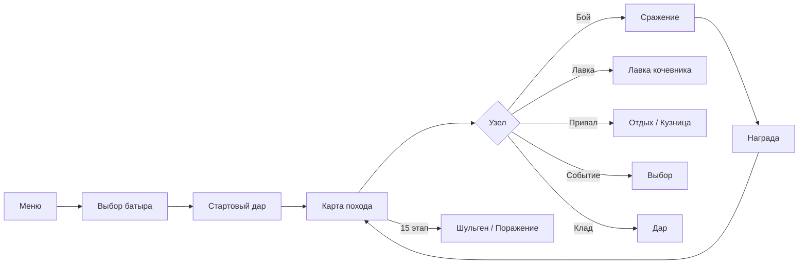
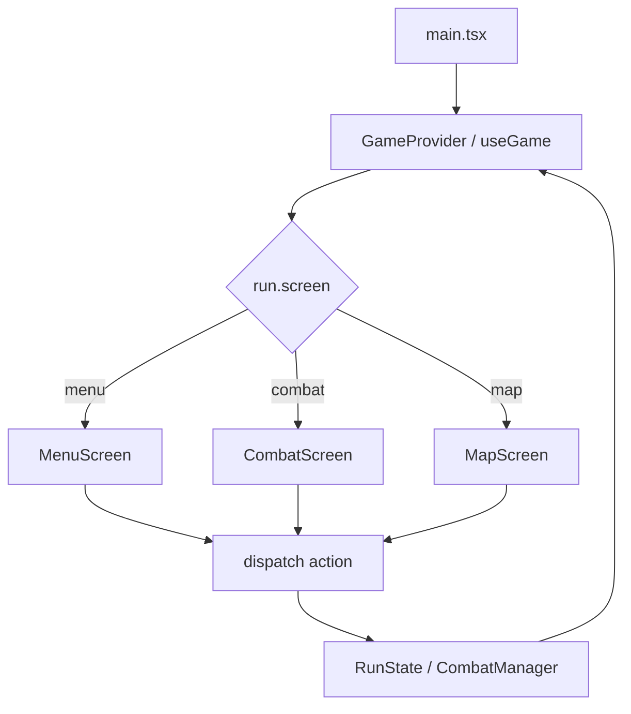
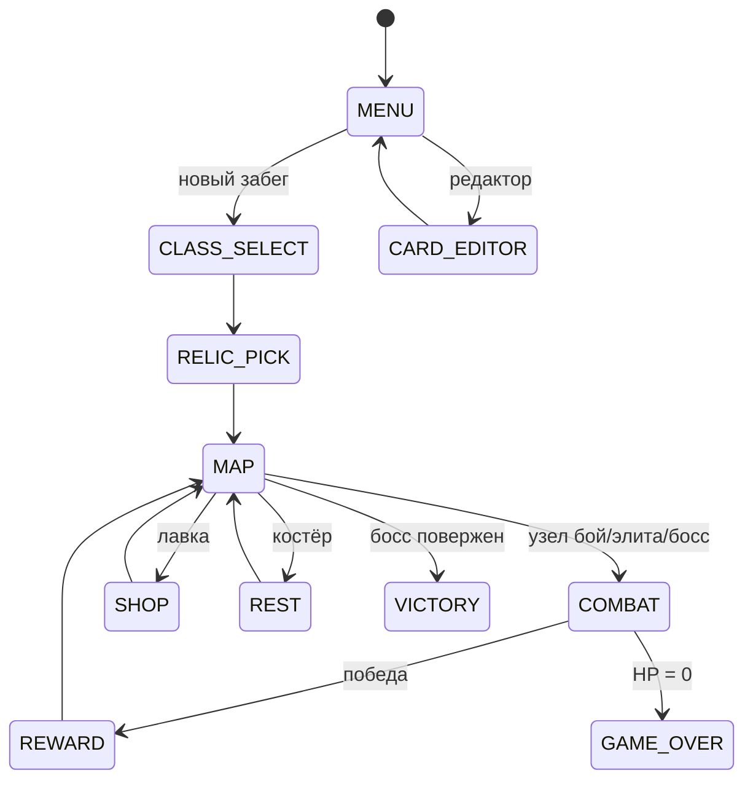
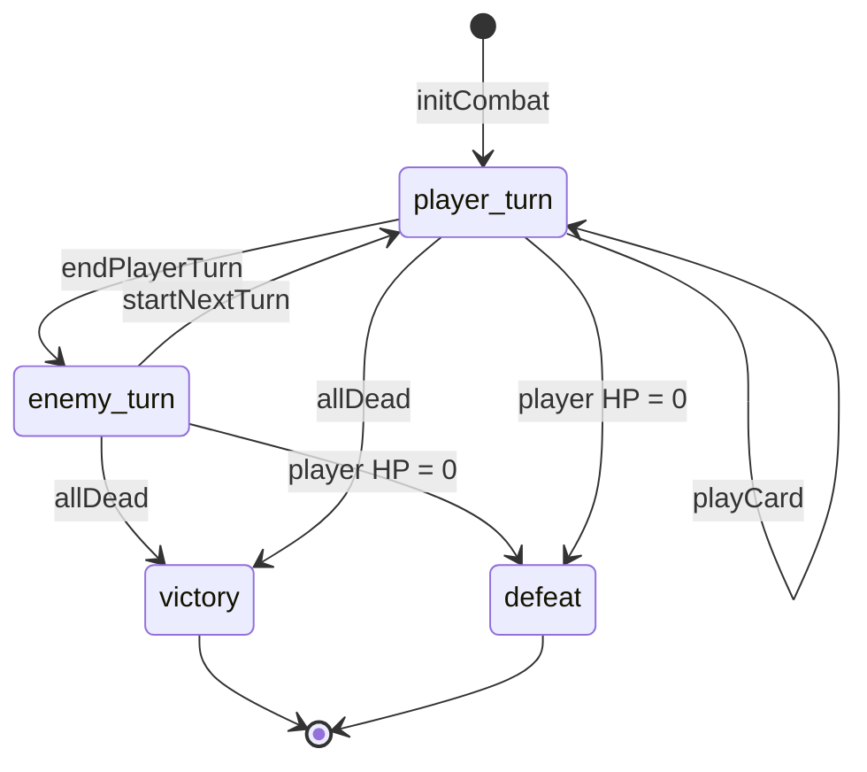
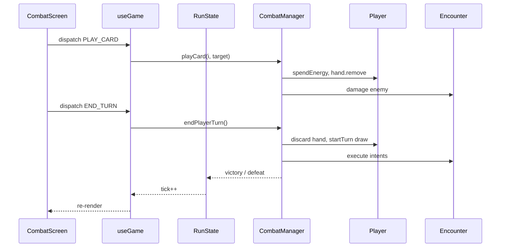
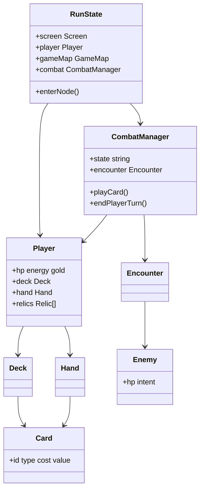
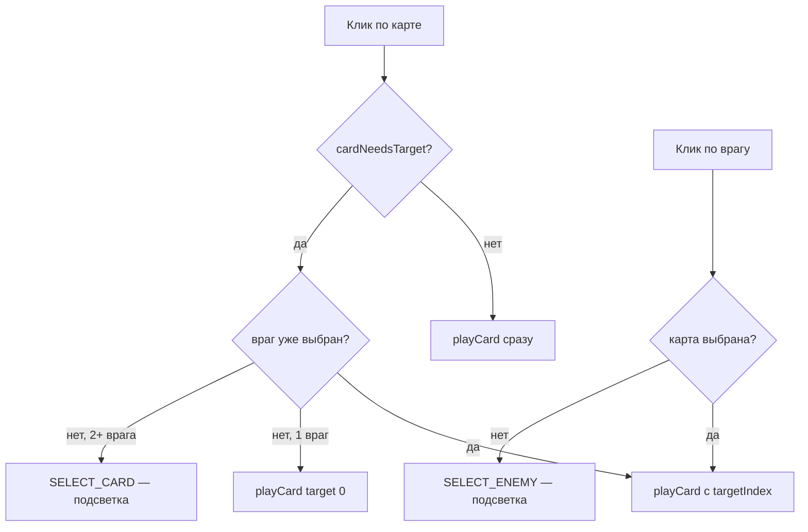

# TypeScript — OnlineCardGame

<div class="article-tags">
  <span class="tag tag-inprogress">В РАЗРАБОТКЕ</span>
</div>

<span class="complexity-badge">Разработчику</span>
<span class="complexity-badge">Средний уровень</span>

---

## О практикуме

Соберём **карточный roguelike** в духе *Slay the Spire* прямо в браузере: колода, рука, энергия на ход, намерения врагов, процедурная карта из 15 этапов, награды, дары, лавка и привал. Стек — **TypeScript 5.8**, **React 19**, **Vite 6**; игровая логика — чистый TS без игровых движков, UI — React-компоненты.

<div class="callout callout--info">
  <div class="callout-title">Эталонный проект</div>
  Полная реализация — <strong>«Приключения Урала Батыра»</strong>: карточный roguelike по [башкирскому эпосу «Урал-батыр»](https://skazki.rustih.ru/ural-batyr/), 76+ карт с лор-текстами, четыре батыра, три части эпоса на карте, 15 даров, 12 врагов (финал — Шульген), 9 событий, редактор карт, PWA и звук. Репозиторий <a href="https://github.com/Spirzen/OnlineCardGame">Spirzen/OnlineCardGame</a>. Играть онлайн — <a href="https://spirzen.github.io/OnlineCardGame/">spirzen.github.io/OnlineCardGame</a>. Практикум ведёт к той же архитектуре папок и модулей; на каждом этапе проект <strong>собирается и запускается</strong>, даже если это только меню или один бой на простых карточках.
</div>

<div class="callout callout--info">
  <div class="callout-title">Для кого материал</div>
  Нужны базовый JavaScript, знакомство с React (компоненты, хуки, props) и основы TypeScript из статей <a href="/encyclopedia/5-languages/5-01-javascript/intro">JavaScript — о разделе</a> и <a href="/encyclopedia/5-languages/5-01-javascript/30">TypeScript</a>. Опыт deckbuilder-ов полезен, но механики вводим по одной.
</div>

**Управление в финальной версии практикума**

| Действие | Управление |
|----------|------------|
| Клик по карте, врагу, узлу карты, кнопкам | **Мышь** |
| Завершить ход в бою | **E** (или кнопка «Конец хода») |
| Меню / выход | Кнопки на экране |

**Маршрут чтения**

1. [Архитектура](#architecture) — экраны, бой, данные, React-слой.
2. [Зависимости и структура папок](#dependencies).
3. [Этап 0 — минимальный запуск](#stage-0).
4. Этапы 1–15 — одна механика за шаг.
5. [Итоговая самопроверка и эталон](#final-checklist).
6. [Справочник — отличия от эталона](#content-reference) — что перенести после базового прототипа.

Имя папки проекта в примерах — `online-card-game/`; локально можно клонировать [OnlineCardGame](https://github.com/Spirzen/OnlineCardGame) и сравнивать файлы после каждого этапа.

<div class="callout callout--tip">
  <div class="callout-title">Параллельный трек на Python</div>
  Тот же жанр и та же архитектура модулей разобраны в главе <a href="/encyclopedia/9-spinoff/9-04-razrabotka-igr/praktikum-razrabotki-igr/7">Python — карточная стратегия</a> (эталон AutoBattler). Сравните <code>CombatManager</code> в TS и Python — правила боя совпадают, меняется только слой отрисовки (React вместо Pygame).
</div>

### Что получится в эталоне

| Подсистема | Содержание |
|------------|------------|
| Батыры | Урал Батыр, Хумай, Акбузат, Янбирде — разные стартовые колоды |
| Карта | 15 этапов, три части эпоса, финал — Шульген |
| Бой | энергия, блок, сила, уязвимость, яд, оглушение, намерения, мульти-таргет |
| Контент | 76+ карт с лором, 15 даров, 12 врагов, 9 событий |
| Лор | эпос «Урал-батыр», развёрнутые тексты карт, врагов и встреч |
| Мета | localStorage, ежедневный seed, топ батыров |
| UX | PWA, звук, анимации, редактор карт, просмотр колоды |

### Игровой цикл (как в готовой игре)



### Карта этапов практикума

| Этап | Фокус | Запускается |
|------|-------|-------------|
| 0 | Vite + React | тёмная страница |
| 1–2 | settings, types, Card, JSON | палитра типов карт |
| 3–4 | Deck, Hand, Player | логика в консоли / тестах |
| 5–6 | Enemy, CombatManager | бой без UI |
| 7–9 | useGame, экраны, роутер | меню → заглушки |
| 8 | CombatScreen, CardView | **первый играбельный бой** |
| 10–11 | GameMap, награды | полный цикл узел → бой → карта |
| 12–13 | реликвии, классы, лавка, костёр | мета-прогрессия в забеге |
| 14 | RNG, stats, Vitest | детерминизм и сохранения |
| 15 | PWA, sfx, FX, редактор | уровень эталона |

### Мини-глоссарий deckbuilder

| Термин | Значение в коде |
|--------|-----------------|
| **Забег (run)** | одна попытка от меню до победы/смерти; объект `RunState` |
| **Колода (deck)** | все карты игрока; стопки `drawPile` + `discardPile` |
| **Рука (hand)** | карты, доступные в текущем ходу; `Player.hand` |
| **Энергия** | ресурс на розыгрыш карт за ход; `Player.energy` |
| **Блок** | временная броня до конца хода; `Player.block` |
| **Намерение (intent)** | что враг сделает на своей фазе; `Enemy.currentIntent` |
| **Реликвия** | пассивный предмет на весь забег; `Player.relics[]` |
| **Элита / босс** | бой с множителем HP; флаги в `enterNode` |

---

<span id="architecture"></span>
## Архитектура

Карточный roguelike — это **забег** (run): карта узлов → события → сражения → усиление колоды → босс. Бой — отдельная подсистема с собственным конечным автоматом. В браузерной версии React отвечает за **отображение**, а правила живут в модулях `src/game/` без привязки к DOM.

### Жанровые опоры

| Идея | Откуда в жанре | Как реализуем |
|------|----------------|---------------|
| Карта путей | *Slay the Spire* | `GameMap`, узлы `combat` / `rest` / `shop` … |
| Энергия и рука каждый ход | *Hearthstone*, *Slay the Spire* | `Player.energy`, добор в `CombatManager` |
| Намерения врагов | *Slay the Spire* | `Enemy.planIntent()`, иконка на UI |
| Несколько врагов | *Darkest Dungeon* | `Encounter`, выбор цели атаки |
| Реликвии | *Slay the Spire* | пассивные объекты на `Player.relics` |
| Контент в данных | моддинг | `data/cards.json`, `enemies.json` |

### Цикл приложения (React + Vite)



`App.tsx` — **оркестратор UI**: он не считает урон карт напрямую, а передаёт действия в `RunState` через `dispatch`. Перерисовка — через React Context и счётчик `tick`.

### Экраны забега (конечный автомат UI)



Поле `RunState.screen` переключает ветку в `GameRouter`. Логика боя живёт в `CombatManager`, пока `screen === 'combat'`.

### Конечный автомат боя

Внутри экрана `combat` работает отдельный автомат — UI его не дублирует, только читает `combat.state`:



Константы в `CombatManager`: `STATE_PLAYER_TURN`, `STATE_ENEMY_TURN`, `STATE_VICTORY`, `STATE_DEFEAT`. Флаг `combatOver` блокирует дальнейшие клики; `useGame` по нему вызывает `run.onCombatVictory()` или `run.onCombatDefeat()`.

### Слои приложения

| Слой | Ответственность | Модули |
|------|-----------------|--------|
| **Данные** | Карты, враги, реликвии из JSON | `src/data/*`, импорт в `card.ts` |
| **Модель** | Сущности и правила без React | `card.ts`, `player.ts`, `enemy.ts`, `combat.ts`, `relic.ts` |
| **Забег** | Карта, золото, смена экранов | `runState.ts`, `map.ts` |
| **Представление** | React-экраны и виджеты | `components/*` |
| **Состояние UI** | Context, dispatch, эффекты | `hooks/useGame.tsx`, `hooks/useFx.tsx` |

Правило для поддерживаемости: **урон и блок считаются в `CombatManager`**, React только вызывает `dispatch({ type: 'PLAY_CARD', … })` и `dispatch({ type: 'END_TURN' })`.

### Поток данных в бою



### Целевая структура файлов

К концу практикума (и в [OnlineCardGame](https://github.com/Spirzen/OnlineCardGame)) дерево выглядит так:

```
online-card-game/
├── index.html
├── vite.config.ts
├── tsconfig.json
├── tsconfig.app.json
├── package.json
├── public/
│   └── favicon.svg
└── src/
    ├── main.tsx                 # точка входа React
    ├── App.tsx                  # GameRouter, провайдеры
    ├── vite-env.d.ts
    ├── data/
    │   ├── cards.json
    │   ├── enemies.json
    │   └── relics.json
    ├── game/
    │   ├── types.ts             # CardData, Screen, …
    │   ├── settings.ts          # константы баланса
    │   ├── locale.ts            # строки UI
    │   ├── rng.ts               # seeded PRNG
    │   ├── card.ts              # Card, Deck, Hand
    │   ├── cardEffects.ts       # бонусы карт (этап 15+)
    │   ├── player.ts
    │   ├── enemy.ts
    │   ├── combat.ts
    │   ├── relic.ts
    │   ├── map.ts
    │   ├── runState.ts
    │   ├── classes.ts
    │   ├── upgrade.ts
    │   ├── events.ts
    │   ├── stats.ts             # localStorage
    │   ├── sfx.ts               # процедурный звук
    │   └── game.test.ts
    ├── hooks/
    │   ├── useGame.tsx          # Context + dispatch
    │   └── useFx.tsx            # анимации
    ├── components/
    │   ├── MenuScreen.tsx
    │   ├── MapScreen.tsx
    │   ├── CombatScreen.tsx
    │   ├── CardView.tsx
    │   ├── Screens.tsx          # reward, shop, rest …
    │   └── …
    └── styles/
        └── global.css
```

На **этапах 0–6** достаточно `src/game/` с несколькими файлами и одного экрана. Папку `data/` добавляем на **этапе 2**, React-компоненты — с **этапа 7**.

### Диаграмма классов (целевая)



### Справочник модулей `src/game/` (эталон)

| Модуль | Назначение |
|--------|------------|
| `runState.ts` | состояние забега, переходы между экранами, `enterNode`, лавка, костёр |
| `combat.ts` | пошаговый бой, `playCard`, `endPlayerTurn`, лог боя |
| `map.ts` | генерация 15 этажей, связи узлов, `selectNode` |
| `card.ts` / `cardEffects.ts` | карты, колода, ~40 эффектов при розыгрыше |
| `player.ts` | HP, энергия, статусы, колода, рука |
| `enemy.ts` | враги, намерения, элиты и боссы |
| `relic.ts` | реликвии и триггеры начала/конца боя |
| `upgrade.ts` | улучшение карт в кузнице |
| `rng.ts` | детерминированный PRNG с seed |
| `stats.ts` | статистика сессии в `localStorage` |
| `customCards.ts` | пользовательские карты из редактора |
| `events.ts` | случайные события на карте |
| `classes.ts` | определения классов персонажей |
| `locale.ts` | все строки интерфейса |
| `sfx.ts` | процедурный звук (Web Audio API) |

### Таблица действий `dispatch`

Все клики UI сводятся к дискретным действиям в `useGame.tsx`. Это упрощает отладку: достаточно поставить `console.log` в `applyAction`.

| `type` | Когда вызывается | Метод `RunState` / `CombatManager` |
|--------|------------------|-------------------------------------|
| `BEGIN_RUN` | «Новый забег» | `beginRunSetup(false)` |
| `BEGIN_DAILY` | «Ежедневный забег» | `beginRunSetup(true)` |
| `SELECT_CLASS` | выбор класса | `selectClass` |
| `PICK_STARTER_RELIC` | стартовая реликвия | `pickStarterRelic` → `startRunWithClass` |
| `SELECT_NODE` | клик по узлу карты | `gameMap.selectNode` → `enterNode` |
| `PLAY_CARD` | клик по карте в бою | `combat.playCard` |
| `END_TURN` | кнопка / клавиша E | `combat.endPlayerTurn` |
| `SELECT_CARD` / `SELECT_ENEMY` | выбор цели | поля `selectedCardIndex`, `selectedEnemyIndex` |
| `PICK_REWARD` / `SKIP_REWARD` | экран награды | `pickRewardCard` / `skipReward` |
| `REST_HEAL` / `OPEN_SMITH` / `SMITH_UPGRADE` | костёр | `restHeal`, `openSmith`, `smithUpgrade` |
| `BUY_CARD` / `BUY_RELIC` / `REMOVE_CARD` / `LEAVE_SHOP` | лавка | соответствующие методы с ценами |
| `PICK_EVENT` / `CONTINUE_EVENT` | случайное событие | `pickEventChoice`, `continueFromEvent` |
| `TOGGLE_DECK` | просмотр колоды | `deckModalOpen` |
| `GO_MENU` / `OPEN_STATS` / `OPEN_EDITOR` | навигация | `goToMenu`, `openStats`, `openCardEditor` |

### Схема записи карты в JSON

Минимальные поля — `id`, `name`, `type`, `cost`, `value`, `description`, `rarity`. Расширения из эталона:

| Поле | Тип | Пример | Эффект |
|------|-----|--------|--------|
| `effect` | string | `"vulnerable"` | статус при попадании |
| `effect_value` | number | `2` | сила эффекта |
| `effect2` | string | `"weak"` | второй статус |
| `aoe` | boolean | `true` | урон/дебафф по всем врагам |
| `block` | number | `5` | броня в дополнение к `value` |
| `draw` | number | `2` | добор карт |
| `energy_gain` | number | `1` | +энергия при розыгрыше |
| `lifesteal` | boolean | `true` | исцление от урона |
| `bonuses` | array | `[{id, value, target}]` | несколько эффектов через `cardEffects.ts` |
| `upgraded` | boolean | `true` | метка после кузницы |

Новую карту в эталоне достаточно добавить в `cards.json` — TypeScript подхватит её через `CardData` в `types.ts`.

<div class="callout callout--tip">
  <div class="callout-title">Данные карт в JSON</div>
  Дизайнер баланса правит <code>src/data/cards.json</code> без переписывания логики. Код знает <strong>типы</strong> (<code>attack</code>, <code>block</code>, <code>buff</code>…) и <strong>эффекты</strong> (<code>vulnerable</code>, <code>draw</code>…), числа лежат в данных — так устроен и полный OnlineCardGame.
</div>

<div class="callout callout--tip">
  <div class="callout-title">Логика без React</div>
  Классы в <code>src/game/</code> тестируются через Vitest без jsdom. UI подписывается на изменения через Context — для бота или мультиплеера вызываются те же методы <code>CombatManager</code>.
</div>

---

<span id="dependencies"></span>
## Зависимости и подготовка окружения

### Требования

- **Node.js 18+** (рекомендуется 20 LTS).
- **npm**, pnpm или yarn.
- Браузер с поддержкой ES2022.

### Создание проекта с нуля (альтернатива клону)

```bash
npm create vite@latest online-card-game -- --template react-ts
cd online-card-game
npm install
npm run dev
```

Vite откроет dev-сервер (обычно `http://localhost:5173`) с шаблонным React-приложением.

### Клон эталона для сверки

```bash
git clone https://github.com/Spirzen/OnlineCardGame.git
cd OnlineCardGame
npm install
npm run dev
```

Главное меню «Приключения Урала Батыра» на русском, кнопка «Новый поход». Практикум можно проходить **параллельно** в своей папке, сверяя готовые модули с одноимёнными файлами в репозитории.

### Зависимости эталона

`package.json` (основное):

```json
{
  "name": "online-card-game",
  "type": "module",
  "scripts": {
    "dev": "vite",
    "build": "tsc --noEmit && vite build",
    "preview": "vite preview",
    "test": "vitest run"
  },
  "dependencies": {
    "react": "^19.1.0",
    "react-dom": "^19.1.0"
  },
  "devDependencies": {
    "@types/react": "^19.1.2",
    "@types/react-dom": "^19.1.2",
    "@vitejs/plugin-react": "^4.4.1",
    "typescript": "~5.8.3",
    "vite": "^6.3.5",
    "vite-plugin-pwa": "^0.21.2",
    "vitest": "^3.2.4"
  }
}
```

На **этапах 0–12** достаточно React + Vite + TypeScript. PWA (`vite-plugin-pwa`) и Vitest добавим позже.

### `vite.config.ts` (минимум для этапа 0)

```typescript
import { defineConfig } from 'vite';
import react from '@vitejs/plugin-react';

export default defineConfig({
  plugins: [react()],
  base: './',
});
```

`base: './'` нужен для деплоя на GitHub Pages — относительные пути к ассетам.

### `tsconfig.app.json` — важные флаги

```json
{
  "compilerOptions": {
    "target": "ES2022",
    "lib": ["ES2022", "DOM", "DOM.Iterable"],
    "module": "ESNext",
    "moduleResolution": "bundler",
    "jsx": "react-jsx",
    "strict": true,
    "resolveJsonModule": true,
    "noEmit": true
  },
  "include": ["src"]
}
```

`resolveJsonModule: true` позволяет `import cards from '../data/cards.json'`.

<div class="callout callout--warning">
  <div class="callout-title">Кодировка JSON</div>
  Файлы в <code>src/data/</code> сохраняйте в <strong>UTF-8</strong> — иначе кириллица в названиях карт сломается при сборке на Windows.
</div>

### Деплой на GitHub Pages

После этапа 15 (или раньше, если нужна демо-ссылка):

```bash
npm run build
# содержимое dist/ — статический сайт
```

1. В репозитории GitHub включите **Pages** → Source: **GitHub Actions** или ветка `gh-pages` с папкой `/dist`.
2. В `vite.config.ts` обязательно `base: './'` — иначе на `username.github.io/RepoName/` не подгрузятся JS/CSS.
3. Проверка локально: `npm run preview` и открыть указанный URL.

<div class="callout callout--info">
  <div class="callout-title">Структура tsconfig</div>
  В эталоне два файла — <code>tsconfig.json</code> (references) и <code>tsconfig.app.json</code> (компиляция <code>src/</code>). Тесты подключают <code>vitest/globals</code> через <code>types</code> в <code>tsconfig.app.json</code> или отдельный <code>tsconfig.node.json</code> для конфига Vite.
</div>

### Рекомендуемая настройка редактора

- **VS Code / Cursor** — расширения ESLint (если добавите), Prettier; встроенный TypeScript language service подсветит ошибки `strict`.
- При сохранении включите format on save для единообразия кавычек в TSX.
- DevTools → вкладка **Components** (React DevTools) помогает отследить, перерисовался ли `CombatScreen` после `dispatch`.

---

<span id="stage-0"></span>
## Этап 0 — минимальный запускаемый код

**Цель** — Vite + React + TypeScript, тёмный экран с подписью этапа, hot reload при сохранении файлов.

<div class="callout callout--tip">
  <div class="callout-title">HMR и игровое состояние</div>
  При hot reload React может пересоздать <code>GameProvider</code> и сбросить забег. Для проверки боевой логики на поздних этапах используйте полное обновление страницы (F5).
</div>

### Файлы

`index.html`:

```html
<!doctype html>
<html lang="ru">
  <head>
    <meta charset="UTF-8" />
    <meta name="viewport" content="width=device-width, initial-scale=1.0" />
    <title>Карточный roguelike — этап 0</title>
  </head>
  <body>
    <div id="root"></div>
    <script type="module" src="/src/main.tsx"></script>
  </body>
</html>
```

`src/main.tsx`:

```typescript
import { StrictMode } from 'react';
import { createRoot } from 'react-dom/client';
import App from './App';
import './styles/global.css';

createRoot(document.getElementById('root')!).render(
  <StrictMode>
    <App />
  </StrictMode>,
);
```

`src/App.tsx`:

```typescript
export default function App() {
  return (
    <div className="app">
      <h1>Карточный roguelike</h1>
      <p>Этап 0 — проект собран, dev-сервер работает.</p>
    </div>
  );
}
```

`src/styles/global.css`:

```css
* {
  box-sizing: border-box;
  margin: 0;
  padding: 0;
}

body {
  font-family: system-ui, sans-serif;
  background: #06040f;
  color: #e8e4f0;
  min-height: 100vh;
}

.app {
  display: flex;
  flex-direction: column;
  align-items: center;
  justify-content: center;
  min-height: 100vh;
  gap: 1rem;
}
```

На **этапе 15** замените фон на дизайн-систему эталона — CSS-переменные в `:root` (`--bg-deep`, `--gold`, `--font-display`), слои `.aurora` и `.stars` в `App.tsx`, шрифты Cinzel и Outfit из Google Fonts (см. `index.html` эталона).

### Запуск

```bash
npm run dev
```

**Самопроверка**

- [ ] Браузер открывается без ошибок в консоли.
- [ ] Изменение текста в `App.tsx` сразу видно на странице (HMR).
- [ ] `npm run build` завершается успешно.

---

<span id="stage-1"></span>
## Этап 1 — настройки и типы

**Цель** — вынести константы в `settings.ts`, описать типы карт и экранов в `types.ts`.

### `src/game/settings.ts`

```typescript
export const CARD_ATTACK = 'attack';
export const CARD_BLOCK = 'block';
export const CARD_BUFF = 'buff';
export const CARD_DEBUFF = 'debuff';
export const CARD_DRAW = 'draw';
export const CARD_CREATURE = 'creature';

export const NODE_COMBAT = 'combat';
export const NODE_ELITE = 'elite';
export const NODE_BOSS = 'boss';
export const NODE_REST = 'rest';
export const NODE_SHOP = 'shop';
export const NODE_TREASURE = 'treasure';
export const NODE_EVENT = 'event';

export const STARTING_HP = 85;
export const STARTING_ENERGY = 3;
export const MAX_ENERGY = 10;
export const STARTING_GOLD = 99;
export const STARTING_HAND = 5;
export const DRAW_PER_TURN = 5;
export const MAX_HAND = 10;

export const CARD_TYPE_COLORS: Record<string, string> = {
  attack: '#c83737',
  block: '#3770c8',
  buff: '#c89628',
  debuff: '#8232b4',
  draw: '#37aa78',
  creature: '#b47832',
};
```

### `src/game/types.ts`

```typescript
export type CardType =
  | 'attack'
  | 'block'
  | 'buff'
  | 'debuff'
  | 'draw'
  | 'creature';

export type CardRarity = 'basic' | 'common' | 'uncommon' | 'rare' | 'custom';

export interface CardData {
  id: string;
  name: string;
  type: CardType;
  cost: number;
  value: number;
  description: string;
  rarity: CardRarity;
  effect?: string;
  effect_value?: number;
  aoe?: boolean;
  block?: number;
  draw?: number;
}

export type Screen =
  | 'menu'
  | 'map'
  | 'combat'
  | 'reward'
  | 'shop'
  | 'rest'
  | 'game_over'
  | 'victory';
```

Обновите `App.tsx` — импортируйте `CARD_TYPE_COLORS` и покажите палитру типов карт цветными квадратами.

**Самопроверка**

- [ ] TypeScript не ругается на `strict: true`.
- [ ] Константы карт и узлов импортируются из одного файла `settings.ts`.

---

<span id="stage-2"></span>
## Этап 2 — модель карты и JSON

**Цель** — класс `Card`, загрузка базы из `src/data/cards.json`, фабрика `createCard`.

### `src/data/cards.json`

```json
[
  {
    "id": "strike",
    "name": "Удар",
    "type": "attack",
    "cost": 1,
    "value": 6,
    "description": "Наносит урон одной цели.",
    "rarity": "basic"
  },
  {
    "id": "defend",
    "name": "Защита",
    "type": "block",
    "cost": 1,
    "value": 5,
    "description": "Даёт броню до конца хода.",
    "rarity": "basic"
  },
  {
    "id": "bash",
    "name": "Сокрушение",
    "type": "attack",
    "cost": 2,
    "value": 8,
    "description": "Сильный удар. Накладывает Уязвимость.",
    "rarity": "common",
    "effect": "vulnerable",
    "effect_value": 2
  }
]
```

### `src/game/card.ts` (начало файла)

```typescript
import cardsData from '../data/cards.json';
import type { CardData } from './types';

const cardDb = cardsData as CardData[];

export class Card {
  id: string;
  name: string;
  type: string;
  cost: number;
  value: number;
  description: string;
  rarity: string;
  effect?: string;
  effect_value: number;

  constructor(data: CardData) {
    this.id = data.id;
    this.name = data.name;
    this.type = data.type;
    this.cost = data.cost;
    this.value = data.value ?? 0;
    this.description = data.description ?? '';
    this.rarity = data.rarity ?? 'common';
    this.effect = data.effect;
    this.effect_value = data.effect_value ?? 0;
  }

  copy(): Card {
    return new Card({
      id: this.id,
      name: this.name,
      type: this.type as CardData['type'],
      cost: this.cost,
      value: this.value,
      description: this.description,
      rarity: this.rarity as CardData['rarity'],
      effect: this.effect,
      effect_value: this.effect_value,
    });
  }
}

export function createCard(data: CardData): Card {
  return new Card({ ...data });
}

export function getCardById(id: string): CardData | undefined {
  return cardDb.find((c) => c.id === id);
}

export function createStartingDeck(): Card[] {
  const strike = getCardById('strike')!;
  const defend = getCardById('defend')!;
  const deck: Card[] = [];
  for (let i = 0; i < 5; i++) deck.push(createCard(strike));
  for (let i = 0; i < 5; i++) deck.push(createCard(defend));
  return deck;
}
```

Проверка в консоли браузера или временном скрипте:

```typescript
import { createStartingDeck } from './game/card';
console.log(createStartingDeck().length, createStartingDeck()[0].name);
// 10 "Удар"
```

**Самопроверка**

- [ ] Импорт JSON работает (`resolveJsonModule`).
- [ ] У каждой карты есть `type`, `cost`, `value`.

---

<span id="stage-3"></span>
## Этап 3 — колода и рука

**Цель** — `Deck` (стопка добора, сброс, перетасовка) и `Hand` (лимит карт).

Дополните `src/game/card.ts`:

```typescript
import { MAX_HAND } from './settings';

export class Deck {
  drawPile: Card[] = [];
  discardPile: Card[] = [];

  constructor(cards: Card[] = []) {
    this.drawPile = [...cards];
    this.shuffle();
  }

  shuffle() {
    for (let i = this.drawPile.length - 1; i > 0; i--) {
      const j = Math.floor(Math.random() * (i + 1));
      [this.drawPile[i], this.drawPile[j]] = [this.drawPile[j], this.drawPile[i]];
    }
  }

  draw(count = 1): Card[] {
    const drawn: Card[] = [];
    for (let i = 0; i < count; i++) {
      if (this.drawPile.length === 0 && this.discardPile.length > 0) {
        this.drawPile = [...this.discardPile];
        this.discardPile = [];
        this.shuffle();
      }
      if (this.drawPile.length > 0) {
        drawn.push(this.drawPile.pop()!);
      }
    }
    return drawn;
  }

  addToDiscard(card: Card) {
    this.discardPile.push(card);
  }

  discardAll(cards: Card[]) {
    this.discardPile.push(...cards);
  }

  getAllCards(): Card[] {
    return [...this.drawPile, ...this.discardPile];
  }
}

export class Hand {
  cards: Card[] = [];
  maxSize: number;

  constructor(maxSize = MAX_HAND) {
    this.maxSize = maxSize;
  }

  add(card: Card): boolean {
    if (this.cards.length >= this.maxSize) return false;
    this.cards.push(card);
    return true;
  }

  remove(index: number): Card | null {
    if (index < 0 || index >= this.cards.length) return null;
    return this.cards.splice(index, 1)[0];
  }

  clear() {
    this.cards = [];
  }
}
```

На **этапе 14** заменим `Math.random()` в `shuffle` на `rngInt` из `rng.ts` для детерминированных забегов.

**Самопроверка**

- [ ] Пустая стопка добора перетасовывает сброс.
- [ ] Рука не принимает 11-ю карту при `MAX_HAND = 10`.

---

<span id="stage-4"></span>
## Этап 4 — игрок (HP, энергия, блок)

**Цель** — `Player` с боевым сбросом состояния и экономикой урона/брони.

### `src/game/player.ts`

```typescript
import {
  STARTING_HP,
  STARTING_ENERGY,
  STARTING_GOLD,
  MAX_ENERGY,
} from './settings';
import { Deck, Hand, createStartingDeck } from './card';
import type { Card } from './card';
import type { Relic } from './relic';

export class Player {
  maxHp = STARTING_HP;
  hp = STARTING_HP;
  energy = STARTING_ENERGY;
  maxEnergy = STARTING_ENERGY;
  gold = STARTING_GOLD;
  block = 0;
  strength = 0;
  vulnerable = 0;
  weak = 0;
  deck: Deck;
  hand: Hand;
  relics: Relic[] = [];

  constructor() {
    this.deck = new Deck(createStartingDeck());
    this.hand = new Hand();
  }

  resetCombat() {
    this.energy = this.maxEnergy;
    this.block = 0;
    this.vulnerable = 0;
    this.weak = 0;
    this.hand.clear();
    const all = this.deck.getAllCards();
    this.deck = new Deck(all);
  }

  startTurn() {
    this.energy = this.maxEnergy;
    this.block = 0;
    if (this.vulnerable > 0) this.vulnerable--;
    if (this.weak > 0) this.weak--;
  }

  endTurn() {
    const cards = [...this.hand.cards];
    this.hand.clear();
    this.deck.discardAll(cards);
  }

  gainBlock(amount: number) {
    this.block += amount;
  }

  takeDamage(amount: number): number {
    if (this.vulnerable > 0) amount = Math.floor(amount * 1.5);
    const blocked = Math.min(this.block, amount);
    this.block -= blocked;
    const damage = amount - blocked;
    this.hp = Math.max(0, this.hp - damage);
    return damage;
  }

  heal(amount: number) {
    this.hp = Math.min(this.maxHp, this.hp + amount);
  }

  spendEnergy(cost: number): boolean {
    if (this.energy >= cost) {
      this.energy -= cost;
      return true;
    }
    return false;
  }

  gainEnergy(amount: number) {
    this.energy = Math.min(MAX_ENERGY, this.energy + amount);
  }

  getAttackDamage(base: number): number {
    let damage = base + this.strength;
    if (this.weak > 0) damage = Math.floor(damage * 0.75);
    return Math.max(0, damage);
  }

  isAlive() {
    return this.hp > 0;
  }

  addCardToDeck(card: Card) {
    this.deck.drawPile.push(card.copy());
  }
}
```

Временная заглушка `src/game/relic.ts` (полная версия на этапе 12):

```typescript
export class Relic {
  id: string;
  name: string;
  effect: string;
  value: number;

  constructor(data: { id: string; name: string; effect: string; value: number }) {
    this.id = data.id;
    this.name = data.name;
    this.effect = data.effect;
    this.value = data.value;
  }
}
```

**Самопроверка**

- [ ] `takeDamage(10)` при `block = 5` оставляет 45 HP из 50.
- [ ] `vulnerable = 2` умножает входящий урон ×1.5.

---

<span id="stage-5"></span>
## Этап 5 — враг и намерения

**Цель** — `Enemy` с циклом намерений, `Encounter` для группы врагов, данные из JSON.

### `src/data/enemies.json`

```json
{
  "cultist": {
    "name": "Культист",
    "hp": 48,
    "intent_pattern": ["buff", "attack", "attack"],
    "attack_damage": 6,
    "buff_value": 3,
    "description": "Накапливает силу, затем бьёт."
  },
  "slime": {
    "name": "Слизь",
    "hp": 32,
    "intent_pattern": ["attack", "block", "attack"],
    "attack_damage": 5,
    "block_value": 4,
    "description": "Простой противник для обучения."
  }
}
```

### `src/game/enemy.ts` (ядро)

```typescript
import enemiesData from '../data/enemies.json';
import type { EnemyData } from './types';
import type { Player } from './player';

export const INTENT_ATTACK = 'attack';
export const INTENT_BLOCK = 'block';
export const INTENT_BUFF = 'buff';
export const INTENT_DEBUFF = 'debuff';
export const INTENT_UNKNOWN = 'unknown';

const enemyDb = enemiesData as Record<string, EnemyData>;

export class Enemy {
  id: string;
  name: string;
  maxHp: number;
  hp: number;
  block = 0;
  strength = 0;
  vulnerable = 0;
  weak = 0;
  intentPattern: string[];
  attackDamage: number;
  blockValue: number;
  buffValue: number;
  debuffValue: number;
  intentIndex = 0;
  currentIntent = INTENT_UNKNOWN;
  intentValue = 0;
  alive = true;

  constructor(data: EnemyData & { id?: string }, hpMult = 1) {
    this.id = data.id ?? 'unknown';
    this.name = data.name;
    this.maxHp = Math.floor(data.hp * hpMult);
    this.hp = this.maxHp;
    this.intentPattern = data.intent_pattern;
    this.attackDamage = data.attack_damage ?? 6;
    this.blockValue = data.block_value ?? 5;
    this.buffValue = data.buff_value ?? 2;
    this.debuffValue = data.debuff_value ?? 1;
    this.planIntent();
  }

  planIntent() {
    const intent = this.intentPattern[this.intentIndex % this.intentPattern.length];
    this.intentIndex++;
    this.currentIntent = intent;
    switch (intent) {
      case INTENT_ATTACK:
        this.intentValue = this.calcDamage(this.attackDamage);
        break;
      case INTENT_BLOCK:
        this.intentValue = this.blockValue;
        break;
      case INTENT_BUFF:
        this.intentValue = this.buffValue;
        break;
      case INTENT_DEBUFF:
        this.intentValue = this.debuffValue;
        break;
      default:
        this.intentValue = 0;
    }
  }

  calcDamage(base: number): number {
    let damage = base + this.strength;
    if (this.weak > 0) damage = Math.floor(damage * 0.75);
    return Math.max(0, damage);
  }

  takeDamage(amount: number): number {
    if (this.vulnerable > 0) amount = Math.floor(amount * 1.5);
    const blocked = Math.min(this.block, amount);
    this.block -= blocked;
    const damage = amount - blocked;
    this.hp = Math.max(0, this.hp - damage);
    if (this.hp <= 0) this.alive = false;
    return damage;
  }

  applyVulnerable(turns: number) {
    this.vulnerable = Math.max(this.vulnerable, turns);
  }

  executeIntent(player: Player): string[] {
    const messages: string[] = [];
    switch (this.currentIntent) {
      case INTENT_ATTACK:
        player.takeDamage(this.intentValue);
        messages.push(`${this.name} наносит ${this.intentValue} урона`);
        break;
      case INTENT_BLOCK:
        this.block += this.intentValue;
        messages.push(`${this.name} получает ${this.intentValue} брони`);
        break;
      case INTENT_BUFF:
        this.strength += this.intentValue;
        messages.push(`${this.name} получает +${this.intentValue} силы`);
        break;
      case INTENT_DEBUFF:
        player.vulnerable = Math.max(player.vulnerable, this.intentValue);
        messages.push(`${this.name} накладывает Уязвимость (${this.intentValue})`);
        break;
    }
    this.planIntent();
    return messages;
  }
}

export class Encounter {
  enemies: Enemy[];

  constructor(enemies: Enemy[]) {
    this.enemies = enemies;
  }

  getLivingEnemies(): Enemy[] {
    return this.enemies.filter((e) => e.alive);
  }

  allDead(): boolean {
    return this.getLivingEnemies().length === 0;
  }
}

export function createCombatEncounter(isElite = false, isBoss = false): Encounter {
  const keys = Object.keys(enemyDb);
  const id = keys[Math.floor(Math.random() * keys.length)];
  const mult = isBoss ? 2.5 : isElite ? 1.6 : 1;
  const enemy = new Enemy({ ...enemyDb[id], id }, mult);
  return new Encounter([enemy]);
}
```

**Самопроверка**

- [ ] После `executeIntent` намерение на **следующий** ход уже спланировано.
- [ ] `getLivingEnemies()` не возвращает мёртвых.

---

<span id="stage-6"></span>
## Этап 6 — менеджер боя

**Цель** — `CombatManager`: розыгрыш карт, ход игрока, фаза врагов, победа/поражение.

### Порядок одного полного хода

1. **Старт боя** — `initCombat`: `resetCombat`, добор `STARTING_HAND` карт, `turn = 1`.
2. **Фаза игрока** — `playCard` сколько угодно раз, пока хватает энергии; каждая карта → `resolveCard` → сброс в `discardPile`.
3. **Конец хода** — `endPlayerTurn`: сброс руки, `enemyPhase` для каждого живого врага (`executeIntent` + планирование следующего намерения).
4. **Проверки** — все враги мертвы → победа; HP игрока 0 → поражение.
5. **Новый ход** — `startNextTurn`: `player.startTurn`, добор `DRAW_PER_TURN`, снова фаза игрока.

В эталоне между шагами 3 и 5 вставлены хуки `processPlayerEndTurn` / `processPlayerStartTurn` из `cardEffects.ts` (реген, металлическая броня, шипы).

### `src/game/combat.ts` (упрощённая версия)

```typescript
import {
  CARD_ATTACK,
  CARD_BLOCK,
  CARD_DEBUFF,
  STARTING_HAND,
  DRAW_PER_TURN,
} from './settings';
import type { Player } from './player';
import type { Encounter } from './enemy';
import type { Card } from './card';

export class CombatManager {
  static STATE_PLAYER_TURN = 'player_turn';
  static STATE_ENEMY_TURN = 'enemy_turn';
  static STATE_VICTORY = 'victory';
  static STATE_DEFEAT = 'defeat';

  player: Player;
  encounter: Encounter;
  state = CombatManager.STATE_PLAYER_TURN;
  turn = 0;
  log: string[] = [];
  combatOver = false;
  victory = false;
  goldReward = 0;

  constructor(player: Player, encounter: Encounter) {
    this.player = player;
    this.encounter = encounter;
    this.initCombat();
  }

  initCombat() {
    this.player.resetCombat();
    const drawn = this.player.deck.draw(STARTING_HAND);
    for (const card of drawn) this.player.hand.add(card);
    this.turn = 1;
    this.log = [`Ход ${this.turn}. Ваш ход.`];
  }

  canPlayCard(cardIndex: number): boolean {
    if (this.state !== CombatManager.STATE_PLAYER_TURN) return false;
    const card = this.player.hand.cards[cardIndex];
    if (!card) return false;
    return this.player.energy >= card.cost;
  }

  cardNeedsTarget(card: Card): boolean {
    return card.type === CARD_ATTACK || card.type === CARD_DEBUFF;
  }

  playCard(cardIndex: number, targetEnemyIndex: number | null = null): boolean {
    if (!this.canPlayCard(cardIndex)) return false;
    const card = this.player.hand.cards[cardIndex];
    if (this.cardNeedsTarget(card)) {
      const living = this.encounter.getLivingEnemies();
      if (!living.length) return false;
      if (targetEnemyIndex === null && living.length > 1) return false;
      targetEnemyIndex = targetEnemyIndex ?? 0;
    }
    if (!this.player.spendEnergy(card.cost)) return false;

    const played = this.player.hand.remove(cardIndex)!;
    this.resolveCard(played, targetEnemyIndex);
    this.player.deck.addToDiscard(played);

    if (this.encounter.allDead()) this.endCombatVictory();
    return true;
  }

  resolveCard(card: Card, targetIndex: number | null) {
    const living = this.encounter.getLivingEnemies();
    if (card.type === CARD_ATTACK && living.length) {
      const enemy = living[targetIndex ?? 0];
      const dmg = this.player.getAttackDamage(card.value);
      enemy.takeDamage(dmg);
      this.addLog(`${card.name}: ${dmg} урона → ${enemy.name}`);
      if (card.effect === 'vulnerable') {
        enemy.applyVulnerable(card.effect_value);
      }
    } else if (card.type === CARD_BLOCK) {
      this.player.gainBlock(card.value);
      this.addLog(`${card.name}: +${card.value} брони`);
    }
  }

  endPlayerTurn() {
    if (this.state !== CombatManager.STATE_PLAYER_TURN) return;
    this.player.endTurn();
    this.state = CombatManager.STATE_ENEMY_TURN;
    this.enemyPhase();
    if (this.combatOver) return;
    this.startNextTurn();
  }

  enemyPhase() {
    for (const enemy of this.encounter.getLivingEnemies()) {
      for (const msg of enemy.executeIntent(this.player)) {
        this.addLog(msg);
      }
      if (!this.player.isAlive()) {
        this.endCombatDefeat();
        return;
      }
    }
  }

  startNextTurn() {
    this.turn++;
    this.player.startTurn();
    const drawn = this.player.deck.draw(DRAW_PER_TURN);
    for (const card of drawn) this.player.hand.add(card);
    this.state = CombatManager.STATE_PLAYER_TURN;
    this.addLog(`Ход ${this.turn}. Ваш ход.`);
  }

  endCombatVictory() {
    this.combatOver = true;
    this.victory = true;
    this.state = CombatManager.STATE_VICTORY;
    this.goldReward = 15;
    this.addLog('Победа!');
  }

  endCombatDefeat() {
    this.combatOver = true;
    this.victory = false;
    this.state = CombatManager.STATE_DEFEAT;
    this.addLog('Поражение…');
  }

  addLog(msg: string) {
    this.log.push(msg);
    if (this.log.length > 8) this.log = this.log.slice(-8);
  }
}
```

Проверка без UI — временный файл или Vitest:

```typescript
import { Player } from './player';
import { createCombatEncounter } from './enemy';
import { CombatManager } from './combat';

const p = new Player();
const c = new CombatManager(p, createCombatEncounter());
c.playCard(0, 0);
c.endPlayerTurn();
console.log(c.log);
```

**Самопроверка**

- [ ] Карта с `cost > energy` не розыгрывается.
- [ ] После «конец хода» враг атакует, игрок получает новую руку.
- [ ] HP = 0 переводит бой в поражение.

---

<span id="stage-7"></span>
## Этап 7 — React Context и главное меню

**Цель** — `useGame` с `RunState`, `dispatch` и первый экран `MenuScreen`.

### `src/game/runState.ts` (минимум)

```typescript
import type { Screen } from './types';
import { Player } from './player';

export class RunState {
  screen: Screen = 'menu';
  player = new Player();

  goToMenu() {
    this.screen = 'menu';
  }

  startNewRun() {
    this.player = new Player();
    this.screen = 'map';
  }
}
```

### `src/hooks/useGame.tsx`

```typescript
import {
  createContext,
  useContext,
  useCallback,
  useRef,
  useState,
  type ReactNode,
} from 'react';
import { RunState } from '../game/runState';

type GameAction =
  | { type: 'GO_MENU' }
  | { type: 'BEGIN_RUN' };

interface GameContextValue {
  run: RunState;
  tick: number;
  dispatch: (action: GameAction) => void;
}

const GameContext = createContext<GameContextValue | null>(null);

function applyAction(run: RunState, action: GameAction) {
  switch (action.type) {
    case 'GO_MENU':
      run.goToMenu();
      break;
    case 'BEGIN_RUN':
      run.startNewRun();
      break;
  }
}

export function GameProvider({ children }: { children: ReactNode }) {
  const runRef = useRef(new RunState());
  const [tick, setTick] = useState(0);

  const dispatch = useCallback((action: GameAction) => {
    applyAction(runRef.current, action);
    setTick((t) => t + 1);
  }, []);

  return (
    <GameContext.Provider value={{ run: runRef.current, tick, dispatch }}>
      {children}
    </GameContext.Provider>
  );
}

export function useGame() {
  const ctx = useContext(GameContext);
  if (!ctx) throw new Error('useGame вне GameProvider');
  return ctx;
}
```

<div class="callout callout--tip">
  <div class="callout-title">RunState в useRef</div>
  <code>RunState</code> — мутабельный объект с десятками полей. Храним один экземпляр в <code>useRef</code>, а после каждого <code>dispatch</code> увеличиваем <code>tick</code>, чтобы React перерисовал дерево. Так устроен эталонный <code>useGame.tsx</code>.
</div>

### `src/components/MenuScreen.tsx`

```typescript
import { useGame } from '../hooks/useGame';

export function MenuScreen() {
  const { dispatch } = useGame();

  return (
    <div className="screen menu-screen">
      <h1 className="title-display">Приключения Урала Батыра</h1>
      <p className="subtitle">Карточный roguelike — этап 7</p>
      <div className="menu-buttons">
        <button className="btn btn--gold" onClick={() => dispatch({ type: 'BEGIN_RUN' })}>
          Новый забег
        </button>
      </div>
    </div>
  );
}
```

### `src/App.tsx` — роутер экранов

```typescript
import { GameProvider, useGame } from './hooks/useGame';
import { MenuScreen } from './components/MenuScreen';

function GameRouter() {
  const { run, tick } = useGame();
  void tick;

  if (run.screen === 'menu') return <MenuScreen />;
  if (run.screen === 'map') return <div className="screen"><p>Карта — этап 10</p></div>;
  return null;
}

export default function App() {
  return (
    <GameProvider>
      <div className="app">
        <GameRouter />
      </div>
    </GameProvider>
  );
}
```

**Самопроверка**

- [ ] Кнопка «Новый забег» меняет экран на заглушку карты.
- [ ] В консоли нет предупреждений React о ключах или контексте.

---

<span id="stage-8"></span>
## Этап 8 — экран боя и карточки

**Цель** — `CombatScreen`, `CardView`, `PlayerHUD`; розыгрыш карт мышью.

### Выбор цели (таргетинг)

Когда врагов больше одного, атакующие карты требуют двух кликов — сначала карта, затем враг (или наоборот):



Логика в эталоне — `CombatScreen.onCardClick` / `onEnemyClick` и ветка `PLAY_CARD` в `useGame.tsx`:

```typescript
case 'PLAY_CARD': {
  const combat = run.combat;
  if (!combat || combat.combatOver) break;
  const card = combat.player.hand.cards[action.cardIndex];
  if (!combat.canPlayCard(action.cardIndex)) break;
  if (combat.cardNeedsTarget(card)) {
    const target = combat.resolveTargetIndex(card, action.targetIndex);
    if (target === null) {
      combat.selectedCardIndex = action.cardIndex;
      break;
    }
  }
  combat.selectedCardIndex = null;
  combat.selectedEnemyIndex = null;
  combat.playCard(action.cardIndex, action.targetIndex);
  // sfx + проверка combatOver → onCombatVictory / onCombatDefeat
  break;
}
```

Клавиша **E** / **У** — `useEffect` с `keydown` в `CombatScreen` вызывает `dispatch({ type: 'END_TURN' })`.

### `src/components/CardView.tsx`

```typescript
import type { Card } from '../game/card';
import { CARD_TYPE_COLORS } from '../game/settings';

interface Props {
  card: Card;
  playable: boolean;
  selected?: boolean;
  onClick?: () => void;
}

export function CardView({ card, playable, selected, onClick }: Props) {
  const border = CARD_TYPE_COLORS[card.type] ?? '#666';
  return (
    <button
      type="button"
      className={`card-view ${playable ? 'card-view--playable' : ''} ${selected ? 'card-view--selected' : ''}`}
      style={{ borderColor: border }}
      onClick={onClick}
      disabled={!playable && !onClick}
    >
      <span className="card-view__cost">{card.cost}</span>
      <span className="card-view__name">{card.name}</span>
      <span className="card-view__desc">{card.description}</span>
      <span className="card-view__value">{card.value}</span>
    </button>
  );
}
```

### `src/components/CombatScreen.tsx` (скелет)

```typescript
import { useGame } from '../hooks/useGame';
import { CardView } from './CardView';

export function CombatScreen() {
  const { run, dispatch, tick } = useGame();
  void tick;
  const combat = run.combat;
  if (!combat) return null;

  return (
    <div className="screen combat-area">
      <div className="combat-hud">
        HP {combat.player.hp}/{combat.player.maxHp} · ⚡ {combat.player.energy} · 🛡 {combat.player.block}
      </div>

      <div className="enemy-row">
        {combat.encounter.getLivingEnemies().map((e, i) => (
          <button
            key={e.id + i}
            type="button"
            className="enemy-panel"
            onClick={() => dispatch({ type: 'SELECT_ENEMY', index: i })}
          >
            <div>{e.name}</div>
            <div>{e.hp}/{e.maxHp} HP</div>
            <div>Намерение: {e.currentIntent} ({e.intentValue})</div>
          </button>
        ))}
      </div>

      <div className="combat-log">
        {combat.log.map((line, i) => (
          <div key={i}>{line}</div>
        ))}
      </div>

      <div className="hand-row">
        {combat.player.hand.cards.map((card, i) => (
          <CardView
            key={`${card.id}-${i}`}
            card={card}
            playable={combat.canPlayCard(i)}
            selected={combat.selectedCardIndex === i}
            onClick={() => dispatch({ type: 'PLAY_CARD', cardIndex: i, targetIndex: combat.selectedEnemyIndex })}
          />
        ))}
      </div>

      <button
        type="button"
        className="btn btn--gold"
        onClick={() => dispatch({ type: 'END_TURN' })}
        disabled={combat.combatOver}
      >
        Конец хода (E)
      </button>
    </div>
  );
}
```

Расширьте `useGame.tsx` — добавьте действия `PLAY_CARD`, `END_TURN`, `SELECT_ENEMY`, `SELECT_CARD` (см. эталонный файл). В `RunState` добавьте поле `combat: CombatManager | null` и метод `startTestCombat()` для отладки:

```typescript
import { CombatManager } from './combat';
import { createCombatEncounter } from './enemy';

startTestCombat() {
  this.combat = new CombatManager(this.player, createCombatEncounter());
  this.screen = 'combat';
}
```

CSS для карт (фрагмент `global.css`):

```css
.card-view {
  width: 120px;
  min-height: 160px;
  border: 3px solid;
  border-radius: 10px;
  background: #12101f;
  color: inherit;
  cursor: pointer;
  display: flex;
  flex-direction: column;
  padding: 0.5rem;
  text-align: left;
}

.card-view--playable:hover {
  transform: translateY(-8px);
  box-shadow: 0 8px 24px rgba(0, 0, 0, 0.5);
}

.hand-row {
  display: flex;
  gap: 0.5rem;
  justify-content: center;
  flex-wrap: wrap;
  padding: 1rem;
}
```

**Самопроверка**

- [ ] Клик по карте тратит энергию и обновляет HP врага.
- [ ] «Конец хода» запускает атаку врага и новый добор.
- [ ] Недоступные карты визуально отличаются (нет класса `--playable`).
- [ ] При двух врагах без выбранной цели карта только подсвечивается.
- [ ] Клавиша E завершает ход.

<div class="callout callout--info">
  <div class="callout-title">Эталон CardView</div>
  В репозитории <code>CardView.tsx</code> оборачивает карту в <code>Tooltip</code> с детальным описанием, использует CSS-переменную <code>--card-accent</code>, варианты <code>hand</code> / <code>combat</code> / <code>reward</code> / <code>shop</code>. Компоненты <code>PlayerHUD</code> и <code>EnemyPanel</code> показывают полоски HP, блок, статусы и иконку намерения.
</div>

---

<span id="stage-9"></span>
## Этап 9 — полный роутер экранов

**Цель** — как в эталонном `App.tsx`: словарь экранов, `BannerOverlay`, подключение всех заглушек.

Обновите `App.tsx`:

```typescript
import { GameProvider, useGame } from './hooks/useGame';
import { MenuScreen } from './components/MenuScreen';
import { MapScreen } from './components/MapScreen';
import { CombatScreen } from './components/CombatScreen';
import { RewardScreen, ShopScreen, RestScreen, GameOverScreen } from './components/Screens';

function GameRouter() {
  const { run, tick } = useGame();
  void tick;

  const screens: Record<string, React.ReactNode> = {
    menu: <MenuScreen />,
    map: <MapScreen />,
    combat: <CombatScreen />,
    reward: <RewardScreen />,
    shop: <ShopScreen />,
    rest: <RestScreen />,
    game_over: <GameOverScreen victory={false} />,
    victory: <GameOverScreen victory={true} />,
  };

  return <div className="screen-wrap">{screens[run.screen] ?? null}</div>;
}
```

Каждый экран — функциональный компонент с `useGame()`. Пустые экраны (`ShopScreen`, `RestScreen`) пока возвращают кнопку «На карту» с `dispatch({ type: 'GO_MAP' })`.

**Самопроверка**

- [ ] Переключение `run.screen` меняет содержимое без перезагрузки страницы.
- [ ] Нет «мигания» при смене экрана (при желании добавьте CSS-переход как в эталоне `screen-wrap--transition`).

---

<span id="stage-10"></span>
## Этап 10 — процедурная карта

**Цель** — `GameMap` с 15 этажами, развилками и доступностью узлов.

### Веса типов узлов (эталон)

В `GameMap.randomNodeType` вероятности заданы явно — это баланс «скучных» боёв и редких элит:

| Тип узла | Вес | Примечание |
|----------|-----|------------|
| `combat` | 45 | основной контент |
| `elite` | 12 | с 3-го этажа (`floor < 3` → 0) |
| `event` | 17 | случайный текст + выбор |
| `shop` | 10 | трата золота |
| `treasure` | 8 | выбор реликвии |
| `rest` | 8 | лечение / кузница |

Каждый 5-й этаж (кроме первого и последнего) принудительно получает `rest` на первой колонке — предсказуемая передышка перед блоком сложнее.

### `src/game/map.ts` (ядро)

```typescript
import {
  NODE_COMBAT,
  NODE_ELITE,
  NODE_BOSS,
  NODE_REST,
  NODE_SHOP,
  NODE_TREASURE,
  NODE_EVENT,
} from './settings';

export class MapNode {
  type: string;
  floor: number;
  col: number;
  row: number;
  connections: MapNode[] = [];
  visited = false;
  available = false;
  completed = false;

  constructor(nodeType: string, floor: number, col: number, row: number) {
    this.type = nodeType;
    this.floor = floor;
    this.col = col;
    this.row = row;
  }
}

export class GameMap {
  static FLOORS = 15;
  static ROWS_PER_FLOOR = 3;

  floors: MapNode[][] = [];
  currentNode: MapNode | null = null;

  constructor() {
    this.generate();
  }

  generate() {
    // Упрощённая генерация — полная версия в эталоне map.ts
    this.floors = [];
    for (let f = 0; f < GameMap.FLOORS; f++) {
      const count = f === 0 || f === GameMap.FLOORS - 1 ? 1 : 2 + Math.floor(Math.random() * 2);
      const floorNodes: MapNode[] = [];
      for (let i = 0; i < count; i++) {
        let ntype = NODE_COMBAT;
        if (f === GameMap.FLOORS - 1) ntype = NODE_BOSS;
        else if (f > 0 && f % 5 === 0 && i === 0) ntype = NODE_REST;
        else if (f > 2) ntype = this.randomNodeType();
        floorNodes.push(new MapNode(ntype, f, i, i));
      }
      this.floors.push(floorNodes);
    }
    this.connectFloors();
    for (const node of this.floors[0]) node.available = true;
  }

  randomNodeType(): string {
    const roll = Math.random();
    if (roll < 0.45) return NODE_COMBAT;
    if (roll < 0.57) return NODE_ELITE;
    if (roll < 0.67) return NODE_SHOP;
    if (roll < 0.75) return NODE_TREASURE;
    if (roll < 0.92) return NODE_EVENT;
    return NODE_REST;
  }

  connectFloors() {
    for (let f = 0; f < this.floors.length - 1; f++) {
      for (const node of this.floors[f]) {
        const next = this.floors[f + 1];
        const target = next[Math.floor(Math.random() * next.length)];
        node.connections.push(target);
      }
    }
  }

  selectNode(node: MapNode): boolean {
    if (!node.available || node.completed) return false;
    if (this.currentNode) {
      const linked = this.currentNode.connections.includes(node);
      if (this.currentNode.floor + 1 !== node.floor || !linked) return false;
    }
    for (const floor of this.floors) {
      for (const n of floor) n.available = false;
    }
    node.visited = true;
    this.currentNode = node;
    for (const next of node.connections) next.available = true;
    return true;
  }

  completeCurrentNode() {
    if (this.currentNode) this.currentNode.completed = true;
  }

  getFloorProgress(): [number, number] {
    const floor = this.currentNode?.floor ?? 0;
    return [floor, GameMap.FLOORS];
  }
}
```

### `src/components/MapScreen.tsx`

```typescript
import { useGame } from '../hooks/useGame';
import { NODE_ICONS, NODE_COLORS } from '../game/settings';

export function MapScreen() {
  const { run, dispatch } = useGame();
  const map = run.gameMap;
  if (!map) return null;

  return (
    <div className="screen map-screen">
      <h2>Шпиль — этаж {map.getFloorProgress()[0] + 1} / {map.getFloorProgress()[1]}</h2>
      <div className="map-grid">
        {map.floors.map((floor, fi) => (
          <div key={fi} className="map-floor">
            {floor.map((node, ni) => (
              <button
                key={ni}
                type="button"
                className={`map-node ${node.available ? 'map-node--available' : ''} ${node.completed ? 'map-node--done' : ''}`}
                style={{ borderColor: NODE_COLORS[node.type] }}
                disabled={!node.available}
                onClick={() => dispatch({ type: 'SELECT_NODE', node })}
              >
                {NODE_ICONS[node.type] ?? '?'}
              </button>
            ))}
          </div>
        ))}
      </div>
      <p>Золото: {run.player.gold} · HP: {run.player.hp}/{run.player.maxHp}</p>
    </div>
  );
}
```

Добавьте в `settings.ts` константы `NODE_COLORS` и `NODE_ICONS` (как в эталоне).

В `RunState.startNewRun()`:

```typescript
import { GameMap } from './map';

startNewRun() {
  this.player = new Player();
  this.gameMap = new GameMap();
  this.combat = null;
  this.screen = 'map';
}
```

**Самопроверка**

- [ ] После первого узла доступны только соседи следующего этажа.
- [ ] Узел босса на последнем этаже.

---

<span id="stage-11"></span>
## Этап 11 — связка карта → бой → награда

**Цель** — `enterNode`, победа переводит на экран `reward`, выбор карты добавляет её в колоду.

### `RunState.enterNode` и награды

```typescript
import { NODE_COMBAT, NODE_ELITE, NODE_BOSS } from './settings';
import { getRewardCards } from './card';

enterNode(node: MapNode) {
  if ([NODE_COMBAT, NODE_ELITE, NODE_BOSS].includes(node.type)) {
    const isElite = node.type === NODE_ELITE;
    const isBoss = node.type === NODE_BOSS;
    this.combat = new CombatManager(
      this.player,
      createCombatEncounter(isElite, isBoss),
    );
    this.screen = 'combat';
  } else if (node.type === NODE_REST) {
    this.screen = 'rest';
  } else if (node.type === NODE_SHOP) {
    this.shopCards = getRewardCards(5);
    this.screen = 'shop';
  }
}

onCombatVictory() {
  this.rewardCards = getRewardCards(3);
  this.player.gold += this.combat?.goldReward ?? 0;
  this.screen = 'reward';
}

pickReward(index: number) {
  if (index >= 0 && index < this.rewardCards.length) {
    this.player.addCardToDeck(this.rewardCards[index]);
  }
  this.rewardCards = [];
  this.gameMap?.completeCurrentNode();
  this.combat = null;
  this.screen = 'map';
}
```

### `getRewardCards` в `card.ts`

```typescript
export function getRewardCards(count = 3): Card[] {
  const pool = cardDb.filter((c) => c.rarity !== 'basic');
  const shuffled = [...pool].sort(() => Math.random() - 0.5);
  return shuffled.slice(0, count).map((d) => createCard(d));
}
```

В `useGame` после `playCard`, если `combat.combatOver && combat.victory`, вызывайте `run.onCombatVictory()`.

### `completeNode` — завершение узла

Центральный метод эталона — вызывается после награды, лавки, костра, события:

```typescript
completeNode() {
  if (this.gameMap && this.pendingNode) {
    this.gameMap.completeCurrentNode();
    if (this.gameMap.isBossFloor() && this.pendingNode.completed) {
      this.recordRunEnd(true);
      this.screen = 'victory';
      return;
    }
  }
  this.screen = 'map';
  this.pendingNode = null;
  this.combat = null;
}
```

Победа над боссом на 15-м этаже → экран `victory` и запись в статистику. Любой другой узел → возврат на карту.

### `RewardScreen`

```typescript
export function RewardScreen() {
  const { run, dispatch } = useGame();
  return (
    <div className="screen">
      <h2>Награда</h2>
      <p>Золото +{run.combat?.goldReward ?? 0}</p>
      <div className="reward-row">
        {run.rewardCards.map((card, i) => (
          <CardView
            key={i}
            card={card}
            playable
            onClick={() => dispatch({ type: 'PICK_REWARD', index: i })}
          />
        ))}
      </div>
      <button type="button" className="btn" onClick={() => dispatch({ type: 'SKIP_REWARD' })}>
        Пропустить
      </button>
    </div>
  );
}
```

**Самопроверка**

- [ ] Колода растёт после выбора карты.
- [ ] Возврат на карту, текущий узел отмечен пройденным.

---

<span id="stage-12"></span>
## Этап 12 — реликвии и классы

**Цель** — стартовая реликвия, экраны `class_select` и `relic_pick`, хуки в начале боя.

### `src/data/relics.json`

```json
[
  {
    "id": "burning_blood",
    "name": "Горящая кровь",
    "description": "После боя восстанавливает 6 HP.",
    "effect": "heal_after_combat",
    "value": 6,
    "rarity": "common"
  },
  {
    "id": "bag_of_marbles",
    "name": "Мешок шариков",
    "description": "В начале боя все враги получают Уязвимость на 1 ход.",
    "effect": "start_vulnerable",
    "value": 1,
    "rarity": "common"
  }
]
```

### `src/game/relic.ts` — триггеры

```typescript
import relicsData from '../data/relics.json';
import type { Player } from './player';
import type { Enemy } from './enemy';

export class Relic {
  id: string;
  name: string;
  description: string;
  effect: string;
  value: number;

  constructor(data: (typeof relicsData)[0]) {
    this.id = data.id;
    this.name = data.name;
    this.description = data.description;
    this.effect = data.effect;
    this.value = data.value;
  }
}

export function getRelicPickOptions(count: number): Relic[] {
  const shuffled = [...relicsData].sort(() => Math.random() - 0.5);
  return shuffled.slice(0, count).map((d) => new Relic(d));
}

export function applyRelicOnCombatStart(player: Player, relic: Relic, enemies: Enemy[]) {
  if (relic.effect === 'start_vulnerable') {
    for (const e of enemies) e.applyVulnerable(relic.value);
  }
}

export function applyRelicOnCombatEnd(player: Player, relic: Relic) {
  if (relic.effect === 'heal_after_combat') {
    player.heal(relic.value);
  }
}
```

В `CombatManager.initCombat()` после добора карт вызовите `applyRelicOnCombatStart` для каждой реликвии. В `onCombatVictory()` — `applyRelicOnCombatEnd`.

### Классы (`src/game/classes.ts`)

```typescript
export interface ClassDef {
  id: string;
  name: string;
  hp: number;
  energy: number;
  gold: number;
  description: string;
}

export const CLASSES: ClassDef[] = [
  { id: 'warrior', name: 'Воин', hp: 85, energy: 3, gold: 99, description: 'Баланс урона и защиты.' },
  { id: 'rogue', name: 'Плут', hp: 75, energy: 3, gold: 99, description: 'Карты добора и комбо.' },
  { id: 'guardian', name: 'Страж', hp: 90, energy: 3, gold: 99, description: 'Много брони и силы.' },
];

export function getClass(id: string) {
  return CLASSES.find((c) => c.id === id) ?? CLASSES[0];
}
```

Поток забега: `menu` → `class_select` → `relic_pick` → `map` (как в эталонном `runState.ts`).

### Три класса (эталон `classes.ts`)

| Класс | HP | Стартовая колода (суть) |
|-------|-----|-------------------------|
| **Воин** ⚔ | 85 | 4× Удар, 4× Защита, Сокрушение, Железная волна |
| **Плут** 🗡 | 75 | 5× Удар, 3× Защита, Плечи напряг, Боевой транс |
| **Страж** 🛡 | 90 | 3× Удар, 5× Защита, Истинная стойкость, Пылающий гнев |

`createStartingDeck(classId)` читает массив `{ id, count }` из `CLASSES` и разворачивает его в `Deck`.

**Самопроверка**

- [ ] После победы HP растёт при `burning_blood`.
- [ ] Враги начинают бой с уязвимостью при `bag_of_marbles`.
- [ ] Три класса дают разные стартовые колоды (расширьте `createStartingDeck(classId)`).

---

<span id="stage-13"></span>
## Этап 13 — лавка и костёр

**Цель** — узлы `shop` и `rest`, трата золота, лечение и кузница.

| Узел | Логика |
|------|--------|
| **rest** | лечение 25% max HP или экран `smith` (кузница) |
| **shop** | покупка карты за 50 золота, реликвии за 150, удаление карты за 75 |

`restHeal` в эталоне:

```typescript
restHeal() {
  this.player.heal(Math.floor(this.player.maxHp / 4));
  this.completeNode();
}
```

Покупка карты:

```typescript
buyCard(index: number) {
  const card = this.shopCards[index];
  if (!card || this.player.gold < 50) return;
  this.player.gold -= 50;
  this.player.addCardToDeck(card);
  this.shopCards.splice(index, 1);
}
```

### Улучшение карт (`src/game/upgrade.ts`)

```typescript
import type { Card } from './card';

export function upgradeCard(card: Card): Card {
  const up = card.copy();
  up.upgraded = true;
  if (up.type === 'attack') up.value += 3;
  else if (up.type === 'block') up.value += 3;
  else up.cost = Math.max(0, up.cost - 1);
  return up;
}
```

**Самопроверка**

- [ ] Золото уменьшается при покупке.
- [ ] На костре HP не превышает максимум.
- [ ] Улучшенная карта помечена `upgraded: true`.

---

<span id="stage-14"></span>
## Этап 14 — RNG, статистика, ежедневный забег

**Цель** — детерминированный PRNG с seed, сохранение мета-прогресса в `localStorage`.

### Ежедневный забег

`beginRunSetup(daily)` в `RunState`:

- обычный забег — `runSeed = randomSeed()` (XOR времени и `Math.random`);
- ежедневный — `runSeed = dailySeed()` = `YYYYMMDD` из текущей даты.

Один seed → одна и та же карта узлов, одни и те же награды и события у всех игроков в этот день. Отдельное поле `stats.dailyBestFloor` хранит рекорд именно для daily-режима.

```typescript
beginRunSetup(daily = false) {
  this.isDailyRun = daily;
  this.runSeed = daily ? dailySeed() : randomSeed();
  this.screen = 'class_select';
}

selectClass(classId: string) {
  setActiveRng(new SeededRNG(this.runSeed));
  // …
}
```

### `src/game/rng.ts`

```typescript
export class SeededRNG {
  private state: number;

  constructor(seed: number) {
    this.state = (seed >>> 0) || 1;
  }

  next(): number {
    let t = (this.state += 0x6d2b79f5);
    t = Math.imul(t ^ (t >>> 15), t | 1);
    t ^= t + Math.imul(t ^ (t >>> 7), t | 61);
    return ((t ^ (t >>> 14)) >>> 0) / 4294967296;
  }

  int(max: number) {
    return Math.floor(this.next() * max);
  }
}

let activeRng = new SeededRNG(Date.now());

export function setActiveRng(rng: SeededRNG) {
  activeRng = rng;
}

export function rngInt(max: number) {
  return activeRng.int(max);
}

export function dailySeed(): number {
  const d = new Date();
  return d.getFullYear() * 10000 + (d.getMonth() + 1) * 100 + d.getDate();
}
```

Замените `Math.random()` в `Deck.shuffle`, `GameMap.generate` и `getRewardCards` на функции из `rng.ts`.

### `src/game/stats.ts`

```typescript
import type { SessionStats } from './types';

const KEY = 'tower_shadows_stats';

const defaultStats = (): SessionStats => ({
  totalRuns: 0,
  totalWins: 0,
  bestFloor: 0,
  totalKills: 0,
  dailyBestFloor: 0,
  leaderboard: [],
});

export function loadSessionStats(): SessionStats {
  try {
    const raw = localStorage.getItem(KEY);
    return raw ? { ...defaultStats(), ...JSON.parse(raw) } : defaultStats();
  } catch {
    return defaultStats();
  }
}

export function saveSessionStats(stats: SessionStats) {
  localStorage.setItem(KEY, JSON.stringify(stats));
}
```

В `RunState.recordRunEnd(won)` обновляйте `bestFloor`, `totalWins`, сохраняйте через `saveSessionStats`.

### Vitest

`src/game/game.test.ts`:

```typescript
import { describe, it, expect } from 'vitest';
import { upgradeCard } from './upgrade';
import { Card } from './card';
import { Player } from './player';
import { SeededRNG } from './rng';

describe('upgradeCard', () => {
  it('buffs attack value', () => {
    const c = new Card({
      id: 'strike', name: 'Удар', type: 'attack', cost: 1, value: 6,
      description: '', rarity: 'basic',
    });
    expect(upgradeCard(c).value).toBe(9);
  });
});

describe('Player damage', () => {
  it('applies vulnerable multiplier', () => {
    const p = new Player();
    p.hp = 50;
    p.vulnerable = 2;
    p.takeDamage(10);
    expect(p.hp).toBe(35);
  });
});
```

Добавьте в `vite.config.ts`:

```typescript
/// <reference types="vitest/config" />
export default defineConfig({
  // ...
  test: { globals: true },
});
```

```bash
npm test
```

**Самопроверка**

- [ ] Два забега с одним `runSeed` дают одинаковую карту узлов.
- [ ] Второй забег показывает статистику в меню.
- [ ] `npm test` проходит без ошибок.

---

<span id="stage-15"></span>
## Этап 15 — PWA, звук, эффекты, редактор (полировка)

**Цель** — довести прототип до уровня эталона: установка как приложение, UX, расширенный контент.

### PWA и offline

```bash
npm install -D vite-plugin-pwa
```

Фрагмент `vite.config.ts` из эталона:

```typescript
import { VitePWA } from 'vite-plugin-pwa';

export default defineConfig({
  plugins: [
    react(),
    VitePWA({
      registerType: 'autoUpdate',
      manifest: {
        name: 'Приключения Урала Батыра',
        short_name: 'Урал Батыр',
        theme_color: '#0a0806',
        background_color: '#0a0806',
        display: 'standalone',
        icons: [{ src: 'favicon.svg', sizes: 'any', type: 'image/svg+xml' }],
      },
      workbox: { globPatterns: ['**/*.{js,css,html,json,svg}'] },
    }),
  ],
  base: './',
});
```

После `npm run build` Chrome предложит «Установить приложение». Offline-кэш подхватывает уже загруженные ресурсы через Workbox.

### Звук (`src/game/sfx.ts`)

Процедурные звуки через **Web Audio API** — отдельные mp3 не нужны. Класс `SfxEngine` генерирует короткие осцилляторные «блипы»:

| Метод | Когда |
|-------|-------|
| `click()` | любая кнопка меню |
| `attack()` | карта типа attack / creature |
| `block()` | карта block |
| `card()` | buff / debuff / draw |
| `turn()` | конец хода |
| `victory()` / `defeat()` | исход боя |
| `boss()` / `elite()` | баннер при входе в бой |
| `toggleMute()` | кнопка в меню |

Вызовы расставлены в `useGame.applyAction` — UI остаётся «глухим» к деталям синтеза.

### Эффекты (`src/hooks/useFx.tsx`)

Второй Context параллельно `useGame`:

- `spawn('damage', { value, x, y })` — всплывающее число урона;
- `spawn('slash')`, `spawn('block')`, `spawn('heal')`;
- `shake()` — CSS-класс тряски на `.combat-area`;
- `useScreenTransition(screen)` — короткая анимация смены экрана.

`CombatScreen` хранит `prevHp` в `useRef` и при падении HP вызывает `spawn` + `shake`.

### Дизайн-система CSS

Эталонный `global.css` (~1600 строк) строится на переменных:

```css
:root {
  --bg-deep: #06040f;
  --gold: #ffd75a;
  --accent: #8c5ae0;
  --hp: #dc4650;
  --block: #4696dc;
  --energy: #ffc832;
  --font-display: 'Cinzel', Georgia, serif;
  --font-body: 'Outfit', system-ui, sans-serif;
}
```

Слои `.aurora` + `.stars` в `App.tsx` дают фон без Canvas. Карты используют `.card`, `.card--playable`, `.card--selected`; узлы карты — `.map-node`, `.map-node--available`.

### Редактор карт

Экран `card_editor` (`ExtraScreens.tsx`):

1. Форма — имя, тип, стоимость, значение, описание.
2. `customCards.ts` — `saveCustomCard`, `loadCustomCards` в `localStorage`.
3. `getRewardCards` / `getShopCards` объединяют базу JSON с кастомными картами (`custom: true`, rarity `custom`).

### Случайные события (`events.ts`)

Пять событий в массиве `GAME_EVENTS`. Каждое — `title`, `description`, массив `choices` с функцией `apply(player)`:

| id | Суть |
|----|------|
| `shrine` | +15 HP или золото за урон |
| `merchant` | подарок золота или зелье |
| `path` | риск через пропасть |
| `altar` | +1 max HP или +1 max energy |
| `trap` | гарантированный или 50% урон |

При входе в узел `event` — `rngPick(GAME_EVENTS)`, экран `EventScreen`, после выбора — `continueFromEvent` → `completeNode`.

### Модуль `cardEffects.ts` — карта расширения

После базового `resolveCard` подключите обработчики по одному. Группы эффектов в эталоне:

| Группа | Примеры `effect` / `bonus.id` |
|--------|-------------------------------|
| Статусы на враге | `vulnerable`, `weak`, `poison`, `burn`, `stun`, `mark` |
| Статусы на игроке | `strength`, `dexterity`, `frail`, `metallicize`, `thorns` |
| Урон | `pierce`, `double_hit`, `echo`, `lifesteal`, `execute` |
| Цикл хода | `end_turn_draw`, `end_turn_block`, `next_turn_energy`, `draw`, `energy` |
| Discard-механики | `discard_damage`, `discard_block`, `discard_draw` |

Точка входа — `applyOnPlayBonuses(combat, card, targetIndex, messages)`; конец хода — `processPlayerEndTurn` / `processPlayerStartTurn`.

<div class="callout callout--tip">
  <div class="callout-title">Как добавить один новый эффект</div>
  1) Константа в <code>cardEffects.ts</code>. 2) Ветка в <code>applyBonus</code> или <code>resolveCard</code>. 3) Запись в <code>cards.json</code>. 4) Тест в <code>game.test.ts</code>. 5) Проверка в браузере на одном враге.
</div>

### Локализация

`src/game/locale.ts` — объект `LOCALE` со всеми строками UI. Компоненты импортируют константы, а не литералы — удобно для будущего i18n.

**Самопроверка**

- [ ] «Установить приложение» доступно в Chrome после production-сборки.
- [ ] Звук отключается кнопкой в меню.
- [ ] Кастомная карта появляется в награде после сохранения в редакторе.
- [ ] Баннер «БОСС» / «ЭЛИТА» мигает при входе в бой (`BannerOverlay`).
- [ ] Модальное окно колоды (`DeckModal`) открывается с карты и из боя.

---

<span id="content-reference"></span>
## Справочник — отличия учебного прототипа от эталона

Если после этапа 14 прототип уже играбелен, используйте эту таблицу как чек-лист «что ещё перенести из репозитория»:

| Файл эталона | Что добавляет |
|--------------|---------------|
| `cardEffects.ts` | ~40 эффектов, AOE, echo, discard-платежи |
| `events.ts` + `EventScreen` | 5 narrative-событий на карте |
| `customCards.ts` + `CardEditorScreen` | моддинг без пересборки |
| `sfx.ts` | звуковая обратная связь |
| `useFx.tsx` + `FxOverlay.tsx` | juice — числа урона, тряска |
| `DeckModal.tsx` | просмотр колоды в забеге |
| `ExtraScreens.tsx` | class/relic/stats/smith/editor |
| `stats.ts` + leaderboard | мета между сессиями |
| `global.css` (полный) | визуал уровня коммерческого web-roguelike |

### Формулы баланса (для самостоятельной настройки)

| Механика | Формула в коде |
|----------|----------------|
| Уязвимость | входящий урон × 1.5 (`Math.floor`) |
| Слабость | исходящий урон × 0.75 |
| Хрупкость | блок × 0.75 |
| Улучшение attack/block | `value += 3` |
| Улучшение прочих | `cost -= 1` (мин. 0) |
| Лечение на костре | `maxHp / 4` (эталон) |
| Цена карты в лавке | 50 з (− скидка реликвии) |
| Удаление карты | 75 з |

---

<span id="final-checklist"></span>
## Итоговая самопроверка и эталон

### Чек-лист учебного прототипа

| # | Критерий | Да / нет |
|---|----------|----------|
| 1 | `npm run dev` и `npm run build` без ошибок | |
| 2 | Карты и враги грузятся из JSON | |
| 3 | Колода, рука, сброс, перетасовка | |
| 4 | Энергия, блок, уязвимость работают | |
| 5 | Несколько врагов, выбор цели атаки | |
| 6 | Намерения врагов видны до их хода | |
| 7 | Карта узлов, переход в бой | |
| 8 | Награда — добавление карты в колоду | |
| 9 | Хотя бы одна реликвия влияет на бой | |
| 10 | Код разбит на `game/*`, `components/*`, `data/*` | |
| 11 | Vitest покрывает урон и upgrade | |
| 12 | Статистика сохраняется в localStorage | |
| 13 | Ежедневный seed даёт одинаковую карту | |
| 14 | События / редактор / PWA (этап 15) | |

### Порядок чтения эталона после практикума

1. `types.ts` + `settings.ts` — контракты.
2. `card.ts` → `player.ts` → `enemy.ts` — сущности.
3. `combat.ts` + `cardEffects.ts` — правила боя.
4. `runState.ts` + `map.ts` — забег.
5. `useGame.tsx` — мост UI ↔ логика.
6. `CombatScreen.tsx` + `CardView.tsx` — представление.
7. `global.css` — визуал.

### Сравнение с OnlineCardGame

| Компонент | Практикум (минимум) | [OnlineCardGame](https://github.com/Spirzen/OnlineCardGame) |
|-----------|---------------------|-------------------------------------------------------------|
| Карт в базе | 3–10 | 76+ с лор-текстами |
| Эффекты | удар, блок, уязвимость | ~40 в `cardEffects.ts` |
| Батыров | 1–3 (упрощённо) | 4 с уникальными колодами и цитатами из эпоса |
| Этапов карты | 8–15 | 15 в трёх частях эпоса |
| События / лор | базовые | 9 сцен + `acts.ts`, `expand-lore.mjs` |
| Редактор карт | этап 15 | полный UI + JSON |
| Звук | — | процедурный `sfx.ts` |
| PWA | этап 15 | Workbox + manifest |
| Переходы UI | базовые | баннеры элит и Шульгена, степная палитра |

После прохождения этапов откройте эталон и пройдите по файлам в порядке: `types.ts` → `card.ts` → `combat.ts` → `runState.ts` → `useGame.tsx` → `CombatScreen.tsx` — увидите те же швы, но с полным контентом и полировкой.

### Типичные ошибки

| Симптом | Вероятная причина | Что сделать |
|---------|------------------|-------------|
| Белый экран | ошибка TS/JS в консоли | откройте DevTools → Console |
| UI не обновляется после боя | забыли `setTick` в dispatch | каждый `dispatch` должен инкрементировать `tick` |
| Карты не кликаются | `canPlayCard` false | проверьте энергию и `STATE_PLAYER_TURN` |
| Враг бьёт дважды за ход | `planIntent` не в конце `executeIntent` | планируйте намерение после действия |
| Колода «теряет» карты | при `resetCombat` не собрали discard | `getAllCards()` как в эталоне |
| JSON не грузится | нет `resolveJsonModule` | проверьте `tsconfig.app.json` |
| HMR сбрасывает забег | hot reload пересоздаёт Provider | для теста забега — полная перезагрузка страницы |
| GitHub Pages — пустая страница | неверный `base` | `base: './'` в `vite.config.ts` |

### Идеи для расширения (самостоятельно)

- Статус-эффекты **яд**, **кровотечение**, **оглушение** — поля на `Enemy` и тики в `enemyPhase`.
- **Существа** (`CARD_CREATURE`) — карта остаётся на поле и атакует каждый ход.
- **События** на карте (`events.ts`) — текст и выбор с последствиями.
- **Таблица лидеров** — топ забегов в `SessionStats.leaderboard`.
- **Мультиплеер** — вынести `CombatManager` на WebSocket-сервер; UI остаётся тем же.

---

## Связанные материалы

- [Практикум разработки игр — о разделе](/encyclopedia/9-spinoff/9-04-razrabotka-igr/praktikum-razrabotki-igr/intro) — другие треки (Battle City, Python-карточная стратегия).
- [TypeScript](/encyclopedia/5-languages/5-01-javascript/30) — типы, интерфейсы, strict mode.
- [Веб-игры на HTML5 и Canvas](/encyclopedia/3-data-markup/3-09-html/22) — браузер как платформа для игр.
- [Python — карточная стратегия](/encyclopedia/9-spinoff/9-04-razrabotka-igr/praktikum-razrabotki-igr/7) — тот же жанр на Pygame для сравнения архитектуры.
- Эталонный код — [github.com/Spirzen/OnlineCardGame](https://github.com/Spirzen/OnlineCardGame) («Приключения Урала Батыра»), играть — [spirzen.github.io/OnlineCardGame](https://spirzen.github.io/OnlineCardGame/).

---
