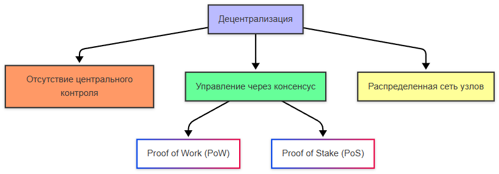
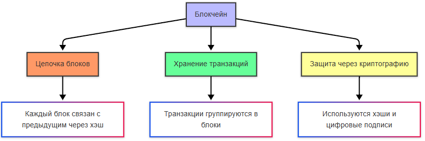

import BlockchainChainPlay from '@site/src/components/BlockchainChainPlay';

# Блокчейн, крипта и NFT

<div class="article-tags">
  <span class="tag tag-required">ОБЯЗАТЕЛЬНО</span>
  <span class="tag tag-beginner">ДЛЯ НОВИЧКОВ</span>
</div>

<span class="complexity-badge">Всем</span>

Эта глава — **карта местности**: от устройства цепочки блоков до криптовалют, транзакций, бирж и NFT. Материал разбит на логические части; если тема уже знакома из раздела [информационной безопасности](/encyclopedia/8-infra-security/8-07-informatsionnaya-bezopasnost/intro), отдельные блоки можно пролистать.

**О чём пойдёт речь:**

1. **Блокчейн** — блоки, хеши, узлы, консенсус (с интерактивом ниже).
2. **Криптография и криптовалюты** — зачем нужны подписи и хеши; обзор популярных сетей.
3. **Транзакции** — от кошелька до записи в реестр; модели UTXO и аккаунтов.
4. **Биржи** — где покупают и продают активы; CEX и DEX.
5. **Токены, смарт-контракты, NFT и DeFi** — программируемый слой поверх блокчейна.

---

### Мини-глоссарий

| Термин | Коротко |
| :--- | :--- |
| **Узел (node)** | Компьютер с копией реестра и правилами проверки блоков |
| **Mempool** | Очередь транзакций, ещё не попавших в блок |
| **Консенсус** | Правила, по которым сеть выбирает "каноническую" цепочку |
| **Подтверждение** | Каждый новый блок поверх вашей транзакции повышает уверенность в её необратимости |
| **Кошелёк** | Программа для ключей; "монеты" живут в реестре, не в приложении |
| **Coin / token** | Coin — нативная валюта сети (BTC, ETH); token — актив поверх чужого блокчейна |
| **NFT** | Уникальный идентификатор актива в стандарте (например, ERC-721) |

---

## Блокчейн

<BlockchainChainPlay />

Попробуйте демо выше: подмените данные в блоке — цепочка "ломается", потому что хеш перестаёт сходиться с `previous_hash` следующего блока. Ниже — то же правило в коде и в реальных сетях (там ещё Merkle-дерево, подписи и консенсус).

---

### Что такое блокчейн?

Слово **блокчейн** (*block* — блок, *chain* — цепь) чаще всего слышат рядом с Bitcoin, но технология шире: это **распределённый реестр**, где записи объединены в блоки, а блоки **связаны криптографическими ссылками**, а не "передаются" друг другу как файл по цепочке.

**Блок** — упакованная порция данных (часто список транзакций) плюс служебные поля: время, номер, хеш предыдущего блока, свой хеш. Изменили хоть один символ в данных — изменится хеш блока, и следующий блок с "старой" ссылкой станет недействительным.

**Блокчейн** (blockchain) — децентрализованная база в виде такой цепочки. Копии хранятся на множестве **узлов**; новые блоки добавляются по правилам **консенсуса** (PoW, PoS и др.). Чтобы подменить прошлое в крупной сети, атакующему нужно пересчитать огромный хвост цепи и убедить сеть принять его версию — это **дорого**, а не "физически невозможно".

Идея распределённого журнала известна давно; публичные криптосети сделали её массовой: правила открыты, участники проверяют друг друга математикой, а не доверием к одному серверу.

**Ключевые свойства публичных блокчейнов:**

- **Децентрализация** — нет единого администратора реестра; узлы равноправно проверяют правила.
- **Прозрачность** — история операций доступна для аудита (адреса псевдонимны, не анонимны по умолчанию).
- **Устойчивость к подделке прошлого** — криптографические связи между блоками; спорные ветки решает консенсус.
- **Неизменяемость записей** — прошлые блоки не "редактируют"; добавляют новые (редкие **reorg** на малых подтверждениях — отдельная тема).
- **Программируемость** — смарт-контракты автоматизируют условия (Ethereum и аналоги).

:::note Ограничения
Криптография защищает **целостность и авторство записей**, но не отменяет риски: потеря ключей, баги контрактов, фишинг, взломы бирж. Об этом — в конце главы.
:::


---

### Структура блока

В "боевых" сетях (Bitcoin, Ethereum) заголовок блока богаче учебного примера, но логика та же: **заголовок** фиксирует связь с прошлым, **тело** несёт операции.

| Компонент | Описание | Пример значения |
| :--- | :--- | :--- |
| **Заголовок (header)** | Служебные поля: ссылка на прошлое, время, сложность, корень Merkle | — |
| **Высота (height)** | Порядковый номер блока в цепи | `458921` |
| **Nonce (PoW)** | Число, которое майнер перебирает, чтобы хеш удовлетворил сложности | `2847193021` |
| **Хеш блока** | Отпечаток заголовка (в Bitcoin — SHA-256 дважды) | `0x3a7f…9b2c` |
| **Хеш предыдущего блока** | Связь с предшественником | `0x1e4d…8a1f` |
| **Список транзакций** | Операции в блоке | `[TX1, TX2, …]` |
| **Merkle root** | Корень дерева хешей транзакций: быстрая проверка "транзакция в блоке" | `0x9c2b…4d1a` |

**Merkle-дерево** (упрощённо): хешируем пары транзакций снизу вверх, пока не останется один корень в header. Узлу не нужно хранить все детали, чтобы доказать включение одной транзакции — достаточно короткого **Merkle proof**.

Учебная модель блока и цепочки на Python (упрощённо; в демо на странице — ещё более простой хеш для наглядности):

```python

import hashlib
import json

from time import time

class Block:
    def __init__(self, index, previous_hash, transactions, nonce=0):
        self.index = index
        self.previous_hash = previous_hash
        self.timestamp = time()
        self.transactions = transactions
        self.nonce = nonce
        self.hash = self.calculate_hash()

    def calculate_hash(self):
        payload = json.dumps({
            "index": self.index,
            "previous_hash": self.previous_hash,
            "timestamp": self.timestamp,
            "transactions": self.transactions,
            "nonce": self.nonce,
        }, sort_keys=True)
        return hashlib.sha256(payload.encode()).hexdigest()

def is_chain_valid(chain):
    """Та же идея, что в интерактиве: связь хешей и целостность каждого блока."""
    for i in range(1, len(chain)):
        if chain[i].previous_hash != chain[i - 1].hash:
            return False
        if chain[i].calculate_hash() != chain[i].hash:
            return False
    return True
```

Любое изменение `transactions` меняет `hash` блока — и все последующие блоки с устаревшим `previous_hash` нужно пересчитать заново.

---

### Принцип соединения блоков

Каждый новый блок включает **хеш предыдущего**. Цепочка растёт так:

1. **Генезис-блок** — первый; у него нет предшественника (или `previous_hash` = нули).
2. Второй блок хранит хеш генезиса в `previous_hash`.
3. Каждый следующий блок ссылается на хеш предшественника.

Подменили транзакцию в блоке №2 — изменился его хеш. Блок №3 всё ещё указывает на **старый** хеш → ветка невалидна, пока не пересчитать блок №2 и **весь хвост** до конца. В Bitcoin и Ethereum такой пересчёт на длинной цепи требует огромных ресурсов и согласия сети — поэтому говорят об **экономической**, а не магической защите истории.

<div class="callout callout--tip">
  <div class="callout-title">Задача византийских генералов</div>

  <div class="callout-body">
  Узлы должны договориться, **какая цепочка — правильная**, даже если часть участников врёт или offline. Алгоритмы консенсуса (PoW, PoS) — ответ на эту задачу в распределённой сети.
</div>
  </div>


---

### Распределенная природа сети

Блокчейн функционирует как децентрализованная сеть, где каждая полная копия реестра хранится на множестве узлов (компьютеров).

**Децентрализация** означает отсутствие единого сервера, контролирующего данные. Любой участник сети может проверить актуальность информации, скачав полную копию цепочки блоков.

Основные характеристики распределенной архитектуры:

- **Отказоустойчивость**: выход из строя одного или нескольких узлов не останавливает работу системы.
- **Прозрачность**: все транзакции видны каждому участнику сети.
- **Неизменяемость**: история записей доступна для аудита в любой момент времени.
- **Консенсус**: узлы договариваются о правильности состояния реестра через специальные алгоритмы.

Алгоритм консенсуса определяет правила, по которым узлы добавляют новые блоки в цепь. Популярные механизмы включают Proof of Work (доказательство работы) и Proof of Stake (доказательство доли владения). Эти протоколы гарантируют, что все участники сети придут к единому мнению относительно порядка транзакций.

Различие между блокчейном и обычной базой данных заключается в архитектуре хранения и управления данными.

Обычная база данных работает по модели клиент-сервер. Администратор базы данных имеет полные права на чтение, запись и удаление информации. Пользователи зависят от доверия к владельцу сервера. Изменение записей возможно только с разрешения администратора.

Блокчейн работает по модели распределенного реестра. Ни один отдельный участник не обладает правом изменять существующие записи. Добавление новой информации требует согласия большинства участников сети. История изменений сохраняется навсегда и доступна для проверки.

<details>
<summary>
<b>Дополнительные детали о типах блокчейнов</b>
</summary>

Существует три основных типа блокчейн-сетей:

1.  **Публичный блокчейн**: Открыт для любого желающего. Доступ к чтению и записи имеют все пользователи. Примеры: Bitcoin, Ethereum. Высокая безопасность, но низкая скорость.
2.  **Частный блокчейн**: Доступ контролируется одной организацией. Только авторизованные узлы могут участвовать в создании блоков. Используется внутри компаний для оптимизации внутренних процессов.
3.  **Консорциумный блокчейн**: Управляется группой организаций. Решение о добавлении блока принимается большинством членов консорциума. Компромисс между публичностью и приватностью.
</details>

---

### Процесс создания нового блока

Добавление нового блока в цепочку проходит через несколько этапов, зависящих от выбранного алгоритма консенсуса.

В сети с доказательством работы (Proof of Work) майнеры соревнуются в решении сложной математической задачи. Они перебирают различные значения nonce, пока не найдут хеш, удовлетворяющий определенным условиям (например, начинающийся с заданного количества нулей). Первый майнер, нашедший решение, предлагает новый блок сети.

Другие узлы проверяют корректность найденного решения и содержимое блока. Если проверка успешна, блок добавляется в цепочку, а майнер получает вознаграждение в виде криптовалюты. Этот процесс гарантирует, что создание блоков требует реальных затрат энергии и вычислительных ресурсов.

В сети с доказательством доли (Proof of Stake) выбор валидатора происходит на основе размера его доли в криптовалюте и времени удержания средств. Валидатор блокирует часть своих монет как залог и получает право создать следующий блок. Если он пытается добавить некорректные данные, его залог конфисковывается.

---

## Криптография и криптовалюта

Блокчейн опирается не на "доверие к компании", а на **математику и экономику**: подписи доказывают авторство, хеши — целостность цепи, консенсус — какой блок считать каноническим.

---

### Что такое криптография в этом контексте?

**Криптография** — наука о защите и проверке информации. В блокчейне чаще всего встречаются три инструмента:

- **Хеширование** — данные → строка фиксированной длины; малейшее изменение входа меняет хеш (эффект лавины). Так связывают блоки и строят Merkle-деревья.
- **Асимметричные ключи и цифровые подписи** — владелец подписывает транзакцию **закрытым** ключом, сеть проверяет **открытым**. Закрытый ключ в сеть не отправляют.
- **Шифрование** — для конфиденциальности каналов (TLS, VPN); сам публичный реестр Bitcoin, как правило, не шифрует суммы — они видны всем.

Подробнее про AES, TLS, RSA и ECC — в разделе [информационной безопасности](/encyclopedia/8-infra-security/8-07-informatsionnaya-bezopasnost/intro); здесь — только связка с криптоактивами.

**Двойная трата** (*double spending*) — попытка потратить одни и те же монеты дважды. Сеть отклоняет конфликтующие транзакции; после включения в блок и нескольких подтверждений отмена становится практически нереалистичной в крупных сетях.

**Атака 51%** — контроль большинства мощности (PoW) или стейка (PoS), позволяющий продвигать свою версию истории. На Bitcoin и Ethereum это **очень дорого** и бьёт по доверию к активу; на маленьких сетях риск выше — не абсолютная "бессмысленность", а **экономический барьер**.

---

### Что такое криптовалюта?

**Криптовалюта** — цифровой актив, учёт которого ведётся в блокчейне: правила эмиссии и переводов заданы протоколом, а не решением одного банка. Физических монет нет; "владение" = возможность подписать трату закрытым ключом.

У публичных сетей нет центрального оператора реестра: тысячи узлов копируют цепочку и применяют одни и те же правила (**консенсус**). Отдельная подробная глава — [Криптовалюты](/encyclopedia/9-spinoff/9-05-blokcheyn-kripta-i-nft/11).



**Как связаны понятия** (схемы ниже — по порядку):




**Майнинг** — в PoW-сетях поиск блока, удовлетворяющего сложности; за честную работу — награда в нативной монете. **Стейкинг** — в PoS блокировка монет как залог; валидатор предлагает блоки и получает вознаграждение (или теряет залог при мошенничестве).

---

### Самые известные криптовалюты

Ниже — **обзор**, не инвестиционный совет: у каждой сети свои компромиссы между безопасностью, скоростью, комиссией и программируемостью.

---

#### Биткоин (BTC)

**Биткоин** — первая в мире децентрализованная криптовалюта, появившаяся в 2009 году. Инициатор создания проекта использовал псевдоним Сатоши Накамото. Система функционирует без участия центральных банков или государственных органов.

Основная цель создания биткоина заключалась в разработке цифровой наличности, позволяющей проводить прямые платежи между пользователями без посредников. Технология базируется на распределенном реестре транзакций, известном как блокчейн. Каждый узел сети хранит полную копию истории всех операций.

Механизм консенсуса в сети Биткоин называется Proof of Work (доказательство работы). Майнеры используют вычислительные мощности для решения сложных математических задач. Первый майнер, нашедший решение, получает право добавить новый блок в цепочку и вознаграждение в виде новых монет.

| Характеристика | Значение |
| :--- | :--- |
| **Дата запуска** | 3 января 2009 года |
| **Алгоритм консенсуса** | Proof of Work (SHA-256) |
| **Максимальное количество** | 21 миллион монет |
| **Время блока** | Около 10 минут |
| **Основное назначение** | Цифровое золото, средство сбережения, платежная система |

Сеть Bitcoin защищена огромной совокупной мощностью PoW: переписать давнюю историю с множеством подтверждений **крайне дорого**. Это не отменяет рисков на уровне кошелька, биржи или социнженерии.

Протокол предусматривает периодическое уменьшение награды за майнинг каждые четыре года. Это событие называют "халвинг". Оно ограничивает инфляцию и создает искусственный дефицит актива.

---

#### Эфириум (ETH)

**Эфириум** — открытая блокчейн-платформа второго поколения, запущенная в 2015 году. В отличие от Биткоина, который служит преимущественно средством хранения ценности, Эфириум предоставляет инфраструктуру для разработки децентрализованных приложений.

Разработчик платформы Виталик Бутерин предложил идею внедрения виртуальной машины, способной выполнять произвольный код внутри блокчейна. Эта функция позволила создавать смарт-контракты — программы, которые автоматически исполняются при наступлении определенных условий.

Смарт-контракт представляет собой набор правил, записанных в коде. Он гарантирует выполнение обязательств без участия третьих сторон. Примером использования может служить автоматическая выплата страховки при наступлении страхового случая, зафиксированного датчиками.

| Характеристика | Значение |
| :--- | :--- |
| **Дата запуска** | 30 июля 2015 года |
| **Алгоритм консенсуса** | Proof of Stake (после обновления The Merge) |
| **Виртуальная машина** | Ethereum Virtual Machine (EVM) |
| **Язык контрактов** | Solidity, Vyper |
| **Основное назначение** | Децентрализованные приложения, смарт-контракты, NFT |

Платформа Эфириум стала фундаментом для развития целой экосистемы финансовых инструментов. Децентрализованные финансы (DeFi) позволяют пользователям выдавать кредиты, получать проценты и торговать активами без банков.

Токены стандарта ERC-20 используются для создания собственных цифровых активов внутри сети Эфириум. Этот стандарт упростил разработку новых проектов и обеспечил совместимость различных приложений.

---

#### Токен Binance Coin (BNB)

**Binance Coin** — нативный токен криптовалютной биржи Binance. Проект был создан в 2017 году для обеспечения функциональности одной из крупнейших торговых площадок мира.

Изначально токен работал по принципу токена Эфириума (стандарт ERC-20). Позже создатели запустили собственную блокчейн-сеть BNB Chain, где BNB стал основным активом для оплаты комиссий и стейкинга.

Сеть BNB Chain поддерживает высокую скорость обработки транзакций при низких затратах. Это позволяет использовать платформу для микроплатежей и массовых приложений.

| Характеристика | Значение |
| :--- | :--- |
| **Дата запуска** | 2017 год |
| **Алгоритм консенсуса** | Proof of Staked Authority (PoSA) |
| **Скорость блоков** | 3 секунды |
| **Комиссии** | Низкие, оплата в BNB дает скидку |
| **Основное назначение** | Оплата комиссий биржи, участие в Launchpad, оплата услуг в экосистеме |

Токен имеет механизм сжигания части эмиссии. Периодически часть монет уничтожается навсегда, что снижает общее предложение и может влиять на стоимость актива.

Экосистема BNB включает в себя множество сервисов: децентрализованную биржу (DEX), кошельки, инструменты для разработчиков и партнерские программы.

---

#### Кардано (ADA)

**Кардано** — блокчейн-платформа третьего поколения, разработанная командой IOG и университетом Эдинбурга. Проект отличается научным подходом к созданию архитектуры.

Разработка ведется поэтапно с публикацией результатов исследований перед внедрением изменений. Это позволяет минимизировать риски ошибок и обеспечить надежность системы.

Архитектура Кардано разделена на два слоя: слой управления учетными записями (CSL) и слой вычислений (CCL). Такое разделение позволяет обновлять функциональность вычислений независимо от управления аккаунтами.

| Характеристика | Значение |
| :--- | :--- |
| **Дата запуска** | 2017 год (тестнет), 2020 год (главная сеть) |
| **Алгоритм консенсуса** | Ouroboros (Proof of Stake) |
| **Подход к разработке** | Академический, peer-reviewed |
| **Язык смарт-контрактов** | Plutus, Marlowe |
| **Основное назначение** | Масштабируемые dApps, управление идентификацией, финансовая инклюзия |

Протокол Ouroboros использует доказательство доли владения для достижения консенсуса. Валидаторы выбирают случайным образом для создания следующего блока в зависимости от количества заблокированных монет.

Платформа фокусируется на решении проблем масштабируемости и энергоэффективности. Исследования направлены на создание устойчивой инфраструктуры для глобального применения.

---

#### Солана (SOL)

**Солана** — высокопроизводительная блокчейн-платформа, ориентированная на обработку большого количества транзакций в секунду. Проект был представлен в 2020 году.

Ключевой особенностью сети является использование механизма исторического доказательства (Proof of History). Этот алгоритм создает криптографические часы, которые позволяют узлам синхронизироваться без постоянного обмена сообщениями.

Такой подход значительно ускоряет процесс подтверждения транзакций. Сеть способна обрабатывать тысячи операций в секунду при минимальных комиссиях.

| Характеристика | Значение |
| :--- | :--- |
| **Дата запуска** | 2020 год |
| **Алгоритм консенсуса** | Proof of History + Proof of Stake |
| **Пропускная способность** | Высокая (заявленный теоретический предел; на практике зависит от нагрузки) |
| **Время блока** | 400 миллисекунд |
| **Основное назначение** | Высоконагруженные приложения, NFT, DeFi, игры |

Архитектура Соланы включает в себя несколько компонентов: кластер узлов, механизм лидерства и протокол шифрования. Разработчики оптимизировали работу памяти и дискового ввода-вывода для повышения скорости.

Платформа привлекла внимание сообщества благодаря возможности запуска сложных игр и финансовых приложений с низкой стоимостью использования.

---

#### TON (The Open Network)

**TON** — децентрализованная сеть, изначально разработанная командой Telegram. Проект претерпел значительные изменения после того, как регулирующие органы запретили запуск собственного токена Telegram.

Сообщество разработчиков взяло проект под свое управление и продолжило развитие сети как полностью децентрализованной платформы. Название сохранилось, но архитектура была переработана для соответствия принципам Web3.

Сеть TON объединяет в себе высокую скорость, низкие комиссии и интеграцию с мессенджером Telegram. Пользователи могут отправлять платежи и взаимодействовать с ботами прямо внутри приложения.

| Характеристика | Значение |
| :--- | :--- |
| **Статус** | Децентрализованная сеть (ранее проект Telegram) |
| **Алгоритм консенсуса** | Proof of Stake (Sharding-based) |
| **Шардинг** | Динамический шардинг для масштабирования |
| **Интеграция** | Глубокая интеграция с Telegram |
| **Основное назначение** | Микротранзакции, веб-приложения, NFT, платежи |

Динамический шардинг позволяет сети автоматически добавлять новые блоки обработки данных по мере роста нагрузки. Это обеспечивает линейное масштабирование производительности.

Экосистема TON включает в себя собственный кошелек, браузер для доступа к dApps и инструменты для разработчиков. Проекты могут легко интегрироваться с пользовательской базой Telegram.

---

#### Сравнительная характеристика платформ

Различные криптовалюты решают специфические задачи и имеют уникальные архитектурные особенности. Выбор платформы зависит от требований конкретного проекта.

| Параметр | Bitcoin | Ethereum | Binance Coin | Cardano | Solana | TON |
| :--- | :--- | :--- | :--- | :--- | :--- | :--- |
| **Главная цель** | Хранение ценности | Смарт-контракты | Экосистема биржи | Научная надежность | Высокая скорость | Интеграция с мессенджером |
| **Скорость** | Низкая | Средняя | Высокая | Средняя | Очень высокая | Высокая |
| **Комиссии** | Высокие | Переменные | Низкие | Низкие | Минимальные | Низкие |
| **Консенсус** | PoW | PoS | PoSA | PoS | PoH + PoS | PoS |
| **Масштабируемость** | Ограниченная | L2 (rollups) | Высокая | Layer 2 / шардинг в roadmap | Высокая пропускная способность | Динамический шардинг |

Каждая платформа развивает свою нишу в области блокчейн-технологий. Биткоин остается эталоном безопасности, Эфириум доминирует в сфере смарт-контрактов, а новые игроки предлагают решения для конкретных сценариев использования.

---

### Транзакции

**Транзакция** — подписанное сообщение в сеть: "перевести активы" или "вызвать функцию смарт-контракта". Пока она только в **mempool**, её ещё можно не увидеть в блоке; после включения в блок и нескольких подтверждений откат крайне маловероятен.

**Краткий путь:**

1. Кошелёк собирает поля (получатель, сумма, комиссия) и **подписывает** закрытым ключом.
2. Узлы проверяют подпись, баланс, отсутствие двойной траты.
3. Валидатор или майнер включает tx в блок; сеть принимает блок по консенсусу.
4. Запись попадает в общий реестр.

---

#### Инициация транзакции

Кошелёк формирует транзакцию **локально** — в сеть уходит уже подписанный пакет:

- **Адрес получателя** — обычно **не** сам публичный ключ, а производный **адрес** (в Bitcoin — хеш от pubkey; в Ethereum — `0x…` аккаунт или контракт).
- **Сумма** — в минимальных единицах (satoshi, wei).
- **Комиссия** — вознаграждение валидаторам; в Ethereum её называют **gas** (лимит × цена), в Bitcoin — fee за байт.
- **Nonce** — счётчик транзакций отправителя (в account-модели), защита от повтора одной и той же операции.

---

#### Криптографическая подпись

Для подтверждения права распоряжения средствами используется асимметричная криптография. Пользователь подписывает созданную транзакцию своим приватным ключом.

Приватный ключ хранится в секрете только у владельца и никогда не передается в сеть. Алгоритм подписи генерирует уникальную строку данных, которая математически связывает содержимое транзакции с приватным ключом.

Это даёт два свойства:

- **Аутентификация** — только владелец закрытого ключа мог инициировать операцию.
- **Целостность** — изменили сумму или получателя после подписи — подпись не сойдётся.

Учебный пример ECDSA (по духу как в сетях; узлы используют свою сериализацию транзакции):

```python
from cryptography.hazmat.primitives import hashes
from cryptography.hazmat.primitives.asymmetric import ec

def sign_transaction(private_key, transaction_data: str) -> bytes:
    return private_key.sign(
        transaction_data.encode(),
        ec.ECDSA(hashes.SHA256()),
    )

def verify_signature(public_key, transaction_data: str, signature: bytes) -> bool:
    try:
        public_key.verify(
            signature,
            transaction_data.encode(),
            ec.ECDSA(hashes.SHA256()),
        )
        return True
    except Exception:
        return False

private_key = ec.generate_private_key(ec.SECP256K1())
public_key = private_key.public_key()
tx = '{"to":"0xBob","amount":1}'
sig = sign_transaction(private_key, tx)
assert verify_signature(public_key, tx, sig)
```

---

#### Распространение и проверка в сети

Подписанная транзакция попадает в пул неподтвержденных транзакций (mempool). Узлы сети (ноды) принимают этот запрос и начинают его верификацию.

Проверка включает следующие действия:

- **Проверка формата**: Соответствие структуры транзакции спецификации протокола.
- **Проверка подписи**: Использование открытого ключа для подтверждения авторства.
- **Проверка баланса**: Анализ истории транзакций отправителя для наличия достаточных средств.
- **Проверка двойной траты**: Убеждение в том, что указанные средства еще не были потрачены ранее.
- **Проверка комиссии**: Оценка достаточности вознаграждения для приоритетной обработки.

Если транзакция проходит все проверки, она считается валидной и остается в пуле. Недействительные транзакции отбрасываются и не попадают в память сети.

Майнеры (в сетях Proof of Work) или валидаторы (в сетях Proof of Stake) выбирают набор валидных транзакций из пула для включения в новый блок. Критерии выбора часто включают размер комиссии: транзакции с более высокой комиссией получают приоритет.

---

#### Блокировка и консенсус

Выбранные транзакции упаковываются в новый блок вместе с другими данными. Майнер или валидатор начинает процесс достижения консенсуса для этого блока.

**В сетях Proof of Work:**
Участник выполняет вычисления для нахождения хеша, удовлетворяющего сложным условиям (доказательство работы). Это требует значительных ресурсов времени и энергии.

**В сетях Proof of Stake:**
Валидатор блокирует определенное количество монет как залог. Система случайным образом выбирает валидатора, который предложит блок. Если он действует честно, он получает награду. При попытке мошенничества залог сжигается.

После успешного создания блока остальные узлы сети проверяют его корректность. Они сверяют подписи, балансы и ссылки на предыдущие блоки. Если большинство узлов соглашается с состоянием нового блока, он добавляется в цепочку.

---

#### Запись в реестр и окончательность

Добавленный блок становится частью неизменяемой истории блокчейна. Транзакции внутри него считаются подтвержденными.

Количество подтверждений растет по мере добавления новых блоков поверх текущего. Чем больше блоков следует за транзакцией, тем выше степень ее необратимости.

| Уровень подтверждений | Статус транзакции | Вероятность отмены |
| :--- | :--- | :--- |
| 0 | Неподтвержденная | Высокая (может быть удалена из mempool) |
| 1 | Подтвержденная | Низкая (теоретически возможна атака 51%) |
| 3-6 | Окончательно подтвержденная | Практически нулевая |

В момент записи в блок транзакция меняет состояние учетных записей. Баланс отправителя уменьшается на сумму перевода и комиссию, баланс получателя увеличивается на полученную сумму. Эти изменения фиксируются в мировом состоянии (world state) сети.

---

#### Особенности обработки смарт-контрактов

Транзакции могут содержать не только передачу средств, но и вызов функций смарт-контракта. В таком случае данные транзакции включают код функции и необходимые аргументы.

При обработке такой транзакции узлы запускают виртуальную машину (например, EVM в Ethereum) для исполнения кода контракта. Результат выполнения обновляет внутреннее состояние контракта и может вызывать изменения балансов других аккаунтов.

Если при исполнении кода возникает ошибка (недостаточно газа, логическая ошибка), транзакция откатывается. Средства за вычетом затраченного газа возвращаются отправителю, а состояние реестра не меняется.

Минимальный смарт-контракт (Solidity) — правило "хранить число и менять его только владельцу":

```solidity
// SPDX-License-Identifier: MIT
pragma solidity ^0.8.20;

contract Counter {
    uint256 public count;
    address public owner;

    constructor() {
        owner = msg.sender;
    }

    function increment() external {
        require(msg.sender == owner, "not owner");
        count += 1;
    }
}
```

Вызов функции **другого** контракта (например, перевод ERC-20) упаковывают в поле `data` транзакции Ethereum:

```json
{
  "from": "0x742d35Cc6634C0532925a3b844Bc454e4438f44e",
  "to": "0x1234567890abcdef1234567890abcdef12345678",
  "value": "0",
  "gas": "200000",
  "gasPrice": "20000000000",
  "data": "0xa9059cbb000000000000000000000000...0000000000000000000000000000000000000001"
}
```

Префикс `0xa9059cbb` — селектор функции `transfer(address,uint256)`; остальное — аргументы в ABI-кодировке.

---

#### Обработка ошибок и отмена

Система блокчейна не имеет централизованного администратора, способного отменить транзакцию вручную. Если транзакция была успешно подписана и отправлена, она останется в истории навсегда.

Возможны следующие сценарии проблем:

- **Недостаток средств**: Транзакция будет отклонена узлами до попадания в блок.
- **Ошибка в коде контракта**: Транзакция выполнится частично или полностью откатится, но комиссия будет списана.
- **Неправильный адрес**: Средства будут отправлены на несуществующий или чужой адрес. Восстановить их невозможно без доступа к приватному ключу этого адреса.

Разработчики приложений внедряют механизмы предварительной валидации на стороне клиента, чтобы минимизировать вероятность таких ошибок. Пользователи должны тщательно проверять адресата и сумму перед подписанием транзакции.

---

#### Модели транзакций

Различные блокчейн-сети используют разные модели учета состояния, что влияет на скорость и стоимость транзакций.

**Модель UTXO** (*Unspent Transaction Output*) — как "купюры": транзакция **тратит** предыдущие выходы и **создаёт** новые (сдача себе, перевод получателю). Примеры: Bitcoin, Litecoin.

**Модель аккаунтов** — у каждого адреса **баланс** и **nonce**; транзакция меняет поля напрямую. Удобнее для смарт-контрактов. Примеры: Ethereum, BNB Chain. **Cardano** — **eUTXO** (гибрид UTXO с логикой на выходах).

```
UTXO:  потратить [2 BTC] + [1 BTC]  →  выходы [0.5 сдача][2.5 получателю]
Account: balance(Alice)=3  →  tx уменьшает Alice, увеличивает Bob
```

| Характеристика | UTXO | Account (+ eUTXO) |
| :--- | :--- | :--- |
| **Состояние** | Набор непотраченных выходов | Балансы / выходы с данными |
| **Приватность** | Выше (сложнее связать входы) | Балансы аккаунтов публичны |
| **Смарт-контракты** | Сложнее глобальное состояние | Естественно (Ethereum) / eUTXO (Cardano) |
| **Примеры** | Bitcoin | Ethereum, BNB Chain; eUTXO — Cardano |

---

#### Безопасность транзакций

Защита транзакций базируется на криптографии и экономических стимулах.

**Цифровая подпись** гарантирует, что только владелец приватного ключа может инициировать перевод. Взломать эту защиту можно только путем подбора ключа или использования уязвимостей в алгоритмах шифрования, что на сегодняшний день считается невозможным для современных стандартов.

**Децентрализация** предотвращает цензуру. Ни один узел не может запретить проведение валидной транзакции, если она соответствует правилам сети. Для остановки работы сети злоумышленнику потребуется захватить более 50% вычислительной мощности или доли стейкинга.

**Экономические барьеры** делают атаки невыгодными. Попытка изменить историю транзакций требует колоссальных затрат энергии или капитала, которые превышают потенциальную прибыль от мошенничества.

---

### Криптобиржи

Блокчейн и кошелёк — про **владение и перевод** в сети. **Биржа** — про **обмен и ликвидность**: сопоставление ордеров, графики, иногда хранение средств на балансе платформы. Это удобно, но вводит посредника: *"Not your keys, not your coins"* — на CEX ключи у сервиса.

**Криптобиржа** — площадка для торговли криптоактивами между собой или за фиат (доллары, евро, рубли и т.д.).

Платформы выполняют функции центрального узла ликвидности, где сходятся ордера на покупку и продажу. Они предоставляют графики котировок, историю торгов, инструменты технического анализа и системы безопасности для защиты активов пользователей.

Основные типы операций на биржах:
- **Спот-торговля**: Мгновенная покупка или продажа актива по текущей рыночной цене.
- **Маржинальная торговля**: Торговля с использованием заемных средств (кредитного плеча) для увеличения потенциальной прибыли или убытка.
- **Фьючерсная торговля**: Заключение контрактов на поставку актива в будущем по фиксированной цене.
- **Стейкинг и депозиты**: Получение процентов за хранение монет на счетах биржи.

---

#### Архитектура работы бирж

Процесс торговли на централизованной бирже (CEX) включает несколько этапов взаимодействия пользователя с системой.

1.  **Регистрация и верификация (KYC)**: Пользователь создает аккаунт и проходит проверку личности. Это требование регулирующих органов для предотвращения отмывания денег.
2.  **Депозит**: Пользователь переводит средства со своего кошелька на счет биржи или пополняет баланс через банковский перевод.
3.  **Размещение ордера**: Пользователь задает параметры сделки: тип (лимитный или рыночный), актив, количество и цену.
4.  **Сопоставление ордеров (Matching Engine)**: Специальный алгоритм находит совпадающие ордера покупателей и продавцов и исполняет сделку.
5.  **Вывод средств**: После завершения сделки пользователь может оставить активы на балансе биржи или вывести их на внешний кошелек.

Серверная часть биржи обрабатывает тысячи запросов в секунду. Для обеспечения высокой скорости используются инкрементальные базы данных и кэширование.

---

#### Обзор популярных платформ

Ниже приведены характеристики трех крупнейших мировых криптобирж.

---

##### Binance

**Binance** — крупнейшая в мире криптобиржа по объему торгов. Платформа предлагает широкий спектр услуг, включая спот, фьючерсы, стейкинг и децентрализованные продукты.

| Характеристика | Описание |
| :--- | :--- |
| **Основание** | 2017 год |
| **География** | Глобальная (с ограничениями в некоторых странах) |
| **Комиссии** | Низкие, скидка при использовании токена BNB |
| **Ликвидность** | Экстремально высокая |
| **Особенности** | Собственная блокчейн-сеть BNB Chain, Launchpad для новых проектов |

Платформа известна своей масштабируемостью и поддержкой сотен торговых пар. Система безопасности включает двухфакторную аутентификацию, антифишинговый код и резервный фонд SAFU для покрытия возможных взломов.

---

##### Coinbase

**Coinbase** — американская публичная компания, одна из первых легальных криптобирж в США. Платформа ориентирована на начинающих пользователей и институциональных инвесторов.

| Характеристика | Описание |
| :--- | :--- |
| **Основание** | 2012 год |
| **География** | США, Европа, Канада и другие страны |
| **Комиссии** | Средние/Высокие (удобство превыше экономии) |
| **Ликвидность** | Высокая |
| **Особенности** | Простой интерфейс, интеграция с банками США, публичная котировка акций (NASDAQ) |

Coinbase славится своим строгим соблюдением регуляторных норм и высоким уровнем доверия со стороны традиционного финансового сектора. Платформа предлагает образовательные курсы для обучения новичков.

---

##### Kraken

**Kraken** — одна из старейших бирж с упором на безопасность; публикует **Proof of Reserves** и профессиональные инструменты.

| Характеристика | Описание |
| :--- | :--- |
| **Основание** | 2011 год |
| **География** | Глобальная (с учетом локальных ограничений) |
| **Комиссии** | Конкурентные, зависят от объема торгов |
| **Ликвидность** | Высокая |
| **Особенности** | Поддержка фиатных валют многих стран, профессиональные инструменты трейдинга |

Kraken предоставляет расширенные возможности для маржинальной торговли и фьючерсов. Биржа регулярно публикует доказательства резервов (Proof of Reserves), подтверждая наличие всех средств клиентов.

---

#### Сравнительная таблица характеристик

| Параметр | Binance | Coinbase | Kraken |
| :--- | :--- | :--- | :--- |
| **Целевая аудитория** | Продвинутые трейдеры, массовый рынок | Новички, институционалы | Профессионалы, консервативные пользователи |
| **Количество монет** | Более 350 | Около 250 | Более 200 |
| **Интерфейс** | Сложный, много функций | Простой, минималистичный | Баланс простоты и сложности |
| **Поддержка фиата** | Карты, банковские переводы, P2P | Банковские переводы, карты | Банковские переводы, карты, чеки |
| **Мобильное приложение** | Отличное, полнофункциональное | Упрощенное, удобное | Полноценное, профессиональное |
| **Безопасность** | Высокая, фонд SAFU | Строгий комплаенс, FDIC для фиата (где применимо) | Аудит резервов, упор на защиту |

---

#### Централизованные и Децентрализованные биржи

Существует два основных типа криптобирж, различающихся архитектурой управления средствами.

**Централизованные биржи (CEX)** хранят средства пользователей на своих серверах. Пользователь доверяет бирже управление приватными ключами. Это обеспечивает высокую скорость обработки сделок и удобство использования, но создает риск потери средств при взломе платформы или банкротстве компании.

**Децентрализованные биржи (DEX)** работают на смарт-контрактах без участия посредника. Пользователи торгуют напрямую со своих кошельков, сохраняя контроль над приватными ключами. Примеры: Uniswap, PancakeSwap. Такие платформы более безопасны в плане цензуры, но требуют от пользователя технических знаний и оплаты комиссий сети.

| Тип | Контроль над ключами | Скорость | Комиссии | Ответственность |
| :--- | :--- | :--- | :--- | :--- |
| **CEX** | Хранит биржа | Очень высокая | Низкие (внутри сети) | Пользователь не контролирует средства напрямую |
| **DEX** | Хранит пользователь | Зависит от сети | Зависит от нагрузки сети | Полный контроль у пользователя |

---

#### Риски и безопасность

Работа с криптобиржами сопряжена с рядом рисков, которые необходимо учитывать.

**Риск взлома**: Центральные хранилища средств являются привлекательной целью для хакеров. Даже при наличии систем защиты возможны утечки данных или компрометация внутренних серверов.

**Риск регуляции**: Государственные органы могут вводить ограничения на работу конкретных бирж или требовать блокировки счетов определенных пользователей. Это может привести к временному или постоянному недоступу к средствам.

**Риск мошенничества**: Недобросовестные проекты могут создавать фейковые биржи для кражи средств. Важно проверять репутацию платформы и использовать только известные сервисы.

**Риск "Не твои ключи — не твои монеты"**: При хранении средств на бирже пользователь не имеет прямого доступа к приватным ключам. В случае отзыва лицензии биржи или судебного разбирательства доступ к активам может быть заблокирован.

Рекомендуется хранить крупные суммы на аппаратных кошельках, а на биржах оставлять только средства для активной торговли.

---

## Криптография — углубление и связь с блокчейном

Общая теория (AES, TLS, RSA, история шифров) разобрана в [разделе информационной безопасности](/encyclopedia/8-infra-security/8-07-informatsionnaya-bezopasnost/intro). Ниже — **сжатая выжимка** и то, что важно именно для криптоактивов.

---

### Симметричное и асимметричное шифрование

- **Симметричное** (AES, ChaCha20) — один секретный ключ на шифрование и расшифрование. Быстро; используется в HTTPS после рукопожатия TLS.
- **Асимметричное** (RSA, ECC) — пара **открытый / закрытый** ключ. В блокчейне закрытый ключ подписывает транзакции; открытый — для проверки.

**Цифровая подпись** — не "шифрование всего сообщения", а подпись **хеша** (или данных) закрытым ключом. В Bitcoin — ECDSA на кривой **secp256k1**; с обновлением **Taproot** — также **Schnorr** (компактнее, удобнее агрегировать подписи).

<details>
<summary><b>История шифров (кратко)</b></summary>

От шифра Цезаря и Виженера до "Энигмы" и взлома Тьюрингом — урок один: стойкость зависит от **длины ключа, протокола и дисциплины** (не повторять ключи, не использовать ECB для изображений). Современный стандарт симметричного шифрования — **AES**; устаревшие RC4 и короткие блоки Blowfish в новых системах не применяют.
</details>

---

### Как криптография держит блокчейн

1. **Хеширование** — SHA-256 (Bitcoin), Keccak-256 (Ethereum). Свойства: детерминизм, лавинный эффект, практическая стойкость к коллизиям. Связывает блоки и строит Merkle-деревья.
2. **Владение активом** — кто владеет **закрытым ключом**, тот может подписать трату. Адрес в Bitcoin: `RIPEMD160(SHA256(public_key))` — это не "монета в кошельке", а запись в реестре.
3. **Проверка узлами** — подпись, баланс/UTXO, комиссия, отсутствие двойной траты; затем консенсус по блоку.

---

### Что криптография *не* решает

Криптография подтверждает **"эта транзакция подписана владельцем ключом и не противоречит правилам на момент блока"**, но не защищает от:

- потери или кражи **seed-фразы** и закрытого ключа;
- **фишинга** и поддельных приложений;
- **багов** в смарт-контрактах;
- концентрации майнинга/стейка у немногих игроков.

<div class="callout callout--caution">
  <div class="callout-title">Практический вывод</div>

  <div class="callout-body">
  Крупные суммы — в **самохраняемом** кошельке (холодный или аппаратный)

  биржа — для торговли, не для долгого хранения всего капитала.
</div>
  </div>


---

## Токены, смарт-контракты, NFT и DeFi

Поверх базового блокчейна (BTC — в основном переводы) строят **программируемый слой**: контракты выпускают токены, DEX, NFT-маркетплейсы.

---

### Что такое токен?

**Токен** — цифровой актив, учёт которого ведёт **контракт или правила** на уже существующей сети (чаще Ethereum). Нативная монета сети (ETH, BNB) — **coin**; всё остальное на том же L1 — обычно **token**.

| Тип | Суть | Примеры |
| :--- | :--- | :--- |
| **Fungible** | Взаимозаменяемые единицы | ERC-20, стейблкоины USDT/USDC |
| **NFT** | Уникальный `tokenId` | ERC-721, ERC-1155 |
| **Utility** | Доступ к сервису, скидки | BNB на комиссии, токены игр |
| **Security** | Претензия на долю/доход (юридически регулируется) | Токены некоторых ICO |

Стандарты **ERC-20** (взаимозаменяемые) и **ERC-721** (уникальные) сделали Ethereum фабрикой активов: один контракт — миллионы однотипных балансов или коллекция уникальных id.

---

### Смарт-контракт

**Смарт-контракт** — программа в блокчейне с фиксированным адресом и состоянием. Её вызывают транзакцией; узлы **детерминированно** исполняют код и обновляют реестр. Никто не "нажимает кнопку отмены" в обход правил: только новая транзакция по правилам контракта.

Типичные сценарии:

- **DeFi** — обмен, займы, проценты (Aave, Uniswap и др.).
- **Эскроу** — перевод при выполнении условия (оракул, таймер, голосование).
- **Игры и метаданные** — правила наград, привязка предметов к NFT.

Код контракта **публичен**; ошибка в логике = потеря средств (взломы Ronin, DAO 2016 — уроки аудита и лимитов).

---

### NFT — что это на самом деле

**NFT** (*Non-Fungible Token*) — запись в реестре: "у адреса A tokenId = 7". **Картинка или файл в блокчейне обычно не хранятся** — там только ссылка (URI) на IPFS, Arweave или обычный сервер. Владение = владение tokenId по правилам контракта.

Жизненный цикл (упрощённо):

1. **Mint** — контракт создаёт новый `tokenId`, привязывает metadata URI.
2. **Transfer** — смена владельца в контракте (часто за ETH + gas).
3. **Marketplace** — OpenSea и аналоги лишь **интерфейс** к контрактам; сделка — всё равно on-chain или через разрешения (`approve`).

<div class="callout callout--tip">
  <div class="callout-title">Не путать</div>

  <div class="callout-body">
  NFT подтверждает **запись в реестре**, а не автоматически авторские права на произведение и не "уникальность файла" (файл можно скопировать). Юридический смысл зависит от лицензии проекта.
</div>
  </div>


**Риски:** фейковые коллекции, искусственный объём торгов, потеря ключа, "мертвые" ссылки metadata, если хостинг исчез.

---

### DeFi — децентрализованные финансы

**DeFi** — финансовые операции через смарт-контракты без банка-посредника: обмен на **DEX**, депозиты в **пулы ликвидности**, займы под залог, стейблкоины.

- **Пул ликвидности** — вы вносите пару токенов; другие меняют их по формуле (x·y = k); вы получаете долю комиссий и риск **impermanent loss** при сильном движении курса.
- **Стейкинг в DeFi** ≠ стейкинг валидатора: часто это блокировка токена в контракте за вознаграждение протокола.
- **Стейблкоин** — привязка к доллару (залог, алгоритм или централизованный резерв); у каждого механизма свои риски де-пега.

Связь с биржами из этой главы: **CEX** — удобство и фиат; **DEX** — контроль ключей и прозрачность контракта, но комиссии сети и ответственность на пользователе.

---

### Куда двигаться дальше

- Подробнее про валюты и волатильность — [Криптовалюты](/encyclopedia/9-spinoff/9-05-blokcheyn-kripta-i-nft/11).
- Практикум — [Ledger Lab](/encyclopedia/9-spinoff/9-05-blokcheyn-kripta-i-nft/1010) (пошаговая сборка ledger: блокчейн, подписи, переводы, compliance).
- Самопроверка по теме — [чек-лист](/encyclopedia/9-spinoff/9-05-blokcheyn-kripta-i-nft/3).

---
