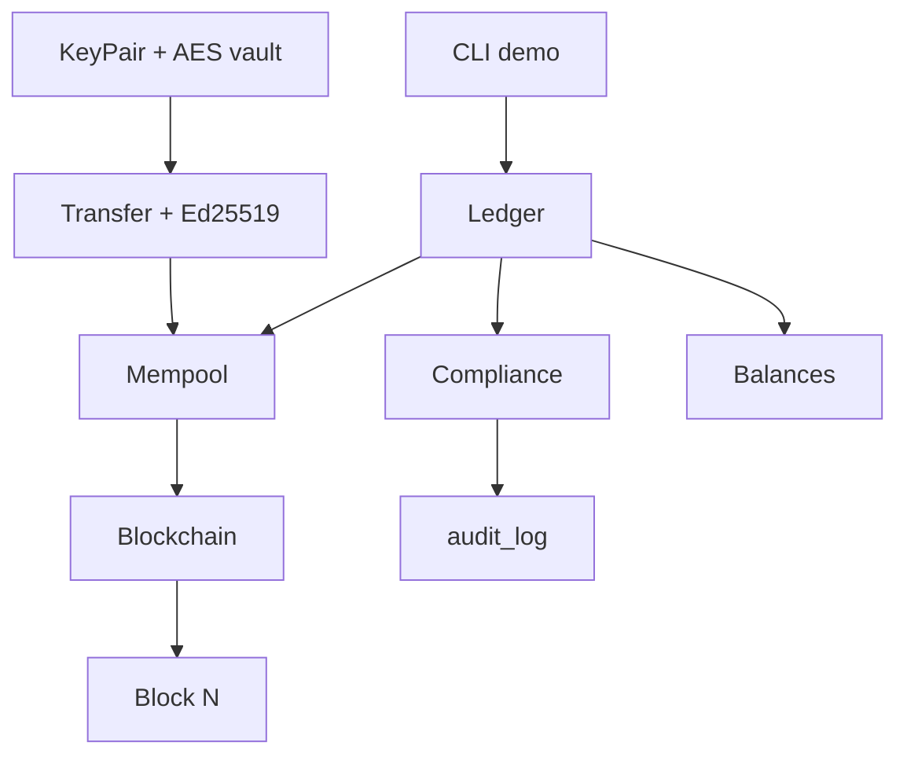

# Практикум Ledger Lab — обзор

<div class="article-tags">
  <span class="tag tag-required">ОБЯЗАТЕЛЬНО</span>
  <span class="tag tag-beginner">ДЛЯ НОВИЧКОВ</span>
</div>

<span class="complexity-badge">Разработчику</span>
<span class="complexity-badge">Аналитику</span>

> **Практикум.** Вы уже видели блокчейн и биржи в теории ([вводная глава](./1.md), [криптовалюты](./11.md)). Здесь по шагам соберёте **учебный ledger** на Python у себя на компьютере — цепочка блоков, цифровые подписи, очередь переводов и слой compliance (KYC, лимиты, журнал аудита). Весь код — в статьях практикума, отдельного репозитория нет. Это **не** боевой кошелёк и **не** работа с mainnet.

---

## Что получится в конце

**Crypto Ledger Lab** — консольное приложение, в котором:

| Слой | Технология | Связь с теорией |
|------|------------|-----------------|
| Реестр | Связанные блоки + SHA-256 | [Блокчейн](./1.md#блокчейн), демо [BlockchainChainPlay](/encyclopedia/9-spinoff/9-05-blokcheyn-kripta-i-nft/1) |
| Авторство | Ed25519, подпись canonical JSON | [Цифровая подпись](./1.md), раздел [ИБ](/encyclopedia/8-infra-security/8-07-informatsionnaya-bezopasnost/intro) |
| Хранение ключей | AES-GCM + PBKDF2 | Симметричное шифрование в [той же главе](./1.md) |
| "Торговля" | Балансы активов `LAB`, mempool, майнинг блока | UTXO/аккаунты, биржи — [криптовалюты](./11.md) |
| Compliance | KYC-уровни, лимиты, sanctions, audit log | KYC/AML на CEX — [глава 1](./1.md), [Криптовалюты](./11.md) |

<div class="callout callout--caution">
  <div class="callout-title">Учебный характер</div>

  <div class="callout-body">
  Проект объясняет **механизмы**, а не даёт юридическую или инвестиционную консультацию. Для реальных продуктов нужны лицензии, аудит, HSM, процедуры AML/KYC по юрисдикции (в РФ — в том числе 115-ФЗ и требования ЦБ к операторам обмена).
</div>
  </div>


---

## Требования

- Python **3.10+**
- `pip`, виртуальное окружение
- Базовое чтение кода (функции, классы, `dict`)

---

## Подготовка среды

Создайте у себя папку проекта (имя любое, ниже — `ledger-lab/`):

```text
ledger-lab/
├── ledger_lab/
│   ├── __init__.py
│   ├── block.py
│   ├── chain.py
│   ├── crypto_keys.py
│   ├── transaction.py
│   ├── compliance.py
│   ├── ledger.py
│   └── demo.py          # короткий сценарий — шаг 3–4
├── tests/
│   └── test_ledger.py
└── requirements.txt
```

`requirements.txt`:

```text
cryptography>=42.0.0
pytest>=8.0.0
```

Установка:

```bash
cd ledger-lab
python -m venv .venv
.venv\Scripts\activate          # Windows
# source .venv/bin/activate     # Linux / macOS
pip install -r requirements.txt
```

Дальше в [шаге 1](./1011.md) заполните `block.py` и `chain.py` по фрагментам из статьи. Остальные модули — в шагах 2–4.

---

## Маршрут практикума

| Шаг | Статья | Содержание |
|-----|--------|------------|
| 1 | [Цепочка блоков](./1011.md) | `Block`, `Blockchain`, учебный PoW, проверка целостности |
| 2 | [Криптография](./1012.md) | Ed25519, подпись перевода, шифрование PEM ключа |
| 3 | [Ledger и переводы](./1013.md) | Балансы, mempool, майнинг, симуляция spot-перевода |
| 4 | [Compliance и тесты](./1014.md) | KYC, лимиты, audit, pytest, куда развивать проект |

Рекомендуемый порядок: **1011 → 1012 → 1013 → 1014**. Можно идти параллельно с чтением [вводной](./1.md), возвращаясь к интерактивам на странице.

---

## Архитектура (высокий уровень)



**Поток перевода:**

1. Пользователь создаёт кошелёк (пара ключей), проходит учебный KYC.
2. `submit_transfer` проверяет compliance и баланс, подписывает транзакцию, кладёт в **mempool**.
3. `mine_pending` применяет переводы к балансам и упаковывает их в **новый блок** (с учебным PoW).
4. События compliance пишутся в **audit_log** (для разбора инцидентов и регуляторных запросов).

---

## Связь с "настоящим" криптотрейдингом

| В практикуме | На бирже (CEX) | On-chain (DEX) |
|--------------|----------------|----------------|
| Баланс `LAB` в памяти | Баланс в БД биржи | Баланс в смарт-контракте / кошельке |
| Подпись Ed25519 перевода | API-ключ + 2FA | Подпись tx в кошельке |
| Compliance в Python | KYC/AML отдел + лимиты | Только код контракта + риски пользователя |
| Майнинг блока локально | Matching engine | Блок в сети Ethereum и др. |

Практикум специально **сжимает** стек до одного процесса, чтобы увидеть все слои сразу. В продакшене их разносят по сервисам, HSM и внешним провайдерам KYC.

---

## Что попробовать сегодня

1. Создайте каталог `ledger-lab/` и установите зависимости из раздела "Подготовка среды".
2. Пройдите [шаг 1](./1011.md) — измените `difficulty` и посмотрите, как растёт время майнинга.
3. Откройте [чек-лист](./3.md) раздела и отметьте вопросы про хеши, подписи и KYC.

---

### Навигация по практикуму

[1011 Цепочка](./1011.md) · [1012 Криптография](./1012.md) · [1013 Ledger](./1013.md) · [1014 Compliance](./1014.md) · [О разделе](./intro.md) · [Итоги](./2.md)
