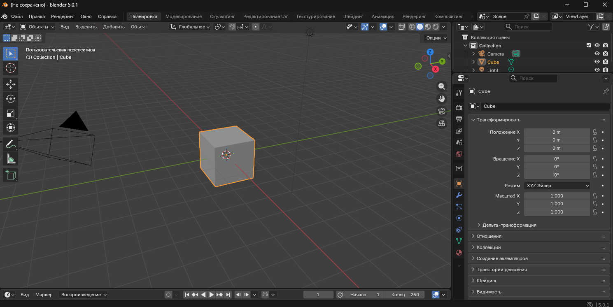

import BlenderWorkspacePlay from '@site/src/components/BlenderWorkspacePlay';

# Blender

<div class="article-tags">
  <span class="tag tag-required">ОБЯЗАТЕЛЬНО</span>
  <span class="tag tag-beginner">ДЛЯ НОВИЧКОВ</span>
</div>

<span class="complexity-badge">Всем</span>

<BlenderWorkspacePlay />

Здесь — **практическая ветка** раздела: установить Blender, настроить, пройти по редакторам и собрать простой пайплайн. Теория 3D, рендера и PBR без привязки к кнопкам — в [3D-графике и анимации](./13.md); общая карта — [основы](./1.md).

:::tip Не путать с manual
Ниже есть обзор официального руководства и дубли тем из теории (рендер, симуляции). Если цель — понять *зачем* path tracing или что такое UV, начните с [13.md](./13.md); если цель — *где в Blender нажать* — оставайтесь здесь.
:::

---

## Blender

**Blender** — это бесплатная и открытая программа с открытым исходным кодом, предназначенная для создания трёхмерной графики. Она объединяет в себе инструменты для моделирования, скульптинга, анимации, симуляции физических процессов, рендеринга, композитинга, монтажа видео и даже 2D-рисования. Blender используется как индивидуальными художниками и разработчиками, так и студиями в киноиндустрии, игровой разработке, архитектурной визуализации, научной визуализации и других сферах.

Проект развивается сообществом под эгидой Blender Foundation — некоммерческой организации, созданной специально для поддержки и развития программного обеспечения. Благодаря открытой лицензии GPL (GNU General Public License), Blender можно свободно использовать, модифицировать и распространять без ограничений, включая коммерческое применение.

Blender покрывает весь 3D-конвейер: моделирование, риггинг, анимацию, симуляции, рендер, композитинг, трекинг движения, видеомонтаж и 2D (Grease Pencil). Кроссплатформенный интерфейс на OpenGL един для Linux, macOS и Windows; поведение настраивается скриптами Python.

**Официальные ресурсы:**

| Ресурс | Ссылка |
|--------|--------|
| Сайт и загрузка | [blender.org](https://www.blender.org/) |
| Справочное руководство (RU, 5.2 LTS) | [docs.blender.org/manual/ru/dev/](https://docs.blender.org/manual/ru/dev/) |
| Руководство offline (HTML) | [blender_manual_html.zip](https://docs.blender.org/manual/ru/dev/blender_manual_html.zip) |
| Руководство offline (EPUB) | [blender_manual_epub.zip](https://docs.blender.org/manual/ru/dev/blender_manual_epub.zip) |
| Системные требования | [blender.org/download/requirements](https://www.blender.org/download/requirements/) |
| Заметки о выпусках | [Release notes](https://developer.blender.org/docs/release_notes/) |

---

## Установка Blender

Blender выпускается примерно раз в три месяца. Перед установкой проверьте [минимальные и рекомендуемые требования](https://www.blender.org/download/requirements/): актуальные драйверы GPU и корректную поддержку OpenGL обязательны. Встроенной системы обновления нет — новую версию ставят вручную.

---

### Типы дистрибутивов

| Тип | Назначение | Стабильность / новизна |
|-----|----------|------------------------|
| **Stable** | Обычная работа, новые функции без регрессий | Стабильный релиз ~каждые 3 месяца |
| **LTS** (Long Term Support) | Долгие проекты, студии | 2 года поддержки; без новых API и крупных фич; точечные патчи (например 5.2.1) |
| **Daily** | Тест будущих версий | Ежедневные сборки; Alpha → Beta → RC → Stable |
| **Из исходников** | Разработчики, кастомные сборки | Всегда свежий код; нужна сборка по [handbook](https://developer.blender.org/docs/handbook/building_blender/) |

Для большинства пользователей достаточно **Stable** или **LTS** с [страницы загрузки](https://www.blender.org/download/).

---

### Windows

Поддерживаются архитектуры **x64** и **arm64** — скачивайте пакет под свой процессор.

**Установщик (MSI):** выбор папки, пункт в меню "Пуск", ассоциация `.blend` с Blender. Нужны права администратора.

**ZIP-архив:** распаковка в любую папку, запуск `blender.exe` без установки в систему. Меню "Пуск" и ассоциации не создаются. Регистрация `.blend`: *Настройки → System → Register* или `blender -r` из [командной строки](https://docs.blender.org/manual/ru/dev/advanced/command_line/arguments.html). Для полностью автономной копии — [портативная установка](https://docs.blender.org/manual/ru/dev/advanced/blender_directory_layout.html#portable-installation).

**Microsoft Store:** установка из магазина; обновления приходят автоматически.

**Обновление:** скачать новый MSI/ZIP с сайта; несколько версий могут сосуществовать (особенно при ZIP). Старую MSI-версию удаляют через "Параметры Windows" / "Программы и компоненты".

Подробнее: [Установка на Windows](https://docs.blender.org/manual/ru/dev/getting_started/installing/windows.html).

---

### Linux

**С blender.org:** скачать архив под архитектуру, распаковать (например в `~/software` или `/usr/local`), запуск двойным щелчком. Несколько версий параллельно — нормальная практика. Ассоциация blend-файлов — через регистрацию в настройках System.

**Менеджер пакетов дистрибутива:** удобные обновления и интеграция в систему, но пакет может отставать от официальной сборки или идти без GPU Cycles из-за лицензий.

**Snap:** `snap install blender --classic` — автоматические обновления, единообразная сборка на разных дистрибутивах.

**Графическая среда:** поддерживаются X11 и Wayland — см. [оконная среда Linux](https://docs.blender.org/manual/ru/dev/getting_started/installing/linux_windowing_environment.html).

**Конфликт Alt+мышь:** в GNOME/KDE Alt+ЛКМ/ПКМ часто зарезервированы оконным менеджером, а Blender использует Alt для эмуляции средней кнопки, петель выделения и т.д. Рекомендуется переназначить модификатор окон на **Super (Meta)**:

```bash
# GNOME — после следующего входа в сессию
gsettings set org.gnome.desktop.wm.preferences mouse-button-modifier '<Super>'
```

В KDE: *Системные настройки → Управление окнами → Действия с окном* — с "Alt" на "Meta".

**Архив:** извлекать только **TAR**, не 7-zip (см. [issue #104070](https://projects.blender.org/blender/blender/issues/104070)).

Подробнее: [Установка на Linux](https://docs.blender.org/manual/ru/dev/getting_started/installing/linux.html).

---

### macOS

Поддерживаются **Intel** и **Apple Silicon** — скачивайте сборку под свой чип.

**DMG:** смонтировать образ двойным щелчком, перетащить `Blender.app` в *Applications*. При первом запуске macOS может запросить подтверждение в настройках безопасности. Несколько версий — переименуйте `Blender.app` или положите в разные папки. Портативный режим — как на других ОС.

**Обновление:** скачать новый DMG и заменить приложение в *Applications* (или оставить параллельную копию).

Подробнее: [Установка на macOS](https://docs.blender.org/manual/ru/dev/getting_started/installing/macos.html).

---

### Другие способы установки

[Steam](https://docs.blender.org/manual/ru/dev/getting_started/installing/steam.html), [Microsoft Store](https://docs.blender.org/manual/ru/dev/getting_started/installing/windows.html#microsoft-store) (Windows).

Общий обзор: [Установка Blender](https://docs.blender.org/manual/ru/dev/getting_started/installing/index.html).

---

## Настройка Blender

Полный список параметров — **Правка → Настройки** (*Edit → Preferences*), быстрый вызов **Ctrl+,**. При первом запуске или после обновления показывается [экран-заставка](https://docs.blender.org/manual/ru/dev/interface/window_system/splash.html) с мастером начальных настроек.

---

### Первый запуск (экран-заставки)

- **Импорт настроек** из предыдущей версии — копируются preferences, startup, аддоны; папки конфигурации у каждой версии свои ([макет каталогов Blender](https://docs.blender.org/manual/ru/dev/advanced/blender_directory_layout.html)).
- **Новые настройки:** язык интерфейса, светлая/тёмная тема, пресет **раскладки клавиатуры** (Blender по умолчанию, Blender 2.7x, Industry Compatible), кнопка выделения (ЛКМ/ПКМ), действие **Пробела** (воспроизведение анимации / панель инструментов / поиск).

Раскладки: [Blender default](https://docs.blender.org/manual/ru/dev/interface/keymap/blender_default.html), [Industry compatible](https://docs.blender.org/manual/ru/dev/interface/keymap/industry_compatible.html).

---

### Рекомендуемые настройки после установки

**Автосохранение настроек** включено по умолчанию; отключение: меню "три линии" внизу окна Preferences → снять *Auto-Save Preferences* → *Save Preferences*.

**Язык:** *Настройки → Interface → Translation* — язык и что переводить (интерфейс, подсказки, отчёты, новые данные). Русская локализация руководства: [manual/ru/dev](https://docs.blender.org/manual/ru/dev/).

**Ввод (Input):**

- Нет цифровой панели → *Emulate Numpad* (верхний ряд цифр вместо numpad; часть горячих клавиш режима редактирования меняется).
- Нет средней кнопки мыши → *Emulate 3 Button Mouse* (Alt+ЛКМ ≈ СКМ).

**Пути к файлам (File Paths):** внешний редактор изображений (GIMP, Krita…), проигрыватель рендеров, каталог **временных файлов** и автосохранений. Префикс `//` в путях Blender — папка текущего `.blend`-файла.

**Save & Load:** *Auto Run Python Scripts* — для доверенных blend-файлов с ригами и аддонами; с ненадёжных источников лучше оставить выключенным (защита от вредоносных скриптов в файле).

Подробнее: [Введение в настройку](https://docs.blender.org/manual/ru/dev/getting_started/configuration/introduction.html), [По умолчанию](https://docs.blender.org/manual/ru/dev/getting_started/configuration/defaults.html).

---

### Периферия и оборудование

| Устройство | Рекомендация |
|------------|--------------|
| Монитор | Full HD (1920×1080) и выше; несколько мониторов — рабочие пространства на весь стол |
| Мышь | Трёхкнопочная с колёсиком (СКМ = orbit, pan, zoom в 3D) |
| Клавиатура | Полноразмерная с **Numpad**; для hotkeys в руководстве предполагается раскладка **US/UK** |
| Графический планшет | Давление пера; при сбоях — курсор в окне Blender, переподключить планшет |
| Тачпад | Жесты: Shift+два пальца — pan, Ctrl/Super+два пальца — zoom, два пальца — orbit |
| 3D-мышь (NDOF) | 3Dconnexion SpaceMouse и др.; настройка в Preferences → Input → NDOF |
| VR (OpenXR) | Аддон *VR Scene Inspection*; платформы: SteamVR, Meta Quest Link, WMR, Varjo, HTC Vive |

Сброс: *Файл → По умолчанию → Загрузить заводские настройки* или только preferences через меню настроек. Свой шаблон сцены: *Файл → По умолчанию → Сохранить файл запуска* ([startup file](https://docs.blender.org/manual/ru/dev/interface/window_system/topbar.html#startup-file)).

Подробнее: [Настройка периферийных устройств](https://docs.blender.org/manual/ru/dev/getting_started/configuration/hardware.html).

---

### Справочная система внутри Blender

- **Подсказки** при наведении на кнопки: описание, hotkey, значение, при включении — строка Python API.
- **F1** или контекстное меню → *Online Manual* — открывает соответствующую страницу руководства (не для 100% элементов UI).
- Меню **Help:** руководство, форумы, [сообщества](https://www.blender.org/community/), отчёт об ошибке, **Save System Info** (`system-info.txt` — версия Blender, Python, GPU, Cycles devices, аддоны).

См. [Справочная система](https://docs.blender.org/manual/ru/dev/getting_started/help.html).

---

## Разделы официального руководства (обзор)

Ниже — карта [руководства Blender 5.2 LTS](https://docs.blender.org/manual/ru/dev/) по основным разделам. В этой статье многие темы раскрыты подробнее выше; ссылки ведут на полные главы manual.

---

### Начало работы

| Тема | Содержание |
|------|------------|
| [О Blender](https://docs.blender.org/manual/ru/dev/getting_started/about/index.html) | Кто использует, ключевые возможности |
| [Установка](https://docs.blender.org/manual/ru/dev/getting_started/installing/index.html) | Требования, типы сборок, платформы |
| [Настройка](https://docs.blender.org/manual/ru/dev/getting_started/configuration/index.html) | Preferences, hardware, defaults |
| [Справка](https://docs.blender.org/manual/ru/dev/getting_started/help.html) | Tooltips, F1, system info |

---

### Интерфейс и редакторы

| Раздел manual | О чём |
|---------------|--------|
| [Интерфейс](https://docs.blender.org/manual/ru/dev/interface/index.html) | Оконная система: **Areas**, **Regions**, рабочие пространства (*Workspaces*), верхняя панель (*Topbar*), статус-бар |
| [Раскладки клавиатуры](https://docs.blender.org/manual/ru/dev/interface/keymap/index.html) | Условные обозначения руководства, встроенные keymap, кастомизация |
| [Редакторы](https://docs.blender.org/manual/ru/dev/editors/index.html) | Обзор всех типов редакторов и их назначение |

**Основные редакторы:**

- **3D Viewport** — моделирование, навигация, режимы отображения (Solid, Material Preview, Rendered).
- **Outliner** — иерархия сцены, коллекции, фильтры, видимость.
- **Properties** — Scene, World, Object, Modifiers, Physics, Render, Output, View Layer.
- **Shader Editor** — материалы и ноды шейдеров.
- **Geometry Node Editor** — процедурная геометрия.
- **UV Editor** — развёртки и острова UV.
- **Image Editor** — текстуры, рендер-превью.
- **Compositor** — постобработка рендера.
- **Video Sequencer** — монтаж и звук.
- **Timeline / Dope Sheet / Graph Editor / NLA** — анимация и кривые.
- **File / Asset Browser** — файлы и библиотека ассетов.
- **Text Editor / Python Console** — скрипты и `bpy`.
- **Spreadsheet** — атрибуты геометрии в таблице.

---

### Сцена и данные

| Раздел | Содержание |
|--------|------------|
| [Сцена и объекты](https://docs.blender.org/manual/ru/dev/scene_layout/index.html) | Scene, Object, Collection, View Layer, слои видимости |
| [Ассеты и файлы](https://docs.blender.org/manual/ru/dev/files/index.html) | Data Blocks, `.blend`, linked libraries, Asset Browser, упаковка данных |

---

### Творческие пайплайны

| Раздел | Содержание |
|--------|------------|
| [Моделирование](https://docs.blender.org/manual/ru/dev/modeling/introduction.html) | Mesh, Curve, Surface, Metaball, Text; Edit/Object mode; модификаторы |
| [Скульптинг и рисование](https://docs.blender.org/manual/ru/dev/sculpt_paint/index.html) | Sculpt Mode, Texture/Vertex Paint, brushes |
| [Grease Pencil](https://docs.blender.org/manual/ru/dev/grease_pencil/index.html) | 2D/2.5D штрихи и анимация в 3D-сцене |
| [Анимация и риггинг](https://docs.blender.org/manual/ru/dev/animation/introduction.html) | Keyframes, Armature, Constraints, Drivers, Shape Keys, NLA |
| [Физика](https://docs.blender.org/manual/ru/dev/physics/introduction.html) | Rigid/Soft Body, Cloth, Fluid, Smoke, Particles, Force Fields |
| [Рендер](https://docs.blender.org/manual/ru/dev/render/introduction.html) | Cycles, Eevee, Freestyle; камера, свет, passes |
| [Композитинг](https://docs.blender.org/manual/ru/dev/compositing/introduction.html) | Render layers, ноды постобработки |
| [Трекинг и маски](https://docs.blender.org/manual/ru/dev/movie_clip/index.html) | Motion tracking, masking на видео |
| [Видеомонтаж](https://docs.blender.org/manual/ru/dev/video_editing/index.html) | Sequencer, strips, эффекты, звук |

---

### Расширения и продвинутое

| Раздел | Содержание |
|--------|------------|
| [Аддоны](https://docs.blender.org/manual/ru/dev/addons/index.html) | Встроенные и сторонние плагины; Preferences → Add-ons |
| [Скрипты Python](https://docs.blender.org/manual/ru/dev/advanced/scripting/index.html) | `bpy`, операторы, аддоны, API |
| [Командная строка](https://docs.blender.org/manual/ru/dev/advanced/command_line/index.html) | Фоновый рендер, batch, аргументы |
| [Устранение неполадок](https://docs.blender.org/manual/ru/dev/troubleshooting/index.html) | Сбои, GPU, восстановление, отчёт об ошибке |
| [Глоссарий](https://docs.blender.org/manual/ru/dev/glossary/index.html) | Термины Blender и 3D |

---

## Как работает и устроен Blender

Blender построен на модульной архитектуре, где каждая функциональная область реализована в виде отдельного компонента, взаимодействующего через общую систему данных. В основе лежит **система сцены**, которая содержит все объекты, материалы, анимации, камеры, источники света и другие элементы проекта. Все изменения в сцене сохраняются в едином файле формата `.blend`.

Программа использует **узловую систему (node-based System)** во многих своих подсистемах: шейдерах, композитинге, геометрии, текстурах. Это позволяет строить сложные визуальные конвейеры без написания кода, соединяя блоки-ноды, каждый из которых выполняет определённую операцию.

Blender также имеет встроенный **интерпретатор Python**, что делает его полностью скриптуемым и расширяемым. Пользователи могут писать собственные скрипты, плагины (аддоны), автоматизировать задачи или даже создавать новые инструменты прямо внутри интерфейса.

---

### Система сцены

**Система сцены** в Blender представляет собой единое хранилище всех элементов проекта. Она организована как иерархическая структура данных, в которой находятся:

- **Объекты** — базовые единицы сцены, такие как меш-геометрия, кривые, текст, камеры, источники света, пустышки;
- **Материалы** — описания внешнего вида поверхностей, включая цвет, шероховавость, прозрачность и реакцию на свет;
- **Анимации** — ключевые кадры, драйверы, NLA-треки, которые определяют изменение параметров во времени;
- **Камеры и источники света** — элементы рендеринга, задающие точку зрения и освещение;
- **Коллекции** — логические группы объектов, используемые для организации и управления видимостью;
- **Мировое окружение (World)** — фоновое освещение и окружение сцены;
- **Физические свойства** — настройки симуляций: ткани, жидкости, частиц, жёстких и мягких тел.

Все эти данные сериализуются в один файл формата `.blend`. Этот формат бинарный, но внутренне структурирован по принципу блоков данных, что позволяет Blender быстро загружать только нужные части сцены при открытии. Файл `.blend` хранит не только геометрию, но и полную историю операций, пользовательские настройки интерфейса, даже состояние окон и панелей.

---

### Узловая система

Blender реализует **узловую систему** в нескольких ключевых подсистемах, обеспечивая гибкость и неразрушающий рабочий процесс:

---

#### Шейдинг (Shading)

Узлы материалов (`Shader Nodes`) позволяют создавать сложные поверхности, комбинируя:
- **BSDF-шейдеры** (Principled BSDF, Diffuse, Glossy и другие) — определяют физическое взаимодействие света с поверхностью;
- **Текстурные узлы** — генерируют или сэмплируют изображения (Image Texture, Noise, Voronoi и др.);
- **Математические узлы** — выполняют арифметические и логические операции над данными;
- **Геометрические узлы** — предоставляют информацию о нормалях, UV-координатах, позиции вершин.

Результат соединения узлов — полноценный материал, который можно применить к любому объекту.

---

#### Композитинг (Compositing)

После рендеринга изображение может быть обработано через **Composite Nodes**:
- Коррекция цвета (Color Balance, Hue/Saturation);
- Смешивание слоёв (Alpha Over, Mix);
- Эффекты глубины резкости, размытия, бликов;
- Маски и каналы (Cryptomatte, ID Masks).

Это позволяет полностью отказаться от внешних редакторов вроде Photoshop для постобработки.

---

#### Геометрия (Geometry Nodes)

Начиная с версии 2.92, Blender получил мощную систему **Geometry Nodes**, которая позволяет:
- Генерировать и модифицировать геометрию процедурно;
- Создавать сложные системы частиц и распределения объектов;
- Выполнять логические операции над мешами (булевы, триангуляция, сглаживание);
- Работать с точечными облаками, кривыми, экземплярами.

Каждый узел принимает входные данные (геометрия, атрибуты, числа), обрабатывает их и передаёт результат дальше. Это делает возможным создание целых миров, управляемых параметрами, без ручного моделирования.

---

#### Текстуры и драйверы

Даже в устаревших системах текстур (Texture Nodes) и анимационных драйверах используется узловой подход, где зависимости между параметрами выражаются визуально.

Все узловые системы используют общую инфраструктуру выполнения, что обеспечивает согласованность и возможность повторного использования компонентов.

---

### Встроенный интерпретатор Python

Blender включает в себя **полноценный интерпретатор Python 3.x**, интегрированный на уровне ядра. Это даёт следующие возможности:

---

#### Доступ к API через `bpy`

Основной модуль `bpy` предоставляет доступ ко всем данным сцены:
- Создание и удаление объектов: `bpy.Data.objects.new()`;
- Изменение параметров материалов: `material.node_tree.nodes["Principled BSDF"].inputs["Roughness"].default_value = 0.5`;
- Управление анимацией: `obj.keyframe_insert(data_path="location", frame=10)`;
- Настройка рендера: `bpy.context.scene.render.resolution_x = 1920`.

API зеркалирует структуру интерфейса Blender, поэтому действия, выполненные вручную, легко переводятся в скрипт.

---

#### Автоматизация и пакетная обработка

Пользователи могут:
- Импортировать/экспортировать сотни моделей по шаблону;
- Генерировать вариации продуктов для каталога;
- Конвертировать материалы между движками;
- Запускать рендер с разных углов одной командой.

---

#### Создание аддонов (плагинов)

Аддоны — это Python-модули, расширяющие функциональность Blender:
- Новые панели в интерфейсе;
- Дополнительные операторы (например, "разделить меш по материалам");
- Интеграция с внешними сервисами (рендер-фермы, облачные хранилища);
- Кастомные инструменты моделирования.

Аддоны регистрируются через систему `bl_info` и могут быть включены/отключены в настройках.

---

#### Интерактивная консоль и отладка

Встроенная Python-консоль позволяет:
- Выполнять команды в реальном времени;
- Инспектировать объекты: `dir(obj)`, `help(bpy.ops.mesh.extrude_region)`;
- Тестировать фрагменты кода перед встраиванием в аддон.

Кроме того, Blender поддерживает отладку через внешние IDE (например, VS Code с расширением **Blender Development**).

---

#### Скриптование внутри узлов

С версии 3.0 появился узел **"Script Node"** в Geometry Nodes, позволяющий вставлять фрагменты Python-кода прямо в узловую сеть для выполнения специфических вычислений, недоступных стандартными узлами.

---

## Моделирование (Modeling)

**Моделирование** — это процесс создания трёхмерных объектов путём манипуляции с вершинами, рёбрами и гранями полигональной сетки. В Blender доступны различные режимы моделирования:
- **Объектный режим (Object Mode)** — работа с целыми объектами.
- **Режим редактирования (Edit Mode)** — прямое редактирование геометрии: перемещение вершин, вытягивание граней, разделение, объединение и т.д.

Инструменты моделирования включают:
- `Extrude` — вытягивание граней;
- `Bevel` — скос рёбер;
- `Loop Cut` — добавление петель рёбер;
- `Boolean` — булевы операции (объединение, вычитание, пересечение);
- `Proportional Editing` — пропорциональное редактирование;
- `Mesh Deform` — деформация с помощью кейшейпов или модификаторов.


---

### Суть моделирования как процесса

**Моделирование** — это создание трёхмерных форм путём управления структурой полигональной сетки. Каждая сетка состоит из:
- **Вершин (Vertices)** — точек в трёхмерном пространстве;
- **Рёбер (Edges)** — линий, соединяющих две вершины;
- **Граней (Faces)** — плоских поверхностей, ограниченных рёбрами (обычно четырёхугольников или треугольников).

Эти элементы называются **компонентами меша**, и все операции моделирования сводятся к их созданию, перемещению, удалению или преобразованию. Blender предоставляет два основных режима взаимодействия с геометрией, каждый из которых служит своей цели.

---

### Объектный режим (Object Mode)

**Объектный режим** предназначен для работы с объектами как с целостными единицами. В этом режиме невозможно изменить внутреннюю структуру сетки — можно только управлять положением, ориентацией и масштабом всего объекта в сцене.

Основные действия в объектном режиме:
- Перемещение (`G`), вращение (`R`), масштабирование (`S`);
- Дублирование (`Shift+D`) и зеркалирование (`Ctrl+M`);
- Применение трансформаций (`Ctrl+A`) — фиксация текущих параметров в нулевые значения;
- Назначение материалов, родительских связей, коллекций;
- Добавление и настройка модификаторов (например, Subdivision Surface, Mirror, Boolean).

Объектный режим используется на этапах компоновки сцены, анимации и подготовки к рендеру. Он обеспечивает чёткое разделение между логической структурой сцены и деталями геометрии.

---

### Режим редактирования (Edit Mode)

**Режим редактирования** активирует прямой доступ к компонентам меша. Пользователь может переключаться между выбором вершин, рёбер и граней с помощью клавиш `1`, `2`, `3` соответственно или через панель вверху.

В этом режиме доступны все инструменты создания и модификации геометрии:
- Выделение отдельных элементов или групп по критериям (все связанные, по нормали, по материалу);
- Перемещение, вращение и масштабирование выделенных компонентов;
- Удаление (`X` или `Delete`) с выбором типа: вершины, рёбра, грани или "только грани" (оставляя каркас);
- Скрытие/показ (`H` / `Alt+H`) частей геометрии для удобства работы.

Режим редактирования — основное рабочее пространство при ручном создании моделей, скульптинге низкополигональных форм, исправлении топологии и подготовке сетки к анимации.

---

### Ключевые инструменты моделирования

#### Extrude (Вытягивание)

Команда `Extrude` (`E`) создаёт новую геометрию, "выдавливая" выделенные грани или рёбра в заданном направлении. Это один из самых часто используемых инструментов:
- Вытягивание грани создаёт объём (например, из квадрата — куб);
- Вытягивание рёбер формирует новые грани;
- Поддерживается ограничение по осям (`E`, затем `X`, `Y` или `Z`);
- Работает в сочетании с привязками и снэпами для точного позиционирования.

---

#### Bevel (Скос)

Инструмент `Bevel` (`Ctrl+B` для рёбер, `Ctrl+Shift+B` для вершин) сглаживает острые углы, добавляя дополнительные рёбра и грани. Параметры:
- Ширина скоса;
- Количество сегментов (ступеней сглаживания);
- Профиль (форма скоса: от выпуклого до вогнутого);
- Ограничение по весу, углу или выделению.

Bevel критически важен для фотореалистичного рендеринга, так как реальные объекты редко имеют абсолютно острые края.

---

#### Loop Cut (Петля рёбер)

Команда `Loop Cut` (`Ctrl+R`) добавляет замкнутую цепочку рёбер вокруг меша. Это необходимо для:
- Контроля изгиба при субдивижне (Subdivision Surface);
- Создания мест для сгибов (например, на локтях или коленях персонажа);
- Разделения поверхности на логические зоны.

После активации инструмента курсор показывает предварительный просмотр петли; прокрутка колеса мыши меняет количество петель, движение мыши — положение.

---

#### Boolean (Булевы операции)

Модификатор **Boolean** позволяет выполнять операции над двумя объектами:
- **Union** — объединение объёмов;
- **Difference** — вычитание одного объекта из другого;
- **Intersect** — сохранение только общей части.

Хотя булевы операции удобны для быстрого прототипирования сложных форм (например, вырезание окон в стене), они часто порождают "грязную" топологию — неквадратные грани, внутренние рёбра, неоптимальную сетку. Поэтому их используют на ранних этапах или в сочетании с последующей ретопологией.

---

#### Proportional Editing (Пропорциональное редактирование)

Функция `Proportional Editing` (`O`) позволяет влиять на соседние вершины при перемещении одной. Эффект распространяется в радиусе, который регулируется колесом мыши. Типы влияния:
- Smooth — плавное затухание;
- Sharp, Root, Sphere — разные профили спада;
- Random — хаотичное смещение.

Этот инструмент имитирует поведение мягких материалов и широко применяется при органическом моделировании (формирование холмов, морщин, выпуклостей).

---

#### Mesh Deform (Деформация сетки)
**Деформация** в Blender реализована через несколько механизмов:
- **Shape Keys (Кейшепы)** — позволяют сохранять альтернативные формы меша и плавно интерполировать между ними (например, выражения лица);
- **Модификаторы деформации**: Armature (скелетная анимация), Lattice (деформация через решётку), Mesh Deform (привязка к другой сетке), Simple Deform (изгиб, скручивание, растяжение);
- **Weight Painting** — ручная настройка влияния костей или модификаторов на вершины.

Эти инструменты не изменяют исходную геометрию напрямую, а создают неразрушающий конвейер деформации, что особенно важно при анимации.

---

### Интеграция с другими системами

Моделирование в Blender тесно связано с другими подсистемами:
- Готовая сетка может быть передана в **Geometry Nodes** для процедурной модификации;
- После моделирования объект получает **материалы** через узловую систему шейдинга;
- Для анимации сетка оснащается **арматурой** и **весами вершин**;
- Перед рендером часто применяется модификатор **Subdivision Surface** для сглаживания.

---

## Скульптинг (Sculpting)

**Скульптинг** имитирует работу с глиной или воском. Он применяется к высокополигональным моделям и позволяет быстро формировать органические формы — лица, тела, животных, растения. В отличие от полигонального моделирования, здесь пользователь "лепит" поверхность с помощью цифровых кистей, таких как:
- `Draw` — основная кисть для добавления/удаления объёма;
- `Smooth` — сглаживание поверхности;
- `Inflate` — надувание;
- `Grab` — перемещение участков сетки;
- `Clay Strips` — нанесение полос глины.

Скульптинг особенно мощен в сочетании с **динамической топологией (Dyntopo)**, которая автоматически добавляет детали там, где они нужны, и **мультисрезами (Multiresolution modifier)**, позволяющими работать на разных уровнях детализации.

---

### Суть скульптинга как метода моделирования

**Скульптинг** — это подход к созданию трёхмерных форм, имитирующий традиционную скульптуру из глины, воска или пластилина. Вместо точного редактирования вершин, рёбер и граней пользователь взаимодействует с поверхностью модели через **цифровые кисти**, которые деформируют сетку подобно тому, как скульптор нажимает, вытягивает или сглаживает материал.

Этот метод особенно эффективен для создания **органических объектов**: человеческих лиц и тел, животных, монстров, растений, облаков, камней — всего, что не имеет чёткой геометрической структуры. Скульптинг позволяет быстро передавать объём, пропорции и детали без необходимости вручную строить каждую петлю рёбер.

---

### Основные кисти скульптинга

Blender предоставляет набор специализированных кистей, каждая из которых выполняет определённое действие на поверхности:

---

#### `Draw` (Рисование)

Основная кисть для добавления или удаления объёма. При нажатии она "выдавливает" поверхность наружу; при удержании `Ctrl` — "вдавливает" внутрь. Это аналог большого пальца скульптора, формирующего основные массы.

---

#### `Smooth` (Сглаживание)

Устраняет резкие переходы и шум на поверхности, усредняя положения соседних вершин. Используется после грубой лепки для придания мягкости формам.

---

#### `Inflate` (Надувание)

Равномерно увеличивает объём модели по нормалям поверхности, сохраняя форму. Полезна для создания выпуклостей — мышц, щёк, плодов.

---

#### `Grab` (Захват)

Перемещает целый участок сетки, как будто его захватили пинцетом. Позволяет корректировать крупные формы без изменения деталей — например, сместить нос или изменить изгиб спины.

---

#### `Clay Strips` (Полосы глины)

Имитирует нанесение полос глины на поверхность. Кисть оставляет след в виде приподнятой ленты, идеально подходящей для моделирования морщин, жил, шрамов или текстур кожи.

Другие важные кисти:
- `Crease` — создаёт резкие складки;
- `Pinch` — сжимает поверхность к центру кисти;
- `Layer` — добавляет объём слоями, как краску;
- `Mask` — не деформирует, а помечает области для последующей изоляции или защиты.

Каждая кисть настраивается по силе, радиусу, жёсткости и кривой отклика, что даёт тонкий контроль над результатом.

---

### Динамическая топология (Dyntopo)

**Динамическая топология** — это технология, позволяющая Blender автоматически изменять плотность полигональной сетки **во время скульптинга**. По умолчанию скульптинг работает на фиксированной сетке, и при увеличении деталей быстро достигается предел разрешения.

Dyntopo решает эту проблему:
- При работе мелкой кистью система **добавляет новые вершины и грани** только в зоне воздействия;
- При грубой лепке используется более редкая сетка;
- Топология остаётся адаптивной и локальной — детали не "растекаются" по всей модели.

Режимы Dyntopo:
- **Relative Detail** — детализация зависит от масштаба просмотра;
- **Constant Detail** — фиксированное расстояние между вершинами в мировых единицах;
- **Brush Detail** — детализация задаётся параметрами кисти.

Dyntopo особенно ценен на ранних этапах, когда форма ещё не определена, и требуется свобода в добавлении деталей без ручного ретопологирования.

---

### Мультисрез (Multiresolution Modifier)

В отличие от Dyntopo, **мультисрез** — это модификатор, который создаёт **иерархию уровней детализации** поверх исходной базовой сетки. Он работает по принципу субдивижна:
- Уровень 0 — низкополигональная "базовая" сетка с чистой топологией;
- Уровень 1, 2, 3… — всё более детализированные версии, полученные путём деления граней;
- Все изменения на высоких уровнях сохраняются как **разница от базовой формы**.

Преимущества мультисреза:
- Возможность переключаться между уровнями — работать над общей формой на низком уровне и деталями на высоком;
- Сохранение оригинальной топологии, что критично для анимации;
- Поддержка нормального маппинга и бейк-карт;
- Совместимость с другими модификаторами (например, Armature).

Мультисрез используется на поздних стадиях, когда базовая форма уже готова, и требуется контролируемая детализация без разрушения структуры сетки.

---

### Рабочий процесс скульптинга

Типичный цикл создания органической модели включает:

1. **Блокировка формы** — создание грубого силуэта с помощью примитивов (сфера, куб) и кистей `Draw`, `Grab`, `Inflate`.
2. **Проработка пропорций** — коррекция соотношений частей тела, головы, конечностей.
3. **Добавление первичных деталей** — мышцы, складки, крупные черты лица.
4. **Активация Dyntopo** — для свободного добавления мелких элементов: пор, волос, текстуры кожи.
5. **Финальная детализация** — работа с мультисрезом на максимальном уровне для тонких эффектов.
6. **Бейк карт** — перенос высокополигональных деталей на низкополигональную модель через normal map, displacement map и другие текстуры.

---

### Интеграция с другими системами Blender

Скульптинг тесно связан с остальными инструментами:
- Готовая высокополигональная модель может быть **ретопологизирована** вручную или с помощью модификатора `Shrinkwrap`;
- Полученная низкополигональная сетка оснащается **арматурой** для анимации;
- Детали сохраняются через **текстуры смещения**, что позволяет использовать их в игровых движках;
- Для текстурирования применяется **Vertex Paint** или **Texture Painting** поверх скульптурных форм.

---

## Развертка (UV Unwrapping)

**Развертка** — это процесс проецирования трёхмерной поверхности объекта на двумерную плоскость, чтобы можно было нанести на неё текстуру. Каждая вершина сетки получает координаты UV (U и V — аналоги X и Y на плоскости текстуры).

Blender предлагает множество методов развертки:
- `Smart UV Project` — автоматическая развертка с минимальными искажениями;
- `Lightmap Pack` — оптимизация под карты освещения;
- `Follow Active Quads` — развёртка по активному квадрату;
- ручное редактирование швов (`Seams`) для контроля разрезов.

Развертка выполняется в специальном **UV-редакторе**, где можно вручную корректировать расположение островков UV.

---

### Суть развертки как процесса

**Развертка** — это преобразование трёхмерной поверхности полигональной сетки в двумерное представление, пригодное для наложения текстур. Каждая вершина меша получает дополнительные координаты **U и V**, определяющие её положение на плоскости изображения. Эти координаты не зависят от геометрии объекта в 3D-пространстве и существуют отдельно как часть данных меша.

Цель развертки — обеспечить однозначное и непрерывное сопоставление между точками на модели и пикселями текстуры. Без корректной UV-развёртки невозможно точно нанести цвет, рельеф, прозрачность или другие свойства поверхности.

---

### Принцип работы UV-координат

Каждая грань меша (обычно четырёхугольник или треугольник) имеет соответствующий **UV-полигон** — проекцию этой грани на двумерную плоскость. Совокупность таких полигонов образует **островки UV** (UV islands). Островок может содержать одну или множество граней, соединённых по общим рёбрам.

Важные характеристики качественной развёртки:
- **Минимальные искажения** — форма UV-полигона должна максимально соответствовать форме 3D-грани;
- **Эффективное использование пространства** — островки должны плотно упаковываться в пределах единичного квадрата [0,1]×[0,1];
- **Чёткие швы** — разрезы по рёбрам, где происходит "разрыв" поверхности при развёртывании;
- **Согласованность масштаба** — одинаковые физические размеры на модели должны занимать сопоставимую площадь на текстуре.

---

### Методы автоматической развертки в Blender

Blender предоставляет несколько стратегий автоматического создания UV-координат, каждая из которых подходит для разных типов геометрии.

---

#### `Smart UV Project`

Этот метод автоматически разрезает модель по рёбрам с углом выше заданного порога и проецирует каждый фрагмент на плоскость с минимальным искажением. Параметры:
- **Angle Limit** — угол между нормалями граней, при котором делается разрез (по умолчанию 66°);
- **Island Margin** — отступ между островками для предотвращения артефактов при фильтрации текстур;
- **Area Weight** — баланс между сохранением формы и площади.

`Smart UV Project` идеален для быстрой развёртки сложных органических моделей, когда точный контроль не требуется.

---

#### `Lightmap Pack`

Оптимизирован для генерации **карт освещения** (lightmaps) в игровых движках. Этот метод:
- Упаковывает все островки максимально плотно;
- Минимизирует перекрытия;
- Игнорирует визуальную целостность в пользу эффективного использования текстурного пространства.

Используется при подготовке статичных объектов окружения — стен, зданий, ландшафтов.

---

#### `Follow Active Quads`

Проектирует выделенные грани, следуя за формой активного (последнего выделенного) четырёхугольника. Все грани выравниваются в прямоугольную сетку. Подходит для:
- Архитектурных элементов (окна, панели, плитка);
- Объектов с регулярной топологией;
- Создания тайловых текстур без искажений.

Требует предварительного выделения чистой цепочки четырёхугольников.

---

#### Другие методы
- **Sphere Projection** — для сферических объектов (планеты, глаза);
- **Cylinder Projection** — для цилиндрических форм (руки, ноги, трубы);
- **Cube Projection** — проекция с шести сторон куба, подходит для коробок и простых объектов.

---

### Ручное управление — швы (Seams)

Для достижения максимального контроля пользователь может задавать **швы** — рёбра, по которым модель "разрезается" при развёртке. Процесс включает:

1. Переключение в **режим редактирования**;
2. Выделение рёбер, которые должны стать швами;
3. Назначение шва через `Ctrl+E → Mark Seam`.

После этого команда `Unwrap` (`U`) использует эти разрезы как границы островков. Хорошо продуманные швы позволяют:
- Сохранить целостность важных участков (лицо, логотип);
- Избежать растяжения на криволинейных поверхностях;
- Упростить ретушь текстур в 2D-редакторах.

Типичные места для швов: внутренние стороны конечностей, швы одежды, невидимые части объекта.

---

### UV-редактор — пространство для точной настройки

Blender включает специализированный **UV Editor** — отдельную область интерфейса, где отображаются все островки UV. В нём доступны инструменты:

- **Перемещение, вращение, масштабирование** островков (`G`, `R`, `S`);
- **Выравнивание и распределение** (`W → Align`, `Distribute`);
- **Упаковка** (`Ctrl+P`) — автоматическое размещение островков с учётом отступов;
- **Зеркалирование и флип** — для симметричных объектов;
- **Привязка к пиксельной сетке** — для пиксель-арт или чётких границ.

Пользователь может одновременно видеть 3D-вид и UV-редактор, чтобы наблюдать, как изменения на плоскости влияют на отображение текстуры на модели.

---

### Интеграция с текстурированием и рендерингом

Корректная UV-развёртка — обязательное условие для:
- **Image Texture** в шейдерах — текстура берётся именно по UV-координатам;
- **Texture Painting** — рисование непосредственно на модели в режиме рисования;
- **Baking** — перенос данных (освещение, нормали, высота) с одной модели на другую через UV-карты;
- **Экспорт в игровые движки** — Unity, Unreal Engine и другие требуют корректные UV-каналы.

Blender поддерживает **несколько UV-каналов** на один меш. Это позволяет, например, использовать один канал для диффузной карты, а другой — для lightmap, без конфликтов.

---

## Процедурное текстурирование

**Процедурное текстурирование** — это создание текстур не из растровых изображений, а с помощью математических функций и алгоритмов. Такие текстуры масштабируются без потерь качества и легко параметризуются.

В Blender процедурные текстуры создаются в **редакторе шейдеров (Shader Editor)** с использованием нод, таких как:
- `Noise Texture` — шум Перлина;
- `Voronoi Texture` — диаграмма Вороного;
- `Wave Texture` — волны;
- `Musgrave Texture` — фрактальный шум;
- `Gradient Texture` — градиент.

Эти ноды можно комбинировать, преобразовывать, смешивать и подключать к параметрам материала (цвет, шероховатость, нормали и др.).

---

### Суть процедурного подхода

**Процедурное текстурирование** — это метод генерации визуальных свойств поверхности с помощью алгоритмов и математических функций, а не путём загрузки готовых растровых изображений. Каждая точка на поверхности объекта обрабатывается независимо: её координаты подаются на вход функции, которая возвращает значение цвета, высоты, шероховатости или другого параметра.

Главные преимущества процедурных текстур:
- **Бесконечное разрешение** — текстура не теряет деталей при любом увеличении;
- **Полная параметризация** — все свойства можно изменять в реальном времени;
- **Компактность** — вместо мегабайтов изображений хранится лишь набор параметров и формул;
- **Согласованность масштаба** — текстура корректно повторяется на объектах любого размера;
- **Неразрушающий рабочий процесс** — изменения не требуют перерисовки или перегенерации изображений.

Этот подход особенно эффективен для создания природных поверхностей: камня, дерева, облаков, кожи, воды, металла с царапинами — всего, что имеет сложную, но регулярную или фрактальную структуру.

---

### Основные процедурные ноды в Blender

Все процедурные текстуры реализованы как узлы в **Shader Editor**. Они принимают входные координаты (обычно из `Texture Coordinate`) и выдают одно или несколько числовых значений (чаще всего в диапазоне 0–1).

---

#### `Noise Texture` — классический шум

Генерирует плавный, непрерывный шум на основе алгоритма **Perlin noise** или его вариаций (например, **FBM — Fractal Brownian Motion**). Параметры:
- **Scale** — масштаб шума (меньше значение — крупнее структура);
- **Detail** — количество октав фрактала;
- **Roughness** — контраст между уровнями детализации;
- **Distortion** — искажение пространства для создания турбулентности.

Используется для имитации облаков, мрамора, неровностей на металле, случайных вариаций цвета.

---

#### `Voronoi Texture` — диаграмма Вороного

Разбивает пространство на ячейки вокруг случайно распределённых точек (сайтов). Каждая ячейка состоит из всех точек, ближайших к своему сайту. Режимы:
- **Intensity** — расстояние до ближайшего сайта;
- **Cells** — чёткие границы ячеек;
- **F1, F2, F2–F1** — комбинации расстояний до первых двух ближайших точек.

Применяется для моделирования клеточной структуры кожи, трещин в глине, панцирей насекомых, лавы, кирпичной кладки.

---

#### `Wave Texture` — периодические волны

Генерирует регулярные волны: синусоидальные, треугольные, пилообразные или квадратные. Параметры:
- **Wave Type** — форма волны;
- **Scale**, **Distortion**, **Detail** — как у шума;
- **Phase Offset** — сдвиг фазы.

Используется для создания полос, водной ряби, узоров на ткани, оптических эффектов.

---

#### `Musgrave Texture` — фрактальный ландшафт

Реализует несколько типов фрактального шума:
- **Multifractal** — неравномерная шероховатость;
- **Hybrid Multifractal** — смесь мультифрактала и стандартного FBM;
- **fBM** — классический фрактальный броуновский шум;
- **Hetero Terrain** — имитация горного рельефа.

Идеален для генерации ландшафтов, облаков, древесной коры, песчаных дюн.

---

#### `Gradient Texture` — линейный или радиальный градиент

Создаёт плавный переход от чёрного к белому:
- **Linear** — по одной оси;
- **Quadratic**, **Easing** — с разными профилями затухания;
- **Radial** — от центра к краям;
- **Diagonal**, **Spherical** — другие геометрические формы.

Часто используется как основа для масок, переходов между материалами или управления прозрачностью.

---

### Комбинирование и преобразование текстур

Процедурные текстуры редко используются изолированно. Их мощь раскрывается при комбинации:

---

#### Математические операции

Узлы `Math` позволяют:
- Складывать, умножать, вычитать значения (`Add`, `Multiply`, `Subtract`);
- Применять тригонометрические функции (`Sine`, `Cosine`);
- Ограничивать диапазон (`Clamp`, `Compare`);
- Смешивать по условиям (`Less Than`, `Greater Than`).

Например, умножение `Noise` на `Voronoi` создаёт шум внутри ячеек.

---

#### Преобразование координат

Перед подачей в текстурный узел координаты можно изменить:
- **Mapping** — поворот, масштаб, смещение всей текстуры;
- **Vector Math** — сложение векторов для создания движения или искажения;
- **Displacement через Geometry Nodes** — модификация UV-координат на основе другой геометрии.

Это позволяет, например, направить волны вдоль поверхности дерева или повернуть шум относительно нормали.

---

#### Смешивание материалов

Узел `Mix Shader` или `Mix RGB` позволяет комбинировать два материала или цвета с использованием процедурной текстуры как **маски**:
- `Voronoi` может определять, где будет ржавчина, а где чистый металл;
- `Noise` может создавать пятна на коже животного;
- `Gradient` может затемнять низ объекта для эффекта загрязнения.

---

### Подключение к параметрам материала

Процедурные текстуры могут управлять любым входом Principled BSDF или других шейдеров:

- **Base Color** — цветовая карта;
- **Roughness** — шероховатость (например, глянцевые пятна на матовой поверхности);
- **Metallic** — зоны металлического покрытия;
- **Normal** — через узел `Bump` или `Normal Map` для имитации рельефа;
- **Displacement** — истинное смещение геометрии (требует Subdivision Surface);
- **Alpha** — прозрачность (листья, решётки, вода с пеной).

Также поддерживаются нестандартные параметры: **Emission** (свечение), **Transmission** (прозрачность стекла), **Clearcoat** (лаковое покрытие).

---

### Интеграция с другими системами

Процедурное текстурирование тесно связано с остальными компонентами Blender:

- **Geometry Nodes** могут генерировать входные координаты или управлять параметрами текстур на основе геометрии;
- **Анимация** — изменение параметров во времени создаёт движущиеся облака, пульсирующий свет, текущую воду;
- **Cycles и Eevee** одинаково поддерживают процедурные шейдеры, хотя Cycles обеспечивает более точное отображение сложных эффектов;
- **Экспорт в игровые движки** — хотя большинство движков не поддерживают процедурные шейдеры напрямую, их результат можно "запечь" в растровые карты (bake) для использования в реальном времени.

---

## Симуляции (Simulations)

Blender включает мощные системы физических симуляций:
- **Жидкости (Fluid)** — реалистичное поведение воды, масла и других жидкостей;
- **Ткань (Cloth)** — имитация одежды, флагов, занавесок;
- **Волосы и частицы (Hair & Particles)** — создание травы, дождя, огня, дыма;
- **Мягкие тела (Soft Body)** — деформируемые объекты;
- **Жёсткие тела (Rigid Body)** — столкновения твёрдых объектов;
- **Динамика дыма и огня (Smoke/Fire)** — на основе решателя MantaFlow.

Симуляции настраиваются через **модификаторы** и управляются параметрами вкладки **Physics** в редакторе свойств.

---

### Общая архитектура систем симуляций

Blender реализует **физические симуляции** как набор независимых, но совместимых подсистем, каждая из которых моделирует определённый класс явлений. Все симуляции управляются через вкладку **Physics Properties** и применяются к объектам через специальные **модификаторы** или внутренние данные. Ключевая особенность — симуляции вычисляются кадр за кадром на основе начальных условий, параметров взаимодействия и глобальных настроек сцены (гравитация, временной шаг).

Симуляции не изменяют исходную геометрию напрямую — они создают **промежуточное состояние**, которое используется при рендеринге или экспорте. Это обеспечивает неразрушающий рабочий процесс: исходный объект остаётся нетронутым, а результат симуляции можно отключить, пересчитать или скорректировать в любой момент.

---

### Жидкости (Fluid Simulation)

Система **Fluid** моделирует поведение несжимаемых жидкостей — воды, масла, сиропа — с учётом вязкости, поверхностного натяжения, взаимодействия с твёрдыми телами и другими жидкостями. Она основана на современном решателе **MantaFlow** (начиная с Blender 2.82).

Каждая жидкостная симуляция состоит из трёх типов объектов:
- **Domain (Область)** — ограничивающий объём, внутри которого происходит расчёт. Только один домен на сцену. Он определяет разрешение сетки, временной шаг, граничные условия.
- **Effector (Влияние)** — объекты, которые взаимодействуют с жидкостью: стенки сосуда, препятствия, движущиеся тела. Могут быть твёрдыми (`Effector Type = Geometry`) или задавать поток (`Inflow`, `Outflow`).
- **Flow (Источник)** — объект, генерирующий жидкость (`Flow Type = Liquid`). Может быть точечным (`Particle`) или объёмным (`Geometry`).

Параметры жидкости:
- **Viscosity** — вязкость (вода ≈ 1, мёд ≈ 10000);
- **Surface tension** — сила, удерживающая капли целыми;
- **Resolution divisions** — детализация домена (чем выше, тем точнее, но дольше расчёт);
- **Mesh smoothing** — сглаживание поверхности после расчёта.

Результат симуляции — динамическая сетка, которую можно рендерить как прозрачную или непрозрачную жидкость, а также использовать для бейка карт смещения или нормалей.

---

### Ткань (Cloth Simulation)

Система **Cloth** имитирует поведение гибких материалов: одежды, штор, парусов, кожаных изделий. Она применяется к мешу с помощью модификатора **Cloth**, который добавляется автоматически при активации симуляции.

Основные компоненты:
- **Тканевый объект** — должен быть достаточно детализированной сеткой (часто четырёхугольной);
- **Коллизии** — другие объекты с активированным свойством **Collision** в Physics Properties;
- **Пины (Pins)** — вершины, закреплённые в пространстве (через Vertex Groups), чтобы имитировать пришивание или удержание.

Ключевые параметры:
- **Quality steps** — точность расчёта за кадр;
- **Mass** — масса ткани на единицу площади;
- **Structural stiffness** — жёсткость основной структуры (против растяжения);
- **Bending stiffness** — сопротивление изгибу;
- **Damping** — затухание движения (имитация трения воздуха);
- **Air viscosity** — влияние воздушной среды.

Cloth поддерживает самопересечение (Self Collision), что предотвращает "проваливание" слоёв ткани друг в друга — критично для многослойной одежды.

---

### Волосы и частицы (Hair & Particle Systems)

Система **Particle Systems** управляет множеством мелких элементов, привязанных к поверхности или объёму объекта. Она делится на два режима:

---

#### **Emitter (Эмиттер)**

Генерирует точки, которые могут визуализироваться как:
- Объекты (например, листья на дереве);
- Метаболы (жидкие капли);
- Путь для силовых линий;
- Источники дыма или огня.

Параметры: количество частиц, время жизни, скорость, случайность, физика (под действием сил или без).

---

#### **Hair (Волосы)**

Специальный режим для создания прядей:
- Каждая "частица" — это цепочка вершин, формирующая кривую;
- Поддерживает **Children hairs** — автоматически генерируемые дочерние пряди для плотности;
- Управление через **Weight Maps** и **Curves** (форма завитка, длина, толщина);
- Интеграция с **Cycles Hair Shader** для реалистичного рендеринга.

Частицы также служат основой для **динамики дыма и огня**, где каждая точка становится источником турбулентности или тепла.

---

### Мягкие тела (Soft Body)

**Soft Body** моделирует деформируемые объекты, которые сохраняют общий объём, но легко меняют форму под нагрузкой — мячи, желе, воздушные шары, мягкие игрушки.

Принцип работы:
- Каждая вершина меша рассматривается как частица с массой;
- Рёбра действуют как пружины, сопротивляющиеся растяжению и сжатию;
- Добавляются силы: гравитация, ветер, трение.

Особенности:
- Проще и быстрее, чем Cloth, но менее реалистичен для тканей;
- Хорошо подходит для карикатурной анимации или упрощённых эффектов;
- Поддерживает коллизии с другими объектами;
- Может комбинироваться с Shape Keys для гибридных деформаций.

---

### Жёсткие тела (Rigid Body)

Система **Rigid Body** симулирует столкновения и падения абсолютно твёрдых объектов — кирпичей, посуды, автомобилей. Каждый объект помечается как:
- **Active** — подвержен физике, падает, сталкивается;
- **Passive** — статичный, служит препятствием (пол, стены).

Параметры:
- **Mass** — масса объекта;
- **Friction** — коэффициент трения;
- **Bounciness** — упругость при отскоке;
- **Collision shape** — форма для расчёта столкновений (Mesh, Convex Hull, Box, Sphere и др.).

Rigid Body использует библиотеку **Bullet Physics**, обеспечивая стабильные и предсказуемые результаты даже при большом количестве объектов. Анимация может быть "запечена" в ключевые кадры для последующего редактирования.

---

### Динамика дыма и огня (Smoke/Fire)

На основе того же **MantaFlow**, что и жидкости, система **Smoke** моделирует:
- Дым — как пассивную среду с турбулентностью;
- Огонь — как источник тепла, вызывающий восходящие потоки;
- Взрывы — через резкое выделение энергии.

Структура аналогична жидкостям:
- **Domain** — область расчёта (может совмещать дым и жидкость);
- **Flow** — источник дыма/огня (`Flow Type = Smoke` или `Fire + Smoke`);
- **Effector** — объекты, влияющие на поток (вентиляторы, холодные поверхности).

Параметры:
- **Temperature difference** — перепад температур, вызывающий конвекцию;
- **Vorticity** — закрученность потоков;
- **Flame smoke** — количество дыма, производимого огнём;
- **Adaptive domain** — автоматическое изменение размера домена под распространение дыма.

Для рендеринга используются **Volume Shaders** (`Principled Volume`), которые интерпретируют плотность, температуру и цвет дыма/огня в трёхмерном пространстве.

---

### Управление и оптимизация симуляций

Все симуляции имеют общие механизмы контроля:
- **Cache** — сохранение рассчитанных данных на диск для ускорения повторного воспроизведения;
- **Time scale** — замедление или ускорение физики независимо от анимации;
- **Start/End frame** — границы активности симуляции;
- **Point cache** — общий формат хранения данных для частиц, soft body, cloth.

Blender позволяет **комбинировать симуляции**: например, ткань может реагировать на ветер от источника дыма, а жёсткие тела могут падать в жидкость, вызывая всплески. Такая интеграция делает возможным создание сложных, многокомпонентных физических сцен без внешних плагинов.

---

## Рендеринг (Rendering)

**Рендеринг** — это процесс генерации финального изображения или анимации из 3D-сцены. Blender поддерживает два основных движка рендеринга:
- **Cycles** — фотореалистичный движок на основе трассировки лучей (ray tracing). Поддерживает GPU-ускорение (NVIDIA CUDA, AMD HIP, Apple Metal).
- **Eevee** — интерактивный движок в реальном времени, похожий на игровые движки. Используется для быстрого предпросмотра и стилизованной графики.

Оба движка используют одну и ту же систему материалов на основе **Principled BSDF**, что обеспечивает совместимость между ними.

---

### Суть рендеринга как финального этапа

**Рендеринг** — это вычислительный процесс преобразования трёхмерной сцены в двумерное изображение или последовательность кадров. Он учитывает геометрию объектов, материалы, освещение, камеры, эффекты среды и настройки вывода. Результат может быть фотореалистичным, стилизованным или абстрактным — в зависимости от целей проекта и выбранного движка.

Blender предоставляет два независимых, но совместимых движка рендеринга, каждый из которых оптимизирован под разные задачи: **Cycles** для максимального качества и **Eevee** для скорости и интерактивности.

---

### Cycles — фотореалистичный рендеринг на основе трассировки лучей

**Cycles** — это продвинутый **патч-трассинговый** (path tracing) движок с открытым исходным кодом, разработанный специально для Blender. Он имитирует физическое поведение света, рассчитывая путь каждого луча от источника до камеры с учётом отражений, преломлений, рассеяния и диффузного отскока.

---

#### Принцип работы
- Из камеры выпускается множество лучей (по одному на пиксель или сэмпл);
- Каждый луч взаимодействует с поверхностями: отражается, преломляется, поглощается;
- Процесс повторяется рекурсивно до достижения источника света или предела глубины;
- Цвет пикселя определяется суммой всех вкладов по всем возможным путям.

Этот метод обеспечивает высокую точность передачи:
- Мягких теней;
- Каустики (концентрации света через прозрачные объекты);
- Глобального освещения (indirect lighting);
- Физически корректных материалов.

---

#### Ускорение через аппаратное обеспечение

Cycles поддерживает рендеринг на GPU, что даёт значительный прирост скорости:
- **NVIDIA**: CUDA и OptiX (с поддержкой RTX-ядер для ускорения трассировки);
- **AMD**: HIP (на Linux и Windows);
- **Apple**: Metal (на macOS с чипами M1/M2/M3).

Пользователь может комбинировать несколько устройств (CPU + GPU) или использовать распределённый рендеринг по сети.

---

#### Ключевые настройки
- **Samples** — количество сэмплов на пиксель (чем больше, тем меньше шум);
- **Light Paths** — максимальная глубина отражений, преломлений, прозрачности;
- **Denoising** — встроенные алгоритмы (OpenImageDenoise, OptiX AI) для подавления шума без увеличения сэмплов;
- **Adaptive Sampling** — автоматическое распределение сэмплов: больше там, где шум сильнее;
- **Render Passes** — разделение изображения на каналы (Diffuse, Specular, Shadow, Mist и др.) для последующего композитинга.

Cycles также поддерживает **векторное смещение**, **объёмные материалы**, **подповерхностное рассеяние** (SSS) и **спектральное рендеринг** через расширения.

---

### Eevee — интерактивный рендеринг в реальном времени

**Eevee** — это **рендерер в реальном времени**, основанный на техниках, используемых в современных игровых движках (например, deferred shading, screen-space effects). Он не рассчитывает физику света, а аппроксимирует её с помощью предварительных вычислений и экранно-пространственных методов.

---

#### Преимущества
- Мгновенный предпросмотр сцены — изменения материалов, освещения и анимации отображаются в реальном времени;
- Поддержка большинства функций Principled BSDF;
- Возможность создания нефотореалистичной графики (NPR) — аниме, мультфильмы, технические иллюстрации;
- Эффективен даже на слабых GPU.

---

#### Ограничения и компромиссы
- Глобальное освещение имитируется через **Irradiance Volumes** и **Light Probes** — требует ручной настройки;
- Отражения ограничены **screen space reflections** (не видны за пределами экрана) или **planar/cube reflections** (для зеркал);
- Тени — карты теней (shadow maps), которые могут иметь артефакты при низком разрешении;
- Нет истинных каустик или сложных эффектов рассеяния.

---

#### Ключевые функции
- **Bloom** — свечение ярких объектов;
- **Depth of Field** — имитация размытия вне фокуса;
- **Motion Blur** — размытие при движении;
- **Volumetrics** — туман, дым, атмосферные эффекты (с ограничениями по качеству);
- **Subsurface Scattering** — приближённая имитация просвечивания кожи, воска, мрамора;
- **Shader to RGB** — уникальная возможность конвертировать результат шейдера в цвет для NPR-эффектов.

Eevee идеален для:
- Быстрой итерации дизайна;
- Анимационных сериалов с ограниченным бюджетом;
- Интерактивных презентаций;
- Создания стилей, где физическая точность не требуется.

---

### Единая система материалов — Principled BSDF

Оба движка используют **Principled BSDF** — универсальный шейдер, разработанный на основе исследований Disney. Он объединяет в одном узле все основные параметры поверхности:
- **Base Color** — основной цвет или текстура;
- **Metallic** — степень металличности (0 = диэлектрик, 1 = металл);
- **Roughness** — шероховатость (0 = зеркальный, 1 = матовый);
- **Specular** — интенсивность зеркального отражения;
- **IOR** — показатель преломления для прозрачных материалов;
- **Alpha** — прозрачность;
- **Normal / Bump** — рельеф поверхности;
- **Emission** — собственное свечение;
- **Transmission** — пропускание света (стекло, жидкости);
- **Subsurface** — подповерхностное рассеяние.

Благодаря этому материал, созданный в Eevee, будет корректно отображаться в Cycles и наоборот — с оговорками на физическую точность. Это упрощает рабочий процесс: художник может быстро настроить внешний вид в Eevee, а затем переключиться на Cycles для финального рендера.

---

### Интеграция с композитингом и выводом

После рендеринга изображение может быть обработано в **Compositor**:
- Коррекция цвета, контраста, экспозиции;
- Добавление линзовых эффектов (хроматическая аберрация, виньетирование);
- Смешивание с фоном или другими слоями;
- Использование Render Passes для изолированной обработки компонентов.

Настройки вывода включают:
- Формат файла (PNG, EXR, JPEG, TIFF и др.);
- Глубина цвета (8-bit, 16-bit, 32-bit float);
- Разрешение и масштаб;
- Диапазон кадров для анимации.

Blender также поддерживает **мультиплексированный вывод** — одновременное сохранение нескольких версий изображения (например, с и без denoising) в разных файлах.

---

## Композитинг (Compositing)

**Композитинг** — это постобработка рендера: наложение эффектов, цветокоррекция, глубина резкости, блюр, добавление линз-флэйров и т.д. В Blender композитинг выполняется в **редакторе композитора (Compositor)** с помощью нодовой системы.

Каждый рендер может быть разбит на **рендер-слои (Render Layers)** и **AOVs (Arbitrary Output Variables)**, такие как:
- `Diffuse`, `Specular`, `Shadow`, `Normal`, `Z-depth`, `Mist` и др.

Эти каналы можно обрабатывать отдельно и комбинировать для достижения максимального контроля над финальным изображением.

---

### Суть композитинга как финальной стадии производства

**Композитинг** — это процесс обработки и объединения визуальных элементов после рендеринга для получения окончательного изображения или кадра анимации. В отличие от редактирования в сторонних программах (например, Photoshop или DaVinci Resolve), Blender выполняет композитинг **внутри своей среды** с помощью неразрушающей узловой системы. Это позволяет сохранить полный контроль над каждым аспектом изображения без потери качества и без необходимости экспорта промежуточных данных.

Ключевое преимущество встроенного композитинга — возможность работать не с одним "плоским" изображением, а с множеством **каналов данных**, сгенерированных движком рендеринга. Каждый канал содержит специфическую информацию о сцене, что открывает путь к точечной коррекции и творческим эффектам.

---

### Архитектура композитинга — Render Layers и AOVs

Blender разделяет рендер на логические компоненты через две взаимосвязанные концепции:

---

#### Render Layers (Слои рендера)
**Render Layer** — это группа объектов, которые рендерятся вместе с собственными настройками видимости, материалов и освещения. Хотя в современных версиях Blender (начиная с 2.80) классическая система слоёв упрощена, логика разделения сохраняется через **Collections** и **View Layers**:
- Каждый **View Layer** может включать или исключать определённые коллекции;
- Для каждого View Layer можно задать уникальный набор **Passes** (каналов вывода);
- Это позволяет, например, отрендерить персонажа отдельно от фона или выделить спецэффекты в отдельный слой.

---

#### AOVs (Arbitrary Output Variables — Произвольные выходные переменные)

AOVs — это **каналы данных**, содержащие конкретные аспекты рендера. Они генерируются движком (Cycles или Eevee) и становятся доступны в Compositor как отдельные входы. Основные типы AOVs:

- **Diffuse** — рассеянное освещение (цвет поверхности без бликов);
- **Specular** — зеркальные отражения;
- **Glossy** — отражения от глянцевых поверхностей;
- **Transmission** — свет, прошедший через прозрачные объекты;
- **Emission** — собственное свечение объектов;
- **Shadow** — информация о затенении;
- **Normal** — векторы нормалей в пространстве камеры;
- **Z-depth** — расстояние от камеры до каждой точки сцены;
- **Mist** — карта тумана, основанная на расстоянии;
- **UV** — координаты текстур;
- **Object/Material Index** — идентификаторы для маскирования по объектам или материалам;
- **Cryptomatte** — автоматически генерируемые альфа-маски для каждого объекта (поддерживается в Cycles).

Эти каналы позволяют изолировать любой элемент изображения и обрабатывать его независимо — например, затемнить только тени, увеличить контраст у отражений или добавить размытие только на заднем плане.

---

### Редактор композитора — узловая система постобработки

**Compositor** — это специализированная область интерфейса Blender, где строится узловая сеть обработки изображений. Все операции выполняются визуально, без кода, путём соединения блоков-нодов.

---

#### Основные типы нодов

##### Входные ноды
- **Render Layers** — подключает выбранный View Layer и все его активные Passes;
- **Image** — загружает внешние изображения или последовательности кадров;
- **Movie Clip** — видеофайлы для трекинга или наложения;
- **Texture** — процедурные текстуры из шейдерной системы (редко используется в композитинге).

---

##### Цветовые и математические операции
- **Mix** — смешивание двух изображений (по альфа-каналу, маске или режиму наложения: Add, Multiply, Overlay и др.);
- **RGB Curves / Color Balance / Hue Saturation** — точная цветокоррекция;
- **Math** — арифметические операции над каналами (например, умножение Z-depth на коэффициент для управления глубиной резкости);
- **Map Range / Normalize** — преобразование диапазонов значений (например, из линейного в [0,1]).

---

##### Эффекты и фильтры
- **Blur** — размытие (гауссово, быстрое, направленное);
- **Defocus** — имитация глубины резкости на основе Z-depth;
- **Glare** — блики и засветы (Fog Glow, Ghosts, Streaks);
- **Lens Distortion** — имитация оптических искажений объектива;
- **Vector Blur** — размытие движения на основе векторов скорости (Motion Vectors pass);
- **Denoise** — дополнительное подавление шума (особенно если не использован при рендере).

---

##### Маски и ключинг
- **Keying** — хромакей (удаление зелёного/синего фона);
- **Cryptomatte** — автоматическое выделение объектов по ID;
- **ID Mask** — создание маски по Object или Material Index;
- **Box / Ellipse Mask** — ручное создание геометрических масок.

---

##### Выходные ноды
- **Composite** — отправляет результат в окно просмотра и при сохранении;
- **Viewer** — позволяет просматривать промежуточный результат в Image Editor;
- **File Output** — сохраняет один или несколько каналов в отдельные файлы (например, Diffuse в один EXR, Specular — в другой).

---

### Типичные сценарии использования композитинга

#### Глубина резкости (Depth of Field)
1. Активировать **Z-depth pass** в настройках View Layer;
2. Подключить Z-depth к ноду **Defocus**;
3. Настроить фокусное расстояние и радиус размытия;
4. Результат — фотографическое размытие вне фокусной плоскости без изменения параметров камеры.

---

#### Цветокоррекция по компонентам
1. Разделить рендер на **Diffuse**, **Specular**, **Emission**;
2. Увеличить насыщенность только в Diffuse, чтобы не перегружать блики;
3. Затемнить Specular для более матового вида;
4. Собрать всё обратно через **Add** или **Mix**.

---

#### Добавление атмосферных эффектов
1. Использовать **Mist pass** как маску;
2. Смешать оригинальное изображение с цветом тумана через **Mix**;
3. Регулировать плотность и дальность действия через кривые.

---

#### Неразрушающая замена фона
1. Отрендерить объект на чистом фоне с **Environment pass** отключённым;
2. Загрузить новое фоновое изображение через **Image** нод;
3. Смешать объект и фон через **Alpha Over**.

---

#### Стилизация под мультфильм (NPR)
1. Использовать **Normal** и **Z-depth** для генерации контуров через **Sobel** или **Filter** ноды;
2. Применить **Posterize** к цвету для уменьшения градаций;
3. Наложить чёрные линии поверх через **Mix (Multiply)**.

---

### Интеграция с рендерингом и рабочим процессом

Композитинг в Blender полностью интегрирован в пайплайн:
- При включении **Use Nodes** в Compositor рендер автоматически направляется в узловую сеть;
- Все изменения в материалах, освещении или геометрии немедленно отражаются в композитинге при интерактивном предпросмотре (в Eevee) или после перерендера (в Cycles);
- Возможен **мультипроходовый вывод**: одновременное сохранение финального изображения и всех исходных Passes в формате OpenEXR с плавающей запятой — это стандарт в профессиональной VFX-индустрии.

Кроме того, Compositor поддерживает **анимацию параметров нодов**, что позволяет, например, плавно изменять интенсивность бликов или сдвигать фокусную плоскость в течение сцены.

---

## Интерфейс Blender

По [руководству: интерфейс пользователя](https://docs.blender.org/manual/ru/dev/interface/index.html) окно Blender — это иерархия **областей (Areas)**. Каждая область содержит один **редактор (Editor)**; тип редактора меняется через меню в левом верхнем углу области. Области делят перетаскиванием границ; угловой маркер меняет размер. Набор областей сохраняется в **рабочем пространстве (Workspace)** — пресеты вроде *Layout*, *Modeling*, *Sculpting*, *Animation*.



Схема окна (упрощённо): **Topbar** сверху, **Areas** делят экран на редакторы (3D Viewport, Outliner, Properties…), **Workspaces** — пресеты раскладки (*Layout*, *Modeling*, *UV Editing*…). Подробнее — [оконная система](https://docs.blender.org/manual/ru/dev/interface/window_system/index.html) в manual.

---

### Структура окна

| Элемент | Назначение |
|---------|------------|
| **Topbar** | Главное меню (*File, Edit, Render…*), глобальные режимы |
| **Header** области | Меню и инструменты конкретного редактора |
| **Main region** | Основное содержимое (вьюпорт, ноды, таймлайн) |
| **Sidebar** (`N`) | Вкладки *Item, Tool, View, …* — контекстные параметры |
| **Toolbar** (`T`) | Панель инструментов слева (в 3D Viewport) |
| **Status Bar** | Подсказки по hotkeys, координаты, прогресс |
| **Properties** (справа) | Иконки вкладок: рендер, материалы, модификаторы, физика |

**Workspaces** переключаются вкладками вверху; можно дублировать и сохранять свои. Подробнее: [оконная система](https://docs.blender.org/manual/ru/dev/interface/window_system/index.html), [рабочие пространства](https://docs.blender.org/manual/ru/dev/interface/window_system/workspaces.html).

---

### Навигация в 3D Viewport

| Действие | Мышь (типично) |
|----------|----------------|
| Orbit (вращение вида) | СКМ |
| Pan | Shift + СКМ |
| Zoom | колёсико или Ctrl + СКМ |
| Frame selection | `.` (numpad) |
| View front/side/top | Numpad 1, 3, 7 (+ Ctrl для противоположной стороны) |

Трансформации выделения: `G` (move), `R` (rotate), `S` (scale); `X`/`Y`/`Z` — ограничение по оси; `Shift` — точный шаг; `Ctrl` — привязка.

Список редакторов и hotkeys — в разделе ["Разделы официального руководства"](#разделы-официального-руководства-обзор) выше; полный перечень: [редакторы](https://docs.blender.org/manual/ru/dev/editors/index.html).

---

## Сцены и Объекты

> Краткая выжимка по [scene_layout](https://docs.blender.org/manual/ru/dev/scene_layout/index.html). Подробнее о системе сцены — в разделе ["Как работает и устроен Blender"](#как-работает-и-устроен-blender) выше.

В Blender всё, что существует в проекте, находится внутри **сцены (Scene)**. Сцена — это контейнер, содержащий объекты, материалы, камеры, источники света, настройки рендера и анимации. Один файл `.blend` может содержать несколько сцен, каждая из которых независима.

**Объект (Object)** — это базовая единица сцены. Каждый объект имеет:
- **Тип**: меш (Mesh), кривая (Curve), текст (Text), камера (Camera), свет (Light), пустышка (Empty) и др.
- **Трансформацию**: положение, поворот, масштаб в 3D-пространстве.
- **Связь с данными**: например, объект типа Mesh ссылается на геометрические данные (вершины, рёбра, грани).

Объекты могут быть организованы в **коллекции (Collections)** — аналог папок, которые позволяют группировать, скрывать или исключать объекты из рендера.

---

## Моделирование (кратко)

> См. также ["Моделирование (Modeling)"](#моделирование-modeling) и [manual: modeling](https://docs.blender.org/manual/ru/dev/modeling/introduction.html).

Моделирование в Blender выполняется в **Edit Mode**, где пользователь работает с компонентами сетки:
- **Vertex (вершина)** — точка в пространстве.
- **Edge (ребро)** — линия между двумя вершинами.
- **Face (грань)** — плоская поверхность, ограниченная рёбрами (обычно треугольник или четырёхугольник).

Инструменты моделирования:
- `Extrude` — вытягивает выделенные элементы.
- `Bevel` — скругляет или срезает рёбра/вершины.
- `Inset` — создаёт внутреннюю грань.
- `Knife Tool` — позволяет резать сетку вручную.
- `Boolean Modifier` — выполняет операции объединения, вычитания, пересечения между объектами.

Модификаторы (Modifiers) — неразрушающие инструменты, которые изменяют геометрию без прямого редактирования сетки. Примеры:
- **Subdivision Surface** — сглаживает модель.
- **Mirror** — зеркально отражает геометрию.
- **Array** — создаёт массив копий объекта.
- **Solidify** — придаёт толщину плоским поверхностям.

---

## Скульптинг и Рисование (кратко)

> См. ["Скульптинг (Sculpting)"](#скульптинг-sculpting) и [manual: sculpt_paint](https://docs.blender.org/manual/ru/dev/sculpt_paint/index.html).

Скульптинг активируется в режиме **Sculpt Mode**. Он требует высокой плотности полигональной сетки, которую можно получить через:
- **Multiresolution modifier** — позволяет работать на нескольких уровнях детализации.
- **Dynamic Topology (Dyntopo)** — автоматически добавляет геометрию там, где кисть взаимодействует с поверхностью.

Кисти скульптинга регулируются по:
- силе (Strength),
- радиусу (Radius),
- жёсткости (Hardness),
- типу деформации (Add, Smooth, Pinch и др.).

Blender также поддерживает **рисование вершинными цветами (Vertex Paint)** и **текстурное рисование (Texture Paint)** прямо на модели.

---

## Grease Pencil (кратко)

> [manual: grease_pencil](https://docs.blender.org/manual/ru/dev/grease_pencil/index.html)

**Grease Pencil** — уникальный инструмент Blender для 2D- и 2.5D-анимации. Он позволяет рисовать линии и заливки, которые ведут себя как полноценные 3D-объекты. Используется для:
- раскадровок,
- анимационных заметок,
- создания стилизованной 2D-анимации в 3D-пространстве.

Grease Pencil имеет собственные режимы: Draw, Edit, Sculpt, Weight, и поддерживает слои, эффекты и модификаторы.

---

## Анимация и Риггинг (кратко)

> [manual: animation](https://docs.blender.org/manual/ru/dev/animation/introduction.html)

Анимация в Blender строится на **ключевых кадрах (Keyframes)**. Пользователь задаёт значения параметров (позиция, поворот и т.д.) в определённые моменты времени, а Blender интерполирует промежуточные состояния.

**Риггинг (Rigging)** — создание системы управления для деформации модели (обычно персонажа). Основные компоненты:
- **Armature** — скелет из костей (bones).
- **Weight Painting** — назначение влияния костей на вершины сетки.
- **Constraints** — ограничения, управляющие поведением костей (например, IK — inverse kinematics).

Анимация может применяться не только к объектам, но и к материалам, камерам, источникам света и даже нодам.

---

## Физика (Physics, кратко)

> См. ["Симуляции (Simulations)"](#симуляции-simulations) и [manual: physics](https://docs.blender.org/manual/ru/dev/physics/introduction.html).

Blender включает встроенные симуляторы физики, управляемые через модификаторы или свойства объекта:

- **Rigid Body** — столкновения твёрдых тел.
- **Cloth** — имитация ткани.
- **Soft Body** — деформируемые объекты.
- **Fluid** — жидкости и газы (на основе MantaFlow).
- **Smoke/Fire** — дым и огонь.
- **Hair/Particle Systems** — волосы, трава, снег, искры.

Симуляции рассчитываются на основе временной шкалы и могут кэшироваться для ускорения повторного просмотра.

---

## Отслеживание движения и Маскирование

> [manual: movie_clip](https://docs.blender.org/manual/ru/dev/movie_clip/index.html)

**Motion Tracking** позволяет импортировать видеозапись и отслеживать движение точек на кадре. На основе этого Blender может:
- воссоздать 3D-камеру,
- экспортировать данные камеры в другие программы,
- интегрировать 3D-объекты в реальное видео.

**Masking** используется для выделения областей кадра, например, для замены фона или применения эффектов только к определённой части изображения.

---

## Редактирование видео

> [manual: video_editing](https://docs.blender.org/manual/ru/dev/video_editing/index.html)

Blender содержит **Video Sequence Editor (VSE)** — полноценный нелинейный видеоредактор. Он поддерживает:
- наложение клипов,
- аудиодорожки,
- переходы,
- цветокоррекцию,
- текстовые надписи,
- ключевые кадры для эффектов.

VSE может использоваться как самостоятельный инструмент или как финальный этап после композитинга.

---

## Ассеты, Файлы и Система данных

> [manual: files](https://docs.blender.org/manual/ru/dev/files/index.html)

Blender использует **систему данных (Data System)**, где каждый элемент (меш, материал, текстура и т.д.) существует независимо от объекта. Это позволяет:
- переиспользовать один материал на множестве объектов,
- легко заменять компоненты,
- избегать дублирования данных.

**Ассеты (Assets)** — это помеченные пользователем элементы (материалы, модели, нодовые группы), которые можно быстро вставлять через **Asset Browser**. Эта система упрощает работу с библиотеками и совместными проектами.

Файлы `.blend` хранят всё: сцены, настройки, текстуры (если встроены), скрипты. Также поддерживаются внешние ссылки (**linked libraries**) для совместной работы.

---

## Аддоны (Add-ons)

> [manual: addons](https://docs.blender.org/manual/ru/dev/addons/index.html)

**Аддоны** — это плагины, расширяющие функционал Blender. Они пишутся на Python и могут:
- добавлять новые инструменты,
- интегрировать сторонние сервисы,
- автоматизировать рутинные задачи,
- импортировать/экспортировать дополнительные форматы (FBX, USD, Alembic и др.).

Аддоны управляются в разделе **Preferences → Add-ons**. Многие популярные аддоны входят в поставку Blender по умолчанию и просто требуют активации.

---

## Дополнительно (Advanced)

> [Скрипты](https://docs.blender.org/manual/ru/dev/advanced/scripting/index.html) · [Командная строка](https://docs.blender.org/manual/ru/dev/advanced/command_line/index.html) · [Устранение неполадок](https://docs.blender.org/manual/ru/dev/troubleshooting/index.html) · [Глоссарий](https://docs.blender.org/manual/ru/dev/glossary/index.html)

Blender предоставляет продвинутые возможности для опытных пользователей:

- **Geometry Nodes** — процедурная генерация и манипуляция геометрией без моделирования.
- **Python API** — полный программный доступ ко всем функциям Blender.
- **Custom Properties** — пользовательские параметры, которые можно анимировать или использовать в драйверах.
- **Drivers** — зависимости между параметрами (например, вращение одного объекта управляет масштабом другого).
- **Render Passes и AOVs** — раздельный рендер каналов для последующего композитинга.
- **Open Shading Language (OSL)** — язык написания шейдеров (только в Cycles на CPU).

---