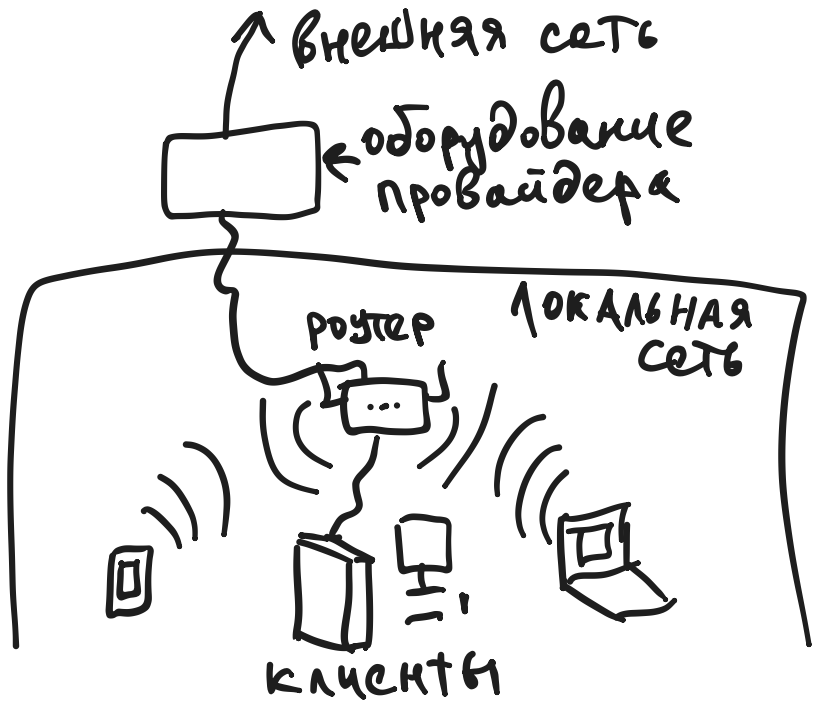
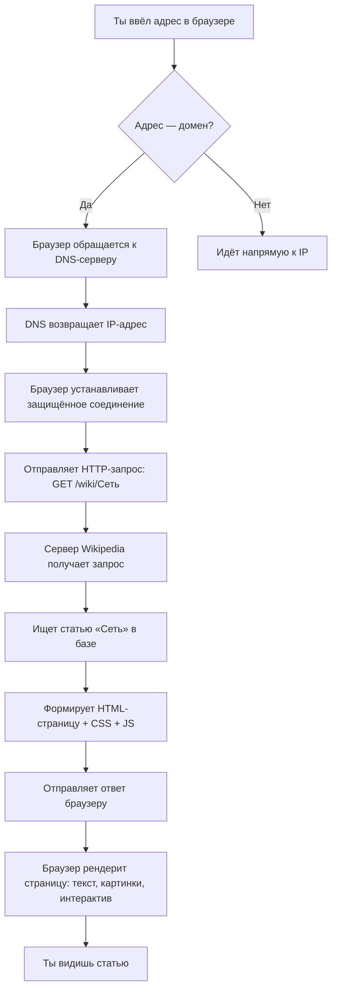

# Сеть

<div class="article-tags">
  <span class="tag tag-notrequired">НЕ ОБЯЗАТЕЛЬНО</span>
  <span class="tag tag-advanced">НЕ ДЛЯ НОВИЧКОВ</span>
</div>

<span class="complexity-badge">Родителям и детям</span>

## Сеть

Представим, что мы стоим в классе и хотим передать листок с вопросом другу, сидящему в другом конце. Мы кладём листок в конверт, пишем имя получателя и даём его однокласснику, который знает, как его доставить.  

В мире компьютеров всё работает похоже — только вместо конвертов, бумажек и одноклассников используются *сигналы*, *кабели* (или радиоволны), *адреса* и *протоколы* — правила, по которым все «договариваются», как передавать информацию.

  

Это и есть **сеть** — система, в которой устройства (компьютеры, телефоны, принтеры, умные лампочки) могут обмениваться данными. Давай разберёмся, как она устроена — от маленького класса до всей планеты.

---

### Локальная сеть

**Локальная сеть** (или **LAN**, от *Local Area Сеть*) — это сеть в небольшом месте: квартире, школе, офисе.  

Пример: у тебя дома есть Wi-Fi. К нему подключены ноутбук, телефон родителей, умная колонка и игровая приставка. Все они «видят» друг друга. Ты можешь с ноутбука напечатать документ и отправить его на принтер в соседней комнате — без интернета. Или передать фото с телефона на телевизор. Это возможно, потому что все устройства находятся в *одной локальной сети*.

Как это работает?  
- Есть **роутер** — главный «посредник». Он раздаёт интернет и помогает устройствам общаться между собой.  
- У каждого устройства в локальной сети есть **внутренний адрес**, например `192.168.1.5`. Это как номер парты в классе: «пятая парта» — понятно, о ком речь, но только *внутри* этого класса. За его пределами такой номер может быть и у кого-то ещё.

> 💡 Интересно: даже если отключить интернет, локальная сеть может работать. Например, два ноутбука, подключённые к одному роутеру без интернета, всё равно могут обмениваться файлами.

---

### Интернет

Если локальная сеть — это городок, то **интернет** — это *вся планета*, соединённая дорогами, железными путями и кабелями под океаном.  

Интернет — это **глобальная сеть сетей**. Тысячи, миллионы локальных сетей (домов, школ, компаний, дата-центров) соединены между собой через провайдеров — компаний, которые «продают» доступ к этим дорогам (как ЖД или авиакомпании продают билеты).

Чтобы попасть из своей локальной сети в другую (например, чтобы открыть YouTube), твой роутер отправляет запрос через провайдера, а тот — дальше, по цепочке, пока сигнал не дойдёт до сервера, где хранится YouTube. Это может занять доли секунды — сигнал летит почти со скоростью света.

---

### Браузер

Многие говорят: «Я зашёл в интернет через Chrome». Но это неточно. **Браузер** — это *программа*, которая умеет *показывать* веб-страницы. Как телевизор не создаёт передачи, а только принимает и отображает сигнал — так и браузер не *есть* интернет, а лишь *позволяет с ним взаимодействовать*.

#### Какие бывают браузеры?

| Название | Особенности |
|----------|-------------|
| **Google Chrome** | Быстрый, много расширений, «любит» аккаунты Google |
| **Mozilla Firefox** | Открытый код, уважает приватность, подходит для обучения |
| **Microsoft Edge** | Встроен в Windows, экономит заряд батареи на ноутбуках |
| **Safari** | Только на Apple-устройствах (Mac, iPhone), очень оптимизирован |
| **Yandex Browser** | Русскоязычный интерфейс, встроенный переводчик и блокировщик рекламы |

Все они делают одно и то же: получают данные с серверов и превращают их в то, что ты видишь — текст, картинки, видео.

---

### IP-адрес

Каждое устройство, подключённое к интернету, имеет **IP-адрес** (*Internet Protocol address*). Это уникальный числовой идентификатор, например:  
`142.250.185.206`

Это как полный почтовый адрес:  
`Россия, 125009, Москва, Тверская ул., д. 13`  
— только для компьютеров.

Но запомнить числа сложно. Поэтому придумали **DNS** (*Domain Name Система* — система доменных имён).

#### DNS

Когда ты вводишь `google.com`, браузер не знает, какой IP у Google. Он спрашивает у **DNS-сервера**:  
— Эй, у кого `google.com`?  
— У `142.250.185.206`, — отвечает справочник.

И только потом браузер идёт *по этому адресу*.

> 🔬 **Практический эксперимент: «Разгадай IP»**  
> 1. Открой **Командную строку** (Windows: нажми `Win + R`, введи `cmd`, Enter)  
> 2. Напиши:  
>    ```bash
>    ping google.com
>    ```  
>    Нажми Enter. Через пару секунд ты увидишь строки вроде:  
>    ```
>    Ответ от 142.250.185.206: число байт=32 время=28мс TTL=115
>    ```  
> 3. Скопируй этот IP (например, `142.250.185.206`)  
> 4. Перейди в браузер, в адресную строку вставь этот IP и нажми Enter.  
>   
> ✅ Что произойдёт? Откроется **Google**!  
>   
> Почему? Потому что IP — это *настоящий адрес сервера*. `google.com` — лишь его «имя в справочнике». Сервер один и тот же — просто ты позвал его по-разному.

⚠️ Важно: не все сайты так просто откроются по IP. Некоторые (особенно крупные) используют одну машину для *многих* сайтов — и тогда сервер смотрит, *какое имя* ты использовал (`site1.com` или `site2.com`), и выдаёт нужный сайт. Но у Google — отдельный IP для основного поиска, поэтому это работает.

---

### Электронная почта

**Электронная почта** (или **email**) — это сервис для отправки сообщений через интернет. У каждого email-адреса есть две части:  
`имя@домен.расширение`  
Например: `timur@example.com`

- `timur` — это *имя ящика* (как номер квартиры)  
- `example.com` — это *почтовый сервер*, который хранит ящик (как домофонная система, которая знает, где живёт «Тимур»)

#### Зачем она нужна?

- Регистрация на сайтах (см. ниже)  
- Обмен файлами (вложения)  
- Официальная переписка (школа, кружки, конкурсы)  
- Восстановление пароля («забыли пароль?» → письмо на почту)

#### Можно ли завести почту самому?

Да — но детям до 14 лет большинство сервисов (Gmail, Mail.ru, Яндекс.Почта) требуют согласия родителей. Это связано с законами о защите данных.  

✅ Что делать:  
- Попроси родителей помочь создать отдельную почту *для учёбы и проектов*.  
- Не используй почту, заведённую для игр, под соцсети — лучше иметь одну «рабочую», чистую.  
- Хорошие имена: `имя.фамилия@сервис`, `имя.цифра@сервис` (например, `timur.tagirov@gmail.com` или `timur2025@mail.ru`). Избегай «coolgamer666» — это несерьёзно для учебных целей.

---

### Регистрация и вход на сайты

Почти на каждом сайте есть две кнопки:  
🔹 **Зарегистрироваться**  
🔹 **Войти**

Это не «формальность» — это способ создать *личное пространство* внутри сайта.

#### Что происходит при регистрации?

1. Ты вводишь:  
   - **Имя пользователя** (логин) — как подпись под тетрадью  
   - **Пароль** — как замок на дневнике  
   - **Электронную почту** — как резервный ключ: если забудешь пароль, сайт пришлёт ссылку для сброса *на почту*  

2. Сайт создаёт твою **учётную запись** (*аккаунт*) — запись в своей базе данных:  
   `логин → пароль (в зашифрованном виде) → почта → дата регистрации`  

3. После этого ты можешь **войти**: ввести логин и пароль → сайт проверяет, совпадают ли они → если да — открывает *твой* профиль, настройки, сообщения.

> 🛡️ Почему пароль хранится *в зашифрованном виде*?  
> Даже администратор сайта **не может** прочитать твой пароль. В базе лежит не `qwerty123`, а нечто вроде `5e884898da28047151d0e56f8dc6292773603d0d6aabbdd62a11ef721d1542d8` (это *хеш* — результат математического преобразования). При входе сайт шифрует твой введённый пароль так же — и сравнивает хеши. Если совпали — ты тот, за кого себя выдаёшь.

#### Советы по паролям

- ❌ Не используй `123456`, `password`, `qwerty`, дату рождения, имя питомца.  
- ✅ Используй *фразу*: `Сний_Кот_Прыгает_На_Крышу!` — легко запомнить, сложно угадать.  
- 🔁 Меняй пароль, если сайт сообщал об утечке (редко, но бывает).  
- 📱 Включи **двухфакторную аутентификацию** (2FA), если сайт предлагает: после пароля потребуется код из приложения или SMS. Это как второй замок на двери.

> 📌 Важно: сайт *никогда* не спрашивает пароль по email или в мессенджере. Если пришло письмо «Ваш аккаунт заблокирован! Перейдите по ссылке и введите пароль», — это **фишинг**. Настоящий сайт так не делает.

---

### Настройка браузера

Браузер по умолчанию — как новая тетрадь в клетку: чистая, но не приспособленная под тебя. Его можно настроить — и это нормальная практика.

#### Основные настройки (на примере Chrome/Firefox/Edge):

| Настройка | Где найти | Зачем |
|-----------|-----------|-------|
| **Стартовая страница** | Настройки → При запуске | Чтобы сразу открывалась, например, Википедия или твой планировщик задач |
| **Поисковая система** | Настройки → Поиск | Можно выбрать не Google, а, скажем, [DuckDuckGo](https://duckduckgo.com) (не следит за запросами) |
| **Закладки (избранное)** | `Ctrl+D` (добавить), `Ctrl+Shift+B` (показать) | Сохраняй важные страницы — как закладки в книге |
| **Расширения** | Магазин расширений (Chrome Web Store и др.) | Например: Grammarly (проверка орфографии), Dark Reader (тёмная тема), uBlock Origin (блокировка рекламы) |
| **Приватность** | Настройки → Конфиденциальность | Можно отключить сохранение истории, куки третьих лиц, геолокацию |
| **Профиль** | Настройки → Управление профилями | Можно создать отдельный профиль «Для учёбы» и «Для игр» — с разными закладками и расширениями |

> ⚙️ Совет: раз в месяц заходи в `Настройки → Конфиденциальность → Очистить историю`. Выбери:  
> - **Кэш** — временные файлы (картинки, скрипты), чтобы страницы грузились свежими  
> - **Файлы cookie** — данные входа; если не удалять, сайты «помнит» тебя (удобно), но и отслеживают (опасно на чужом ПК)  

---

### Как работает запрос в браузере

Вот что происходит, когда ты вводишь `https://ru.wikipedia.org` и нажимаешь Enter:



🔹 **HTTP/HTTPS** — протоколы передачи гипертекста. `S` в HTTPS означает *Secure* — данные шифруются (замочек в адресной строке).  
🔹 **HTML/CSS/JS** — языки, на которых написана страница: структура, стиль, поведение.  
🔹 **Рендеринг** — превращение кода в то, что ты видишь.

---