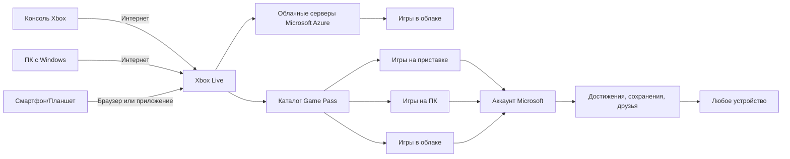

# Xbox

  НЕ ОБЯЗАТЕЛЬНО
  НЕ ДЛЯ НОВИЧКОВ

Родителям и детям

## Xbox

Представь себе: у тебя есть книга, в которой можно *входить внутрь* — становиться капитаном корабля, гонщиком на суперкаре, исследователем далёких планет или даже спасать целую галактику от захватчиков. Это **видеоигра**. А чтобы в неё играть на большом экране телевизора, удобно сидя на диване, с друзьями рядом или онлайн — нужна **игровая приставка**. Одна из самых известных и мощных приставок в мире — **Xbox**.

Xbox — это целая **экосистема**: консоль (железо), онлайн-сервисы, игры и сообщество миллионов игроков по всему миру. И самое главное — Xbox старается быть *доступным*, *дружелюбным* и *гибким*. Ты можешь играть на приставке у себя дома, на ноутбуке в школе (ну, в перерыве 😊), или даже на планшете в дороге — если есть интернет.

---

### Краткая история: от Microsoft до галактики и обратно

Xbox появился не сразу. В конце 1990-х почти все игровые консоли делали компании, специализирующиеся только на играх — например, Sony (PlayStation) и Nintendo. А Microsoft, которая к тому времени уже создала операционную систему Windows и программу Word, решила: *«Почему бы и нам не попробовать?»*.

Первый Xbox вышел в **2001 году**. У него было мощное «сердце» — процессор и видеокарта, сравнимые с хорошим домашним компьютером того времени. Главной «фишкой» стала игра **Halo: Combat Evolved** — она не просто продавалась вместе с приставкой, она *стала причиной*, по которой миллионы людей купили Xbox. Благодаря Halo, Xbox мгновенно вошёл в историю.

С тех пор вышло уже несколько поколений Xbox:

| Поколение | Год выпуска | Примечание |
|-----------|-------------|------------|
| Xbox (оригинал) | 2001 | Первый шаг Microsoft в игры |
| Xbox 360 | 2005 | Ввёл онлайн-сервис Xbox Live, стал культовым |
| Xbox One | 2013 | Акцент на мультимедиа и «умный дом» |
| Xbox Series X|S | 2020 | Самые мощные консоли Microsoft на сегодня |

> 📝 **Интересный факт**: название *Xbox* — это сокращение от *DirectX Box*. DirectX — это набор программных инструментов от Microsoft, без которых почти не обходится ни одна компьютерная игра под Windows. То есть Xbox изначально задумывался как «коробка, которая умеет играть в игры для ПК».

---

### Главное достоинство Xbox сегодня: Game Pass

Если бы Xbox можно было описать двумя словами — это **Game Pass**.

Представь **библиотеку**, в которой *игры*. И ты можешь брать из неё сколько угодно: сегодня — гонки, завтра — космический симулятор, послезавтра — головоломку с динозаврами. Не нужно покупать каждую игру отдельно — достаточно подписаться на Game Pass, и всё это становится доступно за фиксированную ежемесячную плату (как Netflix, но для игр).

Game Pass бывает нескольких видов:

- **Game Pass Console** — только для игр на Xbox-приставке.  
- **PC Game Pass** — только для игр на компьютере (Windows).  
- **Game Pass Ultimate** — *всё вместе*: и приставка, и ПК, *плюс* онлайн-мультиплеер (Xbox Live Gold), *плюс* облачный гейминг (можно играть даже на смартфоне через браузер!).

> 💡 **Почему это важно?**  
> Раньше, чтобы попробовать игру, приходилось купить её — а вдруг она тебе не понравится? Или она стоит дорого. Game Pass снимает этот страх. Ты *экспериментируешь свободно*. Игры добавляются и уходят из каталога, но пока они там — ты можешь играть сколько хочешь. А самые свежие хиты от Microsoft (например, *Starfield* или *Forza Motorsport*) появляются в Game Pass *в день релиза* — без доплаты.

---

### Xbox = ПК + приставка: как это работает?

Xbox и Windows — как братья. Обе системы используют одну и ту же базу: процессоры от AMD, графические технологии DirectX, облачные сервисы Azure. Поэтому игры, созданные для Xbox, часто легко переносятся на ПК — и наоборот.

Это даёт три больших преимущества:

1. **Единый аккаунт**  
   Один логин Microsoft — и ты везде: на Xbox, в Windows, в браузере, в приложениях. Все достижения (трофеи), сохранения, друзья — синхронизируются автоматически.

2. **Кроссплатформенный мультиплеер**  
   Ты играешь в *Minecraft* на Xbox, а твой друг — на iPad или на школьном ноутбуке с Windows. И вы — в одной команде. Это называется *cross-play* («кросс-плей»), и Xbox активно его поддерживает.

3. **Облачные игры (Xbox Cloud Gaming)**  
   Если у тебя нет мощного ПК или даже приставки — не беда. Заходишь на сайт [xbox.com/play](https://www.xbox.com/play) (или в приложение Xbox), выбираешь игру — и она *запускается на серверах Microsoft*, а тебе передаётся только картинка и звук, как на YouTube. Управление — с геймпада, телефона или даже клавиатуры. Правда, нужен хороший интернет (минимум 10 Мбит/с, лучше — 20+).

---

### Кто такой Мастер Чиф? Или: как солдат в зелёной броне спас галактику

> 🎮 *«Wake up, Master Chief…»*  
> («Проснитесь, Мастер Чиф…») — эти слова слышали миллионы.

**Мастер Чиф** — главное действующее лицо серии игр **Halo**. Его полное имя — **Джон-117**, но почти все зовут его просто *Чиф*. Он — **спартанец**, сверхсолдат, прошедший тяжелейшую подготовку и усиленный биоинженерией. Его броня — зелёный скафандр MJOLNIR, почти неуязвимый, оснащённый ИИ по имени **Кортана**.

Что делает Чиф?  
— Защищает человечество от пришельцев-фанатиков **Ковенанта**,  
— Борется с опасными паразитами **Флуд**,  
— Исследует древние кольцевые мегаструктуры — **Хало** (в честь них и названа серия),  
— Принимает решения, от которых зависит судьба целых цивилизаций.

Но главное — он молчалив. Он не произносит длинных речей. Он *действует*. И в этом — его сила как персонажа: игрок сам *становится* Чифом. Его взгляд — наш взгляд. Его выбор — наш выбор.

> 📚 **Halo как явление**:  
> Halo не просто игра — это целая вселенная: книги, комиксы, сериалы (например, на Paramount+), аниме. В 2021 году вышла игра *Halo Infinite* — она бесплатна в мультиплеере, и её можно запустить даже без Game Pass. Это подарок новому поколению игроков.

---

### Forza Horizon: почему каждому иксбоксеру стоит прокатиться

Если Halo — это «космическая одиссея», то **Forza Horizon** — это «праздник скорости под открытым небом».

Это серия *аркадных автогонок*. Действие происходит в открытом мире: сначала — в вымышленном штате Колорадо (Horizon 1), потом в Италии и Франции (Horizon 2), Великобритании (Horizon 3), Мексике (Horizon 4), США (Horizon 5)… Каждая часть — это *живой фестиваль музыки, машин и приключений*.

Что делает Forza Horizon особенной?

✅ **Настоящие машины** — от классического «Запорожца» до гиперкара Bugatti Chiron. Каждая воссоздана с миллиметровой точностью: звук мотора, вес, управляемость — всё как в жизни (но без штрафов за превышение 😄).  
✅ **Динамическая погода и время суток** — внезапный ливень, рассвет над вулканом, снежная буря в горах…  
✅ **Фестиваль Horizon** — в игре проходит музыкальный фестиваль. Ты приезжаешь туда на своей машине, участвуешь в гонках, трюках, конкурсах.  
✅ **Свобода** — хочешь — гоняй по шоссе. Хочешь — прыгай на джипе через кактусы в пустыне. Хочешь — включи радио и просто катайся, слушая музыку.

> 🌟 **Forza Horizon 5** (2021) — особенно хороша. В ней — Мексика: джунгли, вулканы, древние руины, пляжи, мегаполисы… И каждую неделю — новые события, машины, задания.  
> А ещё — **режим «Выживание»**, где ты управляешь *не машиной*, а… *самолётом*, *вертолётом*, *трактором* или даже *тюбингом* (надувным кругом по склону)!  

💡 Совет: Forza Horizon отлично подходит для *совместной игры*. Один за рулём, второй — штурман или… просто громко кричит «ТОРМОЗИ!!!».

---

### Как устроен Xbox «изнутри»? Схема

Вот как взаимодействуют основные компоненты экосистемы Xbox — от железа до облака:

> Пояснение:  
> — Всё начинается с **аккаунта Microsoft** — он как «ключ от замка».  
> — **Game Pass** — это *услуга*: доступ к играм.  
> — Одна и та же игра может быть запущена тремя способами — с диска, из загрузки на устройство, или потоком из облака.  
> — Сохранения и достижения хранятся **в облаке**, поэтому ты можешь начать игру дома на Xbox, а продолжить в школе на ноутбуке — и ничего не потеряешь.

---