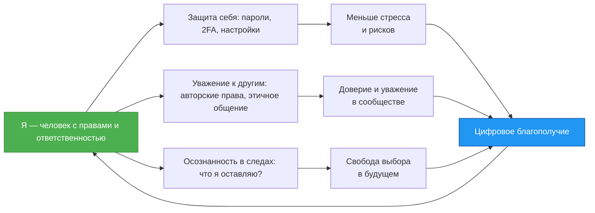

# Цифровая гигиена

  НЕ ОБЯЗАТЕЛЬНО
  НЕ ДЛЯ НОВИЧКОВ

Родителям и детям

## Цифровая гигиена

Представь себе, что интернет — это настоящий *город*. В нём есть улицы (сайты), дома (аккаунты), парки (игровые площадки), школы (онлайн-курсы), магазины (маркетплейсы), библиотеки (базы знаний), а также люди: друзья, учителя, продавцы, прохожие — и, к сожалению, иногда хулиганы или мошенники.

Ты в этом городе не гость. Ты — *житель*. И как любой житель, ты имеешь права: право на безопасность, на приватность, на уважение. Но у тебя также есть обязанности: не мусорить, не ломать чужое, не шуметь в ночное время, не подглядывать в окна. В реальном городе за этим следят родители, учителя, полиция, соседи. В цифровом городе — *ты сам*, с помощью знаний и привычек.

Эти знания и привычки и называются **цифровой гигиеной**.

> **Цифровая гигиена** — это система повседневных действий и решений, которые помогают тебе оставаться в безопасности, сохранять личные границы, уважать других и оставлять в мире цифровых технологий только те следы, которые ты *сам* считаешь нужным оставить.

Обрати внимание: *гигиена*. Это слово пришло к нам из медицины. Чистить зубы — это гигиена рта. Мыть руки перед едой — гигиена тела. Цифровая гигиена — это такая же *регулярная и автоматическая забота* о себе и окружающих, только в цифровой среде.

Она состоит из трёх взаимосвязанных частей:

1. **Защита себя** — пароли, настройки конфиденциальности, распознавание обмана.  
2. **Уважение к другим** — авторские права, этичное общение, недопущение кибербуллинга.  
3. **Осознанность в следах** — понимание, что почти всё, что ты делаешь онлайн, где-то сохраняется, и это может повлиять на тебя завтра, через год или через десять лет.

Давай рассмотрим каждую часть подробно — но как историю, в которой *ты* — главный герой, принимающий решения.

---

### Ты — не «пользователь». Ты — *человек с идентичностью*

Когда ты заходишь в соцсеть, игру или почту, система «видит» тебя через **цифровую идентичность** — набор данных, который собирается о тебе:  
- что ты искал в поисковике,  
- какие видео смотрел,  
- с кем переписывался,  
- где был (если разрешил геолокацию),  
- даже *сколько времени* ты смотрел на определённую кнопку.

Это не обязательно «плохо». Например, если ты часто ищешь видео по рисованию, YouTube может предлагать тебе новые уроки — и это удобно. Но если кто-то соберёт *слишком много* таких данных, он сможет предсказать:  
- чем ты интересуешься,  
- когда ты бываешь дома,  
- что тебя расстраивает или радует,  
- какие решения ты, скорее всего, примешь.

Представь: это как если бы незнакомец стоял за твоей спиной и записывал всё, что ты читаешь, говоришь, рисуешь — *без твоего согласия*. Неприятно? Да. А ведь в цифровом мире такое возможно — если ты не знаешь, как защищаться.

**Первый принцип цифровой гигиены**:  
> *Если сервис или приложение просит доступ — всегда спрашивай: «Зачем ему это?»*  
> — Зачем фонарику на телефоне нужен доступ к моим контактам?  
> — Зачем игре знать моё точное местоположение?  
> — Зачем приложению для рисования читать мои SMS?

Если ответа нет — скорее всего, за этим стоит сбор данных. И тогда у тебя есть выбор:  
- отказать в доступе (часто это не ломает функционал),  
- поискать альтернативу (есть приложения, которые не следят),  
- использовать сервис без регистрации (например, открытые библиотеки или offline-программы).

---

### Пароль — это не «ключ от двери». Это *условный сигнал доверия*

Многие думают: «Мой пароль никто не угадает — я написал дату рождения собаки плюс восклицательный знак». Но современные программы могут перебрать *миллиарды* комбинаций за минуту. А если сайт, где ты зарегистрировся, будет взломан — твой пароль окажется в открытом списке, и его попробуют ввести на *других* сайтах (например, в почту или банк).

Вот как строится надёжная защита:

| Уровень | Что делать | Почему |
|--------|------------|--------|
| **1. Уникальность** | Для *каждого* аккаунта — свой пароль. Никаких `Timur123` везде. | Если один сайт украдёт пароль — остальные останутся в безопасности. |
| **2. Сложность** | Длина важнее «сложных символов». Лучше фраза: `синий_кит_пьёт_чай_в_среду` — чем `Tr7#mK!`. | Такой пароль долго подбирать, но легко запомнить. |
| **3. Хранение** | Никогда не пиши пароли на листочке или в заметках без шифрования. Используй *менеджер паролей* (например, Bitwarden — бесплатный и открытый). | Он сохранит всё зашифрованным и автозаполнит при входе. Ты запоминаешь *один* мастер-пароль — а он — сотни. |

> 💡 **Задача 1 (8–10 лет)**  
> Придумай три *надёжных* пароля-фразы на темы: «космос», «животные», «школа». Каждый должен быть не короче 4 слов. Проверь: можно ли их легко вспомнить? Можно ли их спеть?  
>   
> 💡 **Задача 2 (11–16 лет)**  
> Установи Bitwarden (bitwarden.com), создай учётную запись, сохрани в нём три тестовых пароля (например, для фейковых аккаунтов `test1@example.com`). Настрой автозаполнение в браузере. Напиши, сколько времени это заняло и что показалось сложным.

---

### Цифровой след: всё, что ты оставляешь — остаётся *где-то*

Когда ты что-то публикуешь — фото, комментарий, лайк — ты думаешь: «Это же просто для друзей». Но:
- Даже удалённое сообщение мог скопировать кто-то другой.  
- Серверы хранят логи: кто, когда, откуда заходил.  
- Поисковые системы индексируют почти всё.  
- Иногда государственные органы или суды могут запросить эти данные.

Это не повод бояться — это повод **думать на шаг вперёд**.

> **Вопрос перед публикацией**:  
> *«Буду ли я гордиться этим через 5 лет? Не поставит ли это в неловкое положение меня или кого-то другого?»*

Цифровой след — как следы на снегу. Даже если ты их «замёл», опытный следопыт может их восстановить. Но ты можешь *сам* решать, какие следы оставлять:  
- След любознательного исследователя (твои проекты на GitHub, статьи в блоге),  
- След доброго друга (поддержка в комментариях, помощь в чатах),  
- След творца (музыка, рисунки, код).

А вот следы злости, насмешек, плагиата — их трудно стереть. Они могут повлиять на приём в университет, на работу, на репутацию.

---

### Авторские права

Многие думают: «Картинка в Google — значит, она свободная». Это ошибка.

> **Авторское право возникает автоматически** — в момент создания произведения: рисунка, текста, кода, музыки. Не нужно «регистрировать» — оно уже *есть*.

Это **система уважения труда**. Представь: ты потратил неделю на рисунок, а кто-то просто скопировал его и выдал за свой — и получил за это лайки, славу, даже деньги. Справедливо?

Вот как поступать правильно:

| Что хочешь использовать | Как поступить |
|------------------------|---------------|
| Фото из Google | Найди источник. Если не указано `CC0` (общественное достояние) или `CC BY` (можно с указанием автора) — *не бери*. Используй сайты: [Pixabay](https://pixabay.com/), [Unsplash](https://unsplash.com/), [Wikimedia Commons](https://commons.wikimedia.org/). |
| Музыка в видео | Ищи треки с лицензией `Creative Commons`. Например, на [Free Music Archive](https://freemusicarchive.org/). Или создай свою — даже в простом приложении типа BandLab. |
| Код из интернета | Если это открытый проект (например, на GitHub), посмотри файл `LICENSE`. Если нет лицензии — автор *не разрешил* использование. Скопировать — значит украсть труд. |
| Пересказ идеи | Это *можно* — если ты *переформулируешь* своими словами и укажешь, где об этом впервые прочитал (это называется *цитирование*). |

> 💡 **Задача 3 (все возрасты)**  
> Найди в интернете изображение кота. Попробуй определить: кому оно принадлежит? Есть ли лицензия? Как ты это понял? Сравни три разных сайта: Google Images, Pixabay, Wikimedia Commons — чем они отличаются по информации о правах?

---

### Конфиденциальность

Конфиденциальность — **контроль**: *кто* имеет право знать *что* и *зачем*.

Например:  
- Ты можешь рассказать другу, что расстроился, но не хочешь, чтобы об этом узнал весь класс.  
- Ты готов показать проект учителю, но не хочешь, чтобы его скачали и выдали за свой.  
- Ты разрешаешь маме видеть твои оценки в электронном дневнике, но не хочешь, чтобы они публиковались в соцсети.

**Инструменты контроля**:
- Настройки приватности в соцсетях («Кто видит мои посты?»)  
- Шифрование переписки (Signal, Telegram *в секретных чатах*)  
- Двухфакторная аутентификация (2FA) — когда для входа нужен не только пароль, но и код из приложения  
- Использование *никнеймов*, если не хочешь раскрывать настоящее имя

> **Правило**:  
> *Чем личнее информация — тем меньше круг тех, кому ты её даёшь. И чем больше выгода *не тебе*, а *им* — тем выше риск.*

---

### Цифровая этика: как быть хорошим жителем цифрового города

Этика — это не «правила от взрослых». Это **соглашение между людьми**, чтобы всем было комфортно жить вместе.

В цифровом мире оно проявляется так:

- **Не кибербулли** — даже если ты злишься, не публикуй оскорбления. Лучше выключи устройство и поговори с кем-то вживую.  
- **Не распространяй слухи** — перед тем как переслать «страшную новость», проверь: есть ли источник? Проверено ли это?  
- **Помогай** — если видишь, что кто-то в чате не понимает, как что-то сделать — объясни. Ты когда-то тоже не знал.  
- **Признавай ошибки** — если ты что-то написал резко, и тебе указали на это — извинись. Это не слабость. Это сила.

---

### Цифровая гигиена — как цикл заботы

> **Как читать схему**:  
> Всё начинается с понимания: *я — субъект*. Из этого вытекают три направления заботы. Их результат — *цифровое благополучие*: когда ты чувствуешь себя свободно, безопасно и с достоинством. И это возвращает тебя к исходной точке — к осознанному выбору.

---

### Стуации, в которые попадают почти все — и как из них выходить с достоинством  

#### Стуация 1. «Бесплатная раздача»: новая игра, скин, промокод, подписка

Ты видишь пост: *«Бесплатно выдаём 1000 Robux! Жми сюда → [ссылка]»*.  
Это не просто обман. Это **инженерия доверия** — когда злоумышленники используют то, что тебе *действительно интересно*, чтобы заставить нарушить правило.

🔬 **Как это работает**:
1. Ты переходишь по ссылке — попадаешь на сайт, похожий на официальный (тот же логотип, те же кнопки).  
2. Тебя просят «подтвердить аккаунт»: ввести логин и пароль от Roblox/Instagram/Steam.  
3. Данные уходят к мошенникам.  
4. Через минуту твой аккаунт уже не твой.

⚠️ **Ключевой признак**:  
> *Официальные компании **никогда** не просят вводить пароль вне своего сайта.*  
Никогда. Ни через Telegram-бота. Ни через «форму регистрации». Ни через «проверку возраста».

✅ **Что делать**:
- Посмотри адресную строку: начинается ли она с `https://www.roblox.com/`? Если нет — закрой.  
- Наведи курсор на кнопку *до клика* — внизу браузера покажется настоящая ссылка. Если там `bit.ly/xyz` или `roblox-free.gift` — это подделка.  
- Спроси у взрослого: «Ты слышал про такую раздачу?»  
- Сообщи о фейке в самой соцсети (есть кнопка «Пожаловаться → Мошенничество»).

> 💡 **Задача 4 (8–12 лет)**  
> Нарисуй «знаки опасности»: что должно всплыть в голове, если ты видишь «бесплатный Fortnite V-Bucks»? (Например: *«Почему им не жалко?», «Где кнопка “О компании”?», «Почему нет отзыва от друзей?»*). Составь 5 таких вопросов-сигналов.

> 💡 **Задача 5 (13–16 лет)**  
> Найди в Google фразу `site:roblox.com free robux`. Посмотри результаты. Что общего у официальных страниц? Как они отличаются от фейковых (например, тех, что в рекламе выше)? Напиши краткий гид «Как не попасться на Robux-раздачу».

---

#### Стуация 2. «Срочно! Тебя взломали!» — паника как инструмент  

Ты получаешь SMS:  
> *«Ваш аккаунт ВКонтакте заблокирован. Войдите здесь для восстановления: vkontakte-help.ru»*  

Или письмо:  
> *«Google обнаружил подозрительную активность. Подтвердите личность: google-secure[.]net/login»*

Это — **фишинг** (от англ. *phishing* — «рыбная ловля»). Тебя не крадут — тебя *ловят*, используя страх.

🧠 **Почему срабатывает?**  
Потому что мозг в стрессе переключается в режим «быстро действовать». А злоумышленники *имитируют экстренность*: красные кнопки, восклицательные знаки, слова «последнее предупреждение».

✅ **Как не поддаться**:
1. **Остановись**. Сделай паузу — 30 секунд. Выдохни.  
2. **Не кликай**. Открой официальное приложение *вручную* — из меню телефона или закладок. Зайди туда — если всё работает, значит, угрозы нет.  
3. **Проверь отправителя**:  
   - Настоящие уведомления от Google/VK приходят *внутри приложения* или на почту, привязанную к аккаунту.  
   - Номер SMS — не короткий (например, 7777), а обычный, часто заграничный.  
   - Адрес письма — `support@vkontakte-help.ru` (подделка!).

📌 Золотое правило:  
> *Если тебя просят срочно ввести пароль, код, номер карты — это почти наверняка обман. Настоящие сервисы **никогда** не запрашивают такие данные по ссылке из письма или SMS.*

---

#### Стуация 3. «Просто перешли — не удалят аккаунт»  

Ты видишь в чате:  
> *«Если не перешлёшь это сообщение 10 друзьям в течение 5 минут — твой аккаунт в TikTok заблокируют»*  

Это — **манипуляция через страх и стыд**.  
Цель — заставить *распространить ложь*. Чем больше пересылок — тем «правдоподобнее» кажется угроза.

🔍 Почему это невозможно?  
- TikTok (и любая крупная соцсеть) **не может** удалить аккаунт из-за того, что ты *не переслал сообщение*. У них нет такой функции.  
- Блокировка происходит только за нарушения правил (оскорбления, порнография, боты) — и всегда с уведомлением *внутри приложения*.

✅ Что делать:
- Не пересылай.  
- Напиши в чат: *«Это фейк. TikTok так не делает. Давайте не пугать друг друга»*.  
- Если в чате настаивают — выйди из чата и сообщи модераторам.

> 💡 **Задача 6 (все возраста)**  
> Придумай «анти-страшилку» — добрую версию такой же механики. Например:  
> *«Если перешлёшь это сообщение 5 друзьям — мы соберём 10 000 ₽ на приют для животных (проверенный сбор на Добро Mail.Ru)»*.  
> Обсуди: почему такая версия *призыв к действию*? Чем она отличается от манипуляции?

---

### Как управлять настройками приватности — пошагово  

Давай разберём три самых популярных у детей/подростков платформы: **Telegram**, **VK**, **Roblox**.  
Важно: настройки меняются, но *принципы* остаются. Мы учим *как думать*.

#### Telegram  
> Цель: чтобы незнакомцы не видели твой номер, не добавляли в чаты без спроса, не сохраняли твои фото.

| Что настроить | Как | Зачем |
|--------------|-----|-------|
| **Кто видит номер телефона** | Настройки → Конфиденциальность → Номер телефона → «Никто» или «Мои контакты» | Чтобы не получить спам или звонки от мошенников |
| **Кто может добавлять в группы/каналы** | Конфиденциальность → Группы и каналы → «Контакты» или «Никто» | Чтобы не втянули в нежелательный чат |
| **Кто видит «последнее посещение»** | Конфиденциальность → Последнее посещение → «Никто» (или «Контакты») | Чтобы не выдавалось, когда ты онлайн (и не ловили в момент слабости) |
| **Автосохранение медиа** | Настройки → Данные и хранилище → Автозагрузка → Отключи для «Чатов с незнакомцами» | Чтобы не засорялась память и не сохранялись нежелательные фото |

💡 Совет: включите **секретные чаты** для переписки с близкими друзьями. Там:  
- Сообщения не хранятся на серверах,  
- Можно поставить таймер удаления (например, 1 минута после прочтения),  
- Нельзя сделать скриншот (на iOS/Android будет уведомление).

---

#### VK (ВКонтакте) 

> Цель: чтобы посты, фото, список друзей не видели все подряд.

| Что настроить | Как (2025, актуально) | Зачем |
|--------------|------------------------|-------|
| **Кто видит мои записи** | Настройки → Приватность → Записи на стене → «Только друзья» | Чтобы личные мысли не читали одноклассники или учителя без приглашения |
| **Кто может комментировать** | Там же → Комментарии к записям → «Друзья» | Чтобы не писали анонимные оскорбления |
| **Скрыть «онлайн»** | Настройки → Приватность → Информация обо мне → Статус «онлайн» → «Только я» | Чтобы не создавать давление «ты же онлайн — почему не отвечаешь?» |
| **Кто видит, кого я добавил в друзья** | Приватность → Друзья → «Только я» | Чтобы не знали твой круг общения |

📌 Важно: если ты публикуешь что-то **в группе**, настройки приватности *личного профиля* не работают. В группе могут видеть все подписчики — даже незнакомцы. Поэтому:  
- Не пости в открытые группы то, что не хочешь видеть в поиске через 5 лет.  
- Используй «Закрытые группы» для проектов с друзьями.

---

#### Roblox  

> Цель: чтобы незнакомцы не писали тебе, не приглашали в подозрительные игры, не видели имя.

Roblox ориентирован на детей, и у него **строгие настройки по умолчанию для пользователей до 13 лет**. Но после 13 — многое открывается. Проверь!

| Что проверить | Где (в приложении Roblox) | Что выбрать |
|--------------|---------------------------|-------------|
| **Контакты** | Настройки → Конфиденциальность → Контакты | «Никто» (если младше 16) или «Друзья» |
| **Чат и сообщения** | Там же → Чат | «Друзья» или «Никто» — особенно если ты в играх часто |
| **Имя пользователя в чате** | Настройки → Аккаунт → Имя отображения | Не используй настоящее имя. Лучше ник: `SpacePanda_2025` |
| **Игры с чатом** | Перед входом в игру → нажми «i» → посмотри «Рейтинг» | Избегай игр с рейтингом 13+ и открытым чатом, если не уверен в модерации |

💡 Совет: включи **режим родительского контроля**, даже если тебе 15+. Он позволяет:  
- Ограничивать время в день,  
- Блокировать покупки,  
- Запрещать чат с незнакомцами.  
Это *инструмент саморегуляции*, как будильник.

---

### Цифровой след в действии: как проверить, что «видно» о тебе  

Попробуем *взглянуть на себя глазами другого человека*.

#### Упражнение: «Поиск в Google — как будто ты чужой»  
1. Выйди из всех аккаунтов (Google, Яндекс).  
2. Открой браузер в режиме инкогнито (Ctrl+Shift+N).  
3. Введи в поиск:  
   - своё имя и фамилию в кавычках: `"Тимур Тагиров"`  
   - никнейм: `SpacePanda_2025`  
   - школа + класс: `"школа 179 8Б"`  
4. Посмотри: что находится?  
   - Публичные посты?  
   - Фото с мероприятий?  
   - Комментарии в новостях?  
   - Упоминания в школьных сайтах?

Если нашлось что-то, что ты не хочешь видеть — есть два пути:  
- **Запросить удаление** (например, через форму Google: [support.google.com/websearch/answer/7536321](https://support.google.com/websearch/answer/7536321))  
- **«Замаскировать»** — опубликовать больше *положительного контента* (статья в школьном блоге, проект на GitHub, рисунок в открытом альбоме), чтобы он «вытеснил» старое в поиске.

> Это называется **поисковая репутация** — и ею можно управлять.

---

### Цифровой след во времени: как данные «живут» после тебя  

Когда ты удаляешь пост, фото или сообщение, создаётся ощущение, что оно *исчезло*. Но в цифровом мире «исчезновение» — понятие условное.

Давайте разберём, что происходит «под капотом».

#### Этапы жизни цифрового следа

| Этап | Что происходит | Пример | Можно ли удалить полностью? |
|------|----------------|--------|------------------------------|
| **1. Создание** | Ты публикуешь пост, отправляешь сообщение, скачиваешь файл. | Пост в VK: «Сегодня получил двойку…» | Да — пока не отправил. |
| **2. Хранение на сервере** | Данные сохраняются на дисках компании (Google, VK, Telegram). | Сервер VK дублирует пост в трёх дата-центрах. | Да — при удалении *ты* просишь сервер стереть запись. Но… |
| **3. Резервное копирование** | Серверы делают бэкапы (на случай аварии) — ежедневно, еженедельно, ежемесячно. | Бэкап от 5 мая хранится 90 дней. | Нет — пока срок хранения бэкапа не истечёт. |
| **4. Кэширование** | Поисковики (Google, Яндекс) делают «снимки» страниц — чтобы быстрее показывать. | Google сохранил твой пост в кэше 5 дней назад. | Можно запросить удаление из кэша (но не мгновенно). |
| **5. Копирование другими** | Кто-то сделал скриншот, сохранил в архив, переслал. | Друг отправил скрин твоего поста в закрытый чат. | Нет — ты не контролируешь чужие устройства. |

📌 **Вывод**:  
> *Удаление — это просьба «перестать показывать», а не «стереть из истории».*  
> Поэтому ключевой навык — **думать до публикации**.

---

#### Что такое «удаление» на самом деле?  

Когда ты жмёшь «Удалить» в Instagram:  
- Фото исчезает из ленты *для новых посетителей*,  
- Но оно может оставаться в:  
  - Базе данных Meta (до 90 дней в бэкапах),  
  - Кэше Google,  
  - У друзей, которые его сохранили,  
  - Архивах типа Wayback Machine (если страница была проиндексирована).

Аналогия:  
> Представь, что ты написал записку, отдал её другу, а потом сказал: «Забудь».  
> Он может уничтожить записку — но если он уже пересказал содержание третьему человеку, ты не можешь стереть *его память*.

---

#### Можно ли «стереть след полностью»?  

Технически — **нет**, если данные уже вышли за пределы твоего контроля.  
Но практически — **да**, если действовать быстро и грамотно.

##### Стратегия «Цифрового выведения следа»:

1. **Удали оригинал** — как можно быстрее.  
2. **Запроси удаление из кэша**:  
   - Google: [google.com/webmasters/tools/removals](https://search.google.com/search-console/remove-outdated-content)  
   - Яндекс: [yandex.ru/support/webmaster/controlling-robot/removing-documents.html](https://yandex.ru/support/webmaster/controlling-robot/removing-documents.html)  
3. **Обратись к тому, кто распространил**: вежливо попроси удалить (часто помогает).  
4. **Замести след**: опубликуй *новый*, позитивный контент с теми же ключевыми словами — он постепенно заменит старое в поиске.

> Это как посадить деревья на месте старой свалки: мусор под землёй остаётся, но сверху — лес.

---