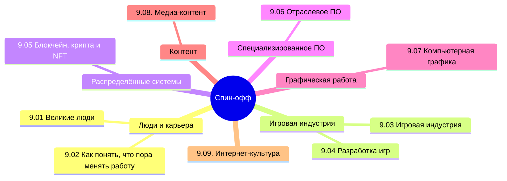

---
id: spinoff
title: 9. Спин-офф - о разделе
sidebar_label: 9. Спин-офф - о разделе
slug: /encyclopedia/Спин-офф/spinoff

---

  ОБЯЗАТЕЛЬНО
  ДЛЯ НОВИЧКОВ
  В РАЗРАБОТКЕ

import DocCardList from '@theme/DocCardList';

## О разделе

<DocCardList />

Что ж, я думаю, это финальная книга из цикла, которая не является обязательной, но может быть интересной для энтузиастов, к тому же может существенно повысить знания. Здесь включено всё то, что не вошло в другие книги из-за своих спецификаций.

---