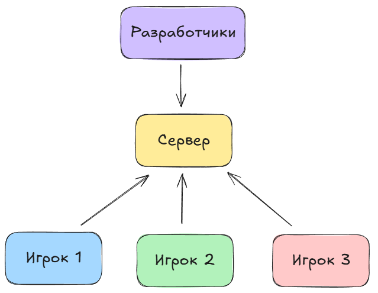
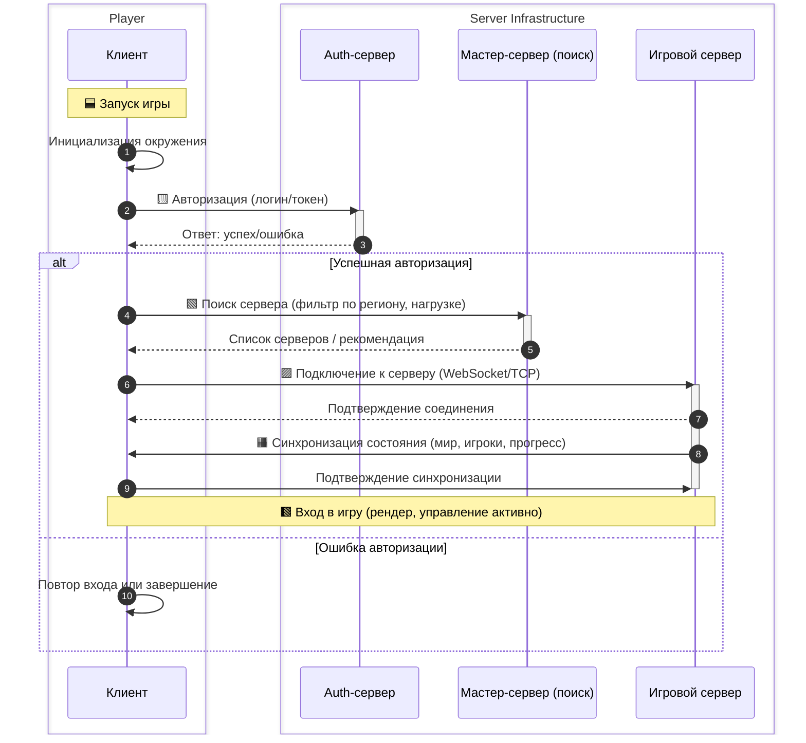
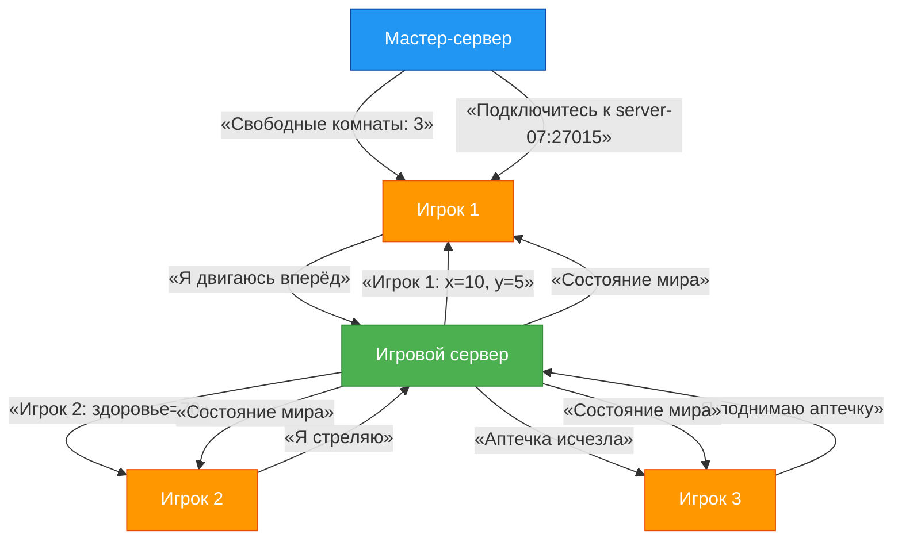

---
title: 9.02. Онлайн
---

# 9.02. Онлайн

<div class="article-tags">
  <span class="tag tag-beginner">ДЛЯ ДЕТЕЙ</span>
  <span class="tag tag-required">ОБЯЗАТЕЛЬНО</span>
</div>
<span class="complexity-badge">Родителям и детям</span>

```
Что такое онлайн
Сервер, разработчики и другие игроки
Как происходит подключение игрока к серверу
Где находятся сервера
Если сервера далеко то будет высокий пинг и задержка
Как придумывать логин и каких правил придерживаться
Что такое лобби и игровая сессия
Основы этики: читы, фэйрплей, токсичность
Добавить mermaid схему
Добавить задачи
```

### Как компьютеры играют вместе

Когда ты играешь в одиночную игру — например, решаешь головоломки, спасаешь принцессу или строишь город — весь мир игры живёт только на твоём устройстве: в компьютере, планшете или консоли. Но что, если хочется не просто играть *самому*, а *вместе* с другими? Чтобы соперник не был просто программой, а настоящим человеком, который тоже думает, ошибается, радуется победе и расстраивается от поражения? Тогда на сцену выходит **онлайн-игра**.

> **Онлайн** — это не просто «интернет включён». Это особое состояние взаимодействия, при котором твоё устройство *непрерывно обменивается информацией* с другими устройствами через сеть. В играх онлайн-режим позволяет многим игрокам участвовать в одном и том же игровом мире *одновременно*, как будто они находятся в одной комнате — только вместо дверей и окон здесь работают кабели, радиоволны и серверы.

Давай разберёмся, как это устроено — шаг за шагом.

---

### Кто участвует в онлайн-игре?

В любой онлайн-игре есть три главных участника:

1. **Ты** — игрок, который запускает игру на своём устройстве.
2. **Другие игроки** — люди по всему миру, которые тоже подключились к одной и той же игре.
3. **Сервер** — мощный компьютер (или группа компьютеров), который *координирует* всё, что происходит в игре.



Представь, что вы с друзьями играете в прятки во дворе. Кто решает, кто водит? Кто следит, чтобы никто не подглядывал? Кто объявляет: «Раз, два, три — можно!»? Обычно это доверяют одному человеку — «ведущему».  
В онлайн-игре эту роль исполняет **сервер**. Именно он:

- получает сообщения от всех игроков: *«Я нажал кнопку прыжка»*, *«Я выстрелил»*, *«Я открыл дверь»*;
- проверяет, что эти действия возможны по правилам игры;
- рассылает обновления всем остальным: *«Игрок А теперь на координатах (10, 5)», «Игрок Б получил 10 очков»*;
- хранит важные данные — например, кто выиграл раунд, какие предметы собраны, как выглядит твой персонаж.

Без сервера не было бы единого игрового мира. Каждый игрок видел бы *свою версию событий*, и игра быстро превратилась бы в хаос.

> 💡 **Интересный факт**: некоторые игры используют *peer-to-peer* (P2P) — схему, где один из игроков временно становится «ведущим». Но это редкость: в P2P сложнее контролировать честность, и задержки обычно выше. Поэтому в большинстве серьёзных онлайн-игр (вроде *Minecraft с сервером*, *Roblox*, *Fortnite*, *World of Tanks*) используется централизованный сервер.

---

### Как ты попадаешь в игру? Подключение шаг за шагом

Представь, что игра — это театр. Сервер — это сцена и режиссёр в одном лице. Ты — актёр, который хочет выйти на подмостки. Как это происходит?



1. **Запуск игры**  
   Ты открываешь приложение — оно загружает свои файлы в память устройства. Но пока ты «ещё в гримёрке»: игра ещё не знает, *с кем* и *где* ты будешь играть.

2. **Авторизация**  
   Ты вводишь свой логин и пароль (или используешь кнопку «Войти через Google/Apple/Xbox»). Это нужно, чтобы сервер *узнал*, кто ты, и дал доступ к твоему прогрессу, другим, достижениям.

3. **Поиск сервера**  
   Игра обращается к специальному сервису — **мастер-серверу** (или *matchmaking-серверу*). Он отвечает на вопрос: *«Где сейчас идут игры? Сколько свободных мест? Кто подходит по уровню?»*  
   Например, если ты играешь в шутер 5 на 5, мастер-сервер найдёт комнату, где уже есть 4 игрока за одну команду и 3 — за другую, и предложит присоединиться.

4. **Подключение к игровому серверу**  
   После выбора комнаты (или автоматического распределения) игра получает *адрес сервера* — например, `game-server-07.eu-west.elma365.net:27015`. Это как GPS-координаты театрального здания.  
   Твоё устройство устанавливает **сетевое соединение** по протоколу **UDP** (чаще всего — он быстрее, хотя и менее надёжен, чем TCP; для игр важна скорость, а не 100% гарантия доставки каждого пакета).

5. **Синхронизация**  
   Сервер присылает тебе текущее состояние мира:  
   - где стоят другие игроки,  
   - какие объекты разрушены,  
   - сколько времени осталось до конца раунда.  
   Ты видишь: *«Загрузка... 78%»* — это как раз момент, когда данные скачиваются в твою память.

6. **Вход в игру**  
   Когда всё загружено — ты появляешься в мире. Теперь ты в потоке: каждую долю секунды твоё устройство шлёт серверу *«Я двигаюсь вправо»*, а сервер — *«Игрок слева бросил гранату»*. И так — до конца сессии.

> 🌐 **Адрес сервера — не магия**  
> Адрес вроде `185.22.153.44:27015` состоит из двух частей:  
> - **IP-адрес** (`185.22.153.44`) — уникальный «номер дома» в глобальной сети;  
> - **Порт** (`:27015`) — «номер квартиры» внутри этого дома. Один сервер может работать с разными играми или службами на разных портах.

---

### Где живут серверы? И почему это важно

Серверы — это не «где-то в облаке» в смысле водяного пара. Это реальные физические машины, стоящие в специальных помещениях, называемых **дата-центрами**.

Дата-центр — это здание, построенное как крепость для компьютеров:
- там поддерживается постоянная температура (обычно 18–22°C), потому что серверы греются сильнее чайника;
- есть резервное электропитание (дизельные генераторы на случай отключения света);
- работает система охлаждения — огромные вентиляторы и даже жидкостное охлаждение;
- доступ строго ограничен: биометрия, камеры, охрана.

Компании (например, Google, Amazon, Microsoft, или даже разработчики игры) арендуют *стойки* (rack) — металлические шкафы, в которые устанавливают серверы. Один такой шкаф может содержать десятки серверов.

Но главное — **география**.  
Если ты живёшь в Екатеринбурге, а сервер игры стоит в Токио (Япония), сигналу нужно пролететь ~7 500 километров *туда и обратно* — и сделать это за доли секунды.  

Скорость света в оптоволокне — около 200 000 км/с. Даже при идеальных условиях минимальная задержка (так называемый *пинг*) составит 75мс.
Это *только* физический минимум. На деле добавляются маршрутизаторы, обработка пакетов, очередь на сервере — и пинг легко превышает 150–200 мс.

А что такое *200 мс*? Это пятая доля секунды — кажется мало, но в шутере этого хватит, чтобы противник выстрелил *до того*, как ты увидишь его движение. Ты жмёшь «огонь», а выстрел происходит с задержкой — и попадаешь в то место, где враг *был* 200 мс назад.

Поэтому разработчики размещают серверы **регионально**:  
- `eu-west` — для Европы,  
- `us-east` — для восточного побережья США,  
- `ru-central` — для России и ближнего зарубежья.

Хорошие игры автоматически подбирают тебе *ближайший* сервер. Плохие — заставляют выбирать вручную. Лучшие — позволяют видеть пинг в списке серверов и сортировать по нему.

> ✅ **Проверь сам**:  
> Открой командную строку (в Windows — `Win+R` → `cmd` → Enter) и напиши:  
> ```bash
> ping game-server.example.com
> ```  
> Ты увидишь строчки вроде:  
> `Ответ от 185.22.153.44: число байт=32 время=42мс TTL=52`  
> Чем меньше число после `время=`, тем лучше связь.

---

### Как придумать логин? Правила, а не прихоти

Твой логин — это твоё имя в игровом мире. Оно должно быть:

1. **Уникальным** — если кто-то уже занял `SuperDragon`, тебе предложат `SuperDragon_73` или `SuperDragon2025`. Это как номер телефона: два одинаковых не бывает.
2. **Понятным** — избегай `qzX9!kLm`. Через год ты сам не вспомнишь, как это читается.
3. **Безопасным** — никогда не используй:
   - настоящее имя + фамилию (`TimurTagirov`);
   - дату рождения (`Timur1994`);
   - адрес школы (`School17Ekaterinburg`);
   - личные данные (`CatLover2009`, если у тебя действительно кошка Мурка и ты в 9-м классе — это уже риск).

Лучше придумать что-то **нейтральное, но запоминающееся**:
- `PixelPilot`  
- `CodeRaven`  
- `QuantumLemon`  
- `EchoOfStars`

💡 **Совет**: попробуй объединить два слова — одно из мира техники, другое — из природы, мифов или науки. Получится не банально и не агрессивно.

Также учти:
- многие игры запрещают мат, оскорбления, политические лозунги в логинах;
- нельзя копировать логины известных стримеров (например, `xWick` — если это не ты);
- длина часто ограничена: 3–16 символов, только латиница, цифры, `_` и `-`.

---

### Лобби и игровая сессия: до, во время и после

Перед боем — подготовка. После боя — отдых. В играх это тоже есть.

#### 🎮 Что такое лобби?

**Лобби** (от англ. *lobby* — «вестибюль», «зал ожидания») — это *подготовительная зона*, где игроки собираются перед началом игры.

Здесь можно:
- выбрать персонажа, оружие, скин;
- посмотреть, кто уже в команде;
- пообщаться через чат или голос;
- дождаться, пока наберётся нужное число игроков.

Лобби — как сбор в школьном холле перед экскурсией: все надевают рюкзаки, проверяют, есть ли у всех бутылка с водой, и ждут учителя.

#### ⚔️ Что такое игровая сессия?

**Игровая сессия** — это *один полный цикл игры*: от старта до финального результата. Например:
- 10 минут в «Королевской битве»;
- 3 раунда в командном режиме;
- один заход в подземелье в MMORPG.

Важно: сессия *не равна* всей игре. Ты можешь сыграть 5 сессий подряд — и это будет 5 отдельных «раундов», даже если ты не выходил из лобби.

После сессии — **результаты**: кто победил, сколько очков набрано, какие награды получены. Затем — возврат в лобби (если игра командная) или в главное меню.

---

### Этические основы онлайн-игр: не «нельзя», а «зачем?»

Многие думают: *«Это же игра — можно всё»*. Но онлайн-мир — это общее пространство. Как в классе или на площадке: если один кричит, швыряется, обманывает — всем становится хуже.

Давай поговорим о трёх ключевых понятиях.

#### 1. Читы (cheats) и почему они разрушают игру

**Чит** — программа или модификация, которая даёт игроку *нечестное преимущество*:  
- невидимость,  
- автоматический прицел (авто-аим),  
- ускорение,  
- возможность видеть сквозь стены («стенхак»).

На первый взгляд — круто: ты побеждаешь всегда. Но задумайся:

- Если *все* используют читы — игра превращается в гонку: кто скачает самый мощный взлом? Навыки, стратегия, реакция — перестают иметь значение.
- Если *ты один* читаешь — ты обманываешь других. Они тратят время, силы, нервы — а результат уже решён заранее.
- Читы часто содержат **вирусы**. Ты скачиваешь «бесплатный AimBot», а вместе с ним — программу, которая крадёт пароли от соцсетей.

> 📜 **Философский взгляд**: игра — это добровольное принятие правил. Шахматы без правила «пешка ходит на одну клетку» — уже не шахматы. Онлайн-игра без честности — уже не игра, а симуляция победы.

#### 2. Фэйрплей (fair play) — честная игра

**Fair play** — это не «быть хорошим», а *уважать правила и других участников*. Это значит:

- не использовать баги намеренно (например, застревать в текстурах, чтобы стрелять оттуда);
- не сливать команду (намеренно проигрывать);
- сообщать разработчикам об ошибках, а не эксплуатировать их;
- помогать новичкам, если игра кооперативная.

Фэйрплей — это как честный судья в футболе: он не обязательно должен любить обе команды, но он *должен* соблюдать правила одинаково для всех.

#### 3. Токсичность: когда слова бьют сильнее пуль

**Токсичность** — это поведение, которое *намеренно портит настроение другим*:  
- оскорбления,  
- насмешки над ошибками,  
- угрозы,  
- спам в чате,  
- провокации («ты лузер, удаляй игру»).

Важно:  
✅ **Критика** — *«Ты слишком часто лезешь вперёд, давай координироваться»* — это полезно.  
❌ **Токсичность** — *«Ты дно, даже мой дедушка так не танкует»* — это вред.

Почему это плохо не только для других, но и для тебя?
- Многие игры имеют систему **репутации**: за жалобы тебя могут временно или навсегда забанить.
- Ты сам начинаешь получать меньше удовольствия: играть в агрессии — как есть острую еду каждый день. Сначала «вкусно», потом больно.
- Ты теряешь друзей. Да, даже виртуальных.

> 🌱 **Практический совет**: если тебе хочется написать гневное сообщение — подожди 10 секунд. Вдохни. Спроси себя: *«Что я хочу изменить этим сообщением?»*  
> Если ответ — «выпустить пар», лучше выйди из игры на 5 минут. Если — «помочь команде», переформулируй мысль без обвинений.

---

### Схема: как работает онлайн-игра

Вот как выглядит взаимодействие в виде диаграммы (на языке **Mermaid**, который можно вставить в Markdown и отобразить в современных редакторах):



> 🔍 **Как читать схему**:  
> - Оранжевые блоки — игроки.  
> - Зелёный — игровой сервер (главный координатор).  
> - Синий — мастер-сервер («справочная служба» по комнатам).  
> - Стрелки показывают, *кто что кому отправляет*. Обрати внимание: игроки **не общаются напрямую** — всё идёт через сервер. Это обеспечивает честность и порядок.

---

### Практические задачи и упражнения

Знания — это хорошо. Но понимание приходит через *действие*. Вот задания разного уровня сложности.

#### 🟢 Уровень «Новичок» (8–10 лет)
1. **Игра в пинг-понг**  
   Возьми лист бумаги. Нарисуй три точки: *Ты*, *Сервер*, *Друг*. Проведи стрелки:  
   — Ты → Сервер: «Я прыгнул»  
   — Сервер → Друг: «Тимур прыгнул»  
   — Друг → Сервер: «Я бросил мяч»  
   — Сервер → Ты: «Друг бросил мяч»  
   Сколько «путешествий» сделало каждое сообщение? Почему нельзя отправить «Я прыгнул» сразу Другу?

2. **Логин-конструктор**  
   Возьми 2 слова из разных списков:  
   - Техника: *Pixel, Byte, Code, Robot, Drone, Chip*  
   - Природа: *Forest, Wave, Storm, Leaf, Fox, Comet*  
   Составь 3 варианта логина. Проверь: нет ли в них личных данных? Уникальны ли они (погугли)?

#### 🟡 Уровень «Исследователь» (11–14 лет)
3. **Измерь пинг**  
   Найди в любимой игре список серверов (обычно в настройках → «Сетевые параметры» или «Выбор региона»). Запиши пинг до 3 разных серверов (например, Москва, Амстердам, Сингапур). Построй таблицу. Почему пинг до Сингапура больше? Посмотри расстояние на карте — совпадает ли с расчётом?

4. **Анализ чата**  
   Посмотри 5 минут игровой стрим (например, на Twitch или YouTube). Заметь:  
   - Сколько раз были оскорбления?  
   - Была ли конструктивная критика?  
   - Как стример реагировал на токсичность?  
   Напиши короткий вывод: *«Что помогает сохранять fair play в потоке?»*

#### 🔴 Уровень «Архитектор» (15–16+ лет)
5. **Спроектируй лобби**  
   Представь, что ты создаёшь новую игру — например, «Космические почтальоны». Опиши, что должно быть в лобби:  
   - какие кнопки,  
   - как отображаются игроки,  
   - как происходит выбор корабля/маршрута,  
   - как система предотвращает токсичность (подсказка: mute-кнопка? авто-фильтр чата?).  
   Нарисуй макет на бумаге или в Figma.

6. **Моделирование задержки**  
   Напиши простую программу на Python (можно в [replit.com](https://replit.com)), которая:  
   - «играет» роль сервера и игрока;  
   - генерирует случайную задержку от 20 до 300 мс;  
   - выводит:  
     ```
     [Игрок] Нажал: ВПЕРЁД
     ... задержка 142 мс ...
     [Сервер] Получил: ВПЕРЁД → обновил позицию
     ```  
   Как влияет высокая задержка на ощущение контроля? Попробуй «сыграть» при 50 мс и при 250 мс.

---

### Что такое «облако»? И почему серверы не улетают

Мы уже говорили, что серверы стоят в дата-центрах. Но откуда взялось слово **облако** (*cloud*)? Это не метафора для «всё где-то далеко», а конкретная технология.

**Облачные вычисления** — это способ аренды вычислительных ресурсов (процессор, память, диски, сеть) *по мере необходимости*, без покупки физических серверов.

Представь, что тебе нужно испечь торт.  
- **Классический подход**: купить духовку, миксер, формы — и хранить их годами, хотя печёшь раз в месяц.  
- **Облачный подход**: пойти в кулинарную студию, оплатить 2 часа работы — и использовать их оборудование. После — уйти, ничего не оставив.

То же с играми:  
- Маленькая студия (например, из 5 человек) не может купить 100 серверов.  
- Но она может арендовать *виртуальные машины* у Amazon (AWS), Microsoft (Azure) или Google (GCP) — на час, на неделю, на миллион игроков.  
- Если в пятницу вечером народ массово заходит в игру — система *автоматически запускает* ещё 20 серверов.  
- В понедельник утром — *отключает* лишние, чтобы не платить за простой.

Это называется **масштабируемость** (*scalability*). И именно она позволила онлайн-играм стать массовыми.

> 💡 **Важно**: облачный сервер — это не «виртуальный компьютер в эфире». Это реальная физическая машина, на которой запущена программа *гипервизор* (например, VMware, KVM), разделяющая ресурсы между десятками виртуальных машин. Каждая такая машина ведёт себя как отдельный компьютер — с собственным процессором, памятью, IP-адресом.

---

### Как защищают серверы? Или что такое DDoS-атака

Онлайн-игра — как город. Есть дороги (сеть), дома (игроки), ратуша (сервер). Но бывают и враги.

#### Что такое DDoS?

**DDoS** — *Distributed Denial of Service* (распределённая атака типа «отказ в обслуживании»).  

Принцип прост:  
1. Злоумышленник заражает тысячи домашних устройств (камер, роутеров, старых телефонов) вирусом-ботом. Получается **ботнет** — сеть «зомби-устройств».  
2. В условленный момент все эти устройства одновременно отправляют запросы на игровой сервер: *«Привет!»*, *«Дай данные!»*, *«Подключись!»* — миллионы раз в секунду.  
3. Сервер перегружается. Как будто в магазин ворвались 10 000 человек, но никто не хочет покупать — все просто стоят у кассы и кричат «Алло!».  
4. Настоящие игроки не могут подключиться — им выдаёт *«Сервер перегружен»* или *«Тайм-аут соединения»*.

Это не взлом. Никакие пароли не украдены. Просто сервер *заблокирован шумом*.

#### Как с этим борются?

1. **Фильтрация трафика**  
   Перед сервером ставят специальные устройства — **анти-DDoS-шлюзы**. Они анализируют пакеты:  
   - Если 99% запросов идут с IP-адресов дешёвых IoT-устройств — отбрасывать.  
   - Если один IP присылает 10 000 запросов в секунду — ограничить его до 100.  
   Это как охранник у входа: «Вы не клиент — вы толпа. Пройдите, пожалуйста, в сторону».

2. **Распределение нагрузки**  
   Вместо одного сервера — кластер из 50. Если 10 из них упали под атакой, остальные принимают игроков. Как запасные выходы в театре при пожаре.

3. **CDN (Content Delivery Network)**  
   Это сеть серверов по всему миру, которые хранят *статические файлы*: текстуры, звуки, карты.  
   Когда ты впервые заходишь в игру, 90% данных скачивается не с главного сервера, а с ближайшего CDN-узла (например, в Москве, даже если главный сервер — в Германии). Это снижает нагрузку и ускоряет загрузку.

4. **Поведенческий анализ**  
   Современные системы (например, Cloudflare, Akamai) учатся на трафике. Они видят:  
   - Настоящий игрок: подключился → авторизовался → начал двигаться.  
   - Бот: подключился → сразу 100 запросов к /admin → отключился.  
   Такие паттерны автоматически блокируются.

> 🛡️ **Заметка для будущих инженеров**:  
> Защита от DDoS — это не «поставить антивирус». Это баланс между *доступностью* (чтобы все могли играть) и *безопасностью* (чтобы не пустили атаку). Иногда приходится жертвовать: например, временно отключать голосовой чат, потому что через него идёт спам.

---

### Типы онлайн-режимов: не все игры одинаковы

Не стоит думать, что «онлайн = все бегают и стреляют». Существует несколько фундаментальных моделей взаимодействия. Знать их — значит понимать *цель* игры.

| Режим | Расшифровка | Описание | Примеры |
|------|--------------|----------|---------|
| **PvP** | Player versus Player | Игрок против игрока. Победа достигается за счёт превосходства над другими людьми. | *Counter-Strike*, *League of Legends*, *Brawl Stars* |
| **PvE** | Player versus Environment | Игрок (или команда) против *окружения* — ботов, монстров, ИИ. Другие игроки — союзники. | *World of Warcraft (данжи)*, *Destiny 2 (рейды)*, *Minecraft (выживание с друзьями против криперов)* |
| **Co-op** | Cooperative | Кооператив — подмножество PvE, где акцент на *совместном решении задач*. Часто без соревнования внутри команды. | *It Takes Two*, *Portal 2 (кооп-кампания)*, *Deep Rock Galactic* |
| **MMO** | Massively Multiplayer Online | Игра с *тысячами* игроков в одном мире, который существует *постоянно* — даже когда ты вышел. | *World of Warcraft*, *EVE Online*, *Roblox (в части персистентных миров)* |
| **Asynchronous** | Асинхронный онлайн | Игроки не взаимодействуют *в реальном времени*. Один сыграл — оставил «след»; другой пришёл позже и отреагировал. | *Clash of Clans (атаки на базы)*, *Mini Metro (рейтинги)*, *Animal Crossing (посещение островов)* |

> 🔍 **Нюанс**: многие игры комбинируют режимы.  
> Например, *Fortnite*:  
> - *Королевская битва* — PvP + PvE (дикая природа, шторм);  
> - *Creative Mode* — Co-op + асинхронный (можно строить мир, а друзья зайдут завтра);  
> - *Save the World* — PvE (кооператив против зомби).

---

### Краткая история онлайн-игр: от текста к метавселенной

Онлайн-игры — не изобретение 2010-х. Их корни уходят в 1970-е. Вот ключевые вехи.

#### 1978: **MUD — Multi-User Dungeon**  
- Первая многопользовательская онлайн-игра.  
- Текстовая:  
  ```
  Вы находитесь в тёмной пещере. На севере — узкий проход.  
  > идти север  
  Вы входите в зал. Здесь орк с дубиной!  
  > атаковать орка  
  Вы наносите 5 урона. Орк рычит.
  ```  
- Игроки подключались через **telnet** — протокол удалённого доступа к компьютерам университетов.  
- Сервер работал на мейнфреймах (огромных машинах, занимавших комнату).  
- MUD заложил основы: чат, уровни, инвентарь, PvP-зоны.

#### 1996: **QuakeWorld**  
- Первая игра с *предиктивным клиентом*.  
- Проблема: при высоком пинге персонаж «подёргивался».  
- Решение: клиент *предугадывал* движение («я нажал вперёд — значит, иду вперёд»), а сервер потом *корректировал*, если предсказание ошиблось.  
- Это — основа всех современных шутеров.

#### 2004: **World of Warcraft**  
- MMO, которая вывела онлайн-игры в мейнстрим.  
- 12 миллионов активных подписчиков на пике (2010).  
- Ввела понятие *гильдий*, *раидов*, *экономики внутри игры* (аукционы, профессии).  
- Серверы делились на *реалмы* (миры) — чтобы не было перегрузки.

#### 2017: **Fortnite Battle Royale**  
- Показал силу *кросс-платформенности*: один матч — Xbox, PlayStation, Nintendo Switch, ПК, телефон.  
- Динамическая карта (меняется после каждого сезона).  
- Интеграция с поп-культурой: концерты Travis Scott’а *внутри игры* посетили 27 млн человек.

#### Сегодня: **метавселенные и блокчейн?**  
- *Метавселенная* — не конкретная игра, а идея *постоянного цифрового мира*, где можно работать, учиться, общаться, играть. Roblox, Minecraft, VRChat — её «песочницы».  
- *Блокчейн и NFT* — пока спорная тема. Некоторые игры продают «уникальные» предметы за криптовалюту, но большинство разработчиков (включая Mojang, Valve) отвергают такие практики как *спекулятивные и вредные для баланса*.

> 📜 **Вывод**: онлайн-игра эволюционировала от *технического эксперимента* к *социальной инфраструктуре*. Сегодня в играх учат программированию (Roblox Studio), строят архитектуру (Minecraft Education), моделируют экономику (EVE Online). Они — не просто развлечение, а *платформы для творчества и сотрудничества*.

---

### Мини-проект: «Создай свой мини-сервер в облаке»

Цель: почувствовать, как работает сервер, *не имея* собственного ПК 24/7.

Мы будем использовать **Minecraft: Java Edition** и бесплатный облачный сервис — **Oracle Cloud Free Tier**.  
> ⚠️ Внимание: Oracle требует привязки банковской карты (для верификации), но *не списывает деньги*, если не превышать free-tier лимиты (2 ядра AMD, 1 ГБ RAM, 10 ГБ диска — хватит на мини-сервер до 5 игроков).

#### Шаг 1. Регистрация
1. Зайди на [https://www.oracle.com/cloud/free/](https://www.oracle.com/cloud/free/)  
2. Нажми *Start for free*.  
3. Заполни данные (имя, email, телефон).  
4. Добавь карту — данные зашифрованы, списаний не будет.  
5. Дождись подтверждения (обычно 10–15 минут).

#### Шаг 2. Создание виртуальной машины
1. В консоли Oracle (cloud.oracle.com) выбери *Compute → Instances*.  
2. Нажми *Create Instance*.  
3. Имя: `mc-server-timur`  
4. Образ: **Ubuntu 22.04**  
5. Форма: **AMD Standard.E2.1.Micro** (бесплатная)  
6. SSH-ключ: сгенерируй новый (сохрани `id_rsa` и `id_rsa.pub` в папку `.ssh`).  
7. Разреши вход по портам:  
   - `22` (SSH),  
   - `25565` (Minecraft).  
   *(В настройках Security List → Add Ingress Rule)*

#### Шаг 3. Установка сервера
Подключись по SSH (в Windows — через PuTTY или WSL):
```bash
ssh -i ~/.ssh/id_rsa ubuntu@<внешний_IP_вашего_сервера>
```

Выполни команды:
```bash
# Обновить систему
sudo apt update && sudo apt upgrade -y

# Установить Java (нужна для Minecraft)
sudo apt install openjdk-17-jre-headless -y

# Создать папку
mkdir mc-server && cd mc-server

# Скачать сервер (официальный, от Mojang)
wget https://piston-data.mojang.com/v1/objects/8f3112a10497088229d6e583e8e3b9e4e2d5f16a/server.jar

# Запустить впервые (согласиться с EULA)
java -Xmx1024M -Xms1024M -jar server.jar nogui
```

Сервер упадёт — нужно принять лицензию:
```bash
nano eula.txt
```
Измени `eula=false` на `eula=true`. Сохрани (`Ctrl+O`, `Enter`, `Ctrl+X`).

Запусти снова:
```bash
java -Xmx1024M -Xms1024M -jar server.jar nogui
```

Готово! Сервер работает.  
Теперь в Minecraft:  
1. Мультиплеер → Добавить сервер  
2. Адрес: `<внешний_IP_вашего_сервера>`  
3. Заходим — и играем.

> 🌟 **Дополнительно**:  
> - Установи `screen`, чтобы сервер работал после отключения SSH:  
>   ```bash
>   sudo apt install screen -y
>   screen -S mc
>   java -Xmx1024M -Xms1024M -jar server.jar nogui
>   # Отключиться: Ctrl+A, D  
>   # Вернуться: screen -r mc
>   ```  
> - Настрой `server.properties`:  
>   `max-players=5`, `white-list=true`, `online-mode=false` (для локальных друзей без аккаунта Mojang).

Этот проект — не «игрушка». Он учит:  
- работе с Linux,  
- сетевым настройкам,  
- управлению ресурсами,  
- ответственности за публичный сервер.

---