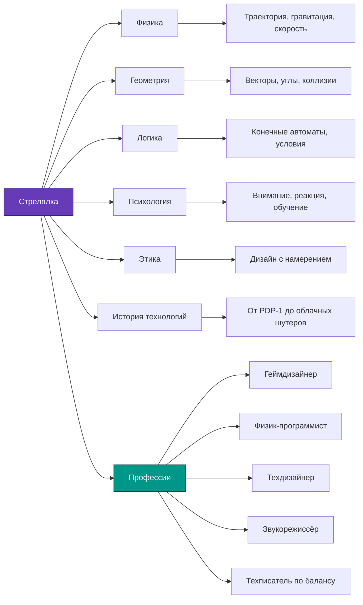

---
title: 9.02. Стрелялки
---

# 9.02. Стрелялки

<div class="article-tags">
  <span class="tag tag-beginner">ДЛЯ ДЕТЕЙ</span>
  <span class="tag tag-required">ОБЯЗАТЕЛЬНО</span>
</div>
<span class="complexity-badge">Родителям и детям</span>

```
Стрелялки
Шутеры
Шутеры от первого лица
Шутеры от третьего лица
Top-down
Скролл-лутеры, bullet hell, платформеры шутеры
Сейчас механика шутеров есть почти везде, поэтому в основном игры называют Action жанром, например и Spiderman может считаться шутером (у него же есть веб-шутеры?)
Добавить mermaid схему
Добавить задачи
```

Когда взрослые слышат слово *«стрелялка»*, они часто представляют себе что-то шумное, быстрое и, возможно, даже «бесполезное» — просто герой бегает и стреляет, монстры падают, уровень заканчивается. Но если посмотреть чуть глубже, то окажется: **стрелялки — одни из самых продуманных и сложных типов компьютерных игр**. В них сочетаются физика, геометрия, тактика, искусство, программирование и даже психология.

В этой главе мы не будем учить, *как* выигрывать в конкретные игры. Мы разберём:  
— **почему** игры устроены именно так,  
— **как** менялись стрелялки за 50 лет,  
— **где** в них скрываются настоящие научные идеи — от расчёта траектории пули до предсказания поведения врага,  
— и **как** даже веб-выстрелы Человека-паука — это тоже, в некотором смысле, *стрельба* (но без пороха!).

Это не инструкция для геймера. Это **путеводитель по мышлению разработчика** — как будто вы заглянули в мастерскую, где рождаются миры.

---

### Что такое *стрелялка*? Давайте договоримся о словах

Слово *«стрелялка»* звучит просто — и это хорошо. Оно описывает суть: **в игре есть персонаж (или машина), который выпускает снаряды в цель**. Снаряд может быть:
- пулей из пистолета,
- лазерным лучом,
- снежком, мячиком, волшебной стрелой,
- даже словом (в играх-головоломках бывают «атаки через диалог»),
- или… веб-нитью (да, об этом позже!).

**Важно**: в настоящей стрелялке снаряд *летит по траектории*, и игрок должен *предугадать*, куда целиться — потому что цель может двигаться, а снаряд летит не мгновенно.

Это отличает стрелялки от:
- игр, где достаточно *нажать кнопку*, и противник сразу получает урон (например, «тык-тык» в RPG);
- мини-игр, где стрельба — просто анимация без физики (например, «выстрел» в викторине — это метафора).

**Стрелялка = цель + снаряд + время полёта + необходимость прицеливания**.

---

### А что такое *шутер*? Английское слово, русская идея

Слово **шутер** пришло из английского *shooter* — от глагола *to shoot*, то есть *стрелять*. Ничего мистического: шутер — это просто *английское название стрелялки*.

Но в игровой индустрии слово *шутер* стало означать **уже не любую стрелялку, а стрелялку определённого вида**: где вы управляете персонажем, который сам стреляет, чаще всего в реальном времени, и где стрельба — главный способ взаимодействия с миром.

Например, если в игре вы — танк, который стреляет по целям, — это *танковый симулятор* с элементами шутера.  
Если вы — волшебник, который метает огненные шары, — это *экшен-RPG*, но в момент боя работает механика шутера.

То есть:  
🔹 **все шутеры — стрелялки**,  
🔹 **но не все стрелялки называют шутерами** — особенно если стрельба там второстепенна.

---

### Шутеры от первого лица (FPS — First-Person Shooter)

Представьте: вы смотрите **глазами героя**.  
Вы не видите своё тело — только руки с оружием, и всё, что перед вами. Это как смотреть на мир через камеру, прикреплённую ко лбу.

Такие игры называются **от первого лица**, потому что «я» — герой. Вы не *наблюдаете* за ним — вы *становитесь* им.

#### Примеры:
- *Doom* (1993) — первая массовая игра такого типа; герой — безымянный солдат в аду (да, буквально);
- *Half-Life* — история, где вы — учёный, попавший в катастрофу;
- *Portal* — здесь вы стреляете не пулями, а *порталами* (дырами в пространстве!), но механика — всё равно шутер от первого лица.

#### Почему это сложно сделать?
Разработчикам нужно решить много задач:
- Как показать, что герой дышит, устаёт, получает ранения — если его тела не видно?
- Как не вызвать у игрока *укачивание* (кинетоз) при быстром повороте головы?
- Как сделать, чтобы прицеливание чувствовалось *точно*, хотя в реальности мы прицеливаемся двумя глазами, а игра — одним «глазом» камеры?

Даже такая мелочь, как *отдача* (отброс оружия при выстреле), требует расчёта силы, анимации, звука и вибрации контроллера — и всего этого одновременно.

---

### Шутеры от третьего лица (TPS — Third-Person Shooter)

Теперь представьте: вы видите героя **со стороны** — как будто за ним летит невидимая птица или дрон. Камера обычно расположена чуть выше и позади персонажа.

Это *от третьего лица*: вы — рассказчик, наблюдающий за героем.

#### Примеры:
- *Gears of War* — герои укрываются за стенами, выскакивают, стреляют, снова прячутся;
- *The Division* — спецагенты в реалистичном Нью-Йорке;
- *Fortnite* — в режиме «Соло» вы видите себя со спины.

#### Преимущества такого вида:
- Игрок видит *всё тело героя*: как он бежит, прыгает, прячется — это помогает в оценке расстояний и укрытий;
- Удобнее делать анимации: удар ногой, перекат, прыжок с крыши — всё это видно и красиво;
- Легче вводить сюжет: лицо героя может мимикрировать, реагировать на диалог.

#### Сложность для программистов:
- Надо следить, чтобы камера *не застревала* в стенах, когда герой прижимается к углу;
- Нужно рассчитывать, когда показывать оружие «поверх» тела, а когда — скрывать за укрытием;
- В многопользовательских играх: если один игрок видит врага от третьего лица, а другой — от первого, как гарантировать *честность*? (Это целая наука — *netcode* и *hit registration*.)

---

### А что насчёт других видов? Не всё — от первого или третьего лица!

Да, FPS и TPS — самые известные, но стрелялки бывают и другими. И это важно — потому что именно в этих формах родились многие идеи, которые потом перекочевали в крупные проекты.

#### 1. **Top-down («сверху вниз»)**  
Камера смотрит строго сверху — как будто вы с высоты птичьего полёта. Иногда чуть под углом («изометрия»), но суть та же: вы видите поле боя целиком.

**Примеры**:  
- *Enter the Gungeon* — подземелье, где каждая пуля видна, и уклоняться от них — искусство;  
- *Hotline Miami* — быстрые, жёсткие бои, где планирование хода решает всё.

**Особенность**: в таких играх особенно важна *геометрия пространства*. Например, если два врага стоят на одной линии — одним выстрелом можно убить обоих (это называется *«penetration»* или «пробитие»). Программисту нужно проверять, *пересекает ли траектория пули несколько объектов*.

#### 2. **Скролл-шутеры (Scrolling Shooters)**  
Это классика 80-х: экран *движется сам* (обычно вверх или вбок), а игрок управляет кораблём или персонажем, который стреляет навстречу волнам врагов.

**Примеры**:  
- *1942* (1984) — самолёт в небе, враги летят сверху;  
- *R-Type* — космический корабль с «прицепом»-оружием, который можно разворачивать.

Такие игры учили компьютеры *заранее планировать волны*: враги появляются не случайно — их паттерны («фигуры полёта») записаны в коде как *скрипты*. Это — ранняя форма *искусственного интеллекта* (хотя и очень простого).

#### 3. **Bullet hell («ад из пуль»)**  
Это поджанр скролл-шутеров, где враги стреляют *сотнями* снарядов одновременно, но так, что между ними остаются *узкие проходы*. Игрок должен не просто уворачиваться — нужно *танцевать* по экрану.

**Примеры**:  
- *Touhou Project* — японская серия про ведьм и божеств, где красота паттернов важна не меньше, чем сложность;  
- *Ikaruga* — пули чёрные и белые, и ваш корабль может *впитывать* пули своего цвета.

Здесь физика сочетается с *дизайном*: разработчики тщательно рисуют траектории, чтобы игра была *сложной, но честной*. Если вы погибли — значит, не заметили закономерность. Это тренирует **внимание, память и пространственное мышление**.

#### 4. **Платформеры-шутеры**  
Смешение жанров: вы прыгаете по платформам (как в *Super Mario*), но ещё и стреляете (как в *Contra* или *Cuphead*).

**Особенность**: баланс между *точностью прыжка* и *точностью прицела*. Например, в *Cuphead* герой может стрелять в любую сторону, даже в прыжке — и это требует от движка игры одновременной обработки:
- гравитации,
- столкновений с платформами,
- анимации рук,
- направления взгляда,
- полёта пуль.

Это — отличный пример *модульного программирования*: физика, анимация, баллистика — всё работает как отдельные «кубики», но соединяется в плавный опыт.

---

### А где же *веб-шутеры* у Человека-паука? И почему теперь всё — «Action»?

Отличный вопрос. Давайте разберём.

У Человека-паука есть **веб-шутеры** — устройства на запястьях, которые выпускают липкую нить. Это *устройства для стрельбы*, но они стреляют не пулями, а *нитями*. И эти нити:
- имеют массу и вязкость,
- растягиваются,
- цепляются за поверхности,
- позволяют *качаться* по городу — то есть превращают стрельбу в способ *передвижения*.

С технической точки зрения:  
— веб-выстрел — это *снаряд с физическими свойствами*;  
— его траектория рассчитывается в реальном времени;  
— точка прикрепления — это *цель*;  
— неудачный выстрел = падение героя.

Значит, **да — механика шутера здесь присутствует**, даже если нет урона. Просто выстрел служит не для уничтожения, а для *взаимодействия с миром*.

Именно поэтому сегодня редко говорят *«шутер»* как отдельный жанр. Вместо этого — **Action (экшен)**. Это более широкое понятие:  
🔹 *экшен* = игра, где важны **реакция, координация, физика и мгновенные решения**.  
В экшен могут входить:
- рукопашные бои (*God of War*),
- стрельба (*Call of Duty*),
- лазание и качание (*Spider-Man*),
- управление транспортом (*Red Dead Redemption*),
- даже использование магии (*Elden Ring*).

**Шутер — это *подтип экшена*, где основной инструмент взаимодействия — снаряд, запускаемый в цель.**

Это как:  
> *Квадрат — это прямоугольник, но не всякий прямоугольник — квадрат.*  
> *Шутер — это экшен, но не всякий экшен — шутер.*

---

### Mermaid-схема: «Родословная стрелялок»

```mermaid
graph TD
    A[Стрелялки] --> B[Шутеры (Shooter)]
    A --> C[Скролл-шутеры]
    A --> D[Платформеры-шутеры]
    A --> E[Top-down шутеры]
    
    B --> B1[От первого лица (FPS)]
    B --> B2[От третьего лица (TPS)]
    
    C --> C1[Классические (1942, R-Type)]
    C --> C2[Bullet hell (Touhou, Ikaruga)]
    
    E --> E1[Изометрические (Hotline Miami)]
    E --> E2[С видом сверху (Enter the Gungeon)]
    
    A --> F[Экшен-игры с элементами стрельбы]
    F --> F1[Spider-Man — веб-шутеры]
    F --> F2[Horizon Zero Dawn — лук как оружие]
    F --> F3[Star Wars Jedi — Force Push как 'выстрел']
    
    style A fill:#4CAF50,stroke:#388E3C,color:white
    style B fill:#2196F3,stroke:#0D47A1,color:white
    style F fill:#FF9800,stroke:#E65100,color:white
```

> 💡 **Как читать схему**:  
> Зелёный — общее понятие *«стрелялка»*.  
> Синий — *«шутеры»* как устоявшийся жанр.  
> Оранжевый — современные *экшен-игры*, где стрельба — один из инструментов, но не единственный.

---

### Задания и упражнения

#### 🔹 Для младших (8–11 лет)
1. **«Нарисуй траекторию»**  
   Возьми лист бумаги. Нарисуй цель (например, мишень на дереве) и стрелка (героя). Проведи линию от стрелка к цели — это прямая траектория. А теперь нарисуй цель, которая *бежит вправо*. Куда должен целиться стрелок, чтобы попасть? Проведи новую линию — она будет *вперёд* от цели. Это называется *упреждение*.

2. **«Сделай bullet hell из бумаги»**  
   Вырежи из цветной бумаги 20 кружочков («пули»). Разложи их на столе так, чтобы между ними оставались узкие дорожки. Попробуй провести пальцем от одного края к другому, не касаясь кружков. Это — тренировка внимания, как в настоящей игре!

3. **«Что стреляет?»**  
   Подумай: какие предметы в жизни «стреляют», но не используют пули?  
   Примеры:  
   — пенная пушка,  
   — водяной пистолет,  
   — автомат для метания теннисных мячей,  
   — даже кофемашина (если представить струю кофе как «снаряд»!).  
   Напиши 5 своих примеров.

#### 🔹 Для средних (12–14 лет)
4. **«Спроектируй простой шутер»**  
   Опиши игру в 5 предложениях:  
   — Кто герой?  
   — Чем он стреляет? (лазер? магия? робот-помощник?)  
   — Откуда виден герой: от первого лица, третьего или сверху?  
   — Какие *физические свойства* у снаряда? (летит быстро/медленно? отскакивает? взрывается?)  
   — Какая *цель* у игры? (выжить 5 минут? добраться до флага? защитить друга?)

5. **«Анализ: почему веб-выстрел — это шутер?»**  
   Напиши короткое рассуждение (5–7 строк): какие *4 признака* стрелялки есть у веб-шутеров Человека-паука? (Подсказка: снаряд, цель, траектория, необходимость прицеливания.)

#### 🔹 Для старших (15–16 лет)
6. **«Код без кода»**  
   Представь, что ты объясняешь программисту, как сделать *простой top-down шутер* на языке (например, Python с Pygame).  
   Опиши *без кода*, только словами, какие объекты и функции понадобятся:  
   — герой (координаты, здоровье, направление взгляда),  
   — пуля (координаты, скорость, направление, «живёт ли ещё»),  
   — враг (паттерн движения, здоровье),  
   — коллизия (столкновение пули и врага).  
   Это упражнение на *алгоритмическое мышление*.

7. **«Где граница?»**  
   Возьми любую игру (например, *Minecraft*, *Roblox: Tower of Hell*, *Among Us*). Есть ли в ней элементы шутера? Если да — какие? Если нет — почему? Напиши аргументированное мнение (не менее 100 слов).

---

## **Часть 2: Как устроена стрельба *внутри* игры?**

### 1. Пуля, лазер, граната — почему они летят по-разному?

Многие думают: «ну пуля — она летит прямо и быстро». Но даже в одной игре снаряды могут вести себя совершенно по-разному. И это не для красоты — это **логика мира** и **баланс геймплея**.

Вот три ключевых свойства, которые определяют поведение снаряда:

| Свойство | Что оно значит? | Пример из жизни | Пример из игры |
|--------|----------------|----------------|----------------|
| **Траектория** | По какой кривой летит снаряд? | Бросок мяча — дуга. Стрельба из лука — тоже дуга. Из винтовки — почти прямая линия. | — *Minecraft*: стрела летит по параболе. — *Call of Duty*: пуля почти прямая (на короткой дистанции). — *Worms*: граната — дуга, как в боулинге. |
| **Скорость** | Сколько времени снаряд тратит на путь до цели? | Водяной пистолет (медленно) vs пневматика (быстро). | — *Cuphead*: пули врагов летят медленно — можно уклониться. — *Quake*: ракеты летят медленно, но их можно *перехватить* своей ракетой (да, так умеют!). |
| **Эффект столкновения** | Что происходит при попадании? | Пена — прилипает. Вода — брызги. Камень — разбивает. | — *Half-Life 2*: физ-пушка толкает объекты, но не убивает. — *Overwatch*: ультимейт Райнхардта — волна, отбрасывающая врагов. — *Enter the Gungeon*: пули могут *отскакивать* от стен. |

#### Почему это важно для разработчика?

Потому что каждое свойство — это **переменная в коде** и **условие в логике**.  
Например, для пули с дугой нужно:
1. Знать начальную скорость и угол выстрела.
2. Применять каждую миллисекунду *гравитацию* (например, `y = y + vy; vy = vy + gravity`).
3. Проверять, не коснулась ли пуля земли — тогда *остановить* её.

Для лазера — проще:  
— мгновенное появление линии от ствола до первого объекта,  
— проверить, *пересекает* ли эта линия врага (это геометрия: отрезок и прямоугольник/круг).

А для *отскакивающей* пули — сложнее:  
— при столкновении нужно *отразить* вектор скорости,  
— уменьшить скорость (потеря энергии),  
— ограничить число отскоков (иначе пуля будет летать вечно).

Это уже не «бах-бах» — это **физическое моделирование в миниатюре**.

---

### 2. Прицеливание: почему мы не целимся «прямо в голову»?

В реальности стрелок учитывает:
- расстояние до цели,
- её скорость,
- ветер,
- даже вращение Земли (в снайперских расчётах!).

В играх тоже есть «подсказки», но они *спрятаны* в интерфейсе и механике — чтобы не перегружать игрока, но сохранить реализм.

#### Что помогает прицеливаться?

| Элемент | Как работает | Зачем нужен |
|--------|--------------|-------------|
| **Прицел (crosshair)** | Маленький крестик или точка в центре экрана. Иногда «расходится» при беге — показывает, что точность упала. | Даёт опорную точку. Без него — как стрелять с закрытыми глазами. |
| **Ретикул (reticle bloom)** | Прицел «растёт» при движении, стрельбе очередью. Чем больше — тем выше разброс. | Учит думать: *стоит ли бежать и стрелять? Или лучше остановиться?* |
| **Упреждение (lead targeting)** | В некоторых играх (например, космических симуляторах) появляется *вторая метка* — куда *будет* враг через 1 секунду. | Помогает компенсировать время полёта снаряда. Особенно важно для медленных ракет. |
| **Автоприцел (snap-to / aim assist)** | На консолях: если вы *почти* навели на врага — камера слегка «дотягивает» прицел. | Компенсирует меньшую точность геймпада по сравнению с мышью. |

> 🔍 **Интересный факт**: в *Fortnite* на ПК автоприцела почти нет, а на PlayStation он есть — иначе игроки с геймпадом проигрывали бы всегда. Это — пример *адаптивного дизайна*: игра подстраивается под устройство, а не заставляет всех быть одинаковыми.

---

### 3. Как «думает» враг, когда стреляет в вас?

Многие дети (и даже взрослые!) думают: «Компьютер всё знает. Он видит меня сквозь стены». На самом деле — **нет**. В 99% игр ИИ *не читерит*. Он использует те же данные, что и игрок:  
— что видит его «глаз» (камера),  
— слышит ли звук (выстрел, шаги),  
— помнит ли, где вы *были* секунду назад.

#### Простая модель поведения врага-стрелка:

```plaintext
Каждую секунду враг проверяет:
1. Вижу ли я игрока? (луч от глаз врага до игрока — не пересекает ли стены?)
   → Да: перехожу в состояние «Атака».
   → Нет: перехожу в «Патрулирование».

В состоянии «Атака»:
2. Повернуть тело и оружие в сторону игрока (плавно, не мгновенно!).
3. Подождать 0.5–2 секунды (имитация «прицеливания»).
4. Выстрелить — с небольшой случайной ошибкой (±5°), чтобы не быть «роботом-снайпером».
5. Если игрок ушёл из поля зрения — искать 3 секунды, потом вернуться к патрулированию.
```

Это называется **конечный автомат** (finite state machine) — как будто у врага есть «режимы»: *спит → слышит шум → ищет → видит → стреляет → теряет*.

#### А как с bullet hell?

Там враги не «стреляют в игрока». Они **выполняют заранее записанные паттерны** — как ноты в музыке.

Пример паттерна для шарика-врага:
1. Появляется вверху экрана.
2. Летит по прямой 2 секунды.
3. Одновременно выпускает 8 пуль по кругу (как солнце с лучами).
4. Через 0.3 сек — ещё 8 пуль, но повёрнутых на 22.5°.
5. Через 0.3 сек — опять, и так 5 раз → получается «цветок» из пуль.

Эти паттерны рисуют *вручную* — художник и геймдизайнер вместе подбирают, чтобы было сложно, но *предсказуемо*. Если вы пройдёте уровень 10 раз — вы запомните: «вот здесь — волна, потом пауза, потом спираль». Это — **обучение через повторение**, как в математике.

---

### 4. Практика: создаём свою мини-стрелялку в Scratch

Scratch — идеальный инструмент для первого опыта, потому что:
- всё визуально: спрайты, блоки, координаты — видны;
- нет синтаксических ошибок (не напишешь `prnit` вместо `print`);
- можно сразу проверить идею.

Мы сделаем **top-down шутер** (вид сверху), где герой стреляет по врагам, появляющимся сверху.  
Но — не просто «скопируй блоки». Мы будем *обсуждать каждое решение*.

#### Шаг 1. Проектирование: что должно быть?

| Объект | Его задачи | Как реализовать в Scratch? |
|--------|------------|----------------------------|
| **Герой** | Двигается стрелками, стреляет по клику, имеет здоровье | Спрайт + блоки `если нажата стрелка → изменить x/y` |
| **Пуля** | Летит вперёд, исчезает при выходе за экран или попадании | Спрайт «bullet»; при создании — `направить в направление героя`, `повторять → изменить x/y`; `если касается края → удалить` |
| **Враг** | Появляется сверху, движется вниз, «умирает» при попадании | Спрайт «enemy»; `когда получен сигнал [появиться] → идти к (x, y=200)`; `если касается пули → изменить счёт, удалить себя` |
| **Система** | Счёт, таймер появления врагов, перезарядка | Переменные: `очки`, `здоровье`; таймер через `ждать 1 сек → создать врага` |

#### Шаг 2. Важные тонкости (объясняем *почему*)

🔹 **Почему пуля — отдельный спрайт, а не линия?**  
Потому что линия — статична. А спрайт-пуля может:
- иметь скорость,
- вращаться (для анимации),
- сталкиваться с разными объектами,
- иметь «время жизни».

🔹 **Почему нельзя просто «приклеить» пулю к герою?**  
Потому что тогда она будет *двигаться вместе с ним*. А настоящая пуля летит *независимо* — даже если герой остановился, пуля продолжает путь. Это называется **независимая физика объекта**.

🔹 **Как сделать, чтобы одна пуля не убивала всех врагов подряд?**  
Нужно после попадания *удалять* пулю — иначе она пролетит сквозь первого врага и ударит второго. В коде:  
`если касается [враг] → удалить себя, послать [умереть] врагу`.

🔹 **Как избежать «лавины пуль» при зажатии кнопки?**  
Добавить *перезарядку*: после выстрела — `ждать 0.2 сек` перед следующим. Или использовать флаг: `если [можно стрелять] = да → выстрелить, поставить [можно стрелять] = нет, ждать 0.2 сек, [можно стрелять] = да`.

#### Шаг 3. Расширения (для продвинутых)

Когда база работает — можно усложнять:
- **Разные типы пуль**: например, по пробелу — обычная, по Shift — лазер (летит быстрее, проходит сквозь одного врага);
- **Укрытия**: нарисовать спрайт «ящик»; сделать его «непроницаемым» для пуль (блок `если касается [ящик] → удалить себя`);
- **Звук и визуал**: взрыв при попадании (новый спрайт, который появляется и исчезает через 0.3 сек);
- **Уровни сложности**: чем больше очков — тем чаще появляются враги, или они начинают *стрелять в ответ*.

> 💡 Подсказка для преподавателя:  
> Лучше давать детям *не готовый проект*, а **каркас** — герой и фон, без пуль и врагов. Пусть сами придумают, как добавить стрельбу. Ошибки — часть обучения: если пули летят влево — значит, не рассчитан угол. Если враги не исчезают — забыли команду `удалить себя`. Это — настоящая отладка.

---

### Задания к Части 2

#### 🔹 Для младших (8–11 лет)
1. **«Пуля или лазер?»**  
   Посмотри на 5 игрушек или предметов дома. Для каждой реши:  
   — если бы она «стреляла», то каким был бы снаряд?  
   — прямым (лазер) или дугой (пуля)?  
   Пример:  
   — Пружинный прыгун → дуга (прыгает, как мяч).  
   — Фонарик → прямой луч (лазер).  
   — Пылесос → струя воздуха (прямая, но быстро рассеивается).

2. **«Спрячься от пуль»**  
   Нарисуй лабиринт из коридоров и комнат. В одном углу — враг, который стреляет *только по прямой*. Где можно спрятаться, чтобы пули не долетели? Подпиши «мёртвые зоны».

#### 🔹 Для средних (12–14 лет)
3. **«Спроектируй ИИ для врага»**  
   Опиши поведение врага в 4–5 шагах. Например:  
   — Стоит на месте, смотрит вперёд.  
   — Если видит героя → бежит к нему 2 секунды.  
   — Останавливается, ждёт 1 сек, стреляет 3 раза с паузой 0.5 сек.  
   — Если герой скрылся → идёт к последнему месту, где его видел.  
   Можно добавить «характер»: трусливый (убегает при низком здоровье), агрессивный (не ждёт, стреляет сразу).

4. **«Почему в Minecraft стрела летит дугой, а в Portal — лазер прямо?»**  
   Напиши 3–4 предложения: как это связано с *миром игры* и *её правилами*?

#### 🔹 Для старших (15–16 лет)
5. **«Реализм vs играбельность»**  
   В реальности пуля летит ~900 м/с. За 0.1 сек она пролетает 90 метров — почти длина футбольного поля. Но в играх часто пули летят медленно (чтобы игрок успевал уклоняться).  
   Напиши короткое эссе (150–200 слов):  
   — Когда стоит делать пули *реалистичными*, а когда — *замедленными*?  
   — Какие жанры требуют скорости, а какие — зрелищности?  
   — Может ли *недореализм* быть художественным приёмом? (Пример: *Superhot* — время идёт только при движении.)

6. **«Сделай схему конечного автомата для врага»**  
   Используй Mermaid (или нарисуй от руки и опиши):  
   - Состояния: `Патрулирование`, `Обнаружил`, `Преследует`, `Атакует`, `Потерял`.  
   - Переходы: какие события их вызывают? («увидел», «потерял из виду», «здоровье < 20%» и т.п.)

   Пример начала:
   ```mermaid
   stateDiagram-v2
       [*] --> Патрулирование
       Патрулирование --> Обнаружил: видит игрока
       Обнаружил --> Преследует: игрок в зоне досягаемости
       Преследует --> Атакует: дистанция < 100 пикс
       Атакует --> Потерял: игрок скрылся 3 сек
       Потерял --> Патрулирование
   ```

---

## **Часть 3: От лаборатории к миру — как стрелялки научили нас думать**

### 1. Краткая история: не «игры», а *исследовательские проекты*

#### 1962: **Spacewar!** — первая интерактивная стрелялка  
Создана студентами MIT на компьютере **PDP-1** — огромной машине, весившей тонну и стоившей $120 000 (сегодня — ~$1.2 млн).  
🔹 Два корабля летают вокруг звезды, стреляют торпедами.  
🔹 Есть гравитация: если лететь близко к звезде — притягивает.  
🔹 Управление — через *специальные переключатели*, не клавиатуру.

**Почему это важно?**  
— Это не «развлечение» — это **эксперимент по человеко-машинному взаимодействию**.  
— Программисты проверяли: может ли человек *одновременно* управлять поворотом, ускорением, стрельбой и учитывать гравитацию?  
— Ответ: *да* — но только после тренировки. Родилось понятие **кривой обучения**.

> 💡 Интересно: исходный код *Spacewar!* был открыт. Любой мог его улучшать. Это — один из первых примеров **open-source культуры** в IT.

#### 1970–1980-е: Аркады и ограничения как творчество  
Компьютеры были слабыми. В *Space Invaders* (1978):  
— Враги — 55 одинаковых спрайтов, но их *движение* создаёт иллюзию умного поведения: чем меньше врагов, тем быстрее они двигаются (процессору меньше работать — игра ускоряется сама).  
— Звук — один генератор: «тук-тук-тук» учащается по мере приближения врагов → создаётся напряжение.

Ограничения *порождали гениальность*:  
— В *Asteroids* (1979) пули и астероиды исчезают за краем экрана, но **появляются с противоположной стороны** — это не «баг», а применение **топологии тора** (поверхности бублика).  
— В *Galaga* (1981) боссы *захватывают* игрока — и если выстрелишь *вовремя*, можно освободиться. Это — ранняя форма **механики QTE (quick-time event)**.

#### 1990-е: Революция 3D и рождение FPS  
*Doom* (1993) не была первой игрой от первого лица — но первой, которая:  
— работала на *обычных ПК* (не на специальных станциях),  
— поддерживала **многопользовательскую игру через сеть** (впервые — Deathmatch),  
— имела **WAD-файлы** — внешние архивы с картами, звуками, текстурами → началась эра **моддинга**.

*Quake* (1996) добавил:  
— настоящую 3D-графику (не «2.5D», как в *Doom*),  
— **движок как платформу**: любой мог сделать свою игру на его основе (*Counter-Strike*, *Team Fortress* — начинались как моды),  
— **client-server архитектуру**, без которой невозможны современные онлайн-шутеры.

#### 2000–2020-е: Гибридизация и «невидимые» шутеры  
Сегодня редко встретишь «чистый» шутер. Вместо этого — **слои механик**:  
- *Destiny 2*: шутер + RPG (прокачка, редкие предметы) + MMO (рейды на 6 человек);  
- *Hades*: roguelike + платформер + шутер (Загребной стреляет трезубцем в такт ударам);  
- *Splatoon*: шутер, где «пули» — чернила, и цель — не убить, а *закрасить территорию*.

**Вывод**:  
Стрелялки — не застыли. Они *эволюционировали*, вбирая идеи из других жанров, потому что **механика стрельбы — универсальный способ взаимодействия с виртуальным пространством**.

---

### 2. Этический дизайн: почему важно, *во что* стрелять

Многие считают: «игра — это фантазия, тут всё можно». Но исследования (например, от Оксфордского интернет-института, 2021) показывают:  
🔹 **Игроки запоминают не сюжет, а *механику***.  
🔹 **Повторяющееся действие формирует автоматизм** — даже если он виртуальный.

Поэтому разработчики всё чаще задают себе вопросы:

| Вопрос | Пример решения | Эффект |
|-------|----------------|--------|
| **Можно ли избежать насилия, сохранив стрельбу?** | *Splatoon*: вместо крови — чернила. Враги «отключаются», а не «умирают». | Сохраняется динамика игры, но снижается тревожность. Подходит для младших игроков. |
| **Как сделать поражение информативным, а не унижающим?** | *Celeste*: при падении герой не «умирает», а просто *возвращается* к последней точке. Никакого «Game Over». | Игрок не боится ошибаться — учится смелее. |
| **Можно ли превратить врага в союзника?** | *Half-Life: Alyx*: роботы-враги могут быть *отключены*, а потом *перепрограммированы* для помощи. | Меняется отношение: враг — не «мишень», а *задача*. |
| **Как показать последствия?** | *This War of Mine*: если вы стреляете в мирного жителя за еду — потом персонаж *впадает в депрессию*, перестаёт готовить. | Даёт понять: выбор имеет цену — даже в игре. |

> ⚠️ Важно: это не «цензура». Это **дизайн с намерением** (*intentional design*).  
> Как инженер решает: мост должен выдержать ветер, так и геймдизайнер решает: игра должна формировать *осознанное* взаимодействие.

#### А что с «веб-шутерами»? Этический пример
В *Marvel’s Spider-Man* (2018) Человек-паук **никогда не убивает**. Даже в перестрелках:  
— его веб-выстрелы *обездвиживают*,  
— он отбивает пули щитом или уклоняется,  
— финальный удар — *нейтрализация*, не казнь.

Это — уважение к характеру героя. Если бы он убивал, это нарушило бы **внутреннюю логику мира**, и игрок бы почувствовал «диссонанс».

---


### 3. Кем можно стать, если увлечён стрелялками?

Многие дети мечтают «делать игры». Но профессий — десятки. Вот те, что *прямо связаны* с механикой стрельбы:

| Профессия | Что делает | Какие навыки нужны | Где учится/начинать |
|----------|------------|--------------------|---------------------|
| **Геймдизайнер (game designer)** | Придумывает, как работает стрельба: скорость, урон, баланс, «чувство выстрела» (ощущение отдачи, звука, визуала). | Анализ игр, прототипирование в Figma/Unity, знание психологии восприятия. | — Изучать геймдизайн-документы (GDD) на itch.io. — Делать «дизайн-разборы» любимых игр. |
| **Программист игровой физики** | Пишет код для полёта пуль, отскоков, гравитации, коллизий. | Математика (векторы, тригонометрия), C++/C#, движки (Unity, Unreal). | — Начать с PyGame или Godot на Python. — Писать симуляторы: «как летит мяч при ветре». |
| **Технический дизайнер (technical designer)** | Совмещает код и дизайн: делает скрипты поведения врагов, паттерны выстрелов. | Blueprints (Unreal), C# (Unity), логика, state machines. | — В Unity: писать поведение врага через ScriptableObject. — В Unreal: создавать поведение через Behavior Tree. |
| **Звукорежиссёр игр** | Создаёт звук выстрела так, чтобы он *соответствовал* оружию: пистолет — короткий щелчок, дробовик — гулкий «бум». | Аудиоредакторы (Reaper, Wwise), знание акустики, психологии звука. | — Анализировать звуки в *DOOM Eternal*: как меняется тембр при отдаче. |
| **Технический писатель по балансу** | Пишет документы: «как изменить урон, чтобы AK-47 не была сильнее снайперки на ближней дистанции». | Статистика, Excel/Python, понимание PvP-экономики. | — Собрать данные по 10 оружию в *Counter-Strike*. — Построить графики «урон vs дистанция». |

> 🔍 Пример карьерного пути:  
> Ученик → делает мини-шутер в Scratch → учит Python и PyGame → делает игру с физикой → поступает в вуз на «Программная инженерия» → стажируется в студии → становится техдизайнером.

---

### Итоговая схема: «Стрелялка как система знаний»



> Эта схема показывает: стрелялка — не «пустая забава». Это **узел, связывающий науки и профессии**.

---

### Финальные задания (итоговые, межвозрастные)

#### 🔹 Задание «Архив будущего»  
Представь, что сейчас 2075 год. Ты — исследователь, изучающий игры XXI века.  
Напиши **аннотацию** для музея:  
> «Стрелялки 2020-х: почему люди стреляли в экран, и что это дало человечеству?»  
(Объём: 150–250 слов. Используй понятия из всех трёх частей.)

#### 🔹 Задание «Игра без выстрелов»  
Придумай игру, в которой:  
— есть *механика прицеливания и запуска снаряда*,  
— но **никто и ничто не получает урон**.  
Опиши:  
1. Герой и его «оружие» (что стреляет? водой? светом? идеей?),  
2. Цель игры,  
3. Как работает физика снаряда,  
4. Почему это всё равно — *стрелялка* по сути.

Пример:  
> *«Светочинка»* — ребёнок-светлячок должен «стрелять» вспышками света в тёмные цветы, чтобы они раскрылись. Пули — импульсы света, летящие по прямой. Цель — осветить весь сад за 60 секунд.

#### 🔹 Задание «Создай GDD-страницу»  
Напиши **одну страницу геймдизайн-документа** для своей игры-стрелялки. Включи:  
- Название и жанр,  
- Ключевая механика (1–2 предложения),  
- Пример поведения врага (как в Части 2),  
- Этическое решение (что делает игру ответственной),  
- Целевая аудитория (8+, 12+, 16+ — и почему).

Это — реальный формат, который используют в индустрии.

---