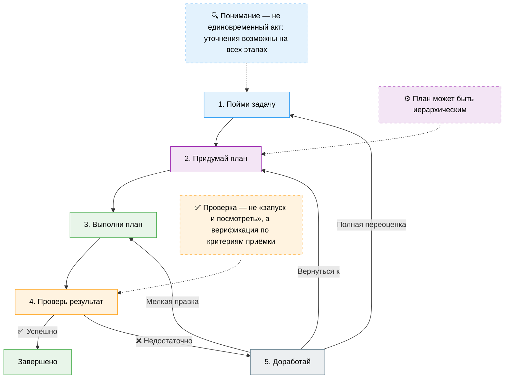
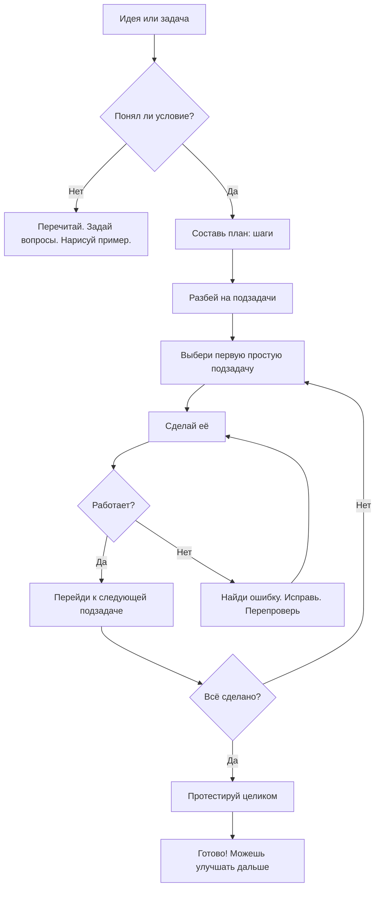
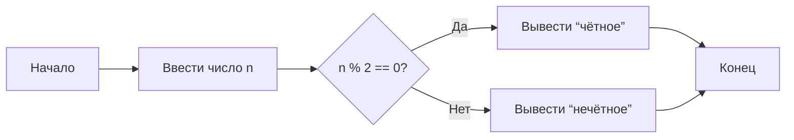

---
title: 9.03. Задачи
---

# 9.03. Задачи

<div class="article-tags">
  <span class="tag tag-beginner">ДЛЯ ДЕТЕЙ</span>
  <span class="tag tag-required">ОБЯЗАТЕЛЬНО</span>
</div>
<span class="complexity-badge">Родителям и детям</span>

```
Что такое задача
Как решать задачи
Как планировать и придумывать задачи
Декомпозиция задач (разбор сложного на шаги)
Добавить mermaid схему
Добавить задачи
```

### Что такое задача?

Представь, что ты собираешь конструктор LEGO. У тебя есть коробка, на которой нарисован готовый космический корабль. Ты открываешь инструкцию — и видишь: *«Шаг 1: возьми 4 красных кирпичика и соедини их так…»*, *«Шаг 2: прикрепи сюда синюю деталь…»* и так далее — до самого конца.  

**Вот это — задача.**  
Точнее, *вся сборка корабля* — это одна большая задача. А каждый шаг из инструкции — *подзадача*, маленькая часть большой цели.

В жизни задачи встречаются повсюду:  
— «Нарисовать открытку к 8 Марта»  
— «Написать сочинение про лето»  
— «Научиться кататься на велосипеде без поддержки»  
— «Разработать игру, где кот прыгает по облакам»  

В программировании и IT задачи особенно важны, потому что компьютер — это очень умная, но очень буквальная машина. Он делает *только то*, что ему чётко сказали. Если ты хочешь, чтобы программа сложила два числа и вывела результат, ты должен сформулировать эту цель *как задачу*, а потом — объяснить, *как именно* её решать: какие шаги, в каком порядке, что проверять.

> 🔍 **Ключевая мысль**:  
> **Задача — это чётко сформулированная цель + понимание того, что нужно сделать, чтобы её достичь.**  
> Не «сделать что-то» — а *что именно*, *зачем*, и *каким образом*.

---

### Как решать задачи? (Алгоритм мышления)

Решение любой задачи можно представить как путешествие от *«Я хочу…»* к *«Вот — готово!»*. Но без карты и компаса легко заблудиться. Хорошая новость — у нас есть универсальный «компас». Его зовут **алгоритм решения задач**. Он подходит и для математики, и для рисования, и для написания кода.



Вот из чего он состоит:

#### 1. **Понять задачу**  
Не спеши бежать вперёд — сначала остановись и *перескажи условие своими словами*.  
Пример:  
- Задача: *«Напиши программу, которая спрашивает имя пользователя и выводит приветствие: “Привет, [имя]!”»*  
- Пересказ: *«Мне нужно, чтобы компьютер спросил: “Как тебя зовут?”, запомнил ответ и потом напечатал: “Привет, …!” — с подставленным именем».*

❓ Полезные вопросы:  
- Что *дано* (входные данные)?  
- Что *требуется* (результат)?  
- Есть ли ограничения? (например: «имя должно быть не длиннее 20 букв»)  
- Как я пойму, что задача решена правильно?

#### 2. **Придумать план**  
Это как нарисовать маршрут на карте. Можно сначала мысленно, а лучше — на бумаге или в заметках.  
- Разбей задачу на **шаги**.  
- Определи, какие шаги *обязательные*, а какие — *опциональные*.  
- Подумай: какие шаги похожи на то, что ты уже делал раньше?

Пример плана для приветственной программы:  
1. Вывести на экран вопрос: *«Как тебя зовут?»*  
2. Дождаться, пока человек введёт имя и нажмёт Enter.  
3. Запомнить введённое имя в переменной (например, `name`).  
4. Вывести фразу *«Привет, » + name + «!»*.

#### 3. **Выполнить план**  
Теперь — в дело! Если программируешь — пишешь код. Если рисуешь — берёшь карандаш. Главное — *следовать плану*, но быть готовым *скорректировать* его, если что-то пошло не так.

#### 4. **Проверить результат**  
Не верь на слово — проверь!  
- Запусти программу с разными именами: «Аня», «Максим», «Z» — работает?  
- А если ввести пустое имя? А если имя из 50 букв?  
- Сравни результат с ожидаемым: должен ли быть восклицательный знак? Пробел после запятой?

#### 5. **Доработать (если нужно)**  
Редко бывает, что всё получается с первого раза. Это нормально!  
Ошибка — не провал. Это *подсказка*: «Вот здесь что-то не так — посмотри внимательнее».  
Исправь, перепроверь — и снова запусти.

> 🌱 **Метафора для детей**:  
> Решение задачи — как путь от дома до школы. Ты можешь:  
> — идти наугад (часто сворачиваешь не туда),  
> — идти, сверяясь с картой (план),  
> — или идти с другом, который уже ходил этим маршрутом (готовый пример).  
> Самый надёжный способ — с картой. А когда пройдёшь раз десять — уже не нужна.

---

### Как планировать и придумывать задачи?

Иногда задачу приносит учитель, заказчик или друг. А иногда — *ты сам* её придумываешь. Это называется **инициативное проектирование**, и оно лежит в основе всякой творческой работы — от изобретений до игр.

#### Откуда берутся собственные задачи?

1. **Желание что-то улучшить**  
   — «А можно, чтобы моя игра сохраняла рекорд?»  
   — «А если в моём калькуляторе добавить кнопку “очистить”?»

2. **Наблюдение за неудобствами**  
   — «Каждый раз, когда я пишу расписание, трачу 10 минут. А если бы был шаблон?»

3. **Вдохновение от других проектов**  
   — «В Minecraft есть красный камень. А можно сделать “синий камень”, который будет…»

4. **Расширение уже сделанного**  
   — Сначала: «Программа, которая складывает два числа».  
   — Потом: «А можно — три числа? А дробные? А с проверкой ошибок?»

#### Как превратить идею в задачу?

Возьмём пример: *«Хочу, чтобы мой чат-бот шутил»*.

Это — мечта. Превратим её в задачу с помощью **уточнений**:

| Вопрос | Ответ |
|--------|-------|
| **Кто будет шутить?** | Чат-бот (программа). |
| **Что значит “шутить”?** | Выдавать случайную загадку или анекдот по команде. |
| **Как пользователь попросит шутку?** | Напишет `/joke` или нажмёт кнопку «Рассмеши меня!». |
| **Откуда бот возьмёт шутки?** | Из заранее подготовленного списка в коде (или из файла). |
| **А если шуток не осталось?** | Повторить первую или сказать: «У меня пока мало шуток — пришлите свои!». |

Теперь у нас есть **чёткая задача**:  
> *«Реализовать в чат-боте команду `/joke`, которая выводит случайную загадку из списка из 10 штук. Если список исчерпан — начинать сначала».*

Это уже можно *планировать*, *разбивать на шаги*, *программировать*.

---

### Декомпозиция задач: разбираем монстра на кирпичики

Представь, что тебе дали задание:  
> *«Сделай приложение “Дневник настроения”, где можно каждый день ставить смайлик (грустный/нейтральный/весёлый), писать комментарий и смотреть график настроения за неделю».*

Звучит сложно? Да. Но **сложность — это иллюзия, созданная большим объёмом сразу**. Если разобрать задачу на части — каждая часть станет лёгкой.

Этот приём называется **декомпозиция** — от лат. *de* (вниз) + *componere* (складывать). То есть: *разложить сложное на простые компоненты*.

#### Пример декомпозиции «Дневника настроения»:

```
Дневник настроения
├── 1. Интерфейс (то, что видит пользователь)
│   ├── 1.1. Кнопки выбора настроения (3 смайлика)
│   ├── 1.2. Поле для ввода комментария
│   ├── 1.3. Кнопка «Сохранить»
│   └── 1.4. График (столбчатая диаграмма за 7 дней)
│
├── 2. Логика (то, что происходит “за кулисами”)
│   ├── 2.1. Сохранение данных: дата + смайлик + текст
│   ├── 2.2. Чтение данных за последние 7 дней
│   └── 2.3. Подсчёт: сколько грустных/весёлых дней
│
└── 3. Хранение (где лежат данные)
    └── 3.1. Временное — в памяти (пока браузер открыт)
    └── 3.2. Постоянное — в файле или базе данных (на будущее)
```

Теперь ты можешь начать с *любой* самой простой подзадачи: например, сначала сделать три кнопки и вывод смайлика на экран. Это — *мини‑победа*. А потом — добавить сохранение, потом — график.

> ✅ Правило:  
> **Если задача кажется слишком большой — задай себе вопрос: “А что можно сделать *прямо сейчас*, за 5–10 минут?”**  
> Часто ответ — «нарисовать интерфейс на бумаге», «написать список смайлов», «создать пустой файл проекта». Это уже *старт*.

---

### Визуализация: как выглядит решение задачи

Давай нарисуем схему — не картинкой, а с помощью языка **Mermaid**, который понимают многие редакторы (включая VS Code и некоторые сайты). Эта схема покажет, как проходит путь от *идеи* до *результата*.



Эту схему можно скопировать в любой редактор с поддержкой Mermaid и увидеть «живой» граф — как путь героя в квесте.

---

### Практика: задачи для самостоятельного решения  

Теперь — твоя очередь! Ниже — три задачи разного уровня. Каждая включает:  
- **Цель**  
- **Подсказки по планированию**  
- **Вопросы для самопроверки**

Попробуй решить хотя бы одну. Не обязательно писать код — можно описать шаги словами, нарисовать схему или просто рассказать вслух.

---

#### 🟢 Задача 1. *«Умный калькулятор»* (начальный уровень)

**Цель:**  
Написать программу, которая спрашивает два числа и операцию (`+`, `-`, `*`, `/`), а потом выводит результат.  
Например:  
```
Введите первое число: 10  
Введите второе число: 3  
Выберите операцию (+, -, *, /): *  
Результат: 30
```

**Подсказки:**  
1. Сначала — запрос чисел (важно: в программировании числа часто вводятся как *текст*, и их нужно *преобразовать* в число).  
2. Потом — выбор операции. Можно использовать условную конструкцию: *если + — сложить*, *если - — вычесть* и т.д.  
3. Особенно внимательно с делением: нельзя делить на ноль! Добавь проверку: *если второе число = 0 и операция = / — вывести «Ошибка: деление на ноль»*.

**Вопросы для самопроверки:**  
- Что произойдёт, если пользователь введёт букву вместо числа?  
- Как сделать так, чтобы программа работала *много раз подряд*, пока пользователь не скажет «хватит»?  
- Можно ли вынести *вычисление* в отдельную функцию? Зачем?

---

#### 🟡 Задача 2. *«Генератор паролей»* (средний уровень)

**Цель:**  
Создать программу, которая генерирует случайный пароль по запросу. Пользователь указывает длину (например, 8), и программа выдаёт строку из букв и цифр: `a3K9mL2q`.

**Подсказки:**  
- Собери «буквенный запас»: всё, что может быть в пароле. Например:  
  `символы = "abcdefghijklmnopqrstuvwxyzABCDEFGHIJKLMNOPQRSTUVWXYZ0123456789"`  
- Используй *случайный выбор* (`random.choice()` в Python, `Math.random()` в JS и т.д.).  
- Повтори выбор нужное число раз (цикл `for`).

**Расширения (по желанию):**  
- Добавь выбор: *только буквы? с цифрами? со спецсимволами (`!@#$`)?*  
- Добавь проверку: *пароль должен содержать хотя бы одну цифру и одну заглавную букву*.

**Вопросы:**  
- Почему важно использовать *криптографически стойкий* генератор случайных чисел в реальных паролях?  
- Как проверить, что пароль действительно случайный? (Подсказка: повтори генерацию 1000 раз и посмотри, часто ли повторяются.)

---

#### 🔴 Задача 3. *«Планировщик задач для школьника»* (продвинутый уровень)

**Цель:**  
Сделать консольное приложение, в котором можно:  
- Добавлять задачу с описанием и сроком (`«Математика — до 15.11»`)  
- Смотреть список всех задач (с сортировкой по дате)  
- Отмечать задачу как «сделано»  
- Удалять задачи  

Данные должны сохраняться между запусками (например, в файле `tasks.json`).

**Структура данных (пример):**
```json
[
  {"id": 1, "text": "Решить уравнения", "due": "2025-11-15", "done": false},
  {"id": 2, "text": "Написать эссе", "due": "2025-11-18", "done": true}
]
```

**Подсказки по декомпозиции:**  
1. Сначала — работа с данными в памяти (без файла).  
2. Реализуй одну команду: `add "текст" 2025-11-15`.  
3. Потом — `list`.  
4. Потом — `done 1` (по id).  
5. Только потом — сохранение в файл при выходе и загрузка при старте.

**Вопросы:**  
- Как избежать конфликта id при удалении и добавлении новых задач?  
- Можно ли сделать экспорт в текстовый файл для печати?

---

### Типичные ошибки при решении задач (и как их избежать)

Любой, кто решает задачи — от новичка до профессора, — совершает одни и те же ошибки на ранних этапах. Главное — *не бояться их*, а научиться их распознавать и исправлять. Это как в велосипедной езде: падения неизбежны, но со временем ты учишься держать баланс раньше, чем упадёшь.

#### ❌ Ошибка 1. *«Я сразу начал писать код»*  
**Что происходит:**  
Ты услышал задачу — и сразу бросился в редактор. Через 10 минут — запутался: не знаешь, как сохранить данные, как обработать ошибку ввода, как связать части. Приходится всё стирать.

**Почему это ошибка:**  
Задача без плана — как письмо без черновика. Можно написать, но потом придётся переписывать *всё*, а не только *часть*.

**✅ Как избежать:**  
Перед тем как коснуться клавиатуры:  
1. Возьми лист бумаги или открой заметку.  
2. Напиши *одним предложением*: *«Моя программа должна…»*.  
3. Задай себе 3 вопроса:  
   - Что входит? (входные данные)  
   - Что выходит? (результат)  
   - Что может пойти не так? (ошибки, крайние случаи)  

> 💡 Пример:  
> *«Программа спрашивает возраст и говорит, можно ли идти в школу»*  
> — Вход: число (возраст)  
> — Выход: фраза (*«Да»*, *«Нет»*, *«Ещё мал»*)  
> — Ошибки: ввели не число, ввели отрицательное число, 200 лет  

Только после этого — составляй шаги.

---

#### ❌ Ошибка 2. *«Я делал всё сразу»*  
**Что происходит:**  
Ты хочешь сразу сделать *полностью рабочее* приложение: интерфейс, логику, сохранение, красивые кнопки. Через час — устал, ничего не работает, и мотивация упала.

**Почему это ошибка:**  
Мозг работает лучше, когда фокусируется на *одной небольшой задаче*. Одновременная работа над многим создаёт «когнитивную перегрузку» — научное название состояния, когда информации слишком много, и ты просто замираешь.

**✅ Как избежать:**  
Примени принцип **«минимальная рабочая версия» (MVP — Minimum Viable Product)**:  
> *Сделай самую простую версию, которая хоть как-то работает — и только потом улучшай.*

Пример для «Дневника настроения»:  
| Версия | Что есть | Чего нет |  
|--------|----------|----------|  
| **MVP-0** | Текст в консоли: `print("🙂")` | Ничего больше |  
| **MVP-1** | Спрашивает: *«Как настроение? 1=🙂, 2=😐, 3=🙁»* → выводит смайлик | Не запоминает, не сохраняет |  
| **MVP-2** | Сохраняет сегодняшнее настроение в переменную | Не хранит историю |  
| **MVP-3** | Показывает: *«Сегодня — 🙂. Вчера — 🙁»* (два дня) | Без графика, без дат |  

Каждая версия — *успех*. Ты не провалился, ты *прогрессировал*.

---

#### ❌ Ошибка 3. *«Я не проверял крайние случаи»*  
**Что происходит:**  
Программа работает, когда ты вводишь *обычные* данные: `5`, `Аня`, `+`. Но как только вводишь `-1`, пустую строку, `1000000` или `NaN` — всё ломается.

**Почему это ошибка:**  
Реальный мир не идеален. Люди ошибаются, данные бывают битыми, интернет пропадает. Надёжная программа — та, что *ожидает* ошибки и умеет с ними справляться.

**✅ Как избежать:**  
Тренируй себя задавать вопрос:  
> **«А что, если…?»**

Примеры для любой задачи:  
- А если пользователь ничего не ввёл?  
- А если ввёл буквы вместо числа?  
- А если число слишком большое / слишком маленькое?  
- А если файл, который нужно прочитать, *не существует*?  
- А если в списке *ничего нет*?

Заведи себе «таблицу крайних случаев» для каждой задачи — даже в черновике. Это привычка профессионалов.

---

### Как объяснить задачу другому? Техника «Объясни пятилетнему»

Один из лучших способов понять задачу — попробовать *объяснить её кому-то, кто ничего не знает про программирование*. Это называется **метод Фейнмана** (по имени физика Ричарда Фейнмана).

Правила просты:  
1. Возьми лист бумаги.  
2. Напиши название задачи вверху.  
3. Пиши объяснение *так, будто объясняешь младшему брату или сестре (5–7 лет)*.  
4. Где застрял — там пробел в понимании. Вернись и перечитай условие.

Пример:  
> *Задача: «Реализовать функцию isPalindrome(word), которая возвращает true, если слово читается одинаково слева направо и справа налево».*

Попытка объяснить пятилетнему:  
> *«Палиндром — это такое слово, которое одинаковое, если читать с начала и с конца. Например: “око”, “поп”, “А роза упала на лапу Азора” — если убрать пробелы и букву “ё”, то получится одно и то же.*  
> *Моя программка должна взять слово, убрать пробелы, сделать все буквы маленькими, перевернуть его — и сравнить с тем, что было. Если совпадает — значит, палиндром!»*

Если ты смог так объяснить — ты *на самом деле понял* задачу.

---

### Инструменты: от бумажки до цифрового планировщика

Решать задачи можно «в уме» — но это как жонглировать пятью шарами, стоя на одной ноге. Лучше использовать *внешние опоры*: они освобождают память и делают мышление чище.

#### 📝 Бумага и ручка  
**Плюсы:**  
- Быстро, без отвлечений.  
- Можно рисовать схемы, стрелки, зачёркивать.  
- Нет “исчезающих” окон — всё перед глазами.  

**Что писать:**  
- Условие (переформулированное).  
- Список входов / выходов.  
- Шаги (нумерованный список).  
- Вопросы «А что если…?» — отдельно.  

#### 📊 Диаграммы: блок-схемы и карта задач  
Блок-схема — это «карта алгоритма». Каждый блок — действие или решение.

Пример для проверки чётности числа:


Такая схема помогает увидеть *ветвления* («если… то… иначе…») и не пропустить ни один путь.

#### 🧩 Цифровые инструменты (для старших подростков и взрослых)  
- **Obsidian / Notion** — для создания связных заметок: «задача → подзадачи → код → тесты».  
- **Mermaid Live Editor** (https://mermaid.live) — чтобы рисовать схемы без установки программ.  
- **Trello / Todoist** — если задач много и нужно распределять по дням.  

Но запомни:  
> 🛠️ Инструмент — не волшебная палочка. Он усиливает *твоё мышление*, но не заменяет его. Начинай с бумаги — и переходи к цифре, когда почувствуешь: «Я знаю, что хочу, теперь нужно организовать».

---

### Задачи в реальном IT: как это работает «на взрослом уровне»?

Ты, возможно, думаешь: «Вот в школе — задачки, а на работе всё серьёзно». Но на деле — **всё то же самое**, только масштаб больше и инструменты сложнее.

#### Пример 1. В ELMA365 (BPM-система)  
Клиент хочет: *«Сделайте, чтобы заявка на отпуск автоматически согласовывалась с руководителем, а если он не ответил за 3 дня — шла к HR»*.

Как разбивают задачу:  
1. **Анализ:**  
   - Кто подаёт заявку?  
   - Кто — руководитель? (где брать данные?)  
   - Что значит «не ответил»? (нет статуса «одобрено/отклонено»?)  
   - Где хранится дата создания заявки?  

2. **Декомпозиция:**  
   - Подзадача A: создать форму заявки.  
   - Подзадача B: при создании — записывать дату и отправлять уведомление руководителю.  
   - Подзадача C: настроить таймер на 72 часа.  
   - Подзадача D: если по истечении — сменить ответственного на HR и отправить уведомление.  

3. **Тестирование:**  
   - Проверить: что будет, если руководитель ушёл в отпуск?  
   - А если заявку отозвали до истечения трёх дней?  

Видишь? Те же шаги — только «взрослые» формулировки.

#### Пример 2. В разработке игры  
Команда решает: *«Хочу, чтобы персонаж мог прыгать, но не бесконечно — только если касается земли»*.

Разбор:  
- Что такое «земля»? (объект с тегом `Ground`?)  
- Как определить «касание»? (физический коллайдер? луч вниз?)  
- Что происходит при прыжке? (добавить силу вверх)  
- Что блокирует повторный прыжок? (флаг `isGrounded`)  

Всё сводится к: *условие → действие → проверка*.

---

### Упражнения и игры для развития навыка

Навык решения задач — как мышца: его можно тренировать. Вот несколько упражнений, подходящих для 8–16 лет.

#### 🎲 Игра «Робот и комната» (на бумаге или вживую)  
**Правила:**  
- Один игрок — «Робот» (выполняет команды *буквально*).  
- Остальные — «Программисты».  
- Цель: заставить робота дойти от двери до стула, используя только команды:  
  `шаг вперёд`, `повернуть налево`, `повернуть направо`.  

**Чему учит:**  
- Чёткость формулировок.  
- Необходимость *предвидеть* положение робота.  
- Ошибки показывают, где план неполный.

#### 📐 Упражнение «Разбери на шаги»  
Возьми любое действие из жизни:  
- «Заварить чай»  
- «Собрать рюкзак в школу»  
- «Найти книгу в библиотеке»  

Напиши пошаговый алгоритм — *максимально подробно*.  
Пример для чая:  
1. Взять чайник.  
2. Открыть крышку.  
3. Подойти к крану.  
4. Включить холодную воду.  
5. Подставить чайник под струю…  
→ Сколько шагов получилось? 10? 20? А если в доме нет воды?

Это учит видеть скрытые подзадачи.

#### 🧠 Задачка «Найди пропущенный шаг»  
Дан алгоритм с ошибкой. Найди, где он сломается.

> *Как отправить письмо по почте:*  
> 1. Написать письмо на листе.  
> 2. Положить лист в конверт.  
> 3. Заклеить конверт.  
> 4. Отнести на почту.  
> 5. Получить ответ через неделю.

❌ Что пропущено?  
→ Не указан адрес получателя! И свой обратный! Без этого письмо не дойдёт.

---