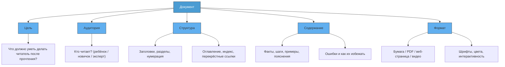

---
title: 9.03. Документы
---

# 9.03. Документы

<div class="article-tags">
  <span class="tag tag-beginner">ДЛЯ ДЕТЕЙ</span>
  <span class="tag tag-required">ОБЯЗАТЕЛЬНО</span>
</div>
<span class="complexity-badge">Родителям и детям</span>

```
Что такое документ
Инструкции, справки, гайды
Чтение документации (на примере инструкций к игрушкам / конструкторам)
Добавить mermaid схему
Добавить задачи
```

Представь, что ты получил в подарок конструктор — большой, с сотнями деталей. В коробке лежат шестерёнки, пластины, моторчики, проводки… но нет никаких листочков. Никаких картинок, никаких надписей. Просто куча деталей и… всё.

Что ты сделаешь?

Возможно, попробуешь собрать что-то сам. Может, получится самолёт. Или робот. А может — странная штука, которая никуда не едет и ничего не делает. Это нормально — экспериментировать. Но если ты *хочешь* собрать именно то, что обещано на коробке — например, космический корабль с лазерной пушкой и антенной связи, — тебе понадобится **инструкция**.

А инструкция — это один из самых простых и важных видов **документов**.

---

### Что такое документ?

**Документ** — это любая запись, которая *сохраняет* информацию и *передаёт* её другому человеку (или даже себе в будущем).

Слово *«документ»* звучит немного официально — как будто речь о паспорте или договоре. Но на самом деле документы окружают нас повсюду:

- рецепт бабушкиного пирога на листочке в кухонном блокноте — это документ;  
- список покупок на телефоне — документ;  
- правила игры в прятки, которые вы придумали во дворе и записали мелом на асфальте — тоже документ;  
- даже сообщение в чате, где ты объясняешь другу, как пройти уровень в игре, — это документ (цифровой, но всё равно!).

**Главное свойство документа:**  
> Он существует *независимо от человека*, который его создал.  
> Он не исчезает, когда создатель ушёл, уснул или забыл.  
> Он может быть прочитан, проверен, исправлен, передан дальше.

Документ не обязательно должен быть на бумаге. Документ может быть:

- текстовым файлом (`.txt`, `.docx`, `.pdf`);
- веб-страницей;
- изображением с надписями;
- видеоинструкцией;
- голосовой заметкой;
- даже базой данных — если она содержит структурированное описание чего-либо.

Но вне зависимости от формы, документ выполняет три основные задачи:

1. **Фиксация** — «здесь и сейчас мы договорились так…»;
2. **Передача** — «я не могу объяснить тебе лично, но вот запись — читай»;
3. **Повторяемость** — «сделай вот так — и у тебя получится то же самое, что и у меня».

---

### Почему документы так важны в IT?

Представь программиста. Он сидит, печатает код — сотни строк, тысячи команд. Он что-то создаёт: сайт, игру, приложение. В какой-то момент он заканчивает версию 1.0 и уходит в отпуск.

А через две недели к проекту подключается другой программист. Он открывает код и видит:

```javascript
if (z > 0 && m !== null) {
  q = m.transform(z).apply();
}
```

Что такое `z`? Что такое `m`? Зачем `transform`? Что делает `apply()`? Без пояснений — это как инструкция на непонятном языке.

Но если рядом лежит документ — например, файл `README.md`, где написано:

> `z` — угол поворота объекта в градусах (от –180 до +180)  
> `m` — модель 3D-объекта, загружается из `/assets/models/ship.obj`  
> `.transform(z)` вращает модель вокруг оси Y  
> `.apply()` отправляет изменения в видеокарту для отрисовки

— тогда всё становится ясно.

**В IT документы — это мост между мыслью и действием.**  
Они позволяют людям работать вместе, даже если они:
- живут в разных странах;
- подключились к проекту через год после его старта;
- никогда не встречались лично.

Без документов невозможно сделать сложную, надёжную, масштабируемую систему. Даже если ты один — *через месяц ты сам будешь другим человеком*. И тебе потребуется документ, чтобы понять: «А зачем я так сделал?»

---

### Виды документов: Инструкции, справки, гайды

Документы бывают разные — как инструменты в наборе. Отвертка не заменит молоток, и наоборот. Давай разберём три самых частых вида — особенно полезных при работе с техникой, программами и проектами.

#### 1. Инструкция (Instruction / Manual)

Это **пошаговое руководство**, как сделать что-то конкретное *впервые*.  
Цель: «Доберись от нуля до результата *без ошибок*».

Примеры:
- «Как собрать LEGO-робота за 30 минут»;
- «Как настроить Wi-Fi на планшете»;
- «Как создать аккаунт в ELMA365».

Особенности:
- Идёт от начала к концу — как фильм;
- Часто содержит скриншоты, номера шагов, предупреждения («Не нажимайте “Да”, если не уверены!»);
- Предполагает, что читатель *ничего не знает* об этом процессе.

> 🔍 **Попробуй сам**: Возьми упаковку от нового устройства (наушников, настольной лампы, набора для опытов) и найди там *инструкцию*. Прочитай её *вслух* — как будто ты объясняешь младшему брату. Заметь: какие слова повторяются? Где стоят картинки? Почему одни шаги жирным шрифтом, а другие — серым?

#### 2. Справка (Reference)

Это **энциклопедия возможностей**.  
Цель: «Ты уже умеешь — теперь узнай, *что ещё можно*».

Примеры:
- таблица команд для консоли Linux (`ls`, `cd`, `mkdir`);
- описание всех функций в Python: `len()`, `range()`, `open()`;
- список всех кнопок в игре *Minecraft* («Shift — присесть, F2 — сделать скриншот…»).

Особенности:
- Не надо читать подряд. Читаешь только то, что нужно *сейчас*;
- Часто структурирована по темам («Работа с файлами», «Цвета», «Ошибки»);
- Суховата — но зато точна: *что делает*, *какие параметры*, *что возвращает*.

> 🧩 **Интересный факт**: Справка — это как меню в ресторане. Ты не ешь всё сразу. Но когда захочешь *именно пасту карбонара* — открываешь раздел «Паста» и выбираешь.

#### 3. Гайд (Guide / Tutorial)

Это **история с обучением внутри**.  
Цель: «Покажу, как *думать*, когда решаешь такую задачу».

Примеры:
- «Как написать свою первую игру на Python: от идеи до запуска»;
- «Как сделать сайт про котиков за 1 час»;
- «Как найти и исправить ошибку в программе: пошаговый разбор».

Особенности:
- Есть сюжет: проблема → поиск решения → результат;
- Автор делится *своим опытом*: «Сначала я пытался так — не получилось. Потом попробовал эдак — и вот что вышло…»;
- Часто содержит «вопросы для размышления», «попробуй изменить этот параметр и посмотри, что будет».

Гайд — это **«почему так, а не иначе?»**

---

### Как читать документацию?  
*Учимся на примере инструкции к конструктору*

Давай разберём реальную ситуацию: ты получил набор «Робот-исследователь» от 500 деталей. В коробке — мешочки с номерами, шестерни, датчики, и… брошюра на 24 страницы.

Как к ней подступиться?

#### Шаг 1. Не листай сразу к картинке с готовым роботом  
(Да, он классный — с антенной и гусеницами! — но это *цель*, а не *старт*.)

Вместо этого:
- прочитай **введение** (обычно на первой странице): что входит в набор, сколько времени займёт сборка, какие инструменты нужны;
- найди **легенду** — условные обозначения: что означает красная стрелка? что такое «шаг 3А»? где искать детали по номеру?

#### Шаг 2. Учись «читать схемы»  
В инструкциях LEGO или Meccano почти нет слов. Всё — через схемы:  
- серые линии — уже собранная часть;  
- цветные детали — то, что *надо добавить сейчас*;  
- пунктир — деталь, которую *невидно*, но она есть внутри;  
- взрыв-схема — как разобрать узел, если ошибся.

Это язык. Как ноты для музыканта. Со временем ты начнёшь *видеть* сборку в голове, просто взглянув на схему.

#### Шаг 3. Не бойся «откатиться назад»  
Если на шаге 12 рука робота смотрит в потолок, а должна — вперёд, *не продолжай*.  
Лучше:
- вернись на шаг 10;
- проверь, правильно ли поставлена шестерня;
- сравните свою конструкцию с картинкой *точно* — не перепутаны ли лево и право?

Документация — не тест на «угадайку». Она *предполагает*, что ты будешь ошибаться. Хорошая инструкция даже пишет:  
> ⚠️ *Частая ошибка: деталь №47 вставляется острым концом вниз. Если вставить вверх — рука будет двигаться рывками.*

#### Шаг 4. Делай пометки  
Карандашом на полях:  
- «Здесь я потратил 10 минут — сложно было найти деталь №112»;  
- «Можно заменить деталь №88 на №91 — работает так же»;  
- «Шаг 15 — пропустил, потом всё пошло не так».

Ты создаёшь *свою версию документа* — адаптированную под тебя. Это нормально. Даже профи так делают.

---

### Схема: Как устроен документ  

Посмотрим, из чего состоит *любой* хороший документ — от инструкции к игрушке до технической спецификации на спутник.



Эта схема показывает: документ — не просто «текст». Это *продукт*, созданный с расчётом на конкретного человека и конкретную задачу.

Например:
- Инструкция к детскому планшету (аудитория — 6 лет) будет в формате PDF с крупными картинками и голосовым сопровождением;
- Справка по SQL для разработчика (аудитория — 25 лет, 3 года опыта) — веб-сайт с поиском по ключевым словам и примерами кода;
- Техническое задание на разработку школьного сайта (аудитория — команда из 4 человек) — Google Doc с комментариями и версионированием.

---

### Практические задачи

Теперь — к делу. Вот несколько заданий разного уровня. Выполняй в удобном порядке. Можно в тетради, в документе на компьютере, даже в виде короткого видео.

#### 🔹 Задача 1. «Инструкция наоборот»  
Возьми простой процесс, который ты делаешь каждый день:  
- завязывание шнурков;  
- приготовление бутерброда;  
- включение компьютера и открытие браузера.

Напиши к нему **инструкцию для инопланетянина**, который *никогда* этого не делал и не знает земных слов вроде «хлеб» или «мышь».

Правила:
- не используй слово «просто» («просто нажми кнопку» — запрещено!);
- объясни *каждое* действие: «возьми предмет цилиндрической формы серого цвета (называется *мышь*), положи правую ладонь сверху так, чтобы большой палец был слева…»;
- добавь минимум 2 предупреждения: «Если нажать одновременно левую и правую кнопки — ничего не произойдёт (это не ошибка!)».

#### 🔹 Задача 2. «Создай мини-справку»  
Выбери одну компьютерную программу, которой ты пользуешься (Paint, Scratch, Notepad++, Minecraft, Roblox Studio — любую).  
Создай **справочный лист А4**, где будут только:
- название программы;
- 5–7 самых важных команд/кнопок;
- для каждой — кратко: что делает + сочетание клавиш (если есть).

Пример для Scratch:  
> 🎮 **«Клонировать себя»**  
> — создаёт точную копию спрайта в том же месте;  
> — сочетание: правой кнопкой по блоку → «создать клон».

#### 🔹 Задача 3. «Гайд для друга»  
Представь: твой друг хочет научиться делать что-то, в чём ты разбираешься лучше него (например, рисовать пиксель-арт, собирать модели из бумаги, программировать простые анимации).  
Напиши **гайд из 3 частей**:
1. *Почему это интересно* (расскажи историю: как ты начал, что вдохновило);
2. *Первый шаг* — что купить/скачать/приготовить;
3. *Первый результат* — как за 15 минут получить что-то *рабочее* (не идеальное, но живое!).

> 💡 Совет: вставь в текст 1–2 вопроса:  
> *«А что, если сделать круг? Попробуй — и посмотри, как изменится движение».*

#### 🔹 Задача 4 (для продвинутых). «Документ-детектив»  
Найди в интернете *реальную* техническую документацию — например:  
- [официальная справка по Python](https://docs.python.org/3/);   

Выбери *один раздел* (не больше страницы!). Прочитай его внимательно и ответь на вопросы:
- Кто, по-твоему, целевая аудитория? (Новичок? Профессионал?)  
- Какие слова тебе непонятны? Есть ли рядом пояснения?  
- Есть ли примеры? Ошибки? Предупреждения?  
- Если бы ты объяснял это своему другу — что бы добавил или убрал?

Запиши вывод: *«Хорошая ли это документация? Почему?»*

---

*Становимся авторами, а не только читателями*

Ты уже умеешь *читать* документы — искать в них нужное, замечать ошибки, сравнивать версии. Это ценный навык. Но ещё ценнее — умение *создавать* документы так, чтобы другие люди поняли тебя *с первого раза*.

В IT (и не только) это называется **техническим письмом** (*technical writing*). Это не сочинение на свободную тему и не научная статья. Это особый жанр:  
> **Технический писатель — это переводчик между знанием и действием.**

Он берёт сложную идею и делает так, чтобы человек мог *воспроизвести* её — даже если никогда раньше не сталкивался с темой.

Давай разберём, как это работает — шаг за шагом.

---

### Шаг 0. Зачем вообще писать документ?

Прежде чем браться за клавиатуру или ручку, задай себе три вопроса:

1. **Кто будет читать?**  
   — Ребёнок 9 лет? Учитель информатики? Программист с 10-летним стажем?  
   От этого зависит:  
   - какие слова можно использовать;  
   - сколько пояснять;  
   - какие примеры подойдут.

2. **Что должен уметь делать читатель *после* прочтения?**  
   — Настроить Wi-Fi? Понять, как работает цикл `for`? Собрать робота без помощи взрослых?  
   Если ты не можешь чётко ответить — документ будет «вообще про всё», а значит — *ни про что*.

3. **Что самое важное — и что можно опустить?**  
   Хороший документ — как карта: он не рисует *все* листья на деревьях, но точно покажет дорогу к дому.  
   Пример:  
   - В инструкции «Как сделать скриншот на Windows» *не нужно* рассказывать, как устроен SSD-накопитель.  
   - Но *нужно* уточнить: «Кнопка `PrtSc` может называться `Print Screen`, `SysRq` или быть частью клавиши `Fn` на ноутбуке».

---

### Шаг 1. Структура документа: «Скелет», который всё держит

Любой документ — даже короткий гайд — должен иметь **логическую структуру**. Без неё текст превращается в «реку слов», и читатель теряется.

Вот базовая схема, подходящая для 95% случаев:

```
1. Заголовок — ясный и конкретный  
   ❌ «Про компьютер»  
   ✅ «Как сохранить рисунок из Paint в папку “Мои проекты”»

2. Введение — зачем это нужно и кому  
   → «Эта инструкция для тех, кто впервые работает с Paint и хочет научиться сохранять свои рисунки, чтобы не потерять их после выключения компьютера».

3. Что понадобится — список «материалов»  
   → «Компьютер с Windows, мышь, 2 минуты свободного времени».

4. Пошаговая часть (основа!)  
   → Нумерованные шаги. Один шаг — одно действие.  
   → Каждый шаг:  
      - глагол в повелительном наклонении: *«Нажмите», «Выберите», «Перетащите»*;  
      - конкретный объект: *«кнопку “Сохранить”, расположенную в левом верхнем углу»*;  
      - ожидаемый результат: *«Появится окно с папками»*.

5. Что делать, если… — раздел об ошибках  
   → «Если окно не появилось — проверьте, не нажата ли клавиша `Ctrl`»;  
   → «Если файл не сохраняется — возможно, папка “Мои проекты” ещё не создана (см. Приложение А)».

6. Заключение — что дальше?  
   → «Теперь вы умеете сохранять рисунки! В следующий раз попробуйте изменить формат файла: вместо `.png` выберите `.jpg` — узнаете, чем они отличаются».

7. (Опционально) Приложения — дополнительные материалы  
   → Скриншоты, глоссарий («что такое .png?»), ссылки на видео.
```

> 📌 **Правило «двери»**:  
> Представь, что читатель входит в твою «комнату знаний». Ты должен открыть дверь, провести его по коридору (введение), показать, где лежат инструменты (что понадобится), и поставить перед нужным шкафом (шаги). А если он споткнётся — подать руку («что делать, если…»).

---

### Шаг 2. Стиль: как писать так, чтобы *поняли*

Техническое письмо — не место для художественных изысков. Здесь важны:

#### ✅ Ясность  
- Вместо: *«Для инициализации процесса сохранения необходимо активировать соответствующий интерфейсный элемент»*  
- Пиши: *«Нажмите на значок дискеты в левом верхнем углу»*.

> 🧠 Почему? Слово «инициализация» — профессиональное, но оно *скрывает* действие. А ребёнку (и даже взрослому!) нужно *увидеть*, *пощупать*, *повторить*.

#### ✅ Последовательность  
- Не перескакивай между темами.  
- Если в шаге 3 ты просишь выбрать папку, то в шаге 2 должно быть сказано: *«Если папки “Мои проекты” нет — нажмите “Создать папку” и введите название»*.

#### ✅ Конкретика  
- Не: *«Некоторые кнопки могут выглядеть иначе»*  
- А: *«На ноутбуках ASUS кнопка “Сохранить” — синяя, на Lenovo — серая, но всегда с иконкой дискеты»*.

#### ✅ Уважение к читателю  
- Не пиши: *«Как всем известно…»* — а вдруг *не* всем?  
- Не: *«Очевидно, что…»* — если было бы очевидно, документ не понадобился бы.  
- Вместо этого — *«Давайте проверим вместе…»*, *«Возможно, вы уже замечали…»*.

#### ✅ Активный залог  
- ❌ «Файл может быть сохранён пользователем»  
- ✅ «Вы сохраняете файл»  

Пассивный залог размывает ответственность и делает фразу тяжелее.

---

### Шаг 3. Проверка: протестируй свой документ!

Лучший способ понять, хорош ли документ — **отдать его человеку, который ничего не знает о теме**, и попросить сделать то, что описано.

Правила тестирования:

1. **Не подсказывай**. Даже если видишь, что человек тянется не к той кнопке — молчи. Запомни *момент*, где он запнулся.
2. **Спроси после**:  
   — «Что было непонятно?»  
   — «Какой шаг занял больше всего времени?»  
   — «Было ли что-то, что ты понял *неправильно*?»
3. **Исправь свой текст**.  
   Если 3 человека из 5 ошиблись на шаге 7 — проблема не в них. Проблема в формулировке.

> 🔍 **Пример из практики**:  
> В одной инструкции к роботу было написано:  
> *«Подключите красный провод к контакту “+”, чёрный — к “–”»*.  
> Но на плате контакты были подписаны *«VCC»* и *«GND»*.  
> Ребята долго искали «+» и «–»… пока не догадались посмотреть в *глоссарий* (который был в конце).  
> Исправление:  
> *«Контакт “+” на схеме обозначен как `VCC` (Voltage Common Collector), “–” — как `GND` (Ground). Подключите: красный → `VCC`, чёрный → `GND`»* — **и сразу же**, в том же абзаце, добавили:  
> 📎 *«Совет: `VCC` почти всегда красный, `GND` — чёрный или синий»*.

---

### Практикум: Создай свой первый документ

Давай сделаем это вместе. Выбери один из вариантов (или придумай свой):

#### 🛠 Вариант А. «Инструкция для соседа по парте»  
Ты хочешь научить друга делать *анимированный аватар* в бесплатной программе **Piskel** (https://www.piskelapp.com/ — работает в браузере, без установки).  
Напиши инструкцию на 1 лист А4 или 300–400 слов, где будет:
- как нарисовать кадр 1 (например, стоящий персонаж);  
- как добавить кадр 2 (персонаж с поднятой рукой);  
- как сохранить анимацию как GIF.

Требования:
- использовать только слова, понятные восьмикласснику;  
- минимум 2 скриншота (можно нарисовать от руки схематично);  
- один раздел «Что, если…».

#### 🛠 Вариант Б. «Справка по моему пет-проекту»  
У тебя есть мини-проект:  
- чат-бот в Telegram, который рассказывает анекдоты;  
- сайт-калькулятор для расчёта времени на подготовку к контрольной;  
- программа на Python, которая рисует узоры по формуле (типа спирографа).

Создай **справочную страницу** для него:  
- название проекта;  
- 3–5 основных возможностей;  
- как запустить (даже если это: «Открой файл `main.py` в IDLE и нажми F5»);  
- как изменить что-то (например, добавить новый анекдот — покажи, *где* в коде искать список).

#### 🛠 Вариант В. «Гайд: Как объяснить бабушке, что такое облако»  
Да, серьёзно. Многие взрослые слышат «облако» и думают про погоду.  
Напиши гайд в форме диалога:  
— *Бабушка:* «Ну и куда вы, молодые, всё кладёте? В облако? Оно же уплывёт!»  
— *Ты:* «Давайте представим, что у вас есть фотоальбом…»

Цель — *построить метафору*, которую можно *потрогать умом*.

---

### Дополнительно: Ошибки, которые делают даже взрослые

Даже опытные разработчики и инженеры иногда пишут документы, которые… не работают. Вот типичные ловушки:

| Ошибка | Почему плохо | Как исправить |
|--------|--------------|----------------|
| **«Я же объяснил устно»** | Устное объяснение исчезает. Через неделю — никто не помнит. | Всё важное — в документ. Устное — только *дополнение*. |
| **«Всё и так понятно»** | То, что очевидно тебе (потому что ты 3 дня думал над этим), — тайна для новичка. | Попроси кого-то прочитать *вслух*. Где он запнётся — там и правь. |
| **Смешение целей** | В одной инструкции — и как установить, и как программировать, и как ремонтировать. | Раздели на документы: «Быстрый старт», «Справочник разработчика», «Руководство по обслуживанию». |
| **Нет обратной связи** | Документ лежит в закладках, но никто не пишет: «Шаг 5 не работает на Windows 11». | Добавь в конец: «Нашли ошибку? Напишите нам: docs@myproject.ru» или ссылку на форму. |

---

