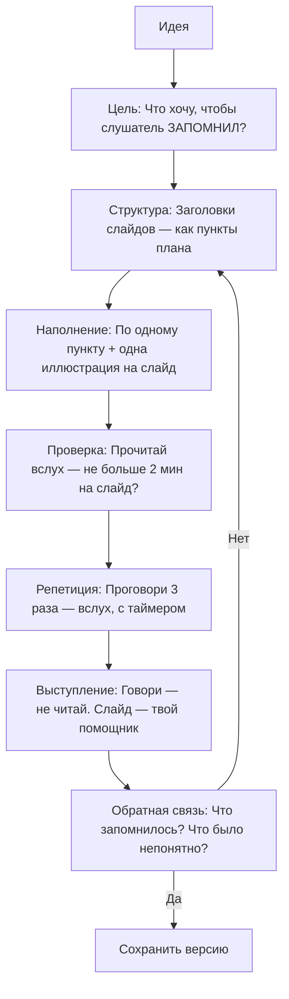
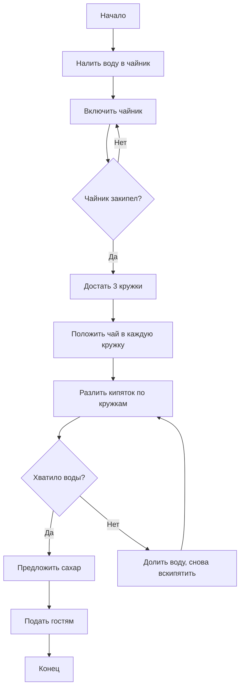

---
title: 9.04. Презентации
---

# 9.04. Презентации

<div class="article-tags">
  <span class="tag tag-beginner">ДЛЯ ДЕТЕЙ</span>
  <span class="tag tag-required">ОБЯЗАТЕЛЬНО</span>
</div>
<span class="complexity-badge">Родителям и детям</span>

```
Презентации (структура: заголовок → пункт → иллюстрация)
Правила работы с презентациями
Добавить mermaid схему
Добавить задачи
```

Представь, что у тебя есть отличная идея — например, как сделать школьный двор удобнее для игр, или как построить робота, который поливает цветы. Ты можешь долго рассказывать об этом словами — и, возможно, тебя поймут. Но что, если ты покажешь эту идею? Добавишь картинки, схемы, короткие фразы, стрелочки между этапами — и вдруг всё становится ясно, как карта метро? Это и есть **презентация**.

---

### Что такое презентация?

**Презентация** — это способ *показать* информацию. Это не просто текст. Это *визуальная поддержка* рассказа.  
Презентация — не замена выступающему. Она — как светофор на дороге: не едет сама, но помогает всем двигаться в правильном направлении, без аварий и путаницы.

Исторически первые презентации делали на доске мелом, потом — на плакатах, диапозитивах (помните слайд-проекторы?). Сегодня презентации создаются в программах: PowerPoint, Google Slides, Canva, Keynote — но суть остаётся одной:  
> **Презентация — это структурированное визуальное сопровождение устного рассказа, помогающее слушателю быстрее понять, глубже запомнить и легче следить за логикой.**

Важно понимать:  
- Презентация **не читается вслух** — это не бумажный доклад.  
- Она **не перегружена текстом** — иначе зритель будет читать, а не слушать вас.  
- Она **не существует сама по себе** — без рассказчика она «немая» и часто неполная.

---

### Из чего состоит презентация? (Структура)

Представь презентацию как путешествие. У любого путешествия есть начало, путь и прибытие. Так и здесь.

#### 1. Заголовок слайда  
Это как название остановки на карте. Он короткий, ясный и отвечает на вопрос: *«О чём сейчас пойдёт речь?»*  
Хороший заголовок — не «Введение» или «Информация», а, например:  
→ *«Как работает солнечная батарея?»*  
→ *«Три шага к чистому школьному двору»*  

Он помогает мозгу слушателя «включить нужную программу» — подготовиться к теме.

#### 2. Пункт (или пункты) содержания  
Это не список дел, а **ключевые мысли**, логически выстроенные. Каждый пункт — как шаг в объяснении.  
Идеальный пункт:  
- Не длиннее 1–2 строк  
- Написан простыми словами  
- Использует глаголы действия («сравним», «построим», «увидим»)  
- Избегает жаргона (если термин нужен — его объясняют отдельно)

Пример:  
❌ *«Процесс фотосинтеза включает поглощение фотонов хлорофиллом…»*  
✅ *«Растение ловит солнечный свет — как ладошкой ловит мячик»*

#### 3. Иллюстрация  
Это визуальная опора: картинка, схема, график, фото, анимация, значок.  
Мозг человека обрабатывает изображения в **60 000 раз быстрее**, чем текст. Поэтому хорошая иллюстрация может заменить абзац — и сделать его понятнее.  
Но! Иллюстрация должна быть **релевантной** — то есть прямо связанной с пунктом.  
→ Если вы говорите о цикле воды — покажите схему «испарение → облака → дождь → река».  
→ Если объясняете, как работает алгоритм — нарисуйте блок-схему или пошаговую стрелочную диаграмму.

---

### Почему структура «заголовок → пункт → иллюстрация» работает?

Потому что она уважает **рабочую память** человека.  
Рабочая память — это то, что удерживает информацию «прямо сейчас». У взрослого она вмещает ~7 элементов, у ребёнка — ещё меньше. Если на слайде 5 абзацев текста, мозг перегружается и «отключает приём».  
Но если:  
- заголовок задаёт тему (1 элемент),  
- пункт — одну мысль (2-й элемент),  
- иллюстрация — визуальную модель (3-й элемент, но обрабатывается в другом канале — зрительном),  

то нагрузка распределяется, и понимание растёт.

Это называется **принципом модальности** (из теории когнитивной нагрузки): когда текст и изображение работают вместе, а не дублируют друг друга, обучение эффективнее.

---

### Презентация vs. Доклад vs. Плакат

|                     | Презентация | Доклад (текст) | Плакат |
|---------------------|-------------|----------------|--------|
| **Формат**          | Слайды + речь | Только текст | Статичное изображение |
| **Цель**            | Помочь *рассказать* | Дать *прочитать* | Привлечь внимание в проходе |
| **Текста на единицу** | Минимум (ключевые слова) | Максимум | Средне (заголовки + подписи) |
| **Автономность**    | Низкая (нужен рассказчик) | Высокая | Средняя |

Презентация — это **диалог через экран**. Ты говоришь — слайд поддерживает. Ты замолкаешь — слайд молчит. Они идут в паре.

---

## Часть 2. Как строить презентацию, чтобы она *работала*

### Правила работы с презентациями  
(или: Почему некоторые презентации «засыпают», а другие — цепляют?)

Представь, что ты смотришь на экран. Что происходит в твоей голове?

- Если на слайде **много текста** — ты начинаешь читать.  
- Если текст **мелкий или бледный** — ты напрягаешь глаза.  
- Если цвета **сливаются** (жёлтый на белом, синий на чёрном) — ты отводишь взгляд.  
- Если слайды **одинаковые** — мозг решает: «Здесь ничего нового», и переключается на TikTok в голове.

Чтобы этого не случилось, существуют проверенные правила. Они не «законы», но скорее — **законы восприятия человека**. Нарушать их можно — но тогда вы рискуете, что вашу идею *не услышат*.

---

#### Правило 1. Один слайд — одна мысль  
Не пытайтесь «втиснуть всё сразу». Это как пытаться засунуть в рюкзак одновременно велосипед, палатку и холодильник. Лучше сделать три отдельных похода.

→ Пример плохого слайда:  
*Заголовок: «Экология»*  
*Текст: Проблемы загрязнения, виды отходов, переработка, законы, инициативы школ, личный вклад…*  

→ Пример хорошего подхода:  
- Слайд 1: *«Откуда берётся мусор?»* + фото свалки + 3 источника (дом, школа, магазин)  
- Слайд 2: *«Что происходит с пластиком?»* + анимация разложения за 450 лет  
- Слайд 3: *«Как мы можем помочь?»* + 3 простых действия (раздельный сбор, отказ от трубочек, ремонт вместо замены)

Каждый слайд — как кадр в фильме: сам по себе неполный, но в цепочке создаёт историю.

---

#### Правило 2. Текст — только опорные слова  
Слайд — не шпаргалка для слушателя. Это **визуальная подсказка** для рассказчика *и* слушателя.  
Идеальное соотношение:  
- **10–20 слов на слайд** (максимум!)  
- Размер шрифта — не меньше **24 pt** (чтобы видно с последней парты)  
- Никаких «и т.д.», «как известно», «некоторые учёные считают…» — только суть.

**Почему?**  
Пока зритель читает, он не слушает. А речь идёт быстрее чтения. Если вы говорите *одно*, а на слайде написано *другое* — мозг путается. Это называется **когнитивным конфликтом**.

> ✅ Хорошо:  
> *Заголовок: «Как работает Wi-Fi?»*  
> *Пункт: Радиоволны → роутер → устройство*  
> *Иллюстрация: Волны, исходящие от роутера к ноутбуку*  

> ❌ Плохо:  
> *Заголовок: «Wi-Fi»*  
> *Текст: Беспроводная локальная сеть IEEE 802.11, использующая диапазоны 2,4 и 5 ГГц, работает по принципу модуляции несущей частоты…*

---

#### Правило 3. Цвета и контраст — для ясности, не для красоты  
Да, красиво — приятно. Но **ясно** — важнее.  
Основной принцип: **фон и текст должны контрастировать**.

| Фон        | Хороший текст | Плохой текст |
|------------|---------------|-------------|
| Белый      | Тёмно-синий, чёрный, тёмно-зелёный | Жёлтый, светло-серый, оранжевый |
| Тёмный     | Белый, жёлтый, светло-голубой | Фиолетовый, бордовый, тёмно-зелёный |

Никаких радужных градиентов на тексте. Никаких «эффектов 3D» для букв — они только мешают фокусу.

Совет: проверьте слайд, переведя его в чёрно-белый режим. Если что-то «пропало» — значит, контраст недостаточен.

---

#### Правило 4. Картинки — не украшение, а объяснение  
Фото с улыбающимися детьми «для настроения» — это декор.  
Фото ребёнка, держащего в руках мусор и стоящего у контейнера для раздельного сбора — это **объяснение**.

Хорошая иллюстрация отвечает на вопрос: *«Почему именно так?»*  
Плохая — просто «смотрит».

Где брать изображения?  
- **Бесплатные стоки**: Wikimedia Commons, Unsplash, Pixabay (ищи по ключевым словам: *«recycling process diagram»*, *«robot arm simple»*)  
- **Свои рисунки** — даже простые схемы от руки (можно сфоткать и вставить!)  
- **Скриншоты** — если объясняешь, как что-то сделать на компьютере  

Важно: всегда указывай источник, если изображение не твоё. Это — уважение к другим.

---

#### Правило 5. Анимации и переходы — только по делу  
Анимация — это не «огоньки» и «звёздочки». Это **направление внимания**.

→ Хорошо:  
Появление стрелок **по очереди**, чтобы показать последовательность шагов:  
1. Загрузка → 2. Обработка → 3. Ответ  

→ Плохо:  
Все объекты вылетают с треском, крутятся и исчезают. Это как если бы учитель хлопал в ладоши, кричал и прыгал, объясняя таблицу умножения.

Совет: если анимация не помогает понять логику — уберите её. Лучше чётко и статично, чем «весело» и путано.

---

### Mermaid-схема: Жизненный цикл презентации

Презентация — не файл. Это **процесс**. Вот как он устроен:



Эта схема показывает:  
- Презентация начинается **не с PowerPoint**, а с вопроса: *«Что я хочу, чтобы человек унёс с собой?»*  
- Она требует **итераций** — редко получается идеально с первого раза.  
- Главный критерий успеха — **не красота слайдов**, а то, что запомнилось слушателю.

---

### Презентационное мышление: учимся думать структурно

Презентации учат не только говорить — они учат **думать**.  
Когда ты строишь презентацию, ты учишься:

1. **Формулировать суть** — выделять главное из множества фактов.  
2. **Строить логику** — выстраивать «дорожку» от «я не знал» → «я понял» → «я могу повторить».  
3. **Видеть глазами другого** — предугадывать: «А здесь ему будет непонятно?»  
4. **Работать с ограничениями** — время, слайды, внимание. Это как решать головоломку.

Эти навыки важны не только для школьных проектов — они нужны программисту (объяснить архитектуру), инженеру (защитить решение), учителю, врачу, журналисту… Всем, кто работает с идеями.

---

### Подготовка к задачам: Что будем делать дальше?

В следующей части мы перейдём к **практике**. Вот какие задачи ждут:

1. **Анализ** — посмотри на «плохую» презентацию и найди 5 нарушений правил.  
2. **Проектирование** — придумай структуру из 5 слайдов на тему *«Как устроен компьютер изнутри»* (для 10-летних).  
3. **Рисование схемы** — создай Mermaid-блок-схему для алгоритма *«Как заварить чай, если гостей — трое»*.  
4. **Ремикс** — возьми один слайд из реальной презентации (например, из открытых лекций) и переделай его по правилам.  
5. **Голос** — запиши короткое (1 мин) выступление к одному слайду и проанализируй: совпадает ли речь с визуалом?

---

## Часть 3. Практика: учимся на примерах

### Задача 1. Анализ: найди ошибки

**Задание**:  
Вот слайд из реальной (немного утрированной) школьной презентации:

> *Заголовок: «Интернет»*  
> *Текст (мелкий, серый на белом фоне):*  
> Интернет — глобальная компьютерная сеть, использующая протокол TCP/IP, состоит из множества автономных сетей, объединённых едиными правилами передачи данных. Основные службы: WWW, электронная почта (SMTP, POP3, IMAP), FTP (файловый обмен), Telnet (удалённый доступ), DNS (система доменных имён). История: ARPANET (1969), Тим Бернерс-Ли (1989), первый браузер — Mosaic (1993).  
> *Снизу — фото: старинный компьютер 1970-х с проводами.*

**Вопрос**:  
Сколько нарушений правил ты заметил? Пронумеруй и объясни, *почему* каждое — проблема.

**Разбор (не подглядывай сразу!)**  
1. **Заголовок общий** — «Интернет» ничего не говорит о *фокусе* слайда. О чём именно? История? Устройство? Сервисы?  
2. **Текста слишком много** (~70 слов). Слушатель будет читать, а не слушать.  
3. **Плохой контраст** — серый текст на белом едва различим, особенно с расстояния.  
4. **Жаргон без пояснений** — TCP/IP, SMTP, DNS… Даже взрослый не все запомнит без контекста.  
5. **Иллюстрация не соответствует** — фото ARPANET-компьютера логично для *истории*, но здесь и историю, и технику, и сервисы «смешали в кучу».  
6. **Нет визуальной структуры** — всё сплошным блоком. Глаз не знает, за что «зацепиться».  
7. **Отсутствует связь с рассказом** — такой слайд требует 3–4 минуты чтения, но выступление, скорее всего, идёт быстрее.

**Вывод**: слайд перегружен, не помогает, а мешает. Его нужно разбить минимум на 3.

---

### Задача 2. Проектирование: структура для 10-летних

**Задание**:  
Создай план презентации из **5 слайдов** на тему *«Как устроен компьютер изнутри»* — так, чтобы понял ребёнок 9–11 лет.

**Требования**:  
- Каждый слайд — одна идея  
- Заголовок — вопрос или действие  
- Иллюстрация — схема, метафора или реальное фото  
- Никаких терминов без пояснения

**Пример решения**:

| № | Заголовок | Пункт | Иллюстрация |
|---|-----------|-------|-------------|
| 1 | **Что у компьютера «внутри», как у человека?** | У него тоже есть «мозг», «память», «руки» и «желудок» | Схема: человек ↔ компьютер (мозг → процессор и т.д.) |
| 2 | **«Мозг» — процессор: кто считает быстрее всех?** | Выполняет миллионы действий в секунду — как супер-калькулятор | Фото процессора + анимация: «2 + 2 → 4» за 0,000001 сек |
| 3 | **«Память»: где хранятся мысли?** | ОЗУ — кратковременная (как записка на руке), жёсткий диск — долговременная (как книжная полка) | Две коробки: «Сейчас» (ОЗУ) и «Навсегда» (HDD/SSD) |
| 4 | **«Руки и ноги» — устройства ввода и вывода** | Клавиатура, мышь → сообщают; экран, колонки → отвечают | Стрелочная схема: ты → клавиатура → компьютер → экран → ты |
| 5 | **Как всё работает вместе?** | Ты нажал «Пуск» → процессор получил команду → загрузил из памяти → показал на экране | Анимированная цепочка из предыдущих слайдов |

**Почему это работает**:  
- Использована **аналогия с телом** — ребёнок уже знает, как устроен *он сам*.  
- Нет слов «материнская плата», «шина данных», «BIOS» — только функции.  
- Каждый слайд можно проговорить за 60–90 секунд.

---

### Задача 3. Рисование схемы: Mermaid-алгоритм

**Задание**:  
Нарисуй блок-схему алгоритма *«Как заварить чай, если гостей — трое»* с помощью Mermaid. Учти:  
- Есть чайник, чай, сахар, кружки  
- Нужно, чтобы всем хватило горячей воды  
- Можно использовать условие («если… то…»)

**Решение**:



**Что учит эта задача**:  
- Презентация может включать **алгоритмы** — особенно если тема связана с IT.  
- Mermaid позволяет встраивать схемы прямо в документ (например, в Obsidian, Notion или Markdown-файлы).  
- Даже бытовые действия — это последовательности шагов с проверками.

---

### Задача 4. Ремикс: переделай слайд

**Задание**:  
Вот слайд из открытой лекции по Python для школьников:

> *Заголовок: «Циклы»*  
> *Текст:*  
> `for i in range(5):`  
> `    print(i)`  
> Вывод: 0, 1, 2, 3, 4  
> Цикл `for` повторяет блок кода заданное число раз. `range(5)` создаёт последовательность от 0 до 4.

**Переделай его по правилам. Добавь иллюстрацию-метафору.**

**Улучшенная версия**:

> **Заголовок**: *«Цикл for — как конвейер на фабрике игрушек»*  
> **Пункт**:  
> - Конвейер делает 5 игрушек по одной  
> - Команда `range(5)` — это «сделать 5 раз»  
> - `print(i)` — наклейка с номером: 0, 1, 2…  
> **Иллюстрация**:  
> Простая схема:  
> `[Старт] → [1] → [2] → [3] → [4] → [Стоп]`  
> Под каждой цифрой — игрушка с биркой: «№0», «№1»…  
> Справа — код в рамке (как «инструкция оператора»), но **не в центре**, а как дополнение.

**Почему лучше**:  
- Метафора даёт *ощущение* повторения.  
- Код остаётся, но не доминирует.  
- Акцент на *смысле*, а не синтаксисе.

---

### Задача 5. Голос: речь и слайд — в унисон

**Задание**:  
Запиши на диктофон (или проговори вслух) 60-секундное выступление к слайду:

> *Заголовок: «Почему лёд плавает?»*  
> *Пункт*: Вода при замерзании расширяется → лёд легче воды  
> *Иллюстрация*: Стакан с водой, лёд сверху + схема молекул (жидкость — плотно, лёд — рыхло)

**Контрольные вопросы после записи**:  
1. Ты сказал всё, что на слайде?  
2. Ты сказал *что-то ещё*, чего нет на слайде (например, «это редкость в природе»)?  
3. Ты *не читал* слайд, а использовал его как опору?  
4. Ты сделал паузу перед ключевой мыслью (*«лёд легче воды»*)?

**Цель упражнения**:  
Научиться **говорить**, а не «озвучивать текст». Хорошее выступление — это как ведение за руку: ты идёшь вперёд, а слайд показывает, куда ступить следующим шагом.

---

## Шаблон «5+1»: стандартная структура для школьных проектов

Чтобы не запутаться, используй проверенную схему:

| Слайд | Назначение | Пример для темы *«Роботы будущего»* |
|-------|-------------|-------------------------------------|
| 1. Загадка | Интрига, вопрос, факт-удивление | *«Знаете ли вы, что роботы уже учатся… дружить?»* + фото робота, берущего за руку ребёнка |
| 2. Карта | Главные разделы презентации | 3 пункта: «Что умеют сегодня», «Как учатся», «Что будет завтра» |
| 3–5. Суть | По одному разделу на слайд | Каждый — заголовок-вопрос + 1 идея + иллюстрация |
| +1. Призыв | Что делать дальше? | *«Хочешь попробовать? Собери первого робота из LEGO Mindstorms!»* + QR-код на инструкцию |

Этот шаблон работает на 95% школьных и кружковых выступлений. Он даёт **структуру**, но не ограничивает творчество.

---

## Советы по выступлению (не только для стеснительных)

1. **Дыши** — перед началом сделай два глубоких вдоха. Это снижает пульс.  
2. **Смотри на лоб** — если стесняешься смотреть в глаза, смотри между бровями. Слушателю кажется, что ты смотришь *в глаза*.  
3. **Говори медленнее, чем думаешь** — нормальная речь — 100–120 слов/мин. Волнение ускоряет до 180+.  
4. **Делай паузы** — после заголовка, перед выводом. Пауза — не тишина, а «воздух для мысли».  
5. **Не извиняйся** — «Извините, я не очень готов…» снижает доверие. Лучше: *«Сейчас покажу, как это работает — шаг за шагом»*.

Помни: слушатели **рады**, что ты делишься. Они *не ждут ошибки*. Они ждут — *понять*.

---

