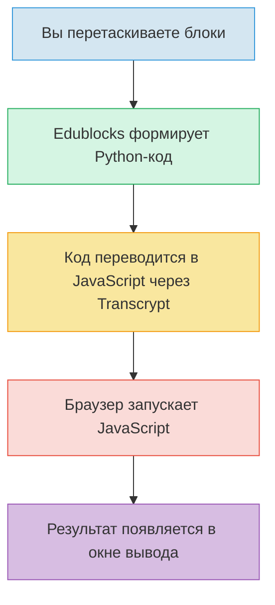

---
title: 9.05. Edublocks
---

# 9.05. Edublocks

<div class="article-tags">
  <span class="tag tag-beginner">ДЛЯ ДЕТЕЙ</span>
  <span class="tag tag-required">ОБЯЗАТЕЛЬНО</span>
</div>
<span class="complexity-badge">Родителям и детям</span>

```
Edublocks
Python-подобный синтаксис
Простые структуры: print, input, if, for
Проекты: викторина, калькулятор, анимация.
Добавить mermaid схему
Добавить задачи
```

### 1. Что такое Edublocks?

Представьте, что вы хотите собрать домик из конструктора LEGO®. У вас есть много разных деталей: кирпичики, окна, двери, крыша. Вы не придумываете их сами — они уже готовы. Вам нужно только правильно выбрать нужные детали и соединить их в правильном порядке. Всё! Домик готов.

**Edublocks — это такой же конструктор, только для программирования.**  
Вместо кирпичиков — *блоки*. Каждый блок — это одна команда, одна идея, одно слово из языка программирования Python. А вы — архитектор программы. Вы не печатаете код строчка за строчкой (хотя в будущем, конечно, научитесь!), а *собираете* его, как пазл.

Это особенно удобно, когда вы только начинаете. Потому что:
- не нужно запоминать, как пишется каждая команда — блок уже написан за вас;
- нельзя ошибиться в скобках или двоеточиях — блоки просто не соединятся, если что-то не так;
- видно структуру программы целиком — как устроена логика, где что происходит.

> 💡 **Запомните:** Edublocks — это не «упрощённый Python». Это *визуальное представление* настоящего Python-кода. Когда вы перетаскиваете блок `print("Привет!")`, Edublocks «про себя» генерирует настоящую строку кода `print("Привет!")` и запускает её. То есть — это не игра, а *обучающая оболочка* для реального языка.

---

### 2. Как устроен сайт Edublocks?

Открыв сайт Edublocks (например, `https://edublocks.org`), вы сразу увидите три основные зоны. Они работают вместе, как три части одного механизма.

#### 🟦 Левая панель — «Ящик с блоками»  
Здесь хранятся все команды, которые можно использовать. Блоки сгруппированы по категориям — как инструменты в ящиках на верстаке механика:
- **Ввод и вывод** — команды `print` и `input`;
- **Логика** — `if`, `else`, сравнения (`>`, `<`, `==`);
- **Циклы** — `for`, `while`;
- **Математика** — сложение, умножение, случайные числа;
- **Звуки и рисование** — для анимаций и игр.

Каждый блок выглядит как фигурная деталь: у него есть «выступы» и «впадины», чтобы его можно было «защёлкнуть» к другому блоку. Например, блок с `if` имеет «карман» под условие, а внутри него может быть целая «вкладка» из других блоков — тело условия.

#### 🟥 Центр — «Рабочая область»  
Это ваша «верстак-стол», куда вы перетаскиваете блоки и собираете из них программу. Вы можете:
- перетаскивать блоки мышкой;
- соединять их — кликнули на один, «прицепили» к другому;
- выделять группу блоков и двигать их все сразу;
- удалять блок — просто перетащите его в корзину или нажмите Delete.

Важно: порядок блоков имеет значение! Компьютер выполняет их *строго сверху вниз*, как рецепт: сначала вымыть руки, потом налить муку, потом добавить яйцо… Если перепутать — торт не получится.

#### 🟩 Правая панель — «Окно вывода»  
Здесь появляется то, что «говорит» программа. Если вы написали `print("Здравствуй, мир!")`, то после запуска именно здесь появится фраза *Здравствуй, мир!*  
Если программа спрашивает `input("Как тебя зовут?")`, то в этом окне появится поле для ввода — и вы можете напечатать свой ответ. А дальше программа продолжит работу, используя то, что вы ввели.

А ещё здесь выводятся ошибки. Но не пугайтесь! В Edublocks ошибки показываются понятно: не «SyntaxError: invalid syntax», а, например:  
> *«Не хватает условия после if — добавьте блок сравнения, например: 5 > 3».*

---

### 3. Что такое онлайн-интерпретатор? И почему он «онлайн»?

Когда вы пишете программу, компьютер не понимает её сразу. Ему нужно *перевести* человеческие команды в язык машин — нули и единицы. Этим занимается **интерпретатор** — специальная программа, которая:
1. читает ваш код (или блоки),
2. проверяет, правильно ли он устроен,
3. выполняет команды по одной, как дирижёр оркестром.

В Edublocks интерпретатор встроен прямо в сайт — и работает **в браузере**, без установки программ на компьютер. Это и значит *«онлайн»*:
- не нужно скачивать Python;
- не нужно настраивать среду;
- открыл вкладку — и готов программировать.

> 🔬 **Интересный факт:** Edublocks использует технологию *Transcrypt* — это инструмент, который превращает Python-код в JavaScript, чтобы он мог работать в браузере. То есть ваша программа сначала «собирается» из блоков в Python, потом переводится в JavaScript — и уже *этот* код запускается прямо у вас в окне браузера. Как переводчик на конференции: сначала фраза на русском → перевод на английский → слушатели понимают.

---

### 4. Python-подобный синтаксис: почему «подобный»?

Edublocks следует правилам Python, но немного адаптирует их ради ясности. Например:

| В настоящем Python | В Edublocks | Зачем изменено? |
|-------------------|-------------|----------------|
| `print("Привет")` | блок `напечатать "Привет"` | Чтобы не путать кавычки, скобки — в блоке текст уже «встроен». |
| `if x > 5:` | блок `если` → «карман» для `x > 5` → «тело» под ним | Визуально показано: условие отдельно, действие — внутри. |
| `for i in range(5):` | блок `повторить 5 раз` | Сразу ясно, *сколько* раз, без `range`, `i`, двоеточий. |

Это не упрощение — это *выделение сути*. Ребёнок сначала понимает:  
→ *«если» — значит, проверка;*  
→ *«повторить» — значит, цикл;*  
→ *«напечатать» — значит, вывод на экран.*  

Когда базовая логика усвоена, переход к настоящему Python происходит почти без боли: ведь структура уже знакома.

---

### 5. Простые структуры: четыре кита программирования

В Edublocks можно начать с четырёх базовых блоков — и уже создавать работающие программы. Это как четыре стихии: земля, вода, огонь, воздух. Без них — никак.

#### ➤ `напечатать` (`print`)  
Самая первая команда любого программиста. Она ничего не вычисляет — просто *выводит* сообщение.  
Пример:  
```
напечатать "Добро пожаловать в Edublocks!"
напечатать 7 * 6
```  
→ Выведет:  
```
Добро пожаловать в Edublocks!
42
```  
Обратите внимание: текст в кавычках — как надпись на плакате, а число без кавычек — как результат расчёта.

#### ➤ `спросить` (`input`)  
Это «разговор» с программой. Она останавливается и ждёт, пока вы что-то напечатаете.  
Пример:  
```
имя = спросить "Как тебя зовут?"
напечатать "Рад(а) тебя видеть,", имя
```  
→ Если вы введёте *Аня*, программа ответит:  
```
Рад(а) тебя видеть, Аня
```  
Знак `=` здесь не «равно», а «запомни под именем». Как надпись на коробке: *здесь лежит то, что ввёл пользователь*.

#### ➤ `если ... то ...` (`if`)  
Это мозг программы. Она смотрит на условие — и решает, что делать дальше.  
Пример:  
```
возраст = спросить "Сколько тебе лет?"
возраст = число(возраст)      // ← превращаем текст в число
если возраст >= 12:
    напечатать "Ты уже почти взрослый!"
иначе:
    напечатать "У тебя впереди столько интересного!"
```  
Важно: `>=` значит «больше или равно», а `число(...)` — специальный блок, который «переводит» текст `"12"` в число `12`, с которым можно сравнивать.

#### ➤ `повторить N раз` (`for`)  
Когда нужно сделать одно и то же много раз — не копировать блоки, а использовать цикл.  
Пример:  
```
повторить 3 раза:
    напечатать "Бип!"
```  
→ Выведет:  
```
Бип!
Бип!
Бип!
```  

А можно сделать счётчик:  
```
для i от 1 до 5:
    напечатать "Шаг", i
```  
→ Выведет:  
```
Шаг 1  
Шаг 2  
Шаг 3  
Шаг 4  
Шаг 5
```  
Буква `i` — просто имя переменной. Можно назвать `шаг`, `номер`, `счётчик` — главное, чтобы в блоке `напечатать` использовалось то же имя.

---

### 6. Как это работает «под капотом»? (Mermaid-схема)

Вот как Edublocks превращает ваши блоки в работающую программу:



Обратите внимание: на каждом этапе ничего не теряется. Это как копировальный аппарат: оригинал → прозрачная плёнка → печать → готовый лист. Точность сохраняется.

---

### 7. Первые проекты: от «Здравствуй, мир!» — к настоящему приложению

Давайте посмотрим, как из простых блоков рождаются целые программы.

#### 🎯 Проект 1. Викторина «Угадай число»  
Компьютер загадывает число от 1 до 10. Вы пытаетесь угадать. Он говорит: «Много!», «Мало!» или «Победа!».  
*Что используется:* `случайное число`, `спросить`, `если-иначе`, `пока` (цикл с условием).

#### 🧮 Проект 2. Карманный калькулятор  
Пользователь вводит два числа и операцию (`+`, `-`, `*`, `/`). Программа считает и выводит результат.  
*Что используется:* `спросить`, `число(...)`, `если-иначе` (для выбора операции), `напечатать`.

#### 🎨 Проект 3. Анимация «Прыгающий шарик»  
Шарик падает вниз, отскакивает от пола, летит вверх — и так по кругу.  
*Что используется:* `повторить всегда`, `изменить y на -1`, `если касается пола → отразить`, `пауза 0.1 сек`.  
(Здесь подключается модуль *Turtle* или *PyGame Zero* — но в Edublocks он доступен через специальные блоки: `начать анимацию`, `нарисовать круг`, `двигать`.)

> ✅ Все три проекта можно собрать за 20–40 минут — даже если вы впервые видите Edublocks.

---

### 8. Задачи для самостоятельной работы

Попробуйте решить их по порядку. Не бойтесь ошибаться — ошибки в Edublocks *говорят*, что делать. Это как подсказки в игре.

#### 🔹 Уровень «Новичок»  
1. Соберите программу, которая спрашивает имя и возраст, а потом выводит:  
   *«Привет, [имя]! Через 10 лет тебе будет [возраст+10] лет»*.  
2. Сделайте так, чтобы после `напечатать "Готово!"` программа ждала 2 секунды, а потом писала *«…а теперь — сюрприз!»*.

#### 🔹 Уровень «Исследователь»  
3. Создайте викторину из 3 вопросов («Столица Франции?», «2+2*2?», «Сколько планет в Солнечной системе?»). За каждый правильный ответ — +1 балл. В конце — вывод результата.  
   *Подсказка:* используйте переменную `очки`, начальное значение — `0`. При правильном ответе — `очки = очки + 1`.

#### 🔹 Уровень «Конструктор»  
4. Нарисуйте «бегущую стрелку»: символ `>` движется по строке слева направо, оставляя за собой след (`>`, `>>`, `>>>`… до 20 символов), потом стирает всё и начинает заново.

---

### 🔤 Ввод и вывод

🔹 **`напечатать [текст]`**  
→ `print(текст)`  
📌 Поддерживает несколько аргументов: `напечатать "Счёт:", очки` → `print("Счёт:", очки)`.  
Автоматически добавляет перевод строки (`\n`). Чтобы не добавлять — такого блока *нет* в стандартной Edublocks-палитре (целенаправленное упрощение).

🔹 **`спросить [сообщение]`**  
→ `input(сообщение)`  
📌 Всегда возвращает строку. Для чисел — требуется явное преобразование:  
`возраст = число(спросить "Возраст?")` → `возраст = int(input("Возраст?"))`.

🔹 **`пауза [N] секунд`**  
→ `time.sleep(N)`  
📌 Требует импорта: `import time`. В Edublocks он **автоматически добавляется при первом использовании блока паузы**.

---

### 🔢 Переменные и присваивание

🔹 **`[имя] = [значение]`** *(блок с пустыми полями)*  
→ `имя = значение`  
📌 Все переменные — глобальные. Локальные области видимости (внутри функций/блоков) не поддерживаются визуально — но реализуются через параметры кастомных блоков.

🔹 **`увеличить [переменная] на [N]`**  
→ `переменная += N`  
📌 Аналогично: `уменьшить`, `умножить`, `разделить`.

---

### 🧠 Логика и условия

🔹 **`если [условие] то`** *(с «вкладкой» под ним)*  
→  
```python
if условие:
    # тело
```
📌 Отступ — 4 пробела (Edublocks генерирует именно так).

🔹 **`иначе`** *(прикрепляется под `если`)*  
→  
```python
else:
    # тело
```

🔹 **`иначе если [условие]`**  
→  
```python
elif условие:
    # тело
```

🔹 **`[A] > [B]`, `[A] == [B]`, `[A] != [B]`** *(блоки сравнения)*  
→ `A > B`, `A == B`, `A != B`  
📌 Сравнение строк — лексикографическое (`"Аня" < "Боря"` → `True`).  
⚠️ Нет нестрогого сравнения (`>=`, `<=`) как отдельных блоков — но можно собрать через `не (A < B)`.

🔹 **`не [условие]`**, **`[A] и [B]`**, **`[A] или [B]`**  
→ `not условие`, `A and B`, `A or B`  
📌 Приоритет: `not` > `and` > `or`. В блоках — явное группирование за счёт вложенности.

---

### 🔁 Циклы

🔹 **`повторить [N] раз:`**  
→  
```python
for _ in range(N):
    # тело
```
📌 Переменная-счётчик `_` — «невидимая», не используется в блоках. Если нужен номер — см. ниже.

🔹 **`для [i] от [1] до [N]:`**  
→  
```python
for i in range(1, N + 1):
    # тело
```
📌 Нумерация **с 1**, включая `N` — в отличие от Python (`range(1, N)` исключает `N`). Edublocks корректирует это автоматически.

🔹 **`пока [условие]:`**  
→  
```python
while условие:
    # тело
```
📌 Бесконечный цикл возможен, но в Edublocks есть защита: после 10 000 итераций — останов с сообщением *«Возможно, зацикливание»*.

---

### 📦 Данные: списки и словари

🔹 **`новый список`**  
→ `[]`  
📌 Пустой список.

🔹 **`добавить в [список] [элемент]`**  
→ `список.append(элемент)`  
📌 Работает со строками, числами, другими списками.

🔹 **`элемент [список] под номером [N]`**  
→ `список[N - 1]`  
📌 Здесь **главное отличие**: в Edublocks нумерация **с 1**, в Python — с 0. Блок автоматически вычитает 1.

🔹 **`длина [список]`**  
→ `len(список)`

🔹 **`новый словарь`**  
→ `{}`

🔹 **`[словарь]["ключ"] = значение`**  
→ `словарь["ключ"] = значение`  
📌 Ключ — всегда строка (в Edublocks нет поддержки числовых/объектных ключей в визуальном интерфейсе).

🔹 **`[словарь]["ключ"]`** *(блок-«считыватель»)*  
→ `словарь["ключ"]`  
📌 Если ключа нет — ошибка выполнения. Проверить наличие можно через `если "ключ" в словарь:`.

🔹 **`[A] в [список/словарь]`**  
→ `"A" in список` или `"A" in словарь`  
📌 Для словаря проверяет **ключи**, не значения.

---

### 🔢 Математика

🔹 **`[A] + [B]`, `-`, `*`, `/`**  
→ `A + B`, `A - B`, `A * B`, `A / B`  
📌 `/` — всегда *вещественное* деление (как `A / B` в Python 3). Целочисленное деление (`//`) и остаток (`%`) — как отдельные блоки.

🔹 **`остаток от [A] делить на [B]`**  
→ `A % B`

🔹 **`случайное число от [A] до [B]`**  
→ `random.randint(A, B)`  
📌 Требует `import random` (добавляется автоматически).  
⚠️ `A` и `B` — целые; результат — **включительно** (как `randint`, не `randrange`).

🔹 **`случайный элемент из [список]`**  
→ `random.choice(список)`

🔹 **`округлить [число]`**  
→ `round(число)`

🔹 **`синус([угол])`, `косинус([угол])`, `тангенс([угол])`**  
→ `math.sin(math.radians(угол))` и т.д.  
📌 Угол — в **градусах** (в отличие от Python, где радианы). Edublocks автоматически вызывает `math.radians()`.

📌 Все математические функции требуют `import math`.

---

### 🎨 Графика (через Turtle-совместимый API)

🔹 **`начать рисование`**  
→  
```python
import turtle
t = turtle.Turtle()
t.speed(0)
```
📌 Создаётся один экземпляр `t`; повторный вызов — игнорируется.

🔹 **`вперёд [N]`**  
→ `t.forward(N)`

🔹 **`повернуть вправо [угол]`**  
→ `t.right(угол)`

🔹 **`перо вверх`**, **`перо вниз`**  
→ `t.penup()`, `t.pendown()`

🔹 **`цвет [имя]`**  
→ `t.color(имя)`  
📌 Поддерживаемые имена: `"red"`, `"blue"`, `"green"`, `"yellow"`, `"purple"`, `"orange"`, `"black"`, `"white"`.

🔹 **`начать закраску`**, **`закончить закраску`**  
→ `t.begin_fill()`, `t.end_fill()`

🔹 **`очистить экран`**  
→ `turtle.clear()`

📌 После завершения программы окно не закрывается — для обучения.

---

### 🔊 Звук (через упрощённый PyGame Zero API)

🔹 **`проиграть звук "[имя]"`**  
→ `sounds.имя.play()`  
📌 Доступные имена: `"beep"`, `"drop"`, `"laser"`, `"pop"`, `"win"`.  
Требуется:  
```python
import pgzrun
# ... код ...
pgzrun.go()  # в конце
```
→ Edublocks **автоматически добавляет обвязку**, если использован хотя бы один звуковой блок.

---

### 🧩 Кастомные блоки («мои блоки»)

🔹 **`создать блок "[имя]"`**  
→  
```python
def имя():
    # тело
```

🔹 **`создать блок "[имя]" с параметром [x]`**  
→  
```python
def имя(x):
    # тело
```

🔹 **вызов блока `[имя]`**  
→ `имя()`  
🔹 **вызов блока `[имя] с [значение]`**  
→ `имя(значение)`

📌 Возврат значения (`return`) **не поддерживается** в базовой версии Edublocks — только побочные эффекты (печать, изменение глобальных переменных, рисование). Это ограничение сознательное: избегаем сложности на раннем этапе.

---

### ⏹️ Специальные блоки

🔹 **`остановить всё`**  
→ `exit()`  
📌 Завершает программу *немедленно*. Используется редко.

🔹 **`комментарий: [текст]`**  
→ `# текст`  
📌 Визуально — полупрозрачный жёлтый блок. Не влияет на выполнение.

---

### 📌 Важно: что **не поддерживается** в Edublocks (и почему)

| Возможность Python | В Edublocks | Причина |
|--------------------|-------------|---------|
| `try … except` | ❌ | Обработка исключений считается продвинутой темой; ошибки показываются как текст с подсказкой. |
| Классы (`class`) | ❌ | Объектно-ориентированное программирование выходит за рамки «визуального старта». |
| Модули (`import numpy`) | ❌ | Только встроенные (`math`, `random`, `time`, `turtle`, `pgzrun`). |
| Lambda, генераторы, контекстные менеджеры | ❌ | Целевая аудитория — 8–16 лет, акцент на императивной логике. |
| Типизация (`: int`) | ❌ | Не требуется для работоспособности; может отвлекать. |

---