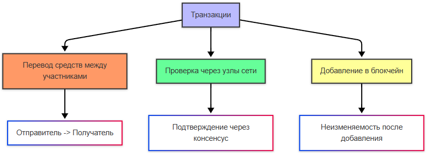
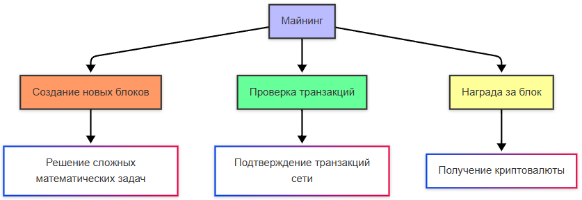
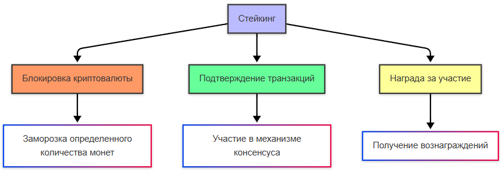

---
title: 9.05. Блокчейн, крипта и NFT
---

# 9.05. Блокчейн, крипта и NFT

  В РАЗРАБОТКЕ
  НЕ ДЛЯ НОВИЧКОВ
  НЕ ОБЯЗАТЕЛЬНО

Всем

## Блокчейн

**Блокчейн** (blockchain) — это децентрализованная цифровая база данных, которая хранит информацию в виде цепочки блоков. Каждый блок содержит данные, такие как транзакции, время создания и уникальный идентификатор (хэш), связанный с предыдущим блоком. Это делает блокчейн устойчивым к изменениям: чтобы изменить один блок, нужно изменить все последующие.

Особенности блокчейна:
	- Децентрализация. В отличие от традиционных баз данных, управляемых центральным сервером, блокчейн распределён по множеству компьютеров (узлов). Это исключает необходимость доверия к одному центру.
	- Прозрачность. Все транзакции видны всем участникам сети, что обеспечивает открытость.
	- Безопасность. Блокчейн защищён криптографией, что делает его практически неуязвимым для взлома.
	- Неизменяемость. После записи данных в блок их нельзя изменить без согласия большинства участников сети.
	- Автоматизация. С помощью смарт-контрактов можно автоматизировать выполнение условий.

# Криптография и криптовалюта

**Криптография** — это наука о защите информации с помощью математических методов. В блокчейне используются криптографические инструменты:
	- Шифрование данных, для защиты конфиденциальной информации.
	- Хэширование, при котором выполняется преобразование данных в уникальные строки фиксированной длины (хэши). Хэши используются для проверки целостности данных.
	- Цифровые подписи для подтверждения подлинности транзакций. Например, пользователь создаёт цифровую подпись с помощью своего приватного ключа, а другие участники сети проверяют её с помощью публичного ключа.

**Криптовалюта** — это цифровая валюта, работающая на основе блокчейна. Она не имеет физической формы и не контролируется центральными банками.

Децентрализация. У криптовалюты нет какого-то центрального цонтроля, сеть узлов является распределённой, а управление происходит через консенсус.

Блокчейн в криптовалюте реализован через цепочки блоков, хранение транзакций и защиту через криптографию:

Процесс транзакций включает в себя перевод средств между участниками, проверку транзакций через узлы сети и добавление транзакций в блокчейн:

Блокчейн, как можно понять из названия (block - блок, chain - цепь), состоит из цепочки блоков. Это блоки можно создавать - такой процесс называется майнингом (mining). Новые блоки создаются, транзакции проверяются, и за создание блока начисляется награда - криптовалюта:

Стейкинг подразумевает блокировку криптовалюты для участия в консенсусе, с дальнейшим подтверждением транзакций и вознаграждением за участие:

Самые известные криптовалюты:
	- Bitcoin (BTC) : Первая и самая популярная криптовалюта, созданная Сатоши Накамото в 2009 году. Используется как средство обмена и накопления.
	- Ethereum (ETH) : Платформа для создания децентрализованных приложений (dApps) и смарт-контрактов.
	- Binance Coin (BNB) : Токен, созданный для использования на бирже Binance.
	- Cardano (ADA) : Блокчейн с акцентом на безопасность и масштабируемость.
	- Solana (SOL) : Высокоскоростной блокчейн для децентрализованных приложений.

Как работают транзакции?
1. Пользователь инициирует транзакцию, указывая адрес получателя и сумму.
2. Транзакция подписывается цифровой подписью с использованием приватного ключа.
3. Транзакция отправляется в сеть, где майнеры (или валидаторы) проверяют её подлинность.
4. После подтверждения транзакция добавляется в блок и становится частью блокчейна.

Криптобиржи — это платформы для покупки, продажи и обмена криптовалют. Примеры:
	- Binance.
	- Coinbase.
	- Kraken.
	
### 1. Основные понятия криптографии

В своей базовой форме криптография — это наука о преобразовании информации таким образом, чтобы только авторизованные стороны могли получить доступ к её содержанию. Для описания этого процесса вводятся следующие базовые термины:

- **Открытый текст** (*plaintext*) — исходное сообщение, представленное в читаемой форме и предназначенное для передачи или хранения. Это может быть текст документа, бинарные данные, сетевой пакет или любой другой цифровой объект.
- **Шифртекст** (*ciphertext*) — результат применения криптографического преобразования к открытому тексту. Шифртекст по своей сути не должен содержать информации о содержании исходного сообщения без обладания дополнительными сведениями.
- **Ключ** (*key*) — секретный параметр, используемый как при шифровании, так и при расшифровании. Без знания ключа восстановление исходного сообщения из шифртекста должно быть вычислительно неосуществимо.
- **Алгоритм** (*cipher*) — детерминированная математическая процедура, определяющая, как именно преобразуется открытый текст в шифртекст. Алгоритм может быть симметричным (один и тот же ключ для шифрования и расшифрования) или асимметричным (разные ключи: открытый и закрытый).
- **Шифрование** (*encryption*) — процесс применения алгоритма к открытому тексту с использованием ключа с целью получения шифртекста.
- **Расшифрование** (*decryption*) — обратный процесс, направленный на восстановление открытого текста из шифртекста с использованием ключа.
- **Криптоанализ** — область науки, изучающая методы, с помощью которых можно раскрыть содержание шифртекста без обладания ключом. Устойчивость криптосистемы оценивается по её стойкости к различным видам криптоаналитических атак.

Эти понятия формируют основу любого криптографического протокола, независимо от сложности и эпохи его происхождения.

---

### 2. Историческая эволюция шифров

Криптография прошла путь от элементарных подстановок до высокоматематизированных систем, основанных на теории чисел и алгебраической геометрии. Рассмотрим ключевые вехи этого пути.

#### Шифр Цезаря

Один из самых ранних известных шифров — шифр Цезаря, приписываемый Юлию Цезарю. Он представляет собой простую замену, при которой каждая буква алфавита сдвигается на фиксированное число позиций. Например, при сдвиге на 3: A → D, B → E и так далее. Несмотря на историческую значимость, этот шифр крайне уязвим: пространство ключей ограничено размером алфавита, а частотный анализ букв позволяет легко его взломать. Он служит иллюстрацией того, что простота реализации не гарантирует безопасность.

#### Шифр Виженера

В XVI веке Блез де Виженер предложил многоалфавитную подстановку, где ключ представляет собой слово, циклически повторяемое над открытым текстом. Каждая буква ключа определяет величину сдвига для соответствующей буквы сообщения. Этот метод значительно усложняет частотный анализ, поскольку одна и та же буква открытого текста может быть зашифрована разными символами. Однако даже Виженеров шифр не является стойким: методы Касиски и Фридмана, разработанные в XIX веке, позволяют определить длину ключа и последовательно расшифровать сообщение.

#### Машина «Энигма»

Во время Второй мировой войны немецкая армия использовала роторную шифровальную машину «Энигма», реализующую сложную полиграммную подстановку с переменной перестановкой алфавита при каждом нажатии клавиши. Несмотря на кажущуюся стойкость (пространство ключей исчислялось миллиардами), машина была взломана усилиями польских и британских криптоаналитиков, включая Алана Тьюринга. Ключевую роль сыграло использование предсказуемых фраз в сообщениях (например, «Heil Hitler»), а также разработка электромеханической машины «Бомба», автоматизировавшей перебор возможных настроек роторов. Этот эпизод стал поворотным моментом в истории криптографии: он продемонстрировал, что даже сложные шифры могут быть раскрыты при недостатке энтропии в ключах и протоколах.

---

### 3. Современная симметричная криптография

С развитием вычислительной техники и возникновением потребности в массовом шифровании данных (например, при передаче через интернет или хранении на диске) возникла необходимость в стандартизированных, быстрых и стойких алгоритмах. Так появилась эпоха блочных и поточных шифров.

#### DES и его преемники

В 1977 году Национальным бюро стандартов США (ныне NIST) был принят стандарт шифрования данных **DES** (*Data Encryption Standard*). DES работал с 64-битными блоками и использовал 56-битный ключ. Уже в 1990-х годах стало ясно, что длина ключа недостаточна для защиты от атак полным перебором: в 1998 году Electronic Frontier Foundation построила специализированное устройство, взломавшее DES за несколько дней. В попытке продлить жизнь DES был предложен **3DES** — тройное применение DES с разными ключами. Однако он оказался медленным и в итоге был признан устаревшим.

#### AES — золотой стандарт симметричной криптографии

В 2001 году NIST утвердил **AES** (*Advanced Encryption Standard*) в качестве нового федерального стандарта. AES — это блочный шифр с фиксированным размером блока 128 бит и поддержкой длины ключа 128, 192 или 256 бит. Он основан на субъективно простой, но математически строгой структуре под названием *Substitution-Permutation Network*. AES сочетает высокую стойкость, эффективность на различных архитектурах и устойчивость к известным атакам. На сегодняшний день не существует практических атак на полнораундовый AES при корректном применении. AES лежит в основе таких технологий, как WPA2/WPA3 для защиты Wi-Fi, шифрование дисков (BitLocker, FileVault, LUKS), защищённые архивы (7-Zip, ZIP с AES), а также TLS при передаче данных по HTTPS.

#### Поточные шифры: ChaCha20

В отличие от блочных шифров, поточные шифры генерируют псевдослучайную последовательность битов (*keystream*), которая побитово накладывается на открытый текст с помощью операции XOR. Такой подход особенно эффективен для потоковой передачи данных и устройств с ограниченными ресурсами. **ChaCha20**, разработанный Дэниелом Бернстайном, стал популярным благодаря своей высокой скорости на процессорах без аппаратной поддержки AES (например, на мобильных устройствах). Он используется в современных версиях протокола TLS (начиная с 1.3), в протоколе QUIC (база HTTP/3) и в мессенджерах, таких как Signal.

#### Устаревшие и небезопасные алгоритмы

Некоторые ранее популярные шифры сегодня считаются небезопасными:
- **RC4** — поточный шифр, широко использовавшийся в SSL/TLS и WEP. Критические уязвимости в его генераторе псевдослучайных чисел привели к его полному запрету в современных протоколах.
- **Blowfish** — хотя и не взломан, его малый размер блока (64 бита) делает его уязвимым к атаке «birthday», особенно при шифровании больших объёмов данных.

#### Режимы работы блочных шифров

Блочные шифры по своей природе работают с фиксированными блоками данных. Для шифрования сообщений произвольной длины используются **режимы сцепления блоков** (*block cipher modes of operation*).

- **ECB** (*Electronic Codebook*) — самый простой режим, при котором каждый блок шифруется независимо. Его главный недостаток — идентичные блоки открытого текста приводят к идентичным блокам шифртекста, что позволяет распознать структуру данных (например, на изображении остаются видимыми контуры). **ECB не рекомендуется к использованию в любых практических сценариях.**
- **CBC** (*Cipher Block Chaining*) — каждый блок перед шифрованием комбинируется (XOR) с предыдущим шифртекстом. Первый блок использует случайный **вектор инициализации** (*IV*), который должен быть уникальным для каждой сессии. CBC обеспечивает лучшую диффузию, но уязвим к атакам на отступления при неправильной реализации (например, атака BEAST в TLS 1.0).
- **GCM** (*Galois/Counter Mode*) — современный режим, сочетающий режим счётчика (*CTR*) с механизмом проверки целостности на основе полей Галуа. GCM обеспечивает **аутентифицированное шифрование с присоединёнными данными** (*AEAD*), то есть одновременно конфиденциальность и целостность. Он широко используется в TLS 1.2/1.3, IPsec и других протоколах, требующих высокой производительности и безопасности.

---

### 4. Асимметричная криптография

Если симметричная криптография требует, чтобы обе стороны заранее обладали общим секретным ключом, то **асимметричная криптография** (или криптография с открытым ключом) решает одну из фундаментальных проблем информационной безопасности — **проблему распределения ключей**. В этой модели каждая сторона генерирует пару ключей: **открытый ключ** (*public key*), который может быть свободно распространён, и **закрытый ключ** (*private key*), который хранится в строгой тайне. Данные, зашифрованные открытым ключом, могут быть расшифрованы только соответствующим закрытым ключом, и наоборот — это свойство лежит в основе всей архитектуры современной цифровой безопасности.

#### RSA — первый практичный асимметричный алгоритм

Алгоритм **RSA**, предложенный в 1977 году Роном Ривестом, Ади Шамиром и Леонардом Адлеманом, стал первым широко применимым методом асимметричного шифрования. Его безопасность основана на вычислительной сложности **факторизации больших целых чисел**: даже при знании произведения двух больших простых чисел (это и есть часть открытого ключа), восстановление самих множителей без закрытого ключа требует неприемлемо больших вычислительных ресурсов при достаточной длине ключа.

RSA используется не столько для шифрования самих сообщений (из-за низкой скорости и ограничений по размеру блока), сколько для:
- **обмена симметричными ключами** (например, в начальной фазе TLS-рукопожатия);
- **создания и проверки цифровых подписей**.

Для обеспечения стойкости к современным атакам рекомендуется использовать ключи длиной не менее 2048 бит; 3072 и 4096 бит считаются более перспективными в контексте развития квантовых вычислений.

#### ECC — криптография на эллиптических кривых

В 1985 году Нил Коблиц и Виктор Миллер независимо предложили использовать **эллиптические кривые над конечными полями** в криптографии. Алгоритмы на основе этой теории получили название **ECC** (*Elliptic Curve Cryptography*). Вместо задачи факторизации ECC опирается на **задачу дискретного логарифма на эллиптической кривой** (ECDLP), которая считается значительно более сложной при эквивалентном уровне безопасности.

Преимущество ECC — **компактность ключей**. Например:
- 256-битный ключ ECC обеспечивает стойкость, сопоставимую с 3072-битным ключом RSA;
- 384-битный ключ ECC ≈ 7680-битный RSA.

Это приводит к существенной экономии памяти, пропускной способности и вычислительных ресурсов — особенно критично для мобильных устройств, встроенных систем и блокчейн-платформ. ECC используется в:
- протоколах **TLS 1.2/1.3** (через кривые P-256, X25519);
- **Bitcoin** и **Ethereum** (для генерации адресов и подписей);
- **Signal**, **WhatsApp** (для сквозного шифрования);
- **SSH** (алгоритмы ecdsa-sha2-nistp256, ed25519).

Особо стоит отметить **EdDSA** (*Edwards-curve Digital Signature Algorithm*), реализацию ECC на кривой **Edwards**, предложенную Дэниелом Бернстайном. Она обеспечивает высокую скорость, устойчивость к побочным каналам и детерминированную генерацию подписей, что исключает ряд уязвимостей, присущих классическим схемам.

#### Протоколы обмена ключами: Diffie–Hellman и его эволюция

В 1976 году Уитфилд Диффи и Мартин Хеллман предложили революционный **протокол обмена ключами**, позволяющий двум сторонам, не имеющим предварительного общего секрета, сгенерировать общий симметричный ключ по открытому каналу связи, прослушиваемому злоумышленником.

Идея проста: стороны выбирают общую базу (например, большое простое число *p* и генератор *g*) и обмениваются публичными частями своих вычислений. Благодаря свойствам модульной арифметики, каждая сторона может вычислить один и тот же общий секрет, но внешний наблюдатель — нет, поскольку ему придётся решить задачу дискретного логарифма.

Современные реализации используют:
- **классический DH** (на конечных полях) — уступает место более эффективным аналогам;
- **ECDH** (*Elliptic Curve Diffie–Hellman*) — вариант на эллиптических кривых, обеспечивающий тот же уровень безопасности с меньшими затратами;
- **X25519** — конкретная реализация ECDH на кривой Curve25519, рекомендованная IETF и используемая в TLS 1.3, Signal и других протоколах.

Важно: базовый DH не обеспечивает аутентификации и уязвим к атаке «человек посередине» (*MITM*). Поэтому в реальных протоколах он комбинируется с цифровыми подписями или сертификатами.

---

### 5. Практическое применение криптографии

Современные криптографические примитивы редко используются в изоляции. Они интегрируются в **криптографические протоколы**, решающие комплексные задачи безопасности.

#### TLS/SSL — основа безопасного интернета

Протокол **Transport Layer Security** (TLS) обеспечивает конфиденциальность и целостность данных при передаче по сети. При установлении соединения (рукопожатии):
1. Сервер передаёт свой сертификат, содержащий открытый ключ (обычно RSA или ECDSA).
2. Клиент проверяет подлинность сертификата через доверенные центры сертификации (CA).
3. Стороны согласовывают симметричный сеансовый ключ — либо через **RSA key transport** (клиент шифрует ключ открытым ключом сервера), либо через **(EC)DHE** — ephemeral Diffie–Hellman, обеспечивающий **perfect forward secrecy** (PFS): даже если закрытый ключ сервера будет скомпрометирован в будущем, прошлые сессии останутся защищёнными.
4. Весь последующий трафик шифруется симметричными алгоритмами (AES-GCM, ChaCha20-Poly1305).

#### SSH — безопасный удалённый доступ

**Secure Shell** (SSH) использует асимметричную криптографию для аутентификации пользователей и серверов. Пользователь генерирует пару RSA или Ed25519 ключей. Открытый ключ размещается на сервере, закрытый — хранится локально. При подключении клиент доказывает владение закрытым ключом без его передачи, используя цифровую подпись. Это исключает необходимость передачи паролей и защищает от перехвата учётных данных.

#### PGP/GPG — шифрование почты и файлов

**Pretty Good Privacy** (PGP) и его свободная реализация **GnuPG** (GPG) реализуют гибридную криптосистему для шифрования электронной почты и файлов. При шифровании сообщения:
- генерируется случайный симметричный ключ;
- сообщение шифруется этим ключом (обычно AES);
- симметричный ключ шифруется открытым ключом получателя (RSA или ECC);
- оба фрагмента передаются вместе.

Такой подход сочетает эффективность симметричного шифрования и удобство распределения ключей в асимметричной модели.

#### Цифровые подписи

Цифровая подпись — криптографический аналог рукописной подписи. Она обеспечивает:
- **аутентичность** (сообщение действительно отправлено владельцем закрытого ключа);
- **целостность** (любое изменение сообщения сделает подпись недействительной);
- **неотказуемость** (*non-repudiation*) — отправитель не может отрицать факт отправки.

Подпись создаётся путём хеширования сообщения и шифрования хеша закрытым ключом. Получатель проверяет подпись, расшифровывая её открытым ключом и сравнивая с хешем полученного сообщения.

---

### 6. Криптография и криптовалюты

Криптовалюты — класс децентрализованных цифровых активов, функционирующих без доверенного центра. Их безопасность и функциональность целиком зависят от криптографических механизмов.

#### Криптографические основы блокчейна

1. **Хеширование**  
   Каждый блок в цепочке содержит хеш предыдущего блока, что создаёт неизменяемую последовательность. Любое изменение данных в блоке приведёт к изменению его хеша и нарушению всей цепи. Используются криптографические хеш-функции (SHA-256 в Bitcoin, Keccak в Ethereum), обладающие свойствами:
   - детерминированности;
   - устойчивости к коллизиям;
   - «лавинного эффекта».

2. **Асимметричная криптография для управления активами**  
   Владение криптовалютой определяется **закрытым ключом**. Адрес кошелька — это хеш открытого ключа (в Bitcoin: `RIPEMD160(SHA256(public_key))`). Чтобы потратить средства, владелец создаёт транзакцию и подписывает её своим закрытым ключом. Сеть проверяет подпись с помощью открытого ключа, включённого в транзакцию. Если подпись верна — транзакция принимается.

3. **Эллиптические кривые в действии**  
   Bitcoin использует стандартную кривую **secp256k1**. Закрытый ключ — случайное 256-битное число; открытый ключ — точка на кривой, полученная умножением базовой точки на закрытый ключ. Обратная операция (восстановление закрытого ключа из открытого) эквивалентна решению ECDLP и считается вычислительно невозможной.

4. **Цифровые подписи: ECDSA и Schnorr**  
   Bitcoin изначально использовал **ECDSA** (*Elliptic Curve Digital Signature Algorithm*). Однако в 2021 году в рамках обновления **Taproot** была добавлена поддержка **Schnorr-подписей**, которые позволяют агрегировать несколько подписей в одну, повышая конфиденциальность и эффективность.

#### Что криптография *не* обеспечивает в криптовалютах

Важно понимать: криптография защищает **достоверность операций**, но не решает проблемы:
- управления приватными ключами (утеря ключа = потеря активов);
- социальной инженерии и фишинга;
- уязвимостей в смарт-контрактах;
- централизации майнинга или валидации.

Криптография — фундамент, но не панацея.

---

## Токены и смарт-контракты

**Токены** — это цифровые активы, созданные на базе существующих блокчейнов (например, Ethereum).

Типы токенов:
	- Фунгируемые токены (Fungible Tokens) - Каждый токен идентичен другому (например, Bitcoin, ETH).
	- НФТ (NFT) - Уникальные токены, представляющие цифровые или физические активы.
	- Утилитарные токены - Предоставляют доступ к услугам или продуктам (например, токены для оплаты комиссий).
	- Секьюрети токены - Представляют долю в компании или проекте.

**Смарт-контракт** — это программа, которая автоматически выполняет условия соглашения, если они соблюдены. Например, если вы покупаете товар, смарт-контракт переводит деньги продавцу только после подтверждения доставки.

Примеры смарт-контрактов:
	- DeFi (децентрализованные финансы), кредитование, стейкинг, обмен токенами.
	- Страхование, автоматическая выплата компенсации при наступлении страхового случая.
	- Игры, распределение наград между игроками.

**NFT** (Non-Fungible Token) — это уникальный токен, который представляет собой цифровой или физический актив. В отличие от обычных токенов, каждый NFT уникален и не может быть заменён другим.

**DeFi** (Decentralized Finance) — это экосистема финансовых сервисов, работающих на блокчейне без участия банков или других посредников.

DeFi-приложения работают на смарт-контрактах, пользователи предоставляют свои активы в пулы ликвидности для получения дохода.

Заблокированные токены приносят проценты — это стейкинг. Децентрализованные биржи (DEX) позволяют обменивать токены напрямую.

