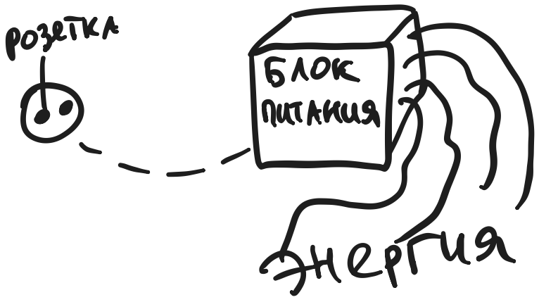
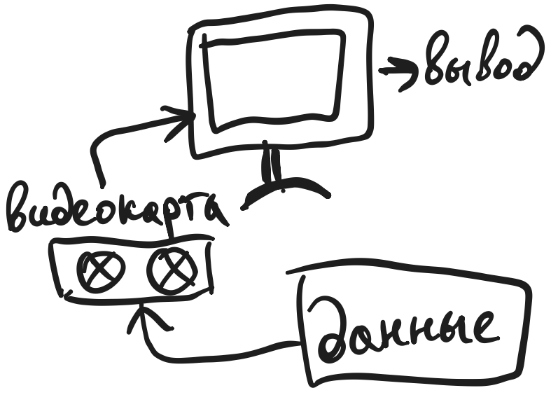
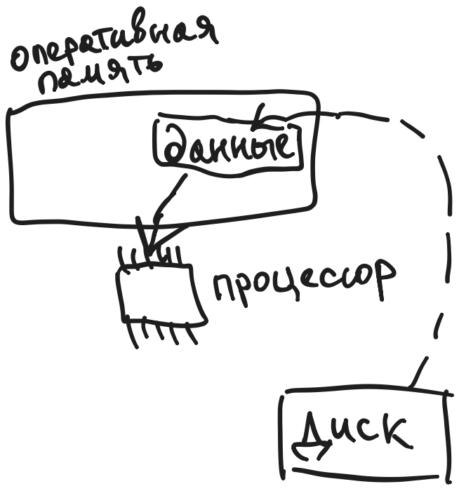
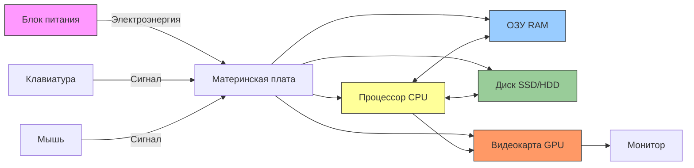
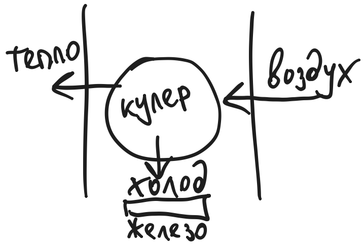

---
title: 9.11.1. Физические компоненты
---

# 9.11.1. Физические компоненты

<div class="article-tags">
  <span class="tag tag-beginner">ДЛЯ ДЕТЕЙ</span>
  <span class="tag tag-required">ОБЯЗАТЕЛЬНО</span>
</div>
<span class="complexity-badge">Родителям и детям</span>

## Физические компоненты

### Что внутри компьютера?

Компьютер — машина, как велосипед или автомобиль, только у неё нет колёс и педалей: вместо них — детали, которые работают с *информацией*. Если вы когда-нибудь разбирали пульт от телевизора или смотрели, как устроен фонарик, то понимаете: всё, что работает, состоит из частей. Компьютер — не исключение.  

Но есть важное отличие: автомобиль перевозит *людей*, фонарик — *свет*, а компьютер — *мысли*. Точнее, он помогает *обрабатывать* мысли: записывать, считать, рисовать, сравнивать, запоминать. Поэтому его части устроены не так, как у других машин. Давайте познакомимся с ними — не торопясь, с примерами, с картинкой и даже с задачами, чтобы вы могли проверить, насколько хорошо запомнили.

Технически, компьютер представляет собой полноценную систему множества элементов, питающихся и обменивающимися электросигналами.

---

### 1. Энергия — топливо мысли

> **Тезис:** *Для работы любого устройства нужна энергия.*

Ничто не работает «само по себе». Даже ваш мозг требует энергии: вы едите, чтобы думать, бегать, смеяться. Так и с компьютером: он не включится, если не получит *электрическую энергию*.  

У маленьких устройств — планшетов, ноутбуков, смартфонов — энергия хранится в **аккумуляторе** (часто называют «батарейкой», хотя это не совсем то же самое). Аккумулятор — как запасной бак с бензином: он заряжается от розетки, а потом отдаёт энергию, пока устройство работает без провода.

У больших компьютеров — настольных ПК — энергия поступает напрямую из розетки через **блок питания**. Блок питания выполняет важную работу:  
- берёт переменный ток из сети (220 вольт — это опасно для внутренностей компьютера!),  
- превращает его в постоянный ток низкого напряжения (обычно 3.3 В, 5 В и 12 В),  
- и *стабильно* подаёт его на все компоненты.

Представьте, что вода течёт по трубам: если напор слишком сильный — трубы лопнут; если слабый — кран не откроется. Блок питания — как умный кран и фильтр одновременно: он следит, чтобы напор был *ровно такой*, какой нужен.



Блок питания - именно то устройство, которое подключают к розетке. Так энергия распределяется по всем компонентам.

> 💡 **Интересный факт**: если вы выключите компьютер, но не отключите его от розетки, блок питания всё равно подаёт *немного* энергии на материнскую плату — чтобы компьютер мог «проснуться» по сигналу с клавиатуры, мыши или по расписанию (это называется *режим ожидания* или *standby*).

---

### 2. Внешние части

Компьютер — как робот, который умеет слушать, говорить и показывать. Но у него нет ушей, рта и глаз — вместо этого есть **устройства ввода и вывода**.

#### 🖱️ Клавиатура и мышь 
Это **устройства ввода**: через них *вы* посылаете команды.  
- Клавиатура — как набор кнопок для слов и чисел. Нажимаете «А» — компьютер получает сигнал: «символ „а“».  
- Мышь — как палочка-указка. Двигаете её — курсор на экране двигается. Щёлкаете — компьютер понимает: «выбрали это».  

Современные устройства могут работать без проводов (по Bluetooth или Wi-Fi), но суть та же: *сигнал → компьютер*.

#### 🖥️ Монитор

Это **устройство вывода**: компьютер показывает через него *результат* своей работы.  
Монитор не «думает» и не «помнит» — он только *отображает*. Как киноэкран: на нём можно увидеть всё — от игры до таблицы с цифрами, — но сам экран не создаёт изображение: его «рисует» видеокарта (о ней — чуть позже).




#### 📦 Системный блок  

Это главный корпус. В нём живут все внутренние части — «мозг», «память», «сердце». Его ещё называют *«башка»*, *«системник»*, *«коробка»*. Но правильнее — **системный блок** (или *case* по-английски — просто «корпус»).

> ⚠️ Важно: ноутбук — это *всё в одном*: клавиатура, мышь (тачпад), монитор и системный блок собраны вместе. Поэтому внутри ноутбука компоненты устроены компактнее — но принципы те же.

---

### 3. Внутренние части

Теперь заглянем внутрь системного блока. Там нет шестерёнок и пружинок — только электронные платы, микросхемы и провода. Но чтобы было понятнее, мы будем использовать **метафоры из жизни** — потому, что ум человеческий так устроен: новое понимается через уже знакомое.

#### 🧠 Процессор (CPU — *Central Processing Unit*)  
Процессор — это главный исполнитель. Он не хранит данные и не рисует картинки — он *решает*, что делать *сейчас*.  

Представьте, что вы собираете пазл. У вас на столе — кусочки (это данные), инструкция (это программа), и вы сами — собираете. Процессор — это *вы*: он берёт следующую инструкцию («найти уголок»), смотрит на кусочки в памяти, проверяет, подходит ли, и решает: «да» или «нет». А потом — следующая команда.  

Современные процессоры выполняют *миллиарды* таких действий в секунду. Один «такт» — как один шаг в танце. Чем выше частота (например, 3 ГГц = 3 миллиарда тактов в секунду), тем быстрее процессор «танцует».

Но важна не только скорость шага — важна и *сложность* шага. Некоторые процессоры могут делать несколько шагов *одновременно* (это называется *многопоточность*). Как если бы у вас было несколько рук для пазла.

#### 📓 Оперативная память (ОЗУ, RAM — *Random Access Memory*)

ОЗУ — это *временная*, *быстрая* память.  

Когда вы открываете программу (например, браузер), компьютер *копирует* её из долговременного хранилища (например, с диска) в ОЗУ. Почему? Потому что процессор может брать данные из ОЗУ **в сотни раз быстрее**, чем с диска.  



Но ОЗУ — как стол: если вы уйдёте и выключите свет (выключите компьютер), всё, что лежало на столе, исчезнет. Ничего не сохраняется. Поэтому перед выключением нужно *сохранить* документ — то есть скопировать его из ОЗУ на постоянное хранилище (диск).

Объём ОЗУ измеряется в гигабайтах (ГБ). Чем больше — тем больше программ можно держать «на столе» одновременно, не мешая друг другу.

#### 📦 Постоянное хранилище (жёсткий диск HDD, SSD, флешка) 
Это **долговременная память**. Здесь лежат:  
- операционная система (Windows, macOS, Linux),  
- установленные программы,  
- ваши фотографии, игры, документы.

Раньше использовали **HDD** — *hard disk drive*: внутри — быстро вращающиеся магнитные диски и «головка», которая читает данные, как проигрыватель виниловых пластинок. HDD дёшевы и вмещают много, но медленны и боятся ударов.

Сейчас чаще ставят **SSD** — *solid-state drive*: никаких движущихся частей. Данные хранятся в микросхемах, как в большой флешке. SSD быстрее, тише, надёжнее — но дороже за гигабайт.

> 📌 Уточнение: **ПЗУ** (*постоянное запоминающее устройство*) — устаревший термин. Раньше так называли микросхемы, в которые данные *записывались один раз* (например, при производстве). Сейчас почти всё постоянное хранилище — *перезаписываемое* (SSD, HDD, флешки), поэтому говорят просто «диск» или «память хранения».

---

### 4. Как всё работает вместе?

Давайте визуализируем связи. Вот упрощённая, но *точная* схема взаимодействия основных компонентов:



Пояснение:  
- **Материнская плата** — это «главная улица города», по которой ездят сигналы и данные. На ней установлены разъёмы для всех компонентов.  
- Процессор общается напрямую с ОЗУ (очень быстро) и с диском (медленнее).  
- Видеокарта — отдельный «художник»: она получает команды от процессора («нарисуй квадрат») и сама формирует изображение для монитора. В простых компьютерах функции видеокарты встроены в процессор (*встроенный GPU*).  
- Клавиатура и мышь подключаются к материнской плате (через USB или Bluetooth) и посылают сигналы *напрямую* процессору.

---

### 5. Практические задачи для закрепления

#### 🔹 Задача 1. «Собери компьютер»  
Перед вами список компонентов. Разделите их на три группы:  
A) Устройства ввода  
B) Устройства вывода  
C) Внутренние компоненты (не видны снаружи)  

Список:  
- SSD-накопитель  
- Монитор  
- Клавиатура  
- Процессор  
- Блок питания  
- Наушники  
- Веб-камера  
- Оперативная память  
- Мышь  
- Принтер  

*(Ответы — в следующей части, чтобы не подглядывали!)*

#### 🔹 Задача 2. «Что будет, если…»  
Объясните, что произойдёт и почему:  
а) Выключили компьютер, не сохранив документ в текстовом редакторе.  
б) Отключили блок питания во время копирования файла с диска на флешку.  
в) Поставили очень мощную видеокарту, но оставили слабый блок питания.  
г) Забыли подключить монитор к видеокарте — но включили компьютер.

#### 🔹 Задача 3. «Метафора наизнанку»  
В тексте выше процессор — «мозг», ОЗУ — «стол». Придумайте *свою* метафору для:  
- SSD-диска  
- Блока питания  
- Материнской платы  
Обоснуйте: почему именно так?

---

## Как всё дышит, гудит и говорит друг с другом

### 6. Видеокарта (GPU)

Если процессор — это *универсальный исполнитель*, то видеокарта — *специалист по геометрии и цвету*.  

Когда вы играете в игру, смотрите видео или просто двигаете окно по экрану, компьютеру приходится *миллионы раз в секунду* отвечать на вопрос:  
> «Какой пиксель (точка на экране) должен быть какого цвета *прямо сейчас*?»

Это — расчёт:  
- где находится каждый объект в 3D-пространстве,  
- как на него падает свет,  
- как он отражает или преломляет лучи,  
- как меняется при движении камеры…  

Всё это — геометрия, тригонометрия, линейная алгебра. Процессор *может* это делать — но он будет делать это *медленно*, потому что занят и другими делами (загрузкой уровня, проверкой правил, сетевым подключением и т.д.).

Видеокарта же состоит из **тысяч маленьких вычислителей**, заточенных *только* под такие задачи. У неё своя оперативная память — **видеопамять (VRAM)**, куда быстро загружаются текстуры («обои» для стен и персонажей), модели и инструкции.  

> 🖼️ **Пример**: представьте, что вы рисуете анимацию. Один художник (процессор) мог бы сам рисовать каждый кадр — но это займёт неделю. А если у вас целая студия (видеокарта), где одни рисуют фон, другие — персонажей, третьи — тени, и все работают одновременно — кадры появляются каждые 1/60 секунды.  

Современные видеокарты используются не только для игр: их применяют для расчётов в науке (моделирование климата, белков), в искусственном интеллекте (обучение нейросетей), потому что «рисовать картинки» и «перемножать матрицы» — с точки зрения железа — почти одно и то же.

> 💡 **Факт**: в телефонах и бюджетных ноутбуках видеокарта *встроена в процессор* (например, Intel UHD Graphics или AMD Radeon Graphics). Это экономит место и энергию, но жертвует производительностью. Отдельная видеокарта (NVIDIA GeForce, AMD Radeon RX) — как отдельная студия вместо одного художника в гараже.

---

### 7. Охлаждение

Процессор и видеокарта — как спортсмены на марафоне: чем интенсивнее работают, тем больше выделяют тепла.  

Почему тепло — проблема?  
- Кремний (материал, из которого делают микросхемы) при перегреве начинает работать *нестабильно*: сигналы искажаются, команды выполняются с ошибками.  
- При температуре выше 95–105 °C большинство процессоров *аварийно отключаются* — чтобы не сгореть.  



Поэтому нужна система охлаждения. Она бывает нескольких типов:

#### 🌬️ Активное воздушное охлаждение  
Самое распространённое. Состоит из:  
- **радиатора** — металлической «башни» из тонких пластин (алюминий или медь). Чем больше площадь — тем лучше отдаёт тепло в воздух.  
- **вентилятора** — «дует» на радиатор, ускоряя отвод тёплого воздуха.  

Часто между процессором и радиатором наносят **термопасту** — специальную пасту, которая заполняет микроскопические неровности. Воздух — плохой проводник тепла; термопаста — хороший. Это как плотно прижать лёд к стеклу: если между ними есть пузырьки воздуха — тает медленно; если прижать плотно — быстро.

#### 💧 Жидкостное охлаждение  
Для мощных систем (игровые ПК, серверы). Вместо воздуха используется *жидкость* (обычно вода с присадками), которая переносит тепло эффективнее.  
- На процессор ставится **водоблок** — металлическая крышка, через которую циркулирует жидкость.  
- Жидкость идёт по трубкам к **радиатору** (часто с вентиляторами), где отдаёт тепло в воздух.  

Это как система отопления в доме: котёл греет воду → по трубам вода доходит до батарей → в комнатах тепло.

#### 🔇 Пассивное охлаждение  
Без вентиляторов. Радиатор большой, массивный — рассчитан на естественную конвекцию (тёплый воздух сам поднимается вверх). Используется в тихих ПК, медиаприставках, некоторых серверах. Но мощность ограничена: если вы не играете и не рендерите видео — хватит; если да — будет перегрев.

> 🔍 **Наблюдение**: включите ноутбук и поиграйте 10 минут в 3D-игру. Потом потрогайте его снизу и сбоку (осторожно!). Чувствуете, как одна сторона горячее? Там — процессор и видеокарта. А вентиляторы шумят громче? Это система «дышит» интенсивнее.

---

### 8. Как данные путешествуют

Представьте город:  
- улицы — это *проводники* на материнской плате,  
- машины — это *пакеты данных*,  
- светофоры и развязки — *контроллеры и чипсеты*.

Все компоненты не соединены напрямую «каждый с каждым» — это было бы хаотично и медленно. Вместо этого есть иерархия «дорог» разной скорости:

#### 🛣️ Шина (bus)
Раньше все компоненты подключались к одной шине (как дома к одной улице). Сейчас так не делают — узкое место.

#### 🚄 PCIe (Peripheral Component Interconnect Express)  
Самая быстрая дорога в современном компьютере. По ней едут:  
- видеокарта (обычно по линии x16 — 16 «полос»),  
- быстрые SSD-диски (NVMe, подключаются прямо в слот PCIe, а не через SATA),  
- сетевые карты высокой скорости.  

PCIe работает как *точка-точка*: у каждого устройства — своя «полоса» до чипсета или процессора. Нет конкуренции за полосу — как выделенная полоса для скорой помощи.

#### 🔌 USB (Universal Serial Bus)
Интерфейс для подключения внешних устройств: мыши, клавиатуры, флешек, принтеров, внешних дисков.  
Версии отличаются скоростью:  
- USB 2.0 — до 60 МБ/с (подходит для клавиатуры),  
- USB 3.2 Gen 2 — до 1 ГБ/с (для внешних SSD),  
- USB4 / Thunderbolt 4 — до 40 ГБ/с (почти как внутренний SSD).  

USB «умный»: он может *питать* устройства (заряжать телефон), передавать данные и даже видео (через USB-C и DisplayPort Alt Mode).

#### 📀 SATA (Serial ATA) 
Используется для подключения HDD и SSD «в форм-факторе 2.5"». Медленнее PCIe, но надёжна и дешева. Максимальная скорость — около 600 МБ/с, что для HDD — более чем достаточно (они физически не могут быстрее), а для SSD — уже тормозит.

#### 📡 Wi-Fi и Bluetooth — «беспроводные тропинки»  
Это радиоволны. Wi-Fi — для интернета и локальной сети (высокая скорость, но чувствителен к помехам). Bluetooth — для коротких дистанций: наушники, мыши, клавиатуры (низкое энергопотребление).

> 🔄 **Как это работает на практике?**  
Вы нажимаете клавишу «W» в игре → сигнал идёт по USB-кабелю → чипсет на материнской плате → процессор → процессор решает: «персонаж должен идти вперёд» → посылает команду видеокарте по PCIe → видеокарта пересчитывает изображение → отправляет его на монитор по HDMI/DisplayPort → вы видите движение.  
Всё это — за *менее чем 16 миллисекунд* (1/60 секунды).  

---

### 9. Виртуальная экскурсия

Посмотрим на фотографию (мысленно — или представьте):

```
[Верх]      → Вентиляторы (вдувают/выдувают воздух)
[Передняя панель] → Кнопка включения, USB-порты, аудиоразъёмы
[Внутри]  
 ├─ Блок питания (снизу или сверху, металлический, с вентилятором)  
 ├─ Материнская плата (большая зелёная плата, покрытая дорожками)  
 │   ├─ Процессор (под квадратным радиатором с кулером)  
 │   ├─ Слоты ОЗУ (длинные разъёмы, в них — прямоугольные планки с микросхемами)  
 │   ├─ Разъёмы PCIe (длинные, разной длины)  
 │   └─ Чипсет (маленький радиатор по центру — «мозг» материнской платы)  
 ├─ Видеокарта (вставлена в самый длинный PCIe-слот, часто крупнее процессора)  
 ├─ Диски:  
 │   ├─ SSD (маленькая «планка», может быть прямо на материнской плате — M.2)  
 │   └─ HDD (металлическая коробка 3.5", крепится в отсеке, слышен лёгкий жужжащий звук)  
 └─ Кабели:  
     ├─ Питание от БП к материнской плате, процессору, видеокарте  
     └─ Данные: SATA-кабели к дискам, USB-кабели к передней панели
```

> 🧭 **Совет для юного исследователя**: если у вас есть старый нерабочий компьютер — попросите взрослого разрешить его *аккуратно* разобрать. Понаблюдайте: какие части тяжёлые? Какие горячие после работы? Как крепятся кабели? *Не включайте его без корпуса* — это опасно. Но просто потрогать, рассмотреть — очень полезно.

---

### 10. Дополнительные задачи и эксперименты

#### 🔹 Задача 4. «Диагностика неисправности»  
Вам рассказали:  
> «Компьютер включается: кулеры крутятся, индикаторы горят. Но на мониторе — чёрный экран. Звуков загрузки нет. Клавиатура не подаёт признаков жизни (Caps Lock не мигает)».  

Какие *три* компонента с наибольшей вероятностью виноваты? Обоснуйте по цепочке: что должно произойти в первую очередь при включении?

#### 🔹 Задача 5. «Сравни технологии»  
Заполните таблицу (можно в тетради):

| Характеристика       | HDD                     | SSD (обычный)         | SSD (NVMe, PCIe)     |
|----------------------|-------------------------|------------------------|-----------------------|
| Принцип работы       |                         |                        |                       |
| Есть движущиеся части? |                         |                        |                       |
| Скорость чтения (примерно) | `~`100 МБ/с           | `~`500 МБ/с             | `~`3500 МБ/с           |
| Устойчивость к ударам |                         |                        |                       |
| Шум при работе       |                         |                        |                       |
| Цена за 1 ТБ (примерно) | ~`2 000 ₽             | `~`4 000 ₽              | `~`6 000 ₽             |

#### 🔹 Эксперимент 1. «Измерь скорость реакции»  
1. Откройте текстовый редактор (Блокнот, Notepad++, Google Docs).  
2. Нажмите и удерживайте клавишу (например, «A»). Через секунду отпустите.  
3. Посчитайте, сколько символов напечаталось.  
4. Разделите на время удержания (в секундах) — получите *частоту опроса клавиатуры* (в герцах).  

Повторите с мышью: быстро двигайте курсор кругами — заметьте, плавно ли он движется, или «скачет». Это зависит от *частоты опроса мыши* (обычно 125 Гц, 500 Гц или 1000 Гц). Чем выше — тем точнее управление (важно в играх!).

#### 🔹 Эксперимент 2. «Тепловая карта»  
Если у вас Windows:  
- Откройте «Диспетчер задач» (Ctrl+Shift+Esc) → вкладка «Производительность».  
- Посмотрите: сколько % загружен процессор? Сколько памяти используется?  
- Запустите браузер с 10 вкладками YouTube — посмотрите, как выросла загрузка CPU и RAM.  
- Запустите игру или Blender (рендер 3D) — посмотрите, как загрузилась *видеокарта* (если есть отдельный GPU — будет отдельный график).  

Это — «пульс» компьютера в реальном времени.

---

## Материнская плата

### 12. Материнская плата

Многие думают: материнская плата — это «подставка», на которую вкручивают всё остальное. На самом деле — это **центральная нервная система компьютера**.  

Она выполняет три ключевые функции:  
1. **Физическая**: даёт крепления, разъёмы, дорожки для всех компонентов.  
2. **Электрическая**: распределяет питание от блока питания с нужным напряжением и током.  
3. **Логическая**: координирует обмен данными между процессором, памятью, дисками, периферией — через *чипсет* и *встроенные контроллеры*.

#### 🧩 Основные элементы платы

| Элемент | Что это | Аналогия | Почему важен |
|--------|---------|----------|--------------|
| **Сокет процессора** | Разъём под CPU — металлическая «раковина» с сотнями контактов | Гнездо для лампочки, но не просто держатель — через него идёт *весь* обмен данными и питанием | Только один процессор может быть установлен. Форма сокета (LGA1700, AM5 и т.д.) определяет, какие CPU подходят. Нельзя поставить Intel в сокет AMD — как левую перчатку на правую руку. |
| **Слоты ОЗУ (DIMM)** | Длинные разъёмы с защёлками по краям | «Карманы для рабочих листов» | Обычно 2 или 4 слота. Компьютер может работать и с одной планкой, но с двумя — быстрее (два канала памяти). Планки должны быть одного типа (DDR4 или DDR5) — физически не вставятся иначе. |
| **Чипсет** | Микросхема (часто под маленьким радиатором) около процессора | «Мэр города» или «начальник станции» | Управляет «второстепенными» дорогами: USB, SATA, PCIe x1, звук, сеть. Процессор — «президент», но не может лично отвечать на каждый запрос от мыши. Чипсет фильтрует, направляет, буферизует. |
| **Разъёмы PCIe** | Длинные слоты разной длины (x1, x4, x16) | «Экспресс-полосы скорой помощи» | x16 — только для видеокарты (или очень быстрых SSD). x1 — для Wi-Fi-адаптеров, звуковых карт. Длина = количество линий = пропускная способность. |
| **Разъёмы питания** | 24-контактный (материнская плата) + 4/8-контактный (процессор) | «Главная и резервная магистрали с топливом» | Без них — ни включение, ни стабильность. Блок питания *обязан* иметь эти разъёмы. |
| **M.2-слот** | Маленький разъём-«пазл» прямо на плате | «Прямой лифт в хранилище» | Сюда вставляются NVMe-SSD — они подключены напрямую к PCIe, минуя SATA. Очень быстро. |

> 🔍 **Наблюдение**: если посмотреть на плату, видно: самые толстые медные дорожки идут от сокета к слотам ОЗУ и PCIe x16. Это — «магистрали высокой нагрузки». Тонкие дорожки — к чипсету, USB, аудиоразъёмам. Это — «улицы районного значения».

---

### 13. Как компьютер «просыпается»

Когда вы нажимаете кнопку **Power**, ничего не происходит мгновенно. Запускается *ритуал пробуждения*, состоящий из строго фиксированных шагов. Он называется **POST** (*Power-On Self-Test* — самотестирование при включении).  

#### Этапы POST:

1. **Подача дежурного питания**  
   Даже при выключенном ПК блок питания подаёт `+5VSB` (Standby) на материнскую плату. Поэтому:  
   - можно включить ПК по LAN (Wake-on-LAN),  
   - USB-порты могут заряжать телефон,  
   - кнопка Power «живая».  

2. **Запуск Super I/O и инициализация минимального железа**  
   Маленький чип на плате (*Super I/O*) включает:  
   - тактовый генератор (начинает выдавать тактовые импульсы — «сердцебиение»),  
   - сброс всех компонентов («все на стартовых позициях!»),  
   - питание процессора и ОЗУ.  

3. **Запуск микрокода процессора**  
   Процессор — не «чистый кремний». В нём есть *микрокод* — программа, зашитая производителем (Intel/AMD), которая управляет *внутренними* операциями (как именно выполнять команду ADD). Она загружается из ПЗУ на материнской плате.  

4. **Запуск BIOS/UEFI**  
   Процессор обращается к микросхеме **SPI Flash** (обычно 16–32 МБ, чёрная, 8-контактная), в которой хранится:  
   - **BIOS** (устаревшее) или **UEFI** (современное) — *прошивка*,  
   - таблицы конфигурации,  
   - драйверы для базовых устройств (клавиатура, видеовыход, Flash-память).  

   > ❗ **BIOS** `≠` **UEFI**:  
   > - BIOS — 16-битная система 1980-х, работает в реальном режиме процессора, макс. 1 МБ адресного пространства. Не поддерживает диски `>`2 ТБ.  
   > - UEFI — 32/64-битная, имеет графический интерфейс, драйверы в формате PE (как Windows), поддерживает Secure Boot, сетевую загрузку, диски до 9 зеттабайт.  

   UEFI — это *мини-операционная система*, загружающаяся *до* Windows/Linux. Она может:  
   - показать интерфейс настройки (F2/Del),  
   - обновить саму себя («прошить BIOS»),  
   - запустить диагностику (MemTest86),  
   - загрузиться с USB даже без HDD.  

5. **Инициализация ОЗУ**  
   UEFI проверяет: сколько планок, какая частота, тайминги. Запускает *калибровку* — находит стабильные параметры для работы. Если ОЗУ неисправна — звуковые сигналы (beep-коды) или сообщение на экране.  

6. **Опрос периферии**  
   - По PCIe — ищет видеокарту. Если нет — использует встроенную графику (если есть).  
   - По SATA/USB — ищет загрузочные устройства (диски, флешки).  
   - По LPC (Low Pin Count) — обращается к TPM-чипу (для шифрования).  

7. **Загрузка ОС (Boot)**  
   UEFI читает *загрузчик* (например, `bootmgfw.efi` для Windows) с выбранного диска и передаёт ему управление. С этого момента — работает уже операционная система.

> 💡 **Практический совет**: если компьютер не включается — *послушайте звуки*.  
> - Один короткий звук — всё в порядке (POST пройден).  
> - Повторяющиеся короткие — ошибка ОЗУ.  
> - Длинный + короткие — ошибка видеокарты.  
> Коды зависят от производителя (AMI, Award, Phoenix), но принцип один: *звук — первая диагностика*.

---

### 14. ОЗУ

Мы говорили, что ОЗУ — «стол». Но как *работает* этот стол?  

#### Физика модуля DDR4/DDR5:
- Планка ОЗУ — это **несколько чипов**, соединённых параллельно.  
- Каждый чип делится на **банки** → **страницы** → **строки и столбцы**.  
- Процессор не говорит «дай байт №1 000 000», а:  
  1. «Активируй банк 3, строку 128» → чип *открывает* всю строку (это медленно — *CAS Latency*),  
  2. «Дай мне столбцы 5–8 из этой строки» → чтение *очень быстро*.  

Поэтому ОЗУ эффективна, когда данные *идут подряд* (как строка в массиве). Если прыгать туда-сюда — много «открытий строк» → тормоза.

#### Почему DDR4 и DDR5 несовместимы?
- DDR4: напряжение 1.2 В, частоты 2133–3200 МГц, 288 контактов.  
- DDR5: 1.1 В, 4800–6400+ МГц, *встроенный контроллер питания* на самой планке, 288 контактов — **но ключ (вырез) смещён**.  

Физически не вставится. И даже если бы — протокол обмена другой. Как попытка вставить SD-карту в слот microSD без адаптера.

#### Два канала памяти
Если установить две одинаковые планки в слоты *одного цвета* (обычно слот 1 и 3), процессор может читать/писать *одновременно* по двум 64-битным каналам → 128 бит за такт.  

Это как две кассы в магазине: одна обслуживает 10 человек за 5 минут, две — 20 человек за те же 5 минут. Не быстрее *каждая*, но больше *в сумме*.

---

### 15. Сетевые интерфейсы

Компьютер редко бывает один. Он входит в *сеть* — локальную (дома) или глобальную (Интернет). Для этого нужны **сетевые контроллеры**.

#### 📡 Ethernet (проводной)
- Разъём RJ-45 (похож на телефонный, но шире).  
- Скорости: 10/100/1000 Мбит/с (Gigabit), 2.5/5/10 Гбит/с (новые платы).  
- В чипсете или отдельной микросхеме (Intel I225, Realtek RTL8125).  
- Передаёт данные *пакетами* — как конверты с адресом получателя.  

#### 📶 Wi-Fi и Bluetooth
- Встроены в материнскую плату (через разъём M.2 Key E) или как отдельная PCIe-карта.  
- Чипы: Intel AX210 (Wi-Fi 6E + Bluetooth 5.3), MEDIATEK, MEDIATEK.  
- Работают в диапазонах 2.4 ГГц (дальше, но помехи) и 5/6 ГГц (быстрее, но хуже проходит стены).  

> 🔌 **Как это «цепляется» к ОС?**  
> Устройство (например, Wi-Fi-адаптер) имеет **MAC-адрес** — уникальный «паспорт» (например, `A4:34:D9:11:22:33`).  
> Когда вы подключаетесь к роутеру, он выдаёт **IP-адрес** (например, `192.168.1.15`) — это уже «почтовый индекс» в локальной сети.  
> Без MAC — устройство не опознается. Без IP — не дойдёт пакет.

#### 🌐 Протоколы: TCP/IP как «почтовая система»
- **IP** — *как* доехать до адреса (маршрутизация).  
- **TCP** — *гарантия доставки*: если пакет потерян — отправит заново.  
- **UDP** — *без гарантии*, но быстрее (видеозвонки, онлайн-игры).  

Представьте:  
- IP — это маршрут от Москвы до Санкт-Петербурга.  
- TCP — курьер с подтверждением получения.  
- UDP — бросить открытку в окно поезда — быстро, но может не долететь.

---

### 16. Периферия будущего

«Периферия» — всё, что подключается *снаружи*. Современные устройства стирают грань между «внутри» и «снаружи».

| Устройство | Как подключается | Что делает «под капотом» |
|-----------|------------------|--------------------------|
| **3D-принтер** | USB / Wi-Fi | Компьютер отправляет *G-код* — инструкции вроде «двигай сопло на 0.1 мм вправо, подавай пластик 210°C». Плата принтера (часто на ARM-процессоре) исполняет их. |
| **VR-шлем (Meta Quest)** | USB-C / Wi-Fi 6E | Передаёт видео *по 90 кадров/сек* на каждый глаз (итого 180 Гбит/с данных!). Использует *сжатие без потерь* (Display Stream Compression). Датчики (гироскопы, камеры) шлют данные о движении головы — компьютер корректирует изображение в реальном времени. |
| **Умные часы** | Bluetooth LE | Работают по *профилям*: HRS (пульс), GPS, ANCS (уведомления). Часы — не «глупый дисплей»: внутри — процессор (например, Nordic nRF52), ОЗУ, Flash, радио. Могут обрабатывать данные *до отправки* на телефон. |
| **Сканер отпечатков** | USB / I²C (встроенный) | Снимает изображение кожи → выделяет узор (минуты, острова) → превращает в *шаблон* (математическое описание, не фото!) → хранит в защищённой зоне (TPM/Secure Enclave). |

> 🌐 **Ключевая идея**: всё это — *вычислительные устройства*. Разница в *специализации*. Часы не заменят ПК — но они *часть распределённой системы*, где каждый узел делает то, что у него лучше всего получается.

---

### 17. Задачи и проекты

#### 🔹 Задача 6. «Сборка на бумаге»  
Вы получили заказ: собрать ПК для школьного кружка робототехники. Требования:  
- Запускать Python-скрипты, Arduino IDE, симуляторы (например, Gazebo).  
- Подключать 3–4 USB-устройства одновременно (робот, камера, датчики).  
- Бюджет — 60 000 ₽.  

Выберите *только эти компоненты* (остальное — в следующих главах):  
- Тип процессора (Intel Core i5 / AMD Ryzen 5 / что-то другое?)  
- Объём и тип ОЗУ (DDR4/DDR5? 16 или 32 ГБ?)  
- Тип диска (SSD SATA, NVMe?) и объём  
- Нужна ли отдельная видеокарта?  
Обоснуйте каждый выбор — исходя из *нагрузки*.

#### 🔹 Проект 1. «Карта POST-кодов»  
Изучите beep-коды для двух производителей BIOS:  
- AMI (American Megatrends)  
- Award/Phoenix  

Создайте таблицу:  
| Код (звуки) | Ошибка | Что проверить в первую очередь? |  
|-------------|--------|-------------------------------|  

Пример:  
| 1 длинный + 2 коротких | Ошибка видеокарты | Проверить, плотно ли вставлена в слот; попробовать другую видеокарту или встроенную графику. |

#### 🔹 Проект 2. «Интерфейсы в доме»  
Пройдитесь по квартире с блокнотом. За 10 минут найдите и запишите:  
- Сколько устройств подключено по **Ethernet**?  
- Сколько — по **Wi-Fi**?  
- Есть ли устройства с **Bluetooth**? Какие профили они используют (наушники? клавиатура?)  
- Есть ли **USB-устройства без ПК** (зарядка, колонка, лампа)?  

Постройте «карту сетей» вашей квартиры — как выглядит цифровая экосистема в реальности.

---

## Хранение, питание и первый шаг

### 18. SSD

Когда мы говорим «SSD», большинство представляет «флешку, но большую». Но флеш-память — это **квантовомеханическое устройство**, и её работа опирается на *туннелирование электронов* через изолятор. Да — речь о квантовой физике внутри вашего ноутбука.

#### 🔬 Структура NAND-ячейки (основа SSD)

В основе SSD — **массив ячеек NAND Flash**. Каждая ячейка — это модифицированный полевой транзистор с *плавающим затвором* (*floating gate*).

```
┌──────────────────────┐
│   Управляющий затвор (Control Gate)  
├──────────────────────┤ ← Тонкий оксидный слой (~5–10 нм)
│   Плавающий затвор (Floating Gate)  ← Здесь «сидят» электроны
├──────────────────────┤ ← Толстый оксидный барьер
│   Канал (Source–Drain)  
└──────────────────────┘
```

- **Запись (Program)**:  
  На управляющий затвор подаётся высокое напряжение (~20 В). Электроны в канале *туннелируют* (квантовый эффект!) через тонкий оксид и попадают в плавающий затвор → ячейка «заряжена» → значение `0`.  

- **Стирание (Erase)**:  
  Напряжение подаётся *на подложку*, а управляющий затвор заземлён. Электроны вытаскиваются обратно → ячейка «разряжена» → значение `1`.  

> ⚠️ **Важно**:  
> - Стирание возможно **только блоками** (обычно 256 КБ–4 МБ),  
> - Запись — **страницами** (обычно 4–16 КБ),  
> - Из-за этого:  
>   - Нельзя просто «переписать» один байт — надо прочитать блок, изменить страницу, стереть блок, записать заново.  
>   - Это создаёт «записной долг» — *write amplification* (WA). Чем выше WA — тем быстрее износ.

#### 📊 Типы ячеек: SLC, MLC, TLC, QLC, PLC

| Тип | Бит/ячейку | Стойкость (циклов) | Скорость | Стоимость | Где используется |
|-----|------------|--------------------|----------|-----------|------------------|
| **SLC** (Single-Level Cell) | 1 | 100 000 | Очень высокая | Очень высокая | Аэрокосмос, медицина |
| **MLC** (Multi-Level Cell) | 2 | 3 000–10 000 | Высокая | Высокая | Серверы, энтузиасты |
| **TLC** (Triple-Level Cell) | 3 | 500–3 000 | Средняя | Средняя | Бытовые SSD (большинство) |
| **QLC** (Quad-Level Cell) | 4 | 100–1 000 | Низкая (при заполнении) | Низкая | Дешёвые SSD, кэширование |
| **PLC** (Penta-Level Cell) | 5 | `<`100 | Очень низкая | Очень низкая | Экспериментальные образцы |

Чем больше бит в ячейке — тем тоньше различия в уровне заряда. При 4 битах (QLC) нужно точно различать **16 уровней напряжения**. Шум, старение, температура — всё снижает точность. Поэтому QLC-диски:  
- при пустом состоянии — быстрые (используют SLC-кэш),  
- при заполнении `>`80% — резко замедляются,  
- требуют мощных контроллеров и алгоритмов коррекции ошибок (LDPC).

#### 🛠️ Wear leveling и TRIM

- **Wear leveling (выравнивание износа)**:  
  Контроллер SSD *перемешивает* физические адреса, чтобы все ячейки изнашивались равномерно. Как если бы вы писали в тетради случайно — чтобы не прорвалась одна страница.

- **TRIM**:  
  Когда ОС удаляет файл, она не стирает данные на SSD — просто помечает блок как «ненужный». Без TRIM SSD не знает этого и будет перезаписывать «мёртвые» данные → рост WA.  
  Команда `TRIM` — это сигнал от ОС: *«блок X больше не используется — можешь стереть его в фоне»*.  
  Работает только при:  
  - поддержке ОС (Windows 7+, Linux 2.6.33+),  
  - поддержке контроллера SSD,  
  - интерфейсе SATA/AHCI или NVMe (USB-SSD часто не поддерживают TRIM!).

> 💡 **Эксперимент**:  
> В Windows:  
> ```cmd
> fsutil behavior query DisableDeleteNotify
> ```  
> Если `0` — TRIM включён.  
> В Linux:  
> ```bash
> sudo lsblk --discard
> ```  
> Если в колонке `DISC-GRAN` и `DISC-MAX` числа — TRIM поддерживается.

---

### 19. Блок питания

Блок питания (БП) — один из самых недооценённых компонентов. Дешёвый БП может:  
- «просаживать» напряжение под нагрузкой → сбои, синие экраны,  
- выдавать пульсации → перегрев компонентов,  
- не справляться с пиковыми нагрузками (например, при старте видеокарты) → отключение.

#### 🔌 Архитектура современного БП (ATX 3.0)

1. **Выпрямление и фильтрация переменного тока**  
   Сетевое напряжение 220 В 50 Гц → диодный мост → ~310 В постоянного тока.  
   Конденсаторы сглаживают пульсации.

2. **Активный корректор коэффициента мощности (Active PFC)**  
   Без PFC компьютер «берёт из сети» ток импульсами — это создаёт помехи и снижает КПД сети.  
   Active PFC превращает синусоиду напряжения в синусоиду тока → КПД сети растёт, БП меньше греется.

3. **Инвертор (LLC-резонансный преобразователь)**  
   Постоянный ток ~310 В → преобразуется в высокочастотный переменный (50–500 кГц) → подаётся на трансформатор.  
   Чем выше частота — тем меньше размер трансформатора. Это позволяет делать компактные БП высокой мощности.

4. **Выпрямление и стабилизация на вторичной стороне**  
   Трансформатор понижает напряжение → диоды Шоттки (меньше потери) → стабилизация до +12 В, +5 В, +3.3 В.  
   Обратная связь через оптрон — гальваническая развязка для безопасности.

5. **Контроллер напряжения (OCP, OVP, UVP, SCP)**  
   - **OCP** — защита от перегрузки по току,  
   - **OVP/UVP** — от перенапряжения/пониженного напряжения,  
   - **SCP** — от короткого замыкания.  
   При срабатывании — БП *аварийно отключается* (не перезагружается!).

#### 📏 Сертификации

| Уровень | КПД при 20% нагрузке | при 50% | при 100% | Мин. мощность для сертификации |
|---------|----------------------|---------|----------|-------------------------------|
| 80 PLUS | 80% | 80% | 80% | Любая |
| Bronze  | 82% | 85% | 82% | — |
| Silver  | 85% | 88% | 85% | — |
| Gold    | 87% | 90% | 87% | — |
| Platinum| 90% | 92% | 89% | — |
| Titanium| 90% | 94% | 91% | `>`1 kW |

Золотой БП 650 Вт при нагрузке 325 Вт (50%) отдаёт 325 Вт, потребляет ~361 Вт → теряет 36 Вт в виде *тепла*. Бронзовый — теряет ~48 Вт. Разница — 12 Вт × 5 часов = 60 Вт·ч/день → ~22 кВт·ч/год. Это — деньги и температура корпуса.

> 💡 **Правило выбора БП**:  
> - Суммарная пиковая мощность системы × 1.3–1.5 (запас на пики и старение),  
> - ATX 3.0 для видеокарт RTX 40xx (у них 12VHPWR-разъём — один кабель вместо 2×8-pin),  
> - Полностью модульный — чтобы не ворошить «гнездо змей» внутри корпуса.

---

### 20. Как собрать ПК самому

Это не «распакуй и вставь». Это **проектирование системы под задачу**. Мы пройдём 7 этапов — от спецификации до первого POST-сигнала.

#### 📋 Этап 1. Формулировка требований (ТЗ)
Пример:  
> *«ПК для занятий в IT-кружке: Python, веб-разработка, базы данных, лёгкое 3D-моделирование (Blender), подключение Arduino и Raspberry Pi. Должен работать 4 часа без перегрева. Бюджет — 70 000 ₽.»*

Из этого делаем выводы:  
- Процессор: много ядер не критично → 6 ядер / 12 потоков достаточно (i5-13400 / R5 7500F),  
- ОЗУ: 32 ГБ DDR5 — Blender и виртуальные машины едят память,  
- Диск: 1 ТБ NVMe SSD — быстрая загрузка проектов,  
- Видеокарта: RTX 3050 или RX 6600 — для GPU-рендера в Blender и обучения нейросетей (CUDA/OpenCL),  
- БП: 550–650 Вт Gold,  
- Охлаждение: башенный кулер — тише и надёжнее боксового.

#### 🧰 Этап 2. Подбор компонентов *с совместимостью*

| Компонент | Выбор | Почему? | Проверка совместимости |
|----------|-------|---------|------------------------|
| **Материнская плата** | MSI PRO B660M-A DDR4 | B660 — поддержка i5-13400, DDR4 (дешевле DDR5), M.2, 6× SATA, 2.5 Гбит Ethernet | Сайт MSI → «Support CPU list» → проверить, есть ли i5-13400 |
| **ОЗУ** | Kingston FURY Beast 32 ГБ (2×16 ГБ) DDR4-3200 | Две планки — двухканальный режим, 3200 МГц — стабильно для B660 | Проверить QVL (Qualified Vendor List) на сайте материнской платы |
| **SSD** | WD Black SN770 1 ТБ (NVMe PCIe 4.0) | Высокая скорость записи, DRAM-кэш отсутствует, но контроллер хорош | Физически встанет в M.2 слот (ключ M), логически — поддержка PCIe 4.0 на B660 (да, есть) |
| **Видеокарта** | Gigabyte RTX 3050 EAGLE | 8 ГБ VRAM — хватит для обучения малых моделей, 170 Вт — БП 550 Вт потянет | Длина 200 мм — проверить габариты корпуса |

> 🛠️ **Инструменты проверки**:  
> - [PCPartPicker](https://pcpartpicker.com) — автоматическая проверка совместимости,  
> - Сайты производителей — QVL, CPU Support List,  
> - [UserBenchmark](https://userbenchmark.com) — реальные замеры производительности.

#### 🔩 Этап 3. Сборка

1. **Подготовка**:  
   - Рабочее место — чистое, без ковров (статика!),  
   - Антистатический браслет или касание батареи отопления каждые 5 минут,  
   - Все компоненты — в антистатической упаковке до момента установки.

2. **Установка CPU**:  
   - Открыть рычаг сокета,  
   - Совместить метки (треугольник на CPU и сокете),  
   - Опустить CPU *без нажима* — он сам сядет на контакты,  
   - Закрыть рычаг — *плавно, но с усилием* (до щелчка).

3. **Термопаста**:  
   - На боксовых кулерах — уже нанесена,  
   - На сторонних — *горошина размером с рисовое зерно* в центр. Не размазывать! Давление кулера равномерно распределит.

4. **Кулер**:  
   - Винты затягивать *по диагонали*, как колёса автомобиля — чтобы плата не искривилась.

5. **ОЗУ**:  
   - Открыть защёлки,  
   - Вставить планку до *чёткого щелчка с обеих сторон* (если не щёлкнуло — перезагрузка не состоится).

6. **Материнская плата в корпус**:  
   - Установить *стойки* (standoffs) — только в отверстия, соответствующие плате,  
   - Не перекручивать винты — можно повредить дорожки.

7. **Кабели**:  
   - 24-pin ATX — до упора (иногда нужно нажать с двух сторон),  
   - 8-pin CPU — рядом с сокетом,  
   - PCIe 8-pin — к видеокарте,  
   - SATA-данные — к SSD/HDD,  
   - SATA-питание — от БП.

> ⚠️ **Самая частая ошибка**: забыть подключить **4/8-pin CPU** или **PCIe к видеокарте**. Результат: POST не проходит, вентиляторы крутятся, но экран чёрный.

#### 🔌 Этап 4. Первое включение (без ОС)

1. Подключить **только**:  
   - БП к сети,  
   - Клавиатуру (USB),  
   - Монитор (к видеокарте, не к материнской плате!).  

2. Нажать Power.  
   - Если один короткий звук и логотип UEFI — успех!  
   - Если зависло на логотипе — зайти в UEFI (Del/F2), сбросить настройки (Load Optimized Defaults).  

3. В UEFI:  
   - Проверить: определилась ли ОЗУ (32 ГБ),  
   - Определился ли SSD (в разделе Storage),  
   - Вентиляторы — в разделе Hardware Monitor (температура CPU `<`50°C в простое).

#### 💾 Этап 5. Установка ОС

- Создать загрузочную флешку (Rufus / BalenaEtcher),  
- В UEFI:  
  - Отключить Secure Boot (если ставите Linux),  
  - Выставить приоритет загрузки — USB первым,  
- Установить ОС,  
- Установить драйверы *только с сайта производителя* (не с диска в коробке!).

---

### 21. Задачи и рефлексия

#### 🔹 Задача 7. «Диагностика износа SSD»  
У вас SSD на 500 ГБ. Через 2 года CrystalDiskInfo показывает:  
- **Health Status**: Good  
- **Total Host Writes**: 1 200 ТБ  
- **Wear Leveling Count**: 92%  
- **Reallocated Sectors Count**: 12  

Что означают эти параметры? Когда ожидать отказа? Можно ли доверять данным?

#### 🔹 Задача 8. «Расчёт БП»  
Система:  
- Ryzen 7 7800X3D (TDP 120 Вт, пик — 160 Вт),  
- RTX 4070 (TDP 200 Вт, пик — 285 Вт),  
- 4 вентилятора × 3 Вт,  
- 2 SSD × 5 Вт,  
- Материнская плата — 30 Вт.  

Какой минимальный БП нужен? Какой — рекомендуемый? Почему?

#### 🔹 Рефлексия 
Напишите 3 утверждения, которые изменили ваше понимание:  
1. Раньше я думал, что…  
2. Теперь я знаю, что…  
3. Это важно, потому что…  

Пример:  
> Раньше я думал, что SSD «ломается», когда заканчивается место.  
> Теперь я знаю, что SSD ломается от *циклического износа ячеек*, даже если место есть.  
> Это важно, потому что резервное копирование нужно делать *регулярно*, независимо от заполнения.*

---