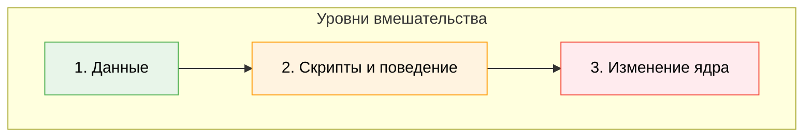
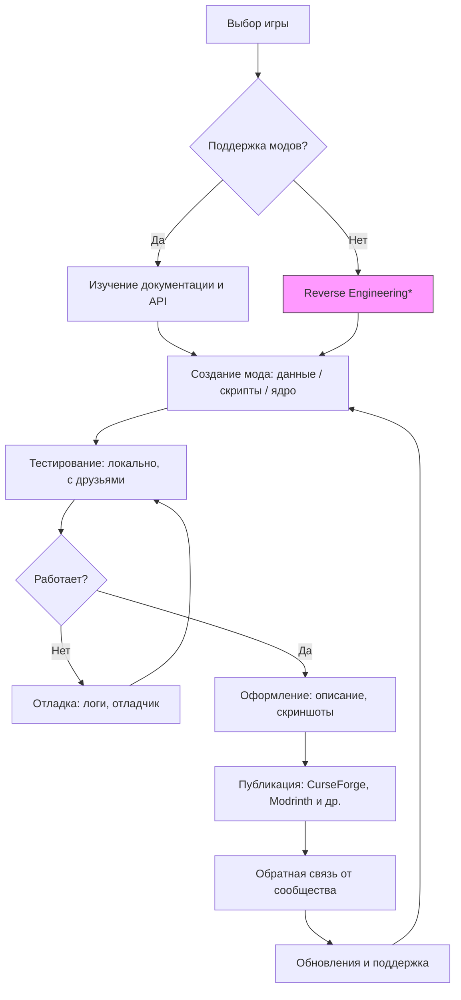
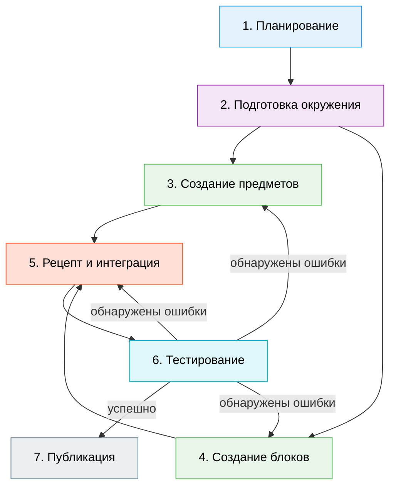

---
title: Моддинг
---

# Моддинг

<div class="article-tags">
  <span class="tag tag-beginner">ДЛЯ ДЕТЕЙ</span>
  <span class="tag tag-required">ОБЯЗАТЕЛЬНО</span>
</div>
<span class="complexity-badge">Родителям и детям</span>

## Моддинг

> *«Моддинг — это как взять готовый конструктор и перестроить его так, чтобы он летал, плавал и решал уравнения — если ты хочешь».*

### Что такое моддинг — и почему это вообще возможно?

Представь, что ты пришёл в кинотеатр и посмотрел фильм. А потом решил: *«А что, если главный герой откроет школу для драконов?»*  
Ты можешь написать сценарий, снять короткометражку, сделать фан-арт — это будет *фандом-творчество*.  
А теперь представь, что у тебя есть доступ к тем же *материалам*, что и у создателей фильма: декорациям, костюмам, сценарию на бумаге… и даже к монтажной программе. Ты можешь переделать сам фильм — добавить сцену, изменить диалог, сделать новый финал.  

В играх это возможно потому, что **всё, что ты видишь и с чем взаимодействуешь — это данные**, а не «железо в коробке».  
Звуки — файлы. Текстуры стен — изображения. Правила боя — программы. Карта леса — координаты точек и описания объектов.  
Если разработчики *предусмотрели* возможность менять эти данные (или не запретили это жёстко), — у тебя есть шанс вмешаться.  

Такая возможность называется **моддингом** (от *modification* — модификация), а то, что получается в результате — **модом** (сокращение от *modification*).  

> 🔍 **Мод — это не обязательно «взлом».**  
> Это *дополнение*, *альтернативная версия* или *расширение* игры, созданное игроками.  
> Иногда моды — это новые персонажи. Иногда — целые вселенные, вшитые в старую игру. А иногда — просто исправление досадной ошибки, которую официальная команда пропустила.

---

### Откуда берутся моды? История в трёх актах

#### Акт I: Warcraft III и рождение сообщества

В 2002 году вышла игра **Warcraft III: Reign of Chaos**. В ней был встроенный инструмент — **World Editor**. Обычно редакторы карт делают только для тестировщиков. Но Blizzard *открыла* его всем.  
И что произошло?

Люди начали создавать *микроигры* внутри Warcraft III:
- «Герои меча и магии» — прохождение с ростом уровня, крафтом, боссами;
- «Tower Defense» — защита базы от волн врагов, расстановка башен;
- «Мультиплеерные арены» — дуэли один на один.

Самый известный мод — **Defense of the Ancients (DotA)** — начался как эксперимент в World Editor. Он настолько увлёк игроков, что позже стал отдельной игрой — **Dota 2**, а её идеи легли в основу целого жанра: **MOBA** (*Multiplayer Online Battle Arena*).

> 💡 Это важный урок: *моддинг может стать началом чего-то большего — даже новой индустрии.*

#### Акт II: Minecraft — когда каждый стал архитектором

В Minecraft (вышла в 2011) моддинг пошёл дальше карт. Здесь:
- **Блоки** — заменяются или добавляются новые;
- **Механики** — появляются магия, технологии, фермы автоматов;
- **Мир** — может стать подводным, космическим или стимпанковским;
- **Интерфейс** — меняется под нужды игрока.

Но самое главное — появился **Forge**, потом **Fabric**, потом **Quilt** — *платформы для модов*. Они позволяют:
- Ставить десятки модов одновременно;
- Убирать конфликты между ними;
- Обновлять игру, не теряя моды.

Сегодня Minecraft — это *тысячи миров*, собранных сообществом. Один из самых известных модпаков — **FTB (Feed The Beast)** — превращает её в сложную инженерную симуляцию: ты строишь ядерные реакторы, автоматизируешь добычу ресурсов, управляешь роботами… и всё это — на основе исходного песочного мира.

#### Акт III: Roblox и моддинг как основа игры

Roblox (запущена в 2006, популярна с 2015+) — это не игра. Это *платформа*, где **вся игра — это мод**.  
Каждый проект в Roblox — это:
- Своя карта («place»);
- Свои правила (написанные на Lua);
- Свои персонажи, предметы, интерфейс.

То есть здесь *нет* «оригинальной игры», которую нужно модифицировать. Вместо этого — готовая среда, в которой ты *сразу* становишься создателем.  
Именно поэтому в Roblox много игр от 10-летних: они не «ломают» чужую работу — они *строят с нуля*, пользуясь проверенными инструментами.

> 📌 Обрати внимание: моддинг — это *спектр*.  
> От простой замены текстур («скинов») до написания нового ядра игры — всё это моддинг.  
> Главное — *степень доступа* и *инструменты*, которые предоставляет разработчик.

---

### Как устроен моддинг? Три уровня вмешательства

Моды бывают разные — и их сложность зависит от того, *насколько глубоко* ты лезешь в игру.



#### Уровень 1. **Данные (Assets & Configs)**  
Это — «мягкое» вмешательство.  
Ты меняешь то, что игра *сама умеет читать*:
- Звуки (.wav, .ogg);
- Изображения текстур (.png);
- Описания предметов (в текстовых или JSON-файлах);
- Параметры: здоровье моба, урон меча, скорость прыжка.

*Пример:* мод, который делает всех зомби в Minecraft розовыми и заставляет их петь «Happy Birthday» при атаке.  
Ты просто подменил файлы звуков и текстуры — и игра сама их использует.

> ✅ Плюсы: безопасно, быстро, не требует программирования.  
> ❌ Минусы: нельзя добавить *новую логику* — только менять то, что уже есть.

#### Уровень 2. **Скрипты и поведение (Scripts & Logic)**  
Теперь ты уже *меняешь, как игра думает*.  
Для этого нужны:
- Язык сценариев (часто Lua, Python, JavaScript, или специальный DSL — domain-specific language);
- Понимание событий: «когда игрок прыгает», «когда монстр умирает», «когда открывается сундук».

*Пример:* в Minecraft-моде ты добавляешь способность «летать ночью», но только если у игрока есть амулет.  
Ты пишешь код:
```lua
if player.hasItem("amulet_of_night") and time.isNight() then
    player.setFlight(true)
else
    player.setFlight(false)
end
```
(Это псевдокод — в реальности синтаксис зависит от движка.)

> ✅ Плюсы: можно создавать новые механики.  
> ❌ Минусы: ошибки в коде могут сломать игру; нужно учить синтаксис и логику.

#### Уровень 3. **Изменение ядра (Core Modding / Reverse Engineering)**  
Самый сложный и спорный уровень.  
Ты *меняешь саму программу игры* — компилируешь исходный код (если он открыт) или декомпилируешь бинарник (если закрыт).  
Часто используется:
- Java-декомпиляция (для Minecraft до 1.12);
- Hex-редактирование (редко, устарело);
- Hook-инъекции (через библиотеки вроде **Detours** на Windows).

*Пример:* мод **OptiFine** для Minecraft — *переписывает части движка рендеринга*, чтобы игра работала быстрее на слабых компьютерах.

> ⚠️ Важно: этот уровень часто нарушает лицензионное соглашение.  
> Некоторые компании разрешают его (Mojang — для Minecraft), другие — блокируют и банят (Activision в Call of Duty).  
> Всегда читай **EULA** (*End User License Agreement*) — соглашение конечного пользователя.

---

### Как начать создавать моды? Пошаговый путь

#### Шаг 1. Выбери игру и цель  
Не начинай с «я сделаю киберпанк-мод для GTA V». Начни с:
- **«Хочу, чтобы в игре X появился новый питомец»**;
- **«Хочу, чтобы в игре Y был другой финал»**;
- **«Хочу, чтобы в игре Z можно было строить мосты из сыра»**.

Лучшие стартовые площадки:
| Игра | Почему подходит | Инструменты |
|------|----------------|-------------|
| **Minecraft (Java)** | Огромное сообщество, документация, готовые среды | Forge MDK, IntelliJ IDEA, Java 17 |
| **Roblox** | Всё онлайн, мгновенная публикация, Lua простой | Roblox Studio (бесплатно) |
| **Stardew Valley** | Открытая архитектура, дружелюбные разработчики | SMAPI, C#, Visual Studio |
| **Factorio** | Моды — часть культуры игры, отличная документация | Lua, встроенный редактор |
| **Unity-игры** (если у тебя есть доступ к исходникам) | Мощно, но сложнее | Unity Editor, C# |

#### Шаг 2. Изучи структуру игры  
Открой папку с игрой (часто: `C:\Program Files\Игра` или `%appdata%\.minecraft`).  
Посмотри:
- Где лежат текстуры? (`assets/textures/`)
- Где конфиги? (`config/`, `options.txt`)
- Есть ли папка `mods`? Если да — игра поддерживает моды «из коробки».

> 🔧 Совет: используй **7-Zip** или **WinRAR**, чтобы открыть `.jar`, `.pak`, `.pak01_dir.vpk` — это архивы. Многие игры хранят данные в сжатом виде.

#### Шаг 3. Найди документацию  
Официальный сайт → «Modding Wiki», «API Docs», «Getting Started».  
Примеры:
- [Minecraft Modding Wiki](https://minecraft.fandom.com/wiki/Modding)
- [Roblox Developer Hub](https://developer.roblox.com/)
- [Stardew Valley Modding Docs](https://stardewvalleywiki.com/Modding:Index)

Не стесняйся читать чужие моды: большинство выложены на GitHub. Открой `.java`-файл — даже если не понимаешь всё, ты увидишь структуру: *как называются функции, как организованы классы*.

#### Шаг 4. Напиши «Hello, World!»-мод  
Простейший пример — мод, который при запуске пишет в чат:  
> `[Мой Первый Мод] Привет, Вселенная!`  

Для Minecraft (на Forge):
```java
@Mod("myfirstmod")
public class MyFirstMod {
    public MyFirstMod() {
        IEventBus bus = FMLJavaModLoadingContext.get().getModEventBus();
        bus.addListener(this::onInitialize);
    }

    private void onInitialize(FMLCommonSetupEvent event) {
        // Выполняется при загрузке игры
        System.out.println("[Мой Первый Мод] Привет, Вселенная!");
    }
}
```
Да, это Java — но не пугайся. Через месяц ты будешь писать это автоматически. Главное — *начать с малого*.

#### Шаг 5. Тестируй и итерируй  
- Запусти игру с модом.
- Что сломалось? Посмотри `latest.log` — там ошибка.
- Исправь → пересобери → запусти снова.
  
Это не провал — это *цикл разработчика*. Даже у профессионалов 90% времени уходит на отладку.

---

### Публикация мода: как поделиться с миром

Когда мод работает — хочется показать другим. Но просто кинуть архив в чат — это как выкинуть книгу в окно и надеяться, что кто-то её прочитает.

Вот как делать правильно:

1. **Оформи описание**  
   - Что делает мод?  
   - С какими версиями игры совместим?  
   - Есть ли зависимости (другие моды, которые надо поставить)?  
   - Как установить? (Пошагово: «распакуй в папку mods»)

2. **Сделай скриншоты и видео**  
   Люди сначала *смотрят*, потом читают. Короткое (30 сек) видео «до/после» — самый сильный аргумент.

3. **Выбери платформу**  
   | Платформа | Для чего | Особенности |
   |-----------|----------|-------------|
   | **CurseForge** | Minecraft, WoW, Stardew и др. | Версионирование, зависимости, автоматическая установка через лаунчер |
   | **Modrinth** | Альтернатива CurseForge, быстрее и современнее | Открытый API, поддержка Fabric/Quilt |
   | **GitHub** | Исходный код | Хорошо для разработчиков, плохо для новичков |
   | **Roblox Library** | Только для Roblox | Встроенная публикация, рейтинги, комментарии |
   | **Nexus Mods** | Старые игры (Skyrim, Fallout, GTA) | Большая аудитория, но строгая модерация |

4. **Соблюдай лицензию**  
   Ты можешь выбрать:
   - **MIT** — любой может использовать, даже в коммерческих проектах;
   - **CC BY-NC-SA** — можно делиться и изменять, но *не для денег* и *с указанием автора*;
   - **All Rights Reserved** — нельзя перепродавать, но можно использовать бесплатно.

> 🌐 Этика моддинга:  
> - Не копируй чужой код без разрешения.  
> - Если используешь чужие текстуры — проверь лицензию (часто — CC0 или CC BY).  
> - Не воруй идеи — вдохновляйся, но делай по-своему.

---

### Схема: как устроен процесс моддинга

Вот `mermaid`-диаграмма — её можно вставить в HTML-версию «Вселенной IT»:



> *Reverse Engineering — извлечение знаний из программы без исходного кода. Юридически спорно. Используй только если разрешено лицензией.*

---

### Задачи для закрепления

#### 🟢 Уровень 1 (8–10 лет)
1. Найди в Minecraft папку `resourcepacks`. Создай новый ресурспак: замени текстуру алмазного меча на изображение банана. Проверь, как это выглядит в игре.  
2. В Roblox Studio открой любой шаблон (например, «Obby»). Измени цвет фона и название игры. Запусти локально.  
3. Посмотри 3 мода на CurseForge. Запиши: какие у них названия, сколько скачиваний, какие версии Minecraft поддерживают.

#### 🟡 Уровень 2 (11–14 лет)
1. Установи **MCreator** (бесплатный визуальный конструктор модов для Minecraft). Создай простой предмет: «Книга заклинаний», которая при использовании даёт эффект скорости на 10 секунд.  
2. Напиши скрипт на Lua для Roblox: когда игрок касается части «Part», ему начисляется 1 очко (используй `leaderstats`).  
3. Найди открытый мод на GitHub. Скачай ZIP, открой в редакторе. Попробуй найти, где задаётся имя предмета, и измени его.

#### 🔴 Уровень 3 (15–16+ лет)
1. Установи **IntelliJ IDEA**, **JDK 17**, **Forge MDK**. Собери «пустой» мод (hello world).  
2. Реализуй мод для Minecraft: при убийстве курицы выпадает *золотое яйцо* с 1% шансом. Используй событие `LivingDropsEvent`.  
3. Спроектируй архитектуру мода «Автоматическая ферма пчёл»: какие классы нужны? Какие события отслеживать? Как хранить данные о состоянии ульев?

---

## Часть 2. Безопасность, этика и будущее моддинга

### Опасности моддинга: не всё, что блестит — золото

Моды — как книги. Большинство написаны с доброй целью. Но, как и в реальном мире, бывают и подделки, и вредоносные издания.

#### ❗ Что может пойти не так?

| Угроза | Как выглядит | Как защититься |
|--------|--------------|----------------|
| **Вирус/троян** | Мод-архив содержит `.exe` вместо `.jar`/`.zip`, требует «запустить установщик от имени администратора» | Никогда не запускай `.exe` из непроверенного источника. Используй только `.jar`, `.zip`, `.rbxl` — форматы, которые игра *сама* загружает. |
| **Кража аккаунта** | Сайт-подделка под CurseForge; фишинговые ссылки в комментариях: *«Новый мод! Скачать здесь → bit.ly/…»* | Проверяй URL: `curseforge.com`, `modrinth.com`, `roblox.com` — только официальные домены. |
| **Нарушение лицензии** | Мод включает текстуры из платной игры (например, *The Witcher 3*), без разрешения автора | Используй только ресурсы с лицензией **CC0**, **CC BY**, **MIT**, или созданные тобой. |
| **Разрушение игры** | Конфликтующие моды, битые файлы, устаревшие версии | Делай резервную копию папки `saves` и `mods` перед установкой. Используй мод-менеджеры (MultiMC, Prism Launcher). |

> 🛡️ **Правило №1 безопасности**:  
> *Если мод требует от тебя что-то, чего не требует сама игра — насторожись.*  
> Minecraft никогда не спрашивает пароль. Roblox Studio не просит ввести данные кредитной карты.  
> Если спрашивает — это не мод. Это *ловушка*.

#### Как проверить, безопасен ли мод?
1. **Источник** — официальный сайт/платформа (не Telegram-канал, не «форум-кустарщина»).  
2. **Комментарии** — есть ли жалобы на вирусы? Есть ли ответы автора?  
3. **Версия игры** — совпадает ли с твоей? Мод для 1.12.2 на 1.20.1 почти наверняка сломает игру.  
4. **Зависимости** — указаны ли они? Например: *«Требуется Forge 47.1.0 и мод Just Enough Items (JEI)»*. Если нет — рискованно.  
5. **Исходный код** — открыт ли на GitHub? Если да — любой разработчик может проверить его на наличие вредоносного кода.

> 🔍 **Интересный факт**: в 2022 году мошенники выложили фальшивый мод OptiFine на поддельный сайт. Он содержал *stealer* — программу, крадущую логины Minecraft и Discord. Более 10 000 пользователей пострадали.  
> Вывод: даже известные имена могут быть подделаны. Внимательность — твой главный инструмент.

---

### Этические дилеммы: когда мод — это плохо?

Моддинг — это свобода. Но свобода без ответственности превращается в хаос. Рассмотрим спорные случаи.

#### 🚫 1. Чит-моды в мультиплеере  
Мод, дающий *бесконечное здоровье*, *вид сквозь стены* или *автоматическую прицельную стрельбу* — в одиночной игре это просто «сложность наоборот».  
Но в онлайн-режиме — это **неуважение к другим игрокам**. Это нарушает *fair play* — принцип честной игры.

> ⚖️ Этическая граница:  
> *Можно ли использовать мод, если он не даёт тебе преимущество, но улучшает доступность?*  
> Например: мод, увеличивающий размер шрифта для слабовидящих, или заменяющий цвета для дальтоников.  
> **Да** — такие моды одобряются даже официальными серверами.  
> Ключевое слово — *инклюзивность*, а не *доминирование*.

#### 🚫 2. Перепаковка чужого труда  
Некто скачал 10 популярных модов, переименовал их, убрал имена авторов, выложил как «мой сборник» и монетизирует (реклама, донаты).  
Это не моддинг. Это **плагиат**.

> 📜 Правило сообщества:  
> *Если ты используешь чей-то код или ресурсы — укажи автора. Лучше — спроси разрешения.*  
> В мире open source это называется *attribution* (атрибуция). Без неё — нарушение лицензии.

#### 🚫 3. Моды с вредным контентом  
Игры для детей (например, *Roblox* или *Minecraft: Education Edition*) иногда получают моды с:
- Ненормативной лексикой;
- Политическими лозунгами;
- Изображениями насилия или дискриминации.

Такие моды нарушают правила платформ и травмируют других пользователей.

> 🌱 Важный принцип:  
> *Ты отвечаешь за то, что выпускаешь в мир.*  
> Даже если тебе 12 лет — твой мод может увидеть ребёнок 7 лет. Думай: «Хочу ли я, чтобы мой младший брат/сестра это увидели?»

---

### Моддинг как профессия: реальные истории

Многие считают моддинг «детской забавой». Но десятки профессионалов в индустрии начали именно с модов.

#### 🧱 История 1. *Notch → Mojang → Microsoft*  
Маркус Перссон (Notch) не просто сделал Minecraft — он *вырос* из моддинг-сообщества. До Minecraft он писал моды для *Wurm Online*, другой песочницы. Его опыт в управлении блоками, сетевой синхронизации, генерации мира — всё это было отточено в модах.

#### 🌌 История 2. *IceFrog → DotA → Valve*  
Разработчик DotA долго оставался анонимом. Позже выяснилось — это IceFrog. Valve пригласила его *работать над Dota 2* как ведущего дизайнера. Сегодня он — один из самых влиятельных геймдизайнеров мира.

#### 🧪 История 3. *Практиканты по модам*  
Компании вроде **Paradox Interactive** (Crusader Kings, Stellaris) и **Larian Studios** (Divinity, Baldur’s Gate 3) регулярно приглашают авторов лучших модов на стажировки.  
Почему? Потому что:
- Моддеры знают игру *глубже*, чем тестировщики;
- Они умеют работать с ограничениями;
- Они привыкли к обратной связи от сообщества.

> 📈 Статистика (по данным ModDB и Discord-сообществ, 2024):  
> - 23% нанятых геймдизайнеров в indie-студиях имели публичные моды до устройства на работу;  
> - 68% технических писателей в геймдеве начали с написания гайдов по модам;  
> - 12% модов с `>`100 000 скачиваний привели к предложениям о сотрудничестве.

**Вывод**: моддинг — не «времяпрепровождение». Это *портфолио*, *обучение в реальных условиях*, *демонстрация характера*.

---

### Как не выгореть в моддинге?

Многие начинают с энтузиазма — и бросают через неделю. Почему?

| Причина | Решение |
|---------|---------|
| **Слишком амбициозная цель** («сделаю MMO за лето») | Разбей на микрозадачи: «сегодня — текстура дерева», «завтра — анимация рубки» |
| **Ошибки не отлаживаются** | Учись читать логи. Ищи фразы `Caused by:`, `NullPointerException`, `Missing texture`. Копируй их в Google — кто-то уже сталкивался. |
| **Нет обратной связи** | Опубликуй *альфа-версию* даже с одной фичей. Спроси: «Как вам идея? Что неудобно?» |
| **Одиноко** | Найди единомышленников: Discord-серверы, форумы (например, *Planet Minecraft*), школьные IT-клубы. |

> 💬 Совет от опытного моддера:  
> *«Первые 10 модов — это учебные. Их цель — понимание: как работает инструмент, как думает движок, как реагируют люди. Пусть они будут маленькими. Главное — закончить».*

---

## Часть 3. Практикум

Давайте пройдём полный цикл на примере реального, но простого мода:  
**«Mysterious Seeds»** — семена, из которых растут необычные растения: светящиеся грибы, ледяные цветы, пружинящие кусты.

> 🎯 Цель: научиться работать с предметами, блоками, событиями и публикацией — без перегрузки.



### Шаг 1. Планирование (до написания кода)

| Вопрос | Ответ |
|--------|-------|
| Версия Minecraft | 1.20.1 (актуальна на 2024–2025) |
| Платформа | Forge (популярнее для новичков, чем Fabric) |
| Зависимости | Нет (чистый Forge) |
| Функционал | - 3 новых семени  - 3 новых растения  - 1 рецепт крафта: «компост → семена» |
| Дизайн | Семена — разные цвета; растения — с анимацией роста, особым эффектом при сборе |

### Шаг 2. Подготовка окружения

1. Скачай [JDK 17](https://adoptium.net/)  
2. Установи [IntelliJ IDEA Community](https://www.jetbrains.com/idea/download/)  
3. Скачай [Forge MDK 1.20.1](https://files.minecraftforge.net/net/minecraftforge/forge/)  
4. Распакуй архив, открой `build.gradle` через IntelliJ → «Trust Project»  
5. Дождись индексации (10–15 мин, в первый раз)

> ⏱️ Совет: используй **MultiMC** или **Prism Launcher** — они позволяют иметь несколько профилей («чистая 1.20.1», «мод-тест», «мод-релиз») и не засоряют основную установку.

### Шаг 3. Создание предметов (семян)

В пакете `com.example.mysticseeds.item`:

```java
public class ModItems {
    public static final DeferredRegister<Item> ITEMS = 
        DeferredRegister.create(ForgeRegistries.ITEMS, MysticSeeds.MOD_ID);

    public static final RegistryObject<Item> GLOW_SEED = ITEMS.register("glow_seed",
        () -> new Item(new Item.Properties().food(ModFoods.GLOW_BERRY_BUNCH)));

    // Аналогично: ICE_SEED, SPRING_SEED
}
```

> 📝 Объяснение для новичка:  
> `DeferredRegister` — это «очередь» объектов, которые игра зарегистрирует при запуске.  
> `Item.Properties()` — настройки предмета: можно ли есть, сколько весит, есть ли подсказка.  
> `ModFoods` — отдельный класс, где мы опишем, что даёт светящаяся ягода (например, ночное зрение на 30 сек).

### Шаг 4. Создание блоков (растений)

```java
public class GlowPlantBlock extends CropBlock {
    public GlowPlantBlock(Properties properties) {
        super(properties);
    }

    @Override
    protected ItemLike getBaseSeedId() {
        return ModItems.GLOW_SEED.get(); // семя для посадки
    }

    @Override
    public void randomTick(BlockState state, ServerLevel level, BlockPos pos, RandomSource random) {
        if (level.getRawBrightness(pos.above(), 0) >= 9) {
            int age = state.getValue(AGE);
            if (age < 7 && net.minecraftforge.common.ForgeHooks.onCropsGrowPre(level, pos, state, random.nextInt(5) == 0)) {
                BlockState newState = state.setValue(AGE, age + 1);
                level.setBlock(pos, newState, 2);
                ForgeHooks.onCropsGrowPost(level, pos, state);
            }
        }
    }

    @Override
    public void animateTick(BlockState state, Level level, BlockPos pos, RandomSource random) {
        if (state.getValue(AGE) == 7) { // полностью выросло
            double x = pos.getX() + 0.5 + (random.nextDouble() - 0.5) * 0.6;
            double y = pos.getY() + 0.7;
            double z = pos.getZ() + 0.5 + (random.nextDouble() - 0.5) * 0.6;
            level.addParticle(ParticleTypes.GLOW, x, y, z, 0, 0, 0);
        }
    }
}
```

> ✨ Эффект: при полной зрелости растение испускает частицы `GLOW` — тихое свечение в темноте.

### Шаг 5. Рецепт и интеграция

В `data/mysticseeds/recipes/` создаём JSON-файл `glow_seed_from_compost.json`:

```json
{
  "type": "minecraft:crafting_shapeless",
  "ingredients": [
    { "item": "minecraft:compost" }
  ],
  "result": {
    "item": "mysticseeds:glow_seed",
    "count": 2
  }
}
```

> 🌱 Почему компост? Потому что в Minecraft компост — это «универсальное удобрение». Логично, что из него можно получить редкие семена.

### Шаг 6. Тестирование

1. Запускаем `runClient` в IntelliJ  
2. В чате: `/gamemode creative`  
3. Ищем предметы в творческой вкладке «Mystic Seeds»  
4. Тестируем:  
   - Посадка на вспаханную землю  
   - Рост при свете  
   - Сбор урожая (должны выпасть ягоды + 1–2 семени)  
   - Эффект от поедания ягоды  

Если что-то не растёт — смотрим `logs/debug.log`. Чаще всего ошибка:
- Неправильное имя регистра (регистронезависимость: `Glow_Seed` ≠ `glow_seed`);
- Забыли зарегистрировать блок в `DeferredRegister`;
- Не добавили рецепт в `data`.

### Шаг 7. Публикация

1. Собираем JAR: `gradlew build` → `build/libs/mysticseeds-1.0.0.jar`  
2. Идём на [Modrinth](https://modrinth.com/) → «Create project»  
3. Заполняем:
   - Название: *Mysterious Seeds*  
   - Описание: «Добавляет 3 вида магических семян и растений. Растут из компоста, дают полезные эффекты. Без конфликтов, легковесный (25 КБ).»  
   - Версии: 1.20.1, Forge  
   - Лицензия: MIT  
   - Скриншоты: 3 шт (посадка, рост, эффект)  
   - Теги: `plants`, `magic`, `lightweight`, `beginner-friendly`  
4. Загружаем JAR  
5. Публикуем → ждём модерации (обычно `<`24 ч)

> 📈 После публикации:  
> - Поделись ссылкой в школьном Discord или на форуме;  
> - Ответь на первые комментарии — даже на «спасибо»;  
> - Если кто-то найдёт баг — открой Issue на GitHub (если есть) или ответь в комментариях.

---

## Задачи повышенной сложности (для вдохновлённых)

### 🧩 Задача 1. «Экосистема»  
Расширь мод:  
- Растение *Glow Vine* растёт только рядом с *Glow Plant*;  
- Его сбор даёт *Glow Fiber* → можно скрафтить фонарь, который висит на стенах и не требует редстоуна.  
→ Учись работать с *блоковыми состояниями* и *условной генерацией*.

### 🧩 Задача 2. «Мультиверсия»  
Сделай так, чтобы мод работал и на **Forge**, и на **Fabric**.  
Подсказка: используй [Architectury API](https://architectury.dev/) — библиотеку для кроссплатформенных модов.  
→ Познакомишься с абстракцией и портируемостью.

### 🧩 Задача 3. «Автоматизация»  
Добавь совместимость с *Create* или *IndustrialCraft*:
- *Spring Plant* можно использовать в пружинном механизме;
- *Ice Flower* охлаждает реакторы.  
→ Научишься читать чужие API и писать интеграции.

---