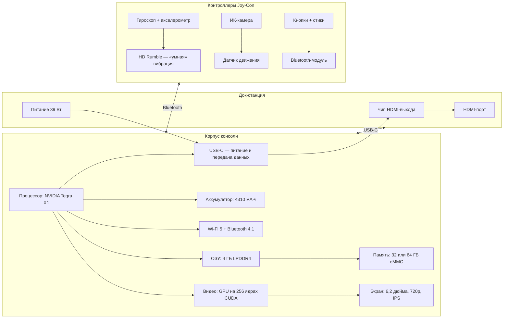

---
title: 9.11.2. Nintendo Switch
---

# 9.11.2. Nintendo Switch

  ДЛЯ ДЕТЕЙ
  ОБЯЗАТЕЛЬНО

Родителям и детям

### Nintendo Switch

Представь себе устройство, которое может быть и домашней приставкой, и портативным гаджетом — всё в одном. Оно умеет стоять на столе, лежать у тебя в руках, прикрепляться к рулю велосипеда (почти), играть вдвоём без проводов, а ещё — «отдавать» свои ручки другу, как будто они отдельные контроллеры. Это не фантастика. Это **Nintendo Switch** — одна из самых необычных игровых консолей в истории.

Но зачем нам изучать именно её? Потому, что **Switch — это отличный пример того, как инженеры, дизайнеры и программисты работают вместе, чтобы сделать технологию не просто полезной, а *радостной*.** В ней заложены важные идеи: мобильность, совместимость, гибкость и безопасность. И всё это — на уровне архитектуры, прошивки и интерфейса. Давай разберёмся, как это устроено.

---

### 1.1. Что такое игровая консоль — и чем Switch отличается от других

Игровая консоль — это специализированный компьютер, созданный в первую очередь для запуска видеоигр. В отличие от обычного ПК, у консоли:
- фиксированное «железо» (аппаратное обеспечение), которое не меняется годами;
- собственная операционная система, оптимизированная под игры;
- единая экосистема: магазин, онлайн-сервисы, управление правами доступа.

Большинство консолей делятся на два типа:  
- **Стационарные** (например, PlayStation, Xbox) — подключаются к телевизору и не переносятся;  
- **Портативные** (например, Nintendo DS, PlayStation Vita) — маленькие, с экраном встроенным, играешь в дороге.

А **Switch — гибрид**. Это слово означает «смешанный» или «переходный». Switch умеет *переключаться* (отсюда и название *Switch* — «переключатель») между режимами:

| Режим | Как работает | Что включено |
|-------|--------------|--------------|
| **TV Mode** (режим ТВ) | Консоль вставляется в док-станцию, изображение идёт на телевизор | Joy-Con отсоединяются, можно играть с «полноценной» ручкой Pro Controller |
| **Tabletop Mode** (режим на столе) | Подставка на задней панели откидывается — консоль стоит сама, как ноутбук | Два игрока могут взять по одному Joy-Con и играть вдвоём |
| **Handheld Mode** (режим в руках) | Как планшет: всё в одном корпусе, Joy-Con прикреплены по бокам | Один игрок — вся система у него в руках |

Это не просто «удобно» — это требует серьёзных инженерных решений. Например:  
- Экран должен быть энергоэффективным, но при этом ярким и быстрым (чтобы не было «размазывания» при быстрых движениях);  
- Процессор должен уметь менять частоту: в ТВ-режиме — работать на полную мощность, в портативном — экономить заряд;  
- Беспроводная связь (Wi-Fi, Bluetooth) должна стабильно работать в любом режиме, даже если консоль лежит под подушкой (не рекомендуется, но бывает).

---

### 1.2. Что внутри: «железо» Switch

Давай заглянем «под капот». Хотя Switch не самая мощная консоль по меркам 2025 года, её компоненты подобраны с умом — для *баланса*: производительность + автономность + стоимость.

Вот что находится внутри (упрощённо):

#### Пояснения к схеме:

- **NVIDIA Tegra X1** — это не просто «процессор». Это *система на кристалле* (SoC, *System on Chip*). Это значит, что на одном кусочке кремния (чипе) собраны: центральный процессор (CPU), графический процессор (GPU), контроллеры памяти, видео, звука и даже часть модулей связи. Так делают в смартфонах и планшетах — чтобы сэкономить место и энергию. Nintendo выбрала именно такую архитектуру, потому что Switch — это, по сути, *игровой планшет с возможностью докинга*.

- **LPDDR4** — тип оперативной памяти. «LP» означает *Low Power* — «низкое энергопотребление». Важно для автономной работы. Без этого аккумулятор сел бы за час.

- **eMMC** — встроенная флеш-память (как в старых смартфонах). Медленнее, чем SSD, но дешевле и компактнее. Именно поэтому Nintendo рекомендует ставить карту microSD — для хранения игр (которые могут весить до 15 ГБ и более).

- **HD Rumble** — *тактильная обратная связь*. Например, в игре *1-2-Switch* ты можешь «почувствовать», как в бутылке перекатывается шарик, или как дрожит моторчик виртуальной зубной щётки. Это достигается за счёт мини-моторов с несбалансированными грузиками, управляемых с микросекундной точностью.

- **ИК-камера в правом Joy-Con** — инфракрасный датчик. Он видит тепло и форму объектов. Благодаря ему можно играть в мини-игры, где нужно «угадывать» предмет по его силуэту (например, сложить фигурку из LEGO на столе — консоль угадает, что это собака).

---

### 1.3. Как Switch работает с другими устройствами

Switch — не изолированная «коробка». Она участвует в цифровой экосистеме:

- **microSD-карта** — расширение памяти. Поддерживает до 2 ТБ (на 2025 г.). Формат: exFAT (универсальный для больших файлов).
- **Nintendo Switch Online** — облачный сервис: мультиплеер, резервное копирование сохранений, доступ к классическим играм NES/SNES/N64.
- **Смартфон** — через приложение *Nintendo Switch Online* можно общаться голосом во время игры (т.к. в самой консоли нет микрофона), а также управлять семейными аккаунтами.
- **PC** — можно подключить Joy-Con по Bluetooth и использовать как геймпад (например, в Steam). Это работает, потому что Joy-Con соответствует стандарту HID (*Human Interface Device*), как клавиатура или мышь.

Интересный факт: когда ты вставляешь Switch в док, она не просто «включает HDMI». Она **переключает профиль питания**:  
- В руках — CPU работает на 1 ГГц, GPU — на 307 МГц (экономия энергии);  
- В доке — CPU до 1,02 ГГц, GPU — до **768 МГц** (максимум).  
Это называется *динамическое масштабирование частоты* — технология, заимствованная из ноутбуков.

---

### 1.4. Почему Switch — это проектирование «для людей»

Многие технологии создаются «ради технологий». Switch — нет. Примеры:

- **Joy-Con легко отсоединяются** — чтобы двое детей могли начать играть *сразу*, без покупки второго контроллера. Это снижает порог входа.
- **Подставка встроена** — не выдвижная, не съёмная. Потому что её часто теряют (как в Nintendo 3DS). Здесь — просто пластиковая пластина. Надёжно.
- **Кнопка захвата экрана** — сразу делает скриншот. В эпоху TikTok и Instagram это важно: дети хотят делиться моментами *здесь и сейчас*.
- **Родительский контроль** — вынесен в отдельное приложение на смартфоне. Потому что родители — тоже пользователи системы.

Это *гуманистический дизайн*: когда инженеры думают о том, **как реальные люди (в том числе дети) будут взаимодействовать с устройством**.

---

## Часть 2. Программное обеспечение, игры и цифровая этика

### 2.1. Операционная система: не Android и не Windows

Многие думают: «Если внутри NVIDIA Tegra — значит, это Android?» Нет. Nintendo построила собственную операционную систему (ОС), но *не с нуля*. Основа — **FreeBSD**, свободная и открытая Unix-подобная система. Почему?

- FreeBSD стабильна, безопасна и хорошо масштабируема — подходит для встраиваемых устройств (как маршрутизаторы, банкоматы, медицинские приборы).
- Она лицензирована по BSD-лицензии: Nintendo может взять код, модифицировать его и *не раскрывать изменения* — в отличие от Linux (GPL), где при распространении модифицированной версии нужно отдавать исходники.
- Это дало Nintendo контроль: они добавили слой управления питанием, драйверы для Joy-Con, систему лицензирования игр и защиту от несанкционированного запуска ПО.

ОС Switch не имеет «рабочего стола» в привычном смысле. Вместо этого — **меню HOME**, которое на самом деле — отдельное приложение, постоянно загруженное в память. Когда вы запускаете игру, ОС не выгружается: она остаётся «на заднем плане», отвечая за:
- обновление времени,
- фоновую синхронизацию сохранений (если включён онлайн),
- проверку входящих сообщений,
- управление Bluetooth-подключениями.

Это называется *микроядерная архитектура*: ядро (kernel) отвечает только за базовые операции (память, процессы, ввод-вывод), а всё остальное — пользовательские сервисы. Преимущество — если одно приложение «падает», оно не тянет за собой всю систему.

---

### 2.2. Как запускается игра: от кнопки до пикселя

Допустим, ты выбираешь *The Legend of Zelda: Tears of the Kingdom* и нажимаешь «Играть». Что происходит «под капотом»?

1. **Проверка лицензии**  
   Каждая игра — это зашифрованный файл (`.nsp` или на картридже — `.xci`). Консоль проверяет:
   - Есть ли у аккаунта (привязанного к консоли) право на запуск (через цифровую подпись от Nintendo).
   - Не повреждён ли файл (контрольная сумма SHA-256).

2. **Загрузка в оперативную память**  
   Игра частично копируется в ОЗУ — особенно часто используемые ассеты (текстуры, звуки, скрипты). В Switch всего **4 ГБ ОЗУ**, но ~3,25 ГБ доступно для игр — остальное «съедает» ОС.

3. **Инициализация ресурсов**  
   Движок игры (например, *Havok* для физики или *FMOD* для звука) запрашивает у ОС:
   - доступ к GPU для рисования кадров,
   - управление вибрацией Joy-Con,
   - чтение данных с картриджа/SSD-накопителя (в Switch OLED и Lite используется более быстрая память, чем в базовой версии).

4. **Рендеринг кадра**  
   GPU получает команды от CPU:  
   → «Нарисуй холм из треугольников»  
   → «Наложи текстуру травы»  
   → «Добавь тень от облака»  
   → «Примени постобработку: размытие в движении (motion blur)»  

   В телевизионном режиме цель — **60 кадров в секунду (FPS)** при разрешении **1080p**. В портативном — **720p**, но FPS может падать до 30 в сложных сценах (например, когда сотни объектов взаимодействуют одновременно — как в *Breath of the Wild* при лавине).

5. **Вывод сигнала**  
   В ТВ-режиме изображение передаётся через док по HDMI 2.0 (поддержка 4K *не предусмотрена* — GPU не справляется).  
   В портативном — напрямую на IPS-экран с частотой обновления **60 Гц**.

Всё это происходит за **16,6 мс** (1/60 секунды) — иначе игра будет «тормозить». Именно поэтому оптимизация кода критична: лишний цикл в скрипте = задержка = дрожание картинки.

---

### 2.3. Игры как учебные среды

Nintendo сознательно создаёт игры, которые обучают, даже если это не очевидно. Рассмотрим три примера.

#### 🎮 *Game Builder Garage* — программирование без кода  
Это не просто конструктор. Это визуальная среда разработки, где:
- Каждый «Nodon» — это узел в графе вычислений (input → process → output);
- Например:  
  `Кнопка A` → `Логический Nodon (И)` → `Двигатель Nodon` → `Перемещение объекта`  
- Можно собрать игру-платформер, гоночный симулятор или даже простой ИИ (например, враг, который «видит» игрока через луч-детектор).

Здесь заложены основы:  
- **событийно-ориентированное программирование**,  
- **модульность** (блоки можно переиспользовать),  
- **отладка** (можно «подключить осциллограф» к любому Nodon и видеть значения в реальном времени).

#### 📦 *Nintendo Labo* — архитектура + физика + кастомизация  
Labo — это картонные конструкторы, которые превращаются в гаджеты: руль, пианино, робо-руку. Но смысл не в картоне — в **интерфейсе «реальный мир ↔ цифровой»**:
- ИК-камера Joy-Con «видит» отражение от зеркальца в картонной конструкции → определяет угол поворота руля;
- Микрофоны в Joy-Con улавливают щелчки и треск картона → консоль «думает», что вы строите;
- В режиме «VR» используется простая линза из плёнки — и мозг сам «дорисовывает» 3D (это эффект *стереопсиса*).

Labo учит:  
- как датчики преобразуют физические явления в данные,  
- как важно *калибровать* систему (если зеркальце перекошено — руль будет «везти в сторону»),  
- почему прототипирование из дешёвых материалов — первый шаг в инженерии.

#### 🧠 *Big Brain Academy: Brain vs. Brain* — когнитивные нагрузки как метрика  
Игра измеряет **когнитивную эффективность**:  
- В задании «Сколько весит?» — проверяется *быстрое оценивание* (heuristics);  
- В «Повтори ритм» — *рабочая память* и *временная синхронизация*;  
- В «Исключи лишнее» — *абстрактное мышление*.

Результаты не просто «баллы» — это данные, которые можно сравнивать во времени. Это как фитнес-трекер, но для мозга. И — что важно — игра **никогда не говорит «ты глупый»**. Она говорит: «Этот тип задач тебе пока сложен — давай потренируемся».

---

### 2.4. Онлайн: как Nintendo строит безопасное пространство

Дети играют онлайн. Это факт. Но открытый интернет — не детская площадка. Поэтому Nintendo реализовала несколько уровней защиты:

| Уровень | Механизм | Зачем |
|--------|----------|-------|
| **Анонимность по умолчанию** | Никнейм генерируется автоматически (например, *Player_7391*). Настоящее имя — только если родитель разрешил. | Минимизация риска доксинга. |
| **Ограниченный чат** | В мультиплеере — только предустановленные фразы («Хорошая игра!», «Давай ещё!»). Голосовой чат — только через приложение на смартфоне *с согласия родителя*. | Предотвращение буллинга и неподобающего контента. |
| **Родительский контроль через приложение** | Родитель может: установить лимит времени, запретить покупки, отключить онлайн, увидеть историю запусков. | Прозрачность без вторжения. |
| **Серверная фильтрация** | Все сообщения (даже фразы) проходят через ИИ-модель, обучающуюся на примерах токсичного поведения. | Автоматическое подавление агрессии. |

Важно: Nintendo **не хранит голосовые сообщения**. Они обрабатываются на устройстве и удаляются сразу после передачи — это требование GDPR (Европейского регламента о защите данных), которому следует компания.

---

### 2.5. Цифровая этика: почему нельзя «взломать Switch и поставить пиратские игры»

Здесь — без морализаторства, только факты.

Взлом («modding») Switch технически возможен — через уязвимости в прошивке (например, *Fusée Gelée* в 2018 г.). Но:

- Это **нарушает условия лицензионного соглашения** — вы теряете гарантию и доступ к онлайн-сервисам.
- Пиратские копии игр **лишают разработчиков дохода**. Маленькие студии (например, *Chucklefish*, сделавшие *Stardew Valley* для Switch) живут за счёт продаж.
- Модифицированное ПО часто содержит **вредоносный код**: кейлоггеры, майнеры криптовалюты, боты для DDoS-атак.
- В 2023 г. несколько тысяч взломанных Switch были **удалённо заблокированы** Nintendo через обновление — потому что они подключались к официальным серверам с поддельными сертификатами.

Альтернатива — **легальный моддинг**:  
- Nintendo разрешила создавать *пользовательские уровни* в *Super Mario Maker 2*;  
- В *Minecraft* можно ставить моды через официальный Marketplace;  
- *Celeste* поддерживает *speedrun-таймеры* и *ассист-режим* без взлома.

Инженерия — не про обход правил. Она про **творчество в рамках системы**.

---

## Часть 3. Практика: от наблюдения — к собственному проекту

### 3.1. Задание 1. Схема подключения дома  
**Уровень**: 🔹  
**Цель**: понять, как физически работает переключение между режимами.

📌 **Инструкция**:  
1. Возьмите лист бумаги и нарисуйте домашнюю зону: телевизор, розетка, стол, диван.  
2. Покажите три состояния Switch:  
   - В руках (Handheld) — аккумулятор внутри, Joy-Con прикреплены.  
   - На столе (Tabletop) — подставка открыта, Joy-Con отсоединены.  
   - У телевизора (TV Mode) — консоль в доке, док в розетке, HDMI-кабель к ТВ.  
3. Нарисуйте стрелки и подпишите:  
   - *Куда идёт питание?*  
   - *Куда идёт видео?*  
   - *Как Joy-Con общаются с консолью?*  

📝 **Вопросы для размышления**:  
- Почему док *не* заряжает консоль через HDMI, а только через USB-C?  
- Что произойдёт, если вынуть консоль из дока *во время игры*? Почему игра не «падает»?  
- Можно ли подключить Switch к монитору *без дока*? (Подсказка: есть HDMI-адаптеры на USB-C — но не все поддерживают видеовыход с Switch.)

> ✅ **Проверка**: Если вы объяснили, что HDMI — *только для видео*, а управление и питание — через USB-C, вы понимаете принципы раздельной передачи сигналов.

---

### 3.2. Задание 2. Лаборатория датчиков: измеряем отклик Joy-Con  
**Уровень**: 🔸  
**Цель**: познакомиться с понятием *latency* (время отклика) и ролью датчиков движения.

🛠 **Что нужно**:  
- Nintendo Switch (любая модель),  
- Секундомер (на телефоне),  
- Бумага, карандаш, линейка.

📌 **Эксперимент**:  
1. Запустите *1-2-Switch* → мини-игра *«Тест на скорость реакции»* (где нужно нажать A, как только загорится зелёный свет).  
2. Проведите 10 попыток. Запишите время реакции (в миллисекундах) — оно отображается после каждого раунда.  
3. Теперь повторите то же самое, но:  
   - с Joy-Con, прикреплёнными к консоли;  
   - с Joy-Con в руках (отдельно);  
   - с Pro Controller.  

📊 **Анализ**:  
- Посчитайте среднее время для каждого типа контроллера.  
- Есть ли разница? Если да — почему?  
  - Подсказка 1: Bluetooth имеет небольшую задержку (~10–20 мс) по сравнению с проводным подключением (но Joy-Con в консоли — не проводные! Они передают через *внутренний шина*, а не Bluetooth).  
  - Подсказка 2: Вес и баланс контроллера влияют на *моторную готовность* руки — не только на технику.

🔬 **Для исследователей (🔶)**:  
Попробуйте ту же игру на ПК с обычной клавиатурой. Сравните latency. Почему игровые контроллеры часто *быстрее* клавиатуры в реакционных играх? (Ответ: клавиатура отправляет сигнал только при *полном нажатии*, а геймпад — при первом контакте.)

---

### 3.3. Задание 3. Спроектируй свою мини-игру с датчиками  
**Уровень**: 🔸 → 🔶  
**Цель**: применить знания о возможностях Joy-Con для решения игровой задачи.

🎯 **Условие**:  
Создайте концепт игры, которая использует *хотя бы два* из следующих датчиков:  
- Гироскоп (наклон),  
- Акселерометр (ускорение/встряска),  
- ИК-камера (форма/тепло),  
- HD Rumble (тактильная обратная связь).

📌 **Шаблон описания**:  
1. **Название**:  
2. **Цель игры**:  
3. **Как игрок взаимодействует**:  
   - Какие движения/действия?  
   - Какие датчики считывают их?  
4. **Обратная связь**:  
   - Что чувствует игрок? (вибрация, звук, визуал)  
5. **Пример уровня**: опишите одну сцену.

✏️ **Пример (для вдохновения)**:  
> **Название**: *«Космический садовник»*  
> **Цель**: вырастить растение в невесомости, поливая его и поворачивая горшок так, чтобы солнечный свет падал равномерно.  
> **Взаимодействие**:  
> - Наклон Joy-Con → поворот горшка (гироскоп),  
> - Резкий поворот запястья → «встряхнуть лейку» (акселерометр),  
> - Поднести Joy-Con к лампе (настоящей) → ИК-камера видит тепло → «солнце активно».  
> **Обратная связь**:  
> - При переливе — слабая вибрация (капли),  
> - При ожоге от солнца — резкий импульс («горячо!»),  
> - При росте цветка — музыкальная нота + лёгкое дрожание («радость растения»).  
> **Уровень**: «Лунная оранжерея» — низкая гравитация, вода летит каплями. Нужно ловить их наклоном.

💡 Совет: начните с *одного* датчика — освойте его логику, потом добавляйте второй. Хорошая игра — та, где *каждое действие имеет смысл*.

---

### 3.4. Задание 4. Исследование: картриджи и цифровые копии — что экологичнее?  
**Уровень**: 🔶  
**Цель**: научиться оценивать технологии по удобству и по воздействию на окружающую среду.

🌍 **Факты для анализа**:

| Параметр | Картридж (физический) | Цифровая загрузка |
|---------|------------------------|-------------------|
| Производство | Пластик, металл, чип памяти. Энергия на литьё, сборку, упаковку. | Нет физического носителя. |
| Доставка | Грузовик → магазин → покупатель (~5–50 кг CO₂ на единицу). | Сервер → роутер (~0,05 кг CO₂ на 10 ГБ). |
| Срок службы | 10+ лет (если не сломать). Можно передать другу. | Зависит от аккаунта и серверов Nintendo. При удалении аккаунта — игра исчезает. |
| Утилизация | Требует раздельного сбора (электронные отходы). | Нет отходов. Но серверные фермы потребляют много энергии. |
| Энергопотребление при запуске | Чип памяти читается быстро, низкое энергопотребление. | Данные читаются с eMMC — медленнее, выше нагрузка на CPU при распаковке. |

📊 **Задача**:  
1. Составьте таблицу «плюсов и минусов» с точки зрения:  
   - экологии,  
   - удобства,  
   - долгосрочного доступа.  
2. Сформулируйте *условия*, при которых один способ становится предпочтительнее другого.  
   - Например: *«Если игра будет играть 5 человек по очереди — картридж выгоднее»*.  
   - Или: *«Если у ребёнка слабый интернет — цифровая копия может занять день на загрузку, а картридж — работает сразу»*.

🔍 **Дополнительно**:  
Изучите, как Nintendo с 2022 г. использует *биопластик* на основе кукурузного крахмала для упаковки. Это снижает CO₂ на 22% по сравнению с нефтяным пластиком.

> 🌱 Вывод: «зелёная» технология — та, у которой *наименьший суммарный след* за весь жизненный цикл.

---

### 3.5. Приложение: «Инструкция для родителей»  
**Формат**: короткий, без жаргона, с чек-листом.  
Можно распечатать и повесить рядом с консолью.

---

#### 🎮 Как безопасно настроить Nintendo Switch за 5 минут  
*(Для родителей и опекунов)*

1. **Создайте семейную группу**  
   → Откройте приложение *Nintendo Switch Parental Controls* на своём смартфоне.  
   → Свяжите его с консолью (сканируйте QR-код в меню консоли → «Родительский контроль»).

2. **Установите ограничения**  
   - ⏱ *Время игры*: задайте ежедневный лимит (например, 1 час в будни, 2 — в выходные).  
   - 💰 *Покупки*: отключите «Покупки в Nintendo eShop» или поставьте запрос пароля.  
   - 🌐 *Интернет*: запретите общение с незнакомцами (включите «Только друзья»).

3. **Настройте аккаунт ребёнка**  
   → В меню консоли: «Пользователи» → «Создать пользователя» → «Детский аккаунт».  
   → Укажите год рождения — Nintendo автоматически применит возрастные ограничения (PEGI).

4. **Включите резервное копирование**  
   → «Настройки» → «Данные сохранения» → «Резервное копирование в облако».  
   → Требуется подписка *Nintendo Switch Online* (есть семейный тариф — дешевле на 4 аккаунта).

5. **Проверяйте еженедельно**  
   Приложение присылает отчёт:  
   - Сколько времени потрачено,  
   - Какие игры запускались,  
   - Были ли попытки отключить контроль.

> ✅ Главное: говорите с ребёнком *до* настройки. Объясните, что ограничения — *защита*, как шлем на велосипеде.

---