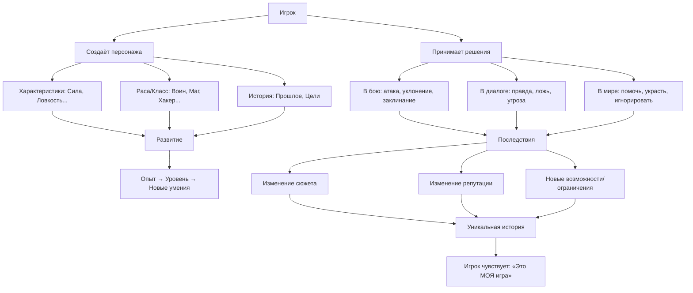

---
title: RPG
---

# RPG

<div class="article-tags">
  <span class="tag tag-beginner">ДЛЯ ДЕТЕЙ</span>
  <span class="tag tag-required">ОБЯЗАТЕЛЬНО</span>
</div>
<span class="complexity-badge">Родителям и детям</span>

## RPG

Представь, что ты читаешь книгу. Но не просто читаешь — ты в ней герой. Ты решаешь, идти ли в тёмный лес или обойти его стороной, довериться ли незнакомцу или держать руку на мече, говорить правду или соврать ради спасения друга. И от этих решений зависит не только, выживешь ли ты, но и каким человеком ты станешь к концу истории.

Именно это — суть **RPG**.  
RPG — это сокращение от английского *Role-Playing Game*, что переводится как **«ролевая игра»**. Это не просто жанр видеоигр. Это особый способ взаимодействия с историей, в котором главная роль отводится тебе — игроку.

Но прежде чем мы поговорим о компьютерных играх, давайте отмотаем время назад — намного дальше, чем к первому «The Elder Scrolls» или «Pokémon».

---

### Как всё начиналось

Первая настоящая RPG появилась не на компьютере и не на консоли. Она жила на **столе**, в **воображении**, и её топливом были **правила**, **кубики** и **разговоры**.

В 1974 году в США вышла игра под названием **Dungeons & Dragons** («Подземелья и драконы»), или просто **D&D**. Это не было программой — это была книга правил толщиной с учебник физики. В ней объяснялось, как создать героя: волшебника, воина, вора, эльфа, полурослика — кого захочешь. Как дать ему силу, ловкость, мудрость. Как бросать кости, чтобы проверить, удастся ли перепрыгнуть пропасть или убедить стражника пропустить тебя. И как вести историю — вместе с друзьями.

Один из участников берёт на себя роль **мастера подземелий** (или **ведущего**). Он — рассказчик, художник, судья и мир в одном лице. Остальные — игроки. Каждый играет одного персонажа. Никаких экранов, только листы бумаги, карандаш, набор кубиков и… воображение.

> 💡 **Почему кубики?**  
> В реальной жизни, если ты взбираешься на дерево, успех зависит от тренировки, веса, ветра, везения. В D&D — от твоих характеристик *и* броска кубика. Например, чтобы поднять тяжёлый сундук, ты бросаешь 20-гранный кубик (d20) и прибавляешь значение своей *Силы*. Если результат выше, чем сложность действия — получилось. Если ниже — не получилось. Так в игру вводится элемент случайности, как в жизни.

D&D был революцией. Он показал: игра может быть про **воплощение роли**, про **выбор**, про **последствия**.

Когда в 1980-х годах компьютеры стали доступнее, программисты задумались: *А можно ли это перенести в машину?*  
Так появились первые **текстовые RPG** — игры, в которых всё происходило через слова.

Например, в игре *Zork* (1977) экран показывал только текст:

```
Вы стоите у входа в пещеру. На земле лежит фонарь. С севера дует прохладный ветер.
> ВЗЯТЬ ФОНАРЬ  
Вы подняли фонарь. Он пуст.
> ОТКРЫТЬ ФОНАРЬ  
Внутри — батарейка. Но она мертва.
> ИДТИ НА СЕВЕР  
Вы входите в пещеру. Темно. Совсем темно.
> ВКЛЮЧИТЬ ФОНАРЬ  
Фонарь не работает без батарейки...
```

Ты управлял героем, как в книге с «выбором пути», но с полной свободой команд. Мир существовал в памяти компьютера, а ты — через клавиатуру — исследовал его, словно археолог, раскапывающий древний город.

---

### РПГ растёт

С развитием компьютерной графики RPG начала «одеваться» — появлялись картинки, аватарки персонажей, а потом и целые анимированные миры.

#### Японские RPG (JRPG)
 
В Японии RPG пошла своим путём. Там любят чёткие сюжеты, эмоциональные персонажи, музыку, способную заставить плакать даже без слов. Игры вроде *Final Fantasy*, *Dragon Quest* или *Pokémon* — это почти как аниме, в которое можно играть.

Особенности JRPG:
- Часто — **линейный сюжет**, но с глубокой проработкой персонажей.
- Бой — **пошаговый**: ты выбираешь действие («Атака», «Заклинание», «Лечение»), потом противник делает ход. Как шахматы, но с магией и драконами.
- Герои растут в связях: дружба, предательство, самопожертвование — всё это влияет на развитие.

> 🌱 **Интересный факт**: *Pokémon* — это RPG! Ты тренируешь своих существ («покемонов»), улучшаешь их способности, побеждаешь других тренеров — и всё это происходит в рамках большой ролевой системы. Даже «ловля покемонов» — это сбор команды, как в D&D.

#### Компьютерные западные RPG
  
На Западе (в США и Европе) RPG чаще делали упор на **свободу выбора**. Например, в *Baldur’s Gate* (1998) или *Fallout* (1997) ты мог:
- присоединиться к бандитам или стать шерифом;
- убить важного персонажа — и сюжет пойдёт по другой ветке;
- даже не сражаться вовсе, а договориться, обмануть, подкупить.

Это называется **ветвистым повествованием** — как дерево: от одного ствола отходят ветки, и каждая ведёт в разные места.

---

### Что делает игру — RPG?

Не каждая игра с мечом и драконом — RPG. Чтобы считаться *настоящей* ролевой, игра должна включать хотя бы часть из следующего:

#### Персонаж

Ты не просто «водишь курсором». Ты создаёшь личность:  
- **Имя**, внешность, прошлое («Я — дочь кузнеца, меня похитили орки в детстве…»).  
- **Характеристики** — числа, описывающие способности:  
  - *Сила* — сколько ты можешь поднять,  
  - *Ловкость* — насколько быстро бегаешь и метко стреляешь,  
  - *Интеллект* — сколько заклинаний помнишь,  
  - *Харизма* — умеешь ли уговаривать, вдохновлять, запугивать.  

Эти числа — не просто цифры. Они влияют на то, какие действия тебе доступны. Например, дверь можно **вышибить** (нужна Сила ≥ 15) или **вскрыть** (нужна Ловкость ≥ 12 и отмычка).

#### Развитие через опыт

Когда ты побеждаешь врага, выполняешь задание или даже просто находишь важный предмет — ты получаешь **очки опыта (XP)**. Накопив достаточно — получаешь **уровень**.

На каждом новом уровне ты становишься сильнее:  
- +1 к характеристикам,  
- +1 новое умение (например, «Огненный шар» или «Уклонение»),  
- больше здоровья или маны.

Это называется **прокачкой** — и это одна из самых приятных частей RPG. Ты буквально чувствуешь, как твой герой растёт.

#### Принятие решений с последствиями

В RPG редко бывает «один правильный путь». Часто — несколько. И выбор имеет вес.

Пример:  
> *Ты находишь раненого вора, который только что украл у твоего друга. Он умоляет пощады — говорит, что кормит больную сестру. Что ты сделаешь?*  
> - **Убить** — друг будет доволен, но ты навсегда запомнишь крик сестры позже.  
> - **Простить и отдать монеты** — вор исчезнет… но через неделю он спасёт тебе жизнь в засаде.  
> - **Отдать его страже** — закон восторжествует, но городская мафия объявит тебе войну.

Это и есть **ролевая система**: цифры, мораль, мировоззрение, стиль поведения.

#### Диалоги — как оружие

Во многих RPG ты не просто кликаешь «Далее». Ты выбираешь, **что сказать**. И от этого зависит:
- получится ли уговорить торговца снизить цену,
- откроется ли тебе секретный квест,
- предаст ли тебя напарник.

В *Mass Effect* (2007) даже появилась **система репутации**: твои поступки влияли на «моральный индикатор» — синий (парагон — герой, спасающий всех) или красный (ренегат — реалист, идущий к цели любой ценой). И персонажи реагировали на это: некоторые уважали только силу, другие — только честь.

---

### Мечи и магия

Многие думают: RPG = фэнтези. Драконы, замки, эльфы. Но это не так.

Вот примеры RPG в других мирах:

| Игра | Мир | Особенность |
|------|-----|-------------|
| **Mass Effect** | Космос, 22 век | Ты — капитан корабля, спасающий галактику от инопланетной угрозы. Переговоры с инопланетянами — важнее, чем выстрелы. |
| **Cyberpunk 2077** | Неоновый мегаполис будущего | Хакерские импланты, корпоративные войны, кибер-наркотики. Сила — в чипах в мозге. |
| **Papers, Please** | Вымышленная диктатура | Ты — пограничник. Твоя «роль» — проверять документы. А твоя совесть — решать, пропустить беженку или спасти свою семью от штрафа. Это RPG о моральном выборе без единого выстрела. |
| **Stardew Valley** | Сельская ферма | Да, это тоже RPG! Ты развиваешь навыки (рыбалка, садоводство, горное дело), дружишь с жителями, выбираешь, с кем пожениться. Твоя роль — фермер. И это так же важно. |

RPG — это про **роль**.  
Ты можешь быть космонавтом, полицейским, учёным, шпионом — главное, чтобы ты *играл* эту роль, рос в ней, делал выбор.

---

### Action RPG и гибриды

Со временем RPG начала смешиваться с другими жанрами.

#### Diablo и Action RPG

В 1996 году вышла игра *Diablo*. В ней осталась прокачка, предметы, подземелья — но бой стал **динамичным**, **в реальном времени**. Ты не ждёшь хода противника — бегаешь, бьёшь мечом, кидаешь заклинания *прямо сейчас*.

Это породило жанр **Action RPG** (ARPG) — RPG с элементами экшена. Примеры: *Dark Souls*, *Path of Exile*, *The Legend of Zelda: Breath of the Wild* (да, и эта игра — тоже RPG!).

#### Warcraft и стратегии с RPG-элементами

Когда Blizzard выпустили *Warcraft III* (2002), они добавили к стратегии неожиданную особенность: у каждого героя — **уровни**, **умения**, **предметы**. Ты управлял армией, и конкретным персонажем, которого можно было «прокачать» за битвы.

Это вдохновило на создание **MOBA** (например, *Dota 2*, *League of Legends*), где каждый игрок играет одного героя — и развитие идёт по RPG-принципам.

---

### Как устроена RPG?

Чтобы лучше понять связи, взглянем на упрощённую схему:



Эта схема показывает: RPG — это не набор механик. Это **замкнутый цикл**: выбор → действие → последствие → рост → новый выбор. И так — до конца истории.

---

## Как устроена ролевая игра изнутри

Мы уже говорили, что RPG — это про роль, развитие и выбор. Но как это работает *технически*? Как программисты, геймдизайнеры и сценаристы превращают идею в игру, в которой тысячи игроков проживают тысячи разных историй?

Давайте заглянем «под капот» — без кода, но с ясным пониманием устройства.

---

### Персонаж — это система

Когда ты видишь на экране воина в доспехах — это лишь внешняя оболочка. Внутри компьютера (или на листке бумаги у ведущего D&D) твой герой — это **набор данных**. Представь его как карточку:

```
Имя: Алия, охотница из пустошей  
Раса: человек  
Класс: следопыт  
Уровень: 4  
Здоровье: 38/38  
Мана: 0/0 (не использует магию)  

Характеристики:  
Сила: 12     → +1 к урону в ближнем бою  
Ловкость: 16 → +3 к уклонению, +3 к меткости  
Выносливость: 10  
Интеллект: 8  
Мудрость: 14 → +2 к поиску ловушек, +2 к выслеживанию  
Харизма: 9  

Навыки:  
✔ Скрытность (Ловкость + Мудрость)  
✔ Выживание (Мудрость)  
✔ Стрельба из лука (Ловкость)  

Снаряжение:  
— Длинный лук «Туманная Тень»  
— Нож из кости зверя  
— Плащ-невидимка (3 раза/день)  
— Фляга с чистой водой, сухпаёк (2 порции)  

Особенности:  
• Компаньон: волк по кличке Страж  
• Репутация в гильдии охотников: «Уважаемая» (+10% к оплате)  
• Травма: шрам на руке — болит при дожде (−1 к Ловкости в дождь)  
```

Эта карточка — «движок» персонажа.  
Любое действие в игре — это **расчёт по формулам**, основанный на этих данных.

Например, чтобы **выстрелить из лука** в цель на 20 метров:
1. Проверяется навык *Стрельба из лука*: базовое значение = Ловкость (16) + 2 (за опыт) = 18.  
2. Добавляется модификатор дистанции: −2 за дальность.  
3. Бросается d20 (20-гранный кубик). Получено: 14.  
4. Итого: 14 (кубик) + 18 (навык) − 2 (дальность) = **30**.  
5. Сложность попадания в цель — 25.  
→ **Попадание!**  
6. Урон: 1d8 (кубик 8 граней) + 3 (за Ловкость) = от 4 до 11 урона.

В компьютерной игре всё это происходит за миллисекунды. В настольной — игрок и ведущий считают вместе. Но суть одна: **ролевая система — это логика принятия решений, закодированная в числах и правилах**.

> ⚖️ **Важно**: хорошая RPG не сводится к «у кого больше число». Лучшие игры дают обойти сложность *не только* силой. Например:  
> - Вместо броска *Силы* — бросок *Харизмы*, чтобы убедить стражника пропустить.  
> - Вместо *Стрельбы* — *Скрытности*, чтобы подкрасться и выключить врага без боя.  
> - Вместо *Интеллекта* — *Мудрости*, чтобы *почувствовать* засаду, хотя ловушка скрыта от глаз.

---

### Мир RPG

Настоящий мир бесконечен. Игровой — ограничен. Но хорошие RPG создают **иллюзию живого мира**. Как?

#### Динамическое поведение NPC

В старых играх персонажи стояли на месте и повторяли одну фразу. В современных — у них есть:
- **Расписание**: кузнец работает с 8 до 18, потом идёт домой. Вор — прячется днём, действует ночью.
- **Память**: если ты однажды спас ребёнка от пса, мать будет кланяться тебе впредь.
- **Отношения**: два NPC могут быть друзьями, врагами или тайно влюблёнными — и это влияет на их реплики.

Пример из *The Elder Scrolls V: Skyrim*:  
Если ты украдёшь яблоко из дома — хозяин не бросится за тобой с топором. Но если ты сделаешь это трижды — он вызовет стражу. А если ты потом убьёшь стражника при нём — он убежит и больше никогда не будет торговать с тобой.

Это называется **репутационная система**. Она не записана явно — но *чувствуется*.

#### Мир реагирует на события

В *Fallout: New Vegas* можно выбрать сторону: Новый Калифорнийский Республиканский Движок (NCR), Легион Цезаря или тайное братство Стали.  
Ты не просто «выбираешь в меню». Ты:
- выполняешь квесты для одной стороны,
- теряешь репутацию у других,
- видишь, как флаги меняются на зданиях,
- слышишь, как NPC говорят о твоих подвигах (или преступлениях),
- а в финале — мир действительно **меняется**: одни города расцветают, другие превращаются в руины.

Такой мир называют **открытым с последствиями**. Он не просто «открыт для бега» — он открыт для *влияния*.

---

### Ветвистый сюжет

Многие думают: «ветвистый сюжет = много развилок». Но на деле есть три основных типа:

| Тип | Описание | Пример |
|-----|----------|--------|
| **Дерево** | Чёткие развилки. Выбор → новая ветвь. Ветви почти не пересекаются. | *The Witcher 2*: в середине игры — радикальное разделение сюжета на две независимые линии. |
| **Паутина** | Множество мелких и крупных выборов, которые переплетаются. Последствия могут проявиться через часы игры. | *Disco Elysium*: фраза, сказанная в начале, может повлиять на финал — через 30 часов. |
| **Река с притоками** | Основной сюжет неизменен (река), но боковые сюжеты (притоки) сильно различаются. Выбор влияет на *как*, но не на *что*. | *Horizon Zero Dawn*: Аloy всё равно остановит катаклизм. Но *кем* она станет — решает игрок. |

> 💡 **Почему не все игры делают «полное дерево»?**  
> Потому что 10 выборов с 2 вариантами = 1024 уникальных сценария. Написать, озвучить, анимировать — невозможно для одной команды. Поэтому дизайнеры используют **умные сокращения**:  
> - Объединяют ветви («разные пути ведут к одному диалогу, но с разным тоном»),  
> - Используют *динамические реплики* (фраза формируется из частей: «[Имя], ты [действие]… [последствие]»),  
> - Делают последствия *косвенными* («тебя теперь боятся в деревне»).

---

### Dungeons & Dragons

Вернёмся к истокам. D&D — это не просто «игра с кубиками». Это **совместное сочинение истории**. Вот как проходит обычная сессия:

1. **Подготовка (до игры)**  
   - Ведущий придумывает сюжет (или берёт готовый модуль — «сценарий»).  
   - Игроки создают персонажей (по правилам *Player’s Handbook*).  
   - Все обсуждают: какая тональность? (Серьёзная? Юмористическая? Ужасы?) Какие темы исключить? (Насилие, предательство и т.п.)

2. **Сессия (игра)**  
   - Ведущий описывает: *«Вы входите в таверну “Кривой кабан”. Пахнет жареным луком и старым пивом. У стойки — бармен с шрамом через глаз. В углу — трое в плащах шепчутся»*.  
   - Игроки говорят, что делают: *«Я подхожу к бармену и прошу эль»*, *«Я незаметно подслушиваю шепот»*, *«Я сажусь за свободный стол и осматриваю помещение»*.  
   - Если действие не гарантировано — бросок кубика.  
   - Ведущий описывает результат — и так далее.

3. **После сессии**  
   - Игроки получают опыт, распределяют очки улучшений.  
   - Ведущий записывает, что изменилось в мире («Гильдия воров теперь знает о героях»).  
   - Планируется следующая встреча.

> 🛠️ **Совет для начинающих**: начните с готового модуля на 1–2 сессии — например, *«Потерянные шахты Бардендарра»* (Lost Mine of Phandelver). Он входит в стартовый набор D&D и идеален для новичков.

---

## RPG и реальная жизнь

Здесь мы выходим за рамки игр — потому что навыки, которые развивает RPG, работают и в реальности.

| В игре | В жизни |
|--------|---------|
| Распределяешь очки характеристик | Выбираешь, чему учиться: математике, рисованию, спорту |
| Принимаешь решение под давлением | Решаешь, сказать ли правду, даже если это трудно |
| Видишь последствия поступков | Понимаешь: если не сделаешь домашку — будет двойка, но и если сделаешь — будет время на игру |
| Работаешь в команде (в D&D или MMO) | Учишься договариваться, делегировать, поддерживать |
| Прокачиваешься постепенно | Знаешь: чтобы научиться программировать, плавать или играть на гитаре — нужно время и практика |

RPG учат **мышлению системно**: видеть связи между действиями и результатами. Это ценный навык — и в науке, и в отношениях, и в профессии.

---

### Шаг 1. Задайте себе главный вопрос: Какую историю я хочу рассказать?

Любая RPG начинается с **мысли**.

Примеры стартовых вопросов:
- *Что, если магия — это болезнь, и лечить её — значит забирать у человека душу?*  
- *Что, если все взрослые исчезли, и дети должны построить новое общество?*  
- *Что, если у тебя есть 10 минут, чтобы предотвратить взрыв, но каждый шаг тратит время?*  
- *Что, если ты — робот, который вдруг начал чувствовать?*

Именно этот вопрос задаёт **тон**, **конфликт** и **мораль** вашей игры.

> 🌟 **Правило профи**:  
> Хорошая RPG помогает *почувствовать дилемму*.  
> «Злодей — твой бывший учитель. Он прав, но его методы ужасны. Что делать?»

---

### Шаг 2. Определите масштаб

Не нужно сразу писать «Властелина колец» в 1000 страниц. Начните с **микромира** — ограниченного по месту и времени.

| Тип | Пример | Плюсы |
|-----|--------|-------|
| **Одна локация** | Подземелье под школой | Легко описать, легко контролировать последствия |
| **Один день** | Выборы старосты класса | Временные рамки создают напряжение |
| **Одна проблема** | Исчезли все книги в библиотеке | Чёткая цель → ясные решения |

Назовём нашу мини-RPG:  
**«Тайна Часовни Времён»**  
> *В старой части города стоит заброшенная часовня. Говорят, там остановились часы в тот день, когда исчез профессор Крон. Никто не решался зайти… пока не ты.*

Это наша отправная точка. Вся игра — одна локация (часовня), один день, одна цель: найти профессора или понять, что с ним случилось.

---

### Шаг 3. Персонажи: не герои — личности

В RPG важны не «+5 к силе», а **мотивации**. Давайте создадим трёх персонажей — для мира (NPC). Они будут «двигателями» сюжета.

| Имя | Роль | Секрет | Что хочет *на самом деле*? |
|-----|------|--------|-----------------------------|
| **Лиана** | Дочь профессора, 14 лет | Она *знает*, почему отец исчез — но боится сказать | Спасти отца, не разрушив его наследие |
| **Хранитель** | Старик-смотритель часовни | Он *не человек* — дух, привязанный к часам | Остановить время навсегда, чтобы больше никто не страдал |
| **Архивариус** | Робот-библиотекарь | Его память повреждена: он помнит *прошлое*, но не *себя* | Вспомнить, кем был — даже если это уничтожит его систему |

Обратите внимание: у каждого — **внутренний конфликт**. Это делает их живыми.

Теперь — **персонаж игрока**. Дадим ему **вопросы для создания**:

1. *Зачем ты пришёл в часовню?*  
   — Искал убежище от дождя?  
   — Нашёл дневник профессора?  
   — Слышал звон колокола… которого не должно быть?

2. *Что ты ценишь больше всего?*  
   — Правду (даже если она больна),  
   — Людей (даже если они ошибаются),  
   — Порядок (даже если он холоден).

3. *Что ты *не* умеешь — и стыдишься этого?*  
   — Не умею врать.  
   — Не умею прощать.  
   — Не умею ждать.

Эти ответы будут влиять на диалоги и концовки.

---

### Шаг 4. Система решений

Вместо простых выборов будем использовать **шкалы поведения**. Они невидимы игроку, но ведущий (или программа) их считает.

Представим три оси:

```
      Сострадание
          ↑
Честь ← — — — — → Прагматизм
          ↓
      Холодный расчёт
```

Каждое действие сдвигает игрока по одной или нескольким осям.

Пример:

> *Ты находишь раненого голема-стража. Он шепчет: «Останови… часы… они… голодны…»*
>  
> Варианты:  
> - **Выслушать**, дать воды → +2 Сострадание  
> - **Спросить**, где профессор, игнорируя боль → +1 Прагматизм, −1 Сострадание  
> - **Отключить** его, чтобы он не мешал → +2 Холодный расчёт  

В финале — **стиль решения**:
- *Сострадательный*: ты жертвуешь собой, чтобы часовня *исцелилась*.  
- *Прагматичный*: ты перепрограммируешь Хранителя — и становишься новым смотрителем.  
- *Холодный*: ты уничтожаешь механизмы. Время в городе идёт хаотично — но *ты свободен*.

---

### Шаг 5. Бой? Не обязательно. Конфликт — да.

В RPG «бой» — это лишь одна форма конфликта. Давайте заменим его на **три типа испытаний**:

| Тип | Как проходит | Пример в «Часовне Времён» |
|-----|--------------|-----------------------------|
| **Физический** | Броски на Ловкость/Силу | Перелезть через обвалившуюся балку, не задев провода времени |
| **Интеллектуальный** | Головоломки, логика | Расшифровать надпись: «Время — не линия, а спираль. Кто в центре?» |
| **Эмоциональный** | Диалог, выбор тона | Убедить Лиану рассказать правду — сочувствием |

И каждый тип даёт разные награды:  
- Физический → доступ в новую зону,  
- Интеллектуальный → знание (ключ к финалу),  
- Эмоциональный → доверие (NPC помогут позже).

---

### Шаг 6. Концовки

Пусть будет **4 финала**, по *стилю взаимодействия*:

1. **«Время исцелено»**  
   Ты понял: профессор *добровольно* слился с часами, чтобы остановить катастрофу. Ты находишь способ *освободить* его, не разрушая механизм. Часовня тихо останавливается навсегда. Город теряет «идеальное время»… но обретает свободу от принуждения к порядку.

2. **«Новое время»**  
   Ты *перезапускаешь* часы — но по своим правилам. Теперь время течёт иначе: в одних домах — быстрее, в других — медленнее. Ты становишься Хранителем. Лиана остаётся с тобой — но её старение замедляется. Цена — ты больше не человек.

3. **«Время украдено»**  
   Ты вырываешь «Сердце Часов» — кристалл времени — и уходишь. Часовня рушится. В городе начинаются временные аномалии: дождь идёт вверх, люди стареют на глазах. Но у тебя в кармане — 10 минут, которые можно *взять* у другого. Сколько ты готов украсть?

4. **«Время забыто»**  
   Ты уничтожаешь всё. Часовня — руины. Профессор — пыль. Город живёт дальше, как будто ничего не было. Но по ночам *ты* слышишь тиканье… и понимаешь: время помнит *тебя*.

> 🔑 **Ключевой приём**: в финале не говорите «ты победил». Скажите: *«Вот что ты выбрал. Вот что это дало миру. Вот что это сделало с тобой».*

---