# Примеры фигур Turtle на Python

<div class="article-tags">
  <span class="tag tag-notrequired">НЕ ОБЯЗАТЕЛЬНО</span>
  <span class="tag tag-beginner">ДЛЯ НОВИЧКОВ</span>
</div>

## Основы рисования на Python

<div class="callout callout--tip">
  <div class="callout-title">Важно</div>
  Перед началом работы обязательно изучите главу <a href="https://spirzen.ru/encyclopedia/5-languages/5-02-python/32">Turtle</a>.
</div>

### Обязательные элементы

Не забудьте, что базовая программа с turtle должна соделжать следующий шаблон:

```python
import turtle # импорт модуля

t = turtle.Turtle() # создание черепашки как экземпляра класса


turtle.done() # чтобы окно не закрылось сразу
```

---

### Стартовые фигуры

#### Квадрат

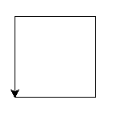

```Python
import turtle

t = turtle.Turtle()

t.forward(100)
t.left(90)
t.forward(100)
t.left(90)
t.forward(100)
t.left(90)
t.forward(100)

turtle.done()
```

#### Равносторонний треугольник

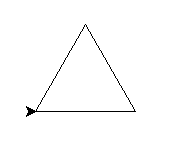

```python
import turtle

t = turtle.Turtle()

for i in range(3):
    t.forward(100)
    t.left(120)

turtle.done()
```

#### Домик

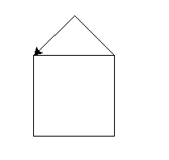

```python
import turtle

t = turtle.Turtle()

for i in range(5):
    t.left(90)
    t.forward(100)
    
t.left(45)
t.forward(70)
t.left(90)
t.forward(70)

turtle.done()
```

#### Простой красный цветок

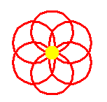

```python
import turtle

t = turtle.Turtle()

t.speed(8)
t.color("red")
t.pensize(3)

for i in range(6):
    t.circle(30)      # маленький круг — лепесток
    t.right(60)       # поворот на 60 градусов

t.color("yellow")
t.dot(20)             # серединка

turtle.done()
```

#### Цветок из кругов

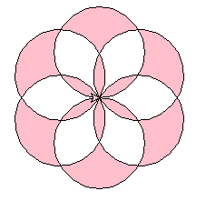

```Python
import turtle

t = turtle.Turtle()
t.speed(5)

t.begin_fill()
t.fillcolor("pink")

for _ in range(6):
    t.circle(50)  # Радиус лепестка
    t.left(60)    # Поворот между лепестками

t.end_fill()

turtle.done()
```

#### Простая снежинка

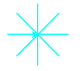

```Python
import turtle

t = turtle.Turtle()

t.color("cyan")
t.pensize(2)

for i in range(8):
    t.forward(50)
    t.backward(50)
    t.right(45)


turtle.done()
```

#### Многослойный цветок

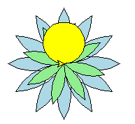

```python
import turtle

t = turtle.Turtle()
t.speed(9)

# Внешние лепестки
t.begin_fill()
t.fillcolor("lightblue")
for _ in range(12):
    t.circle(80, 60)
    t.left(120)
    t.circle(80, 60)
    t.left(120)
    t.left(30)
t.end_fill()

# Средние лепестки
t.begin_fill()
t.fillcolor("lightgreen")
for _ in range(8):
    t.circle(60, 60)
    t.left(120)
    t.circle(60, 60)
    t.left(120)
    t.left(45)
t.end_fill()

# Центр
t.begin_fill()
t.fillcolor("yellow")
t.circle(30)
t.end_fill()

turtle.done()
```

#### Фрактальное дерево с рекурсией

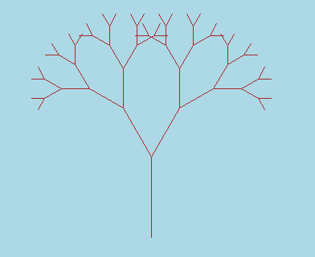

```python
import turtle

def draw_tree(branch_len, t, angle, depth):
    if depth > 0:
        # Рисуем ветку
        t.begin_fill()
        t.fillcolor(f"#{min(100 + depth*15, 255):02x}6432")  # Градиент коричневого
        t.forward(branch_len)
        t.left(angle)
        t.end_fill()
        
        # Рекурсивно рисуем левую и правую ветки
        draw_tree(branch_len * 0.7, t, angle, depth - 1)
        t.right(angle * 2)
        draw_tree(branch_len * 0.7, t, angle, depth - 1)
        t.left(angle)
        t.backward(branch_len)

# Настройка
t = turtle.Turtle()
t.speed(0)
screen = turtle.Screen()
screen.bgcolor("lightblue")

t.left(90)
t.up()
t.backward(200)
t.down()
t.color("brown")

# Рисуем дерево
draw_tree(100, t, 30, 6)

t.hideturtle()
turtle.done()
```

#### Сердце

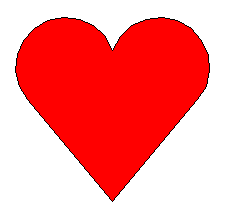

```Python
import turtle

t = turtle.Turtle()
t.speed(0)
screen = turtle.Screen()
screen.bgcolor("white")

t.begin_fill()
t.fillcolor("red")

t.left(50)
t.forward(133)
t.circle(50, 200)
t.right(140)
t.circle(50, 200)
t.forward(133)

t.end_fill()

t.penup()

t.hideturtle()
turtle.done()
```

#### Квадрат из точек

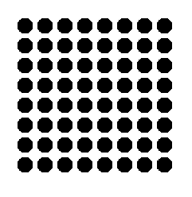

```Python
import turtle

t = turtle.Turtle()
t.speed(0)
t.penup()

# Начальная позиция
start_x = -50
start_y = 50
step = 30  # расстояние между точками

for row in range(8):
    for col in range(8):
        x = -100 + col * 25
        y = 100 - row * 25
        t.goto(x, y)
        t.dot(20, "black")

turtle.done()
```

#### Шахматная сетка из точек

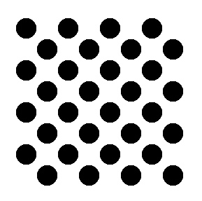

```python
import turtle

import turtle

t = turtle.Turtle()
t.speed(0)
t.penup()

size = 30
start_x = -120
start_y = 120

for row in range(8):
    for col in range(8):
        x = start_x + col * size
        y = start_y - row * size
        
        # Определяем цвет
        if (row + col) % 2 == 0:
            color = "black"
        else:
            color = "white"
        
        t.goto(x, y)
        t.dot(size, color)  # dot размером с клетку

turtle.done()
```

#### Сетка квадратов

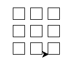

```Python
import turtle

t = turtle.Turtle()
t.speed(0)
t.penup()

# Начальная позиция
start_x = -50
start_y = 50
step = 30  # расстояние между точками

for row in range(3):
    for col in range(3):
        x = start_x + col * step
        y = start_y - row * step
        
        t.goto(x, y)
        t.pendown()
        
        # Квадрат 20x20
        for side in range(4):
            t.forward(20)
            t.left(90)
        
        t.penup()

turtle.done()
```

---

## Примеры фигур


### 1. Базовые многоугольники

#### 1.1. Равносторонний треугольник


```python
import turtle

def draw_equilateral_triangle(side: float, fill: bool = False, color: str = "black"):
    t = turtle.Turtle()
    t.speed(0)
    t.color(color)
    if fill:
        t.begin_fill()
    for _ in range(3):
        t.forward(side)
        t.left(120)  # Внешний угол = 180° – 60° = 120°
    if fill:
        t.end_fill()
    t.hideturtle()
	
draw_equilateral_triangle(100)

turtle.done()
```

#### 1.2. Прямоугольник (включая квадрат как частный случай)

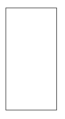

```python
import turtle

def draw_rectangle(width: float, height: float, fill: bool = False, color: str = "black"):
    t = turtle.Turtle()
    t.speed(0)
    t.color(color)
    if fill:
        t.begin_fill()
    for _ in range(2):
        t.forward(width)
        t.left(90)
        t.forward(height)
        t.left(90)
    if fill:
        t.end_fill()
    t.hideturtle()

draw_rectangle(100,200)

turtle.done()
```

#### 1.3. Правильный *n*-угольник

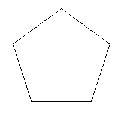

Обобщённая функция. Поддерживает вписанные и описанные окружности как опции.
```python
import turtle
import math

def draw_regular_polygon(n: int, side: float = None, radius: float = None,
                         mode: str = "side", fill: bool = False, color: str = "black"):
    """
    :param n: количество сторон (n ≥ 3)
    :param side: длина стороны (при mode='side')
    :param radius: радиус описанной окружности (при mode='radius')
    :param mode: 'side' или 'radius' — что задано
    """
    if n < 3:
        raise ValueError("n должно быть ≥ 3")
    t = turtle.Turtle()
    t.speed(0)
    t.color(color)
    if fill:
        t.begin_fill()
    
    # Вычисление угла поворота и стороны/радиуса
    angle = 360.0 / n
    if mode == "radius":
        if radius is None:
            raise ValueError("Для mode='radius' требуется параметр radius")
        side = 2 * radius * math.sin(math.radians(angle / 2))
        # Центрирование: переместиться в начальную точку
        t.penup()
        t.goto(radius, 0)
        t.setheading(90 + angle / 2)
        t.pendown()
    elif mode == "side":
        if side is None:
            raise ValueError("Для mode='side' требуется параметр side")
        radius = side / (2 * math.sin(math.radians(angle / 2)))
        t.penup()
        t.goto(0, -radius)
        t.setheading(0)
        t.pendown()
    else:
        raise ValueError("mode должен быть 'side' или 'radius'")
    
    for _ in range(n):
        t.forward(side)
        t.left(angle)
    
    if fill:
        t.end_fill()
    t.hideturtle()

draw_regular_polygon(5, 100, 100)

turtle.done()
```

> **Примечание.** При `mode='radius'` фигура центрируется относительно начала координат (0, 0), что удобно для композиций.

---

### 2. Звёздчатые и составные фигуры

#### 2.1. Звезда с *n* лучами (школьный вариант: «звезда без самопересечений» — неверно; здесь реализуется классическая *звезда Шлефли*)

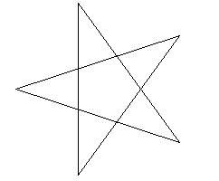

```python
import turtle
import math

def draw_star(n: int, radius: float, step: int = 2, fill: bool = False, color: str = "black"):
    """
    Рисует звезду {n/step} по обозначению Шлефли.
    Требуется, чтобы gcd(n, step) == 1 и 2*step < n.
    """
    if math.gcd(n, step) != 1 or 2 * step >= n:
        raise ValueError("Некорректные параметры: требуется gcd(n, step) == 1 и 2*step < n")
    t = turtle.Turtle()
    t.speed(0)
    t.color(color)
    if fill:
        t.begin_fill()
    
    angle = 360.0 / n
    t.penup()
    t.goto(radius, 0)
    t.setheading(90 + angle / 2)
    t.pendown()
    
    for _ in range(n):
        t.forward(radius * 2 * math.sin(math.radians(step * angle / 2)))
        t.left(step * angle)
    
    if fill:
        t.end_fill()
    t.hideturtle()

draw_star(5, 100)

turtle.done()
```

Примеры вызова:
```python
draw_star(5, 100)       # Пентаграмма
draw_star(7, 120, 2)    # Гептаграмма {7/2}
draw_star(8, 100, 3)    # Октаграмма {8/3}
```

#### 2.2. Снежинка Коха (итеративная реализация для устойчивости при глубине > 5)

См. часть 2 (фракталы). Здесь — заготовка.

---

### 3. Цветочные и радиальные узоры

#### 3.1. Простой цветок из окружностей

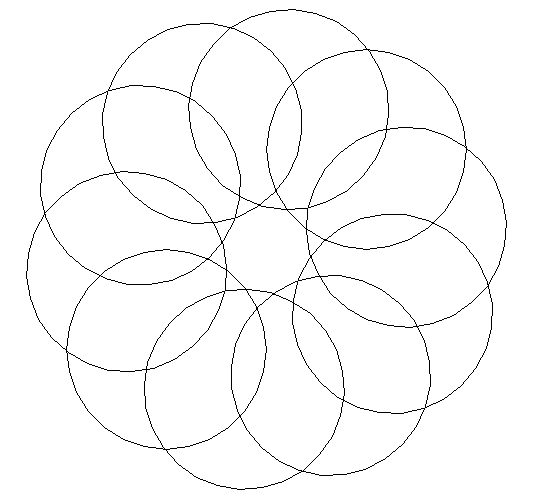

```python
import turtle
import math

def draw_flower_petals(radius: float, petal_count: int, petal_radius: float, fill: bool = False):
    t = turtle.Turtle()
    t.speed(0)
    angle_step = 360.0 / petal_count
    
    for i in range(petal_count):
        t.penup()
        t.goto(radius * math.cos(math.radians(i * angle_step)),
               radius * math.sin(math.radians(i * angle_step)))
        t.setheading(i * angle_step)
        t.pendown()
        if fill:
            t.begin_fill()
        t.circle(petal_radius)
        if fill:
            t.end_fill()
    t.hideturtle()

draw_flower_petals(100, 10, 100)

turtle.done()
```

#### 3.2. Цветок с лепестками-дугами («роза»)

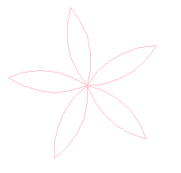

```python
import turtle

def draw_rose(petal_count: int, radius: float, fill: bool = False, color: str = "pink"):
    t = turtle.Turtle()
    t.speed(0)
    t.color(color)
    angle_step = 360.0 / petal_count
    
    for i in range(petal_count):
        t.penup()
        t.goto(0, 0)
        t.setheading(i * angle_step)
        t.pendown()
        if fill:
            t.begin_fill()
        t.circle(radius, 60)  # Первая дуга
        t.left(120)
        t.circle(radius, 60)  # Вторая дуга — замыкает лепесток
        if fill:
            t.end_fill()
    t.hideturtle()

draw_rose(5, 100)

turtle.done()
```

> Параметр `60` определяет «остроту» лепестка: при `<60` — заострённые, при `>60` — раскрытые.

---

### 4. 3D-иллюзии (изометрические проекции)


> *Важно: `turtle` не поддерживает 3D-рендеринг. Приводятся алгоритмы изометрической проекции — 2D-отображение 3D-структур.*

#### 4.1. Изометрический куб

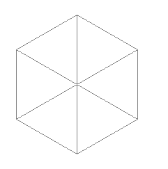

```python
import turtle
import math

def iso_project(x: float, y: float, z: float, scale: float = 1.0) -> tuple[float, float]:
    """Изометрическая проекция (углы 30°, 30°, 120°)"""
    iso_x = (x - y) * math.cos(math.radians(30)) * scale
    iso_y = (x + y) * math.sin(math.radians(30)) - z * scale
    return iso_x, iso_y

def draw_iso_cube(edge: float, origin: tuple[float, float] = (0, 0), fill: bool = False, color: str = "gray"):
    t = turtle.Turtle()
    t.speed(0)
    t.color(color)
    t.penup()
    # Вершины куба (x, y, z)
    vertices = [
        (0, 0, 0), (edge, 0, 0), (edge, edge, 0), (0, edge, 0),
        (0, 0, edge), (edge, 0, edge), (edge, edge, edge), (0, edge, edge)
    ]
    # Проекция
    proj = [iso_project(x, y, z, 1.0) for x, y, z in vertices]
    # Смещение к origin
    proj = [(px + origin[0], py + origin[1]) for px, py in proj]
    
    # Рёбра (индексы вершин)
    edges = [
        (0,1), (1,2), (2,3), (3,0),  # нижняя грань
        (4,5), (5,6), (6,7), (7,4),  # верхняя грань
        (0,4), (1,5), (2,6), (3,7)   # боковые
    ]
    
    for i1, i2 in edges:
        t.penup()
        t.goto(*proj[i1])
        t.pendown()
        t.goto(*proj[i2])
    t.hideturtle()

draw_iso_cube(100)

turtle.done()
```

#### 4.2. Изометрическая пирамида (тетраэдр)

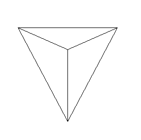

```python
import turtle
import math

def iso_project(x: float, y: float, z: float, scale: float = 1.0) -> tuple[float, float]:
    """Изометрическая проекция (углы 30°, 30°, 120°)"""
    iso_x = (x - y) * math.cos(math.radians(30)) * scale
    iso_y = (x + y) * math.sin(math.radians(30)) - z * scale
    return iso_x, iso_y

def draw_iso_tetrahedron(edge: float, origin: tuple[float, float] = (0, 0), fill: bool = False):
    t = turtle.Turtle()
    t.speed(0)
    # Вершины правильного тетраэдра в 3D (центрированы в начале)
    a = edge / math.sqrt(2)
    vertices_3d = [
        ( a,  a,  a),
        ( a, -a, -a),
        (-a,  a, -a),
        (-a, -a,  a)
    ]
    proj = [iso_project(x, y, z, 0.8) for x, y, z in vertices_3d]
    proj = [(px + origin[0], py + origin[1]) for px, py in proj]

    faces = [(0,1,2), (0,1,3), (0,2,3), (1,2,3)]
    for face in faces:
        t.penup()
        t.goto(*proj[face[0]])
        t.pendown()
        for idx in face[1:] + (face[0],):
            t.goto(*proj[idx])
        if fill:
            t.begin_fill()
            for idx in face:
                t.goto(*proj[idx])
            t.end_fill()
    t.hideturtle()

draw_iso_tetrahedron(100)

turtle.done()
```

---

### 5. Фракталы

#### 5.1. Дерево Пифагора (итеративная реализация через стек)

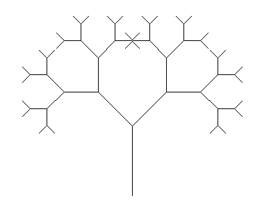

> Рекурсивная версия может вызвать переполнение стека при `depth > 8`. Итеративная позволяет контролировать память.

```python
import turtle

from collections import deque

def draw_pythagoras_tree_iterative(base_len: float, depth: int, angle: float = 45.0):
    t = turtle.Turtle()
    t.speed(0)
    stack = deque()
    # (x, y, heading, length, level)
    stack.append((0, 0, 90, base_len, 0))
    
    while stack:
        x, y, heading, length, level = stack.pop()
        if level > depth:
            continue
        t.penup()
        t.goto(x, y)
        t.setheading(heading)
        t.pendown()
        t.forward(length)
        new_x, new_y = t.position()
        # Левая ветвь
        stack.append((new_x, new_y, heading - angle, length * 0.7, level + 1))
        # Правая ветвь
        stack.append((new_x, new_y, heading + angle, length * 0.7, level + 1))
    t.hideturtle()

draw_pythagoras_tree_iterative(100, 5)

turtle.done()
```

#### 5.2. Снежинка Коха (итеративный генератор строк Л-системы)

```python
def koch_curve_string(iterations: int) -> str:
    s = "F"
    for _ in range(iterations):
        s = s.replace("F", "F+F--F+F")
    return s

def draw_koch_snowflake(side: float, iterations: int = 3):
    t = turtle.Turtle()
    t.speed(0)
    instr = koch_curve_string(iterations)
    scale = side / (3 ** iterations)
    
    t.penup()
    t.goto(-side / 2, -side / (2 * math.sqrt(3)))
    t.pendown()
    t.setheading(0)
    
    for c in instr:
        if c == "F":
            t.forward(scale)
        elif c == "+":
            t.left(60)
        elif c == "-":
            t.right(60)
    
    # Замыкание в снежинку
    for _ in range(2):
        for c in instr:
            if c == "F":
                t.forward(scale)
            elif c == "+":
                t.left(60)
            elif c == "-":
                t.right(60)
        t.right(120)
    t.hideturtle()
```

---

### 6. Параметрические кривые

#### 6.1. Спираль Архимеда

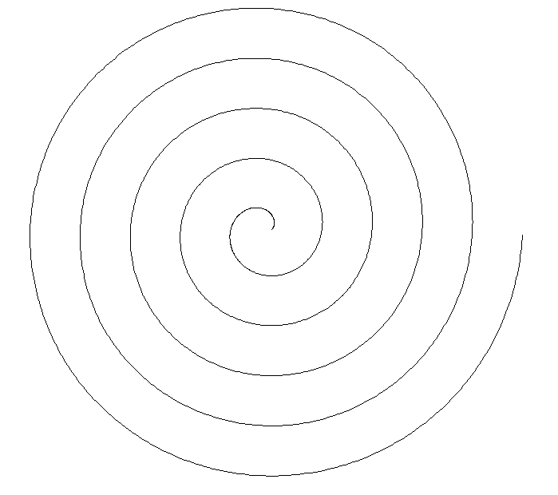

```python
import turtle
import math

def draw_archimedean_spiral(a: float, b: float, turns: int = 5, step_deg: float = 1.0):
    t = turtle.Turtle()
    t.speed(0)
    total_deg = turns * 360
    t.penup()
    for deg in range(0, int(total_deg), int(step_deg)):
        rad = math.radians(deg)
        r = a + b * rad
        x = r * math.cos(rad)
        y = r * math.sin(rad)
        t.goto(x, y)
        if deg == 0:
            t.pendown()
    t.hideturtle()

draw_archimedean_spiral(10, 10)

turtle.done()
```

#### 6.2. Полярная роза

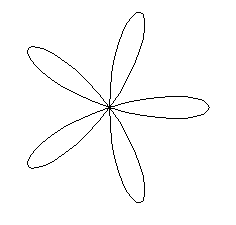

```python
import turtle
import math

def draw_polar_rose(a: float, k: int, step_deg: float = 2.0):
    t = turtle.Turtle()
    t.speed(0)
    t.penup()
    for deg in range(0, 360 * (1 if k % 2 else 2), int(step_deg)):
        rad = math.radians(deg)
        r = a * math.cos(k * rad)
        x = r * math.cos(rad)
        y = r * math.sin(rad)
        t.goto(x, y)
        if deg == 0:
            t.pendown()
    t.hideturtle()

draw_polar_rose(100, 5)

turtle.done()
```
- При `k` чётном — `2k` лепестков, при нечётном — `k`.

---


### 7. Динамические композиции и анимации (без `time.sleep`, через `ontimer`)

Все примеры в этом разделе используют `turtle.ontimer` — корректный путь для анимации в Turtle без блокировки интерфейса.

#### 7.1. Анимированная спираль с плавным изменением параметров


```python
def animated_archimedean_spiral(
    a_start: float = 0.1, 
    b_start: float = 2.0, 
    a_step: float = 0.0, 
    b_step: float = -0.02, 
    max_turns: int = 15,
    delay_ms: int = 40
):
    t = turtle.Turtle()
    t.speed(0)
    screen = turtle.Screen()
    screen.tracer(0)  # Отключаем автообновление

    state = {"a": a_start, "b": b_start, "turns": 0.0, "done": False}

    def step():
        if state["done"]:
            return
        a, b = state["a"], state["b"]
        turns = state["turns"]
        deg = turns * 360.0
        rad = math.radians(deg)
        r = a + b * rad
        x = r * math.cos(rad)
        y = r * math.sin(rad)

        if turns >= max_turns or r < 0:
            state["done"] = True
            t.hideturtle()
            return

        if deg == 0:
            t.penup()
            t.goto(0, 0)
            t.pendown()
        else:
            t.goto(x, y)

        state["a"] += a_step
        state["b"] += b_step
        state["turns"] += 1.0 / 360.0

        screen.update()
        screen.ontimer(step, delay_ms)

    step()
    screen.mainloop()
```
> Параметр `b_step < 0` создаёт «схлопывающуюся» спираль. При `b_step > 0` — расширяющуюся до выхода за границы.

#### 7.2. Вращающийся цветок (симуляция вращения через смещение фазы)

```python
def rotating_rose(
    petal_count: int = 6,
    radius: float = 80,
    phase_step: float = 2.0,  # градусов за кадр
    delay_ms: int = 50
):
    t = turtle.Turtle()
    t.speed(0)
    screen = turtle.Screen()
    screen.tracer(0)
    
    state = {"phase": 0.0}

    def clear_and_redraw():
        t.clear()
        phase = state["phase"]
        for i in range(petal_count):
            angle = i * (360.0 / petal_count) + phase
            t.penup()
            t.goto(0, 0)
            t.setheading(angle)
            t.pendown()
            t.circle(radius, 60)
            t.left(120)
            t.circle(radius, 60)
        screen.update()
        state["phase"] = (state["phase"] + phase_step) % 360.0
        screen.ontimer(clear_and_redraw, delay_ms)

    clear_and_redraw()
    screen.mainloop()
```

---

### 8. Сложные фракталы (глубина ≥ 6, оптимизированные)

#### 8.1. Кривая дракона (итеративная, без рекурсии, через битовую последовательность)

```python
def draw_dragon_curve(length: float, iterations: int):
    """
    Итеративная реализация на основе последовательности поворотов:
    На шаге n повороты = повороты_{n-1} + ['R'] + инвертированные(повороты_{n-1}) в обратном порядке.
    Эффективно строим через бит: поворот на шаге i — 'L', если (i & -i) * 2 & i != 0, иначе 'R'.
    """
    t = turtle.Turtle()
    t.speed(0)
    t.penup()
    t.goto(-length * 1.5, 0)
    t.pendown()
    t.setheading(0)

    total_steps = 2 ** iterations
    for i in range(total_steps):
        t.forward(length)
        # Определение направления поворота:
        # i начинается с 0; поворот после i-го отрезка
        turn_right = ((i & -i) << 1) & (i + 1) == 0
        if turn_right:
            t.right(90)
        else:
            t.left(90)
    t.hideturtle()
```
> Сложность: *O(2ⁿ)* по времени, *O(1)* по памяти. Поддерживает `iterations ≤ 16` на обычном ПК (при `length = 3`).

#### 8.2. Треугольник Серпинского через итеративный метод «хаотических игр»

```python
def draw_sierpinski_chaos(
    side: float = 400,
    points: int = 20000,
    dot_size: int = 1
):
    t = turtle.Turtle()
    t.speed(0)
    t.penup()
    t.hideturtle()
    screen = turtle.Screen()
    screen.tracer(0)

    # Вершины равностороннего треугольника
    h = side * math.sqrt(3) / 2
    A = (0, 0)
    B = (side, 0)
    C = (side / 2, h)
    vertices = [A, B, C]

    # Старт из середины AB
    x, y = side / 2, 0

    for _ in range(points):
        # Случайная вершина
        vx, vy = random.choice(vertices)
        # Середина между текущей точкой и выбранной вершиной
        x = (x + vx) / 2
        y = (y + vy) / 2
        t.goto(x - side / 2, y - h / 3)  # смещение для центрирования
        t.dot(dot_size, "black")

        if _ % 500 == 0:
            screen.update()
    screen.update()
```
> Требует `import random`. При `points ≥ 10⁴` чётко проявляется структура. Цвет и размер точек параметризуемы.

---

### 9. Геометрические узоры (орнаменты, паркеты, замощения)

#### 9.1. Замощение плоскости шестиугольниками («улей»)

```python
def hex_grid(
    radius: float,
    cols: int,
    rows: int,
    gap: float = 0.0,
    fill: bool = False,
    color: str = "gold"
):
    t = turtle.Turtle()
    t.speed(0)
    t.color(color)
    t.penup()
    
    # Вертикальное и горизонтальное смещение между центрами
    dx = (radius + gap) * 3 / 2
    dy = (radius + gap) * math.sqrt(3)

    for row in range(rows):
        y_offset = row * dy
        x_start = 0 if row % 2 == 0 else dx / 2
        for col in range(cols):
            cx = x_start + col * dx
            cy = y_offset

            # Рисуем шестиугольник с центром в (cx, cy)
            t.goto(cx + radius, cy)
            t.setheading(30)
            t.pendown()
            if fill:
                t.begin_fill()
            for _ in range(6):
                t.forward(radius)
                t.left(60)
            if fill:
                t.end_fill()
            t.penup()
    t.hideturtle()
```

#### 9.2. Орнамент «греческий ключ» (меандр), параметризуемый

```python
def meander_pattern(
    segment: float = 20,
    repeats: int = 10,
    turns: int = 4,      # 4 = стандартный меандр (квадратный), 6 = гексагональный
    fill: bool = False
):
    t = turtle.Turtle()
    t.speed(0)
    if fill:
        t.begin_fill()
    angle = 360.0 / turns

    for _ in range(repeats):
        for _ in range(turns - 1):
            t.forward(segment)
            t.left(angle)
        t.forward(segment * 2)  # «перемычка»
        t.right(angle)
    if fill:
        t.end_fill()
    t.hideturtle()
```
> При `turns = 4` получается классический зигзагообразный орнамент. При `turns = 6` — шестиугольный меандр.

---

### 10. Фигуры с динамической толщиной и цветом (градиенты, имитация тени)

#### 10.1. Дуга с градиентной заливкой (аппроксимация через многоугольник)

```python
def gradient_arc(
    radius: float,
    extent: float = 180.0,
    steps: int = 36,
    start_color: tuple[int, int, int] = (255, 0, 0),
    end_color: tuple[int, int, int] = (0, 0, 255)
):
    t = turtle.Turtle()
    t.speed(0)
    t.penup()
    
    # Разбиваем дугу на сегменты
    angle_step = extent / steps
    for i in range(steps):
        # Текущий угол (радианы)
        theta1 = math.radians(i * angle_step)
        theta2 = math.radians((i + 1) * angle_step)

        # Точки дуги
        x1 = radius * math.cos(theta1)
        y1 = radius * math.sin(theta1)
        x2 = radius * math.cos(theta2)
        y2 = radius * math.sin(theta2)
        
        # Цвет интерполируем линейно
        ratio = i / (steps - 1)
        r = int(start_color[0] * (1 - ratio) + end_color[0] * ratio)
        g = int(start_color[1] * (1 - ratio) + end_color[1] * ratio)
        b = int(start_color[2] * (1 - ratio) + end_color[2] * ratio)
        t.color((r, g, b))

        # Рисуем треугольник: центр → точка1 → точка2
        t.goto(0, 0)
        t.pendown()
        t.goto(x1, y1)
        t.goto(x2, y2)
        t.goto(0, 0)
        t.penup()
    t.hideturtle()
```
> Требует `turtle.colormode(255)` в основном коде. Используется для визуализации секторов, радарных диаграмм, эффектов свечения.

#### 10.2. Смуляция объёма: круг с радиальным градиентом («сфера»)

```python
def radial_gradient_circle(
    radius: float,
    layers: int = 50,
    inner_color: str = "white",
    outer_color: str = "black"
):
    t = turtle.Turtle()
    t.speed(0)
    t.penup()

    screen = turtle.Screen()
    screen.colormode(255)
    inner_rgb = screen.getcanvas().winfo_rgb(inner_color)
    outer_rgb = screen.getcanvas().winfo_rgb(outer_color)
    # getcanvas().winfo_rgb возвращает значения в диапазоне [0, 65535]
    inner_rgb = tuple(c // 256 for c in inner_rgb)
    outer_rgb = tuple(c // 256 for c in outer_rgb)

    for i in range(layers, 0, -1):
        r_frac = i / layers
        current_radius = radius * r_frac
        # Интерполяция цвета
        r = int(inner_rgb[0] * r_frac + outer_rgb[0] * (1 - r_frac))
        g = int(inner_rgb[1] * r_frac + outer_rgb[1] * (1 - r_frac))
        b = int(inner_rgb[2] * r_frac + outer_rgb[2] * (1 - r_frac))
        t.color((r, g, b))
        # Рисуем окружность текущего радиуса (толщиной ~radius/layers)
        t.goto(0, -current_radius)
        t.pendown()
        t.circle(current_radius)
        t.penup()
    t.hideturtle()
```
> Работает медленно при `layers > 80`, но визуально убедительно. Можно использовать `screen.tracer(0)` + `screen.update()` для ускорения.

---

### 11. Переиспользуемые базы

#### 11.1. Шаблон для экспериментов: изолированное окно с настройками

```python
def setup_experiment_window(
    title: str = "Turtle Experiment",
    width: int = 800,
    height: int = 600,
    bg_color: str = "white",
    fast_draw: bool = True
) -> tuple[turtle.Turtle, turtle.Screen]:
    screen = turtle.Screen()
    screen.setup(width, height)
    screen.title(title)
    screen.bgcolor(bg_color)
    if fast_draw:
        screen.tracer(0)
    
    t = turtle.Turtle()
    t.speed(0)
    t.hideturtle()
    return t, screen
```
> Рекомендуется использовать во всех экспериментах. Позволяет избежать побочных эффектов от предыдущих сессий.

#### 11.2. Сброс среды (чистый холст + параметры по умолчанию)
```python
def reset_environment():
    turtle.clearscreen()
    turtle.colormode(255)
    turtle.tracer(0)
    turtle.delay(0)
```

---