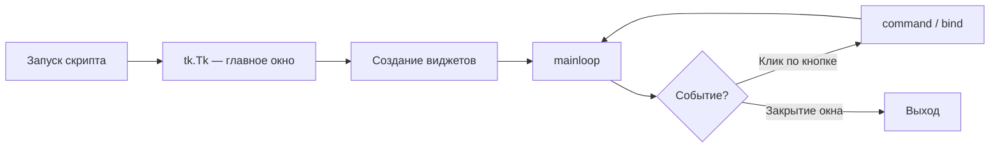

# Tkinter — окна и виджеты

<div class="article-tags">
  <span class="tag tag-notrequired">НЕ ОБЯЗАТЕЛЬНО</span>
  <span class="tag tag-beginner">ДЛЯ НОВИЧКОВ</span>
</div>

---

## Для кого эта статья

Подборка **готовых примеров Tkinter на Python** с пояснениями «что делает каждая строка». Подойдёт, если вы:

- делаете **лабораторную**, **курсовую** или домашку по программированию с GUI;
- ищете «**как сделать окно на Python**», «**кнопку tkinter**», «**поле ввода entry**»;
- только установили Python и хотите **первое десктоп-приложение** без pip и сторонних библиотек.

Tkinter уже встроен в CPython — достаточно `import tkinter`. Каждый блок ниже можно **скопировать целиком**, сохранить в файл `.py` и запустить: `python имя_файла.py`.

<div class="callout callout--tip">
  <div class="callout-title">Сначала теория</div>

  <div class="callout-body">
  Для системного понимания GUI прочитайте <a href="/encyclopedia/5-languages/5-02-python/311">Tkinter и GUI</a>, <a href="/encyclopedia/5-languages/5-02-python/3111">Первая программа на Tkinter</a> и <a href="/encyclopedia/5-languages/5-02-python/3112">Справочник по элементам UI</a>. Эта статья — практическая галерея с разбором, как <a href="/lab/Примеры/111">примеры Turtle</a> для рисования. Мобильный UI на Dart — <a href="/encyclopedia/5-languages/5-22-dart/311">Flutter</a> и <a href="/lab/Примеры/1154">готовые виджеты</a>.
</div>
</div>

---

## Как пользоваться статьёй

1. Скопируйте **обязательный каркас** — без него окно закроется сразу.
2. Выберите пример по задаче (кнопка, форма, список, меню…).
3. Прочитайте **Разбор** под кодом — там смысл строк и типичные ошибки.
4. Измените текст, цвета, размер окна — так быстрее запоминается API.

---

## Словарь виджетов за 30 секунд

| Виджет | Зачем | Как получить текст / значение |
|--------|-------|-------------------------------|
| `Label` | Надпись, статус | `text=` или `textvariable=` |
| `Button` | Кнопка | `command=функция` (без скобок!) |
| `Entry` | Однострочный ввод | `entry.get()` |
| `Text` | Много строк | `text.get("1.0", tk.END)` |
| `Checkbutton` | Галочка вкл/выкл | `BooleanVar().get()` |
| `Radiobutton` | Один из нескольких | `StringVar().get()` |
| `Listbox` | Список строк | `listbox.get(индекс)` |
| `Scale` | Ползунок | аргумент `command` или `IntVar` |
| `Menu` | Меню «Файл», «Справка» | пункты через `add_command` |
| `messagebox` | Всплывающее окно | `showinfo`, `showerror`, `askyesno` |

**Три способа разложить элементы в окне:** `pack()` (стопка или ряд), `grid()` (таблица), `place()` (координаты x, y). В **одном** родителе (например, одном `Frame`) смешивать `pack` и `grid` нельзя.

---

## Как работает Tkinter — цикл событий

GUI-приложение не «висит» в бесконечном `while True`. Оно ждёт **события**: клик, нажатие клавиши, движение мыши. За это отвечает `root.mainloop()`.



Пока `mainloop()` работает, Python **не идёт дальше** по файлу — программа живёт, пока пользователь не закроет окно.

---

### Обязательный каркас

Любой пример ниже опирается на этот шаблон. Запомните его — как `import turtle` и `turtle.done()` в [Turtle](/lab/Примеры/111).

```python
import tkinter as tk  # стандартная библиотека, pip не нужен

root = tk.Tk()                    # главное окно приложения
root.title("Моё приложение")      # заголовок в панели окна
root.geometry("400x300")          # ширина x высота в пикселях

# --- здесь Label, Button, Entry и остальные виджеты ---

root.mainloop()                   # цикл событий; без этой строки окно мелькает и закроется
```

**Разбор:**

- `tk.Tk()` — корень дерева виджетов. В одной программе обычно **один** такой объект.
- `geometry("400x300")` — размер клиентской области. Можно добавить позицию: `"400x300+100+50"`.
- `mainloop()` — блокирует конец скрипта и обрабатывает клики. Если окно «мигает и исчезает» — почти всегда забыли эту строку.

---

### Стартовые окна

Простые примеры «с нуля» — с них удобно начинать лабораторную или первый проект с GUI.

#### Минимальное окно с меткой

**Задача:** показать, что Python умеет открывать окно с текстом — минимум для проверки установки.

```python
import tkinter as tk

root = tk.Tk()
root.title("Привет, Tkinter")

label = tk.Label(root, text="Окно работает!", font=("Segoe UI", 14))
label.pack(padx=20, pady=20)  # pack — положить виджет в окно с отступами

root.mainloop()
```

**Разбор:**

- `Label` — статическая надпись; сам по себе на экране не появится, нужен `pack`, `grid` или `place`.
- `font=("Segoe UI", 14)` — кортеж «шрифт, размер». На Linux часто подойдёт `"DejaVu Sans"`.
- `padx=20, pady=20` — внутренние отступы вокруг надписи.

**Попробуйте:** смените текст и `root.geometry("500x200")`.

---

#### Кнопка и диалог

**Задача:** по нажатию кнопки что-то происходит — основа любой формы и калькулятора.

```python
import tkinter as tk
from tkinter import messagebox  # стандартные диалоги ОС

def on_click():
    messagebox.showinfo("Сообщение", "Кнопка нажата!")

root = tk.Tk()
root.title("Кнопка")

btn = tk.Button(root, text="Нажми меня", command=on_click)  # command=on_click, НЕ on_click()
btn.pack(pady=30)

root.mainloop()
```

**Разбор:**

- `command=on_click` передаёт **ссылку на функцию**. Если написать `command=on_click()`, функция вызовется **сразу при старте**, а не по клику.
- `messagebox.showinfo(заголовок, текст)` — модальное окно; пользователь должен нажать OK.

**Попробуйте:** замените на `messagebox.showwarning` или `askyesno` — вернёт `True`/`False`.

---

#### Поле ввода и приветствие

**Задача:** прочитать текст из `Entry` и показать результат — типичная форма «введите имя».

```python
import tkinter as tk
from tkinter import messagebox

def greet():
    name = entry.get().strip()  # get() — текст из поля; strip() убирает пробелы по краям
    if name:
        messagebox.showinfo("Привет", f"Здравствуй, {name}!")
    else:
        messagebox.showwarning("Пусто", "Введите имя")

root = tk.Tk()
root.title("Приветствие")
root.resizable(False, False)  # запрет изменения размера окна

frame = tk.Frame(root, padx=16, pady=16)  # Frame — контейнер для группы виджетов
frame.pack()

tk.Label(frame, text="Ваше имя:").grid(row=0, column=0, sticky="w")
entry = tk.Entry(frame, width=24)
entry.grid(row=0, column=1, padx=(8, 0))
entry.focus_set()  # курсор сразу в поле
entry.bind("<Return>", lambda e: greet())  # Enter = тот же greet()

tk.Button(frame, text="Приветствовать", command=greet).grid(
    row=1, column=0, columnspan=2, pady=(12, 0)
)

root.mainloop()
```

**Разбор:**

- `Frame` + `grid` — табличная раскладка: `row`, `column`, `sticky="w"` (прижать к левому краю ячейки).
- `entry.get()` вызывают **внутри** обработчика, когда пользователь уже что-то ввёл.
- `bind("<Return>", ...)` — реакция на клавишу Enter; `lambda e: greet()` игнорирует объект события `e`.

**Попробуйте:** добавьте второе поле «Фамилия» и выводите полное имя.

---

#### Конвертер °C → °F

**Задача:** классическая учебная программа — ввод числа, формула, вывод в интерфейсе (часто встречается в заданиях).

```python
import tkinter as tk
from tkinter import messagebox

def convert():
    raw = entry.get().strip().replace(",", ".")  # "25,5" → "25.5" для float
    try:
        celsius = float(raw)
    except ValueError:
        messagebox.showerror("Ошибка", "Введите число, например 25")
        return
    fahrenheit = celsius * 9 / 5 + 32
    result_var.set(f"{celsius:.1f} °C = {fahrenheit:.1f} °F")

root = tk.Tk()
root.title("Конвертер температуры")
root.resizable(False, False)

frame = tk.Frame(root, padx=16, pady=16)
frame.pack()

tk.Label(frame, text="Температура (°C):").grid(row=0, column=0, sticky="w")
entry = tk.Entry(frame, width=12)
entry.grid(row=0, column=1, padx=(8, 0))
entry.focus_set()
entry.bind("<Return>", lambda e: convert())

result_var = tk.StringVar(value="—")  # «переменная» для динамического текста
tk.Label(frame, textvariable=result_var).grid(row=1, column=0, columnspan=2, pady=(12, 0))
tk.Button(frame, text="Перевести", command=convert).grid(row=2, column=0, columnspan=2, pady=(12, 0))

root.mainloop()
```

**Разбор:**

- `StringVar` связывают с `Label` через `textvariable=`. Меняете `result_var.set(...)` — надпись обновляется без пересоздания виджета.
- `try/except ValueError` — защита от букв в поле температуры.
- Формула: $F = C \times \frac&#123;9&#125;&#123;5&#125; + 32$.

**Попробуйте:** добавьте кнопку «Очистить» — `entry.delete(0, tk.END)` и `result_var.set("—")`.

---

#### Флажок и переключатели

**Задача:** несколько настроек «вкл/выкл» и выбор одного варианта из списка (роль, режим).

```python
import tkinter as tk

def update_status():
    parts = []
    if notify_var.get():
        parts.append("уведомления")
    if sound_var.get():
        parts.append("звук")
    role = role_var.get()
    status_var.set(
        f"Роль: {role}; включено: {', '.join(parts) or 'ничего'}"
    )

root = tk.Tk()
root.title("Настройки")
frame = tk.Frame(root, padx=16, pady=16)
frame.pack()

notify_var = tk.BooleanVar(value=True)   # True/False для Checkbutton
sound_var = tk.BooleanVar(value=False)
role_var = tk.StringVar(value="user")    # одна строка для группы Radiobutton

tk.Checkbutton(frame, text="Уведомления", variable=notify_var, command=update_status).pack(anchor="w")
tk.Checkbutton(frame, text="Звук", variable=sound_var, command=update_status).pack(anchor="w")

tk.Label(frame, text="Роль:").pack(anchor="w", pady=(12, 0))
tk.Radiobutton(frame, text="Пользователь", variable=role_var, value="user", command=update_status).pack(anchor="w")
tk.Radiobutton(frame, text="Администратор", variable=role_var, value="admin", command=update_status).pack(anchor="w")

status_var = tk.StringVar()
tk.Label(frame, textvariable=status_var, fg="gray").pack(anchor="w", pady=(12, 0))
update_status()  # начальная подпись при старте

root.mainloop()
```

**Разбор:**

- `BooleanVar` / `StringVar` — «мост» между логикой Python и виджетами. `.get()` читает текущее значение.
- У `Radiobutton` с одной `variable` и разными `value` выбирается **только один** пункт.
- `command=update_status` обновляет строку статуса при каждом изменении.

**Попробуйте:** добавьте третью роль «Гость» с `value="guest"`.

---

#### Список задач (Listbox)

**Задача:** простой to-do — добавить строку в список, удалить выбранную. Хороший мини-проект для отчёта.

```python
import tkinter as tk

def add_task():
    text = entry.get().strip()
    if text:
        listbox.insert(tk.END, text)      # tk.END — в конец списка
        entry.delete(0, tk.END)          # очистить поле ввода

def remove_task():
    sel = listbox.curselection()         # кортеж индексов выделенных строк
    if sel:
        listbox.delete(sel[0])

root = tk.Tk()
root.title("Список задач")
root.geometry("320x280")

frame = tk.Frame(root, padx=12, pady=12)
frame.pack(fill=tk.BOTH, expand=True)

entry = tk.Entry(frame)
entry.pack(fill=tk.X)
entry.bind("<Return>", lambda e: add_task())

btn_row = tk.Frame(frame)
btn_row.pack(fill=tk.X, pady=(8, 8))
tk.Button(btn_row, text="Добавить", command=add_task).pack(side=tk.LEFT, padx=(0, 4))
tk.Button(btn_row, text="Удалить", command=remove_task).pack(side=tk.LEFT)

listbox = tk.Listbox(frame, height=10)
listbox.pack(fill=tk.BOTH, expand=True)

root.mainloop()
```

**Разбор:**

- `Listbox` хранит строки; `insert(индекс, текст)` и `delete(индекс)`.
- `curselection()` пуст, если ничего не выделено — перед `delete` проверяем `if sel`.
- `fill=tk.BOTH, expand=True` — список растягивается при изменении размера окна.

**Попробуйте:** кнопка «Вверх» — `listbox.get(sel[0])`, delete, insert на `sel[0]-1`.

---

#### Ползунок громкости

**Задача:** `Scale` — ползунок с числовым диапазоном; `command` вызывается при каждом движении.

```python
import tkinter as tk

def on_change(value):
    volume_var.set(f"Громкость: {int(float(value))}%")

root = tk.Tk()
root.title("Ползунок")

volume_var = tk.StringVar(value="Громкость: 50%")
tk.Label(root, textvariable=volume_var, font=("Segoe UI", 12)).pack(pady=(20, 8))

scale = tk.Scale(
    root,
    from_=0,
    to=100,
    orient=tk.HORIZONTAL,
    length=260,
    command=on_change,  # value приходит строкой, например "50.0"
)
scale.set(50)
scale.pack(padx=20, pady=(0, 20))

root.mainloop()
```

**Разбор:**

- `from_` с подчёркиванием — зарезервированное слово `from` в Python.
- `command` у `Scale` получает **новое значение ползунка** как аргумент.
- Вертикальный ползунок: `orient=tk.VERTICAL`.

---

## Примеры окон и виджетов

Ниже — тематические блоки: компоновка, текст, списки, меню, диалоги, вкладки, рисование, таймеры и цельные мини-приложения.

---

### 1. Компоновка — pack, grid, place

#### 1.1. Форма входа на grid

**Задача:** форма «Email / Пароль» с выравниванием — как на сайтах, но в десктопе.

```python
import tkinter as tk

root = tk.Tk()
root.title("Grid-форма")
root.geometry("360x160")

frame = tk.Frame(root, padx=12, pady=12)
frame.pack(fill=tk.BOTH, expand=True)
frame.grid_columnconfigure(1, weight=1)  # вторая колонка растягивается

tk.Label(frame, text="Email:").grid(row=0, column=0, sticky="w", pady=4)
email = tk.Entry(frame)
email.grid(row=0, column=1, sticky="ew", padx=(8, 0), pady=4)

tk.Label(frame, text="Пароль:").grid(row=1, column=0, sticky="w", pady=4)
password = tk.Entry(frame, show="*")  # show="*" — маскировка пароля
password.grid(row=1, column=1, sticky="ew", padx=(8, 0), pady=4)

tk.Button(frame, text="Войти").grid(row=2, column=1, sticky="e", pady=(12, 0))

root.mainloop()
```

**Разбор:**

- `grid_columnconfigure(1, weight=1)` — поле ввода тянется по ширине при ресайзе окна.
- `sticky="ew"` — east+west, растянуть по горизонтали в ячейке.
- `show="*"` в `Entry` — символы отображаются звёздочками.

---

#### 1.2. Панель инструментов через pack

**Задача:** ряд кнопок сверху и рабочая область снизу — каркас редактора или блокнота.

```python
import tkinter as tk

root = tk.Tk()
root.title("Toolbar")

toolbar = tk.Frame(root, bd=1, relief=tk.RAISED)
toolbar.pack(side=tk.TOP, fill=tk.X)

for label in ("Новый", "Открыть", "Сохранить", "Выход"):
    tk.Button(toolbar, text=label, padx=8, pady=4).pack(side=tk.LEFT, padx=2, pady=2)

content = tk.Label(root, text="Область документа", bg="white")
content.pack(fill=tk.BOTH, expand=True, padx=8, pady=8)

root.mainloop()
```

**Разбор:**

- `pack(side=tk.TOP)` и `side=tk.LEFT` — классическая «полоска кнопок».
- `fill=tk.X` — toolbar на всю ширину; `fill=tk.BOTH, expand=True` — контент забирает оставшееся место.

---

#### 1.3. Размещение place по координатам

**Задача:** точное позиционирование — реже `pack`/`grid`, но полезно для наложения элементов на `Canvas`.

```python
import tkinter as tk

root = tk.Tk()
root.title("Place")
root.geometry("300x200")

canvas = tk.Canvas(root, bg="#f0f0f0")
canvas.pack(fill=tk.BOTH, expand=True)

canvas.create_rectangle(20, 20, 120, 80, fill="lightblue", outline="")
canvas.create_oval(140, 30, 220, 110, fill="lightgreen", outline="")
tk.Label(canvas, text="Метка", bg="#f0f0f0").place(x=30, y=100)

root.mainloop()
```

**Разбор:**

- `Canvas.create_rectangle(x1, y1, x2, y2)` — координаты от левого верхнего угла холста.
- `place(x=, y=)` — абсолютные пиксели от родителя (`canvas` здесь выступает родителем для `Label`).

---

### 2. Текстовые поля и многострочный ввод

#### 2.1. Text с прокруткой

**Задача:** заметки, лог, несколько абзацев — `Entry` для этого не подходит, нужен `Text` + `Scrollbar`.

```python
import tkinter as tk

root = tk.Tk()
root.title("Заметки")
root.geometry("400x300")

frame = tk.Frame(root)
frame.pack(fill=tk.BOTH, expand=True, padx=8, pady=8)

scrollbar = tk.Scrollbar(frame)
scrollbar.pack(side=tk.RIGHT, fill=tk.Y)

text = tk.Text(frame, wrap=tk.WORD, yscrollcommand=scrollbar.set)
text.pack(side=tk.LEFT, fill=tk.BOTH, expand=True)
scrollbar.config(command=text.yview)

text.insert("1.0", "Черновик заметки...\nВторая строка.")

root.mainloop()
```

**Разбор:**

- `Text` и `Scrollbar` связывают парами: `yscrollcommand=scrollbar.set` и `command=text.yview`.
- `"1.0"` — строка 1, символ 0 (индексация с 1 для строк).
- `wrap=tk.WORD` — перенос по словам, а не посередине слова.

---

#### 2.2. Счётчик символов (реактивный интерфейс)

**Задача:** подпись «осталось N символов» обновляется при каждом нажатии клавиши — без кнопки «Обновить».

```python
import tkinter as tk

def on_change(*_):
    count_var.set(f"Символов: {len(entry_var.get())}")

root = tk.Tk()
root.title("Счётчик")

entry_var = tk.StringVar()
entry_var.trace_add("write", on_change)  # следить за каждым изменением текста

frame = tk.Frame(root, padx=16, pady=16)
frame.pack()

tk.Entry(frame, textvariable=entry_var, width=40).pack()
count_var = tk.StringVar(value="Символов: 0")
tk.Label(frame, textvariable=count_var, fg="gray").pack(anchor="w", pady=(8, 0))

root.mainloop()
```

**Разбор:**

- `textvariable=entry_var` связывает `Entry` с переменной; `.get()` в `on_change` читает актуальный текст.
- `trace_add("write", ...)` — callback при любом вводе и удалении.

---

### 3. Списки, таблицы и выпадающие меню

#### 3.1. Combobox (ttk)

**Задача:** выпадающий список в «современном» стиле — модуль `ttk` (themed tk).

```python
import tkinter as tk
from tkinter import ttk

root = tk.Tk()
root.title("Combobox")
root.geometry("280x120")

frame = tk.Frame(root, padx=16, pady=16)
frame.pack()

tk.Label(frame, text="Категория:").grid(row=0, column=0, sticky="w")
combo = ttk.Combobox(
    frame,
    values=["Работа", "Личное", "Учёба"],
    state="readonly",  # только выбор из списка, без произвольного текста
    width=18,
)
combo.set("Работа")
combo.grid(row=0, column=1, padx=(8, 0))

status = tk.StringVar(value=f"Выбрано: {combo.get()}")
combo.bind("<<ComboboxSelected>>", lambda e: status.set(f"Выбрано: {combo.get()}"))
tk.Label(frame, textvariable=status, fg="gray").grid(row=1, column=0, columnspan=2, pady=(12, 0))

root.mainloop()
```

**Разбор:**

- `&lt;&lt;ComboboxSelected&gt;&gt;` — виртуальное событие ttk при выборе пункта.
- `state="normal"` разрешит ввод своего текста в комбобокс.

---

#### 3.2. Таблица Treeview

**Задача:** таблица «Имя / Возраст» — аналог простой Excel-таблицы в Tkinter.

```python
import tkinter as tk
from tkinter import ttk

root = tk.Tk()
root.title("Таблица")
root.geometry("320x220")

cols = ("name", "age")
tree = ttk.Treeview(root, columns=cols, show="headings", height=8)
tree.heading("name", text="Имя")
tree.heading("age", text="Возраст")
tree.column("age", width=60, anchor="center")
tree.pack(fill=tk.BOTH, expand=True, padx=8, pady=8)

for row in (("Алиса", 30), ("Боб", 25), ("Карл", 28)):
    tree.insert("", tk.END, values=row)

root.mainloop()
```

**Разбор:**

- `columns=` — имена столбцов; `show="headings"` скрывает древовидную колонку слева.
- `insert("", tk.END, values=(...))` — новая строка в конец; `""` — корень дерева.

---

#### 3.3. Поиск и фильтр Listbox

**Задача:** живой поиск по списку — типичное UI для автодополнения и каталогов.

```python
import tkinter as tk

ALL_ITEMS = ["Яблоко", "Абрикос", "Банан", "Ананас", "Груша", "Алыча"]

def filter_list(*_):
    query = search_var.get().lower()
    listbox.delete(0, tk.END)
    for item in ALL_ITEMS:
        if query in item.lower():
            listbox.insert(tk.END, item)

root = tk.Tk()
root.title("Поиск")
root.geometry("260x280")

frame = tk.Frame(root, padx=12, pady=12)
frame.pack(fill=tk.BOTH, expand=True)

search_var = tk.StringVar()
search_var.trace_add("write", filter_list)
tk.Entry(frame, textvariable=search_var).pack(fill=tk.X)
listbox = tk.Listbox(frame, height=12)
listbox.pack(fill=tk.BOTH, expand=True, pady=(8, 0))

filter_list()  # показать весь список при старте
root.mainloop()
```

**Разбор:**

- Список **пересобирается** при каждом символе в поиске: `delete(0, END)` + цикл `insert`.
- `ALL_ITEMS` — исходные данные в Python; в большом приложении их читают из файла или БД.

---

### 4. Меню, панели и строка состояния

#### 4.1. MenuBar — меню «Файл / Справка»

**Задача:** стандартное меню в шапке окна, как у Блокнота или калькулятора Windows.

```python
import tkinter as tk
from tkinter import messagebox

def about():
    messagebox.showinfo("О программе", "Пример меню на Tkinter")

root = tk.Tk()
root.title("Меню")

menubar = tk.Menu(root)
file_menu = tk.Menu(menubar, tearoff=0)
file_menu.add_command(label="Новый", command=lambda: print("Новый"))
file_menu.add_command(label="Открыть", command=lambda: print("Открыть"))
file_menu.add_separator()
file_menu.add_command(label="Выход", command=root.destroy)
menubar.add_cascade(label="Файл", menu=file_menu)

help_menu = tk.Menu(menubar, tearoff=0)
help_menu.add_command(label="О программе", command=about)
menubar.add_cascade(label="Справка", menu=help_menu)

root.config(menu=menubar)
tk.Label(root, text="Выберите пункт меню сверху").pack(expand=True)

root.mainloop()
```

**Разбор:**

- `Menu(menubar)` — подменю; `add_cascade` добавляет пункт верхнего уровня.
- `tearoff=0` отключает «отрыв» меню в отдельное окно (устаревшая фича Tk).
- `root.destroy()` — закрыть приложение.

---

#### 4.2. StatusBar — строка состояния

**Задача:** внизу окна показывать «Готово», «Сохранение…», «Файл сохранён».

```python
import tkinter as tk

root = tk.Tk()
root.title("StatusBar")
root.geometry("360x200")

content = tk.Label(root, text="Основная область", bg="white")
content.pack(fill=tk.BOTH, expand=True)

status_var = tk.StringVar(value="Готово")
statusbar = tk.Label(
    root,
    textvariable=status_var,
    bd=1,
    relief=tk.SUNKEN,
    anchor=tk.W,
    padx=8,
)
statusbar.pack(side=tk.BOTTOM, fill=tk.X)

def simulate_save():
    status_var.set("Сохранение...")
    root.after(800, lambda: status_var.set("Файл сохранён"))  # через 800 мс

tk.Button(root, text="Сохранить", command=simulate_save).pack(pady=8)

root.mainloop()
```

**Разбор:**

- `pack(side=tk.BOTTOM)` — status bar прилипает к низу окна.
- `root.after(мс, функция)` — отложенный вызов **без** `time.sleep` (sleep заморозил бы GUI).

---

#### 4.3. Контекстное меню по ПКМ

**Задача:** меню «Копировать / Вставить» по правому клику — как в текстовых редакторах.

```python
import tkinter as tk

root = tk.Tk()
root.title("Контекстное меню")

text = tk.Text(root, height=8, width=40)
text.pack(padx=12, pady=12)
text.insert("1.0", "Щёлкните правой кнопкой мыши по полю.")

menu = tk.Menu(root, tearoff=0)
menu.add_command(
    label="Копировать",
    command=lambda: root.clipboard_clear()
    or root.clipboard_append(text.get("sel.first", "sel.last") if text.tag_ranges("sel") else ""),
)
menu.add_command(label="Вставить", command=lambda: text.insert(tk.INSERT, root.clipboard_get()))
menu.add_separator()
menu.add_command(label="Очистить", command=lambda: text.delete("1.0", tk.END))

def show_menu(event):
    menu.tk_popup(event.x_root, event.y_root)

text.bind("<Button-3>", show_menu)  # ПКМ; на macOS иногда <Button-2>

root.mainloop()
```

**Разбор:**

- `event.x_root, event.y_root` — координаты курсора на **экране** для `tk_popup`.
- `text.tag_ranges("sel")` — есть ли выделение; `sel.first` / `sel.last` — границы выделения в `Text`.

---

### 5. Диалоги и дочерние окна

#### 5.1. Выбор файла и цвета

**Задача:** стандартные диалоги ОС — открыть `.txt`, выбрать цвет фона.

```python
import tkinter as tk
from tkinter import filedialog, colorchooser

def open_file():
    path = filedialog.askopenfilename(filetypes=[("Текст", "*.txt"), ("Все", "*.*")])
    if path:
        status_var.set(f"Открыт: {path}")

def pick_color():
    result = colorchooser.askcolor()
    if result[1]:
        root.configure(bg=result[1])
        status_var.set(f"Фон: {result[1]}")

root = tk.Tk()
root.title("Диалоги")
root.geometry("360x160")

status_var = tk.StringVar(value="Готово")
tk.Label(root, textvariable=status_var).pack(pady=(16, 8))

btn_row = tk.Frame(root)
btn_row.pack()
tk.Button(btn_row, text="Открыть файл", command=open_file).pack(side=tk.LEFT, padx=4)
tk.Button(btn_row, text="Цвет фона", command=pick_color).pack(side=tk.LEFT, padx=4)
tk.Button(btn_row, text="Выход", command=root.destroy).pack(side=tk.LEFT, padx=4)

root.mainloop()
```

**Разбор:**

- `askopenfilename` возвращает **строку пути** или `""`, если пользователь нажал «Отмена».
- `askcolor()` возвращает `((r,g,b), "#hex")`; второй элемент удобен для `configure(bg=...)`.

---

#### 5.2. Модальное окно Toplevel

**Задача:** второе окно «Настройки», которое блокирует главное, пока открыто.

```python
import tkinter as tk

def open_settings():
    dialog = tk.Toplevel(root)       # дочернее окно, не второй tk.Tk()!
    dialog.title("Настройки")
    dialog.geometry("280x140")
    dialog.transient(root)           # всегда поверх главного
    dialog.grab_set()                # модальность — ввод только здесь

    tk.Label(dialog, text="Имя пользователя:").pack(anchor="w", padx=12, pady=(12, 0))
    entry = tk.Entry(dialog, width=30)
    entry.pack(padx=12, pady=4)
    entry.focus_set()

    def close():
        dialog.grab_release()
        dialog.destroy()

    tk.Button(dialog, text="OK", command=close).pack(pady=12)

root = tk.Tk()
root.title("Главное окно")
tk.Button(root, text="Настройки", command=open_settings).pack(expand=True, pady=40)
root.mainloop()
```

**Разбор:**

- Второй `tk.Tk()` в одной программе ломает поведение — для диалогов используйте `Toplevel`.
- `grab_set()` / `grab_release()` — захват фокуса для модального окна.

---

### 6. Вкладки, прогресс и ttk-темы

#### 6.1. Notebook — вкладки

**Задача:** разнести настройки по вкладкам «Общее» и «Дополнительно».

```python
import tkinter as tk
from tkinter import ttk

root = tk.Tk()
root.title("Вкладки")
root.geometry("360x220")

notebook = ttk.Notebook(root)
tab_general = ttk.Frame(notebook, padding=12)
tab_advanced = ttk.Frame(notebook, padding=12)
notebook.add(tab_general, text="Общее")
notebook.add(tab_advanced, text="Дополнительно")
notebook.pack(fill=tk.BOTH, expand=True, padx=8, pady=8)

tk.Label(tab_general, text="Имя приложения:").grid(row=0, column=0, sticky="w")
tk.Entry(tab_general, width=24).grid(row=0, column=1, padx=(8, 0))

tk.Label(tab_advanced, text="Порт сервера:").grid(row=0, column=0, sticky="w")
tk.Entry(tab_advanced, width=10).grid(row=0, column=1, padx=(8, 0))

root.mainloop()
```

**Разбор:**

- Виджеты кладут **внутрь** `tab_general` / `tab_advanced`, а не напрямую в `root`.
- `ttk.Frame` + `padding=12` — отступы содержимого вкладки.

---

#### 6.2. Progressbar — индикатор загрузки

**Задача:** полоска прогресса 0–100% без зависания интерфейса.

```python
import tkinter as tk
from tkinter import ttk

def tick():
    value = progress["value"]
    if value < 100:
        progress["value"] = value + 5
        root.after(120, tick)  # следующий шаг через 120 мс

root = tk.Tk()
root.title("Прогресс")
root.geometry("320x100")

progress = ttk.Progressbar(root, length=260, mode="determinate")
progress.pack(pady=24)
progress["value"] = 0
tick()

root.mainloop()
```

**Разбор:**

- `mode="determinate"` — известный процент; `indeterminate` — «бегущая» полоска без числа.
- Рекursion через `after` — правильный способ анимации в Tkinter.

---

#### 6.3. ttk — более «системный» вид

**Задача:** кнопки и чекбоксы ближе к стилю ОС, чем классические `tk.Button`.

```python
import tkinter as tk
from tkinter import ttk

root = tk.Tk()
root.title("ttk-тема")

style = ttk.Style()
style.theme_use("clam")  # попробуйте vista, xpnative на Windows

frame = ttk.Frame(root, padding=16)
frame.pack()

ttk.Label(frame, text="Современный вид ttk").pack(pady=(0, 8))
ttk.Button(frame, text="OK").pack(pady=4)
ttk.Checkbutton(frame, text="Запомнить").pack(pady=4)

root.mainloop()
```

**Разбор:**

- `print(ttk.Style().theme_names())` — список тем на вашей системе.
- Для курсовой часто достаточно `ttk` вместо `tk` для кнопок и комбобоксов.

---

### 7. Canvas и простая графика

#### 7.1. Фигуры на Canvas

**Задача:** нарисовать прямоугольник, круг, линию — основа схем, игр, графиков.

```python
import tkinter as tk

root = tk.Tk()
root.title("Canvas")
root.geometry("320x240")

canvas = tk.Canvas(root, bg="white")
canvas.pack(fill=tk.BOTH, expand=True, padx=8, pady=8)

canvas.create_rectangle(30, 30, 130, 100, fill="lightblue", outline="navy")
canvas.create_oval(160, 40, 260, 140, fill="lightgreen", outline="darkgreen")
canvas.create_line(30, 160, 290, 160, fill="gray", width=2)
canvas.create_text(160, 190, text="Tkinter Canvas", font=("Segoe UI", 11))

root.mainloop()
```

**Разбор:**

- Координаты в пикселях от левого верхнего угла `Canvas`.
- `create_*` возвращает id объекта — им можно двигать и удалять: `canvas.delete(id)`.

---

#### 7.2. Рисовалка мышью

**Задача:** обработка `<B1-Motion>` — зажатая левая кнопка + движение мыши.

```python
import tkinter as tk

root = tk.Tk()
root.title("Рисовалка")
root.geometry("400x320")

canvas = tk.Canvas(root, bg="white", cursor="crosshair")
canvas.pack(fill=tk.BOTH, expand=True)

color = {"value": "black"}

def set_color(c):
    color["value"] = c

def paint(event):
    x, y = event.x, event.y
    r = 3
    canvas.create_oval(x - r, y - r, x + r, y + r, fill=color["value"], outline=color["value"])

canvas.bind("<B1-Motion>", paint)

toolbar = tk.Frame(root)
toolbar.pack(fill=tk.X, padx=8, pady=4)
for c, name in (("black", "Чёрный"), ("red", "Красный"), ("blue", "Синий")):
    tk.Button(toolbar, text=name, command=lambda col=c: set_color(col)).pack(side=tk.LEFT, padx=2)
tk.Button(toolbar, text="Очистить", command=lambda: canvas.delete("all")).pack(side=tk.RIGHT)

root.mainloop()
```

**Разбор:**

- `event.x`, `event.y` — позиция мыши **относительно виджета** (`canvas`).
- `lambda col=c` в цикле — классическая ловушка: без `col=c` все кнопки выберут последний цвет.

---

### 8. Таймеры и горячие клавиши

#### 8.1. Секундомер

**Задача:** счётчик времени с кнопками Старт / Стоп / Сброс.

```python
import tkinter as tk

root = tk.Tk()
root.title("Секундомер")
root.geometry("200x120")

elapsed = {"sec": 0}
running = {"active": False}

time_var = tk.StringVar(value="00:00")

def tick():
    if running["active"]:
        elapsed["sec"] += 1
        m, s = divmod(elapsed["sec"], 60)
        time_var.set(f"{m:02d}:{s:02d}")
        root.after(1000, tick)

def start():
    if not running["active"]:
        running["active"] = True
        tick()

def stop():
    running["active"] = False

def reset():
    running["active"] = False
    elapsed["sec"] = 0
    time_var.set("00:00")

tk.Label(root, textvariable=time_var, font=("Consolas", 24)).pack(pady=(16, 8))
row = tk.Frame(root)
row.pack()
tk.Button(row, text="Старт", command=start).pack(side=tk.LEFT, padx=4)
tk.Button(row, text="Стоп", command=stop).pack(side=tk.LEFT, padx=4)
tk.Button(row, text="Сброс", command=reset).pack(side=tk.LEFT, padx=4)

root.mainloop()
```

**Разбор:**

- Словари `elapsed` / `running` — изменяемое состояние без `global` (можно и через `global`).
- `tick` вызывает сам себя через `after(1000, tick)` — «раз в секунду», пока `running["active"]`.

---

#### 8.2. Горячие клавиши Ctrl+S / Ctrl+Q

```python
import tkinter as tk
from tkinter import messagebox

root = tk.Tk()
root.title("Горячие клавиши")
root.geometry("320x120")

status = tk.StringVar(value="Ctrl+S — сохранить, Ctrl+Q — выход")
tk.Label(root, textvariable=status).pack(expand=True)

def save(_=None):
    messagebox.showinfo("Сохранить", "Документ сохранён (демо)")

root.bind("<Control-s>", save)
root.bind("<Control-q>", lambda e: root.destroy())

root.mainloop()
```

**Разбор:**

- `bind` на `root` ловит клавиши, когда фокус в окне.
- Обработчик получает объект события; `_=None` позволяет вызывать `save` и из `command`, и из `bind`.

---

### 9. Мини-приложения для отчёта

Готовые «мини-проекты» — можно сдать как лабораторную с небольшой доработкой (иконка, своё меню, сохранение в файл).

#### 9.1. Калькулятор

**Задача:** сетка кнопок 0–9 и операций — демонстрация `grid` и обработчиков.

```python
import tkinter as tk

def append_digit(d):
    display_var.set(display_var.get() + d)

def clear():
    display_var.set("")

def calculate():
    try:
        display_var.set(str(eval(display_var.get())))
    except Exception:
        display_var.set("Ошибка")

root = tk.Tk()
root.title("Калькулятор")
root.resizable(False, False)

display_var = tk.StringVar(value="")
entry = tk.Entry(root, textvariable=display_var, justify="right", font=("Consolas", 16), width=14)
entry.grid(row=0, column=0, columnspan=4, padx=8, pady=8, sticky="ew")

buttons = [
    ("7", 1, 0), ("8", 1, 1), ("9", 1, 2), ("/", 1, 3),
    ("4", 2, 0), ("5", 2, 1), ("6", 2, 2), ("*", 2, 3),
    ("1", 3, 0), ("2", 3, 1), ("3", 3, 2), ("-", 3, 3),
    ("0", 4, 0), ("C", 4, 1), ("=", 4, 2), ("+", 4, 3),
]

for text, row, col in buttons:
    cmd = clear if text == "C" else calculate if text == "=" else lambda t=text: append_digit(t)
    tk.Button(root, text=text, width=5, height=2, command=cmd).grid(row=row, column=col, padx=2, pady=2)

root.mainloop()
```

**Разбор:**

- Цикл по `buttons` создаёт 16 кнопок без копипасты.
- `eval` в учебном коде допустим; в «боевом» калькуляторе разбирают строку сами или используют `ast`.

**Попробуйте:** кнопка «⌫» — удаляет последний символ из `display_var`.

---

#### 9.2. Блокнот с файлами

**Задача:** открыть `.txt`, редактировать, сохранить — полноценная утилита на ~40 строк.

```python
import tkinter as tk
from tkinter import filedialog, messagebox

root = tk.Tk()
root.title("Блокнот")
root.geometry("480x360")

text = tk.Text(root, wrap=tk.WORD)
text.pack(fill=tk.BOTH, expand=True)

current_file = {"path": None}

def load_file():
    path = filedialog.askopenfilename(filetypes=[("Текст", "*.txt"), ("Все", "*.*")])
    if not path:
        return
    with open(path, encoding="utf-8") as f:
        text.delete("1.0", tk.END)
        text.insert("1.0", f.read())
    current_file["path"] = path
    root.title(f"Блокнот — {path}")

def save_file():
    path = current_file["path"] or filedialog.asksaveasfilename(defaultextension=".txt")
    if not path:
        return
    with open(path, "w", encoding="utf-8") as f:
        f.write(text.get("1.0", tk.END))
    current_file["path"] = path
    messagebox.showinfo("Сохранено", f"Файл записан:\n{path}")

menubar = tk.Menu(root)
file_menu = tk.Menu(menubar, tearoff=0)
file_menu.add_command(label="Открыть", command=load_file)
file_menu.add_command(label="Сохранить", command=save_file)
file_menu.add_separator()
file_menu.add_command(label="Выход", command=root.destroy)
menubar.add_cascade(label="Файл", menu=file_menu)
root.config(menu=menubar)

root.mainloop()
```

**Разбор:**

- `current_file` в словаре — изменяемый «глобальный» путь без ключевого слова `global`.
- При первом сохранении `asksaveasfilename` спрашивает имя файла.

---

#### 9.3. Конвертер валют (демо)

**Задача:** форма с `OptionMenu`, несколько `StringVar` и расчёт по словарю курсов.

```python
import tkinter as tk
from tkinter import messagebox

RATES = {"USD": 1.0, "EUR": 0.92, "RUB": 92.5}

def convert():
    try:
        amount = float(amount_var.get().replace(",", "."))
        src = from_var.get()
        dst = to_var.get()
        result = amount * RATES[dst] / RATES[src]
        result_var.set(f"{result:.2f} {dst}")
    except ValueError:
        messagebox.showerror("Ошибка", "Введите корректную сумму")

root = tk.Tk()
root.title("Конвертер валют")
root.resizable(False, False)

frame = tk.Frame(root, padx=16, pady=16)
frame.pack()

amount_var = tk.StringVar(value="100")
from_var = tk.StringVar(value="USD")
to_var = tk.StringVar(value="RUB")

tk.Label(frame, text="Сумма:").grid(row=0, column=0, sticky="w")
tk.Entry(frame, textvariable=amount_var, width=12).grid(row=0, column=1, padx=(8, 0))

tk.Label(frame, text="Из:").grid(row=1, column=0, sticky="w", pady=(8, 0))
from_menu = tk.OptionMenu(frame, from_var, *RATES.keys())
from_menu.grid(row=1, column=1, sticky="w", padx=(8, 0), pady=(8, 0))

tk.Label(frame, text="В:").grid(row=2, column=0, sticky="w", pady=(8, 0))
to_menu = tk.OptionMenu(frame, to_var, *RATES.keys())
to_menu.grid(row=2, column=1, sticky="w", padx=(8, 0), pady=(8, 0))

result_var = tk.StringVar(value="—")
tk.Label(frame, textvariable=result_var, font=("Segoe UI", 12)).grid(
    row=3, column=0, columnspan=2, pady=(12, 0)
)
tk.Button(frame, text="Конвертировать", command=convert).grid(row=4, column=0, columnspan=2, pady=(12, 0))

root.mainloop()
```

**Разбор:**

- `OptionMenu(parent, variable, *options)` привязан к `StringVar` — выбранная валюта в `from_var.get()`.
- Курсы в `RATES` статичны; для курсовой можно читать JSON или API.

---

### 10. Шаблоны для своих проектов

#### 10.1. Окно по центру экрана

```python
import tkinter as tk

def center_window(root, width, height):
    root.update_idletasks()
    x = (root.winfo_screenwidth() // 2) - (width // 2)
    y = (root.winfo_screenheight() // 2) - (height // 2)
    root.geometry(f"{width}x{height}+{x}+{y}")

def create_app(title="Tkinter App", width=640, height=480):
    root = tk.Tk()
    root.title(title)
    center_window(root, width, height)
    root.minsize(320, 240)
    return root

if __name__ == "__main__":
    app = create_app("Моё приложение")
    tk.Label(app, text="Окно по центру экрана").pack(expand=True)
    app.mainloop()
```

**Разбор:** `winfo_screenwidth()` — ширина монитора; `+x+y` в `geometry` задаёт позицию окна.

---

#### 10.2. Подтверждение при закрытии

```python
import tkinter as tk
from tkinter import messagebox

def on_close():
    if messagebox.askokcancel("Выход", "Закрыть приложение?"):
        root.destroy()

root = tk.Tk()
root.title("Безопасный выход")
root.protocol("WM_DELETE_WINDOW", on_close)  # крестик в заголовке
tk.Label(root, text="Нажмите крестик — появится подтверждение").pack(padx=20, pady=20)
root.mainloop()
```

**Разбор:** без `protocol` крестик сразу вызывает уничтожение окна; с обработчиком — ваш код решает, закрывать или нет.

---

#### 10.3. Длинная форма с прокруткой

```python
import tkinter as tk

root = tk.Tk()
root.title("Длинная форма")
root.geometry("320x240")

canvas = tk.Canvas(root)
scrollbar = tk.Scrollbar(root, orient=tk.VERTICAL, command=canvas.yview)
scroll_frame = tk.Frame(canvas)

scroll_frame.bind(
    "<Configure>",
    lambda e: canvas.configure(scrollregion=canvas.bbox("all")),
)

canvas.create_window((0, 0), window=scroll_frame, anchor="nw")
canvas.configure(yscrollcommand=scrollbar.set)
canvas.pack(side=tk.LEFT, fill=tk.BOTH, expand=True)
scrollbar.pack(side=tk.RIGHT, fill=tk.Y)

for i in range(20):
    tk.Label(scroll_frame, text=f"Поле {i + 1}").pack(anchor="w", padx=12, pady=2)
    tk.Entry(scroll_frame, width=30).pack(padx=12, pady=(0, 8))

root.mainloop()
```

**Разбор:** виджеты добавляют в `scroll_frame`, а не в `canvas` напрямую; `scrollregion` обновляется при изменении размера фрейма.

---

## Частые ошибки и как исправить

| Симптом | Причина | Решение |
|---------|---------|---------|
| Окно мелькает и закрывается | Нет `mainloop()` | Добавьте `root.mainloop()` в конец |
| Виджет не виден | Нет `pack` / `grid` / `place` | Вызовите менеджер геометрии после создания |
| `TclError: geometry manager` | `pack` и `grid` в одном родителе | Один `Frame` — один менеджер; вложите второй `Frame` |
| Кнопка срабатывает при старте | `command=func()` | Пишите `command=func` без скобок |
| Окно «зависло» | `time.sleep` или долгий расчёт в обработчике | `root.after` или поток `threading` |
| Русские буквы в `Text` режутся | Кодировка файла | Сохраняйте `.py` в UTF-8 |

---

## Маршрут изучения

| Шаг | Пример в статье | Дальше |
|-----|-----------------|--------|
| 1 | Обязательный каркас | [Первая программа на Tkinter](/encyclopedia/5-languages/5-02-python/3111) |
| 2 | Метка + кнопка + Entry | Конвертер °C → °F |
| 3 | Listbox, Checkbutton | Список задач |
| 4 | grid, Menu, filedialog | Блокнот §9.2 |
| 5 | ttk, Treeview, Notebook | [Справочник UI](/encyclopedia/5-languages/5-02-python/3112) |

---

## См. также

- [Tkinter и GUI](/encyclopedia/5-languages/5-02-python/311) — теория и обзор экосистемы
- [Первая программа на Tkinter](/encyclopedia/5-languages/5-02-python/3111) — пошаговый конвертер температуры
- [Справочник по элементам UI](/encyclopedia/5-languages/5-02-python/3112) — рецепты по каждому виджету
- [Архитектура десктопных приложений](/encyclopedia/4-code-dev/4-11-desktopnye-prilozheniya/1) — окна, события, элементы управления
- [Десктопные приложения — о разделе](/encyclopedia/4-code-dev/4-11-desktopnye-prilozheniya/intro) — маршрут по стекам
- [Примеры фигур Turtle](/lab/Примеры/111) — 2D-графика в Python
- [C# WinForms и WPF — простые окна](/lab/Примеры/1138) — те же задачи на .NET
- [Java Swing — окна и кнопки](/lab/Примеры/1143) — те же задачи на Java
- [Шаблоны](/lab/Примеры/2) — минимальный каркас Tkinter

---
