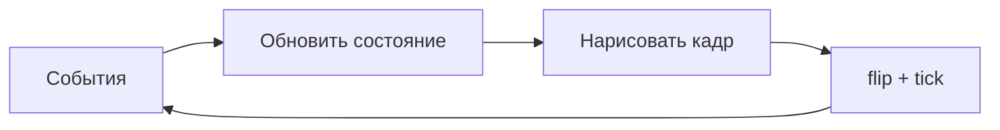

# Pygame — мини-игры на Python

<div class="article-tags">
  <span class="tag tag-notrequired">НЕ ОБЯЗАТЕЛЬНО</span>
  <span class="tag tag-beginner">ДЛЯ НОВИЧКОВ</span>
</div>

Приветствую! Здесь вы наверняка найдете, что ищете. Примеры в лаборатории рассчитаны на то, что мы разбираем что-то конкретное.

Текущая статья посвящена примерам: игр на Pygame для Python 3 — змейка, Pong, Breakout, Flappy, шарик. Готовый код с построчным разбором для школьников, студентов и самоучки..

Поэтому за теорией по текущей теме вам — в [энциклопедию](/encyclopedia/intro).
Если ещё не погружались, то маршрут прост:

1. [Основы](/section/basics)
2. [Система и сеть](/section/system-network)
3. [Данные и разметка](/section/data-markup)
4. [Код и разработка](/section/code-dev)
5. [Языки](/section/languages)
6. [Искусственный интеллект](/section/ai)
7. [Проект](/section/project)
8. [Инфраструктура и безопасность](/section/infra-security)
9. [Спин-офф](/section/spinoff)

Обязательно пройдитесь.

А теперь приступим к нашему предмету.

<div class="callout callout--tip">
  <div class="callout-title">Теория и соседние материалы</div>

  <div class="callout-body">
  Перед запуском примеров изучите главу [Разработка игр на Python](/encyclopedia/5-languages/5-02-python/312) — там игровой цикл, события, спрайты и столкновения.

  Пошаговые большие проекты (Tetris, Match-3, аркады) — в [Практикуме разработки игр](/encyclopedia/9-spinoff/9-04-razrabotka-igr/praktikum-razrabotki-igr/intro).

  Для рисования без игровой логики — [Turtle](/lab/Примеры/111) (Python) или [p5.js](/lab/Примеры/1114) (браузер); для 3D — [Panda3D](/lab/Примеры/1111).
</div>
</div>

---
## Основы мини-игр на Pygame

### Как запустить любой пример

```bash
pip install pygame
python bounce.py
```

Сохраните фрагмент кода в файл с латинским именем (`snake.py`, `pong.py`). Окно откроется на вашем компьютере — в браузере эти игры не запускаются. Закрытие: крестик окна, **Esc** (где указано) или остановка в IDE.

| Частый запрос в поиске | Раздел ниже |
|------------------------|-------------|
| pygame пример, первое окно | [Обязательный каркас](#karkas) |
| шарик отскакивает pygame | [Отскакивающий шар](#bounce) |
| змейка на python pygame | [Змейка](#snake) |
| pong на python | [Pong](#pong) |
| breakout pygame | [Breakout](#breakout) |
| flappy bird python | [Flappy](#flappy) |

Управление в большинстве игр: **стрелки** или **WASD**. В меню перезапуска часто **Пробел**.

### Чем Pygame отличается от Turtle

| | Turtle | Pygame |
|---|--------|--------|
| Задача | Рисовать фигуры по шагам | Игра: ввод, время, столкновения |
| Окно | Черепашка на холсте | Полноценное игровое окно |
| Цикл | `turtle.done()` ждёт | `while running` — десятки кадров в секунду |
| Координаты | Часто от центра | Левый верхний угол экрана — `(0, 0)` |

И Turtle, и Pygame учат алгоритмам; для **мини-игр** нужен именно игровой цикл из трёх шагов на каждом кадре.



1. **События** — клик, клавиша, закрытие окна (`pygame.event.get()`).
2. **Обновление** — новые координаты, счёт, проверка столкновений.
3. **Отрисовка** — заливка фона, фигуры, текст; `pygame.display.flip()` показывает кадр.
4. **`clock.tick(60)`** — пауза до следующего кадра (~60 FPS).

---

<span id="karkas"></span>

### Обязательный каркас

Любая мини-игра на Pygame повторяет один шаблон. Без `init`, цикла `while` и `flip()` окно либо не откроется, либо «зависнет» без перерисовки.

```python
#!/usr/bin/env python3

import pygame
import sys

pygame.init()  # запуск видео, звука, ввода
screen = pygame.display.set_mode((800, 600))  # окно 800×600, surface для рисования
pygame.display.set_caption("Мини-игра")
clock = pygame.time.Clock()  # таймер кадров
FPS = 60

running = True
while running:
    # 1) Ввод пользователя
    for event in pygame.event.get():
        if event.type == pygame.QUIT:  # крестик окна
            running = False
        if event.type == pygame.KEYDOWN and event.key == pygame.K_ESCAPE:
            running = False

    # 2) Логика: координаты, счёт, столкновения

    # 3) Рисование
    screen.fill((20, 24, 32))  # цвет фона RGB
    # pygame.draw.. / blit спрайтов

    pygame.display.flip()  # показать нарисованный кадр
    clock.tick(FPS)  # подождать до следующего кадра

pygame.quit()
sys.exit()
```

**Разбор по блокам:**

| Строка / блок | Зачем нужна |
|---------------|-------------|
| `pygame.init()` | Подготавливает SDL: без этого `set_mode` может упасть |
| `set_mode((w, h))` | Создаёт окно; `screen` — холст, на который рисуем |
| `while running` | Игровой цикл: повторяется, пока игра не закончена |
| `event.get()` | Очередь событий ОС: мышь, клавиатура, закрытие |
| `QUIT` | Единственный корректный способ выйти по крестику |
| `screen.fill(..)` | Стирает прошлый кадр (иначе останутся «шлейфы») |
| `display.flip()` | Двойная буферизация: показать нарисованное |
| `clock.tick(60)` | Ограничение скорости; без tick цикл жрёт 100% CPU |

<div class="callout callout--info">
  <div class="callout-title">Цвет в Pygame</div>

  <div class="callout-body">
  Кортеж `(R, G, B)` от 0 до 255: `(255, 0, 0)` — красный, `(0, 0, 0)` — чёрный.

  В примерах ниже фон тёмный, объекты яркие — так проще видеть столкновения на уроке.
</div>
</div>

Константы (`W`, `H`, `SPEED`, цвета) держите **вверху файла**. Несколько персонажей удобно оформлять через `pygame.sprite.Sprite` и `Group` — см. [шутер](#shooter).

---

<span id="start"></span>

### Стартовые мини-игры

Простые сцены без сложной физики: хватит одного файла и базового цикла.

---

<span id="bounce"></span>

#### Отскакивающий шар

Классический учебный пример: позиция `(x, y)` и скорость `(vx, vy)`. Удар о стенку — смена знака скорости по оси.

```python
#!/usr/bin/env python3

import pygame
import sys

pygame.init()
W, H = 640, 480
screen = pygame.display.set_mode((W, H))
pygame.display.set_caption("Bounce")
clock = pygame.time.Clock()

x, y = W // 2, H // 2      # центр шара
vx, vy = 4, 3              # пикселей за кадр по X и Y
radius = 24
color = (80, 180, 255)

running = True
while running:
    for event in pygame.event.get():
        if event.type == pygame.QUIT:
            running = False

    x += vx
    y += vy
    # отражение от левой/правой стены
    if x - radius <= 0 or x + radius >= W:
        vx = -vx
    # отражение от верха/низа
    if y - radius <= 0 or y + radius >= H:
        vy = -vy

    screen.fill((18, 22, 30))
    pygame.draw.circle(screen, color, (int(x), int(y)), radius)
    pygame.display.flip()
    clock.tick(60)

pygame.quit()
sys.exit()
```

**Разбор:**

- `vx`, `vy` — на сколько пикселей сдвигаем шар **каждый кадр**; это проще, чем физика с ускорением.
- Проверка `x - radius` учитывает **радиус**: центр не должен заходить за край.
- `vx = -vx` разворачивает движение по горизонтали (закон отражения в одну строку).
- `int(x)` — `draw.circle` ждёт целые координаты; без `int` на старых версиях бывают предупреждения.

**Что попробовать:** измените `vx, vy` на `8, 6` — шар станет быстрее; `radius = 40` — крупнее и чаще бьётся о края.

---

<span id="trail"></span>

#### След за курсором

Список последних позиций мыши — простейшая **структура данных в игре**: очередь из точек, старые удаляем.

```python
#!/usr/bin/env python3

import pygame
import sys

pygame.init()
screen = pygame.display.set_mode((800, 600))
pygame.display.set_caption("Trail")
clock = pygame.time.Clock()

trail = []       # история координат [(x, y), ..]
MAX_LEN = 40     # сколько точек хранить

running = True
while running:
    for event in pygame.event.get():
        if event.type == pygame.QUIT:
            running = False

    mx, my = pygame.mouse.get_pos()  # текущие координаты курсора
    trail.append((mx, my))
    if len(trail) > MAX_LEN:
        trail.pop(0)  # убрать самую старую точку

    screen.fill((12, 16, 24))
    for i, (tx, ty) in enumerate(trail):
        size = 6 + i // 3           # хвост толще к «голове»
        shade = 80 + i * 4          # градиент яркости
        pygame.draw.circle(screen, (shade, 140, 220), (tx, ty), size)
    pygame.display.flip()
    clock.tick(60)

pygame.quit()
sys.exit()
```

**Разбор:**

- `get_pos()` читает мышь **без** событий — каждый кадр, плавный след.
- `pop(0)` — FIFO: фиксированная длина хвоста, память не растёт.
- `enumerate(trail)` даёт индекс `i`: по нему рисуем «свежие» точки ярче и крупнее.

---

<span id="clicker"></span>

#### Кликер — очки за попадание

Здесь появляются **`pygame.Rect`** (прямоугольник-мишень) и **`collidepoint`** — попадание по клику. Текст рисуем через `font.render` и `blit`.

```python
#!/usr/bin/env python3

import pygame
import random
import sys

pygame.init()
W, H = 720, 520
screen = pygame.display.set_mode((W, H))
pygame.display.set_caption("Click targets")
clock = pygame.time.Clock()
font = pygame.font.SysFont(None, 32)  # системный шрифт, размер 32

def new_target():
    r = random.randint(18, 32)
    x = random.randint(r, W - r)
    y = random.randint(r, H - r)
    return pygame.Rect(x - r, y - r, r * 2, r * 2)  # круг как bounding box

target = new_target()
score = 0
misses = 0

running = True
while running:
    for event in pygame.event.get():
        if event.type == pygame.QUIT:
            running = False
        if event.type == pygame.MOUSEBUTTONDOWN and event.button == 1:
            if target.collidepoint(event.pos):  # клик внутри Rect?
                score += 1
                target = new_target()
            else:
                misses += 1

    screen.fill((24, 28, 36))
    pygame.draw.ellipse(screen, (240, 90, 90), target)
    label = font.render(f"Счёт: {score}  Мимо: {misses}", True, (230, 230, 240))
    screen.blit(label, (16, 16))  # текст в левый верхний угол
    pygame.display.flip()
    clock.tick(60)

pygame.quit()
sys.exit()
```

**Разбор:**

| Элемент | Смысл |
|---------|--------|
| `Rect(x, y, w, h)` | Прямоугольник: позиция левого верхнего угла и размер |
| `collidepoint(event.pos)` | True, если координаты клика внутри прямоугольника |
| `MOUSEBUTTONDOWN` | Событие один раз на нажатие (не «зажатая» кнопка) |
| `font.render(.., True, color)` | Картинка-буквы; `True` — сглаживание |
| `blit` | Вставить картинку текста на `screen` |

`random.randint(r, W - r)` не даёт мишени вылезти за край экрана.

---

<span id="reaction"></span>

#### Реакция — нажми, когда зелёный

Учебная **машина состояний**: `WAIT` → `READY` (ждём) → `GO` (жми) → `DONE`. Время в миллисекундах — `pygame.time.get_ticks()`.

```python
#!/usr/bin/env python3

import pygame
import random
import sys

pygame.init()
W, H = 600, 400
screen = pygame.display.set_mode((W, H))
pygame.display.set_caption("Reaction")
clock = pygame.time.Clock()
font = pygame.font.SysFont(None, 36)

WAIT = "wait"
READY = "ready"
GO = "go"
DONE = "done"

state = WAIT
message = "Пробел — новая попытка"
start_ms = 0
react_ms = None
best_ms = None

running = True
while running:
    now = pygame.time.get_ticks()

    for event in pygame.event.get():
        if event.type == pygame.QUIT:
            running = False
        if event.type == pygame.KEYDOWN:
            if event.key == pygame.K_SPACE and state in (WAIT, DONE):
                state = READY
                start_ms = now + random.randint(1200, 3500)
                react_ms = None
                message = "Ждите зелёный.."
            elif event.key == pygame.K_SPACE and state == GO:
                react_ms = now - start_ms
                state = DONE
                if best_ms is None or react_ms < best_ms:
                    best_ms = react_ms
                message = f"Ваша реакция: {react_ms} мс"
            elif state == READY:
                state = DONE
                message = "Рано! Пробел — снова"

    if state == READY and now >= start_ms:
        state = GO
        start_ms = now
        message = "Жми!"

    if state == WAIT:
        color = (60, 70, 90)
    elif state == READY:
        color = (200, 60, 60)
    elif state == GO:
        color = (60, 200, 100)
    else:
        color = (70, 90, 120)

    screen.fill(color)
    text = font.render(message, True, (255, 255, 255))
    screen.blit(text, text.get_rect(center=(W // 2, H // 2)))
    if best_ms is not None:
        hint = font.render(f"Лучший: {best_ms} мс", True, (240, 240, 250))
        screen.blit(hint, (20, H - 50))
    pygame.display.flip()
    clock.tick(60)

pygame.quit()
sys.exit()
```

**Разбор состояний:**

| Состояние | Экран | Что ждём от игрока |
|-----------|-------|---------------------|
| `WAIT` | Серый | Пробел — начать раунд |
| `READY` | Красный | Случайная пауза 1.2–3.5 с, ранний пробел = ошибка |
| `GO` | Зелёный | Пробел — засечь `react_ms = now - start_ms` |
| `DONE` | Синий | Показ времени, пробел — снова `WAIT` |

`start_ms = now + random.randint(..)` планирует момент смены цвета **в будущем**, без `time.sleep` — цикл игры не блокируется.

---

## Примеры мини-игр

Ниже — полноценные мини-игры: **скопируйте файл целиком**, запустите, затем читайте разбор под тем же заголовком. Якоря (`#snake`, `#pong` …) удобны для ссылок из тетради или чата.

### 1. Классические аркады

<span id="pong"></span>

#### 1.1. Pong (две ракетки)

Две ракетки и мяч. Скорость мяча хранится в `vx`, `vy`; ракетки двигаем через `get_pressed()` — удержание клавиши даёт плавное движение.

```python
#!/usr/bin/env python3

import pygame
import sys

pygame.init()
W, H = 800, 500
screen = pygame.display.set_mode((W, H))
pygame.display.set_caption("Pong")
clock = pygame.time.Clock()
font = pygame.font.SysFont(None, 40)

PADDLE_W, PADDLE_H = 14, 90
BALL = 14
SPEED = 6

left = pygame.Rect(24, H // 2 - PADDLE_H // 2, PADDLE_W, PADDLE_H)
right = pygame.Rect(W - 24 - PADDLE_W, H // 2 - PADDLE_H // 2, PADDLE_W, PADDLE_H)
ball = pygame.Rect(W // 2 - BALL, H // 2 - BALL, BALL * 2, BALL * 2)
vx, vy = SPEED, SPEED * 0.7
score_l, score_r = 0, 0

def reset_ball(to_left: bool):
    global vx, vy
    ball.center = (W // 2, H // 2)
    vx = SPEED if to_left else -SPEED
    vy = SPEED * 0.5

running = True
while running:
    for event in pygame.event.get():
        if event.type == pygame.QUIT:
            running = False

    keys = pygame.key.get_pressed()
    if keys[pygame.K_w] and left.top > 0:
        left.y -= 7
    if keys[pygame.K_s] and left.bottom < H:
        left.y += 7
    if keys[pygame.K_UP] and right.top > 0:
        right.y -= 7
    if keys[pygame.K_DOWN] and right.bottom < H:
        right.y += 7

    ball.x += int(vx)
    ball.y += int(vy)
    if ball.top <= 0 or ball.bottom >= H:
        vy = -vy
    if ball.colliderect(left) and vx < 0:
        vx = -vx
    if ball.colliderect(right) and vx > 0:
        vx = -vx
    if ball.left <= 0:
        score_r += 1
        reset_ball(True)
    if ball.right >= W:
        score_l += 1
        reset_ball(False)

    screen.fill((14, 18, 26))
    pygame.draw.aaline(screen, (50, 60, 80), (W // 2, 0), (W // 2, H))
    pygame.draw.rect(screen, (200, 220, 255), left)
    pygame.draw.rect(screen, (255, 200, 120), right)
    pygame.draw.ellipse(screen, (240, 240, 250), ball)
    hud = font.render(f"{score_l} : {score_r}", True, (220, 220, 230))
    screen.blit(hud, hud.get_rect(center=(W // 2, 36)))
    pygame.display.flip()
    clock.tick(60)

pygame.quit()
sys.exit()
```

**Разбор:**

| Идея | Код |
|------|-----|
| Хитбокс ракетки и мяча | `pygame.Rect` — удобно для `colliderect` |
| Плавное движение | `keys = get_pressed()` вне `KEYDOWN` — пока держим W, ракетка едет каждый кадр |
| Отскок от ракетки | `vx = -vx` только если мяч летит **к** ракетке (`vx < 0` к левой) — иначе мяч «прилипает» |
| Гол | `ball.left <= 0` — очко правому, сброс в центр `reset_ball` |
| `global vx, vy` | В функции `reset_ball` меняем скорости мяча из внешней области |

Управление: **W/S** — левая ракетка, **↑/↓** — правая.

**Доработка:** увеличьте `SPEED` до 9 — сложнее; добавьте `clock.tick` в заголовок окна через `set_caption(f"FPS: &#123;clock.get_fps():.0f&#125;")` раз в секунду.

---

<span id="snake"></span>

#### 1.2. Змейка

Самый частый запрос «**змейка на python pygame**». Змейка — список клеток `(col, row)`; голова в начале списка. Движение **не каждый кадр**, а раз в `tick_ms` миллисекунд — классическая «пошаговая» скорость.

```python
#!/usr/bin/env python3

import pygame
import random
import sys

pygame.init()
CELL = 24                    # размер одной клетки в пикселях
COLS, ROWS = 24, 18          # поле в клетках
W, H = COLS * CELL, ROWS * CELL
screen = pygame.display.set_mode((W, H))
pygame.display.set_caption("Snake")
clock = pygame.time.Clock()
font = pygame.font.SysFont(None, 28)

snake = [(COLS // 2, ROWS // 2)]  # голова — элемент [0]
direction = (1, 0)               # (dx, dy): вправо
food = (random.randint(0, COLS - 1), random.randint(0, ROWS - 1))
score = 0
tick_ms = 120                    # интервал хода, мс
last_move = 0
game_over = False

def place_food():
    while True:
        pos = (random.randint(0, COLS - 1), random.randint(0, ROWS - 1))
        if pos not in snake:
            return pos

running = True
while running:
    now = pygame.time.get_ticks()
    for event in pygame.event.get():
        if event.type == pygame.QUIT:
            running = False
        if event.type == pygame.KEYDOWN:
            if event.key == pygame.K_ESCAPE:
                running = False
            if game_over and event.key == pygame.K_SPACE:
                snake = [(COLS // 2, ROWS // 2)]
                direction = (1, 0)
                food = place_food()
                score = 0
                game_over = False
                last_move = now
            if not game_over:
                # запрет разворота на 180°: нельзя (1,0) → (-1,0) в один ход
                if event.key in (pygame.K_LEFT, pygame.K_a) and direction != (1, 0):
                    direction = (-1, 0)
                elif event.key in (pygame.K_RIGHT, pygame.K_d) and direction != (-1, 0):
                    direction = (1, 0)
                elif event.key in (pygame.K_UP, pygame.K_w) and direction != (0, 1):
                    direction = (0, -1)
                elif event.key in (pygame.K_DOWN, pygame.K_s) and direction != (0, -1):
                    direction = (0, 1)

    if not game_over and now - last_move >= tick_ms:
        last_move = now
        head_x, head_y = snake[0]
        dx, dy = direction
        new_head = (head_x + dx, head_y + dy)
        if not (0 <= new_head[0] < COLS and 0 <= new_head[1] < ROWS):
            game_over = True
        elif new_head in snake:
            game_over = True
        else:
            snake.insert(0, new_head)   # новая голова
            if new_head == food:
                score += 1
                food = place_food()
                tick_ms = max(60, tick_ms - 4)  # ускорение
            else:
                snake.pop()             # убрать хвост — длина та же

    screen.fill((16, 20, 28))
    for i, (cx, cy) in enumerate(snake):
        color = (90, 220, 140) if i == 0 else (50, 160, 100)
        pygame.draw.rect(screen, color, (cx * CELL, cy * CELL, CELL - 2, CELL - 2), border_radius=4)
    fx, fy = food
    pygame.draw.rect(screen, (240, 90, 90), (fx * CELL, fy * CELL, CELL - 2, CELL - 2), border_radius=6)
    hud = font.render(f"Счёт: {score}", True, (230, 230, 240))
    screen.blit(hud, (8, 8))
    if game_over:
        msg = font.render("Game Over — пробел", True, (255, 120, 120))
        screen.blit(msg, msg.get_rect(center=(W // 2, H // 2)))
    pygame.display.flip()
    clock.tick(60)

pygame.quit()
sys.exit()
```

**Разбор змейки:**

```text
snake = [(5,3), (4,3), (3,3)]   # голова слева — (5,3)
insert(0, new_head)             # рост: хвост не удаляем
pop()                           # обычный ход: хвост исчезает
```

| Проверка | Зачем |
|----------|--------|
| `direction != (1, 0)` при повороте влево | Иначе змейка врежется в себя за один кадр |
| `now - last_move >= tick_ms` | Ход по таймеру, а не 60 раз в секунду |
| `new_head in snake` | Столкновение с собственным телом |
| `tick_ms - 4` после еды | Игра ускоряется — ощущение прогресса |

Рисование: `cx * CELL` переводит **номер клетки** в пиксели. `(0,0)` — левый верхний угол поля.

---

<span id="flappy"></span>

#### 1.3. Flappy — прыжок между препятствиями

Гравитация и импульс прыжка; трубы движутся влево — типичная механика для урока «физика в 2D без формул».

```python
#!/usr/bin/env python3

import pygame
import random
import sys

pygame.init()
W, H = 480, 640
screen = pygame.display.set_mode((W, H))
pygame.display.set_caption("Flappy")
clock = pygame.time.Clock()
font = pygame.font.SysFont(None, 32)

GRAVITY = 0.45
JUMP = -8.5
GAP = 170
PIPE_W = 70
SPEED = 4

bird_y = H // 2
bird_vy = 0
pipes = []
score = 0
spawn_timer = 0
game_over = False

def spawn_pipe():
    gap_y = random.randint(120, H - GAP - 120)
    return {"x": W + 20, "gap_y": gap_y, "scored": False}

running = True
while running:
    for event in pygame.event.get():
        if event.type == pygame.QUIT:
            running = False
        if event.type == pygame.KEYDOWN:
            if event.key == pygame.K_SPACE:
                if game_over:
                    bird_y = H // 2
                    bird_vy = 0
                    pipes.clear()
                    score = 0
                    spawn_timer = 0
                    game_over = False
                else:
                    bird_vy = JUMP

    if not game_over:
        bird_vy += GRAVITY
        bird_y += bird_vy
        spawn_timer += 1
        if spawn_timer > 55:
            spawn_timer = 0
            pipes.append(spawn_pipe())

        bird_rect = pygame.Rect(80, int(bird_y) - 14, 28, 28)
        for pipe in pipes[:]:
            pipe["x"] -= SPEED
            top = pygame.Rect(pipe["x"], 0, PIPE_W, pipe["gap_y"])
            bottom = pygame.Rect(pipe["x"], pipe["gap_y"] + GAP, PIPE_W, H)
            if pipe["x"] + PIPE_W < 0:
                pipes.remove(pipe)
                continue
            if not pipe["scored"] and pipe["x"] + PIPE_W < 80:
                pipe["scored"] = True
                score += 1
            if bird_rect.colliderect(top) or bird_rect.colliderect(bottom):
                game_over = True
        if bird_y < 0 or bird_y > H:
            game_over = True

    screen.fill((120, 200, 240))
    for pipe in pipes:
        pygame.draw.rect(screen, (40, 160, 70), (pipe["x"], 0, PIPE_W, pipe["gap_y"]))
        pygame.draw.rect(screen, (40, 160, 70), (pipe["x"], pipe["gap_y"] + GAP, PIPE_W, H - pipe["gap_y"] - GAP))
    pygame.draw.circle(screen, (255, 220, 60), (94, int(bird_y)), 16)
    screen.blit(font.render(f"{score}", True, (255, 255, 255)), (W // 2 - 10, 40))
    if game_over:
        screen.blit(font.render("Пробел — заново", True, (30, 30, 40)), (W // 2 - 110, H // 2))
    pygame.display.flip()
    clock.tick(60)

pygame.quit()
sys.exit()
```

**Суть примера:** `bird_vy += GRAVITY` — вертикальная скорость на каждом кадре; **Пробел** даёт импульс `JUMP`. Трубы — словари `&#123;"x", "gap_y"&#125;`; столкновение через `colliderect` двух прямоугольников (верхняя и нижняя часть трубы). Счёт +1, когда труба ушла левее птицы (`pipe["scored"]`).

---

<span id="breakout"></span>

#### 1.4. Breakout — кирпичи и платформа

Мяч, платформа и сетка кирпичей — учит `colliderect`, отражению скорости и флагу «кирпич ещё жив».

```python
#!/usr/bin/env python3

import pygame
import sys

pygame.init()
W, H = 720, 520
screen = pygame.display.set_mode((W, H))
pygame.display.set_caption("Breakout")
clock = pygame.time.Clock()
font = pygame.font.SysFont(None, 28)

paddle = pygame.Rect(W // 2 - 60, H - 36, 120, 14)
ball = pygame.Rect(W // 2, H - 60, 16, 16)
vx, vy = 5, -5

BRICK_ROWS, BRICK_COLS = 5, 10
brick_w = W // BRICK_COLS - 4
brick_h = 22
bricks = []
colors = [(220, 80, 80), (220, 160, 60), (220, 220, 80), (80, 200, 120), (80, 160, 220)]
for row in range(BRICK_ROWS):
    for col in range(BRICK_COLS):
        rect = pygame.Rect(2 + col * (brick_w + 4), 40 + row * (brick_h + 4), brick_w, brick_h)
        bricks.append({"rect": rect, "color": colors[row], "alive": True})

lives = 3
won = False
lost = False

running = True
while running:
    for event in pygame.event.get():
        if event.type == pygame.QUIT:
            running = False
        if event.type == pygame.KEYDOWN and (won or lost) and event.key == pygame.K_SPACE:
            bricks = []
            for row in range(BRICK_ROWS):
                for col in range(BRICK_COLS):
                    rect = pygame.Rect(2 + col * (brick_w + 4), 40 + row * (brick_h + 4), brick_w, brick_h)
                    bricks.append({"rect": rect, "color": colors[row], "alive": True})
            ball.center = (W // 2, H - 60)
            vx, vy = 5, -5
            lives = 3
            won = lost = False

    if not won and not lost:
        mx, _ = pygame.mouse.get_pos()
        paddle.centerx = max(paddle.w // 2, min(W - paddle.w // 2, mx))
        ball.x += vx
        ball.y += vy
        if ball.left <= 0 or ball.right >= W:
            vx = -vx
        if ball.top <= 0:
            vy = -vy
        if ball.colliderect(paddle) and vy > 0:
            vy = -abs(vy)
            offset = (ball.centerx - paddle.centerx) / (paddle.w / 2)
            vx = int(6 * offset)
        if ball.bottom >= H:
            lives -= 1
            ball.center = (W // 2, H - 60)
            vx, vy = 5, -5
            if lives <= 0:
                lost = True
        for brick in bricks:
            if brick["alive"] and ball.colliderect(brick["rect"]):
                brick["alive"] = False
                vy = -vy
                break
        if all(not b["alive"] for b in bricks):
            won = True

    screen.fill((18, 22, 32))
    for brick in bricks:
        if brick["alive"]:
            pygame.draw.rect(screen, brick["color"], brick["rect"], border_radius=4)
    pygame.draw.rect(screen, (200, 210, 240), paddle, border_radius=6)
    pygame.draw.ellipse(screen, (255, 240, 120), ball)
    screen.blit(font.render(f"Жизни: {lives}", True, (230, 230, 240)), (12, 8))
    if won:
        screen.blit(font.render("Победа! Пробел", True, (120, 255, 160)), (W // 2 - 90, H // 2))
    if lost:
        screen.blit(font.render("Поражение. Пробел", True, (255, 120, 120)), (W // 2 - 110, H // 2))
    pygame.display.flip()
    clock.tick(60)

pygame.quit()
sys.exit()
```

**Разбор Breakout:**

| Блок | Смысл |
|------|--------|
| `bricks` — список словарей | У каждого кирпича `alive`: можно выключать без удаления из списка |
| `paddle.centerx = mx` | Платформа следует за мышью по X |
| Отскок от платформы | `vy = -abs(vy)` — мяч всегда улетает вверх; `offset` меняет `vx` — угол отражения |
| Потеря жизни | `ball.bottom >= H` — мяч упал вниз, не поймали |

Платформа следует за **мышью**.

---

### 2. Ловля и уклонение

<span id="catch"></span>

#### 2.1. Лови падающие звёзды

```python
#!/usr/bin/env python3

import pygame
import random
import sys

pygame.init()
W, H = 640, 480
screen = pygame.display.set_mode((W, H))
pygame.display.set_caption("Catch")
clock = pygame.time.Clock()
font = pygame.font.SysFont(None, 30)

player = pygame.Rect(W // 2 - 40, H - 50, 80, 16)
items = []
score = 0
missed = 0
spawn = 0

running = True
while running:
    for event in pygame.event.get():
        if event.type == pygame.QUIT:
            running = False

    keys = pygame.key.get_pressed()
    if keys[pygame.K_LEFT] or keys[pygame.K_a]:
        player.x -= 7
    if keys[pygame.K_RIGHT] or keys[pygame.K_d]:
        player.x += 7
    player.x = max(0, min(W - player.w, player.x))

    spawn += 1
    if spawn > 25:
        spawn = 0
        items.append(pygame.Rect(random.randint(10, W - 20), -20, 16, 16))

    for item in items[:]:
        item.y += 5
        if item.colliderect(player):
            items.remove(item)
            score += 1
        elif item.top > H:
            items.remove(item)
            missed += 1

    screen.fill((20, 26, 40))
    pygame.draw.rect(screen, (100, 200, 255), player, border_radius=4)
    for item in items:
        pygame.draw.circle(screen, (255, 220, 80), item.center, 8)
    screen.blit(font.render(f"Поймано: {score}  Упущено: {missed}", True, (240, 240, 250)), (12, 12))
    if missed >= 10:
        over = font.render("10 промахов — Esc", True, (255, 100, 100))
        screen.blit(over, over.get_rect(center=(W // 2, H // 2)))
    pygame.display.flip()
    clock.tick(60)

pygame.quit()
sys.exit()
```

**Суть:** корзина `player` — `Rect` внизу; объекты `items` падают (`item.y += 5`). `colliderect` — поймали; `item.top > H` — промах. Счётчики `score` / `missed` — типичная домашняя работа «поймай N предметов».

---

<span id="dodge"></span>

#### 2.2. Уклоняйся от машин

```python
#!/usr/bin/env python3

import pygame
import random
import sys

pygame.init()
W, H = 480, 640
screen = pygame.display.set_mode((W, H))
pygame.display.set_caption("Dodge")
clock = pygame.time.Clock()
font = pygame.font.SysFont(None, 32)

player = pygame.Rect(W // 2 - 18, H - 80, 36, 56)
obstacles = []
score = 0
timer = 0
game_over = False

running = True
while running:
    for event in pygame.event.get():
        if event.type == pygame.QUIT:
            running = False
        if event.type == pygame.KEYDOWN and game_over and event.key == pygame.K_SPACE:
            obstacles.clear()
            score = 0
            timer = 0
            game_over = False

    if not game_over:
        keys = pygame.key.get_pressed()
        if keys[pygame.K_LEFT] or keys[pygame.K_a]:
            player.x -= 6
        if keys[pygame.K_RIGHT] or keys[pygame.K_d]:
            player.x += 6
        player.x = max(0, min(W - player.w, player.x))

        timer += 1
        if timer % 35 == 0:
            lane = random.choice([60, W // 2 - 20, W - 100])
            obstacles.append(pygame.Rect(lane, -70, 40, 70))

        for obs in obstacles[:]:
            obs.y += 7
            if obs.top > H:
                obstacles.remove(obs)
                score += 1
            elif obs.colliderect(player):
                game_over = True

    screen.fill((40, 44, 52))
    for lane_x in (W // 3, 2 * W // 3):
        pygame.draw.line(screen, (200, 200, 80), (lane_x, 0), (lane_x, H), 2)
    pygame.draw.rect(screen, (80, 180, 255), player, border_radius=6)
    for obs in obstacles:
        pygame.draw.rect(screen, (220, 70, 70), obs, border_radius=4)
    screen.blit(font.render(f"Очки: {score}", True, (240, 240, 250)), (12, 12))
    if game_over:
        screen.blit(font.render("Столкновение — пробел", True, (255, 120, 120)), (80, H // 2))
    pygame.display.flip()
    clock.tick(60)

pygame.quit()
sys.exit()
```

**Суть:** три «полосы» дороги (`lane`), машины спавнятся в случайной полосе. Очки растут, если **пропустили** машину вниз (`obs.top > H`) — мотивация рисковать, а не стоять.

---

### 3. Стрельба и действие

<span id="shooter"></span>

#### 3.1. Вид сверху — стрельба по врагам

```python
#!/usr/bin/env python3

import pygame
import math
import random
import sys

pygame.init()
W, H = 800, 600
screen = pygame.display.set_mode((W, H))
pygame.display.set_caption("Top-down shooter")
clock = pygame.time.Clock()
font = pygame.font.SysFont(None, 28)

class Player(pygame.sprite.Sprite):
    def __init__(self):
        super__init__()
        self.image = pygame.Surface((32, 32), pygame.SRCALPHA)
        pygame.draw.polygon(self.image, (100, 200, 255), [(16, 0), (32, 28), (0, 28)])
        self.rect = self.image.get_rect(center=(W // 2, H // 2))
        self.speed = 5

    def update(self, keys):
        if keys[pygame.K_a] or keys[pygame.K_LEFT]:
            self.rect.x -= self.speed
        if keys[pygame.K_d] or keys[pygame.K_RIGHT]:
            self.rect.x += self.speed
        if keys[pygame.K_w] or keys[pygame.K_UP]:
            self.rect.y -= self.speed
        if keys[pygame.K_s] or keys[pygame.K_DOWN]:
            self.rect.y += self.speed
        self.rect.clamp_ip(screen.get_rect())

class Bullet(pygame.sprite.Sprite):
    def __init__(self, x, y, dx, dy):
        super__init__()
        self.image = pygame.Surface((8, 8))
        self.image.fill((255, 240, 80))
        self.rect = self.image.get_rect(center=(x, y))
        self.vx, self.vy = dx * 10, dy * 10

    def update(self):
        self.rect.x += self.vx
        self.rect.y += self.vy
        if not screen.get_rectcolliderect(self.rect):
            self.kill()

class Enemy(pygame.sprite.Sprite):
    def __init__(self):
        super__init__()
        self.image = pygame.Surface((28, 28))
        self.image.fill((220, 80, 80))
        self.rect = self.image.get_rect(
            center=(random.randint(40, W - 40), random.randint(40, H - 40))
        )

    def update(self, target):
        tx, ty = target.rect.center
        ex, ey = self.rect.center
        dx, dy = tx - ex, ty - ey
        length = math.hypot(dx, dy) or 1
        self.rect.x += int(2 * dx / length)
        self.rect.y += int(2 * dy / length)

player = Player()
all_sprites = pygame.sprite.Group(player)
bullets = pygame.sprite.Group()
enemies = pygame.sprite.Group()
score = 0
spawn_cd = 0

running = True
while running:
    for event in pygame.event.get():
        if event.type == pygame.QUIT:
            running = False
        if event.type == pygame.MOUSEBUTTONDOWN and event.button == 1:
            mx, my = event.pos
            px, py = player.rect.center
            dx, dy = mx - px, my - py
            length = math.hypot(dx, dy) or 1
            bullet = Bullet(px, py, dx / length, dy / length)
            bullets.add(bullet)
            all_sprites.add(bullet)

    keys = pygame.key.get_pressed()
    player.update(keys)
    bullets.update()
    for enemy in enemies:
        enemy.update(player)

    spawn_cd += 1
    if spawn_cd > 90 and len(enemies) < 8:
        spawn_cd = 0
        e = Enemy()
        enemies.add(e)
        all_sprites.add(e)

    for bullet in bullets:
        hit = pygame.sprite.spritecollide(bullet, enemies, True)
        if hit:
            bullet.kill()
            score += len(hit)

    if pygame.sprite.spritecollide(player, enemies, False):
        running = False

    screen.fill((16, 20, 28))
    all_sprites.draw(screen)
    screen.blit(font.render(f"Счёт: {score}", True, (230, 230, 240)), (12, 12))
    pygame.display.flip()
    clock.tick(60)

pygame.quit()
sys.exit()
```

**Разбор ООП в Pygame:**

| Класс | Роль |
|-------|------|
| `Player` | Наследует `Sprite`; в `update` читает клавиши |
| `Bullet` | Сам двигается; `kill()` удаляет из всех групп |
| `Enemy` | Преследует игрока: нормализованный вектор `(dx, dy) / length` |
| `Group` | `all_sprites.draw(screen)` рисует всех за один вызов |
| `spritecollide` | Пуля + враг: `True` во 2-м аргументе — враг уничтожен |

Стрельба — **клик**: угол от игрока к `event.pos`. Движение — **WASD**.

---

<span id="invaders"></span>

#### 3.2. Космические захватчики (упрощённо)

```python
#!/usr/bin/env python3

import pygame
import random
import sys

pygame.init()
W, H = 640, 560
screen = pygame.display.set_mode((W, H))
pygame.display.set_caption("Invaders lite")
clock = pygame.time.Clock()
font = pygame.font.SysFont(None, 28)

player = pygame.Rect(W // 2 - 24, H - 48, 48, 20)
bullets = []
enemies = []
for row in range(4):
    for col in range(8):
        enemies.append(pygame.Rect(60 + col * 64, 50 + row * 40, 40, 28))

enemy_dir = 1
move_down = False
score = 0
cooldown = 0

running = True
while running:
    for event in pygame.event.get():
        if event.type == pygame.QUIT:
            running = False
        if event.type == pygame.KEYDOWN and event.key == pygame.K_SPACE and cooldown == 0:
            bullets.append(pygame.Rect(player.centerx - 2, player.top - 12, 4, 12))
            cooldown = 20

    keys = pygame.key.get_pressed()
    if keys[pygame.K_LEFT] or keys[pygame.K_a]:
        player.x -= 6
    if keys[pygame.K_RIGHT] or keys[pygame.K_d]:
        player.x += 6
    player.x = max(0, min(W - player.w, player.x))

    if cooldown > 0:
        cooldown -= 1

    if enemies:
        edge_hit = any(e.left <= 4 or e.right >= W - 4 for e in enemies)
        if edge_hit:
            enemy_dir *= -1
            move_down = True
        for e in enemies:
            e.x += 3 * enemy_dir
            if move_down:
                e.y += 16
        move_down = False

    for b in bullets[:]:
        b.y -= 10
        if b.bottom < 0:
            bullets.remove(b)
            continue
        for e in enemies[:]:
            if b.colliderect(e):
                bullets.remove(b)
                enemies.remove(e)
                score += 10
                break

    if not enemies:
        for row in range(4):
            for col in range(8):
                enemies.append(pygame.Rect(60 + col * 64, 50 + row * 40, 40, 28))

    screen.fill((8, 10, 24))
    for e in enemies:
        pygame.draw.rect(screen, (180, 90, 220), e, border_radius=4)
    pygame.draw.rect(screen, (120, 220, 255), player, border_radius=4)
    for b in bullets:
        pygame.draw.rect(screen, (255, 240, 100), b)
    screen.blit(font.render(f"Счёт: {score}", True, (230, 230, 240)), (12, 12))
    pygame.display.flip()
    clock.tick(60)

pygame.quit()
sys.exit()
```

**Суть:** стая врагов движется синхронно; при касании края — `enemy_dir *= -1` и сдвиг вниз (`move_down`) — как в оригинальных Invaders. Пули — отдельный список `bullets`, не спрайты: проще для курса после списков в Python.

---

### 4. Головоломки и таймеры

<span id="odd"></span>

#### 4.1. Найди отличающийся квадрат

```python
#!/usr/bin/env python3

import pygame
import random
import sys

pygame.init()
GRID = 5
CELL = 80
MARGIN = 40
W = H = MARGIN * 2 + GRID * CELL
screen = pygame.display.set_mode((W, H))
pygame.display.set_caption("Odd one out")
clock = pygame.time.Clock()
font = pygame.font.SysFont(None, 28)

base_color = (70, 130, 200)
odd_color = (200, 90, 90)
odd_cell = (random.randint(0, GRID - 1), random.randint(0, GRID - 1))
round_num = 1
message = "Кликни по другому цвету"

def next_round():
    global odd_cell, base_color, odd_color, round_num, message
    round_num += 1
    odd_cell = (random.randint(0, GRID - 1), random.randint(0, GRID - 1))
    base_color = (random.randint(40, 180), random.randint(40, 180), random.randint(80, 220))
    odd_color = tuple(max(0, min(255, c + random.randint(-70, 70))) for c in base_color)
    message = f"Раунд {round_num}"

running = True
while running:
    for event in pygame.event.get():
        if event.type == pygame.QUIT:
            running = False
        if event.type == pygame.MOUSEBUTTONDOWN and event.button == 1:
            mx, my = event.pos
            col = (mx - MARGIN) // CELL
            row = (my - MARGIN) // CELL
            if 0 <= col < GRID and 0 <= row < GRID:
                if (col, row) == odd_cell:
                    next_round()
                else:
                    message = "Не тот — попробуйте снова"

    screen.fill((24, 28, 36))
    for row in range(GRID):
        for col in range(GRID):
            color = odd_color if (col, row) == odd_cell else base_color
            rect = pygame.Rect(MARGIN + col * CELL + 4, MARGIN + row * CELL + 4, CELL - 8, CELL - 8)
            pygame.draw.rect(screen, color, rect, border_radius=8)
    screen.blit(font.render(message, True, (240, 240, 250)), (MARGIN, 8))
    pygame.display.flip()
    clock.tick(60)

pygame.quit()
sys.exit()
```

**Суть:** сетка 5×5; клик переводит `(mx, my)` в `(col, row)` через деление на `CELL`. Один квадрат другого оттенка — тренировка координат и `MOUSEBUTTONDOWN`.

---

<span id="survive"></span>

#### 4.2. Таймер на выживание 30 секунд

```python
#!/usr/bin/env python3

import pygame
import random
import sys

pygame.init()
W, H = 600, 400
screen = pygame.display.set_mode((W, H))
pygame.display.set_caption("Survive 30s")
clock = pygame.time.Clock()
font = pygame.font.SysFont(None, 32)

player = pygame.Rect(W // 2 - 16, H // 2 - 16, 32, 32)
hazards = []
start = pygame.time.get_ticks()
won = False
lost = False

running = True
while running:
    elapsed = (pygame.time.get_ticks() - start) / 1000
    for event in pygame.event.get():
        if event.type == pygame.QUIT:
            running = False
        if event.type == pygame.KEYDOWN and (won or lost) and event.key == pygame.K_SPACE:
            start = pygame.time.get_ticks()
            hazards.clear()
            won = lost = False

    if not won and not lost:
        keys = pygame.key.get_pressed()
        if keys[pygame.K_LEFT] or keys[pygame.K_a]:
            player.x -= 5
        if keys[pygame.K_RIGHT] or keys[pygame.K_d]:
            player.x += 5
        if keys[pygame.K_UP] or keys[pygame.K_w]:
            player.y -= 5
        if keys[pygame.K_DOWN] or keys[pygame.K_s]:
            player.y += 5
        player.clamp_ip(screen.get_rect())

        if random.random() < 0.04:
            hazards.append(pygame.Rect(random.randint(0, W - 24), 0, 24, 24))

        for h in hazards[:]:
            h.y += 6
            if h.top > H:
                hazards.remove(h)
            elif h.colliderect(player):
                lost = True
        if elapsed >= 30:
            won = True

    screen.fill((18, 22, 30))
    for h in hazards:
        pygame.draw.rect(screen, (220, 80, 80), h, border_radius=4)
    pygame.draw.rect(screen, (100, 200, 255), player, border_radius=6)
    left = max(0, 30 - elapsed)
    screen.blit(font.render(f"Осталось: {left:.1f} с", True, (230, 230, 240)), (16, 16))
    if won:
        screen.blit(font.render("Выжили! Пробел", True, (120, 255, 160)), (180, H // 2))
    if lost:
        screen.blit(font.render("Попали — пробел", True, (255, 120, 120)), (170, H // 2))
    pygame.display.flip()
    clock.tick(60)

pygame.quit()
sys.exit()
```

**Суть:** `elapsed = (get_ticks() - start) / 1000` — секунды без `import time`. Враги спавнятся с вероятностью `random.random() < 0.04` каждый кадр. Победа при `elapsed >= 30`.

---

### 5. Переиспользуемые заготовки

#### 5.1. Окно эксперимента

```python
def setup_game_window(title: str = "Pygame Lab", size=(800, 600), fps: int = 60):
    pygame.init()
    screen = pygame.display.set_mode(size)
    pygame.display.set_caption(title)
    clock = pygame.time.Clock()
    return screen, clock, fps
```

---

#### 5.2. Машина состояний (меню → игра → конец)

```python
MENU, PLAY, GAME_OVER = "menu", "play", "over"
state = MENU

# В цикле событий переключайте state по клавишам и условиям победы.
# В блоке отрисовки рисуйте разный UI в зависимости от state.
```

Тот же приём используют Match-3 и аркады в [Практикуме](/encyclopedia/9-spinoff/9-04-razrabotka-igr/praktikum-razrabotki-igr/intro).

---

#### 5.3. Сброс и выход

```python
def quit_game():
    pygame.quit()
    raise SystemExit
```

---

## Типичные ошибки новичков

| Симптом | Причина | Что сделать |
|---------|---------|-------------|
| Чёрное окно и ничего не рисуется | Нет `flip()` или нет рисования после `fill` | После всех `draw` вызовите `pygame.display.flip()` |
| Всё мерцает или оставляет следы | Не вызывают `screen.fill` каждый кадр | Заливайте фон в начале блока отрисовки |
| Окно «не отвечает» | Долгий цикл без событий | Обработайте `QUIT`; не используйте бесконечный `while` без `event.get()` |
| `No module named 'pygame'` | Пакет в другом Python | `python -m pip install pygame` тем же `python`, что запускает скрипт |
| Игра слишком быстрая | Нет `clock.tick` | Добавьте `clock.tick(60)` в конец цикла |
| Змейка мгновенно умирает при повороте | Разворот на 180° | Запретите направление противоположное текущему (см. [змейку](#snake)) |
| Координаты «не те» | Путают клетки и пиксели | Умножайте индекс клетки на `CELL` |
| Текст не виден | Цвет текста = цвет фона | Второй аргумент `render`: контрастный `(230, 230, 240)` |

---

## Словарь терминов (коротко)

| Термин | Объяснение |
|--------|------------|
| Surface | Картинка в памяти; `screen` — главная |
| Rect | Прямоугольник: столкновения, позиция спрайта |
| Sprite | Класс игрового объекта с `image` и `rect` |
| Event | Сообщение ОС: клавиша, мышь, закрытие |
| FPS | Кадров в секунду; держим через `Clock.tick` |
| Blit | «Приклейка» одной картинки на другую |
| HUD | Счёт, жизни, подсказки на экране |

---

## Как доработать пример под отчёт или проект

1. **Переименуйте** окно и заголовок в `set_caption` — видно, что это ваша версия.
2. **Добавьте звук** — `pygame.mixer.Sound` при поедании еды или голе (глава [312](/encyclopedia/5-languages/5-02-python/312)).
3. **Картинки вместо квадратов** — `image = pygame.image.load("hero.png")`, `rect = image.get_rect()`.
4. **Меню** — состояние `MENU` / `PLAY` как в [реакции](#reaction).
5. **Запись рекорда** — сохранить `score` в файл `scores.txt` через обычный `open`.

Для курсовой достаточно одной игры из раздела 1 с вашим комментарием к 5–10 строкам — преподаватели ценят понимание цикла, а не объём кода.

---

## Что дальше

| Уровень | Куда идти |
|---------|-----------|
| Теория цикла и спрайтов | [Разработка игр на Python](/encyclopedia/5-languages/5-02-python/312) |
| Полноценные проекты | [Практикум разработки игр](/encyclopedia/9-spinoff/9-04-razrabotka-igr/praktikum-razrabotki-igr/intro) |
| 2D-рисование без игр | [Turtle](/lab/Примеры/111) (Python) · [p5.js](/lab/Примеры/1114) (браузер) |
| Окна, формы, кнопки | [Tkinter — окна и виджеты](/lab/Примеры/1124) |
| 3D | [Panda3D](/encyclopedia/5-languages/5-02-python/318) · [примеры Panda3D](/lab/Примеры/1111) |

Сохраняйте каждый пример в отдельный файл, подключайте `venv` и фиксируйте версию в `requirements.txt` (`pygame>=2.5`). Проверка установки:

```bash
python -c "import pygame; print(pygame.version.ver)"
```

Если версия печатается — можно запускать любой скрипт из этой статьи.
