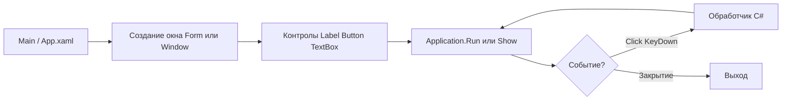

# C# WinForms и WPF — простые окна

<div class="article-tags">
  <span class="tag tag-notrequired">НЕ ОБЯЗАТЕЛЬНО</span>
  <span class="tag tag-beginner">ДЛЯ НОВИЧКОВ</span>
</div>

Подборка **готовых примеров WinForms и WPF на C#** с **построчным разбором** — «что написано» и «зачем так». Материал рассчитан на тех, кто ищет в Google «**winforms пример c#**», «**как сделать окно на c#**», «**wpf button click**», «**textbox winforms**», «**messagebox c#**», «**лабораторная winforms**» или готовит **домашку**, **лабораторную** и **курсовую** с графическим интерфейсом.

---

## Для кого эта статья

| Аудитория | Зачем открыть |
|-----------|----------------|
| **Школьники** | Информатика, проект «окно с кнопкой», конвертер температуры |
| **Студенты** | Лабораторная «десктоп на C#», зачёт по WinForms или WPF |
| **Самоучки** | Скопировать код → `dotnet run` → разобрать по таблице |
| **После Python** | Уже делали [Tkinter](/lab/Примеры/1124) — те же идеи (окно, кнопка, поле ввода), другой синтаксис |
| **После консоли C#** | Знаете `Console.WriteLine` — здесь вместо консоли **Form** или **Window** |

**Как работать с примером:**

1. Создайте проект — `dotnet new winforms` или `dotnet new wpf` (команды ниже).
2. Скопируйте **целиком** блок кода из нужного раздела.
3. Запустите — `dotnet run` в папке проекта (нужен **Windows**).
4. Прочитайте **Разбор** под кодом — там смысл каждой строки и типичные ошибки.
5. Измените текст, размер окна, формулу — так быстрее запоминается API.

Примеры запускаются **только на Windows** с [.NET SDK 8+](https://dotnet.microsoft.com/download). В браузере, как симулятор Turtle на [странице Lab](/lab/Примеры/111), они не выполняются.

<div class="callout callout--tip">
  <div class="callout-title">Сначала теория</div>

  <div class="callout-body">
  Обзор платформ — <a href="/encyclopedia/4-code-dev/4-11-desktopnye-prilozheniya/115">WinForms</a> и <a href="/encyclopedia/4-code-dev/4-11-desktopnye-prilozheniya/119">WPF с нуля</a>. Рецепты по каждому элементу — <a href="/encyclopedia/4-code-dev/4-11-desktopnye-prilozheniya/1152">справочник WinForms</a> и <a href="/encyclopedia/4-code-dev/4-11-desktopnye-prilozheniya/1192">справочник WPF</a>. Аналог на Python — <a href="/lab/Примеры/1124">Tkinter — окна и виджеты</a>. Синтаксис C# — <a href="/encyclopedia/5-languages/5-05-csharp/1">первая программа</a>.
</div>
</div>

---

## Краткий указатель — что ищут в Google

| Раздел | Типичный запрос |
|--------|-----------------|
| [Каркас WinForms](#karkas-winforms) | `winforms program.cs пример`, `application.run c#`, `statthread winforms` |
| [Каркас WPF](#karkas-wpf) | `wpf mainwindow xaml пример`, `initializecomponent`, `startupuri` |
| [Окно с текстом](#hello-label) | `winforms label пример`, `wpf textblock`, `как сделать окно c#` |
| [Кнопка и MessageBox](#button-messagebox) | `winforms button click`, `messagebox.show c#`, `wpf button click event` |
| [Поле ввода и имя](#textbox-greet) | `winforms textbox get text`, `wpf textbox x:name`, `форма ввода c#` |
| [Конвертер °C → °F](#converter-temp) | `конвертер температуры winforms`, `tryparse c# textbox`, `курсовая калькулятор c#` |
| [CheckBox и RadioButton](#checkbox-radio) | `winforms checkbox`, `wpf radiobutton groupname`, `настройки форма c#` |
| [Список задач](#todo-listbox) | `winforms listbox add item`, `wpf listbox пример`, `todo list c# gui` |
| [Форма входа](#login-form) | `winforms tablelayoutpanel`, `wpf grid passwordbox`, `форма логин c#` |
| [Меню](#menu-status) | `winforms menustrip`, `wpf menu menuitem`, `statusbar c#` |
| [OpenFileDialog](#open-file) | `openfiledialog c#`, `microsoft.win32.openfiledialog wpf` |
| [Привязка WPF](#binding-simple) | `wpf binding textbox`, `datacontext пример`, `binding mode` |
| [Частые ошибки](#errors) | `окно сразу закрывается winforms`, `net8.0-windows`, `invoke ui thread` |

---

## WinForms и WPF — что выбрать для учебного проекта

| | **WinForms** | **WPF** |
|---|--------------|---------|
| **Разметка** | Код C# или визуальный Designer в Visual Studio | XAML + code-behind |
| **Отрисовка** | GDI+, «родные» окна Windows | DirectX, векторный UI |
| **Привязка данных** | Базовая | `&#123;Binding&#125;`, MVVM |
| **Шаблон проекта** | `dotnet new winforms` | `dotnet new wpf` |
| **Когда удобнее** | Быстрая утилита, CRUD, legacy | Кастомный UI, стили, анимации |

Для **первого окна** подойдут оба стека. WinForms проще «увидеть результат в одном `.cs` файле»; WPF учит XAML — это пригодится в [практикуме WPF](/encyclopedia/4-code-dev/4-11-desktopnye-prilozheniya/wpf-praktikum/intro).

---

## Создание проекта

**WinForms:**

```powershell
dotnet new winforms -n MyDesktopApp -o MyDesktopApp
cd MyDesktopApp
dotnet run
```

**WPF:**

```powershell
dotnet new wpf -n MyWpfApp -o MyWpfApp
cd MyWpfApp
dotnet run
```

### Разбор команд

| Команда | Смысл |
|---------|-------|
| `dotnet new winforms` | Шаблон с `Program.cs`, `Form1.cs`, флагом `UseWindowsForms` в `.csproj` |
| `dotnet new wpf` | Шаблон с `App.xaml`, `MainWindow.xaml`, флагом `UseWPF` |
| `-n MyDesktopApp` | Имя проекта и namespace по умолчанию |
| `-o MyDesktopApp` | Папка на диске |
| `dotnet run` | Сборка и запуск; откроется пустое окно |

Появится пустое окно — шаблон уже рабочий. Примеры ниже можно **заменить содержимое** `Program.cs` (WinForms) или `MainWindow.xaml` + `MainWindow.xaml.cs` (WPF).

---

## Из чего состоит десктоп-приложение на C#

В консольной программе всё крутится вокруг `Main()` и `Console.ReadLine()`. В WinForms и WPF **точка входа та же**, но вместо текста в консоли — **окно** и **цикл сообщений**, который ждёт клики и ввод.



| Часть | WinForms | WPF | Роль |
|-------|----------|-----|------|
| **Точка входа** | `Program.Main()` | `App.xaml` → `StartupUri` | Запуск приложения |
| **Главное окно** | `Form` | `Window` | Рамка с заголовком и кнопкой закрытия |
| **Элемент UI** | `Label`, `Button`, `TextBox`… | То же + `TextBlock`, `PasswordBox` | То, что видит пользователь |
| **Событие** | `button.Click += ...` | `Click="OnClick"` в XAML | Реакция на действие |
| **Цикл** | `Application.Run(form)` | Внутри `Application` | Программа жива, пока окно открыто |
| **Диалог** | `MessageBox.Show(...)` | `MessageBox.Show(...)` | Всплывающее сообщение поверх окна |

Пока цикл работает, код **после** `Application.Run` **не выполняется** — как `mainloop()` в [Tkinter](/lab/Примеры/1124).

---

## Словарь элементов за 30 секунд

| Элемент | WinForms | WPF | Зачем | Как прочитать значение |
|---------|----------|-----|-------|------------------------|
| Окно | `Form` | `Window` | Главная рамка | — |
| Надпись | `Label` | `Label`, `TextBlock` | Статический текст | `label.Text` / `&#123;Binding&#125;` |
| Кнопка | `Button` | `Button` | Действие по клику | `Click` / `command` |
| Поле ввода | `TextBox` | `TextBox` | Одна строка | `textBox.Text` |
| Пароль | `TextBox` + `UseSystemPasswordChar` | `PasswordBox` | Скрытый ввод | `PasswordBox.Password` |
| Галочка | `CheckBox` | `CheckBox` | Вкл/выкл | `Checked` / `IsChecked` |
| Переключатель | `RadioButton` | `RadioButton` | Один из нескольких | `Checked` + группа |
| Список | `ListBox` | `ListBox` | To-do, выбор строки | `SelectedIndex`, `Items` |
| Меню | `MenuStrip` | `Menu` | Файл, Справка | обработчик пункта |
| Диалог | `MessageBox.Show` | `MessageBox.Show` | OK, Yes/No | возвращаемое значение |

**Компоновка WinForms:** `Location` + `Size`, `Dock`, `Anchor`, `TableLayoutPanel`.  
**Компоновка WPF:** `Grid`, `StackPanel`, `DockPanel` — см. [справочник XAML](/encyclopedia/3-data-markup/3-04-konfiguratsii-i-dannye/6).

---

<span id="karkas-winforms"></span>

## Обязательный каркас WinForms

Любой пример WinForms ниже повторяет эту структуру. Запомните её — как `import tkinter` и `mainloop()` в [Tkinter](/lab/Примеры/1124).

Скопируйте в **`Program.cs`** целиком (после `dotnet new winforms`):

```csharp
using System.Drawing;
using System.Windows.Forms;

namespace MyDesktopApp;

static class Program
{
    [STAThread]
    static void Main()
    {
        ApplicationConfiguration.Initialize();

        var form = new Form
        {
            Text = "Моё приложение",
            ClientSize = new Size(400, 300),
            StartPosition = FormStartPosition.CenterScreen
        };

        // --- здесь Label, Button, TextBox и остальные контролы ---

        Application.Run(form);
    }
}
```

### Разбор каркаса WinForms — по строкам

| Строка / блок | Смысл |
|---------------|-------|
| `using System.Drawing;` | Типы `Point`, `Size`, `Font`, `Color` — координаты и оформление |
| `using System.Windows.Forms;` | `Form`, `Button`, `Application`, `MessageBox` |
| `namespace MyDesktopApp;` | Имя проекта из шаблона `dotnet new`; должно совпадать с `.csproj` |
| `[STAThread]` | Один UI-поток для COM и контролов Windows; **без атрибута** возможны странные ошибки |
| `ApplicationConfiguration.Initialize()` | Настройка DPI и стилей (.NET 6+); вызывают **один раз** в начале `Main` |
| `new Form { ... }` | Главное окно; `Text` — заголовок в строке заголовка ОС |
| `ClientSize = new Size(400, 300)` | Ширина × высота **рабочей области** без рамки окна |
| `StartPosition = CenterScreen` | Окно по центру монитора при старте |
| `Application.Run(form)` | **Цикл сообщений**; без этой строки окно мелькает и сразу закроется |

**Файл проекта** (шаблон создаёт сам):

```xml
<TargetFramework>net8.0-windows</TargetFramework>
<UseWindowsForms>true</UseWindowsForms>
```

Если указать `net8.0` без `-windows`, типы `Form` и `Application` **не найдутся** при сборке.

**Что попробовать:** добавьте `form.MaximizeBox = false;` — исчезнет кнопка «развернуть».

---

<span id="karkas-wpf"></span>

## Обязательный каркас WPF

WPF делит UI на **разметку** (XAML) и **код** (C#). Окно описывают в двух связанных файлах.

**MainWindow.xaml** — замените содержимое после `dotnet new wpf`:

```xml
<Window x:Class="MyWpfApp.MainWindow"
        xmlns="http://schemas.microsoft.com/winfx/2006/xaml/presentation"
        xmlns:x="http://schemas.microsoft.com/winfx/2006/xaml"
        Title="Моё приложение"
        Height="300" Width="400"
        WindowStartupLocation="CenterScreen">
    <!-- Label, Button, TextBox — между открывающим и закрывающим Window -->
</Window>
```

**MainWindow.xaml.cs:**

```csharp
namespace MyWpfApp;

public partial class MainWindow : Window
{
    public MainWindow()
    {
        InitializeComponent();
    }
}
```

**App.xaml** (шаблон, обычно не трогают):

```xml
<Application x:Class="MyWpfApp.App"
             StartupUri="MainWindow.xaml">
</Application>
```

### Разбор каркаса WPF — по частям

| Часть | Смысл |
|-------|-------|
| `x:Class="MyWpfApp.MainWindow"` | Связь XAML с классом `MainWindow` в `MainWindow.xaml.cs`; имя **должно совпадать** |
| `xmlns` / `xmlns:x` | Пространства имён XML — стандартные для WPF |
| `Title`, `Height`, `Width` | Заголовок и размер окна (в отличие от WinForms `ClientSize`) |
| `WindowStartupLocation="CenterScreen"` | Центрирование — аналог `FormStartPosition.CenterScreen` |
| `partial class MainWindow : Window` | Класс окна; `partial` — вторая часть генерируется из XAML |
| `InitializeComponent()` | Загружает XAML и создаёт поля для `x:Name`; **не удаляйте** |
| `StartupUri="MainWindow.xaml"` | Какое окно открыть при старте |

**Что попробуйте:** смените `Title` и перезапустите `dotnet run` — заголовок окна изменится без правки C#.

---

## Стартовые окна

Простые примеры «с нуля» — с них удобно начинать лабораторную. Каждый блок — **полный рабочий код**: скопируйте, вставьте, запустите.

---

<span id="hello-label"></span>

### Минимальное окно с меткой

**Задача:** показать, что C# на .NET умеет открыть окно с текстом — минимум для проверки установки SDK и сдачи отчёта «программа с GUI».

**Что получится:** окно по центру экрана с одной надписью «Окно работает!».

#### WinForms — полный `Program.cs`

```csharp
using System.Drawing;
using System.Windows.Forms;

namespace HelloWinForms;

static class Program
{
    [STAThread]
    static void Main()
    {
        ApplicationConfiguration.Initialize();

        var form = new Form
        {
            Text = "Привет, WinForms",
            ClientSize = new Size(400, 200),
            StartPosition = FormStartPosition.CenterScreen
        };

        var label = new Label
        {
            Text = "Окно работает!",
            AutoSize = true,
            Location = new Point(20, 20),
            Font = new Font("Segoe UI", 14f)
        };
        form.Controls.Add(label);

        Application.Run(form);
    }
}
```

#### Разбор WinForms — что делает каждая строка UI

| Строка | Смысл |
|--------|-------|
| `var label = new Label` | Создаём **надпись** — аналог `tk.Label` в Python |
| `Text = "Окно работает!"` | Текст, который видит пользователь |
| `AutoSize = true` | Ширина и высота подстраиваются под длину текста |
| `Location = new Point(20, 20)` | Отступ 20 px от **левого верхнего** угла клиентской области |
| `Font = new Font("Segoe UI", 14f)` | Шрифт и размер; `f` у `14` — литерал `float` |
| `form.Controls.Add(label)` | **Обязательно:** без добавления на форму контрол **не виден** |

#### WPF — `MainWindow.xaml`

```xml
<Window x:Class="HelloWpf.MainWindow"
        xmlns="http://schemas.microsoft.com/winfx/2006/xaml/presentation"
        xmlns:x="http://schemas.microsoft.com/winfx/2006/xaml"
        Title="Привет, WPF"
        Height="200" Width="400"
        WindowStartupLocation="CenterScreen">
    <StackPanel Margin="20">
        <TextBlock Text="Окно работает!" FontSize="14"/>
    </StackPanel>
</Window>
```

#### Разбор WPF

| Элемент | Смысл |
|---------|-------|
| `StackPanel` | Контейнер: дочерние элементы **стопкой сверху вниз** |
| `Margin="20"` | Отступ контента от краёв окна |
| `TextBlock` | Только текст; `Label` в WPF чаще для подписей к полям |

**Что попробовать:** смените текст и размер окна; в WinForms — `form.Text` и `ClientSize`, в WPF — `Title` и `Width`/`Height`.

---

<span id="button-messagebox"></span>

### Кнопка и MessageBox

**Задача:** по нажатию кнопки показать диалог — основа калькулятора, формы входа и любой «кнопки Сохранить».

**Что получится:** кнопка «Нажми меня»; после клика — окно сообщения Windows.

#### WinForms — полный `Program.cs`

```csharp
using System.Drawing;
using System.Windows.Forms;

namespace ButtonDemo;

static class Program
{
    [STAThread]
    static void Main()
    {
        ApplicationConfiguration.Initialize();

        var form = new Form
        {
            Text = "Кнопка",
            ClientSize = new Size(320, 180),
            StartPosition = FormStartPosition.CenterScreen
        };

        var button = new Button
        {
            Text = "Нажми меня",
            Location = new Point(20, 20),
            AutoSize = true
        };

        // Click += подписка на событие; лямбда вызывается ТОЛЬКО по клику
        button.Click += (_, _) => MessageBox.Show(
            "Кнопка нажата!",
            "Сообщение",
            MessageBoxButtons.OK,
            MessageBoxIcon.Information);

        form.Controls.Add(button);
        Application.Run(form);
    }
}
```

#### Разбор события Click в WinForms

| Конструкция | Смысл |
|-------------|-------|
| `button.Click += (_, _) => ...` | Подписка на событие «клик»; `(_, _)` — аргументы не нужны |
| **Нельзя** писать `button.Click += MessageBox.Show(...)` | `Show(...)` выполнится **сразу при старте**, не по клику |
| `MessageBox.Show(текст, заголовок, кнопки, иконка)` | Модальное окно; код **ждёт**, пока пользователь нажмёт OK |
| `MessageBoxButtons.OK` | Одна кнопка OK |
| `MessageBoxIcon.Information` | Синий значок «i» |

#### WPF — `MainWindow.xaml`

```xml
<Window x:Class="ButtonDemo.MainWindow"
        xmlns="http://schemas.microsoft.com/winfx/2006/xaml/presentation"
        xmlns:x="http://schemas.microsoft.com/winfx/2006/xaml"
        Title="Кнопка" Height="180" Width="320"
        WindowStartupLocation="CenterScreen">
    <StackPanel Margin="20">
        <Button Content="Нажми меня" Click="OnClick" Padding="12,6"/>
    </StackPanel>
</Window>
```

**MainWindow.xaml.cs:**

```csharp
using System.Windows;

namespace ButtonDemo;

public partial class MainWindow : Window
{
    public MainWindow() => InitializeComponent();

    private void OnClick(object sender, RoutedEventArgs e)
    {
        MessageBox.Show("Кнопка нажата!", "Сообщение");
    }
}
```

#### Разбор WPF Click

| Часть | Смысл |
|-------|-------|
| `Click="OnClick"` в XAML | Имя метода в `.xaml.cs`; компилятор связывает разметку и код |
| `RoutedEventArgs e` | Объект события; в простых примерах часто не используют |
| `Content="..."` у Button | Текст на кнопке (в WinForms — свойство `Text`) |

**Что попробовать:** `MessageBoxButtons.YesNo` (WinForms) или `MessageBoxButton.YesNo` (WPF) — проверьте, что вернётся при Yes и No.

---

<span id="textbox-greet"></span>

### Поле ввода и приветствие

**Задача:** прочитать имя из `TextBox` и показать приветствие — типичная форма «введите имя» в лабораторных.

**Что получится:** подпись, поле ввода, кнопка; пустое имя — предупреждение.

#### WinForms — полный `Program.cs`

```csharp
using System.Drawing;
using System.Windows.Forms;

namespace GreetApp;

static class Program
{
    [STAThread]
    static void Main()
    {
        ApplicationConfiguration.Initialize();

        var form = new Form
        {
            Text = "Приветствие",
            ClientSize = new Size(360, 160),
            StartPosition = FormStartPosition.CenterScreen,
            FormBorderStyle = FormBorderStyle.FixedDialog,
            MaximizeBox = false
        };

        var nameLabel = new Label
        {
            Text = "Ваше имя:",
            AutoSize = true,
            Location = new Point(20, 24)
        };

        var entry = new TextBox
        {
            Location = new Point(120, 20),
            Width = 200
        };

        var greetButton = new Button
        {
            Text = "Приветствовать",
            Location = new Point(20, 60),
            AutoSize = true
        };

        greetButton.Click += (_, _) =>
        {
            var name = entry.Text.Trim();
            if (string.IsNullOrEmpty(name))
            {
                MessageBox.Show("Введите имя", "Пусто",
                    MessageBoxButtons.OK, MessageBoxIcon.Warning);
                return;
            }
            MessageBox.Show($"Здравствуй, {name}!", "Привет");
        };

        form.Controls.Add(nameLabel);
        form.Controls.Add(entry);
        form.Controls.Add(greetButton);
        entry.Focus();

        Application.Run(form);
    }
}
```

#### Разбор логики формы

| Строка | Смысл |
|--------|-------|
| `entry.Text` | Текущий текст в поле; читают **внутри** обработчика Click, когда пользователь уже ввёл данные |
| `.Trim()` | Убирает пробелы по краям — `"  Анна  "` → `"Анна"` |
| `string.IsNullOrEmpty(name)` | Проверка на пустую строку после trim |
| `return;` | Выход из обработчика без второго MessageBox |
| `$"Здравствуй, &#123;name&#125;!"` | Интерполяция строк C# |
| `entry.Focus()` | Курсор сразу в поле при открытии окна |
| `FormBorderStyle.FixedDialog` | Окно фиксированного размера — часто для маленьких форм |

#### WPF — `MainWindow.xaml`

```xml
<Window x:Class="GreetApp.MainWindow"
        xmlns="http://schemas.microsoft.com/winfx/2006/xaml/presentation"
        xmlns:x="http://schemas.microsoft.com/winfx/2006/xaml"
        Title="Приветствие" Height="160" Width="360"
        ResizeMode="NoResize" WindowStartupLocation="CenterScreen">
    <StackPanel Margin="20">
        <Grid>
            <Grid.ColumnDefinitions>
                <ColumnDefinition Width="Auto"/>
                <ColumnDefinition Width="*"/>
            </Grid.ColumnDefinitions>
            <Label Content="Ваше имя:" VerticalAlignment="Center"/>
            <TextBox x:Name="NameBox" Grid.Column="1" Margin="8,0,0,0"/>
        </Grid>
        <Button Content="Приветствовать" Click="OnGreet"
                Margin="0,12,0,0" HorizontalAlignment="Left"/>
    </StackPanel>
</Window>
```

**MainWindow.xaml.cs:**

```csharp
using System.Windows;

namespace GreetApp;

public partial class MainWindow : Window
{
    public MainWindow()
    {
        InitializeComponent();
        NameBox.Focus();
    }

    private void OnGreet(object sender, RoutedEventArgs e)
    {
        var name = NameBox.Text.Trim();
        if (string.IsNullOrEmpty(name))
        {
            MessageBox.Show("Введите имя", "Пусто",
                MessageBoxButton.OK, MessageBoxImage.Warning);
            return;
        }
        MessageBox.Show($"Здравствуй, {name}!", "Привет");
    }
}
```

#### Разбор `x:Name` в WPF

| Атрибут | Смысл |
|---------|-------|
| `x:Name="NameBox"` | Поле `NameBox` в code-behind — доступ из C# как `NameBox.Text` |
| `Grid.Column="1"` | TextBox во **втором столбце** сетки |
| `Width="*"` у столбца | Второй столбец растягивается на оставшуюся ширину |

**Что попробовать:** второе поле «Фамилия» и вывод `Здравствуй, Имя Фамилия!`; Enter в поле — обработчик `KeyDown` (WinForms) или `KeyDown="..."` (WPF).

---

<span id="converter-temp"></span>

### Конвертер °C → °F

**Задача:** классическая учебная программа — ввод числа, формула, вывод результата на форме. Часто встречается в заданиях и курсовых.

**Формула:** $F = C \times \frac&#123;9&#125;&#123;5&#125; + 32$

#### WinForms — полный `Program.cs`

```csharp
using System.Drawing;
using System.Globalization;
using System.Windows.Forms;

namespace TempConverter;

static class Program
{
    [STAThread]
    static void Main()
    {
        ApplicationConfiguration.Initialize();

        var form = new Form
        {
            Text = "Конвертер температуры",
            ClientSize = new Size(340, 180),
            StartPosition = FormStartPosition.CenterScreen,
            FormBorderStyle = FormBorderStyle.FixedDialog,
            MaximizeBox = false
        };

        var tempLabel = new Label
        {
            Text = "Температура (°C):",
            AutoSize = true,
            Location = new Point(20, 24)
        };

        var entry = new TextBox { Location = new Point(160, 20), Width = 80 };

        var resultLabel = new Label
        {
            Text = "—",
            AutoSize = true,
            Location = new Point(20, 60),
            Font = new Font("Segoe UI", 12f)
        };

        var convertButton = new Button
        {
            Text = "Перевести",
            Location = new Point(20, 100),
            AutoSize = true
        };

        convertButton.Click += (_, _) =>
        {
            var raw = entry.Text.Trim().Replace(',', '.');
            if (!double.TryParse(raw, NumberStyles.Any, CultureInfo.InvariantCulture, out var celsius))
            {
                MessageBox.Show("Введите число, например 25", "Ошибка");
                return;
            }
            var fahrenheit = celsius * 9 / 5 + 32;
            resultLabel.Text = $"{celsius:F1} °C = {fahrenheit:F1} °F";
        };

        entry.KeyDown += (_, e) =>
        {
            if (e.KeyCode == Keys.Enter)
                convertButton.PerformClick();
        };

        form.Controls.Add(tempLabel);
        form.Controls.Add(entry);
        form.Controls.Add(resultLabel);
        form.Controls.Add(convertButton);
        entry.Focus();

        Application.Run(form);
    }
}
```

#### Разбор парсинга и вывода

| Строка | Смысл |
|--------|-------|
| `.Replace(',', '.')` | Пользователь ввёл `25,5` — для `TryParse` нужна точка |
| `double.TryParse(..., out var celsius)` | Безопасный разбор; при буквах вернёт `false`, без исключения |
| `CultureInfo.InvariantCulture` | Десятичная точка **не зависит** от языка Windows |
| `$"&#123;celsius:F1&#125; °C"` | Один знак после запятой |
| `PerformClick()` | Программно «нажать» кнопку — Enter дублирует «Перевести» |
| `resultLabel.Text = ...` | Обновление надписи **без** нового окна — результат на той же форме |

#### WPF — ключевые файлы

**MainWindow.xaml:**

```xml
<Window x:Class="TempConverter.MainWindow"
        xmlns="http://schemas.microsoft.com/winfx/2006/xaml/presentation"
        xmlns:x="http://schemas.microsoft.com/winfx/2006/xaml"
        Title="Конвертер температуры" Height="180" Width="340"
        ResizeMode="NoResize" WindowStartupLocation="CenterScreen">
    <StackPanel Margin="20">
        <Grid>
            <Grid.ColumnDefinitions>
                <ColumnDefinition Width="Auto"/>
                <ColumnDefinition Width="80"/>
            </Grid.ColumnDefinitions>
            <Label Content="Температура (°C):" VerticalAlignment="Center"/>
            <TextBox x:Name="TempBox" Grid.Column="1" Margin="8,0,0,0" KeyDown="OnTempKeyDown"/>
        </Grid>
        <TextBlock x:Name="ResultText" Margin="0,12,0,0" FontSize="12" Text="—"/>
        <Button Content="Перевести" Click="OnConvert" Margin="0,12,0,0" HorizontalAlignment="Left"/>
    </StackPanel>
</Window>
```

**MainWindow.xaml.cs** — та же логика `TryParse` и формула, что в WinForms; результат пишется в `ResultText.Text`.

**Что попробуйте:** кнопка «Очистить» — `entry.Clear()` и `resultLabel.Text = "—"`; обратный перевод °F → °C.

---

<span id="checkbox-radio"></span>

### Флажок и переключатели

**Задача:** несколько настроек «вкл/выкл» и выбор одной роли — учит работе с состоянием контролов.

**Смысл:** `CheckBox` — **независимые** галочки; `RadioButton` — **один** вариант из группы.

#### WinForms — фрагмент для `Main` (после создания `form`)

```csharp
var notifyCheck = new CheckBox
{
    Text = "Уведомления", Location = new Point(20, 20), Checked = true, AutoSize = true
};
var soundCheck = new CheckBox { Text = "Звук", Location = new Point(20, 50), AutoSize = true };
var userRadio = new RadioButton
{
    Text = "Пользователь", Location = new Point(20, 90), Checked = true, AutoSize = true
};
var adminRadio = new RadioButton { Text = "Администратор", Location = new Point(20, 120), AutoSize = true };
var statusLabel = new Label { Location = new Point(20, 160), AutoSize = true, ForeColor = Color.Gray };

void UpdateStatus()
{
    var parts = new List<string>();
    if (notifyCheck.Checked) parts.Add("уведомления");
    if (soundCheck.Checked) parts.Add("звук");
    var role = adminRadio.Checked ? "admin" : "user";
    statusLabel.Text = $"Роль: {role}; включено: {(parts.Count > 0 ? string.Join(", ", parts) : "ничего")}";
}

notifyCheck.CheckedChanged += (_, _) => UpdateStatus();
soundCheck.CheckedChanged += (_, _) => UpdateStatus();
userRadio.CheckedChanged += (_, _) => UpdateStatus();
adminRadio.CheckedChanged += (_, _) => UpdateStatus();

form.Controls.AddRange(new Control[] { notifyCheck, soundCheck, userRadio, adminRadio, statusLabel });
UpdateStatus();
```

#### Разбор

| API | Смысл |
|-----|-------|
| `Checked = true` | Галочка / переключатель включены при старте |
| `CheckedChanged` | Событие при смене состояния — обновляем строку статуса |
| `adminRadio.Checked ? "admin" : "user"` | Тернарный оператор — кто выбран |
| `string.Join(", ", parts)` | Список включённых опций через запятую |
| `UpdateStatus()` при старте | Начальная подпись, не пустая строка |

#### WPF

`GroupName="Role"` у `RadioButton` объединяет переключатели в одну группу. `IsChecked` имеет тип `bool?` — проверяют `== true`.

**Что попробуйте:** третья роль «Гость»; отключение кнопки, если имя пустое (`button.Enabled = false` в WinForms, `IsEnabled="False"` в WPF).

---

<span id="todo-listbox"></span>

### Список задач (ListBox)

**Задача:** мини to-do — добавить задачу, удалить выбранную. Удобный **мини-проект для отчёта** (2–3 экрана в Word + скриншот).

**Что получится:** поле ввода, кнопки «Добавить» / «Удалить», список строк.

#### WinForms — полный `Program.cs`

```csharp
using System.Drawing;
using System.Windows.Forms;

namespace TodoList;

static class Program
{
    [STAThread]
    static void Main()
    {
        ApplicationConfiguration.Initialize();

        var form = new Form
        {
            Text = "Список задач",
            ClientSize = new Size(320, 280),
            StartPosition = FormStartPosition.CenterScreen
        };

        var entry = new TextBox { Location = new Point(12, 12), Width = 280 };
        var addButton = new Button { Text = "Добавить", Location = new Point(12, 44), AutoSize = true };
        var removeButton = new Button { Text = "Удалить", Location = new Point(100, 44), AutoSize = true };
        var listBox = new ListBox { Location = new Point(12, 80), Size = new Size(280, 160) };

        void AddTask()
        {
            var text = entry.Text.Trim();
            if (text.Length == 0) return;
            listBox.Items.Add(text);
            entry.Clear();
        }

        void RemoveTask()
        {
            if (listBox.SelectedIndex >= 0)
                listBox.Items.RemoveAt(listBox.SelectedIndex);
        }

        addButton.Click += (_, _) => AddTask();
        removeButton.Click += (_, _) => RemoveTask();
        entry.KeyDown += (_, e) => { if (e.KeyCode == Keys.Enter) AddTask(); };

        form.Controls.AddRange(new Control[] { entry, addButton, removeButton, listBox });
        entry.Focus();

        Application.Run(form);
    }
}
```

#### Разбор ListBox

| Метод / свойство | Смысл |
|------------------|-------|
| `listBox.Items.Add(text)` | Добавить строку в **конец** списка |
| `listBox.SelectedIndex` | Индекс выделенной строки; **-1**, если ничего не выбрано |
| `RemoveAt(index)` | Удалить строку по индексу |
| `entry.Clear()` | Очистить поле после добавления |
| Локальные функции `AddTask` / `RemoveTask` | C# 7+ — короткий способ не дублировать код Enter и кнопки |

#### WPF

`Grid` с тремя строками: поле ввода, панель кнопок, `ListBox` с `Height="*"`. Логика в `AddTask()` — та же.

**Что попробуйте:** счётчик задач в заголовке окна — `form.Text = $"Задач: &#123;listBox.Items.Count&#125;"`.

---

## Примеры окон и элементов

Тематические блоки для курсовой: компоновка, меню, файлы, привязки.

---

<span id="login-form"></span>

### 1. Форма входа

**Задача:** поля Email и пароль с выравниванием — как на сайте, но в десктопе.

#### WinForms — TableLayoutPanel

```csharp
var table = new TableLayoutPanel
{
    Dock = DockStyle.Fill,
    Padding = new Padding(12),
    ColumnCount = 2,
    RowCount = 3
};
table.ColumnStyles.Add(new ColumnStyle(SizeType.AutoSize));
table.ColumnStyles.Add(new ColumnStyle(SizeType.Percent, 100f));

var emailBox = new TextBox { Dock = DockStyle.Fill, Margin = new Padding(8, 4, 0, 4) };
var passBox = new TextBox
{
    Dock = DockStyle.Fill,
    UseSystemPasswordChar = true,
    Margin = new Padding(8, 4, 0, 4)
};
var loginButton = new Button { Text = "Войти", Anchor = AnchorStyles.Right, AutoSize = true };
loginButton.Click += (_, _) => MessageBox.Show("Вход (демо)");

table.Controls.Add(new Label { Text = "Email:", AutoSize = true }, 0, 0);
table.Controls.Add(emailBox, 1, 0);
table.Controls.Add(new Label { Text = "Пароль:", AutoSize = true }, 0, 1);
table.Controls.Add(passBox, 1, 1);
table.Controls.Add(loginButton, 1, 2);

form.Controls.Add(table);
```

#### Разбор TableLayoutPanel

| Свойство | Смысл |
|----------|-------|
| `ColumnCount = 2` | Две колонки — подпись и поле |
| `SizeType.AutoSize` | Первая колонка по ширине текста «Email:» |
| `SizeType.Percent, 100f` | Вторая колонка забирает **всю** оставшуюся ширину |
| `Controls.Add(control, column, row)` | Ячейка таблицы — аналог `grid(row, column)` в Tkinter |
| `UseSystemPasswordChar = true` | Символы пароля отображаются как ● |

#### WPF — Grid + PasswordBox

```xml
<Grid Margin="12">
    <Grid.RowDefinitions>
        <RowDefinition Height="Auto"/>
        <RowDefinition Height="Auto"/>
        <RowDefinition Height="Auto"/>
    </Grid.RowDefinitions>
    <Grid.ColumnDefinitions>
        <ColumnDefinition Width="Auto"/>
        <ColumnDefinition Width="*"/>
    </Grid.ColumnDefinitions>
    <Label Content="Email:" VerticalAlignment="Center"/>
    <TextBox Grid.Column="1" Margin="8,4,0,4"/>
    <Label Grid.Row="1" Content="Пароль:" VerticalAlignment="Center"/>
    <PasswordBox x:Name="PassBox" Grid.Row="1" Grid.Column="1" Margin="8,4,0,4"/>
    <Button Grid.Row="2" Grid.Column="1" Content="Войти"
            HorizontalAlignment="Right" Margin="0,12,0,0" Click="OnLogin"/>
</Grid>
```

**Смысл:** в WPF пароль — отдельный контрол `PasswordBox`; свойство `Password`, не `Text`.

---

<span id="menu-status"></span>

### 2. Меню и строка состояния

**WinForms:**

```csharp
var menu = new MenuStrip();
var fileMenu = new ToolStripMenuItem("Файл");
fileMenu.DropDownItems.Add("Новый", null, (_, _) => MessageBox.Show("Новый"));
fileMenu.DropDownItems.Add("Выход", null, (_, _) => form.Close());
menu.Items.Add(fileMenu);

var status = new StatusStrip();
status.Items.Add(new ToolStripStatusLabel("Готово"));

form.MainMenuStrip = menu;
form.Controls.Add(menu);
form.Controls.Add(status);
```

#### Разбор

| API | Смысл |
|-----|-------|
| `MenuStrip` | Полоса меню под заголовком окна |
| `DropDownItems.Add(текст, иконка, обработчик)` | Пункт выпадающего меню |
| `form.MainMenuStrip = menu` | Привязка меню к форме — корректные Alt+буква и отступ контента |
| `StatusStrip` | Серая полоска **внизу** — «Готово», строка состояния |

---

<span id="open-file"></span>

### 3. Диалог выбора файла

**WinForms:**

```csharp
using var dialog = new OpenFileDialog
{
    Filter = "Текстовые файлы (*.txt)|*.txt|Все файлы (*.*)|*.*",
    Title = "Открыть файл"
};
if (dialog.ShowDialog(form) == DialogResult.OK)
    MessageBox.Show(form, $"Выбран: {dialog.FileName}");
```

**WPF:**

```csharp
var dialog = new Microsoft.Win32.OpenFileDialog
{
    Filter = "Текстовые файлы (*.txt)|*.txt|Все файлы (*.*)|*.*",
    Title = "Открыть файл"
};
if (dialog.ShowDialog() == true)
    MessageBox.Show($"Выбран: {dialog.FileName}");
```

#### Разбор Filter

Строка фильтра: `Описание|*.расширение|Описание2|*.расширение2`.  
Символ `|` разделяет пары «подпись — маска».

| Стек | Класс | Успешный результат |
|------|-------|-------------------|
| WinForms | `System.Windows.Forms.OpenFileDialog` | `DialogResult.OK` |
| WPF | `Microsoft.Win32.OpenFileDialog` | `true` |

---

### 4. Мини-калькулятор сложения (WinForms)

**Задача:** два `TextBox`, кнопка «=», результат в `Label` — связка ввода, события и `TryParse`.

```csharp
var aBox = new TextBox { Location = new Point(20, 20), Width = 60 };
var bBox = new TextBox { Location = new Point(100, 20), Width = 60 };
var sumButton = new Button { Text = "=", Location = new Point(180, 18), AutoSize = true };
var resultLabel = new Label { Location = new Point(220, 22), AutoSize = true };

sumButton.Click += (_, _) =>
{
    if (double.TryParse(aBox.Text.Replace(',', '.'), out var a) &&
        double.TryParse(bBox.Text.Replace(',', '.'), out var b))
        resultLabel.Text = (a + b).ToString("G");
    else
        resultLabel.Text = "Ошибка";
};

form.Controls.AddRange(new Control[] { aBox, bBox, sumButton, resultLabel });
```

**Смысл:** результат на форме, без `MessageBox` — пользователь видит ошибку «Ошибка» в том же окне. Расширение до `-`, `*`, `/` — один обработчик и `switch` по оператору.

---

<span id="binding-simple"></span>

### 5. Привязка данных в WPF (простой уровень)

**Задача:** текст «Привет, …!» обновляется **сам**, пока пользователь печатает в поле — задел под MVVM.

**Models/Person.cs:**

```csharp
namespace MyWpfApp.Models;

public sealed class Person
{
    public string Name { get; set; } = "Гость";
}
```

**MainWindow.xaml:**

```xml
<StackPanel Margin="20">
    <TextBlock Text="{Binding Name, StringFormat='Привет, {0}!'}" FontSize="14"/>
    <TextBox Text="{Binding Name, UpdateSourceTrigger=PropertyChanged}" Margin="0,12,0,0"/>
</StackPanel>
```

**MainWindow.xaml.cs:**

```csharp
using MyWpfApp.Models;

public MainWindow()
{
    InitializeComponent();
    DataContext = new Person();
}
```

#### Разбор Binding

| Конструкция | Смысл |
|-------------|-------|
| `DataContext = new Person()` | Объект-источник для всех `&#123;Binding ...&#125;` на окне |
| `&#123;Binding Name&#125;` | Свойство `Person.Name` |
| `StringFormat='Привет, {0}!'` | Шаблон отображения |
| `UpdateSourceTrigger=PropertyChanged` | Модель обновляется **на каждый символ**, не только при потере фокуса |
| Два `&#123;Binding Name&#125;` | Одно свойство — два контрола; WPF синхронизирует их |

<div class="callout callout--info">
  <div class="callout-title">Дальше — MVVM</div>

  <div class="callout-body">
  В учебных проектах достаточно <code>DataContext</code> и простого класса. В курсовой и production свойства выносят во <strong>ViewModel</strong> с <code>INotifyPropertyChanged</code> — см. <a href="/encyclopedia/4-code-dev/4-11-desktopnye-prilozheniya/119">119.md</a> и <a href="/encyclopedia/4-code-dev/4-11-desktopnye-prilozheniya/wpf-praktikum/2">практикум MVVM</a>.
</div>
</div>

---

### 6. Подтверждение при закрытии окна

**WinForms:**

```csharp
form.FormClosing += (_, e) =>
{
    if (MessageBox.Show("Закрыть приложение?", "Выход",
            MessageBoxButtons.YesNo, MessageBoxIcon.Question) == DialogResult.No)
        e.Cancel = true;
};
```

**WPF** — атрибут `Closing="OnClosing"` на `Window` и в обработчике `e.Cancel = true` при ответе No.

**Смысл:** крестик в заголовке по умолчанию закрывает окно сразу; `Cancel = true` **отменяет** закрытие — нужно для «Сохранить изменения?».

---

### 7. Шаблоны для своих проектов

#### Окно по центру

WinForms: `StartPosition = FormStartPosition.CenterScreen`.  
WPF: `WindowStartupLocation="CenterScreen"`.

#### Логика отдельно от формы

```csharp
// Services/GreetingService.cs
public static class GreetingService
{
    public static string Build(string name) =>
        string.IsNullOrWhiteSpace(name) ? "Введите имя" : $"Здравствуй, {name.Trim()}!";
}
```

Кнопка вызывает `GreetingService.Build(entry.Text)` — форма остаётся тонкой; логику можно проверить **unit-тестом** без GUI. Это плюс на защите курсовой.

---

<span id="errors"></span>

## Частые ошибки и как исправить

| Симптом | Причина | Решение |
|---------|---------|---------|
| Окно мелькает и закрывается | Нет `Application.Run(form)` | Добавьте в конец `Main` перед закрывающей `}` |
| «Не найден тип Form» | TFM `net8.0` без `-windows` | В `.csproj`: `net8.0-windows` |
| Ошибка CS0246 Window / Form | Нет `UseWindowsForms` / `UseWPF` | Флаги в `.csproj` из шаблона `dotnet new` |
| Контрол не виден | Нет `Controls.Add` | Каждый контрол добавьте на `form` или в panel |
| Кнопка срабатывает при старте | Вызвали метод вместо ссылки | `Click += Handler`, **не** `Click += Handler()` |
| XAML: имя не существует | `x:Class` не совпадает с namespace | `MyApp.MainWindow` в XAML = `namespace MyApp` + `class MainWindow` |
| UI «завис» на 5 секунд | `Thread.Sleep` или тяжёлый цикл в Click | `await Task.Run(...)` — см. [112.md](/encyclopedia/4-code-dev/4-11-desktopnye-prilozheniya/112) |
| InvalidOperationException | Обновление UI из фонового потока | WinForms: `control.Invoke(() => ...)`; WPF: `Dispatcher.Invoke` |
| `25,5` не парсится | Локаль Windows | `.Replace(',', '.')` + `InvariantCulture` в `TryParse` |

---

## Маршрут изучения

| Шаг | Пример в статье | Зачем | Дальше |
|-----|-----------------|-------|--------|
| 1 | [Каркас WinForms](#karkas-winforms) | Понять `Application.Run` | [115 — теория WinForms](/encyclopedia/4-code-dev/4-11-desktopnye-prilozheniya/115) |
| 2 | [Окно + кнопка](#button-messagebox) | События и MessageBox | [1152 — справочник UI](/encyclopedia/4-code-dev/4-11-desktopnye-prilozheniya/1152) |
| 3 | [TextBox + конвертер](#converter-temp) | Ввод, парсинг, формула | Лабораторная «калькулятор» |
| 4 | [ListBox to-do](#todo-listbox) | Коллекция на форме | Курсовая «список задач» |
| 5 | [WPF Binding](#binding-simple) | XAML и данные | [119 — WPF с нуля](/encyclopedia/4-code-dev/4-11-desktopnye-prilozheniya/119) |
| 6 | [Практикум MVVM](/encyclopedia/4-code-dev/4-11-desktopnye-prilozheniya/wpf-praktikum/2) | Клиент-сервер | TaskDesk |

---

## См. также

- [Windows Forms (WinForms)](/encyclopedia/4-code-dev/4-11-desktopnye-prilozheniya/115) — теория и конструктор Visual Studio
- [Первая форма WPF](/encyclopedia/4-code-dev/4-11-desktopnye-prilozheniya/119) — XAML, стили, DataTemplate
- [Справочник WinForms](/encyclopedia/4-code-dev/4-11-desktopnye-prilozheniya/1152) и [справочник WPF](/encyclopedia/4-code-dev/4-11-desktopnye-prilozheniya/1192)
- [Десктопные приложения — о разделе](/encyclopedia/4-code-dev/4-11-desktopnye-prilozheniya/intro)
- [C# — о разделе](/encyclopedia/5-languages/5-05-csharp/intro)
- [Tkinter — окна и виджеты](/lab/Примеры/1124) — те же задачи на Python
- [Java Swing — окна и кнопки](/lab/Примеры/1143) — те же задачи на Java
- [Unity C# — скрипты](/lab/Примеры/1136) — C# в игровом движке
- [Примеры Turtle](/lab/Примеры/111) — популярная галерея с разбором на Python
- [Шаблоны](/lab/Примеры/2) — минимальные каркасы проектов

---
