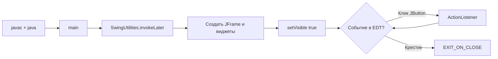

# Java Swing — окна и кнопки

<div class="article-tags">
  <span class="tag tag-notrequired">НЕ ОБЯЗАТЕЛЬНО</span>
  <span class="tag tag-beginner">ДЛЯ НОВИЧКОВ</span>
</div>

Подборка **готовых программ на Java Swing** с **построчным разбором** — «что написано» и «зачем так». Материал для тех, кто ищет **«java gui пример»**, **«jframe example»**, **«jbutton actionlistener»**, **«jtextfield get text»**, **«как сделать окно на java»** или сдаёт **лабораторную** / **курсовую** с графическим интерфейсом.

---

## Для кого эта статья

| Аудитория | Зачем открыть |
|-----------|----------------|
| **Школьники** | Информатика, кружок, первое окно вместо консоли |
| **Студенты** | Лабораторная «GUI на Java», сравнение с [Tkinter](/lab/Примеры/1124) или [WinForms](/lab/Примеры/1138) |
| **Самоучки** | Скопировать `.java` → `javac` → `java` → разобрать таблицу под кодом |
| **После консоли** | Уже решали [Java — консольные задачи](/lab/Примеры/1131) — те же `if`, циклы, но вместо `Scanner` поля и кнопки на экране |

**Как работать с примером:**

1. Установите **JDK 17+** (`java -version` в терминале).
2. Скопируйте код в файл **`ИмяКласса.java`** — имя файла **совпадает** с `public class ИмяКласса`.
3. В папке с файлом выполните `javac ИмяКласса.java`, затем `java ИмяКласса`.
4. В **IntelliJ IDEA** / **Eclipse** / **VS Code** — Run на классе с `main`.
5. Прочитайте **Разбор построчно** под блоком — там смысл каждой строки.

В браузере, как [симулятор Turtle](/lab/Примеры/111), Swing **не запускается** — нужен компьютер с JDK.

<div class="callout callout--tip">
  <div class="callout-title">Сначала теория</div>

  <div class="callout-body">
  Обзор GUI — <a href="/encyclopedia/5-languages/5-03-java/311">JavaFX и GUI</a> (там же сравнение со Swing). Рецепты по элементам — <a href="/encyclopedia/5-languages/5-03-java/3112">справочник JavaFX и Swing</a>. Короткие примеры в энциклопедии — <a href="/encyclopedia/5-languages/5-03-java/131">Простые приложения</a>. Аналог на Python — <a href="/lab/Примеры/1124">Tkinter — окна и виджеты</a>. Мобильный UI — <a href="/lab/Примеры/1154">Flutter — готовые виджеты</a>. Поток UI и «зависание» окна — <a href="/encyclopedia/4-code-dev/4-11-desktopnye-prilozheniya/112">особенности десктопа</a>.
</div>
</div>

---

## Краткий указатель — что ищут в Google

| Раздел | Типичный запрос |
|--------|-----------------|
| [Каркас Swing](#karkas) | `java swing tutorial`, `jframe example`, `SwingUtilities invokeLater` |
| [Окно с меткой](#label) | `jlabel example java`, `java gui hello world` |
| [Кнопка и диалог](#button) | `jbutton click listener java`, `joptionpane showmessagedialog` |
| [Поле ввода](#form) | `jtextfield get text`, `java gui input dialog` |
| [Конвертер °C](#converter) | `java temperature converter gui`, `jtextfield parse double` |
| [Чекбоксы и радио](#settings) | `jcheckbox jradiobutton example`, `ButtonGroup java` |
| [Список задач](#todo) | `jlist add element`, `DefaultListModel java` |
| [Ползунок](#slider) | `jslider example`, `ChangeListener java swing` |
| [Форма входа](#login) | `gridlayout jpanel`, `jpasswordfield example` |
| [Меню](#menu) | `jmenubar example`, `jmenuitem actionlistener` |
| [Калькулятор](#calc) | `java calculator swing`, `gridbaglayout example` |
| [Популярные запросы](#google-popular) | `java gui calculator`, `swing login form`, `jframe set size` |
| [Частые ошибки](#errors) | `jvm not exiting`, `swing ui thread`, `could not find main class` |

---

## Из чего состоит окно на Swing

Любая учебная программа с GUI строится из **трёх слоёв**:

1. **Окно** — `JFrame` (рамка, заголовок, кнопка закрытия).
2. **Контейнер** — `JPanel` с менеджером компоновки (`FlowLayout`, `BorderLayout`, `GridLayout`…).
3. **Виджеты** — `JLabel`, `JButton`, `JTextField` и остальные элементы.

```text
JFrame  «Моё приложение»
  └── ContentPane (по умолчанию BorderLayout)
        ├── NORTH  → JToolBar (кнопки «Новый», «Сохранить»)
        ├── CENTER → JPanel + поля ввода
        └── SOUTH  → JLabel «Готово» (строка состояния)
```

| Консольная программа | Swing-приложение |
|----------------------|------------------|
| `Scanner` читает из терминала | `JTextField.getText()` читает из поля |
| `System.out.println` | `JLabel.setText` или `JOptionPane` |
| Программа ждёт Enter в консоли | Программа ждёт **клик** или **событие** в окне |
| Завершение после `main` | Окно живёт, пока пользователь не закроет крестик |

| | **Консоль Java** | **Swing** | **Tkinter (Python)** |
|---|------------------|-----------|----------------------|
| Библиотека | в JDK | в JDK (`javax.swing`) | в CPython |
| Главное окно | нет | `JFrame` | `tk.Tk()` |
| Цикл событий | нет | EDT (поток Swing) | `mainloop()` |
| Кнопка | нет | `JButton` + `ActionListener` | `Button` + `command=` |

---

## Поток EDT — почему окно «живёт» само

Swing рисует интерфейс в **Event Dispatch Thread (EDT)**. Все создание и изменение кнопок, надписей, размеров окна должны происходить **в этом потоке**.



Пока окно открыто, метод `main` **уже завершился**, но процесс Java **не заканчивается** — работает EDT. Если в обработчике кнопки считать факториал миллиона секунд, окно **замрёт** — для долгих задач нужен `SwingWorker` ([112.md](/encyclopedia/4-code-dev/4-11-desktopnye-prilozheniya/112.md)).

---

<span id="karkas"></span>

## Обязательный каркас Swing

Любой пример ниже повторяет этот шаблон. Запомните его — как `import turtle` и `turtle.done()` в [Turtle](/lab/Примеры/111) или `mainloop()` в [Tkinter](/lab/Примеры/1124).

```java
import javax.swing.*;

public class AppFrame {
    public static void main(String[] args) {
        SwingUtilities.invokeLater(() -> {
            JFrame frame = new JFrame("Моё приложение");
            frame.setDefaultCloseOperation(JFrame.EXIT_ON_CLOSE);
            frame.setSize(400, 300);
            frame.setLocationRelativeTo(null);

            // --- JLabel, JButton, JPanel — сюда ---

            frame.setVisible(true);
        });
    }
}
```

**Разбор построчно:**

| Строка | Смысл |
|--------|--------|
| `import javax.swing.*` | Пакет Swing: `JFrame`, `JButton`, `JLabel`, `JOptionPane`… Звёздочка импортирует часто используемые классы. |
| `public class AppFrame` | Имя класса = имя файла `AppFrame.java`. |
| `public static void main` | Точка входа JVM — [как в консоли](/lab/Примеры/1131#обязательный-каркас). |
| `SwingUtilities.invokeLater(() -> { ... })` | Запланировать создание UI **в EDT**. Без этого на части ОС IDE предупреждает о небезопасном доступе к Swing. |
| `() -> { ... }` | **Лямбда** — короткая анонимная функция без имени; тело в фигурных скобках. |
| `new JFrame("Моё приложение")` | Главное окно; строка в заголовке окна. |
| `setDefaultCloseOperation(EXIT_ON_CLOSE)` | Крестик **завершает JVM**. Без этого окно исчезнет, а процесс `java` может остаться в диспетчере задач. |
| `setSize(400, 300)` | Ширина и высота **клиентской** области в пикселях. |
| `setLocationRelativeTo(null)` | Центр экрана. `null` значит «относительно всего дисплея». |
| `setVisible(true)` | Показать окно. До этого пользователь ничего не увидит. |

**Компиляция и запуск:**

```bash
javac AppFrame.java
java AppFrame
```

| Симптом | Причина |
|---------|---------|
| `Could not find or load main class` | Запускаете не из той папки или имя класса в `java` не совпадает с файлом |
| Окно мелькнуло | Нет `invokeLater` + сразу конец `main` без `EXIT_ON_CLOSE` и видимого окна |
| `javac is not recognized` | JDK не установлен или не в `PATH` |

---

## Стартовые окна

Простые программы «с нуля» — с них удобно начинать лабораторную. У каждого блока: **запрос в Google**, **файл**, код, **таблица строк**, **что увидите на экране**.

---

<span id="label"></span>

### Минимальное окно с меткой

**Запрос:** `java swing hello world`, `jlabel center`.

**Задача:** доказать, что JDK и Swing работают — одно окно с текстом.

**Файл:** `HelloLabel.java`

```java
import javax.swing.*;

public class HelloLabel {
    public static void main(String[] args) {
        SwingUtilities.invokeLater(() -> {
            JFrame frame = new JFrame("Привет, Swing");
            frame.setDefaultCloseOperation(JFrame.EXIT_ON_CLOSE);
            frame.setSize(320, 160);
            frame.setLocationRelativeTo(null);

            JLabel label = new JLabel("Окно работает!", SwingConstants.CENTER);
            frame.add(label);

            frame.setVisible(true);
        });
    }
}
```

**Разбор построчно:**

| Строка | Смысл |
|--------|--------|
| `JLabel label = new JLabel(...)` | Виджет **только для текста** — пользователь в него не печатает. |
| `"Окно работает!"` | Строка на экране. |
| `SwingConstants.CENTER` | Выравнивание текста **по центру** области метки. |
| `frame.add(label)` | `JFrame` по умолчанию использует `BorderLayout` — `add` без зоны кладёт виджет в **CENTER** (центр окна). |

**Что увидите:** окно ~320×160, по центру надпись «Окно работает!».

**Частая ошибка:** ожидать, что `JLabel` сам «появится» без `frame.add` — виджет должен быть добавлен в контейнер.

**Что попробовать:** `label.setFont(label.getFont().deriveFont(18f))` перед `frame.add` — крупнее шрифт.

---

<span id="button"></span>

### Кнопка и диалог JOptionPane

**Запрос:** `jbutton actionlistener lambda`, `joptionpane example`.

**Задача:** по клику показать всплывающее сообщение — основа калькулятора, форм, меню.

**Файл:** `HelloButton.java`

```java
import javax.swing.*;

public class HelloButton {
    public static void main(String[] args) {
        SwingUtilities.invokeLater(() -> {
            JFrame frame = new JFrame("Кнопка");
            frame.setDefaultCloseOperation(JFrame.EXIT_ON_CLOSE);
            frame.setSize(280, 140);
            frame.setLocationRelativeTo(null);

            JButton btn = new JButton("Нажми меня");
            btn.addActionListener(e ->
                JOptionPane.showMessageDialog(
                    frame,
                    "Кнопка нажата!",
                    "Сообщение",
                    JOptionPane.INFORMATION_MESSAGE
                )
            );
            frame.add(btn);

            frame.setVisible(true);
        });
    }
}
```

**Разбор построчно:**

| Строка | Смысл |
|--------|--------|
| `JButton btn = new JButton("Нажми меня")` | Кнопка с подписью на лицевой стороне. |
| `addActionListener(e -> ...)` | Подписка на **событие «нажали»**. `e` — объект события (`ActionEvent`), здесь не используется. |
| `e -> JOptionPane...` | Лямбда: при клике выполнить тело **один раз**. |
| `JOptionPane.showMessageDialog(frame, ...)` | Модальное окно поверх `frame`; пока не нажали OK, фокус не уйдёт. |
| `INFORMATION_MESSAGE` | Иконка «i» в диалоге (стиль зависит от ОС). |

**Сравнение с Tkinter:** там `command=on_click` **без скобок**. В Java в `addActionListener` передают функцию `e -> ...`, а **не** результат вызова.

**Что попробовать:** `JOptionPane.showConfirmDialog` — возвращает `YES_OPTION` / `NO_OPTION`, можно ветвить `if`.

---

<span id="form"></span>

### Поле ввода и приветствие

**Запрос:** `jtextfield example`, `java gui get user input`.

**Задача:** прочитать имя из поля, проверить пустоту, показать диалог.

**Файл:** `HelloForm.java`

```java
import javax.swing.*;
import java.awt.*;

public class HelloForm {
    public static void main(String[] args) {
        SwingUtilities.invokeLater(() -> {
            JFrame frame = new JFrame("Приветствие");
            frame.setDefaultCloseOperation(JFrame.EXIT_ON_CLOSE);
            frame.setResizable(false);
            frame.setLocationRelativeTo(null);

            JPanel panel = new JPanel(new GridLayout(2, 2, 8, 8));
            panel.setBorder(BorderFactory.createEmptyBorder(16, 16, 16, 16));

            panel.add(new JLabel("Ваше имя:"));
            JTextField nameField = new JTextField(16);
            panel.add(nameField);

            JButton greetBtn = new JButton("Приветствовать");
            panel.add(new JLabel());
            panel.add(greetBtn);

            greetBtn.addActionListener(e -> {
                String name = nameField.getText().trim();
                if (name.isEmpty()) {
                    JOptionPane.showMessageDialog(frame, "Введите имя", "Пусто", JOptionPane.WARNING_MESSAGE);
                } else {
                    JOptionPane.showMessageDialog(frame, "Здравствуй, " + name + "!", "Привет", JOptionPane.INFORMATION_MESSAGE);
                }
            });

            nameField.addActionListener(e -> greetBtn.doClick());

            frame.add(panel);
            frame.pack();
            frame.setVisible(true);
        });
    }
}
```

**Разбор построчно:**

| Строка | Смысл |
|--------|--------|
| `JPanel panel = new JPanel(new GridLayout(2, 2, 8, 8))` | Панель-контейнер; сетка **2 строки × 2 столбца**, отступ между ячейками 8 px. |
| `BorderFactory.createEmptyBorder(16, 16, 16, 16)` | Внутренний отступ панели от края окна (верх, лево, низ, право). |
| `new JTextField(16)` | Однострочное поле; `16` — «примерная ширина в символах». |
| `getText().trim()` | Взять строку из поля и убрать пробелы по краям. |
| `name.isEmpty()` | Проверка «пользователь ничего не ввёл». |
| `greetBtn.doClick()` | Программно «нажать» кнопку — срабатывает тот же `ActionListener`. |
| `nameField.addActionListener(e -> greetBtn.doClick())` | Клавиша **Enter** в поле = тот же код, что у кнопки. |
| `frame.pack()` | Подогнать размер окна под содержимое после `GridLayout`. |

**Что увидите:** компактная форма; пустое имя → жёлтое предупреждение; иначе приветствие.

**Что попробовать:** второе поле «Фамилия» — расширьте `GridLayout` до 3 строк.

---

<span id="converter"></span>

### Конвертер °C → °F

**Запрос:** `java gui temperature converter`, `parse double jtextfield`.

**Задача:** классическая лабораторная — число, формула, результат в интерфейсе.

**Файл:** `TempConverter.java`

```java
import javax.swing.*;
import java.awt.*;

public class TempConverter {
    public static void main(String[] args) {
        SwingUtilities.invokeLater(() -> {
            JFrame frame = new JFrame("Конвертер температуры");
            frame.setDefaultCloseOperation(JFrame.EXIT_ON_CLOSE);
            frame.setResizable(false);
            frame.setLocationRelativeTo(null);

            JPanel panel = new JPanel(new GridLayout(3, 2, 8, 8));
            panel.setBorder(BorderFactory.createEmptyBorder(16, 16, 16, 16));

            panel.add(new JLabel("Температура (°C):"));
            JTextField celsiusField = new JTextField(8);
            panel.add(celsiusField);

            JLabel resultLabel = new JLabel("—");
            panel.add(resultLabel);

            JButton convertBtn = new JButton("Перевести");
            panel.add(convertBtn);

            Runnable convert = () -> {
                String raw = celsiusField.getText().trim().replace(',', '.');
                try {
                    double celsius = Double.parseDouble(raw);
                    double fahrenheit = celsius * 9 / 5 + 32;
                    resultLabel.setText(String.format("%.1f °C = %.1f °F", celsius, fahrenheit));
                } catch (NumberFormatException ex) {
                    JOptionPane.showMessageDialog(frame, "Введите число, например 25", "Ошибка", JOptionPane.ERROR_MESSAGE);
                }
            };

            convertBtn.addActionListener(e -> convert.run());
            celsiusField.addActionListener(e -> convert.run());

            frame.add(panel);
            frame.pack();
            frame.setVisible(true);
        });
    }
}
```

**Разбор построчно:**

| Строка | Смысл |
|--------|--------|
| `replace(',', '.')` | В русской локали часто печатают `25,5` — для `parseDouble` нужна точка. |
| `Double.parseDouble(raw)` | Строка → число; при буквах бросает `NumberFormatException`. |
| `celsius * 9 / 5 + 32` | Формула Фаренгейта. |
| `resultLabel.setText(...)` | Обновить надпись **без** пересоздания виджета. |
| `Runnable convert = () -> { ... }` | Именованный блок логики; кнопка и Enter вызывают `convert.run()`. |

**Вход / выход (пример):**

| Ввод в поле | На экране в `resultLabel` |
|-------------|---------------------------|
| `0` | `0,0 °C = 32,0 °F` |
| `100` | `100,0 °C = 212,0 °F` |
| `abc` | Диалог «Введите число…» |

**Что попробовать:** кнопка «Очистить» — `celsiusField.setText("")` и `resultLabel.setText("—")`.

---

<span id="settings"></span>

### Флажок и переключатели

**Запрос:** `jcheckbox jradiobutton`, `ButtonGroup swing`.

**Файл:** `SettingsPanel.java`

```java
import javax.swing.*;
import java.awt.*;
import java.util.ArrayList;
import java.util.List;

public class SettingsPanel {
    public static void main(String[] args) {
        SwingUtilities.invokeLater(() -> {
            JFrame frame = new JFrame("Настройки");
            frame.setDefaultCloseOperation(JFrame.EXIT_ON_CLOSE);
            frame.setLocationRelativeTo(null);

            JPanel panel = new JPanel();
            panel.setLayout(new BoxLayout(panel, BoxLayout.Y_AXIS));
            panel.setBorder(BorderFactory.createEmptyBorder(16, 16, 16, 16));

            JCheckBox notifyChk = new JCheckBox("Уведомления", true);
            JCheckBox soundChk = new JCheckBox("Звук", false);
            JRadioButton userRole = new JRadioButton("Пользователь", true);
            JRadioButton adminRole = new JRadioButton("Администратор");
            ButtonGroup roleGroup = new ButtonGroup();
            roleGroup.add(userRole);
            roleGroup.add(adminRole);

            JLabel statusLabel = new JLabel();
            statusLabel.setForeground(Color.GRAY);

            Runnable updateStatus = () -> {
                List<String> parts = new ArrayList<>();
                if (notifyChk.isSelected()) parts.add("уведомления");
                if (soundChk.isSelected()) parts.add("звук");
                String role = userRole.isSelected() ? "user" : "admin";
                statusLabel.setText("Роль: " + role + "; включено: " + (parts.isEmpty() ? "ничего" : String.join(", ", parts)));
            };

            notifyChk.addActionListener(e -> updateStatus.run());
            soundChk.addActionListener(e -> updateStatus.run());
            userRole.addActionListener(e -> updateStatus.run());
            adminRole.addActionListener(e -> updateStatus.run());

            panel.add(notifyChk);
            panel.add(soundChk);
            panel.add(Box.createVerticalStrut(12));
            panel.add(new JLabel("Роль:"));
            panel.add(userRole);
            panel.add(adminRole);
            panel.add(Box.createVerticalStrut(12));
            panel.add(statusLabel);

            updateStatus.run();

            frame.add(panel);
            frame.pack();
            frame.setVisible(true);
        });
    }
}
```

**Разбор построчно:**

| Строка | Смысл |
|--------|--------|
| `JCheckBox(..., true)` | Второй аргумент — **начальное** состояние «включено». |
| `JRadioButton` + `ButtonGroup` | В группе только **одна** кнопка может быть выбрана. |
| `isSelected()` | `true`, если галочка / радио активны. |
| `BoxLayout.Y_AXIS` | Виджеты столбиком сверху вниз. |
| `Box.createVerticalStrut(12)` | Пустой промежуток 12 px между блоками. |
| `updateStatus.run()` при старте | Сразу показать строку статуса, не ждать первого клика. |

---

<span id="todo"></span>

### Список задач (JList)

**Запрос:** `jlist add item java`, `java todo list swing`.

**Файл:** `TodoList.java`

```java
import javax.swing.*;
import java.awt.*;

public class TodoList {
    public static void main(String[] args) {
        SwingUtilities.invokeLater(() -> {
            JFrame frame = new JFrame("Список задач");
            frame.setDefaultCloseOperation(JFrame.EXIT_ON_CLOSE);
            frame.setSize(360, 320);
            frame.setLocationRelativeTo(null);

            DefaultListModel<String> model = new DefaultListModel<>();
            JList<String> list = new JList<>(model);

            JTextField input = new JTextField();
            JButton addBtn = new JButton("Добавить");
            JButton removeBtn = new JButton("Удалить");

            addBtn.addActionListener(e -> {
                String text = input.getText().trim();
                if (!text.isEmpty()) {
                    model.addElement(text);
                    input.setText("");
                }
            });

            removeBtn.addActionListener(e -> {
                int idx = list.getSelectedIndex();
                if (idx >= 0) {
                    model.remove(idx);
                }
            });

            input.addActionListener(e -> addBtn.doClick());

            JPanel top = new JPanel(new BorderLayout(4, 4));
            top.add(input, BorderLayout.CENTER);
            JPanel buttons = new JPanel(new FlowLayout(FlowLayout.LEFT, 4, 0));
            buttons.add(addBtn);
            buttons.add(removeBtn);
            top.add(buttons, BorderLayout.SOUTH);

            frame.add(top, BorderLayout.NORTH);
            frame.add(new JScrollPane(list), BorderLayout.CENTER);

            frame.setVisible(true);
        });
    }
}
```

**Разбор построчно:**

| Строка | Смысл |
|--------|--------|
| `DefaultListModel<String>` | **Модель данных** списка — сюда добавляют и удаляют строки. |
| `JList<>(model)` | Виджет отображает то, что в модели. |
| `model.addElement(text)` | Строка в конец списка. |
| `list.getSelectedIndex()` | Индекс выделенной строки или **−1**, если ничего не выбрано. |
| `model.remove(idx)` | Удалить по индексу. |
| `new JScrollPane(list)` | Полосы прокрутки, если задач больше, чем помещается. |
| `BorderLayout.NORTH` / `CENTER` | Поле сверху, список занимает остаток окна. |

**Мини-проект для отчёта:** этот файл + скриншот окна = готовая «программа учёта задач».

---

<span id="slider"></span>

### Ползунок громкости

**Запрос:** `jslider changelistener`, `java swing slider example`.

**Файл:** `VolumeSlider.java`

```java
import javax.swing.*;
import javax.swing.event.ChangeListener;
import java.awt.*;

public class VolumeSlider {
    public static void main(String[] args) {
        SwingUtilities.invokeLater(() -> {
            JFrame frame = new JFrame("Ползунок");
            frame.setDefaultCloseOperation(JFrame.EXIT_ON_CLOSE);
            frame.setSize(360, 140);
            frame.setLocationRelativeTo(null);

            JLabel volumeLabel = new JLabel("Громкость: 50%", SwingConstants.CENTER);
            volumeLabel.setFont(volumeLabel.getFont().deriveFont(14f));

            JSlider slider = new JSlider(0, 100, 50);
            slider.setMajorTickSpacing(25);
            slider.setPaintTicks(true);

            ChangeListener onChange = e -> {
                if (!slider.getValueIsAdjusting()) {
                    volumeLabel.setText("Громкость: " + slider.getValue() + "%");
                }
            };
            slider.addChangeListener(onChange);

            JPanel panel = new JPanel(new BorderLayout(8, 8));
            panel.setBorder(BorderFactory.createEmptyBorder(20, 20, 20, 20));
            panel.add(volumeLabel, BorderLayout.NORTH);
            panel.add(slider, BorderLayout.CENTER);

            frame.add(panel);
            frame.setVisible(true);
        });
    }
}
```

**Разбор построчно:**

| Строка | Смысл |
|--------|--------|
| `new JSlider(0, 100, 50)` | Минимум 0, максимум 100, старт 50. |
| `setMajorTickSpacing(25)` | Деления на шкале каждые 25 единиц. |
| `ChangeListener` | Срабатывает при **каждом** движении ползунка (не только по клику). |
| `getValueIsAdjusting()` | Пока пользователь тянет мышью — `true`; можно не обновлять текст на каждом пикселе. |
| `slider.getValue()` | Текущее число на шкале. |

---

## Примеры окон и компонентов

Тематические блоки для курсовой: компоновка, текст, меню, диалоги, мини-приложения.

---

<span id="login"></span>

### Форма входа (GridLayout + пароль)

**Запрос:** `jpasswordfield example`, `java login form swing`.

**Файл:** `LoginGrid.java` — см. код в [справочнике 3112](/encyclopedia/5-languages/5-03-java/3112#password--jpasswordfield); ниже полная программа.

```java
import javax.swing.*;
import java.awt.*;

public class LoginGrid {
    public static void main(String[] args) {
        SwingUtilities.invokeLater(() -> {
            JFrame frame = new JFrame("Форма входа");
            frame.setDefaultCloseOperation(JFrame.EXIT_ON_CLOSE);
            frame.setLocationRelativeTo(null);

            JPanel panel = new JPanel(new GridLayout(3, 2, 8, 8));
            panel.setBorder(BorderFactory.createEmptyBorder(12, 12, 12, 12));

            panel.add(new JLabel("Email:"));
            JTextField email = new JTextField();
            panel.add(email);

            panel.add(new JLabel("Пароль:"));
            JPasswordField password = new JPasswordField();
            panel.add(password);

            panel.add(new JLabel());
            JButton login = new JButton("Войти");
            panel.add(login);

            login.addActionListener(e ->
                JOptionPane.showMessageDialog(frame, "Вход (демо)", "Файл", JOptionPane.INFORMATION_MESSAGE)
            );

            frame.add(panel);
            frame.pack();
            frame.setVisible(true);
        });
    }
}
```

**Разбор:**

| Элемент | Смысл |
|---------|--------|
| `JPasswordField` | Символы скрыты точками; `getPassword()` возвращает `char[]`, не `String` |
| Пустая `JLabel` в сетке | Заглушка, чтобы кнопка «Войти» встала во **второй столбец** третьей строки |

---

<span id="menu"></span>

### Меню и строка состояния

**Запрос:** `jmenubar jmenuitem example`.

**Файл:** `MenuDemo.java`

```java
import javax.swing.*;
import java.awt.*;

public class MenuDemo {
    public static void main(String[] args) {
        SwingUtilities.invokeLater(() -> {
            JFrame frame = new JFrame("Меню");
            frame.setDefaultCloseOperation(JFrame.EXIT_ON_CLOSE);
            frame.setSize(400, 240);
            frame.setLocationRelativeTo(null);

            JMenuBar menuBar = new JMenuBar();
            JMenu fileMenu = new JMenu("Файл");
            JMenuItem newItem = new JMenuItem("Новый");
            JMenuItem exitItem = new JMenuItem("Выход");
            newItem.addActionListener(e -> JOptionPane.showMessageDialog(frame, "Новый"));
            exitItem.addActionListener(e -> frame.dispose());
            fileMenu.add(newItem);
            fileMenu.addSeparator();
            fileMenu.add(exitItem);
            menuBar.add(fileMenu);

            JMenu helpMenu = new JMenu("Справка");
            JMenuItem aboutItem = new JMenuItem("О программе");
            aboutItem.addActionListener(e ->
                JOptionPane.showMessageDialog(frame, "Демо Swing", "О программе", JOptionPane.INFORMATION_MESSAGE)
            );
            helpMenu.add(aboutItem);
            menuBar.add(helpMenu);
            frame.setJMenuBar(menuBar);

            JLabel status = new JLabel(" Готово");
            status.setBorder(BorderFactory.createLoweredBevelBorder());

            frame.add(new JLabel("Рабочая область", SwingConstants.CENTER), BorderLayout.CENTER);
            frame.add(status, BorderLayout.SOUTH);

            frame.setVisible(true);
        });
    }
}
```

**Разбор:** `setJMenuBar` — полоса «Файл / Справка»; `addSeparator()` — линия между пунктами; `BorderLayout.SOUTH` — статус внизу, как в блокноте.

---

<span id="calc"></span>

### Простой калькулятор (+ и −)

**Запрос:** `java swing calculator code`, `gridbaglayout example`.

**Файл:** `MiniCalc.java` — два поля, кнопки «+» и «−», результат в `JLabel`.

```java
import javax.swing.*;
import java.awt.*;

public class MiniCalc {
    public static void main(String[] args) {
        SwingUtilities.invokeLater(() -> {
            JFrame frame = new JFrame("Калькулятор");
            frame.setDefaultCloseOperation(JFrame.EXIT_ON_CLOSE);
            frame.setResizable(false);
            frame.setLocationRelativeTo(null);

            JTextField aField = new JTextField(6);
            JTextField bField = new JTextField(6);
            JLabel result = new JLabel("Результат: —");

            Runnable calc = (String op) -> {
                try {
                    double a = Double.parseDouble(aField.getText().trim().replace(',', '.'));
                    double b = Double.parseDouble(bField.getText().trim().replace(',', '.'));
                    double r = "+".equals(op) ? a + b : a - b;
                    result.setText("Результат: " + r);
                } catch (NumberFormatException ex) {
                    result.setText("Результат: ошибка ввода");
                }
            };

            JPanel panel = new JPanel(new GridBagLayout());
            panel.setBorder(BorderFactory.createEmptyBorder(12, 12, 12, 12));
            GridBagConstraints c = new GridBagConstraints();
            c.insets = new Insets(4, 4, 4, 4);
            c.fill = GridBagConstraints.HORIZONTAL;

            c.gridx = 0; c.gridy = 0; panel.add(new JLabel("A:"), c);
            c.gridx = 1; panel.add(aField, c);
            c.gridx = 0; c.gridy = 1; panel.add(new JLabel("B:"), c);
            c.gridx = 1; panel.add(bField, c);

            JPanel ops = new JPanel(new FlowLayout(FlowLayout.LEFT, 4, 0));
            JButton plus = new JButton("+");
            JButton minus = new JButton("−");
            plus.addActionListener(e -> calc.run("+"));
            minus.addActionListener(e -> calc.run("-"));
            ops.add(plus);
            ops.add(minus);

            c.gridx = 0; c.gridy = 2; c.gridwidth = 2;
            panel.add(ops, c);
            c.gridy = 3;
            panel.add(result, c);

            frame.add(panel);
            frame.pack();
            frame.setVisible(true);
        });
    }
}
```

**Разбор:** `GridBagLayout` — гибкая таблица (сложнее `GridLayout`, зато ячейки разного размера). `calc.run("+")` — одна функция на две кнопки.

---

<span id="counter"></span>

### Счётчик (кнопка меняет JLabel)

Классика из [131.md](/encyclopedia/5-languages/5-03-java/131) — здесь с таблицей строк.

**Файл:** `CounterApp.java`

```java
import javax.swing.*;
import java.awt.*;

public class CounterApp {
    public static void main(String[] args) {
        SwingUtilities.invokeLater(() -> {
            JFrame frame = new JFrame("Счётчик");
            frame.setDefaultCloseOperation(JFrame.EXIT_ON_CLOSE);
            frame.setSize(320, 120);
            frame.setLocationRelativeTo(null);

            JLabel label = new JLabel("Счётчик: 0", SwingConstants.CENTER);
            JButton button = new JButton("Нажми меня");

            int[] counter = {0};
            button.addActionListener(e -> {
                counter[0]++;
                label.setText("Счётчик: " + counter[0]);
            });

            JPanel panel = new JPanel(new FlowLayout(FlowLayout.CENTER, 8, 16));
            panel.add(button);
            panel.add(label);

            frame.add(panel);
            frame.setVisible(true);
        });
    }
}
```

**Разбор построчно:**

| Строка | Смысл |
|--------|--------|
| `int[] counter = {0}` | Массив из одного элемента — обход правила «переменная в лямбде должна быть effectively final». |
| `counter[0]++` | Увеличить значение при каждом клике. |
| `label.setText(...)` | Обновление UI **в EDT** — здесь это безопасно, обработчик кнопки уже в EDT. |

В курсовой чаще делают поле класса `private int counter = 0;` — тот же смысл, чище для ООП.

---

<span id="google-popular"></span>

## Популярные запросы из Google — быстрые ответы

Короткие фрагменты, которые часто вставляют в готовую лабораторную.

### Только JFrame по центру экрана

```java
JFrame f = new JFrame("Заголовок");
f.setDefaultCloseOperation(JFrame.EXIT_ON_CLOSE);
f.setSize(500, 400);
f.setLocationRelativeTo(null);
f.setVisible(true);
```

### Текст кнопки и отключение кнопки

```java
JButton b = new JButton("Старт");
b.setText("Стоп");
b.setEnabled(false);
```

### Диалог «Да / Нет»

```java
int ans = JOptionPane.showConfirmDialog(frame, "Удалить запись?", "Подтверждение", JOptionPane.YES_NO_OPTION);
if (ans == JOptionPane.YES_OPTION) { /* удалить */ }
```

### Добавить элемент в JComboBox

```java
JComboBox<String> combo = new JComboBox<>(new String[]{"A", "B"});
combo.addItem("C");
String x = (String) combo.getSelectedItem();
```

### JTextArea с прокруткой

```java
JTextArea area = new JTextArea(10, 30);
area.setLineWrap(true);
frame.add(new JScrollPane(area), BorderLayout.CENTER);
```

---

<span id="errors"></span>

## Частые ошибки новичка

| Симптом | Причина | Решение |
|---------|---------|---------|
| Окно не появляется | Нет `setVisible(true)` | Вызвать после `add` всех виджетов |
| JVM не завершается | Нет `EXIT_ON_CLOSE` | `frame.setDefaultCloseOperation(JFrame.EXIT_ON_CLOSE)` |
| Окно «зависло» | Долгий цикл в `ActionListener` | Вынести в фон + `SwingUtilities.invokeLater` для UI |
| UI странный из другого потока | Обновление не в EDT | Обернуть в `invokeLater` |
| `Could not find main class` | Неверное имя при `java X` | Имя класса = имя файла без `.java` |
| Пустое окно | Всё ушло в `NORTH`, `CENTER` пуст | Проверить зоны `BorderLayout` |
| Кнопка «сработала» при старте | Вызвали метод вместо лямбды | `addActionListener(e -> fn())`, не `addActionListener(fn())` если `fn` уже вызывается |
| `parseDouble` падает | Запятая или буквы | `replace(',', '.')` и `try/catch` |

<div class="callout callout--info">
  <div class="callout-title">IntelliJ IDEA</div>

  <div class="callout-body">
  <strong>File → New → Project → Java</strong>, класс с <code>main</code>, зелёная стрелка Run. Если JDK не подхватился — <strong>File → Project Structure → SDK</strong>. Ошибки компиляции смотрите во вкладке <strong>Build</strong>.
</div>
</div>

---

## Мини-проект из этой статьи — форма за один вечер

Соберите одно окно «Учёт задач»:

1. **TodoList** — список с добавлением и удалением ([раздел](#todo)).
2. Меню **Файл → Выход** ([MenuDemo](#menu)).
3. Строка состояния «Задач: N» — в `addBtn` после `addElement` обновляйте `statusLabel`.
4. При закрытии крестика — `showConfirmDialog` ([подтверждение выхода](#google-popular)).

Скриншот окна + листинг = готовый отчёт по лабораторной «GUI на Java».

---

## Маршрут изучения

| Шаг | Пример в статье | Дальше |
|-----|-----------------|--------|
| 1 | [Каркас](#karkas) | [Первая программа](/encyclopedia/5-languages/5-03-java/13) |
| 2 | [Метка](#label) + [кнопка](#button) | [Поле ввода](#form) |
| 3 | [Конвертер](#converter) | [Список задач](#todo) |
| 4 | [Меню](#menu), диалоги | [Справочник UI](/encyclopedia/5-languages/5-03-java/3112#swing) |
| 5 | [Калькулятор](#calc) | [JavaFX](/encyclopedia/5-languages/5-03-java/311) для новых проектов |

---

## Куда дальше

- [Java — консольные задачи](/lab/Примеры/1131) — `Scanner`, массивы, сортировки
- [JavaFX и GUI](/encyclopedia/5-languages/5-03-java/311) — современный стек с Maven
- [Справочник Swing](/encyclopedia/5-languages/5-03-java/3112#swing) — `JTable`, `JTabbedPane`, `JFileChooser`
- [Простые приложения](/encyclopedia/5-languages/5-03-java/131) — викторина, файлы, Swing в энциклопедии
- [Tkinter — окна и виджеты](/lab/Примеры/1124) — те же идеи на Python
- [C# WinForms и WPF](/lab/Примеры/1138) — те же задачи на .NET
- [Примеры Turtle](/lab/Примеры/111) — визуальная практика для школьников
- [Архитектура десктопа](/encyclopedia/4-code-dev/4-11-desktopnye-prilozheniya/1) — окна, события, MVC

---
