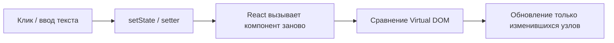

import FirstProgramPlay from '@site/src/components/FirstProgramPlay.jsx';

# React — компоненты-рецепты

<div class="article-tags">
  <span class="tag tag-notrequired">НЕ ОБЯЗАТЕЛЬНО</span>
  <span class="tag tag-beginner">ДЛЯ НОВИЧКОВ</span>
</div>

Приветствую! Здесь вы наверняка найдете, что ищете. Примеры в лаборатории рассчитаны на то, что мы разбираем что-то конкретное.

Текущая статья посвящена счётчик useState, todo list, форма, modal, fetch, Router. Готовый код для лабораторной, курсовой, react counter example и react todo app..

Поэтому за теорией по текущей теме вам — в [энциклопедию](/encyclopedia/intro).
Если ещё не погружались, то маршрут прост:

1. [Основы](/section/basics)
2. [Система и сеть](/section/system-network)
3. [Данные и разметка](/section/data-markup)
4. [Код и разработка](/section/code-dev)
5. [Языки](/section/languages)
6. [Искусственный интеллект](/section/ai)
7. [Проект](/section/project)
8. [Инфраструктура и безопасность](/section/infra-security)
9. [Спин-офф](/section/spinoff)

Обязательно пройдитесь.

А теперь приступим к нашему предмету.

<div class="callout callout--tip">
  <div class="callout-title">Теория и соседние материалы</div>

  <div class="callout-body">
  Обзор React — [библиотека для пользовательских интерфейсов](/encyclopedia/5-languages/5-01-javascript/27).

  Пошаговый старт — [Первая программа на React](/encyclopedia/5-languages/5-01-javascript/272).

  Справочник API — [271](/encyclopedia/5-languages/5-01-javascript/271).

  HTTP-запросы — [Fetch / axios](/lab/Примеры/1145) и [curl / fetch](/lab/Примеры/1133).

  Стили — [HTML + CSS — макеты](/lab/Примеры/110), [Tailwind — готовые блоки](/lab/Примеры/1117).

  Десктоп на Python — [Tkinter — окна и виджеты](/lab/Примеры/1124).

  Мобильный UI на Dart — [Flutter](/encyclopedia/5-languages/5-22-dart/311) и [Flutter — готовые виджеты](/lab/Примеры/1154).
</div>
</div>

---
1. Создайте проект **Vite + React** — команды в [каркасе](#karkas).
2. Скопируйте **весь** блок кода примера в `src/App.jsx` (или вынесите в `src/components/`).
3. Запустите `npm run dev`, откройте адрес из консоли (обычно `http://localhost:5173`).
4. Прочитайте **Разбор** и таблицу под кодом — там смысл строк и типичные ошибки.
5. Измените текст, цвета, начальные данные — так быстрее запоминается API.

---

## Навигация по примерам

| Раздел | Тема |
|--------|-----------------|
| [Каркас проекта](#karkas) | `vite react template`, `npm create vite react`, `react hello world` |
| [Счётчик](#counter) | `react usestate counter`, `react onclick button`, `increment counter react` |
| [Приветствие](#greeting) | `react controlled input`, `react onchange input`, `react form name` |
| [Переключатель](#toggle) | `react toggle button`, `react boolean usestate` |
| [Настройки](#settings) | `react checkbox example`, `react radio button`, `controlled checkbox react` |
| [Todo](#todo) | `react todo list`, `react map key`, `todo app react hooks` |
| [Конвертер](#converter) | `react number input`, `react calculator example`, `temperature converter react` |
| [Модальное окно](#modal) | `react modal component`, `react dialog popup`, `conditional render modal` |
| [Вкладки](#tabs) | `react tabs component`, `active tab state react` |
| [Поиск по списку](#search) | `react filter list`, `react search input filter array` |
| [Форма входа](#login) | `react login form`, `react form validation`, `react preventdefault submit` |
| [Загрузка и ошибка](#loading) | `react loading spinner`, `react conditional render loading` |
| [Список с API](#fetch-list) | `react fetch useeffect`, `react get data from api`, `react useeffect empty array` |
| [Подъём state](#lift) | `react lifting state up`, `react props callback parent` |
| [Свой хук](#custom-hook) | `react custom hook`, `uselocalstorage react hook` |
| [Тема Context](#context) | `react context example`, `react dark mode context` |
| [Router](#router) | `react router v6 example`, `react routes link`, `react spa navigation` |
| [Лендинг](#composition) | `react component composition`, `react landing page sections` |

---

## Словарь React за 30 секунд

| Понятие | Зачем | Как в коде |
|---------|-------|------------|
| **Компонент** | Кусок UI — функция, возвращающая JSX | `function App() &#123; return <div>…</div> &#125;` |
| **JSX** | «HTML внутри JavaScript» | `<button onClick={…}>Текст</button>` |
| **Props** | Входные данные от родителя | `function Btn(&#123; label, onClick &#125;)` |
| **State** | Данные, меняющиеся со временем | `const [n, setN] = useState(0)` |
| **Setter** | Записать новое значение state | `setN(n + 1)` или `setN((x) => x + 1)` |
| **Controlled input** | Поле подчинено state | `value=&#123;text&#125;` + `onChange={…}` |
| **key** | ID элемента в списке | `&#123;items.map((x) => <li key=&#123;x.id&#125;>…` |
| **useEffect** | Побочный эффект после рендера | `fetch`, таймер, `document.title` |
| **children** | Содержимое между тегами компонента | `<Modal>…текст…</Modal>` |

**Односторонний поток данных:** state хранит владелец (обычно родитель). Детям передают **props** и **колбэки** (`onSave`, `onClick`). Менять props внутри ребёнка нельзя — только вызвать переданную функцию.

---

## Как работает React — цикл обновления

Браузер **не перезагружает** всю страницу при каждом клике. React пересчитывает, что изменилось, и обновляет DOM точечно.



Пользователь нажал «+» → `setCount` → React снова вызвал `App` с новым `count` → на экране обновилась только цифра в заголовке.

---

<span id="karkas"></span>

### Обязательный каркас

Любой пример ниже опирается на проект **Vite + React**. Запомните команды — как `import tkinter` и `mainloop()` в [Tkinter](/lab/Примеры/1124).

**Задача:** поднять пустой React-проект и убедиться, что dev-сервер работает.

```bash
npm create vite@latest my-react-app -- --template react
cd my-react-app
npm install
npm run dev
```

| Команда | Что делает |
|---------|------------|
| `npm create vite@latest` | Скачивает шаблон проекта (быстрее старого create-react-app) |
| `npm install` | Ставит зависимости из `package.json` |
| `npm run dev` | Поднимает сервер; при сохранении файла страница обновляется |

Минимальный `src/App.jsx`:

```jsx
import './App.css';

export default function App() {
  return (
    <div className="app">
      <h1>Моё React-приложение</h1>
      {/* сюда вставляете код из примеров ниже */}
    </div>
  );
}
```

**Разбор:**

| Фрагмент | Смысл |
|----------|--------|
| `export default function App` | Корневой компонент — точка входа UI; Vite подключает его в `main.jsx` |
| `className="app"` | CSS-класс. В JSX пишут `className`, потому что `class` — зарезервированное слово в JavaScript |
| `return ( … )` | JSX — результат функции; React рисует это в DOM |
| `{/* … */}` | Комментарий внутри JSX |

**Типичные ошибки при старте:**

- Забыли `npm install` — команда `npm run dev` падает с «module not found».
- Редактируете не тот файл — рабочий код обычно в `src/App.jsx`, не в `index.html`.
- Порт занят — Vite предложит другой адрес в консоли, откройте его.

**Попробуйте:** добавьте `import &#123; useState &#125; from 'react'` и перейдите к [счётчику](#counter).

---

### Стартовые компоненты

Простые блоки «с нуля» — с них удобно начинать лабораторную или первый commit в GitHub.

<span id="counter"></span>

#### Счётчик

**Задача:** показать, что React хранит число в памяти и обновляет экран по клику — минимум для проверки установки. Классический **react counter example**.

```jsx
import { useState } from 'react';

export default function App() {
  const [count, setCount] = useState(0);

  return (
    <div className="app">
      <h1>Счётчик: {count}</h1>
      <button type="button" onClick={() => setCount(count - 1)}>−</button>
      <button type="button" onClick={() => setCount(0)}>Сброс</button>
      <button type="button" onClick={() => setCount(count + 1)}>+</button>
    </div>
  );
}
```

**Разбор:**

- `import &#123; useState &#125; from 'react'` — хук для локального state в функциональном компоненте.
- `useState(0)` создаёт пару: текущее значение `count` и функцию `setCount` для записи нового.
- `&#123;count&#125;` в JSX — **вставка JavaScript-выражения** в разметку; при изменении `count` React перерисует только этот текст.
- `onClick=&#123;() => setCount(count + 1)&#125;` — в обработчик передают **функцию**. Если написать `onClick=&#123;setCount(count + 1)&#125;`, setter вызовется **сразу при рендере** — типичная ошибка новичка.
- `type="button"` — кнопка внутри `<form>` случайно не отправит форму.

| Строка | Смысл |
|--------|--------|
| `useState(0)` | Начальное значение счётчика — ноль |
| `setCount(0)` | Явный сброс |
| `setCount((c) => c + 1)` | Безопаснее при частых кликах — берёт **предыдущее** значение |

**Попробуйте:** замените `setCount(count + 1)` на `setCount((c) => c + 1)`. Добавьте `useEffect`, меняющий `document.title` — см. [272](/encyclopedia/5-languages/5-01-javascript/272).

---

<span id="greeting"></span>

#### Поле имени и приветствие

**Задача:** прочитать текст из поля и показать результат на экране — типичная форма «введите имя». Основа **controlled input** в React.

```jsx
import { useState } from 'react';

export default function App() {
  const [name, setName] = useState('');

  return (
    <div className="app">
      <label>
        Ваше имя:
        <input
          type="text"
          value={name}
          placeholder="Анна"
          onChange={(e) => setName(e.target.value)}
        />
      </label>
      {name.trim() && <h2>Привет, {name.trim()}!</h2>}
    </div>
  );
}
```

**Разбор:**

- `value=&#123;name&#125;` делает input **контролируемым**: на экране только то, что лежит в state React.
- `onChange=&#123;(e) => setName(e.target.value)&#125;` — при каждом символе читаем текст из DOM (`e.target.value`) и кладём в state.
- `&#123;name.trim() && <h2>…&#125;` — **условный рендеринг**: блок `<h2>` рисуется, только если после `trim()` имя не пустое.
- `trim()` убирает пробелы по краям — иначе один пробел уже покажет «Привет».

| Без state | С state (React) |
|-----------|-----------------|
| Браузер сам хранит текст в `<input>` | React хранит текст в `name`, input его отображает |
| Читают через `ref` или DOM | Читают через `name` в коде — удобно для валидации и отправки |

**Попробуйте:** кнопка «Очистить» — `onClick=&#123;() => setName('')&#125;`. Поле «Фамилия» — второй `useState`.

---

<span id="toggle"></span>

#### Переключатель вкл/выкл

**Задача:** boolean state и смена подписи по клику — основа переключателей, «лайков», видимости блоков.

```jsx
import { useState } from 'react';

export default function App() {
  const [on, setOn] = useState(false);

  return (
    <div className="app">
      <p>Статус: {on ? 'включено' : 'выключено'}</p>
      <button type="button" onClick={() => setOn((v) => !v)}>
        {on ? 'Выключить' : 'Включить'}
      </button>
    </div>
  );
}
```

**Разбор:**

- `useState(false)` — начальное значение «выключено».
- `setOn((v) => !v)` переключает boolean от **предыдущего** значения — надёжнее, чем `setOn(!on)` при сложной логике.
- Тернарный оператор `on ? '…' : '…'` в JSX выбирает текст кнопки и статуса.

**Попробуйте:** добавьте `className=&#123;on ? 'active' : ''&#125;` на контейнер и стиль в `App.css`.

---

<span id="settings"></span>

#### Флажки и переключатели роли

**Задача:** несколько настроек «вкл/выкл» и выбор одного варианта из списка (роль, режим, тариф).

```jsx
import { useState } from 'react';

export default function App() {
  const [notify, setNotify] = useState(true);
  const [sound, setSound] = useState(false);
  const [role, setRole] = useState('user');

  const enabled = [
    notify && 'уведомления',
    sound && 'звук',
  ].filter(Boolean);

  return (
    <div className="app">
      <label>
        <input
          type="checkbox"
          checked={notify}
          onChange={(e) => setNotify(e.target.checked)}
        />
        Уведомления
      </label>
      <label>
        <input
          type="checkbox"
          checked={sound}
          onChange={(e) => setSound(e.target.checked)}
        />
        Звук
      </label>

      <p>Роль:</p>
      <label>
        <input
          type="radio"
          name="role"
          checked={role === 'user'}
          onChange={() => setRole('user')}
        />
        Пользователь
      </label>
      <label>
        <input
          type="radio"
          name="role"
          value="admin"
          checked={role === 'admin'}
          onChange={() => setRole('admin')}
        />
        Администратор
      </label>

      <p className="hint">
        Роль: {role}; включено: {enabled.length ? enabled.join(', ') : 'ничего'}
      </p>
    </div>
  );
}
```

**Разбор:**

- `checked=&#123;notify&#125;` + `onChange` с `e.target.checked` — контролируемый **checkbox** (галочка синхронизирована со state).
- У **radio** одно имя `name="role"`, разные `value`; в state хранится выбранная строка `'user'` или `'admin'`.
- `.filter(Boolean)` убирает `false` из массива — остаются только включённые опции для строки статуса.

**Попробуйте:** добавьте третий checkbox «Тёмная тема» и выводите его в `enabled`.

---

## Компоненты-рецепты

Типовые блоки интерфейса для лабораторных, портфолио и pet-проектов. Каждый можно вынести в `src/components/Имя.jsx`.

<span id="todo"></span>

#### Todo-список с фильтром

**Задача:** добавление задач, отметка «готово», фильтр «все / активные / выполненные» — **react todo list**, классика для GitHub-портфолио.

```jsx
import { useState } from 'react';

const FILTERS = ['all', 'active', 'done'];

export default function App() {
  const [text, setText] = useState('');
  const [filter, setFilter] = useState('all');
  const [items, setItems] = useState([
    { id: 1, title: 'Изучить JSX', done: false },
    { id: 2, title: 'Собрать Todo', done: true },
  ]);

  function addItem(e) {
    e.preventDefault();
    const title = text.trim();
    if (!title) return;
    setItems((prev) => [
      ..prev,
      { id: Date.now title, done: false },
    ]);
    setText('');
  }

  function toggle(id) {
    setItems((prev) =>
      prev.map((item) =>
        item.id === id ? { ..item, done: !item.done } : item
      )
    );
  }

  const visible = items.filter((item) => {
    if (filter === 'active') return !item.done;
    if (filter === 'done') return item.done;
    return true;
  });

  return (
    <div className="app">
      <h1>Задачи</h1>
      <form onSubmit={addItem}>
        <input
          value={text}
          onChange={(e) => setText(e.target.value)}
          placeholder="Новая задача"
        />
        <button type="submit">Добавить</button>
      </form>

      <div className="filters">
        {FILTERS.map((f) => (
          <button
            key={f}
            type="button"
            className={filter === f ? 'active' : ''}
            onClick={() => setFilter(f)}
          >
            {f === 'all' ? 'Все' : f === 'active' ? 'Активные' : 'Готово'}
          </button>
        ))}
      </div>

      <ul>
        {visible.map((item) => (
          <li key={item.id}>
            <label>
              <input
                type="checkbox"
                checked={item.done}
                onChange={() => toggle(item.id)}
              />
              <span className={item.done ? 'done' : ''}>{item.title}</span>
            </label>
          </li>
        ))}
      </ul>
      {visible.length === 0 && <p>Список пуст для выбранного фильтра</p>}
    </div>
  );
}
```

**Разбор:**

| Строка / конструкция | Смысл |
|----------------------|--------|
| `e.preventDefault()` | Форма **не перезагружает** страницу при Enter или клике «Добавить» |
| `setItems((prev) => [..prev, newItem])` | **Новый массив** — React видит изменение. `prev.push(x)` сломает обновление |
| `&#123; ..item, done: !item.done &#125;` | Копия объекта с одним изменённым полем — без мутации |
| `key=&#123;item.id&#125;` | Стабильный ключ для `.map()`. React сопоставляет строки между рендерами |
| `Date.now()` как `id` | Подходит для учебного проекта; в проде — id с сервера |

- `filter` в state и `.filter()` на массиве — **два разных «filter»**: первый — режим UI, второй — метод массива.
- `className=&#123;item.done ? 'done' : ''&#125;` — зачёркивание через CSS (`.done &#123; text-decoration: line-through; &#125;`).

**Попробуйте:** кнопка «Удалить выполненные» — `setItems(items.filter((x) => !x.done))`. Счётчик «Осталось: N» — `items.filter((x) => !x.done).length`.

---

<span id="converter"></span>

#### Конвертер °C → °F

**Задача:** ввод числа, формула, вывод результата — частое задание на информатике (аналог [конвертера в Tkinter](/lab/Примеры/1124)).

```jsx
import { useState } from 'react';

export default function App() {
  const [raw, setRaw] = useState('');
  const [error, setError] = useState('');
  const [result, setResult] = useState('—');

  function convert() {
    const normalized = raw.trimreplace(',', '.');
    const celsius = Number(normalized);
    if (Number.isNaN(celsius)) {
      setError('Введите число, например 25');
      setResult('—');
      return;
    }
    setError('');
    const fahrenheit = celsius * 9 / 5 + 32;
    setResult(`${celsius.toFixed(1)} °C = ${fahrenheit.toFixed(1)} °F`);
  }

  return (
    <div className="app">
      <h1>Конвертер температуры</h1>
      <label>
        Температура (°C):
        <input
          value={raw}
          onChange={(e) => setRaw(e.target.value)}
          onKeyDown={(e) => e.key === 'Enter' && convert()}
        />
      </label>
      <button type="button" onClick={convert}>Перевести</button>
      {error && <p className="error">{error}</p>}
      <p>{result}</p>
    </div>
  );
}
```

**Разбор:**

- `replace(',', '.')` — пользователь может ввести `25,5` с русской раскладкой.
- `Number.isNaN(celsius)` — проверка после преобразования; пустая строка даст `NaN`.
- Формула: $F = C \times \frac&#123;9&#125;&#123;5&#125; + 32$.
- `onKeyDown` + `Enter` — перевод по Enter без отдельной кнопки (удобно на формах).

**Попробуйте:** кнопка «Очистить» — `setRaw('')`, `setResult('—')`, `setError('')`.

---

<span id="modal"></span>

#### Модальное окно

**Задача:** показать диалог поверх страницы без библиотек — **react modal component** с нуля.

```jsx
import { useState } from 'react';

function Modal({ open, title, children, onClose }) {
  if (!open) return null;

  return (
    <div className="modal-backdrop" onClick={onClose}>
      <div
        className="modal"
        role="dialog"
        aria-modal="true"
        onClick={(e) => e.stopPropagation()}
      >
        <header>
          <h2>{title}</h2>
          <button type="button" aria-label="Закрыть" onClick={onClose}>×</button>
        </header>
        <div className="modal-body">{children}</div>
      </div>
    </div>
  );
}

export default function App() {
  const [open, setOpen] = useState(false);

  return (
    <div className="app">
      <button type="button" onClick={() => setOpen(true)}>Открыть окно</button>
      <Modal open={open} title="Подтверждение" onClose={() => setOpen(false)}>
        <p>Вы уверены, что хотите продолжить?</p>
        <button type="button" onClick={() => setOpen(false)}>OK</button>
      </Modal>
    </div>
  );
}
```

**Разбор:**

- `if (!open) return null` — компонент **вообще не рисуется**, когда диалог закрыт (экономия DOM).
- `Modal` получает данные через **props**: `open`, `title`, `onClose`, `children`.
- `onClick=&#123;onClose&#125;` на backdrop — клик по затемнению закрывает окно.
- `e.stopPropagation()` на `.modal` — клик **внутри** окна не «пробивает» на backdrop.
- `role="dialog"` и `aria-modal` — базовая доступность для скринридеров.

Минимальные стили в `App.css`:

```css
.modal-backdrop {
  position: fixed;
  inset: 0;
  background: rgb(0 0 0 / 45%);
  display: grid;
  place-items: center;
  z-index: 1000;
}
.modal {
  background: #fff;
  padding: 1rem 1.25rem;
  border-radius: 8px;
  min-width: 280px;
  box-shadow: 0 8px 32px rgb(0 0 0 / 20%);
}
```

**Попробуйте:** второе модальное окно «Ошибка» с другим `title` и тем же компонентом `Modal`.

---

<span id="tabs"></span>

#### Вкладки

**Задача:** переключение блоков контента без перезагрузки — аналог вкладок в браузере или настройках приложения.

```jsx
import { useState } from 'react';

const TABS = [
  { id: 'home', label: 'Главная', body: 'Добро пожаловать на сайт.' },
  { id: 'about', label: 'О нас', body: 'Мы учим React на практике.' },
  { id: 'contact', label: 'Контакты', body: 'hello@example.com' },
];

export default function App() {
  const [active, setActive] = useState('home');
  const current = TABS.find((t) => t.id === active);

  return (
    <div className="app">
      <div className="tabs" role="tablist">
        {TABS.map((tab) => (
          <button
            key={tab.id}
            type="button"
            role="tab"
            aria-selected={active === tab.id}
            className={active === tab.id ? 'active' : ''}
            onClick={() => setActive(tab.id)}
          >
            {tab.label}
          </button>
        ))}
      </div>
      <div role="tabpanel">{current?.body}</div>
    </div>
  );
}
```

**Разбор:**

- Массив `TABS` хранит id, подпись кнопки и текст вкладки — удобно расширять без копипасты JSX.
- `active` — id текущей вкладки; один state управляет и кнопками, и содержимым.
- `TABS.find((t) => t.id === active)` — объект текущей вкладки для вывода `body`.
- `current?.body` — optional chaining: если id не найден, ошибки нет.
- `aria-selected` — подсказка assistive tech, какая вкладка активна.

**Попробуйте:** добавьте четвёртую вкладку с JSX вместо строки — например, `<ul><li>Пункт</li></ul>` в поле `body` (тогда `body` станет React-узлом, не строкой).

---

<span id="search"></span>

#### Поиск по списку

**Задача:** фильтрация массива по подстроке в реальном времени — основа поиска в таблицах, каталогах, автодополнении.

```jsx
import { useState } from 'react';

const CITIES = [
  'Москва', 'Санкт-Петербург', 'Казань', 'Новосибирск', 'Екатеринбург',
];

export default function App() {
  const [query, setQuery] = useState('');
  const q = query.trimtoLowerCase();
  const filtered = q
    ? CITIES.filter((city) => city.toLowerCaseincludes(q))
    : CITIES;

  return (
    <div className="app">
      <input
        type="search"
        placeholder="Город…"
        value={query}
        onChange={(e) => setQuery(e.target.value)}
      />
      <ul>
        {filtered.map((city) => (
          <li key={city}>{city}</li>
        ))}
      </ul>
      {filtered.length === 0 && <p>Ничего не найдено</p>}
    </div>
  );
}
```

**Разбор:**

- `toLowerCase()` на обеих сторонах — поиск без учёта регистра (`моск` найдёт «Москва»).
- `.includes(q)` — подстрока где угодно в названии.
- Пустой `query` — показываем весь список `CITIES`.
- `key=&#123;city&#125;` допустим, потому что названия **уникальны**; при дубликатах нужен отдельный `id`.

**Попробуйте:** подсветка совпадения через `<mark>`. Для длинных списков — `useMemo` (см. [справочник](/encyclopedia/5-languages/5-01-javascript/271)).

---

<span id="login"></span>

#### Форма входа с проверкой

**Задача:** email, пароль, сообщения об ошибках — типичный экран **react login form** для учебного проекта.

```jsx
import { useState } from 'react';

function validate(email, password) {
  const errors = {};
  if (!email.includes('@')) errors.email = 'Нужен символ @';
  if (password.length < 6) errors.password = 'Минимум 6 символов';
  return errors;
}

export default function App() {
  const [email, setEmail] = useState('');
  const [password, setPassword] = useState('');
  const [errors, setErrors] = useState({});
  const [ok, setOk] = useState('');

  function onSubmit(e) {
    e.preventDefault();
    const next = validate(email, password);
    setErrors(next);
    setOk('');
    if (Object.keys(next).length === 0) {
      setOk(`Вход выполнен для ${email}`);
    }
  }

  return (
    <div className="app">
      <h1>Вход</h1>
      <form onSubmit={onSubmit} noValidate>
        <label>
          Email
          <input
            type="email"
            value={email}
            onChange={(e) => setEmail(e.target.value)}
          />
          {errors.email && <span className="error">{errors.email}</span>}
        </label>
        <label>
          Пароль
          <input
            type="password"
            value={password}
            onChange={(e) => setPassword(e.target.value)}
          />
          {errors.password && <span className="error">{errors.password}</span>}
        </label>
        <button type="submit">Войти</button>
      </form>
      {ok && <p className="success">{ok}</p>}
    </div>
  );
}
```

**Разбор:**

| Часть | Смысл |
|-------|--------|
| `onSubmit=&#123;onSubmit&#125;` | Отправка формы перехватывается JavaScript |
| `e.preventDefault()` | Страница **не перезагружается** (иначе state пропадёт) |
| `noValidate` | Отключаем встроенную HTML-валидацию — показываем свои сообщения |
| Объект `errors` | Ключ = поле, значение = текст ошибки; пустой объект = всё OK |
| `type="password"` | Символы скрыты; в учебном примере пароль только в state, без отправки на сервер |

**Попробуйте:** блокировать кнопку «Войти», пока поля пустые — `disabled=&#123;!email || !password&#125;`.

---

<span id="loading"></span>

#### Загрузка, ошибка, пустой список

**Задача:** три состояния UI при асинхронной работе — **loading**, **error**, **data**. Шаблон для любого `fetch`.

```jsx
import { useEffect, useState } from 'react';

export default function App() {
  const [status, setStatus] = useState('loading'); // loading | ok | error
  const [data, setData] = useState([]);

  useEffect(() => {
    const timer = setTimeout(() => {
      if (Math.random() > 0.2) {
        setData(['Альфа', 'Бета', 'Гамма']);
        setStatus('ok');
      } else {
        setStatus('error');
      }
    }, 800);
    return () => clearTimeout(timer);
  }, []);

  if (status === 'loading') return <p>Загрузка…</p>;
  if (status === 'error') return <p className="error">Не удалось загрузить данные</p>;
  if (!data.length) return <p>Список пуст</p>;

  return (
    <ul>
      {data.map((item) => (
        <li key={item}>{item}</li>
      ))}
    </ul>
  );
}
```

**Разбор:**

- Ранний `return` для каждого состояния — читаемый **условный рендеринг** без вложенных тернарников.
- `useEffect(.., [])` — эффект **один раз** после первого появления компонента на экране.
- `return () => clearTimeout(timer)` — **cleanup**: если компонент исчезнет до срабатывания таймера, таймер отменится (нет утечки).
- В реальном проекте вместо `setTimeout` — `fetch`; логика состояний та же.

**Попробуйте:** замените таймер на `fetch('https://jsonplaceholder.typicode.com/users')` и `.then((r) => r.json())`.

---

<span id="fetch-list"></span>

#### Список заметок с API

**Задача:** загрузить JSON с сервера и отрисовать список — связка **`useEffect` + `fetch`**, как в [272](/encyclopedia/5-languages/5-01-javascript/272).

```jsx
import { useEffect, useState } from 'react';

export default function NotesList() {
  const [notes, setNotes] = useState([]);
  const [error, setError] = useState('');
  const [loading, setLoading] = useState(true);

  useEffect(() => {
    fetch('http://127.0.0.1:3000/notes')
      .then((res) => {
        if (!res.ok) throw new Error(`HTTP ${res.status}`);
        return res.json();
      })
      .then(setNotes)
      .catch((e) => setError(e.message))
      .finally(() => setLoading(false));
  }, []);

  if (loading) return <p>Загрузка…</p>;
  if (error) return <p className="error">Ошибка: {error}</p>;
  if (!notes.length) return <p>Заметок пока нет</p>;

  return (
    <ul>
      {notes.map((n) => (
        <li key={n.id}>{n.text}</li>
      ))}
    </ul>
  );
}
```

**Разбор:**

| Строка | Смысл |
|--------|--------|
| `useState([])` | Пока данных нет — пустой массив |
| `useEffect(.., [])` | Запрос **один раз** при монтировании; без `[]` — бесконечные запросы |
| `if (!res.ok)` | HTTP 404/500 — ошибка до парсинга JSON |
| `.then(setNotes)` | `setNotes` получит готовый массив из `.json()` |
| `.finally(() => setLoading(false))` | Спиннер скрывается и при успехе, и при ошибке |
| `key=&#123;n.id&#125;` | Стабильный ключ из данных API |

Подключите в `App.jsx`: `<NotesList />` под другими блоками.

CORS и прокси Vite — [264](/encyclopedia/5-languages/5-01-javascript/264). Node API — [262](/encyclopedia/5-languages/5-01-javascript/262). Готовые шаблоны `fetch` — [1145](/lab/Примеры/1145).

**Попробуйте:** POST-заметку через `fetch` с `method: 'POST'` и `JSON.stringify(&#123; text &#125;)`.

---

<span id="lift"></span>

#### Подъём state — переиспользуемый Counter

**Задача:** вынести кнопки в отдельный компонент, а число хранить в родителе — паттерн **lifting state up**.

`src/components/Counter.jsx`:

```jsx
export function Counter({ value, onIncrement, onDecrement, onReset }) {
  return (
    <section className="counter">
      <h2>Счётчик: {value}</h2>
      <button type="button" onClick={onDecrement}>−</button>
      <button type="button" onClick={onReset}>Сброс</button>
      <button type="button" onClick={onIncrement}>+</button>
    </section>
  );
}
```

`src/App.jsx`:

```jsx
import { useState } from 'react';
import { Counter } from './components/Counter';

export default function App() {
  const [count, setCount] = useState(0);

  return (
    <Counter
      value={count}
      onIncrement={() => setCount((c) => c + 1)}
      onDecrement={() => setCount((c) => c - 1)}
      onReset={() => setCount(0)}
    />
  );
}
```

**Разбор:**

- `Counter` **не** вызывает `useState` — только отображает props и вызывает колбэки.
- Родитель **владеет** `count` — один источник правды для всего дерева.
- `value=&#123;count&#125;` — данные **вниз** (props).
- `onIncrement={() => …}` — события **вверх** (колбэки).
- Так один state можно разделить между несколькими детьми (например, счётчик и график).

**Попробуйте:** второй `Counter` с тем же `count` — оба синхронизированы автоматически.

---

<span id="custom-hook"></span>

#### Свой хук `useLocalStorage`

**Задача:** сохранить значение между перезагрузками вкладки (F5) — типичный **custom hook**.

`src/hooks/useLocalStorage.js`:

```jsx
import { useEffect, useState } from 'react';

export function useLocalStorage(key, initial) {
  const [value, setValue] = useState(() => {
    try {
      const raw = localStorage.getItem(key);
      return raw !== null ? JSON.parse(raw) : initial;
    } catch {
      return initial;
    }
  });

  useEffect(() => {
    localStorage.setItem(key, JSON.stringify(value));
  }, [key, value]);

  return [value, setValue];
}
```

Использование в `App.jsx`:

```jsx
import { useLocalStorage } from './hooks/useLocalStorage';

export default function App() {
  const [name, setName] = useLocalStorage('username', '');

  return (
    <input
      value={name}
      onChange={(e) => setName(e.target.value)}
      placeholder="Имя сохранится после F5"
    />
  );
}
```

**Разбор:**

- Имя хука **обязательно** начинается с `use` — правило React для хуков.
- `useState(() => …)` — **ленивая инициализация**: чтение `localStorage` один раз при первом рендере.
- `useEffect` записывает в storage при каждом изменении `value`.
- `JSON.stringify` / `parse` — работает со строками и числами; для сложных объектов следите за форматом.
- `try/catch` — если в storage мусор, вернётся `initial`.

**Попробуйте:** сохранить тему `'light' | 'dark'` тем же хуком.

---

<span id="context"></span>

#### Тёмная тема через Context

**Задача:** передать настройку темы глубоко в дерево **без** «проброса» props через каждый уровень.

`src/theme/ThemeContext.jsx`:

```jsx
import { createContext, useContext, useMemo, useState } from 'react';

const ThemeContext = createContext(null);

export function ThemeProvider({ children }) {
  const [theme, setTheme] = useState('light');
  const value = useMemo(
    () => ({
      theme,
      toggle: () => setTheme((t) => (t === 'light' ? 'dark' : 'light')),
    }),
    [theme]
  );
  return (
    <ThemeContext.Provider value={value}>
      <div className={`app theme-${theme}`}>{children}</div>
    </ThemeContext.Provider>
  );
}

export function useTheme() {
  const ctx = useContext(ThemeContext);
  if (!ctx) throw new Error('useTheme вызывают вне ThemeProvider');
  return ctx;
}
```

`src/App.jsx`:

```jsx
import { ThemeProvider, useTheme } from './theme/ThemeContext';

function Toolbar() {
  const { theme, toggle } = useTheme();
  return (
    <button type="button" onClick={toggle}>
      Тема: {theme}
    </button>
  );
}

export default function App() {
  return (
    <ThemeProvider>
      <Toolbar />
      <main>Контент страницы</main>
    </ThemeProvider>
  );
}
```

**Разбор:**

- `createContext` — «канал» для данных.
- `Provider value={…}` — все потомки могут прочитать value через `useContext`.
- `useMemo` для объекта `value` — меньше лишних перерисовок дочерних компонентов.
- шаблон `className` с префиксом `theme-` — переключение CSS-класса на корне (класс `.theme-dark` задаёт фон и цвет текста).

**Попробуйте:** обернуть только часть страницы — увидите, что `useTheme` снаружи `Provider` выбросит ошибку.

---

<span id="router"></span>

#### React Router — минимальная навигация

**Задача:** несколько «страниц» в одностраничном приложении (SPA) без полной перезагрузки документа.

```bash
npm install react-router-dom
```

```jsx
import { BrowserRouter, Link, NavLink, Route, Routes } from 'react-router-dom';

function Home() {
  return <h1>Главная</h1>;
}

function About() {
  return <h1>О проекте</h1>;
}

function NotFound() {
  return <h1>404 — страница не найдена</h1>;
}

export default function App() {
  return (
    <BrowserRouter>
      <nav>
        <Link to="/">Главная</Link>
        {' · '}
        <NavLink to="/about">О нас</NavLink>
      </nav>
      <Routes>
        <Route path="/" element={<Home />} />
        <Route path="/about" element={<About />} />
        <Route path="*" element={<NotFound />} />
      </Routes>
    </BrowserRouter>
  );
}
```

**Разбор:**

| Элемент | Назначение |
|---------|------------|
| `BrowserRouter` | Связывает URL в адресной строке с деревом React |
| `Link to="/about"` | Переход **без** перезагрузки HTML-документа |
| `NavLink` | Как `Link`, плюс класс `active` для текущего маршрута |
| `Routes` / `Route` | Какой компонент показать при каком `path` |
| `path="*"` | Fallback — страница 404 для неизвестных адресов |

Подробнее — [272 — Router](/encyclopedia/5-languages/5-01-javascript/272#react-router-v6--минимум). Для SEO и серверного HTML — [Next.js](/encyclopedia/5-languages/5-01-javascript/2731).

**Попробуйте:** маршрут `/users/:id` и `useParams()` в компоненте профиля.

---

<span id="composition"></span>

#### Лендинг из секций

**Задача:** показать архитектуру страницы — каждый блок в своём файле, `App` только собирает порядок.

```jsx
import { Header } from './components/layout/Header';
import { Footer } from './components/layout/Footer';
import { Hero } from './components/sections/Hero';
import { Features } from './components/sections/Features';
import { Faq } from './components/sections/Faq';

export default function App() {
  return (
    <>
      <Header />
      <main>
        <Hero />
        <Features />
        <Faq />
      </main>
      <Footer />
    </>
  );
}
```

**Разбор:**

- Фрагмент `<>…</>` группирует несколько корневых узлов **без** лишнего `<div>`.
- `App` — **компоновщик**: задаёт layout и порядок секций.
- Каждая секция — отдельный файл → параллельная работа в команде, удобнее сопровождать код.
- HTML-разметку секций можно взять из [HTML + CSS — макеты](/lab/Примеры/110) или [Tailwind — готовые блоки](/lab/Примеры/1117) и перенести в JSX (заменить `class` на `className`, закрыть все теги).

**Попробуйте:** вынесите `Hero` в отдельный файл с props `title` и `subtitle`.

---

## Переиспользуемые базы

### Шаблон компонента с props по умолчанию

```jsx
export function Card({ title = 'Без названия', children }) {
  return (
    <article className="card">
      <h3>{title}</h3>
      <div>{children}</div>
    </article>
  );
}
```

**Разбор:** `title = '…'` в деструктуризации — значение по умолчанию, если prop не передали. `children` — всё между `<Card>…</Card>`.

---

### Сброс формы

```jsx
function resetForm(setEmail, setPassword, setErrors) {
  setEmail('');
  setPassword('');
  setErrors({});
}
```

Вызывайте после успешной отправки или по кнопке «Очистить».

---

## Частые ошибки

| Симптом | Причина | Что сделать |
|---------|---------|-------------|
| `Too many re-renders` | `setCount(1)` или `setCount(count+1)` в **теле** компонента | Setter только в обработчике или `useEffect` |
| Кнопка срабатывает при загрузке | `onClick=&#123;handle()&#125;` со скобками | `onClick=&#123;handle&#125;` или `onClick=&#123;() => handle()&#125;` |
| Input «не печатает» | Есть `value`, нет `onChange` | Добавить controlled-пару |
| Список «ломается» при удалении | `key=&#123;index&#125;` | Стабильный `id` из данных |
| Бесконечный `useEffect` | Объект/массив в deps создаётся заново каждый рендер | Уточнить deps или `useMemo` |
| `fetch` failed / CORS | API выключен или нет заголовков CORS | [264](/encyclopedia/5-languages/5-01-javascript/264), прокси в Vite |
| State «не обновился» | Мутация: `arr.push(x)`, `obj.field = 1` | Новая ссылка: `[..arr, x]`, `&#123; ..obj, field: 1 &#125;` |
| Белый экран после правки | Синтаксическая ошибка JSX | Смотрите красный текст в терминале `npm run dev` |

Полный список — [справочник React](/encyclopedia/5-languages/5-01-javascript/271#типичные-ошибки).

---

## Что попробовать дальше

| Уровень | Задание | Материал |
|---------|---------|----------|
| Начальный | Todo с удалением и фильтром «активные» | блок [Todo](#todo) |
| Начальный | Заметки с POST и DELETE | [272 — задание «Заметки»](/encyclopedia/5-languages/5-01-javascript/272) |
| Начальный | Калькулятор на несколько кнопок | [счётчик](#counter) + несколько `useState` |
| Средний | Погода или поиск фильмов по API | `useEffect` + [1145](/lab/Примеры/1145) |
| Средний | Десктоп на Electron | [118](/encyclopedia/4-code-dev/4-11-desktopnye-prilozheniya/118) |
| Средний | TypeScript + типы props | [30 — TypeScript и React](/encyclopedia/5-languages/5-01-javascript/30) |
| Экзамен | 200 вопросов для самопроверки | [133](/lab/Вопросы/133) |

---

## Связанные материалы

- [React — обзор](/encyclopedia/5-languages/5-01-javascript/27) — карта тем и Virtual DOM
- [Первая программа на React](/encyclopedia/5-languages/5-01-javascript/272) — Vite, хуки, Router, задание «Заметки»
- [Справочник по React](/encyclopedia/5-languages/5-01-javascript/271) — API, HOC, тесты
- [Fetch / axios — типовые запросы](/lab/Примеры/1145) — шаблоны HTTP рядом с React
- [Vue и Svelte — готовые компоненты](/lab/Примеры/1147) — те же задачи на Vue/Svelte
- [200 вопросов по React](/lab/Вопросы/133) — самопроверка перед зачётом
- [Tkinter — окна и виджеты](/lab/Примеры/1124) — те же задачи на Python
- [Java Swing — окна и кнопки](/lab/Примеры/1143) — те же задачи на Java
- [HTML + CSS — готовые макеты](/lab/Примеры/110) — вёрстка секций для лендинга
- [Tailwind — готовые блоки](/lab/Примеры/1117) — hero, pricing, navbar на utility-классах
