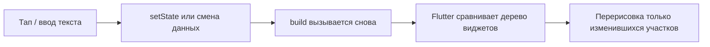

# Flutter — готовые виджеты

<div class="article-tags">
  <span class="tag tag-notrequired">НЕ ОБЯЗАТЕЛЬНО</span>
  <span class="tag tag-beginner">ДЛЯ НОВИЧКОВ</span>
</div>

Готовые **экраны Flutter на Dart** с разбором **каждой важной строки**: скопировали `lib/main.dart` → `flutter run` → на эмуляторе или телефоне уже работает кнопка, форма или список. Подойдёт, если вы ищете «flutter counter example», «flutter textfield example», «flutter todo list», «как сделать кнопку во flutter», «statefulwidget setstate» или сдаёте **лабораторную** / **курсовую** по мобильной разработке.

Стиль галереи — как в [Turtle на Python](/lab/Примеры/111) и [Tkinter — окна и виджеты](/lab/Примеры/1124): **код целиком**, таблица «строка → смысл», типичные ошибки и блок «попробуйте сами».

---

## Основы UI во Flutter

**Flutter** — фреймворк Google для приложений на Android, iOS, Windows, macOS, Linux и веб. Интерфейс собирают из **виджетов** — классов Dart, которые описывают, **что** рисовать на экране. Язык — **Dart**; без базового синтаксиса Dart начните с [первой программы](/encyclopedia/5-languages/5-22-dart/7).

<div class="callout callout--tip">
  <div class="callout-title">С чего начать</div>

  <div class="callout-body">
  Теория фреймворка — <a href="/encyclopedia/5-languages/5-22-dart/311">Flutter</a>. Мобильный контекст — <a href="/encyclopedia/4-code-dev/4-12-mobilnye-prilozheniya/intro">мобильные приложения</a>. Десктоп на Python — <a href="/lab/Примеры/1124">Tkinter</a>, на Java — <a href="/lab/Примеры/1143">Swing</a>, в браузере — <a href="/lab/Примеры/1146">React</a> и <a href="/lab/Примеры/1147">Vue / Svelte</a>. HTTP — <a href="/lab/Примеры/1145">Fetch / axios</a>.
</div>
</div>

### Частые запросы в Google — куда смотреть

| Ищут в интернете | Раздел ниже |
|------------------|-------------|
| flutter hello world / первое приложение | [Hello Flutter](#hello) |
| flutter counter example setstate | [Счётчик](#counter) |
| flutter elevatedbutton onclick | [Кнопка и SnackBar](#button) |
| flutter textfield controller example | [Поле ввода и приветствие](#greeting) |
| flutter temperature converter | [Конвертер °C → °F](#converter) |
| flutter checkbox switch radiolisttile | [Переключатели](#settings) |
| flutter todo list listview builder | [Список задач](#todo) |
| flutter slider example | [Ползунок](#slider) |
| flutter login form textformfield | [Форма входа](#login) |
| flutter drawer menu example | [Боковое меню](#drawer) |
| flutter navigator push pop | [Второй экран](#navigation) |
| flutter tabbar tabbarview | [Вкладки](#tabs) |
| flutter alertdialog showdialog | [Диалог](#dialog) |
| flutter http get futurebuilder | [Загрузка с API](#fetch) |
| flutter create project run | [Обязательный каркас](#karkas) |
| renderflex overflowed / setstate after dispose | [Частые ошибки](#errors) |

---

<div class="callout callout--info">
  <div class="callout-title">Кому подойдёт эта страница</div>

  <div class="callout-body">
  <strong>Школьникам</strong> — pet-проект «моё приложение», кружок робототехники с экраном на телефоне.<br />
  <strong>Студентам</strong> — лабораторная «UI на Flutter», сравнение с <a href="/lab/Примеры/1124">Tkinter</a> или <a href="/lab/Примеры/1146">React</a> в отчёте.<br />
  <strong>Самоучкам</strong> — скопировали <code>main.dart</code> → <code>flutter run</code> → разобрали таблицу под кодом. Ищете «как сделать счётчик на flutter» — ниже код и объяснение, <strong>зачем</strong> каждая строка.
</div>
</div>

---

### Как запустить пример за 2 минуты

1. Установите [Flutter SDK](https://docs.flutter.dev/get-started/install). В терминале: `flutter doctor` — исправьте красные пункты (Android Studio / Xcode для мобильных платформ).
2. `flutter create my_app && cd my_app`
3. Откройте **`lib/main.dart`**, удалите шаблонный код, вставьте пример **целиком** (от `import` до последней `}`).
4. Запустите эмулятор или подключите телефон с USB-отладкой.
5. `flutter run` — через минуту приложение на устройстве.
6. Меняете код и жмёте **Hot Reload** (`r` в терминале) — экран обновится без полного перезапуска.

| Где | Плюсы |
|-----|-------|
| Эмулятор Android / симулятор iOS | Как на реальном телефоне |
| `flutter run -d chrome` | Быстрая проверка без эмулятора (веб) |
| VS Code / Android Studio | Кнопка Run, подсветка ошибок |

В браузере на сайте, как [симулятор Turtle](/lab/Примеры/111), Flutter **не запускается** — нужен компьютер с SDK.

---

### Базовые термины

| Термин | Простыми словами |
|--------|------------------|
| **Виджет** | Любой элемент UI — кнопка, текст, отступ, весь экран |
| **StatelessWidget** | Экран или блок **без** своей памяти; картинка не меняется сама |
| **StatefulWidget** | Блок с **state** — число счётчика, текст в поле, список задач |
| **setState()** | «Данные изменились — перерисуй экран» |
| **build()** | Метод, который **описывает**, как выглядит UI прямо сейчас |
| **Scaffold** | Каркас экрана: AppBar, body, кнопка FAB, drawer |
| **MaterialApp** | Корень приложения, тема, заголовок |
| **Hot Reload** | Правка кода → экран обновился за секунду, state часто сохраняется |
| **pubspec.yaml** | Файл зависимостей (как `package.json` у Node) |

---

### Flutter, Tkinter и React — одна идея, разный синтаксис

| Задача | Tkinter (Python) | React (браузер) | Flutter (Dart) |
|--------|------------------|-----------------|----------------|
| Окно / корень | `tk.Tk()` | `<div id="root">` | `runApp(MaterialApp(...))` |
| Надпись | `Label(text=...)` | `<p>...</p>` | `Text('...')` |
| Кнопка | `Button(command=fn)` | `<button onClick=&#123;fn&#125;>` | `ElevatedButton(onPressed: fn)` |
| Поле ввода | `Entry` + `.get()` | `value` + `onChange` | `TextField` + `controller.text` |
| Динамический текст | `StringVar` | `useState` | `setState` + поле в `State` |
| Цикл событий | `mainloop()` | React перерисовывает DOM | Flutter пересобирает дерево виджетов |

**Смысл:** вы описываете интерфейс **как функцию от данных**. Данные изменились → фреймворк сам обновляет экран. В Tkinter часть этого делаете вручную через `StringVar`; во Flutter — через `setState`.

---

## Словарь виджетов за 30 секунд

| Виджет | Зачем | Как читать / менять |
|--------|-------|---------------------|
| `MaterialApp` | Корень, тема | `home:`, `theme:` |
| `Scaffold` | Каркас экрана | `appBar`, `body`, `drawer`, `floatingActionButton` |
| `AppBar` | Верхняя панель | `title: Text(...)` |
| `Text` | Текст | `Text('строка')` |
| `Center` | Центрировать child | `child: ...` |
| `Column` / `Row` | Столбец / строка | `children: [...]` |
| `Padding` | Отступы | `padding: EdgeInsets.all(16)` |
| `ElevatedButton` | Кнопка | `onPressed: () { }` |
| `TextField` | Ввод одной строки | `controller.text` |
| `TextFormField` | Поле + валидация | `validator:` |
| `ListView.builder` | Длинный список | `itemCount`, `itemBuilder` |
| `Navigator` | Экраны | `push`, `pop` |
| `SnackBar` | Строка снизу | через `ScaffoldMessenger` |

**Компоновка:** CSS во Flutter нет. Отступы — `Padding`, `SizedBox`; ширина на всю строку — `crossAxisAlignment: CrossAxisAlignment.stretch` в `Column`.

---

## Как работает Flutter — цикл обновления



Пользователь нажал «+» → `_count` стал 5 → Flutter снова вызвал `build` → на экране обновилась только цифра в `Text`, кнопка не «мигала» целиком.

---

<span id="karkas"></span>

### Обязательный каркас

Любой пример ниже — **полный файл** `lib/main.dart`. Запомните команды, как `import tkinter` и `mainloop()` в [Tkinter](/lab/Примеры/1124).

**Задача:** создать проект и убедиться, что dev-сборка работает.

```bash
flutter create my_flutter_app
cd my_flutter_app
flutter run
```

Минимальный `lib/main.dart` — замените `home:` на код из примеров ниже:

```dart
import 'package:flutter/material.dart';

void main() {
  runApp(const MyApp());
}

class MyApp extends StatelessWidget {
  const MyApp({super.key});

  @override
  Widget build(BuildContext context) {
    return MaterialApp(
      title: 'Моё приложение',
      debugShowCheckedModeBanner: false,
      theme: ThemeData(
        colorScheme: ColorScheme.fromSeed(seedColor: Colors.indigo),
        useMaterial3: true,
      ),
      home: const Placeholder(), // ← замените на HelloScreen, CounterScreen и т.д.
    );
  }
}
```

**Разбор по строкам.**

| Строка | Смысл |
|--------|--------|
| `import 'package:flutter/material.dart'` | Material-виджеты: кнопки, поля, тема |
| `void main()` | Точка входа — первая функция, которую вызывает Dart |
| `runApp(...)` | «Включить» Flutter; без неё пустой экран |
| `StatelessWidget` | Виджет без своего изменяемого state |
| `const MyApp(&#123;super.key&#125;)` | `const` + `super.key` — идиома Flutter 3 для оптимизации |
| `MaterialApp` | Обёртка: тема, локализация, навигация верхнего уровня |
| `debugShowCheckedModeBanner: false` | Убирает ленточку «DEBUG» в углу (удобно для скриншотов в отчёт) |
| `ThemeData(...)` | Цвета кнопок, шрифты — единый стиль |
| `home:` | Стартовый экран — ваш `Scaffold` или кастомный виджет |
| `build(BuildContext context)` | Flutter вызывает его, когда нужно нарисовать UI |

**Типичные ошибки.**

- `flutter: command not found` — Flutter не в `PATH`; добавьте `flutter/bin` из установки.
- «No devices found» — запустите эмулятор в Android Studio или `flutter run -d chrome`.
- Красный экран **RenderFlex overflowed** — содержимое `Column` не помещается; см. [ошибки](#errors).
- Правите код, а экран не меняется — сохраните файл; при изменении `main()` нужен **Hot Restart** (`R`), не Reload.

**Попробуйте:** замените `Placeholder()` на `Scaffold(body: Center(child: Text('Hello')))`.

---

## Стартовые экраны

Простые **целые** `main.dart` — с них удобно начинать лабораторную.

---

<span id="hello"></span>

### Hello Flutter

**Задача.** Минимальный экран: заголовок в AppBar и текст по центру — проверка, что SDK и эмулятор работают.

```dart
import 'package:flutter/material.dart';

void main() {
  runApp(const MyApp());
}

class MyApp extends StatelessWidget {
  const MyApp({super.key});

  @override
  Widget build(BuildContext context) {
    return MaterialApp(
      title: 'Hello',
      home: const HelloScreen(),
    );
  }
}

class HelloScreen extends StatelessWidget {
  const HelloScreen({super.key});

  @override
  Widget build(BuildContext context) {
    return Scaffold(
      appBar: AppBar(title: const Text('Привет, Flutter')),
      body: const Center(
        child: Text(
          'Окно работает!',
          style: TextStyle(fontSize: 18),
        ),
      ),
    );
  }
}
```

**Разбор.**

| Виджет / строка | Зачем |
|-----------------|--------|
| `HelloScreen extends StatelessWidget` | Отдельный экран без изменяемых данных |
| `Scaffold` | «Скелет» Material-экрана |
| `AppBar` | Системная верхняя полоска с заголовком |
| `body:` | Основная область под AppBar |
| `Center` | Размещает `child` по центру по горизонтали и вертикали |
| `Text(..., style: TextStyle(fontSize: 18))` | Надпись и размер шрифта |
| `const` перед виджетами | Подсказка компилятору: параметры не меняются → меньше лишней работы |

**Попробуйте сами.** Добавьте `backgroundColor: Colors.teal.shade50` в `Scaffold`. Поменяйте `title` в AppBar — изменится текст в верхней панели.

---

<span id="counter"></span>

### Счётчик

**Задача.** Число в памяти увеличивается по нажатию — классический **flutter counter example** (как шаблон `flutter create`).

```dart
import 'package:flutter/material.dart';

void main() {
  runApp(const MyApp());
}

class MyApp extends StatelessWidget {
  const MyApp({super.key});

  @override
  Widget build(BuildContext context) {
    return MaterialApp(
      home: const CounterScreen(),
    );
  }
}

class CounterScreen extends StatefulWidget {
  const CounterScreen({super.key});

  @override
  State<CounterScreen> createState() => _CounterScreenState();
}

class _CounterScreenState extends State<CounterScreen> {
  int _count = 0;

  void _increment() {
    setState(() {
      _count++;
    });
  }

  @override
  Widget build(BuildContext context) {
    return Scaffold(
      appBar: AppBar(title: const Text('Счётчик')),
      body: Center(
        child: Text(
          'Значение: $_count',
          style: Theme.of(context).textTheme.headlineMedium,
        ),
      ),
      floatingActionButton: FloatingActionButton(
        onPressed: _increment,
        tooltip: 'Добавить',
        child: const Icon(Icons.add),
      ),
    );
  }
}
```

**Разбор — почему два класса `CounterScreen` и `_CounterScreenState`.**

| Элемент | Смысл |
|---------|--------|
| `StatefulWidget` | «Оболочка» — сама не хранит `_count`, только создаёт State |
| `createState()` | Flutter вызывает один раз и получает объект `_CounterScreenState` |
| `_CounterScreenState` | Здесь живёт `_count`; подчёркивание = приватный класс в Dart |
| `int _count = 0` | Начальное значение счётчика |
| `setState(() &#123; _count++; &#125;)` | **Обязательно** при изменении данных UI; без этого цифра на экране не обновится |
| `'Значение: $_count'` | Интерполяция строк — `$` вставляет значение переменной |
| `Theme.of(context).textTheme.headlineMedium` | Стиль из темы приложения — единообразные заголовки |
| `FloatingActionButton` | Круглая кнопка «+» в углу — паттерн Material Design |
| `onPressed: _increment` | Передаём **имя функции**, не `_increment()` — иначе вызовется сразу при сборке |

**Сравнение с React** (см. [React — счётчик](/lab/Примеры/1146#counter)):

| React | Flutter |
|-------|---------|
| `const [count, setCount] = useState(0)` | `int _count = 0` в State |
| `setCount(count + 1)` | `setState(() &#123; _count++; &#125;)` |
| `&#123;count&#125;` в JSX | `'$_count'` в `Text` |

**Типичные ошибки.**

- Пишут `_count++` **без** `setState` — переменная меняется, экран стоит на месте.
- `onPressed: _increment()` — функция вызывается при каждой пересборке, не по клику.

**Попробуйте сами.** Кнопка «−» в `body`: второй `ElevatedButton` с `setState(() &#123; _count--; &#125;)`.

---

<span id="button"></span>

### Кнопка и SnackBar

**Задача.** По нажатию показать короткое сообщение снизу — аналог `messagebox.showinfo` в [Tkinter](/lab/Примеры/1124).

```dart
import 'package:flutter/material.dart';

void main() {
  runApp(const MyApp());
}

class MyApp extends StatelessWidget {
  const MyApp({super.key});

  @override
  Widget build(BuildContext context) {
    return MaterialApp(home: const ButtonDemo());
  }
}

class ButtonDemo extends StatelessWidget {
  const ButtonDemo({super.key});

  void _showMessage(BuildContext context) {
    ScaffoldMessenger.of(context).showSnackBar(
      const SnackBar(
        content: Text('Кнопка нажата!'),
        duration: Duration(seconds: 2),
      ),
    );
  }

  @override
  Widget build(BuildContext context) {
    return Scaffold(
      appBar: AppBar(title: const Text('Кнопка')),
      body: Center(
        child: ElevatedButton(
          onPressed: () => _showMessage(context),
          child: const Text('Нажми меня'),
        ),
      ),
    );
  }
}
```

**Разбор.**

| Строка | Смысл |
|--------|--------|
| `ElevatedButton` | Основная «объёмная» кнопка Material |
| `onPressed: () => _showMessage(context)` | Лямбда передаёт `context` в метод — он нужен для поиска Scaffold |
| `ScaffoldMessenger.of(context)` | Сервис, который показывает SnackBar поверх текущего Scaffold |
| `SnackBar(content: Text(...))` | Чёрная/тёмная полоска внизу экрана |
| `duration: Duration(seconds: 2)` | Сколько секунд висит сообщение |

**Попробуйте сами.** Замените на `SnackBar(action: SnackBarAction(label: 'OK', onPressed: () {}))` — кнопка на полоске.

Для модального окна «OK / Отмена» см. [диалог](#dialog).

---

<span id="greeting"></span>

### Поле ввода и приветствие

**Задача.** Прочитать имя из поля и показать приветствие — типичная форма на лабораторной.

```dart
import 'package:flutter/material.dart';

void main() {
  runApp(const MyApp());
}

class MyApp extends StatelessWidget {
  const MyApp({super.key});

  @override
  Widget build(BuildContext context) {
    return MaterialApp(home: const GreetingScreen());
  }
}

class GreetingScreen extends StatefulWidget {
  const GreetingScreen({super.key});

  @override
  State<GreetingScreen> createState() => _GreetingScreenState();
}

class _GreetingScreenState extends State<GreetingScreen> {
  final _controller = TextEditingController();
  String _message = '—';

  @override
  void dispose() {
    _controller.dispose();
    super.dispose();
  }

  void _greet() {
    final name = _controller.text.trim();
    setState(() {
      _message = name.isEmpty ? 'Введите имя' : 'Здравствуй, $name!';
    });
  }

  @override
  Widget build(BuildContext context) {
    return Scaffold(
      appBar: AppBar(title: const Text('Приветствие')),
      body: Padding(
        padding: const EdgeInsets.all(16),
        child: Column(
          crossAxisAlignment: CrossAxisAlignment.stretch,
          children: [
            TextField(
              controller: _controller,
              decoration: const InputDecoration(
                labelText: 'Ваше имя',
                border: OutlineInputBorder(),
                hintText: 'Анна',
              ),
              textInputAction: TextInputAction.done,
              onSubmitted: (_) => _greet(),
            ),
            const SizedBox(height: 12),
            Text(_message, style: const TextStyle(fontSize: 16)),
            const SizedBox(height: 12),
            ElevatedButton(
              onPressed: _greet,
              child: const Text('Приветствовать'),
            ),
          ],
        ),
      ),
    );
  }
}
```

**Разбор.**

| Элемент | Смысл |
|---------|--------|
| `TextEditingController` | «Мост» к тексту внутри `TextField`; читают через `.text` |
| `final _controller = ...` | Создаётся один раз в State, не в `build` |
| `dispose()` + `_controller.dispose()` | Освобождает ресурсы при закрытии экрана — **обязательная** привычка |
| `trim()` | Убирает пробелы по краям — пустое «   » не считается именем |
| `InputDecoration` | Рамка, подпись `labelText`, подсказка `hintText` |
| `OutlineInputBorder()` | Прямоугольная рамка вокруг поля |
| `onSubmitted: (_) => _greet()` | Клавиша «Готово» / Enter на клавиатуре = та же логика, что у кнопки |
| `Column` + `crossAxisAlignment: stretch` | Кнопка на всю ширину экрана |
| `SizedBox(height: 12)` | Вертикальный зазор 12 логических пикселей |

**Типичные ошибки.**

- Создают `TextEditingController()` **внутри** `build` — при каждой перерисовке теряется текст и течёт память.
- Забывают `dispose()` — предупреждения в консоли при Hot Reload.

**Попробуйте сами.** Второе поле «Фамилия» и вывод `Здравствуй, $name $surname!`.

---

<span id="converter"></span>

### Конвертер °C → °F

**Задача.** Классическая учебная программа: число → формула → результат на экране (часто встречается в заданиях вместе с [Tkinter-конвертером](/lab/Примеры/1124)).

```dart
import 'package:flutter/material.dart';

void main() {
  runApp(const MyApp());
}

class MyApp extends StatelessWidget {
  const MyApp({super.key});

  @override
  Widget build(BuildContext context) {
    return MaterialApp(home: const ConverterScreen());
  }
}

class ConverterScreen extends StatefulWidget {
  const ConverterScreen({super.key});

  @override
  State<ConverterScreen> createState() => _ConverterScreenState();
}

class _ConverterScreenState extends State<ConverterScreen> {
  final _controller = TextEditingController();
  String _result = '—';

  @override
  void dispose() {
    _controller.dispose();
    super.dispose();
  }

  void _convert() {
    final raw = _controller.text.trim().replaceAll(',', '.');
    final celsius = double.tryParse(raw);
    if (celsius == null) {
      setState(() => _result = 'Введите число, например 25');
      return;
    }
    final fahrenheit = celsius * 9 / 5 + 32;
    setState(() {
      _result =
          '${celsius.toStringAsFixed(1)} °C = ${fahrenheit.toStringAsFixed(1)} °F';
    });
  }

  void _clear() {
    _controller.clear();
    setState(() => _result = '—');
  }

  @override
  Widget build(BuildContext context) {
    return Scaffold(
      appBar: AppBar(title: const Text('Конвертер')),
      body: Padding(
        padding: const EdgeInsets.all(16),
        child: Column(
          crossAxisAlignment: CrossAxisAlignment.stretch,
          children: [
            TextField(
              controller: _controller,
              keyboardType: const TextInputType.numberWithOptions(decimal: true),
              decoration: const InputDecoration(
                labelText: 'Температура (°C)',
                border: OutlineInputBorder(),
              ),
              onSubmitted: (_) => _convert(),
            ),
            const SizedBox(height: 16),
            Text(_result, style: Theme.of(context).textTheme.titleMedium),
            const SizedBox(height: 16),
            Row(
              children: [
                Expanded(
                  child: ElevatedButton(
                    onPressed: _convert,
                    child: const Text('Перевести'),
                  ),
                ),
                const SizedBox(width: 8),
                OutlinedButton(
                  onPressed: _clear,
                  child: const Text('Очистить'),
                ),
              ],
            ),
          ],
        ),
      ),
    );
  }
}
```

**Разбор формулы и проверок.**

| Строка | Смысл |
|--------|--------|
| `replaceAll(',', '.')` | «25,5» → «25.5» для `double.tryParse` |
| `double.tryParse(raw)` | Вернёт `null`, если введены буквы — без `try/catch` |
| `celsius * 9 / 5 + 32` | Формула Фаренгейта: $F = C \times \frac&#123;9&#125;&#123;5&#125; + 32$ |
| `toStringAsFixed(1)` | Один знак после запятой в выводе |
| `keyboardType: ... decimal: true` | На телефоне — цифровая клавиатура с точкой |
| `OutlinedButton` | Вторичная кнопка «Очистить» — визуально легче основной |

**Попробуйте сами.** Обратный перевод °F → °C: $C = (F - 32) \times \frac&#123;5&#125;&#123;9&#125;$.

---

<span id="settings"></span>

### Флажок, переключатель и радио

**Задача.** Несколько настроек «вкл/выкл» и выбор одной роли — как [Checkbutton и Radiobutton](/lab/Примеры/1124) в Tkinter.

```dart
import 'package:flutter/material.dart';

void main() {
  runApp(const MyApp());
}

class MyApp extends StatelessWidget {
  const MyApp({super.key});

  @override
  Widget build(BuildContext context) {
    return MaterialApp(home: const SettingsScreen());
  }
}

class SettingsScreen extends StatefulWidget {
  const SettingsScreen({super.key});

  @override
  State<SettingsScreen> createState() => _SettingsScreenState();
}

class _SettingsScreenState extends State<SettingsScreen> {
  bool _notify = true;
  bool _sound = false;
  String _role = 'user';

  @override
  Widget build(BuildContext context) {
    return Scaffold(
      appBar: AppBar(title: const Text('Настройки')),
      body: ListView(
        padding: const EdgeInsets.all(16),
        children: [
          SwitchListTile(
            title: const Text('Уведомления'),
            subtitle: const Text('Push о новых сообщениях'),
            value: _notify,
            onChanged: (v) => setState(() => _notify = v),
          ),
          SwitchListTile(
            title: const Text('Звук'),
            value: _sound,
            onChanged: (v) => setState(() => _sound = v),
          ),
          const Divider(),
          const Text('Роль', style: TextStyle(fontWeight: FontWeight.bold)),
          RadioListTile<String>(
            title: const Text('Пользователь'),
            value: 'user',
            groupValue: _role,
            onChanged: (v) => setState(() => _role = v!),
          ),
          RadioListTile<String>(
            title: const Text('Администратор'),
            value: 'admin',
            groupValue: _role,
            onChanged: (v) => setState(() => _role = v!),
          ),
          const SizedBox(height: 16),
          Text(
            'Итог: роль «$_role»; уведомления: $_notify; звук: $_sound',
            style: TextStyle(color: Colors.grey.shade700),
          ),
        ],
      ),
    );
  }
}
```

**Разбор.**

| Виджет | Когда использовать |
|--------|---------------------|
| `SwitchListTile` | Одна строка «название + переключатель» |
| `RadioListTile<String>` | Один вариант из группы; `groupValue` общий для всех |
| `value` / `onChanged` у Switch | `onChanged: null` — переключатель серый и неактивен |
| `ListView` | Прокрутка, если пунктов больше, чем высота экрана |

**Попробуйте сами.** Третья роль «Гость» с `value: 'guest'`.

---

<span id="todo"></span>

### Список задач

**Задача.** Добавлять строки и удалять их — **flutter todo list**, частый мини-проект для отчёта.

```dart
import 'package:flutter/material.dart';

void main() {
  runApp(const MyApp());
}

class MyApp extends StatelessWidget {
  const MyApp({super.key});

  @override
  Widget build(BuildContext context) {
    return MaterialApp(home: const TodoScreen());
  }
}

class TodoScreen extends StatefulWidget {
  const TodoScreen({super.key});

  @override
  State<TodoScreen> createState() => _TodoScreenState();
}

class _TodoScreenState extends State<TodoScreen> {
  final _controller = TextEditingController();
  final List<String> _items = [];

  @override
  void dispose() {
    _controller.dispose();
    super.dispose();
  }

  void _addItem() {
    final text = _controller.text.trim();
    if (text.isEmpty) return;
    setState(() {
      _items.add(text);
      _controller.clear();
    });
  }

  void _removeAt(int index) {
    setState(() => _items.removeAt(index));
  }

  @override
  Widget build(BuildContext context) {
    return Scaffold(
      appBar: AppBar(title: const Text('Список задач')),
      body: Column(
        children: [
          Padding(
            padding: const EdgeInsets.all(8),
            child: Row(
              children: [
                Expanded(
                  child: TextField(
                    controller: _controller,
                    decoration: const InputDecoration(
                      hintText: 'Новая задача',
                      border: OutlineInputBorder(),
                      isDense: true,
                    ),
                    onSubmitted: (_) => _addItem(),
                  ),
                ),
                IconButton(
                  onPressed: _addItem,
                  icon: const Icon(Icons.add_circle),
                  tooltip: 'Добавить',
                ),
              ],
            ),
          ),
          Expanded(
            child: _items.isEmpty
                ? const Center(child: Text('Список пуст — добавьте задачу'))
                : ListView.builder(
                    itemCount: _items.length,
                    itemBuilder: (context, index) {
                      return ListTile(
                        leading: CircleAvatar(child: Text('${index + 1}')),
                        title: Text(_items[index]),
                        trailing: IconButton(
                          icon: const Icon(Icons.delete_outline),
                          onPressed: () => _removeAt(index),
                        ),
                      );
                    },
                  ),
          ),
        ],
      ),
    );
  }
}
```

**Разбор ListView.**

| Элемент | Смысл |
|---------|--------|
| `List<String> _items` | Данные списка в state |
| `_items.add(text)` | Добавление в конец |
| `_items.removeAt(index)` | Удаление по индексу |
| `ListView.builder` | Строит **только видимые** строки — важно для длинных списков |
| `itemCount: _items.length` | Сколько элементов рисовать |
| `itemBuilder: (context, index)` | Виджет для строки `index` |
| `Expanded` вокруг списка | Список занимает всё место под полем ввода |
| Условие `_items.isEmpty ? ... : ...` | Пустое состояние — подсказка пользователю |

**Типичные ошибки.**

- `ListView` без `Expanded` внутри `Column` — ошибка **unbounded height**.
- Меняют `_items`, но без `setState` — UI не обновляется.

**Попробуйте сами.** `Checkbox` в `ListTile` для отметки «выполнено» (второй список или `List<Map>`).

---

<span id="slider"></span>

### Ползунок

**Задача.** Выбрать число в диапазоне — аналог `Scale` в Tkinter.

```dart
import 'package:flutter/material.dart';

void main() {
  runApp(const MyApp());
}

class MyApp extends StatelessWidget {
  const MyApp({super.key});

  @override
  Widget build(BuildContext context) {
    return MaterialApp(home: const SliderScreen());
  }
}

class SliderScreen extends StatefulWidget {
  const SliderScreen({super.key});

  @override
  State<SliderScreen> createState() => _SliderScreenState();
}

class _SliderScreenState extends State<SliderScreen> {
  double _volume = 50;

  @override
  Widget build(BuildContext context) {
    return Scaffold(
      appBar: AppBar(title: const Text('Громкость')),
      body: Padding(
        padding: const EdgeInsets.all(24),
        child: Column(
          mainAxisAlignment: MainAxisAlignment.center,
          children: [
            Text(
              'Уровень: ${_volume.round()}',
              style: const TextStyle(fontSize: 22),
            ),
            Slider(
              min: 0,
              max: 100,
              divisions: 20,
              label: _volume.round().toString(),
              value: _volume,
              onChanged: (v) => setState(() => _volume = v),
            ),
          ],
        ),
      ),
    );
  }
}
```

**Разбор.**

| Параметр | Смысл |
|----------|--------|
| `min` / `max` | Диапазон значений |
| `value: _volume` | Текущая позиция ползунка — должна быть между min и max |
| `onChanged` | Вызывается при перетаскивании; **обязан** обновить state |
| `divisions: 20` | 20 дискретных шагов (0, 5, 10, … 100) |
| `label` | Всплывающая цифра над ползунком при движении |

---

<span id="login"></span>

### Форма входа

**Задача.** Логин и пароль с проверкой — типичная лабораторная «форма авторизации».

```dart
import 'package:flutter/material.dart';

void main() {
  runApp(const MyApp());
}

class MyApp extends StatelessWidget {
  const MyApp({super.key});

  @override
  Widget build(BuildContext context) {
    return MaterialApp(home: const LoginScreen());
  }
}

class LoginScreen extends StatefulWidget {
  const LoginScreen({super.key});

  @override
  State<LoginScreen> createState() => _LoginScreenState();
}

class _LoginScreenState extends State<LoginScreen> {
  final _formKey = GlobalKey<FormState>();
  final _loginController = TextEditingController();
  final _passwordController = TextEditingController();

  @override
  void dispose() {
    _loginController.dispose();
    _passwordController.dispose();
    super.dispose();
  }

  void _submit() {
    if (!_formKey.currentState!.validate()) {
      return;
    }
    ScaffoldMessenger.of(context).showSnackBar(
      SnackBar(content: Text('Вход: ${_loginController.text}')),
    );
  }

  @override
  Widget build(BuildContext context) {
    return Scaffold(
      appBar: AppBar(title: const Text('Вход')),
      body: Padding(
        padding: const EdgeInsets.all(16),
        child: Form(
          key: _formKey,
          child: Column(
            crossAxisAlignment: CrossAxisAlignment.stretch,
            children: [
              TextFormField(
                controller: _loginController,
                decoration: const InputDecoration(
                  labelText: 'Логин',
                  prefixIcon: Icon(Icons.person),
                ),
                validator: (v) =>
                    (v == null || v.trim().isEmpty) ? 'Введите логин' : null,
              ),
              const SizedBox(height: 12),
              TextFormField(
                controller: _passwordController,
                obscureText: true,
                decoration: const InputDecoration(
                  labelText: 'Пароль',
                  prefixIcon: Icon(Icons.lock),
                ),
                validator: (v) =>
                    (v == null || v.length < 4) ? 'Минимум 4 символа' : null,
              ),
              const SizedBox(height: 24),
              FilledButton(
                onPressed: _submit,
                child: const Text('Войти'),
              ),
            ],
          ),
        ),
      ),
    );
  }
}
```

**Разбор валидации.**

| Элемент | Смысл |
|---------|--------|
| `Form` + `GlobalKey<FormState>` | Общая форма; ключ нужен, чтобы вызвать `.validate()` |
| `TextFormField` | Как `TextField`, но с `validator` |
| `validator: (v) => ...` | Верните `null` — поле OK; строку — текст ошибки под полем |
| `_formKey.currentState!.validate()` | Проверяет **все** поля; `false`, если хоть одно неверно |
| `obscureText: true` | Символы пароля скрыты точками |
| `FilledButton` | Акцентная кнопка Material 3 |

---

<span id="drawer"></span>

### Боковое меню

**Задача.** Пункты «Главная», «Настройки» в выезжающей панели — иконка ☰ появляется в AppBar автоматически.

```dart
import 'package:flutter/material.dart';

void main() {
  runApp(const MyApp());
}

class MyApp extends StatelessWidget {
  const MyApp({super.key});

  @override
  Widget build(BuildContext context) {
    return MaterialApp(home: const MenuScreen());
  }
}

class MenuScreen extends StatelessWidget {
  const MenuScreen({super.key});

  @override
  Widget build(BuildContext context) {
    return Scaffold(
      appBar: AppBar(title: const Text('Меню')),
      drawer: Drawer(
        child: ListView(
          padding: EdgeInsets.zero,
          children: [
            const DrawerHeader(
              decoration: BoxDecoration(color: Colors.indigo),
              child: Align(
                alignment: Alignment.bottomLeft,
                child: Text(
                  'Моё приложение',
                  style: TextStyle(color: Colors.white, fontSize: 20),
                ),
              ),
            ),
            ListTile(
              leading: const Icon(Icons.home),
              title: const Text('Главная'),
              onTap: () => Navigator.pop(context),
            ),
            ListTile(
              leading: const Icon(Icons.settings),
              title: const Text('Настройки'),
              onTap: () {
                Navigator.pop(context);
                ScaffoldMessenger.of(context).showSnackBar(
                  const SnackBar(content: Text('Раздел «Настройки»')),
                );
              },
            ),
          ],
        ),
      ),
      body: const Center(
        child: Text('Откройте меню ☰ слева в AppBar'),
      ),
    );
  }
}
```

**Разбор.**

- `drawer:` у `Scaffold` — Flutter сам рисует кнопку-«гамбургер».
- `Navigator.pop(context)` закрывает drawer после выбора пункта.
- `DrawerHeader` — цветная шапка боковой панели.

---

<span id="navigation"></span>

### Второй экран

**Задача.** Перейти на новый экран и вернуться — **flutter navigator push**.

```dart
import 'package:flutter/material.dart';

void main() {
  runApp(const MyApp());
}

class MyApp extends StatelessWidget {
  const MyApp({super.key});

  @override
  Widget build(BuildContext context) {
    return MaterialApp(home: const HomeScreen());
  }
}

class HomeScreen extends StatelessWidget {
  const HomeScreen({super.key});

  @override
  Widget build(BuildContext context) {
    return Scaffold(
      appBar: AppBar(title: const Text('Главная')),
      body: Center(
        child: FilledButton(
          onPressed: () {
            Navigator.push(
              context,
              MaterialPageRoute(builder: (_) => const DetailsScreen()),
            );
          },
          child: const Text('Подробнее'),
        ),
      ),
    );
  }
}

class DetailsScreen extends StatelessWidget {
  const DetailsScreen({super.key});

  @override
  Widget build(BuildContext context) {
    return Scaffold(
      appBar: AppBar(title: const Text('Детали')),
      body: Center(
        child: OutlinedButton(
          onPressed: () => Navigator.pop(context),
          child: const Text('Назад'),
        ),
      ),
    );
  }
}
```

**Разбор навигации.**

| Вызов | Что происходит |
|-------|----------------|
| `Navigator.push(...)` | Новый экран **поверх** текущего; стек растёт |
| `MaterialPageRoute(builder: ...)` | Анимация «слайд справа» в стиле Android |
| `Navigator.pop(context)` | Снять верхний экран; вернуться назад |
| Системная кнопка «Назад» на Android | То же, что `pop` |

**Смысл `context`:** по нему Flutter находит ближайший `Navigator` в дереве виджетов. Поэтому `context` передают в методы навигации.

---

<span id="tabs"></span>

### Вкладки

**Задача.** Два экрана в одном — переключение по табам или свайпу.

```dart
import 'package:flutter/material.dart';

void main() {
  runApp(const MyApp());
}

class MyApp extends StatelessWidget {
  const MyApp({super.key});

  @override
  Widget build(BuildContext context) {
    return MaterialApp(home: const TabsScreen());
  }
}

class TabsScreen extends StatelessWidget {
  const TabsScreen({super.key});

  @override
  Widget build(BuildContext context) {
    return DefaultTabController(
      length: 2,
      child: Scaffold(
        appBar: AppBar(
          title: const Text('Вкладки'),
          bottom: const TabBar(
            tabs: [
              Tab(icon: Icon(Icons.home), text: 'Главная'),
              Tab(icon: Icon(Icons.settings), text: 'Настройки'),
            ],
          ),
        ),
        body: const TabBarView(
          children: [
            Center(child: Text('Содержимое главной')),
            Center(child: Text('Содержимое настроек')),
          ],
        ),
      ),
    );
  }
}
```

**Разбор.**

- `DefaultTabController(length: 2)` — число вкладок **должно** совпадать с длиной `TabBar` и `TabBarView`.
- Свайп влево/вправо на телефоне переключает вкладки без нажатия.

---

<span id="dialog"></span>

### Диалог подтверждения

**Задача.** Спросить «Удалить?» перед действием — как `askyesno` в Tkinter.

```dart
Future<void> confirmDelete(BuildContext context) async {
  final ok = await showDialog<bool>(
    context: context,
    builder: (ctx) => AlertDialog(
      title: const Text('Удалить?'),
      content: const Text('Это действие нельзя отменить.'),
      actions: [
        TextButton(
          onPressed: () => Navigator.pop(ctx, false),
          child: const Text('Отмена'),
        ),
        FilledButton(
          onPressed: () => Navigator.pop(ctx, true),
          child: const Text('Удалить'),
        ),
      ],
    ),
  );

  if (ok == true && context.mounted) {
    ScaffoldMessenger.of(context).showSnackBar(
      const SnackBar(content: Text('Удалено')),
    );
  }
}
```

Вызовите `confirmDelete(context)` из `onPressed` кнопки «Удалить» на любом экране.

**Разбор async.**

| Строка | Смысл |
|--------|--------|
| `async` / `await` | Ждём, пока пользователь нажмёт кнопку в диалоге |
| `showDialog<bool>` | Возвращает `Future<bool?>` — результат закрытия |
| `Navigator.pop(ctx, true)` | Закрыть диалог и вернуть `true` вызывающему коду |
| `context.mounted` | После `await` экран мог закрыться — проверка перед SnackBar |

---

<span id="fetch"></span>

### Загрузка списка с API

**Задача.** GET-запрос и список имён — параллель [Fetch / axios](/lab/Примеры/1145) на Dart.

**Шаг 1.** В `pubspec.yaml` в секции `dependencies:`:

```yaml
dependencies:
  flutter:
    sdk: flutter
  http: ^1.2.0
```

Терминал: `flutter pub get`.

**Шаг 2.** Полный `lib/main.dart`:

```dart
import 'dart:convert';
import 'package:flutter/material.dart';
import 'package:http/http.dart' as http;

void main() {
  runApp(const MyApp());
}

class MyApp extends StatelessWidget {
  const MyApp({super.key});

  @override
  Widget build(BuildContext context) {
    return MaterialApp(home: const UsersScreen());
  }
}

class UsersScreen extends StatefulWidget {
  const UsersScreen({super.key});

  @override
  State<UsersScreen> createState() => _UsersScreenState();
}

class _UsersScreenState extends State<UsersScreen> {
  late Future<List<String>> _future;

  @override
  void initState() {
    super.initState();
    _future = _loadUsers();
  }

  Future<List<String>> _loadUsers() async {
    final uri = Uri.parse('https://jsonplaceholder.typicode.com/users');
    final response = await http.get(uri);
    if (response.statusCode != 200) {
      throw Exception('Ошибка сервера: ${response.statusCode}');
    }
    final data = jsonDecode(response.body) as List;
    return data.map((u) => u['name'] as String).toList();
  }

  @override
  Widget build(BuildContext context) {
    return Scaffold(
      appBar: AppBar(title: const Text('Пользователи')),
      body: FutureBuilder<List<String>>(
        future: _future,
        builder: (context, snapshot) {
          if (snapshot.connectionState == ConnectionState.waiting) {
            return const Center(child: CircularProgressIndicator());
          }
          if (snapshot.hasError) {
            return Center(
              child: Padding(
                padding: const EdgeInsets.all(16),
                child: Text('Ошибка: ${snapshot.error}'),
              ),
            );
          }
          final items = snapshot.data ?? [];
          if (items.isEmpty) {
            return const Center(child: Text('Список пуст'));
          }
          return ListView.builder(
            itemCount: items.length,
            itemBuilder: (_, i) => ListTile(
              leading: const Icon(Icons.person_outline),
              title: Text(items[i]),
            ),
          );
        },
      ),
    );
  }
}
```

**Разбор FutureBuilder.**

| Состояние `snapshot` | Что показать |
|----------------------|--------------|
| `ConnectionState.waiting` | Крутилка загрузки |
| `hasError` | Текст ошибки (нет сети, 404…) |
| `hasData` | `ListView` с результатом |
| `initState` + `_future = ...` | Запрос **один раз** при открытии экрана, не при каждом `build` |

**Без интернета** замените `_loadUsers()` на:

```dart
Future<List<String>> _loadUsers() async {
  await Future.delayed(const Duration(seconds: 1));
  return ['Алиса', 'Борис', 'Вика'];
}
```

---

<span id="errors"></span>

## Частые ошибки

| Симптом | Причина | Что сделать |
|---------|---------|-------------|
| `setState() called after dispose()` | После `await` обновили UI закрытого экрана | `if (!mounted) return;` перед `setState` |
| `RenderFlex overflowed by … pixels` | `Column`/`Row` не влезает по высоте | `SingleChildScrollView` или `Expanded` / `Flexible` |
| `Vertical viewport was given unbounded height` | `ListView` в `Column` без `Expanded` | Оберните список в `Expanded` |
| `No Material widget found` | `TextField` вне `MaterialApp` | Корень — `MaterialApp` → `Scaffold` |
| Цифра счётчика не меняется | Забыли `setState` | Оберните изменение поля в `setState(() { ... })` |
| Кнопка серая | `onPressed: null` | Передайте функцию или уберите null |
| Hot Reload не помог | Меняли `main()` или static | Hot **Restart** (`R`) |
| `MissingPluginException` | Плагин не подтянулся | `flutter pub get`, `flutter clean`, пересборка |

### RenderFlex overflow — типичный случай

**Плохо** — длинный `Column` без прокрутки:

```dart
body: Column(
  children: [
    /* много виджетов — на маленьком экране красная ошибка */
  ],
),
```

**Хорошо:**

```dart
body: SingleChildScrollView(
  padding: const EdgeInsets.all(16),
  child: Column(
    children: [ /* те же виджеты — прокручиваются */ ],
  ),
),
```

---

## Частые вопросы

**Чем Flutter отличается от React?**  
React — UI в **браузере** через DOM; Flutter — **свой** движок рисования, одна кодовая база на телефон и десктоп. Идея state похожа: см. [React — компоненты-рецепты](/lab/Примеры/1146).

**Нужен ли Mac для Android?**  
Нет. Android-сборка работает на Windows/Linux/macOS. **iOS**-сборка — только на macOS с Xcode.

**Можно ли без эмулятора?**  
`flutter run -d chrome` — быстрая проверка вёрстки. Для отчёта по «мобильной» лабораторной лучше скриншот с эмулятора.

**Как сдать работу учителю?**  
ZIP проекта (без `build/`), скриншоты экранов, краткое описание виджетов в отчёте: «счётчик на `StatefulWidget`, список на `ListView.builder`».

**Где полная теория?**  
[Flutter](/encyclopedia/5-languages/5-22-dart/311), [Dart — раздел](/encyclopedia/5-languages/5-22-dart/intro).

---

## Что изучить дальше

| Тема | Куда перейти |
|------|----------------|
| Архитектура, pub.dev, сборка APK | [Flutter — энциклопедия](/encyclopedia/5-languages/5-22-dart/311) |
| Async, Future, Stream | [Async в Dart](/encyclopedia/5-languages/5-22-dart/6) |
| Null safety, классы | [ООП в Dart](/encyclopedia/5-languages/5-22-dart/10) |
| Публикация в store | [Мобильные приложения](/encyclopedia/4-code-dev/4-12-mobilnye-prilozheniya/intro) |
| Веб-аналог UI | [React — рецепты](/lab/Примеры/1146) |
| Десктоп на Python | [Tkinter — виджеты](/lab/Примеры/1124) |

---

<div class="callout callout--tip">
  <div class="callout-title">Для отчёта и лабораторной</div>

  <div class="callout-body">
  В описании укажите три виджета, которые использовали: «<code>Scaffold</code> — каркас экрана, <code>TextField</code> + <code>TextEditingController</code> — ввод имени, <code>setState</code> — обновление надписи». Одно точное имя API показывает, что вы понимаете код, а не только скопировали шаблон — как с тегами в <a href="/lab/Примеры/1153">HTML-страницах целиком</a>.
</div>
</div>

---
