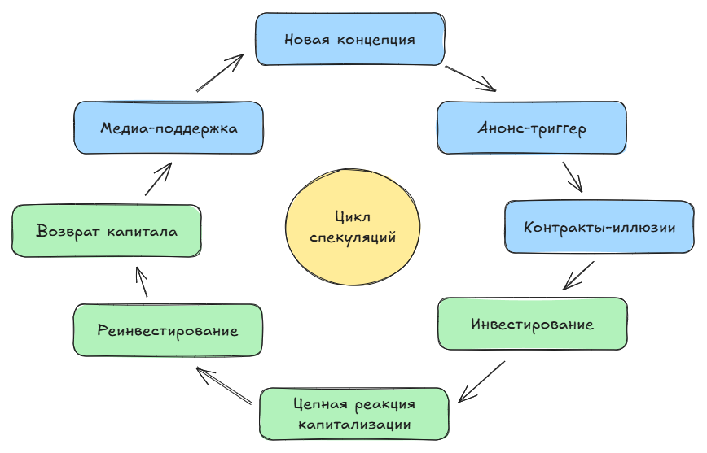

# Не бегите за искусственным интеллектом в эпоху информационных пузырей и когнитивного капитализма

  НЕ ОБЯЗАТЕЛЬНО
  ДЛЯ НОВИЧКОВ

## Сначала о пузырях

Сейчас, стоит публичной личности заявить о перспективах какой-то технологии, бизнес спешит перестраивать свою политику и инвестировать в эту технологию. Появляется концепция - вызывается **массовый ажиотаж**, создаётся временный тренд и искусственный спрос, часто без достаточного обоснования практической ценности или долгосрочной устойчивости.

Порой цена актива (неважно какого - акции, недвижимость и так далее) резко и необоснованно растёт из-за **спекуляций**, а не реальных фундаментальных факторов. Иррациональный ажиотаж, завышенные ожидания расширяются настолько, что потребитель это видит, и впоследствии игнорирует конечный товар. Бывают разные причины падения таких инициатив, но в основном - хайпожорство.

**Хайпожором** зовут тех, кто использует широко обсуждаемые темы ради привлечения внимания к себе или своей деятельности. Вот нам всем, обывателям, работягам, должно быть плевать на все эти ваши NFT, акции, нейросети и биткоины. Но нам постоянно говорят об этом, и мы следим за рынком. Пока капитализация NVidia, Apple, Google и Microsoft считается несколькими миллиардами, мы считаем деньги на зарплату, не можем позволить себе покупку недвижимости или автомобиля. Крестьянам или рабочим из прошлого было бы без разницы, как может показаться, но на самом деле мир всегда был таким - был бизнес, было государство, и были простые смертные. К сожалению, косвенно мы страдаем от последствий.

Обыватели не осознают своей роли в **спекулятивной системе**, воспринимая тренды как данность, в то время как их труд, внимание и надежды становятся ресурсами для капитализации.

Люди живут, поглощая информацию, и ища в ней надежду на спасение, на возможность выбраться из бедности. Кто-то выбирается, а в будущем встаёт на сторону бизнеса или государства, но всегда эти три стороны управляли миром.

Капитализм, фондовые рынки и недвижимость включают в себя **общество собственников**, которые хотят зарабатывать, получая пассивный доход, и ищут перспективы, куда бы вложить свою собственность, превращаясь в инвесторов - тот самый «бизнес». На инвестиции влияет всё - новости, информационные технологии, инфляция, прогнозы (даже ложные), рост и падение рождаемости, но самое существенное - спекуляция. На реальном рынке фактически бывает трудно выявить истинную стоимость товара, и пузырь выявляется лишь потом, когда это дойдёт до реализации, а цены упадут.

## Как это всё работает?

Компания **стартует** и объявляет о себе, продаваясь на акции. Существует целая цепочка составляющих - имущество компании (активы), прибыль и доход, расходы, и конечно, уставный капитал. Это определённый номинальный набор имущества, определяющий долю каждого из владельцев. Представим, что на старте было два владельца, каждый владел по 50%. Один из владельцев «поделился» с другим, продав ему долю. Инвесторы как раз так и зарабатывают - покупают долю компании, которая обеспечит что-то перспективное, к примеру, за 100 тысяч долларов, а затем, когда перспектива реализуется, появится кто-то богаче, готовый приобрести долю за 200 тысяч долларов!

Ещё в 1980-х не было всех этих техногигантов с триллионами - они по факту столько и не стоят. Инвесторы живут этим, покупая, зарабатывая, продавая. Если чувствуется, что компания идёт плохо, а перспективы уже плохие, то пора продавать, пока не поздно, иначе богач не найдётся. Лучше продать за 90 тысяч, чем за 50 тысяч позднее…

Вот и весь дурацкий смысл этого цикла - простые граждане от этого не выигрывают.

Спекуляция всегда существовала. В XVII в Голландии был «хайп» на луковицах редких сортов тюльпанов, что назвали «**тюльпаноманией**». Луковицы торговались как ценные бумаги, а цены на них достигали стоимости дома, но в дальнейшем - бух! Внезапный обвал рынка, массовые убытки. Экономика Голландии, конечно, не рухнула, но это один из первых задокументированных случаев спекулятивного пузыря.

В XVIII веке, в Англии, акции компании (**Южно-морская компания**) получившей монополию на торговлю с Южной Америкой, надулись - инвесторы всерьёз поверили в колоссальные прибыли от работорговли и добычи золота. На деле это оказалось почти нереализуемо, пузырь лопнул, парламент ввёл ограничения на акционерные общества (это прозвали «Bubble Act»). Тот же век ещё славится французской инвестиционной схемой «Mississippi Bubble», когда шотландский финансист основал компанию для…разработки колоний в Миссисипи. Акции компании обеспечивались бумагами, конвертируемыми в золото, но без реального обеспечения, что, конечно же, привело к краху финансовой системы Франции, потери доверия к банкам и акциям на десятилетия. Можете почитать об этой исторической эпохе - очень интересная тема. Именно в тот период была активная революционная эпоха в Северной Америке, которая привела к образованию США, и одной из причин как раз была финансовая система и необходимость обеспечения независимости путём создания своего регулятора. Но это уже глубокая экономика, давайте вернёмся к пузырям.

1848-1855 славятся интересным моментом, когда в Калифорнии была **золотая лихорадка**, массовый приток людей в поисках золота - однако больше всех заработали поставщики лопат, продуктов, одежды и услуг. Большинство остались ни с чем, месторождения истощились, и это без учёта прочих социальных и экологических последствий. Да, этот штат, видимо, всегда был рассадником жадности бизнеса.

В Европе и США, кстати, был железнодорожный бум в XIX веке - железные дороги строили часто даже без экономического обоснования. К примеру, в Великобритании тысячи компаний регистрировались, а акции раскупались вслепую, что и привело к тому, что многие линии оказались убыточными или недостроенными, а потом последовал крупный финансовый кризис. Можете почитать - называют «Railway Mania Crash».

Кроме «золотой» и «железнодорожной» лихорадки, была ещё **радиевая**. Радиоактивные вещества в 1910-1930-х годах (особенно, как можно понять - радий), стали очень модными, используясь в медицине, косметике и потребительских товарах. Представьте себе - радиевая вода, зубная паста, светящиеся часы! Кошмар! После выявления тяжёлых заболеваний у работников (знаменитые «радиевые девушки»), последовали запреты и общественное разочарование.

В 1950-1970-х пластик считался «чудо-материалом» - пластмассы приветствовались как символ прогресса, дешевизны и гигиены. Ажиотаж разрастался, везде была одноразовая посуда, упаковки, одежда и мебель из этого материала. Только спустя десятилетия осознали экономический ущерб.

Говоря об **экологии**. Помните, как активисты грозились вымиранием человечества к 2025 году? Конечность ресурсов, захламление океана, вымирания и вырубания, производство электроэнергии, негативное влияние майнинга на экологию? Заметили, что сейчас об этом перестали говорить, а людей уже стало 8 миллиардов, никого даже не колышит экология? Вот вам и ещё один пузырь - «**зелёная повестка**». Массовый ажиотаж «антипрививочников» (особенно после вакцинации от Covid-19), а бизнес, чтобы увеличить ценность продукта, практически всегда стал упоминать «экологичность». Хотя научное сообщество продолжает фиксировать антропогенные изменения климата, медийная интенсивность «зелёной повестки» снизилась, что свидетельствует о её спекулятивной, а не системной природе в корпоративном дискурсе. Конечно, нашим внукам ой как не поздоровится, но всё же планета Земля представляет собой огромный массив, в котором люди лишь один из видов организмов - она переживала и потепление, и похолодание, планктонизацию, падение метеорита и много чего ещё. Бизнес пришел к логичному выводу «лучше думать о себе».

Конечно, регуляторные инициативы остались, но это скорее был медийный тренд, поэтому можно и не считать «экологическую повестку» чем-то экономическим. Рассмотрим последующие кейсы.

В 1990-х ещё одна забавная штука была - **биотехнологии**. После расшифровки генома человека стартовало ожидание мгновенных прорывов в медицине, появились сотни биотех-стартапов, астрономические оценки, вера в персонализированную медицину «здесь и сейчас». Реальные результаты пришли, но десятилетия спустя и с гораздо меньшей скоростью, а многие компании обанкротились. +1 к нашим пузырям.

Самое знаменитое - **пузырь доткомов** в период с 1995 по 2001. Суть в массовом инвестировании в интернет-стартапы со своим «**.com**» (на английском читается как «**dotcom**») без прибыли, часто даже без чёткой бизнес-модели, якобы если «присутствуешь в сети» - уже гарантирован успех. Бизнес верил, что любой онлайн-проект автоматически обладает потенциалом монетизации. Такой бред привёл к краху фондового рынка, банкротству тысяч компаний, однако к появлению «акул бизнеса» - именно тех, у кого была устойчивая модель, таких как Amazon или eBay.

В 2010-2015 ритейл и финтех-компании активно внедряли «умные» терминалы с **NFC**, QR-кодами, поддержкой Apple Pay и Google Pay. Все верили в скорое исчезновение пластиковых карт и бумажных денег. По российским компаниям это ударило особенно через десяток лет, когда как раз эти технологии, зависимые от западных корпораций, оказались заблокированными. Для России это стало уроком и отличным поводом собственного развития - в итоге у нас имеется СБП, Мир, и ещё некоторые особенности, вроде оплаты улыбкой.

Но здесь фишка в NFC - массовое внедрение в мире действительно произошло, но темпы были завышены, многие стартапы в области ритейл-платежей не выжили, так как рынок оказался «менее революционным» и более регулируемым. Смарт-терминалы и NFC-платежи оказались не такой уж и революцией.

**Блокчейн**. Компании и частные лица запускали системы без регуляторного контроля, часто продвигая непонятные токены как инвестиции. Криптохайп сочетался с обходом венчурных механизмов и иллюзии «децентрализованного будущего», в итоге приводя к регуляторному вмешательству, провалу большей части проектов и, конечно, массовых потерь инвесторов. А вы помните, как в 2017-2018 бизнес горел этой темой? Все бежали изучать, что такое блокчейн, активно анализировали тему, а сейчас всем, мягко говоря, плевать.

**NFT**. Суть в представлении уникальных цифровых активов как нового класса инвестиций и артефактов. В западной инвестиционной культуре распространена практика монетизации нематериальных активов без привязки к производственной базе, что усиливает спекулятивные эффекты. А теперь представьте, буквально, какую-то ерунду берёшь и продаёшь за миллионы. Ажиотаж был - виральный маркетинг, FOMO, интеграция с Web3-дискурсом. А итог - резкое падение ликвидности, спад интереса, остаточное применение в узких нишах. Компании в 2020-2022 буквально налево и направо говорили о том, как это круто, что надо исследовать, попробовать быть «в тренде» и тоже подсесть на волну хайпа NFT.

**Метавселенные**? Концепция персистентных трёхмерных виртуальных миров как платформ нового цифрового взаимодействия, подразумевающих эволюцию существующих игровых миров, смешанных с концепцией мира социальных сетей в нечто единое - мол, люди будут жить в этом пространстве. Возможно, крупные компании просто вдохновились «Оазисом» из «Первому игроку приготовиться», и думали, что люди будут прожигать свою жизнь. На самом деле это просто очевидный исход VR - бизнес уверенно считал, что это пик технологий, что мониторы, экраны телефонов и клавиатуры - прошлый век. Так было сначала с игровыми консолями (и это выстрелило!), смартфонами (это тоже!), смарт-часами и «умными» колонками (а вот это уже не так круто, как казалось). Ажиотаж подогрела одна крупная компания, которую нельзя называть, которая переименовалась, и инвестировала в метавселенные. Microsoft, Nvidia и прочие гиганты поддержали тему, и в итоге…они получили низкую пользовательскую вовлечённость, отсутствие «киллер-фич» и каких-то хороших приложений, достойных внимания, и бизнес просто вернулся к более традиционным формам цифрового взаимодействия.

Ещё одна штука - **serverless** (буквально «бессерверность»). Идея функции как сервиса, полного отказа от управления инфраструктурой в пользу «event-driven» обещала снизить затраты и упростить DevOps. Технология как бы устоялась, но оказалась применимой только в определённых сценариях, а большинство приложений продолжают использовать систему контейнеризации и виртуализации.

Контейнеризация Docker и системы контроля версиями Git, кстати, занимают интересную позицию в числе технологий - они не имели спекулятивный нарратив, Git решал конкретную инженерную задачу. Сейчас именно они действительно улучшили мир и стали основой трилллионных рынков, но при этом об их ценности в медиа не так сильно шумят, как раз из-за open-source природы. Разница не в отсутствии коммерциализации, а в том, что эти технологии решали конкретные инженерные задачи, а не продавались как «будущее всего». Их **ценность подтверждалась практикой**, а не PR.

Low-code и No-code платформы - классная тема концептуально, однако часть бизнеса немного неправильно эту тему развила. Суть в том, что продаётся некий продукт как «сборка приложений без кода», когда можно взять и установить себе, настроить под свои нужды, без привлечения полноценной разработки, экономя кучу нервов и времени. Для среднего бизнеса это отличное решение, однако на западе, как обычно, идея «демократизации разработки» и сокращения числа инженеров привела к узкой применимости. Для внутренних CRM, форм и учёта это отличное решение, однако попытка масштабировать сложные системы без участия разработчиков просто привела к особому итогу - появились интеграторы и разработчики на таких платформах как отдельное поколение. Технически, революции не произошло, но родилась новая профессия и сфера в отрасли, которая существует до сих пор, поддерживая средний бизнес. Наверное, это единственный положительный исход из раздутых трендов, а ошибка запада была именно в переоценке данного направления.

Так что, история подсказывает, что нужно грамотно подходить к этому.

## Прибыль из пустоты

XX век стал эпохой трансформации - экономика Запада почти полностью перешла от производства к финансам. Фабрики уступили место биржам, инженеры - аналитикам, реальные товары - акциям, опционам и капитализации. Это не плохо само по себе - рынок эффективен, но, когда он попадает в руки жадных игроков, он превращается в машину по созданию иллюзий.

Экономисты отмечают, что это эпоха «финансиализации экономики». 

**Финансиализация** — это процесс, при котором финансовый сектор начинает доминировать над реальным производством, а прибыль генерируется через перераспределение капитала, управление рисками и манипуляцию ожиданиями. В условиях глобализации и цифровизации капитал всё чаще концентрируется не в руках производителей, а в руках владельцев активов и платформ. Это создаёт структурное неравенство: доходы от капитала растут быстрее, чем доходы от труда.

Проще говоря, **деньги теперь создаются из воздуха**.

Если восточные страны, такие как Российская Федерация или Китай, не имеют зависимости от рынка и фондов, то Запад очень сильно «рисует» свои собственные правила, которые сам же и нарушает. Восток занял долю производства, Россия, вместе с африканскими и арабскими странами поставляют сырьё, а Индия и средняя Азия - рабочую силу. Но Запад лишь манипулирует рынком, фактически.

Компании больше не зарабатывают на продуктах — они зарабатывают на ожиданиях, хайпе, «потенциале», «будущем». Особенно в IT, где реальный продукт часто появляется после того, как миллиарды уже вложены в его обещание.

В этом контексте IT-индустрия — идеальный инструмент для спекуляции, ведь **продукты нематериальны** (софт, алгоритмы, API), их стоимость субъективна и зависит от ожиданий рынка, масштабируемость бесконечна, а спрос легко манипулируется через медиа и маркетинг.

**Западная модель** — финансово-спекулятивная, ориентирована на краткосрочную капитализацию, акционерную стоимость, медиа-повестку. Важнее то, что компания обещает.

**Восточная модель** — производственно-стратегическая, ориентирована на долгосрочное планирование, государственное регулирование, реальные активы и ресурсы. В Китае, например, даже технологические гиганты (Alibaba, Tencent) подвержены жёсткому государственному регулированию, чтобы не допустить «дикой» капитализации и отрыва от реальной экономики.

Почти все ключевые IT-корпорации — американские или **западные**. Они создают модели распространения, методологии, платформы, инструменты, языки, стандарты. И, что важнее — они создают повестку. Чего только мы не видели - экологическая, национальная, расовая, гендерная повестки, искусственный интеллект, криптовалюта, метавселенные, NFT, майнинг. Это всё не органический, а спекулятивный спрос, искусственно созданный через PR, инвестиции, слияния, анонсы и — что самое главное — взаимные финансовые потоки между дружественными компаниями.

Здесь стоит ввести понятие **информационного пузыря** — термина, который развил Роберт Шиллер (лауреат Нобелевской премии по экономике).

>«Информационный пузырь — это самоподдерживающийся цикл, в котором медиа, аналитики и инвесторы воспроизводят один и тот же нарратив, создавая иллюзию консенсуса и неизбежности роста, даже при отсутствии фундаментальных оснований.»

В отличие от классических рыночных пузырей (типа тюльпаномании), информационные пузыри возникают вокруг технологий, идей, нарративов, которые подогреваются медиа, экспертами и инвесторами.

**VC**, или **венчурные фонды**, вкладывающие в перспективные, но рискованные стартапы на разных стадиях развития, чтобы получить высокую прибыль в будущем (вроде Sequoia, a16z, Insight Partners) сознательно создают пузыри, чтобы вывести портфельные компании на IPO/продажу до краха и монетизировать хайп через вторичные сделки. Это ключевой элемент «финансовой алхимии».

Как уже отмечал выше, повторюсь - IT-индустрия — идеальная среда для таких пузырей, потому что технологии сложны для массового понимания, и легко манипулировать восприятием, продукты часто абстрактны и их ценность субъективна, рынок глобальный и мгновенный, хайп распространяется со скоростью света. Разумеется, инвесторы склонны к FOMO (Fear Of Missing Out), что дарит иррациональные вложения.

Как отмечает Карл Бенгер в «Экономике внимания», в цифровую эпоху главный ресурс — внимание человека. ИИ — нарратив, на котором держится внимание, а значит — и деньги.

Всё организовано по схеме.

Это можно назвать экономической моделью замкнутого цикла спекулятивной капитализации, где включается:
	- анонс-триггер (создание нарратива);
	- контракт-иллюзия (подписание меморандумов и предварительных соглашений без обязательств);
	- цепная реакция капитализации (рост акций всех участников цепочки);
	- реинвестирование (возврат капитала к истоку, создание видимости «экосистемы»);
	- медиа-поддержка (усиление веры через СМИ, аналитиков, «экспертов»).

Такова финансовая алхимия по превращению воздуха в «ценность», через PR.

>«И так как человек оставаться без чуда не в силах, то насоздаст себе новых чудес, уже собственных, и поклонится уже знахарскому чуду, бабьему колдовству, хотя бы он сто раз был бунтовщиком, еретиком и безбожником.»

Федор Достоевский, Братья Карамазовы

## ИИ - это проблема экономики

Экономика, к сожалению, объединяет две разные ипостаси искусственного интеллекта - **технологичности** и **идеологии**. ML, NLP, трансформеры представляют собой реальные инструменты с ограниченной применимостью, а вот ИИ, как панацея является при этом идеологическим мифом со способностью заменить человеческий труд, решить все задачи, создать AGI.

И я хочу подчеркнуть, что как раз-таки саму технологию я не критикую ни в коем случае, а скорее хочу направить наше внимание на инструментализацию в спекулятивной экономике. Может даже сложиться впечатление, что весь ИИ - спекулятивный тренд, однако классический ML (рекомендательные системы, фрод-детекция, CV в промышленности) работает эффективно с 2010-х, а проблема именно в генеративной модели как универсальном решении.

Суть многих провалов в **отсутствии реальной потребности**. Компании внедряют ИИ ради ИИ, а не для решения задачи. Это важно подчеркнуть.

Сначала поговорим о рынке, а затем перейдём к результатам.

Пример финансиализации - как сейчас финансируется ИИ. Чтобы работали вычисления, нужно железо, так? И в огромных количествах, что требует построения гигантских кластеров. Microsoft инвестирует в OpenAI, OpenAI анонсирует Stargate, Microsoft заказывает у Nvidia, капитализация Nvidia растёт. Nvidia — поставщик чипов (H100 и др.) для дата-центров, включая те, что используются Microsoft (инвестор OpenAI), Oracle и других. Так анонсируют проекты, формируют инфраструктурные договорённости с поставщиками (включая чипы, чиллеры, землю), и всё это влияет на стоимость акций.

Так владельцы компаний становятся богаче, инвесторы тоже. Но в реальности это лишь «тренд». Деньги лишь создают видимость ценности. Пока все верят в эту видимость — пузырь живёт. Восточный рынок построен иначе (например, в Китае действует стратегическое управление ожиданиями через госмедиа), у него немного иной механизм формирования рыночных ожиданий. Да, у нас есть фондовая часть, но она составляет лишь долю, а суммы капитализаций совершенно несопоставимы с американскими компаниями. А потом Дженсен Хуанг делает заявления, что по его прогнозу, вскоре понадобятся строители, монтажники, электрики, сантехники, так как будет строительный бум на 10-20 лет. Снова нарисованная востребованность?

Нам какое дело? А проблема в том, что пока компании занимаются своими делами, мы выступаем винтиками во всём этом. Люди верят в ложь, молодые разработчики бросают стабильные профессии, чтобы «войти в ИИ», не понимая, что «входить» некуда — есть только хайп. Компании перестраивают бизнес под «ИИ-трансформацию», тратя миллионы на консультантов и «prompt-инженеров», вместо того чтобы решать реальные задачи. Образование превращается в фабрику по производству «специалистов по трендам».

Именно это и привело к **перенасыщению рынка**, из-за которого простые работяги не могут найти работу. Если вы решили выбрать IT, то развивайтесь шире. Не гонитесь за трендами. Технологии приходят и уходят. ChatGPT сегодня — завтра что-то другое. Технологические лидеры прошлого (например, IBM в эпоху ПК) могут утратить доминирование, но редко исчезают полностью, трансформируясь под новые условия. Нам нужно развивать профессионализм, софт-скиллы, самостоятельность и ценности.

Сам Хуанг, кстати, отрицает наличие пузыря. Верим?

Исследователи из MIT отмечают, что большинство корпоративных ИИ-проектов не переходят из пилотной стадии в устойчивую эксплуатацию (точнее - не приносят никакой измеримой финансовой отдачи), а аналитические компании отмечают, что несмотря на то, что результаты генеративных ИИ неудовлетворительные, поставщики базовых моделей ежегодно инвестируют миллиарды долларов в увеличение размера, производительности и надёжности моделей генеративного ИИ. Парадокс!

Бизнес пытается полностью автоматизировать процессы с помощью ИИ, заменяя человеческие решения вместо того, чтобы использовать его как инструмент для помощи людям. Компании запрыгнули в этот «хайптрейн», и они прогорят, как и инвесторы. Можно отметить, что это организационные проблемы бизнеса, а не сама технология. Ожидания результатов не соответствуют инициативам и реальности. Виноваты именно менеджеры, как и всегда - они хотят ИИ везде, требуют использование ежедневно и даже контролируют, а в итоге «промпт-инженеры» приступают к работе ещё до того, как бизнес проведёт полноценный анализ и разберётся, как на самом деле работает технология.

Так что да, проблема в необоснованной медийной истерии и CEO, которые думают, что AI сделает продукт успешнее. Компании переоценены инвесторами - даже Билл Гейтс это отмечает.

Пользователей уже тошнит от этого - куда ни зайди, **везде ИИ**. Даже лента TikTok заполнена генерируемыми видео, компании используют подобные изображения в маркетинге, модели, ландшафт в играх, сценарии и эффекты в кино, и такое массовое применение часто обусловлено необходимостью поддерживать «трендовость» - реальная эффективность в обыденности куда ниже.

В ноябре 2025 года Coca-Cola представила свою рождественскую рекламную кампанию, в создании которой впервые массово задействованы генеративные модели искусственного интеллекта. Ролик, предназначенный для демонстрации в 140 странах, вызвал неоднозначную реакцию: при внешней декларации успеха со стороны компании и удовлетворённости акционеров, публика выразила резкую критику по поводу визуального качества и стилистической целостности. Согласно официальной информации, над проектом работали более 100 сотрудников внутренних подразделений Coca-Cola, внешнее маркетинговое агентство и две специализированные ИИ-студии — Silverside AI и Secret Level (дочерняя структура Sony, работающая в области генеративного контента). Производственный цикл составил около одного месяца, что контрастирует с традиционными сроками разработки глобальных праздничных кампаний — обычно 6–12 месяцев. Компания позиционирует это как достижение: сокращение time-to-market, снижение издержек на итерации и возможность быстрой адаптации под региональные особенности.

Coca-Cola с 2023 года активно инвестирует в генеративный ИИ. В 2024 году был заключён стратегический партнёрский договор с Microsoft на сумму свыше $1 млрд, направленный на интеграцию ИИ в креативные, логистические и маркетинговые процессы. Нынешняя кампания — часть этой инициативы. Однако критика указывает на дизайнерскую несогласованность: персонажи напоминают артефакты, характерные для ранних версий генеративных видео-моделей (например, Runway Gen-2 или Pika 1.0), где наблюдается нарушение физики движений, нестабильность визуальных деталей (например, морфинг лиц или объектов), отсутствие единого художественного стиля между сценами. Некоторые наблюдатели отмечают, что качество уступает даже текущим бесплатным версиям моделей Sora 2 (OpenAI) и Veo 3 (Google), несмотря на использование профессиональных студий и значительных ресурсов.

Случай Coca-Cola иллюстрирует более широкую тенденцию в корпоративной среде - приоритизация скорости и измеримых KPI над художественной согласованностью и эмоциональным откликом. Акционеры оценивают эффективность по таким метрикам, как сокращение бюджета, ускорение релиза и конечно охват (**хоть и негативный**!).

В условиях, когда компании демонстрируют «ИИ-трансформацию» как часть инвесторской повестки, качество конечного продукта становится вторичным по отношению к доказательству внедрения технологий. Это соответствует модели спекулятивной рационализации, описанной в критических исследованиях цифровой экономики: ресурсы направляются на поддержание нарратива инновационности, необходимого для поддержания капитализации и доверия инвесторов.

Если подобные практики станут нормой, возможна маргинализация креативных профессий (художников, аниматоров, арт-директоров), гомогенизация визуального языка (эстетика усредняется), и рост потребительского цинизма - при постоянном снижении качества контента, даже бренды с сильным наследием (как Coca-Cola) рискуют утратить эмоциональную связь с аудиторией.

Пользователь обращается, к примеру, в банк. А его приветствует ТОЛЬКО чат-бот и почти полная невозможность обратиться к реальному человеку. Банк считает, что в перспективе сократится уровень затрат на найм сотрудников по работе с клиентами, однако пользователи просто уйдут в другие банки, где нет настырных ботов. А если не уходят от банка, то только из-за финансового капкана - вклады, зарплатные проекты, наличие карт и построенных схем заработка делают человека привязанным к банку, из-за чего тот может вытворять что угодно, не боясь потерять клиентуру.

Но так могут делать только банки! Продуктовые компании, поставщики и продавцы не потянут отказ клиентов, так как не смогут «привязать» пользователя навсегда и надёжно. Почему не сгорит Microsoft, Apple? А они зарабатывают на своих продуктах, независимых от ИИ. NVidia и вовсе поставщик устройств, которые всем нужны. Так что они выживут после пузыря. А что будет с компаниями, которые уволили сотни людей, получив временную экономию, но отказ от клиентов, спад интереса и дохода в будущем?

Такая стратегия отражает краткосрочный расчёт на снижение издержек без учёта долгосрочных репутационных и операционных издержек.

ИИ останется полезным, и станет чем-то на уровне «Microsoft Word» - будет популярен, актуален, и полезен, однако не настолько, как это рассказывают технологические гиганты.

Однако есть ещё одна проблема, связанная с обучением - именно это и есть проблема для масштабирования. Большинство систем с генеративными AI-моделями не сохраняют обратную связь, не адаптируются к контексту и не улучшаются со временем. Покупатели приобретают технологию, подключают модели и требуют настройки для конкретных процессов. А на чём они оценивают инструменты? На бизнес-результатах, а не программных показателях. Ожидания в том, что системы будут интегрироваться с существующими процессами, улучшаясь со временем. Но большинство реализаций не приводят к действительно эффективному сокращению штата, это скорее выборочное влияние на рабочую силу в сфере поддержки клиентов, разработки программного обеспечения, административных функциях.

Словом, ИИ увеличит скорость, но людей не заменит.

Я много лет слежу за «трендами», новостями IT, экономики и бизнеса. Честно, каждый год все меняется, одна тенденция заменяет другую, и каждая «уверяет» в своей перспективности и надёжности.

Это называется «**когнитивный капитализм**» - эксплуатируется внимание, знания, эмоции и надежды людей. Образование превращается в фабрику трендов — вместо фундаментальных дисциплин — курсы по «prompt-инжинирингу». Рынок труда перегружен «специалистами», обученными под временный спрос, который исчезнет через 2–3 года. Формируется FOMO-культура: страх упустить «будущее», которое может и не наступить, стирается грань между развитием и манипуляцией, а технологии становятся идеологией.

Искусственный интеллект — скорее, инструмент, чья ценность определяется не громкостью нарратива, а конкретной задачей, которую он решает. В эпоху, когда внимание стало валютой, а хайп — активом, главная профессиональная добродетель — способность отличать устойчивую ценность от спекулятивной видимости. Иначе есть риск оказаться не создателем будущего, а его временным винтиком — востребованным сегодня и бесполезным завтра.

---
