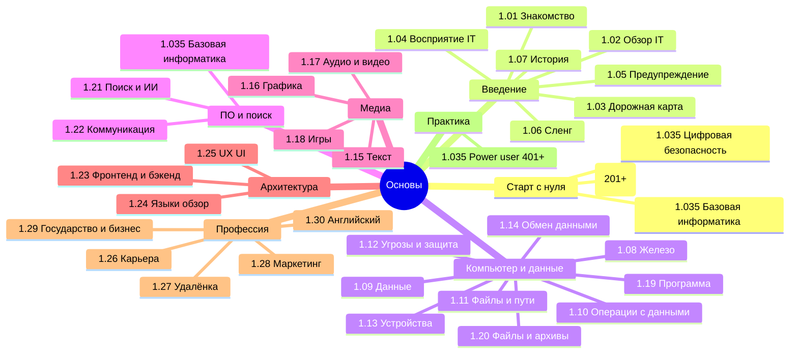

---
title: 1. Основы - о разделе
description: >-
  Вводный раздел энциклопедии — компьютер, данные и программы, цифровая грамотность,
  практические гайды и профессиональная среда перед специализированными темами.
sidebar_label: 1. Основы - о разделе
slug: /section/basics
id: basics
---

  ОБЯЗАТЕЛЬНО
  ДЛЯ НОВИЧКОВ

---

## Основы

В архитектуре знаний для развития по методологии "Вселенной IT" нужно заложить фундамент:
- понять, как работает компьютер;
- повторить основы информатики;
- изучить саму IT-сферу - бизнес, государство, регулирование, правила и профессии;
- немного охладить пыл и понять проблемы в этом направлении;
- определить, что интересно, к чему есть тяга;
- узнать, что такое программа, как её запускать, удалять;
- заложить основы цифровой и компьютерной грамотности.

Задача - уверенно ориентироваться в IT-ландшафте, строить карьеру, принимать осознанные технологические решения. Здесь мы разбираем системный набор знаний, необходимых каждому, кто взаимодействует с компьютером. Материал построен так, чтобы вы могли быстро найти ответ на любой вопрос, будь то настройка рабочего места, первый шаг в профессии или просто понимание того, как работает ваш ПК. Это ваш путеводитель по цифровой грамотности и IT-культуре.

Раздел **«Основы»** — фундамент [энциклопедии](/encyclopedia/1-basics/basics): от первого включения ПК до карьеры, маркетинга и обзора языков. Материалы связаны перекрёстными ссылками; у большинства подразделов есть intro, итоги (98) и чек-лист (99).

### Выберите свой маршрут

| Кто вы | С чего начать | Затем |
|--------|---------------|--------|
| **Никогда не пользовались ПК** | [1.035. Основы компьютерной грамотности](/encyclopedia/1-basics/1-035-bazovaya-informatika/101) | [1.11 Файлы и пути](/encyclopedia/1-basics/1-11-fayly-katalogi-i-puti/intro), [1.12 Цифровые угрозы](/encyclopedia/1-basics/1-12-tsifrovye-ugrozy-i-model-zashchity/intro), [Цифровая безопасность (112)](/encyclopedia/1-basics/1-035-bazovaya-informatika/112) |
| **Цифровая грамотность** | [1.035. Базовая информатика — о разделе](/encyclopedia/1-basics/1-035-bazovaya-informatika/intro) | Блоки 201–511, [лаборатория](https://lab.spirzen.ru/lab/tasks/intro) |
| **Хочу в IT** | [1.03. Дорожная карта](/encyclopedia/1-basics/1-03-dorozhnaya-karta-izucheniya/1) | [1.26 Карьера](/encyclopedia/1-basics/1-26-karera-v-it-i-mify/intro), [1.02 Обзор Вселенной IT](/encyclopedia/1-basics/1-02-vvedenie/1) |
| **Играю и хочу разбираться** | [Компьютерные игры](/encyclopedia/1-basics/1-18-kompyuternye-igry/1) | [Тест на геймера](/encyclopedia/1-basics/1-18-kompyuternye-igry/101), [Игроведение](https://games.spirzen.ru/games/9-03-igrovaya-industriya/game-studies/intro), [Игровая индустрия](https://games.spirzen.ru/games/9-03-igrovaya-industriya/intro) |
| **Уже уверенный пользователь** | [1.035. Советы для начинающего](/encyclopedia/1-basics/1-035-bazovaya-informatika/201) | [Скрипты и автоматизация](/encyclopedia/4-code-dev/4-011-instrumenty-razrabotki/402), [2. Система и сеть](/section/system-network) |

Полное автоматическое содержание — [docs/toc.md](/toc) и боковое меню энциклопедии (`Ctrl+K`).

---

## Знакомство с Вселенной IT

<ul class="it-toc-articles">
  <li><a href="/encyclopedia/1-basics/1-01-davayte-poznakomimsya/1">1.01. Давайте познакомимся</a></li>
</ul>

---

## Обзор структуры Вселенной IT

<ul class="it-toc-articles">
  <li><a href="/encyclopedia/1-basics/1-02-vvedenie/1">1.02. Обзор структуры Вселенной IT</a></li>
  <li><a href="/encyclopedia/1-basics/1-02-vvedenie/2">1.02. Архитектура знаний</a></li>
</ul>

---

## Дорожная карта изучения

<ul class="it-toc-articles">
  <li><a href="/encyclopedia/1-basics/1-03-dorozhnaya-karta-izucheniya/1">1.03. Дорожная карта изучения</a></li>
  <li><a href="/encyclopedia/1-basics/1-03-dorozhnaya-karta-izucheniya/2">1.03. Тест на готовность к программированию</a></li>
  <li><a href="/encyclopedia/1-basics/1-03-dorozhnaya-karta-izucheniya/101">1.03. Указатель — где и о чём почитать</a></li>
  <li><a href="/encyclopedia/1-basics/1-03-dorozhnaya-karta-izucheniya/211">1.03. Тест на компьютерную грамотность</a></li>
  <li><a href="/encyclopedia/1-basics/1-03-dorozhnaya-karta-izucheniya/212">1.03. Тест на готовность к работе с данными</a></li>
  <li><a href="/encyclopedia/1-basics/1-03-dorozhnaya-karta-izucheniya/213">1.03. Тест на готовность к веб-разработке</a></li>
  <li><a href="/encyclopedia/1-basics/1-03-dorozhnaya-karta-izucheniya/214">1.03. Документация в Microsoft Learn</a></li>
</ul>

---

## Восприятие IT в обществе

<ul class="it-toc-articles">
  <li><a href="/encyclopedia/1-basics/1-04-kak-vidyat-it-obychnye-lyudi/1">1.04. Восприятие IT в обществе</a></li>
  <li><a href="/encyclopedia/1-basics/1-04-kak-vidyat-it-obychnye-lyudi/2">1.04. Связь IT с другими сферами</a></li>
  <li><a href="/encyclopedia/1-basics/1-04-kak-vidyat-it-obychnye-lyudi/3">1.04. Классификация технологий в IT</a></li>
  <li><a href="/encyclopedia/1-basics/1-04-kak-vidyat-it-obychnye-lyudi/4">1.04. Финансовые потоки в IT-индустрии</a></li>
  <li><a href="/encyclopedia/1-basics/1-04-kak-vidyat-it-obychnye-lyudi/5">1.04. Рынок IT-услуг и продуктов</a></li>
  <li><a href="/encyclopedia/1-basics/1-04-kak-vidyat-it-obychnye-lyudi/6">1.04. Секрет прост</a></li>
  <li><a href="/encyclopedia/1-basics/1-04-kak-vidyat-it-obychnye-lyudi/7">1.04. IT в России</a></li>
  <li><a href="/encyclopedia/1-basics/1-04-kak-vidyat-it-obychnye-lyudi/98">1.04. Восприятие IT в обществе — итоги</a></li>
  <li><a href="/encyclopedia/1-basics/1-04-kak-vidyat-it-obychnye-lyudi/99">1.04. Восприятие IT в обществе — чек-лист</a></li>
  <li><a href="/encyclopedia/1-basics/1-04-kak-vidyat-it-obychnye-lyudi/711">1.04. Техногиганты</a></li>
</ul>

---

## Предупреждения при изучении

<ul class="it-toc-articles">
  <li><a href="/encyclopedia/1-basics/1-05-preduprezhdenie/1">1.05. Предупреждения при изучении</a></li>
  <li><a href="/encyclopedia/1-basics/1-05-preduprezhdenie/2">1.05. Иллюзия стабильности в IT</a></li>
  <li><a href="/encyclopedia/1-basics/1-05-preduprezhdenie/3">1.05. Рекомендации по обучению и развитию</a></li>
  <li><a href="/encyclopedia/1-basics/1-05-preduprezhdenie/4">1.05. Риски и мифы IT-индустрии</a></li>
</ul>

---

## Сленг

<ul class="it-toc-articles">
  <li><a href="/encyclopedia/1-basics/1-06-sleng/1">1.06. IT-сленг и профессиональная лексика</a></li>
  <li><a href="/encyclopedia/1-basics/1-06-sleng/2">1.06. Сетевой сленг и форумная лексика</a></li>
</ul>

---

## История информационных технологий

<ul class="it-toc-articles">
  <li><a href="/encyclopedia/1-basics/1-07-nemnogo-o-proshlom/1">1.07. История информационных технологий</a></li>
  <li><a href="/encyclopedia/1-basics/1-07-nemnogo-o-proshlom/2">1.07. Ранние вычислительные устройства</a></li>
  <li><a href="/encyclopedia/1-basics/1-07-nemnogo-o-proshlom/3">1.07. Эволюция программного обеспечения</a></li>
  <li><a href="/encyclopedia/1-basics/1-07-nemnogo-o-proshlom/4">1.07. История интернета</a></li>
  <li><a href="/encyclopedia/1-basics/1-07-nemnogo-o-proshlom/5">1.07. История языков программирования</a></li>
  <li><a href="/encyclopedia/1-basics/1-07-nemnogo-o-proshlom/6">1.07. Развитие методологий разработки ПО</a></li>
  <li><a href="/encyclopedia/1-basics/1-07-nemnogo-o-proshlom/11">1.07. Профессии в IT</a></li>
  <li><a href="/encyclopedia/1-basics/1-07-nemnogo-o-proshlom/12">1.07. Поколения вычислительной техники</a></li>
  <li><a href="/encyclopedia/1-basics/1-07-nemnogo-o-proshlom/13">1.07. История персональных компьютеров и видеокарт</a></li>
  <li><a href="/encyclopedia/1-basics/1-07-nemnogo-o-proshlom/14">1.07. История первого iPhone</a></li>
  <li><a href="/encyclopedia/1-basics/1-07-nemnogo-o-proshlom/15">1.07. История мобильных устройств</a></li>
  <li><a href="/encyclopedia/1-basics/1-07-nemnogo-o-proshlom/98">1.07. История информационных технологий — итоги</a></li>
  <li><a href="/encyclopedia/1-basics/1-07-nemnogo-o-proshlom/99">1.07. История информационных технологий — чек-лист</a></li>
</ul>

---

## Как работает компьютер

<ul class="it-toc-articles">
  <li><a href="/encyclopedia/1-basics/1-08-kak-rabotaet-kompyuter/1">1.08. Принцип работы компьютера</a></li>
  <li><a href="/encyclopedia/1-basics/1-08-kak-rabotaet-kompyuter/2">1.08. Компоненты компьютерного железа</a></li>
  <li><a href="/encyclopedia/1-basics/1-08-kak-rabotaet-kompyuter/3">1.08. Устройства хранения данных</a></li>
  <li><a href="/encyclopedia/1-basics/1-08-kak-rabotaet-kompyuter/4">1.08. Графические процессоры и видеокарты</a></li>
  <li><a href="/encyclopedia/1-basics/1-08-kak-rabotaet-kompyuter/5">1.08. Периферийные устройства компьютера</a></li>
  <li><a href="/encyclopedia/1-basics/1-08-kak-rabotaet-kompyuter/6">1.08. Загрузка операционной системы</a></li>
  <li><a href="/encyclopedia/1-basics/1-08-kak-rabotaet-kompyuter/7">1.08. Архитектура персонального компьютера</a></li>
  <li><a href="/encyclopedia/1-basics/1-08-kak-rabotaet-kompyuter/8">1.08. ЭВМ</a></li>
  <li><a href="/encyclopedia/1-basics/1-08-kak-rabotaet-kompyuter/9">1.08. Основы автоматизации и автоматики</a></li>
  <li><a href="/encyclopedia/1-basics/1-08-kak-rabotaet-kompyuter/12">1.08. Память и накопители — типы и иерархия</a></li>
  <li><a href="/encyclopedia/1-basics/1-08-kak-rabotaet-kompyuter/13">1.08. Многоуровневая организация компьютера</a></li>
  <li><a href="/encyclopedia/1-basics/1-08-kak-rabotaet-kompyuter/81">1.08. Справочник по характеристикам устройств</a></li>
  <li><a href="/encyclopedia/1-basics/1-08-kak-rabotaet-kompyuter/98">1.08. Как работает компьютер — итоги</a></li>
  <li><a href="/encyclopedia/1-basics/1-08-kak-rabotaet-kompyuter/99">1.08. Как работает компьютер — чек-лист</a></li>
  <li><a href="/encyclopedia/1-basics/1-08-kak-rabotaet-kompyuter/711">1.08. Ноутбуки</a></li>
  <li><a href="/encyclopedia/1-basics/1-08-kak-rabotaet-kompyuter/712">1.08. Мобильные устройства</a></li>
  <li><a href="/encyclopedia/1-basics/1-08-kak-rabotaet-kompyuter/713">1.08. Клавиатура</a></li>
  <li><a href="/encyclopedia/1-basics/1-08-kak-rabotaet-kompyuter/714">1.08. Мышь и геймпад</a></li>
  <li><a href="/encyclopedia/1-basics/1-08-kak-rabotaet-kompyuter/715">1.08. Аудиооборудование</a></li>
  <li><a href="/encyclopedia/1-basics/1-08-kak-rabotaet-kompyuter/716">1.08. Дисплеи и технологии отображения</a></li>
  <li><a href="/encyclopedia/1-basics/1-08-kak-rabotaet-kompyuter/717">1.08. Как выбрать монитор</a></li>
  <li><a href="/encyclopedia/1-basics/1-08-kak-rabotaet-kompyuter/718">1.08. USB — стандарты, разъёмы и Type-C</a></li>
  <li><a href="/encyclopedia/1-basics/1-08-kak-rabotaet-kompyuter/719">1.08. Камеры смартфонов и вычислительная фотография</a></li>
  <li><a href="/encyclopedia/1-basics/1-08-kak-rabotaet-kompyuter/7131">1.08. Клавиши для новичка</a></li>
  <li><a href="/encyclopedia/1-basics/1-08-kak-rabotaet-kompyuter/9111">1.08. Аккумуляторы и источники питания</a></li>
</ul>

---

## Данные и информация

<ul class="it-toc-articles">
  <li><a href="/encyclopedia/1-basics/1-09-dannye-i-informatsiya/1">1.09. Данные и информация</a></li>
  <li><a href="/encyclopedia/1-basics/1-09-dannye-i-informatsiya/2">1.09. Виды информации</a></li>
  <li><a href="/encyclopedia/1-basics/1-09-dannye-i-informatsiya/3">1.09. Типы данных в вычислительных системах</a></li>
  <li><a href="/encyclopedia/1-basics/1-09-dannye-i-informatsiya/4">1.09. Типизация</a></li>
  <li><a href="/encyclopedia/1-basics/1-09-dannye-i-informatsiya/5">1.09. Метаданные</a></li>
  <li><a href="/encyclopedia/1-basics/1-09-dannye-i-informatsiya/98">1.09. Данные и информация — итоги</a></li>
  <li><a href="/encyclopedia/1-basics/1-09-dannye-i-informatsiya/99">1.09. Данные и информация — чек-лист</a></li>
</ul>

---

## Базовые операции с данными

<ul class="it-toc-articles">
  <li><a href="/encyclopedia/1-basics/1-10-bazovye-operatsii-s-dannymi/1">1.10. Ввод и вывод</a></li>
  <li><a href="/encyclopedia/1-basics/1-10-bazovye-operatsii-s-dannymi/2">1.10. Чтение и запись</a></li>
  <li><a href="/encyclopedia/1-basics/1-10-bazovye-operatsii-s-dannymi/3">1.10. Кэширование</a></li>
  <li><a href="/encyclopedia/1-basics/1-10-bazovye-operatsii-s-dannymi/4">1.10. Манипуляции с данными</a></li>
  <li><a href="/encyclopedia/1-basics/1-10-bazovye-operatsii-s-dannymi/98">1.10. Базовые операции с данными — итоги</a></li>
  <li><a href="/encyclopedia/1-basics/1-10-bazovye-operatsii-s-dannymi/99">1.10. Базовые операции с данными — чек-лист</a></li>
</ul>

---

## Файлы, каталоги и пути

<ul class="it-toc-articles">
  <li><a href="/encyclopedia/1-basics/1-11-fayly-katalogi-i-puti/1">1.11. Файл и каталог</a></li>
  <li><a href="/encyclopedia/1-basics/1-11-fayly-katalogi-i-puti/2">1.11. Пути и адресация</a></li>
  <li><a href="/encyclopedia/1-basics/1-11-fayly-katalogi-i-puti/3">1.11. Имена, расширения и тип содержимого</a></li>
  <li><a href="/encyclopedia/1-basics/1-11-fayly-katalogi-i-puti/4">1.11. Разделы носителя и файловая система</a></li>
  <li><a href="/encyclopedia/1-basics/1-11-fayly-katalogi-i-puti/5">1.11. Организация данных и жизненный цикл файла</a></li>
  <li><a href="/encyclopedia/1-basics/1-11-fayly-katalogi-i-puti/98">1.11. Файлы, каталоги и пути — итоги</a></li>
  <li><a href="/encyclopedia/1-basics/1-11-fayly-katalogi-i-puti/99">1.11. Файлы, каталоги и пути — чек-лист</a></li>
  <li><a href="/encyclopedia/1-basics/1-11-fayly-katalogi-i-puti/221">1.11. Работа с проводником Windows</a></li>
  <li><a href="/encyclopedia/1-basics/1-11-fayly-katalogi-i-puti/502">1.11. Файловые менеджеры и системные утилиты</a></li>
</ul>

---

## Цифровые угрозы и модель защиты

<ul class="it-toc-articles">
  <li><a href="/encyclopedia/1-basics/1-12-tsifrovye-ugrozy-i-model-zashchity/1">1.12. Активы информационной безопасности и поверхность риска</a></li>
  <li><a href="/encyclopedia/1-basics/1-12-tsifrovye-ugrozy-i-model-zashchity/2">1.12. Классификация угроз и сценарии реализации</a></li>
  <li><a href="/encyclopedia/1-basics/1-12-tsifrovye-ugrozy-i-model-zashchity/3">1.12. Модель конфиденциальности, целостности и доступности</a></li>
  <li><a href="/encyclopedia/1-basics/1-12-tsifrovye-ugrozy-i-model-zashchity/4">1.12. Идентификация, аутентификация и управление доступом</a></li>
  <li><a href="/encyclopedia/1-basics/1-12-tsifrovye-ugrozy-i-model-zashchity/5">1.12. Вредоносное программное обеспечение и методы обмана</a></li>
  <li><a href="/encyclopedia/1-basics/1-12-tsifrovye-ugrozy-i-model-zashchity/6">1.12. Резервное копирование и обеспечение сохранности данных</a></li>
  <li><a href="/encyclopedia/1-basics/1-12-tsifrovye-ugrozy-i-model-zashchity/98">1.12. Цифровые угрозы и модель защиты — итоги</a></li>
  <li><a href="/encyclopedia/1-basics/1-12-tsifrovye-ugrozy-i-model-zashchity/99">1.12. Цифровые угрозы и модель защиты — чек-лист</a></li>
</ul>

---

## Устройства и подключения

<ul class="it-toc-articles">
  <li><a href="/encyclopedia/1-basics/1-13-ustroystva-i-podklyucheniya/1">1.13. Устройства ввода, вывода и классификация периферии</a></li>
  <li><a href="/encyclopedia/1-basics/1-13-ustroystva-i-podklyucheniya/2">1.13. Клавиатура, указательные устройства и дисплеи</a></li>
  <li><a href="/encyclopedia/1-basics/1-13-ustroystva-i-podklyucheniya/3">1.13. Звуковое оборудование и видеокамеры</a></li>
  <li><a href="/encyclopedia/1-basics/1-13-ustroystva-i-podklyucheniya/4">1.13. Порты, USB и проводные интерфейсы</a></li>
  <li><a href="/encyclopedia/1-basics/1-13-ustroystva-i-podklyucheniya/5">1.13. Беспроводные интерфейсы</a></li>
  <li><a href="/encyclopedia/1-basics/1-13-ustroystva-i-podklyucheniya/6">1.13. Офисная и бытовая периферия</a></li>
  <li><a href="/encyclopedia/1-basics/1-13-ustroystva-i-podklyucheniya/7">1.13. Внешние носители, мобильные устройства, драйверы и обслуживание</a></li>
  <li><a href="/encyclopedia/1-basics/1-13-ustroystva-i-podklyucheniya/98">1.13. Устройства и подключения — итоги</a></li>
  <li><a href="/encyclopedia/1-basics/1-13-ustroystva-i-podklyucheniya/99">1.13. Устройства и подключения — чек-лист</a></li>
</ul>

---

## Обмен данными и совместный доступ

<ul class="it-toc-articles">
  <li><a href="/encyclopedia/1-basics/1-14-obmen-dannymi-i-sovmestnyy-dostup/1">1.14. Локальное хранение и архитектура копий</a></li>
  <li><a href="/encyclopedia/1-basics/1-14-obmen-dannymi-i-sovmestnyy-dostup/2">1.14. Облачное хранение и синхронизация</a></li>
  <li><a href="/encyclopedia/1-basics/1-14-obmen-dannymi-i-sovmestnyy-dostup/3">1.14. Способы передачи цифровых данных</a></li>
  <li><a href="/encyclopedia/1-basics/1-14-obmen-dannymi-i-sovmestnyy-dostup/4">1.14. Вложения, ссылки и общий доступ к файлам</a></li>
  <li><a href="/encyclopedia/1-basics/1-14-obmen-dannymi-i-sovmestnyy-dostup/5">1.14. Передача между устройствами одного владельца</a></li>
  <li><a href="/encyclopedia/1-basics/1-14-obmen-dannymi-i-sovmestnyy-dostup/6">1.14. Совместная работа, ограничения и типовые ошибки</a></li>
  <li><a href="/encyclopedia/1-basics/1-14-obmen-dannymi-i-sovmestnyy-dostup/7">1.14. Облако, синхронизация и бэкап для дома</a></li>
  <li><a href="/encyclopedia/1-basics/1-14-obmen-dannymi-i-sovmestnyy-dostup/98">1.14. Обмен данными и совместный доступ — итоги</a></li>
  <li><a href="/encyclopedia/1-basics/1-14-obmen-dannymi-i-sovmestnyy-dostup/99">1.14. Обмен данными и совместный доступ — чек-лист</a></li>
</ul>

---

## Текст

<ul class="it-toc-articles">
  <li><a href="/encyclopedia/1-basics/1-15-tekst/1">1.15. Текстовые данные</a></li>
  <li><a href="/encyclopedia/1-basics/1-15-tekst/2">1.15. Офисные форматы документов - DOCX, ODT, PDF</a></li>
  <li><a href="/encyclopedia/1-basics/1-15-tekst/3">1.15. Структурированные текстовые данные</a></li>
  <li><a href="/encyclopedia/1-basics/1-15-tekst/4">1.15. Формат XLSX</a></li>
  <li><a href="/encyclopedia/1-basics/1-15-tekst/5">1.15. Текст в веб-технологиях - HTML, Markdown, шаблоны</a></li>
  <li><a href="/encyclopedia/1-basics/1-15-tekst/6">1.15. Файлы исходного кода</a></li>
  <li><a href="/encyclopedia/1-basics/1-15-tekst/7">1.15. Электронные книги</a></li>
  <li><a href="/encyclopedia/1-basics/1-15-tekst/11">1.15. Обработка Unicode и эмодзи в коде</a></li>
  <li><a href="/encyclopedia/1-basics/1-15-tekst/41">1.15. Справочник по Microsoft Excel</a></li>
  <li><a href="/encyclopedia/1-basics/1-15-tekst/98">1.15. Текст — итоги</a></li>
  <li><a href="/encyclopedia/1-basics/1-15-tekst/99">1.15. Текст — чек-лист</a></li>
  <li><a href="/encyclopedia/1-basics/1-15-tekst/211">1.15. Работа с Microsoft Word</a></li>
  <li><a href="/encyclopedia/1-basics/1-15-tekst/212">1.15. Работа с Microsoft Excel</a></li>
</ul>

---

## Графика

<ul class="it-toc-articles">
  <li><a href="/encyclopedia/1-basics/1-16-grafika/1">1.16. Графические данные</a></li>
  <li><a href="/encyclopedia/1-basics/1-16-grafika/2">1.16. Вектор и растр</a></li>
  <li><a href="/encyclopedia/1-basics/1-16-grafika/3">1.16. Растровые форматы</a></li>
  <li><a href="/encyclopedia/1-basics/1-16-grafika/4">1.16. Векторные форматы</a></li>
  <li><a href="/encyclopedia/1-basics/1-16-grafika/5">1.16. Сравнение растровых и векторных форматов</a></li>
  <li><a href="/encyclopedia/1-basics/1-16-grafika/6">1.16. Графический дизайн</a></li>
  <li><a href="/encyclopedia/1-basics/1-16-grafika/7">1.16. Paint.NET и CorelDRAW</a></li>
  <li><a href="/encyclopedia/1-basics/1-16-grafika/8">1.16. 3ds Max</a></li>
  <li><a href="/encyclopedia/1-basics/1-16-grafika/21">1.16. Работа с геометрией</a></li>
  <li><a href="/encyclopedia/1-basics/1-16-grafika/71">1.16. Adobe Photoshop</a></li>
  <li><a href="/encyclopedia/1-basics/1-16-grafika/98">1.16. Графика — итоги</a></li>
  <li><a href="/encyclopedia/1-basics/1-16-grafika/99">1.16. Графика — чек-лист</a></li>
</ul>

---

## Аудио и видео

<ul class="it-toc-articles">
  <li><a href="/encyclopedia/1-basics/1-17-audio-i-video/1">1.17. Аудио и видео</a></li>
  <li><a href="/encyclopedia/1-basics/1-17-audio-i-video/2">1.17. Аудиоввод и вывод - устройства и интерфейсы</a></li>
  <li><a href="/encyclopedia/1-basics/1-17-audio-i-video/3">1.17. Видеоввод и вывод - камеры, дисплеи, кодеки</a></li>
  <li><a href="/encyclopedia/1-basics/1-17-audio-i-video/4">1.17. Воспроизведение мультимедиа</a></li>
  <li><a href="/encyclopedia/1-basics/1-17-audio-i-video/5">1.17. Редактирование аудио и видео</a></li>
  <li><a href="/encyclopedia/1-basics/1-17-audio-i-video/6">1.17. Форматы аудио и видео</a></li>
  <li><a href="/encyclopedia/1-basics/1-17-audio-i-video/55">1.17. Как устроена музыка</a></li>
  <li><a href="/encyclopedia/1-basics/1-17-audio-i-video/61">1.17. Судебная экспертиза видео- и звукозаписей</a></li>
  <li><a href="/encyclopedia/1-basics/1-17-audio-i-video/98">1.17. Аудио и видео — итоги</a></li>
  <li><a href="/encyclopedia/1-basics/1-17-audio-i-video/99">1.17. Аудио и видео — чек-лист</a></li>
</ul>

---

## Компьютерные игры

<ul class="it-toc-articles">
  <li><a href="/encyclopedia/1-basics/1-18-kompyuternye-igry/1">1.18. Компьютерные игры</a></li>
  <li><a href="/encyclopedia/1-basics/1-18-kompyuternye-igry/2">1.18. Классификация видеоигр - жанры и платформы</a></li>
  <li><a href="/encyclopedia/1-basics/1-18-kompyuternye-igry/3">1.18. Архитектура игрового приложения</a></li>
  <li><a href="/encyclopedia/1-basics/1-18-kompyuternye-igry/4">1.18. Системы ввода и пользовательский интерфейс в играх</a></li>
  <li><a href="/encyclopedia/1-basics/1-18-kompyuternye-igry/5">1.18. Игровая логика и правила</a></li>
  <li><a href="/encyclopedia/1-basics/1-18-kompyuternye-igry/6">1.18. Игры как объект анализа и разработки в IT</a></li>
  <li><a href="/encyclopedia/1-basics/1-18-kompyuternye-igry/7">1.18. DirectX, OpenGL и Vulkan — простыми словами</a></li>
  <li><a href="/encyclopedia/1-basics/1-18-kompyuternye-igry/8">1.18. DLSS и FSR — апскейлинг в играх</a></li>
  <li><a href="/encyclopedia/1-basics/1-18-kompyuternye-igry/98">1.18. Компьютерные игры — итоги</a></li>
  <li><a href="/encyclopedia/1-basics/1-18-kompyuternye-igry/99">1.18. Компьютерные игры — чек-лист</a></li>
  <li><a href="/encyclopedia/1-basics/1-18-kompyuternye-igry/101">1.18. Тест на геймера</a></li>
</ul>

---

## Программа

<ul class="it-toc-articles">
  <li><a href="/encyclopedia/1-basics/1-19-programma/1">1.19. Что такое программа?</a></li>
  <li><a href="/encyclopedia/1-basics/1-19-programma/2">1.19. Компиляторы и интерпретаторы</a></li>
  <li><a href="/encyclopedia/1-basics/1-19-programma/3">1.19. Что такое мобильное приложение</a></li>
  <li><a href="/encyclopedia/1-basics/1-19-programma/98">1.19. Программа — итоги</a></li>
  <li><a href="/encyclopedia/1-basics/1-19-programma/99">1.19. Программа — чек-лист</a></li>
  <li><a href="/encyclopedia/1-basics/1-19-programma/111">1.19. Программное обеспечение и операционная система</a></li>
  <li><a href="/encyclopedia/1-basics/1-19-programma/112">1.19. Классификация программ</a></li>
  <li><a href="/encyclopedia/1-basics/1-19-programma/113">1.19. Поведение программ</a></li>
  <li><a href="/encyclopedia/1-basics/1-19-programma/114">1.19. Установка, обновление и удаление программ</a></li>
  <li><a href="/encyclopedia/1-basics/1-19-programma/115">1.19. Взаимодействие программ с операционной системой</a></li>
</ul>

---

## Исполняемые файлы и архивы

<ul class="it-toc-articles">
  <li><a href="/encyclopedia/1-basics/1-20-ispolnyaemye-fayly-i-arhivy/1">1.20. Исполняемые файлы</a></li>
  <li><a href="/encyclopedia/1-basics/1-20-ispolnyaemye-fayly-i-arhivy/2">1.20. Архивы и установочные пакеты</a></li>
  <li><a href="/encyclopedia/1-basics/1-20-ispolnyaemye-fayly-i-arhivy/3">1.20. Конфигурационные файлы</a></li>
  <li><a href="/encyclopedia/1-basics/1-20-ispolnyaemye-fayly-i-arhivy/4">1.20. Специализированные форматы данных и их применение</a></li>
  <li><a href="/encyclopedia/1-basics/1-20-ispolnyaemye-fayly-i-arhivy/98">1.20. Исполняемые файлы и архивы — итоги</a></li>
  <li><a href="/encyclopedia/1-basics/1-20-ispolnyaemye-fayly-i-arhivy/99">1.20. Исполняемые файлы и архивы — чек-лист</a></li>
</ul>

---

## Поиск информации

<ul class="it-toc-articles">
  <li><a href="/encyclopedia/1-basics/1-21-poisk-informatsii/1">1.21. Поисковые системы</a></li>
  <li><a href="/encyclopedia/1-basics/1-21-poisk-informatsii/2">1.21. Языки поисковых запросов</a></li>
  <li><a href="/encyclopedia/1-basics/1-21-poisk-informatsii/3">1.21. Эффективный поиск в интернете</a></li>
  <li><a href="/encyclopedia/1-basics/1-21-poisk-informatsii/4">1.21. Популярные поисковые системы</a></li>
  <li><a href="/encyclopedia/1-basics/1-21-poisk-informatsii/5">1.21. ИИ для новичка</a></li>
  <li><a href="/encyclopedia/1-basics/1-21-poisk-informatsii/6">1.21. ИИ-инструменты в поисковиках</a></li>
  <li><a href="/encyclopedia/1-basics/1-21-poisk-informatsii/7">1.21. Факт-чекинг и первоисточники</a></li>
  <li><a href="/encyclopedia/1-basics/1-21-poisk-informatsii/98">1.21. Поиск информации — итоги</a></li>
  <li><a href="/encyclopedia/1-basics/1-21-poisk-informatsii/99">1.21. Поиск информации — чек-лист</a></li>
</ul>

---

## Коммуникация и общение

<ul class="it-toc-articles">
  <li><a href="/encyclopedia/1-basics/1-22-kommunikatsiya-i-obschenie/1">1.22. Цифровая коммуникация</a></li>
  <li><a href="/encyclopedia/1-basics/1-22-kommunikatsiya-i-obschenie/2">1.22. Мессенджеры и чаты</a></li>
  <li><a href="/encyclopedia/1-basics/1-22-kommunikatsiya-i-obschenie/3">1.22. Электронная почта</a></li>
  <li><a href="/encyclopedia/1-basics/1-22-kommunikatsiya-i-obschenie/4">1.22. Видеовстречи и голосовые звонки</a></li>
  <li><a href="/encyclopedia/1-basics/1-22-kommunikatsiya-i-obschenie/5">1.22. Организационная иерархия и деловая переписка</a></li>
  <li><a href="/encyclopedia/1-basics/1-22-kommunikatsiya-i-obschenie/6">1.22. Цифровые формы и анкеты</a></li>
  <li><a href="/encyclopedia/1-basics/1-22-kommunikatsiya-i-obschenie/7">1.22. Тон в сети — CAPSLOCK, T9 и форумные сигналы</a></li>
  <li><a href="/encyclopedia/1-basics/1-22-kommunikatsiya-i-obschenie/8">1.22. Как задать вопрос на форуме и в сообществе</a></li>
  <li><a href="/encyclopedia/1-basics/1-22-kommunikatsiya-i-obschenie/9">1.22. SMS и сотовые сообщения</a></li>
  <li><a href="/encyclopedia/1-basics/1-22-kommunikatsiya-i-obschenie/98">1.22. Коммуникация и общение — итоги</a></li>
  <li><a href="/encyclopedia/1-basics/1-22-kommunikatsiya-i-obschenie/99">1.22. Коммуникация и общение — чек-лист</a></li>
</ul>

---

## Фронтенд и бэкенд

<ul class="it-toc-articles">
  <li><a href="/encyclopedia/1-basics/1-23-frontend-i-bekend/1">1.23. Фронтенд</a></li>
  <li><a href="/encyclopedia/1-basics/1-23-frontend-i-bekend/2">1.23. Бэкенд</a></li>
  <li><a href="/encyclopedia/1-basics/1-23-frontend-i-bekend/3">1.23. Метрики производительности веб-приложений</a></li>
  <li><a href="/encyclopedia/1-basics/1-23-frontend-i-bekend/4">1.23. Компетенции бэкенд-разработчика</a></li>
  <li><a href="/encyclopedia/1-basics/1-23-frontend-i-bekend/5">1.23. Linux для бэкенд-разработчика</a></li>
  <li><a href="/encyclopedia/1-basics/1-23-frontend-i-bekend/6">1.23. Сеть для диагностики бэкенда</a></li>
  <li><a href="/encyclopedia/1-basics/1-23-frontend-i-bekend/7">1.23. Исходящая почта на бэкенде</a></li>
  <li><a href="/encyclopedia/1-basics/1-23-frontend-i-bekend/8">1.23. Типы веб-приложений и роль бэкенда</a></li>
  <li><a href="/encyclopedia/1-basics/1-23-frontend-i-bekend/9">1.23. Наблюдаемость бэкенда — метрики, логи и аудит</a></li>
  <li><a href="/encyclopedia/1-basics/1-23-frontend-i-bekend/98">1.23. Фронтенд и бэкенд — итоги</a></li>
  <li><a href="/encyclopedia/1-basics/1-23-frontend-i-bekend/99">1.23. Фронтенд и бэкенд — чек-лист</a></li>
</ul>

---

## Классификация языков в IT

<ul class="it-toc-articles">
  <li><a href="/encyclopedia/1-basics/1-24-osnovnye-yazyki/1">1.24. Основные языки</a></li>
  <li><a href="/encyclopedia/1-basics/1-24-osnovnye-yazyki/2">1.24. Естественные и искусственные языки в цифровой среде</a></li>
  <li><a href="/encyclopedia/1-basics/1-24-osnovnye-yazyki/3">1.24. Языки запросов - SQL и его аналоги</a></li>
  <li><a href="/encyclopedia/1-basics/1-24-osnovnye-yazyki/4">1.24. Языки разметки - HTML, XML, Markdown</a></li>
  <li><a href="/encyclopedia/1-basics/1-24-osnovnye-yazyki/5">1.24. Языки стилей - CSS и препроцессоры</a></li>
  <li><a href="/encyclopedia/1-basics/1-24-osnovnye-yazyki/6">1.24. Языки программирования</a></li>
  <li><a href="/encyclopedia/1-basics/1-24-osnovnye-yazyki/7">1.24. Визуальные языки программирования и моделирования</a></li>
  <li><a href="/encyclopedia/1-basics/1-24-osnovnye-yazyki/98">1.24. Классификация языков в IT — итоги</a></li>
  <li><a href="/encyclopedia/1-basics/1-24-osnovnye-yazyki/99">1.24. Классификация языков в IT — чек-лист</a></li>
</ul>

---

## Интерфейс

<ul class="it-toc-articles">
  <li><a href="/encyclopedia/1-basics/1-25-interfeys/1">1.25. Пользовательский интерфейс - UX и UI</a></li>
  <li><a href="/encyclopedia/1-basics/1-25-interfeys/2">1.25. Визуальные элементы</a></li>
  <li><a href="/encyclopedia/1-basics/1-25-interfeys/3">1.25. Функциональные элементы</a></li>
  <li><a href="/encyclopedia/1-basics/1-25-interfeys/4">1.25. Навигационные элементы</a></li>
  <li><a href="/encyclopedia/1-basics/1-25-interfeys/5">1.25. Элементы обратной связи</a></li>
  <li><a href="/encyclopedia/1-basics/1-25-interfeys/6">1.25. Особенности и принципы UX и UI</a></li>
  <li><a href="/encyclopedia/1-basics/1-25-interfeys/7">1.25. Веб-дизайн — маршрут развития</a></li>
  <li><a href="/encyclopedia/1-basics/1-25-interfeys/8">1.25. Справочник иконок</a></li>
  <li><a href="/encyclopedia/1-basics/1-25-interfeys/98">1.25. Интерфейс — итоги</a></li>
  <li><a href="/encyclopedia/1-basics/1-25-interfeys/99">1.25. Интерфейс — чек-лист</a></li>
</ul>

---

## Карьера в IT и мифы

<ul class="it-toc-articles">
  <li><a href="/encyclopedia/1-basics/1-26-karera-v-it-i-mify/1">1.26. Карьера в IT и мифы</a></li>
  <li><a href="/encyclopedia/1-basics/1-26-karera-v-it-i-mify/2">1.26. Специализации</a></li>
  <li><a href="/encyclopedia/1-basics/1-26-karera-v-it-i-mify/3">1.26. Этапы профессионального роста в IT</a></li>
  <li><a href="/encyclopedia/1-basics/1-26-karera-v-it-i-mify/4">1.26. Подготовка к техническому собеседованию</a></li>
  <li><a href="/encyclopedia/1-basics/1-26-karera-v-it-i-mify/5">1.26. Этичные и корректные вопросы и ответы на собеседовании</a></li>
  <li><a href="/encyclopedia/1-basics/1-26-karera-v-it-i-mify/6">1.26. Взаимодействие с HR и рекрутерами</a></li>
  <li><a href="/encyclopedia/1-basics/1-26-karera-v-it-i-mify/7">1.26. Личный профиль и портфолио разработчика</a></li>
  <li><a href="/encyclopedia/1-basics/1-26-karera-v-it-i-mify/8">1.26. Формы занятости</a></li>
  <li><a href="/encyclopedia/1-basics/1-26-karera-v-it-i-mify/9">1.26. Проблемы рынка труда и фриланса в IT</a></li>
  <li><a href="/encyclopedia/1-basics/1-26-karera-v-it-i-mify/10">1.26. Рынок труда и зарплатные ориентиры</a></li>
  <li><a href="/encyclopedia/1-basics/1-26-karera-v-it-i-mify/11">1.26. Роли по таксономии Microsoft Learn</a></li>
  <li><a href="/encyclopedia/1-basics/1-26-karera-v-it-i-mify/12">1.26. Сертификации Microsoft и внешние треки</a></li>
  <li><a href="/encyclopedia/1-basics/1-26-karera-v-it-i-mify/13">1.26. Тестовое задание при найме</a></li>
  <li><a href="/encyclopedia/1-basics/1-26-karera-v-it-i-mify/14">1.26. Софт-скиллы для начинающего в IT</a></li>
  <li><a href="/encyclopedia/1-basics/1-26-karera-v-it-i-mify/15">1.26. Цифровое благополучие и режим обучения</a></li>
  <li><a href="/encyclopedia/1-basics/1-26-karera-v-it-i-mify/16">1.26. Культ труда в IT — откуда взялся и как не сгореть</a></li>
  <li><a href="/encyclopedia/1-basics/1-26-karera-v-it-i-mify/61">1.26. Образование и самообучение в IT</a></li>
  <li><a href="/encyclopedia/1-basics/1-26-karera-v-it-i-mify/91">1.26. Распространённые мифы о работе в IT</a></li>
  <li><a href="/encyclopedia/1-basics/1-26-karera-v-it-i-mify/92">1.26. Барьеры профессионального роста и их преодоление</a></li>
  <li><a href="/encyclopedia/1-basics/1-26-karera-v-it-i-mify/98">1.26. Карьера в IT и мифы — итоги</a></li>
  <li><a href="/encyclopedia/1-basics/1-26-karera-v-it-i-mify/99">1.26. Карьера в IT и мифы — чек-лист</a></li>
  <li><a href="/encyclopedia/1-basics/1-26-karera-v-it-i-mify/131">1.26. Шпаргалка — тестовое задание при найме</a></li>
  <li><a href="/encyclopedia/1-basics/1-26-karera-v-it-i-mify/911">1.26. Построение индивидуального карьерного плана</a></li>
  <li><a href="/encyclopedia/1-basics/1-26-karera-v-it-i-mify/912">1.26. Управленческая ветка в IT</a></li>
</ul>

---

## Удаленная работа

<ul class="it-toc-articles">
  <li><a href="/encyclopedia/1-basics/1-27-udalennaya-rabota/1">1.27. Удаленная работа</a></li>
  <li><a href="/encyclopedia/1-basics/1-27-udalennaya-rabota/2">1.27. Удаленная работа — итоги</a></li>
  <li><a href="/encyclopedia/1-basics/1-27-udalennaya-rabota/3">1.27. Удаленная работа — чек-лист</a></li>
</ul>

---

## Маркетинг и распространение

<ul class="it-toc-articles">
  <li><a href="/encyclopedia/1-basics/1-28-marketing-i-rasprostranenie/1">1.28. Маркетинг и распространение IT-продуктов</a></li>
  <li><a href="/encyclopedia/1-basics/1-28-marketing-i-rasprostranenie/2">1.28. Персонализированный маркетинг</a></li>
  <li><a href="/encyclopedia/1-basics/1-28-marketing-i-rasprostranenie/3">1.28. Потребительская грамотность в цифровой среде</a></li>
  <li><a href="/encyclopedia/1-basics/1-28-marketing-i-rasprostranenie/4">1.28. Комплекс маркетинга — товар, цена, каналы, продвижение</a></li>
  <li><a href="/encyclopedia/1-basics/1-28-marketing-i-rasprostranenie/5">1.28. Подписочная экономика</a></li>
  <li><a href="/encyclopedia/1-basics/1-28-marketing-i-rasprostranenie/998">1.28. Маркетинг и распространение — итоги</a></li>
  <li><a href="/encyclopedia/1-basics/1-28-marketing-i-rasprostranenie/999">1.28. Маркетинг и распространение — чек-лист</a></li>
</ul>

---

## Государство и бизнес

<ul class="it-toc-articles">
  <li><a href="/encyclopedia/1-basics/1-29-gosudarstvo-i-biznes/1">1.29. Государство и цифровая экономика</a></li>
  <li><a href="/encyclopedia/1-basics/1-29-gosudarstvo-i-biznes/2">1.29. Бизнес-модели в сфере информационных технологий</a></li>
  <li><a href="/encyclopedia/1-basics/1-29-gosudarstvo-i-biznes/3">1.29. Государство и бизнес — итоги</a></li>
  <li><a href="/encyclopedia/1-basics/1-29-gosudarstvo-i-biznes/4">1.29. Государство и бизнес — чек-лист</a></li>
  <li><a href="/encyclopedia/1-basics/1-29-gosudarstvo-i-biznes/111">1.29. Юридические и физические лица в IT-контексте</a></li>
  <li><a href="/encyclopedia/1-basics/1-29-gosudarstvo-i-biznes/112">1.29. Основы бизнеса для IT-специалиста</a></li>
  <li><a href="/encyclopedia/1-basics/1-29-gosudarstvo-i-biznes/113">1.29. Автоматизация бизнес-процессов</a></li>
  <li><a href="/encyclopedia/1-basics/1-29-gosudarstvo-i-biznes/114">1.29. Судебная компьютерно-техническая экспертиза</a></li>
</ul>

---

## Английский язык в IT

<ul class="it-toc-articles">
  <li><a href="/encyclopedia/1-basics/1-30-angliyskiy-yazyk/1">1.30. Английский язык в IT</a></li>
  <li><a href="/encyclopedia/1-basics/1-30-angliyskiy-yazyk/2">1.30. Ключевые термины и фразы на английском</a></li>
  <li><a href="/encyclopedia/1-basics/1-30-angliyskiy-yazyk/3">1.30. Аббревиатуры и сокращения в IT</a></li>
  <li><a href="/encyclopedia/1-basics/1-30-angliyskiy-yazyk/4">1.30. Англицизмы в русскоязычной IT-среде</a></li>
  <li><a href="/encyclopedia/1-basics/1-30-angliyskiy-yazyk/5">1.30. Практикум — чтение технической документации</a></li>
  <li><a href="/encyclopedia/1-basics/1-30-angliyskiy-yazyk/6">1.30. Латиница и сортировка</a></li>
  <li><a href="/encyclopedia/1-basics/1-30-angliyskiy-yazyk/7">1.30. Знаки и символы</a></li>
  <li><a href="/encyclopedia/1-basics/1-30-angliyskiy-yazyk/41">1.30. Изучение английского языка с помощью ИИ</a></li>
  <li><a href="/encyclopedia/1-basics/1-30-angliyskiy-yazyk/998">1.30. Английский язык в IT — итоги</a></li>
  <li><a href="/encyclopedia/1-basics/1-30-angliyskiy-yazyk/999">1.30. Английский язык в IT — чек-лист</a></li>
</ul>

---

## Базовая информатика (1.035)

<ul class="it-toc-articles">
  <li><a href="/encyclopedia/1-basics/1-035-bazovaya-informatika/1">1.035. Базовая информатика</a></li>
  <li><a href="/encyclopedia/1-basics/1-035-bazovaya-informatika/101">1.035. Основы компьютерной грамотности</a></li>
  <li><a href="/encyclopedia/1-basics/1-035-bazovaya-informatika/102">1.035. Терминология новичка</a></li>
  <li><a href="/encyclopedia/1-basics/1-035-bazovaya-informatika/112">1.035. Цифровая безопасность для пользователя</a></li>
  <li><a href="/encyclopedia/1-basics/1-035-bazovaya-informatika/113">1.035. Passkeys и современный вход в аккаунты</a></li>
</ul>

### Советы новичку (201+)

<ul class="it-toc-articles">
  <li><a href="/encyclopedia/1-basics/1-035-bazovaya-informatika/201">1.035. Советы для начинающего пользователя ПК</a></li>
  <li><a href="/encyclopedia/1-basics/1-035-bazovaya-informatika/202">1.035. Эргономика рабочего места</a></li>
  <li><a href="/encyclopedia/1-basics/1-035-bazovaya-informatika/203">1.035. Горячие клавиши в Windows</a></li>
  <li><a href="/encyclopedia/1-basics/1-035-bazovaya-informatika/204">1.035. Визуальное программирование блоками</a></li>
  <li><a href="/encyclopedia/1-basics/1-035-bazovaya-informatika/205">1.035. Создание скриншотов на разных платформах</a></li>
  <li><a href="/encyclopedia/1-basics/1-035-bazovaya-informatika/206">1.035. Настройка телефона для пожилых пользователей</a></li>
  <li><a href="/encyclopedia/1-basics/1-035-bazovaya-informatika/207">1.035. Настройка Windows</a></li>
  <li><a href="/encyclopedia/1-basics/1-035-bazovaya-informatika/208">1.035. Запуск и перезапуск приложений</a></li>
  <li><a href="/encyclopedia/1-basics/1-035-bazovaya-informatika/209">1.035. Быстрая печать</a></li>
  <li><a href="/encyclopedia/1-basics/1-035-bazovaya-informatika/211">1.035. Первые шаги в macOS</a></li>
  <li><a href="/encyclopedia/1-basics/1-035-bazovaya-informatika/212">1.035. Первые шаги в Linux</a></li>
  <li><a href="/encyclopedia/1-basics/1-035-bazovaya-informatika/213">1.035. Знакомство с Android</a></li>
  <li><a href="/encyclopedia/1-basics/1-035-bazovaya-informatika/214">1.035. Покупка техники и как не переплатить</a></li>
  <li><a href="/encyclopedia/1-basics/1-035-bazovaya-informatika/215">1.035. Умный дом и IoT для пользователя</a></li>
  <li><a href="/encyclopedia/1-basics/1-035-bazovaya-informatika/216">1.035. Перенос данных на новый ПК и новый телефон</a></li>
  <li><a href="/encyclopedia/1-basics/1-035-bazovaya-informatika/217">1.035. Управление памятью смартфона</a></li>
  <li><a href="/encyclopedia/1-basics/1-035-bazovaya-informatika/218">1.035. Родительский контроль</a></li>
  <li><a href="/encyclopedia/1-basics/1-035-bazovaya-informatika/219">1.035. Адресная книга</a></li>
  <li><a href="/encyclopedia/1-basics/1-035-bazovaya-informatika/222">1.035. Техника безопасности при работе за компьютером</a></li>
  <li><a href="/encyclopedia/1-basics/1-14-obmen-dannymi-i-sovmestnyy-dostup/7">1.14. Облако, синхронизация и бэкап для дома</a></li>
  <li><a href="/encyclopedia/2-system-network/2-03-set-i-internet/81">2.03. Как работать с сетью</a></li>
  <li><a href="/encyclopedia/2-system-network/2-03-set-i-internet/220">2.03. Ускорение интернета</a></li>
  <li><a href="/encyclopedia/1-basics/1-11-fayly-katalogi-i-puti/221">1.11. Работа с проводником Windows</a></li>
</ul>

### Софт рядового (301+)

<ul class="it-toc-articles">
  <li><a href="/encyclopedia/1-basics/1-035-bazovaya-informatika/301">1.035. Системные приложения</a></li>
  <li><a href="/encyclopedia/1-basics/1-035-bazovaya-informatika/302">1.035. Медиаплееры и обработка мультимедиа</a></li>
  <li><a href="/encyclopedia/1-basics/1-035-bazovaya-informatika/303">1.035. Веб-браузеры</a></li>
  <li><a href="/encyclopedia/1-basics/1-035-bazovaya-informatika/304">1.035. Видеосвязь</a></li>
  <li><a href="/encyclopedia/1-basics/1-035-bazovaya-informatika/305">1.035. Мессенджеры</a></li>
  <li><a href="/encyclopedia/1-basics/1-035-bazovaya-informatika/306">1.035. Графика и видео</a></li>
  <li><a href="/encyclopedia/1-basics/1-035-bazovaya-informatika/307">1.035. Безопасность для обычного пользователя</a></li>
  <li><a href="/encyclopedia/1-basics/1-035-bazovaya-informatika/308">1.035. Системные приложения Linux</a></li>
  <li><a href="/encyclopedia/1-basics/1-035-bazovaya-informatika/309">1.035. Офисные пакеты</a></li>
  <li><a href="/encyclopedia/1-basics/1-035-bazovaya-informatika/310">1.035. Microsoft 365 для пользователя и IT</a></li>
</ul>

### Советы продвинутому (401+)

<ul class="it-toc-articles">
  <li><a href="/encyclopedia/1-basics/1-035-bazovaya-informatika/405">1.035. Рабочий процесс без мыши</a></li>
  <li><a href="/encyclopedia/1-basics/1-035-bazovaya-informatika/406">1.035. Процессы, мониторинг и чистка Windows</a></li>
  <li><a href="/encyclopedia/1-basics/1-035-bazovaya-informatika/407">1.035. Игры — FPS, латентность и память</a></li>
  <li><a href="/encyclopedia/1-basics/1-035-bazovaya-informatika/408">1.035. Железо, охлаждение и диагностика</a></li>
  <li><a href="/encyclopedia/1-basics/1-035-bazovaya-informatika/409">1.035. Как читать сообщение об ошибке</a></li>
  <li><a href="/encyclopedia/4-code-dev/4-011-instrumenty-razrabotki/402">1.035. Скрипты, макросы и локальная автоматизация</a></li>
  <li><a href="/encyclopedia/2-system-network/2-06-sistemnoe-administrirovanie/10">1.035. Виртуальные машины, Home Lab и переход на Linux</a></li>
  <li><a href="/encyclopedia/2-system-network/2-03-set-i-internet/404">2.03. Приватность, self-hosting и домашняя сеть</a></li>
</ul>

### Софт продвинутого (501+)

<ul class="it-toc-articles">
  <li><a href="/encyclopedia/1-basics/1-035-bazovaya-informatika/504">1.035. Графика, дизайн и 3D-моделирование</a></li>
  <li><a href="/encyclopedia/4-code-dev/4-011-instrumenty-razrabotki/402">4.011. Скрипты, макросы и локальная автоматизация</a></li>
  <li><a href="/encyclopedia/2-system-network/2-06-sistemnoe-administrirovanie/11">2.06. Microsoft PowerToys и утилиты рабочей станции</a></li>
  <li><a href="/encyclopedia/1-basics/1-035-bazovaya-informatika/510">1.035. Draw.io и формат .drawio</a></li>
  <li><a href="/encyclopedia/1-basics/1-11-fayly-katalogi-i-puti/502">1.11. Файловые менеджеры и системные утилиты</a></li>
  <li><a href="/encyclopedia/4-code-dev/4-011-instrumenty-razrabotki/503">1.035. Редакторы кода — VS Code, Vim, Notepad++</a></li>
  <li><a href="/encyclopedia/2-system-network/2-03-set-i-internet/505">2.03. Сетевые и системные диагностические утилиты</a></li>
  <li><a href="/encyclopedia/2-system-network/2-02-platformy/2">2.02. Виртуализация</a> · <a href="/encyclopedia/2-system-network/2-02-platformy/21">Инструменты виртуализации</a></li>
  <li><a href="/encyclopedia/2-system-network/2-06-sistemnoe-administrirovanie/11">2.06. Microsoft PowerToys и утилиты рабочей станции Windows</a></li>
  <li><a href="/encyclopedia/4-code-dev/4-011-instrumenty-razrabotki/511">1.035. Visual Studio Code</a></li>
</ul>

<ul class="it-toc-articles">
  <li><a href="/encyclopedia/1-basics/1-035-bazovaya-informatika/98">1.035. 1.035. Итоги</a></li>
  <li><a href="/encyclopedia/1-basics/1-035-bazovaya-informatika/99">1.035. 1.035. Чек-лист</a></li>
</ul>
