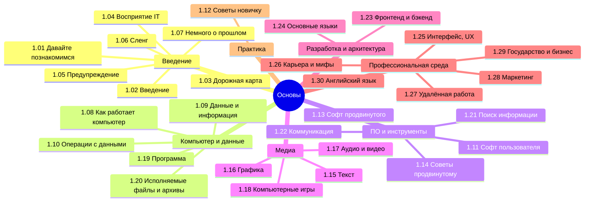

  ОБЯЗАТЕЛЬНО
  ДЛЯ НОВИЧКОВ

---

## О разделе

Вообще, лучше воспользуйтесь содержанием или перейдите к Базе знаний. Но для удобства, я размещу здесь ссылки на основные главы раздела:

---

## Знакомство

<ul>
  <li>
  <ul>
  Давайте познакомимся
  <li><a href="/encyclopedia/Основы/1.01.%20Давайте%20познакомимся/1">1.01. Давайте познакомимся</a></li>
  </ul>
  </li>
</ul>

---

## Введение

<ul>
  <li>
  <ul>
  Введение
  <li><a href="/encyclopedia/Основы/1.02.%20Введение/1">1.02. Введение</a></li>
  <li><a href="/encyclopedia/Основы/1.02.%20Введение/2">1.02. Архитектура знаний</a></li>
  </ul>
  </li>
</ul>

---

## Дорожная карта изучения

<ul>
  <li>
  <ul>
  Дорожная карта изучения
  <li><a href="/encyclopedia/Основы/1.03.%20Дорожная%20карта%20изучения/1">1.03. Дорожная карта изучения</a></li>
  <li><a href="/encyclopedia/Основы/1.03.%20Дорожная%20карта%20изучения/2">1.03. Тест на готовность к программированию</a></li>
  <li><a href="/encyclopedia/Основы/1.03.%20Дорожная%20карта%20изучения/211">1.03. Тест на компьютерную грамотность</a></li>
  <li><a href="/encyclopedia/Основы/1.03.%20Дорожная%20карта%20изучения/212">1.03. Тест на готовность к работе с данными</a></li>
  <li><a href="/encyclopedia/Основы/1.03.%20Дорожная%20карта%20изучения/213">1.03. Тест на готовность к веб-разработке</a></li>
  </ul>
  </li>
  
</ul>

---

## Как видят IT обычные люди

<ul>
  
  <li>
  <ul>
  Как видят IT обычные люди
  <li><a href="/encyclopedia/Основы/1.04.%20Как%20видят%20IT%20обычные%20люди/1">1.04. Как видят IT обычные люди</a></li>
  <li><a href="/encyclopedia/Основы/1.04.%20Как%20видят%20IT%20обычные%20люди/2">1.04. Связь IT с другими сферами</a></li>
  <li><a href="/encyclopedia/Основы/1.04.%20Как%20видят%20IT%20обычные%20люди/3">1.04. Какие бывают технологии</a></li>
  <li><a href="/encyclopedia/Основы/1.04.%20Как%20видят%20IT%20обычные%20люди/4">1.04. Оборот денег в IT</a></li>
  <li><a href="/encyclopedia/Основы/1.04.%20Как%20видят%20IT%20обычные%20люди/5">1.04. Рынок</a></li>
  <li><a href="/encyclopedia/Основы/1.04.%20Как%20видят%20IT%20обычные%20люди/6">1.04. Секрет прост</a></li>
  <li><a href="/encyclopedia/Основы/1.04.%20Как%20видят%20IT%20обычные%20люди/7">1.04. IT в России</a></li>
  <li><a href="/encyclopedia/Основы/1.04.%20Как%20видят%20IT%20обычные%20люди/711">1.04. Техногиганты</a></li>
  <li><a href="/encyclopedia/Основы/1.04.%20Как%20видят%20IT%20обычные%20люди/98">1.04. Итоги</a></li>
  <li><a href="/encyclopedia/Основы/1.04.%20Как%20видят%20IT%20обычные%20люди/99">1.04. Чек-лист самопроверки</a></li>
  </ul>
  </li>
  
</ul>

---

## Предупреждение

<ul>
  
  <li>
  <ul>
  Предупреждение
  <li><a href="/encyclopedia/Основы/1.05.%20Предупреждение/1">1.05. Предупреждение</a></li>
  <li><a href="/encyclopedia/Основы/1.05.%20Предупреждение/2">1.05. Иллюзия вечности</a></li>
  <li><a href="/encyclopedia/Основы/1.05.%20Предупреждение/3">1.05. Рекомендации</a></li>
  <li><a href="/encyclopedia/Основы/1.05.%20Предупреждение/4">1.05. Мыльный пузырь</a></li>
  </ul>
  </li>
  
</ul>

---

## Сленг

<ul>
  
  <li>
  <ul>
  Сленг
  <li><a href="/encyclopedia/Основы/1.06.%20Сленг/1">1.06. Сленг</a></li>
  </ul>
  </li>
  
</ul>

---

## Немного о прошлом

<ul>
  
  <li>
  <ul>
  Немного о прошлом
  <li><a href="/encyclopedia/Основы/1.07.%20Немного%20о%20прошлом/1">1.07. Немного о прошлом</a></li>
  <li><a href="/encyclopedia/Основы/1.07.%20Немного%20о%20прошлом/2">1.07. Крайняя древность</a></li>
  <li><a href="/encyclopedia/Основы/1.07.%20Немного%20о%20прошлом/3">1.07. Развитие софта</a></li>
  <li><a href="/encyclopedia/Основы/1.07.%20Немного%20о%20прошлом/4">1.07. Интернет</a></li>
  <li><a href="/encyclopedia/Основы/1.07.%20Немного%20о%20прошлом/5">1.07. Языки</a></li>
  <li><a href="/encyclopedia/Основы/1.07.%20Немного%20о%20прошлом/6">1.07. Методологии</a></li>
  <li><a href="/encyclopedia/Основы/1.07.%20Немного%20о%20прошлом/98">1.07. Итоги</a></li>
  <li><a href="/encyclopedia/Основы/1.07.%20Немного%20о%20прошлом/99">1.07. Чек-лист самопроверки</a></li>
  </ul>
  </li>
  
</ul>

---

## Как работает компьютер

<ul>
  
  <li>
  <ul>
  Как работает компьютер
  <li><a href="/encyclopedia/Основы/1.08.%20Как%20работает%20компьютер/1">1.08. Как работает компьютер</a></li>
  <li><a href="/encyclopedia/Основы/1.08.%20Как%20работает%20компьютер/2">1.08. Базовое железо</a></li>
  <li><a href="/encyclopedia/Основы/1.08.%20Как%20работает%20компьютер/3">1.08. Хранилище</a></li>
  <li><a href="/encyclopedia/Основы/1.08.%20Как%20работает%20компьютер/4">1.08. Видеокарта</a></li>
  <li><a href="/encyclopedia/Основы/1.08.%20Как%20работает%20компьютер/5">1.08. Прочие устройства</a></li>
  <li><a href="/encyclopedia/Основы/1.08.%20Как%20работает%20компьютер/6">1.08. Загрузчики</a></li>
  <li><a href="/encyclopedia/Основы/1.08.%20Как%20работает%20компьютер/7">1.08. Как устроен компьютер</a></li>
  <li><a href="/encyclopedia/Основы/1.08.%20Как%20работает%20компьютер/711">1.08. Ноутбуки</a></li>
  <li><a href="/encyclopedia/Основы/1.08.%20Как%20работает%20компьютер/712">1.08. Мобильные устройства</a></li>
  <li><a href="/encyclopedia/Основы/1.08.%20Как%20работает%20компьютер/713">1.08. Клавиатура</a></li>
  <li><a href="/encyclopedia/Основы/1.08.%20Как%20работает%20компьютер/714">1.08. Мышь и геймпад</a></li>
  <li><a href="/encyclopedia/Основы/1.08.%20Как%20работает%20компьютер/715">1.08. Аудиоустройства</a></li>
  <li><a href="/encyclopedia/Основы/1.08.%20Как%20работает%20компьютер/716">1.08. Дисплеи</a></li>
  <li><a href="/encyclopedia/Основы/1.08.%20Как%20работает%20компьютер/8">1.08. ЭВМ</a></li>
  <li><a href="/encyclopedia/Основы/1.08.%20Как%20работает%20компьютер/81">1.08. Справочник по характеристикам устройств</a></li>
  <li><a href="/encyclopedia/Основы/1.08.%20Как%20работает%20компьютер/9">1.08. Автоматизация и автоматика</a></li>
  <li><a href="/encyclopedia/Основы/1.08.%20Как%20работает%20компьютер/9111">1.08. Аккумуляторы</a></li>
  <li><a href="/encyclopedia/Основы/1.08.%20Как%20работает%20компьютер/98">1.08. Итоги</a></li>
  <li><a href="/encyclopedia/Основы/1.08.%20Как%20работает%20компьютер/99">1.08. Чек-лист самопроверки</a></li>
  </ul>
  </li>
  
</ul>

---

## Данные и информация

<ul>
  
  <li>
  <ul>
  Данные и информация
  <li><a href="/encyclopedia/Основы/1.09.%20Данные%20и%20информация/1">1.09. Данные и информация</a></li>
  <li><a href="/encyclopedia/Основы/1.09.%20Данные%20и%20информация/2">1.09. Виды информации</a></li>
  <li><a href="/encyclopedia/Основы/1.09.%20Данные%20и%20информация/3">1.09. Типы данных</a></li>
  <li><a href="/encyclopedia/Основы/1.09.%20Данные%20и%20информация/4">1.09. Типизация</a></li>
  <li><a href="/encyclopedia/Основы/1.09.%20Данные%20и%20информация/5">1.09. Метаданные</a></li>
  <li><a href="/encyclopedia/Основы/1.09.%20Данные%20и%20информация/98">1.09. Итоги</a></li>
  <li><a href="/encyclopedia/Основы/1.09.%20Данные%20и%20информация/99">1.09. Чек-лист самопроверки</a></li>
  </ul>
  </li>
  
</ul>

---

## Базовые операции с данными

<ul>
  
  <li>
  <ul>
  Базовые операции с данными
  <li><a href="/encyclopedia/Основы/1.10.%20Базовые%20операции%20с%20данными/1">1.10. Ввод и вывод</a></li>
  <li><a href="/encyclopedia/Основы/1.10.%20Базовые%20операции%20с%20данными/2">1.10. Чтение и запись</a></li>
  <li><a href="/encyclopedia/Основы/1.10.%20Базовые%20операции%20с%20данными/3">1.10. Кэш</a></li>
  <li><a href="/encyclopedia/Основы/1.10.%20Базовые%20операции%20с%20данными/4">1.10. Манипуляции с данными</a></li>
  <li><a href="/encyclopedia/Основы/1.10.%20Базовые%20операции%20с%20данными/98">1.10. Итоги</a></li>
  <li><a href="/encyclopedia/Основы/1.10.%20Базовые%20операции%20с%20данными/99">1.10. Чек-лист самопроверки</a></li>
  </ul>
  </li>
  
</ul>

---

## Софт рядового пользователя

<ul>
  
  <li>
  <ul>
  Софт рядового пользователя
  <li><a href="/encyclopedia/Основы/1.11.%20Софт%20рядового%20пользователя/1">1.11. Системные приложения</a></li>
  <li><a href="/encyclopedia/Основы/1.11.%20Софт%20рядового%20пользователя/2">1.11. Медиа</a></li>
  <li><a href="/encyclopedia/Основы/1.11.%20Софт%20рядового%20пользователя/3">1.11. Браузеры</a></li>
  <li><a href="/encyclopedia/Основы/1.11.%20Софт%20рядового%20пользователя/4">1.11. Видеосвязь</a></li>
  <li><a href="/encyclopedia/Основы/1.11.%20Софт%20рядового%20пользователя/5">1.11. Мессенджеры</a></li>
  <li><a href="/encyclopedia/Основы/1.11.%20Софт%20рядового%20пользователя/51">1.11. Офисные пакеты</a></li>
  <li><a href="/encyclopedia/Основы/1.11.%20Софт%20рядового%20пользователя/6">1.11. Графика и видео</a></li>
  <li><a href="/encyclopedia/Основы/1.11.%20Софт%20рядового%20пользователя/7">1.11. Безопасность</a></li>
  <li><a href="/encyclopedia/Основы/1.11.%20Софт%20рядового%20пользователя/98">1.11. Итоги</a></li>
  <li><a href="/encyclopedia/Основы/1.11.%20Софт%20рядового%20пользователя/99">1.11. Чек-лист самопроверки</a></li>
  </ul>
  </li>
  
</ul>

---

## Советы для новичка

<ul>
  
  <li>
  <ul>
  Советы для новичка
  <li><a href="/encyclopedia/Основы/1.12.%20Советы%20для%20новичка/1">1.12. Советы для новичка</a></li>
  <li><a href="/encyclopedia/Основы/1.12.%20Советы%20для%20новичка/11">1.12. Гайд по настройке Windows</a></li>
  <li><a href="/encyclopedia/Основы/1.12.%20Советы%20для%20новичка/111">1.12. Родительский контроль</a></li>
  <li><a href="/encyclopedia/Основы/1.12.%20Советы%20для%20новичка/1111">1.12. Работа с проводником</a></li>
  <li><a href="/encyclopedia/Основы/1.12.%20Советы%20для%20новичка/1112">1.12. Техника безопасности</a></li>
  <li><a href="/encyclopedia/Основы/1.12.%20Советы%20для%20новичка/2">1.12. Эргономика</a></li>
  <li><a href="/encyclopedia/Основы/1.12.%20Советы%20для%20новичка/3">1.12. Эффективная работа с системой</a></li>
  <li><a href="/encyclopedia/Основы/1.12.%20Советы%20для%20новичка/31">1.12. Работа с памятью смартфона</a></li>
  <li><a href="/encyclopedia/Основы/1.12.%20Советы%20для%20новичка/311">1.12. Адресная книга</a></li>
  <li><a href="/encyclopedia/Основы/1.12.%20Советы%20для%20новичка/312">1.12. Как ускорить интернет на компьютере</a></li>
  <li><a href="/encyclopedia/Основы/1.12.%20Советы%20для%20новичка/4">1.12. Блоки для детей</a></li>
  <li><a href="/encyclopedia/Основы/1.12.%20Советы%20для%20новичка/5">1.12. Как делать скриншоты</a></li>
  <li><a href="/encyclopedia/Основы/1.12.%20Советы%20для%20новичка/6">1.12. Как настроить телефон для пожилых людей</a></li>
  <li><a href="/encyclopedia/Основы/1.12.%20Советы%20для%20новичка/98">1.12. Итоги</a></li>
  <li><a href="/encyclopedia/Основы/1.12.%20Советы%20для%20новичка/99">1.12. Чек-лист самопроверки</a></li>
  </ul>
  </li>
  
</ul>

---

## Софт продвинутого пользователя

<ul>
  
  <li>
  <ul>
  Софт продвинутого пользователя
  <li><a href="/encyclopedia/Основы/1.13.%20Софт%20продвинутого%20пользователя/1">1.13. Софт продвинутого пользователя</a></li>
  <li><a href="/encyclopedia/Основы/1.13.%20Софт%20продвинутого%20пользователя/2">1.13. Файловые менеджеры и утилиты</a></li>
  <li><a href="/encyclopedia/Основы/1.13.%20Софт%20продвинутого%20пользователя/3">1.13. Разработка и программирование</a></li>
  <li><a href="/encyclopedia/Основы/1.13.%20Софт%20продвинутого%20пользователя/4">1.13. Графика, дизайн и 3D</a></li>
  <li><a href="/encyclopedia/Основы/1.13.%20Софт%20продвинутого%20пользователя/5">1.13. Сетевые и системные утилиты</a></li>
  <li><a href="/encyclopedia/Основы/1.13.%20Софт%20продвинутого%20пользователя/6">1.13. Автоматизация и бизнес-процессы</a></li>
  <li><a href="/encyclopedia/Основы/1.13.%20Софт%20продвинутого%20пользователя/7">1.13. Безопасность и администрирование</a></li>
  <li><a href="/encyclopedia/Основы/1.13.%20Софт%20продвинутого%20пользователя/8">1.13. Виртуализация и работа с ОС</a></li>
  <li><a href="/encyclopedia/Основы/1.13.%20Софт%20продвинутого%20пользователя/9">1.13. Дополнительные полезные инструменты</a></li>
  <li><a href="/encyclopedia/Основы/1.13.%20Софт%20продвинутого%20пользователя/98">1.13. Итоги</a></li>
  <li><a href="/encyclopedia/Основы/1.13.%20Софт%20продвинутого%20пользователя/99">1.13. Чек-лист самопроверки</a></li>
  </ul>
  </li>
  
</ul>

---

## Советы для продвинутого

<ul>
  
  <li>
  <ul>
  Советы для продвинутого
  <li><a href="/encyclopedia/Основы/1.14.%20Советы%20для%20продвинутого/1">1.14. Советы для продвинутых</a></li>
  <li><a href="/encyclopedia/Основы/1.14.%20Советы%20для%20продвинутого/2">1.14. Безопасность</a></li>
  <li><a href="/encyclopedia/Основы/1.14.%20Советы%20для%20продвинутого/3">1.14. Мониторинг и логи</a></li>
  <li><a href="/encyclopedia/Основы/1.14.%20Советы%20для%20продвинутого/4">1.14. Резервное копирование</a></li>
  <li><a href="/encyclopedia/Основы/1.14.%20Советы%20для%20продвинутого/5">1.14. Железо и производительность</a></li>
  <li><a href="/encyclopedia/Основы/1.14.%20Советы%20для%20продвинутого/6">1.14. Уход за железом</a></li>
  <li><a href="/encyclopedia/Основы/1.14.%20Советы%20для%20продвинутого/7">1.14. Троттлинг, тормоза и зависания</a></li>
  <li><a href="/encyclopedia/Основы/1.14.%20Советы%20для%20продвинутого/98">1.14. Итоги</a></li>
  <li><a href="/encyclopedia/Основы/1.14.%20Советы%20для%20продвинутого/99">1.14. Чек-лист самопроверки</a></li>
  </ul>
  </li>
  
</ul>

---

## Текст

<ul>
  
  <li>
  <ul>
  Текст
  <li><a href="/encyclopedia/Основы/1.15.%20Текст/1">1.15. Текст</a></li>
  <li><a href="/encyclopedia/Основы/1.15.%20Текст/2">1.15. Офисные форматы</a></li>
  <li><a href="/encyclopedia/Основы/1.15.%20Текст/211">1.15. Работа с Word</a></li>
  <li><a href="/encyclopedia/Основы/1.15.%20Текст/3">1.15. Структурированные данные</a></li>
  <li><a href="/encyclopedia/Основы/1.15.%20Текст/4">1.15. XLSX</a></li>
  <li><a href="/encyclopedia/Основы/1.15.%20Текст/41">1.15. Справочник по Excel</a></li>
  <li><a href="/encyclopedia/Основы/1.15.%20Текст/5">1.15. Веб-технологии</a></li>
  <li><a href="/encyclopedia/Основы/1.15.%20Текст/6">1.15. Файлы исходного кода</a></li>
  <li><a href="/encyclopedia/Основы/1.15.%20Текст/7">1.15. Электронные книги</a></li>
  <li><a href="/encyclopedia/Основы/1.15.%20Текст/98">1.15. Итоги</a></li>
  <li><a href="/encyclopedia/Основы/1.15.%20Текст/99">1.15. Чек-лист самопроверки</a></li>
  </ul>
  </li>
  
</ul>

---

## Графика

<ul>
  
  <li>
  <ul>
  Графика
  <li><a href="/encyclopedia/Основы/1.16.%20Графика/1">1.16. Графика</a></li>
  <li><a href="/encyclopedia/Основы/1.16.%20Графика/2">1.16. Вектор и растр</a></li>
  <li><a href="/encyclopedia/Основы/1.16.%20Графика/3">1.16. Растровые форматы</a></li>
  <li><a href="/encyclopedia/Основы/1.16.%20Графика/4">1.16. Векторные форматы</a></li>
  <li><a href="/encyclopedia/Основы/1.16.%20Графика/5">1.16. Сравнение форматов</a></li>
  <li><a href="/encyclopedia/Основы/1.16.%20Графика/6">1.16. Графический дизайн</a></li>
  <li><a href="/encyclopedia/Основы/1.16.%20Графика/98">1.16. Итоги</a></li>
  <li><a href="/encyclopedia/Основы/1.16.%20Графика/99">1.16. Чек-лист самопроверки</a></li>
  </ul>
  </li>
  
</ul>

---

## Аудио и видео

<ul>
  
  <li>
  <ul>
  Аудио и видео
  <li><a href="/encyclopedia/Основы/1.17.%20Аудио%20и%20видео/1">1.17. Аудио и видео</a></li>
  <li><a href="/encyclopedia/Основы/1.17.%20Аудио%20и%20видео/2">1.17. Аудио ввод и вывод</a></li>
  <li><a href="/encyclopedia/Основы/1.17.%20Аудио%20и%20видео/3">1.17. Видео ввод и вывод</a></li>
  <li><a href="/encyclopedia/Основы/1.17.%20Аудио%20и%20видео/4">1.17. Воспроизведение</a></li>
  <li><a href="/encyclopedia/Основы/1.17.%20Аудио%20и%20видео/5">1.17. Редактирование</a></li>
  <li><a href="/encyclopedia/Основы/1.17.%20Аудио%20и%20видео/6">1.17. Разбор форматов</a></li>
  <li><a href="/encyclopedia/Основы/1.17.%20Аудио%20и%20видео/98">1.17. Итоги</a></li>
  <li><a href="/encyclopedia/Основы/1.17.%20Аудио%20и%20видео/99">1.17. Чек-лист самопроверки</a></li>
  </ul>
  </li>
  
</ul>

---

## Компьютерные игры

<ul>
  
  <li>
  <ul>
  Компьютерные игры
  <li><a href="/encyclopedia/Основы/1.18.%20Компьютерные%20игры/1">1.18. Компьютерные игры</a></li>
  <li><a href="/encyclopedia/Основы/1.18.%20Компьютерные%20игры/2">1.18. Классификация игр</a></li>
  <li><a href="/encyclopedia/Основы/1.18.%20Компьютерные%20игры/3">1.18. Архитектура компьютерной игры</a></li>
  <li><a href="/encyclopedia/Основы/1.18.%20Компьютерные%20игры/4">1.18. Система ввода и интерфейс</a></li>
  <li><a href="/encyclopedia/Основы/1.18.%20Компьютерные%20игры/5">1.18. Игровая логика и правила</a></li>
  <li><a href="/encyclopedia/Основы/1.18.%20Компьютерные%20игры/6">1.18. Игры как объект изучения в IT</a></li>
  <li><a href="/encyclopedia/Основы/1.18.%20Компьютерные%20игры/98">1.18. Итоги</a></li>
  <li><a href="/encyclopedia/Основы/1.18.%20Компьютерные%20игры/99">1.18. Чек-лист самопроверки</a></li>
  </ul>
  </li>
  
</ul>

---

## Что такое программа?

<ul>
  
  <li>
  <ul>
  Что такое программа?
  <li><a href="/encyclopedia/Основы/1.19.%20Программа/1">1.19. Что такое программа?</a></li>
  <li><a href="/encyclopedia/Основы/1.19.%20Программа/111">1.19. ПО и система</a></li>
  <li><a href="/encyclopedia/Основы/1.19.%20Программа/112">1.19. Виды программ</a></li>
  <li><a href="/encyclopedia/Основы/1.19.%20Программа/113">1.19. Поведение системы</a></li>
  <li><a href="/encyclopedia/Основы/1.19.%20Программа/114">1.19. Установка, изменение и обновление</a></li>
  <li><a href="/encyclopedia/Основы/1.19.%20Программа/115">1.19. Работа программ с системой</a></li>
  <li><a href="/encyclopedia/Основы/1.19.%20Программа/2">1.19. Компиляторы и интерпретаторы</a></li>
  <li><a href="/encyclopedia/Основы/1.19.%20Программа/3">1.19. Мобильные приложения</a></li>
  <li><a href="/encyclopedia/Основы/1.19.%20Программа/98">1.19. Итоги</a></li>
  <li><a href="/encyclopedia/Основы/1.19.%20Программа/99">1.19. Чек-лист самопроверки</a></li>
  </ul>
  </li>
  
</ul>

---

## Исполняемые файлы и архивы

<ul>
  
  <li>
  <ul>
  Исполняемые файлы и архивы
  <li><a href="/encyclopedia/Основы/1.20.%20Исполняемые%20файлы%20и%20архивы/1">1.20. Исполняемые файлы</a></li>
  <li><a href="/encyclopedia/Основы/1.20.%20Исполняемые%20файлы%20и%20архивы/2">1.20. Архивы и установочные пакеты</a></li>
  <li><a href="/encyclopedia/Основы/1.20.%20Исполняемые%20файлы%20и%20архивы/3">1.20. Конфигурационные файлы</a></li>
  <li><a href="/encyclopedia/Основы/1.20.%20Исполняемые%20файлы%20и%20архивы/4">1.20. Специализированные форматы</a></li>
  <li><a href="/encyclopedia/Основы/1.20.%20Исполняемые%20файлы%20и%20архивы/98">1.20. Итоги</a></li>
  <li><a href="/encyclopedia/Основы/1.20.%20Исполняемые%20файлы%20и%20архивы/99">1.20. Чек-лист самопроверки</a></li>
  </ul>
  </li>
  
</ul>

---

## Поиск информации

<ul>
  
  <li>
  <ul>
  Поиск информации
  <li><a href="/encyclopedia/Основы/1.21.%20Поиск%20информации/1">1.21. Как работает поисковик</a></li>
  <li><a href="/encyclopedia/Основы/1.21.%20Поиск%20информации/2">1.21. Языки запросов</a></li>
  <li><a href="/encyclopedia/Основы/1.21.%20Поиск%20информации/3">1.21. Как правильно гуглить</a></li>
  <li><a href="/encyclopedia/Основы/1.21.%20Поиск%20информации/4">1.21. Популярные поисковики</a></li>
  <li><a href="/encyclopedia/Основы/1.21.%20Поиск%20информации/98">1.21. Итоги</a></li>
  <li><a href="/encyclopedia/Основы/1.21.%20Поиск%20информации/99">1.21. Чек-лист самопроверки</a></li>
  </ul>
  </li>
  
</ul>

---

## Коммуникация и общение

<ul>
  
  <li>
  <ul>
  Коммуникация и общение
  <li><a href="/encyclopedia/Основы/1.22.%20Коммуникация%20и%20общение/1">1.22. Коммуникация и общение</a></li>
  <li><a href="/encyclopedia/Основы/1.22.%20Коммуникация%20и%20общение/2">1.22. Чаты</a></li>
  <li><a href="/encyclopedia/Основы/1.22.%20Коммуникация%20и%20общение/3">1.22. Электронная почта</a></li>
  <li><a href="/encyclopedia/Основы/1.22.%20Коммуникация%20и%20общение/4">1.22. Встречи и звонки</a></li>
  <li><a href="/encyclopedia/Основы/1.22.%20Коммуникация%20и%20общение/5">1.22. Иерархия в организациях и основы субординации</a></li>
  <li><a href="/encyclopedia/Основы/1.22.%20Коммуникация%20и%20общение/6">1.22. Формы и анкеты</a></li>
  <li><a href="/encyclopedia/Основы/1.22.%20Коммуникация%20и%20общение/98">1.22. Итоги</a></li>
  <li><a href="/encyclopedia/Основы/1.22.%20Коммуникация%20и%20общение/99">1.22. Чек-лист самопроверки</a></li>
  </ul>
  </li>
  
</ul>

---

## Фронтенд и бэкенд

<ul>
  
  <li>
  <ul>
  Фронтенд и бэкенд
  <li><a href="/encyclopedia/Основы/1.23.%20Фронтенд%20и%20бэкенд/1">1.23. Фронтенд</a></li>
  <li><a href="/encyclopedia/Основы/1.23.%20Фронтенд%20и%20бэкенд/2">1.23. Бэкенд</a></li>
  <li><a href="/encyclopedia/Основы/1.23.%20Фронтенд%20и%20бэкенд/3">1.23. Метрики производительности системы</a></li>
  <li><a href="/encyclopedia/Основы/1.23.%20Фронтенд%20и%20бэкенд/98">1.23. Итоги</a></li>
  <li><a href="/encyclopedia/Основы/1.23.%20Фронтенд%20и%20бэкенд/99">1.23. Чек-лист самопроверки</a></li>
  </ul>
  </li>
  
</ul>

---

## Основные языки

<ul>
  
  <li>
  <ul>
  Основные языки
  <li><a href="/encyclopedia/Основы/1.24.%20Основные%20языки/1">1.24. Основные языки</a></li>
  <li><a href="/encyclopedia/Основы/1.24.%20Основные%20языки/2">1.24. Общие языки</a></li>
  <li><a href="/encyclopedia/Основы/1.24.%20Основные%20языки/3">1.24. Языки запросов</a></li>
  <li><a href="/encyclopedia/Основы/1.24.%20Основные%20языки/4">1.24. Языки разметки</a></li>
  <li><a href="/encyclopedia/Основы/1.24.%20Основные%20языки/5">1.24. Языки стилей</a></li>
  <li><a href="/encyclopedia/Основы/1.24.%20Основные%20языки/6">1.24. Языки программирования</a></li>
  <li><a href="/encyclopedia/Основы/1.24.%20Основные%20языки/7">1.24. Визуальные языки</a></li>
  <li><a href="/encyclopedia/Основы/1.24.%20Основные%20языки/98">1.24. Итоги</a></li>
  <li><a href="/encyclopedia/Основы/1.24.%20Основные%20языки/99">1.24. Чек-лист самопроверки</a></li>
  </ul>
  </li>
  
</ul>

---

## Интерфейс

<ul>
  
  <li>
  <ul>
  Интерфейс
  <li><a href="/encyclopedia/Основы/1.25.%20Интерфейс/1">1.25. UX UI</a></li>
  <li><a href="/encyclopedia/Основы/1.25.%20Интерфейс/2">1.25. Визуальные элементы</a></li>
  <li><a href="/encyclopedia/Основы/1.25.%20Интерфейс/3">1.25. Функциональные элементы</a></li>
  <li><a href="/encyclopedia/Основы/1.25.%20Интерфейс/4">1.25. Навигационные элементы</a></li>
  <li><a href="/encyclopedia/Основы/1.25.%20Интерфейс/5">1.25. Элементы обратной связи</a></li>
  <li><a href="/encyclopedia/Основы/1.25.%20Интерфейс/6">1.25. Особенности и принципы UX и UI</a></li>
  <li><a href="/encyclopedia/Основы/1.25.%20Интерфейс/98">1.25. Итоги</a></li>
  <li><a href="/encyclopedia/Основы/1.25.%20Интерфейс/99">1.25. Чек-лист самопроверки</a></li>
  </ul>
  </li>
  
</ul>

---

## Карьера в IT и мифы

<ul>
  
  <li>
  <ul>
  Карьера в IT и мифы
  <li><a href="/encyclopedia/Основы/1.26.%20Карьера%20в%20IT%20и%20мифы/1">1.26. Карьера в IT и мифы</a></li>
  <li><a href="/encyclopedia/Основы/1.26.%20Карьера%20в%20IT%20и%20мифы/2">1.26. Специализации</a></li>
  <li><a href="/encyclopedia/Основы/1.26.%20Карьера%20в%20IT%20и%20мифы/3">1.26. Этапы карьерного роста в IT</a></li>
  <li><a href="/encyclopedia/Основы/1.26.%20Карьера%20в%20IT%20и%20мифы/4">1.26. Технические собеседования</a></li>
  <li><a href="/encyclopedia/Основы/1.26.%20Карьера%20в%20IT%20и%20мифы/5">1.26. Корректные вопросы на собеседовании</a></li>
  <li><a href="/encyclopedia/Основы/1.26.%20Карьера%20в%20IT%20и%20мифы/6">1.26. Работа с HR</a></li>
  <li><a href="/encyclopedia/Основы/1.26.%20Карьера%20в%20IT%20и%20мифы/61">1.26. Образование в IT</a></li>
  <li><a href="/encyclopedia/Основы/1.26.%20Карьера%20в%20IT%20и%20мифы/7">1.26. Профиль и свои проекты</a></li>
  <li><a href="/encyclopedia/Основы/1.26.%20Карьера%20в%20IT%20и%20мифы/8">1.26. Виды занятости</a></li>
  <li><a href="/encyclopedia/Основы/1.26.%20Карьера%20в%20IT%20и%20мифы/9">1.26. Проблемы рынка труда и фриланса</a></li>
  <li><a href="/encyclopedia/Основы/1.26.%20Карьера%20в%20IT%20и%20мифы/91">1.26. Распространённые мифы</a></li>
  <li><a href="/encyclopedia/Основы/1.26.%20Карьера%20в%20IT%20и%20мифы/911">1.26. Построение своего карьерного плана</a></li>
  <li><a href="/encyclopedia/Основы/1.26.%20Карьера%20в%20IT%20и%20мифы/92">1.26. Что мешает росту</a></li>
  <li><a href="/encyclopedia/Основы/1.26.%20Карьера%20в%20IT%20и%20мифы/98">1.26. Итоги</a></li>
  <li><a href="/encyclopedia/Основы/1.26.%20Карьера%20в%20IT%20и%20мифы/99">1.26. Чек-лист самопроверки</a></li>
  </ul>
  </li>
  
</ul>

---

## Удаленная работа

<ul>
  
  <li>
  <ul>
  Удаленная работа
  <li><a href="/encyclopedia/Основы/1.27.%20Удаленная%20работа/1">1.27. Удаленная работа</a></li>
  <li><a href="/encyclopedia/Основы/1.27.%20Удаленная%20работа/98">1.27. Итоги</a></li>
  <li><a href="/encyclopedia/Основы/1.27.%20Удаленная%20работа/99">1.27. Чек-лист самопроверки</a></li>
  </ul>
  </li>
  
</ul>

---

## Маркетинг и распространение

<ul>
  
  <li>
  <ul>
  Маркетинг и распространение
  <li><a href="/encyclopedia/Основы/1.28.%20Маркетинг%20и%20распространение/1">1.28. Маркетинг и распространение</a></li>
  <li><a href="/encyclopedia/Основы/1.28.%20Маркетинг%20и%20распространение/2">1.28. Персонализированный маркетинг</a></li>
  <li><a href="/encyclopedia/Основы/1.28.%20Маркетинг%20и%20распространение/3">1.28. Потребительская грамотность</a></li>
  <li><a href="/encyclopedia/Основы/1.28.%20Маркетинг%20и%20распространение/998">1.28. Итоги</a></li>
  <li><a href="/encyclopedia/Основы/1.28.%20Маркетинг%20и%20распространение/999">1.28. Чек-лист самопроверки</a></li>
  </ul>
  </li>
  
</ul>

---

## Государство и бизнес

<ul>
  
  <li>
  <ul>
  Государство и бизнес
  <li><a href="/encyclopedia/Основы/1.29.%20Государство%20и%20бизнес/1">1.29. Государство</a></li>
  <li><a href="/encyclopedia/Основы/1.29.%20Государство%20и%20бизнес/111">1.29. Юридические и физические лица</a></li>
  <li><a href="/encyclopedia/Основы/1.29.%20Государство%20и%20бизнес/112">1.29. Базовые понятия бизнеса</a></li>
  <li><a href="/encyclopedia/Основы/1.29.%20Государство%20и%20бизнес/2">1.29. Бизнес</a></li>
  <li><a href="/encyclopedia/Основы/1.29.%20Государство%20и%20бизнес/998">1.29. Итоги</a></li>
  <li><a href="/encyclopedia/Основы/1.29.%20Государство%20и%20бизнес/999">1.29. Чек-лист самопроверки</a></li>
  </ul>
  </li>
  
</ul>

---

## Английский язык

<ul>
  
  <li>
  <ul>
  Английский язык
  <li><a href="/encyclopedia/Основы/1.30.%20Английский%20язык/1">1.30. Английский язык</a></li>
  <li><a href="/encyclopedia/Основы/1.30.%20Английский%20язык/2">1.30. Важные слова на английском</a></li>
  <li><a href="/encyclopedia/Основы/1.30.%20Английский%20язык/3">1.30. Аббревиатуры</a></li>
  <li><a href="/encyclopedia/Основы/1.30.%20Английский%20язык/4">1.30. Англицизмы</a></li>
  </ul>
  </li>
</ul>
---
