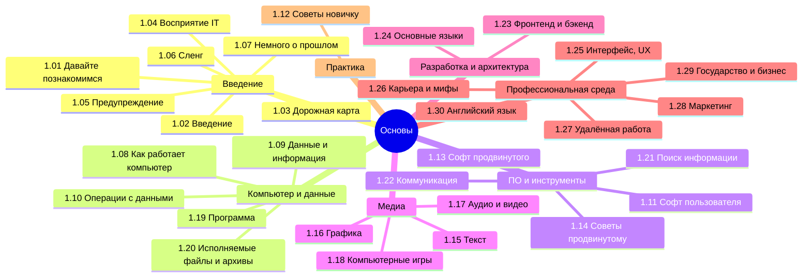

  ОБЯЗАТЕЛЬНО
  ДЛЯ НОВИЧКОВ

---

## О разделе

Вообще, лучше воспользуйтесь содержанием или перейдите к Базе знаний. Но для удобства, я размещу здесь ссылки на основные главы раздела:

---

## Знакомство

- [1.01. Давайте познакомимся](/encyclopedia/Основы/1.01.%20Давайте%20познакомимся/1)

---

## Введение

- [1.02. Введение](/encyclopedia/Основы/1.02.%20Введение/1)
- [1.02. Архитектура знаний](/encyclopedia/Основы/1.02.%20Введение/2)

---

## Дорожная карта изучения

- [1.03. Дорожная карта изучения](/encyclopedia/Основы/1.03.%20Дорожная%20карта%20изучения/1)
- [1.03. Тест на готовность к программированию](/encyclopedia/Основы/1.03.%20Дорожная%20карта%20изучения/2)
- [1.03. Тест на компьютерную грамотность](/encyclopedia/Основы/1.03.%20Дорожная%20карта%20изучения/211)
- [1.03. Тест на готовность к работе с данными](/encyclopedia/Основы/1.03.%20Дорожная%20карта%20изучения/212)
- [1.03. Тест на готовность к веб-разработке](/encyclopedia/Основы/1.03.%20Дорожная%20карта%20изучения/213)

---

## Как видят IT обычные люди

- [1.04. Как видят IT обычные люди](/encyclopedia/Основы/1.04.%20Как%20видят%20IT%20обычные%20люди/1)
- [1.04. Связь IT с другими сферами](/encyclopedia/Основы/1.04.%20Как%20видят%20IT%20обычные%20люди/2)
- [1.04. Какие бывают технологии](/encyclopedia/Основы/1.04.%20Как%20видят%20IT%20обычные%20люди/3)
- [1.04. Оборот денег в IT](/encyclopedia/Основы/1.04.%20Как%20видят%20IT%20обычные%20люди/4)
- [1.04. Рынок](/encyclopedia/Основы/1.04.%20Как%20видят%20IT%20обычные%20люди/5)
- [1.04. Секрет прост](/encyclopedia/Основы/1.04.%20Как%20видят%20IT%20обычные%20люди/6)
- [1.04. IT в России](/encyclopedia/Основы/1.04.%20Как%20видят%20IT%20обычные%20люди/7)
- [1.04. Техногиганты](/encyclopedia/Основы/1.04.%20Как%20видят%20IT%20обычные%20люди/711)
- [1.04. Итоги](/encyclopedia/Основы/1.04.%20Как%20видят%20IT%20обычные%20люди/98)
- [1.04. Чек-лист самопроверки](/encyclopedia/Основы/1.04.%20Как%20видят%20IT%20обычные%20люди/99)

---

## Предупреждение

- [1.05. Предупреждение](/encyclopedia/Основы/1.05.%20Предупреждение/1)
- [1.05. Иллюзия вечности](/encyclopedia/Основы/1.05.%20Предупреждение/2)
- [1.05. Рекомендации](/encyclopedia/Основы/1.05.%20Предупреждение/3)
- [1.05. Мыльный пузырь](/encyclopedia/Основы/1.05.%20Предупреждение/4)

---

## Сленг

- [1.06. Сленг](/encyclopedia/Основы/1.06.%20Сленг/1)

---

## Немного о прошлом

- [1.07. Немного о прошлом](/encyclopedia/Основы/1.07.%20Немного%20о%20прошлом/1)
- [1.07. Крайняя древность](/encyclopedia/Основы/1.07.%20Немного%20о%20прошлом/2)
- [1.07. Развитие софта](/encyclopedia/Основы/1.07.%20Немного%20о%20прошлом/3)
- [1.07. Интернет](/encyclopedia/Основы/1.07.%20Немного%20о%20прошлом/4)
- [1.07. Языки](/encyclopedia/Основы/1.07.%20Немного%20о%20прошлом/5)
- [1.07. Методологии](/encyclopedia/Основы/1.07.%20Немного%20о%20прошлом/6)
- [1.07. Итоги](/encyclopedia/Основы/1.07.%20Немного%20о%20прошлом/98)
- [1.07. Чек-лист самопроверки](/encyclopedia/Основы/1.07.%20Немного%20о%20прошлом/99)

---

## Как работает компьютер

- [1.08. Как работает компьютер](/encyclopedia/Основы/1.08.%20Как%20работает%20компьютер/1)
- [1.08. Базовое железо](/encyclopedia/Основы/1.08.%20Как%20работает%20компьютер/2)
- [1.08. Хранилище](/encyclopedia/Основы/1.08.%20Как%20работает%20компьютер/3)
- [1.08. Видеокарта](/encyclopedia/Основы/1.08.%20Как%20работает%20компьютер/4)
- [1.08. Прочие устройства](/encyclopedia/Основы/1.08.%20Как%20работает%20компьютер/5)
- [1.08. Загрузчики](/encyclopedia/Основы/1.08.%20Как%20работает%20компьютер/6)
- [1.08. Как устроен компьютер](/encyclopedia/Основы/1.08.%20Как%20работает%20компьютер/7)
- [1.08. Ноутбуки](/encyclopedia/Основы/1.08.%20Как%20работает%20компьютер/711)
- [1.08. Мобильные устройства](/encyclopedia/Основы/1.08.%20Как%20работает%20компьютер/712)
- [1.08. Клавиатура](/encyclopedia/Основы/1.08.%20Как%20работает%20компьютер/713)
- [1.08. Мышь и геймпад](/encyclopedia/Основы/1.08.%20Как%20работает%20компьютер/714)
- [1.08. Аудиоустройства](/encyclopedia/Основы/1.08.%20Как%20работает%20компьютер/715)
- [1.08. Дисплеи](/encyclopedia/Основы/1.08.%20Как%20работает%20компьютер/716)
- [1.08. ЭВМ](/encyclopedia/Основы/1.08.%20Как%20работает%20компьютер/8)
- [1.08. Справочник по характеристикам устройств](/encyclopedia/Основы/1.08.%20Как%20работает%20компьютер/81)
- [1.08. Автоматизация и автоматика](/encyclopedia/Основы/1.08.%20Как%20работает%20компьютер/9)
- [1.08. Аккумуляторы](/encyclopedia/Основы/1.08.%20Как%20работает%20компьютер/9111)
- [1.08. Итоги](/encyclopedia/Основы/1.08.%20Как%20работает%20компьютер/98)
- [1.08. Чек-лист самопроверки](/encyclopedia/Основы/1.08.%20Как%20работает%20компьютер/99)

---

## Данные и информация

- [1.09. Данные и информация](/encyclopedia/Основы/1.09.%20Данные%20и%20информация/1)
- [1.09. Виды информации](/encyclopedia/Основы/1.09.%20Данные%20и%20информация/2)
- [1.09. Типы данных](/encyclopedia/Основы/1.09.%20Данные%20и%20информация/3)
- [1.09. Типизация](/encyclopedia/Основы/1.09.%20Данные%20и%20информация/4)
- [1.09. Метаданные](/encyclopedia/Основы/1.09.%20Данные%20и%20информация/5)
- [1.09. Итоги](/encyclopedia/Основы/1.09.%20Данные%20и%20информация/98)
- [1.09. Чек-лист самопроверки](/encyclopedia/Основы/1.09.%20Данные%20и%20информация/99)

---

## Базовые операции с данными

- [1.10. Ввод и вывод](/encyclopedia/Основы/1.10.%20Базовые%20операции%20с%20данными/1)
- [1.10. Чтение и запись](/encyclopedia/Основы/1.10.%20Базовые%20операции%20с%20данными/2)
- [1.10. Кэш](/encyclopedia/Основы/1.10.%20Базовые%20операции%20с%20данными/3)
- [1.10. Манипуляции с данными](/encyclopedia/Основы/1.10.%20Базовые%20операции%20с%20данными/4)
- [1.10. Итоги](/encyclopedia/Основы/1.10.%20Базовые%20операции%20с%20данными/98)
- [1.10. Чек-лист самопроверки](/encyclopedia/Основы/1.10.%20Базовые%20операции%20с%20данными/99)

---

## Софт рядового пользователя

- [1.11. Системные приложения](/encyclopedia/Основы/1.11.%20Софт%20рядового%20пользователя/1)
- [1.11. Медиа](/encyclopedia/Основы/1.11.%20Софт%20рядового%20пользователя/2)
- [1.11. Браузеры](/encyclopedia/Основы/1.11.%20Софт%20рядового%20пользователя/3)
- [1.11. Видеосвязь](/encyclopedia/Основы/1.11.%20Софт%20рядового%20пользователя/4)
- [1.11. Мессенджеры](/encyclopedia/Основы/1.11.%20Софт%20рядового%20пользователя/5)
- [1.11. Офисные пакеты](/encyclopedia/Основы/1.11.%20Софт%20рядового%20пользователя/51)
- [1.11. Графика и видео](/encyclopedia/Основы/1.11.%20Софт%20рядового%20пользователя/6)
- [1.11. Безопасность](/encyclopedia/Основы/1.11.%20Софт%20рядового%20пользователя/7)
- [1.11. Итоги](/encyclopedia/Основы/1.11.%20Софт%20рядового%20пользователя/98)
- [1.11. Чек-лист самопроверки](/encyclopedia/Основы/1.11.%20Софт%20рядового%20пользователя/99)

---

## Советы для новичка

- [1.12. Советы для новичка](/encyclopedia/Основы/1.12.%20Советы%20для%20новичка/1)
- [1.12. Гайд по настройке Windows](/encyclopedia/Основы/1.12.%20Советы%20для%20новичка/11)
- [1.12. Родительский контроль](/encyclopedia/Основы/1.12.%20Советы%20для%20новичка/111)
- [1.12. Работа с проводником](/encyclopedia/Основы/1.12.%20Советы%20для%20новичка/1111)
- [1.12. Техника безопасности](/encyclopedia/Основы/1.12.%20Советы%20для%20новичка/1112)
- [1.12. Эргономика](/encyclopedia/Основы/1.12.%20Советы%20для%20новичка/2)
- [1.12. Эффективная работа с системой](/encyclopedia/Основы/1.12.%20Советы%20для%20новичка/3)
- [1.12. Работа с памятью смартфона](/encyclopedia/Основы/1.12.%20Советы%20для%20новичка/31)
- [1.12. Адресная книга](/encyclopedia/Основы/1.12.%20Советы%20для%20новичка/311)
- [1.12. Как ускорить интернет на компьютере](/encyclopedia/Основы/1.12.%20Советы%20для%20новичка/312)
- [1.12. Блоки для детей](/encyclopedia/Основы/1.12.%20Советы%20для%20новичка/4)
- [1.12. Как делать скриншоты](/encyclopedia/Основы/1.12.%20Советы%20для%20новичка/5)
- [1.12. Как настроить телефон для пожилых людей](/encyclopedia/Основы/1.12.%20Советы%20для%20новичка/6)
- [1.12. Итоги](/encyclopedia/Основы/1.12.%20Советы%20для%20новичка/98)
- [1.12. Чек-лист самопроверки](/encyclopedia/Основы/1.12.%20Советы%20для%20новичка/99)

---

## Софт продвинутого пользователя

- [1.13. Софт продвинутого пользователя](/encyclopedia/Основы/1.13.%20Софт%20продвинутого%20пользователя/1)
- [1.13. Файловые менеджеры и утилиты](/encyclopedia/Основы/1.13.%20Софт%20продвинутого%20пользователя/2)
- [1.13. Разработка и программирование](/encyclopedia/Основы/1.13.%20Софт%20продвинутого%20пользователя/3)
- [1.13. Графика, дизайн и 3D](/encyclopedia/Основы/1.13.%20Софт%20продвинутого%20пользователя/4)
- [1.13. Сетевые и системные утилиты](/encyclopedia/Основы/1.13.%20Софт%20продвинутого%20пользователя/5)
- [1.13. Автоматизация и бизнес-процессы](/encyclopedia/Основы/1.13.%20Софт%20продвинутого%20пользователя/6)
- [1.13. Безопасность и администрирование](/encyclopedia/Основы/1.13.%20Софт%20продвинутого%20пользователя/7)
- [1.13. Виртуализация и работа с ОС](/encyclopedia/Основы/1.13.%20Софт%20продвинутого%20пользователя/8)
- [1.13. Дополнительные полезные инструменты](/encyclopedia/Основы/1.13.%20Софт%20продвинутого%20пользователя/9)
- [1.13. Итоги](/encyclopedia/Основы/1.13.%20Софт%20продвинутого%20пользователя/98)
- [1.13. Чек-лист самопроверки](/encyclopedia/Основы/1.13.%20Софт%20продвинутого%20пользователя/99)

---

## Советы для продвинутого

- [1.14. Советы для продвинутых](/encyclopedia/Основы/1.14.%20Советы%20для%20продвинутого/1)
- [1.14. Безопасность](/encyclopedia/Основы/1.14.%20Советы%20для%20продвинутого/2)
- [1.14. Мониторинг и логи](/encyclopedia/Основы/1.14.%20Советы%20для%20продвинутого/3)
- [1.14. Резервное копирование](/encyclopedia/Основы/1.14.%20Советы%20для%20продвинутого/4)
- [1.14. Железо и производительность](/encyclopedia/Основы/1.14.%20Советы%20для%20продвинутого/5)
- [1.14. Уход за железом](/encyclopedia/Основы/1.14.%20Советы%20для%20продвинутого/6)
- [1.14. Троттлинг, тормоза и зависания](/encyclopedia/Основы/1.14.%20Советы%20для%20продвинутого/7)
- [1.14. Итоги](/encyclopedia/Основы/1.14.%20Советы%20для%20продвинутого/98)
- [1.14. Чек-лист самопроверки](/encyclopedia/Основы/1.14.%20Советы%20для%20продвинутого/99)

---

## Текст

- [1.15. Текст](/encyclopedia/Основы/1.15.%20Текст/1)
- [1.15. Офисные форматы](/encyclopedia/Основы/1.15.%20Текст/2)
- [1.15. Работа с Word](/encyclopedia/Основы/1.15.%20Текст/211)
- [1.15. Структурированные данные](/encyclopedia/Основы/1.15.%20Текст/3)
- [1.15. XLSX](/encyclopedia/Основы/1.15.%20Текст/4)
- [1.15. Справочник по Excel](/encyclopedia/Основы/1.15.%20Текст/41)
- [1.15. Веб-технологии](/encyclopedia/Основы/1.15.%20Текст/5)
- [1.15. Файлы исходного кода](/encyclopedia/Основы/1.15.%20Текст/6)
- [1.15. Электронные книги](/encyclopedia/Основы/1.15.%20Текст/7)
- [1.15. Итоги](/encyclopedia/Основы/1.15.%20Текст/98)
- [1.15. Чек-лист самопроверки](/encyclopedia/Основы/1.15.%20Текст/99)

---

## Графика

- [1.16. Графика](/encyclopedia/Основы/1.16.%20Графика/1)
- [1.16. Вектор и растр](/encyclopedia/Основы/1.16.%20Графика/2)
- [1.16. Растровые форматы](/encyclopedia/Основы/1.16.%20Графика/3)
- [1.16. Векторные форматы](/encyclopedia/Основы/1.16.%20Графика/4)
- [1.16. Сравнение форматов](/encyclopedia/Основы/1.16.%20Графика/5)
- [1.16. Графический дизайн](/encyclopedia/Основы/1.16.%20Графика/6)
- [1.16. Итоги](/encyclopedia/Основы/1.16.%20Графика/98)
- [1.16. Чек-лист самопроверки](/encyclopedia/Основы/1.16.%20Графика/99)

---

## Аудио и видео

- [1.17. Аудио и видео](/encyclopedia/Основы/1.17.%20Аудио%20и%20видео/1)
- [1.17. Аудио ввод и вывод](/encyclopedia/Основы/1.17.%20Аудио%20и%20видео/2)
- [1.17. Видео ввод и вывод](/encyclopedia/Основы/1.17.%20Аудио%20и%20видео/3)
- [1.17. Воспроизведение](/encyclopedia/Основы/1.17.%20Аудио%20и%20видео/4)
- [1.17. Редактирование](/encyclopedia/Основы/1.17.%20Аудио%20и%20видео/5)
- [1.17. Разбор форматов](/encyclopedia/Основы/1.17.%20Аудио%20и%20видео/6)
- [1.17. Итоги](/encyclopedia/Основы/1.17.%20Аудио%20и%20видео/98)
- [1.17. Чек-лист самопроверки](/encyclopedia/Основы/1.17.%20Аудио%20и%20видео/99)

---

## Компьютерные игры

- [1.18. Компьютерные игры](/encyclopedia/Основы/1.18.%20Компьютерные%20игры/1)
- [1.18. Классификация игр](/encyclopedia/Основы/1.18.%20Компьютерные%20игры/2)
- [1.18. Архитектура компьютерной игры](/encyclopedia/Основы/1.18.%20Компьютерные%20игры/3)
- [1.18. Система ввода и интерфейс](/encyclopedia/Основы/1.18.%20Компьютерные%20игры/4)
- [1.18. Игровая логика и правила](/encyclopedia/Основы/1.18.%20Компьютерные%20игры/5)
- [1.18. Игры как объект изучения в IT](/encyclopedia/Основы/1.18.%20Компьютерные%20игры/6)
- [1.18. Итоги](/encyclopedia/Основы/1.18.%20Компьютерные%20игры/98)
- [1.18. Чек-лист самопроверки](/encyclopedia/Основы/1.18.%20Компьютерные%20игры/99)

---

## Что такое программа?

- [1.19. Что такое программа?](/encyclopedia/Основы/1.19.%20Программа/1)
- [1.19. ПО и система](/encyclopedia/Основы/1.19.%20Программа/111)
- [1.19. Виды программ](/encyclopedia/Основы/1.19.%20Программа/112)
- [1.19. Поведение системы](/encyclopedia/Основы/1.19.%20Программа/113)
- [1.19. Установка, изменение и обновление](/encyclopedia/Основы/1.19.%20Программа/114)
- [1.19. Работа программ с системой](/encyclopedia/Основы/1.19.%20Программа/115)
- [1.19. Компиляторы и интерпретаторы](/encyclopedia/Основы/1.19.%20Программа/2)
- [1.19. Мобильные приложения](/encyclopedia/Основы/1.19.%20Программа/3)
- [1.19. Итоги](/encyclopedia/Основы/1.19.%20Программа/98)
- [1.19. Чек-лист самопроверки](/encyclopedia/Основы/1.19.%20Программа/99)

---

## Исполняемые файлы и архивы

- [1.20. Исполняемые файлы](/encyclopedia/Основы/1.20.%20Исполняемые%20файлы%20и%20архивы/1)
- [1.20. Архивы и установочные пакеты](/encyclopedia/Основы/1.20.%20Исполняемые%20файлы%20и%20архивы/2)
- [1.20. Конфигурационные файлы](/encyclopedia/Основы/1.20.%20Исполняемые%20файлы%20и%20архивы/3)
- [1.20. Специализированные форматы](/encyclopedia/Основы/1.20.%20Исполняемые%20файлы%20и%20архивы/4)
- [1.20. Итоги](/encyclopedia/Основы/1.20.%20Исполняемые%20файлы%20и%20архивы/98)
- [1.20. Чек-лист самопроверки](/encyclopedia/Основы/1.20.%20Исполняемые%20файлы%20и%20архивы/99)

---

## Поиск информации

- [1.21. Как работает поисковик](/encyclopedia/Основы/1.21.%20Поиск%20информации/1)
- [1.21. Языки запросов](/encyclopedia/Основы/1.21.%20Поиск%20информации/2)
- [1.21. Как правильно гуглить](/encyclopedia/Основы/1.21.%20Поиск%20информации/3)
- [1.21. Популярные поисковики](/encyclopedia/Основы/1.21.%20Поиск%20информации/4)
- [1.21. Итоги](/encyclopedia/Основы/1.21.%20Поиск%20информации/98)
- [1.21. Чек-лист самопроверки](/encyclopedia/Основы/1.21.%20Поиск%20информации/99)

---

## Коммуникация и общение

- [1.22. Коммуникация и общение](/encyclopedia/Основы/1.22.%20Коммуникация%20и%20общение/1)
- [1.22. Чаты](/encyclopedia/Основы/1.22.%20Коммуникация%20и%20общение/2)
- [1.22. Электронная почта](/encyclopedia/Основы/1.22.%20Коммуникация%20и%20общение/3)
- [1.22. Встречи и звонки](/encyclopedia/Основы/1.22.%20Коммуникация%20и%20общение/4)
- [1.22. Иерархия в организациях и основы субординации](/encyclopedia/Основы/1.22.%20Коммуникация%20и%20общение/5)
- [1.22. Формы и анкеты](/encyclopedia/Основы/1.22.%20Коммуникация%20и%20общение/6)
- [1.22. Итоги](/encyclopedia/Основы/1.22.%20Коммуникация%20и%20общение/98)
- [1.22. Чек-лист самопроверки](/encyclopedia/Основы/1.22.%20Коммуникация%20и%20общение/99)

---

## Фронтенд и бэкенд

- [1.23. Фронтенд](/encyclopedia/Основы/1.23.%20Фронтенд%20и%20бэкенд/1)
- [1.23. Бэкенд](/encyclopedia/Основы/1.23.%20Фронтенд%20и%20бэкенд/2)
- [1.23. Метрики производительности системы](/encyclopedia/Основы/1.23.%20Фронтенд%20и%20бэкенд/3)
- [1.23. Итоги](/encyclopedia/Основы/1.23.%20Фронтенд%20и%20бэкенд/98)
- [1.23. Чек-лист самопроверки](/encyclopedia/Основы/1.23.%20Фронтенд%20и%20бэкенд/99)

---

## Основные языки

- [1.24. Основные языки](/encyclopedia/Основы/1.24.%20Основные%20языки/1)
- [1.24. Общие языки](/encyclopedia/Основы/1.24.%20Основные%20языки/2)
- [1.24. Языки запросов](/encyclopedia/Основы/1.24.%20Основные%20языки/3)
- [1.24. Языки разметки](/encyclopedia/Основы/1.24.%20Основные%20языки/4)
- [1.24. Языки стилей](/encyclopedia/Основы/1.24.%20Основные%20языки/5)
- [1.24. Языки программирования](/encyclopedia/Основы/1.24.%20Основные%20языки/6)
- [1.24. Визуальные языки](/encyclopedia/Основы/1.24.%20Основные%20языки/7)
- [1.24. Итоги](/encyclopedia/Основы/1.24.%20Основные%20языки/98)
- [1.24. Чек-лист самопроверки](/encyclopedia/Основы/1.24.%20Основные%20языки/99)

---

## Интерфейс

- [1.25. UX UI](/encyclopedia/Основы/1.25.%20Интерфейс/1)
- [1.25. Визуальные элементы](/encyclopedia/Основы/1.25.%20Интерфейс/2)
- [1.25. Функциональные элементы](/encyclopedia/Основы/1.25.%20Интерфейс/3)
- [1.25. Навигационные элементы](/encyclopedia/Основы/1.25.%20Интерфейс/4)
- [1.25. Элементы обратной связи](/encyclopedia/Основы/1.25.%20Интерфейс/5)
- [1.25. Особенности и принципы UX и UI](/encyclopedia/Основы/1.25.%20Интерфейс/6)
- [1.25. Итоги](/encyclopedia/Основы/1.25.%20Интерфейс/98)
- [1.25. Чек-лист самопроверки](/encyclopedia/Основы/1.25.%20Интерфейс/99)

---

## Карьера в IT и мифы

- [1.26. Карьера в IT и мифы](/encyclopedia/Основы/1.26.%20Карьера%20в%20IT%20и%20мифы/1)
- [1.26. Специализации](/encyclopedia/Основы/1.26.%20Карьера%20в%20IT%20и%20мифы/2)
- [1.26. Этапы карьерного роста в IT](/encyclopedia/Основы/1.26.%20Карьера%20в%20IT%20и%20мифы/3)
- [1.26. Технические собеседования](/encyclopedia/Основы/1.26.%20Карьера%20в%20IT%20и%20мифы/4)
- [1.26. Корректные вопросы на собеседовании](/encyclopedia/Основы/1.26.%20Карьера%20в%20IT%20и%20мифы/5)
- [1.26. Работа с HR](/encyclopedia/Основы/1.26.%20Карьера%20в%20IT%20и%20мифы/6)
- [1.26. Образование в IT](/encyclopedia/Основы/1.26.%20Карьера%20в%20IT%20и%20мифы/61)
- [1.26. Профиль и свои проекты](/encyclopedia/Основы/1.26.%20Карьера%20в%20IT%20и%20мифы/7)
- [1.26. Виды занятости](/encyclopedia/Основы/1.26.%20Карьера%20в%20IT%20и%20мифы/8)
- [1.26. Проблемы рынка труда и фриланса](/encyclopedia/Основы/1.26.%20Карьера%20в%20IT%20и%20мифы/9)
- [1.26. Распространённые мифы](/encyclopedia/Основы/1.26.%20Карьера%20в%20IT%20и%20мифы/91)
- [1.26. Построение своего карьерного плана](/encyclopedia/Основы/1.26.%20Карьера%20в%20IT%20и%20мифы/911)
- [1.26. Что мешает росту](/encyclopedia/Основы/1.26.%20Карьера%20в%20IT%20и%20мифы/92)
- [1.26. Итоги](/encyclopedia/Основы/1.26.%20Карьера%20в%20IT%20и%20мифы/98)
- [1.26. Чек-лист самопроверки](/encyclopedia/Основы/1.26.%20Карьера%20в%20IT%20и%20мифы/99)

---

## Удаленная работа

- [1.27. Удаленная работа](/encyclopedia/Основы/1.27.%20Удаленная%20работа/1)
- [1.27. Итоги](/encyclopedia/Основы/1.27.%20Удаленная%20работа/98)
- [1.27. Чек-лист самопроверки](/encyclopedia/Основы/1.27.%20Удаленная%20работа/99)

---

## Маркетинг и распространение

- [1.28. Маркетинг и распространение](/encyclopedia/Основы/1.28.%20Маркетинг%20и%20распространение/1)
- [1.28. Персонализированный маркетинг](/encyclopedia/Основы/1.28.%20Маркетинг%20и%20распространение/2)
- [1.28. Потребительская грамотность](/encyclopedia/Основы/1.28.%20Маркетинг%20и%20распространение/3)
- [1.28. Итоги](/encyclopedia/Основы/1.28.%20Маркетинг%20и%20распространение/998)
- [1.28. Чек-лист самопроверки](/encyclopedia/Основы/1.28.%20Маркетинг%20и%20распространение/999)

---

## Государство и бизнес

- [1.29. Государство](/encyclopedia/Основы/1.29.%20Государство%20и%20бизнес/1)
- [1.29. Юридические и физические лица](/encyclopedia/Основы/1.29.%20Государство%20и%20бизнес/111)
- [1.29. Базовые понятия бизнеса](/encyclopedia/Основы/1.29.%20Государство%20и%20бизнес/112)
- [1.29. Бизнес](/encyclopedia/Основы/1.29.%20Государство%20и%20бизнес/2)
- [1.29. Итоги](/encyclopedia/Основы/1.29.%20Государство%20и%20бизнес/998)
- [1.29. Чек-лист самопроверки](/encyclopedia/Основы/1.29.%20Государство%20и%20бизнес/999)

---

## Английский язык

- [1.30. Английский язык](/encyclopedia/Основы/1.30.%20Английский%20язык/1)
- [1.30. Важные слова на английском](/encyclopedia/Основы/1.30.%20Английский%20язык/2)
- [1.30. Аббревиатуры](/encyclopedia/Основы/1.30.%20Английский%20язык/3)
- [1.30. Англицизмы](/encyclopedia/Основы/1.30.%20Английский%20язык/4)
---
