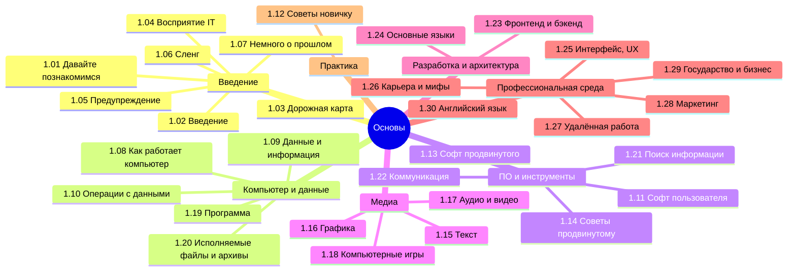

## Оглавление

Вообще, лучше воспользуйтесь содержанием или перейдите к Базе знаний. Но для удобства, я размещу здесь ссылки на основные главы раздела:

<ul>
  <li><a href="/it-knowledge-base/docs/Основы/1.01.%20Давайте%20познакомимся/1">1.01. Давайте познакомимся</a></li>
  Вводный раздел, задающий тон изложению. Представляет цели и структуру книги, а также обосновывает выбор подхода к подаче материала. Обращён к читателю как к субъекту обучения, устанавливая контекст взаимодействия.
  
  <li><a href="/it-knowledge-base/docs/Основы/1.02.%20Введение/1">1.02. Введение</a></li>
  Общее описание предметной области IT: её границы, ключевые дисциплины, место в современном обществе. Формулируются базовые понятия, необходимые для дальнейшего освоения материала.
  
  <li><a href="/it-knowledge-base/docs/Основы/1.03.%20Дорожная%20карта%20изучения/1">1.03. Дорожная карта изучения</a></li>
  Систематизированное представление этапов освоения IT-дисциплин. Включает рекомендации по последовательности изучения тем, зависимости между модулями и оценку временных затрат.
  
  <li><a href="/it-knowledge-base/docs/Основы/1.04.%20Как видят%20IT%20обычные%20люди/1">1.04. Как видят IT обычные люди</a></li>
  Анализ восприятия IT-сферы неспециалистами. Рассматриваются стереотипы, распространённые заблуждения и культурные особенности представлений о профессиях в IT.
  
  <li><a href="/it-knowledge-base/docs/Основы/1.05.%20Предупреждение/1">1.05. Предупреждение</a></li>
  Информирование о потенциальных рисках при работе с техникой, программным обеспечением и данными. Охватывает вопросы безопасности, этики и ответственности.
  
  <li><a href="/it-knowledge-base/docs/Основы/1.06.%20Сленг/1">1.06. Сленг</a></li>
  Описание употребительной в IT терминологии, не вошедшей в официальные стандарты. Включает жаргон, аббревиатуры, метафоры и их происхождение.
  
  <li><a href="/it-knowledge-base/docs/Основы/1.07.%20Немного%20о%20прошлом/1">1.07. Немного о прошлом</a></li>
  Краткий исторический обзор ключевых этапов развития вычислительной техники и информационных технологий. Акцент на фундаментальных открытиях и парадигмах.
  
  <li><a href="/it-knowledge-base/docs/Основы/1.08.%20Как%20работает%20компьютер/1">1.08. Как работает компьютер</a></li>
  Функциональная архитектура вычислительной системы: процессор, память, шины, периферия. Принципы обработки инструкций и управления данными на аппаратном уровне.
  
  <li><a href="/it-knowledge-base/docs/Основы/1.09.%20Данные%20и%20информация/1">1.09. Данные и информация</a></li>
  Различие между данными как формальной конструкцией и информацией как семантической нагрузкой. Модели представления данных, уровни абстракции.
  
  <li><a href="/it-knowledge-base/docs/Основы/1.10.%20Базовые%20операции%20с%20данными/1">1.10. Базовые операции с данными</a></li>
  Основные действия над данными: чтение, запись, преобразование, хранение, передача. Классификация операций и их реализация на уровне программ и устройств.
  
  <li><a href="/it-knowledge-base/docs/Основы/1.11.%20Софт%20рядового%20пользователя/1">1.11. Софт рядового пользователя</a></li>
  Перечень программного обеспечения, типичного для повседневного использования: офисные приложения, браузеры, мультимедиа, коммуникационные платформы.
  
  <li><a href="/it-knowledge-base/docs/Основы/1.12.%20Советы%20для%20новичка/1">1.12. Советы для новичка</a></li>
  Практические рекомендации по началу пути в IT: выбор инструментов, организация рабочего места, источники информации, избегание типичных ошибок.
  
  <li><a href="/it-knowledge-base/docs/Основы/1.13.%20Софт%20продвинутого%20пользователя/1">1.13. Софт продвинутого пользователя</a></li>
  Программы и утилиты, расширяющие функциональность системы: терминалы, менеджеры пакетов, инструменты диагностики, настройки производительности.
  
  <li><a href="/it-knowledge-base/docs/Основы/1.14.%20Советы%20для%20продвинутого/1">1.14. Советы для продвинутого</a></li>
  Методики оптимизации рабочего процесса, автоматизация задач, управление конфигурациями, использование скриптов и систем контроля версий.
  
  <li><a href="/it-knowledge-base/docs/Основы/1.15.%20Текст/1">1.15. Текст</a></li>
  Форматы текстовых данных, кодировки, обработка строк, текстовые редакторы и процессоры. Особенности работы с многоязычными текстами.
  
  <li><a href="/it-knowledge-base/docs/Основы/1.16.%20Графика/1">1.16. Графика</a></li>
  Типы графических данных (растровая, векторная), форматы файлов, цветовые модели, базовые операции обработки изображений.
  
  <li><a href="/it-knowledge-base/docs/Основы/1.17.%20Аудио%20и%20видео/1">1.17. Аудио и видео</a></li>
  Принципы цифрового представления звука и движущегося изображения. Кодеки, контейнеры, параметры качества, программное обеспечение для работы с медиа.
  
  <li><a href="/it-knowledge-base/docs/Основы/1.18.%20Компьютерные%20игры/1">1.18. Компьютерные игры</a></li>
  Особенности игрового ПО как категории приложений: архитектура, требования к производительности, взаимодействие с пользователем, сетевые компоненты.
  
  <li><a href="/it-knowledge-base/docs/Основы/1.19.%20Программа/1">1.19. Программа</a></li>
  Понятие программы как набора инструкций. Структура исполняемого кода, жизненный цикл, взаимодействие с операционной системой.
  
  <li><a href="/it-knowledge-base/docs/Основы/1.20.%20Исполняемые%20файлы%20и%20архивы/1">1.20. Исполняемые файлы и архивы</a></li>
  Форматы исполняемых модулей, механизмы запуска, упаковка данных, архивирование, сжатие и безопасность.
  
  <li><a href="/it-knowledge-base/docs/Основы/1.21.%20Поиск%20информации/1">1.21. Поиск информации</a></li>
  Методы и инструменты эффективного поиска в цифровой среде. Оценка достоверности источников, использование специализированных баз и поисковых операторов.
  
  <li><a href="/it-knowledge-base/docs/Основы/1.22.%20Коммуникация%20и%20общение/1">1.22. Коммуникация и общение</a></li>
  Средства электронного общения: почта, мессенджеры, форумы, видеосвязь. Протоколы, форматы данных, нормы сетевого этикета.
  
  <li><a href="/it-knowledge-base/docs/Основы/1.23.%20Фронтенд%20и%20бэкенд/1">1.23. Фронтенд и бэкенд</a></li>
  Разделение ответственности в архитектуре приложений. Интерфейсная часть (клиент) и серверная логика.
  
  <li><a href="/it-knowledge-base/docs/Основы/1.24.%20Основные%20языки/1">1.24. Основные языки</a></li>
  Обзор наиболее распространённых языков программирования, их назначение, парадигмы, сферы применения и влияние на развитие технологий.
  
  <li><a href="/it-knowledge-base/docs/Основы/1.25.%20Интерфейс,%20UX/1">1.25. Интерфейс, UX</a></li>
  Принципы проектирования пользовательских интерфейсов. Удобство использования, доступность, юзабилити, факторы, влияющие на пользовательский опыт.
  
  <li><a href="/it-knowledge-base/docs/Основы/1.26.%20Карьера%20в%20IT%20и%20мифы/1">1.26. Карьера в IT и мифы</a></li>
  Анализ профессиональных траекторий в IT: роли, требования, рынок труда. Разбор распространённых мифов о заработках, сложности и условиях работы.
  
  <li><a href="/it-knowledge-base/docs/Основы/1.27.%20Удаленная%20работа/1">1.27. Удаленная работа</a></li>
  Особенности распределённой занятости: инструменты, организация процессов, коммуникация, управление временем, правовые аспекты.
  
  <li><a href="/it-knowledge-base/docs/Основы/1.28.%20Маркетинг%20и%20распространение/1">1.28. Маркетинг и распространение</a></li>
  Стратегии продвижения IT-продуктов: цифровой маркетинг, каналы дистрибуции, сбор обратной связи, работа с сообществом.
  
  <li><a href="/it-knowledge-base/docs/Основы/1.29.%20Государство%20и%20бизнес/1">1.29. Государство и бизнес</a></li>
  Взаимодействие IT с институтами власти и предпринимательской средой: регулирование, государственные проекты, цифровизация экономики.
  
  <li><a href="/it-knowledge-base/docs/Основы/1.30.%20Английский%20язык/1">1.30. Английский язык</a></li>
  Необходимый минимум лексики, документация, международное сотрудничество.
</ul>

