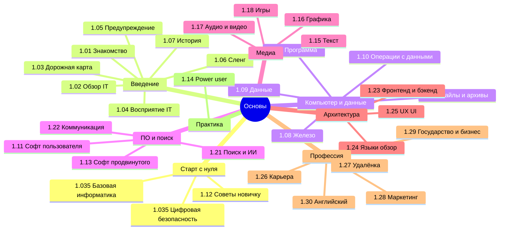

  ОБЯЗАТЕЛЬНО
  ДЛЯ НОВИЧКОВ

---

## О разделе

Раздел **«Основы»** — фундамент [энциклопедии](/encyclopedia/1-basics/basics): от первого включения ПК до карьеры, маркетинга и обзора языков. Материалы связаны перекрёстными ссылками; у большинства подразделов есть intro, итоги (98) и чек-лист (99).

### Выберите свой маршрут

| Кто вы | С чего начать | Затем |
|--------|---------------|--------|
| **Никогда не пользовались ПК** | [1.035. Основы компьютерной грамотности](/encyclopedia/1-basics/1-035-bazovaya-informatika/101) | [Цифровая безопасность](/encyclopedia/1-basics/1-035-bazovaya-informatika/112), [1.12 Советы новичку](/encyclopedia/1-basics/1-12-sovety-dlya-novichka/intro) |
| **Школа / ЕГЭ / информатика** | [1.035. Базовая информатика — о разделе](/encyclopedia/1-basics/1-035-bazovaya-informatika/intro) | Главы 1–8 курса, [лаборатория](https://lab.spirzen.ru/lab/tasks/intro) |
| **Хочу в IT** | [1.03. Дорожная карта](/encyclopedia/1-basics/1-03-dorozhnaya-karta-izucheniya/1) | [1.26 Карьера](/encyclopedia/1-basics/1-26-karera-v-it-i-mify/intro), [1.02 Обзор Вселенной IT](/encyclopedia/1-basics/1-02-vvedenie/1) |
| **Уже уверенный пользователь** | [1.14 Советы продвинутому](/encyclopedia/1-basics/1-14-sovety-dlya-prodvinutogo/intro) | [2. Система и сеть](/section/system-network), [4. Код](/section/code-dev) |

Полное автоматическое содержание — [docs/toc.md](/toc) и боковое меню энциклопедии (`Ctrl+K`).

---

## Знакомство

- [1.01. Давайте познакомимся](/encyclopedia/1-basics/1-01-davayte-poznakomimsya/1)

---

## Введение

- [1.02. Обзор структуры Вселенной IT](/encyclopedia/1-basics/1-02-vvedenie/1)
- [1.02. Архитектура знаний](/encyclopedia/1-basics/1-02-vvedenie/2)

---

## Дорожная карта изучения

- [1.03. Дорожная карта изучения](/encyclopedia/1-basics/1-03-dorozhnaya-karta-izucheniya/1)
- [1.03. Тест на готовность к программированию](/encyclopedia/1-basics/1-03-dorozhnaya-karta-izucheniya/2)
- [1.03. Указатель — где и о чём почитать](/encyclopedia/1-basics/1-03-dorozhnaya-karta-izucheniya/101)
- [1.03. Тест на компьютерную грамотность](/encyclopedia/1-basics/1-03-dorozhnaya-karta-izucheniya/211)
- [1.03. Тест на готовность к работе с данными](/encyclopedia/1-basics/1-03-dorozhnaya-karta-izucheniya/212)
- [1.03. Тест на готовность к веб-разработке](/encyclopedia/1-basics/1-03-dorozhnaya-karta-izucheniya/213)
- [1.03. Документация в Microsoft Learn](/encyclopedia/1-basics/1-03-dorozhnaya-karta-izucheniya/214)

---

## Базовая информатика (1.035)

- [1.035. Базовая информатика — о разделе](/encyclopedia/1-basics/1-035-bazovaya-informatika/intro)
- [1.035. Основы компьютерной грамотности](/encyclopedia/1-basics/1-035-bazovaya-informatika/101)
- [1.035. Терминология новичка](/encyclopedia/1-basics/1-035-bazovaya-informatika/102)
- [1.035. Ключевые понятия и маршрут](/encyclopedia/1-basics/1-035-bazovaya-informatika/1)
- [1.035. Кодирование, сжатие и архивация](/encyclopedia/1-basics/1-035-bazovaya-informatika/2)
- [1.035. Компьютер, периферия и сетевое оборудование](/encyclopedia/1-basics/1-035-bazovaya-informatika/3)
- [1.035. Организация, архитектура и уровни компьютера](/encyclopedia/1-basics/1-035-bazovaya-informatika/10)
- [1.035. Алгоритмы, языки и программирование](/encyclopedia/1-basics/1-035-bazovaya-informatika/4)
- [1.035. ОС, файловые системы и служебные программы](/encyclopedia/1-basics/1-035-bazovaya-informatika/5)
- [1.035. Интернет и сетевые сервисы](/encyclopedia/1-basics/1-035-bazovaya-informatika/6)
- [1.035. Право и защита информации в РФ](/encyclopedia/1-basics/1-035-bazovaya-informatika/7)
- [1.035. Организация рабочего места](/encyclopedia/1-basics/1-035-bazovaya-informatika/8)
- [1.035. Инструменты и среды разработки](/encyclopedia/1-basics/1-035-bazovaya-informatika/9)
- [1.035. Память и вычисления](/encyclopedia/1-basics/1-035-bazovaya-informatika/11)
- [1.035. Цифровая безопасность для пользователя](/encyclopedia/1-basics/1-035-bazovaya-informatika/112)
- [1.035. Passkeys и современный вход в аккаунты](/encyclopedia/1-basics/1-035-bazovaya-informatika/113)
- [1.035. Итоги](/encyclopedia/1-basics/1-035-bazovaya-informatika/98)
- [1.035. Чек-лист](/encyclopedia/1-basics/1-035-bazovaya-informatika/99)

---

## Как видят IT обычные люди

- [1.04. Восприятие IT в обществе](/encyclopedia/1-basics/1-04-kak-vidyat-it-obychnye-lyudi/1)
- [1.04. Связь IT с другими сферами](/encyclopedia/1-basics/1-04-kak-vidyat-it-obychnye-lyudi/2)
- [1.04. Классификация технологий](/encyclopedia/1-basics/1-04-kak-vidyat-it-obychnye-lyudi/3)
- [1.04. Финансовые потоки в IT](/encyclopedia/1-basics/1-04-kak-vidyat-it-obychnye-lyudi/4)
- [1.04. Рынок IT](/encyclopedia/1-basics/1-04-kak-vidyat-it-obychnye-lyudi/5)
- [1.04. Секрет прост](/encyclopedia/1-basics/1-04-kak-vidyat-it-obychnye-lyudi/6)
- [1.04. IT в России](/encyclopedia/1-basics/1-04-kak-vidyat-it-obychnye-lyudi/7)
- [1.04. Техногиганты](/encyclopedia/1-basics/1-04-kak-vidyat-it-obychnye-lyudi/711)
- [1.04. Итоги](/encyclopedia/1-basics/1-04-kak-vidyat-it-obychnye-lyudi/98)
- [1.04. Чек-лист](/encyclopedia/1-basics/1-04-kak-vidyat-it-obychnye-lyudi/99)

---

## Предупреждение

- [1.05. Предупреждения при изучении](/encyclopedia/1-basics/1-05-preduprezhdenie/1)
- [1.05. Иллюзия стабильности](/encyclopedia/1-basics/1-05-preduprezhdenie/2)
- [1.05. Рекомендации по обучению](/encyclopedia/1-basics/1-05-preduprezhdenie/3)
- [1.05. Риски и мифы](/encyclopedia/1-basics/1-05-preduprezhdenie/4)

---

## Сленг

- [1.06. IT-сленг и профессиональная лексика](/encyclopedia/1-basics/1-06-sleng/1)
- [1.06. Сетевой сленг и форумная лексика](/encyclopedia/1-basics/1-06-sleng/2)

---

## Немного о прошлом

- [1.07. История информационных технологий](/encyclopedia/1-basics/1-07-nemnogo-o-proshlom/1)
- [1.07. Ранние вычислительные устройства](/encyclopedia/1-basics/1-07-nemnogo-o-proshlom/2)
- [1.07. Развитие программного обеспечения](/encyclopedia/1-basics/1-07-nemnogo-o-proshlom/3)
- [1.07. Интернет](/encyclopedia/1-basics/1-07-nemnogo-o-proshlom/4)
- [1.07. Языки программирования](/encyclopedia/1-basics/1-07-nemnogo-o-proshlom/5)
- [1.07. Методологии](/encyclopedia/1-basics/1-07-nemnogo-o-proshlom/6)
- [1.07. Итоги](/encyclopedia/1-basics/1-07-nemnogo-o-proshlom/98)
- [1.07. Чек-лист](/encyclopedia/1-basics/1-07-nemnogo-o-proshlom/99)

---

## Как работает компьютер

- [1.08. Как работает компьютер](/encyclopedia/1-basics/1-08-kak-rabotaet-kompyuter/1)
- [1.08. Базовое железо](/encyclopedia/1-basics/1-08-kak-rabotaet-kompyuter/2)
- [1.08. Хранилище](/encyclopedia/1-basics/1-08-kak-rabotaet-kompyuter/3)
- [1.08. Видеокарта](/encyclopedia/1-basics/1-08-kak-rabotaet-kompyuter/4)
- [1.08. Прочие устройства](/encyclopedia/1-basics/1-08-kak-rabotaet-kompyuter/5)
- [1.08. Загрузчики](/encyclopedia/1-basics/1-08-kak-rabotaet-kompyuter/6)
- [1.08. Как устроен компьютер](/encyclopedia/1-basics/1-08-kak-rabotaet-kompyuter/7)
- [1.08. Ноутбуки](/encyclopedia/1-basics/1-08-kak-rabotaet-kompyuter/711)
- [1.08. Мобильные устройства](/encyclopedia/1-basics/1-08-kak-rabotaet-kompyuter/712)
- [1.08. Клавиатура](/encyclopedia/1-basics/1-08-kak-rabotaet-kompyuter/713)
- [1.08. Мышь и геймпад](/encyclopedia/1-basics/1-08-kak-rabotaet-kompyuter/714)
- [1.08. Аудиоустройства](/encyclopedia/1-basics/1-08-kak-rabotaet-kompyuter/715)
- [1.08. Дисплеи](/encyclopedia/1-basics/1-08-kak-rabotaet-kompyuter/716)
- [1.08. Как выбрать монитор](/encyclopedia/1-basics/1-08-kak-rabotaet-kompyuter/717)
- [1.08. USB — стандарты, разъёмы и Type-C](/encyclopedia/1-basics/1-08-kak-rabotaet-kompyuter/718)
- [1.08. Камеры смартфонов и вычислительная фотография](/encyclopedia/1-basics/1-08-kak-rabotaet-kompyuter/719)
- [1.08. ЭВМ](/encyclopedia/1-basics/1-08-kak-rabotaet-kompyuter/8)
- [1.08. Справочник по характеристикам](/encyclopedia/1-basics/1-08-kak-rabotaet-kompyuter/81)
- [1.08. Автоматизация и автоматика](/encyclopedia/1-basics/1-08-kak-rabotaet-kompyuter/9)
- [1.08. Аккумуляторы](/encyclopedia/1-basics/1-08-kak-rabotaet-kompyuter/9111)
- [1.08. Итоги](/encyclopedia/1-basics/1-08-kak-rabotaet-kompyuter/98)
- [1.08. Чек-лист](/encyclopedia/1-basics/1-08-kak-rabotaet-kompyuter/99)

---

## Данные и информация

- [1.09. Данные и информация](/encyclopedia/1-basics/1-09-dannye-i-informatsiya/1)
- [1.09. Виды информации](/encyclopedia/1-basics/1-09-dannye-i-informatsiya/2)
- [1.09. Типы данных](/encyclopedia/1-basics/1-09-dannye-i-informatsiya/3)
- [1.09. Типизация](/encyclopedia/1-basics/1-09-dannye-i-informatsiya/4)
- [1.09. Метаданные](/encyclopedia/1-basics/1-09-dannye-i-informatsiya/5)
- [1.09. Итоги](/encyclopedia/1-basics/1-09-dannye-i-informatsiya/98)
- [1.09. Чек-лист](/encyclopedia/1-basics/1-09-dannye-i-informatsiya/99)

---

## Базовые операции с данными

- [1.10. Ввод и вывод](/encyclopedia/1-basics/1-10-bazovye-operatsii-s-dannymi/1)
- [1.10. Чтение и запись](/encyclopedia/1-basics/1-10-bazovye-operatsii-s-dannymi/2)
- [1.10. Кэш](/encyclopedia/1-basics/1-10-bazovye-operatsii-s-dannymi/3)
- [1.10. Манипуляции с данными](/encyclopedia/1-basics/1-10-bazovye-operatsii-s-dannymi/4)
- [1.10. Итоги](/encyclopedia/1-basics/1-10-bazovye-operatsii-s-dannymi/98)
- [1.10. Чек-лист](/encyclopedia/1-basics/1-10-bazovye-operatsii-s-dannymi/99)

---

## Советы для новичка

- [1.12. Советы для новичка — о разделе](/encyclopedia/1-basics/1-12-sovety-dlya-novichka/intro)
- [1.12. Советы для начинающего пользователя ПК](/encyclopedia/1-basics/1-12-sovety-dlya-novichka/1)
- [1.12. Эргономика рабочего места](/encyclopedia/1-basics/1-12-sovety-dlya-novichka/2)
- [1.12. Горячие клавиши в Windows](/encyclopedia/1-basics/1-12-sovety-dlya-novichka/3)
- [1.12. Визуальное программирование блоками](/encyclopedia/1-basics/1-12-sovety-dlya-novichka/4)
- [1.12. Создание скриншотов](/encyclopedia/1-basics/1-12-sovety-dlya-novichka/5)
- [1.12. Настройка телефона для пожилых](/encyclopedia/1-basics/1-12-sovety-dlya-novichka/6)
- [1.12. Настройка Windows](/encyclopedia/1-basics/1-12-sovety-dlya-novichka/11)
- [1.12. Запуск и перезапуск приложений](/encyclopedia/1-basics/1-12-sovety-dlya-novichka/13)
- [1.12. Как научиться быстро печатать](/encyclopedia/1-basics/1-12-sovety-dlya-novichka/14)
- [1.12. Облако, синхронизация и бэкап для дома](/encyclopedia/1-basics/1-12-sovety-dlya-novichka/15)
- [1.12. Первые шаги в macOS](/encyclopedia/1-basics/1-12-sovety-dlya-novichka/16)
- [1.12. Первые шаги в Linux](/encyclopedia/1-basics/1-12-sovety-dlya-novichka/17)
- [1.12. Знакомство с Android](/encyclopedia/1-basics/1-12-sovety-dlya-novichka/18)
- [1.12. Покупка техники и как не переплатить](/encyclopedia/1-basics/1-12-sovety-dlya-novichka/19)
- [1.12. Умный дом и IoT для пользователя](/encyclopedia/1-basics/1-12-sovety-dlya-novichka/20)
- [1.12. Перенос данных на новый ПК и телефон](/encyclopedia/1-basics/1-12-sovety-dlya-novichka/21)
- [1.12. Управление памятью смартфона](/encyclopedia/1-basics/1-12-sovety-dlya-novichka/31)
- [1.12. Родительский контроль](/encyclopedia/1-basics/1-12-sovety-dlya-novichka/111)
- [1.12. Адресная книга](/encyclopedia/1-basics/1-12-sovety-dlya-novichka/311)
- [1.12. Ускорение интернета](/encyclopedia/1-basics/1-12-sovety-dlya-novichka/312)
- [1.12. Работа с проводником Windows](/encyclopedia/1-basics/1-12-sovety-dlya-novichka/1111)
- [1.12. Техника безопасности при работе за ПК](/encyclopedia/1-basics/1-12-sovety-dlya-novichka/1112)
- [1.12. Итоги](/encyclopedia/1-basics/1-12-sovety-dlya-novichka/98)
- [1.12. Чек-лист](/encyclopedia/1-basics/1-12-sovety-dlya-novichka/99)

Цифровая безопасность в сети — [1.035 / глава 112](/encyclopedia/1-basics/1-035-bazovaya-informatika/112) (не путать с физической [1112](/encyclopedia/1-basics/1-12-sovety-dlya-novichka/1112)).

---

## Софт рядового пользователя

- [1.11. Софт рядового пользователя — о разделе](/encyclopedia/1-basics/1-11-soft-ryadovogo-polzovatelya/intro)
- [1.11. Системные приложения](/encyclopedia/1-basics/1-11-soft-ryadovogo-polzovatelya/1)
- [1.11. Медиа](/encyclopedia/1-basics/1-11-soft-ryadovogo-polzovatelya/2)
- [1.11. Браузеры](/encyclopedia/1-basics/1-11-soft-ryadovogo-polzovatelya/3)
- [1.11. Видеосвязь](/encyclopedia/1-basics/1-11-soft-ryadovogo-polzovatelya/4)
- [1.11. Мессенджеры](/encyclopedia/1-basics/1-11-soft-ryadovogo-polzovatelya/5)
- [1.11. Офисные пакеты](/encyclopedia/1-basics/1-11-soft-ryadovogo-polzovatelya/51)
- [1.11. Графика и видео](/encyclopedia/1-basics/1-11-soft-ryadovogo-polzovatelya/6)
- [1.11. Безопасность](/encyclopedia/1-basics/1-11-soft-ryadovogo-polzovatelya/7)
- [1.11. Итоги](/encyclopedia/1-basics/1-11-soft-ryadovogo-polzovatelya/98)
- [1.11. Чек-лист](/encyclopedia/1-basics/1-11-soft-ryadovogo-polzovatelya/99)

---

## Софт продвинутого пользователя

- [1.13. Софт продвинутого — о разделе](/encyclopedia/1-basics/1-13-soft-prodvinutogo-polzovatelya/intro)
- [1.13. Обзор](/encyclopedia/1-basics/1-13-soft-prodvinutogo-polzovatelya/1)
- [1.13. Файловые менеджеры и утилиты](/encyclopedia/1-basics/1-13-soft-prodvinutogo-polzovatelya/2)
- [1.13. Разработка и программирование](/encyclopedia/1-basics/1-13-soft-prodvinutogo-polzovatelya/3)
- [1.13. Графика, дизайн и 3D](/encyclopedia/1-basics/1-13-soft-prodvinutogo-polzovatelya/4)
- [1.13. Сетевые и системные утилиты](/encyclopedia/1-basics/1-13-soft-prodvinutogo-polzovatelya/5)
- [1.13. Автоматизация и бизнес-процессы](/encyclopedia/1-basics/1-13-soft-prodvinutogo-polzovatelya/6)
- [1.13. Безопасность и администрирование](/encyclopedia/1-basics/1-13-soft-prodvinutogo-polzovatelya/7)
- [1.13. Виртуализация и работа с ОС](/encyclopedia/1-basics/1-13-soft-prodvinutogo-polzovatelya/8)
- [1.13. Дополнительные инструменты](/encyclopedia/1-basics/1-13-soft-prodvinutogo-polzovatelya/9)
- [1.13. Итоги](/encyclopedia/1-basics/1-13-soft-prodvinutogo-polzovatelya/98)
- [1.13. Чек-лист](/encyclopedia/1-basics/1-13-soft-prodvinutogo-polzovatelya/99)

---

## Советы для продвинутого

- [1.14. Советы для продвинутого — о разделе](/encyclopedia/1-basics/1-14-sovety-dlya-prodvinutogo/intro)
- [1.14. Путь продвинутого пользователя](/encyclopedia/1-basics/1-14-sovety-dlya-prodvinutogo/1)
- [1.14. Безопасность](/encyclopedia/1-basics/1-14-sovety-dlya-prodvinutogo/2)
- [1.14. Мониторинг и логи](/encyclopedia/1-basics/1-14-sovety-dlya-prodvinutogo/3)
- [1.14. Резервное копирование](/encyclopedia/1-basics/1-14-sovety-dlya-prodvinutogo/4)
- [1.14. Железо и производительность](/encyclopedia/1-basics/1-14-sovety-dlya-prodvinutogo/5)
- [1.14. Уход за железом](/encyclopedia/1-basics/1-14-sovety-dlya-prodvinutogo/6)
- [1.14. Троттлинг и зависания](/encyclopedia/1-basics/1-14-sovety-dlya-prodvinutogo/7)
- [1.14. Оптимизация Windows для игр](/encyclopedia/1-basics/1-14-sovety-dlya-prodvinutogo/8)
- [1.14. Как читать сообщение об ошибке](/encyclopedia/1-basics/1-14-sovety-dlya-prodvinutogo/9)
- [1.14. Итоги](/encyclopedia/1-basics/1-14-sovety-dlya-prodvinutogo/98)
- [1.14. Чек-лист](/encyclopedia/1-basics/1-14-sovety-dlya-prodvinutogo/99)

---

## Текст

- [1.15. Текст — о разделе](/encyclopedia/1-basics/1-15-tekst/intro)
- [1.15. Текст](/encyclopedia/1-basics/1-15-tekst/1)
- [1.15. Офисные форматы](/encyclopedia/1-basics/1-15-tekst/2)
- [1.15. Работа с Word](/encyclopedia/1-basics/1-15-tekst/211)
- [1.15. Структурированные данные](/encyclopedia/1-basics/1-15-tekst/3)
- [1.15. XLSX](/encyclopedia/1-basics/1-15-tekst/4)
- [1.15. Справочник по Excel](/encyclopedia/1-basics/1-15-tekst/41)
- [1.15. Веб-технологии](/encyclopedia/1-basics/1-15-tekst/5)
- [1.15. Файлы исходного кода](/encyclopedia/1-basics/1-15-tekst/6)
- [1.15. Электронные книги](/encyclopedia/1-basics/1-15-tekst/7)
- [1.15. Итоги](/encyclopedia/1-basics/1-15-tekst/98)
- [1.15. Чек-лист](/encyclopedia/1-basics/1-15-tekst/99)

---

## Графика

- [1.16. Графика — о разделе](/encyclopedia/1-basics/1-16-grafika/intro)
- [1.16. Графика](/encyclopedia/1-basics/1-16-grafika/1)
- [1.16. Вектор и растр](/encyclopedia/1-basics/1-16-grafika/2)
- [1.16. Растровые форматы](/encyclopedia/1-basics/1-16-grafika/3)
- [1.16. Векторные форматы](/encyclopedia/1-basics/1-16-grafika/4)
- [1.16. Сравнение форматов](/encyclopedia/1-basics/1-16-grafika/5)
- [1.16. Графический дизайн](/encyclopedia/1-basics/1-16-grafika/6)
- [1.16. Итоги](/encyclopedia/1-basics/1-16-grafika/98)
- [1.16. Чек-лист](/encyclopedia/1-basics/1-16-grafika/99)

---

## Аудио и видео

- [1.17. Аудио и видео — о разделе](/encyclopedia/1-basics/1-17-audio-i-video/intro)
- [1.17. Аудио и видео](/encyclopedia/1-basics/1-17-audio-i-video/1)
- [1.17. Аудио ввод и вывод](/encyclopedia/1-basics/1-17-audio-i-video/2)
- [1.17. Видео ввод и вывод](/encyclopedia/1-basics/1-17-audio-i-video/3)
- [1.17. Воспроизведение](/encyclopedia/1-basics/1-17-audio-i-video/4)
- [1.17. Редактирование](/encyclopedia/1-basics/1-17-audio-i-video/5)
- [1.17. Как устроена музыка](/encyclopedia/1-basics/1-17-audio-i-video/55)
- [1.17. Разбор форматов](/encyclopedia/1-basics/1-17-audio-i-video/6)
- [1.17. Итоги](/encyclopedia/1-basics/1-17-audio-i-video/98)
- [1.17. Чек-лист](/encyclopedia/1-basics/1-17-audio-i-video/99)

---

## Компьютерные игры

- [1.18. Компьютерные игры — о разделе](/encyclopedia/1-basics/1-18-kompyuternye-igry/intro)
- [1.18. Компьютерные игры](/encyclopedia/1-basics/1-18-kompyuternye-igry/1)
- [1.18. Классификация игр](/encyclopedia/1-basics/1-18-kompyuternye-igry/2)
- [1.18. Архитектура игры](/encyclopedia/1-basics/1-18-kompyuternye-igry/3)
- [1.18. Система ввода и интерфейс](/encyclopedia/1-basics/1-18-kompyuternye-igry/4)
- [1.18. Игровая логика](/encyclopedia/1-basics/1-18-kompyuternye-igry/5)
- [1.18. Игры как объект изучения](/encyclopedia/1-basics/1-18-kompyuternye-igry/6)
- [1.18. Итоги](/encyclopedia/1-basics/1-18-kompyuternye-igry/98)
- [1.18. Чек-лист](/encyclopedia/1-basics/1-18-kompyuternye-igry/99)

---

## Что такое программа?

- [1.19. Программа — о разделе](/encyclopedia/1-basics/1-19-programma/intro)
- [1.19. Что такое программа?](/encyclopedia/1-basics/1-19-programma/1)
- [1.19. ПО и система](/encyclopedia/1-basics/1-19-programma/111)
- [1.19. Виды программ](/encyclopedia/1-basics/1-19-programma/112)
- [1.19. Поведение системы](/encyclopedia/1-basics/1-19-programma/113)
- [1.19. Установка и обновление](/encyclopedia/1-basics/1-19-programma/114)
- [1.19. Работа программ с системой](/encyclopedia/1-basics/1-19-programma/115)
- [1.19. Компиляторы и интерпретаторы](/encyclopedia/1-basics/1-19-programma/2)
- [1.19. Мобильные приложения](/encyclopedia/1-basics/1-19-programma/3)
- [1.19. Итоги](/encyclopedia/1-basics/1-19-programma/98)
- [1.19. Чек-лист](/encyclopedia/1-basics/1-19-programma/99)

---

## Исполняемые файлы и архивы

- [1.20. Исполняемые файлы — о разделе](/encyclopedia/1-basics/1-20-ispolnyaemye-fayly-i-arhivy/intro)
- [1.20. Исполняемые файлы](/encyclopedia/1-basics/1-20-ispolnyaemye-fayly-i-arhivy/1)
- [1.20. Архивы и установочные пакеты](/encyclopedia/1-basics/1-20-ispolnyaemye-fayly-i-arhivy/2)
- [1.20. Конфигурационные файлы](/encyclopedia/1-basics/1-20-ispolnyaemye-fayly-i-arhivy/3)
- [1.20. Специализированные форматы](/encyclopedia/1-basics/1-20-ispolnyaemye-fayly-i-arhivy/4)
- [1.20. Итоги](/encyclopedia/1-basics/1-20-ispolnyaemye-fayly-i-arhivy/98)
- [1.20. Чек-лист](/encyclopedia/1-basics/1-20-ispolnyaemye-fayly-i-arhivy/99)

---

## Поиск информации

- [1.21. Поиск информации — о разделе](/encyclopedia/1-basics/1-21-poisk-informatsii/intro)
- [1.21. Поисковые системы](/encyclopedia/1-basics/1-21-poisk-informatsii/1)
- [1.21. Языки поисковых запросов](/encyclopedia/1-basics/1-21-poisk-informatsii/2)
- [1.21. Эффективный поиск в интернете](/encyclopedia/1-basics/1-21-poisk-informatsii/3)
- [1.21. Популярные поисковики](/encyclopedia/1-basics/1-21-poisk-informatsii/4)
- [1.21. ИИ для новичка](/encyclopedia/1-basics/1-21-poisk-informatsii/5)
- [1.21. Итоги](/encyclopedia/1-basics/1-21-poisk-informatsii/98)
- [1.21. Чек-лист](/encyclopedia/1-basics/1-21-poisk-informatsii/99)

Далее — [раздел 6. Искусственный интеллект](/encyclopedia/6-ai/6-01-vvedenie-v-ii/intro).

---

## Коммуникация и общение

- [1.22. Коммуникация — о разделе](/encyclopedia/1-basics/1-22-kommunikatsiya-i-obschenie/intro)
- [1.22. Цифровая коммуникация](/encyclopedia/1-basics/1-22-kommunikatsiya-i-obschenie/1)
- [1.22. Чаты](/encyclopedia/1-basics/1-22-kommunikatsiya-i-obschenie/2)
- [1.22. Электронная почта](/encyclopedia/1-basics/1-22-kommunikatsiya-i-obschenie/3)
- [1.22. Встречи и звонки](/encyclopedia/1-basics/1-22-kommunikatsiya-i-obschenie/4)
- [1.22. Иерархия и субординация](/encyclopedia/1-basics/1-22-kommunikatsiya-i-obschenie/5)
- [1.22. Формы и анкеты](/encyclopedia/1-basics/1-22-kommunikatsiya-i-obschenie/6)
- [1.22. Итоги](/encyclopedia/1-basics/1-22-kommunikatsiya-i-obschenie/98)
- [1.22. Чек-лист](/encyclopedia/1-basics/1-22-kommunikatsiya-i-obschenie/99)

---

## Фронтенд и бэкенд

- [1.23. Фронтенд и бэкенд — о разделе](/encyclopedia/1-basics/1-23-frontend-i-bekend/intro)
- [1.23. Фронтенд](/encyclopedia/1-basics/1-23-frontend-i-bekend/1)
- [1.23. Бэкенд](/encyclopedia/1-basics/1-23-frontend-i-bekend/2)
- [1.23. Метрики производительности](/encyclopedia/1-basics/1-23-frontend-i-bekend/3)
- [1.23. Компетенции бэкенда](/encyclopedia/1-basics/1-23-frontend-i-bekend/4)
- [1.23. Linux для бэкенда](/encyclopedia/1-basics/1-23-frontend-i-bekend/5)
- [1.23. Сеть для диагностики](/encyclopedia/1-basics/1-23-frontend-i-bekend/6)
- [1.23. Исходящая почта](/encyclopedia/1-basics/1-23-frontend-i-bekend/7)
- [1.23. Типы веб-приложений](/encyclopedia/1-basics/1-23-frontend-i-bekend/8)
- [1.23. Наблюдаемость бэкенда](/encyclopedia/1-basics/1-23-frontend-i-bekend/9)
- [1.23. Итоги](/encyclopedia/1-basics/1-23-frontend-i-bekend/98)
- [1.23. Чек-лист](/encyclopedia/1-basics/1-23-frontend-i-bekend/99)

---

## Основные языки

- [1.24. Основные языки — о разделе](/encyclopedia/1-basics/1-24-osnovnye-yazyki/intro)
- [1.24. Основные языки](/encyclopedia/1-basics/1-24-osnovnye-yazyki/1)
- [1.24. Общие языки](/encyclopedia/1-basics/1-24-osnovnye-yazyki/2)
- [1.24. Языки запросов](/encyclopedia/1-basics/1-24-osnovnye-yazyki/3)
- [1.24. Языки разметки](/encyclopedia/1-basics/1-24-osnovnye-yazyki/4)
- [1.24. Языки стилей](/encyclopedia/1-basics/1-24-osnovnye-yazyki/5)
- [1.24. Языки программирования](/encyclopedia/1-basics/1-24-osnovnye-yazyki/6)
- [1.24. Визуальные языки](/encyclopedia/1-basics/1-24-osnovnye-yazyki/7)
- [1.24. Итоги](/encyclopedia/1-basics/1-24-osnovnye-yazyki/98)
- [1.24. Чек-лист](/encyclopedia/1-basics/1-24-osnovnye-yazyki/99)

---

## Интерфейс

- [1.25. Интерфейс — о разделе](/encyclopedia/1-basics/1-25-interfeys/intro)
- [1.25. UX и UI](/encyclopedia/1-basics/1-25-interfeys/1)
- [1.25. Визуальные элементы](/encyclopedia/1-basics/1-25-interfeys/2)
- [1.25. Функциональные элементы](/encyclopedia/1-basics/1-25-interfeys/3)
- [1.25. Навигационные элементы](/encyclopedia/1-basics/1-25-interfeys/4)
- [1.25. Элементы обратной связи](/encyclopedia/1-basics/1-25-interfeys/5)
- [1.25. Принципы UX и UI](/encyclopedia/1-basics/1-25-interfeys/6)
- [1.25. Итоги](/encyclopedia/1-basics/1-25-interfeys/98)
- [1.25. Чек-лист](/encyclopedia/1-basics/1-25-interfeys/99)

---

## Карьера в IT и мифы

- [1.26. Карьера в IT — о разделе](/encyclopedia/1-basics/1-26-karera-v-it-i-mify/intro)
- [1.26. Карьера в IT и мифы](/encyclopedia/1-basics/1-26-karera-v-it-i-mify/1)
- [1.26. Специализации](/encyclopedia/1-basics/1-26-karera-v-it-i-mify/2)
- [1.26. Этапы карьерного роста](/encyclopedia/1-basics/1-26-karera-v-it-i-mify/3)
- [1.26. Технические собеседования](/encyclopedia/1-basics/1-26-karera-v-it-i-mify/4)
- [1.26. Корректные вопросы на собеседовании](/encyclopedia/1-basics/1-26-karera-v-it-i-mify/5)
- [1.26. Работа с HR](/encyclopedia/1-basics/1-26-karera-v-it-i-mify/6)
- [1.26. Образование в IT](/encyclopedia/1-basics/1-26-karera-v-it-i-mify/61)
- [1.26. Профиль и портфолио](/encyclopedia/1-basics/1-26-karera-v-it-i-mify/7)
- [1.26. Виды занятости](/encyclopedia/1-basics/1-26-karera-v-it-i-mify/8)
- [1.26. Проблемы рынка и фриланса](/encyclopedia/1-basics/1-26-karera-v-it-i-mify/9)
- [1.26. Распространённые мифы](/encyclopedia/1-basics/1-26-karera-v-it-i-mify/91)
- [1.26. Что мешает росту](/encyclopedia/1-basics/1-26-karera-v-it-i-mify/92)
- [1.26. Карьерный план](/encyclopedia/1-basics/1-26-karera-v-it-i-mify/911)
- [1.26. Софт-скиллы для начинающего](/encyclopedia/1-basics/1-26-karera-v-it-i-mify/14)
- [1.26. Цифровое благополучие и режим обучения](/encyclopedia/1-basics/1-26-karera-v-it-i-mify/15)
- [1.26. Итоги](/encyclopedia/1-basics/1-26-karera-v-it-i-mify/98)
- [1.26. Чек-лист](/encyclopedia/1-basics/1-26-karera-v-it-i-mify/99)

---

## Удалённая работа

- [1.27. Удалённая работа — о разделе](/encyclopedia/1-basics/1-27-udalennaya-rabota/intro)
- [1.27. Удалённая работа](/encyclopedia/1-basics/1-27-udalennaya-rabota/1)
- [1.27. Итоги](/encyclopedia/1-basics/1-27-udalennaya-rabota/2)
- [1.27. Чек-лист](/encyclopedia/1-basics/1-27-udalennaya-rabota/3)

---

## Маркетинг и распространение

- [1.28. Маркетинг — о разделе](/encyclopedia/1-basics/1-28-marketing-i-rasprostranenie/intro)
- [1.28. Маркетинг IT-продуктов](/encyclopedia/1-basics/1-28-marketing-i-rasprostranenie/1)
- [1.28. Персонализированный маркетинг](/encyclopedia/1-basics/1-28-marketing-i-rasprostranenie/2)
- [1.28. Потребительская грамотность](/encyclopedia/1-basics/1-28-marketing-i-rasprostranenie/3)
- [1.28. Комплекс маркетинга](/encyclopedia/1-basics/1-28-marketing-i-rasprostranenie/4)
- [1.28. Подписочная экономика](/encyclopedia/1-basics/1-28-marketing-i-rasprostranenie/5)
- [1.28. Итоги](/encyclopedia/1-basics/1-28-marketing-i-rasprostranenie/998)
- [1.28. Чек-лист](/encyclopedia/1-basics/1-28-marketing-i-rasprostranenie/999)

---

## Государство и бизнес

- [1.29. Государство и бизнес — о разделе](/encyclopedia/1-basics/1-29-gosudarstvo-i-biznes/intro)
- [1.29. Государство и цифровая экономика](/encyclopedia/1-basics/1-29-gosudarstvo-i-biznes/1)
- [1.29. Бизнес-модели в IT](/encyclopedia/1-basics/1-29-gosudarstvo-i-biznes/2)
- [1.29. Юридические и физические лица](/encyclopedia/1-basics/1-29-gosudarstvo-i-biznes/111)
- [1.29. Основы бизнеса для IT](/encyclopedia/1-basics/1-29-gosudarstvo-i-biznes/112)
- [1.29. Автоматизация бизнес-процессов](/encyclopedia/1-basics/1-29-gosudarstvo-i-biznes/113)
- [1.29. Судебная компьютерная экспертиза](/encyclopedia/1-basics/1-29-gosudarstvo-i-biznes/114)
- [1.29. Итоги](/encyclopedia/1-basics/1-29-gosudarstvo-i-biznes/998)
- [1.29. Чек-лист](/encyclopedia/1-basics/1-29-gosudarstvo-i-biznes/999)

---

## Английский язык

- [1.30. Английский в IT — о разделе](/encyclopedia/1-basics/1-30-angliyskiy-yazyk/intro)
- [1.30. Английский язык в IT](/encyclopedia/1-basics/1-30-angliyskiy-yazyk/1)
- [1.30. Ключевые термины](/encyclopedia/1-basics/1-30-angliyskiy-yazyk/2)
- [1.30. Аббревиатуры](/encyclopedia/1-basics/1-30-angliyskiy-yazyk/3)
- [1.30. Англицизмы](/encyclopedia/1-basics/1-30-angliyskiy-yazyk/4)
- [1.30. Чтение документации](/encyclopedia/1-basics/1-30-angliyskiy-yazyk/5)
- [1.30. Латиница и сортировка](/encyclopedia/1-basics/1-30-angliyskiy-yazyk/6)
- [1.30. Знаки и символы](/encyclopedia/1-basics/1-30-angliyskiy-yazyk/7)
- [1.30. Английский с помощью ИИ](/encyclopedia/1-basics/1-30-angliyskiy-yazyk/41)
- [1.30. Итоги](/encyclopedia/1-basics/1-30-angliyskiy-yazyk/998)
- [1.30. Чек-лист](/encyclopedia/1-basics/1-30-angliyskiy-yazyk/999)

---
