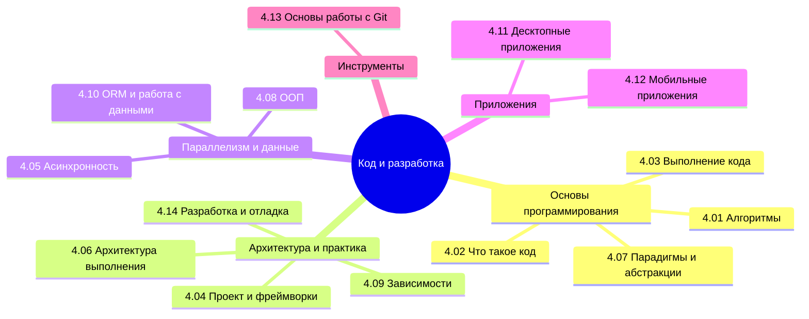

  ОБЯЗАТЕЛЬНО
  ДЛЯ НОВИЧКОВ

---

## О разделе

Готовьтесь к обучению магии программирования. Что такое программа - уже ясно. Но что такое код, как он работает, как его пишут? И только ли в коде вся сложность?

Вообще, лучше воспользуйтесь содержанием или перейдите к Базе знаний. Но для удобства, я размещу здесь ссылки на основные главы раздела:

---

## Инструменты разработки

<ul class="it-toc-articles">
  <li><a href="/encyclopedia/4-code-dev/4-011-instrumenty-razrabotki/10">4.011. Интегрированные среды разработки (IDE)</a></li>
  <li><a href="/encyclopedia/4-code-dev/4-011-instrumenty-razrabotki/402">4.011. Скрипты, макросы и локальная автоматизация</a></li>
  <li><a href="/encyclopedia/4-code-dev/4-011-instrumenty-razrabotki/503">4.011. Редакторы кода — VS Code, Vim, Notepad++</a></li>
  <li><a href="/encyclopedia/4-code-dev/4-011-instrumenty-razrabotki/511">4.011. Visual Studio Code</a></li>
</ul>

---

## Алгоритмы

<ul class="it-toc-articles">
  <li><a href="/encyclopedia/4-code-dev/4-01-algoritmy/1">4.01. Алгоритмы</a></li>
  <li><a href="/encyclopedia/4-code-dev/4-01-algoritmy/2">4.01. Алгоритмы сортировки и поиска</a></li>
  <li><a href="/encyclopedia/4-code-dev/4-01-algoritmy/3">4.01. Анализ эффективности алгоритмов</a></li>
  <li><a href="/encyclopedia/4-code-dev/4-01-algoritmy/4">4.01. Графы — модели и задачи</a></li>
  <li><a href="/encyclopedia/4-code-dev/4-01-algoritmy/11">4.01. Тренировка алгоритмического мышления</a></li>
  <li><a href="/encyclopedia/4-code-dev/4-01-algoritmy/41">4.01. Кратчайший путь — алгоритм Дейкстры</a></li>
  <li><a href="/encyclopedia/4-code-dev/4-01-algoritmy/42">4.01. PageRank — ранжирование на графе</a></li>
  <li><a href="/encyclopedia/4-code-dev/4-01-algoritmy/43">4.01. Евклид и классические алгоритмы на числах</a></li>
  <li><a href="/encyclopedia/4-code-dev/4-01-algoritmy/111">4.01. Регулярные выражения</a></li>
  <li><a href="/encyclopedia/4-code-dev/4-01-algoritmy/112">4.01. Алгоритм обработки</a></li>
  <li><a href="/encyclopedia/4-code-dev/4-01-algoritmy/311">4.01. Нотация Большое O</a></li>
  <li><a href="/encyclopedia/4-code-dev/4-01-algoritmy/312">4.01. Классы временной сложности алгоритмов</a></li>
  <li><a href="/encyclopedia/4-code-dev/4-01-algoritmy/313">4.01. Линейная, квадратичная и логарифмическая сложность</a></li>
  <li><a href="/encyclopedia/4-code-dev/4-01-algoritmy/998">4.01. Алгоритмы — итоги</a></li>
  <li><a href="/encyclopedia/4-code-dev/4-01-algoritmy/999">4.01. Алгоритмы — чек-лист</a></li>
  <li><a href="/encyclopedia/4-code-dev/4-01-algoritmy/1111">4.01. Регулярные выражения — синтаксис с нуля</a></li>
  <li><a href="/encyclopedia/4-code-dev/4-01-algoritmy/1112">4.01. Регулярные выражения — группы и замена</a></li>
  <li><a href="/encyclopedia/4-code-dev/4-01-algoritmy/1113">4.01. Регулярные выражения — проверки вокруг совпадения</a></li>
  <li><a href="/encyclopedia/4-code-dev/4-01-algoritmy/1114">4.01. Регулярные выражения — флаги и жадность</a></li>
  <li><a href="/encyclopedia/4-code-dev/4-01-algoritmy/1115">4.01. Регулярные выражения — рецепты и командная строка</a></li>
</ul>

---

## Код

<ul class="it-toc-articles">
  <li><a href="/encyclopedia/4-code-dev/4-02-chto-takoe-kod-i-kak-on-rabotaet/1">4.02. Что такое код и как он работает</a></li>
  <li><a href="/encyclopedia/4-code-dev/4-02-chto-takoe-kod-i-kak-on-rabotaet/2">4.02. Теория представления кода</a></li>
  <li><a href="/encyclopedia/4-code-dev/4-02-chto-takoe-kod-i-kak-on-rabotaet/3">4.02. Ключевые слова в языках программирования</a></li>
  <li><a href="/encyclopedia/4-code-dev/4-02-chto-takoe-kod-i-kak-on-rabotaet/4">4.02. Функции</a></li>
  <li><a href="/encyclopedia/4-code-dev/4-02-chto-takoe-kod-i-kak-on-rabotaet/5">4.02. Циклы</a></li>
  <li><a href="/encyclopedia/4-code-dev/4-02-chto-takoe-kod-i-kak-on-rabotaet/6">4.02. Стили оформления кода</a></li>
  <li><a href="/encyclopedia/4-code-dev/4-02-chto-takoe-kod-i-kak-on-rabotaet/33">4.02. Операторы</a></li>
  <li><a href="/encyclopedia/4-code-dev/4-02-chto-takoe-kod-i-kak-on-rabotaet/44">4.02. Обработка значения null</a></li>
  <li><a href="/encyclopedia/4-code-dev/4-02-chto-takoe-kod-i-kak-on-rabotaet/55">4.02. Уровни абстракции языков программирования</a></li>
  <li><a href="/encyclopedia/4-code-dev/4-02-chto-takoe-kod-i-kak-on-rabotaet/56">4.02. Синтаксический сахар</a></li>
  <li><a href="/encyclopedia/4-code-dev/4-02-chto-takoe-kod-i-kak-on-rabotaet/101">4.02. Язык программирования</a></li>
  <li><a href="/encyclopedia/4-code-dev/4-02-chto-takoe-kod-i-kak-on-rabotaet/611">4.02. Приёмы написания кода</a></li>
  <li><a href="/encyclopedia/4-code-dev/4-02-chto-takoe-kod-i-kak-on-rabotaet/612">4.02. Методы рефакторинга программного кода</a></li>
  <li><a href="/encyclopedia/4-code-dev/4-02-chto-takoe-kod-i-kak-on-rabotaet/613">4.02. Типы задач в программировании</a></li>
  <li><a href="/encyclopedia/4-code-dev/4-02-chto-takoe-kod-i-kak-on-rabotaet/614">4.02. Однострочные приёмы в коде</a></li>
  <li><a href="/encyclopedia/4-code-dev/4-02-chto-takoe-kod-i-kak-on-rabotaet/615">4.02. Регулярные выражения (RegEx)</a></li>
  <li><a href="/encyclopedia/4-code-dev/4-02-chto-takoe-kod-i-kak-on-rabotaet/616">4.02. Примитивы, value objects и маленькие типы</a></li>
  <li><a href="/encyclopedia/4-code-dev/4-02-chto-takoe-kod-i-kak-on-rabotaet/617">4.02. Каталог примеров кода</a></li>
  <li><a href="/encyclopedia/4-code-dev/4-02-chto-takoe-kod-i-kak-on-rabotaet/618">4.02. Коллекции и типы в коде</a></li>
  <li><a href="/encyclopedia/4-code-dev/4-02-chto-takoe-kod-i-kak-on-rabotaet/619">4.02. WebAssembly (WASM) — что это и когда использовать</a></li>
  <li><a href="/encyclopedia/4-code-dev/4-02-chto-takoe-kod-i-kak-on-rabotaet/620">4.02. Менеджеры версий языков — nvm, pyenv, rustup и другие</a></li>
  <li><a href="/encyclopedia/4-code-dev/4-02-chto-takoe-kod-i-kak-on-rabotaet/621">4.02. Пакетные менеджеры — npm, pip, cargo, go mod и другие</a></li>
  <li><a href="/encyclopedia/4-code-dev/4-02-chto-takoe-kod-i-kak-on-rabotaet/998">4.02. Код — итоги</a></li>
  <li><a href="/encyclopedia/4-code-dev/4-02-chto-takoe-kod-i-kak-on-rabotaet/999">4.02. Код — чек-лист</a></li>
</ul>

---

## Выполнение кода

<ul class="it-toc-articles">
  <li><a href="/encyclopedia/4-code-dev/4-03-vypolnenie-koda/1">4.03. Выполнение программного кода</a></li>
  <li><a href="/encyclopedia/4-code-dev/4-03-vypolnenie-koda/2">4.03. Процесс выполнения исходного кода</a></li>
  <li><a href="/encyclopedia/4-code-dev/4-03-vypolnenie-koda/3">4.03. Архитектура современных процессоров</a></li>
  <li><a href="/encyclopedia/4-code-dev/4-03-vypolnenie-koda/98">4.03. Выполнение кода — итоги</a></li>
  <li><a href="/encyclopedia/4-code-dev/4-03-vypolnenie-koda/99">4.03. Выполнение кода — чек-лист</a></li>
  <li><a href="/encyclopedia/4-code-dev/4-03-vypolnenie-koda/111">4.03. Неопределённое поведение в программах</a></li>
  <li><a href="/encyclopedia/4-code-dev/4-03-vypolnenie-koda/112">4.03. Внутреннее устройство функций</a></li>
  <li><a href="/encyclopedia/4-code-dev/4-03-vypolnenie-koda/113">4.03. Реализация циклов на уровне системы</a></li>
  <li><a href="/encyclopedia/4-code-dev/4-03-vypolnenie-koda/114">4.03. Как работают условные операторы</a></li>
  <li><a href="/encyclopedia/4-code-dev/4-03-vypolnenie-koda/115">4.03. Жизненный цикл переменных</a></li>
  <li><a href="/encyclopedia/4-code-dev/4-03-vypolnenie-koda/116">4.03. Виртуальные машины для выполнения кода</a></li>
  <li><a href="/encyclopedia/4-code-dev/4-03-vypolnenie-koda/211">4.03. Шестнадцатеричная система счисления в программировании</a></li>
  <li><a href="/encyclopedia/4-code-dev/4-03-vypolnenie-koda/311">4.03. Регистры процессора и их роль</a></li>
  <li><a href="/encyclopedia/4-code-dev/4-03-vypolnenie-koda/312">4.03. Машинное слово</a></li>
  <li><a href="/encyclopedia/4-code-dev/4-03-vypolnenie-koda/313">4.03. Расположение данных в памяти и директивы компилятора</a></li>
  <li><a href="/encyclopedia/4-code-dev/4-03-vypolnenie-koda/314">4.03. Исполнение байт-кода виртуальными машинами</a></li>
  <li><a href="/encyclopedia/4-code-dev/4-03-vypolnenie-koda/315">4.03. Дизассемблирование и восстановление исходного кода</a></li>
</ul>

---

## Проект, структура и фреймворки

<ul class="it-toc-articles">
  <li><a href="/encyclopedia/4-code-dev/4-04-proekt-i-freymvorki/1">4.04. Проект программного обеспечения</a></li>
  <li><a href="/encyclopedia/4-code-dev/4-04-proekt-i-freymvorki/2">4.04. Модульность и компонентный подход в разработке</a></li>
  <li><a href="/encyclopedia/4-code-dev/4-04-proekt-i-freymvorki/3">4.04. Оптимизация размера и производительности приложений</a></li>
  <li><a href="/encyclopedia/4-code-dev/4-04-proekt-i-freymvorki/11">4.04. Фреймворк</a></li>
  <li><a href="/encyclopedia/4-code-dev/4-04-proekt-i-freymvorki/101">4.04. Библиотека</a></li>
  <li><a href="/encyclopedia/4-code-dev/4-04-proekt-i-freymvorki/102">4.04. Сборка, компиляция и публикация приложений</a></li>
  <li><a href="/encyclopedia/4-code-dev/4-04-proekt-i-freymvorki/103">4.04. Манифесты зависимостей — requirements.txt, package.json, Dockerfile</a></li>
  <li><a href="/encyclopedia/4-code-dev/4-04-proekt-i-freymvorki/104">4.04. Основы работы с контейнерами</a></li>
  <li><a href="/encyclopedia/4-code-dev/4-04-proekt-i-freymvorki/111">4.04. Микрофреймворк</a></li>
  <li><a href="/encyclopedia/4-code-dev/4-04-proekt-i-freymvorki/112">4.04. Основы архитектуры</a></li>
  <li><a href="/encyclopedia/4-code-dev/4-04-proekt-i-freymvorki/998">4.04. Проект, структура и фреймворки — итоги</a></li>
  <li><a href="/encyclopedia/4-code-dev/4-04-proekt-i-freymvorki/999">4.04. Проект, структура и фреймворки — чек-лист</a></li>
</ul>

---

## Асинхронность

<ul class="it-toc-articles">
  <li><a href="/encyclopedia/4-code-dev/4-05-asinhronnost/1">4.05. Процессы и потоки выполнения</a></li>
  <li><a href="/encyclopedia/4-code-dev/4-05-asinhronnost/2">4.05. Асинхронность простым языком — живые примеры</a></li>
  <li><a href="/encyclopedia/4-code-dev/4-05-asinhronnost/3">4.05. Практикум — последовательное и параллельное выполнение</a></li>
  <li><a href="/encyclopedia/4-code-dev/4-05-asinhronnost/11">4.05. Управление потоками в многозадачных системах</a></li>
  <li><a href="/encyclopedia/4-code-dev/4-05-asinhronnost/12">4.05. Асинхронное и синхронное выполнение</a></li>
  <li><a href="/encyclopedia/4-code-dev/4-05-asinhronnost/13">4.05. Межпроцессное взаимодействие и обмен данными</a></li>
  <li><a href="/encyclopedia/4-code-dev/4-05-asinhronnost/998">4.05. Асинхронность — итоги</a></li>
  <li><a href="/encyclopedia/4-code-dev/4-05-asinhronnost/999">4.05. Асинхронность — чек-лист</a></li>
</ul>

---

## Архитектура выполнения

<ul class="it-toc-articles">
  <li><a href="/encyclopedia/4-code-dev/4-06-arhitektura-vypolneniya/1">4.06. Архитектура выполнения программ</a></li>
  <li><a href="/encyclopedia/4-code-dev/4-06-arhitektura-vypolneniya/2">4.06. Битовые операции и низкоуровневое представление данных</a></li>
  <li><a href="/encyclopedia/4-code-dev/4-06-arhitektura-vypolneniya/3">4.06. Архитектура выполнения — итоги</a></li>
  <li><a href="/encyclopedia/4-code-dev/4-06-arhitektura-vypolneniya/4">4.06. Архитектура выполнения — чек-лист</a></li>
  <li><a href="/encyclopedia/4-code-dev/4-06-arhitektura-vypolneniya/111">4.06. Ошибки, исключения и отказоустойчивость</a></li>
  <li><a href="/encyclopedia/4-code-dev/4-06-arhitektura-vypolneniya/112">4.06. Отладка и видимость состояния</a></li>
  <li><a href="/encyclopedia/4-code-dev/4-06-arhitektura-vypolneniya/113">4.06. Вызовы и иерархия</a></li>
  <li><a href="/encyclopedia/4-code-dev/4-06-arhitektura-vypolneniya/114">4.06. Ресурсопотребление и метрики</a></li>
  <li><a href="/encyclopedia/4-code-dev/4-06-arhitektura-vypolneniya/115">4.06. Неиспользуемый код и технический долг</a></li>
  <li><a href="/encyclopedia/4-code-dev/4-06-arhitektura-vypolneniya/116">4.06. Сборка и культура производительности</a></li>
</ul>

---

## Парадигмы и уровни абстракции

<ul class="it-toc-articles">
  <li><a href="/encyclopedia/4-code-dev/4-07-paradigmy-i-urovni-abstraktsii/1">4.07. Программные парадигмы</a></li>
  <li><a href="/encyclopedia/4-code-dev/4-07-paradigmy-i-urovni-abstraktsii/111">4.07. Уровни абстракции в разработке ПО</a></li>
  <li><a href="/encyclopedia/4-code-dev/4-07-paradigmy-i-urovni-abstraktsii/112">4.07. Метапрограммирование - генерация и модификация кода</a></li>
  <li><a href="/encyclopedia/4-code-dev/4-07-paradigmy-i-urovni-abstraktsii/113">4.07. Принципы SOLID в объектно-ориентированном проектировании</a></li>
  <li><a href="/encyclopedia/4-code-dev/4-07-paradigmy-i-urovni-abstraktsii/114">4.07. Обобщения и обобщённое программирование</a></li>
  <li><a href="/encyclopedia/4-code-dev/4-07-paradigmy-i-urovni-abstraktsii/998">4.07. Парадигмы и уровни абстракции — итоги</a></li>
  <li><a href="/encyclopedia/4-code-dev/4-07-paradigmy-i-urovni-abstraktsii/999">4.07. Парадигмы и уровни абстракции — чек-лист</a></li>
</ul>

---

## Объектно-ориентированное программирование

<ul class="it-toc-articles">
  <li><a href="/encyclopedia/4-code-dev/4-08-oop/1">4.08. Объектно-ориентированное программирование</a></li>
  <li><a href="/encyclopedia/4-code-dev/4-08-oop/2">4.08. Абстракция - скрытие деталей реализации</a></li>
  <li><a href="/encyclopedia/4-code-dev/4-08-oop/3">4.08. Инкапсуляция - защита внутреннего состояния объекта</a></li>
  <li><a href="/encyclopedia/4-code-dev/4-08-oop/4">4.08. Наследование - повторное использование и иерархия типов</a></li>
  <li><a href="/encyclopedia/4-code-dev/4-08-oop/5">4.08. Полиморфизм - единый интерфейс для разных реализаций</a></li>
  <li><a href="/encyclopedia/4-code-dev/4-08-oop/6">4.08. Перечисления</a></li>
  <li><a href="/encyclopedia/4-code-dev/4-08-oop/7">4.08. Сложность ПО, декомпозиция и объектно-ориентированный подход</a></li>
  <li><a href="/encyclopedia/4-code-dev/4-08-oop/61">4.08. Коллекции</a></li>
  <li><a href="/encyclopedia/4-code-dev/4-08-oop/98">4.08. Объектно-ориентированное программирование — итоги</a></li>
  <li><a href="/encyclopedia/4-code-dev/4-08-oop/99">4.08. Объектно-ориентированное программирование — чек-лист</a></li>
</ul>

---

## Зависимости

<ul class="it-toc-articles">
  <li><a href="/encyclopedia/4-code-dev/4-09-zavisimosti/1">4.09. Управление зависимостями в программных проектах</a></li>
  <li><a href="/encyclopedia/4-code-dev/4-09-zavisimosti/11">4.09. Принцип инверсии зависимостей (DIP)</a></li>
  <li><a href="/encyclopedia/4-code-dev/4-09-zavisimosti/12">4.09. Внедрение зависимостей (Dependency Injection)</a></li>
  <li><a href="/encyclopedia/4-code-dev/4-09-zavisimosti/998">4.09. Зависимости — итоги</a></li>
  <li><a href="/encyclopedia/4-code-dev/4-09-zavisimosti/999">4.09. Зависимости — чек-лист</a></li>
</ul>

---

## ORM и работа с данными

<ul class="it-toc-articles">
  <li><a href="/encyclopedia/4-code-dev/4-10-orm-i-rabota-s-dannymi/1">4.10. Работа приложений с базами данных</a></li>
  <li><a href="/encyclopedia/4-code-dev/4-10-orm-i-rabota-s-dannymi/111">4.10. Взаимодействие программного кода с СУБД</a></li>
  <li><a href="/encyclopedia/4-code-dev/4-10-orm-i-rabota-s-dannymi/112">4.10. ORM - объектно-реляционное отображение</a></li>
  <li><a href="/encyclopedia/4-code-dev/4-10-orm-i-rabota-s-dannymi/113">4.10. Принципы проектирования ORM-систем</a></li>
  <li><a href="/encyclopedia/4-code-dev/4-10-orm-i-rabota-s-dannymi/114">4.10. Подходы к реализации ORM</a></li>
  <li><a href="/encyclopedia/4-code-dev/4-10-orm-i-rabota-s-dannymi/115">4.10. Миграции баз данных</a></li>
  <li><a href="/encyclopedia/4-code-dev/4-10-orm-i-rabota-s-dannymi/116">4.10. Нормализация и денормализация данных</a></li>
  <li><a href="/encyclopedia/4-code-dev/4-10-orm-i-rabota-s-dannymi/117">4.10. Ограничения и проблемы ORM</a></li>
  <li><a href="/encyclopedia/4-code-dev/4-10-orm-i-rabota-s-dannymi/118">4.10. ORM на практике</a></li>
  <li><a href="/encyclopedia/4-code-dev/4-10-orm-i-rabota-s-dannymi/119">4.10. PostgreSQL: отложенные ограничения и .NET</a></li>
  <li><a href="/encyclopedia/4-code-dev/4-10-orm-i-rabota-s-dannymi/998">4.10. ORM и работа с данными — итоги</a></li>
  <li><a href="/encyclopedia/4-code-dev/4-10-orm-i-rabota-s-dannymi/999">4.10. ORM и работа с данными — чек-лист</a></li>
  <li><a href="/encyclopedia/4-code-dev/4-10-orm-i-rabota-s-dannymi/1111">4.10. Работа с хранилищем</a></li>
</ul>

---

## Десктопные приложения

<ul class="it-toc-articles">
  <li><a href="/encyclopedia/4-code-dev/4-11-desktopnye-prilozheniya/1">4.11. Архитектура десктопных приложений</a></li>
  <li><a href="/encyclopedia/4-code-dev/4-11-desktopnye-prilozheniya/2">4.11. Работа с графовыми структурами в коде</a></li>
  <li><a href="/encyclopedia/4-code-dev/4-11-desktopnye-prilozheniya/111">4.11. Разработка приложений для настольных операционных систем</a></li>
  <li><a href="/encyclopedia/4-code-dev/4-11-desktopnye-prilozheniya/112">4.11. Особенности разработки десктопных приложений</a></li>
  <li><a href="/encyclopedia/4-code-dev/4-11-desktopnye-prilozheniya/113">4.11. WebView</a></li>
  <li><a href="/encyclopedia/4-code-dev/4-11-desktopnye-prilozheniya/114">4.11. Electron</a></li>
  <li><a href="/encyclopedia/4-code-dev/4-11-desktopnye-prilozheniya/115">4.11. Windows Forms (WinForms)</a></li>
  <li><a href="/encyclopedia/4-code-dev/4-11-desktopnye-prilozheniya/116">4.11. Разработка приложений для Windows (Microsoft Learn)</a></li>
  <li><a href="/encyclopedia/4-code-dev/4-11-desktopnye-prilozheniya/117">4.11. Microsoft Store и публикация Windows-приложений</a></li>
  <li><a href="/encyclopedia/4-code-dev/4-11-desktopnye-prilozheniya/118">4.11. Первая программа Electron с React</a></li>
  <li><a href="/encyclopedia/4-code-dev/4-11-desktopnye-prilozheniya/119">4.11. Первая форма WPF — XAML, стили и шаблоны</a></li>
  <li><a href="/encyclopedia/4-code-dev/4-11-desktopnye-prilozheniya/120">4.11. Как сделать установщик</a></li>
  <li><a href="/encyclopedia/4-code-dev/4-11-desktopnye-prilozheniya/998">4.11. Десктопные приложения — итоги</a></li>
  <li><a href="/encyclopedia/4-code-dev/4-11-desktopnye-prilozheniya/999">4.11. Десктопные приложения — чек-лист</a></li>
  <li><a href="/encyclopedia/4-code-dev/4-11-desktopnye-prilozheniya/1152">4.11. Справочник по WinForms — элементы UI</a></li>
  <li><a href="/encyclopedia/4-code-dev/4-11-desktopnye-prilozheniya/1192">4.11. Справочник по WPF — элементы UI</a></li>
</ul>

---

## Практикум WPF и клиент-сервер

<ul class="it-toc-articles">
  <li><a href="/encyclopedia/4-code-dev/4-11-desktopnye-prilozheniya/wpf-praktikum/1">4.11. Практикум WPF — введение в WPF и XAML</a></li>
  <li><a href="/encyclopedia/4-code-dev/4-11-desktopnye-prilozheniya/wpf-praktikum/2">4.11. Практикум WPF — основы MVVM</a></li>
  <li><a href="/encyclopedia/4-code-dev/4-11-desktopnye-prilozheniya/wpf-praktikum/3">4.11. Практикум WPF — сервер ASP.NET Core Web API</a></li>
  <li><a href="/encyclopedia/4-code-dev/4-11-desktopnye-prilozheniya/wpf-praktikum/4">4.11. Практикум WPF — клиент на Prism</a></li>
  <li><a href="/encyclopedia/4-code-dev/4-11-desktopnye-prilozheniya/wpf-praktikum/5">4.11. Практикум WPF — тестирование API и unit-тесты</a></li>
  <li><a href="/encyclopedia/4-code-dev/4-11-desktopnye-prilozheniya/wpf-praktikum/6">4.11. Практикум WPF — итоговый проект TaskDesk</a></li>
</ul>

---

## Мобильные приложения

<ul class="it-toc-articles">
  <li><a href="/encyclopedia/4-code-dev/4-12-mobilnye-prilozheniya/1">4.12. Мобильные приложения</a></li>
  <li><a href="/encyclopedia/4-code-dev/4-12-mobilnye-prilozheniya/2">4.12. Мобильные приложения — итоги</a></li>
  <li><a href="/encyclopedia/4-code-dev/4-12-mobilnye-prilozheniya/3">4.12. Мобильные приложения — чек-лист</a></li>
  <li><a href="/encyclopedia/4-code-dev/4-12-mobilnye-prilozheniya/111">4.12. Компоненты пользовательского интерфейса на Android</a></li>
  <li><a href="/encyclopedia/4-code-dev/4-12-mobilnye-prilozheniya/112">4.12. Сборка и развёртывание мобильных приложений</a></li>
  <li><a href="/encyclopedia/4-code-dev/4-12-mobilnye-prilozheniya/113">4.12. Супераппы</a></li>
  <li><a href="/encyclopedia/4-code-dev/4-12-mobilnye-prilozheniya/1121">4.12. Отладка по USB на Android</a></li>
  <li><a href="/encyclopedia/4-code-dev/4-12-mobilnye-prilozheniya/1131">4.12. React Native</a></li>
  <li><a href="/encyclopedia/4-code-dev/4-12-mobilnye-prilozheniya/1132">4.12. Expo</a></li>
  <li><a href="/encyclopedia/4-code-dev/4-12-mobilnye-prilozheniya/1133">4.12. MAUI</a></li>
  <li><a href="/encyclopedia/4-code-dev/4-12-mobilnye-prilozheniya/1134">4.12. Dart</a></li>
  <li><a href="/encyclopedia/4-code-dev/4-12-mobilnye-prilozheniya/1135">4.12. Kotlin в мобильных приложениях</a></li>
  <li><a href="/encyclopedia/4-code-dev/4-12-mobilnye-prilozheniya/1136">4.12. Java в мобильных приложениях</a></li>
  <li><a href="/encyclopedia/4-code-dev/4-12-mobilnye-prilozheniya/1137">4.12. Swift в мобильных приложениях</a></li>
  <li><a href="/encyclopedia/4-code-dev/4-12-mobilnye-prilozheniya/1138">4.12. PWA в мобильных приложениях</a></li>
  <li><a href="/encyclopedia/4-code-dev/4-12-mobilnye-prilozheniya/1139">4.12. Capacitor в мобильных приложениях</a></li>
  <li><a href="/encyclopedia/4-code-dev/4-12-mobilnye-prilozheniya/1140">4.12. Unity и Unreal Engine в мобильных приложениях</a></li>
  <li><a href="/encyclopedia/4-code-dev/4-12-mobilnye-prilozheniya/1141">4.12. Публикация Android-приложения</a></li>
  <li><a href="/encyclopedia/4-code-dev/4-12-mobilnye-prilozheniya/11311">4.12. Первая программа на React Native</a></li>
  <li><a href="/encyclopedia/4-code-dev/4-12-mobilnye-prilozheniya/11321">4.12. Первая программа на Expo</a></li>
</ul>

---

## Основы работы с Git

<ul class="it-toc-articles">
  <li><a href="/encyclopedia/4-code-dev/4-13-osnovy-raboty-s-git/1">4.13. Система контроля версий Git</a></li>
  <li><a href="/encyclopedia/4-code-dev/4-13-osnovy-raboty-s-git/2">4.13. Основы работы с Git — итоги</a></li>
  <li><a href="/encyclopedia/4-code-dev/4-13-osnovy-raboty-s-git/3">4.13. Основы работы с Git — чек-лист</a></li>
  <li><a href="/encyclopedia/4-code-dev/4-13-osnovy-raboty-s-git/111">4.13. Установка и настройка Git</a></li>
  <li><a href="/encyclopedia/4-code-dev/4-13-osnovy-raboty-s-git/112">4.13. Как работать с Git</a></li>
  <li><a href="/encyclopedia/4-code-dev/4-13-osnovy-raboty-s-git/113">4.13. Ветвление и слияние в Git</a></li>
  <li><a href="/encyclopedia/4-code-dev/4-13-osnovy-raboty-s-git/114">4.13. Рекомендации по использованию Git в команде</a></li>
  <li><a href="/encyclopedia/4-code-dev/4-13-osnovy-raboty-s-git/115">4.13. Справочник-шпаргалка по Git</a></li>
  <li><a href="/encyclopedia/4-code-dev/4-13-osnovy-raboty-s-git/116">4.13. Файл .gitignore</a></li>
  <li><a href="/encyclopedia/4-code-dev/4-13-osnovy-raboty-s-git/117">4.13. Код-ревью и pull request</a></li>
  <li><a href="/encyclopedia/4-code-dev/4-13-osnovy-raboty-s-git/1141">4.13. Типовые ситуации с Git</a></li>
</ul>

---

## Разработка и отладка

<ul class="it-toc-articles">
  <li><a href="/encyclopedia/4-code-dev/4-14-razrabotka-i-otladka/1">4.14. Процесс разработки программного обеспечения</a></li>
  <li><a href="/encyclopedia/4-code-dev/4-14-razrabotka-i-otladka/2">4.14. Разработка и отладка — итоги</a></li>
  <li><a href="/encyclopedia/4-code-dev/4-14-razrabotka-i-otladka/3">4.14. Разработка и отладка — чек-лист</a></li>
  <li><a href="/encyclopedia/4-code-dev/4-14-razrabotka-i-otladka/11">4.14. Профессиональные практики и культура разработки</a></li>
  <li><a href="/encyclopedia/4-code-dev/4-14-razrabotka-i-otladka/101">4.14. Типовые задачи разработчика — справочник-шпаргалка</a></li>
  <li><a href="/encyclopedia/4-code-dev/4-14-razrabotka-i-otladka/111">4.14. Отладка</a></li>
  <li><a href="/encyclopedia/4-code-dev/4-14-razrabotka-i-otladka/112">4.14. Анализ и оптимизация производительности приложений</a></li>
  <li><a href="/encyclopedia/4-code-dev/4-14-razrabotka-i-otladka/113">4.14. Создание и публикация собственной библиотеки</a></li>
  <li><a href="/encyclopedia/4-code-dev/4-14-razrabotka-i-otladka/114">4.14. Пет-проекты</a></li>
  <li><a href="/encyclopedia/4-code-dev/4-14-razrabotka-i-otladka/115">4.14. План развития разработчика</a></li>
  <li><a href="/encyclopedia/4-code-dev/4-14-razrabotka-i-otladka/116">4.14. Организация структуры кодовой базы</a></li>
  <li><a href="/encyclopedia/4-code-dev/4-14-razrabotka-i-otladka/117">4.14. README для разработчика</a></li>
  <li><a href="/encyclopedia/4-code-dev/4-14-razrabotka-i-otladka/118">4.14. Проверка и валидация</a></li>
  <li><a href="/encyclopedia/4-code-dev/4-14-razrabotka-i-otladka/119">4.14. Разработка расширений для веб-браузеров</a></li>
  <li><a href="/encyclopedia/4-code-dev/4-14-razrabotka-i-otladka/1111">4.14. Настройка логирования</a></li>
  <li><a href="/encyclopedia/4-code-dev/4-14-razrabotka-i-otladka/1112">4.14. Безопасность окружения и .env файлы</a></li>
  <li><a href="/encyclopedia/4-code-dev/4-14-razrabotka-i-otladka/1113">4.14. Использование AI-ассистентов в разработке</a></li>
  <li><a href="/encyclopedia/4-code-dev/4-14-razrabotka-i-otladka/1114">4.14. Основы веб-разработки и типичные оплошности</a></li>
  <li><a href="/encyclopedia/4-code-dev/4-14-razrabotka-i-otladka/1115">4.14. Типичные ошибки новичков в бэкенд и десктоп-разработке</a></li>
  <li><a href="/encyclopedia/4-code-dev/4-14-razrabotka-i-otladka/1116">4.14. DevTools в браузере — справочник</a></li>
  <li><a href="/encyclopedia/4-code-dev/4-14-razrabotka-i-otladka/1117">4.14. Тестирование для разработчика</a></li>
  <li><a href="/encyclopedia/4-code-dev/4-14-razrabotka-i-otladka/1118">4.14. Как читать чужой код</a></li>
  <li><a href="/encyclopedia/4-code-dev/4-14-razrabotka-i-otladka/1119">4.14. Как искать баг</a></li>
  <li><a href="/encyclopedia/4-code-dev/4-14-razrabotka-i-otladka/1131">4.14. Создание и публикация расширения для Visual Studio Code</a></li>
  <li><a href="/encyclopedia/4-code-dev/4-14-razrabotka-i-otladka/1132">4.14. Visual Studio — установка, IDE и версии</a></li>
</ul>

---

## Сборка мусора

<ul class="it-toc-articles">
  <li><a href="/encyclopedia/4-code-dev/4-15-sborka-musora/1">4.15. Автоматическое управление памятью</a></li>
  <li><a href="/encyclopedia/4-code-dev/4-15-sborka-musora/2">4.15. Сборка мусора — итоги</a></li>
  <li><a href="/encyclopedia/4-code-dev/4-15-sborka-musora/3">4.15. Сборка мусора — чек-лист</a></li>
  <li><a href="/encyclopedia/4-code-dev/4-15-sborka-musora/4">4.15. Java, Python и Go — три модели GC</a></li>
</ul>

---

## Параллельные вычисления

<ul class="it-toc-articles">
  <li><a href="/encyclopedia/4-code-dev/4-16-parallelnye-vychisleniya/1">4.16. Параллельные вычислительные процессы — введение</a></li>
  <li><a href="/encyclopedia/4-code-dev/4-16-parallelnye-vychisleniya/2">4.16. Классификация параллельных архитектур</a></li>
  <li><a href="/encyclopedia/4-code-dev/4-16-parallelnye-vychisleniya/3">4.16. Память, мультипроцессоры, кластеры и GRID</a></li>
  <li><a href="/encyclopedia/4-code-dev/4-16-parallelnye-vychisleniya/4">4.16. Модели параллельных вычислений и топологии</a></li>
  <li><a href="/encyclopedia/4-code-dev/4-16-parallelnye-vychisleniya/5">4.16. Граф алгоритма и матрица следования</a></li>
  <li><a href="/encyclopedia/4-code-dev/4-16-parallelnye-vychisleniya/6">4.16. Временной анализ параллельных алгоритмов</a></li>
  <li><a href="/encyclopedia/4-code-dev/4-16-parallelnye-vychisleniya/7">4.16. Законы производительности параллельных систем</a></li>
  <li><a href="/encyclopedia/4-code-dev/4-16-parallelnye-vychisleniya/8">4.16. Инженерия параллельных алгоритмов</a></li>
  <li><a href="/encyclopedia/4-code-dev/4-16-parallelnye-vychisleniya/9">4.16. Параллельное умножение матриц</a></li>
  <li><a href="/encyclopedia/4-code-dev/4-16-parallelnye-vychisleniya/10">4.16. Сети Петри и формальные расписания</a></li>
  <li><a href="/encyclopedia/4-code-dev/4-16-parallelnye-vychisleniya/11">4.16. Практика — OpenMP, MPI и профилирование</a></li>
  <li><a href="/encyclopedia/4-code-dev/4-16-parallelnye-vychisleniya/12">4.16. Параллельное решение СЛАУ — метод Гаусса</a></li>
  <li><a href="/encyclopedia/4-code-dev/4-16-parallelnye-vychisleniya/998">4.16. Параллельные вычисления — итоги</a></li>
  <li><a href="/encyclopedia/4-code-dev/4-16-parallelnye-vychisleniya/999">4.16. Параллельные вычисления — чек-лист</a></li>
</ul>

---

## Веб-разработка

<ul class="it-toc-articles">
  <li><a href="/encyclopedia/4-code-dev/4-17-veb-razrabotka/1">4.17. Что такое веб-разработка</a></li>
  <li><a href="/encyclopedia/4-code-dev/4-17-veb-razrabotka/2">4.17. Веб-разработка — итоги</a></li>
  <li><a href="/encyclopedia/4-code-dev/4-17-veb-razrabotka/3">4.17. Веб-разработка — чек-лист</a></li>
  <li><a href="/encyclopedia/4-code-dev/4-17-veb-razrabotka/4">4.17. Как делают веб-приложения</a></li>
  <li><a href="/encyclopedia/4-code-dev/4-17-veb-razrabotka/5">4.17. HTML, CSS и JavaScript — три слоя веб-страницы</a></li>
  <li><a href="/encyclopedia/4-code-dev/4-17-veb-razrabotka/6">4.17. От идеи до работающего сайта</a></li>
  <li><a href="/encyclopedia/4-code-dev/4-17-veb-razrabotka/7">4.17. Основы веб-дизайна для разработчика</a></li>
  <li><a href="/encyclopedia/4-code-dev/4-17-veb-razrabotka/8">4.17. Open-source веб-фреймворки</a></li>
</ul>

---

## Разработка графики

<ul class="it-toc-articles">
  <li><a href="/encyclopedia/4-code-dev/4-18-graphic-dev/1">4.18. От чисел к картинке</a></li>
  <li><a href="/encyclopedia/4-code-dev/4-18-graphic-dev/2">4.18. Модель, update, render</a></li>
  <li><a href="/encyclopedia/4-code-dev/4-18-graphic-dev/3">4.18. Цикл и FSM</a></li>
  <li><a href="/encyclopedia/4-code-dev/4-18-graphic-dev/4">4.18. Структуры сцены</a></li>
  <li><a href="/encyclopedia/4-code-dev/4-18-graphic-dev/5">4.18. Математика 2D/3D</a></li>
  <li><a href="/encyclopedia/4-code-dev/4-18-graphic-dev/6">4.18. High-Level API</a></li>
  <li><a href="/encyclopedia/4-code-dev/4-18-graphic-dev/7">4.18. Веб — Canvas и WebGL</a></li>
  <li><a href="/encyclopedia/4-code-dev/4-18-graphic-dev/8">4.18. Python — Pygame и SDL</a></li>
  <li><a href="/encyclopedia/4-code-dev/4-18-graphic-dev/9">4.18. C# — Unity и UI</a></li>
  <li><a href="/encyclopedia/4-code-dev/4-18-graphic-dev/10">4.18. Skia и ANGLE</a></li>
  <li><a href="/encyclopedia/4-code-dev/4-18-graphic-dev/11">4.18. Графические API</a></li>
  <li><a href="/encyclopedia/4-code-dev/4-18-graphic-dev/12">4.18. VRAM и GPU</a></li>
  <li><a href="/encyclopedia/4-code-dev/4-18-graphic-dev/13">4.18. Буферизация и V-Sync</a></li>
  <li><a href="/encyclopedia/4-code-dev/4-18-graphic-dev/14">4.18. Битмап и монитор</a></li>
  <li><a href="/encyclopedia/4-code-dev/4-18-graphic-dev/998">4.18. Разработка графики — итоги</a></li>
  <li><a href="/encyclopedia/4-code-dev/4-18-graphic-dev/999">4.18. Разработка графики — чек-лист</a></li>
</ul>
