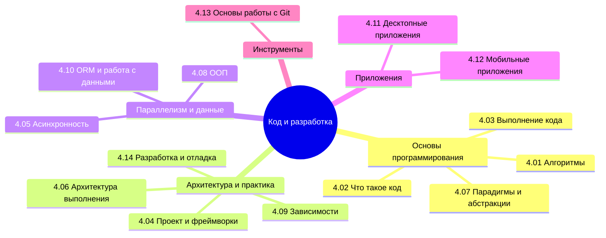

## Оглавление

Готовьтесь к обучению магии программирования. Что такое программа - уже ясно. Но что такое код, как он работает, как его пишут? И только ли в коде вся сложность?

Вообще, лучше воспользуйтесь содержанием или перейдите к Базе знаний. Но для удобства, я размещу здесь ссылки на основные главы раздела:

<ul>
  <li><a href="/it-knowledge-base/docs/Код%20и%20разработка/4.01.%20Алгоритмы/1">4.01. Алгоритмы</a></li>
  Понятие алгоритма как формализованной последовательности шагов для решения задачи. Классификация, свойства (детерминированность, конечность, результативность), анализ сложности по времени и памяти.
  
  <li><a href="/it-knowledge-base/docs/Код%20и%20разработка/4.02.%20Что%20такое%20код%20и%20как%20он%20работает/1">4.02. Что такое код и как он работает</a></li>
  Структура исходного кода: инструкции, выражения, операторы. Преобразование текста программы в исполняемую форму. Роль компиляторов, интерпретаторов и транспайлеров.
  
  <li><a href="/it-knowledge-base/docs/Код%20и%20разработка/4.03.%20Выполнение%20кода/1">4.03. Выполнение кода</a></li>
  Жизненный цикл выполнения программы: загрузка, инициализация, исполнение, завершение. Управление потоком управления, стек вызовов, обработка ошибок.
  
  <li><a href="/it-knowledge-base/docs/Код%20и%20разработка/4.04.%20Проект%20и%20фреймворки/1">4.04. Проект и фреймворки</a></li>
  Организация кодовой базы в виде проекта: структура каталогов, конфигурационные файлы, сборка. Назначение фреймворков и библиотек, их влияние на скорость и архитектуру разработки.
  
  <li><a href="/it-knowledge-base/docs/Код%20и%20разработка/4.05.%20Асинхронность/1">4.05. Асинхронность</a></li>
  Модели асинхронного программирования: колбэки, промисы, async/await. Обработка долгих операций без блокировки основного потока. Синхронизация и состояния гонки.
  
  <li><a href="/it-knowledge-base/docs/Код%20и%20разработка/4.06.%20Архитектура%20выполнения/1">4.06. Архитектура выполнения</a></li>
  Аппаратно-программное взаимодействие при запуске кода: процессор, память, системные вызовы, виртуальные машины, среды выполнения (runtime).
  
  <li><a href="/it-knowledge-base/docs/Код%20и%20разработка/4.07.%20Парадигмы%20и%20уровни%20абстракции/1">4.07. Парадигмы и уровни абстракции</a></li>
  Сравнение парадигм программирования: императивная, функциональная, логическая, декларативная. Иерархия абстракций — от машинного кода до высокоуровневых DSL.
  
  <li><a href="/it-knowledge-base/docs/Код%20и%20разработка/4.08.%20ООП/1">4.08. ООП</a></li>
  Принципы объектно-ориентированного программирования: инкапсуляция, наследование, полиморфизм. Проектирование классов, интерфейсы, композиция, принципы.
  
  <li><a href="/it-knowledge-base/docs/Код%20и%20разработка/4.09.%20Зависимости/1">4.09. Зависимости</a></li>
  Управление внешними и внутренними зависимостями. Системы управления пакетами, версионирование, дерево зависимостей, проблемы совместимости и "ад зависимостей".
  
  <li><a href="/it-knowledge-base/docs/Код%20и%20разработка/4.10.%20ORM%20и%20работа%20с%20данными/1">4.10. ORM и работа с данными</a></li>
  Инструменты объектно-реляционного отображения: маппинг сущностей на таблицы, миграции, транзакции. Преимущества и ограничения использования ORM.
  
  <li><a href="/it-knowledge-base/docs/Код%20и%20разработка/4.11.%20Десктопные%20приложения/1">4.11. Десктопные приложения</a></li>
  Архитектурные особенности десктопных приложений: GUI-фреймворки, доступ к системным ресурсам, установка, обновление, кроссплатформенность.
  
  <li><a href="/it-knowledge-base/docs/Код%20и%20разработка/4.12.%20Мобильные%20приложения/1">4.12. Мобильные приложения</a></li>
  Особенности разработки под мобильные платформы: жизненный цикл активности, ограничения производительности, нативные и кроссплатформенные решения, магазины приложений.
  
  <li><a href="/it-knowledge-base/docs/Код%20и%20разработка/4.13.%20Основы%20работы%20с%20Git/1">4.13. Основы работы с Git</a></li>
  Введение в систему контроля версий Git: коммиты, ветвление, слияние, удалённые репозитории. Базовые команды и рабочие процессы (workflow).
  
  <li><a href="/it-knowledge-base/docs/Код%20и%20разработка/4.14.%20Разработка%20и%20отладка/1">4.14. Разработка и отладка</a></li>
  Методики написания качественного кода: тестирование, рефакторинг, логирование. Инструменты отладки, профилирование, поиск и устранение дефектов.
</ul>

Программирование охватывает не только команды и код (собственно, поэтому я не особо люблю термин «программист» и больше склоняюсь к термину «разработчик»). Сама по себе разработка — это искусство создания новых решений из простых абстрактных идей. Мы уже прошли важный этап подготовки и у нас есть фундамент, который позволит уверенно двигаться дальше.

Программирование требует знаний и практики. Мы будем заниматься практикой умеренно. Как я заметил, практического материала в сети и литературе очень много, так как каждый автор считает, что нужно просто практиковаться.

Знаете почему говорят практика, практика, практика? Потому что проблемы и сложности возникают не из-за кодирования, а из-за различных инструментов, отладки, поиска проблем, поиска решений, изучения возможных методов в библиотеках, анализ производительности и исправления ошибок - вот в чём вся сложность, которая познается на практике — это и есть 90% времени работы программиста. Написать легко, да и запустить легко, а вот сделать четко, быстро и без ошибок - уже искусство. А потом тестировщики находят ошибку и всё по новой. Самое страшное, когда у тебя рабочее решение, но заказчик или руководитель захотел что-то подправить, и именно это «поправить» потом сжирает многие часы страданий.

Но как можно научиться читать код, к примеру, на Java, не разобравшись в базовых основах ООП? Это главное упущение, с которым я столкнулся. Мы попробуем значительную часть провести за «разжёвыванием» фундамента, чтобы потом было легко, и будем отталкиваться в первую очередь от алгоритмического языка.

На практике всё будет сложно, и даже очень. Первая задача определённого типа заставит застрять с вопросом «Как это реализовать?» и здесь кому-то повезёт и рядом окажется хороший наставник, который покажет и объяснит, а кому-то придётся разбираться самому. Сложнейшим этапом будет поиск способа решения вопроса - искать в интернете, советоваться с коллегами, изучать документацию. ИИ, кстати, здесь не поможет - ведь он попытается решить проблему, а не научить вас работать с такими задачами. Поэтому сначала надо справиться с такой задачей, и когда вам дадут новую задачу похожего типа - уже будет проще, ведь вы уже реализовывали такое и знаете как делать! Причем не важно, запомнили ли вы в голове или записали себе где-то алгоритм решения, но факт - вы уже знаете, что делать и у вас не возникает того самого «застревания».

Таков цикл обучения:

Испугался - Нашел решение - Научился - Научил других.

Шаг «испуга» крайне стрессовый, который будет нагонять мысли вроде «это не моё», «я не смогу», «у меня не получится». Главное преодолеть, а потом будет проще. Причём, следующей проблемой, с которой столкнётся разработчик — это внимательность. Забыл тут дописать, пропустил ошибку там, не исправил здесь - всё это и правится опытом, который помогает набирать хороший наставник. Поэтому настоятельно рекомендую - не только изучайте книгу, но и найдите себе наставника, если есть такая возможность. Попросите выделить время и объяснить вещи, которые «ну никак не лезут в голову».

Разбирайте код. Разбивайте то, что видите, на логические блоки, можете расписывать для себя аналог на алгоритмическом языке (Шаг 1 - объявляем переменную, Шаг 2 - присваиваем значение, Шаг 3 - вызываем метод и так далее). Но давайте пока не будем торопить события и начнём с самых фундаментальных знаний.

Печатайте чаще. Если раньше вы редко печатали, то потренируйтесь в наборе текста на английском языке. Идеальный вариант - если вы будете перепечатывать код, который находите в примерах в ходе обучения. Не копировать, а именно ручками, букву за буквой, символ за символом, и вчитываться, вникать в то, что печатаете. Это замечательная практика.

Повторяйте материал. Человеку свойственно забывать изученное, поэтому не стесняйтесь зубрить - учите, повторяйте, перечитывайте снова и снова. И старайтесь не бежать гуглить решение, а уделить 10-15 минут на то, чтобы сначала попытаться вспомнить.

Тренируйте вспомогательные навыки: алгоритмизация, системное, критическое, творческое мышление, прогнозирование, индукция (делать выводы), дедукция (применение правил), внимательность, концентрация, терпение, рефлексия.

К сожалению, как бы не говорили в различных книгах и курсах - одного обучения и практики вам будет мало, нужно конкретно учиться решать задачи и перед решением получить теоретическую базу. Цель данного тома - научиться разрабатывать, получить теоретическую базу - а в конце книги будут и задачи для разработки своих проектов.

Однако я постараюсь сфокусироваться там, где возникали вопросы у меня. Читатели, которые уже владеют знаниями в области программирования, тоже найдут для себя интересные детали, ведь, как правило, всё упирается в опыт и определённую технологию, а также то, что указывается в учебниках. Мы же постараемся охватить всё без лишней воды, кратко и детально всё в таком объеме, чтобы и разобраться в теории, и иметь под рукой практическое руководство.

