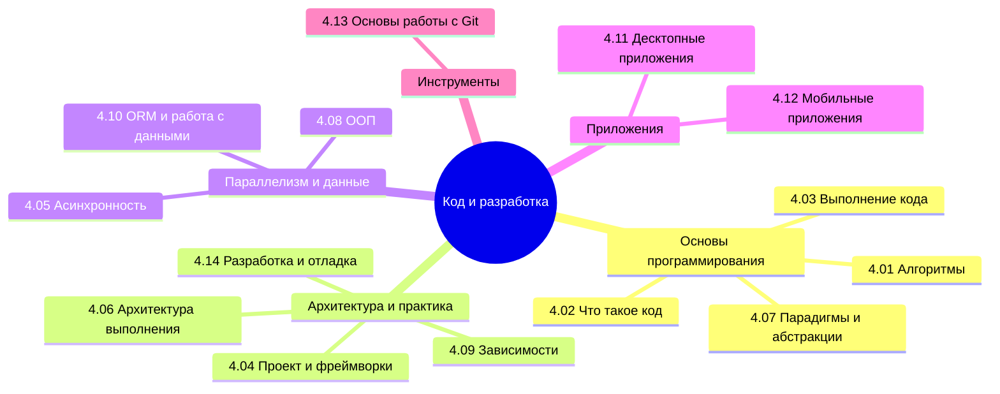

  ОБЯЗАТЕЛЬНО
  ДЛЯ НОВИЧКОВ

---

## О разделе

Готовьтесь к обучению магии программирования. Что такое программа - уже ясно. Но что такое код, как он работает, как его пишут? И только ли в коде вся сложность?

Вообще, лучше воспользуйтесь содержанием или перейдите к Базе знаний. Но для удобства, я размещу здесь ссылки на основные главы раздела:

---

## Алгоритмы

- [4.01. Алгоритмы](/encyclopedia/Код%20и%20разработка/4.01.%20Алгоритмы/1)
- [4.01. Основные алгоритмы сортировки и поиска](/encyclopedia/Код%20и%20разработка/4.01.%20Алгоритмы/2)
- [4.01. Алгоритмическая сложность и анализ эффективности программ](/encyclopedia/Код%20и%20разработка/4.01.%20Алгоритмы/3)
- [4.01. Нотация Большое O](/encyclopedia/Код%20и%20разработка/4.01.%20Алгоритмы/311)
- [4.01. Классы времени выполнения и скорость работы программ](/encyclopedia/Код%20и%20разработка/4.01.%20Алгоритмы/312)
- [4.01. Линейное, квадратичное и логарифмическое время выполнения](/encyclopedia/Код%20и%20разработка/4.01.%20Алгоритмы/313)
- [4.01. Итоги](/encyclopedia/Код%20и%20разработка/4.01.%20Алгоритмы/998)
- [4.01. Чек-лист самопроверки](/encyclopedia/Код%20и%20разработка/4.01.%20Алгоритмы/999)

---

## Что такое код и как он работает

- [4.02. Что такое код и как он работает](/encyclopedia/Код%20и%20разработка/4.02.%20Что%20такое%20код%20и%20как%20он%20работает/1)
- [4.02. Теория кодирования](/encyclopedia/Код%20и%20разработка/4.02.%20Что%20такое%20код%20и%20как%20он%20работает/2)
- [4.02. Ключевые слова](/encyclopedia/Код%20и%20разработка/4.02.%20Что%20такое%20код%20и%20как%20он%20работает/3)
- [4.02. Операторы](/encyclopedia/Код%20и%20разработка/4.02.%20Что%20такое%20код%20и%20как%20он%20работает/33)
- [4.02. Функции](/encyclopedia/Код%20и%20разработка/4.02.%20Что%20такое%20код%20и%20как%20он%20работает/4)
- [4.02. Null](/encyclopedia/Код%20и%20разработка/4.02.%20Что%20такое%20код%20и%20как%20он%20работает/44)
- [4.02. Циклы](/encyclopedia/Код%20и%20разработка/4.02.%20Что%20такое%20код%20и%20как%20он%20работает/5)
- [4.02. Уровень языка и виды кода](/encyclopedia/Код%20и%20разработка/4.02.%20Что%20такое%20код%20и%20как%20он%20работает/55)
- [4.02. Синтаксический сахар](/encyclopedia/Код%20и%20разработка/4.02.%20Что%20такое%20код%20и%20как%20он%20работает/56)
- [4.02. Стили кода](/encyclopedia/Код%20и%20разработка/4.02.%20Что%20такое%20код%20и%20как%20он%20работает/6)
- [4.02. Приёмы написания кода](/encyclopedia/Код%20и%20разработка/4.02.%20Что%20такое%20код%20и%20как%20он%20работает/611)
- [4.02. Рефакторинг и его приёмы](/encyclopedia/Код%20и%20разработка/4.02.%20Что%20такое%20код%20и%20как%20он%20работает/612)
- [4.02. Виды задач в кодировании](/encyclopedia/Код%20и%20разработка/4.02.%20Что%20такое%20код%20и%20как%20он%20работает/613)
- [4.02. Итоги](/encyclopedia/Код%20и%20разработка/4.02.%20Что%20такое%20код%20и%20как%20он%20работает/998)
- [4.02. Чек-лист самопроверки](/encyclopedia/Код%20и%20разработка/4.02.%20Что%20такое%20код%20и%20как%20он%20работает/999)

---

## Выполнение кода

- [4.03. Выполнение кода](/encyclopedia/Код%20и%20разработка/4.03.%20Выполнение%20кода/1)
- [4.03. Неопределенное поведение](/encyclopedia/Код%20и%20разработка/4.03.%20Выполнение%20кода/111)
- [4.03. Как работают функции](/encyclopedia/Код%20и%20разработка/4.03.%20Выполнение%20кода/112)
- [4.03. Как работают циклы](/encyclopedia/Код%20и%20разработка/4.03.%20Выполнение%20кода/113)
- [4.03. Как работают условные операторы](/encyclopedia/Код%20и%20разработка/4.03.%20Выполнение%20кода/114)
- [4.03. Как работают переменные](/encyclopedia/Код%20и%20разработка/4.03.%20Выполнение%20кода/115)
- [4.03. Как выполняется код](/encyclopedia/Код%20и%20разработка/4.03.%20Выполнение%20кода/2)
- [4.03. 0x и шестнадцатеричные числа](/encyclopedia/Код%20и%20разработка/4.03.%20Выполнение%20кода/211)
- [4.03. Сложное железо](/encyclopedia/Код%20и%20разработка/4.03.%20Выполнение%20кода/3)
- [4.03. Регистры](/encyclopedia/Код%20и%20разработка/4.03.%20Выполнение%20кода/311)
- [4.03. Машинное слово](/encyclopedia/Код%20и%20разработка/4.03.%20Выполнение%20кода/312)
- [4.03. Расположение данных в памяти и директивы компилятора](/encyclopedia/Код%20и%20разработка/4.03.%20Выполнение%20кода/313)
- [4.03. Как исполняется байт-код](/encyclopedia/Код%20и%20разработка/4.03.%20Выполнение%20кода/314)
- [4.03. Дизассемблирование и декомпиляция](/encyclopedia/Код%20и%20разработка/4.03.%20Выполнение%20кода/315)
- [4.03. Итоги](/encyclopedia/Код%20и%20разработка/4.03.%20Выполнение%20кода/98)
- [4.03. Чек-лист самопроверки](/encyclopedia/Код%20и%20разработка/4.03.%20Выполнение%20кода/99)

---

## Проект и фреймворки

- [4.04. Проект](/encyclopedia/Код%20и%20разработка/4.04.%20Проект%20и%20фреймворки/1)
- [4.04. IDE](/encyclopedia/Код%20и%20разработка/4.04.%20Проект%20и%20фреймворки/10)
- [4.04. Библиотека](/encyclopedia/Код%20и%20разработка/4.04.%20Проект%20и%20фреймворки/101)
- [4.04. Сборка, публикация, компиляторы и интерпретаторы](/encyclopedia/Код%20и%20разработка/4.04.%20Проект%20и%20фреймворки/102)
- [4.04. Фреймворк](/encyclopedia/Код%20и%20разработка/4.04.%20Проект%20и%20фреймворки/11)
- [4.04. Микрофреймворк](/encyclopedia/Код%20и%20разработка/4.04.%20Проект%20и%20фреймворки/111)
- [4.04. Модульность и компонентность](/encyclopedia/Код%20и%20разработка/4.04.%20Проект%20и%20фреймворки/112)
- [4.04. Работа с размером приложений](/encyclopedia/Код%20и%20разработка/4.04.%20Проект%20и%20фреймворки/113)
- [4.04. Итоги](/encyclopedia/Код%20и%20разработка/4.04.%20Проект%20и%20фреймворки/998)
- [4.04. Чек-лист самопроверки](/encyclopedia/Код%20и%20разработка/4.04.%20Проект%20и%20фреймворки/999)

---

## Асинхронность

- [4.05. Процессы и потоки](/encyclopedia/Код%20и%20разработка/4.05.%20Асинхронность/1)
- [4.05. Управление потоками](/encyclopedia/Код%20и%20разработка/4.05.%20Асинхронность/11)
- [4.05. Асинхронность и синхронность](/encyclopedia/Код%20и%20разработка/4.05.%20Асинхронность/12)
- [4.05. Обмен данными](/encyclopedia/Код%20и%20разработка/4.05.%20Асинхронность/13)
- [4.05. Итоги](/encyclopedia/Код%20и%20разработка/4.05.%20Асинхронность/998)
- [4.05. Чек-лист самопроверки](/encyclopedia/Код%20и%20разработка/4.05.%20Асинхронность/999)

---

## Архитектура выполнения

- [4.06. Архитектура выполнения](/encyclopedia/Код%20и%20разработка/4.06.%20Архитектура%20выполнения/1)
- [4.06. Битовые операции и представление данных в памяти](/encyclopedia/Код%20и%20разработка/4.06.%20Архитектура%20выполнения/111)
- [4.06. Итоги](/encyclopedia/Код%20и%20разработка/4.06.%20Архитектура%20выполнения/112)
- [4.06. Чек-лист самопроверки](/encyclopedia/Код%20и%20разработка/4.06.%20Архитектура%20выполнения/113)

---

## Парадигмы и уровни абстракции

- [4.07. Парадигмы](/encyclopedia/Код%20и%20разработка/4.07.%20Парадигмы%20и%20уровни%20абстракции/1)
- [4.07. Уровни абстракции](/encyclopedia/Код%20и%20разработка/4.07.%20Парадигмы%20и%20уровни%20абстракции/111)
- [4.07. Метапрограммирование](/encyclopedia/Код%20и%20разработка/4.07.%20Парадигмы%20и%20уровни%20абстракции/112)
- [4.07. Основы SOLID](/encyclopedia/Код%20и%20разработка/4.07.%20Парадигмы%20и%20уровни%20абстракции/113)
- [4.07. Итоги](/encyclopedia/Код%20и%20разработка/4.07.%20Парадигмы%20и%20уровни%20абстракции/998)
- [4.07. Чек-лист самопроверки](/encyclopedia/Код%20и%20разработка/4.07.%20Парадигмы%20и%20уровни%20абстракции/999)

---

## ООП

- [4.08. ООП](/encyclopedia/Код%20и%20разработка/4.08.%20ООП/1)
- [4.08. Абстракция](/encyclopedia/Код%20и%20разработка/4.08.%20ООП/2)
- [4.08. Инкапсуляция](/encyclopedia/Код%20и%20разработка/4.08.%20ООП/3)
- [4.08. Наследование](/encyclopedia/Код%20и%20разработка/4.08.%20ООП/4)
- [4.08. Полиморфизм](/encyclopedia/Код%20и%20разработка/4.08.%20ООП/5)
- [4.08. Некоторые инструменты](/encyclopedia/Код%20и%20разработка/4.08.%20ООП/6)
- [4.08. Итоги](/encyclopedia/Код%20и%20разработка/4.08.%20ООП/98)
- [4.08. Чек-лист самопроверки](/encyclopedia/Код%20и%20разработка/4.08.%20ООП/99)

---

## Зависимости

- [4.09. Зависимости](/encyclopedia/Код%20и%20разработка/4.09.%20Зависимости/1)
- [4.09. Dependency Inversion](/encyclopedia/Код%20и%20разработка/4.09.%20Зависимости/11)
- [4.09. Dependency Injection](/encyclopedia/Код%20и%20разработка/4.09.%20Зависимости/12)
- [4.09. Итоги](/encyclopedia/Код%20и%20разработка/4.09.%20Зависимости/998)
- [4.09. Чек-лист самопроверки](/encyclopedia/Код%20и%20разработка/4.09.%20Зависимости/999)

---

## ORM и работа с данными

- [4.10. Базы данных](/encyclopedia/Код%20и%20разработка/4.10.%20ORM%20и%20работа%20с%20данными/1)
- [4.10. Взаимодействие программ с БД](/encyclopedia/Код%20и%20разработка/4.10.%20ORM%20и%20работа%20с%20данными/111)
- [4.10. ORM](/encyclopedia/Код%20и%20разработка/4.10.%20ORM%20и%20работа%20с%20данными/112)
- [4.10. Основные принципы ORM](/encyclopedia/Код%20и%20разработка/4.10.%20ORM%20и%20работа%20с%20данными/113)
- [4.10. Подходы к ORM](/encyclopedia/Код%20и%20разработка/4.10.%20ORM%20и%20работа%20с%20данными/114)
- [4.10. Миграции](/encyclopedia/Код%20и%20разработка/4.10.%20ORM%20и%20работа%20с%20данными/115)
- [4.10. Нормализация и денормализация](/encyclopedia/Код%20и%20разработка/4.10.%20ORM%20и%20работа%20с%20данными/116)
- [4.10. Проблемы ORM](/encyclopedia/Код%20и%20разработка/4.10.%20ORM%20и%20работа%20с%20данными/117)
- [4.10. Итоги](/encyclopedia/Код%20и%20разработка/4.10.%20ORM%20и%20работа%20с%20данными/998)
- [4.10. Чек-лист самопроверки](/encyclopedia/Код%20и%20разработка/4.10.%20ORM%20и%20работа%20с%20данными/999)

---

## Десктопные приложения

- [4.11. Как устроены десктопные приложения](/encyclopedia/Код%20и%20разработка/4.11.%20Десктопные%20приложения/1)
- [4.11. Десктопные приложения](/encyclopedia/Код%20и%20разработка/4.11.%20Десктопные%20приложения/111)
- [4.11. Особенности разработки десктопных приложений](/encyclopedia/Код%20и%20разработка/4.11.%20Десктопные%20приложения/112)
- [4.11. Работа с графами в коде](/encyclopedia/Код%20и%20разработка/4.11.%20Десктопные%20приложения/113)
- [4.11. Итоги](/encyclopedia/Код%20и%20разработка/4.11.%20Десктопные%20приложения/998)
- [4.11. Чек-лист самопроверки](/encyclopedia/Код%20и%20разработка/4.11.%20Десктопные%20приложения/999)

---

## Мобильные приложения

- [4.12. Мобильные приложения](/encyclopedia/Код%20и%20разработка/4.12.%20Мобильные%20приложения/1)
- [4.12. Элементы UI на Android](/encyclopedia/Код%20и%20разработка/4.12.%20Мобильные%20приложения/111)
- [4.12. Сборка приложений на мобильные устройства](/encyclopedia/Код%20и%20разработка/4.12.%20Мобильные%20приложения/112)
- [4.12. Супераппы](/encyclopedia/Код%20и%20разработка/4.12.%20Мобильные%20приложения/113)
- [4.12. Итоги](/encyclopedia/Код%20и%20разработка/4.12.%20Мобильные%20приложения/2)
- [4.12. Чек-лист самопроверки](/encyclopedia/Код%20и%20разработка/4.12.%20Мобильные%20приложения/3)

---

## Основы работы с Git

- [4.13. Основы работы с Git](/encyclopedia/Код%20и%20разработка/4.13.%20Основы%20работы%20с%20Git/1)
- [4.13. Установка Git](/encyclopedia/Код%20и%20разработка/4.13.%20Основы%20работы%20с%20Git/111)
- [4.13. Как работать с Git?](/encyclopedia/Код%20и%20разработка/4.13.%20Основы%20работы%20с%20Git/112)
- [4.13. Ветки и слияния](/encyclopedia/Код%20и%20разработка/4.13.%20Основы%20работы%20с%20Git/113)
- [4.13. Основные рекомендации](/encyclopedia/Код%20и%20разработка/4.13.%20Основы%20работы%20с%20Git/114)
- [4.13. Итоги](/encyclopedia/Код%20и%20разработка/4.13.%20Основы%20работы%20с%20Git/2)
- [4.13. Чек-лист самопроверки](/encyclopedia/Код%20и%20разработка/4.13.%20Основы%20работы%20с%20Git/3)
- [4.13. Справочник-шпаргалка по Git](/encyclopedia/Код%20и%20разработка/4.13.%20Основы%20работы%20с%20Git/4)

---

## Разработка и отладка

- [4.14. Разработка](/encyclopedia/Код%20и%20разработка/4.14.%20Разработка%20и%20отладка/1)
- [4.14. Традиции и обычаи разработки](/encyclopedia/Код%20и%20разработка/4.14.%20Разработка%20и%20отладка/11)
- [4.14. Отладка](/encyclopedia/Код%20и%20разработка/4.14.%20Разработка%20и%20отладка/111)
- [4.14. Анализ и оптимизация производительности](/encyclopedia/Код%20и%20разработка/4.14.%20Разработка%20и%20отладка/112)
- [4.14. Как создать свою библиотеку](/encyclopedia/Код%20и%20разработка/4.14.%20Разработка%20и%20отладка/113)
- [4.14. Пет-проект](/encyclopedia/Код%20и%20разработка/4.14.%20Разработка%20и%20отладка/114)
- [4.14. Список для развития](/encyclopedia/Код%20и%20разработка/4.14.%20Разработка%20и%20отладка/115)
- [4.14. Структура кодовой базы](/encyclopedia/Код%20и%20разработка/4.14.%20Разработка%20и%20отладка/116)
- [4.14. Расширения для браузера](/encyclopedia/Код%20и%20разработка/4.14.%20Разработка%20и%20отладка/119)
- [4.14. Итоги](/encyclopedia/Код%20и%20разработка/4.14.%20Разработка%20и%20отладка/2)
- [4.14. Чек-лист самопроверки](/encyclopedia/Код%20и%20разработка/4.14.%20Разработка%20и%20отладка/3)

---

## Сборка мусора

- [4.15. Сборка мусора](/encyclopedia/Код%20и%20разработка/4.15.%20Сборка%20мусора/1)
- [4.15. Итоги](/encyclopedia/Код%20и%20разработка/4.15.%20Сборка%20мусора/2)
- [4.15. Чек-лист самопроверки](/encyclopedia/Код%20и%20разработка/4.15.%20Сборка%20мусора/3)

Программирование охватывает не только команды и код (собственно, поэтому я не особо люблю термин "программист" и больше склоняюсь к термину "разработчик"). Сама по себе разработка — это искусство создания новых решений из простых абстрактных идей. Мы уже прошли важный этап подготовки и у нас есть фундамент, который позволит уверенно двигаться дальше.

Программирование требует практики. Мы будем заниматься практикой умеренно. Как я заметил, практического материала в сети и литературе очень много, так как каждый автор считает, что нужно просто практиковаться.

Знаете почему говорят практика, практика, практика? Потому что проблемы и сложности возникают не из-за кодирования, а из-за различных инструментов, отладки, поиска проблем, поиска решений, изучения возможных методов в библиотеках, анализ производительности и исправления ошибок - вот в чём вся сложность, которая познается на практике — это и есть 90% времени работы программиста. Написать легко, да и запустить легко, а вот сделать четко, быстро и без ошибок - уже искусство. А потом тестировщики находят ошибку и всё по новой. Самое страшное, когда у тебя рабочее решение, но заказчик или руководитель захотел что-то подправить, и именно это "поправить" потом сжирает многие часы страданий.
Но как можно научиться читать код, к примеру, на Java, не разобравшись в базовых основах ООП? Это главное упущение, с которым я столкнулся. Мы попробуем значительную часть провести за "разжёвыванием" фундамента, чтобы потом было легко, и будем отталкиваться в первую очередь от алгоритмического языка.

На практике всё будет сложно, и даже очень. Первая задача определённого типа заставит застрять с вопросом "Как это реализовать?" и здесь кому-то повезёт и рядом окажется хороший наставник, который покажет и объяснит, а кому-то придётся разбираться самому. Сложнейшим этапом будет поиск способа решения вопроса - искать в интернете, советоваться с коллегами, изучать документацию. ИИ, кстати, здесь не поможет - ведь он попытается решить проблему, а не научить вас работать с такими задачами. Поэтому сначала надо справиться с такой задачей, и когда вам дадут новую задачу похожего типа - уже будет проще, ведь вы уже реализовывали такое и знаете как делать! Причем не важно, запомнили ли вы в голове или записали себе где-то алгоритм решения, но факт - вы уже знаете, что делать и у вас не возникает того самого "застревания".

Таков цикл обучения:

Испугался - Нашел решение - Научился - Научил других.

Шаг "испуга" крайне стрессовый, который будет нагонять мысли вроде "это не моё", "я не смогу", "у меня не получится". Главное преодолеть, а потом будет проще. Причём, следующей проблемой, с которой столкнётся разработчик — это внимательность. Забыл тут дописать, пропустил ошибку там, не исправил здесь - всё это и правится опытом, который помогает набирать хороший наставник. Поэтому настоятельно рекомендую - не только изучайте книгу, но и найдите себе наставника, если есть такая возможность. Попросите выделить время и объяснить вещи, которые "ну никак не лезут в голову".

Разбирайте код. Разбивайте то, что видите, на логические блоки, можете расписывать для себя аналог на алгоритмическом языке (Шаг 1 - объявляем переменную, Шаг 2 - присваиваем значение, Шаг 3 - вызываем метод и так далее). Но давайте пока не будем торопить события и начнём с самых фундаментальных знаний.

Печатайте чаще. Если раньше вы редко печатали, то потренируйтесь в наборе текста на английском языке. Идеальный вариант - если вы будете перепечатывать код, который находите в примерах в ходе обучения. Не копировать, а именно ручками, букву за буквой, символ за символом, и вчитываться, вникать в то, что печатаете. Это замечательная практика.

Повторяйте материал. Человеку свойственно забывать изученное, поэтому не стесняйтесь зубрить - учите, повторяйте, перечитывайте снова и снова. И старайтесь не бежать гуглить решение, а уделить 10-15 минут на то, чтобы сначала попытаться вспомнить.

Тренируйте вспомогательные навыки: алгоритмизация, системное, критическое, творческое мышление, прогнозирование, индукция (делать выводы), дедукция (применение правил), внимательность, концентрация, терпение, рефлексия.

К сожалению, как бы не говорили в различных книгах и курсах - одного обучения и практики вам будет мало, нужно конкретно учиться решать задачи и перед решением получить теоретическую базу. Цель данного тома - научиться разрабатывать, получить теоретическую базу - а в конце книги будут и задачи для разработки своих проектов.

Однако я постараюсь сфокусироваться там, где возникали вопросы у меня. Читатели, которые уже владеют знаниями в области программирования, тоже найдут для себя интересные детали, ведь, как правило, всё упирается в опыт и определённую технологию, а также то, что указывается в учебниках. Мы же постараемся охватить всё без лишней воды, кратко и детально всё в таком объеме, чтобы и разобраться в теории, и иметь под рукой практическое руководство.
---
