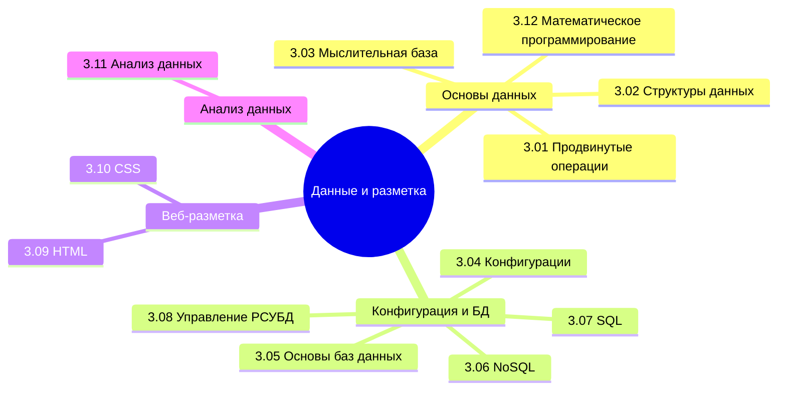

  ОБЯЗАТЕЛЬНО
  ДЛЯ НОВИЧКОВ

---

## О разделе

Вы ещё не забыли, что такое информация и данные? А типы данных? Если забыли, непременно вернитесь и повторите. Сейчас нам придётся заняться ими вплотную.

Вообще, лучше воспользуйтесь содержанием или перейдите к Базе знаний. Но для удобства, я размещу здесь ссылки на основные главы раздела:

---

## Продвинутые операции с данными

<ul class="it-toc-articles">
  <li><a href="/encyclopedia/3-data-markup/3-01-prodvinutye-operatsii-s-dannymi/1">3.01. Продвинутые операции с данными</a></li>
  <li><a href="/encyclopedia/3-data-markup/3-01-prodvinutye-operatsii-s-dannymi/111">3.01. Маршалинг и анмаршалинг - сериализация объектов</a></li>
  <li><a href="/encyclopedia/3-data-markup/3-01-prodvinutye-operatsii-s-dannymi/112">3.01. Адресация данных в памяти</a></li>
  <li><a href="/encyclopedia/3-data-markup/3-01-prodvinutye-operatsii-s-dannymi/113">3.01. Представление информации - биты, байты, машинные слова</a></li>
  <li><a href="/encyclopedia/3-data-markup/3-01-prodvinutye-operatsii-s-dannymi/998">3.01. Продвинутые операции с данными — итоги</a></li>
  <li><a href="/encyclopedia/3-data-markup/3-01-prodvinutye-operatsii-s-dannymi/999">3.01. Продвинутые операции с данными — чек-лист</a></li>
</ul>

---

## Структуры данных

<ul class="it-toc-articles">
  <li><a href="/encyclopedia/3-data-markup/3-02-struktury-dannyh/1">3.02. Структуры данных</a></li>
  <li><a href="/encyclopedia/3-data-markup/3-02-struktury-dannyh/2">3.02. Основные структуры данных и их реализация</a></li>
  <li><a href="/encyclopedia/3-data-markup/3-02-struktury-dannyh/3">3.02. Структуры данных — итоги</a></li>
  <li><a href="/encyclopedia/3-data-markup/3-02-struktury-dannyh/4">3.02. Структуры данных — чек-лист</a></li>
  <li><a href="/encyclopedia/3-data-markup/3-02-struktury-dannyh/11">3.02. История развития структур данных</a></li>
  <li><a href="/encyclopedia/3-data-markup/3-02-struktury-dannyh/12">3.02. Геометрические структуры данных</a></li>
</ul>

---

## Мыслительная база

<ul class="it-toc-articles">
  <li><a href="/encyclopedia/3-data-markup/3-03-myslitelnaya-baza/1">3.03. Когнитивистика - наука о мышлении</a></li>
  <li><a href="/encyclopedia/3-data-markup/3-03-myslitelnaya-baza/2">3.03. Ментальные модели</a></li>
  <li><a href="/encyclopedia/3-data-markup/3-03-myslitelnaya-baza/3">3.03. Математическая основа IT</a></li>
  <li><a href="/encyclopedia/3-data-markup/3-03-myslitelnaya-baza/4">3.03. Мыслительная база — итоги</a></li>
  <li><a href="/encyclopedia/3-data-markup/3-03-myslitelnaya-baza/5">3.03. Мыслительная база — чек-лист</a></li>
  <li><a href="/encyclopedia/3-data-markup/3-03-myslitelnaya-baza/21">3.03. Тектология</a></li>
  <li><a href="/encyclopedia/3-data-markup/3-03-myslitelnaya-baza/22">3.03. Системы и модели</a></li>
  <li><a href="/encyclopedia/3-data-markup/3-03-myslitelnaya-baza/31">3.03. Логика</a></li>
  <li><a href="/encyclopedia/3-data-markup/3-03-myslitelnaya-baza/32">3.03. Дискретная математика</a></li>
  <li><a href="/encyclopedia/3-data-markup/3-03-myslitelnaya-baza/33">3.03. Теория чисел, псевдокод и анализ алгоритмов</a></li>
  <li><a href="/encyclopedia/3-data-markup/3-03-myslitelnaya-baza/34">3.03. Линейная алгебра</a></li>
  <li><a href="/encyclopedia/3-data-markup/3-03-myslitelnaya-baza/35">3.03. Вероятность и статистика</a></li>
  <li><a href="/encyclopedia/3-data-markup/3-03-myslitelnaya-baza/36">3.03. Моделирование систем</a></li>
  <li><a href="/encyclopedia/3-data-markup/3-03-myslitelnaya-baza/37">3.03. Численные методы</a></li>
  <li><a href="/encyclopedia/3-data-markup/3-03-myslitelnaya-baza/38">3.03. Формальные языки и автоматы</a></li>
  <li><a href="/encyclopedia/3-data-markup/3-03-myslitelnaya-baza/39">3.03. Теория информации</a></li>
  <li><a href="/encyclopedia/3-data-markup/3-03-myslitelnaya-baza/40">3.03. Теория алгоритмов — формальные основы</a></li>
  <li><a href="/encyclopedia/3-data-markup/3-03-myslitelnaya-baza/41">3.03. Рекурсивные и вычислимые функции</a></li>
  <li><a href="/encyclopedia/3-data-markup/3-03-myslitelnaya-baza/42">3.03. Машина Тьюринга</a></li>
  <li><a href="/encyclopedia/3-data-markup/3-03-myslitelnaya-baza/43">3.03. Формальные грамматики и разбор</a></li>
  <li><a href="/encyclopedia/3-data-markup/3-03-myslitelnaya-baza/44">3.03. Конечные автоматы и регулярные языки</a></li>
  <li><a href="/encyclopedia/3-data-markup/3-03-myslitelnaya-baza/45">3.03. Магазинные автоматы, Мили и Мура</a></li>
  <li><a href="/encyclopedia/3-data-markup/3-03-myslitelnaya-baza/46">3.03. ТАФЯ — чек-лист самопроверки</a></li>
  <li><a href="/encyclopedia/3-data-markup/3-03-myslitelnaya-baza/314">3.03. Алгебра логики — нормальные формы и схемы</a></li>
  <li><a href="/encyclopedia/3-data-markup/3-03-myslitelnaya-baza/321">3.03. Множества и отношения — формальный слой</a></li>
  <li><a href="/encyclopedia/3-data-markup/3-03-myslitelnaya-baza/322">3.03. Реляционная алгебра и таблицы</a></li>
  <li><a href="/encyclopedia/3-data-markup/3-03-myslitelnaya-baza/323">3.03. Графы — маршруты, остовы и раскраски</a></li>
  <li><a href="/encyclopedia/3-data-markup/3-03-myslitelnaya-baza/324">3.03. Рекуррентные соотношения</a></li>
  <li><a href="/encyclopedia/3-data-markup/3-03-myslitelnaya-baza/325">3.03. Дискретная математика — чек-лист самопроверки</a></li>
  <li><a href="/encyclopedia/3-data-markup/3-03-myslitelnaya-baza/326">3.03. Семантика — смысл знаков и данных</a></li>
  <li><a href="/encyclopedia/3-data-markup/3-03-myslitelnaya-baza/327">3.03. Представление знаний</a></li>
  <li><a href="/encyclopedia/3-data-markup/3-03-myslitelnaya-baza/328">3.03. Онтология в информатике</a></li>
  <li><a href="/encyclopedia/3-data-markup/3-03-myslitelnaya-baza/329">3.03. Концептуальные схемы и информационные модели</a></li>
  <li><a href="/encyclopedia/3-data-markup/3-03-myslitelnaya-baza/330">3.03. Семантический веб и графы знаний</a></li>
  <li><a href="/encyclopedia/3-data-markup/3-03-myslitelnaya-baza/331">3.03. Словарь терминов</a></li>
  <li><a href="/encyclopedia/3-data-markup/3-03-myslitelnaya-baza/341">3.03. Виды математических наук</a></li>
  <li><a href="/encyclopedia/3-data-markup/3-03-myslitelnaya-baza/342">3.03. Векторы</a></li>
  <li><a href="/encyclopedia/3-data-markup/3-03-myslitelnaya-baza/343">3.03. Матрицы и операции</a></li>
</ul>

---

## Конфигурации и данные

<ul class="it-toc-articles">
  <li><a href="/encyclopedia/3-data-markup/3-04-konfiguratsii-i-dannye/1">3.04. Конфигурационные данные в текстовых форматах</a></li>
  <li><a href="/encyclopedia/3-data-markup/3-04-konfiguratsii-i-dannye/2">3.04. XML</a></li>
  <li><a href="/encyclopedia/3-data-markup/3-04-konfiguratsii-i-dannye/3">3.04. JSON</a></li>
  <li><a href="/encyclopedia/3-data-markup/3-04-konfiguratsii-i-dannye/4">3.04. YAML</a></li>
  <li><a href="/encyclopedia/3-data-markup/3-04-konfiguratsii-i-dannye/5">3.04. Markdown</a></li>
  <li><a href="/encyclopedia/3-data-markup/3-04-konfiguratsii-i-dannye/6">3.04. XAML</a></li>
  <li><a href="/encyclopedia/3-data-markup/3-04-konfiguratsii-i-dannye/98">3.04. Конфигурации и данные — итоги</a></li>
  <li><a href="/encyclopedia/3-data-markup/3-04-konfiguratsii-i-dannye/99">3.04. Конфигурации и данные — чек-лист</a></li>
  <li><a href="/encyclopedia/3-data-markup/3-04-konfiguratsii-i-dannye/111">3.04. Текстовые форматы представления данных</a></li>
  <li><a href="/encyclopedia/3-data-markup/3-04-konfiguratsii-i-dannye/112">3.04. Справочник по эмодзи</a></li>
  <li><a href="/encyclopedia/3-data-markup/3-04-konfiguratsii-i-dannye/113">3.04. Шрифты</a></li>
  <li><a href="/encyclopedia/3-data-markup/3-04-konfiguratsii-i-dannye/211">3.04. Справочник по XML</a></li>
  <li><a href="/encyclopedia/3-data-markup/3-04-konfiguratsii-i-dannye/212">3.04. Справочник по XSLT</a></li>
  <li><a href="/encyclopedia/3-data-markup/3-04-konfiguratsii-i-dannye/213">3.04. XPath</a></li>
  <li><a href="/encyclopedia/3-data-markup/3-04-konfiguratsii-i-dannye/214">3.04. XSLT</a></li>
  <li><a href="/encyclopedia/3-data-markup/3-04-konfiguratsii-i-dannye/215">3.04. XML DOM</a></li>
  <li><a href="/encyclopedia/3-data-markup/3-04-konfiguratsii-i-dannye/216">3.04. Бинарные форматы обмена данными</a></li>
  <li><a href="/encyclopedia/3-data-markup/3-04-konfiguratsii-i-dannye/217">3.04. JSONB</a></li>
  <li><a href="/encyclopedia/3-data-markup/3-04-konfiguratsii-i-dannye/218">3.04. TOML</a></li>
  <li><a href="/encyclopedia/3-data-markup/3-04-konfiguratsii-i-dannye/219">3.04. CSV</a></li>
  <li><a href="/encyclopedia/3-data-markup/3-04-konfiguratsii-i-dannye/220">3.04. JSON Schema, OpenAPI и Schema.org</a></li>
  <li><a href="/encyclopedia/3-data-markup/3-04-konfiguratsii-i-dannye/221">3.04. GraphQL</a></li>
  <li><a href="/encyclopedia/3-data-markup/3-04-konfiguratsii-i-dannye/222">3.04. Parquet и ORC</a></li>
</ul>

---

## Основы баз данных

<ul class="it-toc-articles">
  <li><a href="/encyclopedia/3-data-markup/3-05-osnovy-baz-dannyh/1">3.05. Знакомство с базами данных</a></li>
  <li><a href="/encyclopedia/3-data-markup/3-05-osnovy-baz-dannyh/2">3.05. Системы управления базами данных (СУБД)</a></li>
  <li><a href="/encyclopedia/3-data-markup/3-05-osnovy-baz-dannyh/3">3.05. Внутреннее устройство баз данных</a></li>
  <li><a href="/encyclopedia/3-data-markup/3-05-osnovy-baz-dannyh/4">3.05. Теоретические основы реляционных данных</a></li>
  <li><a href="/encyclopedia/3-data-markup/3-05-osnovy-baz-dannyh/5">3.05. Двенадцать правил Кодда</a></li>
  <li><a href="/encyclopedia/3-data-markup/3-05-osnovy-baz-dannyh/6">3.05. Роль базы данных в организации</a></li>
  <li><a href="/encyclopedia/3-data-markup/3-05-osnovy-baz-dannyh/7">3.05. Конкурентный доступ к данным</a></li>
  <li><a href="/encyclopedia/3-data-markup/3-05-osnovy-baz-dannyh/8">3.05. Восстановление после сбоя</a></li>
  <li><a href="/encyclopedia/3-data-markup/3-05-osnovy-baz-dannyh/11">3.05. Entity Relationship</a></li>
  <li><a href="/encyclopedia/3-data-markup/3-05-osnovy-baz-dannyh/12">3.05. Масштабирование БД — опорные темы</a></li>
  <li><a href="/encyclopedia/3-data-markup/3-05-osnovy-baz-dannyh/98">3.05. Основы баз данных — итоги</a></li>
  <li><a href="/encyclopedia/3-data-markup/3-05-osnovy-baz-dannyh/99">3.05. Основы баз данных — чек-лист</a></li>
  <li><a href="/encyclopedia/3-data-markup/3-05-osnovy-baz-dannyh/111">3.05. Управление данными - Data Governance</a></li>
</ul>

---

## NoSQL

<ul class="it-toc-articles">
  <li><a href="/encyclopedia/3-data-markup/3-06-nosql/1">3.06. История развития NoSQL-систем</a></li>
  <li><a href="/encyclopedia/3-data-markup/3-06-nosql/2">3.06. Основы NoSQL</a></li>
  <li><a href="/encyclopedia/3-data-markup/3-06-nosql/3">3.06. Синтаксис и знаки препинания в NoSQL-запросах</a></li>
  <li><a href="/encyclopedia/3-data-markup/3-06-nosql/4">3.06. MongoDB - документоориентированная база данных</a></li>
  <li><a href="/encyclopedia/3-data-markup/3-06-nosql/5">3.06. Redis - хранилище ключ-значение в памяти</a></li>
  <li><a href="/encyclopedia/3-data-markup/3-06-nosql/6">3.06. Cassandra</a></li>
  <li><a href="/encyclopedia/3-data-markup/3-06-nosql/7">3.06. Графовые базы данных</a></li>
  <li><a href="/encyclopedia/3-data-markup/3-06-nosql/8">3.06. Memcached - кэширование в оперативной памяти</a></li>
  <li><a href="/encyclopedia/3-data-markup/3-06-nosql/41">3.06. Справочник по MongoDB</a></li>
  <li><a href="/encyclopedia/3-data-markup/3-06-nosql/51">3.06. Справочник по Redis</a></li>
  <li><a href="/encyclopedia/3-data-markup/3-06-nosql/61">3.06. Справочник по Cassandra</a></li>
  <li><a href="/encyclopedia/3-data-markup/3-06-nosql/71">3.06. Справочник по Cypher</a></li>
  <li><a href="/encyclopedia/3-data-markup/3-06-nosql/81">3.06. Справочник по Memcached</a></li>
  <li><a href="/encyclopedia/3-data-markup/3-06-nosql/98">3.06. NoSQL — итоги</a></li>
  <li><a href="/encyclopedia/3-data-markup/3-06-nosql/99">3.06. NoSQL — чек-лист</a></li>
  <li><a href="/encyclopedia/3-data-markup/3-06-nosql/411">3.06. Первые шаги с MongoDB</a></li>
  <li><a href="/encyclopedia/3-data-markup/3-06-nosql/412">3.06. MongoDB — проектирование документной схемы</a></li>
  <li><a href="/encyclopedia/3-data-markup/3-06-nosql/511">3.06. Первые шаги с Redis</a></li>
  <li><a href="/encyclopedia/3-data-markup/3-06-nosql/611">3.06. Первые шаги с Cassandra</a></li>
  <li><a href="/encyclopedia/3-data-markup/3-06-nosql/811">3.06. NewSQL - гибридные системы нового поколения</a></li>
  <li><a href="/encyclopedia/3-data-markup/3-06-nosql/812">3.06. Векторные базы данных</a></li>
  <li><a href="/encyclopedia/3-data-markup/3-06-nosql/8111">3.06. Первые шаги с Memcached</a></li>
</ul>

---

## SQL

<ul class="it-toc-articles">
  <li><a href="/encyclopedia/3-data-markup/3-07-sql/1">3.07. SQL - язык структурированных запросов</a></li>
  <li><a href="/encyclopedia/3-data-markup/3-07-sql/2">3.07. Принципы работы SQL-движка</a></li>
  <li><a href="/encyclopedia/3-data-markup/3-07-sql/3">3.07. Синтаксис и пунктуация в SQL</a></li>
  <li><a href="/encyclopedia/3-data-markup/3-07-sql/4">3.07. Взаимодействие приложений с СУБД через SQL</a></li>
  <li><a href="/encyclopedia/3-data-markup/3-07-sql/5">3.07. CRUD-операции и язык манипуляции данными (DML)</a></li>
  <li><a href="/encyclopedia/3-data-markup/3-07-sql/6">3.07. Фильтрация и группировка в SQL</a></li>
  <li><a href="/encyclopedia/3-data-markup/3-07-sql/7">3.07. Встроенные и пользовательские функции в SQL</a></li>
  <li><a href="/encyclopedia/3-data-markup/3-07-sql/8">3.07. Представления (VIEW) - виртуальные таблицы</a></li>
  <li><a href="/encyclopedia/3-data-markup/3-07-sql/21">3.07. Чтение и анализ сложных SQL-запросов</a></li>
  <li><a href="/encyclopedia/3-data-markup/3-07-sql/22">3.07. Категории SQL-команд - DDL, DML, DCL, TCL</a></li>
  <li><a href="/encyclopedia/3-data-markup/3-07-sql/33">3.07. Типы данных в SQL</a></li>
  <li><a href="/encyclopedia/3-data-markup/3-07-sql/44">3.07. DDL - определение структуры базы данных</a></li>
  <li><a href="/encyclopedia/3-data-markup/3-07-sql/55">3.07. Алиасы, JOIN и объединение таблиц</a></li>
  <li><a href="/encyclopedia/3-data-markup/3-07-sql/66">3.07. Практикум PostgreSQL по JSONB</a></li>
  <li><a href="/encyclopedia/3-data-markup/3-07-sql/77">3.07. Транзакции, изоляция и блокировки</a></li>
  <li><a href="/encyclopedia/3-data-markup/3-07-sql/88">3.07. Хранимые процедуры и триггеры</a></li>
  <li><a href="/encyclopedia/3-data-markup/3-07-sql/101">3.07. Первые шаги с SQL</a></li>
  <li><a href="/encyclopedia/3-data-markup/3-07-sql/102">3.07. Эволюция систем хранения данных</a></li>
  <li><a href="/encyclopedia/3-data-markup/3-07-sql/103">3.07. Реляционная модель данных</a></li>
  <li><a href="/encyclopedia/3-data-markup/3-07-sql/104">3.07. Нормализация данных</a></li>
  <li><a href="/encyclopedia/3-data-markup/3-07-sql/105">3.07. Словарь данных и системные каталоги</a></li>
  <li><a href="/encyclopedia/3-data-markup/3-07-sql/106">3.07. Резервное копирование и восстановление PostgreSQL</a></li>
  <li><a href="/encyclopedia/3-data-markup/3-07-sql/107">3.07. Оператор SELECT — синтаксис и стиль</a></li>
  <li><a href="/encyclopedia/3-data-markup/3-07-sql/108">3.07. Подзапросы, EXISTS и IN</a></li>
  <li><a href="/encyclopedia/3-data-markup/3-07-sql/109">3.07. Фильтрация и трёхзначная логика</a></li>
  <li><a href="/encyclopedia/3-data-markup/3-07-sql/110">3.07. Блокировки и конкурентный доступ в PostgreSQL</a></li>
  <li><a href="/encyclopedia/3-data-markup/3-07-sql/111">3.07. Практикум shop_data</a></li>
  <li><a href="/encyclopedia/3-data-markup/3-07-sql/444">3.07. Ограничения целостности в SQL</a></li>
  <li><a href="/encyclopedia/3-data-markup/3-07-sql/551">3.07. Общие табличные выражения (CTE)</a></li>
  <li><a href="/encyclopedia/3-data-markup/3-07-sql/881">3.07. Оптимизация SQL-запросов</a></li>
  <li><a href="/encyclopedia/3-data-markup/3-07-sql/882">3.07. Процедурные расширения - PL/pgSQL, T-SQL</a></li>
  <li><a href="/encyclopedia/3-data-markup/3-07-sql/883">3.07. Справочник по SQL</a></li>
  <li><a href="/encyclopedia/3-data-markup/3-07-sql/884">3.07. Сложные индексы</a></li>
  <li><a href="/encyclopedia/3-data-markup/3-07-sql/885">3.07. Шпаргалка с типичными задачами по SQL</a></li>
  <li><a href="/encyclopedia/3-data-markup/3-07-sql/886">3.07. Иерархические данные в реляционных БД</a></li>
  <li><a href="/encyclopedia/3-data-markup/3-07-sql/887">3.07. SQLite — практическая работа и API</a></li>
  <li><a href="/encyclopedia/3-data-markup/3-07-sql/888">3.07. PostgreSQL — практическая работа и API</a></li>
  <li><a href="/encyclopedia/3-data-markup/3-07-sql/889">3.07. MySQL — практическая работа и API</a></li>
  <li><a href="/encyclopedia/3-data-markup/3-07-sql/890">3.07. Microsoft SQL Server — практическая работа и API</a></li>
  <li><a href="/encyclopedia/3-data-markup/3-07-sql/891">3.07. Практикум demo — авиакомпания PostgreSQL</a></li>
  <li><a href="/encyclopedia/3-data-markup/3-07-sql/892">3.07. Шпаргалка SQL — четыре СУБД на одной схеме</a></li>
  <li><a href="/encyclopedia/3-data-markup/3-07-sql/998">3.07. SQL — итоги</a></li>
  <li><a href="/encyclopedia/3-data-markup/3-07-sql/999">3.07. SQL — чек-лист</a></li>
  <li><a href="/encyclopedia/3-data-markup/3-07-sql/8821">3.07. Подсказки оптимизатору (query hints)</a></li>
</ul>

---

## Управление реляционными СУБД

<ul class="it-toc-articles">
  <li><a href="/encyclopedia/3-data-markup/3-08-upravlenie-rsubd/1">3.08. Управление реляционными СУБД</a></li>
  <li><a href="/encyclopedia/3-data-markup/3-08-upravlenie-rsubd/2">3.08. Справочник по PostgreSQL</a></li>
  <li><a href="/encyclopedia/3-data-markup/3-08-upravlenie-rsubd/3">3.08. Администрирование БД в облаке</a></li>
  <li><a href="/encyclopedia/3-data-markup/3-08-upravlenie-rsubd/211">3.08. Справочник по MySQL</a></li>
  <li><a href="/encyclopedia/3-data-markup/3-08-upravlenie-rsubd/212">3.08. Справочник по Microsoft SQL Server</a></li>
  <li><a href="/encyclopedia/3-data-markup/3-08-upravlenie-rsubd/213">3.08. Справочник по Oracle DB</a></li>
  <li><a href="/encyclopedia/3-data-markup/3-08-upravlenie-rsubd/998">3.08. Управление реляционными СУБД — итоги</a></li>
  <li><a href="/encyclopedia/3-data-markup/3-08-upravlenie-rsubd/999">3.08. Управление реляционными СУБД — чек-лист</a></li>
</ul>

---

## HTML

<ul class="it-toc-articles">
  <li><a href="/encyclopedia/3-data-markup/3-09-html/1">3.09. HTML</a></li>
  <li><a href="/encyclopedia/3-data-markup/3-09-html/2">3.09. Основные HTML-теги и их назначение</a></li>
  <li><a href="/encyclopedia/3-data-markup/3-09-html/3">3.09. Практическое задание на HTML</a></li>
  <li><a href="/encyclopedia/3-data-markup/3-09-html/21">3.09. Справочник по HTML</a></li>
  <li><a href="/encyclopedia/3-data-markup/3-09-html/22">3.09. Веб-игры на HTML5 и Canvas</a></li>
  <li><a href="/encyclopedia/3-data-markup/3-09-html/23">3.09. Шаблоны разметки, output и datalist</a></li>
  <li><a href="/encyclopedia/3-data-markup/3-09-html/24">3.09. Управление audio и video из JavaScript</a></li>
  <li><a href="/encyclopedia/3-data-markup/3-09-html/25">3.09. Web Components</a></li>
  <li><a href="/encyclopedia/3-data-markup/3-09-html/998">3.09. HTML — итоги</a></li>
  <li><a href="/encyclopedia/3-data-markup/3-09-html/999">3.09. HTML — чек-лист</a></li>
</ul>

---

## CSS

<ul class="it-toc-articles">
  <li><a href="/encyclopedia/3-data-markup/3-10-css/1">3.10. CSS</a></li>
  <li><a href="/encyclopedia/3-data-markup/3-10-css/2">3.10. Flexbox и CSS Grid</a></li>
  <li><a href="/encyclopedia/3-data-markup/3-10-css/3">3.10. Основные стили в CSS</a></li>
  <li><a href="/encyclopedia/3-data-markup/3-10-css/4">3.10. Синтаксис и пунктуация в CSS</a></li>
  <li><a href="/encyclopedia/3-data-markup/3-10-css/5">3.10. Псевдоклассы и псевдоэлементы</a></li>
  <li><a href="/encyclopedia/3-data-markup/3-10-css/6">3.10. Анимации, переходы и трансформации</a></li>
  <li><a href="/encyclopedia/3-data-markup/3-10-css/7">3.10. Адаптивный и отзывчивый дизайн</a></li>
  <li><a href="/encyclopedia/3-data-markup/3-10-css/8">3.10. CSS — практика</a></li>
  <li><a href="/encyclopedia/3-data-markup/3-10-css/71">3.10. Справочник по CSS</a></li>
  <li><a href="/encyclopedia/3-data-markup/3-10-css/111">3.10. Подключение и организация CSS-кода</a></li>
  <li><a href="/encyclopedia/3-data-markup/3-10-css/112">3.10. Блочная модель и механизм каскадирования</a></li>
  <li><a href="/encyclopedia/3-data-markup/3-10-css/113">3.10. Типовые элементы интерфейса</a></li>
  <li><a href="/encyclopedia/3-data-markup/3-10-css/114">3.10. Селекторы :is, :where и :has</a></li>
  <li><a href="/encyclopedia/3-data-markup/3-10-css/115">3.10. Каскадные слои @layer</a></li>
  <li><a href="/encyclopedia/3-data-markup/3-10-css/116">3.10. Логические свойства CSS и subgrid</a></li>
  <li><a href="/encyclopedia/3-data-markup/3-10-css/117">3.10. Доступность и пользовательские настройки в CSS</a></li>
  <li><a href="/encyclopedia/3-data-markup/3-10-css/118">3.10. Практические рекомендации по CSS</a></li>
  <li><a href="/encyclopedia/3-data-markup/3-10-css/119">3.10. Функции в CSS</a></li>
  <li><a href="/encyclopedia/3-data-markup/3-10-css/120">3.10. Tailwind CSS</a></li>
  <li><a href="/encyclopedia/3-data-markup/3-10-css/711">3.10. Инъекция стилей</a></li>
  <li><a href="/encyclopedia/3-data-markup/3-10-css/998">3.10. CSS — итоги</a></li>
  <li><a href="/encyclopedia/3-data-markup/3-10-css/999">3.10. CSS — чек-лист</a></li>
  <li><a href="/encyclopedia/3-data-markup/3-10-css/1111">3.10. Переменные в CSS</a></li>
</ul>

---

## Анализ данных

<ul class="it-toc-articles">
  <li><a href="/encyclopedia/3-data-markup/3-11-analiz-dannyh/1">3.11. Анализ данных</a></li>
  <li><a href="/encyclopedia/3-data-markup/3-11-analiz-dannyh/2">3.11. Дата майнинг</a></li>
  <li><a href="/encyclopedia/3-data-markup/3-11-analiz-dannyh/3">3.11. Ошибки интерпретации и манипуляции статистикой</a></li>
  <li><a href="/encyclopedia/3-data-markup/3-11-analiz-dannyh/4">3.11. Умный дом</a></li>
  <li><a href="/encyclopedia/3-data-markup/3-11-analiz-dannyh/11">3.11. Big Data</a></li>
  <li><a href="/encyclopedia/3-data-markup/3-11-analiz-dannyh/12">3.11. Data Science</a></li>
  <li><a href="/encyclopedia/3-data-markup/3-11-analiz-dannyh/41">3.11. Технологии в спорте</a></li>
  <li><a href="/encyclopedia/3-data-markup/3-11-analiz-dannyh/42">3.11. Основы статистики</a></li>
  <li><a href="/encyclopedia/3-data-markup/3-11-analiz-dannyh/43">3.11. Power BI и self-service аналитика</a></li>
  <li><a href="/encyclopedia/3-data-markup/3-11-analiz-dannyh/421">3.11. Как использовать ИИ для анализа данных</a></li>
  <li><a href="/encyclopedia/3-data-markup/3-11-analiz-dannyh/422">3.11. Причинно-следственный анализ</a></li>
  <li><a href="/encyclopedia/3-data-markup/3-11-analiz-dannyh/423">3.11. Потоковая аналитика в реальном времени</a></li>
  <li><a href="/encyclopedia/3-data-markup/3-11-analiz-dannyh/424">3.11. Python для анализа данных</a></li>
  <li><a href="/encyclopedia/3-data-markup/3-11-analiz-dannyh/425">3.11. ETL-ELT и оркестрация</a></li>
  <li><a href="/encyclopedia/3-data-markup/3-11-analiz-dannyh/426">3.11. Табличные данные — Pandas, Polars, SQL и PySpark</a></li>
  <li><a href="/encyclopedia/3-data-markup/3-11-analiz-dannyh/427">3.11. Очистка и подготовка данных в Pandas</a></li>
  <li><a href="/encyclopedia/3-data-markup/3-11-analiz-dannyh/428">3.11. Pandas — типовые операции при анализе данных</a></li>
  <li><a href="/encyclopedia/3-data-markup/3-11-analiz-dannyh/429">3.11. Разведочный анализ данных в Excel</a></li>
  <li><a href="/encyclopedia/3-data-markup/3-11-analiz-dannyh/430">3.11. Маршрут Excel → R → Python</a></li>
  <li><a href="/encyclopedia/3-data-markup/3-11-analiz-dannyh/431">3.11. Вероятность для аналитика данных</a></li>
  <li><a href="/encyclopedia/3-data-markup/3-11-analiz-dannyh/432">3.11. Линейная регрессия — Excel, R и Python</a></li>
  <li><a href="/encyclopedia/3-data-markup/3-11-analiz-dannyh/433">3.11. Пакетная работа с данными</a></li>
  <li><a href="/encyclopedia/3-data-markup/3-11-analiz-dannyh/998">3.11. Анализ данных — итоги</a></li>
  <li><a href="/encyclopedia/3-data-markup/3-11-analiz-dannyh/999">3.11. Анализ данных — чек-лист</a></li>
</ul>

---

## Математическое программирование

<ul class="it-toc-articles">
  <li><a href="/encyclopedia/3-data-markup/3-12-matematicheskoe-programmirovanie/1">3.12. Введение и постановка</a></li>
  <li><a href="/encyclopedia/3-data-markup/3-12-matematicheskoe-programmirovanie/2">3.12. Теория и графический метод</a></li>
  <li><a href="/encyclopedia/3-data-markup/3-12-matematicheskoe-programmirovanie/3">3.12. Метод Жордана–Гаусса</a></li>
  <li><a href="/encyclopedia/3-data-markup/3-12-matematicheskoe-programmirovanie/4">3.12. Симплекс-метод</a></li>
  <li><a href="/encyclopedia/3-data-markup/3-12-matematicheskoe-programmirovanie/5">3.12. M-метод и искусственный базис</a></li>
  <li><a href="/encyclopedia/3-data-markup/3-12-matematicheskoe-programmirovanie/6">3.12. Теория двойственности</a></li>
  <li><a href="/encyclopedia/3-data-markup/3-12-matematicheskoe-programmirovanie/7">3.12. Транспортная задача</a></li>
  <li><a href="/encyclopedia/3-data-markup/3-12-matematicheskoe-programmirovanie/8">3.12. Динамическое программирование</a></li>
  <li><a href="/encyclopedia/3-data-markup/3-12-matematicheskoe-programmirovanie/9">3.12. Решатели в коде</a></li>
  <li><a href="/encyclopedia/3-data-markup/3-12-matematicheskoe-programmirovanie/998">3.12. Математическое программирование — итоги</a></li>
  <li><a href="/encyclopedia/3-data-markup/3-12-matematicheskoe-programmirovanie/999">3.12. Математическое программирование — чек-лист</a></li>
</ul>
