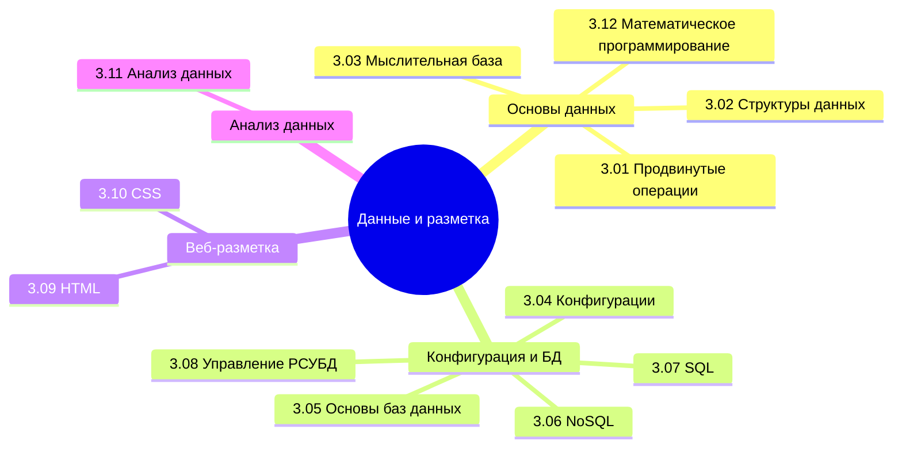

  ОБЯЗАТЕЛЬНО
  ДЛЯ НОВИЧКОВ

---

## О разделе

Вы ещё не забыли, что такое информация и данные? А типы данных? Если забыли, непременно вернитесь и повторите. Сейчас нам придётся заняться ими вплотную.

Вообще, лучше воспользуйтесь содержанием или перейдите к Базе знаний. Но для удобства, я размещу здесь ссылки на основные главы раздела:

---

## Продвинутые операции с данными

<ul>
  <li>Продвинутые операции с данными</li>
  <li>
    <ul>
<ul>
  <li>
    <ul>
      <li><a href="/encyclopedia/3-data-markup/3-01-prodvinutye-operatsii-s-dannymi/1">3-01-prodvinutye-operatsii-s-dannymi</a></li>
      <li><a href="/encyclopedia/3-data-markup/3-01-prodvinutye-operatsii-s-dannymi/111">3.01. Маршалинг и анмаршалинг</a></li>
      <li><a href="/encyclopedia/3-data-markup/3-01-prodvinutye-operatsii-s-dannymi/112">3.01. Адрес в памяти</a></li>
      <li><a href="/encyclopedia/3-data-markup/3-01-prodvinutye-operatsii-s-dannymi/113">3.01. Виды битов</a></li>
      <li><a href="/encyclopedia/3-data-markup/3-01-prodvinutye-operatsii-s-dannymi/998">3.01. Итоги</a></li>
      <li><a href="/encyclopedia/3-data-markup/3-01-prodvinutye-operatsii-s-dannymi/999">3.01. Чек-лист самопроверки</a></li>
    </ul>
  </li>
</ul>
    </ul>
  </li>
</ul>

---

## Структуры данных

<ul>
  <li>Структуры данных</li>
  <li>
    <ul>
<ul>
  <li>
    <ul>
      <li><a href="/encyclopedia/3-data-markup/3-02-struktury-dannyh/1">3-02-struktury-dannyh</a></li>
      <li><a href="/encyclopedia/3-data-markup/3-02-struktury-dannyh/11">3.02. История развития структур данных</a></li>
      <li><a href="/encyclopedia/3-data-markup/3-02-struktury-dannyh/12">3.02. Геометрические данные</a></li>
      <li><a href="/encyclopedia/3-data-markup/3-02-struktury-dannyh/2">3.02. Фундаментальные структуры данных и их реализация</a></li>
      <li><a href="/encyclopedia/3-data-markup/3-02-struktury-dannyh/3">3.02. Итоги</a></li>
      <li><a href="/encyclopedia/3-data-markup/3-02-struktury-dannyh/4">3.02. Чек-лист самопроверки</a></li>
    </ul>
  </li>
</ul>
    </ul>
  </li>
</ul>

---

## Мыслительная база

<ul>
  <li>Мыслительная база</li>
  <li>
    <ul>
<ul>
  <li>
    <ul>
      <li><a href="/encyclopedia/3-data-markup/3-03-myslitelnaya-baza/1">3.03. Когнитивистика</a></li>
      <li><a href="/encyclopedia/3-data-markup/3-03-myslitelnaya-baza/2">3.03. Ментальные модели</a></li>
      <li><a href="/encyclopedia/3-data-markup/3-03-myslitelnaya-baza/3">3-03-myslitelnaya-baza</a></li>
      <li><a href="/encyclopedia/3-data-markup/3-03-myslitelnaya-baza/4">3.03. Итоги</a></li>
      <li><a href="/encyclopedia/3-data-markup/3-03-myslitelnaya-baza/5">3.03. Чек-лист самопроверки</a></li>
    </ul>
  </li>
</ul>
    </ul>
  </li>
</ul>

---

## Математическое программирование

<ul>
  <li>Математическое программирование</li>
  <li>
    <ul>
<ul>
  <li>
    <ul>
      <li><a href="/encyclopedia/3-data-markup/3-12-matematicheskoe-programmirovanie/1">3.12. Введение и постановка</a></li>
      <li><a href="/encyclopedia/3-data-markup/3-12-matematicheskoe-programmirovanie/4">3.12. Симплекс-метод</a></li>
      <li><a href="/encyclopedia/3-data-markup/3-12-matematicheskoe-programmirovanie/7">3.12. Транспортная задача</a></li>
      <li><a href="/encyclopedia/3-data-markup/3-12-matematicheskoe-programmirovanie/998">3.12. Итоги</a></li>
    </ul>
  </li>
</ul>
    </ul>
  </li>
</ul>

---

## Конфигурации и данные

<ul>
  <li>Конфигурации и данные</li>
  <li>
    <ul>
<ul>
  <li>
    <ul>
      <li><a href="/encyclopedia/3-data-markup/3-04-konfiguratsii-i-dannye/1">3-04-konfiguratsii-i-dannye в тексте</a></li>
      <li><a href="/encyclopedia/3-data-markup/3-04-konfiguratsii-i-dannye/111">3.04. Текстовые данные</a></li>
      <li><a href="/encyclopedia/3-data-markup/3-04-konfiguratsii-i-dannye/112">3.04. Справочник по эмодзи</a></li>
      <li><a href="/encyclopedia/3-data-markup/3-04-konfiguratsii-i-dannye/113">3.04. Шрифты</a></li>
      <li><a href="/encyclopedia/3-data-markup/3-04-konfiguratsii-i-dannye/2">3.04. XML</a></li>
      <li><a href="/encyclopedia/3-data-markup/3-04-konfiguratsii-i-dannye/211">3.04. Справочник по XML</a></li>
      <li><a href="/encyclopedia/3-data-markup/3-04-konfiguratsii-i-dannye/212">3.04. Справочник по XSLT</a></li>
      <li><a href="/encyclopedia/3-data-markup/3-04-konfiguratsii-i-dannye/3">3.04. JSON</a></li>
      <li><a href="/encyclopedia/3-data-markup/3-04-konfiguratsii-i-dannye/4">3.04. YAML</a></li>
      <li><a href="/encyclopedia/3-data-markup/3-04-konfiguratsii-i-dannye/5">3.04. Markdown</a></li>
      <li><a href="/encyclopedia/3-data-markup/3-04-konfiguratsii-i-dannye/6">3.04. XAML</a></li>
      <li><a href="/encyclopedia/3-data-markup/3-04-konfiguratsii-i-dannye/98">3.04. Итоги</a></li>
      <li><a href="/encyclopedia/3-data-markup/3-04-konfiguratsii-i-dannye/99">3.04. Чек-лист самопроверки</a></li>
    </ul>
  </li>
</ul>
    </ul>
  </li>
</ul>

---

## Основы баз данных

<ul>
  <li>Основы баз данных</li>
  <li>
    <ul>
<ul>
  <li>
    <ul>
      <li><a href="/encyclopedia/3-data-markup/3-05-osnovy-baz-dannyh/1">3.05. Знакомство с базами данных</a></li>
      <li><a href="/encyclopedia/3-data-markup/3-05-osnovy-baz-dannyh/2">3.05. СУБД</a></li>
      <li><a href="/encyclopedia/3-data-markup/3-05-osnovy-baz-dannyh/6">3.05. Роль базы данных в организации</a></li>
      <li><a href="/encyclopedia/3-data-markup/3-05-osnovy-baz-dannyh/3">3.05. Как БД работает с данными</a></li>
      <li><a href="/encyclopedia/3-data-markup/3-05-osnovy-baz-dannyh/4">3.05. Теория данных</a></li>
      <li><a href="/encyclopedia/3-data-markup/3-05-osnovy-baz-dannyh/5">3.05. Двенадцать правил Кодда</a></li>
      <li><a href="/encyclopedia/3-data-markup/3-05-osnovy-baz-dannyh/11">3.05. Entity Relationship</a></li>
      <li><a href="/encyclopedia/3-data-markup/3-05-osnovy-baz-dannyh/7">3.05. Конкурентный доступ</a></li>
      <li><a href="/encyclopedia/3-data-markup/3-05-osnovy-baz-dannyh/8">3.05. Восстановление после сбоя</a></li>
      <li><a href="/encyclopedia/3-data-markup/3-05-osnovy-baz-dannyh/111">3.05. Data Governance</a></li>
      <li><a href="/encyclopedia/3-data-markup/3-05-osnovy-baz-dannyh/98">3.05. Итоги</a></li>
      <li><a href="/encyclopedia/3-data-markup/3-05-osnovy-baz-dannyh/99">3.05. Чек-лист самопроверки</a></li>
    </ul>
  </li>
</ul>
    </ul>
  </li>
</ul>

---

## NoSQL

<ul>
  <li>NoSQL</li>
  <li>
    <ul>
<ul>
  <li>
    <ul>
      <li><a href="/encyclopedia/3-data-markup/3-06-nosql/1">3.06. История NoSQL</a></li>
      <li><a href="/encyclopedia/3-data-markup/3-06-nosql/2">3.06. Основы NoSQL</a></li>
      <li><a href="/encyclopedia/3-data-markup/3-06-nosql/3">3.06. Знаки препинания</a></li>
      <li><a href="/encyclopedia/3-data-markup/3-06-nosql/4">3.06. MongoDB</a></li>
      <li><a href="/encyclopedia/3-data-markup/3-06-nosql/41">3.06. Справочник по MongoDB</a></li>
      <li><a href="/encyclopedia/3-data-markup/3-06-nosql/5">3.06. Redis</a></li>
      <li><a href="/encyclopedia/3-data-markup/3-06-nosql/51">3.06. Справочник по Redis</a></li>
      <li><a href="/encyclopedia/3-data-markup/3-06-nosql/6">3.06. Cassandra</a></li>
      <li><a href="/encyclopedia/3-data-markup/3-06-nosql/61">3.06. Справочник по Cassandra</a></li>
      <li><a href="/encyclopedia/3-data-markup/3-06-nosql/7">3.06. Графовые БД</a></li>
      <li><a href="/encyclopedia/3-data-markup/3-06-nosql/71">3.06. Справочник по Cypher</a></li>
      <li><a href="/encyclopedia/3-data-markup/3-06-nosql/8">3.06. Memcached</a></li>
      <li><a href="/encyclopedia/3-data-markup/3-06-nosql/81">3.06. Справочник по Memcached</a></li>
      <li><a href="/encyclopedia/3-data-markup/3-06-nosql/811">3.06. NewSQL системы</a></li>
      <li><a href="/encyclopedia/3-data-markup/3-06-nosql/812">3.06. Векторные базы данных</a></li>
      <li><a href="/encyclopedia/3-data-markup/3-06-nosql/98">3.06. Итоги</a></li>
      <li><a href="/encyclopedia/3-data-markup/3-06-nosql/99">3.06. Чек-лист самопроверки</a></li>
    </ul>
  </li>
</ul>
    </ul>
  </li>
</ul>

---

## SQL

<ul>
  <li>SQL</li>
  <li>
    <ul>
<ul>
  <li>
    <ul>
      <li><a href="/encyclopedia/3-data-markup/3-07-sql/1">3-07-sql</a></li>
      <li><a href="/encyclopedia/3-data-markup/3-07-sql/2">3.07. Как работает SQL</a></li>
      <li><a href="/encyclopedia/3-data-markup/3-07-sql/21">3.07. Как читать сложные SQL запросы</a></li>
      <li><a href="/encyclopedia/3-data-markup/3-07-sql/22">3.07. Типы SQL команд</a></li>
      <li><a href="/encyclopedia/3-data-markup/3-07-sql/3">3.07. Знаки препинания</a></li>
      <li><a href="/encyclopedia/3-data-markup/3-07-sql/33">3.07. Типы данных в SQL</a></li>
      <li><a href="/encyclopedia/3-data-markup/3-07-sql/4">3.07. Работа с СУБД</a></li>
      <li><a href="/encyclopedia/3-data-markup/3-07-sql/44">3.07. DDL в SQL</a></li>
      <li><a href="/encyclopedia/3-data-markup/3-07-sql/444">3.07. Ограничения в SQL</a></li>
      <li><a href="/encyclopedia/3-data-markup/3-07-sql/5">3.07. CRUD и DML</a></li>
      <li><a href="/encyclopedia/3-data-markup/3-07-sql/55">3.07. Алиасы и объединения</a></li>
      <li><a href="/encyclopedia/3-data-markup/3-07-sql/551">3.07. Общие табличные выражения</a></li>
      <li><a href="/encyclopedia/3-data-markup/3-07-sql/6">3.07. Другие операции в SQL</a></li>
      <li><a href="/encyclopedia/3-data-markup/3-07-sql/66">3.07. Сложные типы</a></li>
      <li><a href="/encyclopedia/3-data-markup/3-07-sql/7">3.07. Функции</a></li>
      <li><a href="/encyclopedia/3-data-markup/3-07-sql/77">3.07. Транзакции и блокировки</a></li>
      <li><a href="/encyclopedia/3-data-markup/3-07-sql/8">3.07. Представления SQL</a></li>
      <li><a href="/encyclopedia/3-data-markup/3-07-sql/88">3.07. Процедуры SQL</a></li>
      <li><a href="/encyclopedia/3-data-markup/3-07-sql/881">3.07. Оптимизация</a></li>
      <li><a href="/encyclopedia/3-data-markup/3-07-sql/882">3.07. Процедурные расширения</a></li>
      <li><a href="/encyclopedia/3-data-markup/3-07-sql/8821">3.07. Подсказки оптимизатора запросов</a></li>
      <li><a href="/encyclopedia/3-data-markup/3-07-sql/883">3.07. Справочник по SQL</a></li>
      <li><a href="/encyclopedia/3-data-markup/3-07-sql/884">3.07. Сложные индексы</a></li>
      <li><a href="/encyclopedia/3-data-markup/3-07-sql/885">3.07. Шпаргалка с типичными задачами по SQL</a></li>
      <li><a href="/encyclopedia/3-data-markup/3-07-sql/998">3.07. Итоги</a></li>
      <li><a href="/encyclopedia/3-data-markup/3-07-sql/999">3.07. Чек-лист самопроверки</a></li>
    </ul>
  </li>
</ul>
    </ul>
  </li>
</ul>

---

## Управление РСУБД

<ul>
  <li>Управление РСУБД</li>
  <li>
    <ul>
<ul>
  <li>
    <ul>
      <li><a href="/encyclopedia/3-data-markup/3-08-upravlenie-rsubd/1">3.08. Управление РСУБД</a></li>
      <li><a href="/encyclopedia/3-data-markup/3-08-upravlenie-rsubd/3">3.08. Администрирование БД в облаке</a></li>
      <li><a href="/encyclopedia/3-data-markup/3-08-upravlenie-rsubd/2">3.08. Справочник по PostgreSQL</a></li>
      <li><a href="/encyclopedia/3-data-markup/3-08-upravlenie-rsubd/211">3.08. Справочник по MySQL</a></li>
      <li><a href="/encyclopedia/3-data-markup/3-08-upravlenie-rsubd/212">3.08. Справочник по Microsoft SQL Server</a></li>
      <li><a href="/encyclopedia/3-data-markup/3-08-upravlenie-rsubd/213">3.08. Справочник по Oracle DB</a></li>
      <li><a href="/encyclopedia/3-data-markup/3-08-upravlenie-rsubd/998">3.08. Итоги</a></li>
      <li><a href="/encyclopedia/3-data-markup/3-08-upravlenie-rsubd/999">3.08. Чек-лист самопроверки</a></li>
    </ul>
  </li>
</ul>
    </ul>
  </li>
</ul>

---

## HTML

<ul>
  <li>HTML</li>
  <li>
    <ul>
<ul>
  <li>
    <ul>
      <li><a href="/encyclopedia/3-data-markup/3-09-html/1">3-09-html</a></li>
      <li><a href="/encyclopedia/3-data-markup/3-09-html/2">3.09. Основные теги</a></li>
      <li><a href="/encyclopedia/3-data-markup/3-09-html/21">3.09. Справочник по HTML</a></li>
      <li><a href="/encyclopedia/3-data-markup/3-09-html/22">3.09. Игры на HTML5</a></li>
      <li><a href="/encyclopedia/3-data-markup/3-09-html/3">3.09. Практика</a></li>
      <li><a href="/encyclopedia/3-data-markup/3-09-html/998">3.09. Итоги</a></li>
      <li><a href="/encyclopedia/3-data-markup/3-09-html/999">3.09. Чек-лист самопроверки</a></li>
    </ul>
  </li>
</ul>
    </ul>
  </li>
</ul>

---

## CSS

<ul>
  <li>CSS</li>
  <li>
    <ul>
<ul>
  <li>
    <ul>
      <li><a href="/encyclopedia/3-data-markup/3-10-css/1">3-10-css</a></li>
      <li><a href="/encyclopedia/3-data-markup/3-10-css/111">3.10. Блочная модель и каскадность</a></li>
      <li><a href="/encyclopedia/3-data-markup/3-10-css/112">3.10. Работа с CSS</a></li>
      <li><a href="/encyclopedia/3-data-markup/3-10-css/2">3.10. Flex и Grid</a></li>
      <li><a href="/encyclopedia/3-data-markup/3-10-css/3">3.10. Адаптивность</a></li>
      <li><a href="/encyclopedia/3-data-markup/3-10-css/4">3.10. Знаки препинания</a></li>
      <li><a href="/encyclopedia/3-data-markup/3-10-css/5">3.10. Псевдо-селекторы</a></li>
      <li><a href="/encyclopedia/3-data-markup/3-10-css/6">3.10. Анимации и трансформации</a></li>
      <li><a href="/encyclopedia/3-data-markup/3-10-css/7">3.10. Работа с CSS</a></li>
      <li><a href="/encyclopedia/3-data-markup/3-10-css/71">3.10. Справочник по CSS</a></li>
      <li><a href="/encyclopedia/3-data-markup/3-10-css/8">3.10. Практика</a></li>
      <li><a href="/encyclopedia/3-data-markup/3-10-css/998">3.10. Итоги</a></li>
      <li><a href="/encyclopedia/3-data-markup/3-10-css/999">3.10. Чек-лист самопроверки</a></li>
    </ul>
  </li>
</ul>
    </ul>
  </li>
</ul>

---

## Анализ данных

<ul>
  <li>Анализ данных</li>
  <li>
    <ul>
<ul>
  <li>
    <ul>
      <li><a href="/encyclopedia/3-data-markup/3-11-analiz-dannyh/1">3-11-analiz-dannyh</a></li>
      <li><a href="/encyclopedia/3-data-markup/3-11-analiz-dannyh/11">3.11. Дата майнинг</a></li>
      <li><a href="/encyclopedia/3-data-markup/3-11-analiz-dannyh/12">3.11. Фиксация на цифрах и ложь в статистике</a></li>
      <li><a href="/encyclopedia/3-data-markup/3-11-analiz-dannyh/2">3.11. Основы статистики</a></li>
      <li><a href="/encyclopedia/3-data-markup/3-11-analiz-dannyh/41">3.11. Итоги</a></li>
      <li><a href="/encyclopedia/3-data-markup/3-11-analiz-dannyh/42">3.11. Чек-лист самопроверки</a></li>
    </ul>
  </li>
</ul>
    </ul>
  </li>
</ul>

Представьте, что человек лишается абсолютно всех своих знаний, информации и данных (воспоминаний, мыслей и прочих признаков мышления), но сохраняет возможность функционировать - он может двигаться, дышать, прыгать. Чем он будет являться без этого? Пустой машиной. Компьютер тоже генерирует сигналы, которые можно направлять для любых мыслимых действий - от обычного включения компьютера до запуска ядерных боеголовок. И чтобы он был не пустым инструментом, он должен генерировать сигналы и манипулировать информацией. И словно человеку для отличия от машины нужны мысли, знания, воспоминания, машине нужны данные.

Этими данными является абсолютно всё, что вы видите вокруг в цифровом мире - тексты, картинки, кнопки, формы, таблицы, настройки, логи, запросы. Данные хранятся, передаются, обрабатываются, структурируются. И вроде бы логично, что кто-то пишет книгу, кто-то её читает, и так же с данными - кто-то их создаёт, кто-то использует.

Воспринимайте всё вокруг как источники данных. Оглянитесь - сколько устройств у вас в доме? Может быть, у вас есть не только смартфон и компьютер, но и смарт-телевизор, умные колонки или смарт-часы? Представьте, что все они собирают данные. Фитнес-браслеты обладают полноценной операционной системой, системой хранения и обработки данных, и собирают на основе непростой логики фиксации сигналов данные о том, сколько человек сделал шагов за день. А потом они подключаются по каналу Bluetooth со смартфоном, передавая ему эти данные, которые уже в дальнейшем переходят в сеть, а компании, обладающие серверами, куда всё отправляется, получают возможность манипулировать этими данными. Миллиарды людей шлют свою информацию на центральные точки аккумуляции данных, где открывается новая возможность - анализ данных.

Если взять те же данные о шагах (всего лишь!), в комбинации с информацией, предоставленной смартфоном (страна проживания, даты, возможно даже пол и прочие личные данные), корпорация получает возможность проанализировать и выяснить, в каких странах чаще ходят, какой пол чаще двигается, и так далее. На основе этой информации более активным людям можно продвигать по районам проживания определенные товары, которые характерны для такой категории. Но это лишь один пример с шагами. А если собирать больше данных?

Теперь задумайтесь - корпорации знают, где и как мы живём, наш режим, вкусы, предпочтения, привычки, наше семейное положение, проблемы, и все данные мы добровольно им дарим своими телефонными разговорами, местоположением, чатам, и прочей, казалось бы, конфиденциальной информацией. И нет, корпорациям плевать на ваши политические взгляды или тайные секреты. Им важнее другое.

Куда вы ходите каждый день? Маршрут дом-работа. А по выходным, допустим, выходите в бар. По пути с работы заглядываете в определенный магазин. Покупаете определенные товары. О вас знают всё. Но этих данных недостаточно, и представим, что таких как вы, тысячи. И все заходят в определённый магазин, который тоже оснащён системой с каталогом товаров, где всё-всё записано в электронных "журналах". Итого, корпорация, владеющая сетью этих магазинов, знает, что в таком-то районе города люди чаще покупают яйца и творог, а в другом районе больше предпочитают алкоголь. И корпорация может манипулировать объёмами поставки на основе автоматического сбора статистики, и больше нужно спрашивать кассиров "ну чё как идут продажи?".

И это лишь минимальный и случайный пример. Если работать с более профессиональным уровнем, касаясь машинного прогнозирования, продвинутого анализа больших данных и т.д., то там и вовсе всё куда круче.

Такова работа с данными. А строится она на единой структуре, принятой во всём мире - типизации и структуризации данных.

Одним из видов данных является код веб-страниц. Это веб-сайты, которые мы ежедневно открываем. Они построены на основе специальной разметки, которая превращает данные в структурированный текст, который понимает браузер, выстраивая красивую страничку.

И здесь мы должны изучить всё, что касается страниц и данных. Нужно понять, как работает SQL, что такое NoSQL, как с ними работать, а также разобраться в основе фронта - HTML и CSS. И лишь после них погрузимся в анализ данных, Big Data, интернет вещей и Data Science.

Для аналитиков. Очень важно хорошо разобраться в данных и научиться извлекать данные при работе с первичным набором информации. В качестве источника может быть много чего - статистика, датасеты, документация, письма от инициаторов, либо вовсе результаты опросов, встреч, интервью. Всё это необходимо уметь собрать, структурировать, разбить по категориям, выстроить связи и логические цепочки, и всё это будет представлять собой анализ. Как в фильмах про детективов, где сначала собирается набор улик и доказательств, которые крепятся на доску, и потом выстраивается связь между ними, после чего, в совокупности, открывается идеальная картина преступления. Это и есть аналитика, которая требует "разобраться", поставить правильные вопросы и получить правильные ответы. Поэтому тема данных очень важна.
---
